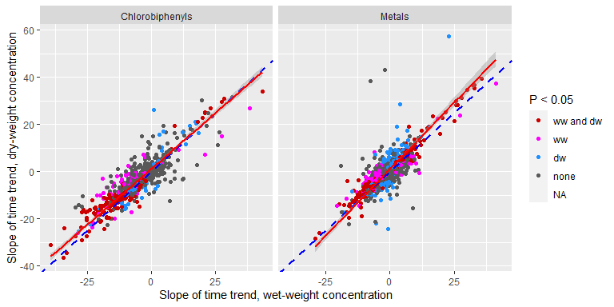
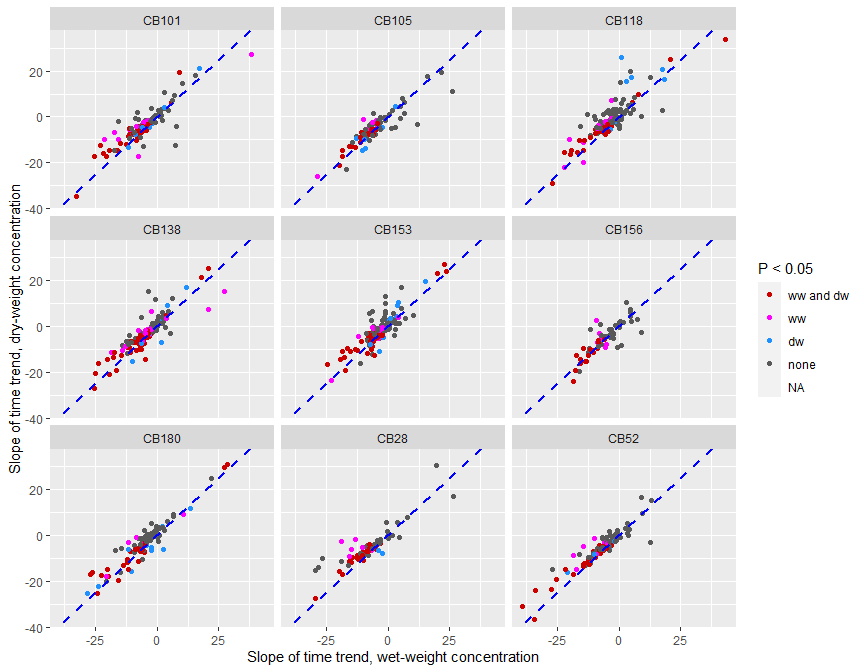
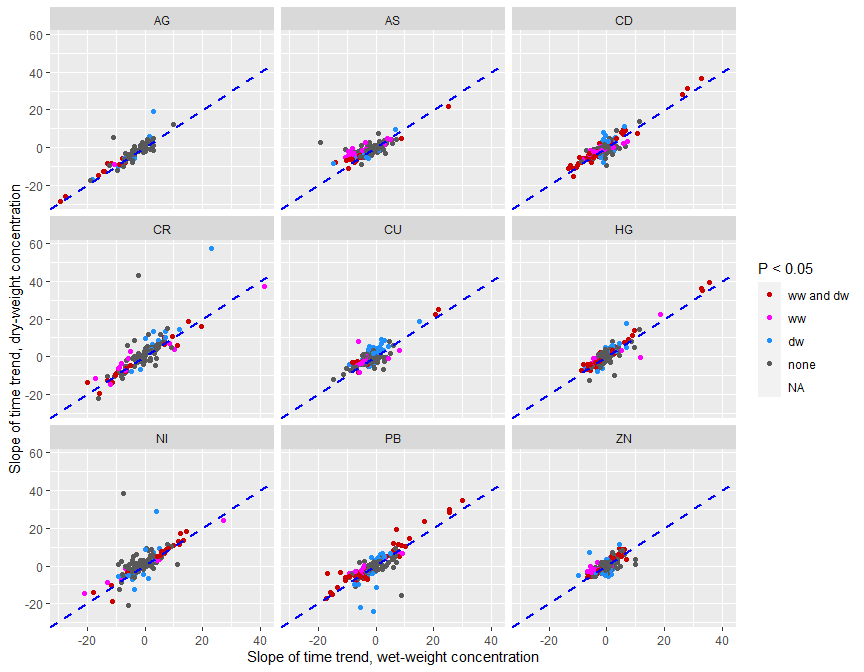

## Statistics   
All statistics are for blue mussel   

### Overview     
Number of blue mussel time series per country    

```
##                                 country
## determinand_group                Belgium Denmark Faroe Islands France Germany
##   Biological effects (other)           0       0             0      0       0
##   Chlorobiphenyls                     27       5             0    408      42
##   Dioxins                              0       9             0     72       0
##   Imposex                              0       0             0      0       0
##   Metals                              24     155             0    411      24
##   Organobromines (other)               0       0             0    140      24
##   Organochlorines (other)             12       0             0    108      12
##   Organofluorines                      0       0             0     23       0
##   Organotins                          18      35             0     90       0
##   PAH alkylated compounds              0      21             0      0       0
##   PAH metabolites                      0       0             0      0       0
##   PAH parent compounds                39     222             0    526      73
##   Polybrominated diphenyl ethers      30       0             0    216      60
##                                 country
## determinand_group                Iceland Ireland Norway Spain Sweden
##   Biological effects (other)           0       0      0    23      0
##   Chlorobiphenyls                    108     417    259   206     14
##   Dioxins                              0      24      0     0      0
##   Imposex                              0       0      0     0      0
##   Metals                              84     517    398   138     22
##   Organobromines (other)               0       0     63     0      2
##   Organochlorines (other)             48     180     40    91      8
##   Organofluorines                      0       0      9     0      0
##   Organotins                           0       0     31     0      0
##   PAH alkylated compounds              0       0      0     0      0
##   PAH metabolites                      0       0      0     0      0
##   PAH parent compounds               168     571    175   230     26
##   Polybrominated diphenyl ethers      36     315    116   186     12
##                                 country
## determinand_group                The Netherlands United Kingdom
##   Biological effects (other)                   0             63
##   Chlorobiphenyls                              9            545
##   Dioxins                                      0              0
##   Imposex                                      0              0
##   Metals                                       8            752
##   Organobromines (other)                       1              0
##   Organochlorines (other)                      4            127
##   Organofluorines                              1              0
##   Organotins                                   6             14
##   PAH alkylated compounds                      0            278
##   PAH metabolites                              0              0
##   PAH parent compounds                        12           1004
##   Polybrominated diphenyl ethers               9            175
```

### Number of significant linear trends   
For metals and chlorobiphenyls separately   
* Row 1/2: whether time trend of w.w. concentrations was significant on the 0.05 level     
* Column 1/2: whether time trend of d.w. concentrations was significant on the 0.05 level     
<table class='gmisc_table' style='border-collapse: collapse; margin-top: 1em; margin-bottom: 1em;' >
<thead>
<tr><td colspan='3' style='text-align: left;'>
Metals</td></tr>
<tr>
<th style='border-top: 2px solid grey;'></th>
<th colspan='2' style='font-weight: normal; border-bottom: 1px solid grey; border-top: 2px solid grey; text-align: center;'>p_linear_trend_dw <= 0.05</th>
</tr>
<tr><th style='border-bottom: 1px solid grey;'></th>
<th style='font-weight: normal; border-bottom: 1px solid grey; text-align: center;'>FALSE</th>
<th style='font-weight: normal; border-bottom: 1px solid grey; text-align: center;'>TRUE</th>
</tr>
</thead>
<tbody> 
<tr><td colspan='3' style='font-weight: normal;'>p_linear_trend_ww <= 0.05</td></tr>
<tr>
<td style='text-align: left;'>&nbsp;&nbsp;FALSE</td>
<td style='text-align: center;'>817</td>
<td style='text-align: center;'>204</td>
</tr>
<tr>
<td style='border-bottom: 2px solid grey; text-align: left;'>&nbsp;&nbsp;TRUE</td>
<td style='border-bottom: 2px solid grey; text-align: center;'>163</td>
<td style='border-bottom: 2px solid grey; text-align: center;'>288</td>
</tr>
</tbody>
</table><table class='gmisc_table' style='border-collapse: collapse; margin-top: 1em; margin-bottom: 1em;' >
<thead>
<tr><td colspan='3' style='text-align: left;'>
Chlorobiphenyls</td></tr>
<tr>
<th style='border-top: 2px solid grey;'></th>
<th colspan='2' style='font-weight: normal; border-bottom: 1px solid grey; border-top: 2px solid grey; text-align: center;'>p_linear_trend_dw <= 0.05</th>
</tr>
<tr><th style='border-bottom: 1px solid grey;'></th>
<th style='font-weight: normal; border-bottom: 1px solid grey; text-align: center;'>FALSE</th>
<th style='font-weight: normal; border-bottom: 1px solid grey; text-align: center;'>TRUE</th>
</tr>
</thead>
<tbody> 
<tr><td colspan='3' style='font-weight: normal;'>p_linear_trend_ww <= 0.05</td></tr>
<tr>
<td style='text-align: left;'>&nbsp;&nbsp;FALSE</td>
<td style='text-align: center;'>443</td>
<td style='text-align: center;'>56</td>
</tr>
<tr>
<td style='border-bottom: 2px solid grey; text-align: left;'>&nbsp;&nbsp;TRUE</td>
<td style='border-bottom: 2px solid grey; text-align: center;'>110</td>
<td style='border-bottom: 2px solid grey; text-align: center;'>368</td>
</tr>
</tbody>
</table><table class='gmisc_table' style='border-collapse: collapse; margin-top: 1em; margin-bottom: 1em;' >
<thead>
<tr><td colspan='3' style='text-align: left;'>
Polybrominated diphenyl ethers</td></tr>
<tr>
<th style='border-top: 2px solid grey;'></th>
<th colspan='2' style='font-weight: normal; border-bottom: 1px solid grey; border-top: 2px solid grey; text-align: center;'>p_linear_trend_dw <= 0.05</th>
</tr>
<tr><th style='border-bottom: 1px solid grey;'></th>
<th style='font-weight: normal; border-bottom: 1px solid grey; text-align: center;'>FALSE</th>
<th style='font-weight: normal; border-bottom: 1px solid grey; text-align: center;'>TRUE</th>
</tr>
</thead>
<tbody> 
<tr><td colspan='3' style='font-weight: normal;'>p_linear_trend_ww <= 0.05</td></tr>
<tr>
<td style='text-align: left;'>&nbsp;&nbsp;FALSE</td>
<td style='text-align: center;'>92</td>
<td style='text-align: center;'>17</td>
</tr>
<tr>
<td style='border-bottom: 2px solid grey; text-align: left;'>&nbsp;&nbsp;TRUE</td>
<td style='border-bottom: 2px solid grey; text-align: center;'>32</td>
<td style='border-bottom: 2px solid grey; text-align: center;'>35</td>
</tr>
</tbody>
</table><table class='gmisc_table' style='border-collapse: collapse; margin-top: 1em; margin-bottom: 1em;' >
<thead>
<tr><td colspan='3' style='text-align: left;'>
PAH parent compounds</td></tr>
<tr>
<th style='border-top: 2px solid grey;'></th>
<th colspan='2' style='font-weight: normal; border-bottom: 1px solid grey; border-top: 2px solid grey; text-align: center;'>p_linear_trend_dw <= 0.05</th>
</tr>
<tr><th style='border-bottom: 1px solid grey;'></th>
<th style='font-weight: normal; border-bottom: 1px solid grey; text-align: center;'>FALSE</th>
<th style='font-weight: normal; border-bottom: 1px solid grey; text-align: center;'>TRUE</th>
</tr>
</thead>
<tbody> 
<tr><td colspan='3' style='font-weight: normal;'>p_linear_trend_ww <= 0.05</td></tr>
<tr>
<td style='text-align: left;'>&nbsp;&nbsp;FALSE</td>
<td style='text-align: center;'>677</td>
<td style='text-align: center;'>78</td>
</tr>
<tr>
<td style='border-bottom: 2px solid grey; text-align: left;'>&nbsp;&nbsp;TRUE</td>
<td style='border-bottom: 2px solid grey; text-align: center;'>74</td>
<td style='border-bottom: 2px solid grey; text-align: center;'>197</td>
</tr>
</tbody>
</table><table class='gmisc_table' style='border-collapse: collapse; margin-top: 1em; margin-bottom: 1em;' >
<thead>
<tr><td colspan='3' style='text-align: left;'>
Organochlorines (other)</td></tr>
<tr>
<th style='border-top: 2px solid grey;'></th>
<th colspan='2' style='font-weight: normal; border-bottom: 1px solid grey; border-top: 2px solid grey; text-align: center;'>p_linear_trend_dw <= 0.05</th>
</tr>
<tr><th style='border-bottom: 1px solid grey;'></th>
<th style='font-weight: normal; border-bottom: 1px solid grey; text-align: center;'>FALSE</th>
<th style='font-weight: normal; border-bottom: 1px solid grey; text-align: center;'>TRUE</th>
</tr>
</thead>
<tbody> 
<tr><td colspan='3' style='font-weight: normal;'>p_linear_trend_ww <= 0.05</td></tr>
<tr>
<td style='text-align: left;'>&nbsp;&nbsp;FALSE</td>
<td style='text-align: center;'>152</td>
<td style='text-align: center;'>13</td>
</tr>
<tr>
<td style='border-bottom: 2px solid grey; text-align: left;'>&nbsp;&nbsp;TRUE</td>
<td style='border-bottom: 2px solid grey; text-align: center;'>24</td>
<td style='border-bottom: 2px solid grey; text-align: center;'>48</td>
</tr>
</tbody>
</table>


### Trends, up & down 
<table class='gmisc_table' style='border-collapse: collapse; margin-top: 1em; margin-bottom: 1em;' >
<thead>
<tr>
<th style='border-top: 2px solid grey;'></th>
<th colspan='5' style='font-weight: normal; border-bottom: 1px solid grey; border-top: 2px solid grey; text-align: center;'>determinand_group</th>
</tr>
<tr><th style='border-bottom: 1px solid grey;'></th>
<th style='font-weight: normal; border-bottom: 1px solid grey; text-align: center;'>Chlorobiphenyls</th>
<th style='font-weight: normal; border-bottom: 1px solid grey; text-align: center;'>Metals</th>
<th style='font-weight: normal; border-bottom: 1px solid grey; text-align: center;'>Organochlorines (other)</th>
<th style='font-weight: normal; border-bottom: 1px solid grey; text-align: center;'>PAH parent compounds</th>
<th style='font-weight: normal; border-bottom: 1px solid grey; text-align: center;'>Polybrominated diphenyl ethers</th>
</tr>
</thead>
<tbody> 
<tr><td colspan='6' style='font-weight: normal;'>Trend</td></tr>
<tr>
<td style='text-align: left;'>&nbsp;&nbsp;declining (ww & dw)</td>
<td style='text-align: center;'>354</td>
<td style='text-align: center;'>183</td>
<td style='text-align: center;'>43</td>
<td style='text-align: center;'>162</td>
<td style='text-align: center;'>33</td>
</tr>
<tr>
<td style='text-align: left;'>&nbsp;&nbsp;declining (ww only)</td>
<td style='text-align: center;'>104</td>
<td style='text-align: center;'>133</td>
<td style='text-align: center;'>20</td>
<td style='text-align: center;'>56</td>
<td style='text-align: center;'>27</td>
</tr>
<tr>
<td style='text-align: left;'>&nbsp;&nbsp;declining (dw only)</td>
<td style='text-align: center;'>37</td>
<td style='text-align: center;'>81</td>
<td style='text-align: center;'>11</td>
<td style='text-align: center;'>52</td>
<td style='text-align: center;'>12</td>
</tr>
<tr>
<td style='text-align: left;'>&nbsp;&nbsp;increasing (ww & dw)</td>
<td style='text-align: center;'>14</td>
<td style='text-align: center;'>103</td>
<td style='text-align: center;'>5</td>
<td style='text-align: center;'>33</td>
<td style='text-align: center;'>2</td>
</tr>
<tr>
<td style='text-align: left;'>&nbsp;&nbsp;increasing (ww only)</td>
<td style='text-align: center;'>6</td>
<td style='text-align: center;'>30</td>
<td style='text-align: center;'>4</td>
<td style='text-align: center;'>18</td>
<td style='text-align: center;'>5</td>
</tr>
<tr>
<td style='text-align: left;'>&nbsp;&nbsp;increasing (dw only)</td>
<td style='text-align: center;'>19</td>
<td style='text-align: center;'>123</td>
<td style='text-align: center;'>2</td>
<td style='text-align: center;'>26</td>
<td style='text-align: center;'>5</td>
</tr>
<tr>
<td style='text-align: left;'>&nbsp;&nbsp;declining ww, increasing dw</td>
<td style='text-align: center;'>0</td>
<td style='text-align: center;'>2</td>
<td style='text-align: center;'>0</td>
<td style='text-align: center;'>1</td>
<td style='text-align: center;'>0</td>
</tr>
<tr>
<td style='text-align: left;'>&nbsp;&nbsp;increasing ww, declining dw</td>
<td style='text-align: center;'>0</td>
<td style='text-align: center;'>0</td>
<td style='text-align: center;'>0</td>
<td style='text-align: center;'>1</td>
<td style='text-align: center;'>0</td>
</tr>
<tr>
<td style='border-bottom: 2px solid grey; text-align: left;'>&nbsp;&nbsp;no trend (ww & dw)</td>
<td style='border-bottom: 2px solid grey; text-align: center;'>443</td>
<td style='border-bottom: 2px solid grey; text-align: center;'>817</td>
<td style='border-bottom: 2px solid grey; text-align: center;'>152</td>
<td style='border-bottom: 2px solid grey; text-align: center;'>677</td>
<td style='border-bottom: 2px solid grey; text-align: center;'>92</td>
</tr>
</tbody>
</table>


## Plots of slope of linear trends   

X axis: Slope of time trend (i.e., change per year), wet-weight concentration   
Y axis: Slope of time trend (i.e., change per year), wet-weight concentration   

* Red line: Regression line (red) calculated using Deming (orthogonal) regression   
* Blue dotted line: 1:1 line (same trend using w.w. and d.w. concentration)        

### Overall per group   
<!-- -->


## Individual compounds {.tabset }  

* Blue dotted line: 1:1 line (same trend using w.w. and d.w. concentration)        


### PCBs
<!-- -->

### PCBs (interactive)
<!--html_preserve--><div id="htmlwidget-71e61b17a66fdf33944f" style="width:672px;height:480px;" class="plotly html-widget"></div>
<script type="application/json" data-for="htmlwidget-71e61b17a66fdf33944f">{"x":{"data":[{"x":[-5.4,5.8,-5.9,-5.7,-8.2,-10.9,-8.4,-7.8,-7.4,-8.9,9.1,-3.3,-6.2,-3.4,-4.1,-4.7,-3.1,-6.1,-3.9,-8,-7.8,-3.2,-9.2,-6.1,-6.3,-7.2,-5.1,-4.4,-4.5,-6.6,-20.8,-9.6,-11.6,-16.3,-7.6,-15,-8.5,-32.9,-5.3,-3.8,-21.8,-25.5,-12.5,-4.4,-5.1,-8.2,-5.2,-23.2,-7.4,-7.9,-8.8,-8.3,-6.2,-11.2,-19.2],"y":[-5.9,6.4,-6.3,-4.1,-5.9,-7.1,-7,-4.3,-5.5,-7.2,19.4,-2.2,-6.2,-3.6,-3.9,-4.6,-3,-4.7,-3.1,-5.1,-6.7,-2.7,-7.6,-4.7,-4.5,-5.1,-2.7,-5.2,-5,-6.6,-17.3,-7.1,-8.3,-14.7,-7.2,-11.5,-10.1,-34.4,-3.6,-3.4,-15.9,-17.1,-12.1,-5.9,-5.2,-8.9,-4.8,-12.2,-7.7,-8.3,-7,-7.2,-4.1,-5.2,-14.5],"text":["P < 0.05: ww and dw<br />linear_trend_ww:  -5.4<br />linear_trend_dw:  -5.9<br />Iceland 2954 Hvitanes Hvalfjordur","P < 0.05: ww and dw<br />linear_trend_ww:   5.8<br />linear_trend_dw:   6.4<br />Iceland 2955 Mjoifjordur (Dalatangi)","P < 0.05: ww and dw<br />linear_trend_ww:  -5.9<br />linear_trend_dw:  -6.3<br />Iceland 2963 Straumur Straumsvik","P < 0.05: ww and dw<br />linear_trend_ww:  -5.7<br />linear_trend_dw:  -4.1<br />France 1316 Antifer - digue","P < 0.05: ww and dw<br />linear_trend_ww:  -8.2<br />linear_trend_dw:  -5.9<br />France 1436 Cap de la Hève","P < 0.05: ww and dw<br />linear_trend_ww: -10.9<br />linear_trend_dw:  -7.1<br />France 1581 Grande rade de Cherbourg","P < 0.05: ww and dw<br />linear_trend_ww:  -8.4<br />linear_trend_dw:  -7.0<br />France 1721 Le Moulard","P < 0.05: ww and dw<br />linear_trend_ww:  -7.8<br />linear_trend_dw:  -4.3<br />France 2024 Ouistreham","P < 0.05: ww and dw<br />linear_trend_ww:  -7.4<br />linear_trend_dw:  -5.5<br />France 1210 Port en Bessin","P < 0.05: ww and dw<br />linear_trend_ww:  -8.9<br />linear_trend_dw:  -7.2<br />France 1848 Villerville","P < 0.05: ww and dw<br />linear_trend_ww:   9.1<br />linear_trend_dw:  19.4<br />United Kingdom 7238 Forth_KinghornLeithDocks_sh02","P < 0.05: ww and dw<br />linear_trend_ww:  -3.3<br />linear_trend_dw:  -2.2<br />Norway 4682 22A Espevær (west)","P < 0.05: ww and dw<br />linear_trend_ww:  -6.2<br />linear_trend_dw:  -6.2<br />Norway 4688 56A Kvalnes","P < 0.05: ww and dw<br />linear_trend_ww:  -3.4<br />linear_trend_dw:  -3.6<br />Norway 4690 57A Krossanes","P < 0.05: ww and dw<br />linear_trend_ww:  -4.1<br />linear_trend_dw:  -3.9<br />Norway 4689 65A Vikingneset","P < 0.05: ww and dw<br />linear_trend_ww:  -4.7<br />linear_trend_dw:  -4.6<br />Norway 4852 69A Lille Terøy","P < 0.05: ww and dw<br />linear_trend_ww:  -3.1<br />linear_trend_dw:  -3.0<br />Norway 4954 30A Gressholmen","P < 0.05: ww and dw<br />linear_trend_ww:  -6.1<br />linear_trend_dw:  -4.7<br />Norway 4972 35A Mølen","P < 0.05: ww and dw<br />linear_trend_ww:  -3.9<br />linear_trend_dw:  -3.1<br />Norway 5104 71A Bjørkøya (Risøyodden)","P < 0.05: ww and dw<br />linear_trend_ww:  -8.0<br />linear_trend_dw:  -5.1<br />Norway 5019 I023 Singlekalven (south)","P < 0.05: ww and dw<br />linear_trend_ww:  -7.8<br />linear_trend_dw:  -6.7<br />Norway 5020 I024 Kirkøy (north west)","P < 0.05: ww and dw<br />linear_trend_ww:  -3.2<br />linear_trend_dw:  -2.7<br />Norway 5025 I133 Odderø (west)","P < 0.05: ww and dw<br />linear_trend_ww:  -9.2<br />linear_trend_dw:  -7.6<br />Norway 5030 I301 Akershuskaia","P < 0.05: ww and dw<br />linear_trend_ww:  -6.1<br />linear_trend_dw:  -4.7<br />Norway 5031 I304 Gåsøya","P < 0.05: ww and dw<br />linear_trend_ww:  -6.3<br />linear_trend_dw:  -4.5<br />Norway 5032 I306 Håøya","P < 0.05: ww and dw<br />linear_trend_ww:  -7.2<br />linear_trend_dw:  -5.1<br />Norway 5033 I307 Ramtonholmen","P < 0.05: ww and dw<br />linear_trend_ww:  -5.1<br />linear_trend_dw:  -2.7<br />Norway 5035 I712 Gjemesholmen","P < 0.05: ww and dw<br />linear_trend_ww:  -4.4<br />linear_trend_dw:  -5.2<br />Belgium 3 DVZ_KNO","P < 0.05: ww and dw<br />linear_trend_ww:  -4.5<br />linear_trend_dw:  -5.0<br />Belgium 4 DVZ_NWP","P < 0.05: ww and dw<br />linear_trend_ww:  -6.6<br />linear_trend_dw:  -6.6<br />Belgium 6 DVZ_OST","P < 0.05: ww and dw<br />linear_trend_ww: -20.8<br />linear_trend_dw: -17.3<br />France 1802 St Michel en Grève","P < 0.05: ww and dw<br />linear_trend_ww:  -9.6<br />linear_trend_dw:  -7.1<br />Ireland 3305 Glengariff","P < 0.05: ww and dw<br />linear_trend_ww: -11.6<br />linear_trend_dw:  -8.3<br />Ireland 3366 Kilmakillogue","P < 0.05: ww and dw<br />linear_trend_ww: -16.3<br />linear_trend_dw: -14.7<br />Ireland 3395 Ringaskiddy","P < 0.05: ww and dw<br />linear_trend_ww:  -7.6<br />linear_trend_dw:  -7.2<br />Ireland 3396 Roaringwater Bay Inner","P < 0.05: ww and dw<br />linear_trend_ww: -15.0<br />linear_trend_dw: -11.5<br />Ireland 3365 Killary Harbour Inner","P < 0.05: ww and dw<br />linear_trend_ww:  -8.5<br />linear_trend_dw: -10.1<br />Ireland 3400 Rosses Point","P < 0.05: ww and dw<br />linear_trend_ww: -32.9<br />linear_trend_dw: -34.4<br />United Kingdom 8084 MinchMalin_LochEwe_sh03","P < 0.05: ww and dw<br />linear_trend_ww:  -5.3<br />linear_trend_dw:  -3.6<br />Ireland 3422 Sutton","P < 0.05: ww and dw<br />linear_trend_ww:  -3.8<br />linear_trend_dw:  -3.4<br />United Kingdom 7980 IrishSea_LiverpoolBay_sh01","P < 0.05: ww and dw<br />linear_trend_ww: -21.8<br />linear_trend_dw: -15.9<br />Spain 5370 MASAVI","P < 0.05: ww and dw<br />linear_trend_ww: -25.5<br />linear_trend_dw: -17.1<br />Spain 5711 MASGIJ","P < 0.05: ww and dw<br />linear_trend_ww: -12.5<br />linear_trend_dw: -12.1<br />Spain 5714 MASLUA","P < 0.05: ww and dw<br />linear_trend_ww:  -4.4<br />linear_trend_dw:  -5.9<br />Spain 5724 MCASPA","P < 0.05: ww and dw<br />linear_trend_ww:  -5.1<br />linear_trend_dw:  -5.2<br />Spain 5725 MCASPE","P < 0.05: ww and dw<br />linear_trend_ww:  -8.2<br />linear_trend_dw:  -8.9<br />Spain 5722 MCASVI","P < 0.05: ww and dw<br />linear_trend_ww:  -5.2<br />linear_trend_dw:  -4.8<br />Spain 5705 MGAARO","P < 0.05: ww and dw<br />linear_trend_ww: -23.2<br />linear_trend_dw: -12.2<br />Spain 5359 MGACHO","P < 0.05: ww and dw<br />linear_trend_ww:  -7.4<br />linear_trend_dw:  -7.7<br />Spain 5709 MGACOR","P < 0.05: ww and dw<br />linear_trend_ww:  -7.9<br />linear_trend_dw:  -8.3<br />Spain 5704 MGACTC","P < 0.05: ww and dw<br />linear_trend_ww:  -8.8<br />linear_trend_dw:  -7.0<br />Spain 5365 MGAFPA","P < 0.05: ww and dw<br />linear_trend_ww:  -8.3<br />linear_trend_dw:  -7.2<br />Spain 5360 MGAPOR","P < 0.05: ww and dw<br />linear_trend_ww:  -6.2<br />linear_trend_dw:  -4.1<br />Spain 5721 MGARIB","P < 0.05: ww and dw<br />linear_trend_ww: -11.2<br />linear_trend_dw:  -5.2<br />Spain 5726 MGAVSA","P < 0.05: ww and dw<br />linear_trend_ww: -19.2<br />linear_trend_dw: -14.5<br />Spain 5376 MPVFUE"],"type":"scatter","mode":"markers","marker":{"autocolorscale":false,"color":"rgba(205,0,0,1)","opacity":1,"size":5.66929133858268,"symbol":"circle","line":{"width":1.88976377952756,"color":"rgba(205,0,0,1)"}},"hoveron":"points","name":"ww and dw","legendgroup":"ww and dw","showlegend":true,"xaxis":"x","yaxis":"y","hoverinfo":"text","frame":null},{"x":[-5.1,-5.9,-7.4,-6.7,-6.8,-7.9,-6.3,-5.1,-7.6,-11.1,-7.6,-14.4,-15.7,-18.5,-10.7,-4.2,-18.7,-6,-5,-7,-13.2,-6.1,-5.6,-11,-19.9,-11.1],"y":[-5.9,-6.4,-6.4,-4.9,-5.3,-6.2,-7,-5.9,-7.6,-11,-6.9,-12.7,-12.8,-17.2,-8.7,-2.7,-14.6,-8.2,-5.3,-5.5,-13.1,-7.5,-5.3,-6.8,-21.1,-8.9],"text":["P < 0.05: ww and dw<br />linear_trend_ww:  -5.1<br />linear_trend_dw:  -5.9<br />Iceland 2954 Hvitanes Hvalfjordur","P < 0.05: ww and dw<br />linear_trend_ww:  -5.9<br />linear_trend_dw:  -6.4<br />Iceland 2963 Straumur Straumsvik","P < 0.05: ww and dw<br />linear_trend_ww:  -7.4<br />linear_trend_dw:  -6.4<br />Iceland 2964 Ulfsa Skutulsfjordur","P < 0.05: ww and dw<br />linear_trend_ww:  -6.7<br />linear_trend_dw:  -4.9<br />France 2048 Pirou Nord","P < 0.05: ww and dw<br />linear_trend_ww:  -6.8<br />linear_trend_dw:  -5.3<br />France 1210 Port en Bessin","P < 0.05: ww and dw<br />linear_trend_ww:  -7.9<br />linear_trend_dw:  -6.2<br />France 1848 Villerville","P < 0.05: ww and dw<br />linear_trend_ww:  -6.3<br />linear_trend_dw:  -7.0<br />Belgium 3 DVZ_KNO","P < 0.05: ww and dw<br />linear_trend_ww:  -5.1<br />linear_trend_dw:  -5.9<br />Belgium 4 DVZ_NWP","P < 0.05: ww and dw<br />linear_trend_ww:  -7.6<br />linear_trend_dw:  -7.6<br />Belgium 6 DVZ_OST","P < 0.05: ww and dw<br />linear_trend_ww: -11.1<br />linear_trend_dw: -11.0<br />France 1344 Baie de la Fresnaye","P < 0.05: ww and dw<br />linear_trend_ww:  -7.6<br />linear_trend_dw:  -6.9<br />France 1631 Kervel","P < 0.05: ww and dw<br />linear_trend_ww: -14.4<br />linear_trend_dw: -12.7<br />France 1735 Le Vivier sur mer","P < 0.05: ww and dw<br />linear_trend_ww: -15.7<br />linear_trend_dw: -12.8<br />France 1802 St Michel en Grève","P < 0.05: ww and dw<br />linear_trend_ww: -18.5<br />linear_trend_dw: -17.2<br />Ireland 3395 Ringaskiddy","P < 0.05: ww and dw<br />linear_trend_ww: -10.7<br />linear_trend_dw:  -8.7<br />Ireland 3382 Mulroy Bay - Broadwater","P < 0.05: ww and dw<br />linear_trend_ww:  -4.2<br />linear_trend_dw:  -2.7<br />Ireland 3422 Sutton","P < 0.05: ww and dw<br />linear_trend_ww: -18.7<br />linear_trend_dw: -14.6<br />Spain 5370 MASAVI","P < 0.05: ww and dw<br />linear_trend_ww:  -6.0<br />linear_trend_dw:  -8.2<br />Spain 5724 MCASPA","P < 0.05: ww and dw<br />linear_trend_ww:  -5.0<br />linear_trend_dw:  -5.3<br />Spain 5725 MCASPE","P < 0.05: ww and dw<br />linear_trend_ww:  -7.0<br />linear_trend_dw:  -5.5<br />Spain 5705 MGAARO","P < 0.05: ww and dw<br />linear_trend_ww: -13.2<br />linear_trend_dw: -13.1<br />Spain 5704 MGACTC","P < 0.05: ww and dw<br />linear_trend_ww:  -6.1<br />linear_trend_dw:  -7.5<br />Spain 5365 MGAFPA","P < 0.05: ww and dw<br />linear_trend_ww:  -5.6<br />linear_trend_dw:  -5.3<br />Spain 5360 MGAPOR","P < 0.05: ww and dw<br />linear_trend_ww: -11.0<br />linear_trend_dw:  -6.8<br />Spain 5726 MGAVSA","P < 0.05: ww and dw<br />linear_trend_ww: -19.9<br />linear_trend_dw: -21.1<br />Spain 5376 MPVFUE","P < 0.05: ww and dw<br />linear_trend_ww: -11.1<br />linear_trend_dw:  -8.9<br />France 1151 Pointe de Chemoulin"],"type":"scatter","mode":"markers","marker":{"autocolorscale":false,"color":"rgba(205,0,0,1)","opacity":1,"size":5.66929133858268,"symbol":"circle","line":{"width":1.88976377952756,"color":"rgba(205,0,0,1)"}},"hoveron":"points","name":"ww and dw","legendgroup":"ww and dw","showlegend":false,"xaxis":"x2","yaxis":"y","hoverinfo":"text","frame":null},{"x":[-5.9,-4.5,-6.4,5.2,-6.9,-6.4,-9.5,-6,-7,-8,7.9,43.3,-3.2,-3,-4.6,-3.5,-4.6,-4.6,-4.8,-6,-6.4,-6.2,-3.5,-7.2,-7.1,-7.6,-7,-7.5,-6.7,-6.9,-8,-4.2,-4.5,-3.8,-6.6,20.8,-16.1,-19.7,-16.9,-9.5,-14.3,-27,-5,-5.8,-5.4,-4.3,-19.5,-6.3,-4.6,-4.6,-7.7,-8.3,-11.6,-13.9,-22.2,-7.4],"y":[-5.8,-5.5,-6.3,6.3,-5.9,-6.7,-5.6,-5.1,-4.9,-6.4,9.7,33.9,-3.1,-4.1,-5.8,-4.2,-3.9,-4.3,-3.7,-3.9,-4.4,-4.8,-2.9,-3.6,-5.6,-6.4,-5.4,-6.2,-5.5,-5.5,-6,-4.5,-5.2,-4.2,-6.3,25,-10.4,-16.2,-15.5,-7.2,-14.7,-28.9,-3.3,-4.6,-7.6,-6.2,-14.5,-6.2,-4.3,-3.4,-5.6,-5.9,-9.1,-10.4,-15.3,-6.1],"text":["P < 0.05: ww and dw<br />linear_trend_ww:  -5.9<br />linear_trend_dw:  -5.8<br />Norway 4990 98A2 Husvaagen area","P < 0.05: ww and dw<br />linear_trend_ww:  -4.5<br />linear_trend_dw:  -5.5<br />Iceland 2953 Hvassahraun","P < 0.05: ww and dw<br />linear_trend_ww:  -6.4<br />linear_trend_dw:  -6.3<br />Iceland 2954 Hvitanes Hvalfjordur","P < 0.05: ww and dw<br />linear_trend_ww:   5.2<br />linear_trend_dw:   6.3<br />Iceland 2955 Mjoifjordur (Dalatangi)","P < 0.05: ww and dw<br />linear_trend_ww:  -6.9<br />linear_trend_dw:  -5.9<br />Iceland 2956 Mjoifjordur (head)","P < 0.05: ww and dw<br />linear_trend_ww:  -6.4<br />linear_trend_dw:  -6.7<br />Iceland 2963 Straumur Straumsvik","P < 0.05: ww and dw<br />linear_trend_ww:  -9.5<br />linear_trend_dw:  -5.6<br />France 1581 Grande rade de Cherbourg","P < 0.05: ww and dw<br />linear_trend_ww:  -6.0<br />linear_trend_dw:  -5.1<br />France 2048 Pirou Nord","P < 0.05: ww and dw<br />linear_trend_ww:  -7.0<br />linear_trend_dw:  -4.9<br />France 1210 Port en Bessin","P < 0.05: ww and dw<br />linear_trend_ww:  -8.0<br />linear_trend_dw:  -6.4<br />France 1848 Villerville","P < 0.05: ww and dw<br />linear_trend_ww:   7.9<br />linear_trend_dw:   9.7<br />United Kingdom 7270 Forth_PortSetonEyebrought_sh01","P < 0.05: ww and dw<br />linear_trend_ww:  43.3<br />linear_trend_dw:  33.9<br />Norway 4848 26A2 Måløy","P < 0.05: ww and dw<br />linear_trend_ww:  -3.2<br />linear_trend_dw:  -3.1<br />Norway 4686 51A Byrkjenes","P < 0.05: ww and dw<br />linear_trend_ww:  -3.0<br />linear_trend_dw:  -4.1<br />Norway 4687 52A Eitrheimsneset","P < 0.05: ww and dw<br />linear_trend_ww:  -4.6<br />linear_trend_dw:  -5.8<br />Norway 4688 56A Kvalnes","P < 0.05: ww and dw<br />linear_trend_ww:  -3.5<br />linear_trend_dw:  -4.2<br />Norway 4690 57A Krossanes","P < 0.05: ww and dw<br />linear_trend_ww:  -4.6<br />linear_trend_dw:  -3.9<br />Norway 4689 65A Vikingneset","P < 0.05: ww and dw<br />linear_trend_ww:  -4.6<br />linear_trend_dw:  -4.3<br />Norway 4852 69A Lille Terøy","P < 0.05: ww and dw<br />linear_trend_ww:  -4.8<br />linear_trend_dw:  -3.7<br />Norway 5027 I241 Nordnes","P < 0.05: ww and dw<br />linear_trend_ww:  -6.0<br />linear_trend_dw:  -3.9<br />Norway 4954 30A Gressholmen","P < 0.05: ww and dw<br />linear_trend_ww:  -6.4<br />linear_trend_dw:  -4.4<br />Norway 4963 31A Solbergstrand","P < 0.05: ww and dw<br />linear_trend_ww:  -6.2<br />linear_trend_dw:  -4.8<br />Norway 4972 35A Mølen","P < 0.05: ww and dw<br />linear_trend_ww:  -3.5<br />linear_trend_dw:  -2.9<br />Norway 4850 36A1 Tjøme","P < 0.05: ww and dw<br />linear_trend_ww:  -7.2<br />linear_trend_dw:  -3.6<br />Norway 5104 71A Bjørkøya (Risøyodden)","P < 0.05: ww and dw<br />linear_trend_ww:  -7.1<br />linear_trend_dw:  -5.6<br />Norway 5019 I023 Singlekalven (south)","P < 0.05: ww and dw<br />linear_trend_ww:  -7.6<br />linear_trend_dw:  -6.4<br />Norway 5020 I024 Kirkøy (north west)","P < 0.05: ww and dw<br />linear_trend_ww:  -7.0<br />linear_trend_dw:  -5.4<br />Norway 5025 I133 Odderø (west)","P < 0.05: ww and dw<br />linear_trend_ww:  -7.5<br />linear_trend_dw:  -6.2<br />Norway 5030 I301 Akershuskaia","P < 0.05: ww and dw<br />linear_trend_ww:  -6.7<br />linear_trend_dw:  -5.5<br />Norway 5031 I304 Gåsøya","P < 0.05: ww and dw<br />linear_trend_ww:  -6.9<br />linear_trend_dw:  -5.5<br />Norway 5032 I306 Håøya","P < 0.05: ww and dw<br />linear_trend_ww:  -8.0<br />linear_trend_dw:  -6.0<br />Norway 5033 I307 Ramtonholmen","P < 0.05: ww and dw<br />linear_trend_ww:  -4.2<br />linear_trend_dw:  -4.5<br />Norway 5035 I712 Gjemesholmen","P < 0.05: ww and dw<br />linear_trend_ww:  -4.5<br />linear_trend_dw:  -5.2<br />Belgium 3 DVZ_KNO","P < 0.05: ww and dw<br />linear_trend_ww:  -3.8<br />linear_trend_dw:  -4.2<br />Belgium 4 DVZ_NWP","P < 0.05: ww and dw<br />linear_trend_ww:  -6.6<br />linear_trend_dw:  -6.3<br />Belgium 6 DVZ_OST","P < 0.05: ww and dw<br />linear_trend_ww:  20.8<br />linear_trend_dw:  25.0<br />Germany 2803 JaBu_Myt_1","P < 0.05: ww and dw<br />linear_trend_ww: -16.1<br />linear_trend_dw: -10.4<br />France 1735 Le Vivier sur mer","P < 0.05: ww and dw<br />linear_trend_ww: -19.7<br />linear_trend_dw: -16.2<br />France 1802 St Michel en Grève","P < 0.05: ww and dw<br />linear_trend_ww: -16.9<br />linear_trend_dw: -15.5<br />Ireland 3395 Ringaskiddy","P < 0.05: ww and dw<br />linear_trend_ww:  -9.5<br />linear_trend_dw:  -7.2<br />Ireland 3365 Killary Harbour Inner","P < 0.05: ww and dw<br />linear_trend_ww: -14.3<br />linear_trend_dw: -14.7<br />Ireland 3400 Rosses Point","P < 0.05: ww and dw<br />linear_trend_ww: -27.0<br />linear_trend_dw: -28.9<br />United Kingdom 8084 MinchMalin_LochEwe_sh03","P < 0.05: ww and dw<br />linear_trend_ww:  -5.0<br />linear_trend_dw:  -3.3<br />Ireland 3422 Sutton","P < 0.05: ww and dw<br />linear_trend_ww:  -5.8<br />linear_trend_dw:  -4.6<br />Ireland 3435 Wexford Harbour Outer","P < 0.05: ww and dw<br />linear_trend_ww:  -5.4<br />linear_trend_dw:  -7.6<br />United Kingdom 7980 IrishSea_LiverpoolBay_sh01","P < 0.05: ww and dw<br />linear_trend_ww:  -4.3<br />linear_trend_dw:  -6.2<br />United Kingdom 7991 IrishSea_Mersey_sh01","P < 0.05: ww and dw<br />linear_trend_ww: -19.5<br />linear_trend_dw: -14.5<br />Spain 5370 MASAVI","P < 0.05: ww and dw<br />linear_trend_ww:  -6.3<br />linear_trend_dw:  -6.2<br />Spain 5724 MCASPA","P < 0.05: ww and dw<br />linear_trend_ww:  -4.6<br />linear_trend_dw:  -4.3<br />Spain 5725 MCASPE","P < 0.05: ww and dw<br />linear_trend_ww:  -4.6<br />linear_trend_dw:  -3.4<br />Spain 5705 MGAARO","P < 0.05: ww and dw<br />linear_trend_ww:  -7.7<br />linear_trend_dw:  -5.6<br />Spain 5365 MGAFPA","P < 0.05: ww and dw<br />linear_trend_ww:  -8.3<br />linear_trend_dw:  -5.9<br />Spain 5360 MGAPOR","P < 0.05: ww and dw<br />linear_trend_ww: -11.6<br />linear_trend_dw:  -9.1<br />Spain 5726 MGAVSA","P < 0.05: ww and dw<br />linear_trend_ww: -13.9<br />linear_trend_dw: -10.4<br />Spain 5706 MPVBIA","P < 0.05: ww and dw<br />linear_trend_ww: -22.2<br />linear_trend_dw: -15.3<br />Spain 5376 MPVFUE","P < 0.05: ww and dw<br />linear_trend_ww:  -7.4<br />linear_trend_dw:  -6.1<br />France 1151 Pointe de Chemoulin"],"type":"scatter","mode":"markers","marker":{"autocolorscale":false,"color":"rgba(205,0,0,1)","opacity":1,"size":5.66929133858268,"symbol":"circle","line":{"width":1.88976377952756,"color":"rgba(205,0,0,1)"}},"hoveron":"points","name":"ww and dw","legendgroup":"ww and dw","showlegend":false,"xaxis":"x3","yaxis":"y","hoverinfo":"text","frame":null},{"x":[-4.5,-3.3,-5.7,3.7,-5.5,-5.5,-6.3,-10.3,-11.9,-9.6,-7.4,-8.9,-11.5,-25.4,-3.6,-2.8,-3.5,-4.7,-3.1,-4.9,-4.6,-6.5,-5.7,-4.7,-4.1,-6.2,-7.4,-6.4,-5,-5.6,-5.9,-2.8,-5.8,-5.3,-7.4,20.9,18.1,-6.2,-25.2,-5.1,-14.4,-7.7,-10.7,-19.5,-3.9,-4.5,-5.7,-17.6,-23.9,-8.5,-10.4,-3.5,-4.5,-7.1,-16.6,-3.8,-17.5,-6.4,-5.1,-11.3,-4.8,-7.8,-7,-20.1],"y":[-4.5,-4.3,-5.8,4.5,-5.4,-6.1,-4.9,-6.9,-9.2,-7.1,-5.9,-7.3,-6.9,-27.3,-2.7,-2.9,-4.1,-4.9,-3.6,-4.7,-2.9,-4.9,-4.8,-4.1,-3.5,-5.7,-7,-5.4,-4.2,-4.3,-4.4,-3.6,-6.3,-5.4,-7.9,25.1,21.1,-8.1,-20.5,-3.6,-12.9,-5.2,-11.5,-21,-2.1,-3.5,-4.9,-13.5,-16.2,-10.4,-6.9,-3.4,-4.6,-10.1,-19.5,-4.8,-11.4,-10.2,-7.7,-9.1,-14.7,-7.3,-3.9,-14.4],"text":["P < 0.05: ww and dw<br />linear_trend_ww:  -4.5<br />linear_trend_dw:  -4.5<br />Norway 4990 98A2 Husvaagen area","P < 0.05: ww and dw<br />linear_trend_ww:  -3.3<br />linear_trend_dw:  -4.3<br />Iceland 2953 Hvassahraun","P < 0.05: ww and dw<br />linear_trend_ww:  -5.7<br />linear_trend_dw:  -5.8<br />Iceland 2954 Hvitanes Hvalfjordur","P < 0.05: ww and dw<br />linear_trend_ww:   3.7<br />linear_trend_dw:   4.5<br />Iceland 2955 Mjoifjordur (Dalatangi)","P < 0.05: ww and dw<br />linear_trend_ww:  -5.5<br />linear_trend_dw:  -5.4<br />Iceland 2956 Mjoifjordur (head)","P < 0.05: ww and dw<br />linear_trend_ww:  -5.5<br />linear_trend_dw:  -6.1<br />Iceland 2963 Straumur Straumsvik","P < 0.05: ww and dw<br />linear_trend_ww:  -6.3<br />linear_trend_dw:  -4.9<br />France 1316 Antifer - digue","P < 0.05: ww and dw<br />linear_trend_ww: -10.3<br />linear_trend_dw:  -6.9<br />France 1581 Grande rade de Cherbourg","P < 0.05: ww and dw<br />linear_trend_ww: -11.9<br />linear_trend_dw:  -9.2<br />France 1721 Le Moulard","P < 0.05: ww and dw<br />linear_trend_ww:  -9.6<br />linear_trend_dw:  -7.1<br />France 2024 Ouistreham","P < 0.05: ww and dw<br />linear_trend_ww:  -7.4<br />linear_trend_dw:  -5.9<br />France 2048 Pirou Nord","P < 0.05: ww and dw<br />linear_trend_ww:  -8.9<br />linear_trend_dw:  -7.3<br />France 1210 Port en Bessin","P < 0.05: ww and dw<br />linear_trend_ww: -11.5<br />linear_trend_dw:  -6.9<br />France 1848 Villerville","P < 0.05: ww and dw<br />linear_trend_ww: -25.4<br />linear_trend_dw: -27.3<br />United Kingdom 7158 EScotland_MontroseBasin_sh01","P < 0.05: ww and dw<br />linear_trend_ww:  -3.6<br />linear_trend_dw:  -2.7<br />United Kingdom 7238 Forth_KinghornLeithDocks_sh02","P < 0.05: ww and dw<br />linear_trend_ww:  -2.8<br />linear_trend_dw:  -2.9<br />Norway 4686 51A Byrkjenes","P < 0.05: ww and dw<br />linear_trend_ww:  -3.5<br />linear_trend_dw:  -4.1<br />Norway 4687 52A Eitrheimsneset","P < 0.05: ww and dw<br />linear_trend_ww:  -4.7<br />linear_trend_dw:  -4.9<br />Norway 4688 56A Kvalnes","P < 0.05: ww and dw<br />linear_trend_ww:  -3.1<br />linear_trend_dw:  -3.6<br />Norway 4690 57A Krossanes","P < 0.05: ww and dw<br />linear_trend_ww:  -4.9<br />linear_trend_dw:  -4.7<br />Norway 5027 I241 Nordnes","P < 0.05: ww and dw<br />linear_trend_ww:  -4.6<br />linear_trend_dw:  -2.9<br />Norway 4954 30A Gressholmen","P < 0.05: ww and dw<br />linear_trend_ww:  -6.5<br />linear_trend_dw:  -4.9<br />Norway 4963 31A Solbergstrand","P < 0.05: ww and dw<br />linear_trend_ww:  -5.7<br />linear_trend_dw:  -4.8<br />Norway 4972 35A Mølen","P < 0.05: ww and dw<br />linear_trend_ww:  -4.7<br />linear_trend_dw:  -4.1<br />Norway 4850 36A1 Tjøme","P < 0.05: ww and dw<br />linear_trend_ww:  -4.1<br />linear_trend_dw:  -3.5<br />Norway 5104 71A Bjørkøya (Risøyodden)","P < 0.05: ww and dw<br />linear_trend_ww:  -6.2<br />linear_trend_dw:  -5.7<br />Norway 5019 I023 Singlekalven (south)","P < 0.05: ww and dw<br />linear_trend_ww:  -7.4<br />linear_trend_dw:  -7.0<br />Norway 5020 I024 Kirkøy (north west)","P < 0.05: ww and dw<br />linear_trend_ww:  -6.4<br />linear_trend_dw:  -5.4<br />Norway 5030 I301 Akershuskaia","P < 0.05: ww and dw<br />linear_trend_ww:  -5.0<br />linear_trend_dw:  -4.2<br />Norway 5031 I304 Gåsøya","P < 0.05: ww and dw<br />linear_trend_ww:  -5.6<br />linear_trend_dw:  -4.3<br />Norway 5032 I306 Håøya","P < 0.05: ww and dw<br />linear_trend_ww:  -5.9<br />linear_trend_dw:  -4.4<br />Norway 5033 I307 Ramtonholmen","P < 0.05: ww and dw<br />linear_trend_ww:  -2.8<br />linear_trend_dw:  -3.6<br />Norway 5035 I712 Gjemesholmen","P < 0.05: ww and dw<br />linear_trend_ww:  -5.8<br />linear_trend_dw:  -6.3<br />Belgium 3 DVZ_KNO","P < 0.05: ww and dw<br />linear_trend_ww:  -5.3<br />linear_trend_dw:  -5.4<br />Belgium 4 DVZ_NWP","P < 0.05: ww and dw<br />linear_trend_ww:  -7.4<br />linear_trend_dw:  -7.9<br />Belgium 6 DVZ_OST","P < 0.05: ww and dw<br />linear_trend_ww:  20.9<br />linear_trend_dw:  25.1<br />Germany 2803 JaBu_Myt_1","P < 0.05: ww and dw<br />linear_trend_ww:  18.1<br />linear_trend_dw:  21.1<br />Germany 2260 WuKu_Myt_1","P < 0.05: ww and dw<br />linear_trend_ww:  -6.2<br />linear_trend_dw:  -8.1<br />The Netherlands 6458 KNUITHK","P < 0.05: ww and dw<br />linear_trend_ww: -25.2<br />linear_trend_dw: -20.5<br />France 1802 St Michel en Grève","P < 0.05: ww and dw<br />linear_trend_ww:  -5.1<br />linear_trend_dw:  -3.6<br />Ireland 3265 Bantry Bay Inner","P < 0.05: ww and dw<br />linear_trend_ww: -14.4<br />linear_trend_dw: -12.9<br />Ireland 3395 Ringaskiddy","P < 0.05: ww and dw<br />linear_trend_ww:  -7.7<br />linear_trend_dw:  -5.2<br />Ireland 3365 Killary Harbour Inner","P < 0.05: ww and dw<br />linear_trend_ww: -10.7<br />linear_trend_dw: -11.5<br />Ireland 3400 Rosses Point","P < 0.05: ww and dw<br />linear_trend_ww: -19.5<br />linear_trend_dw: -21.0<br />United Kingdom 8084 MinchMalin_LochEwe_sh03","P < 0.05: ww and dw<br />linear_trend_ww:  -3.9<br />linear_trend_dw:  -2.1<br />Ireland 3422 Sutton","P < 0.05: ww and dw<br />linear_trend_ww:  -4.5<br />linear_trend_dw:  -3.5<br />Ireland 3435 Wexford Harbour Outer","P < 0.05: ww and dw<br />linear_trend_ww:  -5.7<br />linear_trend_dw:  -4.9<br />United Kingdom 7980 IrishSea_LiverpoolBay_sh01","P < 0.05: ww and dw<br />linear_trend_ww: -17.6<br />linear_trend_dw: -13.5<br />Spain 5370 MASAVI","P < 0.05: ww and dw<br />linear_trend_ww: -23.9<br />linear_trend_dw: -16.2<br />Spain 5711 MASGIJ","P < 0.05: ww and dw<br />linear_trend_ww:  -8.5<br />linear_trend_dw: -10.4<br />Spain 5714 MASLUA","P < 0.05: ww and dw<br />linear_trend_ww: -10.4<br />linear_trend_dw:  -6.9<br />Spain 5371 MASRIB","P < 0.05: ww and dw<br />linear_trend_ww:  -3.5<br />linear_trend_dw:  -3.4<br />Spain 5724 MCASPA","P < 0.05: ww and dw<br />linear_trend_ww:  -4.5<br />linear_trend_dw:  -4.6<br />Spain 5725 MCASPE","P < 0.05: ww and dw<br />linear_trend_ww:  -7.1<br />linear_trend_dw: -10.1<br />Spain 5722 MCASVI","P < 0.05: ww and dw<br />linear_trend_ww: -16.6<br />linear_trend_dw: -19.5<br />Spain 5374 MCAURD","P < 0.05: ww and dw<br />linear_trend_ww:  -3.8<br />linear_trend_dw:  -4.8<br />Spain 5705 MGAARO","P < 0.05: ww and dw<br />linear_trend_ww: -17.5<br />linear_trend_dw: -11.4<br />Spain 5359 MGACHO","P < 0.05: ww and dw<br />linear_trend_ww:  -6.4<br />linear_trend_dw: -10.2<br />Spain 5709 MGACOR","P < 0.05: ww and dw<br />linear_trend_ww:  -5.1<br />linear_trend_dw:  -7.7<br />Spain 5704 MGACTC","P < 0.05: ww and dw<br />linear_trend_ww: -11.3<br />linear_trend_dw:  -9.1<br />Spain 5367 MGAESP","P < 0.05: ww and dw<br />linear_trend_ww:  -4.8<br />linear_trend_dw: -14.7<br />Spain 5720 MGAPIN","P < 0.05: ww and dw<br />linear_trend_ww:  -7.8<br />linear_trend_dw:  -7.3<br />Spain 5360 MGAPOR","P < 0.05: ww and dw<br />linear_trend_ww:  -7.0<br />linear_trend_dw:  -3.9<br />Spain 5721 MGARIB","P < 0.05: ww and dw<br />linear_trend_ww: -20.1<br />linear_trend_dw: -14.4<br />Spain 5376 MPVFUE"],"type":"scatter","mode":"markers","marker":{"autocolorscale":false,"color":"rgba(205,0,0,1)","opacity":1,"size":5.66929133858268,"symbol":"circle","line":{"width":1.88976377952756,"color":"rgba(205,0,0,1)"}},"hoveron":"points","name":"ww and dw","legendgroup":"ww and dw","showlegend":false,"xaxis":"x","yaxis":"y2","hoverinfo":"text","frame":null},{"x":[-4,-3.4,-2.5,-5.2,-5,-7.8,-8.3,23.8,-2.4,-3,-4.5,-3.7,-2.4,-3.3,-4.6,-4.2,-4.9,-4.6,-3.6,-6.8,-7.9,-5.6,-4.9,-5.2,-5.5,-5.5,-4.2,-3.4,-5.7,23,20,-15.3,-12.3,-7.1,-17.4,-17.9,-24.8,-8.5,-10.7,-2.2,-4.2,-6.9,-16.5,-5.4,-18.5,-6.6,-6.1,-13.5,-5.2,-5.6,-7.1,-5.8,-19.5],"y":[-3.8,-3.1,-3.7,-5.4,-5.5,-3.2,-5.9,23.7,-2.8,-3.7,-4.5,-4.2,-3.1,-3.3,-2.7,-2.3,-3.9,-3.8,-3.2,-4.4,-4.5,-4.3,-3.7,-4,-4.2,-3.8,-4.8,-3.9,-5.9,26.8,22.7,-11.2,-10.7,-4,-19.2,-13.6,-16.8,-11.9,-6.8,-3.9,-4.9,-10.2,-9.6,-5.1,-11.1,-9,-6.8,-10.2,-3.6,-12.8,-6.9,-4.3,-14.6],"text":["P < 0.05: ww and dw<br />linear_trend_ww:  -4.0<br />linear_trend_dw:  -3.8<br />Norway 4869 10A2 Skallneset","P < 0.05: ww and dw<br />linear_trend_ww:  -3.4<br />linear_trend_dw:  -3.1<br />Norway 4990 98A2 Husvaagen area","P < 0.05: ww and dw<br />linear_trend_ww:  -2.5<br />linear_trend_dw:  -3.7<br />Iceland 2953 Hvassahraun","P < 0.05: ww and dw<br />linear_trend_ww:  -5.2<br />linear_trend_dw:  -5.4<br />Iceland 2954 Hvitanes Hvalfjordur","P < 0.05: ww and dw<br />linear_trend_ww:  -5.0<br />linear_trend_dw:  -5.5<br />Iceland 2963 Straumur Straumsvik","P < 0.05: ww and dw<br />linear_trend_ww:  -7.8<br />linear_trend_dw:  -3.2<br />France 1581 Grande rade de Cherbourg","P < 0.05: ww and dw<br />linear_trend_ww:  -8.3<br />linear_trend_dw:  -5.9<br />France 1848 Villerville","P < 0.05: ww and dw<br />linear_trend_ww:  23.8<br />linear_trend_dw:  23.7<br />Norway 4848 26A2 Måløy","P < 0.05: ww and dw<br />linear_trend_ww:  -2.4<br />linear_trend_dw:  -2.8<br />Norway 4686 51A Byrkjenes","P < 0.05: ww and dw<br />linear_trend_ww:  -3.0<br />linear_trend_dw:  -3.7<br />Norway 4687 52A Eitrheimsneset","P < 0.05: ww and dw<br />linear_trend_ww:  -4.5<br />linear_trend_dw:  -4.5<br />Norway 4688 56A Kvalnes","P < 0.05: ww and dw<br />linear_trend_ww:  -3.7<br />linear_trend_dw:  -4.2<br />Norway 4690 57A Krossanes","P < 0.05: ww and dw<br />linear_trend_ww:  -2.4<br />linear_trend_dw:  -3.1<br />Norway 4691 63A Ranaskjær","P < 0.05: ww and dw<br />linear_trend_ww:  -3.3<br />linear_trend_dw:  -3.3<br />Norway 4689 65A Vikingneset","P < 0.05: ww and dw<br />linear_trend_ww:  -4.6<br />linear_trend_dw:  -2.7<br />Norway 5027 I241 Nordnes","P < 0.05: ww and dw<br />linear_trend_ww:  -4.2<br />linear_trend_dw:  -2.3<br />Norway 4954 30A Gressholmen","P < 0.05: ww and dw<br />linear_trend_ww:  -4.9<br />linear_trend_dw:  -3.9<br />Norway 4972 35A Mølen","P < 0.05: ww and dw<br />linear_trend_ww:  -4.6<br />linear_trend_dw:  -3.8<br />Norway 4850 36A1 Tjøme","P < 0.05: ww and dw<br />linear_trend_ww:  -3.6<br />linear_trend_dw:  -3.2<br />Norway 5104 71A Bjørkøya (Risøyodden)","P < 0.05: ww and dw<br />linear_trend_ww:  -6.8<br />linear_trend_dw:  -4.4<br />Norway 5019 I023 Singlekalven (south)","P < 0.05: ww and dw<br />linear_trend_ww:  -7.9<br />linear_trend_dw:  -4.5<br />Norway 5020 I024 Kirkøy (north west)","P < 0.05: ww and dw<br />linear_trend_ww:  -5.6<br />linear_trend_dw:  -4.3<br />Norway 5030 I301 Akershuskaia","P < 0.05: ww and dw<br />linear_trend_ww:  -4.9<br />linear_trend_dw:  -3.7<br />Norway 5031 I304 Gåsøya","P < 0.05: ww and dw<br />linear_trend_ww:  -5.2<br />linear_trend_dw:  -4.0<br />Norway 5032 I306 Håøya","P < 0.05: ww and dw<br />linear_trend_ww:  -5.5<br />linear_trend_dw:  -4.2<br />Norway 5033 I307 Ramtonholmen","P < 0.05: ww and dw<br />linear_trend_ww:  -5.5<br />linear_trend_dw:  -3.8<br />Norway 5035 I712 Gjemesholmen","P < 0.05: ww and dw<br />linear_trend_ww:  -4.2<br />linear_trend_dw:  -4.8<br />Belgium 3 DVZ_KNO","P < 0.05: ww and dw<br />linear_trend_ww:  -3.4<br />linear_trend_dw:  -3.9<br />Belgium 4 DVZ_NWP","P < 0.05: ww and dw<br />linear_trend_ww:  -5.7<br />linear_trend_dw:  -5.9<br />Belgium 6 DVZ_OST","P < 0.05: ww and dw<br />linear_trend_ww:  23.0<br />linear_trend_dw:  26.8<br />Germany 2803 JaBu_Myt_1","P < 0.05: ww and dw<br />linear_trend_ww:  20.0<br />linear_trend_dw:  22.7<br />Germany 2260 WuKu_Myt_1","P < 0.05: ww and dw<br />linear_trend_ww: -15.3<br />linear_trend_dw: -11.2<br />France 1802 St Michel en Grève","P < 0.05: ww and dw<br />linear_trend_ww: -12.3<br />linear_trend_dw: -10.7<br />Ireland 3395 Ringaskiddy","P < 0.05: ww and dw<br />linear_trend_ww:  -7.1<br />linear_trend_dw:  -4.0<br />Ireland 3365 Killary Harbour Inner","P < 0.05: ww and dw<br />linear_trend_ww: -17.4<br />linear_trend_dw: -19.2<br />United Kingdom 8084 MinchMalin_LochEwe_sh03","P < 0.05: ww and dw<br />linear_trend_ww: -17.9<br />linear_trend_dw: -13.6<br />Spain 5370 MASAVI","P < 0.05: ww and dw<br />linear_trend_ww: -24.8<br />linear_trend_dw: -16.8<br />Spain 5711 MASGIJ","P < 0.05: ww and dw<br />linear_trend_ww:  -8.5<br />linear_trend_dw: -11.9<br />Spain 5714 MASLUA","P < 0.05: ww and dw<br />linear_trend_ww: -10.7<br />linear_trend_dw:  -6.8<br />Spain 5371 MASRIB","P < 0.05: ww and dw<br />linear_trend_ww:  -2.2<br />linear_trend_dw:  -3.9<br />Spain 5724 MCASPA","P < 0.05: ww and dw<br />linear_trend_ww:  -4.2<br />linear_trend_dw:  -4.9<br />Spain 5725 MCASPE","P < 0.05: ww and dw<br />linear_trend_ww:  -6.9<br />linear_trend_dw: -10.2<br />Spain 5722 MCASVI","P < 0.05: ww and dw<br />linear_trend_ww: -16.5<br />linear_trend_dw:  -9.6<br />Spain 5374 MCAURD","P < 0.05: ww and dw<br />linear_trend_ww:  -5.4<br />linear_trend_dw:  -5.1<br />Spain 5705 MGAARO","P < 0.05: ww and dw<br />linear_trend_ww: -18.5<br />linear_trend_dw: -11.1<br />Spain 5359 MGACHO","P < 0.05: ww and dw<br />linear_trend_ww:  -6.6<br />linear_trend_dw:  -9.0<br />Spain 5709 MGACOR","P < 0.05: ww and dw<br />linear_trend_ww:  -6.1<br />linear_trend_dw:  -6.8<br />Spain 5704 MGACTC","P < 0.05: ww and dw<br />linear_trend_ww: -13.5<br />linear_trend_dw: -10.2<br />Spain 5367 MGAESP","P < 0.05: ww and dw<br />linear_trend_ww:  -5.2<br />linear_trend_dw:  -3.6<br />Spain 5365 MGAFPA","P < 0.05: ww and dw<br />linear_trend_ww:  -5.6<br />linear_trend_dw: -12.8<br />Spain 5720 MGAPIN","P < 0.05: ww and dw<br />linear_trend_ww:  -7.1<br />linear_trend_dw:  -6.9<br />Spain 5360 MGAPOR","P < 0.05: ww and dw<br />linear_trend_ww:  -5.8<br />linear_trend_dw:  -4.3<br />Spain 5721 MGARIB","P < 0.05: ww and dw<br />linear_trend_ww: -19.5<br />linear_trend_dw: -14.6<br />Spain 5376 MPVFUE"],"type":"scatter","mode":"markers","marker":{"autocolorscale":false,"color":"rgba(205,0,0,1)","opacity":1,"size":5.66929133858268,"symbol":"circle","line":{"width":1.88976377952756,"color":"rgba(205,0,0,1)"}},"hoveron":"points","name":"ww and dw","legendgroup":"ww and dw","showlegend":false,"xaxis":"x2","yaxis":"y2","hoverinfo":"text","frame":null},{"x":[-8.3,-10.4,-13.8,-13.2,-15.8,-15.8,-17.6,-6,-8.7,-14.3,-8.4,-12.5,-11.7,-10.7,-18.4,-17.5],"y":[-6.2,-11.5,-15.3,-15.6,-14.4,-16.3,-19.4,-5.7,-9.8,-9.6,-7,-12.7,-10.3,-10.6,-24.3,-12.8],"text":["P < 0.05: ww and dw<br />linear_trend_ww:  -8.3<br />linear_trend_dw:  -6.2<br />France 1848 Villerville","P < 0.05: ww and dw<br />linear_trend_ww: -10.4<br />linear_trend_dw: -11.5<br />Belgium 3 DVZ_KNO","P < 0.05: ww and dw<br />linear_trend_ww: -13.8<br />linear_trend_dw: -15.3<br />Belgium 4 DVZ_NWP","P < 0.05: ww and dw<br />linear_trend_ww: -13.2<br />linear_trend_dw: -15.6<br />Belgium 6 DVZ_OST","P < 0.05: ww and dw<br />linear_trend_ww: -15.8<br />linear_trend_dw: -14.4<br />Ireland 3395 Ringaskiddy","P < 0.05: ww and dw<br />linear_trend_ww: -15.8<br />linear_trend_dw: -16.3<br />Spain 5370 MASAVI","P < 0.05: ww and dw<br />linear_trend_ww: -17.6<br />linear_trend_dw: -19.4<br />Spain 5711 MASGIJ","P < 0.05: ww and dw<br />linear_trend_ww:  -6.0<br />linear_trend_dw:  -5.7<br />Spain 5724 MCASPA","P < 0.05: ww and dw<br />linear_trend_ww:  -8.7<br />linear_trend_dw:  -9.8<br />Spain 5725 MCASPE","P < 0.05: ww and dw<br />linear_trend_ww: -14.3<br />linear_trend_dw:  -9.6<br />Spain 5374 MCAURD","P < 0.05: ww and dw<br />linear_trend_ww:  -8.4<br />linear_trend_dw:  -7.0<br />Spain 5705 MGAARO","P < 0.05: ww and dw<br />linear_trend_ww: -12.5<br />linear_trend_dw: -12.7<br />Spain 5704 MGACTC","P < 0.05: ww and dw<br />linear_trend_ww: -11.7<br />linear_trend_dw: -10.3<br />Spain 5360 MGAPOR","P < 0.05: ww and dw<br />linear_trend_ww: -10.7<br />linear_trend_dw: -10.6<br />Spain 5726 MGAVSA","P < 0.05: ww and dw<br />linear_trend_ww: -18.4<br />linear_trend_dw: -24.3<br />Spain 5376 MPVFUE","P < 0.05: ww and dw<br />linear_trend_ww: -17.5<br />linear_trend_dw: -12.8<br />France 1151 Pointe de Chemoulin"],"type":"scatter","mode":"markers","marker":{"autocolorscale":false,"color":"rgba(205,0,0,1)","opacity":1,"size":5.66929133858268,"symbol":"circle","line":{"width":1.88976377952756,"color":"rgba(205,0,0,1)"}},"hoveron":"points","name":"ww and dw","legendgroup":"ww and dw","showlegend":false,"xaxis":"x3","yaxis":"y2","hoverinfo":"text","frame":null},{"x":[-10.7,-5.2,-6.3,-6.5,-4.8,-7.6,-4.6,-4.2,-11.6,-5.4,-19.9,-15.7,27.4,28.4,-8.8,-12,-24.4,-20.1,-26.4,-6,-6.7,-27,-11.9,-11.5,-6,-7.7,-13.6,-22.5],"y":[-7.1,-6.9,-6.7,-7.1,-3.2,-5.9,-3.4,-2.6,-11.3,-7.5,-18.1,-19.8,29.7,30.9,-6,-10.5,-25.4,-14.8,-16.2,-4.8,-7,-17,-11.8,-14.8,-6,-11.4,-13,-17.6],"text":["P < 0.05: ww and dw<br />linear_trend_ww: -10.7<br />linear_trend_dw:  -7.1<br />France 1581 Grande rade de Cherbourg","P < 0.05: ww and dw<br />linear_trend_ww:  -5.2<br />linear_trend_dw:  -6.9<br />Norway 4687 52A Eitrheimsneset","P < 0.05: ww and dw<br />linear_trend_ww:  -6.3<br />linear_trend_dw:  -6.7<br />Norway 4688 56A Kvalnes","P < 0.05: ww and dw<br />linear_trend_ww:  -6.5<br />linear_trend_dw:  -7.1<br />Norway 5027 I241 Nordnes","P < 0.05: ww and dw<br />linear_trend_ww:  -4.8<br />linear_trend_dw:  -3.2<br />Norway 4954 30A Gressholmen","P < 0.05: ww and dw<br />linear_trend_ww:  -7.6<br />linear_trend_dw:  -5.9<br />Norway 5020 I024 Kirkøy (north west)","P < 0.05: ww and dw<br />linear_trend_ww:  -4.6<br />linear_trend_dw:  -3.4<br />Norway 5030 I301 Akershuskaia","P < 0.05: ww and dw<br />linear_trend_ww:  -4.2<br />linear_trend_dw:  -2.6<br />Norway 5031 I304 Gåsøya","P < 0.05: ww and dw<br />linear_trend_ww: -11.6<br />linear_trend_dw: -11.3<br />Norway 5035 I712 Gjemesholmen","P < 0.05: ww and dw<br />linear_trend_ww:  -5.4<br />linear_trend_dw:  -7.5<br />Belgium 3 DVZ_KNO","P < 0.05: ww and dw<br />linear_trend_ww: -19.9<br />linear_trend_dw: -18.1<br />Belgium 4 DVZ_NWP","P < 0.05: ww and dw<br />linear_trend_ww: -15.7<br />linear_trend_dw: -19.8<br />Belgium 6 DVZ_OST","P < 0.05: ww and dw<br />linear_trend_ww:  27.4<br />linear_trend_dw:  29.7<br />Germany 2803 JaBu_Myt_1","P < 0.05: ww and dw<br />linear_trend_ww:  28.4<br />linear_trend_dw:  30.9<br />Germany 2260 WuKu_Myt_1","P < 0.05: ww and dw<br />linear_trend_ww:  -8.8<br />linear_trend_dw:  -6.0<br />Ireland 3265 Bantry Bay Inner","P < 0.05: ww and dw<br />linear_trend_ww: -12.0<br />linear_trend_dw: -10.5<br />Ireland 3395 Ringaskiddy","P < 0.05: ww and dw<br />linear_trend_ww: -24.4<br />linear_trend_dw: -25.4<br />Ireland 3400 Rosses Point","P < 0.05: ww and dw<br />linear_trend_ww: -20.1<br />linear_trend_dw: -14.8<br />Spain 5370 MASAVI","P < 0.05: ww and dw<br />linear_trend_ww: -26.4<br />linear_trend_dw: -16.2<br />Spain 5711 MASGIJ","P < 0.05: ww and dw<br />linear_trend_ww:  -6.0<br />linear_trend_dw:  -4.8<br />Spain 5724 MCASPA","P < 0.05: ww and dw<br />linear_trend_ww:  -6.7<br />linear_trend_dw:  -7.0<br />Spain 5725 MCASPE","P < 0.05: ww and dw<br />linear_trend_ww: -27.0<br />linear_trend_dw: -17.0<br />Spain 5374 MCAURD","P < 0.05: ww and dw<br />linear_trend_ww: -11.9<br />linear_trend_dw: -11.8<br />Spain 5705 MGAARO","P < 0.05: ww and dw<br />linear_trend_ww: -11.5<br />linear_trend_dw: -14.8<br />Spain 5704 MGACTC","P < 0.05: ww and dw<br />linear_trend_ww:  -6.0<br />linear_trend_dw:  -6.0<br />Spain 5365 MGAFPA","P < 0.05: ww and dw<br />linear_trend_ww:  -7.7<br />linear_trend_dw: -11.4<br />Spain 5360 MGAPOR","P < 0.05: ww and dw<br />linear_trend_ww: -13.6<br />linear_trend_dw: -13.0<br />Spain 5706 MPVBIA","P < 0.05: ww and dw<br />linear_trend_ww: -22.5<br />linear_trend_dw: -17.6<br />Spain 5376 MPVFUE"],"type":"scatter","mode":"markers","marker":{"autocolorscale":false,"color":"rgba(205,0,0,1)","opacity":1,"size":5.66929133858268,"symbol":"circle","line":{"width":1.88976377952756,"color":"rgba(205,0,0,1)"}},"hoveron":"points","name":"ww and dw","legendgroup":"ww and dw","showlegend":false,"xaxis":"x","yaxis":"y3","hoverinfo":"text","frame":null},{"x":[-10.6,-10,-8.3,-14.5,-15.9,-11.3,-12.5,-11.6,-19.8,-11.7,-5.2,-7.8,-6.8,-4.4,-4.8,-3.3,-6.9,-4.8,-5,-10,-14.9,-12.6,-18.5,-29.5,-12.1,-7.5,-6.7,-7.5,-10.9,-12.3,-8.2,-6,-9,-10.4],"y":[-7.7,-7.7,-6.6,-9.8,-11.5,-8.6,-8.6,-9.3,-15.8,-9.4,-4.3,-6.6,-6.8,-4.2,-6.2,-3.6,-4.3,-4.2,-4.4,-10.9,-12,-9,-17.1,-27.3,-10.4,-5.8,-5.5,-4,-9.6,-10.2,-7,-5.6,-7.1,-8.6],"text":["P < 0.05: ww and dw<br />linear_trend_ww: -10.6<br />linear_trend_dw:  -7.7<br />France 1316 Antifer - digue","P < 0.05: ww and dw<br />linear_trend_ww: -10.0<br />linear_trend_dw:  -7.7<br />France 1374 Bdv Grandcamp Ouest","P < 0.05: ww and dw<br />linear_trend_ww:  -8.3<br />linear_trend_dw:  -6.6<br />France 1381 Berck Bellevue","P < 0.05: ww and dw<br />linear_trend_ww: -14.5<br />linear_trend_dw:  -9.8<br />France 1409 Bréville","P < 0.05: ww and dw<br />linear_trend_ww: -15.9<br />linear_trend_dw: -11.5<br />France 1581 Grande rade de Cherbourg","P < 0.05: ww and dw<br />linear_trend_ww: -11.3<br />linear_trend_dw:  -8.6<br />France 1721 Le Moulard","P < 0.05: ww and dw<br />linear_trend_ww: -12.5<br />linear_trend_dw:  -8.6<br />France 2024 Ouistreham","P < 0.05: ww and dw<br />linear_trend_ww: -11.6<br />linear_trend_dw:  -9.3<br />France 1210 Port en Bessin","P < 0.05: ww and dw<br />linear_trend_ww: -19.8<br />linear_trend_dw: -15.8<br />France 1295 St Germain de Varreville","P < 0.05: ww and dw<br />linear_trend_ww: -11.7<br />linear_trend_dw:  -9.4<br />France 1848 Villerville","P < 0.05: ww and dw<br />linear_trend_ww:  -5.2<br />linear_trend_dw:  -4.3<br />Norway 4954 30A Gressholmen","P < 0.05: ww and dw<br />linear_trend_ww:  -7.8<br />linear_trend_dw:  -6.6<br />Norway 4963 31A Solbergstrand","P < 0.05: ww and dw<br />linear_trend_ww:  -6.8<br />linear_trend_dw:  -6.8<br />Norway 4972 35A Mølen","P < 0.05: ww and dw<br />linear_trend_ww:  -4.4<br />linear_trend_dw:  -4.2<br />Norway 4850 36A1 Tjøme","P < 0.05: ww and dw<br />linear_trend_ww:  -4.8<br />linear_trend_dw:  -6.2<br />Norway 5104 71A Bjørkøya (Risøyodden)","P < 0.05: ww and dw<br />linear_trend_ww:  -3.3<br />linear_trend_dw:  -3.6<br />Norway 5030 I301 Akershuskaia","P < 0.05: ww and dw<br />linear_trend_ww:  -6.9<br />linear_trend_dw:  -4.3<br />Norway 5031 I304 Gåsøya","P < 0.05: ww and dw<br />linear_trend_ww:  -4.8<br />linear_trend_dw:  -4.2<br />Norway 5032 I306 Håøya","P < 0.05: ww and dw<br />linear_trend_ww:  -5.0<br />linear_trend_dw:  -4.4<br />Norway 5033 I307 Ramtonholmen","P < 0.05: ww and dw<br />linear_trend_ww: -10.0<br />linear_trend_dw: -10.9<br />Belgium 4 DVZ_NWP","P < 0.05: ww and dw<br />linear_trend_ww: -14.9<br />linear_trend_dw: -12.0<br />France 1631 Kervel","P < 0.05: ww and dw<br />linear_trend_ww: -12.6<br />linear_trend_dw:  -9.0<br />France 1735 Le Vivier sur mer","P < 0.05: ww and dw<br />linear_trend_ww: -18.5<br />linear_trend_dw: -17.1<br />Ireland 3395 Ringaskiddy","P < 0.05: ww and dw<br />linear_trend_ww: -29.5<br />linear_trend_dw: -27.3<br />Ireland 3275 Bruckless","P < 0.05: ww and dw<br />linear_trend_ww: -12.1<br />linear_trend_dw: -10.4<br />Ireland 3382 Mulroy Bay - Broadwater","P < 0.05: ww and dw<br />linear_trend_ww:  -7.5<br />linear_trend_dw:  -5.8<br />Ireland 3422 Sutton","P < 0.05: ww and dw<br />linear_trend_ww:  -6.7<br />linear_trend_dw:  -5.5<br />Ireland 3435 Wexford Harbour Outer","P < 0.05: ww and dw<br />linear_trend_ww:  -7.5<br />linear_trend_dw:  -4.0<br />Spain 5724 MCASPA","P < 0.05: ww and dw<br />linear_trend_ww: -10.9<br />linear_trend_dw:  -9.6<br />Spain 5705 MGAARO","P < 0.05: ww and dw<br />linear_trend_ww: -12.3<br />linear_trend_dw: -10.2<br />Spain 5704 MGACTC","P < 0.05: ww and dw<br />linear_trend_ww:  -8.2<br />linear_trend_dw:  -7.0<br />Spain 5360 MGAPOR","P < 0.05: ww and dw<br />linear_trend_ww:  -6.0<br />linear_trend_dw:  -5.6<br />Spain 5726 MGAVSA","P < 0.05: ww and dw<br />linear_trend_ww:  -9.0<br />linear_trend_dw:  -7.1<br />France 1151 Pointe de Chemoulin","P < 0.05: ww and dw<br />linear_trend_ww: -10.4<br />linear_trend_dw:  -8.6<br />France 1162 Pointe de Mousterlin"],"type":"scatter","mode":"markers","marker":{"autocolorscale":false,"color":"rgba(205,0,0,1)","opacity":1,"size":5.66929133858268,"symbol":"circle","line":{"width":1.88976377952756,"color":"rgba(205,0,0,1)"}},"hoveron":"points","name":"ww and dw","legendgroup":"ww and dw","showlegend":false,"xaxis":"x2","yaxis":"y3","hoverinfo":"text","frame":null},{"x":[-6.2,-7.7,-5.8,-10.6,-27.4,-8.3,-8,-12.3,-6.1,-4.9,-5.8,-4.5,-3.1,-5.2,-4.6,-4.1,-6.3,-12.5,-18.6,-21.9,-13.9,-7.5,-34.4,-6.7,-8.1,-39.2,-5.4,-5.3,-14.6,-34,-12.1,-14.7,-9.6,-9.8,-25.3],"y":[-6.8,-6.1,-6.1,-6.9,-23.5,-6.5,-4.6,-9.5,-4.3,-3.4,-5.3,-5.8,-4.3,-4.5,-3.7,-3.3,-4.7,-10.9,-17.1,-15,-12.3,-8,-36.6,-5,-6.8,-31,-5.1,-5.6,-13.5,-23.9,-12.8,-12.9,-9.4,-9.7,-19.4],"text":["P < 0.05: ww and dw<br />linear_trend_ww:  -6.2<br />linear_trend_dw:  -6.8<br />Iceland 2954 Hvitanes Hvalfjordur","P < 0.05: ww and dw<br />linear_trend_ww:  -7.7<br />linear_trend_dw:  -6.1<br />Iceland 2957 Mjoifjordur (Hofsa)","P < 0.05: ww and dw<br />linear_trend_ww:  -5.8<br />linear_trend_dw:  -6.1<br />Iceland 2963 Straumur Straumsvik","P < 0.05: ww and dw<br />linear_trend_ww: -10.6<br />linear_trend_dw:  -6.9<br />France 1316 Antifer - digue","P < 0.05: ww and dw<br />linear_trend_ww: -27.4<br />linear_trend_dw: -23.5<br />France 1409 Bréville","P < 0.05: ww and dw<br />linear_trend_ww:  -8.3<br />linear_trend_dw:  -6.5<br />France 1436 Cap de la Hève","P < 0.05: ww and dw<br />linear_trend_ww:  -8.0<br />linear_trend_dw:  -4.6<br />France 2024 Ouistreham","P < 0.05: ww and dw<br />linear_trend_ww: -12.3<br />linear_trend_dw:  -9.5<br />France 1848 Villerville","P < 0.05: ww and dw<br />linear_trend_ww:  -6.1<br />linear_trend_dw:  -4.3<br />Norway 4954 30A Gressholmen","P < 0.05: ww and dw<br />linear_trend_ww:  -4.9<br />linear_trend_dw:  -3.4<br />Norway 4963 31A Solbergstrand","P < 0.05: ww and dw<br />linear_trend_ww:  -5.8<br />linear_trend_dw:  -5.3<br />Norway 4972 35A Mølen","P < 0.05: ww and dw<br />linear_trend_ww:  -4.5<br />linear_trend_dw:  -5.8<br />Norway 4850 36A1 Tjøme","P < 0.05: ww and dw<br />linear_trend_ww:  -3.1<br />linear_trend_dw:  -4.3<br />Norway 5019 I023 Singlekalven (south)","P < 0.05: ww and dw<br />linear_trend_ww:  -5.2<br />linear_trend_dw:  -4.5<br />Norway 5030 I301 Akershuskaia","P < 0.05: ww and dw<br />linear_trend_ww:  -4.6<br />linear_trend_dw:  -3.7<br />Norway 5031 I304 Gåsøya","P < 0.05: ww and dw<br />linear_trend_ww:  -4.1<br />linear_trend_dw:  -3.3<br />Norway 5032 I306 Håøya","P < 0.05: ww and dw<br />linear_trend_ww:  -6.3<br />linear_trend_dw:  -4.7<br />Norway 5033 I307 Ramtonholmen","P < 0.05: ww and dw<br />linear_trend_ww: -12.5<br />linear_trend_dw: -10.9<br />Ireland 3366 Kilmakillogue","P < 0.05: ww and dw<br />linear_trend_ww: -18.6<br />linear_trend_dw: -17.1<br />Ireland 3395 Ringaskiddy","P < 0.05: ww and dw<br />linear_trend_ww: -21.9<br />linear_trend_dw: -15.0<br />Ireland 3365 Killary Harbour Inner","P < 0.05: ww and dw<br />linear_trend_ww: -13.9<br />linear_trend_dw: -12.3<br />Ireland 3382 Mulroy Bay - Broadwater","P < 0.05: ww and dw<br />linear_trend_ww:  -7.5<br />linear_trend_dw:  -8.0<br />Ireland 3393 Quigleys Point","P < 0.05: ww and dw<br />linear_trend_ww: -34.4<br />linear_trend_dw: -36.6<br />United Kingdom 8084 MinchMalin_LochEwe_sh03","P < 0.05: ww and dw<br />linear_trend_ww:  -6.7<br />linear_trend_dw:  -5.0<br />Ireland 3422 Sutton","P < 0.05: ww and dw<br />linear_trend_ww:  -8.1<br />linear_trend_dw:  -6.8<br />Ireland 3435 Wexford Harbour Outer","P < 0.05: ww and dw<br />linear_trend_ww: -39.2<br />linear_trend_dw: -31.0<br />Spain 5370 MASAVI","P < 0.05: ww and dw<br />linear_trend_ww:  -5.4<br />linear_trend_dw:  -5.1<br />Spain 5724 MCASPA","P < 0.05: ww and dw<br />linear_trend_ww:  -5.3<br />linear_trend_dw:  -5.6<br />Spain 5725 MCASPE","P < 0.05: ww and dw<br />linear_trend_ww: -14.6<br />linear_trend_dw: -13.5<br />Spain 5705 MGAARO","P < 0.05: ww and dw<br />linear_trend_ww: -34.0<br />linear_trend_dw: -23.9<br />Spain 5359 MGACHO","P < 0.05: ww and dw<br />linear_trend_ww: -12.1<br />linear_trend_dw: -12.8<br />Spain 5704 MGACTC","P < 0.05: ww and dw<br />linear_trend_ww: -14.7<br />linear_trend_dw: -12.9<br />Spain 5365 MGAFPA","P < 0.05: ww and dw<br />linear_trend_ww:  -9.6<br />linear_trend_dw:  -9.4<br />Spain 5360 MGAPOR","P < 0.05: ww and dw<br />linear_trend_ww:  -9.8<br />linear_trend_dw:  -9.7<br />Spain 5726 MGAVSA","P < 0.05: ww and dw<br />linear_trend_ww: -25.3<br />linear_trend_dw: -19.4<br />Spain 5376 MPVFUE"],"type":"scatter","mode":"markers","marker":{"autocolorscale":false,"color":"rgba(205,0,0,1)","opacity":1,"size":5.66929133858268,"symbol":"circle","line":{"width":1.88976377952756,"color":"rgba(205,0,0,1)"}},"hoveron":"points","name":"ww and dw","legendgroup":"ww and dw","showlegend":false,"xaxis":"x3","yaxis":"y3","hoverinfo":"text","frame":null},{"x":[-3,-4.4,-6.7,-4.3,38.4,-3.8,-3.6,-2.9,-7.8,-15.6,-3.4,-5.8,-21.3,-17.5,-11.2,-8.6],"y":[-2.3,-3,-4.9,-1.8,27,-2.8,-1.8,-2,-17.2,-9.9,-1.4,-2.4,-9.9,-6.8,-5.3,-4.3],"text":["P < 0.05: ww<br />linear_trend_ww:  -3.0<br />linear_trend_dw:  -2.3<br />Iceland 2953 Hvassahraun","P < 0.05: ww<br />linear_trend_ww:  -4.4<br />linear_trend_dw:  -3.0<br />France 1374 Bdv Grandcamp Ouest","P < 0.05: ww<br />linear_trend_ww:  -6.7<br />linear_trend_dw:  -4.9<br />France 2048 Pirou Nord","P < 0.05: ww<br />linear_trend_ww:  -4.3<br />linear_trend_dw:  -1.8<br />Norway 4882 15A Gåsøy (Ullerø)","P < 0.05: ww<br />linear_trend_ww:  38.4<br />linear_trend_dw:  27.0<br />Norway 4848 26A2 Måløy","P < 0.05: ww<br />linear_trend_ww:  -3.8<br />linear_trend_dw:  -2.8<br />Norway 5027 I241 Nordnes","P < 0.05: ww<br />linear_trend_ww:  -3.6<br />linear_trend_dw:  -1.8<br />Norway 4963 31A Solbergstrand","P < 0.05: ww<br />linear_trend_ww:  -2.9<br />linear_trend_dw:  -2.0<br />Norway 4850 36A1 Tjøme","P < 0.05: ww<br />linear_trend_ww:  -7.8<br />linear_trend_dw: -17.2<br />Sweden 5747 Fjällbacka","P < 0.05: ww<br />linear_trend_ww: -15.6<br />linear_trend_dw:  -9.9<br />France 1735 Le Vivier sur mer","P < 0.05: ww<br />linear_trend_ww:  -3.4<br />linear_trend_dw:  -1.4<br />Ireland 3406 Shannon Estuary - Aughinish","P < 0.05: ww<br />linear_trend_ww:  -5.8<br />linear_trend_dw:  -2.4<br />United Kingdom 8021 IrishSea_Ribble_sh01","P < 0.05: ww<br />linear_trend_ww: -21.3<br />linear_trend_dw:  -9.9<br />Spain 5371 MASRIB","P < 0.05: ww<br />linear_trend_ww: -17.5<br />linear_trend_dw:  -6.8<br />Spain 5374 MCAURD","P < 0.05: ww<br />linear_trend_ww: -11.2<br />linear_trend_dw:  -5.3<br />Spain 5717 MGASMO","P < 0.05: ww<br />linear_trend_ww:  -8.6<br />linear_trend_dw:  -4.3<br />France 1860 La Jument"],"type":"scatter","mode":"markers","marker":{"autocolorscale":false,"color":"rgba(255,0,255,1)","opacity":1,"size":5.66929133858268,"symbol":"circle","line":{"width":1.88976377952756,"color":"rgba(255,0,255,1)"}},"hoveron":"points","name":"ww","legendgroup":"ww","showlegend":true,"xaxis":"x","yaxis":"y","hoverinfo":"text","frame":null},{"x":[-4.8,-4.6,-7.2,-7.6,-5.7,-10,-7.8,-28.8,-6.4],"y":[-3.1,-1.6,-4.5,-4.5,-2.3,-1.2,-5.1,-25.9,-2.3],"text":["P < 0.05: ww<br />linear_trend_ww:  -4.8<br />linear_trend_dw:  -3.1<br />France 1316 Antifer - digue","P < 0.05: ww<br />linear_trend_ww:  -4.6<br />linear_trend_dw:  -1.6<br />France 1374 Bdv Grandcamp Ouest","P < 0.05: ww<br />linear_trend_ww:  -7.2<br />linear_trend_dw:  -4.5<br />France 1436 Cap de la Hève","P < 0.05: ww<br />linear_trend_ww:  -7.6<br />linear_trend_dw:  -4.5<br />France 1581 Grande rade de Cherbourg","P < 0.05: ww<br />linear_trend_ww:  -5.7<br />linear_trend_dw:  -2.3<br />France 2024 Ouistreham","P < 0.05: ww<br />linear_trend_ww: -10.0<br />linear_trend_dw:  -1.2<br />France 1847 Villers sur mer","P < 0.05: ww<br />linear_trend_ww:  -7.8<br />linear_trend_dw:  -5.1<br />Ireland 3366 Kilmakillogue","P < 0.05: ww<br />linear_trend_ww: -28.8<br />linear_trend_dw: -25.9<br />Ireland 3275 Bruckless","P < 0.05: ww<br />linear_trend_ww:  -6.4<br />linear_trend_dw:  -2.3<br />Spain 5721 MGARIB"],"type":"scatter","mode":"markers","marker":{"autocolorscale":false,"color":"rgba(255,0,255,1)","opacity":1,"size":5.66929133858268,"symbol":"circle","line":{"width":1.88976377952756,"color":"rgba(255,0,255,1)"}},"hoveron":"points","name":"ww","legendgroup":"ww","showlegend":false,"xaxis":"x2","yaxis":"y","hoverinfo":"text","frame":null},{"x":[-6.3,-5.1,-6.7,-5,-7.7,-6.9,-14.5,-22.3,-14.4,-3.1,-2.8,-2.5,-3.1,-5.5,-4.6,-5.5,-20.1,-8.5,-8.7],"y":[-4.4,-3,-3.7,-1.8,-5.1,-3.2,-19.7,-22,-11,-0.8,-1.2,-2.4,7.2,-1.9,-2.4,-2.6,-10,-3.9,-5.1],"text":["P < 0.05: ww<br />linear_trend_ww:  -6.3<br />linear_trend_dw:  -4.4<br />Norway 4869 10A2 Skallneset","P < 0.05: ww<br />linear_trend_ww:  -5.1<br />linear_trend_dw:  -3.0<br />Norway 4878 11X Brashavn","P < 0.05: ww<br />linear_trend_ww:  -6.7<br />linear_trend_dw:  -3.7<br />France 1316 Antifer - digue","P < 0.05: ww<br />linear_trend_ww:  -5.0<br />linear_trend_dw:  -1.8<br />France 1374 Bdv Grandcamp Ouest","P < 0.05: ww<br />linear_trend_ww:  -7.7<br />linear_trend_dw:  -5.1<br />France 1436 Cap de la Hève","P < 0.05: ww<br />linear_trend_ww:  -6.9<br />linear_trend_dw:  -3.2<br />France 2024 Ouistreham","P < 0.05: ww<br />linear_trend_ww: -14.5<br />linear_trend_dw: -19.7<br />United Kingdom 7128 EScotland_CarnoustieFifeN_sh01","P < 0.05: ww<br />linear_trend_ww: -22.3<br />linear_trend_dw: -22.0<br />United Kingdom 7158 EScotland_MontroseBasin_sh01","P < 0.05: ww<br />linear_trend_ww: -14.4<br />linear_trend_dw: -11.0<br />United Kingdom 7244 Forth_LeithDocksPortSeton_sh01","P < 0.05: ww<br />linear_trend_ww:  -3.1<br />linear_trend_dw:  -0.8<br />Norway 4882 15A Gåsøy (Ullerø)","P < 0.05: ww<br />linear_trend_ww:  -2.8<br />linear_trend_dw:  -1.2<br />Norway 4682 22A Espevær (west)","P < 0.05: ww<br />linear_trend_ww:  -2.5<br />linear_trend_dw:  -2.4<br />Norway 4691 63A Ranaskjær","P < 0.05: ww<br />linear_trend_ww:  -3.1<br />linear_trend_dw:   7.2<br />Sweden 5747 Fjällbacka","P < 0.05: ww<br />linear_trend_ww:  -5.5<br />linear_trend_dw:  -1.9<br />Sweden 5955 Nidingen","P < 0.05: ww<br />linear_trend_ww:  -4.6<br />linear_trend_dw:  -2.4<br />Ireland 3366 Kilmakillogue","P < 0.05: ww<br />linear_trend_ww:  -5.5<br />linear_trend_dw:  -2.6<br />United Kingdom 8021 IrishSea_Ribble_sh01","P < 0.05: ww<br />linear_trend_ww: -20.1<br />linear_trend_dw: -10.0<br />Spain 5711 MASGIJ","P < 0.05: ww<br />linear_trend_ww:  -8.5<br />linear_trend_dw:  -3.9<br />Spain 5721 MGARIB","P < 0.05: ww<br />linear_trend_ww:  -8.7<br />linear_trend_dw:  -5.1<br />France 1860 La Jument"],"type":"scatter","mode":"markers","marker":{"autocolorscale":false,"color":"rgba(255,0,255,1)","opacity":1,"size":5.66929133858268,"symbol":"circle","line":{"width":1.88976377952756,"color":"rgba(255,0,255,1)"}},"hoveron":"points","name":"ww","legendgroup":"ww","showlegend":false,"xaxis":"x3","yaxis":"y","hoverinfo":"text","frame":null},{"x":[-4,-6.7,-14,3.9,-2.8,27.4,-1.9,-4.3,-3.9,-2.5,-5.7,-18.6,20.9,-2.5,-3.6,-4.9,-4.9,-6.2,-7.5,-12.9],"y":[-2.9,-5,-10.6,3.3,-1.2,14.9,-1.8,-1.8,-1.5,6.3,-3.2,-11.4,7.2,-1.5,-3.9,-2,-3.2,-6.9,-2,-8.7],"text":["P < 0.05: ww<br />linear_trend_ww:  -4.0<br />linear_trend_dw:  -2.9<br />Norway 4869 10A2 Skallneset","P < 0.05: ww<br />linear_trend_ww:  -6.7<br />linear_trend_dw:  -5.0<br />France 1374 Bdv Grandcamp Ouest","P < 0.05: ww<br />linear_trend_ww: -14.0<br />linear_trend_dw: -10.6<br />France 2026 Oye plage","P < 0.05: ww<br />linear_trend_ww:   3.9<br />linear_trend_dw:   3.3<br />United Kingdom 7270 Forth_PortSetonEyebrought_sh01","P < 0.05: ww<br />linear_trend_ww:  -2.8<br />linear_trend_dw:  -1.2<br />United Kingdom 8774 MorayF_MorayFirth_sh01","P < 0.05: ww<br />linear_trend_ww:  27.4<br />linear_trend_dw:  14.9<br />Norway 4848 26A2 Måløy","P < 0.05: ww<br />linear_trend_ww:  -1.9<br />linear_trend_dw:  -1.8<br />Norway 4689 65A Vikingneset","P < 0.05: ww<br />linear_trend_ww:  -4.3<br />linear_trend_dw:  -1.8<br />Norway 4852 69A Lille Terøy","P < 0.05: ww<br />linear_trend_ww:  -3.9<br />linear_trend_dw:  -1.5<br />Norway 5025 I133 Odderø (west)","P < 0.05: ww<br />linear_trend_ww:  -2.5<br />linear_trend_dw:   6.3<br />Sweden 5747 Fjällbacka","P < 0.05: ww<br />linear_trend_ww:  -5.7<br />linear_trend_dw:  -3.2<br />Sweden 5955 Nidingen","P < 0.05: ww<br />linear_trend_ww: -18.6<br />linear_trend_dw: -11.4<br />France 1735 Le Vivier sur mer","P < 0.05: ww<br />linear_trend_ww:  20.9<br />linear_trend_dw:   7.2<br />Ireland 3283 Clew Bay North","P < 0.05: ww<br />linear_trend_ww:  -2.5<br />linear_trend_dw:  -1.5<br />Ireland 3252 Arthurstown","P < 0.05: ww<br />linear_trend_ww:  -3.6<br />linear_trend_dw:  -3.9<br />United Kingdom 7991 IrishSea_Mersey_sh01","P < 0.05: ww<br />linear_trend_ww:  -4.9<br />linear_trend_dw:  -2.0<br />United Kingdom 8021 IrishSea_Ribble_sh01","P < 0.05: ww<br />linear_trend_ww:  -4.9<br />linear_trend_dw:  -3.2<br />Spain 5365 MGAFPA","P < 0.05: ww<br />linear_trend_ww:  -6.2<br />linear_trend_dw:  -6.9<br />Spain 5717 MGASMO","P < 0.05: ww<br />linear_trend_ww:  -7.5<br />linear_trend_dw:  -2.0<br />Spain 5726 MGAVSA","P < 0.05: ww<br />linear_trend_ww: -12.9<br />linear_trend_dw:  -8.7<br />France 1860 La Jument"],"type":"scatter","mode":"markers","marker":{"autocolorscale":false,"color":"rgba(255,0,255,1)","opacity":1,"size":5.66929133858268,"symbol":"circle","line":{"width":1.88976377952756,"color":"rgba(255,0,255,1)"}},"hoveron":"points","name":"ww","legendgroup":"ww","showlegend":false,"xaxis":"x","yaxis":"y2","hoverinfo":"text","frame":null},{"x":[-4.4,-6.2,-5.5,-5.7,-23.2,4,-3.3,-3.9,-4.1,-12,-3.6,-3.9,-2.4,-2.9,-3.1,-2.5,-3.9,-6.2],"y":[-2.4,-3.2,-1.6,-3.6,-23.6,3.9,-1.6,-1,-5.3,-4.4,-2.1,-1.9,-0.9,-1.2,-1.5,-0.6,-1,-0.6],"text":["P < 0.05: ww<br />linear_trend_ww:  -4.4<br />linear_trend_dw:  -2.4<br />France 1316 Antifer - digue","P < 0.05: ww<br />linear_trend_ww:  -6.2<br />linear_trend_dw:  -3.2<br />France 1436 Cap de la Hève","P < 0.05: ww<br />linear_trend_ww:  -5.5<br />linear_trend_dw:  -1.6<br />France 2024 Ouistreham","P < 0.05: ww<br />linear_trend_ww:  -5.7<br />linear_trend_dw:  -3.6<br />France 1210 Port en Bessin","P < 0.05: ww<br />linear_trend_ww: -23.2<br />linear_trend_dw: -23.6<br />United Kingdom 7158 EScotland_MontroseBasin_sh01","P < 0.05: ww<br />linear_trend_ww:   4.0<br />linear_trend_dw:   3.9<br />United Kingdom 7270 Forth_PortSetonEyebrought_sh01","P < 0.05: ww<br />linear_trend_ww:  -3.3<br />linear_trend_dw:  -1.6<br />Norway 4963 31A Solbergstrand","P < 0.05: ww<br />linear_trend_ww:  -3.9<br />linear_trend_dw:  -1.0<br />Norway 5025 I133 Odderø (west)","P < 0.05: ww<br />linear_trend_ww:  -4.1<br />linear_trend_dw:  -5.3<br />Sweden 5955 Nidingen","P < 0.05: ww<br />linear_trend_ww: -12.0<br />linear_trend_dw:  -4.4<br />France 1735 Le Vivier sur mer","P < 0.05: ww<br />linear_trend_ww:  -3.6<br />linear_trend_dw:  -2.1<br />Ireland 3265 Bantry Bay Inner","P < 0.05: ww<br />linear_trend_ww:  -3.9<br />linear_trend_dw:  -1.9<br />Ireland 3366 Kilmakillogue","P < 0.05: ww<br />linear_trend_ww:  -2.4<br />linear_trend_dw:  -0.9<br />Ireland 3252 Arthurstown","P < 0.05: ww<br />linear_trend_ww:  -2.9<br />linear_trend_dw:  -1.2<br />Ireland 3422 Sutton","P < 0.05: ww<br />linear_trend_ww:  -3.1<br />linear_trend_dw:  -1.5<br />United Kingdom 7980 IrishSea_LiverpoolBay_sh01","P < 0.05: ww<br />linear_trend_ww:  -2.5<br />linear_trend_dw:  -0.6<br />United Kingdom 7991 IrishSea_Mersey_sh01","P < 0.05: ww<br />linear_trend_ww:  -3.9<br />linear_trend_dw:  -1.0<br />United Kingdom 8021 IrishSea_Ribble_sh01","P < 0.05: ww<br />linear_trend_ww:  -6.2<br />linear_trend_dw:  -0.6<br />Spain 5726 MGAVSA"],"type":"scatter","mode":"markers","marker":{"autocolorscale":false,"color":"rgba(255,0,255,1)","opacity":1,"size":5.66929133858268,"symbol":"circle","line":{"width":1.88976377952756,"color":"rgba(255,0,255,1)"}},"hoveron":"points","name":"ww","legendgroup":"ww","showlegend":false,"xaxis":"x2","yaxis":"y2","hoverinfo":"text","frame":null},{"x":[-3.6,-7,-7.9,-8.7,-7.2,-5.2,-5.6,-9.1],"y":[-2.1,-4.5,-3.3,-7.1,-5.4,-8.1,-9.5,2.4],"text":["P < 0.05: ww<br />linear_trend_ww:  -3.6<br />linear_trend_dw:  -2.1<br />France 1316 Antifer - digue","P < 0.05: ww<br />linear_trend_ww:  -7.0<br />linear_trend_dw:  -4.5<br />France 1436 Cap de la Hève","P < 0.05: ww<br />linear_trend_ww:  -7.9<br />linear_trend_dw:  -3.3<br />France 2024 Ouistreham","P < 0.05: ww<br />linear_trend_ww:  -8.7<br />linear_trend_dw:  -7.1<br />France 2026 Oye plage","P < 0.05: ww<br />linear_trend_ww:  -7.2<br />linear_trend_dw:  -5.4<br />France 1210 Port en Bessin","P < 0.05: ww<br />linear_trend_ww:  -5.2<br />linear_trend_dw:  -8.1<br />Spain 5722 MCASVI","P < 0.05: ww<br />linear_trend_ww:  -5.6<br />linear_trend_dw:  -9.5<br />Spain 5359 MGACHO","P < 0.05: ww<br />linear_trend_ww:  -9.1<br />linear_trend_dw:   2.4<br />Spain 5720 MGAPIN"],"type":"scatter","mode":"markers","marker":{"autocolorscale":false,"color":"rgba(255,0,255,1)","opacity":1,"size":5.66929133858268,"symbol":"circle","line":{"width":1.88976377952756,"color":"rgba(255,0,255,1)"}},"hoveron":"points","name":"ww","legendgroup":"ww","showlegend":false,"xaxis":"x3","yaxis":"y2","hoverinfo":"text","frame":null},{"x":[-6.1,10.5,-11.5,-20.5,-8.6],"y":[-4,9.2,-3.2,-17.9,-0.9],"text":["P < 0.05: ww<br />linear_trend_ww:  -6.1<br />linear_trend_dw:  -4.0<br />France 1848 Villerville","P < 0.05: ww<br />linear_trend_ww:  10.5<br />linear_trend_dw:   9.2<br />United Kingdom 7270 Forth_PortSetonEyebrought_sh01","P < 0.05: ww<br />linear_trend_ww: -11.5<br />linear_trend_dw:  -3.2<br />France 1735 Le Vivier sur mer","P < 0.05: ww<br />linear_trend_ww: -20.5<br />linear_trend_dw: -17.9<br />Spain 5721 MGARIB","P < 0.05: ww<br />linear_trend_ww:  -8.6<br />linear_trend_dw:  -0.9<br />Spain 5726 MGAVSA"],"type":"scatter","mode":"markers","marker":{"autocolorscale":false,"color":"rgba(255,0,255,1)","opacity":1,"size":5.66929133858268,"symbol":"circle","line":{"width":1.88976377952756,"color":"rgba(255,0,255,1)"}},"hoveron":"points","name":"ww","legendgroup":"ww","showlegend":false,"xaxis":"x","yaxis":"y3","hoverinfo":"text","frame":null},{"x":[-14.9,-15.9,-6.9,-13.4,-19,-10.5],"y":[-6.3,-9.2,-6.7,-1.9,-2.9,-5.4],"text":["P < 0.05: ww<br />linear_trend_ww: -14.9<br />linear_trend_dw:  -6.3<br />France 1847 Villers sur mer","P < 0.05: ww<br />linear_trend_ww: -15.9<br />linear_trend_dw:  -9.2<br />Ireland 3265 Bantry Bay Inner","P < 0.05: ww<br />linear_trend_ww:  -6.9<br />linear_trend_dw:  -6.7<br />Ireland 3393 Quigleys Point","P < 0.05: ww<br />linear_trend_ww: -13.4<br />linear_trend_dw:  -1.9<br />Spain 5372 MCASUA","P < 0.05: ww<br />linear_trend_ww: -19.0<br />linear_trend_dw:  -2.9<br />Spain 5376 MPVFUE","P < 0.05: ww<br />linear_trend_ww: -10.5<br />linear_trend_dw:  -5.4<br />France 1646 La Mouclière"],"type":"scatter","mode":"markers","marker":{"autocolorscale":false,"color":"rgba(255,0,255,1)","opacity":1,"size":5.66929133858268,"symbol":"circle","line":{"width":1.88976377952756,"color":"rgba(255,0,255,1)"}},"hoveron":"points","name":"ww","legendgroup":"ww","showlegend":false,"xaxis":"x2","yaxis":"y3","hoverinfo":"text","frame":null},{"x":[-7.9,-5.6,-14.7,-6,-18.7,-17.5,-4.6,-9.9,-9.2],"y":[-5.1,-3.9,-5,-3.2,-8.9,-15,-3.6,-1.6,-8.3],"text":["P < 0.05: ww<br />linear_trend_ww:  -7.9<br />linear_trend_dw:  -5.1<br />Iceland 2956 Mjoifjordur (head)","P < 0.05: ww<br />linear_trend_ww:  -5.6<br />linear_trend_dw:  -3.9<br />France 1381 Berck Bellevue","P < 0.05: ww<br />linear_trend_ww: -14.7<br />linear_trend_dw:  -5.0<br />France 1847 Villers sur mer","P < 0.05: ww<br />linear_trend_ww:  -6.0<br />linear_trend_dw:  -3.2<br />Norway 5025 I133 Odderø (west)","P < 0.05: ww<br />linear_trend_ww: -18.7<br />linear_trend_dw:  -8.9<br />Ireland 3305 Glengariff","P < 0.05: ww<br />linear_trend_ww: -17.5<br />linear_trend_dw: -15.0<br />Ireland 3275 Bruckless","P < 0.05: ww<br />linear_trend_ww:  -4.6<br />linear_trend_dw:  -3.6<br />Ireland 3252 Arthurstown","P < 0.05: ww<br />linear_trend_ww:  -9.9<br />linear_trend_dw:  -1.6<br />Spain 5372 MCASUA","P < 0.05: ww<br />linear_trend_ww:  -9.2<br />linear_trend_dw:  -8.3<br />Spain 5721 MGARIB"],"type":"scatter","mode":"markers","marker":{"autocolorscale":false,"color":"rgba(255,0,255,1)","opacity":1,"size":5.66929133858268,"symbol":"circle","line":{"width":1.88976377952756,"color":"rgba(255,0,255,1)"}},"hoveron":"points","name":"ww","legendgroup":"ww","showlegend":false,"xaxis":"x3","yaxis":"y3","hoverinfo":"text","frame":null},{"x":[-2.7,-2.1,17.2,-3.3,3.1,-11.5,-8.8,-6],"y":[-2.8,-3,21.1,-4.6,4.3,-13.3,-7.8,-4.5],"text":["P < 0.05: dw<br />linear_trend_ww:  -2.7<br />linear_trend_dw:  -2.8<br />Norway 4686 51A Byrkjenes","P < 0.05: dw<br />linear_trend_ww:  -2.1<br />linear_trend_dw:  -3.0<br />Norway 4687 52A Eitrheimsneset","P < 0.05: dw<br />linear_trend_ww:  17.2<br />linear_trend_dw:  21.1<br />Germany 2803 JaBu_Myt_1","P < 0.05: dw<br />linear_trend_ww:  -3.3<br />linear_trend_dw:  -4.6<br />The Netherlands 6458 KNUITHK","P < 0.05: dw<br />linear_trend_ww:   3.1<br />linear_trend_dw:   4.3<br />Ireland 3399 Rogerstown Estuary","P < 0.05: dw<br />linear_trend_ww: -11.5<br />linear_trend_dw: -13.3<br />Spain 5367 MGAESP","P < 0.05: dw<br />linear_trend_ww:  -8.8<br />linear_trend_dw:  -7.8<br />Spain 5706 MPVBIA","P < 0.05: dw<br />linear_trend_ww:  -6.0<br />linear_trend_dw:  -4.5<br />France 1151 Pointe de Chemoulin"],"type":"scatter","mode":"markers","marker":{"autocolorscale":false,"color":"rgba(30,144,255,1)","opacity":1,"size":5.66929133858268,"symbol":"circle","line":{"width":1.88976377952756,"color":"rgba(30,144,255,1)"}},"hoveron":"points","name":"dw","legendgroup":"dw","showlegend":true,"xaxis":"x","yaxis":"y","hoverinfo":"text","frame":null},{"x":[-2.2,-10.4,-12.7,2.8,-9.2,-9.7],"y":[-4.5,-14.4,-9.3,4.5,-13.7,-9.7],"text":["P < 0.05: dw<br />linear_trend_ww:  -2.2<br />linear_trend_dw:  -4.5<br />Iceland 2953 Hvassahraun","P < 0.05: dw<br />linear_trend_ww: -10.4<br />linear_trend_dw: -14.4<br />The Netherlands 6458 KNUITHK","P < 0.05: dw<br />linear_trend_ww: -12.7<br />linear_trend_dw:  -9.3<br />Spain 5371 MASRIB","P < 0.05: dw<br />linear_trend_ww:   2.8<br />linear_trend_dw:   4.5<br />Spain 5372 MCASUA","P < 0.05: dw<br />linear_trend_ww:  -9.2<br />linear_trend_dw: -13.7<br />Spain 5706 MPVBIA","P < 0.05: dw<br />linear_trend_ww:  -9.7<br />linear_trend_dw:  -9.7<br />France 1162 Pointe de Mousterlin"],"type":"scatter","mode":"markers","marker":{"autocolorscale":false,"color":"rgba(30,144,255,1)","opacity":1,"size":5.66929133858268,"symbol":"circle","line":{"width":1.88976377952756,"color":"rgba(30,144,255,1)"}},"hoveron":"points","name":"dw","legendgroup":"dw","showlegend":false,"xaxis":"x2","yaxis":"y","hoverinfo":"text","frame":null},{"x":[-3.5,17.6,-3.5,-1.6,4.8,18.3,3,0.9],"y":[-4.2,20.6,-5.4,-1.9,17.1,16.3,15.6,26.1],"text":["P < 0.05: dw<br />linear_trend_ww:  -3.5<br />linear_trend_dw:  -4.2<br />Iceland 2957 Mjoifjordur (Hofsa)","P < 0.05: dw<br />linear_trend_ww:  17.6<br />linear_trend_dw:  20.6<br />Germany 2260 WuKu_Myt_1","P < 0.05: dw<br />linear_trend_ww:  -3.5<br />linear_trend_dw:  -5.4<br />The Netherlands 6458 KNUITHK","P < 0.05: dw<br />linear_trend_ww:  -1.6<br />linear_trend_dw:  -1.9<br />Ireland 3393 Quigleys Point","P < 0.05: dw<br />linear_trend_ww:   4.8<br />linear_trend_dw:  17.1<br />Spain 5709 MGACOR","P < 0.05: dw<br />linear_trend_ww:  18.3<br />linear_trend_dw:  16.3<br />Spain 5367 MGAESP","P < 0.05: dw<br />linear_trend_ww:   3.0<br />linear_trend_dw:  15.6<br />Spain 5720 MGAPIN","P < 0.05: dw<br />linear_trend_ww:   0.9<br />linear_trend_dw:  26.1<br />Spain 5717 MGASMO"],"type":"scatter","mode":"markers","marker":{"autocolorscale":false,"color":"rgba(30,144,255,1)","opacity":1,"size":5.66929133858268,"symbol":"circle","line":{"width":1.88976377952756,"color":"rgba(30,144,255,1)"}},"hoveron":"points","name":"dw","legendgroup":"dw","showlegend":false,"xaxis":"x3","yaxis":"y","hoverinfo":"text","frame":null},{"x":[-9.9,0.9,12,1.6,-3.2,4,-6.6],"y":[-15.5,2.2,16.9,-7.2,-3.5,9,-7.4],"text":["P < 0.05: dw<br />linear_trend_ww:  -9.9<br />linear_trend_dw: -15.5<br />United Kingdom 7244 Forth_LeithDocksPortSeton_sh01","P < 0.05: dw<br />linear_trend_ww:   0.9<br />linear_trend_dw:   2.2<br />Norway 4882 15A Gåsøy (Ullerø)","P < 0.05: dw<br />linear_trend_ww:  12.0<br />linear_trend_dw:  16.9<br />Germany 2798 Jade_Myt_1","P < 0.05: dw<br />linear_trend_ww:   1.6<br />linear_trend_dw:  -7.2<br />Ireland 3305 Glengariff","P < 0.05: dw<br />linear_trend_ww:  -3.2<br />linear_trend_dw:  -3.5<br />Ireland 3366 Kilmakillogue","P < 0.05: dw<br />linear_trend_ww:   4.0<br />linear_trend_dw:   9.0<br />United Kingdom 7036 Clyde_LochFyneOuterBasin_sh01","P < 0.05: dw<br />linear_trend_ww:  -6.6<br />linear_trend_dw:  -7.4<br />Spain 5706 MPVBIA"],"type":"scatter","mode":"markers","marker":{"autocolorscale":false,"color":"rgba(30,144,255,1)","opacity":1,"size":5.66929133858268,"symbol":"circle","line":{"width":1.88976377952756,"color":"rgba(30,144,255,1)"}},"hoveron":"points","name":"dw","legendgroup":"dw","showlegend":false,"xaxis":"x","yaxis":"y2","hoverinfo":"text","frame":null},{"x":[3.2,4,-3.7,0.6,15.1,-1.9,3.9,1,-7.2],"y":[4,10.3,-11,2.4,19.3,-4.8,9,3.3,-7.8],"text":["P < 0.05: dw<br />linear_trend_ww:   3.2<br />linear_trend_dw:   4.0<br />Iceland 2955 Mjoifjordur (Dalatangi)","P < 0.05: dw<br />linear_trend_ww:   4.0<br />linear_trend_dw:  10.3<br />France 1876 Baie St Michel est 6","P < 0.05: dw<br />linear_trend_ww:  -3.7<br />linear_trend_dw: -11.0<br />United Kingdom 8983 WShetland_RonasVoe_sh01","P < 0.05: dw<br />linear_trend_ww:   0.6<br />linear_trend_dw:   2.4<br />Norway 4882 15A Gåsøy (Ullerø)","P < 0.05: dw<br />linear_trend_ww:  15.1<br />linear_trend_dw:  19.3<br />Germany 2798 Jade_Myt_1","P < 0.05: dw<br />linear_trend_ww:  -1.9<br />linear_trend_dw:  -4.8<br />The Netherlands 6458 KNUITHK","P < 0.05: dw<br />linear_trend_ww:   3.9<br />linear_trend_dw:   9.0<br />Ireland 3263 Bannow Bay","P < 0.05: dw<br />linear_trend_ww:   1.0<br />linear_trend_dw:   3.3<br />Spain 5372 MCASUA","P < 0.05: dw<br />linear_trend_ww:  -7.2<br />linear_trend_dw:  -7.8<br />Spain 5706 MPVBIA"],"type":"scatter","mode":"markers","marker":{"autocolorscale":false,"color":"rgba(30,144,255,1)","opacity":1,"size":5.66929133858268,"symbol":"circle","line":{"width":1.88976377952756,"color":"rgba(30,144,255,1)"}},"hoveron":"points","name":"dw","legendgroup":"dw","showlegend":false,"xaxis":"x2","yaxis":"y2","hoverinfo":"text","frame":null},{"x":[-7.8],"y":[-7.5],"text":"P < 0.05: dw<br />linear_trend_ww:  -7.8<br />linear_trend_dw:  -7.5<br />The Netherlands 6458 KNUITHK","type":"scatter","mode":"markers","marker":{"autocolorscale":false,"color":"rgba(30,144,255,1)","opacity":1,"size":5.66929133858268,"symbol":"circle","line":{"width":1.88976377952756,"color":"rgba(30,144,255,1)"}},"hoveron":"points","name":"dw","legendgroup":"dw","showlegend":false,"xaxis":"x3","yaxis":"y2","hoverinfo":"text","frame":null},{"x":[-4.2,13.4,-11.5,-2.2,-2.5,2.6,2.3,-24,-10.3,-28.5],"y":[-4.6,11.8,-6.2,-5.2,-6.6,-6.1,4,-22.2,-15.7,-25.3],"text":["P < 0.05: dw<br />linear_trend_ww:  -4.2<br />linear_trend_dw:  -4.6<br />Iceland 2954 Hvitanes Hvalfjordur","P < 0.05: dw<br />linear_trend_ww:  13.4<br />linear_trend_dw:  11.8<br />France 1883 Yport","P < 0.05: dw<br />linear_trend_ww: -11.5<br />linear_trend_dw:  -6.2<br />Norway 4972 35A Mølen","P < 0.05: dw<br />linear_trend_ww:  -2.2<br />linear_trend_dw:  -5.2<br />The Netherlands 6458 KNUITHK","P < 0.05: dw<br />linear_trend_ww:  -2.5<br />linear_trend_dw:  -6.6<br />United Kingdom 10665 Anglia_ThamesLw_sh01","P < 0.05: dw<br />linear_trend_ww:   2.6<br />linear_trend_dw:  -6.1<br />Ireland 3305 Glengariff","P < 0.05: dw<br />linear_trend_ww:   2.3<br />linear_trend_dw:   4.0<br />Ireland 3406 Shannon Estuary - Aughinish","P < 0.05: dw<br />linear_trend_ww: -24.0<br />linear_trend_dw: -22.2<br />Spain 5371 MASRIB","P < 0.05: dw<br />linear_trend_ww: -10.3<br />linear_trend_dw: -15.7<br />Spain 5708 MGACED","P < 0.05: dw<br />linear_trend_ww: -28.5<br />linear_trend_dw: -25.3<br />Spain 5367 MGAESP"],"type":"scatter","mode":"markers","marker":{"autocolorscale":false,"color":"rgba(30,144,255,1)","opacity":1,"size":5.66929133858268,"symbol":"circle","line":{"width":1.88976377952756,"color":"rgba(30,144,255,1)"}},"hoveron":"points","name":"dw","legendgroup":"dw","showlegend":false,"xaxis":"x","yaxis":"y3","hoverinfo":"text","frame":null},{"x":[-3.8,-2.3],"y":[-6.8,-8.1],"text":["P < 0.05: dw<br />linear_trend_ww:  -3.8<br />linear_trend_dw:  -6.8<br />Belgium 6 DVZ_OST","P < 0.05: dw<br />linear_trend_ww:  -2.3<br />linear_trend_dw:  -8.1<br />Spain 5725 MCASPE"],"type":"scatter","mode":"markers","marker":{"autocolorscale":false,"color":"rgba(30,144,255,1)","opacity":1,"size":5.66929133858268,"symbol":"circle","line":{"width":1.88976377952756,"color":"rgba(30,144,255,1)"}},"hoveron":"points","name":"dw","legendgroup":"dw","showlegend":false,"xaxis":"x2","yaxis":"y3","hoverinfo":"text","frame":null},{"x":[-7.3,-20.9,-3.8,-2.1,-10.2],"y":[-6.7,-16.2,-5.8,-2.5,-8.2],"text":["P < 0.05: dw<br />linear_trend_ww:  -7.3<br />linear_trend_dw:  -6.7<br />Iceland 2953 Hvassahraun","P < 0.05: dw<br />linear_trend_ww: -20.9<br />linear_trend_dw: -16.2<br />France 1581 Grande rade de Cherbourg","P < 0.05: dw<br />linear_trend_ww:  -3.8<br />linear_trend_dw:  -5.8<br />Norway 4688 56A Kvalnes","P < 0.05: dw<br />linear_trend_ww:  -2.1<br />linear_trend_dw:  -2.5<br />Norway 5035 I712 Gjemesholmen","P < 0.05: dw<br />linear_trend_ww: -10.2<br />linear_trend_dw:  -8.2<br />Spain 5706 MPVBIA"],"type":"scatter","mode":"markers","marker":{"autocolorscale":false,"color":"rgba(30,144,255,1)","opacity":1,"size":5.66929133858268,"symbol":"circle","line":{"width":1.88976377952756,"color":"rgba(30,144,255,1)"}},"hoveron":"points","name":"dw","legendgroup":"dw","showlegend":false,"xaxis":"x3","yaxis":"y3","hoverinfo":"text","frame":null},{"x":[-5.4,1,0.7,3,-8.1,-3.9,-11.2,-4.9,7.6,-5.6,-10,-6.1,-7.3,-3.8,-9,4.5,-2.5,-5.6,-0.8,6.1,-2.3,10.1,15.3,-0.8,-9.5,-4.2,-1.7,7.1,-3.5,3,-17.2,-11.3,1,-2.2,1.8,-5.3,-1,-2.7,1.8,1.1,0.4,-2.1,7.3,-6.9,-2.3,0.4,2.3,-6.7,-7.8,-10.4,-15.8,-9.4],"y":[-4.2,0.1,2.8,10.8,2,-1.6,-7.5,-1.6,-4.3,-2.6,-7.7,-3.4,-7.7,-1.5,-0.8,2.8,3.7,-12.7,0.5,7.2,-2.4,14.5,18.1,-2.6,-6.7,-4.3,-0.3,9.4,-1.5,3.9,-14.6,-9.4,0,-1.3,3.1,-3.3,-1.8,-1.9,0.5,1.6,0.5,-0.7,-12.4,-4.2,-1.4,2.9,-1.6,-9,-0.9,-4.8,-1.8,-6.7],"text":["P < 0.05: none<br />linear_trend_ww:  -5.4<br />linear_trend_dw:  -4.2<br />Iceland 2956 Mjoifjordur (head)","P < 0.05: none<br />linear_trend_ww:   1.0<br />linear_trend_dw:   0.1<br />Iceland 2957 Mjoifjordur (Hofsa)","P < 0.05: none<br />linear_trend_ww:   0.7<br />linear_trend_dw:   2.8<br />Iceland 2964 Ulfsa Skutulsfjordur","P < 0.05: none<br />linear_trend_ww:   3.0<br />linear_trend_dw:  10.8<br />Norway 4855 91A2 Ørland ytre Trondheimsfjord","P < 0.05: none<br />linear_trend_ww:  -8.1<br />linear_trend_dw:   2.0<br />France 1876 Baie St Michel est 6","P < 0.05: none<br />linear_trend_ww:  -3.9<br />linear_trend_dw:  -1.6<br />France 1381 Berck Bellevue","P < 0.05: none<br />linear_trend_ww: -11.2<br />linear_trend_dw:  -7.5<br />France 1409 Bréville","P < 0.05: none<br />linear_trend_ww:  -4.9<br />linear_trend_dw:  -1.6<br />France 1456 Chausey","P < 0.05: none<br />linear_trend_ww:   7.6<br />linear_trend_dw:  -4.3<br />France 1878 Goury","P < 0.05: none<br />linear_trend_ww:  -5.6<br />linear_trend_dw:  -2.6<br />France 1881 Meuvaines ouest","P < 0.05: none<br />linear_trend_ww: -10.0<br />linear_trend_dw:  -7.7<br />France 2026 Oye plage","P < 0.05: none<br />linear_trend_ww:  -6.1<br />linear_trend_dw:  -3.4<br />France 1168 Pointe de St Quentin","P < 0.05: none<br />linear_trend_ww:  -7.3<br />linear_trend_dw:  -7.7<br />France 1295 St Germain de Varreville","P < 0.05: none<br />linear_trend_ww:  -3.8<br />linear_trend_dw:  -1.5<br />France 1839 Varengeville","P < 0.05: none<br />linear_trend_ww:  -9.0<br />linear_trend_dw:  -0.8<br />France 1847 Villers sur mer","P < 0.05: none<br />linear_trend_ww:   4.5<br />linear_trend_dw:   2.8<br />France 1883 Yport","P < 0.05: none<br />linear_trend_ww:  -2.5<br />linear_trend_dw:   3.7<br />United Kingdom 7150 EScotland_LowerTayEstuary_sh02","P < 0.05: none<br />linear_trend_ww:  -5.6<br />linear_trend_dw: -12.7<br />United Kingdom 7244 Forth_LeithDocksPortSeton_sh01","P < 0.05: none<br />linear_trend_ww:  -0.8<br />linear_trend_dw:   0.5<br />United Kingdom 7250 Forth_LowerForthEstuary_sh01","P < 0.05: none<br />linear_trend_ww:   6.1<br />linear_trend_dw:   7.2<br />United Kingdom 7270 Forth_PortSetonEyebrought_sh01","P < 0.05: none<br />linear_trend_ww:  -2.3<br />linear_trend_dw:  -2.4<br />Norway 4691 63A Ranaskjær","P < 0.05: none<br />linear_trend_ww:  10.1<br />linear_trend_dw:  14.5<br />Germany 2798 Jade_Myt_1","P < 0.05: none<br />linear_trend_ww:  15.3<br />linear_trend_dw:  18.1<br />Germany 2260 WuKu_Myt_1","P < 0.05: none<br />linear_trend_ww:  -0.8<br />linear_trend_dw:  -2.6<br />United Kingdom 10665 Anglia_ThamesLw_sh01","P < 0.05: none<br />linear_trend_ww:  -9.5<br />linear_trend_dw:  -6.7<br />France 1344 Baie de la Fresnaye","P < 0.05: none<br />linear_trend_ww:  -4.2<br />linear_trend_dw:  -4.3<br />France 1631 Kervel","P < 0.05: none<br />linear_trend_ww:  -1.7<br />linear_trend_dw:  -0.3<br />Ireland 3265 Bantry Bay Inner","P < 0.05: none<br />linear_trend_ww:   7.1<br />linear_trend_dw:   9.4<br />Ireland 3287 Cork Harbour North Channel","P < 0.05: none<br />linear_trend_ww:  -3.5<br />linear_trend_dw:  -1.5<br />Ireland 3289 Cromane","P < 0.05: none<br />linear_trend_ww:   3.0<br />linear_trend_dw:   3.9<br />Ireland 3259 Ballysadare Bay","P < 0.05: none<br />linear_trend_ww: -17.2<br />linear_trend_dw: -14.6<br />Ireland 3275 Bruckless","P < 0.05: none<br />linear_trend_ww: -11.3<br />linear_trend_dw:  -9.4<br />Ireland 3382 Mulroy Bay - Broadwater","P < 0.05: none<br />linear_trend_ww:   1.0<br />linear_trend_dw:   0.0<br />Ireland 3393 Quigleys Point","P < 0.05: none<br />linear_trend_ww:  -2.2<br />linear_trend_dw:  -1.3<br />Ireland 3252 Arthurstown","P < 0.05: none<br />linear_trend_ww:   1.8<br />linear_trend_dw:   3.1<br />Ireland 3263 Bannow Bay","P < 0.05: none<br />linear_trend_ww:  -5.3<br />linear_trend_dw:  -3.3<br />Ireland 3277 Carlingford Lough Inner Stn 2","P < 0.05: none<br />linear_trend_ww:  -1.0<br />linear_trend_dw:  -1.8<br />Ireland 3281 Cheekpoint","P < 0.05: none<br />linear_trend_ww:  -2.7<br />linear_trend_dw:  -1.9<br />Ireland 3435 Wexford Harbour Outer","P < 0.05: none<br />linear_trend_ww:   1.8<br />linear_trend_dw:   0.5<br />United Kingdom 10717 Clyde_ClydeEstuaryOuter_sh01","P < 0.05: none<br />linear_trend_ww:   1.1<br />linear_trend_dw:   1.6<br />United Kingdom 10742 Clyde_FirthCInnerDunoon_sh01","P < 0.05: none<br />linear_trend_ww:   0.4<br />linear_trend_dw:   0.5<br />United Kingdom 7039 Clyde_LochLongNorth_sh01","P < 0.05: none<br />linear_trend_ww:  -2.1<br />linear_trend_dw:  -0.7<br />United Kingdom 7042 Clyde_LochRiddon_sh01","P < 0.05: none<br />linear_trend_ww:   7.3<br />linear_trend_dw: -12.4<br />United Kingdom 7050 Clyde_LochRyan_sh01","P < 0.05: none<br />linear_trend_ww:  -6.9<br />linear_trend_dw:  -4.2<br />United Kingdom 7945 IrishSea_DeeNWales_sh01","P < 0.05: none<br />linear_trend_ww:  -2.3<br />linear_trend_dw:  -1.4<br />United Kingdom 7991 IrishSea_Mersey_sh01","P < 0.05: none<br />linear_trend_ww:   0.4<br />linear_trend_dw:   2.9<br />Spain 5372 MCASUA","P < 0.05: none<br />linear_trend_ww:   2.3<br />linear_trend_dw:  -1.6<br />Spain 5708 MGACED","P < 0.05: none<br />linear_trend_ww:  -6.7<br />linear_trend_dw:  -9.0<br />Spain 5720 MGAPIN","P < 0.05: none<br />linear_trend_ww:  -7.8<br />linear_trend_dw:  -0.9<br />France 1612 Ile Dumet (a)","P < 0.05: none<br />linear_trend_ww: -10.4<br />linear_trend_dw:  -4.8<br />France 1646 La Mouclière","P < 0.05: none<br />linear_trend_ww: -15.8<br />linear_trend_dw:  -1.8<br />France 1716 Le Halguen","P < 0.05: none<br />linear_trend_ww:  -9.4<br />linear_trend_dw:  -6.7<br />France 1162 Pointe de Mousterlin"],"type":"scatter","mode":"markers","marker":{"autocolorscale":false,"color":"rgba(89,89,89,1)","opacity":1,"size":5.66929133858268,"symbol":"circle","line":{"width":1.88976377952756,"color":"rgba(89,89,89,1)"}},"hoveron":"points","name":"none","legendgroup":"none","showlegend":true,"xaxis":"x","yaxis":"y","hoverinfo":"text","frame":null},{"x":[1.8,-3.9,-6.1,-3.9,-10.1,-12.7,3.1,-8.3,-3.3,-8.2,-7.2,-8.8,-5.4,4.8,-1.3,5.8,0.5,1.5,5,21.5,-6.5,-3.6,-17,-1.3,-1.7,16,-3.2,6.7,-1.6,-1.4,-14.6,-3.2,-5,-7.6,12,-9.1,25.9,6.4,-7.6,-6.3,-9.9],"y":[2.9,-3.2,1.4,-1.6,-9.5,-8.5,-4.4,-6.2,-0.3,-6,-3.4,-8.7,-2.7,4.4,-1.5,8.2,1,-5,-0.6,19.5,-5,-4.7,-22.7,-0.1,-0.3,17.8,-2.5,6.1,-0.6,-0.4,-11.2,-5.3,-7.6,-3.5,-3.1,-5.5,11.3,1.7,-10.1,-8.1,-7.8],"text":["P < 0.05: none<br />linear_trend_ww:   1.8<br />linear_trend_dw:   2.9<br />Iceland 2955 Mjoifjordur (Dalatangi)","P < 0.05: none<br />linear_trend_ww:  -3.9<br />linear_trend_dw:  -3.2<br />Iceland 2957 Mjoifjordur (Hofsa)","P < 0.05: none<br />linear_trend_ww:  -6.1<br />linear_trend_dw:   1.4<br />France 1876 Baie St Michel est 6","P < 0.05: none<br />linear_trend_ww:  -3.9<br />linear_trend_dw:  -1.6<br />France 1381 Berck Bellevue","P < 0.05: none<br />linear_trend_ww: -10.1<br />linear_trend_dw:  -9.5<br />France 1409 Bréville","P < 0.05: none<br />linear_trend_ww: -12.7<br />linear_trend_dw:  -8.5<br />France 1456 Chausey","P < 0.05: none<br />linear_trend_ww:   3.1<br />linear_trend_dw:  -4.4<br />France 1878 Goury","P < 0.05: none<br />linear_trend_ww:  -8.3<br />linear_trend_dw:  -6.2<br />France 1721 Le Moulard","P < 0.05: none<br />linear_trend_ww:  -3.3<br />linear_trend_dw:  -0.3<br />France 1881 Meuvaines ouest","P < 0.05: none<br />linear_trend_ww:  -8.2<br />linear_trend_dw:  -6.0<br />France 2026 Oye plage","P < 0.05: none<br />linear_trend_ww:  -7.2<br />linear_trend_dw:  -3.4<br />France 1168 Pointe de St Quentin","P < 0.05: none<br />linear_trend_ww:  -8.8<br />linear_trend_dw:  -8.7<br />France 1295 St Germain de Varreville","P < 0.05: none<br />linear_trend_ww:  -5.4<br />linear_trend_dw:  -2.7<br />France 1839 Varengeville","P < 0.05: none<br />linear_trend_ww:   4.8<br />linear_trend_dw:   4.4<br />France 1883 Yport","P < 0.05: none<br />linear_trend_ww:  -1.3<br />linear_trend_dw:  -1.5<br />Ireland 3265 Bantry Bay Inner","P < 0.05: none<br />linear_trend_ww:   5.8<br />linear_trend_dw:   8.2<br />Ireland 3287 Cork Harbour North Channel","P < 0.05: none<br />linear_trend_ww:   0.5<br />linear_trend_dw:   1.0<br />Ireland 3289 Cromane","P < 0.05: none<br />linear_trend_ww:   1.5<br />linear_trend_dw:  -5.0<br />Ireland 3305 Glengariff","P < 0.05: none<br />linear_trend_ww:   5.0<br />linear_trend_dw:  -0.6<br />Ireland 3396 Roaringwater Bay Inner","P < 0.05: none<br />linear_trend_ww:  21.5<br />linear_trend_dw:  19.5<br />Ireland 3259 Ballysadare Bay","P < 0.05: none<br />linear_trend_ww:  -6.5<br />linear_trend_dw:  -5.0<br />Ireland 3365 Killary Harbour Inner","P < 0.05: none<br />linear_trend_ww:  -3.6<br />linear_trend_dw:  -4.7<br />Ireland 3393 Quigleys Point","P < 0.05: none<br />linear_trend_ww: -17.0<br />linear_trend_dw: -22.7<br />Ireland 3400 Rosses Point","P < 0.05: none<br />linear_trend_ww:  -1.3<br />linear_trend_dw:  -0.1<br />Ireland 3406 Shannon Estuary - Aughinish","P < 0.05: none<br />linear_trend_ww:  -1.7<br />linear_trend_dw:  -0.3<br />Ireland 3252 Arthurstown","P < 0.05: none<br />linear_trend_ww:  16.0<br />linear_trend_dw:  17.8<br />Ireland 3263 Bannow Bay","P < 0.05: none<br />linear_trend_ww:  -3.2<br />linear_trend_dw:  -2.5<br />Ireland 3277 Carlingford Lough Inner Stn 2","P < 0.05: none<br />linear_trend_ww:   6.7<br />linear_trend_dw:   6.1<br />Ireland 3281 Cheekpoint","P < 0.05: none<br />linear_trend_ww:  -1.6<br />linear_trend_dw:  -0.6<br />Ireland 3399 Rogerstown Estuary","P < 0.05: none<br />linear_trend_ww:  -1.4<br />linear_trend_dw:  -0.4<br />Ireland 3435 Wexford Harbour Outer","P < 0.05: none<br />linear_trend_ww: -14.6<br />linear_trend_dw: -11.2<br />Spain 5711 MASGIJ","P < 0.05: none<br />linear_trend_ww:  -3.2<br />linear_trend_dw:  -5.3<br />Spain 5714 MASLUA","P < 0.05: none<br />linear_trend_ww:  -5.0<br />linear_trend_dw:  -7.6<br />Spain 5722 MCASVI","P < 0.05: none<br />linear_trend_ww:  -7.6<br />linear_trend_dw:  -3.5<br />Spain 5374 MCAURD","P < 0.05: none<br />linear_trend_ww:  12.0<br />linear_trend_dw:  -3.1<br />Spain 5708 MGACED","P < 0.05: none<br />linear_trend_ww:  -9.1<br />linear_trend_dw:  -5.5<br />Spain 5359 MGACHO","P < 0.05: none<br />linear_trend_ww:  25.9<br />linear_trend_dw:  11.3<br />Spain 5709 MGACOR","P < 0.05: none<br />linear_trend_ww:   6.4<br />linear_trend_dw:   1.7<br />Spain 5367 MGAESP","P < 0.05: none<br />linear_trend_ww:  -7.6<br />linear_trend_dw: -10.1<br />Spain 5720 MGAPIN","P < 0.05: none<br />linear_trend_ww:  -6.3<br />linear_trend_dw:  -8.1<br />Spain 5717 MGASMO","P < 0.05: none<br />linear_trend_ww:  -9.9<br />linear_trend_dw:  -7.8<br />France 1646 La Mouclière"],"type":"scatter","mode":"markers","marker":{"autocolorscale":false,"color":"rgba(89,89,89,1)","opacity":1,"size":5.66929133858268,"symbol":"circle","line":{"width":1.88976377952756,"color":"rgba(89,89,89,1)"}},"hoveron":"points","name":"none","legendgroup":"none","showlegend":false,"xaxis":"x2","yaxis":"y","hoverinfo":"text","frame":null},{"x":[4.5,-4.2,1.1,1.8,-5.5,-11.5,-7.7,9.1,-8.2,-1.8,-9,-6.5,-6.2,-3.9,-9.6,2.3,2.8,-2.6,-1,0,-0.9,5,0.6,-3.4,-4.5,12.6,1.1,-9,-5.1,-4.9,6.3,-1.9,-0.9,-1.7,3.9,-6.3,17.7,-4.1,-0.3,-2.2,-6.7,-3.2,-2.9,-1.2,0.8,4.6,1,0.2,-0.8,-2.4,0.9,-8.4,-5,-10,0.5,-1.5,-15.6,5.7,-7.8,-1.8,-6.3,-9.3,-13,-7.5],"y":[1.5,-3.7,5.9,7.4,-2.8,-7.9,-6.1,0.1,-6,0.8,-7.3,-3.5,-6.9,-1.5,-1.2,1.6,3,2.6,3.2,-3.9,2.2,5.3,14.9,1.1,3,17.1,2.2,-6,-3.9,-4,8.4,-0.5,-3.4,-2.5,4.9,-3.5,2.7,-2.3,-1.4,-1.4,-3.2,-1.9,-2.6,0.3,0,19.6,2.1,-4.9,-0.4,3.2,-1.1,-5.5,1.8,0.1,3.4,7.5,-4.2,3.4,-1.9,3.2,1.2,-4.4,1,-5.1],"text":["P < 0.05: none<br />linear_trend_ww:   4.5<br />linear_trend_dw:   1.5<br />Norway 4857 97A2 Bodø harbour","P < 0.05: none<br />linear_trend_ww:  -4.2<br />linear_trend_dw:  -3.7<br />Iceland 2964 Ulfsa Skutulsfjordur","P < 0.05: none<br />linear_trend_ww:   1.1<br />linear_trend_dw:   5.9<br />Norway 4855 91A2 Ørland ytre Trondheimsfjord","P < 0.05: none<br />linear_trend_ww:   1.8<br />linear_trend_dw:   7.4<br />France 1876 Baie St Michel est 6","P < 0.05: none<br />linear_trend_ww:  -5.5<br />linear_trend_dw:  -2.8<br />France 1381 Berck Bellevue","P < 0.05: none<br />linear_trend_ww: -11.5<br />linear_trend_dw:  -7.9<br />France 1409 Bréville","P < 0.05: none<br />linear_trend_ww:  -7.7<br />linear_trend_dw:  -6.1<br />France 1456 Chausey","P < 0.05: none<br />linear_trend_ww:   9.1<br />linear_trend_dw:   0.1<br />France 1878 Goury","P < 0.05: none<br />linear_trend_ww:  -8.2<br />linear_trend_dw:  -6.0<br />France 1721 Le Moulard","P < 0.05: none<br />linear_trend_ww:  -1.8<br />linear_trend_dw:   0.8<br />France 1881 Meuvaines ouest","P < 0.05: none<br />linear_trend_ww:  -9.0<br />linear_trend_dw:  -7.3<br />France 2026 Oye plage","P < 0.05: none<br />linear_trend_ww:  -6.5<br />linear_trend_dw:  -3.5<br />France 1168 Pointe de St Quentin","P < 0.05: none<br />linear_trend_ww:  -6.2<br />linear_trend_dw:  -6.9<br />France 1295 St Germain de Varreville","P < 0.05: none<br />linear_trend_ww:  -3.9<br />linear_trend_dw:  -1.5<br />France 1839 Varengeville","P < 0.05: none<br />linear_trend_ww:  -9.6<br />linear_trend_dw:  -1.2<br />France 1847 Villers sur mer","P < 0.05: none<br />linear_trend_ww:   2.3<br />linear_trend_dw:   1.6<br />France 1883 Yport","P < 0.05: none<br />linear_trend_ww:   2.8<br />linear_trend_dw:   3.0<br />United Kingdom 7152 EScotland_LowerTayEstuary_sh01","P < 0.05: none<br />linear_trend_ww:  -2.6<br />linear_trend_dw:   2.6<br />United Kingdom 7150 EScotland_LowerTayEstuary_sh02","P < 0.05: none<br />linear_trend_ww:  -1.0<br />linear_trend_dw:   3.2<br />United Kingdom 7148 EScotland_LowerTayEstuary_sh03","P < 0.05: none<br />linear_trend_ww:   0.0<br />linear_trend_dw:  -3.9<br />United Kingdom 7241 Forth_KinghornLeithDocks_sh01","P < 0.05: none<br />linear_trend_ww:  -0.9<br />linear_trend_dw:   2.2<br />United Kingdom 7238 Forth_KinghornLeithDocks_sh02","P < 0.05: none<br />linear_trend_ww:   5.0<br />linear_trend_dw:   5.3<br />United Kingdom 7250 Forth_LowerForthEstuary_sh01","P < 0.05: none<br />linear_trend_ww:   0.6<br />linear_trend_dw:  14.9<br />United Kingdom 7268 Forth_NorthBerwickBarnsN_sh01","P < 0.05: none<br />linear_trend_ww:  -3.4<br />linear_trend_dw:   1.1<br />United Kingdom 8786 MorayF_OuterCromartyFirth_sh01","P < 0.05: none<br />linear_trend_ww:  -4.5<br />linear_trend_dw:   3.0<br />Norway 4851 64A Utne ytre Sørfjorden (B4)","P < 0.05: none<br />linear_trend_ww:  12.6<br />linear_trend_dw:  17.1<br />Germany 2798 Jade_Myt_1","P < 0.05: none<br />linear_trend_ww:   1.1<br />linear_trend_dw:   2.2<br />United Kingdom 10665 Anglia_ThamesLw_sh01","P < 0.05: none<br />linear_trend_ww:  -9.0<br />linear_trend_dw:  -6.0<br />France 1344 Baie de la Fresnaye","P < 0.05: none<br />linear_trend_ww:  -5.1<br />linear_trend_dw:  -3.9<br />France 1631 Kervel","P < 0.05: none<br />linear_trend_ww:  -4.9<br />linear_trend_dw:  -4.0<br />Ireland 3265 Bantry Bay Inner","P < 0.05: none<br />linear_trend_ww:   6.3<br />linear_trend_dw:   8.4<br />Ireland 3287 Cork Harbour North Channel","P < 0.05: none<br />linear_trend_ww:  -1.9<br />linear_trend_dw:  -0.5<br />Ireland 3289 Cromane","P < 0.05: none<br />linear_trend_ww:  -0.9<br />linear_trend_dw:  -3.4<br />Ireland 3305 Glengariff","P < 0.05: none<br />linear_trend_ww:  -1.7<br />linear_trend_dw:  -2.5<br />Ireland 3396 Roaringwater Bay Inner","P < 0.05: none<br />linear_trend_ww:   3.9<br />linear_trend_dw:   4.9<br />Ireland 3259 Ballysadare Bay","P < 0.05: none<br />linear_trend_ww:  -6.3<br />linear_trend_dw:  -3.5<br />Ireland 3275 Bruckless","P < 0.05: none<br />linear_trend_ww:  17.7<br />linear_trend_dw:   2.7<br />Ireland 3283 Clew Bay North","P < 0.05: none<br />linear_trend_ww:  -4.1<br />linear_trend_dw:  -2.3<br />Ireland 3382 Mulroy Bay - Broadwater","P < 0.05: none<br />linear_trend_ww:  -0.3<br />linear_trend_dw:  -1.4<br />Ireland 3406 Shannon Estuary - Aughinish","P < 0.05: none<br />linear_trend_ww:  -2.2<br />linear_trend_dw:  -1.4<br />Ireland 3252 Arthurstown","P < 0.05: none<br />linear_trend_ww:  -6.7<br />linear_trend_dw:  -3.2<br />Ireland 3263 Bannow Bay","P < 0.05: none<br />linear_trend_ww:  -3.2<br />linear_trend_dw:  -1.9<br />Ireland 3277 Carlingford Lough Inner Stn 2","P < 0.05: none<br />linear_trend_ww:  -2.9<br />linear_trend_dw:  -2.6<br />Ireland 3281 Cheekpoint","P < 0.05: none<br />linear_trend_ww:  -1.2<br />linear_trend_dw:   0.3<br />Ireland 3399 Rogerstown Estuary","P < 0.05: none<br />linear_trend_ww:   0.8<br />linear_trend_dw:   0.0<br />United Kingdom 10717 Clyde_ClydeEstuaryOuter_sh01","P < 0.05: none<br />linear_trend_ww:   4.6<br />linear_trend_dw:  19.6<br />United Kingdom 10718 Clyde_ClydeEstuaryOuter_sh02","P < 0.05: none<br />linear_trend_ww:   1.0<br />linear_trend_dw:   2.1<br />United Kingdom 10742 Clyde_FirthCInnerDunoon_sh01","P < 0.05: none<br />linear_trend_ww:   0.2<br />linear_trend_dw:  -4.9<br />United Kingdom 10807 Clyde_LochFyneMiddleBasin_sh01","P < 0.05: none<br />linear_trend_ww:  -0.8<br />linear_trend_dw:  -0.4<br />United Kingdom 7039 Clyde_LochLongNorth_sh01","P < 0.05: none<br />linear_trend_ww:  -2.4<br />linear_trend_dw:   3.2<br />United Kingdom 7042 Clyde_LochRiddon_sh01","P < 0.05: none<br />linear_trend_ww:   0.9<br />linear_trend_dw:  -1.1<br />United Kingdom 7050 Clyde_LochRyan_sh01","P < 0.05: none<br />linear_trend_ww:  -8.4<br />linear_trend_dw:  -5.5<br />United Kingdom 7945 IrishSea_DeeNWales_sh01","P < 0.05: none<br />linear_trend_ww:  -5.0<br />linear_trend_dw:   1.8<br />Spain 5714 MASLUA","P < 0.05: none<br />linear_trend_ww: -10.0<br />linear_trend_dw:   0.1<br />Spain 5371 MASRIB","P < 0.05: none<br />linear_trend_ww:   0.5<br />linear_trend_dw:   3.4<br />Spain 5372 MCASUA","P < 0.05: none<br />linear_trend_ww:  -1.5<br />linear_trend_dw:   7.5<br />Spain 5722 MCASVI","P < 0.05: none<br />linear_trend_ww: -15.6<br />linear_trend_dw:  -4.2<br />Spain 5374 MCAURD","P < 0.05: none<br />linear_trend_ww:   5.7<br />linear_trend_dw:   3.4<br />Spain 5708 MGACED","P < 0.05: none<br />linear_trend_ww:  -7.8<br />linear_trend_dw:  -1.9<br />Spain 5359 MGACHO","P < 0.05: none<br />linear_trend_ww:  -1.8<br />linear_trend_dw:   3.2<br />Spain 5704 MGACTC","P < 0.05: none<br />linear_trend_ww:  -6.3<br />linear_trend_dw:   1.2<br />France 1612 Ile Dumet (a)","P < 0.05: none<br />linear_trend_ww:  -9.3<br />linear_trend_dw:  -4.4<br />France 1646 La Mouclière","P < 0.05: none<br />linear_trend_ww: -13.0<br />linear_trend_dw:   1.0<br />France 1716 Le Halguen","P < 0.05: none<br />linear_trend_ww:  -7.5<br />linear_trend_dw:  -5.1<br />France 1162 Pointe de Mousterlin"],"type":"scatter","mode":"markers","marker":{"autocolorscale":false,"color":"rgba(89,89,89,1)","opacity":1,"size":5.66929133858268,"symbol":"circle","line":{"width":1.88976377952756,"color":"rgba(89,89,89,1)"}},"hoveron":"points","name":"none","legendgroup":"none","showlegend":false,"xaxis":"x3","yaxis":"y","hoverinfo":"text","frame":null},{"x":[-2.5,2.5,-2.6,-6.4,6.1,-9,-14.3,-2.1,0.4,-11.1,5.4,-5.8,-0.7,-11.9,2.1,-1.3,-2.1,1.1,-3.6,-3,-1.4,-2,-0.7,-11.2,-4.9,4.6,-0.3,3.3,-0.1,-0.1,-0.7,-2,-0.6,2.3,-6.7,-1,-0.1,-0.5,0.2,2.3,-0.1,1.1,-12.4,-11.8,-10.6],"y":[-0.1,1.9,-2.4,3.7,12.1,-5.3,-8.3,1.3,4.1,-4.1,-3.3,-4,11.6,-11.8,3.6,-1,-0.6,2.1,15,-1.3,-0.3,-2.7,0.6,-6.9,-3.7,6.5,1.6,-0.8,-0.1,2.2,1.1,-2.3,-1.5,6,-2.8,-0.6,1.2,-1.8,1.3,1.1,2.5,1.1,-6.8,-8,-7.1],"text":["P < 0.05: none<br />linear_trend_ww:  -2.5<br />linear_trend_dw:  -0.1<br />Norway 4878 11X Brashavn","P < 0.05: none<br />linear_trend_ww:   2.5<br />linear_trend_dw:   1.9<br />Iceland 2957 Mjoifjordur (Hofsa)","P < 0.05: none<br />linear_trend_ww:  -2.6<br />linear_trend_dw:  -2.4<br />Iceland 2964 Ulfsa Skutulsfjordur","P < 0.05: none<br />linear_trend_ww:  -6.4<br />linear_trend_dw:   3.7<br />Norway 4855 91A2 Ørland ytre Trondheimsfjord","P < 0.05: none<br />linear_trend_ww:   6.1<br />linear_trend_dw:  12.1<br />France 1876 Baie St Michel est 6","P < 0.05: none<br />linear_trend_ww:  -9.0<br />linear_trend_dw:  -5.3<br />France 1381 Berck Bellevue","P < 0.05: none<br />linear_trend_ww: -14.3<br />linear_trend_dw:  -8.3<br />France 1409 Bréville","P < 0.05: none<br />linear_trend_ww:  -2.1<br />linear_trend_dw:   1.3<br />France 1456 Chausey","P < 0.05: none<br />linear_trend_ww:   0.4<br />linear_trend_dw:   4.1<br />France 1881 Meuvaines ouest","P < 0.05: none<br />linear_trend_ww: -11.1<br />linear_trend_dw:  -4.1<br />France 1168 Pointe de St Quentin","P < 0.05: none<br />linear_trend_ww:   5.4<br />linear_trend_dw:  -3.3<br />France 1295 St Germain de Varreville","P < 0.05: none<br />linear_trend_ww:  -5.8<br />linear_trend_dw:  -4.0<br />France 1839 Varengeville","P < 0.05: none<br />linear_trend_ww:  -0.7<br />linear_trend_dw:  11.6<br />France 1847 Villers sur mer","P < 0.05: none<br />linear_trend_ww: -11.9<br />linear_trend_dw: -11.8<br />United Kingdom 7128 EScotland_CarnoustieFifeN_sh01","P < 0.05: none<br />linear_trend_ww:   2.1<br />linear_trend_dw:   3.6<br />United Kingdom 7152 EScotland_LowerTayEstuary_sh01","P < 0.05: none<br />linear_trend_ww:  -1.3<br />linear_trend_dw:  -1.0<br />United Kingdom 7150 EScotland_LowerTayEstuary_sh02","P < 0.05: none<br />linear_trend_ww:  -2.1<br />linear_trend_dw:  -0.6<br />United Kingdom 7148 EScotland_LowerTayEstuary_sh03","P < 0.05: none<br />linear_trend_ww:   1.1<br />linear_trend_dw:   2.1<br />United Kingdom 7250 Forth_LowerForthEstuary_sh01","P < 0.05: none<br />linear_trend_ww:  -3.6<br />linear_trend_dw:  15.0<br />United Kingdom 7268 Forth_NorthBerwickBarnsN_sh01","P < 0.05: none<br />linear_trend_ww:  -3.0<br />linear_trend_dw:  -1.3<br />United Kingdom 8786 MorayF_OuterCromartyFirth_sh01","P < 0.05: none<br />linear_trend_ww:  -1.4<br />linear_trend_dw:  -0.3<br />Norway 4682 22A Espevær (west)","P < 0.05: none<br />linear_trend_ww:  -2.0<br />linear_trend_dw:  -2.7<br />Norway 4691 63A Ranaskjær","P < 0.05: none<br />linear_trend_ww:  -0.7<br />linear_trend_dw:   0.6<br />United Kingdom 10665 Anglia_ThamesLw_sh01","P < 0.05: none<br />linear_trend_ww: -11.2<br />linear_trend_dw:  -6.9<br />France 1344 Baie de la Fresnaye","P < 0.05: none<br />linear_trend_ww:  -4.9<br />linear_trend_dw:  -3.7<br />France 1631 Kervel","P < 0.05: none<br />linear_trend_ww:   4.6<br />linear_trend_dw:   6.5<br />Ireland 3287 Cork Harbour North Channel","P < 0.05: none<br />linear_trend_ww:  -0.3<br />linear_trend_dw:   1.6<br />Ireland 3289 Cromane","P < 0.05: none<br />linear_trend_ww:   3.3<br />linear_trend_dw:  -0.8<br />Ireland 3396 Roaringwater Bay Inner","P < 0.05: none<br />linear_trend_ww:  -0.1<br />linear_trend_dw:  -0.1<br />Ireland 3259 Ballysadare Bay","P < 0.05: none<br />linear_trend_ww:  -0.1<br />linear_trend_dw:   2.2<br />Ireland 3275 Bruckless","P < 0.05: none<br />linear_trend_ww:  -0.7<br />linear_trend_dw:   1.1<br />Ireland 3382 Mulroy Bay - Broadwater","P < 0.05: none<br />linear_trend_ww:  -2.0<br />linear_trend_dw:  -2.3<br />Ireland 3393 Quigleys Point","P < 0.05: none<br />linear_trend_ww:  -0.6<br />linear_trend_dw:  -1.5<br />Ireland 3406 Shannon Estuary - Aughinish","P < 0.05: none<br />linear_trend_ww:   2.3<br />linear_trend_dw:   6.0<br />Ireland 3263 Bannow Bay","P < 0.05: none<br />linear_trend_ww:  -6.7<br />linear_trend_dw:  -2.8<br />Ireland 3277 Carlingford Lough Inner Stn 2","P < 0.05: none<br />linear_trend_ww:  -1.0<br />linear_trend_dw:  -0.6<br />Ireland 3281 Cheekpoint","P < 0.05: none<br />linear_trend_ww:  -0.1<br />linear_trend_dw:   1.2<br />Ireland 3399 Rogerstown Estuary","P < 0.05: none<br />linear_trend_ww:  -0.5<br />linear_trend_dw:  -1.8<br />United Kingdom 10717 Clyde_ClydeEstuaryOuter_sh01","P < 0.05: none<br />linear_trend_ww:   0.2<br />linear_trend_dw:   1.3<br />United Kingdom 10742 Clyde_FirthCInnerDunoon_sh01","P < 0.05: none<br />linear_trend_ww:   2.3<br />linear_trend_dw:   1.1<br />United Kingdom 7042 Clyde_LochRiddon_sh01","P < 0.05: none<br />linear_trend_ww:  -0.1<br />linear_trend_dw:   2.5<br />Spain 5372 MCASUA","P < 0.05: none<br />linear_trend_ww:   1.1<br />linear_trend_dw:   1.1<br />Spain 5708 MGACED","P < 0.05: none<br />linear_trend_ww: -12.4<br />linear_trend_dw:  -6.8<br />France 1646 La Mouclière","P < 0.05: none<br />linear_trend_ww: -11.8<br />linear_trend_dw:  -8.0<br />France 1151 Pointe de Chemoulin","P < 0.05: none<br />linear_trend_ww: -10.6<br />linear_trend_dw:  -7.1<br />France 1162 Pointe de Mousterlin"],"type":"scatter","mode":"markers","marker":{"autocolorscale":false,"color":"rgba(89,89,89,1)","opacity":1,"size":5.66929133858268,"symbol":"circle","line":{"width":1.88976377952756,"color":"rgba(89,89,89,1)"}},"hoveron":"points","name":"none","legendgroup":"none","showlegend":false,"xaxis":"x","yaxis":"y2","hoverinfo":"text","frame":null},{"x":[-0.8,0.1,2.6,-2,-1.2,-3,-2.7,-6.3,-5.7,6.8,-5.4,-2.2,-7.5,-5.4,-6.6,-7.8,-4.3,-6.9,1.3,-11.4,-11.4,-0.2,-0.8,-3.6,2.6,-1.2,-6.5,1.7,-1.3,0.7,-1.5,-2.9,0.5,-1.6,-2.5,10.4,-1,-0.6,-5.9,-0.7,5.5,1.2,0.1,4.4,-8.3,2.4,-2.9,-0.5,-1.8,-7.8,-0.7,3.1,-1.4,-0.2,0.3,-0.7,0.6,5.5,0.8,-0.5,2.3,-0.4,4.2,2.9,-5.8,1.1,-6.4,-1.3,-8.9,-4.2,-7.7,-5.6,-4.2],"y":[0,1.2,2.2,-1.7,9.9,-0.5,0.2,-2.9,-1.9,3.5,-3.1,2.4,-5.5,-3.5,-3,-7.4,-1.3,2.5,1.9,-16.2,-16.4,2.4,-0.3,-5.3,-4.1,-1.9,-12.5,2.6,12.7,1.3,3.6,-1.3,-0.7,0.2,-2.4,4.8,5.7,-0.5,-0.1,0.4,7.5,3.2,-1.4,1,-6.1,2.6,-0.5,1.3,-1.5,-8.5,0.4,1.1,-0.2,-0.7,1.4,0.3,-1.2,16.8,1.6,0.7,5.6,-0.5,1.2,-1.5,-4.5,1,6.4,6.2,-3,-1.2,5.3,-3.7,-1.8],"text":["P < 0.05: none<br />linear_trend_ww:  -0.8<br />linear_trend_dw:   0.0<br />Norway 4878 11X Brashavn","P < 0.05: none<br />linear_trend_ww:   0.1<br />linear_trend_dw:   1.2<br />Iceland 2956 Mjoifjordur (head)","P < 0.05: none<br />linear_trend_ww:   2.6<br />linear_trend_dw:   2.2<br />Iceland 2957 Mjoifjordur (Hofsa)","P < 0.05: none<br />linear_trend_ww:  -2.0<br />linear_trend_dw:  -1.7<br />Iceland 2964 Ulfsa Skutulsfjordur","P < 0.05: none<br />linear_trend_ww:  -1.2<br />linear_trend_dw:   9.9<br />Norway 4855 91A2 Ørland ytre Trondheimsfjord","P < 0.05: none<br />linear_trend_ww:  -3.0<br />linear_trend_dw:  -0.5<br />France 1374 Bdv Grandcamp Ouest","P < 0.05: none<br />linear_trend_ww:  -2.7<br />linear_trend_dw:   0.2<br />France 1381 Berck Bellevue","P < 0.05: none<br />linear_trend_ww:  -6.3<br />linear_trend_dw:  -2.9<br />France 1409 Bréville","P < 0.05: none<br />linear_trend_ww:  -5.7<br />linear_trend_dw:  -1.9<br />France 1456 Chausey","P < 0.05: none<br />linear_trend_ww:   6.8<br />linear_trend_dw:   3.5<br />France 1878 Goury","P < 0.05: none<br />linear_trend_ww:  -5.4<br />linear_trend_dw:  -3.1<br />France 1721 Le Moulard","P < 0.05: none<br />linear_trend_ww:  -2.2<br />linear_trend_dw:   2.4<br />France 1881 Meuvaines ouest","P < 0.05: none<br />linear_trend_ww:  -7.5<br />linear_trend_dw:  -5.5<br />France 2026 Oye plage","P < 0.05: none<br />linear_trend_ww:  -5.4<br />linear_trend_dw:  -3.5<br />France 2048 Pirou Nord","P < 0.05: none<br />linear_trend_ww:  -6.6<br />linear_trend_dw:  -3.0<br />France 1168 Pointe de St Quentin","P < 0.05: none<br />linear_trend_ww:  -7.8<br />linear_trend_dw:  -7.4<br />France 1295 St Germain de Varreville","P < 0.05: none<br />linear_trend_ww:  -4.3<br />linear_trend_dw:  -1.3<br />France 1839 Varengeville","P < 0.05: none<br />linear_trend_ww:  -6.9<br />linear_trend_dw:   2.5<br />France 1847 Villers sur mer","P < 0.05: none<br />linear_trend_ww:   1.3<br />linear_trend_dw:   1.9<br />France 1883 Yport","P < 0.05: none<br />linear_trend_ww: -11.4<br />linear_trend_dw: -16.2<br />United Kingdom 7128 EScotland_CarnoustieFifeN_sh01","P < 0.05: none<br />linear_trend_ww: -11.4<br />linear_trend_dw: -16.4<br />United Kingdom 7152 EScotland_LowerTayEstuary_sh01","P < 0.05: none<br />linear_trend_ww:  -0.2<br />linear_trend_dw:   2.4<br />United Kingdom 7150 EScotland_LowerTayEstuary_sh02","P < 0.05: none<br />linear_trend_ww:  -0.8<br />linear_trend_dw:  -0.3<br />United Kingdom 7148 EScotland_LowerTayEstuary_sh03","P < 0.05: none<br />linear_trend_ww:  -3.6<br />linear_trend_dw:  -5.3<br />United Kingdom 7213 Forth_ElieBuckhaven_sh01","P < 0.05: none<br />linear_trend_ww:   2.6<br />linear_trend_dw:  -4.1<br />United Kingdom 7241 Forth_KinghornLeithDocks_sh01","P < 0.05: none<br />linear_trend_ww:  -1.2<br />linear_trend_dw:  -1.9<br />United Kingdom 7238 Forth_KinghornLeithDocks_sh02","P < 0.05: none<br />linear_trend_ww:  -6.5<br />linear_trend_dw: -12.5<br />United Kingdom 7244 Forth_LeithDocksPortSeton_sh01","P < 0.05: none<br />linear_trend_ww:   1.7<br />linear_trend_dw:   2.6<br />United Kingdom 7250 Forth_LowerForthEstuary_sh01","P < 0.05: none<br />linear_trend_ww:  -1.3<br />linear_trend_dw:  12.7<br />United Kingdom 7268 Forth_NorthBerwickBarnsN_sh01","P < 0.05: none<br />linear_trend_ww:   0.7<br />linear_trend_dw:   1.3<br />United Kingdom 8760 MorayF_BeaulyFirth_sh01","P < 0.05: none<br />linear_trend_ww:  -1.5<br />linear_trend_dw:   3.6<br />United Kingdom 8774 MorayF_MorayFirth_sh01","P < 0.05: none<br />linear_trend_ww:  -2.9<br />linear_trend_dw:  -1.3<br />United Kingdom 8786 MorayF_OuterCromartyFirth_sh01","P < 0.05: none<br />linear_trend_ww:   0.5<br />linear_trend_dw:  -0.7<br />United Kingdom 8781 MorayF_OuterCromartyFirth_sh05","P < 0.05: none<br />linear_trend_ww:  -1.6<br />linear_trend_dw:   0.2<br />Norway 4682 22A Espevær (west)","P < 0.05: none<br />linear_trend_ww:  -2.5<br />linear_trend_dw:  -2.4<br />Norway 4852 69A Lille Terøy","P < 0.05: none<br />linear_trend_ww:  10.4<br />linear_trend_dw:   4.8<br />Norway 4854 76A2 Ukjent","P < 0.05: none<br />linear_trend_ww:  -1.0<br />linear_trend_dw:   5.7<br />Sweden 5747 Fjällbacka","P < 0.05: none<br />linear_trend_ww:  -0.6<br />linear_trend_dw:  -0.5<br />United Kingdom 10665 Anglia_ThamesLw_sh01","P < 0.05: none<br />linear_trend_ww:  -5.9<br />linear_trend_dw:  -0.1<br />France 1344 Baie de la Fresnaye","P < 0.05: none<br />linear_trend_ww:  -0.7<br />linear_trend_dw:   0.4<br />France 1631 Kervel","P < 0.05: none<br />linear_trend_ww:   5.5<br />linear_trend_dw:   7.5<br />Ireland 3287 Cork Harbour North Channel","P < 0.05: none<br />linear_trend_ww:   1.2<br />linear_trend_dw:   3.2<br />Ireland 3289 Cromane","P < 0.05: none<br />linear_trend_ww:   0.1<br />linear_trend_dw:  -1.4<br />Ireland 3305 Glengariff","P < 0.05: none<br />linear_trend_ww:   4.4<br />linear_trend_dw:   1.0<br />Ireland 3396 Roaringwater Bay Inner","P < 0.05: none<br />linear_trend_ww:  -8.3<br />linear_trend_dw:  -6.1<br />United Kingdom 8861 Severn_SevernLw_sh02","P < 0.05: none<br />linear_trend_ww:   2.4<br />linear_trend_dw:   2.6<br />Ireland 3259 Ballysadare Bay","P < 0.05: none<br />linear_trend_ww:  -2.9<br />linear_trend_dw:  -0.5<br />Ireland 3275 Bruckless","P < 0.05: none<br />linear_trend_ww:  -0.5<br />linear_trend_dw:   1.3<br />Ireland 3382 Mulroy Bay - Broadwater","P < 0.05: none<br />linear_trend_ww:  -1.8<br />linear_trend_dw:  -1.5<br />Ireland 3393 Quigleys Point","P < 0.05: none<br />linear_trend_ww:  -7.8<br />linear_trend_dw:  -8.5<br />Ireland 3400 Rosses Point","P < 0.05: none<br />linear_trend_ww:  -0.7<br />linear_trend_dw:   0.4<br />Ireland 3406 Shannon Estuary - Aughinish","P < 0.05: none<br />linear_trend_ww:   3.1<br />linear_trend_dw:   1.1<br />United Kingdom 8063 MinchMalin_LochCreran_sh01","P < 0.05: none<br />linear_trend_ww:  -1.4<br />linear_trend_dw:  -0.2<br />Ireland 3277 Carlingford Lough Inner Stn 2","P < 0.05: none<br />linear_trend_ww:  -0.2<br />linear_trend_dw:  -0.7<br />Ireland 3281 Cheekpoint","P < 0.05: none<br />linear_trend_ww:   0.3<br />linear_trend_dw:   1.4<br />Ireland 3399 Rogerstown Estuary","P < 0.05: none<br />linear_trend_ww:  -0.7<br />linear_trend_dw:   0.3<br />Ireland 3435 Wexford Harbour Outer","P < 0.05: none<br />linear_trend_ww:   0.6<br />linear_trend_dw:  -1.2<br />United Kingdom 10717 Clyde_ClydeEstuaryOuter_sh01","P < 0.05: none<br />linear_trend_ww:   5.5<br />linear_trend_dw:  16.8<br />United Kingdom 10718 Clyde_ClydeEstuaryOuter_sh02","P < 0.05: none<br />linear_trend_ww:   0.8<br />linear_trend_dw:   1.6<br />United Kingdom 10742 Clyde_FirthCInnerDunoon_sh01","P < 0.05: none<br />linear_trend_ww:  -0.5<br />linear_trend_dw:   0.7<br />United Kingdom 10807 Clyde_LochFyneMiddleBasin_sh01","P < 0.05: none<br />linear_trend_ww:   2.3<br />linear_trend_dw:   5.6<br />United Kingdom 7036 Clyde_LochFyneOuterBasin_sh01","P < 0.05: none<br />linear_trend_ww:  -0.4<br />linear_trend_dw:  -0.5<br />United Kingdom 7039 Clyde_LochLongNorth_sh01","P < 0.05: none<br />linear_trend_ww:   4.2<br />linear_trend_dw:   1.2<br />United Kingdom 7042 Clyde_LochRiddon_sh01","P < 0.05: none<br />linear_trend_ww:   2.9<br />linear_trend_dw:  -1.5<br />United Kingdom 7050 Clyde_LochRyan_sh01","P < 0.05: none<br />linear_trend_ww:  -5.8<br />linear_trend_dw:  -4.5<br />United Kingdom 7945 IrishSea_DeeNWales_sh01","P < 0.05: none<br />linear_trend_ww:   1.1<br />linear_trend_dw:   1.0<br />Spain 5708 MGACED","P < 0.05: none<br />linear_trend_ww:  -6.4<br />linear_trend_dw:   6.4<br />Spain 5717 MGASMO","P < 0.05: none<br />linear_trend_ww:  -1.3<br />linear_trend_dw:   6.2<br />France 1612 Ile Dumet (a)","P < 0.05: none<br />linear_trend_ww:  -8.9<br />linear_trend_dw:  -3.0<br />France 1860 La Jument","P < 0.05: none<br />linear_trend_ww:  -4.2<br />linear_trend_dw:  -1.2<br />France 1646 La Mouclière","P < 0.05: none<br />linear_trend_ww:  -7.7<br />linear_trend_dw:   5.3<br />France 1716 Le Halguen","P < 0.05: none<br />linear_trend_ww:  -5.6<br />linear_trend_dw:  -3.7<br />France 1151 Pointe de Chemoulin","P < 0.05: none<br />linear_trend_ww:  -4.2<br />linear_trend_dw:  -1.8<br />France 1162 Pointe de Mousterlin"],"type":"scatter","mode":"markers","marker":{"autocolorscale":false,"color":"rgba(89,89,89,1)","opacity":1,"size":5.66929133858268,"symbol":"circle","line":{"width":1.88976377952756,"color":"rgba(89,89,89,1)"}},"hoveron":"points","name":"none","legendgroup":"none","showlegend":false,"xaxis":"x2","yaxis":"y2","hoverinfo":"text","frame":null},{"x":[-3.5,-3.7,-4,-12,-7.2,-8.5,4.6,-5.5,-3,-3.6,-7.1,-7.6,4.4,-2.2,4.4,0.2,7.6,-2.2,8.9,-12.6,-1.5,0.3,-16,0.2,0.4,3,1.8,-1.1,-1.5,-3,-7.2,5.1,-8.6,1,-2.5,-11.8,-0.8,-3.9],"y":[-4,-2.1,-1.5,-9.9,-4.3,-6.6,7.2,-4.3,-1.3,-4.9,-4.1,0.5,4.3,-3.7,5.9,0.6,2.7,-3.3,-2.8,-11.4,0.1,-0.5,-19.9,1.7,1.9,10.4,1.7,0.2,0.2,-1.9,-7.8,2.1,-8.9,-8.6,-5.6,-1.6,-9.4,-4.1],"text":["P < 0.05: none<br />linear_trend_ww:  -3.5<br />linear_trend_dw:  -4.0<br />Iceland 2964 Ulfsa Skutulsfjordur","P < 0.05: none<br />linear_trend_ww:  -3.7<br />linear_trend_dw:  -2.1<br />France 1374 Bdv Grandcamp Ouest","P < 0.05: none<br />linear_trend_ww:  -4.0<br />linear_trend_dw:  -1.5<br />France 1381 Berck Bellevue","P < 0.05: none<br />linear_trend_ww: -12.0<br />linear_trend_dw:  -9.9<br />France 1409 Bréville","P < 0.05: none<br />linear_trend_ww:  -7.2<br />linear_trend_dw:  -4.3<br />France 1581 Grande rade de Cherbourg","P < 0.05: none<br />linear_trend_ww:  -8.5<br />linear_trend_dw:  -6.6<br />France 1721 Le Moulard","P < 0.05: none<br />linear_trend_ww:   4.6<br />linear_trend_dw:   7.2<br />France 1881 Meuvaines ouest","P < 0.05: none<br />linear_trend_ww:  -5.5<br />linear_trend_dw:  -4.3<br />France 2048 Pirou Nord","P < 0.05: none<br />linear_trend_ww:  -3.0<br />linear_trend_dw:  -1.3<br />France 1168 Pointe de St Quentin","P < 0.05: none<br />linear_trend_ww:  -3.6<br />linear_trend_dw:  -4.9<br />France 1295 St Germain de Varreville","P < 0.05: none<br />linear_trend_ww:  -7.1<br />linear_trend_dw:  -4.1<br />France 1839 Varengeville","P < 0.05: none<br />linear_trend_ww:  -7.6<br />linear_trend_dw:   0.5<br />France 1847 Villers sur mer","P < 0.05: none<br />linear_trend_ww:   4.4<br />linear_trend_dw:   4.3<br />France 1883 Yport","P < 0.05: none<br />linear_trend_ww:  -2.2<br />linear_trend_dw:  -3.7<br />Ireland 3265 Bantry Bay Inner","P < 0.05: none<br />linear_trend_ww:   4.4<br />linear_trend_dw:   5.9<br />Ireland 3287 Cork Harbour North Channel","P < 0.05: none<br />linear_trend_ww:   0.2<br />linear_trend_dw:   0.6<br />Ireland 3289 Cromane","P < 0.05: none<br />linear_trend_ww:   7.6<br />linear_trend_dw:   2.7<br />Ireland 3305 Glengariff","P < 0.05: none<br />linear_trend_ww:  -2.2<br />linear_trend_dw:  -3.3<br />Ireland 3366 Kilmakillogue","P < 0.05: none<br />linear_trend_ww:   8.9<br />linear_trend_dw:  -2.8<br />Ireland 3396 Roaringwater Bay Inner","P < 0.05: none<br />linear_trend_ww: -12.6<br />linear_trend_dw: -11.4<br />Ireland 3259 Ballysadare Bay","P < 0.05: none<br />linear_trend_ww:  -1.5<br />linear_trend_dw:   0.1<br />Ireland 3382 Mulroy Bay - Broadwater","P < 0.05: none<br />linear_trend_ww:   0.3<br />linear_trend_dw:  -0.5<br />Ireland 3393 Quigleys Point","P < 0.05: none<br />linear_trend_ww: -16.0<br />linear_trend_dw: -19.9<br />Ireland 3400 Rosses Point","P < 0.05: none<br />linear_trend_ww:   0.2<br />linear_trend_dw:   1.7<br />Ireland 3406 Shannon Estuary - Aughinish","P < 0.05: none<br />linear_trend_ww:   0.4<br />linear_trend_dw:   1.9<br />Ireland 3252 Arthurstown","P < 0.05: none<br />linear_trend_ww:   3.0<br />linear_trend_dw:  10.4<br />Ireland 3263 Bannow Bay","P < 0.05: none<br />linear_trend_ww:   1.8<br />linear_trend_dw:   1.7<br />Ireland 3281 Cheekpoint","P < 0.05: none<br />linear_trend_ww:  -1.1<br />linear_trend_dw:   0.2<br />Ireland 3399 Rogerstown Estuary","P < 0.05: none<br />linear_trend_ww:  -1.5<br />linear_trend_dw:   0.2<br />Ireland 3422 Sutton","P < 0.05: none<br />linear_trend_ww:  -3.0<br />linear_trend_dw:  -1.9<br />Ireland 3435 Wexford Harbour Outer","P < 0.05: none<br />linear_trend_ww:  -7.2<br />linear_trend_dw:  -7.8<br />Spain 5371 MASRIB","P < 0.05: none<br />linear_trend_ww:   5.1<br />linear_trend_dw:   2.1<br />Spain 5372 MCASUA","P < 0.05: none<br />linear_trend_ww:  -8.6<br />linear_trend_dw:  -8.9<br />Spain 5708 MGACED","P < 0.05: none<br />linear_trend_ww:   1.0<br />linear_trend_dw:  -8.6<br />Spain 5367 MGAESP","P < 0.05: none<br />linear_trend_ww:  -2.5<br />linear_trend_dw:  -5.6<br />Spain 5365 MGAFPA","P < 0.05: none<br />linear_trend_ww: -11.8<br />linear_trend_dw:  -1.6<br />Spain 5721 MGARIB","P < 0.05: none<br />linear_trend_ww:  -0.8<br />linear_trend_dw:  -9.4<br />Spain 5706 MPVBIA","P < 0.05: none<br />linear_trend_ww:  -3.9<br />linear_trend_dw:  -4.1<br />France 1646 La Mouclière"],"type":"scatter","mode":"markers","marker":{"autocolorscale":false,"color":"rgba(89,89,89,1)","opacity":1,"size":5.66929133858268,"symbol":"circle","line":{"width":1.88976377952756,"color":"rgba(89,89,89,1)"}},"hoveron":"points","name":"none","legendgroup":"none","showlegend":false,"xaxis":"x3","yaxis":"y2","hoverinfo":"text","frame":null},{"x":[-0.1,-2.7,-0.4,0.6,-5.3,-2.3,-6.2,-3.8,-3.4,-0.2,-4.2,-9.2,-8.2,-9.2,-2,6.7,-1.7,-2.5,-0.2,-0.2,-2.2,22,-3.3,6.7,0.8,-1.8,-15,-0.8,-5.6,4.3,0.9,-0.4,-14.5,2.4,2,-0.2,-3.9,0.6,3,-7.5,-5.9,-20.7,-5,-17,-6.9,-6.9,-4.4],"y":[-0.8,-2.1,-0.4,3.6,-1.1,0.6,-2.7,0.3,-1.4,3.7,-0.3,-7.4,-6.1,-4.5,0.3,8,1.4,5.1,0.7,0.2,-1.6,24.9,-0.7,9,2.9,0.7,-16.1,2.3,-6.8,6,-0.1,0.3,-5.8,2.8,3.4,1.5,-2.7,-2.5,2.1,-1.4,-10.7,-20.3,2.2,-6.7,-1.3,-4,-2.5],"text":["P < 0.05: none<br />linear_trend_ww:  -0.1<br />linear_trend_dw:  -0.8<br />Iceland 2957 Mjoifjordur (Hofsa)","P < 0.05: none<br />linear_trend_ww:  -2.7<br />linear_trend_dw:  -2.1<br />Iceland 2964 Ulfsa Skutulsfjordur","P < 0.05: none<br />linear_trend_ww:  -0.4<br />linear_trend_dw:  -0.4<br />France 1316 Antifer - digue","P < 0.05: none<br />linear_trend_ww:   0.6<br />linear_trend_dw:   3.6<br />France 1374 Bdv Grandcamp Ouest","P < 0.05: none<br />linear_trend_ww:  -5.3<br />linear_trend_dw:  -1.1<br />France 1381 Berck Bellevue","P < 0.05: none<br />linear_trend_ww:  -2.3<br />linear_trend_dw:   0.6<br />France 1409 Bréville","P < 0.05: none<br />linear_trend_ww:  -6.2<br />linear_trend_dw:  -2.7<br />France 1436 Cap de la Hève","P < 0.05: none<br />linear_trend_ww:  -3.8<br />linear_trend_dw:   0.3<br />France 1456 Chausey","P < 0.05: none<br />linear_trend_ww:  -3.4<br />linear_trend_dw:  -1.4<br />France 1721 Le Moulard","P < 0.05: none<br />linear_trend_ww:  -0.2<br />linear_trend_dw:   3.7<br />France 1881 Meuvaines ouest","P < 0.05: none<br />linear_trend_ww:  -4.2<br />linear_trend_dw:  -0.3<br />France 2024 Ouistreham","P < 0.05: none<br />linear_trend_ww:  -9.2<br />linear_trend_dw:  -7.4<br />France 2026 Oye plage","P < 0.05: none<br />linear_trend_ww:  -8.2<br />linear_trend_dw:  -6.1<br />France 2048 Pirou Nord","P < 0.05: none<br />linear_trend_ww:  -9.2<br />linear_trend_dw:  -4.5<br />France 1168 Pointe de St Quentin","P < 0.05: none<br />linear_trend_ww:  -2.0<br />linear_trend_dw:   0.3<br />France 1210 Port en Bessin","P < 0.05: none<br />linear_trend_ww:   6.7<br />linear_trend_dw:   8.0<br />France 1295 St Germain de Varreville","P < 0.05: none<br />linear_trend_ww:  -1.7<br />linear_trend_dw:   1.4<br />France 1839 Varengeville","P < 0.05: none<br />linear_trend_ww:  -2.5<br />linear_trend_dw:   5.1<br />France 1847 Villers sur mer","P < 0.05: none<br />linear_trend_ww:  -0.2<br />linear_trend_dw:   0.7<br />United Kingdom 7250 Forth_LowerForthEstuary_sh01","P < 0.05: none<br />linear_trend_ww:  -0.2<br />linear_trend_dw:   0.2<br />Norway 4686 51A Byrkjenes","P < 0.05: none<br />linear_trend_ww:  -2.2<br />linear_trend_dw:  -1.6<br />Norway 5025 I133 Odderø (west)","P < 0.05: none<br />linear_trend_ww:  22.0<br />linear_trend_dw:  24.9<br />Germany 2798 Jade_Myt_1","P < 0.05: none<br />linear_trend_ww:  -3.3<br />linear_trend_dw:  -0.7<br />France 1344 Baie de la Fresnaye","P < 0.05: none<br />linear_trend_ww:   6.7<br />linear_trend_dw:   9.0<br />Ireland 3287 Cork Harbour North Channel","P < 0.05: none<br />linear_trend_ww:   0.8<br />linear_trend_dw:   2.9<br />Ireland 3289 Cromane","P < 0.05: none<br />linear_trend_ww:  -1.8<br />linear_trend_dw:   0.7<br />Ireland 3366 Kilmakillogue","P < 0.05: none<br />linear_trend_ww: -15.0<br />linear_trend_dw: -16.1<br />Ireland 3259 Ballysadare Bay","P < 0.05: none<br />linear_trend_ww:  -0.8<br />linear_trend_dw:   2.3<br />Ireland 3275 Bruckless","P < 0.05: none<br />linear_trend_ww:  -5.6<br />linear_trend_dw:  -6.8<br />Ireland 3365 Killary Harbour Inner","P < 0.05: none<br />linear_trend_ww:   4.3<br />linear_trend_dw:   6.0<br />Ireland 3382 Mulroy Bay - Broadwater","P < 0.05: none<br />linear_trend_ww:   0.9<br />linear_trend_dw:  -0.1<br />Ireland 3393 Quigleys Point","P < 0.05: none<br />linear_trend_ww:  -0.4<br />linear_trend_dw:   0.3<br />Ireland 3252 Arthurstown","P < 0.05: none<br />linear_trend_ww: -14.5<br />linear_trend_dw:  -5.8<br />Ireland 3263 Bannow Bay","P < 0.05: none<br />linear_trend_ww:   2.4<br />linear_trend_dw:   2.8<br />Ireland 3281 Cheekpoint","P < 0.05: none<br />linear_trend_ww:   2.0<br />linear_trend_dw:   3.4<br />Ireland 3399 Rogerstown Estuary","P < 0.05: none<br />linear_trend_ww:  -0.2<br />linear_trend_dw:   1.5<br />Ireland 3422 Sutton","P < 0.05: none<br />linear_trend_ww:  -3.9<br />linear_trend_dw:  -2.7<br />Ireland 3435 Wexford Harbour Outer","P < 0.05: none<br />linear_trend_ww:   0.6<br />linear_trend_dw:  -2.5<br />United Kingdom 10717 Clyde_ClydeEstuaryOuter_sh01","P < 0.05: none<br />linear_trend_ww:   3.0<br />linear_trend_dw:   2.1<br />United Kingdom 10742 Clyde_FirthCInnerDunoon_sh01","P < 0.05: none<br />linear_trend_ww:  -7.5<br />linear_trend_dw:  -1.4<br />Spain 5372 MCASUA","P < 0.05: none<br />linear_trend_ww:  -5.9<br />linear_trend_dw: -10.7<br />Spain 5722 MCASVI","P < 0.05: none<br />linear_trend_ww: -20.7<br />linear_trend_dw: -20.3<br />Spain 5359 MGACHO","P < 0.05: none<br />linear_trend_ww:  -5.0<br />linear_trend_dw:   2.2<br />France 1612 Ile Dumet (a)","P < 0.05: none<br />linear_trend_ww: -17.0<br />linear_trend_dw:  -6.7<br />France 1860 La Jument","P < 0.05: none<br />linear_trend_ww:  -6.9<br />linear_trend_dw:  -1.3<br />France 1646 La Mouclière","P < 0.05: none<br />linear_trend_ww:  -6.9<br />linear_trend_dw:  -4.0<br />France 1151 Pointe de Chemoulin","P < 0.05: none<br />linear_trend_ww:  -4.4<br />linear_trend_dw:  -2.5<br />France 1162 Pointe de Mousterlin"],"type":"scatter","mode":"markers","marker":{"autocolorscale":false,"color":"rgba(89,89,89,1)","opacity":1,"size":5.66929133858268,"symbol":"circle","line":{"width":1.88976377952756,"color":"rgba(89,89,89,1)"}},"hoveron":"points","name":"none","legendgroup":"none","showlegend":false,"xaxis":"x","yaxis":"y3","hoverinfo":"text","frame":null},{"x":[-7.5,-18.8,-8.2,-7.8,-7.6,-6.9,-0.4,-3.5,-0.1,26.5,-3.3,-0.5,-8.1,-8.4,-11.1,-9,4.4,-16.3,-9.8,3.9,-4,19.6,7.6,-5.4,1.9,-3,-4.2,-28.5,-26.7,-29.7,-8,-0.9,-6.4],"y":[-4.8,-11.2,-6.7,-4.2,-6.1,-4.6,-0.7,-3.6,-1.4,16.8,-2.5,1.6,-6.6,-4.5,-7.8,-5,-1,-13,-8.2,5.4,-3.2,30.3,7.8,-4,-0.2,-1.8,-2.3,-14.2,-10.2,-15.2,-8.8,5.5,-5.6],"text":["P < 0.05: none<br />linear_trend_ww:  -7.5<br />linear_trend_dw:  -4.8<br />France 1436 Cap de la Hève","P < 0.05: none<br />linear_trend_ww: -18.8<br />linear_trend_dw: -11.2<br />France 1456 Chausey","P < 0.05: none<br />linear_trend_ww:  -8.2<br />linear_trend_dw:  -6.7<br />France 2026 Oye plage","P < 0.05: none<br />linear_trend_ww:  -7.8<br />linear_trend_dw:  -4.2<br />France 2048 Pirou Nord","P < 0.05: none<br />linear_trend_ww:  -7.6<br />linear_trend_dw:  -6.1<br />France 1168 Pointe de St Quentin","P < 0.05: none<br />linear_trend_ww:  -6.9<br />linear_trend_dw:  -4.6<br />France 1839 Varengeville","P < 0.05: none<br />linear_trend_ww:  -0.4<br />linear_trend_dw:  -0.7<br />Norway 5027 I241 Nordnes","P < 0.05: none<br />linear_trend_ww:  -3.5<br />linear_trend_dw:  -3.6<br />Norway 5035 I712 Gjemesholmen","P < 0.05: none<br />linear_trend_ww:  -0.1<br />linear_trend_dw:  -1.4<br />Belgium 3 DVZ_KNO","P < 0.05: none<br />linear_trend_ww:  26.5<br />linear_trend_dw:  16.8<br />The Netherlands 6458 KNUITHK","P < 0.05: none<br />linear_trend_ww:  -3.3<br />linear_trend_dw:  -2.5<br />France 1344 Baie de la Fresnaye","P < 0.05: none<br />linear_trend_ww:  -0.5<br />linear_trend_dw:   1.6<br />Ireland 3287 Cork Harbour North Channel","P < 0.05: none<br />linear_trend_ww:  -8.1<br />linear_trend_dw:  -6.6<br />Ireland 3289 Cromane","P < 0.05: none<br />linear_trend_ww:  -8.4<br />linear_trend_dw:  -4.5<br />Ireland 3305 Glengariff","P < 0.05: none<br />linear_trend_ww: -11.1<br />linear_trend_dw:  -7.8<br />Ireland 3366 Kilmakillogue","P < 0.05: none<br />linear_trend_ww:  -9.0<br />linear_trend_dw:  -5.0<br />Ireland 3396 Roaringwater Bay Inner","P < 0.05: none<br />linear_trend_ww:   4.4<br />linear_trend_dw:  -1.0<br />Ireland 3259 Ballysadare Bay","P < 0.05: none<br />linear_trend_ww: -16.3<br />linear_trend_dw: -13.0<br />Ireland 3365 Killary Harbour Inner","P < 0.05: none<br />linear_trend_ww:  -9.8<br />linear_trend_dw:  -8.2<br />Ireland 3400 Rosses Point","P < 0.05: none<br />linear_trend_ww:   3.9<br />linear_trend_dw:   5.4<br />Ireland 3406 Shannon Estuary - Aughinish","P < 0.05: none<br />linear_trend_ww:  -4.0<br />linear_trend_dw:  -3.2<br />Ireland 3252 Arthurstown","P < 0.05: none<br />linear_trend_ww:  19.6<br />linear_trend_dw:  30.3<br />Ireland 3263 Bannow Bay","P < 0.05: none<br />linear_trend_ww:   7.6<br />linear_trend_dw:   7.8<br />Ireland 3281 Cheekpoint","P < 0.05: none<br />linear_trend_ww:  -5.4<br />linear_trend_dw:  -4.0<br />Ireland 3399 Rogerstown Estuary","P < 0.05: none<br />linear_trend_ww:   1.9<br />linear_trend_dw:  -0.2<br />United Kingdom 10717 Clyde_ClydeEstuaryOuter_sh01","P < 0.05: none<br />linear_trend_ww:  -3.0<br />linear_trend_dw:  -1.8<br />United Kingdom 10742 Clyde_FirthCInnerDunoon_sh01","P < 0.05: none<br />linear_trend_ww:  -4.2<br />linear_trend_dw:  -2.3<br />United Kingdom 7980 IrishSea_LiverpoolBay_sh01","P < 0.05: none<br />linear_trend_ww: -28.5<br />linear_trend_dw: -14.2<br />Spain 5370 MASAVI","P < 0.05: none<br />linear_trend_ww: -26.7<br />linear_trend_dw: -10.2<br />Spain 5711 MASGIJ","P < 0.05: none<br />linear_trend_ww: -29.7<br />linear_trend_dw: -15.2<br />Spain 5374 MCAURD","P < 0.05: none<br />linear_trend_ww:  -8.0<br />linear_trend_dw:  -8.8<br />Spain 5365 MGAFPA","P < 0.05: none<br />linear_trend_ww:  -0.9<br />linear_trend_dw:   5.5<br />Spain 5721 MGARIB","P < 0.05: none<br />linear_trend_ww:  -6.4<br />linear_trend_dw:  -5.6<br />Spain 5706 MPVBIA"],"type":"scatter","mode":"markers","marker":{"autocolorscale":false,"color":"rgba(89,89,89,1)","opacity":1,"size":5.66929133858268,"symbol":"circle","line":{"width":1.88976377952756,"color":"rgba(89,89,89,1)"}},"hoveron":"points","name":"none","legendgroup":"none","showlegend":false,"xaxis":"x2","yaxis":"y3","hoverinfo":"text","frame":null},{"x":[-0.8,-6.8,9.1,-9,-16.2,12.5,-13.5,-0.7,-4.9,-5,-5,-9.8,-9,-9.3,2.8,-0.2,-0.8,-1.6,-2.7,-3.8,-3.7,0.2,3.2,-1.5,12.9,3.7,0.4,-10.6,-11.1,-3.9,-1.7,3.3,-9,-12.4,9.3,-11.6,-5,-4.1,-4.1,-6.2,-3.9,4,2.4,-1,-27.1,-6.8,-5.1,-6.7,-7.8],"y":[2.1,-1.1,16.4,-7.9,-8.2,-3,-13.2,2.2,-4,-3.9,-3.6,-8,-7.3,-6.6,2.8,0.2,-0.9,-2.6,-1,-3,-0.1,-1,0.9,-2.7,15.3,-0.3,-0.8,-8.1,-9.5,1.7,0.4,5.1,-5.8,-9.7,9.3,-12.4,-3.1,-6.5,-4.8,-6.4,-2.8,2.6,2.8,-2.2,-14.8,-1.5,-1.1,-5.2,-6.2],"text":["P < 0.05: none<br />linear_trend_ww:  -0.8<br />linear_trend_dw:   2.1<br />Iceland 2955 Mjoifjordur (Dalatangi)","P < 0.05: none<br />linear_trend_ww:  -6.8<br />linear_trend_dw:  -1.1<br />Iceland 2964 Ulfsa Skutulsfjordur","P < 0.05: none<br />linear_trend_ww:   9.1<br />linear_trend_dw:  16.4<br />France 1876 Baie St Michel est 6","P < 0.05: none<br />linear_trend_ww:  -9.0<br />linear_trend_dw:  -7.9<br />France 1374 Bdv Grandcamp Ouest","P < 0.05: none<br />linear_trend_ww: -16.2<br />linear_trend_dw:  -8.2<br />France 1456 Chausey","P < 0.05: none<br />linear_trend_ww:  12.5<br />linear_trend_dw:  -3.0<br />France 1878 Goury","P < 0.05: none<br />linear_trend_ww: -13.5<br />linear_trend_dw: -13.2<br />France 1721 Le Moulard","P < 0.05: none<br />linear_trend_ww:  -0.7<br />linear_trend_dw:   2.2<br />France 1881 Meuvaines ouest","P < 0.05: none<br />linear_trend_ww:  -4.9<br />linear_trend_dw:  -4.0<br />France 2026 Oye plage","P < 0.05: none<br />linear_trend_ww:  -5.0<br />linear_trend_dw:  -3.9<br />France 2048 Pirou Nord","P < 0.05: none<br />linear_trend_ww:  -5.0<br />linear_trend_dw:  -3.6<br />France 1168 Pointe de St Quentin","P < 0.05: none<br />linear_trend_ww:  -9.8<br />linear_trend_dw:  -8.0<br />France 1210 Port en Bessin","P < 0.05: none<br />linear_trend_ww:  -9.0<br />linear_trend_dw:  -7.3<br />France 1295 St Germain de Varreville","P < 0.05: none<br />linear_trend_ww:  -9.3<br />linear_trend_dw:  -6.6<br />France 1839 Varengeville","P < 0.05: none<br />linear_trend_ww:   2.8<br />linear_trend_dw:   2.8<br />France 1883 Yport","P < 0.05: none<br />linear_trend_ww:  -0.2<br />linear_trend_dw:   0.2<br />United Kingdom 7250 Forth_LowerForthEstuary_sh01","P < 0.05: none<br />linear_trend_ww:  -0.8<br />linear_trend_dw:  -0.9<br />Norway 4686 51A Byrkjenes","P < 0.05: none<br />linear_trend_ww:  -1.6<br />linear_trend_dw:  -2.6<br />Norway 4687 52A Eitrheimsneset","P < 0.05: none<br />linear_trend_ww:  -2.7<br />linear_trend_dw:  -1.0<br />Norway 5027 I241 Nordnes","P < 0.05: none<br />linear_trend_ww:  -3.8<br />linear_trend_dw:  -3.0<br />Norway 5104 71A Bjørkøya (Risøyodden)","P < 0.05: none<br />linear_trend_ww:  -3.7<br />linear_trend_dw:  -0.1<br />Norway 5020 I024 Kirkøy (north west)","P < 0.05: none<br />linear_trend_ww:   0.2<br />linear_trend_dw:  -1.0<br />Belgium 3 DVZ_KNO","P < 0.05: none<br />linear_trend_ww:   3.2<br />linear_trend_dw:   0.9<br />Belgium 4 DVZ_NWP","P < 0.05: none<br />linear_trend_ww:  -1.5<br />linear_trend_dw:  -2.7<br />Belgium 6 DVZ_OST","P < 0.05: none<br />linear_trend_ww:  12.9<br />linear_trend_dw:  15.3<br />Germany 2803 JaBu_Myt_1","P < 0.05: none<br />linear_trend_ww:   3.7<br />linear_trend_dw:  -0.3<br />The Netherlands 6458 KNUITHK","P < 0.05: none<br />linear_trend_ww:   0.4<br />linear_trend_dw:  -0.8<br />France 1344 Baie de la Fresnaye","P < 0.05: none<br />linear_trend_ww: -10.6<br />linear_trend_dw:  -8.1<br />France 1631 Kervel","P < 0.05: none<br />linear_trend_ww: -11.1<br />linear_trend_dw:  -9.5<br />France 1735 Le Vivier sur mer","P < 0.05: none<br />linear_trend_ww:  -3.9<br />linear_trend_dw:   1.7<br />France 1802 St Michel en Grève","P < 0.05: none<br />linear_trend_ww:  -1.7<br />linear_trend_dw:   0.4<br />Ireland 3265 Bantry Bay Inner","P < 0.05: none<br />linear_trend_ww:   3.3<br />linear_trend_dw:   5.1<br />Ireland 3287 Cork Harbour North Channel","P < 0.05: none<br />linear_trend_ww:  -9.0<br />linear_trend_dw:  -5.8<br />Ireland 3289 Cromane","P < 0.05: none<br />linear_trend_ww: -12.4<br />linear_trend_dw:  -9.7<br />Ireland 3396 Roaringwater Bay Inner","P < 0.05: none<br />linear_trend_ww:   9.3<br />linear_trend_dw:   9.3<br />Ireland 3259 Ballysadare Bay","P < 0.05: none<br />linear_trend_ww: -11.6<br />linear_trend_dw: -12.4<br />Ireland 3400 Rosses Point","P < 0.05: none<br />linear_trend_ww:  -5.0<br />linear_trend_dw:  -3.1<br />Ireland 3406 Shannon Estuary - Aughinish","P < 0.05: none<br />linear_trend_ww:  -4.1<br />linear_trend_dw:  -6.5<br />Ireland 3263 Bannow Bay","P < 0.05: none<br />linear_trend_ww:  -4.1<br />linear_trend_dw:  -4.8<br />Ireland 3277 Carlingford Lough Inner Stn 2","P < 0.05: none<br />linear_trend_ww:  -6.2<br />linear_trend_dw:  -6.4<br />Ireland 3281 Cheekpoint","P < 0.05: none<br />linear_trend_ww:  -3.9<br />linear_trend_dw:  -2.8<br />Ireland 3399 Rogerstown Estuary","P < 0.05: none<br />linear_trend_ww:   4.0<br />linear_trend_dw:   2.6<br />United Kingdom 10717 Clyde_ClydeEstuaryOuter_sh01","P < 0.05: none<br />linear_trend_ww:   2.4<br />linear_trend_dw:   2.8<br />United Kingdom 10742 Clyde_FirthCInnerDunoon_sh01","P < 0.05: none<br />linear_trend_ww:  -1.0<br />linear_trend_dw:  -2.2<br />United Kingdom 7980 IrishSea_LiverpoolBay_sh01","P < 0.05: none<br />linear_trend_ww: -27.1<br />linear_trend_dw: -14.8<br />Spain 5374 MCAURD","P < 0.05: none<br />linear_trend_ww:  -6.8<br />linear_trend_dw:  -1.5<br />France 1860 La Jument","P < 0.05: none<br />linear_trend_ww:  -5.1<br />linear_trend_dw:  -1.1<br />France 1646 La Mouclière","P < 0.05: none<br />linear_trend_ww:  -6.7<br />linear_trend_dw:  -5.2<br />France 1151 Pointe de Chemoulin","P < 0.05: none<br />linear_trend_ww:  -7.8<br />linear_trend_dw:  -6.2<br />France 1162 Pointe de Mousterlin"],"type":"scatter","mode":"markers","marker":{"autocolorscale":false,"color":"rgba(89,89,89,1)","opacity":1,"size":5.66929133858268,"symbol":"circle","line":{"width":1.88976377952756,"color":"rgba(89,89,89,1)"}},"hoveron":"points","name":"none","legendgroup":"none","showlegend":false,"xaxis":"x3","yaxis":"y3","hoverinfo":"text","frame":null},{"x":[null,null,12.2,null,null,null,null,0.8,null,-5.8,null,null,null,-4.6,null,null,-7,null,null,null,null,null,-4.3,-1.1,-24,null,null,null,null,1.8,null,null,null,-11.4,null,null,null,-19.8,0.9,null,null,null,null,null,-6,null,null,-4.4,null,null,null,null,-9.3,null,null,null,-10.4,-4.1,null,null,null,null,null,null,null,null,null,null,null,null,null,null,null,null,null,null,null,null,null,null,null,null,8,null,null,null,null,null,null,null,null,null,null,6,null,null,-2.2,-1.4,null,null,-5.3,null,null,null,null,null,null,null,null,-7.6,null,null],"y":[null,null,null,null,null,null,null,null,null,null,null,null,null,null,null,null,null,null,null,null,null,null,null,null,null,null,null,null,null,null,null,null,null,null,null,null,null,null,null,null,null,null,null,null,null,null,null,null,null,null,null,null,null,null,null,null,null,null,null,null,null,null,null,null,null,null,null,null,null,null,null,7.3,null,null,null,null,null,null,null,null,null,null,null,null,null,null,null,null,null,null,null,null,null,null,null,null,null,null,null,null,null,null,null,null,null,null,null,null,null,null,null,null],"text":["P < 0.05: NA<br />linear_trend_ww:    NA<br />linear_trend_dw:    NA<br />Norway 4869 10A2 Skallneset","P < 0.05: NA<br />linear_trend_ww:    NA<br />linear_trend_dw:    NA<br />Norway 4878 11X Brashavn","P < 0.05: NA<br />linear_trend_ww:  12.2<br />linear_trend_dw:    NA<br />Norway 4857 97A2 Bodø harbour","P < 0.05: NA<br />linear_trend_ww:    NA<br />linear_trend_dw:    NA<br />Norway 12204 97A3 Bodø harbour","P < 0.05: NA<br />linear_trend_ww:    NA<br />linear_trend_dw:    NA<br />Norway 4990 98A2 Husvaagen area","P < 0.05: NA<br />linear_trend_ww:    NA<br />linear_trend_dw:    NA<br />Norway 4773 I965 Moholmen (B5)","P < 0.05: NA<br />linear_trend_ww:    NA<br />linear_trend_dw:    NA<br />Iceland 11232 Bolaklettur","P < 0.05: NA<br />linear_trend_ww:   0.8<br />linear_trend_dw:    NA<br />Iceland 2951 Grímsey","P < 0.05: NA<br />linear_trend_ww:    NA<br />linear_trend_dw:    NA<br />Iceland 11233 Hvalskurðara","P < 0.05: NA<br />linear_trend_ww:  -5.8<br />linear_trend_dw:    NA<br />Iceland 2952 Hvalstod Hvalfjordur","P < 0.05: NA<br />linear_trend_ww:    NA<br />linear_trend_dw:    NA<br />Iceland 2959 North-Northwest off Iceland","P < 0.05: NA<br />linear_trend_ww:    NA<br />linear_trend_dw:    NA<br />Norway 12207 28A2 Ålesund harbour","P < 0.05: NA<br />linear_trend_ww:    NA<br />linear_trend_dw:    NA<br />Norway 4774 I969 Bjørnbærviken (B9)","P < 0.05: NA<br />linear_trend_ww:  -4.6<br />linear_trend_dw:    NA<br />France 1305 Ambleteuse","P < 0.05: NA<br />linear_trend_ww:    NA<br />linear_trend_dw:    NA<br />United Kingdom 7085 EastChan_Exe_sh01","P < 0.05: NA<br />linear_trend_ww:    NA<br />linear_trend_dw:    NA<br />United Kingdom 7086 EastChan_LangstHar_sh01","P < 0.05: NA<br />linear_trend_ww:  -7.0<br />linear_trend_dw:    NA<br />United Kingdom 7107 EastChan_SouthanWa_sh01","P < 0.05: NA<br />linear_trend_ww:    NA<br />linear_trend_dw:    NA<br />United Kingdom 7110 EastChan_TorBay_sh02","P < 0.05: NA<br />linear_trend_ww:    NA<br />linear_trend_dw:    NA<br />United Kingdom 8950 WestChan_Dart_sh01","P < 0.05: NA<br />linear_trend_ww:    NA<br />linear_trend_dw:    NA<br />United Kingdom 8952 WestChan_Plymco_sh01","P < 0.05: NA<br />linear_trend_ww:    NA<br />linear_trend_dw:    NA<br />United Kingdom 7128 EScotland_CarnoustieFifeN_sh01","P < 0.05: NA<br />linear_trend_ww:    NA<br />linear_trend_dw:    NA<br />United Kingdom 7132 EScotland_DonEstSouterHd_sh01","P < 0.05: NA<br />linear_trend_ww:  -4.3<br />linear_trend_dw:    NA<br />United Kingdom 7152 EScotland_LowerTayEstuary_sh01","P < 0.05: NA<br />linear_trend_ww:  -1.1<br />linear_trend_dw:    NA<br />United Kingdom 7148 EScotland_LowerTayEstuary_sh03","P < 0.05: NA<br />linear_trend_ww: -24.0<br />linear_trend_dw:    NA<br />United Kingdom 7158 EScotland_MontroseBasin_sh01","P < 0.05: NA<br />linear_trend_ww:    NA<br />linear_trend_dw:    NA<br />United Kingdom 7182 EScotland_YthanEstuary_sh01","P < 0.05: NA<br />linear_trend_ww:    NA<br />linear_trend_dw:    NA<br />United Kingdom 7188 EShetland_CatFirth_sh01","P < 0.05: NA<br />linear_trend_ww:    NA<br />linear_trend_dw:    NA<br />United Kingdom 7189 EShetland_DalesVoeSouth_sh01","P < 0.05: NA<br />linear_trend_ww:    NA<br />linear_trend_dw:    NA<br />United Kingdom 7213 Forth_ElieBuckhaven_sh01","P < 0.05: NA<br />linear_trend_ww:   1.8<br />linear_trend_dw:    NA<br />United Kingdom 7241 Forth_KinghornLeithDocks_sh01","P < 0.05: NA<br />linear_trend_ww:    NA<br />linear_trend_dw:    NA<br />United Kingdom 7268 Forth_NorthBerwickBarnsN_sh01","P < 0.05: NA<br />linear_trend_ww:    NA<br />linear_trend_dw:    NA<br />United Kingdom 8760 MorayF_BeaulyFirth_sh01","P < 0.05: NA<br />linear_trend_ww:    NA<br />linear_trend_dw:    NA<br />United Kingdom 8774 MorayF_MorayFirth_sh01","P < 0.05: NA<br />linear_trend_ww: -11.4<br />linear_trend_dw:    NA<br />United Kingdom 8786 MorayF_OuterCromartyFirth_sh01","P < 0.05: NA<br />linear_trend_ww:    NA<br />linear_trend_dw:    NA<br />United Kingdom 8781 MorayF_OuterCromartyFirth_sh05","P < 0.05: NA<br />linear_trend_ww:    NA<br />linear_trend_dw:    NA<br />United Kingdom 8822 NScotland_StrathyPtDunnet_sh01","P < 0.05: NA<br />linear_trend_ww:    NA<br />linear_trend_dw:    NA<br />United Kingdom 8883 TyneTees_Esk_sh01","P < 0.05: NA<br />linear_trend_ww: -19.8<br />linear_trend_dw:    NA<br />United Kingdom 8899 TyneTees_Tees_sh03","P < 0.05: NA<br />linear_trend_ww:   0.9<br />linear_trend_dw:    NA<br />United Kingdom 8923 TyneTees_Tyne_sh02","P < 0.05: NA<br />linear_trend_ww:    NA<br />linear_trend_dw:    NA<br />United Kingdom 8974 WShetland_GrutingVoe_sh01","P < 0.05: NA<br />linear_trend_ww:    NA<br />linear_trend_dw:    NA<br />United Kingdom 8982 WShetland_OlnaFirth_sh01","P < 0.05: NA<br />linear_trend_ww:    NA<br />linear_trend_dw:    NA<br />United Kingdom 8983 WShetland_RonasVoe_sh01","P < 0.05: NA<br />linear_trend_ww:    NA<br />linear_trend_dw:    NA<br />United Kingdom 9556 WShetland_VailaSound_sh01","P < 0.05: NA<br />linear_trend_ww:    NA<br />linear_trend_dw:    NA<br />Norway 4851 64A Utne ytre Sørfjorden (B4)","P < 0.05: NA<br />linear_trend_ww:  -6.0<br />linear_trend_dw:    NA<br />Norway 5108 76A Risøy","P < 0.05: NA<br />linear_trend_ww:    NA<br />linear_trend_dw:    NA<br />Norway 4854 76A2 Ukjent","P < 0.05: NA<br />linear_trend_ww:    NA<br />linear_trend_dw:    NA<br />Norway 10923 I714 Brevik church","P < 0.05: NA<br />linear_trend_ww:  -4.4<br />linear_trend_dw:    NA<br />Sweden 5955 Nidingen","P < 0.05: NA<br />linear_trend_ww:    NA<br />linear_trend_dw:    NA<br />Germany 2773 Bork_Myt_1","P < 0.05: NA<br />linear_trend_ww:    NA<br />linear_trend_dw:    NA<br />Germany 2096 Nney_Myt_1","P < 0.05: NA<br />linear_trend_ww:    NA<br />linear_trend_dw:    NA<br />Germany 2264 Spog_Myt_1","P < 0.05: NA<br />linear_trend_ww:    NA<br />linear_trend_dw:    NA<br />United Kingdom 10656 Anglia_Nkent_sh05","P < 0.05: NA<br />linear_trend_ww:  -9.3<br />linear_trend_dw:    NA<br />United Kingdom 10658 Anglia_Oblackwat_sh01","P < 0.05: NA<br />linear_trend_ww:    NA<br />linear_trend_dw:    NA<br />United Kingdom 10659 Anglia_Orwell_sh01","P < 0.05: NA<br />linear_trend_ww:    NA<br />linear_trend_dw:    NA<br />United Kingdom 10660 Anglia_StourEX_sh01","P < 0.05: NA<br />linear_trend_ww:    NA<br />linear_trend_dw:    NA<br />United Kingdom 10661 Anglia_Swaleest_sh01","P < 0.05: NA<br />linear_trend_ww: -10.4<br />linear_trend_dw:    NA<br />United Kingdom 7895 HumWash_Owash_sh01","P < 0.05: NA<br />linear_trend_ww:  -4.1<br />linear_trend_dw:    NA<br />United Kingdom 7898 HumWash_Witham_sh01","P < 0.05: NA<br />linear_trend_ww:    NA<br />linear_trend_dw:    NA<br />France 12144 Baie de Lampaul","P < 0.05: NA<br />linear_trend_ww:    NA<br />linear_trend_dw:    NA<br />France 1187 Pointe du Roselier","P < 0.05: NA<br />linear_trend_ww:    NA<br />linear_trend_dw:    NA<br />Ireland 3262 Bandon Estuary Lower","P < 0.05: NA<br />linear_trend_ww:    NA<br />linear_trend_dw:    NA<br />Ireland 3285 Cork Harbour","P < 0.05: NA<br />linear_trend_ww:    NA<br />linear_trend_dw:    NA<br />Ireland 3314 Kenmare River Outer Stn 1","P < 0.05: NA<br />linear_trend_ww:    NA<br />linear_trend_dw:    NA<br />Ireland 3375 Lough Mahon","P < 0.05: NA<br />linear_trend_ww:    NA<br />linear_trend_dw:    NA<br />Ireland 3389 Owenacurra Estuary","P < 0.05: NA<br />linear_trend_ww:    NA<br />linear_trend_dw:    NA<br />Ireland 3397 Roaringwater Bay Outer Stn 1","P < 0.05: NA<br />linear_trend_ww:    NA<br />linear_trend_dw:    NA<br />United Kingdom 8825 Severn_Camel_sh02","P < 0.05: NA<br />linear_trend_ww:    NA<br />linear_trend_dw:    NA<br />United Kingdom 8844 Severn_MilfordHav_sh01","P < 0.05: NA<br />linear_trend_ww:    NA<br />linear_trend_dw:    NA<br />United Kingdom 8861 Severn_SevernLw_sh02","P < 0.05: NA<br />linear_trend_ww:    NA<br />linear_trend_dw:    NA<br />United Kingdom 8878 Severn_TawTorr_sh01","P < 0.05: NA<br />linear_trend_ww:    NA<br />linear_trend_dw:    NA<br />Ireland 3273 Broadhaven Bay","P < 0.05: NA<br />linear_trend_ww:    NA<br />linear_trend_dw:   7.3<br />Ireland 3283 Clew Bay North","P < 0.05: NA<br />linear_trend_ww:    NA<br />linear_trend_dw:    NA<br />Ireland 3288 Corrib Estuary","P < 0.05: NA<br />linear_trend_ww:    NA<br />linear_trend_dw:    NA<br />Ireland 3301 Fenit","P < 0.05: NA<br />linear_trend_ww:    NA<br />linear_trend_dw:    NA<br />Ireland 3307 Gweebarra Bay","P < 0.05: NA<br />linear_trend_ww:    NA<br />linear_trend_dw:    NA<br />Ireland 3441 Gweebarra Estuary","P < 0.05: NA<br />linear_trend_ww:    NA<br />linear_trend_dw:    NA<br />Ireland 3363 Kilkieran Bay North","P < 0.05: NA<br />linear_trend_ww:    NA<br />linear_trend_dw:    NA<br />Ireland 3368 Kinvara","P < 0.05: NA<br />linear_trend_ww:    NA<br />linear_trend_dw:    NA<br />Ireland 3371 Lee K Estuary","P < 0.05: NA<br />linear_trend_ww:    NA<br />linear_trend_dw:    NA<br />Ireland 3413 Sligo Bay","P < 0.05: NA<br />linear_trend_ww:    NA<br />linear_trend_dw:    NA<br />Ireland 3423 Swilly Estuary","P < 0.05: NA<br />linear_trend_ww:    NA<br />linear_trend_dw:    NA<br />Ireland 3433 Westport Bay","P < 0.05: NA<br />linear_trend_ww:   8.0<br />linear_trend_dw:    NA<br />United Kingdom 8063 MinchMalin_LochCreran_sh01","P < 0.05: NA<br />linear_trend_ww:    NA<br />linear_trend_dw:    NA<br />United Kingdom 8083 MinchMalin_LochEwe_sh01","P < 0.05: NA<br />linear_trend_ww:    NA<br />linear_trend_dw:    NA<br />United Kingdom 8097 MinchMalin_LochLeven_sh01","P < 0.05: NA<br />linear_trend_ww:    NA<br />linear_trend_dw:    NA<br />Ireland 3272 Boyne Estuary","P < 0.05: NA<br />linear_trend_ww:    NA<br />linear_trend_dw:    NA<br />Ireland 3274 Broadmeadow Water","P < 0.05: NA<br />linear_trend_ww:    NA<br />linear_trend_dw:    NA<br />Ireland 3294 Dublin Bay Stn 2","P < 0.05: NA<br />linear_trend_ww:    NA<br />linear_trend_dw:    NA<br />Ireland 3438 Dundalk Bay Inner","P < 0.05: NA<br />linear_trend_ww:    NA<br />linear_trend_dw:    NA<br />Ireland 3411 Slaney Estuary Lower","P < 0.05: NA<br />linear_trend_ww:    NA<br />linear_trend_dw:    NA<br />Ireland 12786 Tolka Estuary","P < 0.05: NA<br />linear_trend_ww:    NA<br />linear_trend_dw:    NA<br />United Kingdom 10687 CardBay_DyfLeri_sh01","P < 0.05: NA<br />linear_trend_ww:    NA<br />linear_trend_dw:    NA<br />United Kingdom 10689 CardBay_Mawddac_sh01","P < 0.05: NA<br />linear_trend_ww:   6.0<br />linear_trend_dw:    NA<br />United Kingdom 10718 Clyde_ClydeEstuaryOuter_sh02","P < 0.05: NA<br />linear_trend_ww:    NA<br />linear_trend_dw:    NA<br />United Kingdom 10715 Clyde_ClydeEstuaryOuter_sh04","P < 0.05: NA<br />linear_trend_ww:    NA<br />linear_trend_dw:    NA<br />United Kingdom 10799 Clyde_LargsChannel_sh02","P < 0.05: NA<br />linear_trend_ww:  -2.2<br />linear_trend_dw:    NA<br />United Kingdom 10807 Clyde_LochFyneMiddleBasin_sh01","P < 0.05: NA<br />linear_trend_ww:  -1.4<br />linear_trend_dw:    NA<br />United Kingdom 7036 Clyde_LochFyneOuterBasin_sh01","P < 0.05: NA<br />linear_trend_ww:    NA<br />linear_trend_dw:    NA<br />United Kingdom 7903 IrishSea_BalcaryPoint_sh01","P < 0.05: NA<br />linear_trend_ww:    NA<br />linear_trend_dw:    NA<br />United Kingdom 7936 IrishSea_Conwy_sh02","P < 0.05: NA<br />linear_trend_ww:  -5.3<br />linear_trend_dw:    NA<br />United Kingdom 8000 IrishSea_MorecambeBay_sh01","P < 0.05: NA<br />linear_trend_ww:    NA<br />linear_trend_dw:    NA<br />United Kingdom 7999 IrishSea_MorecambeBay_sh04","P < 0.05: NA<br />linear_trend_ww:    NA<br />linear_trend_dw:    NA<br />United Kingdom 7994 IrishSea_MorecambeBay_sh05","P < 0.05: NA<br />linear_trend_ww:    NA<br />linear_trend_dw:    NA<br />United Kingdom 8027 IrishSea_SolwayEstuary_sh01","P < 0.05: NA<br />linear_trend_ww:    NA<br />linear_trend_dw:    NA<br />United Kingdom 8029 IrishSea_StrangfordLoughS_sh01","P < 0.05: NA<br />linear_trend_ww:    NA<br />linear_trend_dw:    NA<br />United Kingdom 8755 MinchMalin_WLochTarbert_sh01","P < 0.05: NA<br />linear_trend_ww:    NA<br />linear_trend_dw:    NA<br />France 1444 Capbreton ouest","P < 0.05: NA<br />linear_trend_ww:    NA<br />linear_trend_dw:    NA<br />France 12154 La Pointe de la Roche","P < 0.05: NA<br />linear_trend_ww:    NA<br />linear_trend_dw:    NA<br />France 1703 Le Croisic","P < 0.05: NA<br />linear_trend_ww:  -7.6<br />linear_trend_dw:    NA<br />France 2032 Pen Bé","P < 0.05: NA<br />linear_trend_ww:    NA<br />linear_trend_dw:    NA<br />France 12160 Pointe Castelli","P < 0.05: NA<br />linear_trend_ww:    NA<br />linear_trend_dw:    NA<br />France 1191 Pointe er Fosse"],"type":"scatter","mode":"markers","marker":{"autocolorscale":false,"color":["transparent","transparent","transparent","transparent","transparent","transparent","transparent","transparent","transparent","transparent","transparent","transparent","transparent","transparent","transparent","transparent","transparent","transparent","transparent","transparent","transparent","transparent","transparent","transparent","transparent","transparent","transparent","transparent","transparent","transparent","transparent","transparent","transparent","transparent","transparent","transparent","transparent","transparent","transparent","transparent","transparent","transparent","transparent","transparent","transparent","transparent","transparent","transparent","transparent","transparent","transparent","transparent","transparent","transparent","transparent","transparent","transparent","transparent","transparent","transparent","transparent","transparent","transparent","transparent","transparent","transparent","transparent","transparent","transparent","transparent","transparent","transparent","transparent","transparent","transparent","transparent","transparent","transparent","transparent","transparent","transparent","transparent","transparent","transparent","transparent","transparent","transparent","transparent","transparent","transparent","transparent","transparent","transparent","transparent","transparent","transparent","transparent","transparent","transparent","transparent","transparent","transparent","transparent","transparent","transparent","transparent","transparent","transparent","transparent","transparent","transparent","transparent"],"opacity":1,"size":5.66929133858268,"symbol":"circle","line":{"width":1.88976377952756,"color":["transparent","transparent","transparent","transparent","transparent","transparent","transparent","transparent","transparent","transparent","transparent","transparent","transparent","transparent","transparent","transparent","transparent","transparent","transparent","transparent","transparent","transparent","transparent","transparent","transparent","transparent","transparent","transparent","transparent","transparent","transparent","transparent","transparent","transparent","transparent","transparent","transparent","transparent","transparent","transparent","transparent","transparent","transparent","transparent","transparent","transparent","transparent","transparent","transparent","transparent","transparent","transparent","transparent","transparent","transparent","transparent","transparent","transparent","transparent","transparent","transparent","transparent","transparent","transparent","transparent","transparent","transparent","transparent","transparent","transparent","transparent","transparent","transparent","transparent","transparent","transparent","transparent","transparent","transparent","transparent","transparent","transparent","transparent","transparent","transparent","transparent","transparent","transparent","transparent","transparent","transparent","transparent","transparent","transparent","transparent","transparent","transparent","transparent","transparent","transparent","transparent","transparent","transparent","transparent","transparent","transparent","transparent","transparent","transparent","transparent","transparent","transparent"]}},"hoveron":"points","name":"NA","legendgroup":"NA","showlegend":true,"xaxis":"x","yaxis":"y","hoverinfo":"text","frame":null},{"x":[null,-8.1,null,-5.8,null,null,-3.6,null,null,null,null,null,null,null,null,null,null,null,null,null,null,null,null,null,null,null,null,null,null,null,null,null,null,null,null,null,null,null,null,null,null,null,null,null,null,null,null,null,null,null,null,null,null,null],"y":[null,null,null,null,null,null,null,null,null,null,null,null,null,null,null,null,null,null,null,null,null,null,null,null,null,null,null,null,null,null,null,null,null,null,null,null,null,null,null,null,null,null,null,null,null,null,null,null,null,-16.2,null,null,null,null],"text":["P < 0.05: NA<br />linear_trend_ww:    NA<br />linear_trend_dw:    NA<br />Iceland 11232 Bolaklettur","P < 0.05: NA<br />linear_trend_ww:  -8.1<br />linear_trend_dw:    NA<br />Iceland 2951 Grímsey","P < 0.05: NA<br />linear_trend_ww:    NA<br />linear_trend_dw:    NA<br />Iceland 11233 Hvalskurðara","P < 0.05: NA<br />linear_trend_ww:  -5.8<br />linear_trend_dw:    NA<br />Iceland 2952 Hvalstod Hvalfjordur","P < 0.05: NA<br />linear_trend_ww:    NA<br />linear_trend_dw:    NA<br />Iceland 2956 Mjoifjordur (head)","P < 0.05: NA<br />linear_trend_ww:    NA<br />linear_trend_dw:    NA<br />Iceland 2959 North-Northwest off Iceland","P < 0.05: NA<br />linear_trend_ww:  -3.6<br />linear_trend_dw:    NA<br />France 1305 Ambleteuse","P < 0.05: NA<br />linear_trend_ww:    NA<br />linear_trend_dw:    NA<br />United Kingdom 7132 EScotland_DonEstSouterHd_sh01","P < 0.05: NA<br />linear_trend_ww:    NA<br />linear_trend_dw:    NA<br />United Kingdom 7158 EScotland_MontroseBasin_sh01","P < 0.05: NA<br />linear_trend_ww:    NA<br />linear_trend_dw:    NA<br />United Kingdom 7182 EScotland_YthanEstuary_sh01","P < 0.05: NA<br />linear_trend_ww:    NA<br />linear_trend_dw:    NA<br />United Kingdom 7188 EShetland_CatFirth_sh01","P < 0.05: NA<br />linear_trend_ww:    NA<br />linear_trend_dw:    NA<br />United Kingdom 8983 WShetland_RonasVoe_sh01","P < 0.05: NA<br />linear_trend_ww:    NA<br />linear_trend_dw:    NA<br />France 12144 Baie de Lampaul","P < 0.05: NA<br />linear_trend_ww:    NA<br />linear_trend_dw:    NA<br />France 1187 Pointe du Roselier","P < 0.05: NA<br />linear_trend_ww:    NA<br />linear_trend_dw:    NA<br />Ireland 3262 Bandon Estuary Lower","P < 0.05: NA<br />linear_trend_ww:    NA<br />linear_trend_dw:    NA<br />Ireland 3285 Cork Harbour","P < 0.05: NA<br />linear_trend_ww:    NA<br />linear_trend_dw:    NA<br />Ireland 3314 Kenmare River Outer Stn 1","P < 0.05: NA<br />linear_trend_ww:    NA<br />linear_trend_dw:    NA<br />Ireland 3375 Lough Mahon","P < 0.05: NA<br />linear_trend_ww:    NA<br />linear_trend_dw:    NA<br />Ireland 3389 Owenacurra Estuary","P < 0.05: NA<br />linear_trend_ww:    NA<br />linear_trend_dw:    NA<br />Ireland 3397 Roaringwater Bay Outer Stn 1","P < 0.05: NA<br />linear_trend_ww:    NA<br />linear_trend_dw:    NA<br />Ireland 3273 Broadhaven Bay","P < 0.05: NA<br />linear_trend_ww:    NA<br />linear_trend_dw:    NA<br />Ireland 3283 Clew Bay North","P < 0.05: NA<br />linear_trend_ww:    NA<br />linear_trend_dw:    NA<br />Ireland 3288 Corrib Estuary","P < 0.05: NA<br />linear_trend_ww:    NA<br />linear_trend_dw:    NA<br />Ireland 3301 Fenit","P < 0.05: NA<br />linear_trend_ww:    NA<br />linear_trend_dw:    NA<br />Ireland 3307 Gweebarra Bay","P < 0.05: NA<br />linear_trend_ww:    NA<br />linear_trend_dw:    NA<br />Ireland 3441 Gweebarra Estuary","P < 0.05: NA<br />linear_trend_ww:    NA<br />linear_trend_dw:    NA<br />Ireland 3363 Kilkieran Bay North","P < 0.05: NA<br />linear_trend_ww:    NA<br />linear_trend_dw:    NA<br />Ireland 3368 Kinvara","P < 0.05: NA<br />linear_trend_ww:    NA<br />linear_trend_dw:    NA<br />Ireland 3371 Lee K Estuary","P < 0.05: NA<br />linear_trend_ww:    NA<br />linear_trend_dw:    NA<br />Ireland 3413 Sligo Bay","P < 0.05: NA<br />linear_trend_ww:    NA<br />linear_trend_dw:    NA<br />Ireland 3423 Swilly Estuary","P < 0.05: NA<br />linear_trend_ww:    NA<br />linear_trend_dw:    NA<br />Ireland 3433 Westport Bay","P < 0.05: NA<br />linear_trend_ww:    NA<br />linear_trend_dw:    NA<br />United Kingdom 8083 MinchMalin_LochEwe_sh01","P < 0.05: NA<br />linear_trend_ww:    NA<br />linear_trend_dw:    NA<br />United Kingdom 8084 MinchMalin_LochEwe_sh03","P < 0.05: NA<br />linear_trend_ww:    NA<br />linear_trend_dw:    NA<br />Ireland 3272 Boyne Estuary","P < 0.05: NA<br />linear_trend_ww:    NA<br />linear_trend_dw:    NA<br />Ireland 3274 Broadmeadow Water","P < 0.05: NA<br />linear_trend_ww:    NA<br />linear_trend_dw:    NA<br />Ireland 3294 Dublin Bay Stn 2","P < 0.05: NA<br />linear_trend_ww:    NA<br />linear_trend_dw:    NA<br />Ireland 3438 Dundalk Bay Inner","P < 0.05: NA<br />linear_trend_ww:    NA<br />linear_trend_dw:    NA<br />Ireland 3411 Slaney Estuary Lower","P < 0.05: NA<br />linear_trend_ww:    NA<br />linear_trend_dw:    NA<br />Ireland 12786 Tolka Estuary","P < 0.05: NA<br />linear_trend_ww:    NA<br />linear_trend_dw:    NA<br />United Kingdom 10717 Clyde_ClydeEstuaryOuter_sh01","P < 0.05: NA<br />linear_trend_ww:    NA<br />linear_trend_dw:    NA<br />United Kingdom 10715 Clyde_ClydeEstuaryOuter_sh04","P < 0.05: NA<br />linear_trend_ww:    NA<br />linear_trend_dw:    NA<br />United Kingdom 10742 Clyde_FirthCInnerDunoon_sh01","P < 0.05: NA<br />linear_trend_ww:    NA<br />linear_trend_dw:    NA<br />United Kingdom 7039 Clyde_LochLongNorth_sh01","P < 0.05: NA<br />linear_trend_ww:    NA<br />linear_trend_dw:    NA<br />United Kingdom 7050 Clyde_LochRyan_sh01","P < 0.05: NA<br />linear_trend_ww:    NA<br />linear_trend_dw:    NA<br />United Kingdom 7903 IrishSea_BalcaryPoint_sh01","P < 0.05: NA<br />linear_trend_ww:    NA<br />linear_trend_dw:    NA<br />United Kingdom 8029 IrishSea_StrangfordLoughS_sh01","P < 0.05: NA<br />linear_trend_ww:    NA<br />linear_trend_dw:    NA<br />France 1444 Capbreton ouest","P < 0.05: NA<br />linear_trend_ww:    NA<br />linear_trend_dw:    NA<br />France 1612 Ile Dumet (a)","P < 0.05: NA<br />linear_trend_ww:    NA<br />linear_trend_dw: -16.2<br />France 1860 La Jument","P < 0.05: NA<br />linear_trend_ww:    NA<br />linear_trend_dw:    NA<br />France 12154 La Pointe de la Roche","P < 0.05: NA<br />linear_trend_ww:    NA<br />linear_trend_dw:    NA<br />France 1703 Le Croisic","P < 0.05: NA<br />linear_trend_ww:    NA<br />linear_trend_dw:    NA<br />France 1716 Le Halguen","P < 0.05: NA<br />linear_trend_ww:    NA<br />linear_trend_dw:    NA<br />France 2032 Pen Bé"],"type":"scatter","mode":"markers","marker":{"autocolorscale":false,"color":["transparent","transparent","transparent","transparent","transparent","transparent","transparent","transparent","transparent","transparent","transparent","transparent","transparent","transparent","transparent","transparent","transparent","transparent","transparent","transparent","transparent","transparent","transparent","transparent","transparent","transparent","transparent","transparent","transparent","transparent","transparent","transparent","transparent","transparent","transparent","transparent","transparent","transparent","transparent","transparent","transparent","transparent","transparent","transparent","transparent","transparent","transparent","transparent","transparent","transparent","transparent","transparent","transparent","transparent"],"opacity":1,"size":5.66929133858268,"symbol":"circle","line":{"width":1.88976377952756,"color":["transparent","transparent","transparent","transparent","transparent","transparent","transparent","transparent","transparent","transparent","transparent","transparent","transparent","transparent","transparent","transparent","transparent","transparent","transparent","transparent","transparent","transparent","transparent","transparent","transparent","transparent","transparent","transparent","transparent","transparent","transparent","transparent","transparent","transparent","transparent","transparent","transparent","transparent","transparent","transparent","transparent","transparent","transparent","transparent","transparent","transparent","transparent","transparent","transparent","transparent","transparent","transparent","transparent","transparent"]}},"hoveron":"points","name":"NA","legendgroup":"NA","showlegend":false,"xaxis":"x2","yaxis":"y","hoverinfo":"text","frame":null},{"x":[null,null,null,-6.3,null,-5.4,null,null,null,-4.2,null,null,-7.1,null,null,null,null,null,null,null,null,null,null,1.6,-4.9,null,null,-2.1,null,null,null,null,-5.6,null,null,null,null,null,null,-10.1,null,null,null,-10.5,7.2,null,null,null,null,null,null,null,null,null,null,null,null,null,null,null,null,null,null,null,null,null,null,null,13.1,-9.9,null,null,null,null,null,null,null,null,null,null,null,2.2,null,null,-2.4,null,null,null,-21.2,null,null,null,null,-6.4,null,null],"y":[null,null,null,null,null,null,null,null,null,null,null,null,null,null,null,null,null,null,null,null,null,null,null,null,null,null,null,null,null,null,null,null,null,null,null,null,null,null,null,null,null,null,null,null,null,null,null,null,null,null,null,null,null,null,null,null,null,null,null,null,null,null,null,null,null,null,null,null,null,null,null,null,null,null,null,null,null,null,null,null,null,null,null,null,null,null,null,null,null,null,null,null,null,null,null,null],"text":["P < 0.05: NA<br />linear_trend_ww:    NA<br />linear_trend_dw:    NA<br />Norway 12204 97A3 Bodø harbour","P < 0.05: NA<br />linear_trend_ww:    NA<br />linear_trend_dw:    NA<br />Norway 4773 I965 Moholmen (B5)","P < 0.05: NA<br />linear_trend_ww:    NA<br />linear_trend_dw:    NA<br />Iceland 11232 Bolaklettur","P < 0.05: NA<br />linear_trend_ww:  -6.3<br />linear_trend_dw:    NA<br />Iceland 2951 Grímsey","P < 0.05: NA<br />linear_trend_ww:    NA<br />linear_trend_dw:    NA<br />Iceland 11233 Hvalskurðara","P < 0.05: NA<br />linear_trend_ww:  -5.4<br />linear_trend_dw:    NA<br />Iceland 2952 Hvalstod Hvalfjordur","P < 0.05: NA<br />linear_trend_ww:    NA<br />linear_trend_dw:    NA<br />Iceland 2959 North-Northwest off Iceland","P < 0.05: NA<br />linear_trend_ww:    NA<br />linear_trend_dw:    NA<br />Norway 12207 28A2 Ålesund harbour","P < 0.05: NA<br />linear_trend_ww:    NA<br />linear_trend_dw:    NA<br />Norway 4774 I969 Bjørnbærviken (B9)","P < 0.05: NA<br />linear_trend_ww:  -4.2<br />linear_trend_dw:    NA<br />France 1305 Ambleteuse","P < 0.05: NA<br />linear_trend_ww:    NA<br />linear_trend_dw:    NA<br />United Kingdom 7085 EastChan_Exe_sh01","P < 0.05: NA<br />linear_trend_ww:    NA<br />linear_trend_dw:    NA<br />United Kingdom 7086 EastChan_LangstHar_sh01","P < 0.05: NA<br />linear_trend_ww:  -7.1<br />linear_trend_dw:    NA<br />United Kingdom 7107 EastChan_SouthanWa_sh01","P < 0.05: NA<br />linear_trend_ww:    NA<br />linear_trend_dw:    NA<br />United Kingdom 7110 EastChan_TorBay_sh02","P < 0.05: NA<br />linear_trend_ww:    NA<br />linear_trend_dw:    NA<br />United Kingdom 8950 WestChan_Dart_sh01","P < 0.05: NA<br />linear_trend_ww:    NA<br />linear_trend_dw:    NA<br />United Kingdom 8952 WestChan_Plymco_sh01","P < 0.05: NA<br />linear_trend_ww:    NA<br />linear_trend_dw:    NA<br />United Kingdom 7132 EScotland_DonEstSouterHd_sh01","P < 0.05: NA<br />linear_trend_ww:    NA<br />linear_trend_dw:    NA<br />United Kingdom 7182 EScotland_YthanEstuary_sh01","P < 0.05: NA<br />linear_trend_ww:    NA<br />linear_trend_dw:    NA<br />United Kingdom 7188 EShetland_CatFirth_sh01","P < 0.05: NA<br />linear_trend_ww:    NA<br />linear_trend_dw:    NA<br />United Kingdom 7189 EShetland_DalesVoeSouth_sh01","P < 0.05: NA<br />linear_trend_ww:    NA<br />linear_trend_dw:    NA<br />United Kingdom 7213 Forth_ElieBuckhaven_sh01","P < 0.05: NA<br />linear_trend_ww:    NA<br />linear_trend_dw:    NA<br />United Kingdom 8760 MorayF_BeaulyFirth_sh01","P < 0.05: NA<br />linear_trend_ww:    NA<br />linear_trend_dw:    NA<br />United Kingdom 8774 MorayF_MorayFirth_sh01","P < 0.05: NA<br />linear_trend_ww:   1.6<br />linear_trend_dw:    NA<br />United Kingdom 8781 MorayF_OuterCromartyFirth_sh05","P < 0.05: NA<br />linear_trend_ww:  -4.9<br />linear_trend_dw:    NA<br />United Kingdom 8822 NScotland_StrathyPtDunnet_sh01","P < 0.05: NA<br />linear_trend_ww:    NA<br />linear_trend_dw:    NA<br />United Kingdom 8883 TyneTees_Esk_sh01","P < 0.05: NA<br />linear_trend_ww:    NA<br />linear_trend_dw:    NA<br />United Kingdom 8899 TyneTees_Tees_sh03","P < 0.05: NA<br />linear_trend_ww:  -2.1<br />linear_trend_dw:    NA<br />United Kingdom 8923 TyneTees_Tyne_sh02","P < 0.05: NA<br />linear_trend_ww:    NA<br />linear_trend_dw:    NA<br />United Kingdom 8974 WShetland_GrutingVoe_sh01","P < 0.05: NA<br />linear_trend_ww:    NA<br />linear_trend_dw:    NA<br />United Kingdom 8982 WShetland_OlnaFirth_sh01","P < 0.05: NA<br />linear_trend_ww:    NA<br />linear_trend_dw:    NA<br />United Kingdom 8983 WShetland_RonasVoe_sh01","P < 0.05: NA<br />linear_trend_ww:    NA<br />linear_trend_dw:    NA<br />United Kingdom 9556 WShetland_VailaSound_sh01","P < 0.05: NA<br />linear_trend_ww:  -5.6<br />linear_trend_dw:    NA<br />Norway 5108 76A Risøy","P < 0.05: NA<br />linear_trend_ww:    NA<br />linear_trend_dw:    NA<br />Norway 4854 76A2 Ukjent","P < 0.05: NA<br />linear_trend_ww:    NA<br />linear_trend_dw:    NA<br />Norway 10923 I714 Brevik church","P < 0.05: NA<br />linear_trend_ww:    NA<br />linear_trend_dw:    NA<br />Germany 2773 Bork_Myt_1","P < 0.05: NA<br />linear_trend_ww:    NA<br />linear_trend_dw:    NA<br />Germany 2096 Nney_Myt_1","P < 0.05: NA<br />linear_trend_ww:    NA<br />linear_trend_dw:    NA<br />Germany 2264 Spog_Myt_1","P < 0.05: NA<br />linear_trend_ww:    NA<br />linear_trend_dw:    NA<br />United Kingdom 10656 Anglia_Nkent_sh05","P < 0.05: NA<br />linear_trend_ww: -10.1<br />linear_trend_dw:    NA<br />United Kingdom 10658 Anglia_Oblackwat_sh01","P < 0.05: NA<br />linear_trend_ww:    NA<br />linear_trend_dw:    NA<br />United Kingdom 10659 Anglia_Orwell_sh01","P < 0.05: NA<br />linear_trend_ww:    NA<br />linear_trend_dw:    NA<br />United Kingdom 10660 Anglia_StourEX_sh01","P < 0.05: NA<br />linear_trend_ww:    NA<br />linear_trend_dw:    NA<br />United Kingdom 10661 Anglia_Swaleest_sh01","P < 0.05: NA<br />linear_trend_ww: -10.5<br />linear_trend_dw:    NA<br />United Kingdom 7895 HumWash_Owash_sh01","P < 0.05: NA<br />linear_trend_ww:   7.2<br />linear_trend_dw:    NA<br />United Kingdom 7898 HumWash_Witham_sh01","P < 0.05: NA<br />linear_trend_ww:    NA<br />linear_trend_dw:    NA<br />France 12144 Baie de Lampaul","P < 0.05: NA<br />linear_trend_ww:    NA<br />linear_trend_dw:    NA<br />France 1187 Pointe du Roselier","P < 0.05: NA<br />linear_trend_ww:    NA<br />linear_trend_dw:    NA<br />Ireland 3262 Bandon Estuary Lower","P < 0.05: NA<br />linear_trend_ww:    NA<br />linear_trend_dw:    NA<br />Ireland 3285 Cork Harbour","P < 0.05: NA<br />linear_trend_ww:    NA<br />linear_trend_dw:    NA<br />Ireland 3314 Kenmare River Outer Stn 1","P < 0.05: NA<br />linear_trend_ww:    NA<br />linear_trend_dw:    NA<br />Ireland 3375 Lough Mahon","P < 0.05: NA<br />linear_trend_ww:    NA<br />linear_trend_dw:    NA<br />Ireland 3389 Owenacurra Estuary","P < 0.05: NA<br />linear_trend_ww:    NA<br />linear_trend_dw:    NA<br />Ireland 3397 Roaringwater Bay Outer Stn 1","P < 0.05: NA<br />linear_trend_ww:    NA<br />linear_trend_dw:    NA<br />United Kingdom 8825 Severn_Camel_sh02","P < 0.05: NA<br />linear_trend_ww:    NA<br />linear_trend_dw:    NA<br />United Kingdom 8844 Severn_MilfordHav_sh01","P < 0.05: NA<br />linear_trend_ww:    NA<br />linear_trend_dw:    NA<br />United Kingdom 8861 Severn_SevernLw_sh02","P < 0.05: NA<br />linear_trend_ww:    NA<br />linear_trend_dw:    NA<br />United Kingdom 8878 Severn_TawTorr_sh01","P < 0.05: NA<br />linear_trend_ww:    NA<br />linear_trend_dw:    NA<br />Ireland 3273 Broadhaven Bay","P < 0.05: NA<br />linear_trend_ww:    NA<br />linear_trend_dw:    NA<br />Ireland 3288 Corrib Estuary","P < 0.05: NA<br />linear_trend_ww:    NA<br />linear_trend_dw:    NA<br />Ireland 3301 Fenit","P < 0.05: NA<br />linear_trend_ww:    NA<br />linear_trend_dw:    NA<br />Ireland 3307 Gweebarra Bay","P < 0.05: NA<br />linear_trend_ww:    NA<br />linear_trend_dw:    NA<br />Ireland 3441 Gweebarra Estuary","P < 0.05: NA<br />linear_trend_ww:    NA<br />linear_trend_dw:    NA<br />Ireland 3363 Kilkieran Bay North","P < 0.05: NA<br />linear_trend_ww:    NA<br />linear_trend_dw:    NA<br />Ireland 3368 Kinvara","P < 0.05: NA<br />linear_trend_ww:    NA<br />linear_trend_dw:    NA<br />Ireland 3371 Lee K Estuary","P < 0.05: NA<br />linear_trend_ww:    NA<br />linear_trend_dw:    NA<br />Ireland 3413 Sligo Bay","P < 0.05: NA<br />linear_trend_ww:    NA<br />linear_trend_dw:    NA<br />Ireland 3423 Swilly Estuary","P < 0.05: NA<br />linear_trend_ww:    NA<br />linear_trend_dw:    NA<br />Ireland 3433 Westport Bay","P < 0.05: NA<br />linear_trend_ww:  13.1<br />linear_trend_dw:    NA<br />United Kingdom 8063 MinchMalin_LochCreran_sh01","P < 0.05: NA<br />linear_trend_ww:  -9.9<br />linear_trend_dw:    NA<br />United Kingdom 8083 MinchMalin_LochEwe_sh01","P < 0.05: NA<br />linear_trend_ww:    NA<br />linear_trend_dw:    NA<br />United Kingdom 8097 MinchMalin_LochLeven_sh01","P < 0.05: NA<br />linear_trend_ww:    NA<br />linear_trend_dw:    NA<br />Ireland 3272 Boyne Estuary","P < 0.05: NA<br />linear_trend_ww:    NA<br />linear_trend_dw:    NA<br />Ireland 3274 Broadmeadow Water","P < 0.05: NA<br />linear_trend_ww:    NA<br />linear_trend_dw:    NA<br />Ireland 3294 Dublin Bay Stn 2","P < 0.05: NA<br />linear_trend_ww:    NA<br />linear_trend_dw:    NA<br />Ireland 3438 Dundalk Bay Inner","P < 0.05: NA<br />linear_trend_ww:    NA<br />linear_trend_dw:    NA<br />Ireland 3411 Slaney Estuary Lower","P < 0.05: NA<br />linear_trend_ww:    NA<br />linear_trend_dw:    NA<br />Ireland 12786 Tolka Estuary","P < 0.05: NA<br />linear_trend_ww:    NA<br />linear_trend_dw:    NA<br />United Kingdom 10687 CardBay_DyfLeri_sh01","P < 0.05: NA<br />linear_trend_ww:    NA<br />linear_trend_dw:    NA<br />United Kingdom 10689 CardBay_Mawddac_sh01","P < 0.05: NA<br />linear_trend_ww:    NA<br />linear_trend_dw:    NA<br />United Kingdom 10715 Clyde_ClydeEstuaryOuter_sh04","P < 0.05: NA<br />linear_trend_ww:    NA<br />linear_trend_dw:    NA<br />United Kingdom 10799 Clyde_LargsChannel_sh02","P < 0.05: NA<br />linear_trend_ww:   2.2<br />linear_trend_dw:    NA<br />United Kingdom 7036 Clyde_LochFyneOuterBasin_sh01","P < 0.05: NA<br />linear_trend_ww:    NA<br />linear_trend_dw:    NA<br />United Kingdom 7903 IrishSea_BalcaryPoint_sh01","P < 0.05: NA<br />linear_trend_ww:    NA<br />linear_trend_dw:    NA<br />United Kingdom 7936 IrishSea_Conwy_sh02","P < 0.05: NA<br />linear_trend_ww:  -2.4<br />linear_trend_dw:    NA<br />United Kingdom 8000 IrishSea_MorecambeBay_sh01","P < 0.05: NA<br />linear_trend_ww:    NA<br />linear_trend_dw:    NA<br />United Kingdom 7999 IrishSea_MorecambeBay_sh04","P < 0.05: NA<br />linear_trend_ww:    NA<br />linear_trend_dw:    NA<br />United Kingdom 7994 IrishSea_MorecambeBay_sh05","P < 0.05: NA<br />linear_trend_ww:    NA<br />linear_trend_dw:    NA<br />United Kingdom 8027 IrishSea_SolwayEstuary_sh01","P < 0.05: NA<br />linear_trend_ww: -21.2<br />linear_trend_dw:    NA<br />United Kingdom 8029 IrishSea_StrangfordLoughS_sh01","P < 0.05: NA<br />linear_trend_ww:    NA<br />linear_trend_dw:    NA<br />United Kingdom 8755 MinchMalin_WLochTarbert_sh01","P < 0.05: NA<br />linear_trend_ww:    NA<br />linear_trend_dw:    NA<br />France 1444 Capbreton ouest","P < 0.05: NA<br />linear_trend_ww:    NA<br />linear_trend_dw:    NA<br />France 12154 La Pointe de la Roche","P < 0.05: NA<br />linear_trend_ww:    NA<br />linear_trend_dw:    NA<br />France 1703 Le Croisic","P < 0.05: NA<br />linear_trend_ww:  -6.4<br />linear_trend_dw:    NA<br />France 2032 Pen Bé","P < 0.05: NA<br />linear_trend_ww:    NA<br />linear_trend_dw:    NA<br />France 12160 Pointe Castelli","P < 0.05: NA<br />linear_trend_ww:    NA<br />linear_trend_dw:    NA<br />France 1191 Pointe er Fosse"],"type":"scatter","mode":"markers","marker":{"autocolorscale":false,"color":["transparent","transparent","transparent","transparent","transparent","transparent","transparent","transparent","transparent","transparent","transparent","transparent","transparent","transparent","transparent","transparent","transparent","transparent","transparent","transparent","transparent","transparent","transparent","transparent","transparent","transparent","transparent","transparent","transparent","transparent","transparent","transparent","transparent","transparent","transparent","transparent","transparent","transparent","transparent","transparent","transparent","transparent","transparent","transparent","transparent","transparent","transparent","transparent","transparent","transparent","transparent","transparent","transparent","transparent","transparent","transparent","transparent","transparent","transparent","transparent","transparent","transparent","transparent","transparent","transparent","transparent","transparent","transparent","transparent","transparent","transparent","transparent","transparent","transparent","transparent","transparent","transparent","transparent","transparent","transparent","transparent","transparent","transparent","transparent","transparent","transparent","transparent","transparent","transparent","transparent","transparent","transparent","transparent","transparent","transparent","transparent"],"opacity":1,"size":5.66929133858268,"symbol":"circle","line":{"width":1.88976377952756,"color":["transparent","transparent","transparent","transparent","transparent","transparent","transparent","transparent","transparent","transparent","transparent","transparent","transparent","transparent","transparent","transparent","transparent","transparent","transparent","transparent","transparent","transparent","transparent","transparent","transparent","transparent","transparent","transparent","transparent","transparent","transparent","transparent","transparent","transparent","transparent","transparent","transparent","transparent","transparent","transparent","transparent","transparent","transparent","transparent","transparent","transparent","transparent","transparent","transparent","transparent","transparent","transparent","transparent","transparent","transparent","transparent","transparent","transparent","transparent","transparent","transparent","transparent","transparent","transparent","transparent","transparent","transparent","transparent","transparent","transparent","transparent","transparent","transparent","transparent","transparent","transparent","transparent","transparent","transparent","transparent","transparent","transparent","transparent","transparent","transparent","transparent","transparent","transparent","transparent","transparent","transparent","transparent","transparent","transparent","transparent","transparent"]}},"hoveron":"points","name":"NA","legendgroup":"NA","showlegend":false,"xaxis":"x3","yaxis":"y","hoverinfo":"text","frame":null},{"x":[-1.6,null,null,null,-6.8,null,-6.5,null,null,null,-7,-9.5,null,null,null,null,-6.6,null,null,null,null,null,null,null,-3.1,1.3,null,0.5,null,null,null,null,null,null,null,null,2.6,-0.9,null,null,null,null,null,null,-7.3,null,null,null,-10.4,-4.1,null,null,null,null,null,null,null,null,null,null,-15,null,null,null,null,null,null,null,null,null,null,null,null,5.2,null,null,null,null,null,null,null,null,null,null,-1.2,null,null,4.3,null,0.4,null,null,-8,-4.6,null,null,null,-1.8,null,null,null,null,null,null,-6.2,null,null],"y":[null,null,null,null,null,null,null,null,null,null,null,null,8,10.3,null,null,null,null,null,null,null,null,null,null,null,null,null,null,null,null,null,null,null,null,null,null,null,null,null,null,null,null,null,null,null,null,null,null,null,null,null,null,null,null,null,null,null,null,null,null,null,null,null,null,null,null,null,null,null,null,null,null,null,null,null,null,null,null,null,null,null,null,null,null,null,null,null,null,-2.4,null,null,null,null,null,null,null,null,null,null,null,18.9,null,null,11.2,null,null,null],"text":["P < 0.05: NA<br />linear_trend_ww:  -1.6<br />linear_trend_dw:    NA<br />Norway 4857 97A2 Bodø harbour","P < 0.05: NA<br />linear_trend_ww:    NA<br />linear_trend_dw:    NA<br />Norway 12204 97A3 Bodø harbour","P < 0.05: NA<br />linear_trend_ww:    NA<br />linear_trend_dw:    NA<br />Norway 4773 I965 Moholmen (B5)","P < 0.05: NA<br />linear_trend_ww:    NA<br />linear_trend_dw:    NA<br />Iceland 11232 Bolaklettur","P < 0.05: NA<br />linear_trend_ww:  -6.8<br />linear_trend_dw:    NA<br />Iceland 2951 Grímsey","P < 0.05: NA<br />linear_trend_ww:    NA<br />linear_trend_dw:    NA<br />Iceland 11233 Hvalskurðara","P < 0.05: NA<br />linear_trend_ww:  -6.5<br />linear_trend_dw:    NA<br />Iceland 2952 Hvalstod Hvalfjordur","P < 0.05: NA<br />linear_trend_ww:    NA<br />linear_trend_dw:    NA<br />Iceland 2959 North-Northwest off Iceland","P < 0.05: NA<br />linear_trend_ww:    NA<br />linear_trend_dw:    NA<br />Norway 12207 28A2 Ålesund harbour","P < 0.05: NA<br />linear_trend_ww:    NA<br />linear_trend_dw:    NA<br />Norway 4774 I969 Bjørnbærviken (B9)","P < 0.05: NA<br />linear_trend_ww:  -7.0<br />linear_trend_dw:    NA<br />France 1305 Ambleteuse","P < 0.05: NA<br />linear_trend_ww:  -9.5<br />linear_trend_dw:    NA<br />France 1436 Cap de la Hève","P < 0.05: NA<br />linear_trend_ww:    NA<br />linear_trend_dw:   8.0<br />France 1878 Goury","P < 0.05: NA<br />linear_trend_ww:    NA<br />linear_trend_dw:  10.3<br />France 1883 Yport","P < 0.05: NA<br />linear_trend_ww:    NA<br />linear_trend_dw:    NA<br />United Kingdom 7085 EastChan_Exe_sh01","P < 0.05: NA<br />linear_trend_ww:    NA<br />linear_trend_dw:    NA<br />United Kingdom 7086 EastChan_LangstHar_sh01","P < 0.05: NA<br />linear_trend_ww:  -6.6<br />linear_trend_dw:    NA<br />United Kingdom 7107 EastChan_SouthanWa_sh01","P < 0.05: NA<br />linear_trend_ww:    NA<br />linear_trend_dw:    NA<br />United Kingdom 7110 EastChan_TorBay_sh02","P < 0.05: NA<br />linear_trend_ww:    NA<br />linear_trend_dw:    NA<br />United Kingdom 8950 WestChan_Dart_sh01","P < 0.05: NA<br />linear_trend_ww:    NA<br />linear_trend_dw:    NA<br />United Kingdom 8952 WestChan_Plymco_sh01","P < 0.05: NA<br />linear_trend_ww:    NA<br />linear_trend_dw:    NA<br />United Kingdom 7132 EScotland_DonEstSouterHd_sh01","P < 0.05: NA<br />linear_trend_ww:    NA<br />linear_trend_dw:    NA<br />United Kingdom 7182 EScotland_YthanEstuary_sh01","P < 0.05: NA<br />linear_trend_ww:    NA<br />linear_trend_dw:    NA<br />United Kingdom 7188 EShetland_CatFirth_sh01","P < 0.05: NA<br />linear_trend_ww:    NA<br />linear_trend_dw:    NA<br />United Kingdom 7189 EShetland_DalesVoeSouth_sh01","P < 0.05: NA<br />linear_trend_ww:  -3.1<br />linear_trend_dw:    NA<br />United Kingdom 7213 Forth_ElieBuckhaven_sh01","P < 0.05: NA<br />linear_trend_ww:   1.3<br />linear_trend_dw:    NA<br />United Kingdom 7241 Forth_KinghornLeithDocks_sh01","P < 0.05: NA<br />linear_trend_ww:    NA<br />linear_trend_dw:    NA<br />United Kingdom 8760 MorayF_BeaulyFirth_sh01","P < 0.05: NA<br />linear_trend_ww:   0.5<br />linear_trend_dw:    NA<br />United Kingdom 8781 MorayF_OuterCromartyFirth_sh05","P < 0.05: NA<br />linear_trend_ww:    NA<br />linear_trend_dw:    NA<br />United Kingdom 8822 NScotland_StrathyPtDunnet_sh01","P < 0.05: NA<br />linear_trend_ww:    NA<br />linear_trend_dw:    NA<br />United Kingdom 8883 TyneTees_Esk_sh01","P < 0.05: NA<br />linear_trend_ww:    NA<br />linear_trend_dw:    NA<br />United Kingdom 8899 TyneTees_Tees_sh03","P < 0.05: NA<br />linear_trend_ww:    NA<br />linear_trend_dw:    NA<br />United Kingdom 8923 TyneTees_Tyne_sh02","P < 0.05: NA<br />linear_trend_ww:    NA<br />linear_trend_dw:    NA<br />United Kingdom 8974 WShetland_GrutingVoe_sh01","P < 0.05: NA<br />linear_trend_ww:    NA<br />linear_trend_dw:    NA<br />United Kingdom 8982 WShetland_OlnaFirth_sh01","P < 0.05: NA<br />linear_trend_ww:    NA<br />linear_trend_dw:    NA<br />United Kingdom 8983 WShetland_RonasVoe_sh01","P < 0.05: NA<br />linear_trend_ww:    NA<br />linear_trend_dw:    NA<br />United Kingdom 9556 WShetland_VailaSound_sh01","P < 0.05: NA<br />linear_trend_ww:   2.6<br />linear_trend_dw:    NA<br />Norway 4851 64A Utne ytre Sørfjorden (B4)","P < 0.05: NA<br />linear_trend_ww:  -0.9<br />linear_trend_dw:    NA<br />Norway 5108 76A Risøy","P < 0.05: NA<br />linear_trend_ww:    NA<br />linear_trend_dw:    NA<br />Norway 4854 76A2 Ukjent","P < 0.05: NA<br />linear_trend_ww:    NA<br />linear_trend_dw:    NA<br />Norway 10923 I714 Brevik church","P < 0.05: NA<br />linear_trend_ww:    NA<br />linear_trend_dw:    NA<br />Germany 2773 Bork_Myt_1","P < 0.05: NA<br />linear_trend_ww:    NA<br />linear_trend_dw:    NA<br />Germany 2096 Nney_Myt_1","P < 0.05: NA<br />linear_trend_ww:    NA<br />linear_trend_dw:    NA<br />Germany 2264 Spog_Myt_1","P < 0.05: NA<br />linear_trend_ww:    NA<br />linear_trend_dw:    NA<br />United Kingdom 10656 Anglia_Nkent_sh05","P < 0.05: NA<br />linear_trend_ww:  -7.3<br />linear_trend_dw:    NA<br />United Kingdom 10658 Anglia_Oblackwat_sh01","P < 0.05: NA<br />linear_trend_ww:    NA<br />linear_trend_dw:    NA<br />United Kingdom 10659 Anglia_Orwell_sh01","P < 0.05: NA<br />linear_trend_ww:    NA<br />linear_trend_dw:    NA<br />United Kingdom 10660 Anglia_StourEX_sh01","P < 0.05: NA<br />linear_trend_ww:    NA<br />linear_trend_dw:    NA<br />United Kingdom 10661 Anglia_Swaleest_sh01","P < 0.05: NA<br />linear_trend_ww: -10.4<br />linear_trend_dw:    NA<br />United Kingdom 7895 HumWash_Owash_sh01","P < 0.05: NA<br />linear_trend_ww:  -4.1<br />linear_trend_dw:    NA<br />United Kingdom 7898 HumWash_Witham_sh01","P < 0.05: NA<br />linear_trend_ww:    NA<br />linear_trend_dw:    NA<br />France 12144 Baie de Lampaul","P < 0.05: NA<br />linear_trend_ww:    NA<br />linear_trend_dw:    NA<br />France 1187 Pointe du Roselier","P < 0.05: NA<br />linear_trend_ww:    NA<br />linear_trend_dw:    NA<br />Ireland 3262 Bandon Estuary Lower","P < 0.05: NA<br />linear_trend_ww:    NA<br />linear_trend_dw:    NA<br />Ireland 3285 Cork Harbour","P < 0.05: NA<br />linear_trend_ww:    NA<br />linear_trend_dw:    NA<br />Ireland 3314 Kenmare River Outer Stn 1","P < 0.05: NA<br />linear_trend_ww:    NA<br />linear_trend_dw:    NA<br />Ireland 3375 Lough Mahon","P < 0.05: NA<br />linear_trend_ww:    NA<br />linear_trend_dw:    NA<br />Ireland 3389 Owenacurra Estuary","P < 0.05: NA<br />linear_trend_ww:    NA<br />linear_trend_dw:    NA<br />Ireland 3397 Roaringwater Bay Outer Stn 1","P < 0.05: NA<br />linear_trend_ww:    NA<br />linear_trend_dw:    NA<br />United Kingdom 8825 Severn_Camel_sh02","P < 0.05: NA<br />linear_trend_ww:    NA<br />linear_trend_dw:    NA<br />United Kingdom 8844 Severn_MilfordHav_sh01","P < 0.05: NA<br />linear_trend_ww: -15.0<br />linear_trend_dw:    NA<br />United Kingdom 8861 Severn_SevernLw_sh02","P < 0.05: NA<br />linear_trend_ww:    NA<br />linear_trend_dw:    NA<br />United Kingdom 8878 Severn_TawTorr_sh01","P < 0.05: NA<br />linear_trend_ww:    NA<br />linear_trend_dw:    NA<br />Ireland 3273 Broadhaven Bay","P < 0.05: NA<br />linear_trend_ww:    NA<br />linear_trend_dw:    NA<br />Ireland 3288 Corrib Estuary","P < 0.05: NA<br />linear_trend_ww:    NA<br />linear_trend_dw:    NA<br />Ireland 3301 Fenit","P < 0.05: NA<br />linear_trend_ww:    NA<br />linear_trend_dw:    NA<br />Ireland 3307 Gweebarra Bay","P < 0.05: NA<br />linear_trend_ww:    NA<br />linear_trend_dw:    NA<br />Ireland 3441 Gweebarra Estuary","P < 0.05: NA<br />linear_trend_ww:    NA<br />linear_trend_dw:    NA<br />Ireland 3363 Kilkieran Bay North","P < 0.05: NA<br />linear_trend_ww:    NA<br />linear_trend_dw:    NA<br />Ireland 3368 Kinvara","P < 0.05: NA<br />linear_trend_ww:    NA<br />linear_trend_dw:    NA<br />Ireland 3371 Lee K Estuary","P < 0.05: NA<br />linear_trend_ww:    NA<br />linear_trend_dw:    NA<br />Ireland 3413 Sligo Bay","P < 0.05: NA<br />linear_trend_ww:    NA<br />linear_trend_dw:    NA<br />Ireland 3423 Swilly Estuary","P < 0.05: NA<br />linear_trend_ww:    NA<br />linear_trend_dw:    NA<br />Ireland 3433 Westport Bay","P < 0.05: NA<br />linear_trend_ww:   5.2<br />linear_trend_dw:    NA<br />United Kingdom 8063 MinchMalin_LochCreran_sh01","P < 0.05: NA<br />linear_trend_ww:    NA<br />linear_trend_dw:    NA<br />United Kingdom 8083 MinchMalin_LochEwe_sh01","P < 0.05: NA<br />linear_trend_ww:    NA<br />linear_trend_dw:    NA<br />United Kingdom 8097 MinchMalin_LochLeven_sh01","P < 0.05: NA<br />linear_trend_ww:    NA<br />linear_trend_dw:    NA<br />Ireland 3272 Boyne Estuary","P < 0.05: NA<br />linear_trend_ww:    NA<br />linear_trend_dw:    NA<br />Ireland 3274 Broadmeadow Water","P < 0.05: NA<br />linear_trend_ww:    NA<br />linear_trend_dw:    NA<br />Ireland 3294 Dublin Bay Stn 2","P < 0.05: NA<br />linear_trend_ww:    NA<br />linear_trend_dw:    NA<br />Ireland 3438 Dundalk Bay Inner","P < 0.05: NA<br />linear_trend_ww:    NA<br />linear_trend_dw:    NA<br />Ireland 3411 Slaney Estuary Lower","P < 0.05: NA<br />linear_trend_ww:    NA<br />linear_trend_dw:    NA<br />Ireland 12786 Tolka Estuary","P < 0.05: NA<br />linear_trend_ww:    NA<br />linear_trend_dw:    NA<br />United Kingdom 10687 CardBay_DyfLeri_sh01","P < 0.05: NA<br />linear_trend_ww:    NA<br />linear_trend_dw:    NA<br />United Kingdom 10689 CardBay_Mawddac_sh01","P < 0.05: NA<br />linear_trend_ww:  -1.2<br />linear_trend_dw:    NA<br />United Kingdom 10718 Clyde_ClydeEstuaryOuter_sh02","P < 0.05: NA<br />linear_trend_ww:    NA<br />linear_trend_dw:    NA<br />United Kingdom 10715 Clyde_ClydeEstuaryOuter_sh04","P < 0.05: NA<br />linear_trend_ww:    NA<br />linear_trend_dw:    NA<br />United Kingdom 10799 Clyde_LargsChannel_sh02","P < 0.05: NA<br />linear_trend_ww:   4.3<br />linear_trend_dw:    NA<br />United Kingdom 10807 Clyde_LochFyneMiddleBasin_sh01","P < 0.05: NA<br />linear_trend_ww:    NA<br />linear_trend_dw:  -2.4<br />United Kingdom 7039 Clyde_LochLongNorth_sh01","P < 0.05: NA<br />linear_trend_ww:   0.4<br />linear_trend_dw:    NA<br />United Kingdom 7050 Clyde_LochRyan_sh01","P < 0.05: NA<br />linear_trend_ww:    NA<br />linear_trend_dw:    NA<br />United Kingdom 7903 IrishSea_BalcaryPoint_sh01","P < 0.05: NA<br />linear_trend_ww:    NA<br />linear_trend_dw:    NA<br />United Kingdom 7936 IrishSea_Conwy_sh02","P < 0.05: NA<br />linear_trend_ww:  -8.0<br />linear_trend_dw:    NA<br />United Kingdom 7945 IrishSea_DeeNWales_sh01","P < 0.05: NA<br />linear_trend_ww:  -4.6<br />linear_trend_dw:    NA<br />United Kingdom 8000 IrishSea_MorecambeBay_sh01","P < 0.05: NA<br />linear_trend_ww:    NA<br />linear_trend_dw:    NA<br />United Kingdom 7999 IrishSea_MorecambeBay_sh04","P < 0.05: NA<br />linear_trend_ww:    NA<br />linear_trend_dw:    NA<br />United Kingdom 7994 IrishSea_MorecambeBay_sh05","P < 0.05: NA<br />linear_trend_ww:    NA<br />linear_trend_dw:    NA<br />United Kingdom 8027 IrishSea_SolwayEstuary_sh01","P < 0.05: NA<br />linear_trend_ww:  -1.8<br />linear_trend_dw:    NA<br />United Kingdom 8029 IrishSea_StrangfordLoughS_sh01","P < 0.05: NA<br />linear_trend_ww:    NA<br />linear_trend_dw:    NA<br />United Kingdom 8755 MinchMalin_WLochTarbert_sh01","P < 0.05: NA<br />linear_trend_ww:    NA<br />linear_trend_dw:    NA<br />France 1444 Capbreton ouest","P < 0.05: NA<br />linear_trend_ww:    NA<br />linear_trend_dw:  18.9<br />France 1612 Ile Dumet (a)","P < 0.05: NA<br />linear_trend_ww:    NA<br />linear_trend_dw:    NA<br />France 12154 La Pointe de la Roche","P < 0.05: NA<br />linear_trend_ww:    NA<br />linear_trend_dw:    NA<br />France 1703 Le Croisic","P < 0.05: NA<br />linear_trend_ww:    NA<br />linear_trend_dw:  11.2<br />France 1716 Le Halguen","P < 0.05: NA<br />linear_trend_ww:  -6.2<br />linear_trend_dw:    NA<br />France 2032 Pen Bé","P < 0.05: NA<br />linear_trend_ww:    NA<br />linear_trend_dw:    NA<br />France 12160 Pointe Castelli","P < 0.05: NA<br />linear_trend_ww:    NA<br />linear_trend_dw:    NA<br />France 1191 Pointe er Fosse"],"type":"scatter","mode":"markers","marker":{"autocolorscale":false,"color":["transparent","transparent","transparent","transparent","transparent","transparent","transparent","transparent","transparent","transparent","transparent","transparent","transparent","transparent","transparent","transparent","transparent","transparent","transparent","transparent","transparent","transparent","transparent","transparent","transparent","transparent","transparent","transparent","transparent","transparent","transparent","transparent","transparent","transparent","transparent","transparent","transparent","transparent","transparent","transparent","transparent","transparent","transparent","transparent","transparent","transparent","transparent","transparent","transparent","transparent","transparent","transparent","transparent","transparent","transparent","transparent","transparent","transparent","transparent","transparent","transparent","transparent","transparent","transparent","transparent","transparent","transparent","transparent","transparent","transparent","transparent","transparent","transparent","transparent","transparent","transparent","transparent","transparent","transparent","transparent","transparent","transparent","transparent","transparent","transparent","transparent","transparent","transparent","transparent","transparent","transparent","transparent","transparent","transparent","transparent","transparent","transparent","transparent","transparent","transparent","transparent","transparent","transparent","transparent","transparent","transparent","transparent"],"opacity":1,"size":5.66929133858268,"symbol":"circle","line":{"width":1.88976377952756,"color":["transparent","transparent","transparent","transparent","transparent","transparent","transparent","transparent","transparent","transparent","transparent","transparent","transparent","transparent","transparent","transparent","transparent","transparent","transparent","transparent","transparent","transparent","transparent","transparent","transparent","transparent","transparent","transparent","transparent","transparent","transparent","transparent","transparent","transparent","transparent","transparent","transparent","transparent","transparent","transparent","transparent","transparent","transparent","transparent","transparent","transparent","transparent","transparent","transparent","transparent","transparent","transparent","transparent","transparent","transparent","transparent","transparent","transparent","transparent","transparent","transparent","transparent","transparent","transparent","transparent","transparent","transparent","transparent","transparent","transparent","transparent","transparent","transparent","transparent","transparent","transparent","transparent","transparent","transparent","transparent","transparent","transparent","transparent","transparent","transparent","transparent","transparent","transparent","transparent","transparent","transparent","transparent","transparent","transparent","transparent","transparent","transparent","transparent","transparent","transparent","transparent","transparent","transparent","transparent","transparent","transparent","transparent"]}},"hoveron":"points","name":"NA","legendgroup":"NA","showlegend":false,"xaxis":"x","yaxis":"y2","hoverinfo":"text","frame":null},{"x":[-4.1,null,null,null,-9.4,null,-6.2,null,null,null,-3,null,null,-6.4,null,null,null,null,null,null,null,0.1,null,-5.9,0.8,null,null,null,-1.1,-1.2,null,null,null,null,null,-5.7,-7.3,null,null,-10.3,-2.4,null,null,null,null,null,null,null,null,null,null,null,null,null,null,null,null,null,null,null,null,null,null,null,null,null,null,null,null,null,null,null,null,null,null,null,null,null,-4.2,null,null,null,null,null,null,null,-3.7,null,null],"y":[null,null,null,null,null,null,null,null,null,null,null,null,null,null,null,null,null,null,null,null,null,null,null,null,null,null,null,null,null,null,null,null,null,null,null,null,null,null,null,null,null,null,null,null,null,null,null,null,null,null,null,null,null,9.7,null,null,null,null,null,null,null,null,null,null,null,null,null,null,null,null,null,null,null,null,null,null,null,null,null,null,null,null,null,null,null,null,null,null,null],"text":["P < 0.05: NA<br />linear_trend_ww:  -4.1<br />linear_trend_dw:    NA<br />Norway 4857 97A2 Bodø harbour","P < 0.05: NA<br />linear_trend_ww:    NA<br />linear_trend_dw:    NA<br />Norway 12204 97A3 Bodø harbour","P < 0.05: NA<br />linear_trend_ww:    NA<br />linear_trend_dw:    NA<br />Norway 4773 I965 Moholmen (B5)","P < 0.05: NA<br />linear_trend_ww:    NA<br />linear_trend_dw:    NA<br />Iceland 11232 Bolaklettur","P < 0.05: NA<br />linear_trend_ww:  -9.4<br />linear_trend_dw:    NA<br />Iceland 2951 Grímsey","P < 0.05: NA<br />linear_trend_ww:    NA<br />linear_trend_dw:    NA<br />Iceland 11233 Hvalskurðara","P < 0.05: NA<br />linear_trend_ww:  -6.2<br />linear_trend_dw:    NA<br />Iceland 2952 Hvalstod Hvalfjordur","P < 0.05: NA<br />linear_trend_ww:    NA<br />linear_trend_dw:    NA<br />Iceland 2959 North-Northwest off Iceland","P < 0.05: NA<br />linear_trend_ww:    NA<br />linear_trend_dw:    NA<br />Norway 12207 28A2 Ålesund harbour","P < 0.05: NA<br />linear_trend_ww:    NA<br />linear_trend_dw:    NA<br />Norway 4774 I969 Bjørnbærviken (B9)","P < 0.05: NA<br />linear_trend_ww:  -3.0<br />linear_trend_dw:    NA<br />France 1305 Ambleteuse","P < 0.05: NA<br />linear_trend_ww:    NA<br />linear_trend_dw:    NA<br />United Kingdom 7085 EastChan_Exe_sh01","P < 0.05: NA<br />linear_trend_ww:    NA<br />linear_trend_dw:    NA<br />United Kingdom 7086 EastChan_LangstHar_sh01","P < 0.05: NA<br />linear_trend_ww:  -6.4<br />linear_trend_dw:    NA<br />United Kingdom 7107 EastChan_SouthanWa_sh01","P < 0.05: NA<br />linear_trend_ww:    NA<br />linear_trend_dw:    NA<br />United Kingdom 7110 EastChan_TorBay_sh02","P < 0.05: NA<br />linear_trend_ww:    NA<br />linear_trend_dw:    NA<br />United Kingdom 8950 WestChan_Dart_sh01","P < 0.05: NA<br />linear_trend_ww:    NA<br />linear_trend_dw:    NA<br />United Kingdom 8952 WestChan_Plymco_sh01","P < 0.05: NA<br />linear_trend_ww:    NA<br />linear_trend_dw:    NA<br />United Kingdom 7132 EScotland_DonEstSouterHd_sh01","P < 0.05: NA<br />linear_trend_ww:    NA<br />linear_trend_dw:    NA<br />United Kingdom 7182 EScotland_YthanEstuary_sh01","P < 0.05: NA<br />linear_trend_ww:    NA<br />linear_trend_dw:    NA<br />United Kingdom 7188 EShetland_CatFirth_sh01","P < 0.05: NA<br />linear_trend_ww:    NA<br />linear_trend_dw:    NA<br />United Kingdom 7189 EShetland_DalesVoeSouth_sh01","P < 0.05: NA<br />linear_trend_ww:   0.1<br />linear_trend_dw:    NA<br />United Kingdom 8822 NScotland_StrathyPtDunnet_sh01","P < 0.05: NA<br />linear_trend_ww:    NA<br />linear_trend_dw:    NA<br />United Kingdom 8883 TyneTees_Esk_sh01","P < 0.05: NA<br />linear_trend_ww:  -5.9<br />linear_trend_dw:    NA<br />United Kingdom 8899 TyneTees_Tees_sh03","P < 0.05: NA<br />linear_trend_ww:   0.8<br />linear_trend_dw:    NA<br />United Kingdom 8923 TyneTees_Tyne_sh02","P < 0.05: NA<br />linear_trend_ww:    NA<br />linear_trend_dw:    NA<br />United Kingdom 8974 WShetland_GrutingVoe_sh01","P < 0.05: NA<br />linear_trend_ww:    NA<br />linear_trend_dw:    NA<br />United Kingdom 8982 WShetland_OlnaFirth_sh01","P < 0.05: NA<br />linear_trend_ww:    NA<br />linear_trend_dw:    NA<br />United Kingdom 9556 WShetland_VailaSound_sh01","P < 0.05: NA<br />linear_trend_ww:  -1.1<br />linear_trend_dw:    NA<br />Norway 4851 64A Utne ytre Sørfjorden (B4)","P < 0.05: NA<br />linear_trend_ww:  -1.2<br />linear_trend_dw:    NA<br />Norway 5108 76A Risøy","P < 0.05: NA<br />linear_trend_ww:    NA<br />linear_trend_dw:    NA<br />Norway 10923 I714 Brevik church","P < 0.05: NA<br />linear_trend_ww:    NA<br />linear_trend_dw:    NA<br />Germany 2773 Bork_Myt_1","P < 0.05: NA<br />linear_trend_ww:    NA<br />linear_trend_dw:    NA<br />Germany 2096 Nney_Myt_1","P < 0.05: NA<br />linear_trend_ww:    NA<br />linear_trend_dw:    NA<br />Germany 2264 Spog_Myt_1","P < 0.05: NA<br />linear_trend_ww:    NA<br />linear_trend_dw:    NA<br />United Kingdom 10656 Anglia_Nkent_sh05","P < 0.05: NA<br />linear_trend_ww:  -5.7<br />linear_trend_dw:    NA<br />United Kingdom 10658 Anglia_Oblackwat_sh01","P < 0.05: NA<br />linear_trend_ww:  -7.3<br />linear_trend_dw:    NA<br />United Kingdom 10659 Anglia_Orwell_sh01","P < 0.05: NA<br />linear_trend_ww:    NA<br />linear_trend_dw:    NA<br />United Kingdom 10660 Anglia_StourEX_sh01","P < 0.05: NA<br />linear_trend_ww:    NA<br />linear_trend_dw:    NA<br />United Kingdom 10661 Anglia_Swaleest_sh01","P < 0.05: NA<br />linear_trend_ww: -10.3<br />linear_trend_dw:    NA<br />United Kingdom 7895 HumWash_Owash_sh01","P < 0.05: NA<br />linear_trend_ww:  -2.4<br />linear_trend_dw:    NA<br />United Kingdom 7898 HumWash_Witham_sh01","P < 0.05: NA<br />linear_trend_ww:    NA<br />linear_trend_dw:    NA<br />France 12144 Baie de Lampaul","P < 0.05: NA<br />linear_trend_ww:    NA<br />linear_trend_dw:    NA<br />France 1187 Pointe du Roselier","P < 0.05: NA<br />linear_trend_ww:    NA<br />linear_trend_dw:    NA<br />Ireland 3262 Bandon Estuary Lower","P < 0.05: NA<br />linear_trend_ww:    NA<br />linear_trend_dw:    NA<br />Ireland 3285 Cork Harbour","P < 0.05: NA<br />linear_trend_ww:    NA<br />linear_trend_dw:    NA<br />Ireland 3314 Kenmare River Outer Stn 1","P < 0.05: NA<br />linear_trend_ww:    NA<br />linear_trend_dw:    NA<br />Ireland 3375 Lough Mahon","P < 0.05: NA<br />linear_trend_ww:    NA<br />linear_trend_dw:    NA<br />Ireland 3389 Owenacurra Estuary","P < 0.05: NA<br />linear_trend_ww:    NA<br />linear_trend_dw:    NA<br />Ireland 3397 Roaringwater Bay Outer Stn 1","P < 0.05: NA<br />linear_trend_ww:    NA<br />linear_trend_dw:    NA<br />United Kingdom 8825 Severn_Camel_sh02","P < 0.05: NA<br />linear_trend_ww:    NA<br />linear_trend_dw:    NA<br />United Kingdom 8844 Severn_MilfordHav_sh01","P < 0.05: NA<br />linear_trend_ww:    NA<br />linear_trend_dw:    NA<br />United Kingdom 8878 Severn_TawTorr_sh01","P < 0.05: NA<br />linear_trend_ww:    NA<br />linear_trend_dw:    NA<br />Ireland 3273 Broadhaven Bay","P < 0.05: NA<br />linear_trend_ww:    NA<br />linear_trend_dw:   9.7<br />Ireland 3283 Clew Bay North","P < 0.05: NA<br />linear_trend_ww:    NA<br />linear_trend_dw:    NA<br />Ireland 3288 Corrib Estuary","P < 0.05: NA<br />linear_trend_ww:    NA<br />linear_trend_dw:    NA<br />Ireland 3301 Fenit","P < 0.05: NA<br />linear_trend_ww:    NA<br />linear_trend_dw:    NA<br />Ireland 3307 Gweebarra Bay","P < 0.05: NA<br />linear_trend_ww:    NA<br />linear_trend_dw:    NA<br />Ireland 3441 Gweebarra Estuary","P < 0.05: NA<br />linear_trend_ww:    NA<br />linear_trend_dw:    NA<br />Ireland 3363 Kilkieran Bay North","P < 0.05: NA<br />linear_trend_ww:    NA<br />linear_trend_dw:    NA<br />Ireland 3368 Kinvara","P < 0.05: NA<br />linear_trend_ww:    NA<br />linear_trend_dw:    NA<br />Ireland 3371 Lee K Estuary","P < 0.05: NA<br />linear_trend_ww:    NA<br />linear_trend_dw:    NA<br />Ireland 3413 Sligo Bay","P < 0.05: NA<br />linear_trend_ww:    NA<br />linear_trend_dw:    NA<br />Ireland 3423 Swilly Estuary","P < 0.05: NA<br />linear_trend_ww:    NA<br />linear_trend_dw:    NA<br />Ireland 3433 Westport Bay","P < 0.05: NA<br />linear_trend_ww:    NA<br />linear_trend_dw:    NA<br />United Kingdom 8083 MinchMalin_LochEwe_sh01","P < 0.05: NA<br />linear_trend_ww:    NA<br />linear_trend_dw:    NA<br />United Kingdom 8097 MinchMalin_LochLeven_sh01","P < 0.05: NA<br />linear_trend_ww:    NA<br />linear_trend_dw:    NA<br />Ireland 3272 Boyne Estuary","P < 0.05: NA<br />linear_trend_ww:    NA<br />linear_trend_dw:    NA<br />Ireland 3274 Broadmeadow Water","P < 0.05: NA<br />linear_trend_ww:    NA<br />linear_trend_dw:    NA<br />Ireland 3294 Dublin Bay Stn 2","P < 0.05: NA<br />linear_trend_ww:    NA<br />linear_trend_dw:    NA<br />Ireland 3438 Dundalk Bay Inner","P < 0.05: NA<br />linear_trend_ww:    NA<br />linear_trend_dw:    NA<br />Ireland 3411 Slaney Estuary Lower","P < 0.05: NA<br />linear_trend_ww:    NA<br />linear_trend_dw:    NA<br />Ireland 12786 Tolka Estuary","P < 0.05: NA<br />linear_trend_ww:    NA<br />linear_trend_dw:    NA<br />United Kingdom 10687 CardBay_DyfLeri_sh01","P < 0.05: NA<br />linear_trend_ww:    NA<br />linear_trend_dw:    NA<br />United Kingdom 10689 CardBay_Mawddac_sh01","P < 0.05: NA<br />linear_trend_ww:    NA<br />linear_trend_dw:    NA<br />United Kingdom 10715 Clyde_ClydeEstuaryOuter_sh04","P < 0.05: NA<br />linear_trend_ww:    NA<br />linear_trend_dw:    NA<br />United Kingdom 10799 Clyde_LargsChannel_sh02","P < 0.05: NA<br />linear_trend_ww:    NA<br />linear_trend_dw:    NA<br />United Kingdom 7903 IrishSea_BalcaryPoint_sh01","P < 0.05: NA<br />linear_trend_ww:    NA<br />linear_trend_dw:    NA<br />United Kingdom 7936 IrishSea_Conwy_sh02","P < 0.05: NA<br />linear_trend_ww:  -4.2<br />linear_trend_dw:    NA<br />United Kingdom 8000 IrishSea_MorecambeBay_sh01","P < 0.05: NA<br />linear_trend_ww:    NA<br />linear_trend_dw:    NA<br />United Kingdom 7999 IrishSea_MorecambeBay_sh04","P < 0.05: NA<br />linear_trend_ww:    NA<br />linear_trend_dw:    NA<br />United Kingdom 7994 IrishSea_MorecambeBay_sh05","P < 0.05: NA<br />linear_trend_ww:    NA<br />linear_trend_dw:    NA<br />United Kingdom 8027 IrishSea_SolwayEstuary_sh01","P < 0.05: NA<br />linear_trend_ww:    NA<br />linear_trend_dw:    NA<br />United Kingdom 8755 MinchMalin_WLochTarbert_sh01","P < 0.05: NA<br />linear_trend_ww:    NA<br />linear_trend_dw:    NA<br />France 1444 Capbreton ouest","P < 0.05: NA<br />linear_trend_ww:    NA<br />linear_trend_dw:    NA<br />France 12154 La Pointe de la Roche","P < 0.05: NA<br />linear_trend_ww:    NA<br />linear_trend_dw:    NA<br />France 1703 Le Croisic","P < 0.05: NA<br />linear_trend_ww:  -3.7<br />linear_trend_dw:    NA<br />France 2032 Pen Bé","P < 0.05: NA<br />linear_trend_ww:    NA<br />linear_trend_dw:    NA<br />France 12160 Pointe Castelli","P < 0.05: NA<br />linear_trend_ww:    NA<br />linear_trend_dw:    NA<br />France 1191 Pointe er Fosse"],"type":"scatter","mode":"markers","marker":{"autocolorscale":false,"color":["transparent","transparent","transparent","transparent","transparent","transparent","transparent","transparent","transparent","transparent","transparent","transparent","transparent","transparent","transparent","transparent","transparent","transparent","transparent","transparent","transparent","transparent","transparent","transparent","transparent","transparent","transparent","transparent","transparent","transparent","transparent","transparent","transparent","transparent","transparent","transparent","transparent","transparent","transparent","transparent","transparent","transparent","transparent","transparent","transparent","transparent","transparent","transparent","transparent","transparent","transparent","transparent","transparent","transparent","transparent","transparent","transparent","transparent","transparent","transparent","transparent","transparent","transparent","transparent","transparent","transparent","transparent","transparent","transparent","transparent","transparent","transparent","transparent","transparent","transparent","transparent","transparent","transparent","transparent","transparent","transparent","transparent","transparent","transparent","transparent","transparent","transparent","transparent","transparent"],"opacity":1,"size":5.66929133858268,"symbol":"circle","line":{"width":1.88976377952756,"color":["transparent","transparent","transparent","transparent","transparent","transparent","transparent","transparent","transparent","transparent","transparent","transparent","transparent","transparent","transparent","transparent","transparent","transparent","transparent","transparent","transparent","transparent","transparent","transparent","transparent","transparent","transparent","transparent","transparent","transparent","transparent","transparent","transparent","transparent","transparent","transparent","transparent","transparent","transparent","transparent","transparent","transparent","transparent","transparent","transparent","transparent","transparent","transparent","transparent","transparent","transparent","transparent","transparent","transparent","transparent","transparent","transparent","transparent","transparent","transparent","transparent","transparent","transparent","transparent","transparent","transparent","transparent","transparent","transparent","transparent","transparent","transparent","transparent","transparent","transparent","transparent","transparent","transparent","transparent","transparent","transparent","transparent","transparent","transparent","transparent","transparent","transparent","transparent","transparent"]}},"hoveron":"points","name":"NA","legendgroup":"NA","showlegend":false,"xaxis":"x2","yaxis":"y2","hoverinfo":"text","frame":null},{"x":[null,null,null,null,null,null,null,null,null,null,null,-4.1,null,null,null,null,null,null,null,null,null,null,null,null,null,null,null,null,null,null,null,null,null,null,null,null,null,null,null,null,null,null,null,null,null,null,null,null,null,null,null,null,null,null,null,null,null,null,null,null,null,null,null,null,-10.1,null,null,null,null,null,null,null,null],"y":[null,null,null,null,null,null,null,null,null,null,null,null,11.5,-12.5,6.3,null,null,null,null,null,null,null,null,-11.3,null,null,null,null,null,null,null,null,null,null,null,null,null,null,null,null,null,null,null,null,null,null,null,null,null,null,-3.2,null,null,null,null,null,null,null,null,null,null,null,null,8.3,null,null,null,null,null,null,null,null,null],"text":["P < 0.05: NA<br />linear_trend_ww:    NA<br />linear_trend_dw:    NA<br />Iceland 11232 Bolaklettur","P < 0.05: NA<br />linear_trend_ww:    NA<br />linear_trend_dw:    NA<br />Iceland 2951 Grímsey","P < 0.05: NA<br />linear_trend_ww:    NA<br />linear_trend_dw:    NA<br />Iceland 11233 Hvalskurðara","P < 0.05: NA<br />linear_trend_ww:    NA<br />linear_trend_dw:    NA<br />Iceland 2952 Hvalstod Hvalfjordur","P < 0.05: NA<br />linear_trend_ww:    NA<br />linear_trend_dw:    NA<br />Iceland 2953 Hvassahraun","P < 0.05: NA<br />linear_trend_ww:    NA<br />linear_trend_dw:    NA<br />Iceland 2954 Hvitanes Hvalfjordur","P < 0.05: NA<br />linear_trend_ww:    NA<br />linear_trend_dw:    NA<br />Iceland 2955 Mjoifjordur (Dalatangi)","P < 0.05: NA<br />linear_trend_ww:    NA<br />linear_trend_dw:    NA<br />Iceland 2956 Mjoifjordur (head)","P < 0.05: NA<br />linear_trend_ww:    NA<br />linear_trend_dw:    NA<br />Iceland 2957 Mjoifjordur (Hofsa)","P < 0.05: NA<br />linear_trend_ww:    NA<br />linear_trend_dw:    NA<br />Iceland 2959 North-Northwest off Iceland","P < 0.05: NA<br />linear_trend_ww:    NA<br />linear_trend_dw:    NA<br />Iceland 2963 Straumur Straumsvik","P < 0.05: NA<br />linear_trend_ww:  -4.1<br />linear_trend_dw:    NA<br />France 1305 Ambleteuse","P < 0.05: NA<br />linear_trend_ww:    NA<br />linear_trend_dw:  11.5<br />France 1876 Baie St Michel est 6","P < 0.05: NA<br />linear_trend_ww:    NA<br />linear_trend_dw: -12.5<br />France 1456 Chausey","P < 0.05: NA<br />linear_trend_ww:    NA<br />linear_trend_dw:   6.3<br />France 1878 Goury","P < 0.05: NA<br />linear_trend_ww:    NA<br />linear_trend_dw:    NA<br />United Kingdom 7132 EScotland_DonEstSouterHd_sh01","P < 0.05: NA<br />linear_trend_ww:    NA<br />linear_trend_dw:    NA<br />United Kingdom 7158 EScotland_MontroseBasin_sh01","P < 0.05: NA<br />linear_trend_ww:    NA<br />linear_trend_dw:    NA<br />United Kingdom 7182 EScotland_YthanEstuary_sh01","P < 0.05: NA<br />linear_trend_ww:    NA<br />linear_trend_dw:    NA<br />United Kingdom 7188 EShetland_CatFirth_sh01","P < 0.05: NA<br />linear_trend_ww:    NA<br />linear_trend_dw:    NA<br />United Kingdom 8983 WShetland_RonasVoe_sh01","P < 0.05: NA<br />linear_trend_ww:    NA<br />linear_trend_dw:    NA<br />France 1344 Baie de la Fresnaye","P < 0.05: NA<br />linear_trend_ww:    NA<br />linear_trend_dw:    NA<br />France 12144 Baie de Lampaul","P < 0.05: NA<br />linear_trend_ww:    NA<br />linear_trend_dw:    NA<br />France 1631 Kervel","P < 0.05: NA<br />linear_trend_ww:    NA<br />linear_trend_dw: -11.3<br />France 1735 Le Vivier sur mer","P < 0.05: NA<br />linear_trend_ww:    NA<br />linear_trend_dw:    NA<br />France 1187 Pointe du Roselier","P < 0.05: NA<br />linear_trend_ww:    NA<br />linear_trend_dw:    NA<br />France 1802 St Michel en Grève","P < 0.05: NA<br />linear_trend_ww:    NA<br />linear_trend_dw:    NA<br />Ireland 3262 Bandon Estuary Lower","P < 0.05: NA<br />linear_trend_ww:    NA<br />linear_trend_dw:    NA<br />Ireland 3285 Cork Harbour","P < 0.05: NA<br />linear_trend_ww:    NA<br />linear_trend_dw:    NA<br />Ireland 3314 Kenmare River Outer Stn 1","P < 0.05: NA<br />linear_trend_ww:    NA<br />linear_trend_dw:    NA<br />Ireland 3375 Lough Mahon","P < 0.05: NA<br />linear_trend_ww:    NA<br />linear_trend_dw:    NA<br />Ireland 3389 Owenacurra Estuary","P < 0.05: NA<br />linear_trend_ww:    NA<br />linear_trend_dw:    NA<br />Ireland 3397 Roaringwater Bay Outer Stn 1","P < 0.05: NA<br />linear_trend_ww:    NA<br />linear_trend_dw:    NA<br />Ireland 3273 Broadhaven Bay","P < 0.05: NA<br />linear_trend_ww:    NA<br />linear_trend_dw:    NA<br />Ireland 3275 Bruckless","P < 0.05: NA<br />linear_trend_ww:    NA<br />linear_trend_dw:    NA<br />Ireland 3283 Clew Bay North","P < 0.05: NA<br />linear_trend_ww:    NA<br />linear_trend_dw:    NA<br />Ireland 3288 Corrib Estuary","P < 0.05: NA<br />linear_trend_ww:    NA<br />linear_trend_dw:    NA<br />Ireland 3301 Fenit","P < 0.05: NA<br />linear_trend_ww:    NA<br />linear_trend_dw:    NA<br />Ireland 3307 Gweebarra Bay","P < 0.05: NA<br />linear_trend_ww:    NA<br />linear_trend_dw:    NA<br />Ireland 3441 Gweebarra Estuary","P < 0.05: NA<br />linear_trend_ww:    NA<br />linear_trend_dw:    NA<br />Ireland 3363 Kilkieran Bay North","P < 0.05: NA<br />linear_trend_ww:    NA<br />linear_trend_dw:    NA<br />Ireland 3365 Killary Harbour Inner","P < 0.05: NA<br />linear_trend_ww:    NA<br />linear_trend_dw:    NA<br />Ireland 3368 Kinvara","P < 0.05: NA<br />linear_trend_ww:    NA<br />linear_trend_dw:    NA<br />Ireland 3371 Lee K Estuary","P < 0.05: NA<br />linear_trend_ww:    NA<br />linear_trend_dw:    NA<br />Ireland 3413 Sligo Bay","P < 0.05: NA<br />linear_trend_ww:    NA<br />linear_trend_dw:    NA<br />Ireland 3423 Swilly Estuary","P < 0.05: NA<br />linear_trend_ww:    NA<br />linear_trend_dw:    NA<br />Ireland 3433 Westport Bay","P < 0.05: NA<br />linear_trend_ww:    NA<br />linear_trend_dw:    NA<br />United Kingdom 8083 MinchMalin_LochEwe_sh01","P < 0.05: NA<br />linear_trend_ww:    NA<br />linear_trend_dw:    NA<br />United Kingdom 8084 MinchMalin_LochEwe_sh03","P < 0.05: NA<br />linear_trend_ww:    NA<br />linear_trend_dw:    NA<br />Ireland 3272 Boyne Estuary","P < 0.05: NA<br />linear_trend_ww:    NA<br />linear_trend_dw:    NA<br />Ireland 3274 Broadmeadow Water","P < 0.05: NA<br />linear_trend_ww:    NA<br />linear_trend_dw:  -3.2<br />Ireland 3277 Carlingford Lough Inner Stn 2","P < 0.05: NA<br />linear_trend_ww:    NA<br />linear_trend_dw:    NA<br />Ireland 3294 Dublin Bay Stn 2","P < 0.05: NA<br />linear_trend_ww:    NA<br />linear_trend_dw:    NA<br />Ireland 3438 Dundalk Bay Inner","P < 0.05: NA<br />linear_trend_ww:    NA<br />linear_trend_dw:    NA<br />Ireland 3411 Slaney Estuary Lower","P < 0.05: NA<br />linear_trend_ww:    NA<br />linear_trend_dw:    NA<br />Ireland 12786 Tolka Estuary","P < 0.05: NA<br />linear_trend_ww:    NA<br />linear_trend_dw:    NA<br />United Kingdom 10717 Clyde_ClydeEstuaryOuter_sh01","P < 0.05: NA<br />linear_trend_ww:    NA<br />linear_trend_dw:    NA<br />United Kingdom 10715 Clyde_ClydeEstuaryOuter_sh04","P < 0.05: NA<br />linear_trend_ww:    NA<br />linear_trend_dw:    NA<br />United Kingdom 10742 Clyde_FirthCInnerDunoon_sh01","P < 0.05: NA<br />linear_trend_ww:    NA<br />linear_trend_dw:    NA<br />United Kingdom 7039 Clyde_LochLongNorth_sh01","P < 0.05: NA<br />linear_trend_ww:    NA<br />linear_trend_dw:    NA<br />United Kingdom 7050 Clyde_LochRyan_sh01","P < 0.05: NA<br />linear_trend_ww:    NA<br />linear_trend_dw:    NA<br />United Kingdom 7903 IrishSea_BalcaryPoint_sh01","P < 0.05: NA<br />linear_trend_ww:    NA<br />linear_trend_dw:    NA<br />United Kingdom 8029 IrishSea_StrangfordLoughS_sh01","P < 0.05: NA<br />linear_trend_ww:    NA<br />linear_trend_dw:    NA<br />Spain 5714 MASLUA","P < 0.05: NA<br />linear_trend_ww:    NA<br />linear_trend_dw:   8.3<br />Spain 5709 MGACOR","P < 0.05: NA<br />linear_trend_ww: -10.1<br />linear_trend_dw:    NA<br />Spain 5717 MGASMO","P < 0.05: NA<br />linear_trend_ww:    NA<br />linear_trend_dw:    NA<br />France 1444 Capbreton ouest","P < 0.05: NA<br />linear_trend_ww:    NA<br />linear_trend_dw:    NA<br />France 1612 Ile Dumet (a)","P < 0.05: NA<br />linear_trend_ww:    NA<br />linear_trend_dw:    NA<br />France 1860 La Jument","P < 0.05: NA<br />linear_trend_ww:    NA<br />linear_trend_dw:    NA<br />France 12154 La Pointe de la Roche","P < 0.05: NA<br />linear_trend_ww:    NA<br />linear_trend_dw:    NA<br />France 1703 Le Croisic","P < 0.05: NA<br />linear_trend_ww:    NA<br />linear_trend_dw:    NA<br />France 1716 Le Halguen","P < 0.05: NA<br />linear_trend_ww:    NA<br />linear_trend_dw:    NA<br />France 2032 Pen Bé","P < 0.05: NA<br />linear_trend_ww:    NA<br />linear_trend_dw:    NA<br />France 1162 Pointe de Mousterlin"],"type":"scatter","mode":"markers","marker":{"autocolorscale":false,"color":["transparent","transparent","transparent","transparent","transparent","transparent","transparent","transparent","transparent","transparent","transparent","transparent","transparent","transparent","transparent","transparent","transparent","transparent","transparent","transparent","transparent","transparent","transparent","transparent","transparent","transparent","transparent","transparent","transparent","transparent","transparent","transparent","transparent","transparent","transparent","transparent","transparent","transparent","transparent","transparent","transparent","transparent","transparent","transparent","transparent","transparent","transparent","transparent","transparent","transparent","transparent","transparent","transparent","transparent","transparent","transparent","transparent","transparent","transparent","transparent","transparent","transparent","transparent","transparent","transparent","transparent","transparent","transparent","transparent","transparent","transparent","transparent","transparent"],"opacity":1,"size":5.66929133858268,"symbol":"circle","line":{"width":1.88976377952756,"color":["transparent","transparent","transparent","transparent","transparent","transparent","transparent","transparent","transparent","transparent","transparent","transparent","transparent","transparent","transparent","transparent","transparent","transparent","transparent","transparent","transparent","transparent","transparent","transparent","transparent","transparent","transparent","transparent","transparent","transparent","transparent","transparent","transparent","transparent","transparent","transparent","transparent","transparent","transparent","transparent","transparent","transparent","transparent","transparent","transparent","transparent","transparent","transparent","transparent","transparent","transparent","transparent","transparent","transparent","transparent","transparent","transparent","transparent","transparent","transparent","transparent","transparent","transparent","transparent","transparent","transparent","transparent","transparent","transparent","transparent","transparent","transparent","transparent"]}},"hoveron":"points","name":"NA","legendgroup":"NA","showlegend":false,"xaxis":"x3","yaxis":"y2","hoverinfo":"text","frame":null},{"x":[null,null,null,null,null,null,null,null,null,4.1,null,null,null,null,-1.9,null,null,null,-2,null,null,null,null,-7.4,null,null,null,null,null,null,null,null,null,null,null,null,null,null,3.6,-1.5,null,null,null,null,null,null,null,null,null,null,null,null,null,null,null,null,null,null,null,null,null,null,null,null,null,null,null,null,null,null,null,null,null,null,null,null,null,null,null,null,null,null,null,null,null,null,null,null,null,null,null,null,null,null,null,null,null,null,null,null,null,null,null,null,null,null,null,null,null,null,null,null,null,null,null,null,null,null,null,null,null,null,5.4,null,null,null,1.1,0.4,null,null,null,null,null,-2.8,0.8,null,null,null,null,null,null,null,null,null,null,-15.6,null,null,null,null,-2.3,null,null],"y":[null,null,null,null,null,null,null,null,null,null,null,null,null,null,null,null,null,null,null,16.4,12.3,null,null,null,null,null,null,null,null,null,10.2,null,null,null,null,null,null,null,null,null,null,null,null,null,null,null,null,null,null,null,null,null,null,null,null,null,1.3,null,null,null,null,null,null,null,null,null,null,null,null,null,null,null,null,null,null,null,null,null,null,null,null,null,null,5.6,null,null,null,null,null,null,null,1.7,null,null,null,null,null,null,null,null,null,null,null,null,null,null,null,null,null,null,null,null,null,null,null,-1.6,null,null,null,null,null,null,null,null,null,null,null,null,null,null,null,null,null,null,null,null,null,null,null,null,null,null,null,null,null,null,null,null,null,16.8,null,null,null],"text":["P < 0.05: NA<br />linear_trend_ww:    NA<br />linear_trend_dw:    NA<br />Norway 4869 10A2 Skallneset","P < 0.05: NA<br />linear_trend_ww:    NA<br />linear_trend_dw:    NA<br />Norway 4878 11X Brashavn","P < 0.05: NA<br />linear_trend_ww:    NA<br />linear_trend_dw:    NA<br />Norway 4857 97A2 Bodø harbour","P < 0.05: NA<br />linear_trend_ww:    NA<br />linear_trend_dw:    NA<br />Norway 12204 97A3 Bodø harbour","P < 0.05: NA<br />linear_trend_ww:    NA<br />linear_trend_dw:    NA<br />Norway 4990 98A2 Husvaagen area","P < 0.05: NA<br />linear_trend_ww:    NA<br />linear_trend_dw:    NA<br />Norway 4773 I965 Moholmen (B5)","P < 0.05: NA<br />linear_trend_ww:    NA<br />linear_trend_dw:    NA<br />Iceland 11232 Bolaklettur","P < 0.05: NA<br />linear_trend_ww:    NA<br />linear_trend_dw:    NA<br />Iceland 2951 Grímsey","P < 0.05: NA<br />linear_trend_ww:    NA<br />linear_trend_dw:    NA<br />Iceland 11233 Hvalskurðara","P < 0.05: NA<br />linear_trend_ww:   4.1<br />linear_trend_dw:    NA<br />Iceland 2952 Hvalstod Hvalfjordur","P < 0.05: NA<br />linear_trend_ww:    NA<br />linear_trend_dw:    NA<br />Iceland 2953 Hvassahraun","P < 0.05: NA<br />linear_trend_ww:    NA<br />linear_trend_dw:    NA<br />Iceland 2955 Mjoifjordur (Dalatangi)","P < 0.05: NA<br />linear_trend_ww:    NA<br />linear_trend_dw:    NA<br />Iceland 2956 Mjoifjordur (head)","P < 0.05: NA<br />linear_trend_ww:    NA<br />linear_trend_dw:    NA<br />Iceland 2959 North-Northwest off Iceland","P < 0.05: NA<br />linear_trend_ww:  -1.9<br />linear_trend_dw:    NA<br />Iceland 2963 Straumur Straumsvik","P < 0.05: NA<br />linear_trend_ww:    NA<br />linear_trend_dw:    NA<br />Norway 12207 28A2 Ålesund harbour","P < 0.05: NA<br />linear_trend_ww:    NA<br />linear_trend_dw:    NA<br />Norway 4855 91A2 Ørland ytre Trondheimsfjord","P < 0.05: NA<br />linear_trend_ww:    NA<br />linear_trend_dw:    NA<br />Norway 4774 I969 Bjørnbærviken (B9)","P < 0.05: NA<br />linear_trend_ww:  -2.0<br />linear_trend_dw:    NA<br />France 1305 Ambleteuse","P < 0.05: NA<br />linear_trend_ww:    NA<br />linear_trend_dw:  16.4<br />France 1876 Baie St Michel est 6","P < 0.05: NA<br />linear_trend_ww:    NA<br />linear_trend_dw:  12.3<br />France 1878 Goury","P < 0.05: NA<br />linear_trend_ww:    NA<br />linear_trend_dw:    NA<br />United Kingdom 7085 EastChan_Exe_sh01","P < 0.05: NA<br />linear_trend_ww:    NA<br />linear_trend_dw:    NA<br />United Kingdom 7086 EastChan_LangstHar_sh01","P < 0.05: NA<br />linear_trend_ww:  -7.4<br />linear_trend_dw:    NA<br />United Kingdom 7107 EastChan_SouthanWa_sh01","P < 0.05: NA<br />linear_trend_ww:    NA<br />linear_trend_dw:    NA<br />United Kingdom 7110 EastChan_TorBay_sh02","P < 0.05: NA<br />linear_trend_ww:    NA<br />linear_trend_dw:    NA<br />United Kingdom 8950 WestChan_Dart_sh01","P < 0.05: NA<br />linear_trend_ww:    NA<br />linear_trend_dw:    NA<br />United Kingdom 8952 WestChan_Plymco_sh01","P < 0.05: NA<br />linear_trend_ww:    NA<br />linear_trend_dw:    NA<br />United Kingdom 7128 EScotland_CarnoustieFifeN_sh01","P < 0.05: NA<br />linear_trend_ww:    NA<br />linear_trend_dw:    NA<br />United Kingdom 7132 EScotland_DonEstSouterHd_sh01","P < 0.05: NA<br />linear_trend_ww:    NA<br />linear_trend_dw:    NA<br />United Kingdom 7152 EScotland_LowerTayEstuary_sh01","P < 0.05: NA<br />linear_trend_ww:    NA<br />linear_trend_dw:  10.2<br />United Kingdom 7150 EScotland_LowerTayEstuary_sh02","P < 0.05: NA<br />linear_trend_ww:    NA<br />linear_trend_dw:    NA<br />United Kingdom 7148 EScotland_LowerTayEstuary_sh03","P < 0.05: NA<br />linear_trend_ww:    NA<br />linear_trend_dw:    NA<br />United Kingdom 7158 EScotland_MontroseBasin_sh01","P < 0.05: NA<br />linear_trend_ww:    NA<br />linear_trend_dw:    NA<br />United Kingdom 7182 EScotland_YthanEstuary_sh01","P < 0.05: NA<br />linear_trend_ww:    NA<br />linear_trend_dw:    NA<br />United Kingdom 7188 EShetland_CatFirth_sh01","P < 0.05: NA<br />linear_trend_ww:    NA<br />linear_trend_dw:    NA<br />United Kingdom 7189 EShetland_DalesVoeSouth_sh01","P < 0.05: NA<br />linear_trend_ww:    NA<br />linear_trend_dw:    NA<br />United Kingdom 7213 Forth_ElieBuckhaven_sh01","P < 0.05: NA<br />linear_trend_ww:    NA<br />linear_trend_dw:    NA<br />United Kingdom 7241 Forth_KinghornLeithDocks_sh01","P < 0.05: NA<br />linear_trend_ww:   3.6<br />linear_trend_dw:    NA<br />United Kingdom 7238 Forth_KinghornLeithDocks_sh02","P < 0.05: NA<br />linear_trend_ww:  -1.5<br />linear_trend_dw:    NA<br />United Kingdom 7244 Forth_LeithDocksPortSeton_sh01","P < 0.05: NA<br />linear_trend_ww:    NA<br />linear_trend_dw:    NA<br />United Kingdom 7268 Forth_NorthBerwickBarnsN_sh01","P < 0.05: NA<br />linear_trend_ww:    NA<br />linear_trend_dw:    NA<br />United Kingdom 8760 MorayF_BeaulyFirth_sh01","P < 0.05: NA<br />linear_trend_ww:    NA<br />linear_trend_dw:    NA<br />United Kingdom 8774 MorayF_MorayFirth_sh01","P < 0.05: NA<br />linear_trend_ww:    NA<br />linear_trend_dw:    NA<br />United Kingdom 8786 MorayF_OuterCromartyFirth_sh01","P < 0.05: NA<br />linear_trend_ww:    NA<br />linear_trend_dw:    NA<br />United Kingdom 8781 MorayF_OuterCromartyFirth_sh05","P < 0.05: NA<br />linear_trend_ww:    NA<br />linear_trend_dw:    NA<br />United Kingdom 8822 NScotland_StrathyPtDunnet_sh01","P < 0.05: NA<br />linear_trend_ww:    NA<br />linear_trend_dw:    NA<br />United Kingdom 8883 TyneTees_Esk_sh01","P < 0.05: NA<br />linear_trend_ww:    NA<br />linear_trend_dw:    NA<br />United Kingdom 8899 TyneTees_Tees_sh03","P < 0.05: NA<br />linear_trend_ww:    NA<br />linear_trend_dw:    NA<br />United Kingdom 8923 TyneTees_Tyne_sh02","P < 0.05: NA<br />linear_trend_ww:    NA<br />linear_trend_dw:    NA<br />United Kingdom 8974 WShetland_GrutingVoe_sh01","P < 0.05: NA<br />linear_trend_ww:    NA<br />linear_trend_dw:    NA<br />United Kingdom 8982 WShetland_OlnaFirth_sh01","P < 0.05: NA<br />linear_trend_ww:    NA<br />linear_trend_dw:    NA<br />United Kingdom 8983 WShetland_RonasVoe_sh01","P < 0.05: NA<br />linear_trend_ww:    NA<br />linear_trend_dw:    NA<br />United Kingdom 9556 WShetland_VailaSound_sh01","P < 0.05: NA<br />linear_trend_ww:    NA<br />linear_trend_dw:    NA<br />Norway 4882 15A Gåsøy (Ullerø)","P < 0.05: NA<br />linear_trend_ww:    NA<br />linear_trend_dw:    NA<br />Norway 4682 22A Espevær (west)","P < 0.05: NA<br />linear_trend_ww:    NA<br />linear_trend_dw:    NA<br />Norway 4848 26A2 Måløy","P < 0.05: NA<br />linear_trend_ww:    NA<br />linear_trend_dw:   1.3<br />Norway 4690 57A Krossanes","P < 0.05: NA<br />linear_trend_ww:    NA<br />linear_trend_dw:    NA<br />Norway 4691 63A Ranaskjær","P < 0.05: NA<br />linear_trend_ww:    NA<br />linear_trend_dw:    NA<br />Norway 4851 64A Utne ytre Sørfjorden (B4)","P < 0.05: NA<br />linear_trend_ww:    NA<br />linear_trend_dw:    NA<br />Norway 4689 65A Vikingneset","P < 0.05: NA<br />linear_trend_ww:    NA<br />linear_trend_dw:    NA<br />Norway 4852 69A Lille Terøy","P < 0.05: NA<br />linear_trend_ww:    NA<br />linear_trend_dw:    NA<br />Norway 4963 31A Solbergstrand","P < 0.05: NA<br />linear_trend_ww:    NA<br />linear_trend_dw:    NA<br />Norway 4850 36A1 Tjøme","P < 0.05: NA<br />linear_trend_ww:    NA<br />linear_trend_dw:    NA<br />Norway 5104 71A Bjørkøya (Risøyodden)","P < 0.05: NA<br />linear_trend_ww:    NA<br />linear_trend_dw:    NA<br />Norway 5108 76A Risøy","P < 0.05: NA<br />linear_trend_ww:    NA<br />linear_trend_dw:    NA<br />Norway 4854 76A2 Ukjent","P < 0.05: NA<br />linear_trend_ww:    NA<br />linear_trend_dw:    NA<br />Norway 5019 I023 Singlekalven (south)","P < 0.05: NA<br />linear_trend_ww:    NA<br />linear_trend_dw:    NA<br />Norway 5032 I306 Håøya","P < 0.05: NA<br />linear_trend_ww:    NA<br />linear_trend_dw:    NA<br />Norway 5033 I307 Ramtonholmen","P < 0.05: NA<br />linear_trend_ww:    NA<br />linear_trend_dw:    NA<br />Norway 10923 I714 Brevik church","P < 0.05: NA<br />linear_trend_ww:    NA<br />linear_trend_dw:    NA<br />Sweden 5747 Fjällbacka","P < 0.05: NA<br />linear_trend_ww:    NA<br />linear_trend_dw:    NA<br />Sweden 5955 Nidingen","P < 0.05: NA<br />linear_trend_ww:    NA<br />linear_trend_dw:    NA<br />Germany 2773 Bork_Myt_1","P < 0.05: NA<br />linear_trend_ww:    NA<br />linear_trend_dw:    NA<br />Germany 2096 Nney_Myt_1","P < 0.05: NA<br />linear_trend_ww:    NA<br />linear_trend_dw:    NA<br />Germany 2264 Spog_Myt_1","P < 0.05: NA<br />linear_trend_ww:    NA<br />linear_trend_dw:    NA<br />United Kingdom 10656 Anglia_Nkent_sh05","P < 0.05: NA<br />linear_trend_ww:    NA<br />linear_trend_dw:    NA<br />United Kingdom 10658 Anglia_Oblackwat_sh01","P < 0.05: NA<br />linear_trend_ww:    NA<br />linear_trend_dw:    NA<br />United Kingdom 10659 Anglia_Orwell_sh01","P < 0.05: NA<br />linear_trend_ww:    NA<br />linear_trend_dw:    NA<br />United Kingdom 10660 Anglia_StourEX_sh01","P < 0.05: NA<br />linear_trend_ww:    NA<br />linear_trend_dw:    NA<br />United Kingdom 10661 Anglia_Swaleest_sh01","P < 0.05: NA<br />linear_trend_ww:    NA<br />linear_trend_dw:    NA<br />United Kingdom 7895 HumWash_Owash_sh01","P < 0.05: NA<br />linear_trend_ww:    NA<br />linear_trend_dw:    NA<br />United Kingdom 7898 HumWash_Witham_sh01","P < 0.05: NA<br />linear_trend_ww:    NA<br />linear_trend_dw:    NA<br />France 12144 Baie de Lampaul","P < 0.05: NA<br />linear_trend_ww:    NA<br />linear_trend_dw:   5.6<br />France 1631 Kervel","P < 0.05: NA<br />linear_trend_ww:    NA<br />linear_trend_dw:    NA<br />France 1187 Pointe du Roselier","P < 0.05: NA<br />linear_trend_ww:    NA<br />linear_trend_dw:    NA<br />France 1802 St Michel en Grève","P < 0.05: NA<br />linear_trend_ww:    NA<br />linear_trend_dw:    NA<br />Ireland 3262 Bandon Estuary Lower","P < 0.05: NA<br />linear_trend_ww:    NA<br />linear_trend_dw:    NA<br />Ireland 3285 Cork Harbour","P < 0.05: NA<br />linear_trend_ww:    NA<br />linear_trend_dw:    NA<br />Ireland 3314 Kenmare River Outer Stn 1","P < 0.05: NA<br />linear_trend_ww:    NA<br />linear_trend_dw:    NA<br />Ireland 3375 Lough Mahon","P < 0.05: NA<br />linear_trend_ww:    NA<br />linear_trend_dw:    NA<br />Ireland 3389 Owenacurra Estuary","P < 0.05: NA<br />linear_trend_ww:    NA<br />linear_trend_dw:   1.7<br />Ireland 3396 Roaringwater Bay Inner","P < 0.05: NA<br />linear_trend_ww:    NA<br />linear_trend_dw:    NA<br />Ireland 3397 Roaringwater Bay Outer Stn 1","P < 0.05: NA<br />linear_trend_ww:    NA<br />linear_trend_dw:    NA<br />United Kingdom 8825 Severn_Camel_sh02","P < 0.05: NA<br />linear_trend_ww:    NA<br />linear_trend_dw:    NA<br />United Kingdom 8844 Severn_MilfordHav_sh01","P < 0.05: NA<br />linear_trend_ww:    NA<br />linear_trend_dw:    NA<br />United Kingdom 8861 Severn_SevernLw_sh02","P < 0.05: NA<br />linear_trend_ww:    NA<br />linear_trend_dw:    NA<br />United Kingdom 8878 Severn_TawTorr_sh01","P < 0.05: NA<br />linear_trend_ww:    NA<br />linear_trend_dw:    NA<br />Ireland 3273 Broadhaven Bay","P < 0.05: NA<br />linear_trend_ww:    NA<br />linear_trend_dw:    NA<br />Ireland 3283 Clew Bay North","P < 0.05: NA<br />linear_trend_ww:    NA<br />linear_trend_dw:    NA<br />Ireland 3288 Corrib Estuary","P < 0.05: NA<br />linear_trend_ww:    NA<br />linear_trend_dw:    NA<br />Ireland 3301 Fenit","P < 0.05: NA<br />linear_trend_ww:    NA<br />linear_trend_dw:    NA<br />Ireland 3307 Gweebarra Bay","P < 0.05: NA<br />linear_trend_ww:    NA<br />linear_trend_dw:    NA<br />Ireland 3441 Gweebarra Estuary","P < 0.05: NA<br />linear_trend_ww:    NA<br />linear_trend_dw:    NA<br />Ireland 3363 Kilkieran Bay North","P < 0.05: NA<br />linear_trend_ww:    NA<br />linear_trend_dw:    NA<br />Ireland 3368 Kinvara","P < 0.05: NA<br />linear_trend_ww:    NA<br />linear_trend_dw:    NA<br />Ireland 3371 Lee K Estuary","P < 0.05: NA<br />linear_trend_ww:    NA<br />linear_trend_dw:    NA<br />Ireland 3413 Sligo Bay","P < 0.05: NA<br />linear_trend_ww:    NA<br />linear_trend_dw:    NA<br />Ireland 3423 Swilly Estuary","P < 0.05: NA<br />linear_trend_ww:    NA<br />linear_trend_dw:    NA<br />Ireland 3433 Westport Bay","P < 0.05: NA<br />linear_trend_ww:    NA<br />linear_trend_dw:    NA<br />United Kingdom 8063 MinchMalin_LochCreran_sh01","P < 0.05: NA<br />linear_trend_ww:    NA<br />linear_trend_dw:    NA<br />United Kingdom 8083 MinchMalin_LochEwe_sh01","P < 0.05: NA<br />linear_trend_ww:    NA<br />linear_trend_dw:    NA<br />United Kingdom 8084 MinchMalin_LochEwe_sh03","P < 0.05: NA<br />linear_trend_ww:    NA<br />linear_trend_dw:    NA<br />United Kingdom 8097 MinchMalin_LochLeven_sh01","P < 0.05: NA<br />linear_trend_ww:    NA<br />linear_trend_dw:    NA<br />Ireland 3272 Boyne Estuary","P < 0.05: NA<br />linear_trend_ww:    NA<br />linear_trend_dw:    NA<br />Ireland 3274 Broadmeadow Water","P < 0.05: NA<br />linear_trend_ww:    NA<br />linear_trend_dw:  -1.6<br />Ireland 3277 Carlingford Lough Inner Stn 2","P < 0.05: NA<br />linear_trend_ww:    NA<br />linear_trend_dw:    NA<br />Ireland 3294 Dublin Bay Stn 2","P < 0.05: NA<br />linear_trend_ww:    NA<br />linear_trend_dw:    NA<br />Ireland 3438 Dundalk Bay Inner","P < 0.05: NA<br />linear_trend_ww:    NA<br />linear_trend_dw:    NA<br />Ireland 3411 Slaney Estuary Lower","P < 0.05: NA<br />linear_trend_ww:    NA<br />linear_trend_dw:    NA<br />Ireland 12786 Tolka Estuary","P < 0.05: NA<br />linear_trend_ww:    NA<br />linear_trend_dw:    NA<br />United Kingdom 10687 CardBay_DyfLeri_sh01","P < 0.05: NA<br />linear_trend_ww:    NA<br />linear_trend_dw:    NA<br />United Kingdom 10689 CardBay_Mawddac_sh01","P < 0.05: NA<br />linear_trend_ww:   5.4<br />linear_trend_dw:    NA<br />United Kingdom 10718 Clyde_ClydeEstuaryOuter_sh02","P < 0.05: NA<br />linear_trend_ww:    NA<br />linear_trend_dw:    NA<br />United Kingdom 10715 Clyde_ClydeEstuaryOuter_sh04","P < 0.05: NA<br />linear_trend_ww:    NA<br />linear_trend_dw:    NA<br />United Kingdom 10799 Clyde_LargsChannel_sh02","P < 0.05: NA<br />linear_trend_ww:    NA<br />linear_trend_dw:    NA<br />United Kingdom 10807 Clyde_LochFyneMiddleBasin_sh01","P < 0.05: NA<br />linear_trend_ww:   1.1<br />linear_trend_dw:    NA<br />United Kingdom 7036 Clyde_LochFyneOuterBasin_sh01","P < 0.05: NA<br />linear_trend_ww:   0.4<br />linear_trend_dw:    NA<br />United Kingdom 7039 Clyde_LochLongNorth_sh01","P < 0.05: NA<br />linear_trend_ww:    NA<br />linear_trend_dw:    NA<br />United Kingdom 7042 Clyde_LochRiddon_sh01","P < 0.05: NA<br />linear_trend_ww:    NA<br />linear_trend_dw:    NA<br />United Kingdom 7050 Clyde_LochRyan_sh01","P < 0.05: NA<br />linear_trend_ww:    NA<br />linear_trend_dw:    NA<br />United Kingdom 7903 IrishSea_BalcaryPoint_sh01","P < 0.05: NA<br />linear_trend_ww:    NA<br />linear_trend_dw:    NA<br />United Kingdom 7936 IrishSea_Conwy_sh02","P < 0.05: NA<br />linear_trend_ww:    NA<br />linear_trend_dw:    NA<br />United Kingdom 7945 IrishSea_DeeNWales_sh01","P < 0.05: NA<br />linear_trend_ww:  -2.8<br />linear_trend_dw:    NA<br />United Kingdom 7980 IrishSea_LiverpoolBay_sh01","P < 0.05: NA<br />linear_trend_ww:   0.8<br />linear_trend_dw:    NA<br />United Kingdom 7991 IrishSea_Mersey_sh01","P < 0.05: NA<br />linear_trend_ww:    NA<br />linear_trend_dw:    NA<br />United Kingdom 8000 IrishSea_MorecambeBay_sh01","P < 0.05: NA<br />linear_trend_ww:    NA<br />linear_trend_dw:    NA<br />United Kingdom 7999 IrishSea_MorecambeBay_sh04","P < 0.05: NA<br />linear_trend_ww:    NA<br />linear_trend_dw:    NA<br />United Kingdom 7994 IrishSea_MorecambeBay_sh05","P < 0.05: NA<br />linear_trend_ww:    NA<br />linear_trend_dw:    NA<br />United Kingdom 8021 IrishSea_Ribble_sh01","P < 0.05: NA<br />linear_trend_ww:    NA<br />linear_trend_dw:    NA<br />United Kingdom 8027 IrishSea_SolwayEstuary_sh01","P < 0.05: NA<br />linear_trend_ww:    NA<br />linear_trend_dw:    NA<br />United Kingdom 8029 IrishSea_StrangfordLoughS_sh01","P < 0.05: NA<br />linear_trend_ww:    NA<br />linear_trend_dw:    NA<br />United Kingdom 8755 MinchMalin_WLochTarbert_sh01","P < 0.05: NA<br />linear_trend_ww:    NA<br />linear_trend_dw:    NA<br />Spain 5714 MASLUA","P < 0.05: NA<br />linear_trend_ww:    NA<br />linear_trend_dw:    NA<br />Spain 5709 MGACOR","P < 0.05: NA<br />linear_trend_ww:    NA<br />linear_trend_dw:    NA<br />Spain 5720 MGAPIN","P < 0.05: NA<br />linear_trend_ww: -15.6<br />linear_trend_dw:    NA<br />Spain 5717 MGASMO","P < 0.05: NA<br />linear_trend_ww:    NA<br />linear_trend_dw:    NA<br />France 1444 Capbreton ouest","P < 0.05: NA<br />linear_trend_ww:    NA<br />linear_trend_dw:    NA<br />France 12154 La Pointe de la Roche","P < 0.05: NA<br />linear_trend_ww:    NA<br />linear_trend_dw:    NA<br />France 1703 Le Croisic","P < 0.05: NA<br />linear_trend_ww:    NA<br />linear_trend_dw:  16.8<br />France 1716 Le Halguen","P < 0.05: NA<br />linear_trend_ww:  -2.3<br />linear_trend_dw:    NA<br />France 2032 Pen Bé","P < 0.05: NA<br />linear_trend_ww:    NA<br />linear_trend_dw:    NA<br />France 12160 Pointe Castelli","P < 0.05: NA<br />linear_trend_ww:    NA<br />linear_trend_dw:    NA<br />France 1191 Pointe er Fosse"],"type":"scatter","mode":"markers","marker":{"autocolorscale":false,"color":["transparent","transparent","transparent","transparent","transparent","transparent","transparent","transparent","transparent","transparent","transparent","transparent","transparent","transparent","transparent","transparent","transparent","transparent","transparent","transparent","transparent","transparent","transparent","transparent","transparent","transparent","transparent","transparent","transparent","transparent","transparent","transparent","transparent","transparent","transparent","transparent","transparent","transparent","transparent","transparent","transparent","transparent","transparent","transparent","transparent","transparent","transparent","transparent","transparent","transparent","transparent","transparent","transparent","transparent","transparent","transparent","transparent","transparent","transparent","transparent","transparent","transparent","transparent","transparent","transparent","transparent","transparent","transparent","transparent","transparent","transparent","transparent","transparent","transparent","transparent","transparent","transparent","transparent","transparent","transparent","transparent","transparent","transparent","transparent","transparent","transparent","transparent","transparent","transparent","transparent","transparent","transparent","transparent","transparent","transparent","transparent","transparent","transparent","transparent","transparent","transparent","transparent","transparent","transparent","transparent","transparent","transparent","transparent","transparent","transparent","transparent","transparent","transparent","transparent","transparent","transparent","transparent","transparent","transparent","transparent","transparent","transparent","transparent","transparent","transparent","transparent","transparent","transparent","transparent","transparent","transparent","transparent","transparent","transparent","transparent","transparent","transparent","transparent","transparent","transparent","transparent","transparent","transparent","transparent","transparent","transparent","transparent","transparent","transparent","transparent","transparent","transparent","transparent"],"opacity":1,"size":5.66929133858268,"symbol":"circle","line":{"width":1.88976377952756,"color":["transparent","transparent","transparent","transparent","transparent","transparent","transparent","transparent","transparent","transparent","transparent","transparent","transparent","transparent","transparent","transparent","transparent","transparent","transparent","transparent","transparent","transparent","transparent","transparent","transparent","transparent","transparent","transparent","transparent","transparent","transparent","transparent","transparent","transparent","transparent","transparent","transparent","transparent","transparent","transparent","transparent","transparent","transparent","transparent","transparent","transparent","transparent","transparent","transparent","transparent","transparent","transparent","transparent","transparent","transparent","transparent","transparent","transparent","transparent","transparent","transparent","transparent","transparent","transparent","transparent","transparent","transparent","transparent","transparent","transparent","transparent","transparent","transparent","transparent","transparent","transparent","transparent","transparent","transparent","transparent","transparent","transparent","transparent","transparent","transparent","transparent","transparent","transparent","transparent","transparent","transparent","transparent","transparent","transparent","transparent","transparent","transparent","transparent","transparent","transparent","transparent","transparent","transparent","transparent","transparent","transparent","transparent","transparent","transparent","transparent","transparent","transparent","transparent","transparent","transparent","transparent","transparent","transparent","transparent","transparent","transparent","transparent","transparent","transparent","transparent","transparent","transparent","transparent","transparent","transparent","transparent","transparent","transparent","transparent","transparent","transparent","transparent","transparent","transparent","transparent","transparent","transparent","transparent","transparent","transparent","transparent","transparent","transparent","transparent","transparent","transparent","transparent","transparent"]}},"hoveron":"points","name":"NA","legendgroup":"NA","showlegend":false,"xaxis":"x","yaxis":"y3","hoverinfo":"text","frame":null},{"x":[null,null,null,null,null,null,null,null,null,null,null,null,null,null,null,null,null,null,null,null,null,-6.5,null,null,null,null,null,null,null,null,null,null,null,null,null,null,null,null,null,null,null,null,null,null,null,null,null,null,null,null,null,null,null,null,null,null,null,null,null,null,null,null,null,null,-0.7,null,null,null,null,null,null,8.2,null,null,-5.8,null,null,null,null,null,null,null,null,null,null,null,null,null,null,null,null,null,null,null,null,null,null,null,null,null,null,null,null,null,null,null,null,null,null,null,null,null,null,null,null,null,null,null,null,null,null,null,null,null,null,null,null,null,null,null,null,6.5,null,null,null,null,-2.9,null,null,null,null,null,-0.7,null,null,null,null,null,null,null,null,null,null,null,null,null,null,-14.5,null,null,null,null,null,null,-8,null,null],"y":[null,null,null,null,null,null,null,null,null,null,null,null,null,null,null,null,null,null,null,null,null,null,5.7,-12.8,-4.5,-1.1,null,null,null,null,null,null,null,null,null,null,null,null,null,null,null,null,null,null,null,null,null,null,null,null,null,null,null,null,null,null,null,null,null,null,null,null,null,null,null,null,null,null,null,null,null,null,null,null,null,null,null,null,null,null,null,null,null,null,null,null,null,null,null,null,null,null,null,null,null,null,null,null,null,null,null,null,null,null,null,null,null,null,null,null,null,null,null,null,null,null,null,null,null,null,null,null,null,null,1.3,null,null,null,null,null,null,null,null,null,null,null,null,null,null,null,null,null,null,null,null,null,null,null,null,null,null,null,null,-8.9,0.8,null,null,null,null,null,-4.2,null,null,null,null,null,null],"text":["P < 0.05: NA<br />linear_trend_ww:    NA<br />linear_trend_dw:    NA<br />Norway 4869 10A2 Skallneset","P < 0.05: NA<br />linear_trend_ww:    NA<br />linear_trend_dw:    NA<br />Norway 4878 11X Brashavn","P < 0.05: NA<br />linear_trend_ww:    NA<br />linear_trend_dw:    NA<br />Norway 4857 97A2 Bodø harbour","P < 0.05: NA<br />linear_trend_ww:    NA<br />linear_trend_dw:    NA<br />Norway 12204 97A3 Bodø harbour","P < 0.05: NA<br />linear_trend_ww:    NA<br />linear_trend_dw:    NA<br />Norway 4990 98A2 Husvaagen area","P < 0.05: NA<br />linear_trend_ww:    NA<br />linear_trend_dw:    NA<br />Norway 4773 I965 Moholmen (B5)","P < 0.05: NA<br />linear_trend_ww:    NA<br />linear_trend_dw:    NA<br />Iceland 11232 Bolaklettur","P < 0.05: NA<br />linear_trend_ww:    NA<br />linear_trend_dw:    NA<br />Iceland 2951 Grímsey","P < 0.05: NA<br />linear_trend_ww:    NA<br />linear_trend_dw:    NA<br />Iceland 11233 Hvalskurðara","P < 0.05: NA<br />linear_trend_ww:    NA<br />linear_trend_dw:    NA<br />Iceland 2952 Hvalstod Hvalfjordur","P < 0.05: NA<br />linear_trend_ww:    NA<br />linear_trend_dw:    NA<br />Iceland 2953 Hvassahraun","P < 0.05: NA<br />linear_trend_ww:    NA<br />linear_trend_dw:    NA<br />Iceland 2954 Hvitanes Hvalfjordur","P < 0.05: NA<br />linear_trend_ww:    NA<br />linear_trend_dw:    NA<br />Iceland 2955 Mjoifjordur (Dalatangi)","P < 0.05: NA<br />linear_trend_ww:    NA<br />linear_trend_dw:    NA<br />Iceland 2956 Mjoifjordur (head)","P < 0.05: NA<br />linear_trend_ww:    NA<br />linear_trend_dw:    NA<br />Iceland 2957 Mjoifjordur (Hofsa)","P < 0.05: NA<br />linear_trend_ww:    NA<br />linear_trend_dw:    NA<br />Iceland 2959 North-Northwest off Iceland","P < 0.05: NA<br />linear_trend_ww:    NA<br />linear_trend_dw:    NA<br />Iceland 2963 Straumur Straumsvik","P < 0.05: NA<br />linear_trend_ww:    NA<br />linear_trend_dw:    NA<br />Iceland 2964 Ulfsa Skutulsfjordur","P < 0.05: NA<br />linear_trend_ww:    NA<br />linear_trend_dw:    NA<br />Norway 12207 28A2 Ålesund harbour","P < 0.05: NA<br />linear_trend_ww:    NA<br />linear_trend_dw:    NA<br />Norway 4855 91A2 Ørland ytre Trondheimsfjord","P < 0.05: NA<br />linear_trend_ww:    NA<br />linear_trend_dw:    NA<br />Norway 4774 I969 Bjørnbærviken (B9)","P < 0.05: NA<br />linear_trend_ww:  -6.5<br />linear_trend_dw:    NA<br />France 1305 Ambleteuse","P < 0.05: NA<br />linear_trend_ww:    NA<br />linear_trend_dw:   5.7<br />France 1876 Baie St Michel est 6","P < 0.05: NA<br />linear_trend_ww:    NA<br />linear_trend_dw: -12.8<br />France 1878 Goury","P < 0.05: NA<br />linear_trend_ww:    NA<br />linear_trend_dw:  -4.5<br />France 1881 Meuvaines ouest","P < 0.05: NA<br />linear_trend_ww:    NA<br />linear_trend_dw:  -1.1<br />France 1883 Yport","P < 0.05: NA<br />linear_trend_ww:    NA<br />linear_trend_dw:    NA<br />United Kingdom 7085 EastChan_Exe_sh01","P < 0.05: NA<br />linear_trend_ww:    NA<br />linear_trend_dw:    NA<br />United Kingdom 7086 EastChan_LangstHar_sh01","P < 0.05: NA<br />linear_trend_ww:    NA<br />linear_trend_dw:    NA<br />United Kingdom 7107 EastChan_SouthanWa_sh01","P < 0.05: NA<br />linear_trend_ww:    NA<br />linear_trend_dw:    NA<br />United Kingdom 7110 EastChan_TorBay_sh02","P < 0.05: NA<br />linear_trend_ww:    NA<br />linear_trend_dw:    NA<br />United Kingdom 8950 WestChan_Dart_sh01","P < 0.05: NA<br />linear_trend_ww:    NA<br />linear_trend_dw:    NA<br />United Kingdom 8952 WestChan_Plymco_sh01","P < 0.05: NA<br />linear_trend_ww:    NA<br />linear_trend_dw:    NA<br />United Kingdom 7128 EScotland_CarnoustieFifeN_sh01","P < 0.05: NA<br />linear_trend_ww:    NA<br />linear_trend_dw:    NA<br />United Kingdom 7132 EScotland_DonEstSouterHd_sh01","P < 0.05: NA<br />linear_trend_ww:    NA<br />linear_trend_dw:    NA<br />United Kingdom 7152 EScotland_LowerTayEstuary_sh01","P < 0.05: NA<br />linear_trend_ww:    NA<br />linear_trend_dw:    NA<br />United Kingdom 7150 EScotland_LowerTayEstuary_sh02","P < 0.05: NA<br />linear_trend_ww:    NA<br />linear_trend_dw:    NA<br />United Kingdom 7148 EScotland_LowerTayEstuary_sh03","P < 0.05: NA<br />linear_trend_ww:    NA<br />linear_trend_dw:    NA<br />United Kingdom 7158 EScotland_MontroseBasin_sh01","P < 0.05: NA<br />linear_trend_ww:    NA<br />linear_trend_dw:    NA<br />United Kingdom 7182 EScotland_YthanEstuary_sh01","P < 0.05: NA<br />linear_trend_ww:    NA<br />linear_trend_dw:    NA<br />United Kingdom 7188 EShetland_CatFirth_sh01","P < 0.05: NA<br />linear_trend_ww:    NA<br />linear_trend_dw:    NA<br />United Kingdom 7189 EShetland_DalesVoeSouth_sh01","P < 0.05: NA<br />linear_trend_ww:    NA<br />linear_trend_dw:    NA<br />United Kingdom 7213 Forth_ElieBuckhaven_sh01","P < 0.05: NA<br />linear_trend_ww:    NA<br />linear_trend_dw:    NA<br />United Kingdom 7241 Forth_KinghornLeithDocks_sh01","P < 0.05: NA<br />linear_trend_ww:    NA<br />linear_trend_dw:    NA<br />United Kingdom 7238 Forth_KinghornLeithDocks_sh02","P < 0.05: NA<br />linear_trend_ww:    NA<br />linear_trend_dw:    NA<br />United Kingdom 7244 Forth_LeithDocksPortSeton_sh01","P < 0.05: NA<br />linear_trend_ww:    NA<br />linear_trend_dw:    NA<br />United Kingdom 7250 Forth_LowerForthEstuary_sh01","P < 0.05: NA<br />linear_trend_ww:    NA<br />linear_trend_dw:    NA<br />United Kingdom 7268 Forth_NorthBerwickBarnsN_sh01","P < 0.05: NA<br />linear_trend_ww:    NA<br />linear_trend_dw:    NA<br />United Kingdom 7270 Forth_PortSetonEyebrought_sh01","P < 0.05: NA<br />linear_trend_ww:    NA<br />linear_trend_dw:    NA<br />United Kingdom 8760 MorayF_BeaulyFirth_sh01","P < 0.05: NA<br />linear_trend_ww:    NA<br />linear_trend_dw:    NA<br />United Kingdom 8774 MorayF_MorayFirth_sh01","P < 0.05: NA<br />linear_trend_ww:    NA<br />linear_trend_dw:    NA<br />United Kingdom 8786 MorayF_OuterCromartyFirth_sh01","P < 0.05: NA<br />linear_trend_ww:    NA<br />linear_trend_dw:    NA<br />United Kingdom 8781 MorayF_OuterCromartyFirth_sh05","P < 0.05: NA<br />linear_trend_ww:    NA<br />linear_trend_dw:    NA<br />United Kingdom 8822 NScotland_StrathyPtDunnet_sh01","P < 0.05: NA<br />linear_trend_ww:    NA<br />linear_trend_dw:    NA<br />United Kingdom 8883 TyneTees_Esk_sh01","P < 0.05: NA<br />linear_trend_ww:    NA<br />linear_trend_dw:    NA<br />United Kingdom 8899 TyneTees_Tees_sh03","P < 0.05: NA<br />linear_trend_ww:    NA<br />linear_trend_dw:    NA<br />United Kingdom 8923 TyneTees_Tyne_sh02","P < 0.05: NA<br />linear_trend_ww:    NA<br />linear_trend_dw:    NA<br />United Kingdom 8974 WShetland_GrutingVoe_sh01","P < 0.05: NA<br />linear_trend_ww:    NA<br />linear_trend_dw:    NA<br />United Kingdom 8982 WShetland_OlnaFirth_sh01","P < 0.05: NA<br />linear_trend_ww:    NA<br />linear_trend_dw:    NA<br />United Kingdom 8983 WShetland_RonasVoe_sh01","P < 0.05: NA<br />linear_trend_ww:    NA<br />linear_trend_dw:    NA<br />United Kingdom 9556 WShetland_VailaSound_sh01","P < 0.05: NA<br />linear_trend_ww:    NA<br />linear_trend_dw:    NA<br />Norway 4882 15A Gåsøy (Ullerø)","P < 0.05: NA<br />linear_trend_ww:    NA<br />linear_trend_dw:    NA<br />Norway 4682 22A Espevær (west)","P < 0.05: NA<br />linear_trend_ww:    NA<br />linear_trend_dw:    NA<br />Norway 4848 26A2 Måløy","P < 0.05: NA<br />linear_trend_ww:    NA<br />linear_trend_dw:    NA<br />Norway 4686 51A Byrkjenes","P < 0.05: NA<br />linear_trend_ww:  -0.7<br />linear_trend_dw:    NA<br />Norway 4687 52A Eitrheimsneset","P < 0.05: NA<br />linear_trend_ww:    NA<br />linear_trend_dw:    NA<br />Norway 4688 56A Kvalnes","P < 0.05: NA<br />linear_trend_ww:    NA<br />linear_trend_dw:    NA<br />Norway 4690 57A Krossanes","P < 0.05: NA<br />linear_trend_ww:    NA<br />linear_trend_dw:    NA<br />Norway 4691 63A Ranaskjær","P < 0.05: NA<br />linear_trend_ww:    NA<br />linear_trend_dw:    NA<br />Norway 4851 64A Utne ytre Sørfjorden (B4)","P < 0.05: NA<br />linear_trend_ww:    NA<br />linear_trend_dw:    NA<br />Norway 4689 65A Vikingneset","P < 0.05: NA<br />linear_trend_ww:    NA<br />linear_trend_dw:    NA<br />Norway 4852 69A Lille Terøy","P < 0.05: NA<br />linear_trend_ww:   8.2<br />linear_trend_dw:    NA<br />Norway 5108 76A Risøy","P < 0.05: NA<br />linear_trend_ww:    NA<br />linear_trend_dw:    NA<br />Norway 4854 76A2 Ukjent","P < 0.05: NA<br />linear_trend_ww:    NA<br />linear_trend_dw:    NA<br />Norway 5019 I023 Singlekalven (south)","P < 0.05: NA<br />linear_trend_ww:  -5.8<br />linear_trend_dw:    NA<br />Norway 5020 I024 Kirkøy (north west)","P < 0.05: NA<br />linear_trend_ww:    NA<br />linear_trend_dw:    NA<br />Norway 5025 I133 Odderø (west)","P < 0.05: NA<br />linear_trend_ww:    NA<br />linear_trend_dw:    NA<br />Norway 10923 I714 Brevik church","P < 0.05: NA<br />linear_trend_ww:    NA<br />linear_trend_dw:    NA<br />Sweden 5747 Fjällbacka","P < 0.05: NA<br />linear_trend_ww:    NA<br />linear_trend_dw:    NA<br />Sweden 5955 Nidingen","P < 0.05: NA<br />linear_trend_ww:    NA<br />linear_trend_dw:    NA<br />Germany 2773 Bork_Myt_1","P < 0.05: NA<br />linear_trend_ww:    NA<br />linear_trend_dw:    NA<br />Germany 2803 JaBu_Myt_1","P < 0.05: NA<br />linear_trend_ww:    NA<br />linear_trend_dw:    NA<br />Germany 2798 Jade_Myt_1","P < 0.05: NA<br />linear_trend_ww:    NA<br />linear_trend_dw:    NA<br />Germany 2096 Nney_Myt_1","P < 0.05: NA<br />linear_trend_ww:    NA<br />linear_trend_dw:    NA<br />Germany 2264 Spog_Myt_1","P < 0.05: NA<br />linear_trend_ww:    NA<br />linear_trend_dw:    NA<br />Germany 2260 WuKu_Myt_1","P < 0.05: NA<br />linear_trend_ww:    NA<br />linear_trend_dw:    NA<br />United Kingdom 10656 Anglia_Nkent_sh05","P < 0.05: NA<br />linear_trend_ww:    NA<br />linear_trend_dw:    NA<br />United Kingdom 10658 Anglia_Oblackwat_sh01","P < 0.05: NA<br />linear_trend_ww:    NA<br />linear_trend_dw:    NA<br />United Kingdom 10659 Anglia_Orwell_sh01","P < 0.05: NA<br />linear_trend_ww:    NA<br />linear_trend_dw:    NA<br />United Kingdom 10660 Anglia_StourEX_sh01","P < 0.05: NA<br />linear_trend_ww:    NA<br />linear_trend_dw:    NA<br />United Kingdom 10661 Anglia_Swaleest_sh01","P < 0.05: NA<br />linear_trend_ww:    NA<br />linear_trend_dw:    NA<br />United Kingdom 10665 Anglia_ThamesLw_sh01","P < 0.05: NA<br />linear_trend_ww:    NA<br />linear_trend_dw:    NA<br />United Kingdom 7895 HumWash_Owash_sh01","P < 0.05: NA<br />linear_trend_ww:    NA<br />linear_trend_dw:    NA<br />United Kingdom 7898 HumWash_Witham_sh01","P < 0.05: NA<br />linear_trend_ww:    NA<br />linear_trend_dw:    NA<br />France 12144 Baie de Lampaul","P < 0.05: NA<br />linear_trend_ww:    NA<br />linear_trend_dw:    NA<br />France 1187 Pointe du Roselier","P < 0.05: NA<br />linear_trend_ww:    NA<br />linear_trend_dw:    NA<br />France 1802 St Michel en Grève","P < 0.05: NA<br />linear_trend_ww:    NA<br />linear_trend_dw:    NA<br />Ireland 3262 Bandon Estuary Lower","P < 0.05: NA<br />linear_trend_ww:    NA<br />linear_trend_dw:    NA<br />Ireland 3285 Cork Harbour","P < 0.05: NA<br />linear_trend_ww:    NA<br />linear_trend_dw:    NA<br />Ireland 3314 Kenmare River Outer Stn 1","P < 0.05: NA<br />linear_trend_ww:    NA<br />linear_trend_dw:    NA<br />Ireland 3375 Lough Mahon","P < 0.05: NA<br />linear_trend_ww:    NA<br />linear_trend_dw:    NA<br />Ireland 3389 Owenacurra Estuary","P < 0.05: NA<br />linear_trend_ww:    NA<br />linear_trend_dw:    NA<br />Ireland 3397 Roaringwater Bay Outer Stn 1","P < 0.05: NA<br />linear_trend_ww:    NA<br />linear_trend_dw:    NA<br />United Kingdom 8825 Severn_Camel_sh02","P < 0.05: NA<br />linear_trend_ww:    NA<br />linear_trend_dw:    NA<br />United Kingdom 8844 Severn_MilfordHav_sh01","P < 0.05: NA<br />linear_trend_ww:    NA<br />linear_trend_dw:    NA<br />United Kingdom 8861 Severn_SevernLw_sh02","P < 0.05: NA<br />linear_trend_ww:    NA<br />linear_trend_dw:    NA<br />United Kingdom 8878 Severn_TawTorr_sh01","P < 0.05: NA<br />linear_trend_ww:    NA<br />linear_trend_dw:    NA<br />Ireland 3273 Broadhaven Bay","P < 0.05: NA<br />linear_trend_ww:    NA<br />linear_trend_dw:    NA<br />Ireland 3283 Clew Bay North","P < 0.05: NA<br />linear_trend_ww:    NA<br />linear_trend_dw:    NA<br />Ireland 3288 Corrib Estuary","P < 0.05: NA<br />linear_trend_ww:    NA<br />linear_trend_dw:    NA<br />Ireland 3301 Fenit","P < 0.05: NA<br />linear_trend_ww:    NA<br />linear_trend_dw:    NA<br />Ireland 3307 Gweebarra Bay","P < 0.05: NA<br />linear_trend_ww:    NA<br />linear_trend_dw:    NA<br />Ireland 3441 Gweebarra Estuary","P < 0.05: NA<br />linear_trend_ww:    NA<br />linear_trend_dw:    NA<br />Ireland 3363 Kilkieran Bay North","P < 0.05: NA<br />linear_trend_ww:    NA<br />linear_trend_dw:    NA<br />Ireland 3368 Kinvara","P < 0.05: NA<br />linear_trend_ww:    NA<br />linear_trend_dw:    NA<br />Ireland 3371 Lee K Estuary","P < 0.05: NA<br />linear_trend_ww:    NA<br />linear_trend_dw:    NA<br />Ireland 3413 Sligo Bay","P < 0.05: NA<br />linear_trend_ww:    NA<br />linear_trend_dw:    NA<br />Ireland 3423 Swilly Estuary","P < 0.05: NA<br />linear_trend_ww:    NA<br />linear_trend_dw:    NA<br />Ireland 3433 Westport Bay","P < 0.05: NA<br />linear_trend_ww:    NA<br />linear_trend_dw:    NA<br />United Kingdom 8063 MinchMalin_LochCreran_sh01","P < 0.05: NA<br />linear_trend_ww:    NA<br />linear_trend_dw:    NA<br />United Kingdom 8083 MinchMalin_LochEwe_sh01","P < 0.05: NA<br />linear_trend_ww:    NA<br />linear_trend_dw:    NA<br />United Kingdom 8084 MinchMalin_LochEwe_sh03","P < 0.05: NA<br />linear_trend_ww:    NA<br />linear_trend_dw:    NA<br />United Kingdom 8097 MinchMalin_LochLeven_sh01","P < 0.05: NA<br />linear_trend_ww:    NA<br />linear_trend_dw:    NA<br />Ireland 3272 Boyne Estuary","P < 0.05: NA<br />linear_trend_ww:    NA<br />linear_trend_dw:    NA<br />Ireland 3274 Broadmeadow Water","P < 0.05: NA<br />linear_trend_ww:    NA<br />linear_trend_dw:   1.3<br />Ireland 3277 Carlingford Lough Inner Stn 2","P < 0.05: NA<br />linear_trend_ww:    NA<br />linear_trend_dw:    NA<br />Ireland 3294 Dublin Bay Stn 2","P < 0.05: NA<br />linear_trend_ww:    NA<br />linear_trend_dw:    NA<br />Ireland 3438 Dundalk Bay Inner","P < 0.05: NA<br />linear_trend_ww:    NA<br />linear_trend_dw:    NA<br />Ireland 3411 Slaney Estuary Lower","P < 0.05: NA<br />linear_trend_ww:    NA<br />linear_trend_dw:    NA<br />Ireland 12786 Tolka Estuary","P < 0.05: NA<br />linear_trend_ww:    NA<br />linear_trend_dw:    NA<br />United Kingdom 10687 CardBay_DyfLeri_sh01","P < 0.05: NA<br />linear_trend_ww:    NA<br />linear_trend_dw:    NA<br />United Kingdom 10689 CardBay_Mawddac_sh01","P < 0.05: NA<br />linear_trend_ww:   6.5<br />linear_trend_dw:    NA<br />United Kingdom 10718 Clyde_ClydeEstuaryOuter_sh02","P < 0.05: NA<br />linear_trend_ww:    NA<br />linear_trend_dw:    NA<br />United Kingdom 10715 Clyde_ClydeEstuaryOuter_sh04","P < 0.05: NA<br />linear_trend_ww:    NA<br />linear_trend_dw:    NA<br />United Kingdom 10799 Clyde_LargsChannel_sh02","P < 0.05: NA<br />linear_trend_ww:    NA<br />linear_trend_dw:    NA<br />United Kingdom 10807 Clyde_LochFyneMiddleBasin_sh01","P < 0.05: NA<br />linear_trend_ww:    NA<br />linear_trend_dw:    NA<br />United Kingdom 7036 Clyde_LochFyneOuterBasin_sh01","P < 0.05: NA<br />linear_trend_ww:  -2.9<br />linear_trend_dw:    NA<br />United Kingdom 7039 Clyde_LochLongNorth_sh01","P < 0.05: NA<br />linear_trend_ww:    NA<br />linear_trend_dw:    NA<br />United Kingdom 7042 Clyde_LochRiddon_sh01","P < 0.05: NA<br />linear_trend_ww:    NA<br />linear_trend_dw:    NA<br />United Kingdom 7050 Clyde_LochRyan_sh01","P < 0.05: NA<br />linear_trend_ww:    NA<br />linear_trend_dw:    NA<br />United Kingdom 7903 IrishSea_BalcaryPoint_sh01","P < 0.05: NA<br />linear_trend_ww:    NA<br />linear_trend_dw:    NA<br />United Kingdom 7936 IrishSea_Conwy_sh02","P < 0.05: NA<br />linear_trend_ww:    NA<br />linear_trend_dw:    NA<br />United Kingdom 7945 IrishSea_DeeNWales_sh01","P < 0.05: NA<br />linear_trend_ww:  -0.7<br />linear_trend_dw:    NA<br />United Kingdom 7991 IrishSea_Mersey_sh01","P < 0.05: NA<br />linear_trend_ww:    NA<br />linear_trend_dw:    NA<br />United Kingdom 8000 IrishSea_MorecambeBay_sh01","P < 0.05: NA<br />linear_trend_ww:    NA<br />linear_trend_dw:    NA<br />United Kingdom 7999 IrishSea_MorecambeBay_sh04","P < 0.05: NA<br />linear_trend_ww:    NA<br />linear_trend_dw:    NA<br />United Kingdom 7994 IrishSea_MorecambeBay_sh05","P < 0.05: NA<br />linear_trend_ww:    NA<br />linear_trend_dw:    NA<br />United Kingdom 8021 IrishSea_Ribble_sh01","P < 0.05: NA<br />linear_trend_ww:    NA<br />linear_trend_dw:    NA<br />United Kingdom 8027 IrishSea_SolwayEstuary_sh01","P < 0.05: NA<br />linear_trend_ww:    NA<br />linear_trend_dw:    NA<br />United Kingdom 8029 IrishSea_StrangfordLoughS_sh01","P < 0.05: NA<br />linear_trend_ww:    NA<br />linear_trend_dw:    NA<br />United Kingdom 8755 MinchMalin_WLochTarbert_sh01","P < 0.05: NA<br />linear_trend_ww:    NA<br />linear_trend_dw:    NA<br />Spain 5714 MASLUA","P < 0.05: NA<br />linear_trend_ww:    NA<br />linear_trend_dw:    NA<br />Spain 5371 MASRIB","P < 0.05: NA<br />linear_trend_ww:    NA<br />linear_trend_dw:    NA<br />Spain 5722 MCASVI","P < 0.05: NA<br />linear_trend_ww:    NA<br />linear_trend_dw:  -8.9<br />Spain 5708 MGACED","P < 0.05: NA<br />linear_trend_ww:    NA<br />linear_trend_dw:   0.8<br />Spain 5359 MGACHO","P < 0.05: NA<br />linear_trend_ww:    NA<br />linear_trend_dw:    NA<br />Spain 5367 MGAESP","P < 0.05: NA<br />linear_trend_ww:    NA<br />linear_trend_dw:    NA<br />Spain 5720 MGAPIN","P < 0.05: NA<br />linear_trend_ww: -14.5<br />linear_trend_dw:    NA<br />Spain 5717 MGASMO","P < 0.05: NA<br />linear_trend_ww:    NA<br />linear_trend_dw:    NA<br />France 1444 Capbreton ouest","P < 0.05: NA<br />linear_trend_ww:    NA<br />linear_trend_dw:    NA<br />France 1612 Ile Dumet (a)","P < 0.05: NA<br />linear_trend_ww:    NA<br />linear_trend_dw:  -4.2<br />France 1860 La Jument","P < 0.05: NA<br />linear_trend_ww:    NA<br />linear_trend_dw:    NA<br />France 12154 La Pointe de la Roche","P < 0.05: NA<br />linear_trend_ww:    NA<br />linear_trend_dw:    NA<br />France 1703 Le Croisic","P < 0.05: NA<br />linear_trend_ww:    NA<br />linear_trend_dw:    NA<br />France 1716 Le Halguen","P < 0.05: NA<br />linear_trend_ww:  -8.0<br />linear_trend_dw:    NA<br />France 2032 Pen Bé","P < 0.05: NA<br />linear_trend_ww:    NA<br />linear_trend_dw:    NA<br />France 12160 Pointe Castelli","P < 0.05: NA<br />linear_trend_ww:    NA<br />linear_trend_dw:    NA<br />France 1191 Pointe er Fosse"],"type":"scatter","mode":"markers","marker":{"autocolorscale":false,"color":["transparent","transparent","transparent","transparent","transparent","transparent","transparent","transparent","transparent","transparent","transparent","transparent","transparent","transparent","transparent","transparent","transparent","transparent","transparent","transparent","transparent","transparent","transparent","transparent","transparent","transparent","transparent","transparent","transparent","transparent","transparent","transparent","transparent","transparent","transparent","transparent","transparent","transparent","transparent","transparent","transparent","transparent","transparent","transparent","transparent","transparent","transparent","transparent","transparent","transparent","transparent","transparent","transparent","transparent","transparent","transparent","transparent","transparent","transparent","transparent","transparent","transparent","transparent","transparent","transparent","transparent","transparent","transparent","transparent","transparent","transparent","transparent","transparent","transparent","transparent","transparent","transparent","transparent","transparent","transparent","transparent","transparent","transparent","transparent","transparent","transparent","transparent","transparent","transparent","transparent","transparent","transparent","transparent","transparent","transparent","transparent","transparent","transparent","transparent","transparent","transparent","transparent","transparent","transparent","transparent","transparent","transparent","transparent","transparent","transparent","transparent","transparent","transparent","transparent","transparent","transparent","transparent","transparent","transparent","transparent","transparent","transparent","transparent","transparent","transparent","transparent","transparent","transparent","transparent","transparent","transparent","transparent","transparent","transparent","transparent","transparent","transparent","transparent","transparent","transparent","transparent","transparent","transparent","transparent","transparent","transparent","transparent","transparent","transparent","transparent","transparent","transparent","transparent","transparent","transparent","transparent","transparent","transparent","transparent","transparent","transparent","transparent","transparent","transparent","transparent","transparent","transparent"],"opacity":1,"size":5.66929133858268,"symbol":"circle","line":{"width":1.88976377952756,"color":["transparent","transparent","transparent","transparent","transparent","transparent","transparent","transparent","transparent","transparent","transparent","transparent","transparent","transparent","transparent","transparent","transparent","transparent","transparent","transparent","transparent","transparent","transparent","transparent","transparent","transparent","transparent","transparent","transparent","transparent","transparent","transparent","transparent","transparent","transparent","transparent","transparent","transparent","transparent","transparent","transparent","transparent","transparent","transparent","transparent","transparent","transparent","transparent","transparent","transparent","transparent","transparent","transparent","transparent","transparent","transparent","transparent","transparent","transparent","transparent","transparent","transparent","transparent","transparent","transparent","transparent","transparent","transparent","transparent","transparent","transparent","transparent","transparent","transparent","transparent","transparent","transparent","transparent","transparent","transparent","transparent","transparent","transparent","transparent","transparent","transparent","transparent","transparent","transparent","transparent","transparent","transparent","transparent","transparent","transparent","transparent","transparent","transparent","transparent","transparent","transparent","transparent","transparent","transparent","transparent","transparent","transparent","transparent","transparent","transparent","transparent","transparent","transparent","transparent","transparent","transparent","transparent","transparent","transparent","transparent","transparent","transparent","transparent","transparent","transparent","transparent","transparent","transparent","transparent","transparent","transparent","transparent","transparent","transparent","transparent","transparent","transparent","transparent","transparent","transparent","transparent","transparent","transparent","transparent","transparent","transparent","transparent","transparent","transparent","transparent","transparent","transparent","transparent","transparent","transparent","transparent","transparent","transparent","transparent","transparent","transparent","transparent","transparent","transparent","transparent","transparent","transparent"]}},"hoveron":"points","name":"NA","legendgroup":"NA","showlegend":false,"xaxis":"x2","yaxis":"y3","hoverinfo":"text","frame":null},{"x":[null,null,null,null,null,null,null,null,null,-4.4,null,null,-8.6,null,-4.9,null,null,null,null,null,null,null,null,null,null,null,null,null,null,null,null,null,null,-4.8,null,null,null,null,null,null,null,null,null,null,null,null,null,null,null,null,43.2,13,null,null,null,null,-8.6,null,null,-4.2,null,null,null,null,null,null,null,null,null,null,null,3.3,null,null,null,null,null,null,null,null,null,null,null,null,null,null,null,null,null,null,null,null,null,null,null,null,null,null,9.5,null,null,null,null,null,null,null,null,null,null,3.1,null,null,6,7.4,-0.6,3.6,5,null,null,null,3.2,null,null,null,null,null,null,null,null,null,null,null,null,null,null,null,null,null,null,null,null,null,-8.8,null,null],"y":[null,null,null,null,null,null,null,null,null,null,null,null,null,null,null,null,null,null,null,null,null,null,null,null,null,null,null,null,null,null,null,null,null,null,null,null,null,null,null,null,null,null,null,null,null,null,null,null,null,null,null,null,null,null,null,null,null,null,null,null,null,null,null,null,null,null,null,null,null,null,null,null,null,null,null,null,null,null,null,null,null,null,null,null,null,null,null,null,null,null,null,null,null,null,null,null,null,null,null,null,null,null,null,null,null,null,null,null,null,null,null,null,null,null,null,null,null,null,null,null,null,null,null,null,null,null,null,null,-31,null,null,null,null,null,null,null,null,null,0,null,null,-9.8,null,null,null],"text":["P < 0.05: NA<br />linear_trend_ww:    NA<br />linear_trend_dw:    NA<br />Norway 4869 10A2 Skallneset","P < 0.05: NA<br />linear_trend_ww:    NA<br />linear_trend_dw:    NA<br />Norway 4878 11X Brashavn","P < 0.05: NA<br />linear_trend_ww:    NA<br />linear_trend_dw:    NA<br />Norway 4857 97A2 Bodø harbour","P < 0.05: NA<br />linear_trend_ww:    NA<br />linear_trend_dw:    NA<br />Norway 12204 97A3 Bodø harbour","P < 0.05: NA<br />linear_trend_ww:    NA<br />linear_trend_dw:    NA<br />Norway 4990 98A2 Husvaagen area","P < 0.05: NA<br />linear_trend_ww:    NA<br />linear_trend_dw:    NA<br />Norway 4773 I965 Moholmen (B5)","P < 0.05: NA<br />linear_trend_ww:    NA<br />linear_trend_dw:    NA<br />Iceland 11232 Bolaklettur","P < 0.05: NA<br />linear_trend_ww:    NA<br />linear_trend_dw:    NA<br />Iceland 2951 Grímsey","P < 0.05: NA<br />linear_trend_ww:    NA<br />linear_trend_dw:    NA<br />Iceland 11233 Hvalskurðara","P < 0.05: NA<br />linear_trend_ww:  -4.4<br />linear_trend_dw:    NA<br />Iceland 2952 Hvalstod Hvalfjordur","P < 0.05: NA<br />linear_trend_ww:    NA<br />linear_trend_dw:    NA<br />Iceland 2959 North-Northwest off Iceland","P < 0.05: NA<br />linear_trend_ww:    NA<br />linear_trend_dw:    NA<br />Norway 12207 28A2 Ålesund harbour","P < 0.05: NA<br />linear_trend_ww:  -8.6<br />linear_trend_dw:    NA<br />Norway 4855 91A2 Ørland ytre Trondheimsfjord","P < 0.05: NA<br />linear_trend_ww:    NA<br />linear_trend_dw:    NA<br />Norway 4774 I969 Bjørnbærviken (B9)","P < 0.05: NA<br />linear_trend_ww:  -4.9<br />linear_trend_dw:    NA<br />France 1305 Ambleteuse","P < 0.05: NA<br />linear_trend_ww:    NA<br />linear_trend_dw:    NA<br />United Kingdom 7085 EastChan_Exe_sh01","P < 0.05: NA<br />linear_trend_ww:    NA<br />linear_trend_dw:    NA<br />United Kingdom 7086 EastChan_LangstHar_sh01","P < 0.05: NA<br />linear_trend_ww:    NA<br />linear_trend_dw:    NA<br />United Kingdom 7107 EastChan_SouthanWa_sh01","P < 0.05: NA<br />linear_trend_ww:    NA<br />linear_trend_dw:    NA<br />United Kingdom 7110 EastChan_TorBay_sh02","P < 0.05: NA<br />linear_trend_ww:    NA<br />linear_trend_dw:    NA<br />United Kingdom 8950 WestChan_Dart_sh01","P < 0.05: NA<br />linear_trend_ww:    NA<br />linear_trend_dw:    NA<br />United Kingdom 8952 WestChan_Plymco_sh01","P < 0.05: NA<br />linear_trend_ww:    NA<br />linear_trend_dw:    NA<br />United Kingdom 7128 EScotland_CarnoustieFifeN_sh01","P < 0.05: NA<br />linear_trend_ww:    NA<br />linear_trend_dw:    NA<br />United Kingdom 7132 EScotland_DonEstSouterHd_sh01","P < 0.05: NA<br />linear_trend_ww:    NA<br />linear_trend_dw:    NA<br />United Kingdom 7152 EScotland_LowerTayEstuary_sh01","P < 0.05: NA<br />linear_trend_ww:    NA<br />linear_trend_dw:    NA<br />United Kingdom 7150 EScotland_LowerTayEstuary_sh02","P < 0.05: NA<br />linear_trend_ww:    NA<br />linear_trend_dw:    NA<br />United Kingdom 7148 EScotland_LowerTayEstuary_sh03","P < 0.05: NA<br />linear_trend_ww:    NA<br />linear_trend_dw:    NA<br />United Kingdom 7158 EScotland_MontroseBasin_sh01","P < 0.05: NA<br />linear_trend_ww:    NA<br />linear_trend_dw:    NA<br />United Kingdom 7182 EScotland_YthanEstuary_sh01","P < 0.05: NA<br />linear_trend_ww:    NA<br />linear_trend_dw:    NA<br />United Kingdom 7188 EShetland_CatFirth_sh01","P < 0.05: NA<br />linear_trend_ww:    NA<br />linear_trend_dw:    NA<br />United Kingdom 7189 EShetland_DalesVoeSouth_sh01","P < 0.05: NA<br />linear_trend_ww:    NA<br />linear_trend_dw:    NA<br />United Kingdom 7213 Forth_ElieBuckhaven_sh01","P < 0.05: NA<br />linear_trend_ww:    NA<br />linear_trend_dw:    NA<br />United Kingdom 7241 Forth_KinghornLeithDocks_sh01","P < 0.05: NA<br />linear_trend_ww:    NA<br />linear_trend_dw:    NA<br />United Kingdom 7238 Forth_KinghornLeithDocks_sh02","P < 0.05: NA<br />linear_trend_ww:  -4.8<br />linear_trend_dw:    NA<br />United Kingdom 7244 Forth_LeithDocksPortSeton_sh01","P < 0.05: NA<br />linear_trend_ww:    NA<br />linear_trend_dw:    NA<br />United Kingdom 7268 Forth_NorthBerwickBarnsN_sh01","P < 0.05: NA<br />linear_trend_ww:    NA<br />linear_trend_dw:    NA<br />United Kingdom 7270 Forth_PortSetonEyebrought_sh01","P < 0.05: NA<br />linear_trend_ww:    NA<br />linear_trend_dw:    NA<br />United Kingdom 8760 MorayF_BeaulyFirth_sh01","P < 0.05: NA<br />linear_trend_ww:    NA<br />linear_trend_dw:    NA<br />United Kingdom 8774 MorayF_MorayFirth_sh01","P < 0.05: NA<br />linear_trend_ww:    NA<br />linear_trend_dw:    NA<br />United Kingdom 8786 MorayF_OuterCromartyFirth_sh01","P < 0.05: NA<br />linear_trend_ww:    NA<br />linear_trend_dw:    NA<br />United Kingdom 8781 MorayF_OuterCromartyFirth_sh05","P < 0.05: NA<br />linear_trend_ww:    NA<br />linear_trend_dw:    NA<br />United Kingdom 8822 NScotland_StrathyPtDunnet_sh01","P < 0.05: NA<br />linear_trend_ww:    NA<br />linear_trend_dw:    NA<br />United Kingdom 8883 TyneTees_Esk_sh01","P < 0.05: NA<br />linear_trend_ww:    NA<br />linear_trend_dw:    NA<br />United Kingdom 8899 TyneTees_Tees_sh03","P < 0.05: NA<br />linear_trend_ww:    NA<br />linear_trend_dw:    NA<br />United Kingdom 8923 TyneTees_Tyne_sh02","P < 0.05: NA<br />linear_trend_ww:    NA<br />linear_trend_dw:    NA<br />United Kingdom 8974 WShetland_GrutingVoe_sh01","P < 0.05: NA<br />linear_trend_ww:    NA<br />linear_trend_dw:    NA<br />United Kingdom 8982 WShetland_OlnaFirth_sh01","P < 0.05: NA<br />linear_trend_ww:    NA<br />linear_trend_dw:    NA<br />United Kingdom 8983 WShetland_RonasVoe_sh01","P < 0.05: NA<br />linear_trend_ww:    NA<br />linear_trend_dw:    NA<br />United Kingdom 9556 WShetland_VailaSound_sh01","P < 0.05: NA<br />linear_trend_ww:    NA<br />linear_trend_dw:    NA<br />Norway 4882 15A Gåsøy (Ullerø)","P < 0.05: NA<br />linear_trend_ww:    NA<br />linear_trend_dw:    NA<br />Norway 4682 22A Espevær (west)","P < 0.05: NA<br />linear_trend_ww:  43.2<br />linear_trend_dw:    NA<br />Norway 4848 26A2 Måløy","P < 0.05: NA<br />linear_trend_ww:  13.0<br />linear_trend_dw:    NA<br />Norway 4690 57A Krossanes","P < 0.05: NA<br />linear_trend_ww:    NA<br />linear_trend_dw:    NA<br />Norway 4691 63A Ranaskjær","P < 0.05: NA<br />linear_trend_ww:    NA<br />linear_trend_dw:    NA<br />Norway 4851 64A Utne ytre Sørfjorden (B4)","P < 0.05: NA<br />linear_trend_ww:    NA<br />linear_trend_dw:    NA<br />Norway 4689 65A Vikingneset","P < 0.05: NA<br />linear_trend_ww:    NA<br />linear_trend_dw:    NA<br />Norway 4852 69A Lille Terøy","P < 0.05: NA<br />linear_trend_ww:  -8.6<br />linear_trend_dw:    NA<br />Norway 5108 76A Risøy","P < 0.05: NA<br />linear_trend_ww:    NA<br />linear_trend_dw:    NA<br />Norway 4854 76A2 Ukjent","P < 0.05: NA<br />linear_trend_ww:    NA<br />linear_trend_dw:    NA<br />Norway 10923 I714 Brevik church","P < 0.05: NA<br />linear_trend_ww:  -4.2<br />linear_trend_dw:    NA<br />Sweden 5747 Fjällbacka","P < 0.05: NA<br />linear_trend_ww:    NA<br />linear_trend_dw:    NA<br />Sweden 5955 Nidingen","P < 0.05: NA<br />linear_trend_ww:    NA<br />linear_trend_dw:    NA<br />Germany 2773 Bork_Myt_1","P < 0.05: NA<br />linear_trend_ww:    NA<br />linear_trend_dw:    NA<br />Germany 2798 Jade_Myt_1","P < 0.05: NA<br />linear_trend_ww:    NA<br />linear_trend_dw:    NA<br />Germany 2096 Nney_Myt_1","P < 0.05: NA<br />linear_trend_ww:    NA<br />linear_trend_dw:    NA<br />Germany 2264 Spog_Myt_1","P < 0.05: NA<br />linear_trend_ww:    NA<br />linear_trend_dw:    NA<br />Germany 2260 WuKu_Myt_1","P < 0.05: NA<br />linear_trend_ww:    NA<br />linear_trend_dw:    NA<br />United Kingdom 10656 Anglia_Nkent_sh05","P < 0.05: NA<br />linear_trend_ww:    NA<br />linear_trend_dw:    NA<br />United Kingdom 10658 Anglia_Oblackwat_sh01","P < 0.05: NA<br />linear_trend_ww:    NA<br />linear_trend_dw:    NA<br />United Kingdom 10659 Anglia_Orwell_sh01","P < 0.05: NA<br />linear_trend_ww:    NA<br />linear_trend_dw:    NA<br />United Kingdom 10660 Anglia_StourEX_sh01","P < 0.05: NA<br />linear_trend_ww:    NA<br />linear_trend_dw:    NA<br />United Kingdom 10661 Anglia_Swaleest_sh01","P < 0.05: NA<br />linear_trend_ww:   3.3<br />linear_trend_dw:    NA<br />United Kingdom 10665 Anglia_ThamesLw_sh01","P < 0.05: NA<br />linear_trend_ww:    NA<br />linear_trend_dw:    NA<br />United Kingdom 7895 HumWash_Owash_sh01","P < 0.05: NA<br />linear_trend_ww:    NA<br />linear_trend_dw:    NA<br />United Kingdom 7898 HumWash_Witham_sh01","P < 0.05: NA<br />linear_trend_ww:    NA<br />linear_trend_dw:    NA<br />France 12144 Baie de Lampaul","P < 0.05: NA<br />linear_trend_ww:    NA<br />linear_trend_dw:    NA<br />France 1187 Pointe du Roselier","P < 0.05: NA<br />linear_trend_ww:    NA<br />linear_trend_dw:    NA<br />Ireland 3262 Bandon Estuary Lower","P < 0.05: NA<br />linear_trend_ww:    NA<br />linear_trend_dw:    NA<br />Ireland 3285 Cork Harbour","P < 0.05: NA<br />linear_trend_ww:    NA<br />linear_trend_dw:    NA<br />Ireland 3314 Kenmare River Outer Stn 1","P < 0.05: NA<br />linear_trend_ww:    NA<br />linear_trend_dw:    NA<br />Ireland 3375 Lough Mahon","P < 0.05: NA<br />linear_trend_ww:    NA<br />linear_trend_dw:    NA<br />Ireland 3389 Owenacurra Estuary","P < 0.05: NA<br />linear_trend_ww:    NA<br />linear_trend_dw:    NA<br />Ireland 3397 Roaringwater Bay Outer Stn 1","P < 0.05: NA<br />linear_trend_ww:    NA<br />linear_trend_dw:    NA<br />United Kingdom 8825 Severn_Camel_sh02","P < 0.05: NA<br />linear_trend_ww:    NA<br />linear_trend_dw:    NA<br />United Kingdom 8844 Severn_MilfordHav_sh01","P < 0.05: NA<br />linear_trend_ww:    NA<br />linear_trend_dw:    NA<br />United Kingdom 8861 Severn_SevernLw_sh02","P < 0.05: NA<br />linear_trend_ww:    NA<br />linear_trend_dw:    NA<br />United Kingdom 8878 Severn_TawTorr_sh01","P < 0.05: NA<br />linear_trend_ww:    NA<br />linear_trend_dw:    NA<br />Ireland 3273 Broadhaven Bay","P < 0.05: NA<br />linear_trend_ww:    NA<br />linear_trend_dw:    NA<br />Ireland 3283 Clew Bay North","P < 0.05: NA<br />linear_trend_ww:    NA<br />linear_trend_dw:    NA<br />Ireland 3288 Corrib Estuary","P < 0.05: NA<br />linear_trend_ww:    NA<br />linear_trend_dw:    NA<br />Ireland 3301 Fenit","P < 0.05: NA<br />linear_trend_ww:    NA<br />linear_trend_dw:    NA<br />Ireland 3307 Gweebarra Bay","P < 0.05: NA<br />linear_trend_ww:    NA<br />linear_trend_dw:    NA<br />Ireland 3441 Gweebarra Estuary","P < 0.05: NA<br />linear_trend_ww:    NA<br />linear_trend_dw:    NA<br />Ireland 3363 Kilkieran Bay North","P < 0.05: NA<br />linear_trend_ww:    NA<br />linear_trend_dw:    NA<br />Ireland 3368 Kinvara","P < 0.05: NA<br />linear_trend_ww:    NA<br />linear_trend_dw:    NA<br />Ireland 3371 Lee K Estuary","P < 0.05: NA<br />linear_trend_ww:    NA<br />linear_trend_dw:    NA<br />Ireland 3413 Sligo Bay","P < 0.05: NA<br />linear_trend_ww:    NA<br />linear_trend_dw:    NA<br />Ireland 3423 Swilly Estuary","P < 0.05: NA<br />linear_trend_ww:    NA<br />linear_trend_dw:    NA<br />Ireland 3433 Westport Bay","P < 0.05: NA<br />linear_trend_ww:   9.5<br />linear_trend_dw:    NA<br />United Kingdom 8063 MinchMalin_LochCreran_sh01","P < 0.05: NA<br />linear_trend_ww:    NA<br />linear_trend_dw:    NA<br />United Kingdom 8083 MinchMalin_LochEwe_sh01","P < 0.05: NA<br />linear_trend_ww:    NA<br />linear_trend_dw:    NA<br />United Kingdom 8097 MinchMalin_LochLeven_sh01","P < 0.05: NA<br />linear_trend_ww:    NA<br />linear_trend_dw:    NA<br />Ireland 3272 Boyne Estuary","P < 0.05: NA<br />linear_trend_ww:    NA<br />linear_trend_dw:    NA<br />Ireland 3274 Broadmeadow Water","P < 0.05: NA<br />linear_trend_ww:    NA<br />linear_trend_dw:    NA<br />Ireland 3294 Dublin Bay Stn 2","P < 0.05: NA<br />linear_trend_ww:    NA<br />linear_trend_dw:    NA<br />Ireland 3438 Dundalk Bay Inner","P < 0.05: NA<br />linear_trend_ww:    NA<br />linear_trend_dw:    NA<br />Ireland 3411 Slaney Estuary Lower","P < 0.05: NA<br />linear_trend_ww:    NA<br />linear_trend_dw:    NA<br />Ireland 12786 Tolka Estuary","P < 0.05: NA<br />linear_trend_ww:    NA<br />linear_trend_dw:    NA<br />United Kingdom 10687 CardBay_DyfLeri_sh01","P < 0.05: NA<br />linear_trend_ww:    NA<br />linear_trend_dw:    NA<br />United Kingdom 10689 CardBay_Mawddac_sh01","P < 0.05: NA<br />linear_trend_ww:   3.1<br />linear_trend_dw:    NA<br />United Kingdom 10718 Clyde_ClydeEstuaryOuter_sh02","P < 0.05: NA<br />linear_trend_ww:    NA<br />linear_trend_dw:    NA<br />United Kingdom 10715 Clyde_ClydeEstuaryOuter_sh04","P < 0.05: NA<br />linear_trend_ww:    NA<br />linear_trend_dw:    NA<br />United Kingdom 10799 Clyde_LargsChannel_sh02","P < 0.05: NA<br />linear_trend_ww:   6.0<br />linear_trend_dw:    NA<br />United Kingdom 10807 Clyde_LochFyneMiddleBasin_sh01","P < 0.05: NA<br />linear_trend_ww:   7.4<br />linear_trend_dw:    NA<br />United Kingdom 7036 Clyde_LochFyneOuterBasin_sh01","P < 0.05: NA<br />linear_trend_ww:  -0.6<br />linear_trend_dw:    NA<br />United Kingdom 7039 Clyde_LochLongNorth_sh01","P < 0.05: NA<br />linear_trend_ww:   3.6<br />linear_trend_dw:    NA<br />United Kingdom 7042 Clyde_LochRiddon_sh01","P < 0.05: NA<br />linear_trend_ww:   5.0<br />linear_trend_dw:    NA<br />United Kingdom 7050 Clyde_LochRyan_sh01","P < 0.05: NA<br />linear_trend_ww:    NA<br />linear_trend_dw:    NA<br />United Kingdom 7903 IrishSea_BalcaryPoint_sh01","P < 0.05: NA<br />linear_trend_ww:    NA<br />linear_trend_dw:    NA<br />United Kingdom 7936 IrishSea_Conwy_sh02","P < 0.05: NA<br />linear_trend_ww:    NA<br />linear_trend_dw:    NA<br />United Kingdom 7945 IrishSea_DeeNWales_sh01","P < 0.05: NA<br />linear_trend_ww:   3.2<br />linear_trend_dw:    NA<br />United Kingdom 7991 IrishSea_Mersey_sh01","P < 0.05: NA<br />linear_trend_ww:    NA<br />linear_trend_dw:    NA<br />United Kingdom 8000 IrishSea_MorecambeBay_sh01","P < 0.05: NA<br />linear_trend_ww:    NA<br />linear_trend_dw:    NA<br />United Kingdom 7999 IrishSea_MorecambeBay_sh04","P < 0.05: NA<br />linear_trend_ww:    NA<br />linear_trend_dw:    NA<br />United Kingdom 7994 IrishSea_MorecambeBay_sh05","P < 0.05: NA<br />linear_trend_ww:    NA<br />linear_trend_dw:    NA<br />United Kingdom 8021 IrishSea_Ribble_sh01","P < 0.05: NA<br />linear_trend_ww:    NA<br />linear_trend_dw:    NA<br />United Kingdom 8027 IrishSea_SolwayEstuary_sh01","P < 0.05: NA<br />linear_trend_ww:    NA<br />linear_trend_dw:    NA<br />United Kingdom 8029 IrishSea_StrangfordLoughS_sh01","P < 0.05: NA<br />linear_trend_ww:    NA<br />linear_trend_dw:    NA<br />United Kingdom 8755 MinchMalin_WLochTarbert_sh01","P < 0.05: NA<br />linear_trend_ww:    NA<br />linear_trend_dw: -31.0<br />Spain 5711 MASGIJ","P < 0.05: NA<br />linear_trend_ww:    NA<br />linear_trend_dw:    NA<br />Spain 5714 MASLUA","P < 0.05: NA<br />linear_trend_ww:    NA<br />linear_trend_dw:    NA<br />Spain 5371 MASRIB","P < 0.05: NA<br />linear_trend_ww:    NA<br />linear_trend_dw:    NA<br />Spain 5722 MCASVI","P < 0.05: NA<br />linear_trend_ww:    NA<br />linear_trend_dw:    NA<br />Spain 5708 MGACED","P < 0.05: NA<br />linear_trend_ww:    NA<br />linear_trend_dw:    NA<br />Spain 5709 MGACOR","P < 0.05: NA<br />linear_trend_ww:    NA<br />linear_trend_dw:    NA<br />Spain 5367 MGAESP","P < 0.05: NA<br />linear_trend_ww:    NA<br />linear_trend_dw:    NA<br />Spain 5720 MGAPIN","P < 0.05: NA<br />linear_trend_ww:    NA<br />linear_trend_dw:    NA<br />Spain 5717 MGASMO","P < 0.05: NA<br />linear_trend_ww:    NA<br />linear_trend_dw:    NA<br />France 1444 Capbreton ouest","P < 0.05: NA<br />linear_trend_ww:    NA<br />linear_trend_dw:   0.0<br />France 1612 Ile Dumet (a)","P < 0.05: NA<br />linear_trend_ww:    NA<br />linear_trend_dw:    NA<br />France 12154 La Pointe de la Roche","P < 0.05: NA<br />linear_trend_ww:    NA<br />linear_trend_dw:    NA<br />France 1703 Le Croisic","P < 0.05: NA<br />linear_trend_ww:    NA<br />linear_trend_dw:  -9.8<br />France 1716 Le Halguen","P < 0.05: NA<br />linear_trend_ww:  -8.8<br />linear_trend_dw:    NA<br />France 2032 Pen Bé","P < 0.05: NA<br />linear_trend_ww:    NA<br />linear_trend_dw:    NA<br />France 12160 Pointe Castelli","P < 0.05: NA<br />linear_trend_ww:    NA<br />linear_trend_dw:    NA<br />France 1191 Pointe er Fosse"],"type":"scatter","mode":"markers","marker":{"autocolorscale":false,"color":["transparent","transparent","transparent","transparent","transparent","transparent","transparent","transparent","transparent","transparent","transparent","transparent","transparent","transparent","transparent","transparent","transparent","transparent","transparent","transparent","transparent","transparent","transparent","transparent","transparent","transparent","transparent","transparent","transparent","transparent","transparent","transparent","transparent","transparent","transparent","transparent","transparent","transparent","transparent","transparent","transparent","transparent","transparent","transparent","transparent","transparent","transparent","transparent","transparent","transparent","transparent","transparent","transparent","transparent","transparent","transparent","transparent","transparent","transparent","transparent","transparent","transparent","transparent","transparent","transparent","transparent","transparent","transparent","transparent","transparent","transparent","transparent","transparent","transparent","transparent","transparent","transparent","transparent","transparent","transparent","transparent","transparent","transparent","transparent","transparent","transparent","transparent","transparent","transparent","transparent","transparent","transparent","transparent","transparent","transparent","transparent","transparent","transparent","transparent","transparent","transparent","transparent","transparent","transparent","transparent","transparent","transparent","transparent","transparent","transparent","transparent","transparent","transparent","transparent","transparent","transparent","transparent","transparent","transparent","transparent","transparent","transparent","transparent","transparent","transparent","transparent","transparent","transparent","transparent","transparent","transparent","transparent","transparent","transparent","transparent","transparent","transparent","transparent","transparent","transparent","transparent","transparent","transparent","transparent","transparent"],"opacity":1,"size":5.66929133858268,"symbol":"circle","line":{"width":1.88976377952756,"color":["transparent","transparent","transparent","transparent","transparent","transparent","transparent","transparent","transparent","transparent","transparent","transparent","transparent","transparent","transparent","transparent","transparent","transparent","transparent","transparent","transparent","transparent","transparent","transparent","transparent","transparent","transparent","transparent","transparent","transparent","transparent","transparent","transparent","transparent","transparent","transparent","transparent","transparent","transparent","transparent","transparent","transparent","transparent","transparent","transparent","transparent","transparent","transparent","transparent","transparent","transparent","transparent","transparent","transparent","transparent","transparent","transparent","transparent","transparent","transparent","transparent","transparent","transparent","transparent","transparent","transparent","transparent","transparent","transparent","transparent","transparent","transparent","transparent","transparent","transparent","transparent","transparent","transparent","transparent","transparent","transparent","transparent","transparent","transparent","transparent","transparent","transparent","transparent","transparent","transparent","transparent","transparent","transparent","transparent","transparent","transparent","transparent","transparent","transparent","transparent","transparent","transparent","transparent","transparent","transparent","transparent","transparent","transparent","transparent","transparent","transparent","transparent","transparent","transparent","transparent","transparent","transparent","transparent","transparent","transparent","transparent","transparent","transparent","transparent","transparent","transparent","transparent","transparent","transparent","transparent","transparent","transparent","transparent","transparent","transparent","transparent","transparent","transparent","transparent","transparent","transparent","transparent","transparent","transparent","transparent"]}},"hoveron":"points","name":"NA","legendgroup":"NA","showlegend":false,"xaxis":"x3","yaxis":"y3","hoverinfo":"text","frame":null},{"x":[-43.325,47.425],"y":[-43.325,47.425],"text":"intercept: 0<br />slope: 1","type":"scatter","mode":"lines","line":{"width":3.77952755905512,"color":"rgba(0,0,255,1)","dash":"dash"},"hoveron":"points","showlegend":false,"xaxis":"x","yaxis":"y","hoverinfo":"text","frame":null},{"x":[47.425,-43.325],"y":[47.425,-43.325],"text":"intercept: 0<br />slope: 1","type":"scatter","mode":"lines","line":{"width":3.77952755905512,"color":"rgba(0,0,255,1)","dash":"dash"},"hoveron":"points","showlegend":false,"xaxis":"x2","yaxis":"y","hoverinfo":"text","frame":null},{"x":[47.425,-43.325],"y":[47.425,-43.325],"text":"intercept: 0<br />slope: 1","type":"scatter","mode":"lines","line":{"width":3.77952755905512,"color":"rgba(0,0,255,1)","dash":"dash"},"hoveron":"points","showlegend":false,"xaxis":"x3","yaxis":"y","hoverinfo":"text","frame":null},{"x":[47.425,-43.325],"y":[47.425,-43.325],"text":"intercept: 0<br />slope: 1","type":"scatter","mode":"lines","line":{"width":3.77952755905512,"color":"rgba(0,0,255,1)","dash":"dash"},"hoveron":"points","showlegend":false,"xaxis":"x","yaxis":"y2","hoverinfo":"text","frame":null},{"x":[-43.325,47.425],"y":[-43.325,47.425],"text":"intercept: 0<br />slope: 1","type":"scatter","mode":"lines","line":{"width":3.77952755905512,"color":"rgba(0,0,255,1)","dash":"dash"},"hoveron":"points","showlegend":false,"xaxis":"x2","yaxis":"y2","hoverinfo":"text","frame":null},{"x":[47.425,-43.325],"y":[47.425,-43.325],"text":"intercept: 0<br />slope: 1","type":"scatter","mode":"lines","line":{"width":3.77952755905512,"color":"rgba(0,0,255,1)","dash":"dash"},"hoveron":"points","showlegend":false,"xaxis":"x3","yaxis":"y2","hoverinfo":"text","frame":null},{"x":[47.425,-43.325],"y":[47.425,-43.325],"text":"intercept: 0<br />slope: 1","type":"scatter","mode":"lines","line":{"width":3.77952755905512,"color":"rgba(0,0,255,1)","dash":"dash"},"hoveron":"points","showlegend":false,"xaxis":"x","yaxis":"y3","hoverinfo":"text","frame":null},{"x":[47.425,-43.325],"y":[47.425,-43.325],"text":"intercept: 0<br />slope: 1","type":"scatter","mode":"lines","line":{"width":3.77952755905512,"color":"rgba(0,0,255,1)","dash":"dash"},"hoveron":"points","showlegend":false,"xaxis":"x2","yaxis":"y3","hoverinfo":"text","frame":null},{"x":[-43.325,47.425],"y":[-43.325,47.425],"text":"intercept: 0<br />slope: 1","type":"scatter","mode":"lines","line":{"width":3.77952755905512,"color":"rgba(0,0,255,1)","dash":"dash"},"hoveron":"points","showlegend":false,"xaxis":"x3","yaxis":"y3","hoverinfo":"text","frame":null},{"visible":false,"showlegend":false,"xaxis":null,"yaxis":null,"hoverinfo":"text","frame":null}],"layout":{"margin":{"t":37.9178082191781,"r":7.30593607305936,"b":40.1826484018265,"l":43.1050228310502},"plot_bgcolor":"rgba(235,235,235,1)","paper_bgcolor":"rgba(255,255,255,1)","font":{"color":"rgba(0,0,0,1)","family":"","size":14.6118721461187},"xaxis":{"domain":[0,0.325179386823222],"automargin":true,"type":"linear","autorange":false,"range":[-43.325,47.425],"tickmode":"array","ticktext":["-25","0","25"],"tickvals":[-25,0,25],"categoryorder":"array","categoryarray":["-25","0","25"],"nticks":null,"ticks":"outside","tickcolor":"rgba(51,51,51,1)","ticklen":3.65296803652968,"tickwidth":0.66417600664176,"showticklabels":true,"tickfont":{"color":"rgba(77,77,77,1)","family":"","size":11.689497716895},"tickangle":-0,"showline":false,"linecolor":null,"linewidth":0,"showgrid":true,"gridcolor":"rgba(255,255,255,1)","gridwidth":0.66417600664176,"zeroline":false,"anchor":"y3","title":"","hoverformat":".2f"},"annotations":[{"text":"Slope of time trend, wet-weight concentration","x":0.5,"y":-0.0353881278538813,"showarrow":false,"ax":0,"ay":0,"font":{"color":"rgba(0,0,0,1)","family":"","size":14.6118721461187},"xref":"paper","yref":"paper","textangle":-0,"xanchor":"center","yanchor":"top","annotationType":"axis"},{"text":"Slope of time trend, dry-weight concentration","x":-0.0318003913894325,"y":0.5,"showarrow":false,"ax":0,"ay":0,"font":{"color":"rgba(0,0,0,1)","family":"","size":14.6118721461187},"xref":"paper","yref":"paper","textangle":-90,"xanchor":"right","yanchor":"center","annotationType":"axis"},{"text":"CB101","x":0.162589693411611,"y":1,"showarrow":false,"ax":0,"ay":0,"font":{"color":"rgba(26,26,26,1)","family":"","size":11.689497716895},"xref":"paper","yref":"paper","textangle":-0,"xanchor":"center","yanchor":"bottom"},{"text":"CB105","x":0.5,"y":1,"showarrow":false,"ax":0,"ay":0,"font":{"color":"rgba(26,26,26,1)","family":"","size":11.689497716895},"xref":"paper","yref":"paper","textangle":-0,"xanchor":"center","yanchor":"bottom"},{"text":"CB118","x":0.837410306588389,"y":1,"showarrow":false,"ax":0,"ay":0,"font":{"color":"rgba(26,26,26,1)","family":"","size":11.689497716895},"xref":"paper","yref":"paper","textangle":-0,"xanchor":"center","yanchor":"bottom"},{"text":"CB138","x":0.162589693411611,"y":0.636986301369863,"showarrow":false,"ax":0,"ay":0,"font":{"color":"rgba(26,26,26,1)","family":"","size":11.689497716895},"xref":"paper","yref":"paper","textangle":-0,"xanchor":"center","yanchor":"bottom"},{"text":"CB153","x":0.5,"y":0.636986301369863,"showarrow":false,"ax":0,"ay":0,"font":{"color":"rgba(26,26,26,1)","family":"","size":11.689497716895},"xref":"paper","yref":"paper","textangle":-0,"xanchor":"center","yanchor":"bottom"},{"text":"CB156","x":0.837410306588389,"y":0.636986301369863,"showarrow":false,"ax":0,"ay":0,"font":{"color":"rgba(26,26,26,1)","family":"","size":11.689497716895},"xref":"paper","yref":"paper","textangle":-0,"xanchor":"center","yanchor":"bottom"},{"text":"CB180","x":0.162589693411611,"y":0.30365296803653,"showarrow":false,"ax":0,"ay":0,"font":{"color":"rgba(26,26,26,1)","family":"","size":11.689497716895},"xref":"paper","yref":"paper","textangle":-0,"xanchor":"center","yanchor":"bottom"},{"text":"CB28","x":0.5,"y":0.30365296803653,"showarrow":false,"ax":0,"ay":0,"font":{"color":"rgba(26,26,26,1)","family":"","size":11.689497716895},"xref":"paper","yref":"paper","textangle":-0,"xanchor":"center","yanchor":"bottom"},{"text":"CB52","x":0.837410306588389,"y":0.30365296803653,"showarrow":false,"ax":0,"ay":0,"font":{"color":"rgba(26,26,26,1)","family":"","size":11.689497716895},"xref":"paper","yref":"paper","textangle":-0,"xanchor":"center","yanchor":"bottom"},{"text":"P < 0.05","x":1.02,"y":1,"showarrow":false,"ax":0,"ay":0,"font":{"color":"rgba(0,0,0,1)","family":"","size":14.6118721461187},"xref":"paper","yref":"paper","textangle":-0,"xanchor":"left","yanchor":"bottom","legendTitle":true}],"yaxis":{"domain":[0.69634703196347,1],"automargin":true,"type":"linear","autorange":false,"range":[-40.125,37.425],"tickmode":"array","ticktext":["-40","-20","0","20"],"tickvals":[-40,-20,0,20],"categoryorder":"array","categoryarray":["-40","-20","0","20"],"nticks":null,"ticks":"outside","tickcolor":"rgba(51,51,51,1)","ticklen":3.65296803652968,"tickwidth":0.66417600664176,"showticklabels":true,"tickfont":{"color":"rgba(77,77,77,1)","family":"","size":11.689497716895},"tickangle":-0,"showline":false,"linecolor":null,"linewidth":0,"showgrid":true,"gridcolor":"rgba(255,255,255,1)","gridwidth":0.66417600664176,"zeroline":false,"anchor":"x","title":"","hoverformat":".2f"},"shapes":[{"type":"rect","fillcolor":null,"line":{"color":null,"width":0,"linetype":[]},"yref":"paper","xref":"paper","x0":0,"x1":0.325179386823222,"y0":0.69634703196347,"y1":1},{"type":"rect","fillcolor":"rgba(217,217,217,1)","line":{"color":"transparent","width":0.66417600664176,"linetype":"solid"},"yref":"paper","xref":"paper","x0":0,"x1":0.325179386823222,"y0":0,"y1":23.37899543379,"yanchor":1,"ysizemode":"pixel"},{"type":"rect","fillcolor":null,"line":{"color":null,"width":0,"linetype":[]},"yref":"paper","xref":"paper","x0":0.341487279843444,"x1":0.658512720156556,"y0":0.69634703196347,"y1":1},{"type":"rect","fillcolor":"rgba(217,217,217,1)","line":{"color":"transparent","width":0.66417600664176,"linetype":"solid"},"yref":"paper","xref":"paper","x0":0.341487279843444,"x1":0.658512720156556,"y0":0,"y1":23.37899543379,"yanchor":1,"ysizemode":"pixel"},{"type":"rect","fillcolor":null,"line":{"color":null,"width":0,"linetype":[]},"yref":"paper","xref":"paper","x0":0.674820613176778,"x1":1,"y0":0.69634703196347,"y1":1},{"type":"rect","fillcolor":"rgba(217,217,217,1)","line":{"color":"transparent","width":0.66417600664176,"linetype":"solid"},"yref":"paper","xref":"paper","x0":0.674820613176778,"x1":1,"y0":0,"y1":23.37899543379,"yanchor":1,"ysizemode":"pixel"},{"type":"rect","fillcolor":null,"line":{"color":null,"width":0,"linetype":[]},"yref":"paper","xref":"paper","x0":0,"x1":0.325179386823222,"y0":0.363013698630137,"y1":0.636986301369863},{"type":"rect","fillcolor":"rgba(217,217,217,1)","line":{"color":"transparent","width":0.66417600664176,"linetype":"solid"},"yref":"paper","xref":"paper","x0":0,"x1":0.325179386823222,"y0":0,"y1":23.37899543379,"yanchor":0.636986301369863,"ysizemode":"pixel"},{"type":"rect","fillcolor":null,"line":{"color":null,"width":0,"linetype":[]},"yref":"paper","xref":"paper","x0":0.341487279843444,"x1":0.658512720156556,"y0":0.363013698630137,"y1":0.636986301369863},{"type":"rect","fillcolor":"rgba(217,217,217,1)","line":{"color":"transparent","width":0.66417600664176,"linetype":"solid"},"yref":"paper","xref":"paper","x0":0.341487279843444,"x1":0.658512720156556,"y0":0,"y1":23.37899543379,"yanchor":0.636986301369863,"ysizemode":"pixel"},{"type":"rect","fillcolor":null,"line":{"color":null,"width":0,"linetype":[]},"yref":"paper","xref":"paper","x0":0.674820613176778,"x1":1,"y0":0.363013698630137,"y1":0.636986301369863},{"type":"rect","fillcolor":"rgba(217,217,217,1)","line":{"color":"transparent","width":0.66417600664176,"linetype":"solid"},"yref":"paper","xref":"paper","x0":0.674820613176778,"x1":1,"y0":0,"y1":23.37899543379,"yanchor":0.636986301369863,"ysizemode":"pixel"},{"type":"rect","fillcolor":null,"line":{"color":null,"width":0,"linetype":[]},"yref":"paper","xref":"paper","x0":0,"x1":0.325179386823222,"y0":0,"y1":0.30365296803653},{"type":"rect","fillcolor":"rgba(217,217,217,1)","line":{"color":"transparent","width":0.66417600664176,"linetype":"solid"},"yref":"paper","xref":"paper","x0":0,"x1":0.325179386823222,"y0":0,"y1":23.37899543379,"yanchor":0.30365296803653,"ysizemode":"pixel"},{"type":"rect","fillcolor":null,"line":{"color":null,"width":0,"linetype":[]},"yref":"paper","xref":"paper","x0":0.341487279843444,"x1":0.658512720156556,"y0":0,"y1":0.30365296803653},{"type":"rect","fillcolor":"rgba(217,217,217,1)","line":{"color":"transparent","width":0.66417600664176,"linetype":"solid"},"yref":"paper","xref":"paper","x0":0.341487279843444,"x1":0.658512720156556,"y0":0,"y1":23.37899543379,"yanchor":0.30365296803653,"ysizemode":"pixel"},{"type":"rect","fillcolor":null,"line":{"color":null,"width":0,"linetype":[]},"yref":"paper","xref":"paper","x0":0.674820613176778,"x1":1,"y0":0,"y1":0.30365296803653},{"type":"rect","fillcolor":"rgba(217,217,217,1)","line":{"color":"transparent","width":0.66417600664176,"linetype":"solid"},"yref":"paper","xref":"paper","x0":0.674820613176778,"x1":1,"y0":0,"y1":23.37899543379,"yanchor":0.30365296803653,"ysizemode":"pixel"}],"xaxis2":{"type":"linear","autorange":false,"range":[-43.325,47.425],"tickmode":"array","ticktext":["-25","0","25"],"tickvals":[-25,0,25],"categoryorder":"array","categoryarray":["-25","0","25"],"nticks":null,"ticks":"outside","tickcolor":"rgba(51,51,51,1)","ticklen":3.65296803652968,"tickwidth":0.66417600664176,"showticklabels":true,"tickfont":{"color":"rgba(77,77,77,1)","family":"","size":11.689497716895},"tickangle":-0,"showline":false,"linecolor":null,"linewidth":0,"showgrid":true,"domain":[0.341487279843444,0.658512720156556],"gridcolor":"rgba(255,255,255,1)","gridwidth":0.66417600664176,"zeroline":false,"anchor":"y3","title":"","hoverformat":".2f"},"xaxis3":{"type":"linear","autorange":false,"range":[-43.325,47.425],"tickmode":"array","ticktext":["-25","0","25"],"tickvals":[-25,0,25],"categoryorder":"array","categoryarray":["-25","0","25"],"nticks":null,"ticks":"outside","tickcolor":"rgba(51,51,51,1)","ticklen":3.65296803652968,"tickwidth":0.66417600664176,"showticklabels":true,"tickfont":{"color":"rgba(77,77,77,1)","family":"","size":11.689497716895},"tickangle":-0,"showline":false,"linecolor":null,"linewidth":0,"showgrid":true,"domain":[0.674820613176778,1],"gridcolor":"rgba(255,255,255,1)","gridwidth":0.66417600664176,"zeroline":false,"anchor":"y3","title":"","hoverformat":".2f"},"yaxis2":{"type":"linear","autorange":false,"range":[-40.125,37.425],"tickmode":"array","ticktext":["-40","-20","0","20"],"tickvals":[-40,-20,0,20],"categoryorder":"array","categoryarray":["-40","-20","0","20"],"nticks":null,"ticks":"outside","tickcolor":"rgba(51,51,51,1)","ticklen":3.65296803652968,"tickwidth":0.66417600664176,"showticklabels":true,"tickfont":{"color":"rgba(77,77,77,1)","family":"","size":11.689497716895},"tickangle":-0,"showline":false,"linecolor":null,"linewidth":0,"showgrid":true,"domain":[0.363013698630137,0.636986301369863],"gridcolor":"rgba(255,255,255,1)","gridwidth":0.66417600664176,"zeroline":false,"anchor":"x","title":"","hoverformat":".2f"},"yaxis3":{"type":"linear","autorange":false,"range":[-40.125,37.425],"tickmode":"array","ticktext":["-40","-20","0","20"],"tickvals":[-40,-20,0,20],"categoryorder":"array","categoryarray":["-40","-20","0","20"],"nticks":null,"ticks":"outside","tickcolor":"rgba(51,51,51,1)","ticklen":3.65296803652968,"tickwidth":0.66417600664176,"showticklabels":true,"tickfont":{"color":"rgba(77,77,77,1)","family":"","size":11.689497716895},"tickangle":-0,"showline":false,"linecolor":null,"linewidth":0,"showgrid":true,"domain":[0,0.30365296803653],"gridcolor":"rgba(255,255,255,1)","gridwidth":0.66417600664176,"zeroline":false,"anchor":"x","title":"","hoverformat":".2f"},"showlegend":true,"legend":{"bgcolor":"rgba(255,255,255,1)","bordercolor":"transparent","borderwidth":1.88976377952756,"font":{"color":"rgba(0,0,0,1)","family":"","size":11.689497716895},"y":0.93503937007874},"hovermode":"closest","barmode":"relative"},"config":{"doubleClick":"reset","showSendToCloud":false},"source":"A","attrs":{"6e7c6fcc5ea7":{"colour":{},"x":{},"y":{},"text":{},"type":"scatter"},"6e7c7a9a7d10":{"intercept":{},"slope":{}},"6e7ce6b1ba8":{"x":{},"y":{},"text":{}}},"cur_data":"6e7c6fcc5ea7","visdat":{"6e7c6fcc5ea7":["function (y) ","x"],"6e7c7a9a7d10":["function (y) ","x"],"6e7ce6b1ba8":["function (y) ","x"]},"highlight":{"on":"plotly_click","persistent":false,"dynamic":false,"selectize":false,"opacityDim":0.2,"selected":{"opacity":1},"debounce":0},"shinyEvents":["plotly_hover","plotly_click","plotly_selected","plotly_relayout","plotly_brushed","plotly_brushing","plotly_clickannotation","plotly_doubleclick","plotly_deselect","plotly_afterplot","plotly_sunburstclick"],"base_url":"https://plot.ly"},"evals":[],"jsHooks":[]}</script><!--/html_preserve-->

### Metals  
<!-- -->

### Metals (interactive)
<!--html_preserve--><div id="htmlwidget-8edb3a0129995d31e26c" style="width:672px;height:480px;" class="plotly html-widget"></div>
<script type="application/json" data-for="htmlwidget-8edb3a0129995d31e26c">{"x":{"data":[{"x":[-6.7,-13,-5.3,-6.6,-7.9,-7.6,-8.8,-11.6,-29.2,-27.7,-14.5,-16,-14.2],"y":[-6.1,-8.6,-5.2,-7.7,-5.6,-6,-8.8,-8.6,-28.3,-25.8,-12.7,-14.5,-12.5],"text":["P < 0.05: ww and dw<br />linear_trend_ww:  -6.7<br />linear_trend_dw:  -6.1<br />Norway 4869 10A2 Skallneset","P < 0.05: ww and dw<br />linear_trend_ww: -13.0<br />linear_trend_dw:  -8.6<br />Norway 4878 11X Brashavn","P < 0.05: ww and dw<br />linear_trend_ww:  -5.3<br />linear_trend_dw:  -5.2<br />France 1305 Ambleteuse","P < 0.05: ww and dw<br />linear_trend_ww:  -6.6<br />linear_trend_dw:  -7.7<br />France 1316 Antifer - digue","P < 0.05: ww and dw<br />linear_trend_ww:  -7.9<br />linear_trend_dw:  -5.6<br />France 1436 Cap de la Hève","P < 0.05: ww and dw<br />linear_trend_ww:  -7.6<br />linear_trend_dw:  -6.0<br />France 1839 Varengeville","P < 0.05: ww and dw<br />linear_trend_ww:  -8.8<br />linear_trend_dw:  -8.8<br />France 1848 Villerville","P < 0.05: ww and dw<br />linear_trend_ww: -11.6<br />linear_trend_dw:  -8.6<br />Sweden 5747 Fjällbacka","P < 0.05: ww and dw<br />linear_trend_ww: -29.2<br />linear_trend_dw: -28.3<br />United Kingdom 10665 Anglia_ThamesLw_sh01","P < 0.05: ww and dw<br />linear_trend_ww: -27.7<br />linear_trend_dw: -25.8<br />Ireland 3400 Rosses Point","P < 0.05: ww and dw<br />linear_trend_ww: -14.5<br />linear_trend_dw: -12.7<br />Ireland 3277 Carlingford Lough Inner Stn 2","P < 0.05: ww and dw<br />linear_trend_ww: -16.0<br />linear_trend_dw: -14.5<br />Ireland 3399 Rogerstown Estuary","P < 0.05: ww and dw<br />linear_trend_ww: -14.2<br />linear_trend_dw: -12.5<br />Ireland 3422 Sutton"],"type":"scatter","mode":"markers","marker":{"autocolorscale":false,"color":"rgba(205,0,0,1)","opacity":1,"size":5.66929133858268,"symbol":"circle","line":{"width":1.88976377952756,"color":"rgba(205,0,0,1)"}},"hoveron":"points","name":"ww and dw","legendgroup":"ww and dw","showlegend":true,"xaxis":"x","yaxis":"y","hoverinfo":"text","frame":null},{"x":[-3,-4.3,-8.3,2,-5.7,2.5,3.9,8.8,-4.5,-5.5,-4.3,-5,-7.6,-3.5,-5.4,-9.6,-6.7,25.2,-5.7,-5.3,-9.1,-8,-14.1,-10.1,-9.3],"y":[-2.9,-2.1,-3.9,1.6,-3,2.8,4.7,4.7,-5.1,-3.4,-3.9,-3.7,-7.6,-5.4,-4.9,-11.2,-6.7,21.6,-4.2,-5.2,-4.7,-6.2,-7.9,-6.8,-6.4],"text":["P < 0.05: ww and dw<br />linear_trend_ww:  -3.0<br />linear_trend_dw:  -2.9<br />Norway 4773 I965 Moholmen (B5)","P < 0.05: ww and dw<br />linear_trend_ww:  -4.3<br />linear_trend_dw:  -2.1<br />United Kingdom 7150 EScotland_LowerTayEstuary_sh02","P < 0.05: ww and dw<br />linear_trend_ww:  -8.3<br />linear_trend_dw:  -3.9<br />United Kingdom 7244 Forth_LeithDocksPortSeton_sh01","P < 0.05: ww and dw<br />linear_trend_ww:   2.0<br />linear_trend_dw:   1.6<br />United Kingdom 8760 MorayF_BeaulyFirth_sh01","P < 0.05: ww and dw<br />linear_trend_ww:  -5.7<br />linear_trend_dw:  -3.0<br />Norway 4691 63A Ranaskjær","P < 0.05: ww and dw<br />linear_trend_ww:   2.5<br />linear_trend_dw:   2.8<br />Belgium 3 DVZ_KNO","P < 0.05: ww and dw<br />linear_trend_ww:   3.9<br />linear_trend_dw:   4.7<br />Denmark 648 SJY JUVD5001","P < 0.05: ww and dw<br />linear_trend_ww:   8.8<br />linear_trend_dw:   4.7<br />The Netherlands 6458 KNUITHK","P < 0.05: ww and dw<br />linear_trend_ww:  -4.5<br />linear_trend_dw:  -5.1<br />Ireland 3265 Bantry Bay Inner","P < 0.05: ww and dw<br />linear_trend_ww:  -5.5<br />linear_trend_dw:  -3.4<br />Ireland 3287 Cork Harbour North Channel","P < 0.05: ww and dw<br />linear_trend_ww:  -4.3<br />linear_trend_dw:  -3.9<br />Ireland 3366 Kilmakillogue","P < 0.05: ww and dw<br />linear_trend_ww:  -5.0<br />linear_trend_dw:  -3.7<br />Ireland 3396 Roaringwater Bay Inner","P < 0.05: ww and dw<br />linear_trend_ww:  -7.6<br />linear_trend_dw:  -7.6<br />Ireland 3275 Bruckless","P < 0.05: ww and dw<br />linear_trend_ww:  -3.5<br />linear_trend_dw:  -5.4<br />Ireland 3365 Killary Harbour Inner","P < 0.05: ww and dw<br />linear_trend_ww:  -5.4<br />linear_trend_dw:  -4.9<br />Ireland 3382 Mulroy Bay - Broadwater","P < 0.05: ww and dw<br />linear_trend_ww:  -9.6<br />linear_trend_dw: -11.2<br />Ireland 3393 Quigleys Point","P < 0.05: ww and dw<br />linear_trend_ww:  -6.7<br />linear_trend_dw:  -6.7<br />Ireland 3422 Sutton","P < 0.05: ww and dw<br />linear_trend_ww:  25.2<br />linear_trend_dw:  21.6<br />United Kingdom 10689 CardBay_Mawddac_sh01","P < 0.05: ww and dw<br />linear_trend_ww:  -5.7<br />linear_trend_dw:  -4.2<br />Spain 5370 MASAVI","P < 0.05: ww and dw<br />linear_trend_ww:  -5.3<br />linear_trend_dw:  -5.2<br />Spain 5724 MCASPA","P < 0.05: ww and dw<br />linear_trend_ww:  -9.1<br />linear_trend_dw:  -4.7<br />Spain 5722 MCASVI","P < 0.05: ww and dw<br />linear_trend_ww:  -8.0<br />linear_trend_dw:  -6.2<br />Spain 5359 MGACHO","P < 0.05: ww and dw<br />linear_trend_ww: -14.1<br />linear_trend_dw:  -7.9<br />Spain 5365 MGAFPA","P < 0.05: ww and dw<br />linear_trend_ww: -10.1<br />linear_trend_dw:  -6.8<br />Spain 5721 MGARIB","P < 0.05: ww and dw<br />linear_trend_ww:  -9.3<br />linear_trend_dw:  -6.4<br />Spain 5717 MGASMO"],"type":"scatter","mode":"markers","marker":{"autocolorscale":false,"color":"rgba(205,0,0,1)","opacity":1,"size":5.66929133858268,"symbol":"circle","line":{"width":1.88976377952756,"color":"rgba(205,0,0,1)"}},"hoveron":"points","name":"ww and dw","legendgroup":"ww and dw","showlegend":false,"xaxis":"x2","yaxis":"y","hoverinfo":"text","frame":null},{"x":[-2.7,-1.9,-5.9,5.1,-2.6,5.7,10.5,-6.4,-8.8,-4.7,-8,5.6,-10.5,-11.4,-12.1,-10,-6.8,-5.9,-5.3,1.1,1.9,-4.1,27.9,32.8,26.3,-3.7,-4.3,-13.2,-4.5,-4.1,-4.4,-3.7,-10.2,-6.6,-8.7,-3.9,-6.4,-3.1,-6.4,-5.8,-12.6,-11.5,-4,-3.5,-4.8,-6.4,-1.1,6.3,-9.6,1.7,-3.8,1.5,2.2,-5.9,3.3],"y":[-3.6,-1.7,-2.6,8,2.4,9.4,7.7,-4.1,-6.6,-4.4,-5.6,7.2,-10.7,-10.8,-10.8,-8.6,-6.2,-6.4,-7.7,2.1,3.4,-1.4,31.4,36.7,28.3,-4.2,-4.2,-10.9,-3.1,-2.9,-3.7,-2.9,-9.4,-5.4,-7.9,-2.6,-4.3,-4.6,-4.7,-4.9,-9.6,-15.1,-2.2,-2.2,-5.1,-6.3,-1,9,-5.4,1.5,-3.7,1.3,2.5,-3,4.9],"text":["P < 0.05: ww and dw<br />linear_trend_ww:  -2.7<br />linear_trend_dw:  -3.6<br />Norway 4773 I965 Moholmen (B5)","P < 0.05: ww and dw<br />linear_trend_ww:  -1.9<br />linear_trend_dw:  -1.7<br />Iceland 2953 Hvassahraun","P < 0.05: ww and dw<br />linear_trend_ww:  -5.9<br />linear_trend_dw:  -2.6<br />Iceland 2956 Mjoifjordur (head)","P < 0.05: ww and dw<br />linear_trend_ww:   5.1<br />linear_trend_dw:   8.0<br />France 1881 Meuvaines ouest","P < 0.05: ww and dw<br />linear_trend_ww:  -2.6<br />linear_trend_dw:   2.4<br />France 1168 Pointe de St Quentin","P < 0.05: ww and dw<br />linear_trend_ww:   5.7<br />linear_trend_dw:   9.4<br />France 1847 Villers sur mer","P < 0.05: ww and dw<br />linear_trend_ww:  10.5<br />linear_trend_dw:   7.7<br />United Kingdom 7188 EShetland_CatFirth_sh01","P < 0.05: ww and dw<br />linear_trend_ww:  -6.4<br />linear_trend_dw:  -4.1<br />United Kingdom 7238 Forth_KinghornLeithDocks_sh02","P < 0.05: ww and dw<br />linear_trend_ww:  -8.8<br />linear_trend_dw:  -6.6<br />United Kingdom 7244 Forth_LeithDocksPortSeton_sh01","P < 0.05: ww and dw<br />linear_trend_ww:  -4.7<br />linear_trend_dw:  -4.4<br />United Kingdom 8774 MorayF_MorayFirth_sh01","P < 0.05: ww and dw<br />linear_trend_ww:  -8.0<br />linear_trend_dw:  -5.6<br />United Kingdom 8822 NScotland_StrathyPtDunnet_sh01","P < 0.05: ww and dw<br />linear_trend_ww:   5.6<br />linear_trend_dw:   7.2<br />United Kingdom 9556 WShetland_VailaSound_sh01","P < 0.05: ww and dw<br />linear_trend_ww: -10.5<br />linear_trend_dw: -10.7<br />Norway 4687 52A Eitrheimsneset","P < 0.05: ww and dw<br />linear_trend_ww: -11.4<br />linear_trend_dw: -10.8<br />Norway 4690 57A Krossanes","P < 0.05: ww and dw<br />linear_trend_ww: -12.1<br />linear_trend_dw: -10.8<br />Norway 4691 63A Ranaskjær","P < 0.05: ww and dw<br />linear_trend_ww: -10.0<br />linear_trend_dw:  -8.6<br />Norway 4689 65A Vikingneset","P < 0.05: ww and dw<br />linear_trend_ww:  -6.8<br />linear_trend_dw:  -6.2<br />Norway 4852 69A Lille Terøy","P < 0.05: ww and dw<br />linear_trend_ww:  -5.9<br />linear_trend_dw:  -6.4<br />Norway 5027 I241 Nordnes","P < 0.05: ww and dw<br />linear_trend_ww:  -5.3<br />linear_trend_dw:  -7.7<br />Denmark 10862 ARH230989","P < 0.05: ww and dw<br />linear_trend_ww:   1.1<br />linear_trend_dw:   2.1<br />Norway 5031 I304 Gåsøya","P < 0.05: ww and dw<br />linear_trend_ww:   1.9<br />linear_trend_dw:   3.4<br />Norway 5033 I307 Ramtonholmen","P < 0.05: ww and dw<br />linear_trend_ww:  -4.1<br />linear_trend_dw:  -1.4<br />Sweden 5955 Nidingen","P < 0.05: ww and dw<br />linear_trend_ww:  27.9<br />linear_trend_dw:  31.4<br />Germany 2803 JaBu_Myt_1","P < 0.05: ww and dw<br />linear_trend_ww:  32.8<br />linear_trend_dw:  36.7<br />Germany 2798 Jade_Myt_1","P < 0.05: ww and dw<br />linear_trend_ww:  26.3<br />linear_trend_dw:  28.3<br />Germany 2260 WuKu_Myt_1","P < 0.05: ww and dw<br />linear_trend_ww:  -3.7<br />linear_trend_dw:  -4.2<br />United Kingdom 10665 Anglia_ThamesLw_sh01","P < 0.05: ww and dw<br />linear_trend_ww:  -4.3<br />linear_trend_dw:  -4.2<br />Ireland 3265 Bantry Bay Inner","P < 0.05: ww and dw<br />linear_trend_ww: -13.2<br />linear_trend_dw: -10.9<br />Ireland 3287 Cork Harbour North Channel","P < 0.05: ww and dw<br />linear_trend_ww:  -4.5<br />linear_trend_dw:  -3.1<br />Ireland 3289 Cromane","P < 0.05: ww and dw<br />linear_trend_ww:  -4.1<br />linear_trend_dw:  -2.9<br />Ireland 3366 Kilmakillogue","P < 0.05: ww and dw<br />linear_trend_ww:  -4.4<br />linear_trend_dw:  -3.7<br />Ireland 3395 Ringaskiddy","P < 0.05: ww and dw<br />linear_trend_ww:  -3.7<br />linear_trend_dw:  -2.9<br />Ireland 3396 Roaringwater Bay Inner","P < 0.05: ww and dw<br />linear_trend_ww: -10.2<br />linear_trend_dw:  -9.4<br />United Kingdom 8861 Severn_SevernLw_sh02","P < 0.05: ww and dw<br />linear_trend_ww:  -6.6<br />linear_trend_dw:  -5.4<br />Ireland 3259 Ballysadare Bay","P < 0.05: ww and dw<br />linear_trend_ww:  -8.7<br />linear_trend_dw:  -7.9<br />Ireland 3283 Clew Bay North","P < 0.05: ww and dw<br />linear_trend_ww:  -3.9<br />linear_trend_dw:  -2.6<br />Ireland 3365 Killary Harbour Inner","P < 0.05: ww and dw<br />linear_trend_ww:  -6.4<br />linear_trend_dw:  -4.3<br />Ireland 3382 Mulroy Bay - Broadwater","P < 0.05: ww and dw<br />linear_trend_ww:  -3.1<br />linear_trend_dw:  -4.6<br />Ireland 3393 Quigleys Point","P < 0.05: ww and dw<br />linear_trend_ww:  -6.4<br />linear_trend_dw:  -4.7<br />Ireland 3400 Rosses Point","P < 0.05: ww and dw<br />linear_trend_ww:  -5.8<br />linear_trend_dw:  -4.9<br />Ireland 3435 Wexford Harbour Outer","P < 0.05: ww and dw<br />linear_trend_ww: -12.6<br />linear_trend_dw:  -9.6<br />United Kingdom 10687 CardBay_DyfLeri_sh01","P < 0.05: ww and dw<br />linear_trend_ww: -11.5<br />linear_trend_dw: -15.1<br />United Kingdom 10689 CardBay_Mawddac_sh01","P < 0.05: ww and dw<br />linear_trend_ww:  -4.0<br />linear_trend_dw:  -2.2<br />United Kingdom 7991 IrishSea_Mersey_sh01","P < 0.05: ww and dw<br />linear_trend_ww:  -3.5<br />linear_trend_dw:  -2.2<br />United Kingdom 8021 IrishSea_Ribble_sh01","P < 0.05: ww and dw<br />linear_trend_ww:  -4.8<br />linear_trend_dw:  -5.1<br />Spain 5370 MASAVI","P < 0.05: ww and dw<br />linear_trend_ww:  -6.4<br />linear_trend_dw:  -6.3<br />Spain 5711 MASGIJ","P < 0.05: ww and dw<br />linear_trend_ww:  -1.1<br />linear_trend_dw:  -1.0<br />Spain 5725 MCASPE","P < 0.05: ww and dw<br />linear_trend_ww:   6.3<br />linear_trend_dw:   9.0<br />Spain 5372 MCASUA","P < 0.05: ww and dw<br />linear_trend_ww:  -9.6<br />linear_trend_dw:  -5.4<br />Spain 5708 MGACED","P < 0.05: ww and dw<br />linear_trend_ww:   1.7<br />linear_trend_dw:   1.5<br />Spain 5704 MGACTC","P < 0.05: ww and dw<br />linear_trend_ww:  -3.8<br />linear_trend_dw:  -3.7<br />Spain 5367 MGAESP","P < 0.05: ww and dw<br />linear_trend_ww:   1.5<br />linear_trend_dw:   1.3<br />Spain 5360 MGAPOR","P < 0.05: ww and dw<br />linear_trend_ww:   2.2<br />linear_trend_dw:   2.5<br />Spain 5726 MGAVSA","P < 0.05: ww and dw<br />linear_trend_ww:  -5.9<br />linear_trend_dw:  -3.0<br />Spain 5706 MPVBIA","P < 0.05: ww and dw<br />linear_trend_ww:   3.3<br />linear_trend_dw:   4.9<br />France 2032 Pen Bé"],"type":"scatter","mode":"markers","marker":{"autocolorscale":false,"color":"rgba(205,0,0,1)","opacity":1,"size":5.66929133858268,"symbol":"circle","line":{"width":1.88976377952756,"color":"rgba(205,0,0,1)"}},"hoveron":"points","name":"ww and dw","legendgroup":"ww and dw","showlegend":false,"xaxis":"x3","yaxis":"y","hoverinfo":"text","frame":null},{"x":[6.6,4.7,9.4,6.9,-10.2,15.1,19.6,-9.4,-11.3,-13,-10.1,-4.9,11.4,-19.8,-15.9,-6.3,-6.8,6.8],"y":[10.2,5,10.6,7.8,-9.1,19,16,-8.5,-13.5,-12.3,-10,-4.7,6.1,-13.8,-19.4,-6,-7.6,6.5],"text":["P < 0.05: ww and dw<br />linear_trend_ww:   6.6<br />linear_trend_dw:  10.2<br />Norway 4878 11X Brashavn","P < 0.05: ww and dw<br />linear_trend_ww:   4.7<br />linear_trend_dw:   5.0<br />France 1316 Antifer - digue","P < 0.05: ww and dw<br />linear_trend_ww:   9.4<br />linear_trend_dw:  10.6<br />France 1409 Bréville","P < 0.05: ww and dw<br />linear_trend_ww:   6.9<br />linear_trend_dw:   7.8<br />France 1848 Villerville","P < 0.05: ww and dw<br />linear_trend_ww: -10.2<br />linear_trend_dw:  -9.1<br />United Kingdom 8822 NScotland_StrathyPtDunnet_sh01","P < 0.05: ww and dw<br />linear_trend_ww:  15.1<br />linear_trend_dw:  19.0<br />Norway 4852 69A Lille Terøy","P < 0.05: ww and dw<br />linear_trend_ww:  19.6<br />linear_trend_dw:  16.0<br />Norway 4954 30A Gressholmen","P < 0.05: ww and dw<br />linear_trend_ww:  -9.4<br />linear_trend_dw:  -8.5<br />Sweden 5955 Nidingen","P < 0.05: ww and dw<br />linear_trend_ww: -11.3<br />linear_trend_dw: -13.5<br />Belgium 3 DVZ_KNO","P < 0.05: ww and dw<br />linear_trend_ww: -13.0<br />linear_trend_dw: -12.3<br />Belgium 4 DVZ_NWP","P < 0.05: ww and dw<br />linear_trend_ww: -10.1<br />linear_trend_dw: -10.0<br />United Kingdom 8844 Severn_MilfordHav_sh01","P < 0.05: ww and dw<br />linear_trend_ww:  -4.9<br />linear_trend_dw:  -4.7<br />Ireland 3393 Quigleys Point","P < 0.05: ww and dw<br />linear_trend_ww:  11.4<br />linear_trend_dw:   6.1<br />United Kingdom 8083 MinchMalin_LochEwe_sh01","P < 0.05: ww and dw<br />linear_trend_ww: -19.8<br />linear_trend_dw: -13.8<br />United Kingdom 8097 MinchMalin_LochLeven_sh01","P < 0.05: ww and dw<br />linear_trend_ww: -15.9<br />linear_trend_dw: -19.4<br />United Kingdom 10689 CardBay_Mawddac_sh01","P < 0.05: ww and dw<br />linear_trend_ww:  -6.3<br />linear_trend_dw:  -6.0<br />United Kingdom 10742 Clyde_FirthCInnerDunoon_sh01","P < 0.05: ww and dw<br />linear_trend_ww:  -6.8<br />linear_trend_dw:  -7.6<br />United Kingdom 10807 Clyde_LochFyneMiddleBasin_sh01","P < 0.05: ww and dw<br />linear_trend_ww:   6.8<br />linear_trend_dw:   6.5<br />France 1646 La Mouclière"],"type":"scatter","mode":"markers","marker":{"autocolorscale":false,"color":"rgba(205,0,0,1)","opacity":1,"size":5.66929133858268,"symbol":"circle","line":{"width":1.88976377952756,"color":"rgba(205,0,0,1)"}},"hoveron":"points","name":"ww and dw","legendgroup":"ww and dw","showlegend":false,"xaxis":"x","yaxis":"y2","hoverinfo":"text","frame":null},{"x":[-6.6,-4.9,-6.3,-4.6,-8,-2.9,-2.2,-0.8,-0.7,-2.3,-6.1,-5,-7.6,-3.1,-3.5,21.8,20.5,-1.9,-3.1,-2.5,-7.1,-7.1],"y":[-3.7,-3.7,-2.4,-2.4,-3.2,-4.4,-2.8,-0.9,-1.4,-1.2,-8.1,-3.5,-4.2,-3.8,-2.8,25.2,22.7,-1.4,-1.7,-1.3,-6,-2.8],"text":["P < 0.05: ww and dw<br />linear_trend_ww:  -6.6<br />linear_trend_dw:  -3.7<br />Iceland 2955 Mjoifjordur (Dalatangi)","P < 0.05: ww and dw<br />linear_trend_ww:  -4.9<br />linear_trend_dw:  -3.7<br />Iceland 2964 Ulfsa Skutulsfjordur","P < 0.05: ww and dw<br />linear_trend_ww:  -6.3<br />linear_trend_dw:  -2.4<br />United Kingdom 7128 EScotland_CarnoustieFifeN_sh01","P < 0.05: ww and dw<br />linear_trend_ww:  -4.6<br />linear_trend_dw:  -2.4<br />United Kingdom 7238 Forth_KinghornLeithDocks_sh02","P < 0.05: ww and dw<br />linear_trend_ww:  -8.0<br />linear_trend_dw:  -3.2<br />United Kingdom 7244 Forth_LeithDocksPortSeton_sh01","P < 0.05: ww and dw<br />linear_trend_ww:  -2.9<br />linear_trend_dw:  -4.4<br />United Kingdom 8923 TyneTees_Tyne_sh02","P < 0.05: ww and dw<br />linear_trend_ww:  -2.2<br />linear_trend_dw:  -2.8<br />Norway 4687 52A Eitrheimsneset","P < 0.05: ww and dw<br />linear_trend_ww:  -0.8<br />linear_trend_dw:  -0.9<br />Norway 4690 57A Krossanes","P < 0.05: ww and dw<br />linear_trend_ww:  -0.7<br />linear_trend_dw:  -1.4<br />Norway 4691 63A Ranaskjær","P < 0.05: ww and dw<br />linear_trend_ww:  -2.3<br />linear_trend_dw:  -1.2<br />Norway 4689 65A Vikingneset","P < 0.05: ww and dw<br />linear_trend_ww:  -6.1<br />linear_trend_dw:  -8.1<br />Denmark 10862 ARH230989","P < 0.05: ww and dw<br />linear_trend_ww:  -5.0<br />linear_trend_dw:  -3.5<br />Norway 5031 I304 Gåsøya","P < 0.05: ww and dw<br />linear_trend_ww:  -7.6<br />linear_trend_dw:  -4.2<br />Norway 5033 I307 Ramtonholmen","P < 0.05: ww and dw<br />linear_trend_ww:  -3.1<br />linear_trend_dw:  -3.8<br />Denmark 10892 RIB2161010","P < 0.05: ww and dw<br />linear_trend_ww:  -3.5<br />linear_trend_dw:  -2.8<br />Denmark 10893 RIB2161022","P < 0.05: ww and dw<br />linear_trend_ww:  21.8<br />linear_trend_dw:  25.2<br />Germany 2803 JaBu_Myt_1","P < 0.05: ww and dw<br />linear_trend_ww:  20.5<br />linear_trend_dw:  22.7<br />Germany 2260 WuKu_Myt_1","P < 0.05: ww and dw<br />linear_trend_ww:  -1.9<br />linear_trend_dw:  -1.4<br />Ireland 3265 Bantry Bay Inner","P < 0.05: ww and dw<br />linear_trend_ww:  -3.1<br />linear_trend_dw:  -1.7<br />Ireland 3289 Cromane","P < 0.05: ww and dw<br />linear_trend_ww:  -2.5<br />linear_trend_dw:  -1.3<br />Ireland 3366 Kilmakillogue","P < 0.05: ww and dw<br />linear_trend_ww:  -7.1<br />linear_trend_dw:  -6.0<br />Ireland 3283 Clew Bay North","P < 0.05: ww and dw<br />linear_trend_ww:  -7.1<br />linear_trend_dw:  -2.8<br />United Kingdom 8097 MinchMalin_LochLeven_sh01"],"type":"scatter","mode":"markers","marker":{"autocolorscale":false,"color":"rgba(205,0,0,1)","opacity":1,"size":5.66929133858268,"symbol":"circle","line":{"width":1.88976377952756,"color":"rgba(205,0,0,1)"}},"hoveron":"points","name":"ww and dw","legendgroup":"ww and dw","showlegend":false,"xaxis":"x2","yaxis":"y2","hoverinfo":"text","frame":null},{"x":[-2,-5.7,-3.4,7.5,6,8.9,3.6,9.6,-2.4,-6.3,-6.7,-3.3,-5.6,-3,-2.2,2.1,2.3,1.1,0.8,-3,-3.3,32.7,35.6,33,-4.3,-8.7,2.6,-2.2,-2.6,-5.7,-8.1,-6.7,-2.9,-3.8,1.9,1.9],"y":[-2.2,-7.4,-3.2,9.1,7.7,11.2,5.1,13.8,2.4,-4.4,-4.2,-7,-6.1,-2.5,-2.5,3.3,3.2,2.2,2.3,-3.3,-5,36.5,39.6,35.3,-5.3,-7.4,2,-1.9,-2.6,-3.8,-4.2,-6.5,-2.2,-3,3.3,2.3],"text":["P < 0.05: ww and dw<br />linear_trend_ww:  -2.0<br />linear_trend_dw:  -2.2<br />Norway 4990 98A2 Husvaagen area","P < 0.05: ww and dw<br />linear_trend_ww:  -5.7<br />linear_trend_dw:  -7.4<br />Norway 4773 I965 Moholmen (B5)","P < 0.05: ww and dw<br />linear_trend_ww:  -3.4<br />linear_trend_dw:  -3.2<br />Norway 4774 I969 Bjørnbærviken (B9)","P < 0.05: ww and dw<br />linear_trend_ww:   7.5<br />linear_trend_dw:   9.1<br />France 1876 Baie St Michel est 6","P < 0.05: ww and dw<br />linear_trend_ww:   6.0<br />linear_trend_dw:   7.7<br />France 1409 Bréville","P < 0.05: ww and dw<br />linear_trend_ww:   8.9<br />linear_trend_dw:  11.2<br />France 1456 Chausey","P < 0.05: ww and dw<br />linear_trend_ww:   3.6<br />linear_trend_dw:   5.1<br />France 1295 St Germain de Varreville","P < 0.05: ww and dw<br />linear_trend_ww:   9.6<br />linear_trend_dw:  13.8<br />France 1847 Villers sur mer","P < 0.05: ww and dw<br />linear_trend_ww:  -2.4<br />linear_trend_dw:   2.4<br />France 1848 Villerville","P < 0.05: ww and dw<br />linear_trend_ww:  -6.3<br />linear_trend_dw:  -4.4<br />United Kingdom 7244 Forth_LeithDocksPortSeton_sh01","P < 0.05: ww and dw<br />linear_trend_ww:  -6.7<br />linear_trend_dw:  -4.2<br />United Kingdom 7268 Forth_NorthBerwickBarnsN_sh01","P < 0.05: ww and dw<br />linear_trend_ww:  -3.3<br />linear_trend_dw:  -7.0<br />United Kingdom 8923 TyneTees_Tyne_sh02","P < 0.05: ww and dw<br />linear_trend_ww:  -5.6<br />linear_trend_dw:  -6.1<br />Norway 4687 52A Eitrheimsneset","P < 0.05: ww and dw<br />linear_trend_ww:  -3.0<br />linear_trend_dw:  -2.5<br />Norway 4688 56A Kvalnes","P < 0.05: ww and dw<br />linear_trend_ww:  -2.2<br />linear_trend_dw:  -2.5<br />Norway 4691 63A Ranaskjær","P < 0.05: ww and dw<br />linear_trend_ww:   2.1<br />linear_trend_dw:   3.3<br />Norway 5030 I301 Akershuskaia","P < 0.05: ww and dw<br />linear_trend_ww:   2.3<br />linear_trend_dw:   3.2<br />Norway 5031 I304 Gåsøya","P < 0.05: ww and dw<br />linear_trend_ww:   1.1<br />linear_trend_dw:   2.2<br />Norway 5032 I306 Håøya","P < 0.05: ww and dw<br />linear_trend_ww:   0.8<br />linear_trend_dw:   2.3<br />Norway 5033 I307 Ramtonholmen","P < 0.05: ww and dw<br />linear_trend_ww:  -3.0<br />linear_trend_dw:  -3.3<br />Belgium 4 DVZ_NWP","P < 0.05: ww and dw<br />linear_trend_ww:  -3.3<br />linear_trend_dw:  -5.0<br />Belgium 6 DVZ_OST","P < 0.05: ww and dw<br />linear_trend_ww:  32.7<br />linear_trend_dw:  36.5<br />Germany 2803 JaBu_Myt_1","P < 0.05: ww and dw<br />linear_trend_ww:  35.6<br />linear_trend_dw:  39.6<br />Germany 2798 Jade_Myt_1","P < 0.05: ww and dw<br />linear_trend_ww:  33.0<br />linear_trend_dw:  35.3<br />Germany 2260 WuKu_Myt_1","P < 0.05: ww and dw<br />linear_trend_ww:  -4.3<br />linear_trend_dw:  -5.3<br />United Kingdom 10665 Anglia_ThamesLw_sh01","P < 0.05: ww and dw<br />linear_trend_ww:  -8.7<br />linear_trend_dw:  -7.4<br />Ireland 3366 Kilmakillogue","P < 0.05: ww and dw<br />linear_trend_ww:   2.6<br />linear_trend_dw:   2.0<br />United Kingdom 10742 Clyde_FirthCInnerDunoon_sh01","P < 0.05: ww and dw<br />linear_trend_ww:  -2.2<br />linear_trend_dw:  -1.9<br />Spain 5705 MGAARO","P < 0.05: ww and dw<br />linear_trend_ww:  -2.6<br />linear_trend_dw:  -2.6<br />Spain 5704 MGACTC","P < 0.05: ww and dw<br />linear_trend_ww:  -5.7<br />linear_trend_dw:  -3.8<br />Spain 5367 MGAESP","P < 0.05: ww and dw<br />linear_trend_ww:  -8.1<br />linear_trend_dw:  -4.2<br />Spain 5365 MGAFPA","P < 0.05: ww and dw<br />linear_trend_ww:  -6.7<br />linear_trend_dw:  -6.5<br />Spain 5360 MGAPOR","P < 0.05: ww and dw<br />linear_trend_ww:  -2.9<br />linear_trend_dw:  -2.2<br />Spain 5726 MGAVSA","P < 0.05: ww and dw<br />linear_trend_ww:  -3.8<br />linear_trend_dw:  -3.0<br />Spain 5376 MPVFUE","P < 0.05: ww and dw<br />linear_trend_ww:   1.9<br />linear_trend_dw:   3.3<br />France 1151 Pointe de Chemoulin","P < 0.05: ww and dw<br />linear_trend_ww:   1.9<br />linear_trend_dw:   2.3<br />France 1162 Pointe de Mousterlin"],"type":"scatter","mode":"markers","marker":{"autocolorscale":false,"color":"rgba(205,0,0,1)","opacity":1,"size":5.66929133858268,"symbol":"circle","line":{"width":1.88976377952756,"color":"rgba(205,0,0,1)"}},"hoveron":"points","name":"ww and dw","legendgroup":"ww and dw","showlegend":false,"xaxis":"x3","yaxis":"y2","hoverinfo":"text","frame":null},{"x":[6.6,9.9,12,3.3,-17.9,-6.1,13.3,7.2,5.5,11.6,6.8,7.5,-11.1,-11.5,6.9,12.2,4.3,14.4,8.2,5.7,5.2],"y":[6.8,11,11.4,3.9,-14,-3.6,13.4,7.9,5.4,12.9,7.3,9,-19,-10.1,7.8,17.4,5.1,18.3,9.4,7.6,5.5],"text":["P < 0.05: ww and dw<br />linear_trend_ww:   6.6<br />linear_trend_dw:   6.8<br />Norway 4878 11X Brashavn","P < 0.05: ww and dw<br />linear_trend_ww:   9.9<br />linear_trend_dw:  11.0<br />France 1876 Baie St Michel est 6","P < 0.05: ww and dw<br />linear_trend_ww:  12.0<br />linear_trend_dw:  11.4<br />France 1409 Bréville","P < 0.05: ww and dw<br />linear_trend_ww:   3.3<br />linear_trend_dw:   3.9<br />France 1210 Port en Bessin","P < 0.05: ww and dw<br />linear_trend_ww: -17.9<br />linear_trend_dw: -14.0<br />France 1883 Yport","P < 0.05: ww and dw<br />linear_trend_ww:  -6.1<br />linear_trend_dw:  -3.6<br />United Kingdom 9556 WShetland_VailaSound_sh01","P < 0.05: ww and dw<br />linear_trend_ww:  13.3<br />linear_trend_dw:  13.4<br />Norway 4954 30A Gressholmen","P < 0.05: ww and dw<br />linear_trend_ww:   7.2<br />linear_trend_dw:   7.9<br />France 1344 Baie de la Fresnaye","P < 0.05: ww and dw<br />linear_trend_ww:   5.5<br />linear_trend_dw:   5.4<br />France 1631 Kervel","P < 0.05: ww and dw<br />linear_trend_ww:  11.6<br />linear_trend_dw:  12.9<br />France 1735 Le Vivier sur mer","P < 0.05: ww and dw<br />linear_trend_ww:   6.8<br />linear_trend_dw:   7.3<br />France 1802 St Michel en Grève","P < 0.05: ww and dw<br />linear_trend_ww:   7.5<br />linear_trend_dw:   9.0<br />United Kingdom 8083 MinchMalin_LochEwe_sh01","P < 0.05: ww and dw<br />linear_trend_ww: -11.1<br />linear_trend_dw: -19.0<br />United Kingdom 7036 Clyde_LochFyneOuterBasin_sh01","P < 0.05: ww and dw<br />linear_trend_ww: -11.5<br />linear_trend_dw: -10.1<br />United Kingdom 7936 IrishSea_Conwy_sh02","P < 0.05: ww and dw<br />linear_trend_ww:   6.9<br />linear_trend_dw:   7.8<br />France 1444 Capbreton ouest","P < 0.05: ww and dw<br />linear_trend_ww:  12.2<br />linear_trend_dw:  17.4<br />France 1612 Ile Dumet (a)","P < 0.05: ww and dw<br />linear_trend_ww:   4.3<br />linear_trend_dw:   5.1<br />France 1646 La Mouclière","P < 0.05: ww and dw<br />linear_trend_ww:  14.4<br />linear_trend_dw:  18.3<br />France 1716 Le Halguen","P < 0.05: ww and dw<br />linear_trend_ww:   8.2<br />linear_trend_dw:   9.4<br />France 2032 Pen Bé","P < 0.05: ww and dw<br />linear_trend_ww:   5.7<br />linear_trend_dw:   7.6<br />France 1151 Pointe de Chemoulin","P < 0.05: ww and dw<br />linear_trend_ww:   5.2<br />linear_trend_dw:   5.5<br />France 1191 Pointe er Fosse"],"type":"scatter","mode":"markers","marker":{"autocolorscale":false,"color":"rgba(205,0,0,1)","opacity":1,"size":5.66929133858268,"symbol":"circle","line":{"width":1.88976377952756,"color":"rgba(205,0,0,1)"}},"hoveron":"points","name":"ww and dw","legendgroup":"ww and dw","showlegend":false,"xaxis":"x","yaxis":"y3","hoverinfo":"text","frame":null},{"x":[-4.5,-4,-2.4,-4.2,-6.6,-3.5,-4.6,7.8,6.1,8.9,11.6,3.7,2.5,7.9,6.1,-6,8.1,-5.4,-3.2,-6.6,-5.2,-6.7,-3,-6.5,-17,2.7,2,2.8,-5.8,-4.5,-5.6,-5.3,-12.4,-16.7,25.6,30.1,25.6,-13.2,-6.9,5.9,-7,-15.7,-15.2,-10.5,-7.5,-10.5,-3.5,-3.8,10.1,-2.3,-2.3,-2.6,-2.9,-5.4,-9.2,16.7,7.2],"y":[-4.4,-3.9,-3,-4.9,-7.4,-3.4,-2,11.4,7.6,10.7,14.6,5.2,4.4,7.9,12.1,-5.6,4.8,-5.4,-2.1,-7.4,-5.2,-7.3,-3.3,-6.4,-17.1,4.7,2.8,4.9,-3.7,-6.5,-4.2,-5.9,-3.6,-4,30,34.7,28.2,-11.6,-7.6,8,-5.2,-13.8,-15.1,-6.3,-4.8,-7.5,-6,-3.5,10.2,-2.2,-2,-2.8,-7.1,-5.7,-5.7,23.6,19.1],"text":["P < 0.05: ww and dw<br />linear_trend_ww:  -4.5<br />linear_trend_dw:  -4.4<br />Norway 4869 10A2 Skallneset","P < 0.05: ww and dw<br />linear_trend_ww:  -4.0<br />linear_trend_dw:  -3.9<br />Norway 4878 11X Brashavn","P < 0.05: ww and dw<br />linear_trend_ww:  -2.4<br />linear_trend_dw:  -3.0<br />Norway 4990 98A2 Husvaagen area","P < 0.05: ww and dw<br />linear_trend_ww:  -4.2<br />linear_trend_dw:  -4.9<br />Norway 4773 I965 Moholmen (B5)","P < 0.05: ww and dw<br />linear_trend_ww:  -6.6<br />linear_trend_dw:  -7.4<br />Iceland 2954 Hvitanes Hvalfjordur","P < 0.05: ww and dw<br />linear_trend_ww:  -3.5<br />linear_trend_dw:  -3.4<br />Iceland 2963 Straumur Straumsvik","P < 0.05: ww and dw<br />linear_trend_ww:  -4.6<br />linear_trend_dw:  -2.0<br />Norway 4774 I969 Bjørnbærviken (B9)","P < 0.05: ww and dw<br />linear_trend_ww:   7.8<br />linear_trend_dw:  11.4<br />France 1876 Baie St Michel est 6","P < 0.05: ww and dw<br />linear_trend_ww:   6.1<br />linear_trend_dw:   7.6<br />France 1409 Bréville","P < 0.05: ww and dw<br />linear_trend_ww:   8.9<br />linear_trend_dw:  10.7<br />France 1456 Chausey","P < 0.05: ww and dw<br />linear_trend_ww:  11.6<br />linear_trend_dw:  14.6<br />France 1881 Meuvaines ouest","P < 0.05: ww and dw<br />linear_trend_ww:   3.7<br />linear_trend_dw:   5.2<br />France 2048 Pirou Nord","P < 0.05: ww and dw<br />linear_trend_ww:   2.5<br />linear_trend_dw:   4.4<br />France 1210 Port en Bessin","P < 0.05: ww and dw<br />linear_trend_ww:   7.9<br />linear_trend_dw:   7.9<br />France 1295 St Germain de Varreville","P < 0.05: ww and dw<br />linear_trend_ww:   6.1<br />linear_trend_dw:  12.1<br />France 1847 Villers sur mer","P < 0.05: ww and dw<br />linear_trend_ww:  -6.0<br />linear_trend_dw:  -5.6<br />United Kingdom 7238 Forth_KinghornLeithDocks_sh02","P < 0.05: ww and dw<br />linear_trend_ww:   8.1<br />linear_trend_dw:   4.8<br />United Kingdom 8760 MorayF_BeaulyFirth_sh01","P < 0.05: ww and dw<br />linear_trend_ww:  -5.4<br />linear_trend_dw:  -5.4<br />United Kingdom 8899 TyneTees_Tees_sh03","P < 0.05: ww and dw<br />linear_trend_ww:  -3.2<br />linear_trend_dw:  -2.1<br />Norway 4682 22A Espevær (west)","P < 0.05: ww and dw<br />linear_trend_ww:  -6.6<br />linear_trend_dw:  -7.4<br />Norway 4687 52A Eitrheimsneset","P < 0.05: ww and dw<br />linear_trend_ww:  -5.2<br />linear_trend_dw:  -5.2<br />Norway 4690 57A Krossanes","P < 0.05: ww and dw<br />linear_trend_ww:  -6.7<br />linear_trend_dw:  -7.3<br />Norway 4691 63A Ranaskjær","P < 0.05: ww and dw<br />linear_trend_ww:  -3.0<br />linear_trend_dw:  -3.3<br />Norway 4689 65A Vikingneset","P < 0.05: ww and dw<br />linear_trend_ww:  -6.5<br />linear_trend_dw:  -6.4<br />Norway 4852 69A Lille Terøy","P < 0.05: ww and dw<br />linear_trend_ww: -17.0<br />linear_trend_dw: -17.1<br />Norway 5027 I241 Nordnes","P < 0.05: ww and dw<br />linear_trend_ww:   2.7<br />linear_trend_dw:   4.7<br />Norway 4954 30A Gressholmen","P < 0.05: ww and dw<br />linear_trend_ww:   2.0<br />linear_trend_dw:   2.8<br />Norway 5104 71A Bjørkøya (Risøyodden)","P < 0.05: ww and dw<br />linear_trend_ww:   2.8<br />linear_trend_dw:   4.9<br />Norway 5033 I307 Ramtonholmen","P < 0.05: ww and dw<br />linear_trend_ww:  -5.8<br />linear_trend_dw:  -3.7<br />Sweden 5955 Nidingen","P < 0.05: ww and dw<br />linear_trend_ww:  -4.5<br />linear_trend_dw:  -6.5<br />Belgium 3 DVZ_KNO","P < 0.05: ww and dw<br />linear_trend_ww:  -5.6<br />linear_trend_dw:  -4.2<br />Belgium 4 DVZ_NWP","P < 0.05: ww and dw<br />linear_trend_ww:  -5.3<br />linear_trend_dw:  -5.9<br />Belgium 6 DVZ_OST","P < 0.05: ww and dw<br />linear_trend_ww: -12.4<br />linear_trend_dw:  -3.6<br />Denmark 10892 RIB2161010","P < 0.05: ww and dw<br />linear_trend_ww: -16.7<br />linear_trend_dw:  -4.0<br />Denmark 10893 RIB2161022","P < 0.05: ww and dw<br />linear_trend_ww:  25.6<br />linear_trend_dw:  30.0<br />Germany 2803 JaBu_Myt_1","P < 0.05: ww and dw<br />linear_trend_ww:  30.1<br />linear_trend_dw:  34.7<br />Germany 2798 Jade_Myt_1","P < 0.05: ww and dw<br />linear_trend_ww:  25.6<br />linear_trend_dw:  28.2<br />Germany 2260 WuKu_Myt_1","P < 0.05: ww and dw<br />linear_trend_ww: -13.2<br />linear_trend_dw: -11.6<br />The Netherlands 6458 KNUITHK","P < 0.05: ww and dw<br />linear_trend_ww:  -6.9<br />linear_trend_dw:  -7.6<br />United Kingdom 10665 Anglia_ThamesLw_sh01","P < 0.05: ww and dw<br />linear_trend_ww:   5.9<br />linear_trend_dw:   8.0<br />France 1735 Le Vivier sur mer","P < 0.05: ww and dw<br />linear_trend_ww:  -7.0<br />linear_trend_dw:  -5.2<br />Ireland 3287 Cork Harbour North Channel","P < 0.05: ww and dw<br />linear_trend_ww: -15.7<br />linear_trend_dw: -13.8<br />Ireland 3395 Ringaskiddy","P < 0.05: ww and dw<br />linear_trend_ww: -15.2<br />linear_trend_dw: -15.1<br />United Kingdom 8844 Severn_MilfordHav_sh01","P < 0.05: ww and dw<br />linear_trend_ww: -10.5<br />linear_trend_dw:  -6.3<br />United Kingdom 7036 Clyde_LochFyneOuterBasin_sh01","P < 0.05: ww and dw<br />linear_trend_ww:  -7.5<br />linear_trend_dw:  -4.8<br />United Kingdom 7991 IrishSea_Mersey_sh01","P < 0.05: ww and dw<br />linear_trend_ww: -10.5<br />linear_trend_dw:  -7.5<br />Spain 5711 MASGIJ","P < 0.05: ww and dw<br />linear_trend_ww:  -3.5<br />linear_trend_dw:  -6.0<br />Spain 5714 MASLUA","P < 0.05: ww and dw<br />linear_trend_ww:  -3.8<br />linear_trend_dw:  -3.5<br />Spain 5725 MCASPE","P < 0.05: ww and dw<br />linear_trend_ww:  10.1<br />linear_trend_dw:  10.2<br />Spain 5372 MCASUA","P < 0.05: ww and dw<br />linear_trend_ww:  -2.3<br />linear_trend_dw:  -2.2<br />Spain 5705 MGAARO","P < 0.05: ww and dw<br />linear_trend_ww:  -2.3<br />linear_trend_dw:  -2.0<br />Spain 5704 MGACTC","P < 0.05: ww and dw<br />linear_trend_ww:  -2.6<br />linear_trend_dw:  -2.8<br />Spain 5360 MGAPOR","P < 0.05: ww and dw<br />linear_trend_ww:  -2.9<br />linear_trend_dw:  -7.1<br />Spain 5717 MGASMO","P < 0.05: ww and dw<br />linear_trend_ww:  -5.4<br />linear_trend_dw:  -5.7<br />Spain 5726 MGAVSA","P < 0.05: ww and dw<br />linear_trend_ww:  -9.2<br />linear_trend_dw:  -5.7<br />Spain 5706 MPVBIA","P < 0.05: ww and dw<br />linear_trend_ww:  16.7<br />linear_trend_dw:  23.6<br />France 1612 Ile Dumet (a)","P < 0.05: ww and dw<br />linear_trend_ww:   7.2<br />linear_trend_dw:  19.1<br />France 1716 Le Halguen"],"type":"scatter","mode":"markers","marker":{"autocolorscale":false,"color":"rgba(205,0,0,1)","opacity":1,"size":5.66929133858268,"symbol":"circle","line":{"width":1.88976377952756,"color":"rgba(205,0,0,1)"}},"hoveron":"points","name":"ww and dw","legendgroup":"ww and dw","showlegend":false,"xaxis":"x2","yaxis":"y3","hoverinfo":"text","frame":null},{"x":[1.2,1.7,2.9,6.1,3.1,2.9,5.2,1.7,2,2.9,4.5,4.8,-2.8,6.8,-5.6,-3.9,-3.3,5.8,-2,-3.8,-5.8,-6.2,-2.7,-4.5,1.7,-2.4,4.4,-6.4,-2.6,-6.6,-1.7,5,2.3,4,-2.9],"y":[1,0.8,5,8.9,5.2,5.8,8.7,3.7,3.4,5.3,9.2,5.4,-1.9,3.2,-3.4,-2.4,-4.1,7.6,-1.1,-5,-5.3,-5.2,-2.9,-5.6,4.8,-2,5.2,-4.8,-1.8,-5.9,-1.5,5.2,4.1,6.1,-2.3],"text":["P < 0.05: ww and dw<br />linear_trend_ww:   1.2<br />linear_trend_dw:   1.0<br />Norway 4990 98A2 Husvaagen area","P < 0.05: ww and dw<br />linear_trend_ww:   1.7<br />linear_trend_dw:   0.8<br />Iceland 2953 Hvassahraun","P < 0.05: ww and dw<br />linear_trend_ww:   2.9<br />linear_trend_dw:   5.0<br />France 1316 Antifer - digue","P < 0.05: ww and dw<br />linear_trend_ww:   6.1<br />linear_trend_dw:   8.9<br />France 1876 Baie St Michel est 6","P < 0.05: ww and dw<br />linear_trend_ww:   3.1<br />linear_trend_dw:   5.2<br />France 1409 Bréville","P < 0.05: ww and dw<br />linear_trend_ww:   2.9<br />linear_trend_dw:   5.8<br />France 1456 Chausey","P < 0.05: ww and dw<br />linear_trend_ww:   5.2<br />linear_trend_dw:   8.7<br />France 1881 Meuvaines ouest","P < 0.05: ww and dw<br />linear_trend_ww:   1.7<br />linear_trend_dw:   3.7<br />France 2048 Pirou Nord","P < 0.05: ww and dw<br />linear_trend_ww:   2.0<br />linear_trend_dw:   3.4<br />France 1210 Port en Bessin","P < 0.05: ww and dw<br />linear_trend_ww:   2.9<br />linear_trend_dw:   5.3<br />France 1295 St Germain de Varreville","P < 0.05: ww and dw<br />linear_trend_ww:   4.5<br />linear_trend_dw:   9.2<br />France 1847 Villers sur mer","P < 0.05: ww and dw<br />linear_trend_ww:   4.8<br />linear_trend_dw:   5.4<br />France 1883 Yport","P < 0.05: ww and dw<br />linear_trend_ww:  -2.8<br />linear_trend_dw:  -1.9<br />United Kingdom 7150 EScotland_LowerTayEstuary_sh02","P < 0.05: ww and dw<br />linear_trend_ww:   6.8<br />linear_trend_dw:   3.2<br />United Kingdom 7188 EShetland_CatFirth_sh01","P < 0.05: ww and dw<br />linear_trend_ww:  -5.6<br />linear_trend_dw:  -3.4<br />United Kingdom 7238 Forth_KinghornLeithDocks_sh02","P < 0.05: ww and dw<br />linear_trend_ww:  -3.9<br />linear_trend_dw:  -2.4<br />United Kingdom 8899 TyneTees_Tees_sh03","P < 0.05: ww and dw<br />linear_trend_ww:  -3.3<br />linear_trend_dw:  -4.1<br />United Kingdom 8923 TyneTees_Tyne_sh02","P < 0.05: ww and dw<br />linear_trend_ww:   5.8<br />linear_trend_dw:   7.6<br />United Kingdom 9556 WShetland_VailaSound_sh01","P < 0.05: ww and dw<br />linear_trend_ww:  -2.0<br />linear_trend_dw:  -1.1<br />Norway 4682 22A Espevær (west)","P < 0.05: ww and dw<br />linear_trend_ww:  -3.8<br />linear_trend_dw:  -5.0<br />Norway 4687 52A Eitrheimsneset","P < 0.05: ww and dw<br />linear_trend_ww:  -5.8<br />linear_trend_dw:  -5.3<br />Norway 4690 57A Krossanes","P < 0.05: ww and dw<br />linear_trend_ww:  -6.2<br />linear_trend_dw:  -5.2<br />Norway 4691 63A Ranaskjær","P < 0.05: ww and dw<br />linear_trend_ww:  -2.7<br />linear_trend_dw:  -2.9<br />Norway 4689 65A Vikingneset","P < 0.05: ww and dw<br />linear_trend_ww:  -4.5<br />linear_trend_dw:  -5.6<br />United Kingdom 10665 Anglia_ThamesLw_sh01","P < 0.05: ww and dw<br />linear_trend_ww:   1.7<br />linear_trend_dw:   4.8<br />France 1735 Le Vivier sur mer","P < 0.05: ww and dw<br />linear_trend_ww:  -2.4<br />linear_trend_dw:  -2.0<br />Ireland 3265 Bantry Bay Inner","P < 0.05: ww and dw<br />linear_trend_ww:   4.4<br />linear_trend_dw:   5.2<br />Ireland 3366 Kilmakillogue","P < 0.05: ww and dw<br />linear_trend_ww:  -6.4<br />linear_trend_dw:  -4.8<br />Ireland 3395 Ringaskiddy","P < 0.05: ww and dw<br />linear_trend_ww:  -2.6<br />linear_trend_dw:  -1.8<br />Ireland 3396 Roaringwater Bay Inner","P < 0.05: ww and dw<br />linear_trend_ww:  -6.6<br />linear_trend_dw:  -5.9<br />Spain 5711 MASGIJ","P < 0.05: ww and dw<br />linear_trend_ww:  -1.7<br />linear_trend_dw:  -1.5<br />Spain 5704 MGACTC","P < 0.05: ww and dw<br />linear_trend_ww:   5.0<br />linear_trend_dw:   5.2<br />France 1860 La Jument","P < 0.05: ww and dw<br />linear_trend_ww:   2.3<br />linear_trend_dw:   4.1<br />France 2032 Pen Bé","P < 0.05: ww and dw<br />linear_trend_ww:   4.0<br />linear_trend_dw:   6.1<br />France 1151 Pointe de Chemoulin","P < 0.05: ww and dw<br />linear_trend_ww:  -2.9<br />linear_trend_dw:  -2.3<br />France 1162 Pointe de Mousterlin"],"type":"scatter","mode":"markers","marker":{"autocolorscale":false,"color":"rgba(205,0,0,1)","opacity":1,"size":5.66929133858268,"symbol":"circle","line":{"width":1.88976377952756,"color":"rgba(205,0,0,1)"}},"hoveron":"points","name":"ww and dw","legendgroup":"ww and dw","showlegend":false,"xaxis":"x3","yaxis":"y3","hoverinfo":"text","frame":null},{"x":[-6.2,-10.4],"y":[-5.7,-8.7],"text":["P < 0.05: ww<br />linear_trend_ww:  -6.2<br />linear_trend_dw:  -5.7<br />Ireland 3265 Bantry Bay Inner","P < 0.05: ww<br />linear_trend_ww: -10.4<br />linear_trend_dw:  -8.7<br />Ireland 3395 Ringaskiddy"],"type":"scatter","mode":"markers","marker":{"autocolorscale":false,"color":"rgba(255,0,255,1)","opacity":1,"size":5.66929133858268,"symbol":"circle","line":{"width":1.88976377952756,"color":"rgba(255,0,255,1)"}},"hoveron":"points","name":"ww","legendgroup":"ww","showlegend":true,"xaxis":"x","yaxis":"y","hoverinfo":"text","frame":null},{"x":[-3.8,-3.1,-1.7,-1.9,-8.2,-3.5,-7.9,-10.4,-6.8,-5.4,-3.6,2.5,2.1,5.1,3.1,-5.3,-2.4,-6.9,4,-4.8,-8,-8.1,-9.5,-9.4],"y":[-0.9,0.8,0.2,-0.2,-0.3,-2,-3.2,-5.4,-3.1,-1.6,2.9,1.6,0.9,4.6,1.5,-3.8,-3.4,-4.1,5,-1.5,-3.9,-3,-4.2,-2.2],"text":["P < 0.05: ww<br />linear_trend_ww:  -3.8<br />linear_trend_dw:  -0.9<br />Norway 4869 10A2 Skallneset","P < 0.05: ww<br />linear_trend_ww:  -3.1<br />linear_trend_dw:   0.8<br />Norway 4878 11X Brashavn","P < 0.05: ww<br />linear_trend_ww:  -1.7<br />linear_trend_dw:   0.2<br />Iceland 2955 Mjoifjordur (Dalatangi)","P < 0.05: ww<br />linear_trend_ww:  -1.9<br />linear_trend_dw:  -0.2<br />Iceland 2956 Mjoifjordur (head)","P < 0.05: ww<br />linear_trend_ww:  -8.2<br />linear_trend_dw:  -0.3<br />United Kingdom 7213 Forth_ElieBuckhaven_sh01","P < 0.05: ww<br />linear_trend_ww:  -3.5<br />linear_trend_dw:  -2.0<br />United Kingdom 8923 TyneTees_Tyne_sh02","P < 0.05: ww<br />linear_trend_ww:  -7.9<br />linear_trend_dw:  -3.2<br />Norway 4882 15A Gåsøy (Ullerø)","P < 0.05: ww<br />linear_trend_ww: -10.4<br />linear_trend_dw:  -5.4<br />Norway 4689 65A Vikingneset","P < 0.05: ww<br />linear_trend_ww:  -6.8<br />linear_trend_dw:  -3.1<br />Norway 4954 30A Gressholmen","P < 0.05: ww<br />linear_trend_ww:  -5.4<br />linear_trend_dw:  -1.6<br />Norway 5104 71A Bjørkøya (Risøyodden)","P < 0.05: ww<br />linear_trend_ww:  -3.6<br />linear_trend_dw:   2.9<br />Sweden 5747 Fjällbacka","P < 0.05: ww<br />linear_trend_ww:   2.5<br />linear_trend_dw:   1.6<br />Belgium 4 DVZ_NWP","P < 0.05: ww<br />linear_trend_ww:   2.1<br />linear_trend_dw:   0.9<br />Belgium 6 DVZ_OST","P < 0.05: ww<br />linear_trend_ww:   5.1<br />linear_trend_dw:   4.6<br />Denmark 10893 RIB2161022","P < 0.05: ww<br />linear_trend_ww:   3.1<br />linear_trend_dw:   1.5<br />United Kingdom 10658 Anglia_Oblackwat_sh01","P < 0.05: ww<br />linear_trend_ww:  -5.3<br />linear_trend_dw:  -3.8<br />Ireland 3305 Glengariff","P < 0.05: ww<br />linear_trend_ww:  -2.4<br />linear_trend_dw:  -3.4<br />Ireland 3395 Ringaskiddy","P < 0.05: ww<br />linear_trend_ww:  -6.9<br />linear_trend_dw:  -4.1<br />United Kingdom 8861 Severn_SevernLw_sh02","P < 0.05: ww<br />linear_trend_ww:   4.0<br />linear_trend_dw:   5.0<br />United Kingdom 7945 IrishSea_DeeNWales_sh01","P < 0.05: ww<br />linear_trend_ww:  -4.8<br />linear_trend_dw:  -1.5<br />United Kingdom 8755 MinchMalin_WLochTarbert_sh01","P < 0.05: ww<br />linear_trend_ww:  -8.0<br />linear_trend_dw:  -3.9<br />Spain 5371 MASRIB","P < 0.05: ww<br />linear_trend_ww:  -8.1<br />linear_trend_dw:  -3.0<br />Spain 5374 MCAURD","P < 0.05: ww<br />linear_trend_ww:  -9.5<br />linear_trend_dw:  -4.2<br />Spain 5708 MGACED","P < 0.05: ww<br />linear_trend_ww:  -9.4<br />linear_trend_dw:  -2.2<br />Spain 5706 MPVBIA"],"type":"scatter","mode":"markers","marker":{"autocolorscale":false,"color":"rgba(255,0,255,1)","opacity":1,"size":5.66929133858268,"symbol":"circle","line":{"width":1.88976377952756,"color":"rgba(255,0,255,1)"}},"hoveron":"points","name":"ww","legendgroup":"ww","showlegend":false,"xaxis":"x2","yaxis":"y","hoverinfo":"text","frame":null},{"x":[-2.4,7.2,5.6,-2.6,-2.1,-1.8,-2.1,-1,-1.7,1.3,1.1,-8.5,-3.2,-3.3,-4.1,-4,-2.6,-5.9,-0.9,-5.6,2.2,-4.7,-1.9,-3.3],"y":[-1.1,3.4,2.1,-0.4,-0.7,0.4,0.4,-0.1,-0.5,0.3,0.2,-6.2,-1.6,-2.4,-1.7,-2.5,-2,-3.7,-0.7,-1.5,-0.1,-2.1,-1.4,-2.5],"text":["P < 0.05: ww<br />linear_trend_ww:  -2.4<br />linear_trend_dw:  -1.1<br />United Kingdom 7250 Forth_LowerForthEstuary_sh01","P < 0.05: ww<br />linear_trend_ww:   7.2<br />linear_trend_dw:   3.4<br />United Kingdom 8982 WShetland_OlnaFirth_sh01","P < 0.05: ww<br />linear_trend_ww:   5.6<br />linear_trend_dw:   2.1<br />United Kingdom 8983 WShetland_RonasVoe_sh01","P < 0.05: ww<br />linear_trend_ww:  -2.6<br />linear_trend_dw:  -0.4<br />Norway 4682 22A Espevær (west)","P < 0.05: ww<br />linear_trend_ww:  -2.1<br />linear_trend_dw:  -0.7<br />Norway 4963 31A Solbergstrand","P < 0.05: ww<br />linear_trend_ww:  -1.8<br />linear_trend_dw:   0.4<br />Norway 4972 35A Mølen","P < 0.05: ww<br />linear_trend_ww:  -2.1<br />linear_trend_dw:   0.4<br />Norway 4850 36A1 Tjøme","P < 0.05: ww<br />linear_trend_ww:  -1.0<br />linear_trend_dw:  -0.1<br />Norway 5104 71A Bjørkøya (Risøyodden)","P < 0.05: ww<br />linear_trend_ww:  -1.7<br />linear_trend_dw:  -0.5<br />Norway 5020 I024 Kirkøy (north west)","P < 0.05: ww<br />linear_trend_ww:   1.3<br />linear_trend_dw:   0.3<br />Sweden 5747 Fjällbacka","P < 0.05: ww<br />linear_trend_ww:   1.1<br />linear_trend_dw:   0.2<br />United Kingdom 10658 Anglia_Oblackwat_sh01","P < 0.05: ww<br />linear_trend_ww:  -8.5<br />linear_trend_dw:  -6.2<br />Ireland 3379 Maharees","P < 0.05: ww<br />linear_trend_ww:  -3.2<br />linear_trend_dw:  -1.6<br />Ireland 3406 Shannon Estuary - Aughinish","P < 0.05: ww<br />linear_trend_ww:  -3.3<br />linear_trend_dw:  -2.4<br />Ireland 3252 Arthurstown","P < 0.05: ww<br />linear_trend_ww:  -4.1<br />linear_trend_dw:  -1.7<br />Ireland 3277 Carlingford Lough Inner Stn 2","P < 0.05: ww<br />linear_trend_ww:  -4.0<br />linear_trend_dw:  -2.5<br />Ireland 3399 Rogerstown Estuary","P < 0.05: ww<br />linear_trend_ww:  -2.6<br />linear_trend_dw:  -2.0<br />Ireland 3422 Sutton","P < 0.05: ww<br />linear_trend_ww:  -5.9<br />linear_trend_dw:  -3.7<br />United Kingdom 10807 Clyde_LochFyneMiddleBasin_sh01","P < 0.05: ww<br />linear_trend_ww:  -0.9<br />linear_trend_dw:  -0.7<br />Spain 5705 MGAARO","P < 0.05: ww<br />linear_trend_ww:  -5.6<br />linear_trend_dw:  -1.5<br />Spain 5365 MGAFPA","P < 0.05: ww<br />linear_trend_ww:   2.2<br />linear_trend_dw:  -0.1<br />Spain 5717 MGASMO","P < 0.05: ww<br />linear_trend_ww:  -4.7<br />linear_trend_dw:  -2.1<br />Spain 5376 MPVFUE","P < 0.05: ww<br />linear_trend_ww:  -1.9<br />linear_trend_dw:  -1.4<br />France 1162 Pointe de Mousterlin","P < 0.05: ww<br />linear_trend_ww:  -3.3<br />linear_trend_dw:  -2.5<br />France 1191 Pointe er Fosse"],"type":"scatter","mode":"markers","marker":{"autocolorscale":false,"color":"rgba(255,0,255,1)","opacity":1,"size":5.66929133858268,"symbol":"circle","line":{"width":1.88976377952756,"color":"rgba(255,0,255,1)"}},"hoveron":"points","name":"ww","legendgroup":"ww","showlegend":false,"xaxis":"x3","yaxis":"y","hoverinfo":"text","frame":null},{"x":[-8.3,-5,-5.8,10.1,41.2,-8.9,-11.9,8.4,-2.5,-17,-9.3,-6.8],"y":[-3.5,2.6,-0.9,3.7,37.3,-5.6,-14.6,7.3,-0.9,-11.4,-6.1,-7.1],"text":["P < 0.05: ww<br />linear_trend_ww:  -8.3<br />linear_trend_dw:  -3.5<br />United Kingdom 7188 EShetland_CatFirth_sh01","P < 0.05: ww<br />linear_trend_ww:  -5.0<br />linear_trend_dw:   2.6<br />United Kingdom 8760 MorayF_BeaulyFirth_sh01","P < 0.05: ww<br />linear_trend_ww:  -5.8<br />linear_trend_dw:  -0.9<br />United Kingdom 8982 WShetland_OlnaFirth_sh01","P < 0.05: ww<br />linear_trend_ww:  10.1<br />linear_trend_dw:   3.7<br />Norway 4848 26A2 Måløy","P < 0.05: ww<br />linear_trend_ww:  41.2<br />linear_trend_dw:  37.3<br />Norway 4851 64A Utne ytre Sørfjorden (B4)","P < 0.05: ww<br />linear_trend_ww:  -8.9<br />linear_trend_dw:  -5.6<br />Norway 5035 I712 Gjemesholmen","P < 0.05: ww<br />linear_trend_ww: -11.9<br />linear_trend_dw: -14.6<br />Denmark 648 SJY JUVD5001","P < 0.05: ww<br />linear_trend_ww:   8.4<br />linear_trend_dw:   7.3<br />United Kingdom 7898 HumWash_Witham_sh01","P < 0.05: ww<br />linear_trend_ww:  -2.5<br />linear_trend_dw:  -0.9<br />Ireland 3395 Ringaskiddy","P < 0.05: ww<br />linear_trend_ww: -17.0<br />linear_trend_dw: -11.4<br />United Kingdom 8861 Severn_SevernLw_sh02","P < 0.05: ww<br />linear_trend_ww:  -9.3<br />linear_trend_dw:  -6.1<br />United Kingdom 7036 Clyde_LochFyneOuterBasin_sh01","P < 0.05: ww<br />linear_trend_ww:  -6.8<br />linear_trend_dw:  -7.1<br />United Kingdom 7050 Clyde_LochRyan_sh01"],"type":"scatter","mode":"markers","marker":{"autocolorscale":false,"color":"rgba(255,0,255,1)","opacity":1,"size":5.66929133858268,"symbol":"circle","line":{"width":1.88976377952756,"color":"rgba(255,0,255,1)"}},"hoveron":"points","name":"ww","legendgroup":"ww","showlegend":false,"xaxis":"x","yaxis":"y2","hoverinfo":"text","frame":null},{"x":[-4.1,-6,-1.7,-3.3,-3,-3.8,8.3,-2.8,-0.6,4.5,-2.2,-6.3,-2.6,-3.2,-2.1,-5.6,-2.4,-4.1,-4.9,-6.4,-4.8,-2.4,-1.3],"y":[-2.9,8.3,0,0.1,0.1,-1.2,3.6,-1.9,0.4,-1.1,-2.1,-4.1,-1.3,-1.5,-1,-8.1,-1.1,-1.9,-3.3,-4.5,-3.2,-0.7,0.9],"text":["P < 0.05: ww<br />linear_trend_ww:  -4.1<br />linear_trend_dw:  -2.9<br />Iceland 2957 Mjoifjordur (Hofsa)","P < 0.05: ww<br />linear_trend_ww:  -6.0<br />linear_trend_dw:   8.3<br />Norway 4855 91A2 Ørland ytre Trondheimsfjord","P < 0.05: ww<br />linear_trend_ww:  -1.7<br />linear_trend_dw:   0.0<br />France 1305 Ambleteuse","P < 0.05: ww<br />linear_trend_ww:  -3.3<br />linear_trend_dw:   0.1<br />France 1456 Chausey","P < 0.05: ww<br />linear_trend_ww:  -3.0<br />linear_trend_dw:   0.1<br />France 1581 Grande rade de Cherbourg","P < 0.05: ww<br />linear_trend_ww:  -3.8<br />linear_trend_dw:  -1.2<br />United Kingdom 7150 EScotland_LowerTayEstuary_sh02","P < 0.05: ww<br />linear_trend_ww:   8.3<br />linear_trend_dw:   3.6<br />United Kingdom 7189 EShetland_DalesVoeSouth_sh01","P < 0.05: ww<br />linear_trend_ww:  -2.8<br />linear_trend_dw:  -1.9<br />United Kingdom 8899 TyneTees_Tees_sh03","P < 0.05: ww<br />linear_trend_ww:  -0.6<br />linear_trend_dw:   0.4<br />Norway 4972 35A Mølen","P < 0.05: ww<br />linear_trend_ww:   4.5<br />linear_trend_dw:  -1.1<br />The Netherlands 6458 KNUITHK","P < 0.05: ww<br />linear_trend_ww:  -2.2<br />linear_trend_dw:  -2.1<br />United Kingdom 10665 Anglia_ThamesLw_sh01","P < 0.05: ww<br />linear_trend_ww:  -6.3<br />linear_trend_dw:  -4.1<br />Ireland 3287 Cork Harbour North Channel","P < 0.05: ww<br />linear_trend_ww:  -2.6<br />linear_trend_dw:  -1.3<br />Ireland 3305 Glengariff","P < 0.05: ww<br />linear_trend_ww:  -3.2<br />linear_trend_dw:  -1.5<br />Ireland 3395 Ringaskiddy","P < 0.05: ww<br />linear_trend_ww:  -2.1<br />linear_trend_dw:  -1.0<br />Ireland 3396 Roaringwater Bay Inner","P < 0.05: ww<br />linear_trend_ww:  -5.6<br />linear_trend_dw:  -8.1<br />Ireland 3301 Fenit","P < 0.05: ww<br />linear_trend_ww:  -2.4<br />linear_trend_dw:  -1.1<br />Ireland 3365 Killary Harbour Inner","P < 0.05: ww<br />linear_trend_ww:  -4.1<br />linear_trend_dw:  -1.9<br />Ireland 3382 Mulroy Bay - Broadwater","P < 0.05: ww<br />linear_trend_ww:  -4.9<br />linear_trend_dw:  -3.3<br />Ireland 3424 Tralee Bay Inner","P < 0.05: ww<br />linear_trend_ww:  -6.4<br />linear_trend_dw:  -4.5<br />Ireland 3281 Cheekpoint","P < 0.05: ww<br />linear_trend_ww:  -4.8<br />linear_trend_dw:  -3.2<br />Ireland 3399 Rogerstown Estuary","P < 0.05: ww<br />linear_trend_ww:  -2.4<br />linear_trend_dw:  -0.7<br />Ireland 3422 Sutton","P < 0.05: ww<br />linear_trend_ww:  -1.3<br />linear_trend_dw:   0.9<br />Spain 5704 MGACTC"],"type":"scatter","mode":"markers","marker":{"autocolorscale":false,"color":"rgba(255,0,255,1)","opacity":1,"size":5.66929133858268,"symbol":"circle","line":{"width":1.88976377952756,"color":"rgba(255,0,255,1)"}},"hoveron":"points","name":"ww","legendgroup":"ww","showlegend":false,"xaxis":"x2","yaxis":"y2","hoverinfo":"text","frame":null},{"x":[-1.2,5.1,-3.5,-4.6,-3.3,11.5,-2.1,-1,-1.7,-2.9,-1.9,-1.3,-1.3,-3.2,-3.3,-2.7,-5.2,-2.6,-3.7,-4.2,18.6],"y":[0.2,3.6,-1.4,-0.9,-2.3,-0.5,-0.3,-1.1,-0.8,-1,0.3,0,-0.4,-0.3,-1.8,-2.2,-3.6,-1.4,-2.1,-0.8,22.4],"text":["P < 0.05: ww<br />linear_trend_ww:  -1.2<br />linear_trend_dw:   0.2<br />Norway 4869 10A2 Skallneset","P < 0.05: ww<br />linear_trend_ww:   5.1<br />linear_trend_dw:   3.6<br />United Kingdom 7188 EShetland_CatFirth_sh01","P < 0.05: ww<br />linear_trend_ww:  -3.5<br />linear_trend_dw:  -1.4<br />United Kingdom 7238 Forth_KinghornLeithDocks_sh02","P < 0.05: ww<br />linear_trend_ww:  -4.6<br />linear_trend_dw:  -0.9<br />United Kingdom 8822 NScotland_StrathyPtDunnet_sh01","P < 0.05: ww<br />linear_trend_ww:  -3.3<br />linear_trend_dw:  -2.3<br />United Kingdom 8899 TyneTees_Tees_sh03","P < 0.05: ww<br />linear_trend_ww:  11.5<br />linear_trend_dw:  -0.5<br />Norway 4848 26A2 Måløy","P < 0.05: ww<br />linear_trend_ww:  -2.1<br />linear_trend_dw:  -0.3<br />Norway 4690 57A Krossanes","P < 0.05: ww<br />linear_trend_ww:  -1.0<br />linear_trend_dw:  -1.1<br />Norway 4689 65A Vikingneset","P < 0.05: ww<br />linear_trend_ww:  -1.7<br />linear_trend_dw:  -0.8<br />Norway 4852 69A Lille Terøy","P < 0.05: ww<br />linear_trend_ww:  -2.9<br />linear_trend_dw:  -1.0<br />Norway 4963 31A Solbergstrand","P < 0.05: ww<br />linear_trend_ww:  -1.9<br />linear_trend_dw:   0.3<br />Norway 4972 35A Mølen","P < 0.05: ww<br />linear_trend_ww:  -1.3<br />linear_trend_dw:   0.0<br />Norway 4850 36A1 Tjøme","P < 0.05: ww<br />linear_trend_ww:  -1.3<br />linear_trend_dw:  -0.4<br />Norway 5104 71A Bjørkøya (Risøyodden)","P < 0.05: ww<br />linear_trend_ww:  -3.2<br />linear_trend_dw:  -0.3<br />Sweden 5955 Nidingen","P < 0.05: ww<br />linear_trend_ww:  -3.3<br />linear_trend_dw:  -1.8<br />Ireland 3395 Ringaskiddy","P < 0.05: ww<br />linear_trend_ww:  -2.7<br />linear_trend_dw:  -2.2<br />Ireland 3393 Quigleys Point","P < 0.05: ww<br />linear_trend_ww:  -5.2<br />linear_trend_dw:  -3.6<br />Ireland 3424 Tralee Bay Inner","P < 0.05: ww<br />linear_trend_ww:  -2.6<br />linear_trend_dw:  -1.4<br />Ireland 3435 Wexford Harbour Outer","P < 0.05: ww<br />linear_trend_ww:  -3.7<br />linear_trend_dw:  -2.1<br />United Kingdom 7991 IrishSea_Mersey_sh01","P < 0.05: ww<br />linear_trend_ww:  -4.2<br />linear_trend_dw:  -0.8<br />Spain 5706 MPVBIA","P < 0.05: ww<br />linear_trend_ww:  18.6<br />linear_trend_dw:  22.4<br />France 1612 Ile Dumet (a)"],"type":"scatter","mode":"markers","marker":{"autocolorscale":false,"color":"rgba(255,0,255,1)","opacity":1,"size":5.66929133858268,"symbol":"circle","line":{"width":1.88976377952756,"color":"rgba(255,0,255,1)"}},"hoveron":"points","name":"ww","legendgroup":"ww","showlegend":false,"xaxis":"x3","yaxis":"y2","hoverinfo":"text","frame":null},{"x":[5,-5.9,-6.6,27.3,-13,2.3,-2.3,-8,-20.8,4.3],"y":[3.3,-1.8,-1.4,23.9,-8.8,1.3,0.1,-7.7,-14.6,2.7],"text":["P < 0.05: ww<br />linear_trend_ww:   5.0<br />linear_trend_dw:   3.3<br />United Kingdom 7150 EScotland_LowerTayEstuary_sh02","P < 0.05: ww<br />linear_trend_ww:  -5.9<br />linear_trend_dw:  -1.8<br />United Kingdom 7238 Forth_KinghornLeithDocks_sh02","P < 0.05: ww<br />linear_trend_ww:  -6.6<br />linear_trend_dw:  -1.4<br />United Kingdom 8822 NScotland_StrathyPtDunnet_sh01","P < 0.05: ww<br />linear_trend_ww:  27.3<br />linear_trend_dw:  23.9<br />Norway 4851 64A Utne ytre Sørfjorden (B4)","P < 0.05: ww<br />linear_trend_ww: -13.0<br />linear_trend_dw:  -8.8<br />Norway 5035 I712 Gjemesholmen","P < 0.05: ww<br />linear_trend_ww:   2.3<br />linear_trend_dw:   1.3<br />United Kingdom 10658 Anglia_Oblackwat_sh01","P < 0.05: ww<br />linear_trend_ww:  -2.3<br />linear_trend_dw:   0.1<br />Ireland 3289 Cromane","P < 0.05: ww<br />linear_trend_ww:  -8.0<br />linear_trend_dw:  -7.7<br />Ireland 3382 Mulroy Bay - Broadwater","P < 0.05: ww<br />linear_trend_ww: -20.8<br />linear_trend_dw: -14.6<br />United Kingdom 8097 MinchMalin_LochLeven_sh01","P < 0.05: ww<br />linear_trend_ww:   4.3<br />linear_trend_dw:   2.7<br />France 1860 La Jument"],"type":"scatter","mode":"markers","marker":{"autocolorscale":false,"color":"rgba(255,0,255,1)","opacity":1,"size":5.66929133858268,"symbol":"circle","line":{"width":1.88976377952756,"color":"rgba(255,0,255,1)"}},"hoveron":"points","name":"ww","legendgroup":"ww","showlegend":false,"xaxis":"x","yaxis":"y3","hoverinfo":"text","frame":null},{"x":[-7.3,8.3,-4.6,-1.8,-1.7,-2.3,-4.2,-2.1,2.8,9.1,-4.2,-4.3,-9.1,-5,-4.1,-5,-7],"y":[-3.8,6.6,-3.2,-0.4,-1,-1.2,-0.9,-1.5,4,6.6,-0.7,-3.7,-3.8,-2.3,0.4,-2.3,-2.8],"text":["P < 0.05: ww<br />linear_trend_ww:  -7.3<br />linear_trend_dw:  -3.8<br />France 1878 Goury","P < 0.05: ww<br />linear_trend_ww:   8.3<br />linear_trend_dw:   6.6<br />United Kingdom 7189 EShetland_DalesVoeSouth_sh01","P < 0.05: ww<br />linear_trend_ww:  -4.6<br />linear_trend_dw:  -3.2<br />United Kingdom 7250 Forth_LowerForthEstuary_sh01","P < 0.05: ww<br />linear_trend_ww:  -1.8<br />linear_trend_dw:  -0.4<br />Norway 4963 31A Solbergstrand","P < 0.05: ww<br />linear_trend_ww:  -1.7<br />linear_trend_dw:  -1.0<br />Norway 4972 35A Mølen","P < 0.05: ww<br />linear_trend_ww:  -2.3<br />linear_trend_dw:  -1.2<br />Norway 5019 I023 Singlekalven (south)","P < 0.05: ww<br />linear_trend_ww:  -4.2<br />linear_trend_dw:  -0.9<br />Norway 5030 I301 Akershuskaia","P < 0.05: ww<br />linear_trend_ww:  -2.1<br />linear_trend_dw:  -1.5<br />Norway 5032 I306 Håøya","P < 0.05: ww<br />linear_trend_ww:   2.8<br />linear_trend_dw:   4.0<br />France 1344 Baie de la Fresnaye","P < 0.05: ww<br />linear_trend_ww:   9.1<br />linear_trend_dw:   6.6<br />Ireland 3301 Fenit","P < 0.05: ww<br />linear_trend_ww:  -4.2<br />linear_trend_dw:  -0.7<br />United Kingdom 10742 Clyde_FirthCInnerDunoon_sh01","P < 0.05: ww<br />linear_trend_ww:  -4.3<br />linear_trend_dw:  -3.7<br />United Kingdom 10807 Clyde_LochFyneMiddleBasin_sh01","P < 0.05: ww<br />linear_trend_ww:  -9.1<br />linear_trend_dw:  -3.8<br />Spain 5371 MASRIB","P < 0.05: ww<br />linear_trend_ww:  -5.0<br />linear_trend_dw:  -2.3<br />Spain 5722 MCASVI","P < 0.05: ww<br />linear_trend_ww:  -4.1<br />linear_trend_dw:   0.4<br />Spain 5708 MGACED","P < 0.05: ww<br />linear_trend_ww:  -5.0<br />linear_trend_dw:  -2.3<br />Spain 5709 MGACOR","P < 0.05: ww<br />linear_trend_ww:  -7.0<br />linear_trend_dw:  -2.8<br />Spain 5365 MGAFPA"],"type":"scatter","mode":"markers","marker":{"autocolorscale":false,"color":"rgba(255,0,255,1)","opacity":1,"size":5.66929133858268,"symbol":"circle","line":{"width":1.88976377952756,"color":"rgba(255,0,255,1)"}},"hoveron":"points","name":"ww","legendgroup":"ww","showlegend":false,"xaxis":"x2","yaxis":"y3","hoverinfo":"text","frame":null},{"x":[-1,-1.3,-2.4,-1.9,-2.1,-1,-0.8,-3.4,1.7,1.7,-5.7,-1.6,-2.6,-4.3,-3.9,-2.1,-4,-4.6,-2.7,-1.6,-5.8,-6.6,-4.2,-5.4],"y":[-0.4,-1,-0.8,-0.3,-1.4,0.6,0.6,1.9,-0.3,2.2,-2.9,-0.3,-1.6,-3.4,-1.4,0.1,-2.3,-3.1,-1.2,-1,-0.4,-3.1,-2.1,-3.7],"text":["P < 0.05: ww<br />linear_trend_ww:  -1.0<br />linear_trend_dw:  -0.4<br />Norway 4869 10A2 Skallneset","P < 0.05: ww<br />linear_trend_ww:  -1.3<br />linear_trend_dw:  -1.0<br />Norway 4878 11X Brashavn","P < 0.05: ww<br />linear_trend_ww:  -2.4<br />linear_trend_dw:  -0.8<br />Iceland 2955 Mjoifjordur (Dalatangi)","P < 0.05: ww<br />linear_trend_ww:  -1.9<br />linear_trend_dw:  -0.3<br />Iceland 2956 Mjoifjordur (head)","P < 0.05: ww<br />linear_trend_ww:  -2.1<br />linear_trend_dw:  -1.4<br />Norway 4852 69A Lille Terøy","P < 0.05: ww<br />linear_trend_ww:  -1.0<br />linear_trend_dw:   0.6<br />Norway 4954 30A Gressholmen","P < 0.05: ww<br />linear_trend_ww:  -0.8<br />linear_trend_dw:   0.6<br />Norway 4963 31A Solbergstrand","P < 0.05: ww<br />linear_trend_ww:  -3.4<br />linear_trend_dw:   1.9<br />Norway 5033 I307 Ramtonholmen","P < 0.05: ww<br />linear_trend_ww:   1.7<br />linear_trend_dw:  -0.3<br />United Kingdom 10658 Anglia_Oblackwat_sh01","P < 0.05: ww<br />linear_trend_ww:   1.7<br />linear_trend_dw:   2.2<br />France 1631 Kervel","P < 0.05: ww<br />linear_trend_ww:  -5.7<br />linear_trend_dw:  -2.9<br />Ireland 3287 Cork Harbour North Channel","P < 0.05: ww<br />linear_trend_ww:  -1.6<br />linear_trend_dw:  -0.3<br />Ireland 3289 Cromane","P < 0.05: ww<br />linear_trend_ww:  -2.6<br />linear_trend_dw:  -1.6<br />Ireland 3259 Ballysadare Bay","P < 0.05: ww<br />linear_trend_ww:  -4.3<br />linear_trend_dw:  -3.4<br />Ireland 3283 Clew Bay North","P < 0.05: ww<br />linear_trend_ww:  -3.9<br />linear_trend_dw:  -1.4<br />Ireland 3379 Maharees","P < 0.05: ww<br />linear_trend_ww:  -2.1<br />linear_trend_dw:   0.1<br />Ireland 3382 Mulroy Bay - Broadwater","P < 0.05: ww<br />linear_trend_ww:  -4.0<br />linear_trend_dw:  -2.3<br />Ireland 3400 Rosses Point","P < 0.05: ww<br />linear_trend_ww:  -4.6<br />linear_trend_dw:  -3.1<br />Ireland 3424 Tralee Bay Inner","P < 0.05: ww<br />linear_trend_ww:  -2.7<br />linear_trend_dw:  -1.2<br />Ireland 3399 Rogerstown Estuary","P < 0.05: ww<br />linear_trend_ww:  -1.6<br />linear_trend_dw:  -1.0<br />Ireland 3422 Sutton","P < 0.05: ww<br />linear_trend_ww:  -5.8<br />linear_trend_dw:  -0.4<br />Spain 5708 MGACED","P < 0.05: ww<br />linear_trend_ww:  -6.6<br />linear_trend_dw:  -3.1<br />Spain 5365 MGAFPA","P < 0.05: ww<br />linear_trend_ww:  -4.2<br />linear_trend_dw:  -2.1<br />Spain 5706 MPVBIA","P < 0.05: ww<br />linear_trend_ww:  -5.4<br />linear_trend_dw:  -3.7<br />Spain 5376 MPVFUE"],"type":"scatter","mode":"markers","marker":{"autocolorscale":false,"color":"rgba(255,0,255,1)","opacity":1,"size":5.66929133858268,"symbol":"circle","line":{"width":1.88976377952756,"color":"rgba(255,0,255,1)"}},"hoveron":"points","name":"ww","legendgroup":"ww","showlegend":false,"xaxis":"x3","yaxis":"y3","hoverinfo":"text","frame":null},{"x":[1.6,2.8,-9.1,-7,-18.2,-3.6],"y":[6.1,19.2,-10.2,-5.7,-17.1,-5.7],"text":["P < 0.05: dw<br />linear_trend_ww:   1.6<br />linear_trend_dw:   6.1<br />France 1581 Grande rade de Cherbourg","P < 0.05: dw<br />linear_trend_ww:   2.8<br />linear_trend_dw:  19.2<br />France 2048 Pirou Nord","P < 0.05: dw<br />linear_trend_ww:  -9.1<br />linear_trend_dw: -10.2<br />France 1847 Villers sur mer","P < 0.05: dw<br />linear_trend_ww:  -7.0<br />linear_trend_dw:  -5.7<br />Norway 4972 35A Mølen","P < 0.05: dw<br />linear_trend_ww: -18.2<br />linear_trend_dw: -17.1<br />Norway 5025 I133 Odderø (west)","P < 0.05: dw<br />linear_trend_ww:  -3.6<br />linear_trend_dw:  -5.7<br />France 1646 La Mouclière"],"type":"scatter","mode":"markers","marker":{"autocolorscale":false,"color":"rgba(30,144,255,1)","opacity":1,"size":5.66929133858268,"symbol":"circle","line":{"width":1.88976377952756,"color":"rgba(30,144,255,1)"}},"hoveron":"points","name":"dw","legendgroup":"dw","showlegend":true,"xaxis":"x","yaxis":"y","hoverinfo":"text","frame":null},{"x":[-4.2,-1,-0.6,-3,-2.5,-2.3,-4.2,6.7,0.8,-7.4,-2.7,-7.8,-14.8,-3.4],"y":[-3.4,-2,-1.3,-3.4,-3,-2.7,-4.3,9.7,-1.4,-5.2,-5.8,-6.5,-8.2,-5.2],"text":["P < 0.05: dw<br />linear_trend_ww:  -4.2<br />linear_trend_dw:  -3.4<br />Norway 4990 98A2 Husvaagen area","P < 0.05: dw<br />linear_trend_ww:  -1.0<br />linear_trend_dw:  -2.0<br />Iceland 2954 Hvitanes Hvalfjordur","P < 0.05: dw<br />linear_trend_ww:  -0.6<br />linear_trend_dw:  -1.3<br />Iceland 2957 Mjoifjordur (Hofsa)","P < 0.05: dw<br />linear_trend_ww:  -3.0<br />linear_trend_dw:  -3.4<br />United Kingdom 7270 Forth_PortSetonEyebrought_sh01","P < 0.05: dw<br />linear_trend_ww:  -2.5<br />linear_trend_dw:  -3.0<br />United Kingdom 8774 MorayF_MorayFirth_sh01","P < 0.05: dw<br />linear_trend_ww:  -2.3<br />linear_trend_dw:  -2.7<br />Norway 5020 I024 Kirkøy (north west)","P < 0.05: dw<br />linear_trend_ww:  -4.2<br />linear_trend_dw:  -4.3<br />Ireland 3283 Clew Bay North","P < 0.05: dw<br />linear_trend_ww:   6.7<br />linear_trend_dw:   9.7<br />United Kingdom 10687 CardBay_DyfLeri_sh01","P < 0.05: dw<br />linear_trend_ww:   0.8<br />linear_trend_dw:  -1.4<br />United Kingdom 10717 Clyde_ClydeEstuaryOuter_sh01","P < 0.05: dw<br />linear_trend_ww:  -7.4<br />linear_trend_dw:  -5.2<br />Spain 5711 MASGIJ","P < 0.05: dw<br />linear_trend_ww:  -2.7<br />linear_trend_dw:  -5.8<br />Spain 5714 MASLUA","P < 0.05: dw<br />linear_trend_ww:  -7.8<br />linear_trend_dw:  -6.5<br />Spain 5705 MGAARO","P < 0.05: dw<br />linear_trend_ww: -14.8<br />linear_trend_dw:  -8.2<br />Spain 5720 MGAPIN","P < 0.05: dw<br />linear_trend_ww:  -3.4<br />linear_trend_dw:  -5.2<br />Spain 5360 MGAPOR"],"type":"scatter","mode":"markers","marker":{"autocolorscale":false,"color":"rgba(30,144,255,1)","opacity":1,"size":5.66929133858268,"symbol":"circle","line":{"width":1.88976377952756,"color":"rgba(30,144,255,1)"}},"hoveron":"points","name":"dw","legendgroup":"dw","showlegend":false,"xaxis":"x2","yaxis":"y","hoverinfo":"text","frame":null},{"x":[0.9,2.9,-1.3,-1.5,1.8,2.3,0.9,1.2,-2.3,-2.2,0.4,2.4,-1.1,-1.2,-1.1,-0.4,0.1,0.4,0.8,0.4,3.2,-1.5,-2.1,-0.6,3,6.2,0.4],"y":[3.1,5.3,4.1,3.1,4.5,3.9,3.9,2.9,-5.4,-4.3,1.8,-2.1,-5.1,-8,8.3,2.2,1.6,3.8,2.7,3,4.9,-2.7,-4.6,6.3,3.4,11.1,3.2],"text":["P < 0.05: dw<br />linear_trend_ww:   0.9<br />linear_trend_dw:   3.1<br />France 1316 Antifer - digue","P < 0.05: dw<br />linear_trend_ww:   2.9<br />linear_trend_dw:   5.3<br />France 1876 Baie St Michel est 6","P < 0.05: dw<br />linear_trend_ww:  -1.3<br />linear_trend_dw:   4.1<br />France 1374 Bdv Grandcamp Ouest","P < 0.05: dw<br />linear_trend_ww:  -1.5<br />linear_trend_dw:   3.1<br />France 1381 Berck Bellevue","P < 0.05: dw<br />linear_trend_ww:   1.8<br />linear_trend_dw:   4.5<br />France 1409 Bréville","P < 0.05: dw<br />linear_trend_ww:   2.3<br />linear_trend_dw:   3.9<br />France 1581 Grande rade de Cherbourg","P < 0.05: dw<br />linear_trend_ww:   0.9<br />linear_trend_dw:   3.9<br />France 2024 Ouistreham","P < 0.05: dw<br />linear_trend_ww:   1.2<br />linear_trend_dw:   2.9<br />France 2048 Pirou Nord","P < 0.05: dw<br />linear_trend_ww:  -2.3<br />linear_trend_dw:  -5.4<br />United Kingdom 7152 EScotland_LowerTayEstuary_sh01","P < 0.05: dw<br />linear_trend_ww:  -2.2<br />linear_trend_dw:  -4.3<br />United Kingdom 7270 Forth_PortSetonEyebrought_sh01","P < 0.05: dw<br />linear_trend_ww:   0.4<br />linear_trend_dw:   1.8<br />United Kingdom 8760 MorayF_BeaulyFirth_sh01","P < 0.05: dw<br />linear_trend_ww:   2.4<br />linear_trend_dw:  -2.1<br />United Kingdom 8781 MorayF_OuterCromartyFirth_sh05","P < 0.05: dw<br />linear_trend_ww:  -1.1<br />linear_trend_dw:  -5.1<br />United Kingdom 8923 TyneTees_Tyne_sh02","P < 0.05: dw<br />linear_trend_ww:  -1.2<br />linear_trend_dw:  -8.0<br />Norway 4848 26A2 Måløy","P < 0.05: dw<br />linear_trend_ww:  -1.1<br />linear_trend_dw:   8.3<br />Norway 4851 64A Utne ytre Sørfjorden (B4)","P < 0.05: dw<br />linear_trend_ww:  -0.4<br />linear_trend_dw:   2.2<br />Norway 5030 I301 Akershuskaia","P < 0.05: dw<br />linear_trend_ww:   0.1<br />linear_trend_dw:   1.6<br />Norway 5032 I306 Håøya","P < 0.05: dw<br />linear_trend_ww:   0.4<br />linear_trend_dw:   3.8<br />United Kingdom 7898 HumWash_Witham_sh01","P < 0.05: dw<br />linear_trend_ww:   0.8<br />linear_trend_dw:   2.7<br />France 1631 Kervel","P < 0.05: dw<br />linear_trend_ww:   0.4<br />linear_trend_dw:   3.0<br />France 1735 Le Vivier sur mer","P < 0.05: dw<br />linear_trend_ww:   3.2<br />linear_trend_dw:   4.9<br />France 1802 St Michel en Grève","P < 0.05: dw<br />linear_trend_ww:  -1.5<br />linear_trend_dw:  -2.7<br />Ireland 3305 Glengariff","P < 0.05: dw<br />linear_trend_ww:  -2.1<br />linear_trend_dw:  -4.6<br />United Kingdom 10717 Clyde_ClydeEstuaryOuter_sh01","P < 0.05: dw<br />linear_trend_ww:  -0.6<br />linear_trend_dw:   6.3<br />Spain 5720 MGAPIN","P < 0.05: dw<br />linear_trend_ww:   3.0<br />linear_trend_dw:   3.4<br />France 1860 La Jument","P < 0.05: dw<br />linear_trend_ww:   6.2<br />linear_trend_dw:  11.1<br />France 1716 Le Halguen","P < 0.05: dw<br />linear_trend_ww:   0.4<br />linear_trend_dw:   3.2<br />France 1151 Pointe de Chemoulin"],"type":"scatter","mode":"markers","marker":{"autocolorscale":false,"color":"rgba(30,144,255,1)","opacity":1,"size":5.66929133858268,"symbol":"circle","line":{"width":1.88976377952756,"color":"rgba(30,144,255,1)"}},"hoveron":"points","name":"dw","legendgroup":"dw","showlegend":false,"xaxis":"x3","yaxis":"y","hoverinfo":"text","frame":null},{"x":[0.2,2.7,4.5,1.7,11.9,7,23,2.9,4.5,0.3,-1.6,1.2,2,2.3,7.1,-4.7],"y":[3.1,6.8,6,3.1,14.7,13.2,57.6,13.6,8.5,9.6,-6.7,2.7,3.1,3.8,10.4,-7.9],"text":["P < 0.05: dw<br />linear_trend_ww:   0.2<br />linear_trend_dw:   3.1<br />France 1374 Bdv Grandcamp Ouest","P < 0.05: dw<br />linear_trend_ww:   2.7<br />linear_trend_dw:   6.8<br />France 2024 Ouistreham","P < 0.05: dw<br />linear_trend_ww:   4.5<br />linear_trend_dw:   6.0<br />France 2048 Pirou Nord","P < 0.05: dw<br />linear_trend_ww:   1.7<br />linear_trend_dw:   3.1<br />France 1210 Port en Bessin","P < 0.05: dw<br />linear_trend_ww:  11.9<br />linear_trend_dw:  14.7<br />United Kingdom 7148 EScotland_LowerTayEstuary_sh03","P < 0.05: dw<br />linear_trend_ww:   7.0<br />linear_trend_dw:  13.2<br />Norway 4690 57A Krossanes","P < 0.05: dw<br />linear_trend_ww:  23.0<br />linear_trend_dw:  57.6<br />Norway 4854 76A2 Ukjent","P < 0.05: dw<br />linear_trend_ww:   2.9<br />linear_trend_dw:  13.6<br />Norway 5030 I301 Akershuskaia","P < 0.05: dw<br />linear_trend_ww:   4.5<br />linear_trend_dw:   8.5<br />Norway 5031 I304 Gåsøya","P < 0.05: dw<br />linear_trend_ww:   0.3<br />linear_trend_dw:   9.6<br />Sweden 5747 Fjällbacka","P < 0.05: dw<br />linear_trend_ww:  -1.6<br />linear_trend_dw:  -6.7<br />The Netherlands 6458 KNUITHK","P < 0.05: dw<br />linear_trend_ww:   1.2<br />linear_trend_dw:   2.7<br />Ireland 3289 Cromane","P < 0.05: dw<br />linear_trend_ww:   2.0<br />linear_trend_dw:   3.1<br />Ireland 3366 Kilmakillogue","P < 0.05: dw<br />linear_trend_ww:   2.3<br />linear_trend_dw:   3.8<br />Ireland 3422 Sutton","P < 0.05: dw<br />linear_trend_ww:   7.1<br />linear_trend_dw:  10.4<br />United Kingdom 10687 CardBay_DyfLeri_sh01","P < 0.05: dw<br />linear_trend_ww:  -4.7<br />linear_trend_dw:  -7.9<br />United Kingdom 7042 Clyde_LochRiddon_sh01"],"type":"scatter","mode":"markers","marker":{"autocolorscale":false,"color":"rgba(30,144,255,1)","opacity":1,"size":5.66929133858268,"symbol":"circle","line":{"width":1.88976377952756,"color":"rgba(30,144,255,1)"}},"hoveron":"points","name":"dw","legendgroup":"dw","showlegend":false,"xaxis":"x","yaxis":"y2","hoverinfo":"text","frame":null},{"x":[-0.8,0.3,1.1,1.8,-8,0.8,0.4,0.3,-0.2,0.9,-9.2,-4.8,-2.5,-2.6,-2.4,-2.8,15,-1,-0.1,-0.6,1.9,2,0.8,4.5,-0.4,-0.5,0.4,-2.2,-1.5,-0.9,1.6,1.3,0,2.9,-2.7,-0.7,2.7,0.7],"y":[-1,1.9,2.2,3.3,-4.5,1.5,2.3,1.4,4.6,1.9,-4.1,-1.6,-1.3,-3.8,-5.3,-1.8,18.9,1.5,1.6,-2.9,7.3,9.4,4.6,5.5,3.9,3.3,3.1,5.7,3,5.1,4.3,4.7,2,8.9,4.1,1.9,3.5,2.2],"text":["P < 0.05: dw<br />linear_trend_ww:  -0.8<br />linear_trend_dw:  -1.0<br />Norway 4869 10A2 Skallneset","P < 0.05: dw<br />linear_trend_ww:   0.3<br />linear_trend_dw:   1.9<br />France 1316 Antifer - digue","P < 0.05: dw<br />linear_trend_ww:   1.1<br />linear_trend_dw:   2.2<br />France 1374 Bdv Grandcamp Ouest","P < 0.05: dw<br />linear_trend_ww:   1.8<br />linear_trend_dw:   3.3<br />France 1436 Cap de la Hève","P < 0.05: dw<br />linear_trend_ww:  -8.0<br />linear_trend_dw:  -4.5<br />France 1878 Goury","P < 0.05: dw<br />linear_trend_ww:   0.8<br />linear_trend_dw:   1.5<br />France 1721 Le Moulard","P < 0.05: dw<br />linear_trend_ww:   0.4<br />linear_trend_dw:   2.3<br />France 2024 Ouistreham","P < 0.05: dw<br />linear_trend_ww:   0.3<br />linear_trend_dw:   1.4<br />France 1210 Port en Bessin","P < 0.05: dw<br />linear_trend_ww:  -0.2<br />linear_trend_dw:   4.6<br />France 1847 Villers sur mer","P < 0.05: dw<br />linear_trend_ww:   0.9<br />linear_trend_dw:   1.9<br />France 1848 Villerville","P < 0.05: dw<br />linear_trend_ww:  -9.2<br />linear_trend_dw:  -4.1<br />United Kingdom 7152 EScotland_LowerTayEstuary_sh01","P < 0.05: dw<br />linear_trend_ww:  -4.8<br />linear_trend_dw:  -1.6<br />United Kingdom 7241 Forth_KinghornLeithDocks_sh01","P < 0.05: dw<br />linear_trend_ww:  -2.5<br />linear_trend_dw:  -1.3<br />United Kingdom 8822 NScotland_StrathyPtDunnet_sh01","P < 0.05: dw<br />linear_trend_ww:  -2.6<br />linear_trend_dw:  -3.8<br />Denmark 10873 LIM-3718-2","P < 0.05: dw<br />linear_trend_ww:  -2.4<br />linear_trend_dw:  -5.3<br />Norway 5030 I301 Akershuskaia","P < 0.05: dw<br />linear_trend_ww:  -2.8<br />linear_trend_dw:  -1.8<br />Norway 5032 I306 Håøya","P < 0.05: dw<br />linear_trend_ww:  15.0<br />linear_trend_dw:  18.9<br />Germany 2798 Jade_Myt_1","P < 0.05: dw<br />linear_trend_ww:  -1.0<br />linear_trend_dw:   1.5<br />France 1735 Le Vivier sur mer","P < 0.05: dw<br />linear_trend_ww:  -0.1<br />linear_trend_dw:   1.6<br />United Kingdom 8063 MinchMalin_LochCreran_sh01","P < 0.05: dw<br />linear_trend_ww:  -0.6<br />linear_trend_dw:  -2.9<br />United Kingdom 8083 MinchMalin_LochEwe_sh01","P < 0.05: dw<br />linear_trend_ww:   1.9<br />linear_trend_dw:   7.3<br />United Kingdom 7980 IrishSea_LiverpoolBay_sh01","P < 0.05: dw<br />linear_trend_ww:   2.0<br />linear_trend_dw:   9.4<br />United Kingdom 7991 IrishSea_Mersey_sh01","P < 0.05: dw<br />linear_trend_ww:   0.8<br />linear_trend_dw:   4.6<br />Spain 5714 MASLUA","P < 0.05: dw<br />linear_trend_ww:   4.5<br />linear_trend_dw:   5.5<br />Spain 5371 MASRIB","P < 0.05: dw<br />linear_trend_ww:  -0.4<br />linear_trend_dw:   3.9<br />Spain 5372 MCASUA","P < 0.05: dw<br />linear_trend_ww:  -0.5<br />linear_trend_dw:   3.3<br />Spain 5722 MCASVI","P < 0.05: dw<br />linear_trend_ww:   0.4<br />linear_trend_dw:   3.1<br />Spain 5708 MGACED","P < 0.05: dw<br />linear_trend_ww:  -2.2<br />linear_trend_dw:   5.7<br />Spain 5359 MGACHO","P < 0.05: dw<br />linear_trend_ww:  -1.5<br />linear_trend_dw:   3.0<br />Spain 5709 MGACOR","P < 0.05: dw<br />linear_trend_ww:  -0.9<br />linear_trend_dw:   5.1<br />Spain 5720 MGAPIN","P < 0.05: dw<br />linear_trend_ww:   1.6<br />linear_trend_dw:   4.3<br />Spain 5721 MGARIB","P < 0.05: dw<br />linear_trend_ww:   1.3<br />linear_trend_dw:   4.7<br />Spain 5376 MPVFUE","P < 0.05: dw<br />linear_trend_ww:   0.0<br />linear_trend_dw:   2.0<br />France 1444 Capbreton ouest","P < 0.05: dw<br />linear_trend_ww:   2.9<br />linear_trend_dw:   8.9<br />France 1612 Ile Dumet (a)","P < 0.05: dw<br />linear_trend_ww:  -2.7<br />linear_trend_dw:   4.1<br />France 1716 Le Halguen","P < 0.05: dw<br />linear_trend_ww:  -0.7<br />linear_trend_dw:   1.9<br />France 2032 Pen Bé","P < 0.05: dw<br />linear_trend_ww:   2.7<br />linear_trend_dw:   3.5<br />France 1151 Pointe de Chemoulin","P < 0.05: dw<br />linear_trend_ww:   0.7<br />linear_trend_dw:   2.2<br />France 1191 Pointe er Fosse"],"type":"scatter","mode":"markers","marker":{"autocolorscale":false,"color":"rgba(30,144,255,1)","opacity":1,"size":5.66929133858268,"symbol":"circle","line":{"width":1.88976377952756,"color":"rgba(30,144,255,1)"}},"hoveron":"points","name":"dw","legendgroup":"dw","showlegend":false,"xaxis":"x2","yaxis":"y2","hoverinfo":"text","frame":null},{"x":[0.6,0.4,1.8,1.3,1.7,0.4,1.9,1.2,-7.4,-0.1,6.9,-2.1,-0.5,0.4,-3.3,-1.5,2.3,2,2,-1.3,3.1,0.3,1.7,6.6,4.5],"y":[2,3.9,4.9,4.9,3.9,2.9,3.2,4.1,-5.4,2.6,4.8,-3.6,4.9,2.6,-7.7,-6,4.5,5.9,4.1,-1.3,2.8,0.8,3,17.5,7],"text":["P < 0.05: dw<br />linear_trend_ww:   0.6<br />linear_trend_dw:   2.0<br />Iceland 2956 Mjoifjordur (head)","P < 0.05: dw<br />linear_trend_ww:   0.4<br />linear_trend_dw:   3.9<br />France 1305 Ambleteuse","P < 0.05: dw<br />linear_trend_ww:   1.8<br />linear_trend_dw:   4.9<br />France 1316 Antifer - digue","P < 0.05: dw<br />linear_trend_ww:   1.3<br />linear_trend_dw:   4.9<br />France 1381 Berck Bellevue","P < 0.05: dw<br />linear_trend_ww:   1.7<br />linear_trend_dw:   3.9<br />France 1581 Grande rade de Cherbourg","P < 0.05: dw<br />linear_trend_ww:   0.4<br />linear_trend_dw:   2.9<br />France 2024 Ouistreham","P < 0.05: dw<br />linear_trend_ww:   1.9<br />linear_trend_dw:   3.2<br />France 2048 Pirou Nord","P < 0.05: dw<br />linear_trend_ww:   1.2<br />linear_trend_dw:   4.1<br />France 1168 Pointe de St Quentin","P < 0.05: dw<br />linear_trend_ww:  -7.4<br />linear_trend_dw:  -5.4<br />United Kingdom 7152 EScotland_LowerTayEstuary_sh01","P < 0.05: dw<br />linear_trend_ww:  -0.1<br />linear_trend_dw:   2.6<br />United Kingdom 7150 EScotland_LowerTayEstuary_sh02","P < 0.05: dw<br />linear_trend_ww:   6.9<br />linear_trend_dw:   4.8<br />United Kingdom 7241 Forth_KinghornLeithDocks_sh01","P < 0.05: dw<br />linear_trend_ww:  -2.1<br />linear_trend_dw:  -3.6<br />United Kingdom 7270 Forth_PortSetonEyebrought_sh01","P < 0.05: dw<br />linear_trend_ww:  -0.5<br />linear_trend_dw:   4.9<br />United Kingdom 8760 MorayF_BeaulyFirth_sh01","P < 0.05: dw<br />linear_trend_ww:   0.4<br />linear_trend_dw:   2.6<br />Norway 4682 22A Espevær (west)","P < 0.05: dw<br />linear_trend_ww:  -3.3<br />linear_trend_dw:  -7.7<br />Norway 5027 I241 Nordnes","P < 0.05: dw<br />linear_trend_ww:  -1.5<br />linear_trend_dw:  -6.0<br />The Netherlands 6458 KNUITHK","P < 0.05: dw<br />linear_trend_ww:   2.3<br />linear_trend_dw:   4.5<br />France 1631 Kervel","P < 0.05: dw<br />linear_trend_ww:   2.0<br />linear_trend_dw:   5.9<br />France 1735 Le Vivier sur mer","P < 0.05: dw<br />linear_trend_ww:   2.0<br />linear_trend_dw:   4.1<br />France 1802 St Michel en Grève","P < 0.05: dw<br />linear_trend_ww:  -1.3<br />linear_trend_dw:  -1.3<br />United Kingdom 8021 IrishSea_Ribble_sh01","P < 0.05: dw<br />linear_trend_ww:   3.1<br />linear_trend_dw:   2.8<br />Spain 5371 MASRIB","P < 0.05: dw<br />linear_trend_ww:   0.3<br />linear_trend_dw:   0.8<br />Spain 5724 MCASPA","P < 0.05: dw<br />linear_trend_ww:   1.7<br />linear_trend_dw:   3.0<br />France 1444 Capbreton ouest","P < 0.05: dw<br />linear_trend_ww:   6.6<br />linear_trend_dw:  17.5<br />France 1716 Le Halguen","P < 0.05: dw<br />linear_trend_ww:   4.5<br />linear_trend_dw:   7.0<br />France 2032 Pen Bé"],"type":"scatter","mode":"markers","marker":{"autocolorscale":false,"color":"rgba(30,144,255,1)","opacity":1,"size":5.66929133858268,"symbol":"circle","line":{"width":1.88976377952756,"color":"rgba(30,144,255,1)"}},"hoveron":"points","name":"dw","legendgroup":"dw","showlegend":false,"xaxis":"x3","yaxis":"y2","hoverinfo":"text","frame":null},{"x":[2.6,2.3,3,-9.1,-6.3,2.8,-4.3,-3.4,5,3.8,0.2,-0.4,-5.7,-3.7,1.2],"y":[4.6,4.7,7.3,-5.8,-4.6,3.7,-7.1,-4.1,9.4,28.7,9,-4.6,-4.8,-12.2,-6.5],"text":["P < 0.05: dw<br />linear_trend_ww:   2.6<br />linear_trend_dw:   4.6<br />France 1374 Bdv Grandcamp Ouest","P < 0.05: dw<br />linear_trend_ww:   2.3<br />linear_trend_dw:   4.7<br />France 1381 Berck Bellevue","P < 0.05: dw<br />linear_trend_ww:   3.0<br />linear_trend_dw:   7.3<br />France 1881 Meuvaines ouest","P < 0.05: dw<br />linear_trend_ww:  -9.1<br />linear_trend_dw:  -5.8<br />United Kingdom 7152 EScotland_LowerTayEstuary_sh01","P < 0.05: dw<br />linear_trend_ww:  -6.3<br />linear_trend_dw:  -4.6<br />United Kingdom 7244 Forth_LeithDocksPortSeton_sh01","P < 0.05: dw<br />linear_trend_ww:   2.8<br />linear_trend_dw:   3.7<br />United Kingdom 7250 Forth_LowerForthEstuary_sh01","P < 0.05: dw<br />linear_trend_ww:  -4.3<br />linear_trend_dw:  -7.1<br />United Kingdom 8983 WShetland_RonasVoe_sh01","P < 0.05: dw<br />linear_trend_ww:  -3.4<br />linear_trend_dw:  -4.1<br />Norway 4687 52A Eitrheimsneset","P < 0.05: dw<br />linear_trend_ww:   5.0<br />linear_trend_dw:   9.4<br />Norway 4852 69A Lille Terøy","P < 0.05: dw<br />linear_trend_ww:   3.8<br />linear_trend_dw:  28.7<br />Norway 4854 76A2 Ukjent","P < 0.05: dw<br />linear_trend_ww:   0.2<br />linear_trend_dw:   9.0<br />Sweden 5747 Fjällbacka","P < 0.05: dw<br />linear_trend_ww:  -0.4<br />linear_trend_dw:  -4.6<br />The Netherlands 6458 KNUITHK","P < 0.05: dw<br />linear_trend_ww:  -5.7<br />linear_trend_dw:  -4.8<br />United Kingdom 10717 Clyde_ClydeEstuaryOuter_sh01","P < 0.05: dw<br />linear_trend_ww:  -3.7<br />linear_trend_dw: -12.2<br />United Kingdom 10807 Clyde_LochFyneMiddleBasin_sh01","P < 0.05: dw<br />linear_trend_ww:   1.2<br />linear_trend_dw:  -6.5<br />United Kingdom 7042 Clyde_LochRiddon_sh01"],"type":"scatter","mode":"markers","marker":{"autocolorscale":false,"color":"rgba(30,144,255,1)","opacity":1,"size":5.66929133858268,"symbol":"circle","line":{"width":1.88976377952756,"color":"rgba(30,144,255,1)"}},"hoveron":"points","name":"dw","legendgroup":"dw","showlegend":false,"xaxis":"x","yaxis":"y3","hoverinfo":"text","frame":null},{"x":[0.2,1.3,0.7,1.5,0.7,0,-3.4,-1.5,-3.2,-2.5,-0.2,-3.7,-5.5,1.3,-0.9,0.2,1.9,-0.1,5,-5.9,-7.4,2.2,-1.1,-2.7,3.1],"y":[-11.4,4,4.7,6.1,3.3,3.4,-6,4.7,-3.6,-4.4,-2.6,-6.6,-21.9,2.6,-24.2,2,3,-2.9,6.6,-9.9,-9.8,6.8,-3.9,-2.7,5.2],"text":["P < 0.05: dw<br />linear_trend_ww:   0.2<br />linear_trend_dw: -11.4<br />Norway 4855 91A2 Ørland ytre Trondheimsfjord","P < 0.05: dw<br />linear_trend_ww:   1.3<br />linear_trend_dw:   4.0<br />France 1374 Bdv Grandcamp Ouest","P < 0.05: dw<br />linear_trend_ww:   0.7<br />linear_trend_dw:   4.7<br />France 1381 Berck Bellevue","P < 0.05: dw<br />linear_trend_ww:   1.5<br />linear_trend_dw:   6.1<br />France 1721 Le Moulard","P < 0.05: dw<br />linear_trend_ww:   0.7<br />linear_trend_dw:   3.3<br />France 2024 Ouistreham","P < 0.05: dw<br />linear_trend_ww:   0.0<br />linear_trend_dw:   3.4<br />France 1168 Pointe de St Quentin","P < 0.05: dw<br />linear_trend_ww:  -3.4<br />linear_trend_dw:  -6.0<br />United Kingdom 7152 EScotland_LowerTayEstuary_sh01","P < 0.05: dw<br />linear_trend_ww:  -1.5<br />linear_trend_dw:   4.7<br />United Kingdom 7213 Forth_ElieBuckhaven_sh01","P < 0.05: dw<br />linear_trend_ww:  -3.2<br />linear_trend_dw:  -3.6<br />United Kingdom 7244 Forth_LeithDocksPortSeton_sh01","P < 0.05: dw<br />linear_trend_ww:  -2.5<br />linear_trend_dw:  -4.4<br />United Kingdom 7270 Forth_PortSetonEyebrought_sh01","P < 0.05: dw<br />linear_trend_ww:  -0.2<br />linear_trend_dw:  -2.6<br />United Kingdom 8781 MorayF_OuterCromartyFirth_sh05","P < 0.05: dw<br />linear_trend_ww:  -3.7<br />linear_trend_dw:  -6.6<br />United Kingdom 8923 TyneTees_Tyne_sh02","P < 0.05: dw<br />linear_trend_ww:  -5.5<br />linear_trend_dw: -21.9<br />Norway 4848 26A2 Måløy","P < 0.05: dw<br />linear_trend_ww:   1.3<br />linear_trend_dw:   2.6<br />Norway 4850 36A1 Tjøme","P < 0.05: dw<br />linear_trend_ww:  -0.9<br />linear_trend_dw: -24.2<br />Norway 4854 76A2 Ukjent","P < 0.05: dw<br />linear_trend_ww:   0.2<br />linear_trend_dw:   2.0<br />Norway 5031 I304 Gåsøya","P < 0.05: dw<br />linear_trend_ww:   1.9<br />linear_trend_dw:   3.0<br />France 1631 Kervel","P < 0.05: dw<br />linear_trend_ww:  -0.1<br />linear_trend_dw:  -2.9<br />Ireland 3393 Quigleys Point","P < 0.05: dw<br />linear_trend_ww:   5.0<br />linear_trend_dw:   6.6<br />Ireland 3424 Tralee Bay Inner","P < 0.05: dw<br />linear_trend_ww:  -5.9<br />linear_trend_dw:  -9.9<br />United Kingdom 10717 Clyde_ClydeEstuaryOuter_sh01","P < 0.05: dw<br />linear_trend_ww:  -7.4<br />linear_trend_dw:  -9.8<br />United Kingdom 10799 Clyde_LargsChannel_sh02","P < 0.05: dw<br />linear_trend_ww:   2.2<br />linear_trend_dw:   6.8<br />United Kingdom 8755 MinchMalin_WLochTarbert_sh01","P < 0.05: dw<br />linear_trend_ww:  -1.1<br />linear_trend_dw:  -3.9<br />Spain 5720 MGAPIN","P < 0.05: dw<br />linear_trend_ww:  -2.7<br />linear_trend_dw:  -2.7<br />Spain 5376 MPVFUE","P < 0.05: dw<br />linear_trend_ww:   3.1<br />linear_trend_dw:   5.2<br />France 2032 Pen Bé"],"type":"scatter","mode":"markers","marker":{"autocolorscale":false,"color":"rgba(30,144,255,1)","opacity":1,"size":5.66929133858268,"symbol":"circle","line":{"width":1.88976377952756,"color":"rgba(30,144,255,1)"}},"hoveron":"points","name":"dw","legendgroup":"dw","showlegend":false,"xaxis":"x2","yaxis":"y3","hoverinfo":"text","frame":null},{"x":[1.4,0.2,0.6,0,1,0,0.9,1.4,1.3,0.5,-10,-0.6,-1.6,-6.6,0.1,-2.7,1.9,-5.9,0.7,0.8,2.3,2.5,-0.3,0.9,-1.6,1.3,-0.5,-0.4,-3.8,-0.5,4.4],"y":[-4.3,-0.9,-5.3,3,2.5,3.7,3.9,3,3.7,2.8,-5,-2.7,-1.3,-3.6,-2.3,-2.3,-1.7,7.1,2,3.3,3.5,3.6,-3.1,-2.9,-3.8,-2.1,-4.1,-1,-3.3,-4.9,11.2],"text":["P < 0.05: dw<br />linear_trend_ww:   1.4<br />linear_trend_dw:  -4.3<br />Norway 4857 97A2 Bodø harbour","P < 0.05: dw<br />linear_trend_ww:   0.2<br />linear_trend_dw:  -0.9<br />Iceland 2957 Mjoifjordur (Hofsa)","P < 0.05: dw<br />linear_trend_ww:   0.6<br />linear_trend_dw:  -5.3<br />Norway 4855 91A2 Ørland ytre Trondheimsfjord","P < 0.05: dw<br />linear_trend_ww:   0.0<br />linear_trend_dw:   3.0<br />France 1305 Ambleteuse","P < 0.05: dw<br />linear_trend_ww:   1.0<br />linear_trend_dw:   2.5<br />France 1374 Bdv Grandcamp Ouest","P < 0.05: dw<br />linear_trend_ww:   0.0<br />linear_trend_dw:   3.7<br />France 1381 Berck Bellevue","P < 0.05: dw<br />linear_trend_ww:   0.9<br />linear_trend_dw:   3.9<br />France 1581 Grande rade de Cherbourg","P < 0.05: dw<br />linear_trend_ww:   1.4<br />linear_trend_dw:   3.0<br />France 1721 Le Moulard","P < 0.05: dw<br />linear_trend_ww:   1.3<br />linear_trend_dw:   3.7<br />France 2024 Ouistreham","P < 0.05: dw<br />linear_trend_ww:   0.5<br />linear_trend_dw:   2.8<br />France 1168 Pointe de St Quentin","P < 0.05: dw<br />linear_trend_ww: -10.0<br />linear_trend_dw:  -5.0<br />United Kingdom 7152 EScotland_LowerTayEstuary_sh01","P < 0.05: dw<br />linear_trend_ww:  -0.6<br />linear_trend_dw:  -2.7<br />United Kingdom 7148 EScotland_LowerTayEstuary_sh03","P < 0.05: dw<br />linear_trend_ww:  -1.6<br />linear_trend_dw:  -1.3<br />United Kingdom 7158 EScotland_MontroseBasin_sh01","P < 0.05: dw<br />linear_trend_ww:  -6.6<br />linear_trend_dw:  -3.6<br />United Kingdom 7244 Forth_LeithDocksPortSeton_sh01","P < 0.05: dw<br />linear_trend_ww:   0.1<br />linear_trend_dw:  -2.3<br />United Kingdom 7270 Forth_PortSetonEyebrought_sh01","P < 0.05: dw<br />linear_trend_ww:  -2.7<br />linear_trend_dw:  -2.3<br />United Kingdom 8786 MorayF_OuterCromartyFirth_sh01","P < 0.05: dw<br />linear_trend_ww:   1.9<br />linear_trend_dw:  -1.7<br />United Kingdom 8781 MorayF_OuterCromartyFirth_sh05","P < 0.05: dw<br />linear_trend_ww:  -5.9<br />linear_trend_dw:   7.1<br />Norway 4851 64A Utne ytre Sørfjorden (B4)","P < 0.05: dw<br />linear_trend_ww:   0.7<br />linear_trend_dw:   2.0<br />Norway 4850 36A1 Tjøme","P < 0.05: dw<br />linear_trend_ww:   0.8<br />linear_trend_dw:   3.3<br />France 1344 Baie de la Fresnaye","P < 0.05: dw<br />linear_trend_ww:   2.3<br />linear_trend_dw:   3.5<br />France 1802 St Michel en Grève","P < 0.05: dw<br />linear_trend_ww:   2.5<br />linear_trend_dw:   3.6<br />Ireland 3305 Glengariff","P < 0.05: dw<br />linear_trend_ww:  -0.3<br />linear_trend_dw:  -3.1<br />Ireland 3301 Fenit","P < 0.05: dw<br />linear_trend_ww:   0.9<br />linear_trend_dw:  -2.9<br />United Kingdom 8063 MinchMalin_LochCreran_sh01","P < 0.05: dw<br />linear_trend_ww:  -1.6<br />linear_trend_dw:  -3.8<br />United Kingdom 10717 Clyde_ClydeEstuaryOuter_sh01","P < 0.05: dw<br />linear_trend_ww:   1.3<br />linear_trend_dw:  -2.1<br />United Kingdom 10742 Clyde_FirthCInnerDunoon_sh01","P < 0.05: dw<br />linear_trend_ww:  -0.5<br />linear_trend_dw:  -4.1<br />Spain 5714 MASLUA","P < 0.05: dw<br />linear_trend_ww:  -0.4<br />linear_trend_dw:  -1.0<br />Spain 5725 MCASPE","P < 0.05: dw<br />linear_trend_ww:  -3.8<br />linear_trend_dw:  -3.3<br />Spain 5372 MCASUA","P < 0.05: dw<br />linear_trend_ww:  -0.5<br />linear_trend_dw:  -4.9<br />Spain 5721 MGARIB","P < 0.05: dw<br />linear_trend_ww:   4.4<br />linear_trend_dw:  11.2<br />France 1716 Le Halguen"],"type":"scatter","mode":"markers","marker":{"autocolorscale":false,"color":"rgba(30,144,255,1)","opacity":1,"size":5.66929133858268,"symbol":"circle","line":{"width":1.88976377952756,"color":"rgba(30,144,255,1)"}},"hoveron":"points","name":"dw","legendgroup":"dw","showlegend":false,"xaxis":"x3","yaxis":"y3","hoverinfo":"text","frame":null},{"x":[2.1,-0.7,-0.4,0.4,-6.1,-4.9,2.8,-4,-3,-3.5,-3.6,-4.2,-5.8,-6.7,-6.8,0,-5,-5.3,-3.6,-1,3.1,-10.8,9.9,0.8,2.4,2,-2.4,2.9,-5.8,-1.4,-5.9,1.4,-7,-4.5,-3.5,-7.4,-3.2,-4.5,-12.2,0.6,-18.9,-9.5,0.3,2.5,-4.5,-0.1,-1.7,-4.1,-4.5],"y":[2.7,-2.3,0.2,-0.2,-5.1,-5.5,-1.3,-3.2,-1.6,0.4,-4.1,-1.6,-4.3,-7.3,-3.3,-2.1,-5.8,-4.9,-2.4,2.9,4.9,5.4,12.5,4.2,2.8,-0.9,-1.9,1.1,-3.4,1,-5.5,3.1,-6.3,-4.4,-2.7,-10,-2.4,-2.3,-9.7,1.9,-17.2,-12,2,1.1,-8,0.4,-0.4,-3.6,-6.7],"text":["P < 0.05: none<br />linear_trend_ww:   2.1<br />linear_trend_dw:   2.7<br />Norway 4990 98A2 Husvaagen area","P < 0.05: none<br />linear_trend_ww:  -0.7<br />linear_trend_dw:  -2.3<br />France 1374 Bdv Grandcamp Ouest","P < 0.05: none<br />linear_trend_ww:  -0.4<br />linear_trend_dw:   0.2<br />France 1381 Berck Bellevue","P < 0.05: none<br />linear_trend_ww:   0.4<br />linear_trend_dw:  -0.2<br />France 1409 Bréville","P < 0.05: none<br />linear_trend_ww:  -6.1<br />linear_trend_dw:  -5.1<br />France 1456 Chausey","P < 0.05: none<br />linear_trend_ww:  -4.9<br />linear_trend_dw:  -5.5<br />France 1878 Goury","P < 0.05: none<br />linear_trend_ww:   2.8<br />linear_trend_dw:  -1.3<br />France 1721 Le Moulard","P < 0.05: none<br />linear_trend_ww:  -4.0<br />linear_trend_dw:  -3.2<br />France 1881 Meuvaines ouest","P < 0.05: none<br />linear_trend_ww:  -3.0<br />linear_trend_dw:  -1.6<br />France 2024 Ouistreham","P < 0.05: none<br />linear_trend_ww:  -3.5<br />linear_trend_dw:   0.4<br />France 2026 Oye plage","P < 0.05: none<br />linear_trend_ww:  -3.6<br />linear_trend_dw:  -4.1<br />France 1168 Pointe de St Quentin","P < 0.05: none<br />linear_trend_ww:  -4.2<br />linear_trend_dw:  -1.6<br />France 1210 Port en Bessin","P < 0.05: none<br />linear_trend_ww:  -5.8<br />linear_trend_dw:  -4.3<br />France 1295 St Germain de Varreville","P < 0.05: none<br />linear_trend_ww:  -6.7<br />linear_trend_dw:  -7.3<br />United Kingdom 7158 EScotland_MontroseBasin_sh01","P < 0.05: none<br />linear_trend_ww:  -6.8<br />linear_trend_dw:  -3.3<br />Norway 4882 15A Gåsøy (Ullerø)","P < 0.05: none<br />linear_trend_ww:   0.0<br />linear_trend_dw:  -2.1<br />Norway 4687 52A Eitrheimsneset","P < 0.05: none<br />linear_trend_ww:  -5.0<br />linear_trend_dw:  -5.8<br />Norway 4690 57A Krossanes","P < 0.05: none<br />linear_trend_ww:  -5.3<br />linear_trend_dw:  -4.9<br />Norway 4689 65A Vikingneset","P < 0.05: none<br />linear_trend_ww:  -3.6<br />linear_trend_dw:  -2.4<br />Norway 4852 69A Lille Terøy","P < 0.05: none<br />linear_trend_ww:  -1.0<br />linear_trend_dw:   2.9<br />Norway 4954 30A Gressholmen","P < 0.05: none<br />linear_trend_ww:   3.1<br />linear_trend_dw:   4.9<br />Norway 4963 31A Solbergstrand","P < 0.05: none<br />linear_trend_ww: -10.8<br />linear_trend_dw:   5.4<br />Norway 4850 36A1 Tjøme","P < 0.05: none<br />linear_trend_ww:   9.9<br />linear_trend_dw:  12.5<br />Norway 5104 71A Bjørkøya (Risøyodden)","P < 0.05: none<br />linear_trend_ww:   0.8<br />linear_trend_dw:   4.2<br />Norway 5030 I301 Akershuskaia","P < 0.05: none<br />linear_trend_ww:   2.4<br />linear_trend_dw:   2.8<br />Sweden 5955 Nidingen","P < 0.05: none<br />linear_trend_ww:   2.0<br />linear_trend_dw:  -0.9<br />France 1344 Baie de la Fresnaye","P < 0.05: none<br />linear_trend_ww:  -2.4<br />linear_trend_dw:  -1.9<br />France 1735 Le Vivier sur mer","P < 0.05: none<br />linear_trend_ww:   2.9<br />linear_trend_dw:   1.1<br />France 1802 St Michel en Grève","P < 0.05: none<br />linear_trend_ww:  -5.8<br />linear_trend_dw:  -3.4<br />Ireland 3289 Cromane","P < 0.05: none<br />linear_trend_ww:  -1.4<br />linear_trend_dw:   1.0<br />Ireland 3305 Glengariff","P < 0.05: none<br />linear_trend_ww:  -5.9<br />linear_trend_dw:  -5.5<br />Ireland 3366 Kilmakillogue","P < 0.05: none<br />linear_trend_ww:   1.4<br />linear_trend_dw:   3.1<br />Ireland 3396 Roaringwater Bay Inner","P < 0.05: none<br />linear_trend_ww:  -7.0<br />linear_trend_dw:  -6.3<br />United Kingdom 8861 Severn_SevernLw_sh02","P < 0.05: none<br />linear_trend_ww:  -4.5<br />linear_trend_dw:  -4.4<br />Ireland 3259 Ballysadare Bay","P < 0.05: none<br />linear_trend_ww:  -3.5<br />linear_trend_dw:  -2.7<br />Ireland 3283 Clew Bay North","P < 0.05: none<br />linear_trend_ww:  -7.4<br />linear_trend_dw: -10.0<br />Ireland 3301 Fenit","P < 0.05: none<br />linear_trend_ww:  -3.2<br />linear_trend_dw:  -2.4<br />Ireland 3365 Killary Harbour Inner","P < 0.05: none<br />linear_trend_ww:  -4.5<br />linear_trend_dw:  -2.3<br />Ireland 3379 Maharees","P < 0.05: none<br />linear_trend_ww: -12.2<br />linear_trend_dw:  -9.7<br />Ireland 3382 Mulroy Bay - Broadwater","P < 0.05: none<br />linear_trend_ww:   0.6<br />linear_trend_dw:   1.9<br />Ireland 3406 Shannon Estuary - Aughinish","P < 0.05: none<br />linear_trend_ww: -18.9<br />linear_trend_dw: -17.2<br />Ireland 3424 Tralee Bay Inner","P < 0.05: none<br />linear_trend_ww:  -9.5<br />linear_trend_dw: -12.0<br />Ireland 3252 Arthurstown","P < 0.05: none<br />linear_trend_ww:   0.3<br />linear_trend_dw:   2.0<br />Ireland 3435 Wexford Harbour Outer","P < 0.05: none<br />linear_trend_ww:   2.5<br />linear_trend_dw:   1.1<br />France 1444 Capbreton ouest","P < 0.05: none<br />linear_trend_ww:  -4.5<br />linear_trend_dw:  -8.0<br />France 1860 La Jument","P < 0.05: none<br />linear_trend_ww:  -0.1<br />linear_trend_dw:   0.4<br />France 2032 Pen Bé","P < 0.05: none<br />linear_trend_ww:  -1.7<br />linear_trend_dw:  -0.4<br />France 1151 Pointe de Chemoulin","P < 0.05: none<br />linear_trend_ww:  -4.1<br />linear_trend_dw:  -3.6<br />France 1162 Pointe de Mousterlin","P < 0.05: none<br />linear_trend_ww:  -4.5<br />linear_trend_dw:  -6.7<br />France 1191 Pointe er Fosse"],"type":"scatter","mode":"markers","marker":{"autocolorscale":false,"color":"rgba(89,89,89,1)","opacity":1,"size":5.66929133858268,"symbol":"circle","line":{"width":1.88976377952756,"color":"rgba(89,89,89,1)"}},"hoveron":"points","name":"none","legendgroup":"none","showlegend":true,"xaxis":"x","yaxis":"y","hoverinfo":"text","frame":null},{"x":[1,1.5,-0.5,0,2.7,-1.7,-3.4,-4.4,1.6,-0.4,3.3,0.5,-7.5,7,-4.3,0.6,0.8,1,-1.7,-0.1,-2.1,-0.6,3.5,2.8,-9.1,-19.3,-3.5,-4.3,-4.7,-5.2,0.4,2.1,5.8,0.4,-2.9,-4.8,-5,5.4,0.6,-3.3,-0.6,-2.1,-1.4,-3.9,-5.4,-6.6,-0.6,3.5,0.3,0.2,-4.1,0.2,-1.8,2.6,-2.4,1,1.9,1.4,-5.9,-1.4,1.3,-0.9,-1.4,-2.1,-4.8,-1.1,0.9,-0.7,-0.8,-0.1,-5.1,-0.1,-3.4,2.9,1,0.3,-0.9,3.3,-10.5,-3.1,-3.2,-5.5,-1.3],"y":[7.6,0,-0.9,1.4,-0.9,-0.6,-2.4,-2.1,-0.3,0.7,1.5,-2.7,-2.7,4.3,-2.2,-1.3,0.9,-1.1,0,0,-0.8,1.4,2.6,3.2,-3.1,2.5,-3,-2,-1.5,-1.6,-1.4,-0.7,2.4,-0.4,1.9,-1.6,1.3,4.2,-0.6,-2.5,-0.3,2.7,0,-2.7,-1.6,-4.1,-0.8,2.3,0.3,1.1,-3.1,0.1,-1.6,-1,-1.2,-1.1,0.8,-1.7,-1.8,-2.7,3.5,0.2,-4.2,-2.5,-5.2,0.7,-0.4,-2.1,-1.6,-0.1,-8.9,-2.1,-4.1,3.9,1.2,1,-0.5,-3.1,-1,-3.3,-1.7,-4.5,-2.9],"text":["P < 0.05: none<br />linear_trend_ww:   1.0<br />linear_trend_dw:   7.6<br />Norway 4857 97A2 Bodø harbour","P < 0.05: none<br />linear_trend_ww:   1.5<br />linear_trend_dw:   0.0<br />Iceland 2953 Hvassahraun","P < 0.05: none<br />linear_trend_ww:  -0.5<br />linear_trend_dw:  -0.9<br />Iceland 2963 Straumur Straumsvik","P < 0.05: none<br />linear_trend_ww:   0.0<br />linear_trend_dw:   1.4<br />Iceland 2964 Ulfsa Skutulsfjordur","P < 0.05: none<br />linear_trend_ww:   2.7<br />linear_trend_dw:  -0.9<br />Norway 4855 91A2 Ørland ytre Trondheimsfjord","P < 0.05: none<br />linear_trend_ww:  -1.7<br />linear_trend_dw:  -0.6<br />Norway 4774 I969 Bjørnbærviken (B9)","P < 0.05: none<br />linear_trend_ww:  -3.4<br />linear_trend_dw:  -2.4<br />United Kingdom 7128 EScotland_CarnoustieFifeN_sh01","P < 0.05: none<br />linear_trend_ww:  -4.4<br />linear_trend_dw:  -2.1<br />United Kingdom 7152 EScotland_LowerTayEstuary_sh01","P < 0.05: none<br />linear_trend_ww:   1.6<br />linear_trend_dw:  -0.3<br />United Kingdom 7148 EScotland_LowerTayEstuary_sh03","P < 0.05: none<br />linear_trend_ww:  -0.4<br />linear_trend_dw:   0.7<br />United Kingdom 7158 EScotland_MontroseBasin_sh01","P < 0.05: none<br />linear_trend_ww:   3.3<br />linear_trend_dw:   1.5<br />United Kingdom 7188 EShetland_CatFirth_sh01","P < 0.05: none<br />linear_trend_ww:   0.5<br />linear_trend_dw:  -2.7<br />United Kingdom 7189 EShetland_DalesVoeSouth_sh01","P < 0.05: none<br />linear_trend_ww:  -7.5<br />linear_trend_dw:  -2.7<br />United Kingdom 7241 Forth_KinghornLeithDocks_sh01","P < 0.05: none<br />linear_trend_ww:   7.0<br />linear_trend_dw:   4.3<br />United Kingdom 7238 Forth_KinghornLeithDocks_sh02","P < 0.05: none<br />linear_trend_ww:  -4.3<br />linear_trend_dw:  -2.2<br />United Kingdom 7250 Forth_LowerForthEstuary_sh01","P < 0.05: none<br />linear_trend_ww:   0.6<br />linear_trend_dw:  -1.3<br />United Kingdom 7268 Forth_NorthBerwickBarnsN_sh01","P < 0.05: none<br />linear_trend_ww:   0.8<br />linear_trend_dw:   0.9<br />United Kingdom 8786 MorayF_OuterCromartyFirth_sh01","P < 0.05: none<br />linear_trend_ww:   1.0<br />linear_trend_dw:  -1.1<br />United Kingdom 8781 MorayF_OuterCromartyFirth_sh05","P < 0.05: none<br />linear_trend_ww:  -1.7<br />linear_trend_dw:   0.0<br />United Kingdom 8822 NScotland_StrathyPtDunnet_sh01","P < 0.05: none<br />linear_trend_ww:  -0.1<br />linear_trend_dw:   0.0<br />United Kingdom 8899 TyneTees_Tees_sh03","P < 0.05: none<br />linear_trend_ww:  -2.1<br />linear_trend_dw:  -0.8<br />United Kingdom 8974 WShetland_GrutingVoe_sh01","P < 0.05: none<br />linear_trend_ww:  -0.6<br />linear_trend_dw:   1.4<br />United Kingdom 8982 WShetland_OlnaFirth_sh01","P < 0.05: none<br />linear_trend_ww:   3.5<br />linear_trend_dw:   2.6<br />United Kingdom 8983 WShetland_RonasVoe_sh01","P < 0.05: none<br />linear_trend_ww:   2.8<br />linear_trend_dw:   3.2<br />United Kingdom 9556 WShetland_VailaSound_sh01","P < 0.05: none<br />linear_trend_ww:  -9.1<br />linear_trend_dw:  -3.1<br />Norway 4682 22A Espevær (west)","P < 0.05: none<br />linear_trend_ww: -19.3<br />linear_trend_dw:   2.5<br />Norway 4848 26A2 Måløy","P < 0.05: none<br />linear_trend_ww:  -3.5<br />linear_trend_dw:  -3.0<br />Norway 4687 52A Eitrheimsneset","P < 0.05: none<br />linear_trend_ww:  -4.3<br />linear_trend_dw:  -2.0<br />Norway 4690 57A Krossanes","P < 0.05: none<br />linear_trend_ww:  -4.7<br />linear_trend_dw:  -1.5<br />Norway 4851 64A Utne ytre Sørfjorden (B4)","P < 0.05: none<br />linear_trend_ww:  -5.2<br />linear_trend_dw:  -1.6<br />Norway 4852 69A Lille Terøy","P < 0.05: none<br />linear_trend_ww:   0.4<br />linear_trend_dw:  -1.4<br />Norway 5027 I241 Nordnes","P < 0.05: none<br />linear_trend_ww:   2.1<br />linear_trend_dw:  -0.7<br />Denmark 10862 ARH230989","P < 0.05: none<br />linear_trend_ww:   5.8<br />linear_trend_dw:   2.4<br />Denmark 10906 LIM-3708-1","P < 0.05: none<br />linear_trend_ww:   0.4<br />linear_trend_dw:  -0.4<br />Denmark 10873 LIM-3718-2","P < 0.05: none<br />linear_trend_ww:  -2.9<br />linear_trend_dw:   1.9<br />Norway 4963 31A Solbergstrand","P < 0.05: none<br />linear_trend_ww:  -4.8<br />linear_trend_dw:  -1.6<br />Norway 4972 35A Mølen","P < 0.05: none<br />linear_trend_ww:  -5.0<br />linear_trend_dw:   1.3<br />Norway 4850 36A1 Tjøme","P < 0.05: none<br />linear_trend_ww:   5.4<br />linear_trend_dw:   4.2<br />Norway 4854 76A2 Ukjent","P < 0.05: none<br />linear_trend_ww:   0.6<br />linear_trend_dw:  -0.6<br />Norway 5019 I023 Singlekalven (south)","P < 0.05: none<br />linear_trend_ww:  -3.3<br />linear_trend_dw:  -2.5<br />Norway 5022 I131A Lastad","P < 0.05: none<br />linear_trend_ww:  -0.6<br />linear_trend_dw:  -0.3<br />Norway 5025 I133 Odderø (west)","P < 0.05: none<br />linear_trend_ww:  -2.1<br />linear_trend_dw:   2.7<br />Norway 5030 I301 Akershuskaia","P < 0.05: none<br />linear_trend_ww:  -1.4<br />linear_trend_dw:   0.0<br />Norway 5031 I304 Gåsøya","P < 0.05: none<br />linear_trend_ww:  -3.9<br />linear_trend_dw:  -2.7<br />Norway 5032 I306 Håøya","P < 0.05: none<br />linear_trend_ww:  -5.4<br />linear_trend_dw:  -1.6<br />Norway 5033 I307 Ramtonholmen","P < 0.05: none<br />linear_trend_ww:  -6.6<br />linear_trend_dw:  -4.1<br />Norway 5035 I712 Gjemesholmen","P < 0.05: none<br />linear_trend_ww:  -0.6<br />linear_trend_dw:  -0.8<br />Sweden 5955 Nidingen","P < 0.05: none<br />linear_trend_ww:   3.5<br />linear_trend_dw:   2.3<br />Denmark 10892 RIB2161010","P < 0.05: none<br />linear_trend_ww:   0.3<br />linear_trend_dw:   0.3<br />United Kingdom 10665 Anglia_ThamesLw_sh01","P < 0.05: none<br />linear_trend_ww:   0.2<br />linear_trend_dw:   1.1<br />United Kingdom 7898 HumWash_Witham_sh01","P < 0.05: none<br />linear_trend_ww:  -4.1<br />linear_trend_dw:  -3.1<br />Ireland 3289 Cromane","P < 0.05: none<br />linear_trend_ww:   0.2<br />linear_trend_dw:   0.1<br />United Kingdom 8844 Severn_MilfordHav_sh01","P < 0.05: none<br />linear_trend_ww:  -1.8<br />linear_trend_dw:  -1.6<br />Ireland 3259 Ballysadare Bay","P < 0.05: none<br />linear_trend_ww:   2.6<br />linear_trend_dw:  -1.0<br />Ireland 3301 Fenit","P < 0.05: none<br />linear_trend_ww:  -2.4<br />linear_trend_dw:  -1.2<br />Ireland 3400 Rosses Point","P < 0.05: none<br />linear_trend_ww:   1.0<br />linear_trend_dw:  -1.1<br />Ireland 3406 Shannon Estuary - Aughinish","P < 0.05: none<br />linear_trend_ww:   1.9<br />linear_trend_dw:   0.8<br />United Kingdom 8063 MinchMalin_LochCreran_sh01","P < 0.05: none<br />linear_trend_ww:   1.4<br />linear_trend_dw:  -1.7<br />United Kingdom 8083 MinchMalin_LochEwe_sh01","P < 0.05: none<br />linear_trend_ww:  -5.9<br />linear_trend_dw:  -1.8<br />United Kingdom 8097 MinchMalin_LochLeven_sh01","P < 0.05: none<br />linear_trend_ww:  -1.4<br />linear_trend_dw:  -2.7<br />Ireland 3252 Arthurstown","P < 0.05: none<br />linear_trend_ww:   1.3<br />linear_trend_dw:   3.5<br />Ireland 3263 Bannow Bay","P < 0.05: none<br />linear_trend_ww:  -0.9<br />linear_trend_dw:   0.2<br />Ireland 3277 Carlingford Lough Inner Stn 2","P < 0.05: none<br />linear_trend_ww:  -1.4<br />linear_trend_dw:  -4.2<br />Ireland 3281 Cheekpoint","P < 0.05: none<br />linear_trend_ww:  -2.1<br />linear_trend_dw:  -2.5<br />Ireland 3399 Rogerstown Estuary","P < 0.05: none<br />linear_trend_ww:  -4.8<br />linear_trend_dw:  -5.2<br />Ireland 3435 Wexford Harbour Outer","P < 0.05: none<br />linear_trend_ww:  -1.1<br />linear_trend_dw:   0.7<br />United Kingdom 10718 Clyde_ClydeEstuaryOuter_sh02","P < 0.05: none<br />linear_trend_ww:   0.9<br />linear_trend_dw:  -0.4<br />United Kingdom 10742 Clyde_FirthCInnerDunoon_sh01","P < 0.05: none<br />linear_trend_ww:  -0.7<br />linear_trend_dw:  -2.1<br />United Kingdom 10799 Clyde_LargsChannel_sh02","P < 0.05: none<br />linear_trend_ww:  -0.8<br />linear_trend_dw:  -1.6<br />United Kingdom 10807 Clyde_LochFyneMiddleBasin_sh01","P < 0.05: none<br />linear_trend_ww:  -0.1<br />linear_trend_dw:  -0.1<br />United Kingdom 7036 Clyde_LochFyneOuterBasin_sh01","P < 0.05: none<br />linear_trend_ww:  -5.1<br />linear_trend_dw:  -8.9<br />United Kingdom 7039 Clyde_LochLongNorth_sh01","P < 0.05: none<br />linear_trend_ww:  -0.1<br />linear_trend_dw:  -2.1<br />United Kingdom 7042 Clyde_LochRiddon_sh01","P < 0.05: none<br />linear_trend_ww:  -3.4<br />linear_trend_dw:  -4.1<br />United Kingdom 7050 Clyde_LochRyan_sh01","P < 0.05: none<br />linear_trend_ww:   2.9<br />linear_trend_dw:   3.9<br />United Kingdom 7936 IrishSea_Conwy_sh02","P < 0.05: none<br />linear_trend_ww:   1.0<br />linear_trend_dw:   1.2<br />United Kingdom 7980 IrishSea_LiverpoolBay_sh01","P < 0.05: none<br />linear_trend_ww:   0.3<br />linear_trend_dw:   1.0<br />United Kingdom 7991 IrishSea_Mersey_sh01","P < 0.05: none<br />linear_trend_ww:  -0.9<br />linear_trend_dw:  -0.5<br />United Kingdom 8021 IrishSea_Ribble_sh01","P < 0.05: none<br />linear_trend_ww:   3.3<br />linear_trend_dw:  -3.1<br />Spain 5725 MCASPE","P < 0.05: none<br />linear_trend_ww: -10.5<br />linear_trend_dw:  -1.0<br />Spain 5372 MCASUA","P < 0.05: none<br />linear_trend_ww:  -3.1<br />linear_trend_dw:  -3.3<br />Spain 5709 MGACOR","P < 0.05: none<br />linear_trend_ww:  -3.2<br />linear_trend_dw:  -1.7<br />Spain 5704 MGACTC","P < 0.05: none<br />linear_trend_ww:  -5.5<br />linear_trend_dw:  -4.5<br />Spain 5367 MGAESP","P < 0.05: none<br />linear_trend_ww:  -1.3<br />linear_trend_dw:  -2.9<br />Spain 5726 MGAVSA"],"type":"scatter","mode":"markers","marker":{"autocolorscale":false,"color":"rgba(89,89,89,1)","opacity":1,"size":5.66929133858268,"symbol":"circle","line":{"width":1.88976377952756,"color":"rgba(89,89,89,1)"}},"hoveron":"points","name":"none","legendgroup":"none","showlegend":false,"xaxis":"x2","yaxis":"y","hoverinfo":"text","frame":null},{"x":[0.3,-0.1,-1.4,-1.2,-1.4,-0.6,0.6,0,-3.8,-0.1,-0.5,-1.4,-1.9,0.5,-5.2,-0.6,-3.2,0.2,2.3,-3.1,-1,-1.6,-4.7,0.1,6.3,0.5,2.5,-1.4,3.3,0.2,4.3,-0.9,2.5,0.8,-0.6,-4.8,-0.4,-7,0,-1.5,-1,-2.8,1.3,-1.7,-1.7,1.2,1,1.8,-0.4,-1.6,-4.9,-1.5,-0.2,-8.8,0,3.4,-5.1,11.3,-2.8,-2.1,0.4,-1.7,-2.5,0.3,1.8,0.4,-4.8,-0.7,-0.6,-2,-0.7,-1.3,0.3,-1.2,-4.7,2.2,0.9,0.7,-1.8,3.4,-0.9],"y":[1.1,0.6,0.3,-1.2,-1.2,0.9,-0.3,1.3,-4.1,-9.6,0.1,0.9,-0.6,2.8,-3.6,0.6,-0.5,1.9,3.8,-2.3,-0.3,-0.2,-2.5,1.3,0.4,0.9,-0.7,0.9,0.7,-0.2,-0.5,0.5,3.5,-0.5,-3.5,-5.7,0.7,-1.4,0,-0.5,0,-0.3,-1.3,-2.4,-3.6,0.6,1.5,1.8,-5.5,-0.1,-4.9,0.2,-2.9,-7.4,-0.6,5,-2.3,13.9,-0.9,-1.2,-0.9,-2.1,-3.2,-0.2,-3.8,-2,-3.4,1.5,-0.9,0,-0.3,-0.7,0.8,0.2,-0.9,3.2,4.8,0,0.1,9.3,0],"text":["P < 0.05: none<br />linear_trend_ww:   0.3<br />linear_trend_dw:   1.1<br />Norway 4869 10A2 Skallneset","P < 0.05: none<br />linear_trend_ww:  -0.1<br />linear_trend_dw:   0.6<br />Norway 4878 11X Brashavn","P < 0.05: none<br />linear_trend_ww:  -1.4<br />linear_trend_dw:   0.3<br />Norway 4857 97A2 Bodø harbour","P < 0.05: none<br />linear_trend_ww:  -1.2<br />linear_trend_dw:  -1.2<br />Norway 4990 98A2 Husvaagen area","P < 0.05: none<br />linear_trend_ww:  -1.4<br />linear_trend_dw:  -1.2<br />Iceland 2954 Hvitanes Hvalfjordur","P < 0.05: none<br />linear_trend_ww:  -0.6<br />linear_trend_dw:   0.9<br />Iceland 2955 Mjoifjordur (Dalatangi)","P < 0.05: none<br />linear_trend_ww:   0.6<br />linear_trend_dw:  -0.3<br />Iceland 2957 Mjoifjordur (Hofsa)","P < 0.05: none<br />linear_trend_ww:   0.0<br />linear_trend_dw:   1.3<br />Iceland 2963 Straumur Straumsvik","P < 0.05: none<br />linear_trend_ww:  -3.8<br />linear_trend_dw:  -4.1<br />Iceland 2964 Ulfsa Skutulsfjordur","P < 0.05: none<br />linear_trend_ww:  -0.1<br />linear_trend_dw:  -9.6<br />Norway 4855 91A2 Ørland ytre Trondheimsfjord","P < 0.05: none<br />linear_trend_ww:  -0.5<br />linear_trend_dw:   0.1<br />Norway 4774 I969 Bjørnbærviken (B9)","P < 0.05: none<br />linear_trend_ww:  -1.4<br />linear_trend_dw:   0.9<br />France 1305 Ambleteuse","P < 0.05: none<br />linear_trend_ww:  -1.9<br />linear_trend_dw:  -0.6<br />France 1436 Cap de la Hève","P < 0.05: none<br />linear_trend_ww:   0.5<br />linear_trend_dw:   2.8<br />France 1456 Chausey","P < 0.05: none<br />linear_trend_ww:  -5.2<br />linear_trend_dw:  -3.6<br />France 1878 Goury","P < 0.05: none<br />linear_trend_ww:  -0.6<br />linear_trend_dw:   0.6<br />France 1721 Le Moulard","P < 0.05: none<br />linear_trend_ww:  -3.2<br />linear_trend_dw:  -0.5<br />France 2026 Oye plage","P < 0.05: none<br />linear_trend_ww:   0.2<br />linear_trend_dw:   1.9<br />France 1210 Port en Bessin","P < 0.05: none<br />linear_trend_ww:   2.3<br />linear_trend_dw:   3.8<br />France 1295 St Germain de Varreville","P < 0.05: none<br />linear_trend_ww:  -3.1<br />linear_trend_dw:  -2.3<br />France 1839 Varengeville","P < 0.05: none<br />linear_trend_ww:  -1.0<br />linear_trend_dw:  -0.3<br />France 1848 Villerville","P < 0.05: none<br />linear_trend_ww:  -1.6<br />linear_trend_dw:  -0.2<br />France 1883 Yport","P < 0.05: none<br />linear_trend_ww:  -4.7<br />linear_trend_dw:  -2.5<br />United Kingdom 7128 EScotland_CarnoustieFifeN_sh01","P < 0.05: none<br />linear_trend_ww:   0.1<br />linear_trend_dw:   1.3<br />United Kingdom 7150 EScotland_LowerTayEstuary_sh02","P < 0.05: none<br />linear_trend_ww:   6.3<br />linear_trend_dw:   0.4<br />United Kingdom 7148 EScotland_LowerTayEstuary_sh03","P < 0.05: none<br />linear_trend_ww:   0.5<br />linear_trend_dw:   0.9<br />United Kingdom 7158 EScotland_MontroseBasin_sh01","P < 0.05: none<br />linear_trend_ww:   2.5<br />linear_trend_dw:  -0.7<br />United Kingdom 7189 EShetland_DalesVoeSouth_sh01","P < 0.05: none<br />linear_trend_ww:  -1.4<br />linear_trend_dw:   0.9<br />United Kingdom 7213 Forth_ElieBuckhaven_sh01","P < 0.05: none<br />linear_trend_ww:   3.3<br />linear_trend_dw:   0.7<br />United Kingdom 7241 Forth_KinghornLeithDocks_sh01","P < 0.05: none<br />linear_trend_ww:   0.2<br />linear_trend_dw:  -0.2<br />United Kingdom 7268 Forth_NorthBerwickBarnsN_sh01","P < 0.05: none<br />linear_trend_ww:   4.3<br />linear_trend_dw:  -0.5<br />United Kingdom 8786 MorayF_OuterCromartyFirth_sh01","P < 0.05: none<br />linear_trend_ww:  -0.9<br />linear_trend_dw:   0.5<br />United Kingdom 8899 TyneTees_Tees_sh03","P < 0.05: none<br />linear_trend_ww:   2.5<br />linear_trend_dw:   3.5<br />United Kingdom 8974 WShetland_GrutingVoe_sh01","P < 0.05: none<br />linear_trend_ww:   0.8<br />linear_trend_dw:  -0.5<br />Norway 4882 15A Gåsøy (Ullerø)","P < 0.05: none<br />linear_trend_ww:  -0.6<br />linear_trend_dw:  -3.5<br />Denmark 10906 LIM-3708-1","P < 0.05: none<br />linear_trend_ww:  -4.8<br />linear_trend_dw:  -5.7<br />Denmark 10873 LIM-3718-2","P < 0.05: none<br />linear_trend_ww:  -0.4<br />linear_trend_dw:   0.7<br />Norway 4954 30A Gressholmen","P < 0.05: none<br />linear_trend_ww:  -7.0<br />linear_trend_dw:  -1.4<br />Norway 4854 76A2 Ukjent","P < 0.05: none<br />linear_trend_ww:   0.0<br />linear_trend_dw:   0.0<br />Norway 5019 I023 Singlekalven (south)","P < 0.05: none<br />linear_trend_ww:  -1.5<br />linear_trend_dw:  -0.5<br />Norway 5022 I131A Lastad","P < 0.05: none<br />linear_trend_ww:  -1.0<br />linear_trend_dw:   0.0<br />Norway 5025 I133 Odderø (west)","P < 0.05: none<br />linear_trend_ww:  -2.8<br />linear_trend_dw:  -0.3<br />Norway 5035 I712 Gjemesholmen","P < 0.05: none<br />linear_trend_ww:   1.3<br />linear_trend_dw:  -1.3<br />Belgium 3 DVZ_KNO","P < 0.05: none<br />linear_trend_ww:  -1.7<br />linear_trend_dw:  -2.4<br />Belgium 4 DVZ_NWP","P < 0.05: none<br />linear_trend_ww:  -1.7<br />linear_trend_dw:  -3.6<br />Belgium 6 DVZ_OST","P < 0.05: none<br />linear_trend_ww:   1.2<br />linear_trend_dw:   0.6<br />Denmark 10892 RIB2161010","P < 0.05: none<br />linear_trend_ww:   1.0<br />linear_trend_dw:   1.5<br />Denmark 10893 RIB2161022","P < 0.05: none<br />linear_trend_ww:   1.8<br />linear_trend_dw:   1.8<br />Denmark 648 SJY JUVD5001","P < 0.05: none<br />linear_trend_ww:  -0.4<br />linear_trend_dw:  -5.5<br />The Netherlands 6458 KNUITHK","P < 0.05: none<br />linear_trend_ww:  -1.6<br />linear_trend_dw:  -0.1<br />France 1344 Baie de la Fresnaye","P < 0.05: none<br />linear_trend_ww:  -4.9<br />linear_trend_dw:  -4.9<br />United Kingdom 8844 Severn_MilfordHav_sh01","P < 0.05: none<br />linear_trend_ww:  -1.5<br />linear_trend_dw:   0.2<br />Ireland 3275 Bruckless","P < 0.05: none<br />linear_trend_ww:  -0.2<br />linear_trend_dw:  -2.9<br />Ireland 3301 Fenit","P < 0.05: none<br />linear_trend_ww:  -8.8<br />linear_trend_dw:  -7.4<br />Ireland 3424 Tralee Bay Inner","P < 0.05: none<br />linear_trend_ww:   0.0<br />linear_trend_dw:  -0.6<br />United Kingdom 8063 MinchMalin_LochCreran_sh01","P < 0.05: none<br />linear_trend_ww:   3.4<br />linear_trend_dw:   5.0<br />United Kingdom 8083 MinchMalin_LochEwe_sh01","P < 0.05: none<br />linear_trend_ww:  -5.1<br />linear_trend_dw:  -2.3<br />United Kingdom 8097 MinchMalin_LochLeven_sh01","P < 0.05: none<br />linear_trend_ww:  11.3<br />linear_trend_dw:  13.9<br />Ireland 3263 Bannow Bay","P < 0.05: none<br />linear_trend_ww:  -2.8<br />linear_trend_dw:  -0.9<br />Ireland 3281 Cheekpoint","P < 0.05: none<br />linear_trend_ww:  -2.1<br />linear_trend_dw:  -1.2<br />United Kingdom 10718 Clyde_ClydeEstuaryOuter_sh02","P < 0.05: none<br />linear_trend_ww:   0.4<br />linear_trend_dw:  -0.9<br />United Kingdom 10742 Clyde_FirthCInnerDunoon_sh01","P < 0.05: none<br />linear_trend_ww:  -1.7<br />linear_trend_dw:  -2.1<br />United Kingdom 10799 Clyde_LargsChannel_sh02","P < 0.05: none<br />linear_trend_ww:  -2.5<br />linear_trend_dw:  -3.2<br />United Kingdom 7036 Clyde_LochFyneOuterBasin_sh01","P < 0.05: none<br />linear_trend_ww:   0.3<br />linear_trend_dw:  -0.2<br />United Kingdom 7039 Clyde_LochLongNorth_sh01","P < 0.05: none<br />linear_trend_ww:   1.8<br />linear_trend_dw:  -3.8<br />United Kingdom 7042 Clyde_LochRiddon_sh01","P < 0.05: none<br />linear_trend_ww:   0.4<br />linear_trend_dw:  -2.0<br />United Kingdom 7050 Clyde_LochRyan_sh01","P < 0.05: none<br />linear_trend_ww:  -4.8<br />linear_trend_dw:  -3.4<br />United Kingdom 7936 IrishSea_Conwy_sh02","P < 0.05: none<br />linear_trend_ww:  -0.7<br />linear_trend_dw:   1.5<br />United Kingdom 7945 IrishSea_DeeNWales_sh01","P < 0.05: none<br />linear_trend_ww:  -0.6<br />linear_trend_dw:  -0.9<br />United Kingdom 7980 IrishSea_LiverpoolBay_sh01","P < 0.05: none<br />linear_trend_ww:  -2.0<br />linear_trend_dw:   0.0<br />United Kingdom 8755 MinchMalin_WLochTarbert_sh01","P < 0.05: none<br />linear_trend_ww:  -0.7<br />linear_trend_dw:  -0.3<br />Spain 5714 MASLUA","P < 0.05: none<br />linear_trend_ww:  -1.3<br />linear_trend_dw:  -0.7<br />Spain 5371 MASRIB","P < 0.05: none<br />linear_trend_ww:   0.3<br />linear_trend_dw:   0.8<br />Spain 5724 MCASPA","P < 0.05: none<br />linear_trend_ww:  -1.2<br />linear_trend_dw:   0.2<br />Spain 5722 MCASVI","P < 0.05: none<br />linear_trend_ww:  -4.7<br />linear_trend_dw:  -0.9<br />Spain 5374 MCAURD","P < 0.05: none<br />linear_trend_ww:   2.2<br />linear_trend_dw:   3.2<br />Spain 5359 MGACHO","P < 0.05: none<br />linear_trend_ww:   0.9<br />linear_trend_dw:   4.8<br />Spain 5709 MGACOR","P < 0.05: none<br />linear_trend_ww:   0.7<br />linear_trend_dw:   0.0<br />Spain 5721 MGARIB","P < 0.05: none<br />linear_trend_ww:  -1.8<br />linear_trend_dw:   0.1<br />France 1444 Capbreton ouest","P < 0.05: none<br />linear_trend_ww:   3.4<br />linear_trend_dw:   9.3<br />France 1612 Ile Dumet (a)","P < 0.05: none<br />linear_trend_ww:  -0.9<br />linear_trend_dw:   0.0<br />France 1646 La Mouclière"],"type":"scatter","mode":"markers","marker":{"autocolorscale":false,"color":"rgba(89,89,89,1)","opacity":1,"size":5.66929133858268,"symbol":"circle","line":{"width":1.88976377952756,"color":"rgba(89,89,89,1)"}},"hoveron":"points","name":"none","legendgroup":"none","showlegend":false,"xaxis":"x3","yaxis":"y","hoverinfo":"text","frame":null},{"x":[3.6,-2.1,-3.5,3.5,1.3,-1.9,5.7,-2,0.1,-2.1,-13,1.4,3.4,2.9,2.2,2,-6.2,-3.4,-2.2,-1.2,-2.4,-6.6,3.8,-2.5,-1.7,-10.4,-6.4,-1.5,-4.2,1.3,2.8,0.3,-0.1,-6.2,-6.5,-8,-16,-8,6.9,-2.6,9.2,7.7,5.5,-3.8,-2.1,0.7,2.6,-3.5,4.1,-7.8,-6.6,1.5,-1.8,4.4,-2.5,-0.7,-0.4,3.8,4.6,1.8,-0.3,-8.7,2.1,-1.4,1.9,2.4,-0.5,2.2,-1.9,3.5,-0.8,-0.6,2.4,-7.2,1.9,-1.7,-7.7,5.6,-3,0.1,0,0.5,0.1],"y":[5.2,43.1,-5,-4.6,3.9,1.1,7.4,-2.1,0.9,1.8,-10.6,3.2,1.6,3,2.7,4.1,-4.9,-1.7,-0.8,-0.6,-2.5,-5.1,3.8,-2.9,-0.9,-10.3,-1.7,-2.2,-0.9,11.6,4.5,-1.8,2.6,5.9,-8,-10.6,-22.3,-9.3,8.5,-0.1,5.1,14.9,12,8.8,-0.3,5.3,3.8,0.1,-0.9,-8.6,-6.9,-1.8,-1.5,6.7,-1.4,0.2,-0.4,6.2,5,-0.8,1,-8,4.7,0.1,3.5,3.9,-4,2.1,0.5,5.7,0.7,-0.4,3.3,-8.6,-2,0.9,-11.4,6.9,-1.1,1.3,2.6,3.3,4.6],"text":["P < 0.05: none<br />linear_trend_ww:   3.6<br />linear_trend_dw:   5.2<br />Norway 4869 10A2 Skallneset","P < 0.05: none<br />linear_trend_ww:  -2.1<br />linear_trend_dw:  43.1<br />Norway 4857 97A2 Bodø harbour","P < 0.05: none<br />linear_trend_ww:  -3.5<br />linear_trend_dw:  -5.0<br />Norway 4990 98A2 Husvaagen area","P < 0.05: none<br />linear_trend_ww:   3.5<br />linear_trend_dw:  -4.6<br />Norway 4855 91A2 Ørland ytre Trondheimsfjord","P < 0.05: none<br />linear_trend_ww:   1.3<br />linear_trend_dw:   3.9<br />France 1456 Chausey","P < 0.05: none<br />linear_trend_ww:  -1.9<br />linear_trend_dw:   1.1<br />France 1581 Grande rade de Cherbourg","P < 0.05: none<br />linear_trend_ww:   5.7<br />linear_trend_dw:   7.4<br />France 1721 Le Moulard","P < 0.05: none<br />linear_trend_ww:  -2.0<br />linear_trend_dw:  -2.1<br />France 1295 St Germain de Varreville","P < 0.05: none<br />linear_trend_ww:   0.1<br />linear_trend_dw:   0.9<br />France 1839 Varengeville","P < 0.05: none<br />linear_trend_ww:  -2.1<br />linear_trend_dw:   1.8<br />United Kingdom 7128 EScotland_CarnoustieFifeN_sh01","P < 0.05: none<br />linear_trend_ww: -13.0<br />linear_trend_dw: -10.6<br />United Kingdom 7152 EScotland_LowerTayEstuary_sh01","P < 0.05: none<br />linear_trend_ww:   1.4<br />linear_trend_dw:   3.2<br />United Kingdom 7150 EScotland_LowerTayEstuary_sh02","P < 0.05: none<br />linear_trend_ww:   3.4<br />linear_trend_dw:   1.6<br />United Kingdom 7158 EScotland_MontroseBasin_sh01","P < 0.05: none<br />linear_trend_ww:   2.9<br />linear_trend_dw:   3.0<br />United Kingdom 7189 EShetland_DalesVoeSouth_sh01","P < 0.05: none<br />linear_trend_ww:   2.2<br />linear_trend_dw:   2.7<br />United Kingdom 7213 Forth_ElieBuckhaven_sh01","P < 0.05: none<br />linear_trend_ww:   2.0<br />linear_trend_dw:   4.1<br />United Kingdom 7241 Forth_KinghornLeithDocks_sh01","P < 0.05: none<br />linear_trend_ww:  -6.2<br />linear_trend_dw:  -4.9<br />United Kingdom 7238 Forth_KinghornLeithDocks_sh02","P < 0.05: none<br />linear_trend_ww:  -3.4<br />linear_trend_dw:  -1.7<br />United Kingdom 7244 Forth_LeithDocksPortSeton_sh01","P < 0.05: none<br />linear_trend_ww:  -2.2<br />linear_trend_dw:  -0.8<br />United Kingdom 7250 Forth_LowerForthEstuary_sh01","P < 0.05: none<br />linear_trend_ww:  -1.2<br />linear_trend_dw:  -0.6<br />United Kingdom 7268 Forth_NorthBerwickBarnsN_sh01","P < 0.05: none<br />linear_trend_ww:  -2.4<br />linear_trend_dw:  -2.5<br />United Kingdom 7270 Forth_PortSetonEyebrought_sh01","P < 0.05: none<br />linear_trend_ww:  -6.6<br />linear_trend_dw:  -5.1<br />United Kingdom 8774 MorayF_MorayFirth_sh01","P < 0.05: none<br />linear_trend_ww:   3.8<br />linear_trend_dw:   3.8<br />United Kingdom 8786 MorayF_OuterCromartyFirth_sh01","P < 0.05: none<br />linear_trend_ww:  -2.5<br />linear_trend_dw:  -2.9<br />United Kingdom 8781 MorayF_OuterCromartyFirth_sh05","P < 0.05: none<br />linear_trend_ww:  -1.7<br />linear_trend_dw:  -0.9<br />United Kingdom 8899 TyneTees_Tees_sh03","P < 0.05: none<br />linear_trend_ww: -10.4<br />linear_trend_dw: -10.3<br />United Kingdom 8923 TyneTees_Tyne_sh02","P < 0.05: none<br />linear_trend_ww:  -6.4<br />linear_trend_dw:  -1.7<br />United Kingdom 8974 WShetland_GrutingVoe_sh01","P < 0.05: none<br />linear_trend_ww:  -1.5<br />linear_trend_dw:  -2.2<br />United Kingdom 8983 WShetland_RonasVoe_sh01","P < 0.05: none<br />linear_trend_ww:  -4.2<br />linear_trend_dw:  -0.9<br />United Kingdom 9556 WShetland_VailaSound_sh01","P < 0.05: none<br />linear_trend_ww:   1.3<br />linear_trend_dw:  11.6<br />Norway 4882 15A Gåsøy (Ullerø)","P < 0.05: none<br />linear_trend_ww:   2.8<br />linear_trend_dw:   4.5<br />Norway 4682 22A Espevær (west)","P < 0.05: none<br />linear_trend_ww:   0.3<br />linear_trend_dw:  -1.8<br />Norway 4687 52A Eitrheimsneset","P < 0.05: none<br />linear_trend_ww:  -0.1<br />linear_trend_dw:   2.6<br />Norway 4691 63A Ranaskjær","P < 0.05: none<br />linear_trend_ww:  -6.2<br />linear_trend_dw:   5.9<br />Norway 4689 65A Vikingneset","P < 0.05: none<br />linear_trend_ww:  -6.5<br />linear_trend_dw:  -8.0<br />Norway 5027 I241 Nordnes","P < 0.05: none<br />linear_trend_ww:  -8.0<br />linear_trend_dw: -10.6<br />Denmark 10862 ARH230989","P < 0.05: none<br />linear_trend_ww: -16.0<br />linear_trend_dw: -22.3<br />Denmark 10906 LIM-3708-1","P < 0.05: none<br />linear_trend_ww:  -8.0<br />linear_trend_dw:  -9.3<br />Denmark 10873 LIM-3718-2","P < 0.05: none<br />linear_trend_ww:   6.9<br />linear_trend_dw:   8.5<br />Norway 4963 31A Solbergstrand","P < 0.05: none<br />linear_trend_ww:  -2.6<br />linear_trend_dw:  -0.1<br />Norway 4972 35A Mølen","P < 0.05: none<br />linear_trend_ww:   9.2<br />linear_trend_dw:   5.1<br />Norway 4850 36A1 Tjøme","P < 0.05: none<br />linear_trend_ww:   7.7<br />linear_trend_dw:  14.9<br />Norway 5104 71A Bjørkøya (Risøyodden)","P < 0.05: none<br />linear_trend_ww:   5.5<br />linear_trend_dw:  12.0<br />Norway 5019 I023 Singlekalven (south)","P < 0.05: none<br />linear_trend_ww:  -3.8<br />linear_trend_dw:   8.8<br />Norway 5020 I024 Kirkøy (north west)","P < 0.05: none<br />linear_trend_ww:  -2.1<br />linear_trend_dw:  -0.3<br />Norway 5022 I131A Lastad","P < 0.05: none<br />linear_trend_ww:   0.7<br />linear_trend_dw:   5.3<br />Norway 5025 I133 Odderø (west)","P < 0.05: none<br />linear_trend_ww:   2.6<br />linear_trend_dw:   3.8<br />Norway 5032 I306 Håøya","P < 0.05: none<br />linear_trend_ww:  -3.5<br />linear_trend_dw:   0.1<br />Norway 5033 I307 Ramtonholmen","P < 0.05: none<br />linear_trend_ww:   4.1<br />linear_trend_dw:  -0.9<br />Belgium 6 DVZ_OST","P < 0.05: none<br />linear_trend_ww:  -7.8<br />linear_trend_dw:  -8.6<br />Denmark 10892 RIB2161010","P < 0.05: none<br />linear_trend_ww:  -6.6<br />linear_trend_dw:  -6.9<br />Denmark 10893 RIB2161022","P < 0.05: none<br />linear_trend_ww:   1.5<br />linear_trend_dw:  -1.8<br />United Kingdom 10658 Anglia_Oblackwat_sh01","P < 0.05: none<br />linear_trend_ww:  -1.8<br />linear_trend_dw:  -1.5<br />Ireland 3265 Bantry Bay Inner","P < 0.05: none<br />linear_trend_ww:   4.4<br />linear_trend_dw:   6.7<br />Ireland 3287 Cork Harbour North Channel","P < 0.05: none<br />linear_trend_ww:  -2.5<br />linear_trend_dw:  -1.4<br />Ireland 3305 Glengariff","P < 0.05: none<br />linear_trend_ww:  -0.7<br />linear_trend_dw:   0.2<br />Ireland 3396 Roaringwater Bay Inner","P < 0.05: none<br />linear_trend_ww:  -0.4<br />linear_trend_dw:  -0.4<br />Ireland 3259 Ballysadare Bay","P < 0.05: none<br />linear_trend_ww:   3.8<br />linear_trend_dw:   6.2<br />Ireland 3275 Bruckless","P < 0.05: none<br />linear_trend_ww:   4.6<br />linear_trend_dw:   5.0<br />Ireland 3283 Clew Bay North","P < 0.05: none<br />linear_trend_ww:   1.8<br />linear_trend_dw:  -0.8<br />Ireland 3301 Fenit","P < 0.05: none<br />linear_trend_ww:  -0.3<br />linear_trend_dw:   1.0<br />Ireland 3365 Killary Harbour Inner","P < 0.05: none<br />linear_trend_ww:  -8.7<br />linear_trend_dw:  -8.0<br />Ireland 3379 Maharees","P < 0.05: none<br />linear_trend_ww:   2.1<br />linear_trend_dw:   4.7<br />Ireland 3382 Mulroy Bay - Broadwater","P < 0.05: none<br />linear_trend_ww:  -1.4<br />linear_trend_dw:   0.1<br />Ireland 3400 Rosses Point","P < 0.05: none<br />linear_trend_ww:   1.9<br />linear_trend_dw:   3.5<br />Ireland 3406 Shannon Estuary - Aughinish","P < 0.05: none<br />linear_trend_ww:   2.4<br />linear_trend_dw:   3.9<br />Ireland 3424 Tralee Bay Inner","P < 0.05: none<br />linear_trend_ww:  -0.5<br />linear_trend_dw:  -4.0<br />United Kingdom 8063 MinchMalin_LochCreran_sh01","P < 0.05: none<br />linear_trend_ww:   2.2<br />linear_trend_dw:   2.1<br />Ireland 3252 Arthurstown","P < 0.05: none<br />linear_trend_ww:  -1.9<br />linear_trend_dw:   0.5<br />Ireland 3263 Bannow Bay","P < 0.05: none<br />linear_trend_ww:   3.5<br />linear_trend_dw:   5.7<br />Ireland 3277 Carlingford Lough Inner Stn 2","P < 0.05: none<br />linear_trend_ww:  -0.8<br />linear_trend_dw:   0.7<br />Ireland 3281 Cheekpoint","P < 0.05: none<br />linear_trend_ww:  -0.6<br />linear_trend_dw:  -0.4<br />Ireland 3399 Rogerstown Estuary","P < 0.05: none<br />linear_trend_ww:   2.4<br />linear_trend_dw:   3.3<br />Ireland 3435 Wexford Harbour Outer","P < 0.05: none<br />linear_trend_ww:  -7.2<br />linear_trend_dw:  -8.6<br />United Kingdom 10717 Clyde_ClydeEstuaryOuter_sh01","P < 0.05: none<br />linear_trend_ww:   1.9<br />linear_trend_dw:  -2.0<br />United Kingdom 10718 Clyde_ClydeEstuaryOuter_sh02","P < 0.05: none<br />linear_trend_ww:  -1.7<br />linear_trend_dw:   0.9<br />United Kingdom 10799 Clyde_LargsChannel_sh02","P < 0.05: none<br />linear_trend_ww:  -7.7<br />linear_trend_dw: -11.4<br />United Kingdom 7039 Clyde_LochLongNorth_sh01","P < 0.05: none<br />linear_trend_ww:   5.6<br />linear_trend_dw:   6.9<br />United Kingdom 7936 IrishSea_Conwy_sh02","P < 0.05: none<br />linear_trend_ww:  -3.0<br />linear_trend_dw:  -1.1<br />United Kingdom 7945 IrishSea_DeeNWales_sh01","P < 0.05: none<br />linear_trend_ww:   0.1<br />linear_trend_dw:   1.3<br />United Kingdom 7980 IrishSea_LiverpoolBay_sh01","P < 0.05: none<br />linear_trend_ww:   0.0<br />linear_trend_dw:   2.6<br />United Kingdom 7991 IrishSea_Mersey_sh01","P < 0.05: none<br />linear_trend_ww:   0.5<br />linear_trend_dw:   3.3<br />United Kingdom 8021 IrishSea_Ribble_sh01","P < 0.05: none<br />linear_trend_ww:   0.1<br />linear_trend_dw:   4.6<br />United Kingdom 8755 MinchMalin_WLochTarbert_sh01"],"type":"scatter","mode":"markers","marker":{"autocolorscale":false,"color":"rgba(89,89,89,1)","opacity":1,"size":5.66929133858268,"symbol":"circle","line":{"width":1.88976377952756,"color":"rgba(89,89,89,1)"}},"hoveron":"points","name":"none","legendgroup":"none","showlegend":false,"xaxis":"x","yaxis":"y2","hoverinfo":"text","frame":null},{"x":[-0.7,-11.2,0.3,2.7,-1.4,-2.5,-6.7,-1.3,-0.4,-2.8,-1.6,0.9,-0.9,-1.3,-0.8,-0.9,-1.5,-0.8,0.4,-6.7,-5,1,-4.7,-1.3,1.4,-2.2,-1.8,1.7,-1,2.5,-3.3,0.5,3.6,0.3,-0.5,-0.2,2.8,-2.5,-0.2,-0.7,0,-0.6,-0.3,-0.6,-0.7,-4.5,-2.3,1.2,-2.2,-4.8,0.5,-0.6,0.4,1.2,-0.3,0.8,-0.7,-1,-0.4,-1,0.8,-0.2,-2.9,-3.5,-3.6,-2.7,-7.7,-0.4,-8.8,-1.8,-0.6,-14.8,-1.6,-1.9,4.8,0.4,-1.6,0,-1.9,5,-1.9,0.4,-0.7,-0.5,-1.7,-6.7,0.9,5.9,-4.3,-10.1,-0.3,0.6,0.3,-4.7,0.9,-1,-1.3,-0.2,-0.9,-0.6,-1.2,-1.5,0.3,0.4],"y":[-0.3,-9.6,-0.4,-6.7,1.2,0.4,-4.3,-0.9,-6.1,1.6,0.6,1.7,0.4,0.2,1,0.3,-0.3,0.5,2.5,-3.6,-3.8,0.4,-1.3,-0.4,0.7,-0.8,0.5,0,0.3,-0.4,-1.9,-0.7,-0.5,2.7,0.5,0.8,-2.4,-5.1,0,-0.9,-1.9,0.5,1.1,0.5,0,1.4,0,2.7,-2,-4.2,3.9,-0.3,-0.1,0.4,-0.1,0.7,-3,-4,0.2,0.6,1.6,1.2,-2.8,-4.2,-2.8,-0.4,-5.5,0.2,-7.1,-0.2,-2.5,-12.2,0.6,-0.9,8,-3.2,-1,-0.8,-1.9,1.9,-0.7,1.7,-2.3,-0.3,-3.1,-5.4,-1.1,6,0,-6,0.2,0.9,0.1,0.9,1.3,1.6,2.7,0.9,3.5,0.5,2.3,0.1,0.9,0.3],"text":["P < 0.05: none<br />linear_trend_ww:  -0.7<br />linear_trend_dw:  -0.3<br />Norway 4878 11X Brashavn","P < 0.05: none<br />linear_trend_ww: -11.2<br />linear_trend_dw:  -9.6<br />Norway 4857 97A2 Bodø harbour","P < 0.05: none<br />linear_trend_ww:   0.3<br />linear_trend_dw:  -0.4<br />Norway 4990 98A2 Husvaagen area","P < 0.05: none<br />linear_trend_ww:   2.7<br />linear_trend_dw:  -6.7<br />Norway 4773 I965 Moholmen (B5)","P < 0.05: none<br />linear_trend_ww:  -1.4<br />linear_trend_dw:   1.2<br />Iceland 2953 Hvassahraun","P < 0.05: none<br />linear_trend_ww:  -2.5<br />linear_trend_dw:   0.4<br />Iceland 2954 Hvitanes Hvalfjordur","P < 0.05: none<br />linear_trend_ww:  -6.7<br />linear_trend_dw:  -4.3<br />Iceland 2956 Mjoifjordur (head)","P < 0.05: none<br />linear_trend_ww:  -1.3<br />linear_trend_dw:  -0.9<br />Iceland 2963 Straumur Straumsvik","P < 0.05: none<br />linear_trend_ww:  -0.4<br />linear_trend_dw:  -6.1<br />Norway 4774 I969 Bjørnbærviken (B9)","P < 0.05: none<br />linear_trend_ww:  -2.8<br />linear_trend_dw:   1.6<br />France 1876 Baie St Michel est 6","P < 0.05: none<br />linear_trend_ww:  -1.6<br />linear_trend_dw:   0.6<br />France 1381 Berck Bellevue","P < 0.05: none<br />linear_trend_ww:   0.9<br />linear_trend_dw:   1.7<br />France 1409 Bréville","P < 0.05: none<br />linear_trend_ww:  -0.9<br />linear_trend_dw:   0.4<br />France 1881 Meuvaines ouest","P < 0.05: none<br />linear_trend_ww:  -1.3<br />linear_trend_dw:   0.2<br />France 2026 Oye plage","P < 0.05: none<br />linear_trend_ww:  -0.8<br />linear_trend_dw:   1.0<br />France 2048 Pirou Nord","P < 0.05: none<br />linear_trend_ww:  -0.9<br />linear_trend_dw:   0.3<br />France 1168 Pointe de St Quentin","P < 0.05: none<br />linear_trend_ww:  -1.5<br />linear_trend_dw:  -0.3<br />France 1295 St Germain de Varreville","P < 0.05: none<br />linear_trend_ww:  -0.8<br />linear_trend_dw:   0.5<br />France 1839 Varengeville","P < 0.05: none<br />linear_trend_ww:   0.4<br />linear_trend_dw:   2.5<br />France 1883 Yport","P < 0.05: none<br />linear_trend_ww:  -6.7<br />linear_trend_dw:  -3.6<br />United Kingdom 7148 EScotland_LowerTayEstuary_sh03","P < 0.05: none<br />linear_trend_ww:  -5.0<br />linear_trend_dw:  -3.8<br />United Kingdom 7158 EScotland_MontroseBasin_sh01","P < 0.05: none<br />linear_trend_ww:   1.0<br />linear_trend_dw:   0.4<br />United Kingdom 7188 EShetland_CatFirth_sh01","P < 0.05: none<br />linear_trend_ww:  -4.7<br />linear_trend_dw:  -1.3<br />United Kingdom 7213 Forth_ElieBuckhaven_sh01","P < 0.05: none<br />linear_trend_ww:  -1.3<br />linear_trend_dw:  -0.4<br />United Kingdom 7250 Forth_LowerForthEstuary_sh01","P < 0.05: none<br />linear_trend_ww:   1.4<br />linear_trend_dw:   0.7<br />United Kingdom 7268 Forth_NorthBerwickBarnsN_sh01","P < 0.05: none<br />linear_trend_ww:  -2.2<br />linear_trend_dw:  -0.8<br />United Kingdom 7270 Forth_PortSetonEyebrought_sh01","P < 0.05: none<br />linear_trend_ww:  -1.8<br />linear_trend_dw:   0.5<br />United Kingdom 8760 MorayF_BeaulyFirth_sh01","P < 0.05: none<br />linear_trend_ww:   1.7<br />linear_trend_dw:   0.0<br />United Kingdom 8774 MorayF_MorayFirth_sh01","P < 0.05: none<br />linear_trend_ww:  -1.0<br />linear_trend_dw:   0.3<br />United Kingdom 8786 MorayF_OuterCromartyFirth_sh01","P < 0.05: none<br />linear_trend_ww:   2.5<br />linear_trend_dw:  -0.4<br />United Kingdom 8781 MorayF_OuterCromartyFirth_sh05","P < 0.05: none<br />linear_trend_ww:  -3.3<br />linear_trend_dw:  -1.9<br />United Kingdom 8974 WShetland_GrutingVoe_sh01","P < 0.05: none<br />linear_trend_ww:   0.5<br />linear_trend_dw:  -0.7<br />United Kingdom 8982 WShetland_OlnaFirth_sh01","P < 0.05: none<br />linear_trend_ww:   3.6<br />linear_trend_dw:  -0.5<br />United Kingdom 8983 WShetland_RonasVoe_sh01","P < 0.05: none<br />linear_trend_ww:   0.3<br />linear_trend_dw:   2.7<br />United Kingdom 9556 WShetland_VailaSound_sh01","P < 0.05: none<br />linear_trend_ww:  -0.5<br />linear_trend_dw:   0.5<br />Norway 4882 15A Gåsøy (Ullerø)","P < 0.05: none<br />linear_trend_ww:  -0.2<br />linear_trend_dw:   0.8<br />Norway 4682 22A Espevær (west)","P < 0.05: none<br />linear_trend_ww:   2.8<br />linear_trend_dw:  -2.4<br />Norway 4848 26A2 Måløy","P < 0.05: none<br />linear_trend_ww:  -2.5<br />linear_trend_dw:  -5.1<br />Norway 4851 64A Utne ytre Sørfjorden (B4)","P < 0.05: none<br />linear_trend_ww:  -0.2<br />linear_trend_dw:   0.0<br />Norway 4852 69A Lille Terøy","P < 0.05: none<br />linear_trend_ww:  -0.7<br />linear_trend_dw:  -0.9<br />Norway 5027 I241 Nordnes","P < 0.05: none<br />linear_trend_ww:   0.0<br />linear_trend_dw:  -1.9<br />Denmark 10906 LIM-3708-1","P < 0.05: none<br />linear_trend_ww:  -0.6<br />linear_trend_dw:   0.5<br />Norway 4954 30A Gressholmen","P < 0.05: none<br />linear_trend_ww:  -0.3<br />linear_trend_dw:   1.1<br />Norway 4963 31A Solbergstrand","P < 0.05: none<br />linear_trend_ww:  -0.6<br />linear_trend_dw:   0.5<br />Norway 4850 36A1 Tjøme","P < 0.05: none<br />linear_trend_ww:  -0.7<br />linear_trend_dw:   0.0<br />Norway 5104 71A Bjørkøya (Risøyodden)","P < 0.05: none<br />linear_trend_ww:  -4.5<br />linear_trend_dw:   1.4<br />Norway 4854 76A2 Ukjent","P < 0.05: none<br />linear_trend_ww:  -2.3<br />linear_trend_dw:   0.0<br />Norway 5019 I023 Singlekalven (south)","P < 0.05: none<br />linear_trend_ww:   1.2<br />linear_trend_dw:   2.7<br />Norway 5020 I024 Kirkøy (north west)","P < 0.05: none<br />linear_trend_ww:  -2.2<br />linear_trend_dw:  -2.0<br />Norway 5022 I131A Lastad","P < 0.05: none<br />linear_trend_ww:  -4.8<br />linear_trend_dw:  -4.2<br />Norway 5025 I133 Odderø (west)","P < 0.05: none<br />linear_trend_ww:   0.5<br />linear_trend_dw:   3.9<br />Norway 5035 I712 Gjemesholmen","P < 0.05: none<br />linear_trend_ww:  -0.6<br />linear_trend_dw:  -0.3<br />Sweden 5747 Fjällbacka","P < 0.05: none<br />linear_trend_ww:   0.4<br />linear_trend_dw:  -0.1<br />Sweden 5955 Nidingen","P < 0.05: none<br />linear_trend_ww:   1.2<br />linear_trend_dw:   0.4<br />Belgium 3 DVZ_KNO","P < 0.05: none<br />linear_trend_ww:  -0.3<br />linear_trend_dw:  -0.1<br />Belgium 4 DVZ_NWP","P < 0.05: none<br />linear_trend_ww:   0.8<br />linear_trend_dw:   0.7<br />Belgium 6 DVZ_OST","P < 0.05: none<br />linear_trend_ww:  -0.7<br />linear_trend_dw:  -3.0<br />Denmark 648 SJY JUVD5001","P < 0.05: none<br />linear_trend_ww:  -1.0<br />linear_trend_dw:  -4.0<br />United Kingdom 10658 Anglia_Oblackwat_sh01","P < 0.05: none<br />linear_trend_ww:  -0.4<br />linear_trend_dw:   0.2<br />United Kingdom 7898 HumWash_Witham_sh01","P < 0.05: none<br />linear_trend_ww:  -1.0<br />linear_trend_dw:   0.6<br />France 1344 Baie de la Fresnaye","P < 0.05: none<br />linear_trend_ww:   0.8<br />linear_trend_dw:   1.6<br />France 1631 Kervel","P < 0.05: none<br />linear_trend_ww:  -0.2<br />linear_trend_dw:   1.2<br />France 1802 St Michel en Grève","P < 0.05: none<br />linear_trend_ww:  -2.9<br />linear_trend_dw:  -2.8<br />United Kingdom 8844 Severn_MilfordHav_sh01","P < 0.05: none<br />linear_trend_ww:  -3.5<br />linear_trend_dw:  -4.2<br />United Kingdom 8861 Severn_SevernLw_sh02","P < 0.05: none<br />linear_trend_ww:  -3.6<br />linear_trend_dw:  -2.8<br />Ireland 3259 Ballysadare Bay","P < 0.05: none<br />linear_trend_ww:  -2.7<br />linear_trend_dw:  -0.4<br />Ireland 3275 Bruckless","P < 0.05: none<br />linear_trend_ww:  -7.7<br />linear_trend_dw:  -5.5<br />Ireland 3379 Maharees","P < 0.05: none<br />linear_trend_ww:  -0.4<br />linear_trend_dw:   0.2<br />Ireland 3393 Quigleys Point","P < 0.05: none<br />linear_trend_ww:  -8.8<br />linear_trend_dw:  -7.1<br />Ireland 3400 Rosses Point","P < 0.05: none<br />linear_trend_ww:  -1.8<br />linear_trend_dw:  -0.2<br />Ireland 3406 Shannon Estuary - Aughinish","P < 0.05: none<br />linear_trend_ww:  -0.6<br />linear_trend_dw:  -2.5<br />Ireland 3252 Arthurstown","P < 0.05: none<br />linear_trend_ww: -14.8<br />linear_trend_dw: -12.2<br />Ireland 3263 Bannow Bay","P < 0.05: none<br />linear_trend_ww:  -1.6<br />linear_trend_dw:   0.6<br />Ireland 3277 Carlingford Lough Inner Stn 2","P < 0.05: none<br />linear_trend_ww:  -1.9<br />linear_trend_dw:  -0.9<br />Ireland 3435 Wexford Harbour Outer","P < 0.05: none<br />linear_trend_ww:   4.8<br />linear_trend_dw:   8.0<br />United Kingdom 10687 CardBay_DyfLeri_sh01","P < 0.05: none<br />linear_trend_ww:   0.4<br />linear_trend_dw:  -3.2<br />United Kingdom 10689 CardBay_Mawddac_sh01","P < 0.05: none<br />linear_trend_ww:  -1.6<br />linear_trend_dw:  -1.0<br />United Kingdom 10717 Clyde_ClydeEstuaryOuter_sh01","P < 0.05: none<br />linear_trend_ww:   0.0<br />linear_trend_dw:  -0.8<br />United Kingdom 10718 Clyde_ClydeEstuaryOuter_sh02","P < 0.05: none<br />linear_trend_ww:  -1.9<br />linear_trend_dw:  -1.9<br />United Kingdom 10742 Clyde_FirthCInnerDunoon_sh01","P < 0.05: none<br />linear_trend_ww:   5.0<br />linear_trend_dw:   1.9<br />United Kingdom 10799 Clyde_LargsChannel_sh02","P < 0.05: none<br />linear_trend_ww:  -1.9<br />linear_trend_dw:  -0.7<br />United Kingdom 10807 Clyde_LochFyneMiddleBasin_sh01","P < 0.05: none<br />linear_trend_ww:   0.4<br />linear_trend_dw:   1.7<br />United Kingdom 7036 Clyde_LochFyneOuterBasin_sh01","P < 0.05: none<br />linear_trend_ww:  -0.7<br />linear_trend_dw:  -2.3<br />United Kingdom 7039 Clyde_LochLongNorth_sh01","P < 0.05: none<br />linear_trend_ww:  -0.5<br />linear_trend_dw:  -0.3<br />United Kingdom 7042 Clyde_LochRiddon_sh01","P < 0.05: none<br />linear_trend_ww:  -1.7<br />linear_trend_dw:  -3.1<br />United Kingdom 7050 Clyde_LochRyan_sh01","P < 0.05: none<br />linear_trend_ww:  -6.7<br />linear_trend_dw:  -5.4<br />United Kingdom 7936 IrishSea_Conwy_sh02","P < 0.05: none<br />linear_trend_ww:   0.9<br />linear_trend_dw:  -1.1<br />United Kingdom 7945 IrishSea_DeeNWales_sh01","P < 0.05: none<br />linear_trend_ww:   5.9<br />linear_trend_dw:   6.0<br />United Kingdom 8021 IrishSea_Ribble_sh01","P < 0.05: none<br />linear_trend_ww:  -4.3<br />linear_trend_dw:   0.0<br />United Kingdom 8755 MinchMalin_WLochTarbert_sh01","P < 0.05: none<br />linear_trend_ww: -10.1<br />linear_trend_dw:  -6.0<br />Spain 5370 MASAVI","P < 0.05: none<br />linear_trend_ww:  -0.3<br />linear_trend_dw:   0.2<br />Spain 5711 MASGIJ","P < 0.05: none<br />linear_trend_ww:   0.6<br />linear_trend_dw:   0.9<br />Spain 5724 MCASPA","P < 0.05: none<br />linear_trend_ww:   0.3<br />linear_trend_dw:   0.1<br />Spain 5725 MCASPE","P < 0.05: none<br />linear_trend_ww:  -4.7<br />linear_trend_dw:   0.9<br />Spain 5374 MCAURD","P < 0.05: none<br />linear_trend_ww:   0.9<br />linear_trend_dw:   1.3<br />Spain 5705 MGAARO","P < 0.05: none<br />linear_trend_ww:  -1.0<br />linear_trend_dw:   1.6<br />Spain 5367 MGAESP","P < 0.05: none<br />linear_trend_ww:  -1.3<br />linear_trend_dw:   2.7<br />Spain 5365 MGAFPA","P < 0.05: none<br />linear_trend_ww:  -0.2<br />linear_trend_dw:   0.9<br />Spain 5360 MGAPOR","P < 0.05: none<br />linear_trend_ww:  -0.9<br />linear_trend_dw:   3.5<br />Spain 5717 MGASMO","P < 0.05: none<br />linear_trend_ww:  -0.6<br />linear_trend_dw:   0.5<br />Spain 5726 MGAVSA","P < 0.05: none<br />linear_trend_ww:  -1.2<br />linear_trend_dw:   2.3<br />Spain 5706 MPVBIA","P < 0.05: none<br />linear_trend_ww:  -1.5<br />linear_trend_dw:   0.1<br />France 1860 La Jument","P < 0.05: none<br />linear_trend_ww:   0.3<br />linear_trend_dw:   0.9<br />France 1646 La Mouclière","P < 0.05: none<br />linear_trend_ww:   0.4<br />linear_trend_dw:   0.3<br />France 1162 Pointe de Mousterlin"],"type":"scatter","mode":"markers","marker":{"autocolorscale":false,"color":"rgba(89,89,89,1)","opacity":1,"size":5.66929133858268,"symbol":"circle","line":{"width":1.88976377952756,"color":"rgba(89,89,89,1)"}},"hoveron":"points","name":"none","legendgroup":"none","showlegend":false,"xaxis":"x2","yaxis":"y2","hoverinfo":"text","frame":null},{"x":[-0.5,-0.1,1.1,0.1,-1.5,-1.3,-0.6,0,2.7,-1.6,-0.6,-2.2,1.2,2.7,1.4,0.7,1,4.1,-3.1,-1.2,-1.6,1.4,-1.7,-0.9,-1.4,0.5,0.8,2.2,1,4.3,1.5,0.3,-2.7,2,-0.6,1.1,3.7,-0.3,-6.1,-0.4,-1.7,0.6,-0.9,0.9,1.3,-0.5,-2.4,-0.1,2.1,-0.6,-0.5,2.7,-3.5,-4.2,-2.7,-5.5,3.4,-4,-0.3,-5,-1,-2.6,1.6,-5,-1.1,1.1,1.2,-2.2,-0.7,-1.8,-1.4,0.3,11.2,-2.3,-2.1,0.9,-1.2,-1.8,-2.1,3.4,0.9,-0.9,-0.4,0.1,-1.5,-2.2,-0.1,-3.2,1.2,0.5,8.5,0.4,-3,9.4,-1.2,-1,-1.2,1,-0.4,0.1,0.1,-1.4],"y":[0.1,3.4,0.7,-0.6,0.7,-1.1,-0.2,0,-9.7,0.6,0.4,0.6,2.1,5.6,2.3,2,1.7,5,1.3,-3.2,-0.3,1.4,2.4,-0.1,-1,0.9,-0.3,3.4,3.7,0.8,4.1,1.2,1.3,8.3,-2.5,0,2.8,0.6,-12.4,-0.3,-1,1.4,-0.9,0.8,1,-1.6,-3.1,0.5,1.2,0.9,4,4.5,-1.1,-3,0,-5.4,3.7,-3.1,2.8,-4.4,-0.9,-1.8,4,-3.6,0.6,-2.2,0,0.4,0.2,-0.4,0,-0.5,14.4,-5.9,-1.5,2.9,-3.4,-0.1,-3,3.5,-2.4,-1.6,1,3.5,-1.7,-0.3,-1.1,-3.4,-3,0.5,7.9,-1,-0.7,5.1,1.9,-1.3,0.7,1.6,0.3,0,1.4,0.2],"text":["P < 0.05: none<br />linear_trend_ww:  -0.5<br />linear_trend_dw:   0.1<br />Norway 4878 11X Brashavn","P < 0.05: none<br />linear_trend_ww:  -0.1<br />linear_trend_dw:   3.4<br />Norway 4857 97A2 Bodø harbour","P < 0.05: none<br />linear_trend_ww:   1.1<br />linear_trend_dw:   0.7<br />Iceland 2953 Hvassahraun","P < 0.05: none<br />linear_trend_ww:   0.1<br />linear_trend_dw:  -0.6<br />Iceland 2954 Hvitanes Hvalfjordur","P < 0.05: none<br />linear_trend_ww:  -1.5<br />linear_trend_dw:   0.7<br />Iceland 2955 Mjoifjordur (Dalatangi)","P < 0.05: none<br />linear_trend_ww:  -1.3<br />linear_trend_dw:  -1.1<br />Iceland 2957 Mjoifjordur (Hofsa)","P < 0.05: none<br />linear_trend_ww:  -0.6<br />linear_trend_dw:  -0.2<br />Iceland 2963 Straumur Straumsvik","P < 0.05: none<br />linear_trend_ww:   0.0<br />linear_trend_dw:   0.0<br />Iceland 2964 Ulfsa Skutulsfjordur","P < 0.05: none<br />linear_trend_ww:   2.7<br />linear_trend_dw:  -9.7<br />Norway 4855 91A2 Ørland ytre Trondheimsfjord","P < 0.05: none<br />linear_trend_ww:  -1.6<br />linear_trend_dw:   0.6<br />France 1374 Bdv Grandcamp Ouest","P < 0.05: none<br />linear_trend_ww:  -0.6<br />linear_trend_dw:   0.4<br />France 1436 Cap de la Hève","P < 0.05: none<br />linear_trend_ww:  -2.2<br />linear_trend_dw:   0.6<br />France 1878 Goury","P < 0.05: none<br />linear_trend_ww:   1.2<br />linear_trend_dw:   2.1<br />France 1721 Le Moulard","P < 0.05: none<br />linear_trend_ww:   2.7<br />linear_trend_dw:   5.6<br />France 1881 Meuvaines ouest","P < 0.05: none<br />linear_trend_ww:   1.4<br />linear_trend_dw:   2.3<br />France 2026 Oye plage","P < 0.05: none<br />linear_trend_ww:   0.7<br />linear_trend_dw:   2.0<br />France 1210 Port en Bessin","P < 0.05: none<br />linear_trend_ww:   1.0<br />linear_trend_dw:   1.7<br />France 1839 Varengeville","P < 0.05: none<br />linear_trend_ww:   4.1<br />linear_trend_dw:   5.0<br />France 1883 Yport","P < 0.05: none<br />linear_trend_ww:  -3.1<br />linear_trend_dw:   1.3<br />United Kingdom 7128 EScotland_CarnoustieFifeN_sh01","P < 0.05: none<br />linear_trend_ww:  -1.2<br />linear_trend_dw:  -3.2<br />United Kingdom 7148 EScotland_LowerTayEstuary_sh03","P < 0.05: none<br />linear_trend_ww:  -1.6<br />linear_trend_dw:  -0.3<br />United Kingdom 7158 EScotland_MontroseBasin_sh01","P < 0.05: none<br />linear_trend_ww:   1.4<br />linear_trend_dw:   1.4<br />United Kingdom 7189 EShetland_DalesVoeSouth_sh01","P < 0.05: none<br />linear_trend_ww:  -1.7<br />linear_trend_dw:   2.4<br />United Kingdom 7213 Forth_ElieBuckhaven_sh01","P < 0.05: none<br />linear_trend_ww:  -0.9<br />linear_trend_dw:  -0.1<br />United Kingdom 7250 Forth_LowerForthEstuary_sh01","P < 0.05: none<br />linear_trend_ww:  -1.4<br />linear_trend_dw:  -1.0<br />United Kingdom 8774 MorayF_MorayFirth_sh01","P < 0.05: none<br />linear_trend_ww:   0.5<br />linear_trend_dw:   0.9<br />United Kingdom 8786 MorayF_OuterCromartyFirth_sh01","P < 0.05: none<br />linear_trend_ww:   0.8<br />linear_trend_dw:  -0.3<br />United Kingdom 8781 MorayF_OuterCromartyFirth_sh05","P < 0.05: none<br />linear_trend_ww:   2.2<br />linear_trend_dw:   3.4<br />United Kingdom 8974 WShetland_GrutingVoe_sh01","P < 0.05: none<br />linear_trend_ww:   1.0<br />linear_trend_dw:   3.7<br />United Kingdom 8982 WShetland_OlnaFirth_sh01","P < 0.05: none<br />linear_trend_ww:   4.3<br />linear_trend_dw:   0.8<br />United Kingdom 8983 WShetland_RonasVoe_sh01","P < 0.05: none<br />linear_trend_ww:   1.5<br />linear_trend_dw:   4.1<br />United Kingdom 9556 WShetland_VailaSound_sh01","P < 0.05: none<br />linear_trend_ww:   0.3<br />linear_trend_dw:   1.2<br />Norway 4882 15A Gåsøy (Ullerø)","P < 0.05: none<br />linear_trend_ww:  -2.7<br />linear_trend_dw:   1.3<br />Norway 4686 51A Byrkjenes","P < 0.05: none<br />linear_trend_ww:   2.0<br />linear_trend_dw:   8.3<br />Norway 4851 64A Utne ytre Sørfjorden (B4)","P < 0.05: none<br />linear_trend_ww:  -0.6<br />linear_trend_dw:  -2.5<br />Denmark 10862 ARH230989","P < 0.05: none<br />linear_trend_ww:   1.1<br />linear_trend_dw:   0.0<br />Denmark 10906 LIM-3708-1","P < 0.05: none<br />linear_trend_ww:   3.7<br />linear_trend_dw:   2.8<br />Denmark 10873 LIM-3718-2","P < 0.05: none<br />linear_trend_ww:  -0.3<br />linear_trend_dw:   0.6<br />Norway 4954 30A Gressholmen","P < 0.05: none<br />linear_trend_ww:  -6.1<br />linear_trend_dw: -12.4<br />Norway 4854 76A2 Ukjent","P < 0.05: none<br />linear_trend_ww:  -0.4<br />linear_trend_dw:  -0.3<br />Norway 5019 I023 Singlekalven (south)","P < 0.05: none<br />linear_trend_ww:  -1.7<br />linear_trend_dw:  -1.0<br />Norway 5020 I024 Kirkøy (north west)","P < 0.05: none<br />linear_trend_ww:   0.6<br />linear_trend_dw:   1.4<br />Norway 5022 I131A Lastad","P < 0.05: none<br />linear_trend_ww:  -0.9<br />linear_trend_dw:  -0.9<br />Norway 5025 I133 Odderø (west)","P < 0.05: none<br />linear_trend_ww:   0.9<br />linear_trend_dw:   0.8<br />Norway 5035 I712 Gjemesholmen","P < 0.05: none<br />linear_trend_ww:   1.3<br />linear_trend_dw:   1.0<br />Sweden 5747 Fjällbacka","P < 0.05: none<br />linear_trend_ww:  -0.5<br />linear_trend_dw:  -1.6<br />Belgium 3 DVZ_KNO","P < 0.05: none<br />linear_trend_ww:  -2.4<br />linear_trend_dw:  -3.1<br />Denmark 10892 RIB2161010","P < 0.05: none<br />linear_trend_ww:  -0.1<br />linear_trend_dw:   0.5<br />Denmark 10893 RIB2161022","P < 0.05: none<br />linear_trend_ww:   2.1<br />linear_trend_dw:   1.2<br />Denmark 648 SJY JUVD5001","P < 0.05: none<br />linear_trend_ww:  -0.6<br />linear_trend_dw:   0.9<br />United Kingdom 10658 Anglia_Oblackwat_sh01","P < 0.05: none<br />linear_trend_ww:  -0.5<br />linear_trend_dw:   4.0<br />United Kingdom 7898 HumWash_Witham_sh01","P < 0.05: none<br />linear_trend_ww:   2.7<br />linear_trend_dw:   4.5<br />France 1344 Baie de la Fresnaye","P < 0.05: none<br />linear_trend_ww:  -3.5<br />linear_trend_dw:  -1.1<br />Ireland 3287 Cork Harbour North Channel","P < 0.05: none<br />linear_trend_ww:  -4.2<br />linear_trend_dw:  -3.0<br />Ireland 3289 Cromane","P < 0.05: none<br />linear_trend_ww:  -2.7<br />linear_trend_dw:   0.0<br />Ireland 3305 Glengariff","P < 0.05: none<br />linear_trend_ww:  -5.5<br />linear_trend_dw:  -5.4<br />United Kingdom 8844 Severn_MilfordHav_sh01","P < 0.05: none<br />linear_trend_ww:   3.4<br />linear_trend_dw:   3.7<br />United Kingdom 8861 Severn_SevernLw_sh02","P < 0.05: none<br />linear_trend_ww:  -4.0<br />linear_trend_dw:  -3.1<br />Ireland 3259 Ballysadare Bay","P < 0.05: none<br />linear_trend_ww:  -0.3<br />linear_trend_dw:   2.8<br />Ireland 3275 Bruckless","P < 0.05: none<br />linear_trend_ww:  -5.0<br />linear_trend_dw:  -4.4<br />Ireland 3283 Clew Bay North","P < 0.05: none<br />linear_trend_ww:  -1.0<br />linear_trend_dw:  -0.9<br />Ireland 3301 Fenit","P < 0.05: none<br />linear_trend_ww:  -2.6<br />linear_trend_dw:  -1.8<br />Ireland 3365 Killary Harbour Inner","P < 0.05: none<br />linear_trend_ww:   1.6<br />linear_trend_dw:   4.0<br />Ireland 3379 Maharees","P < 0.05: none<br />linear_trend_ww:  -5.0<br />linear_trend_dw:  -3.6<br />Ireland 3400 Rosses Point","P < 0.05: none<br />linear_trend_ww:  -1.1<br />linear_trend_dw:   0.6<br />Ireland 3406 Shannon Estuary - Aughinish","P < 0.05: none<br />linear_trend_ww:   1.1<br />linear_trend_dw:  -2.2<br />United Kingdom 8063 MinchMalin_LochCreran_sh01","P < 0.05: none<br />linear_trend_ww:   1.2<br />linear_trend_dw:   0.0<br />United Kingdom 8083 MinchMalin_LochEwe_sh01","P < 0.05: none<br />linear_trend_ww:  -2.2<br />linear_trend_dw:   0.4<br />United Kingdom 8097 MinchMalin_LochLeven_sh01","P < 0.05: none<br />linear_trend_ww:  -0.7<br />linear_trend_dw:   0.2<br />Ireland 3252 Arthurstown","P < 0.05: none<br />linear_trend_ww:  -1.8<br />linear_trend_dw:  -0.4<br />Ireland 3277 Carlingford Lough Inner Stn 2","P < 0.05: none<br />linear_trend_ww:  -1.4<br />linear_trend_dw:   0.0<br />Ireland 3399 Rogerstown Estuary","P < 0.05: none<br />linear_trend_ww:   0.3<br />linear_trend_dw:  -0.5<br />Ireland 3422 Sutton","P < 0.05: none<br />linear_trend_ww:  11.2<br />linear_trend_dw:  14.4<br />United Kingdom 10687 CardBay_DyfLeri_sh01","P < 0.05: none<br />linear_trend_ww:  -2.3<br />linear_trend_dw:  -5.9<br />United Kingdom 10689 CardBay_Mawddac_sh01","P < 0.05: none<br />linear_trend_ww:  -2.1<br />linear_trend_dw:  -1.5<br />United Kingdom 10717 Clyde_ClydeEstuaryOuter_sh01","P < 0.05: none<br />linear_trend_ww:   0.9<br />linear_trend_dw:   2.9<br />United Kingdom 10718 Clyde_ClydeEstuaryOuter_sh02","P < 0.05: none<br />linear_trend_ww:  -1.2<br />linear_trend_dw:  -3.4<br />United Kingdom 10799 Clyde_LargsChannel_sh02","P < 0.05: none<br />linear_trend_ww:  -1.8<br />linear_trend_dw:  -0.1<br />United Kingdom 10807 Clyde_LochFyneMiddleBasin_sh01","P < 0.05: none<br />linear_trend_ww:  -2.1<br />linear_trend_dw:  -3.0<br />United Kingdom 7036 Clyde_LochFyneOuterBasin_sh01","P < 0.05: none<br />linear_trend_ww:   3.4<br />linear_trend_dw:   3.5<br />United Kingdom 7039 Clyde_LochLongNorth_sh01","P < 0.05: none<br />linear_trend_ww:   0.9<br />linear_trend_dw:  -2.4<br />United Kingdom 7042 Clyde_LochRiddon_sh01","P < 0.05: none<br />linear_trend_ww:  -0.9<br />linear_trend_dw:  -1.6<br />United Kingdom 7050 Clyde_LochRyan_sh01","P < 0.05: none<br />linear_trend_ww:  -0.4<br />linear_trend_dw:   1.0<br />United Kingdom 7936 IrishSea_Conwy_sh02","P < 0.05: none<br />linear_trend_ww:   0.1<br />linear_trend_dw:   3.5<br />United Kingdom 7945 IrishSea_DeeNWales_sh01","P < 0.05: none<br />linear_trend_ww:  -1.5<br />linear_trend_dw:  -1.7<br />United Kingdom 7980 IrishSea_LiverpoolBay_sh01","P < 0.05: none<br />linear_trend_ww:  -2.2<br />linear_trend_dw:  -0.3<br />United Kingdom 8755 MinchMalin_WLochTarbert_sh01","P < 0.05: none<br />linear_trend_ww:  -0.1<br />linear_trend_dw:  -1.1<br />Spain 5370 MASAVI","P < 0.05: none<br />linear_trend_ww:  -3.2<br />linear_trend_dw:  -3.4<br />Spain 5711 MASGIJ","P < 0.05: none<br />linear_trend_ww:   1.2<br />linear_trend_dw:  -3.0<br />Spain 5714 MASLUA","P < 0.05: none<br />linear_trend_ww:   0.5<br />linear_trend_dw:   0.5<br />Spain 5725 MCASPE","P < 0.05: none<br />linear_trend_ww:   8.5<br />linear_trend_dw:   7.9<br />Spain 5372 MCASUA","P < 0.05: none<br />linear_trend_ww:   0.4<br />linear_trend_dw:  -1.0<br />Spain 5722 MCASVI","P < 0.05: none<br />linear_trend_ww:  -3.0<br />linear_trend_dw:  -0.7<br />Spain 5374 MCAURD","P < 0.05: none<br />linear_trend_ww:   9.4<br />linear_trend_dw:   5.1<br />Spain 5708 MGACED","P < 0.05: none<br />linear_trend_ww:  -1.2<br />linear_trend_dw:   1.9<br />Spain 5359 MGACHO","P < 0.05: none<br />linear_trend_ww:  -1.0<br />linear_trend_dw:  -1.3<br />Spain 5709 MGACOR","P < 0.05: none<br />linear_trend_ww:  -1.2<br />linear_trend_dw:   0.7<br />Spain 5720 MGAPIN","P < 0.05: none<br />linear_trend_ww:   1.0<br />linear_trend_dw:   1.6<br />Spain 5721 MGARIB","P < 0.05: none<br />linear_trend_ww:  -0.4<br />linear_trend_dw:   0.3<br />Spain 5717 MGASMO","P < 0.05: none<br />linear_trend_ww:   0.1<br />linear_trend_dw:   0.0<br />France 1860 La Jument","P < 0.05: none<br />linear_trend_ww:   0.1<br />linear_trend_dw:   1.4<br />France 1646 La Mouclière","P < 0.05: none<br />linear_trend_ww:  -1.4<br />linear_trend_dw:   0.2<br />France 1191 Pointe er Fosse"],"type":"scatter","mode":"markers","marker":{"autocolorscale":false,"color":"rgba(89,89,89,1)","opacity":1,"size":5.66929133858268,"symbol":"circle","line":{"width":1.88976377952756,"color":"rgba(89,89,89,1)"}},"hoveron":"points","name":"none","legendgroup":"none","showlegend":false,"xaxis":"x3","yaxis":"y2","hoverinfo":"text","frame":null},{"x":[1.4,-7.6,-2.3,-4.3,0.5,0,2.5,9.3,4.5,3.2,2.4,3.8,-2.6,6,-2.4,1.7,0.9,2.6,1.7,1.8,11.1,4,-5.5,1.2,-4.5,-0.8,-5.5,1.6,0.4,-0.5,3.1,-3.4,-5.8,-6.6,-1,-3.9,-4.3,-9.1,0.4,-3.9,-8.1,-4.6,2.2,2.2,5.6,4.7,2,-1.8,7.8,2.3,-3,-3.5,-0.4,1.2,1.8,0,-5.8,-1.3,-2.3,0.2,3.9,-2.1,-3.2,-4.5,-1,-2.5,-3.5,-8,-3.8,-2.3,-7.4,-0.8,2.4,-1,-3.6,-5.6,-3.3,-3.3,-2.7,-5.8,-1.9,2.5,3,-3.3,-1.5,-1.7,-0.3,-1.7,-8.7,1.1,-4.7,-7.9,-2.8,-8,-5.3,-0.4,-1.1,1.4,-2.9,2.3],"y":[3,38.4,-1.2,3.1,2.4,-0.3,1.4,10.2,4.2,4.1,3.3,5,-1.4,6.3,0.6,0.6,0.5,6,1,0.4,0.9,2.1,-3.5,1.9,1.9,1.6,-3.4,2.5,0,-1,-1.4,-1.8,-3.8,-0.3,0.9,5.1,1.5,1,9.3,-1.4,2.5,-5.4,0,0,4.7,4.2,2.6,0.7,11.6,8.9,6.1,-0.8,2.7,8.3,5.7,-0.1,-1.1,-0.1,-2.9,0.8,3.2,-2.5,-2.7,-2.7,0.6,-0.9,-2.1,-8,-6.2,-1.6,-5.9,0.3,-0.3,-0.4,-1.2,-5,-1.7,-0.9,-1.1,-21.1,-0.3,5.3,5.4,-1.4,0.2,0,2.1,2.7,-12.4,3.2,-1.9,-4.5,-3.5,-9,0.9,-2,-0.8,2.2,1.2,1.5],"text":["P < 0.05: none<br />linear_trend_ww:   1.4<br />linear_trend_dw:   3.0<br />Norway 4869 10A2 Skallneset","P < 0.05: none<br />linear_trend_ww:  -7.6<br />linear_trend_dw:  38.4<br />Norway 4857 97A2 Bodø harbour","P < 0.05: none<br />linear_trend_ww:  -2.3<br />linear_trend_dw:  -1.2<br />Norway 4990 98A2 Husvaagen area","P < 0.05: none<br />linear_trend_ww:  -4.3<br />linear_trend_dw:   3.1<br />Norway 4855 91A2 Ørland ytre Trondheimsfjord","P < 0.05: none<br />linear_trend_ww:   0.5<br />linear_trend_dw:   2.4<br />France 1305 Ambleteuse","P < 0.05: none<br />linear_trend_ww:   0.0<br />linear_trend_dw:  -0.3<br />France 1316 Antifer - digue","P < 0.05: none<br />linear_trend_ww:   2.5<br />linear_trend_dw:   1.4<br />France 1436 Cap de la Hève","P < 0.05: none<br />linear_trend_ww:   9.3<br />linear_trend_dw:  10.2<br />France 1456 Chausey","P < 0.05: none<br />linear_trend_ww:   4.5<br />linear_trend_dw:   4.2<br />France 1878 Goury","P < 0.05: none<br />linear_trend_ww:   3.2<br />linear_trend_dw:   4.1<br />France 1581 Grande rade de Cherbourg","P < 0.05: none<br />linear_trend_ww:   2.4<br />linear_trend_dw:   3.3<br />France 1721 Le Moulard","P < 0.05: none<br />linear_trend_ww:   3.8<br />linear_trend_dw:   5.0<br />France 2024 Ouistreham","P < 0.05: none<br />linear_trend_ww:  -2.6<br />linear_trend_dw:  -1.4<br />France 2026 Oye plage","P < 0.05: none<br />linear_trend_ww:   6.0<br />linear_trend_dw:   6.3<br />France 2048 Pirou Nord","P < 0.05: none<br />linear_trend_ww:  -2.4<br />linear_trend_dw:   0.6<br />France 1168 Pointe de St Quentin","P < 0.05: none<br />linear_trend_ww:   1.7<br />linear_trend_dw:   0.6<br />France 1295 St Germain de Varreville","P < 0.05: none<br />linear_trend_ww:   0.9<br />linear_trend_dw:   0.5<br />France 1839 Varengeville","P < 0.05: none<br />linear_trend_ww:   2.6<br />linear_trend_dw:   6.0<br />France 1847 Villers sur mer","P < 0.05: none<br />linear_trend_ww:   1.7<br />linear_trend_dw:   1.0<br />France 1848 Villerville","P < 0.05: none<br />linear_trend_ww:   1.8<br />linear_trend_dw:   0.4<br />United Kingdom 7128 EScotland_CarnoustieFifeN_sh01","P < 0.05: none<br />linear_trend_ww:  11.1<br />linear_trend_dw:   0.9<br />United Kingdom 7148 EScotland_LowerTayEstuary_sh03","P < 0.05: none<br />linear_trend_ww:   4.0<br />linear_trend_dw:   2.1<br />United Kingdom 7158 EScotland_MontroseBasin_sh01","P < 0.05: none<br />linear_trend_ww:  -5.5<br />linear_trend_dw:  -3.5<br />United Kingdom 7188 EShetland_CatFirth_sh01","P < 0.05: none<br />linear_trend_ww:   1.2<br />linear_trend_dw:   1.9<br />United Kingdom 7189 EShetland_DalesVoeSouth_sh01","P < 0.05: none<br />linear_trend_ww:  -4.5<br />linear_trend_dw:   1.9<br />United Kingdom 7213 Forth_ElieBuckhaven_sh01","P < 0.05: none<br />linear_trend_ww:  -0.8<br />linear_trend_dw:   1.6<br />United Kingdom 7241 Forth_KinghornLeithDocks_sh01","P < 0.05: none<br />linear_trend_ww:  -5.5<br />linear_trend_dw:  -3.4<br />United Kingdom 7268 Forth_NorthBerwickBarnsN_sh01","P < 0.05: none<br />linear_trend_ww:   1.6<br />linear_trend_dw:   2.5<br />United Kingdom 7270 Forth_PortSetonEyebrought_sh01","P < 0.05: none<br />linear_trend_ww:   0.4<br />linear_trend_dw:   0.0<br />United Kingdom 8760 MorayF_BeaulyFirth_sh01","P < 0.05: none<br />linear_trend_ww:  -0.5<br />linear_trend_dw:  -1.0<br />United Kingdom 8774 MorayF_MorayFirth_sh01","P < 0.05: none<br />linear_trend_ww:   3.1<br />linear_trend_dw:  -1.4<br />United Kingdom 8786 MorayF_OuterCromartyFirth_sh01","P < 0.05: none<br />linear_trend_ww:  -3.4<br />linear_trend_dw:  -1.8<br />United Kingdom 8781 MorayF_OuterCromartyFirth_sh05","P < 0.05: none<br />linear_trend_ww:  -5.8<br />linear_trend_dw:  -3.8<br />United Kingdom 8899 TyneTees_Tees_sh03","P < 0.05: none<br />linear_trend_ww:  -6.6<br />linear_trend_dw:  -0.3<br />United Kingdom 8974 WShetland_GrutingVoe_sh01","P < 0.05: none<br />linear_trend_ww:  -1.0<br />linear_trend_dw:   0.9<br />United Kingdom 8982 WShetland_OlnaFirth_sh01","P < 0.05: none<br />linear_trend_ww:  -3.9<br />linear_trend_dw:   5.1<br />Norway 4882 15A Gåsøy (Ullerø)","P < 0.05: none<br />linear_trend_ww:  -4.3<br />linear_trend_dw:   1.5<br />Norway 4682 22A Espevær (west)","P < 0.05: none<br />linear_trend_ww:  -9.1<br />linear_trend_dw:   1.0<br />Norway 4848 26A2 Måløy","P < 0.05: none<br />linear_trend_ww:   0.4<br />linear_trend_dw:   9.3<br />Norway 4690 57A Krossanes","P < 0.05: none<br />linear_trend_ww:  -3.9<br />linear_trend_dw:  -1.4<br />Norway 4691 63A Ranaskjær","P < 0.05: none<br />linear_trend_ww:  -8.1<br />linear_trend_dw:   2.5<br />Norway 4689 65A Vikingneset","P < 0.05: none<br />linear_trend_ww:  -4.6<br />linear_trend_dw:  -5.4<br />Norway 5027 I241 Nordnes","P < 0.05: none<br />linear_trend_ww:   2.2<br />linear_trend_dw:   0.0<br />Denmark 10862 ARH230989","P < 0.05: none<br />linear_trend_ww:   2.2<br />linear_trend_dw:   0.0<br />Denmark 10906 LIM-3708-1","P < 0.05: none<br />linear_trend_ww:   5.6<br />linear_trend_dw:   4.7<br />Denmark 10873 LIM-3718-2","P < 0.05: none<br />linear_trend_ww:   4.7<br />linear_trend_dw:   4.2<br />Norway 4963 31A Solbergstrand","P < 0.05: none<br />linear_trend_ww:   2.0<br />linear_trend_dw:   2.6<br />Norway 4972 35A Mølen","P < 0.05: none<br />linear_trend_ww:  -1.8<br />linear_trend_dw:   0.7<br />Norway 4850 36A1 Tjøme","P < 0.05: none<br />linear_trend_ww:   7.8<br />linear_trend_dw:  11.6<br />Norway 5104 71A Bjørkøya (Risøyodden)","P < 0.05: none<br />linear_trend_ww:   2.3<br />linear_trend_dw:   8.9<br />Norway 5019 I023 Singlekalven (south)","P < 0.05: none<br />linear_trend_ww:  -3.0<br />linear_trend_dw:   6.1<br />Norway 5020 I024 Kirkøy (north west)","P < 0.05: none<br />linear_trend_ww:  -3.5<br />linear_trend_dw:  -0.8<br />Norway 5022 I131A Lastad","P < 0.05: none<br />linear_trend_ww:  -0.4<br />linear_trend_dw:   2.7<br />Norway 5025 I133 Odderø (west)","P < 0.05: none<br />linear_trend_ww:   1.2<br />linear_trend_dw:   8.3<br />Norway 5030 I301 Akershuskaia","P < 0.05: none<br />linear_trend_ww:   1.8<br />linear_trend_dw:   5.7<br />Norway 5031 I304 Gåsøya","P < 0.05: none<br />linear_trend_ww:   0.0<br />linear_trend_dw:  -0.1<br />Norway 5032 I306 Håøya","P < 0.05: none<br />linear_trend_ww:  -5.8<br />linear_trend_dw:  -1.1<br />Norway 5033 I307 Ramtonholmen","P < 0.05: none<br />linear_trend_ww:  -1.3<br />linear_trend_dw:  -0.1<br />Sweden 5955 Nidingen","P < 0.05: none<br />linear_trend_ww:  -2.3<br />linear_trend_dw:  -2.9<br />Denmark 10892 RIB2161010","P < 0.05: none<br />linear_trend_ww:   0.2<br />linear_trend_dw:   0.8<br />Denmark 10893 RIB2161022","P < 0.05: none<br />linear_trend_ww:   3.9<br />linear_trend_dw:   3.2<br />Denmark 648 SJY JUVD5001","P < 0.05: none<br />linear_trend_ww:  -2.1<br />linear_trend_dw:  -2.5<br />United Kingdom 10665 Anglia_ThamesLw_sh01","P < 0.05: none<br />linear_trend_ww:  -3.2<br />linear_trend_dw:  -2.7<br />Ireland 3265 Bantry Bay Inner","P < 0.05: none<br />linear_trend_ww:  -4.5<br />linear_trend_dw:  -2.7<br />Ireland 3305 Glengariff","P < 0.05: none<br />linear_trend_ww:  -1.0<br />linear_trend_dw:   0.6<br />Ireland 3366 Kilmakillogue","P < 0.05: none<br />linear_trend_ww:  -2.5<br />linear_trend_dw:  -0.9<br />Ireland 3395 Ringaskiddy","P < 0.05: none<br />linear_trend_ww:  -3.5<br />linear_trend_dw:  -2.1<br />Ireland 3396 Roaringwater Bay Inner","P < 0.05: none<br />linear_trend_ww:  -8.0<br />linear_trend_dw:  -8.0<br />United Kingdom 8844 Severn_MilfordHav_sh01","P < 0.05: none<br />linear_trend_ww:  -3.8<br />linear_trend_dw:  -6.2<br />United Kingdom 8861 Severn_SevernLw_sh02","P < 0.05: none<br />linear_trend_ww:  -2.3<br />linear_trend_dw:  -1.6<br />Ireland 3259 Ballysadare Bay","P < 0.05: none<br />linear_trend_ww:  -7.4<br />linear_trend_dw:  -5.9<br />Ireland 3275 Bruckless","P < 0.05: none<br />linear_trend_ww:  -0.8<br />linear_trend_dw:   0.3<br />Ireland 3283 Clew Bay North","P < 0.05: none<br />linear_trend_ww:   2.4<br />linear_trend_dw:  -0.3<br />Ireland 3301 Fenit","P < 0.05: none<br />linear_trend_ww:  -1.0<br />linear_trend_dw:  -0.4<br />Ireland 3365 Killary Harbour Inner","P < 0.05: none<br />linear_trend_ww:  -3.6<br />linear_trend_dw:  -1.2<br />Ireland 3379 Maharees","P < 0.05: none<br />linear_trend_ww:  -5.6<br />linear_trend_dw:  -5.0<br />Ireland 3393 Quigleys Point","P < 0.05: none<br />linear_trend_ww:  -3.3<br />linear_trend_dw:  -1.7<br />Ireland 3400 Rosses Point","P < 0.05: none<br />linear_trend_ww:  -3.3<br />linear_trend_dw:  -0.9<br />Ireland 3406 Shannon Estuary - Aughinish","P < 0.05: none<br />linear_trend_ww:  -2.7<br />linear_trend_dw:  -1.1<br />Ireland 3424 Tralee Bay Inner","P < 0.05: none<br />linear_trend_ww:  -5.8<br />linear_trend_dw: -21.1<br />United Kingdom 8063 MinchMalin_LochCreran_sh01","P < 0.05: none<br />linear_trend_ww:  -1.9<br />linear_trend_dw:  -0.3<br />Ireland 3252 Arthurstown","P < 0.05: none<br />linear_trend_ww:   2.5<br />linear_trend_dw:   5.3<br />Ireland 3263 Bannow Bay","P < 0.05: none<br />linear_trend_ww:   3.0<br />linear_trend_dw:   5.4<br />Ireland 3277 Carlingford Lough Inner Stn 2","P < 0.05: none<br />linear_trend_ww:  -3.3<br />linear_trend_dw:  -1.4<br />Ireland 3281 Cheekpoint","P < 0.05: none<br />linear_trend_ww:  -1.5<br />linear_trend_dw:   0.2<br />Ireland 3399 Rogerstown Estuary","P < 0.05: none<br />linear_trend_ww:  -1.7<br />linear_trend_dw:   0.0<br />Ireland 3422 Sutton","P < 0.05: none<br />linear_trend_ww:  -0.3<br />linear_trend_dw:   2.1<br />Ireland 3435 Wexford Harbour Outer","P < 0.05: none<br />linear_trend_ww:  -1.7<br />linear_trend_dw:   2.7<br />United Kingdom 10687 CardBay_DyfLeri_sh01","P < 0.05: none<br />linear_trend_ww:  -8.7<br />linear_trend_dw: -12.4<br />United Kingdom 10689 CardBay_Mawddac_sh01","P < 0.05: none<br />linear_trend_ww:   1.1<br />linear_trend_dw:   3.2<br />United Kingdom 10718 Clyde_ClydeEstuaryOuter_sh02","P < 0.05: none<br />linear_trend_ww:  -4.7<br />linear_trend_dw:  -1.9<br />United Kingdom 10742 Clyde_FirthCInnerDunoon_sh01","P < 0.05: none<br />linear_trend_ww:  -7.9<br />linear_trend_dw:  -4.5<br />United Kingdom 10799 Clyde_LargsChannel_sh02","P < 0.05: none<br />linear_trend_ww:  -2.8<br />linear_trend_dw:  -3.5<br />United Kingdom 7039 Clyde_LochLongNorth_sh01","P < 0.05: none<br />linear_trend_ww:  -8.0<br />linear_trend_dw:  -9.0<br />United Kingdom 7050 Clyde_LochRyan_sh01","P < 0.05: none<br />linear_trend_ww:  -5.3<br />linear_trend_dw:   0.9<br />United Kingdom 7945 IrishSea_DeeNWales_sh01","P < 0.05: none<br />linear_trend_ww:  -0.4<br />linear_trend_dw:  -2.0<br />United Kingdom 7980 IrishSea_LiverpoolBay_sh01","P < 0.05: none<br />linear_trend_ww:  -1.1<br />linear_trend_dw:  -0.8<br />United Kingdom 7991 IrishSea_Mersey_sh01","P < 0.05: none<br />linear_trend_ww:   1.4<br />linear_trend_dw:   2.2<br />United Kingdom 8021 IrishSea_Ribble_sh01","P < 0.05: none<br />linear_trend_ww:  -2.9<br />linear_trend_dw:   1.2<br />United Kingdom 8755 MinchMalin_WLochTarbert_sh01","P < 0.05: none<br />linear_trend_ww:   2.3<br />linear_trend_dw:   1.5<br />France 1162 Pointe de Mousterlin"],"type":"scatter","mode":"markers","marker":{"autocolorscale":false,"color":"rgba(89,89,89,1)","opacity":1,"size":5.66929133858268,"symbol":"circle","line":{"width":1.88976377952756,"color":"rgba(89,89,89,1)"}},"hoveron":"points","name":"none","legendgroup":"none","showlegend":false,"xaxis":"x","yaxis":"y3","hoverinfo":"text","frame":null},{"x":[9,2,-3.6,1.6,-1.1,5.5,-0.4,-0.1,2.3,-0.5,-1.1,-1.9,-1.8,-1.8,3.3,-0.3,0.9,-4.4,4.2,2.3,7.1,-6.9,-2.7,-1.3,2.2,1.4,6.3,6.9,0.5,-5.7,-1.1,5.7,-0.6,1.5,-0.1,1.1,-7.2,-1,0.1,-0.2,-0.2,1.4,-0.8,0.2,0,-1,-0.9,-6.2,-2.6,-0.8,-1.1,0.1,-2.4,-0.7,-1.6,0.7,-2.8,-4.1,-9.2,0.7,6.6,2.7,-2.4,-1.2,-1.4,-2.2,-9.3,3.8,6.2,-2,2.4,-3.9,-1.2,-2.1,-1.9,-2.3,-1.7,-0.5,-8.1,0,-2.5,-3.4,0.1,-2.4,1.4,0.1,-2.2,-2.6],"y":[-15.6,0.9,-1.6,2.4,1.4,4.9,2.2,1.5,3.2,1.6,1.5,-0.6,-1.3,0.7,-0.3,-0.5,-1.7,-2.5,1.8,-0.2,2,-2.9,-3.2,0.4,5.5,2.3,4.6,5.4,1.5,1.6,-3.3,3.7,-1.4,2.1,0.8,1.6,-10.7,-0.9,0,-0.9,-1.7,2.3,-0.4,1.7,1.1,0.1,0,-6.8,-1.8,1.6,-0.4,1.4,-1.1,1.7,-0.2,2.3,-6.4,2.3,-4.6,1.8,9.2,5.2,-0.6,0.6,-0.8,-1.2,-6.1,0.2,-0.9,-2,-2.1,-5.9,0.1,-0.6,-1,-2.3,-2.3,-0.2,-4.1,-2.3,-3.3,-3.2,2,-2.5,2.5,1.4,-1.4,0.3],"text":["P < 0.05: none<br />linear_trend_ww:   9.0<br />linear_trend_dw: -15.6<br />Norway 4857 97A2 Bodø harbour","P < 0.05: none<br />linear_trend_ww:   2.0<br />linear_trend_dw:   0.9<br />Iceland 2953 Hvassahraun","P < 0.05: none<br />linear_trend_ww:  -3.6<br />linear_trend_dw:  -1.6<br />Iceland 2955 Mjoifjordur (Dalatangi)","P < 0.05: none<br />linear_trend_ww:   1.6<br />linear_trend_dw:   2.4<br />Iceland 2956 Mjoifjordur (head)","P < 0.05: none<br />linear_trend_ww:  -1.1<br />linear_trend_dw:   1.4<br />Iceland 2957 Mjoifjordur (Hofsa)","P < 0.05: none<br />linear_trend_ww:   5.5<br />linear_trend_dw:   4.9<br />Iceland 2964 Ulfsa Skutulsfjordur","P < 0.05: none<br />linear_trend_ww:  -0.4<br />linear_trend_dw:   2.2<br />France 1305 Ambleteuse","P < 0.05: none<br />linear_trend_ww:  -0.1<br />linear_trend_dw:   1.5<br />France 1316 Antifer - digue","P < 0.05: none<br />linear_trend_ww:   2.3<br />linear_trend_dw:   3.2<br />France 1436 Cap de la Hève","P < 0.05: none<br />linear_trend_ww:  -0.5<br />linear_trend_dw:   1.6<br />France 1581 Grande rade de Cherbourg","P < 0.05: none<br />linear_trend_ww:  -1.1<br />linear_trend_dw:   1.5<br />France 2026 Oye plage","P < 0.05: none<br />linear_trend_ww:  -1.9<br />linear_trend_dw:  -0.6<br />France 1839 Varengeville","P < 0.05: none<br />linear_trend_ww:  -1.8<br />linear_trend_dw:  -1.3<br />France 1848 Villerville","P < 0.05: none<br />linear_trend_ww:  -1.8<br />linear_trend_dw:   0.7<br />France 1883 Yport","P < 0.05: none<br />linear_trend_ww:   3.3<br />linear_trend_dw:  -0.3<br />United Kingdom 7128 EScotland_CarnoustieFifeN_sh01","P < 0.05: none<br />linear_trend_ww:  -0.3<br />linear_trend_dw:  -0.5<br />United Kingdom 7150 EScotland_LowerTayEstuary_sh02","P < 0.05: none<br />linear_trend_ww:   0.9<br />linear_trend_dw:  -1.7<br />United Kingdom 7148 EScotland_LowerTayEstuary_sh03","P < 0.05: none<br />linear_trend_ww:  -4.4<br />linear_trend_dw:  -2.5<br />United Kingdom 7158 EScotland_MontroseBasin_sh01","P < 0.05: none<br />linear_trend_ww:   4.2<br />linear_trend_dw:   1.8<br />United Kingdom 7188 EShetland_CatFirth_sh01","P < 0.05: none<br />linear_trend_ww:   2.3<br />linear_trend_dw:  -0.2<br />United Kingdom 7241 Forth_KinghornLeithDocks_sh01","P < 0.05: none<br />linear_trend_ww:   7.1<br />linear_trend_dw:   2.0<br />United Kingdom 7268 Forth_NorthBerwickBarnsN_sh01","P < 0.05: none<br />linear_trend_ww:  -6.9<br />linear_trend_dw:  -2.9<br />United Kingdom 8774 MorayF_MorayFirth_sh01","P < 0.05: none<br />linear_trend_ww:  -2.7<br />linear_trend_dw:  -3.2<br />United Kingdom 8786 MorayF_OuterCromartyFirth_sh01","P < 0.05: none<br />linear_trend_ww:  -1.3<br />linear_trend_dw:   0.4<br />United Kingdom 8822 NScotland_StrathyPtDunnet_sh01","P < 0.05: none<br />linear_trend_ww:   2.2<br />linear_trend_dw:   5.5<br />United Kingdom 8974 WShetland_GrutingVoe_sh01","P < 0.05: none<br />linear_trend_ww:   1.4<br />linear_trend_dw:   2.3<br />United Kingdom 8982 WShetland_OlnaFirth_sh01","P < 0.05: none<br />linear_trend_ww:   6.3<br />linear_trend_dw:   4.6<br />United Kingdom 8983 WShetland_RonasVoe_sh01","P < 0.05: none<br />linear_trend_ww:   6.9<br />linear_trend_dw:   5.4<br />United Kingdom 9556 WShetland_VailaSound_sh01","P < 0.05: none<br />linear_trend_ww:   0.5<br />linear_trend_dw:   1.5<br />Norway 4882 15A Gåsøy (Ullerø)","P < 0.05: none<br />linear_trend_ww:  -5.7<br />linear_trend_dw:   1.6<br />Norway 4851 64A Utne ytre Sørfjorden (B4)","P < 0.05: none<br />linear_trend_ww:  -1.1<br />linear_trend_dw:  -3.3<br />Denmark 10862 ARH230989","P < 0.05: none<br />linear_trend_ww:   5.7<br />linear_trend_dw:   3.7<br />Denmark 10906 LIM-3708-1","P < 0.05: none<br />linear_trend_ww:  -0.6<br />linear_trend_dw:  -1.4<br />Denmark 10873 LIM-3718-2","P < 0.05: none<br />linear_trend_ww:   1.5<br />linear_trend_dw:   2.1<br />Norway 5020 I024 Kirkøy (north west)","P < 0.05: none<br />linear_trend_ww:  -0.1<br />linear_trend_dw:   0.8<br />Norway 5022 I131A Lastad","P < 0.05: none<br />linear_trend_ww:   1.1<br />linear_trend_dw:   1.6<br />Norway 5025 I133 Odderø (west)","P < 0.05: none<br />linear_trend_ww:  -7.2<br />linear_trend_dw: -10.7<br />Norway 5035 I712 Gjemesholmen","P < 0.05: none<br />linear_trend_ww:  -1.0<br />linear_trend_dw:  -0.9<br />Sweden 5747 Fjällbacka","P < 0.05: none<br />linear_trend_ww:   0.1<br />linear_trend_dw:   0.0<br />Denmark 648 SJY JUVD5001","P < 0.05: none<br />linear_trend_ww:  -0.2<br />linear_trend_dw:  -0.9<br />United Kingdom 10658 Anglia_Oblackwat_sh01","P < 0.05: none<br />linear_trend_ww:  -0.2<br />linear_trend_dw:  -1.7<br />United Kingdom 7898 HumWash_Witham_sh01","P < 0.05: none<br />linear_trend_ww:   1.4<br />linear_trend_dw:   2.3<br />France 1802 St Michel en Grève","P < 0.05: none<br />linear_trend_ww:  -0.8<br />linear_trend_dw:  -0.4<br />Ireland 3265 Bantry Bay Inner","P < 0.05: none<br />linear_trend_ww:   0.2<br />linear_trend_dw:   1.7<br />Ireland 3289 Cromane","P < 0.05: none<br />linear_trend_ww:   0.0<br />linear_trend_dw:   1.1<br />Ireland 3305 Glengariff","P < 0.05: none<br />linear_trend_ww:  -1.0<br />linear_trend_dw:   0.1<br />Ireland 3366 Kilmakillogue","P < 0.05: none<br />linear_trend_ww:  -0.9<br />linear_trend_dw:   0.0<br />Ireland 3396 Roaringwater Bay Inner","P < 0.05: none<br />linear_trend_ww:  -6.2<br />linear_trend_dw:  -6.8<br />United Kingdom 8861 Severn_SevernLw_sh02","P < 0.05: none<br />linear_trend_ww:  -2.6<br />linear_trend_dw:  -1.8<br />Ireland 3259 Ballysadare Bay","P < 0.05: none<br />linear_trend_ww:  -0.8<br />linear_trend_dw:   1.6<br />Ireland 3275 Bruckless","P < 0.05: none<br />linear_trend_ww:  -1.1<br />linear_trend_dw:  -0.4<br />Ireland 3283 Clew Bay North","P < 0.05: none<br />linear_trend_ww:   0.1<br />linear_trend_dw:   1.4<br />Ireland 3365 Killary Harbour Inner","P < 0.05: none<br />linear_trend_ww:  -2.4<br />linear_trend_dw:  -1.1<br />Ireland 3379 Maharees","P < 0.05: none<br />linear_trend_ww:  -0.7<br />linear_trend_dw:   1.7<br />Ireland 3382 Mulroy Bay - Broadwater","P < 0.05: none<br />linear_trend_ww:  -1.6<br />linear_trend_dw:  -0.2<br />Ireland 3400 Rosses Point","P < 0.05: none<br />linear_trend_ww:   0.7<br />linear_trend_dw:   2.3<br />Ireland 3406 Shannon Estuary - Aughinish","P < 0.05: none<br />linear_trend_ww:  -2.8<br />linear_trend_dw:  -6.4<br />United Kingdom 8063 MinchMalin_LochCreran_sh01","P < 0.05: none<br />linear_trend_ww:  -4.1<br />linear_trend_dw:   2.3<br />United Kingdom 8083 MinchMalin_LochEwe_sh01","P < 0.05: none<br />linear_trend_ww:  -9.2<br />linear_trend_dw:  -4.6<br />United Kingdom 8097 MinchMalin_LochLeven_sh01","P < 0.05: none<br />linear_trend_ww:   0.7<br />linear_trend_dw:   1.8<br />Ireland 3252 Arthurstown","P < 0.05: none<br />linear_trend_ww:   6.6<br />linear_trend_dw:   9.2<br />Ireland 3263 Bannow Bay","P < 0.05: none<br />linear_trend_ww:   2.7<br />linear_trend_dw:   5.2<br />Ireland 3277 Carlingford Lough Inner Stn 2","P < 0.05: none<br />linear_trend_ww:  -2.4<br />linear_trend_dw:  -0.6<br />Ireland 3281 Cheekpoint","P < 0.05: none<br />linear_trend_ww:  -1.2<br />linear_trend_dw:   0.6<br />Ireland 3399 Rogerstown Estuary","P < 0.05: none<br />linear_trend_ww:  -1.4<br />linear_trend_dw:  -0.8<br />Ireland 3422 Sutton","P < 0.05: none<br />linear_trend_ww:  -2.2<br />linear_trend_dw:  -1.2<br />Ireland 3435 Wexford Harbour Outer","P < 0.05: none<br />linear_trend_ww:  -9.3<br />linear_trend_dw:  -6.1<br />United Kingdom 10687 CardBay_DyfLeri_sh01","P < 0.05: none<br />linear_trend_ww:   3.8<br />linear_trend_dw:   0.2<br />United Kingdom 10689 CardBay_Mawddac_sh01","P < 0.05: none<br />linear_trend_ww:   6.2<br />linear_trend_dw:  -0.9<br />United Kingdom 10718 Clyde_ClydeEstuaryOuter_sh02","P < 0.05: none<br />linear_trend_ww:  -2.0<br />linear_trend_dw:  -2.0<br />United Kingdom 7039 Clyde_LochLongNorth_sh01","P < 0.05: none<br />linear_trend_ww:   2.4<br />linear_trend_dw:  -2.1<br />United Kingdom 7042 Clyde_LochRiddon_sh01","P < 0.05: none<br />linear_trend_ww:  -3.9<br />linear_trend_dw:  -5.9<br />United Kingdom 7050 Clyde_LochRyan_sh01","P < 0.05: none<br />linear_trend_ww:  -1.2<br />linear_trend_dw:   0.1<br />United Kingdom 7936 IrishSea_Conwy_sh02","P < 0.05: none<br />linear_trend_ww:  -2.1<br />linear_trend_dw:  -0.6<br />United Kingdom 7945 IrishSea_DeeNWales_sh01","P < 0.05: none<br />linear_trend_ww:  -1.9<br />linear_trend_dw:  -1.0<br />United Kingdom 7980 IrishSea_LiverpoolBay_sh01","P < 0.05: none<br />linear_trend_ww:  -2.3<br />linear_trend_dw:  -2.3<br />United Kingdom 8021 IrishSea_Ribble_sh01","P < 0.05: none<br />linear_trend_ww:  -1.7<br />linear_trend_dw:  -2.3<br />Spain 5370 MASAVI","P < 0.05: none<br />linear_trend_ww:  -0.5<br />linear_trend_dw:  -0.2<br />Spain 5724 MCASPA","P < 0.05: none<br />linear_trend_ww:  -8.1<br />linear_trend_dw:  -4.1<br />Spain 5374 MCAURD","P < 0.05: none<br />linear_trend_ww:   0.0<br />linear_trend_dw:  -2.3<br />Spain 5359 MGACHO","P < 0.05: none<br />linear_trend_ww:  -2.5<br />linear_trend_dw:  -3.3<br />Spain 5367 MGAESP","P < 0.05: none<br />linear_trend_ww:  -3.4<br />linear_trend_dw:  -3.2<br />Spain 5721 MGARIB","P < 0.05: none<br />linear_trend_ww:   0.1<br />linear_trend_dw:   2.0<br />France 1444 Capbreton ouest","P < 0.05: none<br />linear_trend_ww:  -2.4<br />linear_trend_dw:  -2.5<br />France 1860 La Jument","P < 0.05: none<br />linear_trend_ww:   1.4<br />linear_trend_dw:   2.5<br />France 1646 La Mouclière","P < 0.05: none<br />linear_trend_ww:   0.1<br />linear_trend_dw:   1.4<br />France 1151 Pointe de Chemoulin","P < 0.05: none<br />linear_trend_ww:  -2.2<br />linear_trend_dw:  -1.4<br />France 1162 Pointe de Mousterlin","P < 0.05: none<br />linear_trend_ww:  -2.6<br />linear_trend_dw:   0.3<br />France 1191 Pointe er Fosse"],"type":"scatter","mode":"markers","marker":{"autocolorscale":false,"color":"rgba(89,89,89,1)","opacity":1,"size":5.66929133858268,"symbol":"circle","line":{"width":1.88976377952756,"color":"rgba(89,89,89,1)"}},"hoveron":"points","name":"none","legendgroup":"none","showlegend":false,"xaxis":"x2","yaxis":"y3","hoverinfo":"text","frame":null},{"x":[-2,-0.2,0.3,-1.4,-0.5,-0.2,-1,-1.2,-0.4,0.4,-5.2,0.2,3.5,-2.4,-1.6,9.9,-1.3,-0.1,10,0.6,1.6,5.9,-0.8,5.5,2.2,2.6,1.4,1,-0.4,-0.5,3.5,-0.8,3.2,0.2,3.7,0.2,2.4,-0.3,-6.9,-1,-0.6,3.4,2.2,2.1,-0.7,-0.5,0.8,4.8,1.1,-4.5,-4.1,-0.8,-0.2,-1.2,-0.4,-1.9,-3.8,0.3,4.8,-1.4,-1.2,-1.1,2.7,1.5,0.2,0.7,-2,1.4,-4,0.8,-4.6,1.3,-0.6,-0.9,-1.4,-1.6,-2.4,-1.2,-3,0.4,-0.6,-4,-0.5,3.6,-0.9,-2.7,-1.1,-0.5,0.6,-0.4,-1.3,1.8,0.2,-0.1],"y":[-2.5,-0.5,1.1,-1.1,-0.4,1.5,1.9,1.3,1.1,0.9,-1.8,-1.4,3.1,-1.2,-0.9,0.6,0.2,-0.4,3.5,1.8,1,6,0.4,8.1,0.1,-0.3,0,0.2,0,0.6,-1.1,-0.2,2.7,-0.3,1.8,1.1,1.8,1,-3.8,0.3,0.4,2.7,2.6,1.7,-1.2,0.1,0.3,-0.3,-0.3,-4.5,-4.1,1.6,1.1,-1.3,1.3,-3.8,-0.7,1.3,7.5,1.1,0.9,-0.2,5.8,-2.1,-3.9,-1.4,2.1,1.8,-5.3,-0.4,-5.6,2.6,1.9,-1.7,-1.1,-0.8,0.4,-0.4,-2.4,-0.5,-2.4,-2,-0.5,4.2,0.4,-2.6,-1.4,-0.5,-1.4,-0.1,-0.2,7.3,1.6,1.1],"text":["P < 0.05: none<br />linear_trend_ww:  -2.0<br />linear_trend_dw:  -2.5<br />Norway 4773 I965 Moholmen (B5)","P < 0.05: none<br />linear_trend_ww:  -0.2<br />linear_trend_dw:  -0.5<br />Iceland 2954 Hvitanes Hvalfjordur","P < 0.05: none<br />linear_trend_ww:   0.3<br />linear_trend_dw:   1.1<br />Iceland 2963 Straumur Straumsvik","P < 0.05: none<br />linear_trend_ww:  -1.4<br />linear_trend_dw:  -1.1<br />Iceland 2964 Ulfsa Skutulsfjordur","P < 0.05: none<br />linear_trend_ww:  -0.5<br />linear_trend_dw:  -0.4<br />Norway 4774 I969 Bjørnbærviken (B9)","P < 0.05: none<br />linear_trend_ww:  -0.2<br />linear_trend_dw:   1.5<br />France 1436 Cap de la Hève","P < 0.05: none<br />linear_trend_ww:  -1.0<br />linear_trend_dw:   1.9<br />France 1878 Goury","P < 0.05: none<br />linear_trend_ww:  -1.2<br />linear_trend_dw:   1.3<br />France 2026 Oye plage","P < 0.05: none<br />linear_trend_ww:  -0.4<br />linear_trend_dw:   1.1<br />France 1839 Varengeville","P < 0.05: none<br />linear_trend_ww:   0.4<br />linear_trend_dw:   0.9<br />France 1848 Villerville","P < 0.05: none<br />linear_trend_ww:  -5.2<br />linear_trend_dw:  -1.8<br />United Kingdom 7128 EScotland_CarnoustieFifeN_sh01","P < 0.05: none<br />linear_trend_ww:   0.2<br />linear_trend_dw:  -1.4<br />United Kingdom 7189 EShetland_DalesVoeSouth_sh01","P < 0.05: none<br />linear_trend_ww:   3.5<br />linear_trend_dw:   3.1<br />United Kingdom 7213 Forth_ElieBuckhaven_sh01","P < 0.05: none<br />linear_trend_ww:  -2.4<br />linear_trend_dw:  -1.2<br />United Kingdom 7241 Forth_KinghornLeithDocks_sh01","P < 0.05: none<br />linear_trend_ww:  -1.6<br />linear_trend_dw:  -0.9<br />United Kingdom 7250 Forth_LowerForthEstuary_sh01","P < 0.05: none<br />linear_trend_ww:   9.9<br />linear_trend_dw:   0.6<br />United Kingdom 7268 Forth_NorthBerwickBarnsN_sh01","P < 0.05: none<br />linear_trend_ww:  -1.3<br />linear_trend_dw:   0.2<br />United Kingdom 8760 MorayF_BeaulyFirth_sh01","P < 0.05: none<br />linear_trend_ww:  -0.1<br />linear_trend_dw:  -0.4<br />United Kingdom 8774 MorayF_MorayFirth_sh01","P < 0.05: none<br />linear_trend_ww:  10.0<br />linear_trend_dw:   3.5<br />United Kingdom 8822 NScotland_StrathyPtDunnet_sh01","P < 0.05: none<br />linear_trend_ww:   0.6<br />linear_trend_dw:   1.8<br />United Kingdom 8974 WShetland_GrutingVoe_sh01","P < 0.05: none<br />linear_trend_ww:   1.6<br />linear_trend_dw:   1.0<br />United Kingdom 8982 WShetland_OlnaFirth_sh01","P < 0.05: none<br />linear_trend_ww:   5.9<br />linear_trend_dw:   6.0<br />United Kingdom 8983 WShetland_RonasVoe_sh01","P < 0.05: none<br />linear_trend_ww:  -0.8<br />linear_trend_dw:   0.4<br />Norway 4882 15A Gåsøy (Ullerø)","P < 0.05: none<br />linear_trend_ww:   5.5<br />linear_trend_dw:   8.1<br />Norway 4848 26A2 Måløy","P < 0.05: none<br />linear_trend_ww:   2.2<br />linear_trend_dw:   0.1<br />Norway 5027 I241 Nordnes","P < 0.05: none<br />linear_trend_ww:   2.6<br />linear_trend_dw:  -0.3<br />Denmark 10862 ARH230989","P < 0.05: none<br />linear_trend_ww:   1.4<br />linear_trend_dw:   0.0<br />Denmark 10906 LIM-3708-1","P < 0.05: none<br />linear_trend_ww:   1.0<br />linear_trend_dw:   0.2<br />Denmark 10873 LIM-3718-2","P < 0.05: none<br />linear_trend_ww:  -0.4<br />linear_trend_dw:   0.0<br />Norway 4972 35A Mølen","P < 0.05: none<br />linear_trend_ww:  -0.5<br />linear_trend_dw:   0.6<br />Norway 5104 71A Bjørkøya (Risøyodden)","P < 0.05: none<br />linear_trend_ww:   3.5<br />linear_trend_dw:  -1.1<br />Norway 4854 76A2 Ukjent","P < 0.05: none<br />linear_trend_ww:  -0.8<br />linear_trend_dw:  -0.2<br />Norway 5019 I023 Singlekalven (south)","P < 0.05: none<br />linear_trend_ww:   3.2<br />linear_trend_dw:   2.7<br />Norway 5020 I024 Kirkøy (north west)","P < 0.05: none<br />linear_trend_ww:   0.2<br />linear_trend_dw:  -0.3<br />Norway 5022 I131A Lastad","P < 0.05: none<br />linear_trend_ww:   3.7<br />linear_trend_dw:   1.8<br />Norway 5025 I133 Odderø (west)","P < 0.05: none<br />linear_trend_ww:   0.2<br />linear_trend_dw:   1.1<br />Norway 5030 I301 Akershuskaia","P < 0.05: none<br />linear_trend_ww:   2.4<br />linear_trend_dw:   1.8<br />Norway 5031 I304 Gåsøya","P < 0.05: none<br />linear_trend_ww:  -0.3<br />linear_trend_dw:   1.0<br />Norway 5032 I306 Håøya","P < 0.05: none<br />linear_trend_ww:  -6.9<br />linear_trend_dw:  -3.8<br />Norway 5035 I712 Gjemesholmen","P < 0.05: none<br />linear_trend_ww:  -1.0<br />linear_trend_dw:   0.3<br />Sweden 5747 Fjällbacka","P < 0.05: none<br />linear_trend_ww:  -0.6<br />linear_trend_dw:   0.4<br />Sweden 5955 Nidingen","P < 0.05: none<br />linear_trend_ww:   3.4<br />linear_trend_dw:   2.7<br />Belgium 3 DVZ_KNO","P < 0.05: none<br />linear_trend_ww:   2.2<br />linear_trend_dw:   2.6<br />Belgium 4 DVZ_NWP","P < 0.05: none<br />linear_trend_ww:   2.1<br />linear_trend_dw:   1.7<br />Belgium 6 DVZ_OST","P < 0.05: none<br />linear_trend_ww:  -0.7<br />linear_trend_dw:  -1.2<br />Denmark 10892 RIB2161010","P < 0.05: none<br />linear_trend_ww:  -0.5<br />linear_trend_dw:   0.1<br />Denmark 10893 RIB2161022","P < 0.05: none<br />linear_trend_ww:   0.8<br />linear_trend_dw:   0.3<br />Denmark 648 SJY JUVD5001","P < 0.05: none<br />linear_trend_ww:   4.8<br />linear_trend_dw:  -0.3<br />The Netherlands 6458 KNUITHK","P < 0.05: none<br />linear_trend_ww:   1.1<br />linear_trend_dw:  -0.3<br />United Kingdom 7898 HumWash_Witham_sh01","P < 0.05: none<br />linear_trend_ww:  -4.5<br />linear_trend_dw:  -4.5<br />United Kingdom 8844 Severn_MilfordHav_sh01","P < 0.05: none<br />linear_trend_ww:  -4.1<br />linear_trend_dw:  -4.1<br />United Kingdom 8861 Severn_SevernLw_sh02","P < 0.05: none<br />linear_trend_ww:  -0.8<br />linear_trend_dw:   1.6<br />Ireland 3275 Bruckless","P < 0.05: none<br />linear_trend_ww:  -0.2<br />linear_trend_dw:   1.1<br />Ireland 3365 Killary Harbour Inner","P < 0.05: none<br />linear_trend_ww:  -1.2<br />linear_trend_dw:  -1.3<br />Ireland 3393 Quigleys Point","P < 0.05: none<br />linear_trend_ww:  -0.4<br />linear_trend_dw:   1.3<br />Ireland 3406 Shannon Estuary - Aughinish","P < 0.05: none<br />linear_trend_ww:  -1.9<br />linear_trend_dw:  -3.8<br />United Kingdom 8083 MinchMalin_LochEwe_sh01","P < 0.05: none<br />linear_trend_ww:  -3.8<br />linear_trend_dw:  -0.7<br />United Kingdom 8097 MinchMalin_LochLeven_sh01","P < 0.05: none<br />linear_trend_ww:   0.3<br />linear_trend_dw:   1.3<br />Ireland 3252 Arthurstown","P < 0.05: none<br />linear_trend_ww:   4.8<br />linear_trend_dw:   7.5<br />Ireland 3263 Bannow Bay","P < 0.05: none<br />linear_trend_ww:  -1.4<br />linear_trend_dw:   1.1<br />Ireland 3277 Carlingford Lough Inner Stn 2","P < 0.05: none<br />linear_trend_ww:  -1.2<br />linear_trend_dw:   0.9<br />Ireland 3281 Cheekpoint","P < 0.05: none<br />linear_trend_ww:  -1.1<br />linear_trend_dw:  -0.2<br />Ireland 3435 Wexford Harbour Outer","P < 0.05: none<br />linear_trend_ww:   2.7<br />linear_trend_dw:   5.8<br />United Kingdom 10687 CardBay_DyfLeri_sh01","P < 0.05: none<br />linear_trend_ww:   1.5<br />linear_trend_dw:  -2.1<br />United Kingdom 10689 CardBay_Mawddac_sh01","P < 0.05: none<br />linear_trend_ww:   0.2<br />linear_trend_dw:  -3.9<br />United Kingdom 10718 Clyde_ClydeEstuaryOuter_sh02","P < 0.05: none<br />linear_trend_ww:   0.7<br />linear_trend_dw:  -1.4<br />United Kingdom 10799 Clyde_LargsChannel_sh02","P < 0.05: none<br />linear_trend_ww:  -2.0<br />linear_trend_dw:   2.1<br />United Kingdom 10807 Clyde_LochFyneMiddleBasin_sh01","P < 0.05: none<br />linear_trend_ww:   1.4<br />linear_trend_dw:   1.8<br />United Kingdom 7036 Clyde_LochFyneOuterBasin_sh01","P < 0.05: none<br />linear_trend_ww:  -4.0<br />linear_trend_dw:  -5.3<br />United Kingdom 7039 Clyde_LochLongNorth_sh01","P < 0.05: none<br />linear_trend_ww:   0.8<br />linear_trend_dw:  -0.4<br />United Kingdom 7042 Clyde_LochRiddon_sh01","P < 0.05: none<br />linear_trend_ww:  -4.6<br />linear_trend_dw:  -5.6<br />United Kingdom 7050 Clyde_LochRyan_sh01","P < 0.05: none<br />linear_trend_ww:   1.3<br />linear_trend_dw:   2.6<br />United Kingdom 7936 IrishSea_Conwy_sh02","P < 0.05: none<br />linear_trend_ww:  -0.6<br />linear_trend_dw:   1.9<br />United Kingdom 7945 IrishSea_DeeNWales_sh01","P < 0.05: none<br />linear_trend_ww:  -0.9<br />linear_trend_dw:  -1.7<br />United Kingdom 7980 IrishSea_LiverpoolBay_sh01","P < 0.05: none<br />linear_trend_ww:  -1.4<br />linear_trend_dw:  -1.1<br />United Kingdom 7991 IrishSea_Mersey_sh01","P < 0.05: none<br />linear_trend_ww:  -1.6<br />linear_trend_dw:  -0.8<br />United Kingdom 8021 IrishSea_Ribble_sh01","P < 0.05: none<br />linear_trend_ww:  -2.4<br />linear_trend_dw:   0.4<br />United Kingdom 8755 MinchMalin_WLochTarbert_sh01","P < 0.05: none<br />linear_trend_ww:  -1.2<br />linear_trend_dw:  -0.4<br />Spain 5370 MASAVI","P < 0.05: none<br />linear_trend_ww:  -3.0<br />linear_trend_dw:  -2.4<br />Spain 5371 MASRIB","P < 0.05: none<br />linear_trend_ww:   0.4<br />linear_trend_dw:  -0.5<br />Spain 5724 MCASPA","P < 0.05: none<br />linear_trend_ww:  -0.6<br />linear_trend_dw:  -2.4<br />Spain 5722 MCASVI","P < 0.05: none<br />linear_trend_ww:  -4.0<br />linear_trend_dw:  -2.0<br />Spain 5374 MCAURD","P < 0.05: none<br />linear_trend_ww:  -0.5<br />linear_trend_dw:  -0.5<br />Spain 5705 MGAARO","P < 0.05: none<br />linear_trend_ww:   3.6<br />linear_trend_dw:   4.2<br />Spain 5359 MGACHO","P < 0.05: none<br />linear_trend_ww:  -0.9<br />linear_trend_dw:   0.4<br />Spain 5709 MGACOR","P < 0.05: none<br />linear_trend_ww:  -2.7<br />linear_trend_dw:  -2.6<br />Spain 5367 MGAESP","P < 0.05: none<br />linear_trend_ww:  -1.1<br />linear_trend_dw:  -1.4<br />Spain 5720 MGAPIN","P < 0.05: none<br />linear_trend_ww:  -0.5<br />linear_trend_dw:  -0.5<br />Spain 5360 MGAPOR","P < 0.05: none<br />linear_trend_ww:   0.6<br />linear_trend_dw:  -1.4<br />Spain 5717 MGASMO","P < 0.05: none<br />linear_trend_ww:  -0.4<br />linear_trend_dw:  -0.1<br />Spain 5726 MGAVSA","P < 0.05: none<br />linear_trend_ww:  -1.3<br />linear_trend_dw:  -0.2<br />France 1444 Capbreton ouest","P < 0.05: none<br />linear_trend_ww:   1.8<br />linear_trend_dw:   7.3<br />France 1612 Ile Dumet (a)","P < 0.05: none<br />linear_trend_ww:   0.2<br />linear_trend_dw:   1.6<br />France 1646 La Mouclière","P < 0.05: none<br />linear_trend_ww:  -0.1<br />linear_trend_dw:   1.1<br />France 1191 Pointe er Fosse"],"type":"scatter","mode":"markers","marker":{"autocolorscale":false,"color":"rgba(89,89,89,1)","opacity":1,"size":5.66929133858268,"symbol":"circle","line":{"width":1.88976377952756,"color":"rgba(89,89,89,1)"}},"hoveron":"points","name":"none","legendgroup":"none","showlegend":false,"xaxis":"x3","yaxis":"y3","hoverinfo":"text","frame":null},{"x":[null,null,null,null,-16.8,null,null,null,null,null,null,null,null,null,null,null,null,null,-13.8,null,null,5.1,null,null,null,null,null,null,null,null,null,null,null,null,null,null,null,null,null,6.3,null,null,null,null,null,null,null,null,-2,null,null,-14,null,null,null,null,5.2,null,null,null,null,null,null,null,null,null,null,null,null,null,null,null,null,null,null,null,null,null,null,null,null,null,null,null,null,null,null,null,null,null,null,null,null,null,null,null,null,null,null,null,null,null,null,null,3.9,null,null,null,null],"y":[null,null,null,null,null,null,null,-8.7,null,null,null,null,null,null,null,null,null,null,null,null,null,null,null,null,null,null,-13.7,null,null,null,null,null,null,null,2,null,null,0.2,null,null,null,null,null,null,null,null,null,null,null,null,null,null,null,null,null,null,null,null,null,null,null,null,null,null,null,null,null,null,null,null,null,null,null,null,null,null,null,null,null,null,null,null,null,null,null,null,null,null,null,null,null,null,null,null,null,null,null,null,null,null,null,null,null,null,null,null,null,null,null],"text":["P < 0.05: NA<br />linear_trend_ww:    NA<br />linear_trend_dw:    NA<br />Norway 4857 97A2 Bodø harbour","P < 0.05: NA<br />linear_trend_ww:    NA<br />linear_trend_dw:    NA<br />Norway 12204 97A3 Bodø harbour","P < 0.05: NA<br />linear_trend_ww:    NA<br />linear_trend_dw:    NA<br />Norway 4773 I965 Moholmen (B5)","P < 0.05: NA<br />linear_trend_ww:    NA<br />linear_trend_dw:    NA<br />Norway 12207 28A2 Ålesund harbour","P < 0.05: NA<br />linear_trend_ww: -16.8<br />linear_trend_dw:    NA<br />Norway 4855 91A2 Ørland ytre Trondheimsfjord","P < 0.05: NA<br />linear_trend_ww:    NA<br />linear_trend_dw:    NA<br />Norway 4774 I969 Bjørnbærviken (B9)","P < 0.05: NA<br />linear_trend_ww:    NA<br />linear_trend_dw:    NA<br />France 1876 Baie St Michel est 6","P < 0.05: NA<br />linear_trend_ww:    NA<br />linear_trend_dw:  -8.7<br />France 1883 Yport","P < 0.05: NA<br />linear_trend_ww:    NA<br />linear_trend_dw:    NA<br />United Kingdom 7085 EastChan_Exe_sh01","P < 0.05: NA<br />linear_trend_ww:    NA<br />linear_trend_dw:    NA<br />United Kingdom 7086 EastChan_LangstHar_sh01","P < 0.05: NA<br />linear_trend_ww:    NA<br />linear_trend_dw:    NA<br />United Kingdom 7110 EastChan_TorBay_sh02","P < 0.05: NA<br />linear_trend_ww:    NA<br />linear_trend_dw:    NA<br />United Kingdom 8950 WestChan_Dart_sh01","P < 0.05: NA<br />linear_trend_ww:    NA<br />linear_trend_dw:    NA<br />United Kingdom 8952 WestChan_Plymco_sh01","P < 0.05: NA<br />linear_trend_ww:    NA<br />linear_trend_dw:    NA<br />United Kingdom 7132 EScotland_DonEstSouterHd_sh01","P < 0.05: NA<br />linear_trend_ww:    NA<br />linear_trend_dw:    NA<br />United Kingdom 7182 EScotland_YthanEstuary_sh01","P < 0.05: NA<br />linear_trend_ww:    NA<br />linear_trend_dw:    NA<br />United Kingdom 8883 TyneTees_Esk_sh01","P < 0.05: NA<br />linear_trend_ww:    NA<br />linear_trend_dw:    NA<br />United Kingdom 8899 TyneTees_Tees_sh03","P < 0.05: NA<br />linear_trend_ww:    NA<br />linear_trend_dw:    NA<br />United Kingdom 8923 TyneTees_Tyne_sh02","P < 0.05: NA<br />linear_trend_ww: -13.8<br />linear_trend_dw:    NA<br />Norway 4682 22A Espevær (west)","P < 0.05: NA<br />linear_trend_ww:    NA<br />linear_trend_dw:    NA<br />Norway 4848 26A2 Måløy","P < 0.05: NA<br />linear_trend_ww:    NA<br />linear_trend_dw:    NA<br />Norway 4691 63A Ranaskjær","P < 0.05: NA<br />linear_trend_ww:   5.1<br />linear_trend_dw:    NA<br />Norway 4851 64A Utne ytre Sørfjorden (B4)","P < 0.05: NA<br />linear_trend_ww:    NA<br />linear_trend_dw:    NA<br />Norway 5027 I241 Nordnes","P < 0.05: NA<br />linear_trend_ww:    NA<br />linear_trend_dw:    NA<br />Denmark 759 Anholt","P < 0.05: NA<br />linear_trend_ww:    NA<br />linear_trend_dw:    NA<br />Denmark 11098 ARH230987","P < 0.05: NA<br />linear_trend_ww:    NA<br />linear_trend_dw:    NA<br />Denmark 10862 ARH230989","P < 0.05: NA<br />linear_trend_ww:    NA<br />linear_trend_dw: -13.7<br />Denmark 10906 LIM-3708-1","P < 0.05: NA<br />linear_trend_ww:    NA<br />linear_trend_dw:    NA<br />Denmark 199 LIM-3711-3","P < 0.05: NA<br />linear_trend_ww:    NA<br />linear_trend_dw:    NA<br />Denmark 10870 LIM-3714-1","P < 0.05: NA<br />linear_trend_ww:    NA<br />linear_trend_dw:    NA<br />Denmark 10873 LIM-3718-2","P < 0.05: NA<br />linear_trend_ww:    NA<br />linear_trend_dw:    NA<br />Denmark 10875 LIM-3726-1","P < 0.05: NA<br />linear_trend_ww:    NA<br />linear_trend_dw:    NA<br />Denmark 12668 NORM-3skelbak","P < 0.05: NA<br />linear_trend_ww:    NA<br />linear_trend_dw:    NA<br />Norway 5108 76A Risøy","P < 0.05: NA<br />linear_trend_ww:    NA<br />linear_trend_dw:    NA<br />Norway 4854 76A2 Ukjent","P < 0.05: NA<br />linear_trend_ww:    NA<br />linear_trend_dw:   2.0<br />Norway 5019 I023 Singlekalven (south)","P < 0.05: NA<br />linear_trend_ww:    NA<br />linear_trend_dw:    NA<br />Norway 5020 I024 Kirkøy (north west)","P < 0.05: NA<br />linear_trend_ww:    NA<br />linear_trend_dw:    NA<br />Norway 5022 I131A Lastad","P < 0.05: NA<br />linear_trend_ww:    NA<br />linear_trend_dw:   0.2<br />Norway 5031 I304 Gåsøya","P < 0.05: NA<br />linear_trend_ww:    NA<br />linear_trend_dw:    NA<br />Norway 5032 I306 Håøya","P < 0.05: NA<br />linear_trend_ww:   6.3<br />linear_trend_dw:    NA<br />Norway 5033 I307 Ramtonholmen","P < 0.05: NA<br />linear_trend_ww:    NA<br />linear_trend_dw:    NA<br />Norway 5035 I712 Gjemesholmen","P < 0.05: NA<br />linear_trend_ww:    NA<br />linear_trend_dw:    NA<br />Norway 10923 I714 Brevik church","P < 0.05: NA<br />linear_trend_ww:    NA<br />linear_trend_dw:    NA<br />Denmark 186 LIM-3702-2","P < 0.05: NA<br />linear_trend_ww:    NA<br />linear_trend_dw:    NA<br />Denmark 414 LIM-3702-4","P < 0.05: NA<br />linear_trend_ww:    NA<br />linear_trend_dw:    NA<br />Denmark 10892 RIB2161010","P < 0.05: NA<br />linear_trend_ww:    NA<br />linear_trend_dw:    NA<br />Denmark 10893 RIB2161022","P < 0.05: NA<br />linear_trend_ww:    NA<br />linear_trend_dw:    NA<br />Denmark 12822 RIB2162020","P < 0.05: NA<br />linear_trend_ww:    NA<br />linear_trend_dw:    NA<br />Denmark 12166 RKB-VE43","P < 0.05: NA<br />linear_trend_ww:  -2.0<br />linear_trend_dw:    NA<br />Denmark 648 SJY JUVD5001","P < 0.05: NA<br />linear_trend_ww:    NA<br />linear_trend_dw:    NA<br />Denmark 818 SJYLISD5001","P < 0.05: NA<br />linear_trend_ww:    NA<br />linear_trend_dw:    NA<br />United Kingdom 10656 Anglia_Nkent_sh05","P < 0.05: NA<br />linear_trend_ww: -14.0<br />linear_trend_dw:    NA<br />United Kingdom 10658 Anglia_Oblackwat_sh01","P < 0.05: NA<br />linear_trend_ww:    NA<br />linear_trend_dw:    NA<br />United Kingdom 10659 Anglia_Orwell_sh01","P < 0.05: NA<br />linear_trend_ww:    NA<br />linear_trend_dw:    NA<br />United Kingdom 10660 Anglia_StourEX_sh01","P < 0.05: NA<br />linear_trend_ww:    NA<br />linear_trend_dw:    NA<br />United Kingdom 10661 Anglia_Swaleest_sh01","P < 0.05: NA<br />linear_trend_ww:    NA<br />linear_trend_dw:    NA<br />United Kingdom 7898 HumWash_Witham_sh01","P < 0.05: NA<br />linear_trend_ww:   5.2<br />linear_trend_dw:    NA<br />France 1631 Kervel","P < 0.05: NA<br />linear_trend_ww:    NA<br />linear_trend_dw:    NA<br />France 1642 La Gauthier","P < 0.05: NA<br />linear_trend_ww:    NA<br />linear_trend_dw:    NA<br />France 1187 Pointe du Roselier","P < 0.05: NA<br />linear_trend_ww:    NA<br />linear_trend_dw:    NA<br />Ireland 3262 Bandon Estuary Lower","P < 0.05: NA<br />linear_trend_ww:    NA<br />linear_trend_dw:    NA<br />Ireland 3285 Cork Harbour","P < 0.05: NA<br />linear_trend_ww:    NA<br />linear_trend_dw:    NA<br />Ireland 3287 Cork Harbour North Channel","P < 0.05: NA<br />linear_trend_ww:    NA<br />linear_trend_dw:    NA<br />Ireland 3314 Kenmare River Outer Stn 1","P < 0.05: NA<br />linear_trend_ww:    NA<br />linear_trend_dw:    NA<br />Ireland 3375 Lough Mahon","P < 0.05: NA<br />linear_trend_ww:    NA<br />linear_trend_dw:    NA<br />Ireland 3389 Owenacurra Estuary","P < 0.05: NA<br />linear_trend_ww:    NA<br />linear_trend_dw:    NA<br />Ireland 3397 Roaringwater Bay Outer Stn 1","P < 0.05: NA<br />linear_trend_ww:    NA<br />linear_trend_dw:    NA<br />United Kingdom 8825 Severn_Camel_sh02","P < 0.05: NA<br />linear_trend_ww:    NA<br />linear_trend_dw:    NA<br />United Kingdom 8844 Severn_MilfordHav_sh01","P < 0.05: NA<br />linear_trend_ww:    NA<br />linear_trend_dw:    NA<br />United Kingdom 8878 Severn_TawTorr_sh01","P < 0.05: NA<br />linear_trend_ww:    NA<br />linear_trend_dw:    NA<br />Ireland 3273 Broadhaven Bay","P < 0.05: NA<br />linear_trend_ww:    NA<br />linear_trend_dw:    NA<br />Ireland 3275 Bruckless","P < 0.05: NA<br />linear_trend_ww:    NA<br />linear_trend_dw:    NA<br />Ireland 3288 Corrib Estuary","P < 0.05: NA<br />linear_trend_ww:    NA<br />linear_trend_dw:    NA<br />Ireland 3307 Gweebarra Bay","P < 0.05: NA<br />linear_trend_ww:    NA<br />linear_trend_dw:    NA<br />Ireland 3441 Gweebarra Estuary","P < 0.05: NA<br />linear_trend_ww:    NA<br />linear_trend_dw:    NA<br />Ireland 3363 Kilkieran Bay North","P < 0.05: NA<br />linear_trend_ww:    NA<br />linear_trend_dw:    NA<br />Ireland 3368 Kinvara","P < 0.05: NA<br />linear_trend_ww:    NA<br />linear_trend_dw:    NA<br />Ireland 3371 Lee K Estuary","P < 0.05: NA<br />linear_trend_ww:    NA<br />linear_trend_dw:    NA<br />Ireland 3393 Quigleys Point","P < 0.05: NA<br />linear_trend_ww:    NA<br />linear_trend_dw:    NA<br />Ireland 3413 Sligo Bay","P < 0.05: NA<br />linear_trend_ww:    NA<br />linear_trend_dw:    NA<br />Ireland 3423 Swilly Estuary","P < 0.05: NA<br />linear_trend_ww:    NA<br />linear_trend_dw:    NA<br />Ireland 3433 Westport Bay","P < 0.05: NA<br />linear_trend_ww:    NA<br />linear_trend_dw:    NA<br />Ireland 3263 Bannow Bay","P < 0.05: NA<br />linear_trend_ww:    NA<br />linear_trend_dw:    NA<br />Ireland 3272 Boyne Estuary","P < 0.05: NA<br />linear_trend_ww:    NA<br />linear_trend_dw:    NA<br />Ireland 3274 Broadmeadow Water","P < 0.05: NA<br />linear_trend_ww:    NA<br />linear_trend_dw:    NA<br />Ireland 3281 Cheekpoint","P < 0.05: NA<br />linear_trend_ww:    NA<br />linear_trend_dw:    NA<br />Ireland 3294 Dublin Bay Stn 2","P < 0.05: NA<br />linear_trend_ww:    NA<br />linear_trend_dw:    NA<br />Ireland 3438 Dundalk Bay Inner","P < 0.05: NA<br />linear_trend_ww:    NA<br />linear_trend_dw:    NA<br />Ireland 3411 Slaney Estuary Lower","P < 0.05: NA<br />linear_trend_ww:    NA<br />linear_trend_dw:    NA<br />Ireland 12786 Tolka Estuary","P < 0.05: NA<br />linear_trend_ww:    NA<br />linear_trend_dw:    NA<br />United Kingdom 10687 CardBay_DyfLeri_sh01","P < 0.05: NA<br />linear_trend_ww:    NA<br />linear_trend_dw:    NA<br />United Kingdom 10689 CardBay_Mawddac_sh01","P < 0.05: NA<br />linear_trend_ww:    NA<br />linear_trend_dw:    NA<br />United Kingdom 11439 IrishSea_BelfastLoughInnr_sh08","P < 0.05: NA<br />linear_trend_ww:    NA<br />linear_trend_dw:    NA<br />United Kingdom 11435 IrishSea_BelfastLoughInnr_sh10","P < 0.05: NA<br />linear_trend_ww:    NA<br />linear_trend_dw:    NA<br />United Kingdom 11441 IrishSea_BelfastLoughInnr_sh12","P < 0.05: NA<br />linear_trend_ww:    NA<br />linear_trend_dw:    NA<br />United Kingdom 7936 IrishSea_Conwy_sh02","P < 0.05: NA<br />linear_trend_ww:    NA<br />linear_trend_dw:    NA<br />United Kingdom 7945 IrishSea_DeeNWales_sh01","P < 0.05: NA<br />linear_trend_ww:    NA<br />linear_trend_dw:    NA<br />United Kingdom 11446 IrishSea_DundrumBayInner_sh01","P < 0.05: NA<br />linear_trend_ww:    NA<br />linear_trend_dw:    NA<br />United Kingdom 7980 IrishSea_LiverpoolBay_sh01","P < 0.05: NA<br />linear_trend_ww:    NA<br />linear_trend_dw:    NA<br />United Kingdom 7991 IrishSea_Mersey_sh01","P < 0.05: NA<br />linear_trend_ww:    NA<br />linear_trend_dw:    NA<br />United Kingdom 7999 IrishSea_MorecambeBay_sh04","P < 0.05: NA<br />linear_trend_ww:    NA<br />linear_trend_dw:    NA<br />United Kingdom 7994 IrishSea_MorecambeBay_sh05","P < 0.05: NA<br />linear_trend_ww:    NA<br />linear_trend_dw:    NA<br />United Kingdom 11459 IrishSea_NewryEstuary_sh01","P < 0.05: NA<br />linear_trend_ww:    NA<br />linear_trend_dw:    NA<br />United Kingdom 8021 IrishSea_Ribble_sh01","P < 0.05: NA<br />linear_trend_ww:    NA<br />linear_trend_dw:    NA<br />United Kingdom 8027 IrishSea_SolwayEstuary_sh01","P < 0.05: NA<br />linear_trend_ww:   3.9<br />linear_trend_dw:    NA<br />United Kingdom 8029 IrishSea_StrangfordLoughS_sh01","P < 0.05: NA<br />linear_trend_ww:    NA<br />linear_trend_dw:    NA<br />United Kingdom 11461 IrishSea_StrangfordLoughS_sh02","P < 0.05: NA<br />linear_trend_ww:    NA<br />linear_trend_dw:    NA<br />France 1366 Barres de Pen Bron 1","P < 0.05: NA<br />linear_trend_ww:    NA<br />linear_trend_dw:    NA<br />France 1612 Ile Dumet (a)","P < 0.05: NA<br />linear_trend_ww:    NA<br />linear_trend_dw:    NA<br />France 1716 Le Halguen"],"type":"scatter","mode":"markers","marker":{"autocolorscale":false,"color":["transparent","transparent","transparent","transparent","transparent","transparent","transparent","transparent","transparent","transparent","transparent","transparent","transparent","transparent","transparent","transparent","transparent","transparent","transparent","transparent","transparent","transparent","transparent","transparent","transparent","transparent","transparent","transparent","transparent","transparent","transparent","transparent","transparent","transparent","transparent","transparent","transparent","transparent","transparent","transparent","transparent","transparent","transparent","transparent","transparent","transparent","transparent","transparent","transparent","transparent","transparent","transparent","transparent","transparent","transparent","transparent","transparent","transparent","transparent","transparent","transparent","transparent","transparent","transparent","transparent","transparent","transparent","transparent","transparent","transparent","transparent","transparent","transparent","transparent","transparent","transparent","transparent","transparent","transparent","transparent","transparent","transparent","transparent","transparent","transparent","transparent","transparent","transparent","transparent","transparent","transparent","transparent","transparent","transparent","transparent","transparent","transparent","transparent","transparent","transparent","transparent","transparent","transparent","transparent","transparent","transparent","transparent","transparent","transparent"],"opacity":1,"size":5.66929133858268,"symbol":"circle","line":{"width":1.88976377952756,"color":["transparent","transparent","transparent","transparent","transparent","transparent","transparent","transparent","transparent","transparent","transparent","transparent","transparent","transparent","transparent","transparent","transparent","transparent","transparent","transparent","transparent","transparent","transparent","transparent","transparent","transparent","transparent","transparent","transparent","transparent","transparent","transparent","transparent","transparent","transparent","transparent","transparent","transparent","transparent","transparent","transparent","transparent","transparent","transparent","transparent","transparent","transparent","transparent","transparent","transparent","transparent","transparent","transparent","transparent","transparent","transparent","transparent","transparent","transparent","transparent","transparent","transparent","transparent","transparent","transparent","transparent","transparent","transparent","transparent","transparent","transparent","transparent","transparent","transparent","transparent","transparent","transparent","transparent","transparent","transparent","transparent","transparent","transparent","transparent","transparent","transparent","transparent","transparent","transparent","transparent","transparent","transparent","transparent","transparent","transparent","transparent","transparent","transparent","transparent","transparent","transparent","transparent","transparent","transparent","transparent","transparent","transparent","transparent","transparent"]}},"hoveron":"points","name":"NA","legendgroup":"NA","showlegend":true,"xaxis":"x","yaxis":"y","hoverinfo":"text","frame":null},{"x":[null,null,-2.4,null,-1.4,null,null,-1,1.8,-2.6,null,null,null,null,null,null,null,null,null,null,null,null,-21.8,null,null,null,null,null,2.4,null,null,-0.7,null,null,null,null,null,null,-12.1,null,null,null,null,null,null,null,null,null,null,null,null,null,null,null,null,null,null,null,null,null,null,null,null,null,null,1.2,null,null,null,null,-3.3,null,null],"y":[null,null,null,null,null,null,null,null,null,null,null,null,null,null,null,null,null,null,null,null,null,null,null,null,null,null,null,null,null,null,null,null,null,null,null,null,null,null,null,null,null,null,null,null,null,null,null,null,null,null,null,null,null,null,null,null,null,null,null,null,null,null,null,null,null,null,null,null,null,null,null,null,2.6],"text":["P < 0.05: NA<br />linear_trend_ww:    NA<br />linear_trend_dw:    NA<br />Norway 12204 97A3 Bodø harbour","P < 0.05: NA<br />linear_trend_ww:    NA<br />linear_trend_dw:    NA<br />Iceland 11232 Bolaklettur","P < 0.05: NA<br />linear_trend_ww:  -2.4<br />linear_trend_dw:    NA<br />Iceland 2951 Grímsey","P < 0.05: NA<br />linear_trend_ww:    NA<br />linear_trend_dw:    NA<br />Iceland 11233 Hvalskurðara","P < 0.05: NA<br />linear_trend_ww:  -1.4<br />linear_trend_dw:    NA<br />Iceland 2952 Hvalstod Hvalfjordur","P < 0.05: NA<br />linear_trend_ww:    NA<br />linear_trend_dw:    NA<br />Iceland 2959 North-Northwest off Iceland","P < 0.05: NA<br />linear_trend_ww:    NA<br />linear_trend_dw:    NA<br />Norway 12207 28A2 Ålesund harbour","P < 0.05: NA<br />linear_trend_ww:  -1.0<br />linear_trend_dw:    NA<br />United Kingdom 7085 EastChan_Exe_sh01","P < 0.05: NA<br />linear_trend_ww:   1.8<br />linear_trend_dw:    NA<br />United Kingdom 7086 EastChan_LangstHar_sh01","P < 0.05: NA<br />linear_trend_ww:  -2.6<br />linear_trend_dw:    NA<br />United Kingdom 7107 EastChan_SouthanWa_sh01","P < 0.05: NA<br />linear_trend_ww:    NA<br />linear_trend_dw:    NA<br />United Kingdom 7110 EastChan_TorBay_sh02","P < 0.05: NA<br />linear_trend_ww:    NA<br />linear_trend_dw:    NA<br />United Kingdom 8950 WestChan_Dart_sh01","P < 0.05: NA<br />linear_trend_ww:    NA<br />linear_trend_dw:    NA<br />United Kingdom 8952 WestChan_Plymco_sh01","P < 0.05: NA<br />linear_trend_ww:    NA<br />linear_trend_dw:    NA<br />United Kingdom 7132 EScotland_DonEstSouterHd_sh01","P < 0.05: NA<br />linear_trend_ww:    NA<br />linear_trend_dw:    NA<br />United Kingdom 7182 EScotland_YthanEstuary_sh01","P < 0.05: NA<br />linear_trend_ww:    NA<br />linear_trend_dw:    NA<br />United Kingdom 8883 TyneTees_Esk_sh01","P < 0.05: NA<br />linear_trend_ww:    NA<br />linear_trend_dw:    NA<br />Denmark 759 Anholt","P < 0.05: NA<br />linear_trend_ww:    NA<br />linear_trend_dw:    NA<br />Denmark 199 LIM-3711-3","P < 0.05: NA<br />linear_trend_ww:    NA<br />linear_trend_dw:    NA<br />Denmark 10870 LIM-3714-1","P < 0.05: NA<br />linear_trend_ww:    NA<br />linear_trend_dw:    NA<br />Denmark 10875 LIM-3726-1","P < 0.05: NA<br />linear_trend_ww:    NA<br />linear_trend_dw:    NA<br />Denmark 12668 NORM-3skelbak","P < 0.05: NA<br />linear_trend_ww:    NA<br />linear_trend_dw:    NA<br />Denmark 12669 NORM-Stinesmin","P < 0.05: NA<br />linear_trend_ww: -21.8<br />linear_trend_dw:    NA<br />Norway 5108 76A Risøy","P < 0.05: NA<br />linear_trend_ww:    NA<br />linear_trend_dw:    NA<br />Norway 10923 I714 Brevik church","P < 0.05: NA<br />linear_trend_ww:    NA<br />linear_trend_dw:    NA<br />Denmark 186 LIM-3702-2","P < 0.05: NA<br />linear_trend_ww:    NA<br />linear_trend_dw:    NA<br />Denmark 414 LIM-3702-4","P < 0.05: NA<br />linear_trend_ww:    NA<br />linear_trend_dw:    NA<br />Denmark 818 SJYLISD5001","P < 0.05: NA<br />linear_trend_ww:    NA<br />linear_trend_dw:    NA<br />United Kingdom 10656 Anglia_Nkent_sh05","P < 0.05: NA<br />linear_trend_ww:   2.4<br />linear_trend_dw:    NA<br />United Kingdom 10659 Anglia_Orwell_sh01","P < 0.05: NA<br />linear_trend_ww:    NA<br />linear_trend_dw:    NA<br />United Kingdom 10660 Anglia_StourEX_sh01","P < 0.05: NA<br />linear_trend_ww:    NA<br />linear_trend_dw:    NA<br />United Kingdom 10661 Anglia_Swaleest_sh01","P < 0.05: NA<br />linear_trend_ww:  -0.7<br />linear_trend_dw:    NA<br />United Kingdom 7895 HumWash_Owash_sh01","P < 0.05: NA<br />linear_trend_ww:    NA<br />linear_trend_dw:    NA<br />Ireland 3262 Bandon Estuary Lower","P < 0.05: NA<br />linear_trend_ww:    NA<br />linear_trend_dw:    NA<br />Ireland 3285 Cork Harbour","P < 0.05: NA<br />linear_trend_ww:    NA<br />linear_trend_dw:    NA<br />Ireland 3314 Kenmare River Outer Stn 1","P < 0.05: NA<br />linear_trend_ww:    NA<br />linear_trend_dw:    NA<br />Ireland 3375 Lough Mahon","P < 0.05: NA<br />linear_trend_ww:    NA<br />linear_trend_dw:    NA<br />Ireland 3389 Owenacurra Estuary","P < 0.05: NA<br />linear_trend_ww:    NA<br />linear_trend_dw:    NA<br />Ireland 3397 Roaringwater Bay Outer Stn 1","P < 0.05: NA<br />linear_trend_ww: -12.1<br />linear_trend_dw:    NA<br />United Kingdom 8825 Severn_Camel_sh02","P < 0.05: NA<br />linear_trend_ww:    NA<br />linear_trend_dw:    NA<br />United Kingdom 8878 Severn_TawTorr_sh01","P < 0.05: NA<br />linear_trend_ww:    NA<br />linear_trend_dw:    NA<br />Ireland 3273 Broadhaven Bay","P < 0.05: NA<br />linear_trend_ww:    NA<br />linear_trend_dw:    NA<br />Ireland 3288 Corrib Estuary","P < 0.05: NA<br />linear_trend_ww:    NA<br />linear_trend_dw:    NA<br />Ireland 3307 Gweebarra Bay","P < 0.05: NA<br />linear_trend_ww:    NA<br />linear_trend_dw:    NA<br />Ireland 3441 Gweebarra Estuary","P < 0.05: NA<br />linear_trend_ww:    NA<br />linear_trend_dw:    NA<br />Ireland 3363 Kilkieran Bay North","P < 0.05: NA<br />linear_trend_ww:    NA<br />linear_trend_dw:    NA<br />Ireland 3368 Kinvara","P < 0.05: NA<br />linear_trend_ww:    NA<br />linear_trend_dw:    NA<br />Ireland 3371 Lee K Estuary","P < 0.05: NA<br />linear_trend_ww:    NA<br />linear_trend_dw:    NA<br />Ireland 3379 Maharees","P < 0.05: NA<br />linear_trend_ww:    NA<br />linear_trend_dw:    NA<br />Ireland 3413 Sligo Bay","P < 0.05: NA<br />linear_trend_ww:    NA<br />linear_trend_dw:    NA<br />Ireland 3423 Swilly Estuary","P < 0.05: NA<br />linear_trend_ww:    NA<br />linear_trend_dw:    NA<br />Ireland 3424 Tralee Bay Inner","P < 0.05: NA<br />linear_trend_ww:    NA<br />linear_trend_dw:    NA<br />Ireland 3433 Westport Bay","P < 0.05: NA<br />linear_trend_ww:    NA<br />linear_trend_dw:    NA<br />United Kingdom 8084 MinchMalin_LochEwe_sh03","P < 0.05: NA<br />linear_trend_ww:    NA<br />linear_trend_dw:    NA<br />Ireland 3272 Boyne Estuary","P < 0.05: NA<br />linear_trend_ww:    NA<br />linear_trend_dw:    NA<br />Ireland 3274 Broadmeadow Water","P < 0.05: NA<br />linear_trend_ww:    NA<br />linear_trend_dw:    NA<br />Ireland 3294 Dublin Bay Stn 2","P < 0.05: NA<br />linear_trend_ww:    NA<br />linear_trend_dw:    NA<br />Ireland 3438 Dundalk Bay Inner","P < 0.05: NA<br />linear_trend_ww:    NA<br />linear_trend_dw:    NA<br />Ireland 3411 Slaney Estuary Lower","P < 0.05: NA<br />linear_trend_ww:    NA<br />linear_trend_dw:    NA<br />Ireland 12786 Tolka Estuary","P < 0.05: NA<br />linear_trend_ww:    NA<br />linear_trend_dw:    NA<br />United Kingdom 10715 Clyde_ClydeEstuaryOuter_sh04","P < 0.05: NA<br />linear_trend_ww:    NA<br />linear_trend_dw:    NA<br />United Kingdom 7903 IrishSea_BalcaryPoint_sh01","P < 0.05: NA<br />linear_trend_ww:    NA<br />linear_trend_dw:    NA<br />United Kingdom 11439 IrishSea_BelfastLoughInnr_sh08","P < 0.05: NA<br />linear_trend_ww:    NA<br />linear_trend_dw:    NA<br />United Kingdom 11435 IrishSea_BelfastLoughInnr_sh10","P < 0.05: NA<br />linear_trend_ww:    NA<br />linear_trend_dw:    NA<br />United Kingdom 11441 IrishSea_BelfastLoughInnr_sh12","P < 0.05: NA<br />linear_trend_ww:    NA<br />linear_trend_dw:    NA<br />United Kingdom 11446 IrishSea_DundrumBayInner_sh01","P < 0.05: NA<br />linear_trend_ww:   1.2<br />linear_trend_dw:    NA<br />United Kingdom 8000 IrishSea_MorecambeBay_sh01","P < 0.05: NA<br />linear_trend_ww:    NA<br />linear_trend_dw:    NA<br />United Kingdom 7999 IrishSea_MorecambeBay_sh04","P < 0.05: NA<br />linear_trend_ww:    NA<br />linear_trend_dw:    NA<br />United Kingdom 7994 IrishSea_MorecambeBay_sh05","P < 0.05: NA<br />linear_trend_ww:    NA<br />linear_trend_dw:    NA<br />United Kingdom 11459 IrishSea_NewryEstuary_sh01","P < 0.05: NA<br />linear_trend_ww:    NA<br />linear_trend_dw:    NA<br />United Kingdom 8027 IrishSea_SolwayEstuary_sh01","P < 0.05: NA<br />linear_trend_ww:  -3.3<br />linear_trend_dw:    NA<br />United Kingdom 8029 IrishSea_StrangfordLoughS_sh01","P < 0.05: NA<br />linear_trend_ww:    NA<br />linear_trend_dw:    NA<br />United Kingdom 11461 IrishSea_StrangfordLoughS_sh02","P < 0.05: NA<br />linear_trend_ww:    NA<br />linear_trend_dw:   2.6<br />Spain 5376 MPVFUE"],"type":"scatter","mode":"markers","marker":{"autocolorscale":false,"color":["transparent","transparent","transparent","transparent","transparent","transparent","transparent","transparent","transparent","transparent","transparent","transparent","transparent","transparent","transparent","transparent","transparent","transparent","transparent","transparent","transparent","transparent","transparent","transparent","transparent","transparent","transparent","transparent","transparent","transparent","transparent","transparent","transparent","transparent","transparent","transparent","transparent","transparent","transparent","transparent","transparent","transparent","transparent","transparent","transparent","transparent","transparent","transparent","transparent","transparent","transparent","transparent","transparent","transparent","transparent","transparent","transparent","transparent","transparent","transparent","transparent","transparent","transparent","transparent","transparent","transparent","transparent","transparent","transparent","transparent","transparent","transparent","transparent"],"opacity":1,"size":5.66929133858268,"symbol":"circle","line":{"width":1.88976377952756,"color":["transparent","transparent","transparent","transparent","transparent","transparent","transparent","transparent","transparent","transparent","transparent","transparent","transparent","transparent","transparent","transparent","transparent","transparent","transparent","transparent","transparent","transparent","transparent","transparent","transparent","transparent","transparent","transparent","transparent","transparent","transparent","transparent","transparent","transparent","transparent","transparent","transparent","transparent","transparent","transparent","transparent","transparent","transparent","transparent","transparent","transparent","transparent","transparent","transparent","transparent","transparent","transparent","transparent","transparent","transparent","transparent","transparent","transparent","transparent","transparent","transparent","transparent","transparent","transparent","transparent","transparent","transparent","transparent","transparent","transparent","transparent","transparent","transparent"]}},"hoveron":"points","name":"NA","legendgroup":"NA","showlegend":false,"xaxis":"x2","yaxis":"y","hoverinfo":"text","frame":null},{"x":[null,null,3.5,null,-1.4,null,null,null,-0.3,5.1,-0.3,null,null,null,null,null,null,null,null,null,null,null,null,null,0.7,null,null,null,6.2,null,null,null,null,null,null,9,null,null,2.5,null,null,null,null,null,null,null,null,null,null,null,null,null,-3.5,null,null,null,null,null,null,null,null,null,null,null,null,null,null,null,null,null,null,null,null,null,null,null,null,null,null,null,null,null,null,-2.8,null,null,null,null,null,-1.4,null,3.9,null,null,null,null,null,null,null,null,null,null],"y":[null,null,null,null,null,null,null,null,null,null,null,null,null,null,null,null,null,null,null,null,null,null,null,null,null,null,null,null,null,null,null,null,null,null,null,null,null,null,null,null,null,null,null,null,null,2.7,null,null,null,null,null,null,null,null,null,null,null,null,null,null,null,null,null,null,null,null,null,null,null,null,null,null,null,null,null,null,null,null,null,null,null,null,null,null,null,null,null,null,null,null,null,null,null,null,null,null,null,null,null,null,null,null],"text":["P < 0.05: NA<br />linear_trend_ww:    NA<br />linear_trend_dw:    NA<br />Norway 12204 97A3 Bodø harbour","P < 0.05: NA<br />linear_trend_ww:    NA<br />linear_trend_dw:    NA<br />Iceland 11232 Bolaklettur","P < 0.05: NA<br />linear_trend_ww:   3.5<br />linear_trend_dw:    NA<br />Iceland 2951 Grímsey","P < 0.05: NA<br />linear_trend_ww:    NA<br />linear_trend_dw:    NA<br />Iceland 11233 Hvalskurðara","P < 0.05: NA<br />linear_trend_ww:  -1.4<br />linear_trend_dw:    NA<br />Iceland 2952 Hvalstod Hvalfjordur","P < 0.05: NA<br />linear_trend_ww:    NA<br />linear_trend_dw:    NA<br />Iceland 2959 North-Northwest off Iceland","P < 0.05: NA<br />linear_trend_ww:    NA<br />linear_trend_dw:    NA<br />Norway 12207 28A2 Ålesund harbour","P < 0.05: NA<br />linear_trend_ww:    NA<br />linear_trend_dw:    NA<br />France 12179 Dannes","P < 0.05: NA<br />linear_trend_ww:  -0.3<br />linear_trend_dw:    NA<br />United Kingdom 7085 EastChan_Exe_sh01","P < 0.05: NA<br />linear_trend_ww:   5.1<br />linear_trend_dw:    NA<br />United Kingdom 7086 EastChan_LangstHar_sh01","P < 0.05: NA<br />linear_trend_ww:  -0.3<br />linear_trend_dw:    NA<br />United Kingdom 7107 EastChan_SouthanWa_sh01","P < 0.05: NA<br />linear_trend_ww:    NA<br />linear_trend_dw:    NA<br />United Kingdom 7110 EastChan_TorBay_sh02","P < 0.05: NA<br />linear_trend_ww:    NA<br />linear_trend_dw:    NA<br />United Kingdom 8950 WestChan_Dart_sh01","P < 0.05: NA<br />linear_trend_ww:    NA<br />linear_trend_dw:    NA<br />United Kingdom 8952 WestChan_Plymco_sh01","P < 0.05: NA<br />linear_trend_ww:    NA<br />linear_trend_dw:    NA<br />United Kingdom 7132 EScotland_DonEstSouterHd_sh01","P < 0.05: NA<br />linear_trend_ww:    NA<br />linear_trend_dw:    NA<br />United Kingdom 7182 EScotland_YthanEstuary_sh01","P < 0.05: NA<br />linear_trend_ww:    NA<br />linear_trend_dw:    NA<br />United Kingdom 8883 TyneTees_Esk_sh01","P < 0.05: NA<br />linear_trend_ww:    NA<br />linear_trend_dw:    NA<br />Denmark 759 Anholt","P < 0.05: NA<br />linear_trend_ww:    NA<br />linear_trend_dw:    NA<br />Denmark 11098 ARH230987","P < 0.05: NA<br />linear_trend_ww:    NA<br />linear_trend_dw:    NA<br />Denmark 199 LIM-3711-3","P < 0.05: NA<br />linear_trend_ww:    NA<br />linear_trend_dw:    NA<br />Denmark 10870 LIM-3714-1","P < 0.05: NA<br />linear_trend_ww:    NA<br />linear_trend_dw:    NA<br />Denmark 10875 LIM-3726-1","P < 0.05: NA<br />linear_trend_ww:    NA<br />linear_trend_dw:    NA<br />Denmark 12668 NORM-3skelbak","P < 0.05: NA<br />linear_trend_ww:    NA<br />linear_trend_dw:    NA<br />Denmark 12669 NORM-Stinesmin","P < 0.05: NA<br />linear_trend_ww:   0.7<br />linear_trend_dw:    NA<br />Norway 5108 76A Risøy","P < 0.05: NA<br />linear_trend_ww:    NA<br />linear_trend_dw:    NA<br />Norway 10923 I714 Brevik church","P < 0.05: NA<br />linear_trend_ww:    NA<br />linear_trend_dw:    NA<br />Denmark 186 LIM-3702-2","P < 0.05: NA<br />linear_trend_ww:    NA<br />linear_trend_dw:    NA<br />Denmark 414 LIM-3702-4","P < 0.05: NA<br />linear_trend_ww:   6.2<br />linear_trend_dw:    NA<br />Denmark 12822 RIB2162020","P < 0.05: NA<br />linear_trend_ww:    NA<br />linear_trend_dw:    NA<br />Denmark 12166 RKB-VE43","P < 0.05: NA<br />linear_trend_ww:    NA<br />linear_trend_dw:    NA<br />Denmark 818 SJYLISD5001","P < 0.05: NA<br />linear_trend_ww:    NA<br />linear_trend_dw:    NA<br />Germany 2773 Bork_Myt_1","P < 0.05: NA<br />linear_trend_ww:    NA<br />linear_trend_dw:    NA<br />Germany 2096 Nney_Myt_1","P < 0.05: NA<br />linear_trend_ww:    NA<br />linear_trend_dw:    NA<br />Germany 2264 Spog_Myt_1","P < 0.05: NA<br />linear_trend_ww:    NA<br />linear_trend_dw:    NA<br />United Kingdom 10656 Anglia_Nkent_sh05","P < 0.05: NA<br />linear_trend_ww:   9.0<br />linear_trend_dw:    NA<br />United Kingdom 10659 Anglia_Orwell_sh01","P < 0.05: NA<br />linear_trend_ww:    NA<br />linear_trend_dw:    NA<br />United Kingdom 10660 Anglia_StourEX_sh01","P < 0.05: NA<br />linear_trend_ww:    NA<br />linear_trend_dw:    NA<br />United Kingdom 10661 Anglia_Swaleest_sh01","P < 0.05: NA<br />linear_trend_ww:   2.5<br />linear_trend_dw:    NA<br />United Kingdom 7895 HumWash_Owash_sh01","P < 0.05: NA<br />linear_trend_ww:    NA<br />linear_trend_dw:    NA<br />France 12144 Baie de Lampaul","P < 0.05: NA<br />linear_trend_ww:    NA<br />linear_trend_dw:    NA<br />France 12529 Camaret - Pointe Sainte Barbe","P < 0.05: NA<br />linear_trend_ww:    NA<br />linear_trend_dw:    NA<br />France 12533 Kersanton","P < 0.05: NA<br />linear_trend_ww:    NA<br />linear_trend_dw:    NA<br />France 1642 La Gauthier","P < 0.05: NA<br />linear_trend_ww:    NA<br />linear_trend_dw:    NA<br />France 12534 Large anse de l'Auberlac'h - blocs de béton","P < 0.05: NA<br />linear_trend_ww:    NA<br />linear_trend_dw:    NA<br />France 12535 Pointe de Glugeau","P < 0.05: NA<br />linear_trend_ww:    NA<br />linear_trend_dw:   2.7<br />France 1187 Pointe du Roselier","P < 0.05: NA<br />linear_trend_ww:    NA<br />linear_trend_dw:    NA<br />Ireland 3262 Bandon Estuary Lower","P < 0.05: NA<br />linear_trend_ww:    NA<br />linear_trend_dw:    NA<br />Ireland 3285 Cork Harbour","P < 0.05: NA<br />linear_trend_ww:    NA<br />linear_trend_dw:    NA<br />Ireland 3314 Kenmare River Outer Stn 1","P < 0.05: NA<br />linear_trend_ww:    NA<br />linear_trend_dw:    NA<br />Ireland 3375 Lough Mahon","P < 0.05: NA<br />linear_trend_ww:    NA<br />linear_trend_dw:    NA<br />Ireland 3389 Owenacurra Estuary","P < 0.05: NA<br />linear_trend_ww:    NA<br />linear_trend_dw:    NA<br />Ireland 3397 Roaringwater Bay Outer Stn 1","P < 0.05: NA<br />linear_trend_ww:  -3.5<br />linear_trend_dw:    NA<br />United Kingdom 8825 Severn_Camel_sh02","P < 0.05: NA<br />linear_trend_ww:    NA<br />linear_trend_dw:    NA<br />United Kingdom 8878 Severn_TawTorr_sh01","P < 0.05: NA<br />linear_trend_ww:    NA<br />linear_trend_dw:    NA<br />Ireland 3273 Broadhaven Bay","P < 0.05: NA<br />linear_trend_ww:    NA<br />linear_trend_dw:    NA<br />Ireland 3288 Corrib Estuary","P < 0.05: NA<br />linear_trend_ww:    NA<br />linear_trend_dw:    NA<br />Ireland 3307 Gweebarra Bay","P < 0.05: NA<br />linear_trend_ww:    NA<br />linear_trend_dw:    NA<br />Ireland 3441 Gweebarra Estuary","P < 0.05: NA<br />linear_trend_ww:    NA<br />linear_trend_dw:    NA<br />Ireland 3363 Kilkieran Bay North","P < 0.05: NA<br />linear_trend_ww:    NA<br />linear_trend_dw:    NA<br />Ireland 3368 Kinvara","P < 0.05: NA<br />linear_trend_ww:    NA<br />linear_trend_dw:    NA<br />Ireland 3371 Lee K Estuary","P < 0.05: NA<br />linear_trend_ww:    NA<br />linear_trend_dw:    NA<br />Ireland 3413 Sligo Bay","P < 0.05: NA<br />linear_trend_ww:    NA<br />linear_trend_dw:    NA<br />Ireland 3423 Swilly Estuary","P < 0.05: NA<br />linear_trend_ww:    NA<br />linear_trend_dw:    NA<br />Ireland 3433 Westport Bay","P < 0.05: NA<br />linear_trend_ww:    NA<br />linear_trend_dw:    NA<br />United Kingdom 8084 MinchMalin_LochEwe_sh03","P < 0.05: NA<br />linear_trend_ww:    NA<br />linear_trend_dw:    NA<br />United Kingdom 11476 MinchMalin_LoughFoyle_sh01","P < 0.05: NA<br />linear_trend_ww:    NA<br />linear_trend_dw:    NA<br />Ireland 3272 Boyne Estuary","P < 0.05: NA<br />linear_trend_ww:    NA<br />linear_trend_dw:    NA<br />Ireland 3274 Broadmeadow Water","P < 0.05: NA<br />linear_trend_ww:    NA<br />linear_trend_dw:    NA<br />Ireland 3294 Dublin Bay Stn 2","P < 0.05: NA<br />linear_trend_ww:    NA<br />linear_trend_dw:    NA<br />Ireland 3438 Dundalk Bay Inner","P < 0.05: NA<br />linear_trend_ww:    NA<br />linear_trend_dw:    NA<br />Ireland 3411 Slaney Estuary Lower","P < 0.05: NA<br />linear_trend_ww:    NA<br />linear_trend_dw:    NA<br />Ireland 12786 Tolka Estuary","P < 0.05: NA<br />linear_trend_ww:    NA<br />linear_trend_dw:    NA<br />United Kingdom 10715 Clyde_ClydeEstuaryOuter_sh04","P < 0.05: NA<br />linear_trend_ww:    NA<br />linear_trend_dw:    NA<br />United Kingdom 7903 IrishSea_BalcaryPoint_sh01","P < 0.05: NA<br />linear_trend_ww:    NA<br />linear_trend_dw:    NA<br />United Kingdom 11438 IrishSea_BelfastLoughInnr_sh07","P < 0.05: NA<br />linear_trend_ww:    NA<br />linear_trend_dw:    NA<br />United Kingdom 11439 IrishSea_BelfastLoughInnr_sh08","P < 0.05: NA<br />linear_trend_ww:    NA<br />linear_trend_dw:    NA<br />United Kingdom 11436 IrishSea_BelfastLoughInnr_sh09","P < 0.05: NA<br />linear_trend_ww:    NA<br />linear_trend_dw:    NA<br />United Kingdom 11435 IrishSea_BelfastLoughInnr_sh10","P < 0.05: NA<br />linear_trend_ww:    NA<br />linear_trend_dw:    NA<br />United Kingdom 11437 IrishSea_BelfastLoughInnr_sh11","P < 0.05: NA<br />linear_trend_ww:    NA<br />linear_trend_dw:    NA<br />United Kingdom 11441 IrishSea_BelfastLoughInnr_sh12","P < 0.05: NA<br />linear_trend_ww:    NA<br />linear_trend_dw:    NA<br />United Kingdom 11446 IrishSea_DundrumBayInner_sh01","P < 0.05: NA<br />linear_trend_ww:    NA<br />linear_trend_dw:    NA<br />United Kingdom 11447 IrishSea_DundrumBayInner_sh02","P < 0.05: NA<br />linear_trend_ww:    NA<br />linear_trend_dw:    NA<br />United Kingdom 11458 IrishSea_LarneLoughSouth_sh02","P < 0.05: NA<br />linear_trend_ww:  -2.8<br />linear_trend_dw:    NA<br />United Kingdom 8000 IrishSea_MorecambeBay_sh01","P < 0.05: NA<br />linear_trend_ww:    NA<br />linear_trend_dw:    NA<br />United Kingdom 7999 IrishSea_MorecambeBay_sh04","P < 0.05: NA<br />linear_trend_ww:    NA<br />linear_trend_dw:    NA<br />United Kingdom 7994 IrishSea_MorecambeBay_sh05","P < 0.05: NA<br />linear_trend_ww:    NA<br />linear_trend_dw:    NA<br />United Kingdom 11459 IrishSea_NewryEstuary_sh01","P < 0.05: NA<br />linear_trend_ww:    NA<br />linear_trend_dw:    NA<br />United Kingdom 8027 IrishSea_SolwayEstuary_sh01","P < 0.05: NA<br />linear_trend_ww:    NA<br />linear_trend_dw:    NA<br />United Kingdom 11460 IrishSea_StrangfordLoughN_sh01","P < 0.05: NA<br />linear_trend_ww:  -1.4<br />linear_trend_dw:    NA<br />United Kingdom 8029 IrishSea_StrangfordLoughS_sh01","P < 0.05: NA<br />linear_trend_ww:    NA<br />linear_trend_dw:    NA<br />United Kingdom 11461 IrishSea_StrangfordLoughS_sh02","P < 0.05: NA<br />linear_trend_ww:   3.9<br />linear_trend_dw:    NA<br />France 1366 Barres de Pen Bron 1","P < 0.05: NA<br />linear_trend_ww:    NA<br />linear_trend_dw:    NA<br />France 1539 Filière w","P < 0.05: NA<br />linear_trend_ww:    NA<br />linear_trend_dw:    NA<br />France 1891 Ile d'Yeu est","P < 0.05: NA<br />linear_trend_ww:    NA<br />linear_trend_dw:    NA<br />France 12152 Joalland (b)","P < 0.05: NA<br />linear_trend_ww:    NA<br />linear_trend_dw:    NA<br />France 12154 La Pointe de la Roche","P < 0.05: NA<br />linear_trend_ww:    NA<br />linear_trend_dw:    NA<br />France 12186 La Roussellerie","P < 0.05: NA<br />linear_trend_ww:    NA<br />linear_trend_dw:    NA<br />France 1703 Le Croisic","P < 0.05: NA<br />linear_trend_ww:    NA<br />linear_trend_dw:    NA<br />France 12190 Les Ecluseaux (terre)","P < 0.05: NA<br />linear_trend_ww:    NA<br />linear_trend_dw:    NA<br />France 12193 Penchateau","P < 0.05: NA<br />linear_trend_ww:    NA<br />linear_trend_dw:    NA<br />France 12160 Pointe Castelli","P < 0.05: NA<br />linear_trend_ww:    NA<br />linear_trend_dw:    NA<br />France 12161 Saumonards Filières"],"type":"scatter","mode":"markers","marker":{"autocolorscale":false,"color":["transparent","transparent","transparent","transparent","transparent","transparent","transparent","transparent","transparent","transparent","transparent","transparent","transparent","transparent","transparent","transparent","transparent","transparent","transparent","transparent","transparent","transparent","transparent","transparent","transparent","transparent","transparent","transparent","transparent","transparent","transparent","transparent","transparent","transparent","transparent","transparent","transparent","transparent","transparent","transparent","transparent","transparent","transparent","transparent","transparent","transparent","transparent","transparent","transparent","transparent","transparent","transparent","transparent","transparent","transparent","transparent","transparent","transparent","transparent","transparent","transparent","transparent","transparent","transparent","transparent","transparent","transparent","transparent","transparent","transparent","transparent","transparent","transparent","transparent","transparent","transparent","transparent","transparent","transparent","transparent","transparent","transparent","transparent","transparent","transparent","transparent","transparent","transparent","transparent","transparent","transparent","transparent","transparent","transparent","transparent","transparent","transparent","transparent","transparent","transparent","transparent","transparent"],"opacity":1,"size":5.66929133858268,"symbol":"circle","line":{"width":1.88976377952756,"color":["transparent","transparent","transparent","transparent","transparent","transparent","transparent","transparent","transparent","transparent","transparent","transparent","transparent","transparent","transparent","transparent","transparent","transparent","transparent","transparent","transparent","transparent","transparent","transparent","transparent","transparent","transparent","transparent","transparent","transparent","transparent","transparent","transparent","transparent","transparent","transparent","transparent","transparent","transparent","transparent","transparent","transparent","transparent","transparent","transparent","transparent","transparent","transparent","transparent","transparent","transparent","transparent","transparent","transparent","transparent","transparent","transparent","transparent","transparent","transparent","transparent","transparent","transparent","transparent","transparent","transparent","transparent","transparent","transparent","transparent","transparent","transparent","transparent","transparent","transparent","transparent","transparent","transparent","transparent","transparent","transparent","transparent","transparent","transparent","transparent","transparent","transparent","transparent","transparent","transparent","transparent","transparent","transparent","transparent","transparent","transparent","transparent","transparent","transparent","transparent","transparent","transparent"]}},"hoveron":"points","name":"NA","legendgroup":"NA","showlegend":false,"xaxis":"x3","yaxis":"y","hoverinfo":"text","frame":null},{"x":[null,null,null,null,0.3,null,-0.1,3.5,null,null,null,-2.6,-4.1,null,null,-5.3,4.2,-7.3,null,null,null,null,null,null,null,null,null,null,null,null,null,11.3,null,null,null,null,null,null,null,10.2,null,null,-5,-2.1,2.5,null,null,null,6.9,null,7.6,null,null,null,null,null,null,null,null,-3.9,null,null,null,null,null,null,null,null,null,null,null,null,null,null,null,null,null,null,null,null,-2.1,null,null,null,-11.3,null,5,null,null,null,null,null,null,null,null,null,null,7.7,null,null,5.8,2.6,0.2,null],"y":[null,27.5,null,-2.4,null,null,null,null,null,null,null,null,null,-2.4,-2.3,null,null,null,null,null,null,null,null,null,null,null,null,null,null,null,null,null,null,null,null,null,null,null,null,null,null,null,null,null,null,null,null,null,null,null,null,null,null,null,null,null,null,null,null,null,null,null,null,null,null,null,null,null,null,null,null,null,null,null,null,null,null,null,null,null,null,null,null,null,null,null,null,null,null,null,null,null,null,null,null,null,null,null,null,null,null,null,null,null],"text":["P < 0.05: NA<br />linear_trend_ww:    NA<br />linear_trend_dw:    NA<br />Norway 12204 97A3 Bodø harbour","P < 0.05: NA<br />linear_trend_ww:    NA<br />linear_trend_dw:  27.5<br />Norway 4773 I965 Moholmen (B5)","P < 0.05: NA<br />linear_trend_ww:    NA<br />linear_trend_dw:    NA<br />Norway 12207 28A2 Ålesund harbour","P < 0.05: NA<br />linear_trend_ww:    NA<br />linear_trend_dw:  -2.4<br />Norway 4774 I969 Bjørnbærviken (B9)","P < 0.05: NA<br />linear_trend_ww:   0.3<br />linear_trend_dw:    NA<br />France 1305 Ambleteuse","P < 0.05: NA<br />linear_trend_ww:    NA<br />linear_trend_dw:    NA<br />France 1876 Baie St Michel est 6","P < 0.05: NA<br />linear_trend_ww:  -0.1<br />linear_trend_dw:    NA<br />France 1381 Berck Bellevue","P < 0.05: NA<br />linear_trend_ww:   3.5<br />linear_trend_dw:    NA<br />France 1436 Cap de la Hève","P < 0.05: NA<br />linear_trend_ww:    NA<br />linear_trend_dw:    NA<br />France 12179 Dannes","P < 0.05: NA<br />linear_trend_ww:    NA<br />linear_trend_dw:    NA<br />France 1878 Goury","P < 0.05: NA<br />linear_trend_ww:    NA<br />linear_trend_dw:    NA<br />France 1881 Meuvaines ouest","P < 0.05: NA<br />linear_trend_ww:  -2.6<br />linear_trend_dw:    NA<br />France 2026 Oye plage","P < 0.05: NA<br />linear_trend_ww:  -4.1<br />linear_trend_dw:    NA<br />France 1168 Pointe de St Quentin","P < 0.05: NA<br />linear_trend_ww:    NA<br />linear_trend_dw:  -2.4<br />France 1847 Villers sur mer","P < 0.05: NA<br />linear_trend_ww:    NA<br />linear_trend_dw:  -2.3<br />France 1883 Yport","P < 0.05: NA<br />linear_trend_ww:  -5.3<br />linear_trend_dw:    NA<br />United Kingdom 7085 EastChan_Exe_sh01","P < 0.05: NA<br />linear_trend_ww:   4.2<br />linear_trend_dw:    NA<br />United Kingdom 7086 EastChan_LangstHar_sh01","P < 0.05: NA<br />linear_trend_ww:  -7.3<br />linear_trend_dw:    NA<br />United Kingdom 7107 EastChan_SouthanWa_sh01","P < 0.05: NA<br />linear_trend_ww:    NA<br />linear_trend_dw:    NA<br />United Kingdom 7110 EastChan_TorBay_sh02","P < 0.05: NA<br />linear_trend_ww:    NA<br />linear_trend_dw:    NA<br />United Kingdom 8950 WestChan_Dart_sh01","P < 0.05: NA<br />linear_trend_ww:    NA<br />linear_trend_dw:    NA<br />United Kingdom 8952 WestChan_Plymco_sh01","P < 0.05: NA<br />linear_trend_ww:    NA<br />linear_trend_dw:    NA<br />United Kingdom 7132 EScotland_DonEstSouterHd_sh01","P < 0.05: NA<br />linear_trend_ww:    NA<br />linear_trend_dw:    NA<br />United Kingdom 7182 EScotland_YthanEstuary_sh01","P < 0.05: NA<br />linear_trend_ww:    NA<br />linear_trend_dw:    NA<br />United Kingdom 8883 TyneTees_Esk_sh01","P < 0.05: NA<br />linear_trend_ww:    NA<br />linear_trend_dw:    NA<br />Denmark 759 Anholt","P < 0.05: NA<br />linear_trend_ww:    NA<br />linear_trend_dw:    NA<br />Denmark 11098 ARH230987","P < 0.05: NA<br />linear_trend_ww:    NA<br />linear_trend_dw:    NA<br />Denmark 199 LIM-3711-3","P < 0.05: NA<br />linear_trend_ww:    NA<br />linear_trend_dw:    NA<br />Denmark 10870 LIM-3714-1","P < 0.05: NA<br />linear_trend_ww:    NA<br />linear_trend_dw:    NA<br />Denmark 10875 LIM-3726-1","P < 0.05: NA<br />linear_trend_ww:    NA<br />linear_trend_dw:    NA<br />Denmark 12668 NORM-3skelbak","P < 0.05: NA<br />linear_trend_ww:    NA<br />linear_trend_dw:    NA<br />Denmark 12669 NORM-Stinesmin","P < 0.05: NA<br />linear_trend_ww:  11.3<br />linear_trend_dw:    NA<br />Norway 5108 76A Risøy","P < 0.05: NA<br />linear_trend_ww:    NA<br />linear_trend_dw:    NA<br />Norway 10923 I714 Brevik church","P < 0.05: NA<br />linear_trend_ww:    NA<br />linear_trend_dw:    NA<br />Denmark 186 LIM-3702-2","P < 0.05: NA<br />linear_trend_ww:    NA<br />linear_trend_dw:    NA<br />Denmark 414 LIM-3702-4","P < 0.05: NA<br />linear_trend_ww:    NA<br />linear_trend_dw:    NA<br />Denmark 12822 RIB2162020","P < 0.05: NA<br />linear_trend_ww:    NA<br />linear_trend_dw:    NA<br />Denmark 12166 RKB-VE43","P < 0.05: NA<br />linear_trend_ww:    NA<br />linear_trend_dw:    NA<br />Denmark 818 SJYLISD5001","P < 0.05: NA<br />linear_trend_ww:    NA<br />linear_trend_dw:    NA<br />United Kingdom 10656 Anglia_Nkent_sh05","P < 0.05: NA<br />linear_trend_ww:  10.2<br />linear_trend_dw:    NA<br />United Kingdom 10659 Anglia_Orwell_sh01","P < 0.05: NA<br />linear_trend_ww:    NA<br />linear_trend_dw:    NA<br />United Kingdom 10660 Anglia_StourEX_sh01","P < 0.05: NA<br />linear_trend_ww:    NA<br />linear_trend_dw:    NA<br />United Kingdom 10661 Anglia_Swaleest_sh01","P < 0.05: NA<br />linear_trend_ww:  -5.0<br />linear_trend_dw:    NA<br />United Kingdom 10665 Anglia_ThamesLw_sh01","P < 0.05: NA<br />linear_trend_ww:  -2.1<br />linear_trend_dw:    NA<br />United Kingdom 7895 HumWash_Owash_sh01","P < 0.05: NA<br />linear_trend_ww:   2.5<br />linear_trend_dw:    NA<br />France 1344 Baie de la Fresnaye","P < 0.05: NA<br />linear_trend_ww:    NA<br />linear_trend_dw:    NA<br />France 12144 Baie de Lampaul","P < 0.05: NA<br />linear_trend_ww:    NA<br />linear_trend_dw:    NA<br />France 12529 Camaret - Pointe Sainte Barbe","P < 0.05: NA<br />linear_trend_ww:    NA<br />linear_trend_dw:    NA<br />France 12533 Kersanton","P < 0.05: NA<br />linear_trend_ww:   6.9<br />linear_trend_dw:    NA<br />France 1631 Kervel","P < 0.05: NA<br />linear_trend_ww:    NA<br />linear_trend_dw:    NA<br />France 12534 Large anse de l'Auberlac'h - blocs de béton","P < 0.05: NA<br />linear_trend_ww:   7.6<br />linear_trend_dw:    NA<br />France 1735 Le Vivier sur mer","P < 0.05: NA<br />linear_trend_ww:    NA<br />linear_trend_dw:    NA<br />France 12535 Pointe de Glugeau","P < 0.05: NA<br />linear_trend_ww:    NA<br />linear_trend_dw:    NA<br />France 1802 St Michel en Grève","P < 0.05: NA<br />linear_trend_ww:    NA<br />linear_trend_dw:    NA<br />Ireland 3262 Bandon Estuary Lower","P < 0.05: NA<br />linear_trend_ww:    NA<br />linear_trend_dw:    NA<br />Ireland 3285 Cork Harbour","P < 0.05: NA<br />linear_trend_ww:    NA<br />linear_trend_dw:    NA<br />Ireland 3314 Kenmare River Outer Stn 1","P < 0.05: NA<br />linear_trend_ww:    NA<br />linear_trend_dw:    NA<br />Ireland 3375 Lough Mahon","P < 0.05: NA<br />linear_trend_ww:    NA<br />linear_trend_dw:    NA<br />Ireland 3389 Owenacurra Estuary","P < 0.05: NA<br />linear_trend_ww:    NA<br />linear_trend_dw:    NA<br />Ireland 3397 Roaringwater Bay Outer Stn 1","P < 0.05: NA<br />linear_trend_ww:  -3.9<br />linear_trend_dw:    NA<br />United Kingdom 8825 Severn_Camel_sh02","P < 0.05: NA<br />linear_trend_ww:    NA<br />linear_trend_dw:    NA<br />United Kingdom 8878 Severn_TawTorr_sh01","P < 0.05: NA<br />linear_trend_ww:    NA<br />linear_trend_dw:    NA<br />Ireland 3273 Broadhaven Bay","P < 0.05: NA<br />linear_trend_ww:    NA<br />linear_trend_dw:    NA<br />Ireland 3288 Corrib Estuary","P < 0.05: NA<br />linear_trend_ww:    NA<br />linear_trend_dw:    NA<br />Ireland 3307 Gweebarra Bay","P < 0.05: NA<br />linear_trend_ww:    NA<br />linear_trend_dw:    NA<br />Ireland 3441 Gweebarra Estuary","P < 0.05: NA<br />linear_trend_ww:    NA<br />linear_trend_dw:    NA<br />Ireland 3363 Kilkieran Bay North","P < 0.05: NA<br />linear_trend_ww:    NA<br />linear_trend_dw:    NA<br />Ireland 3368 Kinvara","P < 0.05: NA<br />linear_trend_ww:    NA<br />linear_trend_dw:    NA<br />Ireland 3371 Lee K Estuary","P < 0.05: NA<br />linear_trend_ww:    NA<br />linear_trend_dw:    NA<br />Ireland 3413 Sligo Bay","P < 0.05: NA<br />linear_trend_ww:    NA<br />linear_trend_dw:    NA<br />Ireland 3423 Swilly Estuary","P < 0.05: NA<br />linear_trend_ww:    NA<br />linear_trend_dw:    NA<br />Ireland 3433 Westport Bay","P < 0.05: NA<br />linear_trend_ww:    NA<br />linear_trend_dw:    NA<br />United Kingdom 8084 MinchMalin_LochEwe_sh03","P < 0.05: NA<br />linear_trend_ww:    NA<br />linear_trend_dw:    NA<br />Ireland 3272 Boyne Estuary","P < 0.05: NA<br />linear_trend_ww:    NA<br />linear_trend_dw:    NA<br />Ireland 3274 Broadmeadow Water","P < 0.05: NA<br />linear_trend_ww:    NA<br />linear_trend_dw:    NA<br />Ireland 3294 Dublin Bay Stn 2","P < 0.05: NA<br />linear_trend_ww:    NA<br />linear_trend_dw:    NA<br />Ireland 3438 Dundalk Bay Inner","P < 0.05: NA<br />linear_trend_ww:    NA<br />linear_trend_dw:    NA<br />Ireland 3411 Slaney Estuary Lower","P < 0.05: NA<br />linear_trend_ww:    NA<br />linear_trend_dw:    NA<br />Ireland 12786 Tolka Estuary","P < 0.05: NA<br />linear_trend_ww:    NA<br />linear_trend_dw:    NA<br />United Kingdom 10715 Clyde_ClydeEstuaryOuter_sh04","P < 0.05: NA<br />linear_trend_ww:    NA<br />linear_trend_dw:    NA<br />United Kingdom 7903 IrishSea_BalcaryPoint_sh01","P < 0.05: NA<br />linear_trend_ww:  -2.1<br />linear_trend_dw:    NA<br />United Kingdom 8000 IrishSea_MorecambeBay_sh01","P < 0.05: NA<br />linear_trend_ww:    NA<br />linear_trend_dw:    NA<br />United Kingdom 7999 IrishSea_MorecambeBay_sh04","P < 0.05: NA<br />linear_trend_ww:    NA<br />linear_trend_dw:    NA<br />United Kingdom 7994 IrishSea_MorecambeBay_sh05","P < 0.05: NA<br />linear_trend_ww:    NA<br />linear_trend_dw:    NA<br />United Kingdom 8027 IrishSea_SolwayEstuary_sh01","P < 0.05: NA<br />linear_trend_ww: -11.3<br />linear_trend_dw:    NA<br />United Kingdom 8029 IrishSea_StrangfordLoughS_sh01","P < 0.05: NA<br />linear_trend_ww:    NA<br />linear_trend_dw:    NA<br />France 1366 Barres de Pen Bron 1","P < 0.05: NA<br />linear_trend_ww:   5.0<br />linear_trend_dw:    NA<br />France 1444 Capbreton ouest","P < 0.05: NA<br />linear_trend_ww:    NA<br />linear_trend_dw:    NA<br />France 1539 Filière w","P < 0.05: NA<br />linear_trend_ww:    NA<br />linear_trend_dw:    NA<br />France 1891 Ile d'Yeu est","P < 0.05: NA<br />linear_trend_ww:    NA<br />linear_trend_dw:    NA<br />France 1612 Ile Dumet (a)","P < 0.05: NA<br />linear_trend_ww:    NA<br />linear_trend_dw:    NA<br />France 12152 Joalland (b)","P < 0.05: NA<br />linear_trend_ww:    NA<br />linear_trend_dw:    NA<br />France 1860 La Jument","P < 0.05: NA<br />linear_trend_ww:    NA<br />linear_trend_dw:    NA<br />France 12154 La Pointe de la Roche","P < 0.05: NA<br />linear_trend_ww:    NA<br />linear_trend_dw:    NA<br />France 12186 La Roussellerie","P < 0.05: NA<br />linear_trend_ww:    NA<br />linear_trend_dw:    NA<br />France 1703 Le Croisic","P < 0.05: NA<br />linear_trend_ww:    NA<br />linear_trend_dw:    NA<br />France 1716 Le Halguen","P < 0.05: NA<br />linear_trend_ww:    NA<br />linear_trend_dw:    NA<br />France 12190 Les Ecluseaux (terre)","P < 0.05: NA<br />linear_trend_ww:   7.7<br />linear_trend_dw:    NA<br />France 2032 Pen Bé","P < 0.05: NA<br />linear_trend_ww:    NA<br />linear_trend_dw:    NA<br />France 12193 Penchateau","P < 0.05: NA<br />linear_trend_ww:    NA<br />linear_trend_dw:    NA<br />France 12160 Pointe Castelli","P < 0.05: NA<br />linear_trend_ww:   5.8<br />linear_trend_dw:    NA<br />France 1151 Pointe de Chemoulin","P < 0.05: NA<br />linear_trend_ww:   2.6<br />linear_trend_dw:    NA<br />France 1162 Pointe de Mousterlin","P < 0.05: NA<br />linear_trend_ww:   0.2<br />linear_trend_dw:    NA<br />France 1191 Pointe er Fosse","P < 0.05: NA<br />linear_trend_ww:    NA<br />linear_trend_dw:    NA<br />France 12161 Saumonards Filières"],"type":"scatter","mode":"markers","marker":{"autocolorscale":false,"color":["transparent","transparent","transparent","transparent","transparent","transparent","transparent","transparent","transparent","transparent","transparent","transparent","transparent","transparent","transparent","transparent","transparent","transparent","transparent","transparent","transparent","transparent","transparent","transparent","transparent","transparent","transparent","transparent","transparent","transparent","transparent","transparent","transparent","transparent","transparent","transparent","transparent","transparent","transparent","transparent","transparent","transparent","transparent","transparent","transparent","transparent","transparent","transparent","transparent","transparent","transparent","transparent","transparent","transparent","transparent","transparent","transparent","transparent","transparent","transparent","transparent","transparent","transparent","transparent","transparent","transparent","transparent","transparent","transparent","transparent","transparent","transparent","transparent","transparent","transparent","transparent","transparent","transparent","transparent","transparent","transparent","transparent","transparent","transparent","transparent","transparent","transparent","transparent","transparent","transparent","transparent","transparent","transparent","transparent","transparent","transparent","transparent","transparent","transparent","transparent","transparent","transparent","transparent","transparent"],"opacity":1,"size":5.66929133858268,"symbol":"circle","line":{"width":1.88976377952756,"color":["transparent","transparent","transparent","transparent","transparent","transparent","transparent","transparent","transparent","transparent","transparent","transparent","transparent","transparent","transparent","transparent","transparent","transparent","transparent","transparent","transparent","transparent","transparent","transparent","transparent","transparent","transparent","transparent","transparent","transparent","transparent","transparent","transparent","transparent","transparent","transparent","transparent","transparent","transparent","transparent","transparent","transparent","transparent","transparent","transparent","transparent","transparent","transparent","transparent","transparent","transparent","transparent","transparent","transparent","transparent","transparent","transparent","transparent","transparent","transparent","transparent","transparent","transparent","transparent","transparent","transparent","transparent","transparent","transparent","transparent","transparent","transparent","transparent","transparent","transparent","transparent","transparent","transparent","transparent","transparent","transparent","transparent","transparent","transparent","transparent","transparent","transparent","transparent","transparent","transparent","transparent","transparent","transparent","transparent","transparent","transparent","transparent","transparent","transparent","transparent","transparent","transparent","transparent","transparent"]}},"hoveron":"points","name":"NA","legendgroup":"NA","showlegend":false,"xaxis":"x","yaxis":"y2","hoverinfo":"text","frame":null},{"x":[null,null,3,null,-5.5,null,null,null,-6.6,-6,-13.4,null,null,null,null,null,null,null,null,null,null,null,null,null,-2.2,null,null,null,3.5,null,null,null,null,null,null,-1.2,null,null,-1.1,null,null,null,null,null,null,null,null,null,null,null,null,null,-11.3,null,null,null,null,null,null,null,null,null,null,null,null,null,null,null,null,null,null,null,null,null,null,null,null,1.7,null,null,null,null,-4.2,null,-1.9,null,null,null,null,null,null,null,null,null,null],"y":[null,null,null,null,null,null,null,null,null,null,null,null,null,null,null,null,null,null,null,null,null,null,null,null,null,null,null,null,null,null,null,null,null,null,null,null,null,null,null,null,null,null,null,null,null,1.3,null,null,null,null,null,null,null,null,null,null,null,null,null,null,null,null,null,null,null,null,null,null,null,null,null,null,null,null,null,null,null,null,null,null,null,null,null,null,null,null,null,null,null,null,null,null,null,null,null],"text":["P < 0.05: NA<br />linear_trend_ww:    NA<br />linear_trend_dw:    NA<br />Norway 12204 97A3 Bodø harbour","P < 0.05: NA<br />linear_trend_ww:    NA<br />linear_trend_dw:    NA<br />Iceland 11232 Bolaklettur","P < 0.05: NA<br />linear_trend_ww:   3.0<br />linear_trend_dw:    NA<br />Iceland 2951 Grímsey","P < 0.05: NA<br />linear_trend_ww:    NA<br />linear_trend_dw:    NA<br />Iceland 11233 Hvalskurðara","P < 0.05: NA<br />linear_trend_ww:  -5.5<br />linear_trend_dw:    NA<br />Iceland 2952 Hvalstod Hvalfjordur","P < 0.05: NA<br />linear_trend_ww:    NA<br />linear_trend_dw:    NA<br />Iceland 2959 North-Northwest off Iceland","P < 0.05: NA<br />linear_trend_ww:    NA<br />linear_trend_dw:    NA<br />Norway 12207 28A2 Ålesund harbour","P < 0.05: NA<br />linear_trend_ww:    NA<br />linear_trend_dw:    NA<br />France 12179 Dannes","P < 0.05: NA<br />linear_trend_ww:  -6.6<br />linear_trend_dw:    NA<br />United Kingdom 7085 EastChan_Exe_sh01","P < 0.05: NA<br />linear_trend_ww:  -6.0<br />linear_trend_dw:    NA<br />United Kingdom 7086 EastChan_LangstHar_sh01","P < 0.05: NA<br />linear_trend_ww: -13.4<br />linear_trend_dw:    NA<br />United Kingdom 7107 EastChan_SouthanWa_sh01","P < 0.05: NA<br />linear_trend_ww:    NA<br />linear_trend_dw:    NA<br />United Kingdom 7110 EastChan_TorBay_sh02","P < 0.05: NA<br />linear_trend_ww:    NA<br />linear_trend_dw:    NA<br />United Kingdom 8950 WestChan_Dart_sh01","P < 0.05: NA<br />linear_trend_ww:    NA<br />linear_trend_dw:    NA<br />United Kingdom 8952 WestChan_Plymco_sh01","P < 0.05: NA<br />linear_trend_ww:    NA<br />linear_trend_dw:    NA<br />United Kingdom 7132 EScotland_DonEstSouterHd_sh01","P < 0.05: NA<br />linear_trend_ww:    NA<br />linear_trend_dw:    NA<br />United Kingdom 7182 EScotland_YthanEstuary_sh01","P < 0.05: NA<br />linear_trend_ww:    NA<br />linear_trend_dw:    NA<br />United Kingdom 8883 TyneTees_Esk_sh01","P < 0.05: NA<br />linear_trend_ww:    NA<br />linear_trend_dw:    NA<br />Denmark 759 Anholt","P < 0.05: NA<br />linear_trend_ww:    NA<br />linear_trend_dw:    NA<br />Denmark 11098 ARH230987","P < 0.05: NA<br />linear_trend_ww:    NA<br />linear_trend_dw:    NA<br />Denmark 199 LIM-3711-3","P < 0.05: NA<br />linear_trend_ww:    NA<br />linear_trend_dw:    NA<br />Denmark 10870 LIM-3714-1","P < 0.05: NA<br />linear_trend_ww:    NA<br />linear_trend_dw:    NA<br />Denmark 10875 LIM-3726-1","P < 0.05: NA<br />linear_trend_ww:    NA<br />linear_trend_dw:    NA<br />Denmark 12668 NORM-3skelbak","P < 0.05: NA<br />linear_trend_ww:    NA<br />linear_trend_dw:    NA<br />Denmark 12669 NORM-Stinesmin","P < 0.05: NA<br />linear_trend_ww:  -2.2<br />linear_trend_dw:    NA<br />Norway 5108 76A Risøy","P < 0.05: NA<br />linear_trend_ww:    NA<br />linear_trend_dw:    NA<br />Norway 10923 I714 Brevik church","P < 0.05: NA<br />linear_trend_ww:    NA<br />linear_trend_dw:    NA<br />Denmark 186 LIM-3702-2","P < 0.05: NA<br />linear_trend_ww:    NA<br />linear_trend_dw:    NA<br />Denmark 414 LIM-3702-4","P < 0.05: NA<br />linear_trend_ww:   3.5<br />linear_trend_dw:    NA<br />Denmark 12822 RIB2162020","P < 0.05: NA<br />linear_trend_ww:    NA<br />linear_trend_dw:    NA<br />Denmark 12166 RKB-VE43","P < 0.05: NA<br />linear_trend_ww:    NA<br />linear_trend_dw:    NA<br />Denmark 818 SJYLISD5001","P < 0.05: NA<br />linear_trend_ww:    NA<br />linear_trend_dw:    NA<br />Germany 2773 Bork_Myt_1","P < 0.05: NA<br />linear_trend_ww:    NA<br />linear_trend_dw:    NA<br />Germany 2096 Nney_Myt_1","P < 0.05: NA<br />linear_trend_ww:    NA<br />linear_trend_dw:    NA<br />Germany 2264 Spog_Myt_1","P < 0.05: NA<br />linear_trend_ww:    NA<br />linear_trend_dw:    NA<br />United Kingdom 10656 Anglia_Nkent_sh05","P < 0.05: NA<br />linear_trend_ww:  -1.2<br />linear_trend_dw:    NA<br />United Kingdom 10659 Anglia_Orwell_sh01","P < 0.05: NA<br />linear_trend_ww:    NA<br />linear_trend_dw:    NA<br />United Kingdom 10660 Anglia_StourEX_sh01","P < 0.05: NA<br />linear_trend_ww:    NA<br />linear_trend_dw:    NA<br />United Kingdom 10661 Anglia_Swaleest_sh01","P < 0.05: NA<br />linear_trend_ww:  -1.1<br />linear_trend_dw:    NA<br />United Kingdom 7895 HumWash_Owash_sh01","P < 0.05: NA<br />linear_trend_ww:    NA<br />linear_trend_dw:    NA<br />France 12144 Baie de Lampaul","P < 0.05: NA<br />linear_trend_ww:    NA<br />linear_trend_dw:    NA<br />France 12529 Camaret - Pointe Sainte Barbe","P < 0.05: NA<br />linear_trend_ww:    NA<br />linear_trend_dw:    NA<br />France 12533 Kersanton","P < 0.05: NA<br />linear_trend_ww:    NA<br />linear_trend_dw:    NA<br />France 1642 La Gauthier","P < 0.05: NA<br />linear_trend_ww:    NA<br />linear_trend_dw:    NA<br />France 12534 Large anse de l'Auberlac'h - blocs de béton","P < 0.05: NA<br />linear_trend_ww:    NA<br />linear_trend_dw:    NA<br />France 12535 Pointe de Glugeau","P < 0.05: NA<br />linear_trend_ww:    NA<br />linear_trend_dw:   1.3<br />France 1187 Pointe du Roselier","P < 0.05: NA<br />linear_trend_ww:    NA<br />linear_trend_dw:    NA<br />Ireland 3262 Bandon Estuary Lower","P < 0.05: NA<br />linear_trend_ww:    NA<br />linear_trend_dw:    NA<br />Ireland 3285 Cork Harbour","P < 0.05: NA<br />linear_trend_ww:    NA<br />linear_trend_dw:    NA<br />Ireland 3314 Kenmare River Outer Stn 1","P < 0.05: NA<br />linear_trend_ww:    NA<br />linear_trend_dw:    NA<br />Ireland 3375 Lough Mahon","P < 0.05: NA<br />linear_trend_ww:    NA<br />linear_trend_dw:    NA<br />Ireland 3389 Owenacurra Estuary","P < 0.05: NA<br />linear_trend_ww:    NA<br />linear_trend_dw:    NA<br />Ireland 3397 Roaringwater Bay Outer Stn 1","P < 0.05: NA<br />linear_trend_ww: -11.3<br />linear_trend_dw:    NA<br />United Kingdom 8825 Severn_Camel_sh02","P < 0.05: NA<br />linear_trend_ww:    NA<br />linear_trend_dw:    NA<br />United Kingdom 8878 Severn_TawTorr_sh01","P < 0.05: NA<br />linear_trend_ww:    NA<br />linear_trend_dw:    NA<br />Ireland 3273 Broadhaven Bay","P < 0.05: NA<br />linear_trend_ww:    NA<br />linear_trend_dw:    NA<br />Ireland 3288 Corrib Estuary","P < 0.05: NA<br />linear_trend_ww:    NA<br />linear_trend_dw:    NA<br />Ireland 3307 Gweebarra Bay","P < 0.05: NA<br />linear_trend_ww:    NA<br />linear_trend_dw:    NA<br />Ireland 3441 Gweebarra Estuary","P < 0.05: NA<br />linear_trend_ww:    NA<br />linear_trend_dw:    NA<br />Ireland 3363 Kilkieran Bay North","P < 0.05: NA<br />linear_trend_ww:    NA<br />linear_trend_dw:    NA<br />Ireland 3368 Kinvara","P < 0.05: NA<br />linear_trend_ww:    NA<br />linear_trend_dw:    NA<br />Ireland 3371 Lee K Estuary","P < 0.05: NA<br />linear_trend_ww:    NA<br />linear_trend_dw:    NA<br />Ireland 3413 Sligo Bay","P < 0.05: NA<br />linear_trend_ww:    NA<br />linear_trend_dw:    NA<br />Ireland 3423 Swilly Estuary","P < 0.05: NA<br />linear_trend_ww:    NA<br />linear_trend_dw:    NA<br />Ireland 3433 Westport Bay","P < 0.05: NA<br />linear_trend_ww:    NA<br />linear_trend_dw:    NA<br />United Kingdom 8084 MinchMalin_LochEwe_sh03","P < 0.05: NA<br />linear_trend_ww:    NA<br />linear_trend_dw:    NA<br />Ireland 3272 Boyne Estuary","P < 0.05: NA<br />linear_trend_ww:    NA<br />linear_trend_dw:    NA<br />Ireland 3274 Broadmeadow Water","P < 0.05: NA<br />linear_trend_ww:    NA<br />linear_trend_dw:    NA<br />Ireland 3294 Dublin Bay Stn 2","P < 0.05: NA<br />linear_trend_ww:    NA<br />linear_trend_dw:    NA<br />Ireland 3438 Dundalk Bay Inner","P < 0.05: NA<br />linear_trend_ww:    NA<br />linear_trend_dw:    NA<br />Ireland 3411 Slaney Estuary Lower","P < 0.05: NA<br />linear_trend_ww:    NA<br />linear_trend_dw:    NA<br />Ireland 12786 Tolka Estuary","P < 0.05: NA<br />linear_trend_ww:    NA<br />linear_trend_dw:    NA<br />United Kingdom 10715 Clyde_ClydeEstuaryOuter_sh04","P < 0.05: NA<br />linear_trend_ww:    NA<br />linear_trend_dw:    NA<br />United Kingdom 7903 IrishSea_BalcaryPoint_sh01","P < 0.05: NA<br />linear_trend_ww:    NA<br />linear_trend_dw:    NA<br />United Kingdom 11439 IrishSea_BelfastLoughInnr_sh08","P < 0.05: NA<br />linear_trend_ww:    NA<br />linear_trend_dw:    NA<br />United Kingdom 11435 IrishSea_BelfastLoughInnr_sh10","P < 0.05: NA<br />linear_trend_ww:    NA<br />linear_trend_dw:    NA<br />United Kingdom 11441 IrishSea_BelfastLoughInnr_sh12","P < 0.05: NA<br />linear_trend_ww:    NA<br />linear_trend_dw:    NA<br />United Kingdom 11446 IrishSea_DundrumBayInner_sh01","P < 0.05: NA<br />linear_trend_ww:   1.7<br />linear_trend_dw:    NA<br />United Kingdom 8000 IrishSea_MorecambeBay_sh01","P < 0.05: NA<br />linear_trend_ww:    NA<br />linear_trend_dw:    NA<br />United Kingdom 7999 IrishSea_MorecambeBay_sh04","P < 0.05: NA<br />linear_trend_ww:    NA<br />linear_trend_dw:    NA<br />United Kingdom 7994 IrishSea_MorecambeBay_sh05","P < 0.05: NA<br />linear_trend_ww:    NA<br />linear_trend_dw:    NA<br />United Kingdom 11459 IrishSea_NewryEstuary_sh01","P < 0.05: NA<br />linear_trend_ww:    NA<br />linear_trend_dw:    NA<br />United Kingdom 8027 IrishSea_SolwayEstuary_sh01","P < 0.05: NA<br />linear_trend_ww:  -4.2<br />linear_trend_dw:    NA<br />United Kingdom 8029 IrishSea_StrangfordLoughS_sh01","P < 0.05: NA<br />linear_trend_ww:    NA<br />linear_trend_dw:    NA<br />United Kingdom 11461 IrishSea_StrangfordLoughS_sh02","P < 0.05: NA<br />linear_trend_ww:  -1.9<br />linear_trend_dw:    NA<br />France 1366 Barres de Pen Bron 1","P < 0.05: NA<br />linear_trend_ww:    NA<br />linear_trend_dw:    NA<br />France 1539 Filière w","P < 0.05: NA<br />linear_trend_ww:    NA<br />linear_trend_dw:    NA<br />France 1891 Ile d'Yeu est","P < 0.05: NA<br />linear_trend_ww:    NA<br />linear_trend_dw:    NA<br />France 12152 Joalland (b)","P < 0.05: NA<br />linear_trend_ww:    NA<br />linear_trend_dw:    NA<br />France 12154 La Pointe de la Roche","P < 0.05: NA<br />linear_trend_ww:    NA<br />linear_trend_dw:    NA<br />France 12186 La Roussellerie","P < 0.05: NA<br />linear_trend_ww:    NA<br />linear_trend_dw:    NA<br />France 1703 Le Croisic","P < 0.05: NA<br />linear_trend_ww:    NA<br />linear_trend_dw:    NA<br />France 12190 Les Ecluseaux (terre)","P < 0.05: NA<br />linear_trend_ww:    NA<br />linear_trend_dw:    NA<br />France 12193 Penchateau","P < 0.05: NA<br />linear_trend_ww:    NA<br />linear_trend_dw:    NA<br />France 12160 Pointe Castelli","P < 0.05: NA<br />linear_trend_ww:    NA<br />linear_trend_dw:    NA<br />France 12161 Saumonards Filières"],"type":"scatter","mode":"markers","marker":{"autocolorscale":false,"color":["transparent","transparent","transparent","transparent","transparent","transparent","transparent","transparent","transparent","transparent","transparent","transparent","transparent","transparent","transparent","transparent","transparent","transparent","transparent","transparent","transparent","transparent","transparent","transparent","transparent","transparent","transparent","transparent","transparent","transparent","transparent","transparent","transparent","transparent","transparent","transparent","transparent","transparent","transparent","transparent","transparent","transparent","transparent","transparent","transparent","transparent","transparent","transparent","transparent","transparent","transparent","transparent","transparent","transparent","transparent","transparent","transparent","transparent","transparent","transparent","transparent","transparent","transparent","transparent","transparent","transparent","transparent","transparent","transparent","transparent","transparent","transparent","transparent","transparent","transparent","transparent","transparent","transparent","transparent","transparent","transparent","transparent","transparent","transparent","transparent","transparent","transparent","transparent","transparent","transparent","transparent","transparent","transparent","transparent","transparent"],"opacity":1,"size":5.66929133858268,"symbol":"circle","line":{"width":1.88976377952756,"color":["transparent","transparent","transparent","transparent","transparent","transparent","transparent","transparent","transparent","transparent","transparent","transparent","transparent","transparent","transparent","transparent","transparent","transparent","transparent","transparent","transparent","transparent","transparent","transparent","transparent","transparent","transparent","transparent","transparent","transparent","transparent","transparent","transparent","transparent","transparent","transparent","transparent","transparent","transparent","transparent","transparent","transparent","transparent","transparent","transparent","transparent","transparent","transparent","transparent","transparent","transparent","transparent","transparent","transparent","transparent","transparent","transparent","transparent","transparent","transparent","transparent","transparent","transparent","transparent","transparent","transparent","transparent","transparent","transparent","transparent","transparent","transparent","transparent","transparent","transparent","transparent","transparent","transparent","transparent","transparent","transparent","transparent","transparent","transparent","transparent","transparent","transparent","transparent","transparent","transparent","transparent","transparent","transparent","transparent","transparent"]}},"hoveron":"points","name":"NA","legendgroup":"NA","showlegend":false,"xaxis":"x2","yaxis":"y2","hoverinfo":"text","frame":null},{"x":[null,null,1.3,null,0.7,null,null,null,1.1,6.6,-2,null,null,null,null,null,null,null,null,null,null,null,null,null,1.7,null,null,null,3.6,null,null,null,null,null,null,7.5,null,null,-4.8,null,null,null,null,null,null,null,null,null,null,null,null,-2.3,null,null,null,null,null,null,null,null,null,null,null,null,null,null,null,null,null,null,null,null,null,null,null,null,null,null,null,null,null,null,null,null,null,0,null,null,null,null,null,7.8,null,null,null,null,null,null,null,null,null,null,null,null],"y":[null,null,null,null,null,null,null,null,null,null,null,null,null,null,null,null,null,null,null,null,null,null,null,null,null,null,null,null,null,null,null,null,null,null,null,null,null,null,null,null,null,null,3.8,null,null,null,null,null,null,null,null,null,null,null,null,null,null,null,null,null,null,null,null,null,null,null,null,null,null,null,null,null,null,null,null,null,null,null,null,null,null,null,null,null,null,null,null,null,null,null,null,null,null,null,null,null,null,null,null,null,null,null,null,null],"text":["P < 0.05: NA<br />linear_trend_ww:    NA<br />linear_trend_dw:    NA<br />Norway 12204 97A3 Bodø harbour","P < 0.05: NA<br />linear_trend_ww:    NA<br />linear_trend_dw:    NA<br />Iceland 11232 Bolaklettur","P < 0.05: NA<br />linear_trend_ww:   1.3<br />linear_trend_dw:    NA<br />Iceland 2951 Grímsey","P < 0.05: NA<br />linear_trend_ww:    NA<br />linear_trend_dw:    NA<br />Iceland 11233 Hvalskurðara","P < 0.05: NA<br />linear_trend_ww:   0.7<br />linear_trend_dw:    NA<br />Iceland 2952 Hvalstod Hvalfjordur","P < 0.05: NA<br />linear_trend_ww:    NA<br />linear_trend_dw:    NA<br />Iceland 2959 North-Northwest off Iceland","P < 0.05: NA<br />linear_trend_ww:    NA<br />linear_trend_dw:    NA<br />Norway 12207 28A2 Ålesund harbour","P < 0.05: NA<br />linear_trend_ww:    NA<br />linear_trend_dw:    NA<br />France 12179 Dannes","P < 0.05: NA<br />linear_trend_ww:   1.1<br />linear_trend_dw:    NA<br />United Kingdom 7085 EastChan_Exe_sh01","P < 0.05: NA<br />linear_trend_ww:   6.6<br />linear_trend_dw:    NA<br />United Kingdom 7086 EastChan_LangstHar_sh01","P < 0.05: NA<br />linear_trend_ww:  -2.0<br />linear_trend_dw:    NA<br />United Kingdom 7107 EastChan_SouthanWa_sh01","P < 0.05: NA<br />linear_trend_ww:    NA<br />linear_trend_dw:    NA<br />United Kingdom 7110 EastChan_TorBay_sh02","P < 0.05: NA<br />linear_trend_ww:    NA<br />linear_trend_dw:    NA<br />United Kingdom 8950 WestChan_Dart_sh01","P < 0.05: NA<br />linear_trend_ww:    NA<br />linear_trend_dw:    NA<br />United Kingdom 8952 WestChan_Plymco_sh01","P < 0.05: NA<br />linear_trend_ww:    NA<br />linear_trend_dw:    NA<br />United Kingdom 7132 EScotland_DonEstSouterHd_sh01","P < 0.05: NA<br />linear_trend_ww:    NA<br />linear_trend_dw:    NA<br />United Kingdom 7182 EScotland_YthanEstuary_sh01","P < 0.05: NA<br />linear_trend_ww:    NA<br />linear_trend_dw:    NA<br />United Kingdom 8883 TyneTees_Esk_sh01","P < 0.05: NA<br />linear_trend_ww:    NA<br />linear_trend_dw:    NA<br />Denmark 759 Anholt","P < 0.05: NA<br />linear_trend_ww:    NA<br />linear_trend_dw:    NA<br />Denmark 11098 ARH230987","P < 0.05: NA<br />linear_trend_ww:    NA<br />linear_trend_dw:    NA<br />Denmark 199 LIM-3711-3","P < 0.05: NA<br />linear_trend_ww:    NA<br />linear_trend_dw:    NA<br />Denmark 10870 LIM-3714-1","P < 0.05: NA<br />linear_trend_ww:    NA<br />linear_trend_dw:    NA<br />Denmark 10875 LIM-3726-1","P < 0.05: NA<br />linear_trend_ww:    NA<br />linear_trend_dw:    NA<br />Denmark 12668 NORM-3skelbak","P < 0.05: NA<br />linear_trend_ww:    NA<br />linear_trend_dw:    NA<br />Denmark 12669 NORM-Stinesmin","P < 0.05: NA<br />linear_trend_ww:   1.7<br />linear_trend_dw:    NA<br />Norway 5108 76A Risøy","P < 0.05: NA<br />linear_trend_ww:    NA<br />linear_trend_dw:    NA<br />Norway 10923 I714 Brevik church","P < 0.05: NA<br />linear_trend_ww:    NA<br />linear_trend_dw:    NA<br />Denmark 186 LIM-3702-2","P < 0.05: NA<br />linear_trend_ww:    NA<br />linear_trend_dw:    NA<br />Denmark 414 LIM-3702-4","P < 0.05: NA<br />linear_trend_ww:   3.6<br />linear_trend_dw:    NA<br />Denmark 12822 RIB2162020","P < 0.05: NA<br />linear_trend_ww:    NA<br />linear_trend_dw:    NA<br />Denmark 12166 RKB-VE43","P < 0.05: NA<br />linear_trend_ww:    NA<br />linear_trend_dw:    NA<br />Denmark 818 SJYLISD5001","P < 0.05: NA<br />linear_trend_ww:    NA<br />linear_trend_dw:    NA<br />Germany 2773 Bork_Myt_1","P < 0.05: NA<br />linear_trend_ww:    NA<br />linear_trend_dw:    NA<br />Germany 2096 Nney_Myt_1","P < 0.05: NA<br />linear_trend_ww:    NA<br />linear_trend_dw:    NA<br />Germany 2264 Spog_Myt_1","P < 0.05: NA<br />linear_trend_ww:    NA<br />linear_trend_dw:    NA<br />United Kingdom 10656 Anglia_Nkent_sh05","P < 0.05: NA<br />linear_trend_ww:   7.5<br />linear_trend_dw:    NA<br />United Kingdom 10659 Anglia_Orwell_sh01","P < 0.05: NA<br />linear_trend_ww:    NA<br />linear_trend_dw:    NA<br />United Kingdom 10660 Anglia_StourEX_sh01","P < 0.05: NA<br />linear_trend_ww:    NA<br />linear_trend_dw:    NA<br />United Kingdom 10661 Anglia_Swaleest_sh01","P < 0.05: NA<br />linear_trend_ww:  -4.8<br />linear_trend_dw:    NA<br />United Kingdom 7895 HumWash_Owash_sh01","P < 0.05: NA<br />linear_trend_ww:    NA<br />linear_trend_dw:    NA<br />France 12144 Baie de Lampaul","P < 0.05: NA<br />linear_trend_ww:    NA<br />linear_trend_dw:    NA<br />France 12529 Camaret - Pointe Sainte Barbe","P < 0.05: NA<br />linear_trend_ww:    NA<br />linear_trend_dw:    NA<br />France 1642 La Gauthier","P < 0.05: NA<br />linear_trend_ww:    NA<br />linear_trend_dw:   3.8<br />France 1187 Pointe du Roselier","P < 0.05: NA<br />linear_trend_ww:    NA<br />linear_trend_dw:    NA<br />Ireland 3262 Bandon Estuary Lower","P < 0.05: NA<br />linear_trend_ww:    NA<br />linear_trend_dw:    NA<br />Ireland 3265 Bantry Bay Inner","P < 0.05: NA<br />linear_trend_ww:    NA<br />linear_trend_dw:    NA<br />Ireland 3285 Cork Harbour","P < 0.05: NA<br />linear_trend_ww:    NA<br />linear_trend_dw:    NA<br />Ireland 3314 Kenmare River Outer Stn 1","P < 0.05: NA<br />linear_trend_ww:    NA<br />linear_trend_dw:    NA<br />Ireland 3375 Lough Mahon","P < 0.05: NA<br />linear_trend_ww:    NA<br />linear_trend_dw:    NA<br />Ireland 3389 Owenacurra Estuary","P < 0.05: NA<br />linear_trend_ww:    NA<br />linear_trend_dw:    NA<br />Ireland 3396 Roaringwater Bay Inner","P < 0.05: NA<br />linear_trend_ww:    NA<br />linear_trend_dw:    NA<br />Ireland 3397 Roaringwater Bay Outer Stn 1","P < 0.05: NA<br />linear_trend_ww:  -2.3<br />linear_trend_dw:    NA<br />United Kingdom 8825 Severn_Camel_sh02","P < 0.05: NA<br />linear_trend_ww:    NA<br />linear_trend_dw:    NA<br />United Kingdom 8878 Severn_TawTorr_sh01","P < 0.05: NA<br />linear_trend_ww:    NA<br />linear_trend_dw:    NA<br />Ireland 3273 Broadhaven Bay","P < 0.05: NA<br />linear_trend_ww:    NA<br />linear_trend_dw:    NA<br />Ireland 3288 Corrib Estuary","P < 0.05: NA<br />linear_trend_ww:    NA<br />linear_trend_dw:    NA<br />Ireland 3307 Gweebarra Bay","P < 0.05: NA<br />linear_trend_ww:    NA<br />linear_trend_dw:    NA<br />Ireland 3441 Gweebarra Estuary","P < 0.05: NA<br />linear_trend_ww:    NA<br />linear_trend_dw:    NA<br />Ireland 3363 Kilkieran Bay North","P < 0.05: NA<br />linear_trend_ww:    NA<br />linear_trend_dw:    NA<br />Ireland 3368 Kinvara","P < 0.05: NA<br />linear_trend_ww:    NA<br />linear_trend_dw:    NA<br />Ireland 3371 Lee K Estuary","P < 0.05: NA<br />linear_trend_ww:    NA<br />linear_trend_dw:    NA<br />Ireland 3382 Mulroy Bay - Broadwater","P < 0.05: NA<br />linear_trend_ww:    NA<br />linear_trend_dw:    NA<br />Ireland 3413 Sligo Bay","P < 0.05: NA<br />linear_trend_ww:    NA<br />linear_trend_dw:    NA<br />Ireland 3423 Swilly Estuary","P < 0.05: NA<br />linear_trend_ww:    NA<br />linear_trend_dw:    NA<br />Ireland 3433 Westport Bay","P < 0.05: NA<br />linear_trend_ww:    NA<br />linear_trend_dw:    NA<br />United Kingdom 8084 MinchMalin_LochEwe_sh03","P < 0.05: NA<br />linear_trend_ww:    NA<br />linear_trend_dw:    NA<br />United Kingdom 11476 MinchMalin_LoughFoyle_sh01","P < 0.05: NA<br />linear_trend_ww:    NA<br />linear_trend_dw:    NA<br />Ireland 3263 Bannow Bay","P < 0.05: NA<br />linear_trend_ww:    NA<br />linear_trend_dw:    NA<br />Ireland 3272 Boyne Estuary","P < 0.05: NA<br />linear_trend_ww:    NA<br />linear_trend_dw:    NA<br />Ireland 3274 Broadmeadow Water","P < 0.05: NA<br />linear_trend_ww:    NA<br />linear_trend_dw:    NA<br />Ireland 3281 Cheekpoint","P < 0.05: NA<br />linear_trend_ww:    NA<br />linear_trend_dw:    NA<br />Ireland 3294 Dublin Bay Stn 2","P < 0.05: NA<br />linear_trend_ww:    NA<br />linear_trend_dw:    NA<br />Ireland 3438 Dundalk Bay Inner","P < 0.05: NA<br />linear_trend_ww:    NA<br />linear_trend_dw:    NA<br />Ireland 3411 Slaney Estuary Lower","P < 0.05: NA<br />linear_trend_ww:    NA<br />linear_trend_dw:    NA<br />Ireland 12786 Tolka Estuary","P < 0.05: NA<br />linear_trend_ww:    NA<br />linear_trend_dw:    NA<br />United Kingdom 10715 Clyde_ClydeEstuaryOuter_sh04","P < 0.05: NA<br />linear_trend_ww:    NA<br />linear_trend_dw:    NA<br />United Kingdom 7903 IrishSea_BalcaryPoint_sh01","P < 0.05: NA<br />linear_trend_ww:    NA<br />linear_trend_dw:    NA<br />United Kingdom 11438 IrishSea_BelfastLoughInnr_sh07","P < 0.05: NA<br />linear_trend_ww:    NA<br />linear_trend_dw:    NA<br />United Kingdom 11439 IrishSea_BelfastLoughInnr_sh08","P < 0.05: NA<br />linear_trend_ww:    NA<br />linear_trend_dw:    NA<br />United Kingdom 11436 IrishSea_BelfastLoughInnr_sh09","P < 0.05: NA<br />linear_trend_ww:    NA<br />linear_trend_dw:    NA<br />United Kingdom 11435 IrishSea_BelfastLoughInnr_sh10","P < 0.05: NA<br />linear_trend_ww:    NA<br />linear_trend_dw:    NA<br />United Kingdom 11437 IrishSea_BelfastLoughInnr_sh11","P < 0.05: NA<br />linear_trend_ww:    NA<br />linear_trend_dw:    NA<br />United Kingdom 11441 IrishSea_BelfastLoughInnr_sh12","P < 0.05: NA<br />linear_trend_ww:    NA<br />linear_trend_dw:    NA<br />United Kingdom 11446 IrishSea_DundrumBayInner_sh01","P < 0.05: NA<br />linear_trend_ww:    NA<br />linear_trend_dw:    NA<br />United Kingdom 11447 IrishSea_DundrumBayInner_sh02","P < 0.05: NA<br />linear_trend_ww:    NA<br />linear_trend_dw:    NA<br />United Kingdom 11458 IrishSea_LarneLoughSouth_sh02","P < 0.05: NA<br />linear_trend_ww:   0.0<br />linear_trend_dw:    NA<br />United Kingdom 8000 IrishSea_MorecambeBay_sh01","P < 0.05: NA<br />linear_trend_ww:    NA<br />linear_trend_dw:    NA<br />United Kingdom 7999 IrishSea_MorecambeBay_sh04","P < 0.05: NA<br />linear_trend_ww:    NA<br />linear_trend_dw:    NA<br />United Kingdom 7994 IrishSea_MorecambeBay_sh05","P < 0.05: NA<br />linear_trend_ww:    NA<br />linear_trend_dw:    NA<br />United Kingdom 11459 IrishSea_NewryEstuary_sh01","P < 0.05: NA<br />linear_trend_ww:    NA<br />linear_trend_dw:    NA<br />United Kingdom 8027 IrishSea_SolwayEstuary_sh01","P < 0.05: NA<br />linear_trend_ww:    NA<br />linear_trend_dw:    NA<br />United Kingdom 11460 IrishSea_StrangfordLoughN_sh01","P < 0.05: NA<br />linear_trend_ww:   7.8<br />linear_trend_dw:    NA<br />United Kingdom 8029 IrishSea_StrangfordLoughS_sh01","P < 0.05: NA<br />linear_trend_ww:    NA<br />linear_trend_dw:    NA<br />United Kingdom 11461 IrishSea_StrangfordLoughS_sh02","P < 0.05: NA<br />linear_trend_ww:    NA<br />linear_trend_dw:    NA<br />France 1366 Barres de Pen Bron 1","P < 0.05: NA<br />linear_trend_ww:    NA<br />linear_trend_dw:    NA<br />France 1539 Filière w","P < 0.05: NA<br />linear_trend_ww:    NA<br />linear_trend_dw:    NA<br />France 1891 Ile d'Yeu est","P < 0.05: NA<br />linear_trend_ww:    NA<br />linear_trend_dw:    NA<br />France 12152 Joalland (b)","P < 0.05: NA<br />linear_trend_ww:    NA<br />linear_trend_dw:    NA<br />France 12154 La Pointe de la Roche","P < 0.05: NA<br />linear_trend_ww:    NA<br />linear_trend_dw:    NA<br />France 12186 La Roussellerie","P < 0.05: NA<br />linear_trend_ww:    NA<br />linear_trend_dw:    NA<br />France 1703 Le Croisic","P < 0.05: NA<br />linear_trend_ww:    NA<br />linear_trend_dw:    NA<br />France 12190 Les Ecluseaux (terre)","P < 0.05: NA<br />linear_trend_ww:    NA<br />linear_trend_dw:    NA<br />France 12193 Penchateau","P < 0.05: NA<br />linear_trend_ww:    NA<br />linear_trend_dw:    NA<br />France 12160 Pointe Castelli","P < 0.05: NA<br />linear_trend_ww:    NA<br />linear_trend_dw:    NA<br />France 12161 Saumonards Filières"],"type":"scatter","mode":"markers","marker":{"autocolorscale":false,"color":["transparent","transparent","transparent","transparent","transparent","transparent","transparent","transparent","transparent","transparent","transparent","transparent","transparent","transparent","transparent","transparent","transparent","transparent","transparent","transparent","transparent","transparent","transparent","transparent","transparent","transparent","transparent","transparent","transparent","transparent","transparent","transparent","transparent","transparent","transparent","transparent","transparent","transparent","transparent","transparent","transparent","transparent","transparent","transparent","transparent","transparent","transparent","transparent","transparent","transparent","transparent","transparent","transparent","transparent","transparent","transparent","transparent","transparent","transparent","transparent","transparent","transparent","transparent","transparent","transparent","transparent","transparent","transparent","transparent","transparent","transparent","transparent","transparent","transparent","transparent","transparent","transparent","transparent","transparent","transparent","transparent","transparent","transparent","transparent","transparent","transparent","transparent","transparent","transparent","transparent","transparent","transparent","transparent","transparent","transparent","transparent","transparent","transparent","transparent","transparent","transparent","transparent","transparent","transparent"],"opacity":1,"size":5.66929133858268,"symbol":"circle","line":{"width":1.88976377952756,"color":["transparent","transparent","transparent","transparent","transparent","transparent","transparent","transparent","transparent","transparent","transparent","transparent","transparent","transparent","transparent","transparent","transparent","transparent","transparent","transparent","transparent","transparent","transparent","transparent","transparent","transparent","transparent","transparent","transparent","transparent","transparent","transparent","transparent","transparent","transparent","transparent","transparent","transparent","transparent","transparent","transparent","transparent","transparent","transparent","transparent","transparent","transparent","transparent","transparent","transparent","transparent","transparent","transparent","transparent","transparent","transparent","transparent","transparent","transparent","transparent","transparent","transparent","transparent","transparent","transparent","transparent","transparent","transparent","transparent","transparent","transparent","transparent","transparent","transparent","transparent","transparent","transparent","transparent","transparent","transparent","transparent","transparent","transparent","transparent","transparent","transparent","transparent","transparent","transparent","transparent","transparent","transparent","transparent","transparent","transparent","transparent","transparent","transparent","transparent","transparent","transparent","transparent","transparent","transparent"]}},"hoveron":"points","name":"NA","legendgroup":"NA","showlegend":false,"xaxis":"x3","yaxis":"y2","hoverinfo":"text","frame":null},{"x":[null,null,null,null,null,null,4.2,1.6,null,null,null,null,null,null,null,null,null,null,null,null,null,null,-12.3,null,null,null,1.3,null,null,null,11.5,null,null,0.2,2.3,null,null,null,null,null,null,null,null,null,null,null,null,null,null,null,null,null,null,null,null,null,null,null,null,null,null,null,null,null,null,null,null,null,null,null,null,null,null,null,2,null,null,null,null,5.6,null,5.7,null,null,null,null,null,null,null,null,null,null],"y":[null,11.4,null,-7.4,null,null,null,null,null,null,null,null,null,null,null,null,null,null,null,null,null,null,null,null,null,null,null,null,null,null,null,null,null,null,null,null,null,null,null,null,null,-6.1,null,null,null,null,null,null,null,null,null,null,null,null,null,null,null,null,null,null,null,null,null,null,null,null,null,null,null,null,null,null,null,null,null,null,null,null,null,null,null,null,null,null,null,null,null,null,null,null,null,null],"text":["P < 0.05: NA<br />linear_trend_ww:    NA<br />linear_trend_dw:    NA<br />Norway 12204 97A3 Bodø harbour","P < 0.05: NA<br />linear_trend_ww:    NA<br />linear_trend_dw:  11.4<br />Norway 4773 I965 Moholmen (B5)","P < 0.05: NA<br />linear_trend_ww:    NA<br />linear_trend_dw:    NA<br />Norway 12207 28A2 Ålesund harbour","P < 0.05: NA<br />linear_trend_ww:    NA<br />linear_trend_dw:  -7.4<br />Norway 4774 I969 Bjørnbærviken (B9)","P < 0.05: NA<br />linear_trend_ww:    NA<br />linear_trend_dw:    NA<br />France 12179 Dannes","P < 0.05: NA<br />linear_trend_ww:    NA<br />linear_trend_dw:    NA<br />United Kingdom 7085 EastChan_Exe_sh01","P < 0.05: NA<br />linear_trend_ww:   4.2<br />linear_trend_dw:    NA<br />United Kingdom 7086 EastChan_LangstHar_sh01","P < 0.05: NA<br />linear_trend_ww:   1.6<br />linear_trend_dw:    NA<br />United Kingdom 7107 EastChan_SouthanWa_sh01","P < 0.05: NA<br />linear_trend_ww:    NA<br />linear_trend_dw:    NA<br />United Kingdom 7110 EastChan_TorBay_sh02","P < 0.05: NA<br />linear_trend_ww:    NA<br />linear_trend_dw:    NA<br />United Kingdom 8950 WestChan_Dart_sh01","P < 0.05: NA<br />linear_trend_ww:    NA<br />linear_trend_dw:    NA<br />United Kingdom 8952 WestChan_Plymco_sh01","P < 0.05: NA<br />linear_trend_ww:    NA<br />linear_trend_dw:    NA<br />United Kingdom 7132 EScotland_DonEstSouterHd_sh01","P < 0.05: NA<br />linear_trend_ww:    NA<br />linear_trend_dw:    NA<br />United Kingdom 7182 EScotland_YthanEstuary_sh01","P < 0.05: NA<br />linear_trend_ww:    NA<br />linear_trend_dw:    NA<br />United Kingdom 8883 TyneTees_Esk_sh01","P < 0.05: NA<br />linear_trend_ww:    NA<br />linear_trend_dw:    NA<br />United Kingdom 8923 TyneTees_Tyne_sh02","P < 0.05: NA<br />linear_trend_ww:    NA<br />linear_trend_dw:    NA<br />Denmark 759 Anholt","P < 0.05: NA<br />linear_trend_ww:    NA<br />linear_trend_dw:    NA<br />Denmark 11098 ARH230987","P < 0.05: NA<br />linear_trend_ww:    NA<br />linear_trend_dw:    NA<br />Denmark 199 LIM-3711-3","P < 0.05: NA<br />linear_trend_ww:    NA<br />linear_trend_dw:    NA<br />Denmark 10870 LIM-3714-1","P < 0.05: NA<br />linear_trend_ww:    NA<br />linear_trend_dw:    NA<br />Denmark 10875 LIM-3726-1","P < 0.05: NA<br />linear_trend_ww:    NA<br />linear_trend_dw:    NA<br />Denmark 12668 NORM-3skelbak","P < 0.05: NA<br />linear_trend_ww:    NA<br />linear_trend_dw:    NA<br />Denmark 12669 NORM-Stinesmin","P < 0.05: NA<br />linear_trend_ww: -12.3<br />linear_trend_dw:    NA<br />Norway 5108 76A Risøy","P < 0.05: NA<br />linear_trend_ww:    NA<br />linear_trend_dw:    NA<br />Norway 10923 I714 Brevik church","P < 0.05: NA<br />linear_trend_ww:    NA<br />linear_trend_dw:    NA<br />Denmark 186 LIM-3702-2","P < 0.05: NA<br />linear_trend_ww:    NA<br />linear_trend_dw:    NA<br />Denmark 414 LIM-3702-4","P < 0.05: NA<br />linear_trend_ww:   1.3<br />linear_trend_dw:    NA<br />Denmark 12822 RIB2162020","P < 0.05: NA<br />linear_trend_ww:    NA<br />linear_trend_dw:    NA<br />Denmark 12166 RKB-VE43","P < 0.05: NA<br />linear_trend_ww:    NA<br />linear_trend_dw:    NA<br />Denmark 818 SJYLISD5001","P < 0.05: NA<br />linear_trend_ww:    NA<br />linear_trend_dw:    NA<br />United Kingdom 10656 Anglia_Nkent_sh05","P < 0.05: NA<br />linear_trend_ww:  11.5<br />linear_trend_dw:    NA<br />United Kingdom 10659 Anglia_Orwell_sh01","P < 0.05: NA<br />linear_trend_ww:    NA<br />linear_trend_dw:    NA<br />United Kingdom 10660 Anglia_StourEX_sh01","P < 0.05: NA<br />linear_trend_ww:    NA<br />linear_trend_dw:    NA<br />United Kingdom 10661 Anglia_Swaleest_sh01","P < 0.05: NA<br />linear_trend_ww:   0.2<br />linear_trend_dw:    NA<br />United Kingdom 7895 HumWash_Owash_sh01","P < 0.05: NA<br />linear_trend_ww:   2.3<br />linear_trend_dw:    NA<br />United Kingdom 7898 HumWash_Witham_sh01","P < 0.05: NA<br />linear_trend_ww:    NA<br />linear_trend_dw:    NA<br />France 12144 Baie de Lampaul","P < 0.05: NA<br />linear_trend_ww:    NA<br />linear_trend_dw:    NA<br />France 12529 Camaret - Pointe Sainte Barbe","P < 0.05: NA<br />linear_trend_ww:    NA<br />linear_trend_dw:    NA<br />France 12533 Kersanton","P < 0.05: NA<br />linear_trend_ww:    NA<br />linear_trend_dw:    NA<br />France 1642 La Gauthier","P < 0.05: NA<br />linear_trend_ww:    NA<br />linear_trend_dw:    NA<br />France 12534 Large anse de l'Auberlac'h - blocs de béton","P < 0.05: NA<br />linear_trend_ww:    NA<br />linear_trend_dw:    NA<br />France 12535 Pointe de Glugeau","P < 0.05: NA<br />linear_trend_ww:    NA<br />linear_trend_dw:  -6.1<br />France 1187 Pointe du Roselier","P < 0.05: NA<br />linear_trend_ww:    NA<br />linear_trend_dw:    NA<br />Ireland 3262 Bandon Estuary Lower","P < 0.05: NA<br />linear_trend_ww:    NA<br />linear_trend_dw:    NA<br />Ireland 3285 Cork Harbour","P < 0.05: NA<br />linear_trend_ww:    NA<br />linear_trend_dw:    NA<br />Ireland 3287 Cork Harbour North Channel","P < 0.05: NA<br />linear_trend_ww:    NA<br />linear_trend_dw:    NA<br />Ireland 3314 Kenmare River Outer Stn 1","P < 0.05: NA<br />linear_trend_ww:    NA<br />linear_trend_dw:    NA<br />Ireland 3375 Lough Mahon","P < 0.05: NA<br />linear_trend_ww:    NA<br />linear_trend_dw:    NA<br />Ireland 3389 Owenacurra Estuary","P < 0.05: NA<br />linear_trend_ww:    NA<br />linear_trend_dw:    NA<br />Ireland 3397 Roaringwater Bay Outer Stn 1","P < 0.05: NA<br />linear_trend_ww:    NA<br />linear_trend_dw:    NA<br />United Kingdom 8825 Severn_Camel_sh02","P < 0.05: NA<br />linear_trend_ww:    NA<br />linear_trend_dw:    NA<br />United Kingdom 8878 Severn_TawTorr_sh01","P < 0.05: NA<br />linear_trend_ww:    NA<br />linear_trend_dw:    NA<br />Ireland 3273 Broadhaven Bay","P < 0.05: NA<br />linear_trend_ww:    NA<br />linear_trend_dw:    NA<br />Ireland 3288 Corrib Estuary","P < 0.05: NA<br />linear_trend_ww:    NA<br />linear_trend_dw:    NA<br />Ireland 3307 Gweebarra Bay","P < 0.05: NA<br />linear_trend_ww:    NA<br />linear_trend_dw:    NA<br />Ireland 3441 Gweebarra Estuary","P < 0.05: NA<br />linear_trend_ww:    NA<br />linear_trend_dw:    NA<br />Ireland 3363 Kilkieran Bay North","P < 0.05: NA<br />linear_trend_ww:    NA<br />linear_trend_dw:    NA<br />Ireland 3368 Kinvara","P < 0.05: NA<br />linear_trend_ww:    NA<br />linear_trend_dw:    NA<br />Ireland 3371 Lee K Estuary","P < 0.05: NA<br />linear_trend_ww:    NA<br />linear_trend_dw:    NA<br />Ireland 3413 Sligo Bay","P < 0.05: NA<br />linear_trend_ww:    NA<br />linear_trend_dw:    NA<br />Ireland 3423 Swilly Estuary","P < 0.05: NA<br />linear_trend_ww:    NA<br />linear_trend_dw:    NA<br />Ireland 3433 Westport Bay","P < 0.05: NA<br />linear_trend_ww:    NA<br />linear_trend_dw:    NA<br />United Kingdom 8084 MinchMalin_LochEwe_sh03","P < 0.05: NA<br />linear_trend_ww:    NA<br />linear_trend_dw:    NA<br />Ireland 3272 Boyne Estuary","P < 0.05: NA<br />linear_trend_ww:    NA<br />linear_trend_dw:    NA<br />Ireland 3274 Broadmeadow Water","P < 0.05: NA<br />linear_trend_ww:    NA<br />linear_trend_dw:    NA<br />Ireland 3294 Dublin Bay Stn 2","P < 0.05: NA<br />linear_trend_ww:    NA<br />linear_trend_dw:    NA<br />Ireland 3438 Dundalk Bay Inner","P < 0.05: NA<br />linear_trend_ww:    NA<br />linear_trend_dw:    NA<br />Ireland 3411 Slaney Estuary Lower","P < 0.05: NA<br />linear_trend_ww:    NA<br />linear_trend_dw:    NA<br />Ireland 12786 Tolka Estuary","P < 0.05: NA<br />linear_trend_ww:    NA<br />linear_trend_dw:    NA<br />United Kingdom 10715 Clyde_ClydeEstuaryOuter_sh04","P < 0.05: NA<br />linear_trend_ww:    NA<br />linear_trend_dw:    NA<br />United Kingdom 7903 IrishSea_BalcaryPoint_sh01","P < 0.05: NA<br />linear_trend_ww:    NA<br />linear_trend_dw:    NA<br />United Kingdom 11439 IrishSea_BelfastLoughInnr_sh08","P < 0.05: NA<br />linear_trend_ww:    NA<br />linear_trend_dw:    NA<br />United Kingdom 11435 IrishSea_BelfastLoughInnr_sh10","P < 0.05: NA<br />linear_trend_ww:    NA<br />linear_trend_dw:    NA<br />United Kingdom 11441 IrishSea_BelfastLoughInnr_sh12","P < 0.05: NA<br />linear_trend_ww:    NA<br />linear_trend_dw:    NA<br />United Kingdom 11446 IrishSea_DundrumBayInner_sh01","P < 0.05: NA<br />linear_trend_ww:   2.0<br />linear_trend_dw:    NA<br />United Kingdom 8000 IrishSea_MorecambeBay_sh01","P < 0.05: NA<br />linear_trend_ww:    NA<br />linear_trend_dw:    NA<br />United Kingdom 7999 IrishSea_MorecambeBay_sh04","P < 0.05: NA<br />linear_trend_ww:    NA<br />linear_trend_dw:    NA<br />United Kingdom 7994 IrishSea_MorecambeBay_sh05","P < 0.05: NA<br />linear_trend_ww:    NA<br />linear_trend_dw:    NA<br />United Kingdom 11459 IrishSea_NewryEstuary_sh01","P < 0.05: NA<br />linear_trend_ww:    NA<br />linear_trend_dw:    NA<br />United Kingdom 8027 IrishSea_SolwayEstuary_sh01","P < 0.05: NA<br />linear_trend_ww:   5.6<br />linear_trend_dw:    NA<br />United Kingdom 8029 IrishSea_StrangfordLoughS_sh01","P < 0.05: NA<br />linear_trend_ww:    NA<br />linear_trend_dw:    NA<br />United Kingdom 11461 IrishSea_StrangfordLoughS_sh02","P < 0.05: NA<br />linear_trend_ww:   5.7<br />linear_trend_dw:    NA<br />France 1366 Barres de Pen Bron 1","P < 0.05: NA<br />linear_trend_ww:    NA<br />linear_trend_dw:    NA<br />France 1539 Filière w","P < 0.05: NA<br />linear_trend_ww:    NA<br />linear_trend_dw:    NA<br />France 1891 Ile d'Yeu est","P < 0.05: NA<br />linear_trend_ww:    NA<br />linear_trend_dw:    NA<br />France 12152 Joalland (b)","P < 0.05: NA<br />linear_trend_ww:    NA<br />linear_trend_dw:    NA<br />France 12154 La Pointe de la Roche","P < 0.05: NA<br />linear_trend_ww:    NA<br />linear_trend_dw:    NA<br />France 12186 La Roussellerie","P < 0.05: NA<br />linear_trend_ww:    NA<br />linear_trend_dw:    NA<br />France 1703 Le Croisic","P < 0.05: NA<br />linear_trend_ww:    NA<br />linear_trend_dw:    NA<br />France 12190 Les Ecluseaux (terre)","P < 0.05: NA<br />linear_trend_ww:    NA<br />linear_trend_dw:    NA<br />France 12193 Penchateau","P < 0.05: NA<br />linear_trend_ww:    NA<br />linear_trend_dw:    NA<br />France 12160 Pointe Castelli","P < 0.05: NA<br />linear_trend_ww:    NA<br />linear_trend_dw:    NA<br />France 12161 Saumonards Filières"],"type":"scatter","mode":"markers","marker":{"autocolorscale":false,"color":["transparent","transparent","transparent","transparent","transparent","transparent","transparent","transparent","transparent","transparent","transparent","transparent","transparent","transparent","transparent","transparent","transparent","transparent","transparent","transparent","transparent","transparent","transparent","transparent","transparent","transparent","transparent","transparent","transparent","transparent","transparent","transparent","transparent","transparent","transparent","transparent","transparent","transparent","transparent","transparent","transparent","transparent","transparent","transparent","transparent","transparent","transparent","transparent","transparent","transparent","transparent","transparent","transparent","transparent","transparent","transparent","transparent","transparent","transparent","transparent","transparent","transparent","transparent","transparent","transparent","transparent","transparent","transparent","transparent","transparent","transparent","transparent","transparent","transparent","transparent","transparent","transparent","transparent","transparent","transparent","transparent","transparent","transparent","transparent","transparent","transparent","transparent","transparent","transparent","transparent","transparent","transparent"],"opacity":1,"size":5.66929133858268,"symbol":"circle","line":{"width":1.88976377952756,"color":["transparent","transparent","transparent","transparent","transparent","transparent","transparent","transparent","transparent","transparent","transparent","transparent","transparent","transparent","transparent","transparent","transparent","transparent","transparent","transparent","transparent","transparent","transparent","transparent","transparent","transparent","transparent","transparent","transparent","transparent","transparent","transparent","transparent","transparent","transparent","transparent","transparent","transparent","transparent","transparent","transparent","transparent","transparent","transparent","transparent","transparent","transparent","transparent","transparent","transparent","transparent","transparent","transparent","transparent","transparent","transparent","transparent","transparent","transparent","transparent","transparent","transparent","transparent","transparent","transparent","transparent","transparent","transparent","transparent","transparent","transparent","transparent","transparent","transparent","transparent","transparent","transparent","transparent","transparent","transparent","transparent","transparent","transparent","transparent","transparent","transparent","transparent","transparent","transparent","transparent","transparent","transparent"]}},"hoveron":"points","name":"NA","legendgroup":"NA","showlegend":false,"xaxis":"x","yaxis":"y3","hoverinfo":"text","frame":null},{"x":[null,null,5.3,null,-1.1,null,null,null,-14.7,-3.8,-9.4,null,null,null,null,null,null,null,null,null,null,null,null,-0.6,null,null,null,null,null,null,null,null,7.9,null,null,-3.4,null,null,null,null,null,null,null,null,null,null,null,null,null,-5.1,null,null,null,null,null,null,null,null,null,null,null,null,null,null,null,null,null,null,null,null,null,null,null,null,null,null,null,null,null,null,-1.8,null,null,null,null,null,5.2,null,-2,null,null,null,null,null,null,null,null,null,null],"y":[null,null,null,null,null,null,null,null,null,null,null,null,null,null,null,null,null,null,null,null,null,null,null,null,null,null,null,null,null,null,null,null,null,null,null,null,null,null,null,null,null,null,4.4,null,null,null,null,null,null,null,null,null,null,null,null,null,null,null,null,null,null,null,null,null,null,null,null,null,null,null,null,null,null,null,null,null,null,null,null,null,null,null,null,null,null,null,null,null,null,null,null,null,null,null,null,null,null,null,null],"text":["P < 0.05: NA<br />linear_trend_ww:    NA<br />linear_trend_dw:    NA<br />Norway 12204 97A3 Bodø harbour","P < 0.05: NA<br />linear_trend_ww:    NA<br />linear_trend_dw:    NA<br />Iceland 11232 Bolaklettur","P < 0.05: NA<br />linear_trend_ww:   5.3<br />linear_trend_dw:    NA<br />Iceland 2951 Grímsey","P < 0.05: NA<br />linear_trend_ww:    NA<br />linear_trend_dw:    NA<br />Iceland 11233 Hvalskurðara","P < 0.05: NA<br />linear_trend_ww:  -1.1<br />linear_trend_dw:    NA<br />Iceland 2952 Hvalstod Hvalfjordur","P < 0.05: NA<br />linear_trend_ww:    NA<br />linear_trend_dw:    NA<br />Iceland 2959 North-Northwest off Iceland","P < 0.05: NA<br />linear_trend_ww:    NA<br />linear_trend_dw:    NA<br />Norway 12207 28A2 Ålesund harbour","P < 0.05: NA<br />linear_trend_ww:    NA<br />linear_trend_dw:    NA<br />France 12179 Dannes","P < 0.05: NA<br />linear_trend_ww: -14.7<br />linear_trend_dw:    NA<br />United Kingdom 7085 EastChan_Exe_sh01","P < 0.05: NA<br />linear_trend_ww:  -3.8<br />linear_trend_dw:    NA<br />United Kingdom 7086 EastChan_LangstHar_sh01","P < 0.05: NA<br />linear_trend_ww:  -9.4<br />linear_trend_dw:    NA<br />United Kingdom 7107 EastChan_SouthanWa_sh01","P < 0.05: NA<br />linear_trend_ww:    NA<br />linear_trend_dw:    NA<br />United Kingdom 7110 EastChan_TorBay_sh02","P < 0.05: NA<br />linear_trend_ww:    NA<br />linear_trend_dw:    NA<br />United Kingdom 8950 WestChan_Dart_sh01","P < 0.05: NA<br />linear_trend_ww:    NA<br />linear_trend_dw:    NA<br />United Kingdom 8952 WestChan_Plymco_sh01","P < 0.05: NA<br />linear_trend_ww:    NA<br />linear_trend_dw:    NA<br />United Kingdom 7132 EScotland_DonEstSouterHd_sh01","P < 0.05: NA<br />linear_trend_ww:    NA<br />linear_trend_dw:    NA<br />United Kingdom 7182 EScotland_YthanEstuary_sh01","P < 0.05: NA<br />linear_trend_ww:    NA<br />linear_trend_dw:    NA<br />United Kingdom 8883 TyneTees_Esk_sh01","P < 0.05: NA<br />linear_trend_ww:    NA<br />linear_trend_dw:    NA<br />Denmark 759 Anholt","P < 0.05: NA<br />linear_trend_ww:    NA<br />linear_trend_dw:    NA<br />Denmark 199 LIM-3711-3","P < 0.05: NA<br />linear_trend_ww:    NA<br />linear_trend_dw:    NA<br />Denmark 10870 LIM-3714-1","P < 0.05: NA<br />linear_trend_ww:    NA<br />linear_trend_dw:    NA<br />Denmark 10875 LIM-3726-1","P < 0.05: NA<br />linear_trend_ww:    NA<br />linear_trend_dw:    NA<br />Denmark 12668 NORM-3skelbak","P < 0.05: NA<br />linear_trend_ww:    NA<br />linear_trend_dw:    NA<br />Denmark 12669 NORM-Stinesmin","P < 0.05: NA<br />linear_trend_ww:  -0.6<br />linear_trend_dw:    NA<br />Norway 5108 76A Risøy","P < 0.05: NA<br />linear_trend_ww:    NA<br />linear_trend_dw:    NA<br />Norway 10923 I714 Brevik church","P < 0.05: NA<br />linear_trend_ww:    NA<br />linear_trend_dw:    NA<br />Denmark 186 LIM-3702-2","P < 0.05: NA<br />linear_trend_ww:    NA<br />linear_trend_dw:    NA<br />Denmark 414 LIM-3702-4","P < 0.05: NA<br />linear_trend_ww:    NA<br />linear_trend_dw:    NA<br />Denmark 818 SJYLISD5001","P < 0.05: NA<br />linear_trend_ww:    NA<br />linear_trend_dw:    NA<br />Germany 2773 Bork_Myt_1","P < 0.05: NA<br />linear_trend_ww:    NA<br />linear_trend_dw:    NA<br />Germany 2096 Nney_Myt_1","P < 0.05: NA<br />linear_trend_ww:    NA<br />linear_trend_dw:    NA<br />Germany 2264 Spog_Myt_1","P < 0.05: NA<br />linear_trend_ww:    NA<br />linear_trend_dw:    NA<br />United Kingdom 10656 Anglia_Nkent_sh05","P < 0.05: NA<br />linear_trend_ww:   7.9<br />linear_trend_dw:    NA<br />United Kingdom 10659 Anglia_Orwell_sh01","P < 0.05: NA<br />linear_trend_ww:    NA<br />linear_trend_dw:    NA<br />United Kingdom 10660 Anglia_StourEX_sh01","P < 0.05: NA<br />linear_trend_ww:    NA<br />linear_trend_dw:    NA<br />United Kingdom 10661 Anglia_Swaleest_sh01","P < 0.05: NA<br />linear_trend_ww:  -3.4<br />linear_trend_dw:    NA<br />United Kingdom 7895 HumWash_Owash_sh01","P < 0.05: NA<br />linear_trend_ww:    NA<br />linear_trend_dw:    NA<br />France 12144 Baie de Lampaul","P < 0.05: NA<br />linear_trend_ww:    NA<br />linear_trend_dw:    NA<br />France 12529 Camaret - Pointe Sainte Barbe","P < 0.05: NA<br />linear_trend_ww:    NA<br />linear_trend_dw:    NA<br />France 12533 Kersanton","P < 0.05: NA<br />linear_trend_ww:    NA<br />linear_trend_dw:    NA<br />France 1642 La Gauthier","P < 0.05: NA<br />linear_trend_ww:    NA<br />linear_trend_dw:    NA<br />France 12534 Large anse de l'Auberlac'h - blocs de béton","P < 0.05: NA<br />linear_trend_ww:    NA<br />linear_trend_dw:    NA<br />France 12535 Pointe de Glugeau","P < 0.05: NA<br />linear_trend_ww:    NA<br />linear_trend_dw:   4.4<br />France 1187 Pointe du Roselier","P < 0.05: NA<br />linear_trend_ww:    NA<br />linear_trend_dw:    NA<br />Ireland 3262 Bandon Estuary Lower","P < 0.05: NA<br />linear_trend_ww:    NA<br />linear_trend_dw:    NA<br />Ireland 3285 Cork Harbour","P < 0.05: NA<br />linear_trend_ww:    NA<br />linear_trend_dw:    NA<br />Ireland 3314 Kenmare River Outer Stn 1","P < 0.05: NA<br />linear_trend_ww:    NA<br />linear_trend_dw:    NA<br />Ireland 3375 Lough Mahon","P < 0.05: NA<br />linear_trend_ww:    NA<br />linear_trend_dw:    NA<br />Ireland 3389 Owenacurra Estuary","P < 0.05: NA<br />linear_trend_ww:    NA<br />linear_trend_dw:    NA<br />Ireland 3397 Roaringwater Bay Outer Stn 1","P < 0.05: NA<br />linear_trend_ww:  -5.1<br />linear_trend_dw:    NA<br />United Kingdom 8825 Severn_Camel_sh02","P < 0.05: NA<br />linear_trend_ww:    NA<br />linear_trend_dw:    NA<br />United Kingdom 8878 Severn_TawTorr_sh01","P < 0.05: NA<br />linear_trend_ww:    NA<br />linear_trend_dw:    NA<br />Ireland 3273 Broadhaven Bay","P < 0.05: NA<br />linear_trend_ww:    NA<br />linear_trend_dw:    NA<br />Ireland 3288 Corrib Estuary","P < 0.05: NA<br />linear_trend_ww:    NA<br />linear_trend_dw:    NA<br />Ireland 3307 Gweebarra Bay","P < 0.05: NA<br />linear_trend_ww:    NA<br />linear_trend_dw:    NA<br />Ireland 3441 Gweebarra Estuary","P < 0.05: NA<br />linear_trend_ww:    NA<br />linear_trend_dw:    NA<br />Ireland 3363 Kilkieran Bay North","P < 0.05: NA<br />linear_trend_ww:    NA<br />linear_trend_dw:    NA<br />Ireland 3368 Kinvara","P < 0.05: NA<br />linear_trend_ww:    NA<br />linear_trend_dw:    NA<br />Ireland 3371 Lee K Estuary","P < 0.05: NA<br />linear_trend_ww:    NA<br />linear_trend_dw:    NA<br />Ireland 3413 Sligo Bay","P < 0.05: NA<br />linear_trend_ww:    NA<br />linear_trend_dw:    NA<br />Ireland 3423 Swilly Estuary","P < 0.05: NA<br />linear_trend_ww:    NA<br />linear_trend_dw:    NA<br />Ireland 3433 Westport Bay","P < 0.05: NA<br />linear_trend_ww:    NA<br />linear_trend_dw:    NA<br />United Kingdom 8084 MinchMalin_LochEwe_sh03","P < 0.05: NA<br />linear_trend_ww:    NA<br />linear_trend_dw:    NA<br />United Kingdom 11476 MinchMalin_LoughFoyle_sh01","P < 0.05: NA<br />linear_trend_ww:    NA<br />linear_trend_dw:    NA<br />Ireland 3272 Boyne Estuary","P < 0.05: NA<br />linear_trend_ww:    NA<br />linear_trend_dw:    NA<br />Ireland 3274 Broadmeadow Water","P < 0.05: NA<br />linear_trend_ww:    NA<br />linear_trend_dw:    NA<br />Ireland 3294 Dublin Bay Stn 2","P < 0.05: NA<br />linear_trend_ww:    NA<br />linear_trend_dw:    NA<br />Ireland 3438 Dundalk Bay Inner","P < 0.05: NA<br />linear_trend_ww:    NA<br />linear_trend_dw:    NA<br />Ireland 3411 Slaney Estuary Lower","P < 0.05: NA<br />linear_trend_ww:    NA<br />linear_trend_dw:    NA<br />Ireland 12786 Tolka Estuary","P < 0.05: NA<br />linear_trend_ww:    NA<br />linear_trend_dw:    NA<br />United Kingdom 10715 Clyde_ClydeEstuaryOuter_sh04","P < 0.05: NA<br />linear_trend_ww:    NA<br />linear_trend_dw:    NA<br />United Kingdom 7903 IrishSea_BalcaryPoint_sh01","P < 0.05: NA<br />linear_trend_ww:    NA<br />linear_trend_dw:    NA<br />United Kingdom 11438 IrishSea_BelfastLoughInnr_sh07","P < 0.05: NA<br />linear_trend_ww:    NA<br />linear_trend_dw:    NA<br />United Kingdom 11439 IrishSea_BelfastLoughInnr_sh08","P < 0.05: NA<br />linear_trend_ww:    NA<br />linear_trend_dw:    NA<br />United Kingdom 11436 IrishSea_BelfastLoughInnr_sh09","P < 0.05: NA<br />linear_trend_ww:    NA<br />linear_trend_dw:    NA<br />United Kingdom 11435 IrishSea_BelfastLoughInnr_sh10","P < 0.05: NA<br />linear_trend_ww:    NA<br />linear_trend_dw:    NA<br />United Kingdom 11437 IrishSea_BelfastLoughInnr_sh11","P < 0.05: NA<br />linear_trend_ww:    NA<br />linear_trend_dw:    NA<br />United Kingdom 11441 IrishSea_BelfastLoughInnr_sh12","P < 0.05: NA<br />linear_trend_ww:    NA<br />linear_trend_dw:    NA<br />United Kingdom 11446 IrishSea_DundrumBayInner_sh01","P < 0.05: NA<br />linear_trend_ww:    NA<br />linear_trend_dw:    NA<br />United Kingdom 11447 IrishSea_DundrumBayInner_sh02","P < 0.05: NA<br />linear_trend_ww:    NA<br />linear_trend_dw:    NA<br />United Kingdom 11458 IrishSea_LarneLoughSouth_sh02","P < 0.05: NA<br />linear_trend_ww:  -1.8<br />linear_trend_dw:    NA<br />United Kingdom 8000 IrishSea_MorecambeBay_sh01","P < 0.05: NA<br />linear_trend_ww:    NA<br />linear_trend_dw:    NA<br />United Kingdom 7999 IrishSea_MorecambeBay_sh04","P < 0.05: NA<br />linear_trend_ww:    NA<br />linear_trend_dw:    NA<br />United Kingdom 7994 IrishSea_MorecambeBay_sh05","P < 0.05: NA<br />linear_trend_ww:    NA<br />linear_trend_dw:    NA<br />United Kingdom 11459 IrishSea_NewryEstuary_sh01","P < 0.05: NA<br />linear_trend_ww:    NA<br />linear_trend_dw:    NA<br />United Kingdom 8027 IrishSea_SolwayEstuary_sh01","P < 0.05: NA<br />linear_trend_ww:    NA<br />linear_trend_dw:    NA<br />United Kingdom 11460 IrishSea_StrangfordLoughN_sh01","P < 0.05: NA<br />linear_trend_ww:   5.2<br />linear_trend_dw:    NA<br />United Kingdom 8029 IrishSea_StrangfordLoughS_sh01","P < 0.05: NA<br />linear_trend_ww:    NA<br />linear_trend_dw:    NA<br />United Kingdom 11461 IrishSea_StrangfordLoughS_sh02","P < 0.05: NA<br />linear_trend_ww:  -2.0<br />linear_trend_dw:    NA<br />France 1366 Barres de Pen Bron 1","P < 0.05: NA<br />linear_trend_ww:    NA<br />linear_trend_dw:    NA<br />France 1539 Filière w","P < 0.05: NA<br />linear_trend_ww:    NA<br />linear_trend_dw:    NA<br />France 1891 Ile d'Yeu est","P < 0.05: NA<br />linear_trend_ww:    NA<br />linear_trend_dw:    NA<br />France 12152 Joalland (b)","P < 0.05: NA<br />linear_trend_ww:    NA<br />linear_trend_dw:    NA<br />France 12154 La Pointe de la Roche","P < 0.05: NA<br />linear_trend_ww:    NA<br />linear_trend_dw:    NA<br />France 12186 La Roussellerie","P < 0.05: NA<br />linear_trend_ww:    NA<br />linear_trend_dw:    NA<br />France 1703 Le Croisic","P < 0.05: NA<br />linear_trend_ww:    NA<br />linear_trend_dw:    NA<br />France 12190 Les Ecluseaux (terre)","P < 0.05: NA<br />linear_trend_ww:    NA<br />linear_trend_dw:    NA<br />France 12193 Penchateau","P < 0.05: NA<br />linear_trend_ww:    NA<br />linear_trend_dw:    NA<br />France 12160 Pointe Castelli","P < 0.05: NA<br />linear_trend_ww:    NA<br />linear_trend_dw:    NA<br />France 12161 Saumonards Filières"],"type":"scatter","mode":"markers","marker":{"autocolorscale":false,"color":["transparent","transparent","transparent","transparent","transparent","transparent","transparent","transparent","transparent","transparent","transparent","transparent","transparent","transparent","transparent","transparent","transparent","transparent","transparent","transparent","transparent","transparent","transparent","transparent","transparent","transparent","transparent","transparent","transparent","transparent","transparent","transparent","transparent","transparent","transparent","transparent","transparent","transparent","transparent","transparent","transparent","transparent","transparent","transparent","transparent","transparent","transparent","transparent","transparent","transparent","transparent","transparent","transparent","transparent","transparent","transparent","transparent","transparent","transparent","transparent","transparent","transparent","transparent","transparent","transparent","transparent","transparent","transparent","transparent","transparent","transparent","transparent","transparent","transparent","transparent","transparent","transparent","transparent","transparent","transparent","transparent","transparent","transparent","transparent","transparent","transparent","transparent","transparent","transparent","transparent","transparent","transparent","transparent","transparent","transparent","transparent","transparent","transparent","transparent"],"opacity":1,"size":5.66929133858268,"symbol":"circle","line":{"width":1.88976377952756,"color":["transparent","transparent","transparent","transparent","transparent","transparent","transparent","transparent","transparent","transparent","transparent","transparent","transparent","transparent","transparent","transparent","transparent","transparent","transparent","transparent","transparent","transparent","transparent","transparent","transparent","transparent","transparent","transparent","transparent","transparent","transparent","transparent","transparent","transparent","transparent","transparent","transparent","transparent","transparent","transparent","transparent","transparent","transparent","transparent","transparent","transparent","transparent","transparent","transparent","transparent","transparent","transparent","transparent","transparent","transparent","transparent","transparent","transparent","transparent","transparent","transparent","transparent","transparent","transparent","transparent","transparent","transparent","transparent","transparent","transparent","transparent","transparent","transparent","transparent","transparent","transparent","transparent","transparent","transparent","transparent","transparent","transparent","transparent","transparent","transparent","transparent","transparent","transparent","transparent","transparent","transparent","transparent","transparent","transparent","transparent","transparent","transparent","transparent","transparent"]}},"hoveron":"points","name":"NA","legendgroup":"NA","showlegend":false,"xaxis":"x2","yaxis":"y3","hoverinfo":"text","frame":null},{"x":[null,null,1.5,null,0.1,null,null,null,-2.4,1.2,4.3,null,null,null,null,null,null,null,null,null,null,null,null,null,-1.5,null,null,null,-0.7,null,null,null,4.1,null,null,0.2,null,null,null,null,null,null,null,null,null,null,null,null,null,0.5,null,null,null,null,null,null,null,null,null,null,null,null,null,null,null,null,null,null,null,null,null,null,null,null,0.5,null,null,null,null,5,null,4.5,null,null,null,null,null,null,null,null,null,null],"y":[null,null,null,null,null,null,null,null,null,null,null,null,null,null,null,null,null,null,null,null,null,null,null,null,null,null,null,null,null,null,null,null,null,null,null,null,null,null,null,null,null,null,7.8,null,null,null,null,null,null,null,null,null,null,null,null,null,null,null,null,null,null,null,null,null,null,null,null,null,null,null,null,null,null,null,null,null,null,null,null,null,null,null,null,null,null,null,null,null,null,null,null,null],"text":["P < 0.05: NA<br />linear_trend_ww:    NA<br />linear_trend_dw:    NA<br />Norway 12204 97A3 Bodø harbour","P < 0.05: NA<br />linear_trend_ww:    NA<br />linear_trend_dw:    NA<br />Iceland 11232 Bolaklettur","P < 0.05: NA<br />linear_trend_ww:   1.5<br />linear_trend_dw:    NA<br />Iceland 2951 Grímsey","P < 0.05: NA<br />linear_trend_ww:    NA<br />linear_trend_dw:    NA<br />Iceland 11233 Hvalskurðara","P < 0.05: NA<br />linear_trend_ww:   0.1<br />linear_trend_dw:    NA<br />Iceland 2952 Hvalstod Hvalfjordur","P < 0.05: NA<br />linear_trend_ww:    NA<br />linear_trend_dw:    NA<br />Iceland 2959 North-Northwest off Iceland","P < 0.05: NA<br />linear_trend_ww:    NA<br />linear_trend_dw:    NA<br />Norway 12207 28A2 Ålesund harbour","P < 0.05: NA<br />linear_trend_ww:    NA<br />linear_trend_dw:    NA<br />France 12179 Dannes","P < 0.05: NA<br />linear_trend_ww:  -2.4<br />linear_trend_dw:    NA<br />United Kingdom 7085 EastChan_Exe_sh01","P < 0.05: NA<br />linear_trend_ww:   1.2<br />linear_trend_dw:    NA<br />United Kingdom 7086 EastChan_LangstHar_sh01","P < 0.05: NA<br />linear_trend_ww:   4.3<br />linear_trend_dw:    NA<br />United Kingdom 7107 EastChan_SouthanWa_sh01","P < 0.05: NA<br />linear_trend_ww:    NA<br />linear_trend_dw:    NA<br />United Kingdom 7110 EastChan_TorBay_sh02","P < 0.05: NA<br />linear_trend_ww:    NA<br />linear_trend_dw:    NA<br />United Kingdom 8950 WestChan_Dart_sh01","P < 0.05: NA<br />linear_trend_ww:    NA<br />linear_trend_dw:    NA<br />United Kingdom 8952 WestChan_Plymco_sh01","P < 0.05: NA<br />linear_trend_ww:    NA<br />linear_trend_dw:    NA<br />United Kingdom 7132 EScotland_DonEstSouterHd_sh01","P < 0.05: NA<br />linear_trend_ww:    NA<br />linear_trend_dw:    NA<br />United Kingdom 7182 EScotland_YthanEstuary_sh01","P < 0.05: NA<br />linear_trend_ww:    NA<br />linear_trend_dw:    NA<br />United Kingdom 8883 TyneTees_Esk_sh01","P < 0.05: NA<br />linear_trend_ww:    NA<br />linear_trend_dw:    NA<br />Denmark 759 Anholt","P < 0.05: NA<br />linear_trend_ww:    NA<br />linear_trend_dw:    NA<br />Denmark 11098 ARH230987","P < 0.05: NA<br />linear_trend_ww:    NA<br />linear_trend_dw:    NA<br />Denmark 199 LIM-3711-3","P < 0.05: NA<br />linear_trend_ww:    NA<br />linear_trend_dw:    NA<br />Denmark 10870 LIM-3714-1","P < 0.05: NA<br />linear_trend_ww:    NA<br />linear_trend_dw:    NA<br />Denmark 10875 LIM-3726-1","P < 0.05: NA<br />linear_trend_ww:    NA<br />linear_trend_dw:    NA<br />Denmark 12668 NORM-3skelbak","P < 0.05: NA<br />linear_trend_ww:    NA<br />linear_trend_dw:    NA<br />Denmark 12669 NORM-Stinesmin","P < 0.05: NA<br />linear_trend_ww:  -1.5<br />linear_trend_dw:    NA<br />Norway 5108 76A Risøy","P < 0.05: NA<br />linear_trend_ww:    NA<br />linear_trend_dw:    NA<br />Norway 10923 I714 Brevik church","P < 0.05: NA<br />linear_trend_ww:    NA<br />linear_trend_dw:    NA<br />Denmark 186 LIM-3702-2","P < 0.05: NA<br />linear_trend_ww:    NA<br />linear_trend_dw:    NA<br />Denmark 414 LIM-3702-4","P < 0.05: NA<br />linear_trend_ww:  -0.7<br />linear_trend_dw:    NA<br />Denmark 12822 RIB2162020","P < 0.05: NA<br />linear_trend_ww:    NA<br />linear_trend_dw:    NA<br />Denmark 12166 RKB-VE43","P < 0.05: NA<br />linear_trend_ww:    NA<br />linear_trend_dw:    NA<br />Denmark 818 SJYLISD5001","P < 0.05: NA<br />linear_trend_ww:    NA<br />linear_trend_dw:    NA<br />United Kingdom 10656 Anglia_Nkent_sh05","P < 0.05: NA<br />linear_trend_ww:   4.1<br />linear_trend_dw:    NA<br />United Kingdom 10659 Anglia_Orwell_sh01","P < 0.05: NA<br />linear_trend_ww:    NA<br />linear_trend_dw:    NA<br />United Kingdom 10660 Anglia_StourEX_sh01","P < 0.05: NA<br />linear_trend_ww:    NA<br />linear_trend_dw:    NA<br />United Kingdom 10661 Anglia_Swaleest_sh01","P < 0.05: NA<br />linear_trend_ww:   0.2<br />linear_trend_dw:    NA<br />United Kingdom 7895 HumWash_Owash_sh01","P < 0.05: NA<br />linear_trend_ww:    NA<br />linear_trend_dw:    NA<br />France 12144 Baie de Lampaul","P < 0.05: NA<br />linear_trend_ww:    NA<br />linear_trend_dw:    NA<br />France 12529 Camaret - Pointe Sainte Barbe","P < 0.05: NA<br />linear_trend_ww:    NA<br />linear_trend_dw:    NA<br />France 12533 Kersanton","P < 0.05: NA<br />linear_trend_ww:    NA<br />linear_trend_dw:    NA<br />France 1642 La Gauthier","P < 0.05: NA<br />linear_trend_ww:    NA<br />linear_trend_dw:    NA<br />France 12534 Large anse de l'Auberlac'h - blocs de béton","P < 0.05: NA<br />linear_trend_ww:    NA<br />linear_trend_dw:    NA<br />France 12535 Pointe de Glugeau","P < 0.05: NA<br />linear_trend_ww:    NA<br />linear_trend_dw:   7.8<br />France 1187 Pointe du Roselier","P < 0.05: NA<br />linear_trend_ww:    NA<br />linear_trend_dw:    NA<br />Ireland 3262 Bandon Estuary Lower","P < 0.05: NA<br />linear_trend_ww:    NA<br />linear_trend_dw:    NA<br />Ireland 3285 Cork Harbour","P < 0.05: NA<br />linear_trend_ww:    NA<br />linear_trend_dw:    NA<br />Ireland 3314 Kenmare River Outer Stn 1","P < 0.05: NA<br />linear_trend_ww:    NA<br />linear_trend_dw:    NA<br />Ireland 3375 Lough Mahon","P < 0.05: NA<br />linear_trend_ww:    NA<br />linear_trend_dw:    NA<br />Ireland 3389 Owenacurra Estuary","P < 0.05: NA<br />linear_trend_ww:    NA<br />linear_trend_dw:    NA<br />Ireland 3397 Roaringwater Bay Outer Stn 1","P < 0.05: NA<br />linear_trend_ww:   0.5<br />linear_trend_dw:    NA<br />United Kingdom 8825 Severn_Camel_sh02","P < 0.05: NA<br />linear_trend_ww:    NA<br />linear_trend_dw:    NA<br />United Kingdom 8878 Severn_TawTorr_sh01","P < 0.05: NA<br />linear_trend_ww:    NA<br />linear_trend_dw:    NA<br />Ireland 3273 Broadhaven Bay","P < 0.05: NA<br />linear_trend_ww:    NA<br />linear_trend_dw:    NA<br />Ireland 3288 Corrib Estuary","P < 0.05: NA<br />linear_trend_ww:    NA<br />linear_trend_dw:    NA<br />Ireland 3307 Gweebarra Bay","P < 0.05: NA<br />linear_trend_ww:    NA<br />linear_trend_dw:    NA<br />Ireland 3441 Gweebarra Estuary","P < 0.05: NA<br />linear_trend_ww:    NA<br />linear_trend_dw:    NA<br />Ireland 3363 Kilkieran Bay North","P < 0.05: NA<br />linear_trend_ww:    NA<br />linear_trend_dw:    NA<br />Ireland 3368 Kinvara","P < 0.05: NA<br />linear_trend_ww:    NA<br />linear_trend_dw:    NA<br />Ireland 3371 Lee K Estuary","P < 0.05: NA<br />linear_trend_ww:    NA<br />linear_trend_dw:    NA<br />Ireland 3413 Sligo Bay","P < 0.05: NA<br />linear_trend_ww:    NA<br />linear_trend_dw:    NA<br />Ireland 3423 Swilly Estuary","P < 0.05: NA<br />linear_trend_ww:    NA<br />linear_trend_dw:    NA<br />Ireland 3433 Westport Bay","P < 0.05: NA<br />linear_trend_ww:    NA<br />linear_trend_dw:    NA<br />United Kingdom 8084 MinchMalin_LochEwe_sh03","P < 0.05: NA<br />linear_trend_ww:    NA<br />linear_trend_dw:    NA<br />Ireland 3272 Boyne Estuary","P < 0.05: NA<br />linear_trend_ww:    NA<br />linear_trend_dw:    NA<br />Ireland 3274 Broadmeadow Water","P < 0.05: NA<br />linear_trend_ww:    NA<br />linear_trend_dw:    NA<br />Ireland 3294 Dublin Bay Stn 2","P < 0.05: NA<br />linear_trend_ww:    NA<br />linear_trend_dw:    NA<br />Ireland 3438 Dundalk Bay Inner","P < 0.05: NA<br />linear_trend_ww:    NA<br />linear_trend_dw:    NA<br />Ireland 3411 Slaney Estuary Lower","P < 0.05: NA<br />linear_trend_ww:    NA<br />linear_trend_dw:    NA<br />Ireland 12786 Tolka Estuary","P < 0.05: NA<br />linear_trend_ww:    NA<br />linear_trend_dw:    NA<br />United Kingdom 10715 Clyde_ClydeEstuaryOuter_sh04","P < 0.05: NA<br />linear_trend_ww:    NA<br />linear_trend_dw:    NA<br />United Kingdom 7903 IrishSea_BalcaryPoint_sh01","P < 0.05: NA<br />linear_trend_ww:    NA<br />linear_trend_dw:    NA<br />United Kingdom 11439 IrishSea_BelfastLoughInnr_sh08","P < 0.05: NA<br />linear_trend_ww:    NA<br />linear_trend_dw:    NA<br />United Kingdom 11435 IrishSea_BelfastLoughInnr_sh10","P < 0.05: NA<br />linear_trend_ww:    NA<br />linear_trend_dw:    NA<br />United Kingdom 11441 IrishSea_BelfastLoughInnr_sh12","P < 0.05: NA<br />linear_trend_ww:    NA<br />linear_trend_dw:    NA<br />United Kingdom 11446 IrishSea_DundrumBayInner_sh01","P < 0.05: NA<br />linear_trend_ww:   0.5<br />linear_trend_dw:    NA<br />United Kingdom 8000 IrishSea_MorecambeBay_sh01","P < 0.05: NA<br />linear_trend_ww:    NA<br />linear_trend_dw:    NA<br />United Kingdom 7999 IrishSea_MorecambeBay_sh04","P < 0.05: NA<br />linear_trend_ww:    NA<br />linear_trend_dw:    NA<br />United Kingdom 7994 IrishSea_MorecambeBay_sh05","P < 0.05: NA<br />linear_trend_ww:    NA<br />linear_trend_dw:    NA<br />United Kingdom 11459 IrishSea_NewryEstuary_sh01","P < 0.05: NA<br />linear_trend_ww:    NA<br />linear_trend_dw:    NA<br />United Kingdom 8027 IrishSea_SolwayEstuary_sh01","P < 0.05: NA<br />linear_trend_ww:   5.0<br />linear_trend_dw:    NA<br />United Kingdom 8029 IrishSea_StrangfordLoughS_sh01","P < 0.05: NA<br />linear_trend_ww:    NA<br />linear_trend_dw:    NA<br />United Kingdom 11461 IrishSea_StrangfordLoughS_sh02","P < 0.05: NA<br />linear_trend_ww:   4.5<br />linear_trend_dw:    NA<br />France 1366 Barres de Pen Bron 1","P < 0.05: NA<br />linear_trend_ww:    NA<br />linear_trend_dw:    NA<br />France 1539 Filière w","P < 0.05: NA<br />linear_trend_ww:    NA<br />linear_trend_dw:    NA<br />France 1891 Ile d'Yeu est","P < 0.05: NA<br />linear_trend_ww:    NA<br />linear_trend_dw:    NA<br />France 12152 Joalland (b)","P < 0.05: NA<br />linear_trend_ww:    NA<br />linear_trend_dw:    NA<br />France 12154 La Pointe de la Roche","P < 0.05: NA<br />linear_trend_ww:    NA<br />linear_trend_dw:    NA<br />France 12186 La Roussellerie","P < 0.05: NA<br />linear_trend_ww:    NA<br />linear_trend_dw:    NA<br />France 1703 Le Croisic","P < 0.05: NA<br />linear_trend_ww:    NA<br />linear_trend_dw:    NA<br />France 12190 Les Ecluseaux (terre)","P < 0.05: NA<br />linear_trend_ww:    NA<br />linear_trend_dw:    NA<br />France 12193 Penchateau","P < 0.05: NA<br />linear_trend_ww:    NA<br />linear_trend_dw:    NA<br />France 12160 Pointe Castelli","P < 0.05: NA<br />linear_trend_ww:    NA<br />linear_trend_dw:    NA<br />France 12161 Saumonards Filières"],"type":"scatter","mode":"markers","marker":{"autocolorscale":false,"color":["transparent","transparent","transparent","transparent","transparent","transparent","transparent","transparent","transparent","transparent","transparent","transparent","transparent","transparent","transparent","transparent","transparent","transparent","transparent","transparent","transparent","transparent","transparent","transparent","transparent","transparent","transparent","transparent","transparent","transparent","transparent","transparent","transparent","transparent","transparent","transparent","transparent","transparent","transparent","transparent","transparent","transparent","transparent","transparent","transparent","transparent","transparent","transparent","transparent","transparent","transparent","transparent","transparent","transparent","transparent","transparent","transparent","transparent","transparent","transparent","transparent","transparent","transparent","transparent","transparent","transparent","transparent","transparent","transparent","transparent","transparent","transparent","transparent","transparent","transparent","transparent","transparent","transparent","transparent","transparent","transparent","transparent","transparent","transparent","transparent","transparent","transparent","transparent","transparent","transparent","transparent","transparent"],"opacity":1,"size":5.66929133858268,"symbol":"circle","line":{"width":1.88976377952756,"color":["transparent","transparent","transparent","transparent","transparent","transparent","transparent","transparent","transparent","transparent","transparent","transparent","transparent","transparent","transparent","transparent","transparent","transparent","transparent","transparent","transparent","transparent","transparent","transparent","transparent","transparent","transparent","transparent","transparent","transparent","transparent","transparent","transparent","transparent","transparent","transparent","transparent","transparent","transparent","transparent","transparent","transparent","transparent","transparent","transparent","transparent","transparent","transparent","transparent","transparent","transparent","transparent","transparent","transparent","transparent","transparent","transparent","transparent","transparent","transparent","transparent","transparent","transparent","transparent","transparent","transparent","transparent","transparent","transparent","transparent","transparent","transparent","transparent","transparent","transparent","transparent","transparent","transparent","transparent","transparent","transparent","transparent","transparent","transparent","transparent","transparent","transparent","transparent","transparent","transparent","transparent","transparent"]}},"hoveron":"points","name":"NA","legendgroup":"NA","showlegend":false,"xaxis":"x3","yaxis":"y3","hoverinfo":"text","frame":null},{"x":[-32.72,44.72],"y":[-32.72,44.72],"text":"intercept: 0<br />slope: 1","type":"scatter","mode":"lines","line":{"width":3.77952755905512,"color":"rgba(0,0,255,1)","dash":"dash"},"hoveron":"points","showlegend":false,"xaxis":"x","yaxis":"y","hoverinfo":"text","frame":null},{"x":[44.72,-32.72],"y":[44.72,-32.72],"text":"intercept: 0<br />slope: 1","type":"scatter","mode":"lines","line":{"width":3.77952755905512,"color":"rgba(0,0,255,1)","dash":"dash"},"hoveron":"points","showlegend":false,"xaxis":"x2","yaxis":"y","hoverinfo":"text","frame":null},{"x":[44.72,-32.72],"y":[44.72,-32.72],"text":"intercept: 0<br />slope: 1","type":"scatter","mode":"lines","line":{"width":3.77952755905512,"color":"rgba(0,0,255,1)","dash":"dash"},"hoveron":"points","showlegend":false,"xaxis":"x3","yaxis":"y","hoverinfo":"text","frame":null},{"x":[44.72,-32.72],"y":[44.72,-32.72],"text":"intercept: 0<br />slope: 1","type":"scatter","mode":"lines","line":{"width":3.77952755905512,"color":"rgba(0,0,255,1)","dash":"dash"},"hoveron":"points","showlegend":false,"xaxis":"x","yaxis":"y2","hoverinfo":"text","frame":null},{"x":[-32.72,44.72],"y":[-32.72,44.72],"text":"intercept: 0<br />slope: 1","type":"scatter","mode":"lines","line":{"width":3.77952755905512,"color":"rgba(0,0,255,1)","dash":"dash"},"hoveron":"points","showlegend":false,"xaxis":"x2","yaxis":"y2","hoverinfo":"text","frame":null},{"x":[44.72,-32.72],"y":[44.72,-32.72],"text":"intercept: 0<br />slope: 1","type":"scatter","mode":"lines","line":{"width":3.77952755905512,"color":"rgba(0,0,255,1)","dash":"dash"},"hoveron":"points","showlegend":false,"xaxis":"x3","yaxis":"y2","hoverinfo":"text","frame":null},{"x":[44.72,-32.72],"y":[44.72,-32.72],"text":"intercept: 0<br />slope: 1","type":"scatter","mode":"lines","line":{"width":3.77952755905512,"color":"rgba(0,0,255,1)","dash":"dash"},"hoveron":"points","showlegend":false,"xaxis":"x","yaxis":"y3","hoverinfo":"text","frame":null},{"x":[44.72,-32.72],"y":[44.72,-32.72],"text":"intercept: 0<br />slope: 1","type":"scatter","mode":"lines","line":{"width":3.77952755905512,"color":"rgba(0,0,255,1)","dash":"dash"},"hoveron":"points","showlegend":false,"xaxis":"x2","yaxis":"y3","hoverinfo":"text","frame":null},{"x":[-32.72,44.72],"y":[-32.72,44.72],"text":"intercept: 0<br />slope: 1","type":"scatter","mode":"lines","line":{"width":3.77952755905512,"color":"rgba(0,0,255,1)","dash":"dash"},"hoveron":"points","showlegend":false,"xaxis":"x3","yaxis":"y3","hoverinfo":"text","frame":null},{"visible":false,"showlegend":false,"xaxis":null,"yaxis":null,"hoverinfo":"text","frame":null}],"layout":{"margin":{"t":37.9178082191781,"r":7.30593607305936,"b":40.1826484018265,"l":43.1050228310502},"plot_bgcolor":"rgba(235,235,235,1)","paper_bgcolor":"rgba(255,255,255,1)","font":{"color":"rgba(0,0,0,1)","family":"","size":14.6118721461187},"xaxis":{"domain":[0,0.325179386823222],"automargin":true,"type":"linear","autorange":false,"range":[-32.72,44.72],"tickmode":"array","ticktext":["-20","0","20","40"],"tickvals":[-20,0,20,40],"categoryorder":"array","categoryarray":["-20","0","20","40"],"nticks":null,"ticks":"outside","tickcolor":"rgba(51,51,51,1)","ticklen":3.65296803652968,"tickwidth":0.66417600664176,"showticklabels":true,"tickfont":{"color":"rgba(77,77,77,1)","family":"","size":11.689497716895},"tickangle":-0,"showline":false,"linecolor":null,"linewidth":0,"showgrid":true,"gridcolor":"rgba(255,255,255,1)","gridwidth":0.66417600664176,"zeroline":false,"anchor":"y3","title":"","hoverformat":".2f"},"annotations":[{"text":"Slope of time trend, wet-weight concentration","x":0.5,"y":-0.0353881278538813,"showarrow":false,"ax":0,"ay":0,"font":{"color":"rgba(0,0,0,1)","family":"","size":14.6118721461187},"xref":"paper","yref":"paper","textangle":-0,"xanchor":"center","yanchor":"top","annotationType":"axis"},{"text":"Slope of time trend, dry-weight concentration","x":-0.0318003913894325,"y":0.5,"showarrow":false,"ax":0,"ay":0,"font":{"color":"rgba(0,0,0,1)","family":"","size":14.6118721461187},"xref":"paper","yref":"paper","textangle":-90,"xanchor":"right","yanchor":"center","annotationType":"axis"},{"text":"AG","x":0.162589693411611,"y":1,"showarrow":false,"ax":0,"ay":0,"font":{"color":"rgba(26,26,26,1)","family":"","size":11.689497716895},"xref":"paper","yref":"paper","textangle":-0,"xanchor":"center","yanchor":"bottom"},{"text":"AS","x":0.5,"y":1,"showarrow":false,"ax":0,"ay":0,"font":{"color":"rgba(26,26,26,1)","family":"","size":11.689497716895},"xref":"paper","yref":"paper","textangle":-0,"xanchor":"center","yanchor":"bottom"},{"text":"CD","x":0.837410306588389,"y":1,"showarrow":false,"ax":0,"ay":0,"font":{"color":"rgba(26,26,26,1)","family":"","size":11.689497716895},"xref":"paper","yref":"paper","textangle":-0,"xanchor":"center","yanchor":"bottom"},{"text":"CR","x":0.162589693411611,"y":0.636986301369863,"showarrow":false,"ax":0,"ay":0,"font":{"color":"rgba(26,26,26,1)","family":"","size":11.689497716895},"xref":"paper","yref":"paper","textangle":-0,"xanchor":"center","yanchor":"bottom"},{"text":"CU","x":0.5,"y":0.636986301369863,"showarrow":false,"ax":0,"ay":0,"font":{"color":"rgba(26,26,26,1)","family":"","size":11.689497716895},"xref":"paper","yref":"paper","textangle":-0,"xanchor":"center","yanchor":"bottom"},{"text":"HG","x":0.837410306588389,"y":0.636986301369863,"showarrow":false,"ax":0,"ay":0,"font":{"color":"rgba(26,26,26,1)","family":"","size":11.689497716895},"xref":"paper","yref":"paper","textangle":-0,"xanchor":"center","yanchor":"bottom"},{"text":"NI","x":0.162589693411611,"y":0.30365296803653,"showarrow":false,"ax":0,"ay":0,"font":{"color":"rgba(26,26,26,1)","family":"","size":11.689497716895},"xref":"paper","yref":"paper","textangle":-0,"xanchor":"center","yanchor":"bottom"},{"text":"PB","x":0.5,"y":0.30365296803653,"showarrow":false,"ax":0,"ay":0,"font":{"color":"rgba(26,26,26,1)","family":"","size":11.689497716895},"xref":"paper","yref":"paper","textangle":-0,"xanchor":"center","yanchor":"bottom"},{"text":"ZN","x":0.837410306588389,"y":0.30365296803653,"showarrow":false,"ax":0,"ay":0,"font":{"color":"rgba(26,26,26,1)","family":"","size":11.689497716895},"xref":"paper","yref":"paper","textangle":-0,"xanchor":"center","yanchor":"bottom"},{"text":"P < 0.05","x":1.02,"y":1,"showarrow":false,"ax":0,"ay":0,"font":{"color":"rgba(0,0,0,1)","family":"","size":14.6118721461187},"xref":"paper","yref":"paper","textangle":-0,"xanchor":"left","yanchor":"bottom","legendTitle":true}],"yaxis":{"domain":[0.69634703196347,1],"automargin":true,"type":"linear","autorange":false,"range":[-32.595,61.895],"tickmode":"array","ticktext":["-20","0","20","40","60"],"tickvals":[-20,0,20,40,60],"categoryorder":"array","categoryarray":["-20","0","20","40","60"],"nticks":null,"ticks":"outside","tickcolor":"rgba(51,51,51,1)","ticklen":3.65296803652968,"tickwidth":0.66417600664176,"showticklabels":true,"tickfont":{"color":"rgba(77,77,77,1)","family":"","size":11.689497716895},"tickangle":-0,"showline":false,"linecolor":null,"linewidth":0,"showgrid":true,"gridcolor":"rgba(255,255,255,1)","gridwidth":0.66417600664176,"zeroline":false,"anchor":"x","title":"","hoverformat":".2f"},"shapes":[{"type":"rect","fillcolor":null,"line":{"color":null,"width":0,"linetype":[]},"yref":"paper","xref":"paper","x0":0,"x1":0.325179386823222,"y0":0.69634703196347,"y1":1},{"type":"rect","fillcolor":"rgba(217,217,217,1)","line":{"color":"transparent","width":0.66417600664176,"linetype":"solid"},"yref":"paper","xref":"paper","x0":0,"x1":0.325179386823222,"y0":0,"y1":23.37899543379,"yanchor":1,"ysizemode":"pixel"},{"type":"rect","fillcolor":null,"line":{"color":null,"width":0,"linetype":[]},"yref":"paper","xref":"paper","x0":0.341487279843444,"x1":0.658512720156556,"y0":0.69634703196347,"y1":1},{"type":"rect","fillcolor":"rgba(217,217,217,1)","line":{"color":"transparent","width":0.66417600664176,"linetype":"solid"},"yref":"paper","xref":"paper","x0":0.341487279843444,"x1":0.658512720156556,"y0":0,"y1":23.37899543379,"yanchor":1,"ysizemode":"pixel"},{"type":"rect","fillcolor":null,"line":{"color":null,"width":0,"linetype":[]},"yref":"paper","xref":"paper","x0":0.674820613176778,"x1":1,"y0":0.69634703196347,"y1":1},{"type":"rect","fillcolor":"rgba(217,217,217,1)","line":{"color":"transparent","width":0.66417600664176,"linetype":"solid"},"yref":"paper","xref":"paper","x0":0.674820613176778,"x1":1,"y0":0,"y1":23.37899543379,"yanchor":1,"ysizemode":"pixel"},{"type":"rect","fillcolor":null,"line":{"color":null,"width":0,"linetype":[]},"yref":"paper","xref":"paper","x0":0,"x1":0.325179386823222,"y0":0.363013698630137,"y1":0.636986301369863},{"type":"rect","fillcolor":"rgba(217,217,217,1)","line":{"color":"transparent","width":0.66417600664176,"linetype":"solid"},"yref":"paper","xref":"paper","x0":0,"x1":0.325179386823222,"y0":0,"y1":23.37899543379,"yanchor":0.636986301369863,"ysizemode":"pixel"},{"type":"rect","fillcolor":null,"line":{"color":null,"width":0,"linetype":[]},"yref":"paper","xref":"paper","x0":0.341487279843444,"x1":0.658512720156556,"y0":0.363013698630137,"y1":0.636986301369863},{"type":"rect","fillcolor":"rgba(217,217,217,1)","line":{"color":"transparent","width":0.66417600664176,"linetype":"solid"},"yref":"paper","xref":"paper","x0":0.341487279843444,"x1":0.658512720156556,"y0":0,"y1":23.37899543379,"yanchor":0.636986301369863,"ysizemode":"pixel"},{"type":"rect","fillcolor":null,"line":{"color":null,"width":0,"linetype":[]},"yref":"paper","xref":"paper","x0":0.674820613176778,"x1":1,"y0":0.363013698630137,"y1":0.636986301369863},{"type":"rect","fillcolor":"rgba(217,217,217,1)","line":{"color":"transparent","width":0.66417600664176,"linetype":"solid"},"yref":"paper","xref":"paper","x0":0.674820613176778,"x1":1,"y0":0,"y1":23.37899543379,"yanchor":0.636986301369863,"ysizemode":"pixel"},{"type":"rect","fillcolor":null,"line":{"color":null,"width":0,"linetype":[]},"yref":"paper","xref":"paper","x0":0,"x1":0.325179386823222,"y0":0,"y1":0.30365296803653},{"type":"rect","fillcolor":"rgba(217,217,217,1)","line":{"color":"transparent","width":0.66417600664176,"linetype":"solid"},"yref":"paper","xref":"paper","x0":0,"x1":0.325179386823222,"y0":0,"y1":23.37899543379,"yanchor":0.30365296803653,"ysizemode":"pixel"},{"type":"rect","fillcolor":null,"line":{"color":null,"width":0,"linetype":[]},"yref":"paper","xref":"paper","x0":0.341487279843444,"x1":0.658512720156556,"y0":0,"y1":0.30365296803653},{"type":"rect","fillcolor":"rgba(217,217,217,1)","line":{"color":"transparent","width":0.66417600664176,"linetype":"solid"},"yref":"paper","xref":"paper","x0":0.341487279843444,"x1":0.658512720156556,"y0":0,"y1":23.37899543379,"yanchor":0.30365296803653,"ysizemode":"pixel"},{"type":"rect","fillcolor":null,"line":{"color":null,"width":0,"linetype":[]},"yref":"paper","xref":"paper","x0":0.674820613176778,"x1":1,"y0":0,"y1":0.30365296803653},{"type":"rect","fillcolor":"rgba(217,217,217,1)","line":{"color":"transparent","width":0.66417600664176,"linetype":"solid"},"yref":"paper","xref":"paper","x0":0.674820613176778,"x1":1,"y0":0,"y1":23.37899543379,"yanchor":0.30365296803653,"ysizemode":"pixel"}],"xaxis2":{"type":"linear","autorange":false,"range":[-32.72,44.72],"tickmode":"array","ticktext":["-20","0","20","40"],"tickvals":[-20,0,20,40],"categoryorder":"array","categoryarray":["-20","0","20","40"],"nticks":null,"ticks":"outside","tickcolor":"rgba(51,51,51,1)","ticklen":3.65296803652968,"tickwidth":0.66417600664176,"showticklabels":true,"tickfont":{"color":"rgba(77,77,77,1)","family":"","size":11.689497716895},"tickangle":-0,"showline":false,"linecolor":null,"linewidth":0,"showgrid":true,"domain":[0.341487279843444,0.658512720156556],"gridcolor":"rgba(255,255,255,1)","gridwidth":0.66417600664176,"zeroline":false,"anchor":"y3","title":"","hoverformat":".2f"},"xaxis3":{"type":"linear","autorange":false,"range":[-32.72,44.72],"tickmode":"array","ticktext":["-20","0","20","40"],"tickvals":[-20,0,20,40],"categoryorder":"array","categoryarray":["-20","0","20","40"],"nticks":null,"ticks":"outside","tickcolor":"rgba(51,51,51,1)","ticklen":3.65296803652968,"tickwidth":0.66417600664176,"showticklabels":true,"tickfont":{"color":"rgba(77,77,77,1)","family":"","size":11.689497716895},"tickangle":-0,"showline":false,"linecolor":null,"linewidth":0,"showgrid":true,"domain":[0.674820613176778,1],"gridcolor":"rgba(255,255,255,1)","gridwidth":0.66417600664176,"zeroline":false,"anchor":"y3","title":"","hoverformat":".2f"},"yaxis2":{"type":"linear","autorange":false,"range":[-32.595,61.895],"tickmode":"array","ticktext":["-20","0","20","40","60"],"tickvals":[-20,0,20,40,60],"categoryorder":"array","categoryarray":["-20","0","20","40","60"],"nticks":null,"ticks":"outside","tickcolor":"rgba(51,51,51,1)","ticklen":3.65296803652968,"tickwidth":0.66417600664176,"showticklabels":true,"tickfont":{"color":"rgba(77,77,77,1)","family":"","size":11.689497716895},"tickangle":-0,"showline":false,"linecolor":null,"linewidth":0,"showgrid":true,"domain":[0.363013698630137,0.636986301369863],"gridcolor":"rgba(255,255,255,1)","gridwidth":0.66417600664176,"zeroline":false,"anchor":"x","title":"","hoverformat":".2f"},"yaxis3":{"type":"linear","autorange":false,"range":[-32.595,61.895],"tickmode":"array","ticktext":["-20","0","20","40","60"],"tickvals":[-20,0,20,40,60],"categoryorder":"array","categoryarray":["-20","0","20","40","60"],"nticks":null,"ticks":"outside","tickcolor":"rgba(51,51,51,1)","ticklen":3.65296803652968,"tickwidth":0.66417600664176,"showticklabels":true,"tickfont":{"color":"rgba(77,77,77,1)","family":"","size":11.689497716895},"tickangle":-0,"showline":false,"linecolor":null,"linewidth":0,"showgrid":true,"domain":[0,0.30365296803653],"gridcolor":"rgba(255,255,255,1)","gridwidth":0.66417600664176,"zeroline":false,"anchor":"x","title":"","hoverformat":".2f"},"showlegend":true,"legend":{"bgcolor":"rgba(255,255,255,1)","bordercolor":"transparent","borderwidth":1.88976377952756,"font":{"color":"rgba(0,0,0,1)","family":"","size":11.689497716895},"y":0.93503937007874},"hovermode":"closest","barmode":"relative"},"config":{"doubleClick":"reset","showSendToCloud":false},"source":"A","attrs":{"6e7c6c4c2bb2":{"colour":{},"x":{},"y":{},"text":{},"type":"scatter"},"6e7cd493ace":{"intercept":{},"slope":{}},"6e7c44d94eff":{"x":{},"y":{},"text":{}}},"cur_data":"6e7c6c4c2bb2","visdat":{"6e7c6c4c2bb2":["function (y) ","x"],"6e7cd493ace":["function (y) ","x"],"6e7c44d94eff":["function (y) ","x"]},"highlight":{"on":"plotly_click","persistent":false,"dynamic":false,"selectize":false,"opacityDim":0.2,"selected":{"opacity":1},"debounce":0},"shinyEvents":["plotly_hover","plotly_click","plotly_selected","plotly_relayout","plotly_brushed","plotly_brushing","plotly_clickannotation","plotly_doubleclick","plotly_deselect","plotly_afterplot","plotly_sunburstclick"],"base_url":"https://plot.ly"},"evals":[],"jsHooks":[]}</script><!--/html_preserve-->


## Individual compounds, difference plot {.tabset } 

x-axis: Mean of d.w. trend and w.w. trend   
y-axis: D.w. trend minus w.w. trend   
Blue dotted line marks where d.w and w.w. trend is the same  

### PCBs
<!-- -->

### PCBs (interactive)
<!--html_preserve--><div id="htmlwidget-e5b60ed92eab2a87b64b" style="width:672px;height:480px;" class="plotly html-widget"></div>
<script type="application/json" data-for="htmlwidget-e5b60ed92eab2a87b64b">{"x":{"data":[{"x":[-5.65,6.1,-6.1,-4.9,-7.05,-9,-7.7,-6.05,-6.45,-8.05,14.25,-2.75,-6.2,-3.5,-4,-4.65,-3.05,-5.4,-3.5,-6.55,-7.25,-2.95,-8.4,-5.4,-5.4,-6.15,-3.9,-4.8,-4.75,-6.6,-19.05,-8.35,-9.95,-15.5,-7.4,-13.25,-9.3,-33.65,-4.45,-3.6,-18.85,-21.3,-12.3,-5.15,-5.15,-8.55,-5,-17.7,-7.55,-8.1,-7.9,-7.75,-5.15,-8.2,-16.85],"y":[-0.5,0.600000000000001,-0.399999999999999,1.6,2.3,3.8,1.4,3.5,1.9,1.7,10.3,1.1,0,-0.2,0.2,0.100000000000001,0.1,1.4,0.8,2.9,1.1,0.5,1.6,1.4,1.8,2.1,2.4,-0.8,-0.5,0,3.5,2.5,3.3,1.6,0.399999999999999,3.5,-1.6,-1.5,1.7,0.4,5.9,8.4,0.4,-1.5,-0.100000000000001,-0.700000000000001,0.4,11,-0.3,-0.4,1.8,1.1,2.1,6,4.7],"text":["P < 0.05: ww and dw<br />trend_mean_dw_ww:  -5.65<br />trend_dw_minus_ww:  -0.5<br />Iceland 2954 Hvitanes Hvalfjordur","P < 0.05: ww and dw<br />trend_mean_dw_ww:   6.10<br />trend_dw_minus_ww:   0.6<br />Iceland 2955 Mjoifjordur (Dalatangi)","P < 0.05: ww and dw<br />trend_mean_dw_ww:  -6.10<br />trend_dw_minus_ww:  -0.4<br />Iceland 2963 Straumur Straumsvik","P < 0.05: ww and dw<br />trend_mean_dw_ww:  -4.90<br />trend_dw_minus_ww:   1.6<br />France 1316 Antifer - digue","P < 0.05: ww and dw<br />trend_mean_dw_ww:  -7.05<br />trend_dw_minus_ww:   2.3<br />France 1436 Cap de la Hève","P < 0.05: ww and dw<br />trend_mean_dw_ww:  -9.00<br />trend_dw_minus_ww:   3.8<br />France 1581 Grande rade de Cherbourg","P < 0.05: ww and dw<br />trend_mean_dw_ww:  -7.70<br />trend_dw_minus_ww:   1.4<br />France 1721 Le Moulard","P < 0.05: ww and dw<br />trend_mean_dw_ww:  -6.05<br />trend_dw_minus_ww:   3.5<br />France 2024 Ouistreham","P < 0.05: ww and dw<br />trend_mean_dw_ww:  -6.45<br />trend_dw_minus_ww:   1.9<br />France 1210 Port en Bessin","P < 0.05: ww and dw<br />trend_mean_dw_ww:  -8.05<br />trend_dw_minus_ww:   1.7<br />France 1848 Villerville","P < 0.05: ww and dw<br />trend_mean_dw_ww:  14.25<br />trend_dw_minus_ww:  10.3<br />United Kingdom 7238 Forth_KinghornLeithDocks_sh02","P < 0.05: ww and dw<br />trend_mean_dw_ww:  -2.75<br />trend_dw_minus_ww:   1.1<br />Norway 4682 22A Espevær (west)","P < 0.05: ww and dw<br />trend_mean_dw_ww:  -6.20<br />trend_dw_minus_ww:   0.0<br />Norway 4688 56A Kvalnes","P < 0.05: ww and dw<br />trend_mean_dw_ww:  -3.50<br />trend_dw_minus_ww:  -0.2<br />Norway 4690 57A Krossanes","P < 0.05: ww and dw<br />trend_mean_dw_ww:  -4.00<br />trend_dw_minus_ww:   0.2<br />Norway 4689 65A Vikingneset","P < 0.05: ww and dw<br />trend_mean_dw_ww:  -4.65<br />trend_dw_minus_ww:   0.1<br />Norway 4852 69A Lille Terøy","P < 0.05: ww and dw<br />trend_mean_dw_ww:  -3.05<br />trend_dw_minus_ww:   0.1<br />Norway 4954 30A Gressholmen","P < 0.05: ww and dw<br />trend_mean_dw_ww:  -5.40<br />trend_dw_minus_ww:   1.4<br />Norway 4972 35A Mølen","P < 0.05: ww and dw<br />trend_mean_dw_ww:  -3.50<br />trend_dw_minus_ww:   0.8<br />Norway 5104 71A Bjørkøya (Risøyodden)","P < 0.05: ww and dw<br />trend_mean_dw_ww:  -6.55<br />trend_dw_minus_ww:   2.9<br />Norway 5019 I023 Singlekalven (south)","P < 0.05: ww and dw<br />trend_mean_dw_ww:  -7.25<br />trend_dw_minus_ww:   1.1<br />Norway 5020 I024 Kirkøy (north west)","P < 0.05: ww and dw<br />trend_mean_dw_ww:  -2.95<br />trend_dw_minus_ww:   0.5<br />Norway 5025 I133 Odderø (west)","P < 0.05: ww and dw<br />trend_mean_dw_ww:  -8.40<br />trend_dw_minus_ww:   1.6<br />Norway 5030 I301 Akershuskaia","P < 0.05: ww and dw<br />trend_mean_dw_ww:  -5.40<br />trend_dw_minus_ww:   1.4<br />Norway 5031 I304 Gåsøya","P < 0.05: ww and dw<br />trend_mean_dw_ww:  -5.40<br />trend_dw_minus_ww:   1.8<br />Norway 5032 I306 Håøya","P < 0.05: ww and dw<br />trend_mean_dw_ww:  -6.15<br />trend_dw_minus_ww:   2.1<br />Norway 5033 I307 Ramtonholmen","P < 0.05: ww and dw<br />trend_mean_dw_ww:  -3.90<br />trend_dw_minus_ww:   2.4<br />Norway 5035 I712 Gjemesholmen","P < 0.05: ww and dw<br />trend_mean_dw_ww:  -4.80<br />trend_dw_minus_ww:  -0.8<br />Belgium 3 DVZ_KNO","P < 0.05: ww and dw<br />trend_mean_dw_ww:  -4.75<br />trend_dw_minus_ww:  -0.5<br />Belgium 4 DVZ_NWP","P < 0.05: ww and dw<br />trend_mean_dw_ww:  -6.60<br />trend_dw_minus_ww:   0.0<br />Belgium 6 DVZ_OST","P < 0.05: ww and dw<br />trend_mean_dw_ww: -19.05<br />trend_dw_minus_ww:   3.5<br />France 1802 St Michel en Grève","P < 0.05: ww and dw<br />trend_mean_dw_ww:  -8.35<br />trend_dw_minus_ww:   2.5<br />Ireland 3305 Glengariff","P < 0.05: ww and dw<br />trend_mean_dw_ww:  -9.95<br />trend_dw_minus_ww:   3.3<br />Ireland 3366 Kilmakillogue","P < 0.05: ww and dw<br />trend_mean_dw_ww: -15.50<br />trend_dw_minus_ww:   1.6<br />Ireland 3395 Ringaskiddy","P < 0.05: ww and dw<br />trend_mean_dw_ww:  -7.40<br />trend_dw_minus_ww:   0.4<br />Ireland 3396 Roaringwater Bay Inner","P < 0.05: ww and dw<br />trend_mean_dw_ww: -13.25<br />trend_dw_minus_ww:   3.5<br />Ireland 3365 Killary Harbour Inner","P < 0.05: ww and dw<br />trend_mean_dw_ww:  -9.30<br />trend_dw_minus_ww:  -1.6<br />Ireland 3400 Rosses Point","P < 0.05: ww and dw<br />trend_mean_dw_ww: -33.65<br />trend_dw_minus_ww:  -1.5<br />United Kingdom 8084 MinchMalin_LochEwe_sh03","P < 0.05: ww and dw<br />trend_mean_dw_ww:  -4.45<br />trend_dw_minus_ww:   1.7<br />Ireland 3422 Sutton","P < 0.05: ww and dw<br />trend_mean_dw_ww:  -3.60<br />trend_dw_minus_ww:   0.4<br />United Kingdom 7980 IrishSea_LiverpoolBay_sh01","P < 0.05: ww and dw<br />trend_mean_dw_ww: -18.85<br />trend_dw_minus_ww:   5.9<br />Spain 5370 MASAVI","P < 0.05: ww and dw<br />trend_mean_dw_ww: -21.30<br />trend_dw_minus_ww:   8.4<br />Spain 5711 MASGIJ","P < 0.05: ww and dw<br />trend_mean_dw_ww: -12.30<br />trend_dw_minus_ww:   0.4<br />Spain 5714 MASLUA","P < 0.05: ww and dw<br />trend_mean_dw_ww:  -5.15<br />trend_dw_minus_ww:  -1.5<br />Spain 5724 MCASPA","P < 0.05: ww and dw<br />trend_mean_dw_ww:  -5.15<br />trend_dw_minus_ww:  -0.1<br />Spain 5725 MCASPE","P < 0.05: ww and dw<br />trend_mean_dw_ww:  -8.55<br />trend_dw_minus_ww:  -0.7<br />Spain 5722 MCASVI","P < 0.05: ww and dw<br />trend_mean_dw_ww:  -5.00<br />trend_dw_minus_ww:   0.4<br />Spain 5705 MGAARO","P < 0.05: ww and dw<br />trend_mean_dw_ww: -17.70<br />trend_dw_minus_ww:  11.0<br />Spain 5359 MGACHO","P < 0.05: ww and dw<br />trend_mean_dw_ww:  -7.55<br />trend_dw_minus_ww:  -0.3<br />Spain 5709 MGACOR","P < 0.05: ww and dw<br />trend_mean_dw_ww:  -8.10<br />trend_dw_minus_ww:  -0.4<br />Spain 5704 MGACTC","P < 0.05: ww and dw<br />trend_mean_dw_ww:  -7.90<br />trend_dw_minus_ww:   1.8<br />Spain 5365 MGAFPA","P < 0.05: ww and dw<br />trend_mean_dw_ww:  -7.75<br />trend_dw_minus_ww:   1.1<br />Spain 5360 MGAPOR","P < 0.05: ww and dw<br />trend_mean_dw_ww:  -5.15<br />trend_dw_minus_ww:   2.1<br />Spain 5721 MGARIB","P < 0.05: ww and dw<br />trend_mean_dw_ww:  -8.20<br />trend_dw_minus_ww:   6.0<br />Spain 5726 MGAVSA","P < 0.05: ww and dw<br />trend_mean_dw_ww: -16.85<br />trend_dw_minus_ww:   4.7<br />Spain 5376 MPVFUE"],"type":"scatter","mode":"markers","marker":{"autocolorscale":false,"color":"rgba(205,0,0,1)","opacity":1,"size":5.66929133858268,"symbol":"circle","line":{"width":1.88976377952756,"color":"rgba(205,0,0,1)"}},"hoveron":"points","name":"ww and dw","legendgroup":"ww and dw","showlegend":true,"xaxis":"x","yaxis":"y","hoverinfo":"text","frame":null},{"x":[-5.5,-6.15,-6.9,-5.8,-6.05,-7.05,-6.65,-5.5,-7.6,-11.05,-7.25,-13.55,-14.25,-17.85,-9.7,-3.45,-16.65,-7.1,-5.15,-6.25,-13.15,-6.8,-5.45,-8.9,-20.5,-10],"y":[-0.800000000000001,-0.5,1,1.8,1.5,1.7,-0.7,-0.800000000000001,0,0.0999999999999996,0.699999999999999,1.7,2.9,1.3,2,1.5,4.1,-2.2,-0.3,1.5,0.0999999999999996,-1.4,0.3,4.2,-1.2,2.2],"text":["P < 0.05: ww and dw<br />trend_mean_dw_ww:  -5.50<br />trend_dw_minus_ww:  -0.8<br />Iceland 2954 Hvitanes Hvalfjordur","P < 0.05: ww and dw<br />trend_mean_dw_ww:  -6.15<br />trend_dw_minus_ww:  -0.5<br />Iceland 2963 Straumur Straumsvik","P < 0.05: ww and dw<br />trend_mean_dw_ww:  -6.90<br />trend_dw_minus_ww:   1.0<br />Iceland 2964 Ulfsa Skutulsfjordur","P < 0.05: ww and dw<br />trend_mean_dw_ww:  -5.80<br />trend_dw_minus_ww:   1.8<br />France 2048 Pirou Nord","P < 0.05: ww and dw<br />trend_mean_dw_ww:  -6.05<br />trend_dw_minus_ww:   1.5<br />France 1210 Port en Bessin","P < 0.05: ww and dw<br />trend_mean_dw_ww:  -7.05<br />trend_dw_minus_ww:   1.7<br />France 1848 Villerville","P < 0.05: ww and dw<br />trend_mean_dw_ww:  -6.65<br />trend_dw_minus_ww:  -0.7<br />Belgium 3 DVZ_KNO","P < 0.05: ww and dw<br />trend_mean_dw_ww:  -5.50<br />trend_dw_minus_ww:  -0.8<br />Belgium 4 DVZ_NWP","P < 0.05: ww and dw<br />trend_mean_dw_ww:  -7.60<br />trend_dw_minus_ww:   0.0<br />Belgium 6 DVZ_OST","P < 0.05: ww and dw<br />trend_mean_dw_ww: -11.05<br />trend_dw_minus_ww:   0.1<br />France 1344 Baie de la Fresnaye","P < 0.05: ww and dw<br />trend_mean_dw_ww:  -7.25<br />trend_dw_minus_ww:   0.7<br />France 1631 Kervel","P < 0.05: ww and dw<br />trend_mean_dw_ww: -13.55<br />trend_dw_minus_ww:   1.7<br />France 1735 Le Vivier sur mer","P < 0.05: ww and dw<br />trend_mean_dw_ww: -14.25<br />trend_dw_minus_ww:   2.9<br />France 1802 St Michel en Grève","P < 0.05: ww and dw<br />trend_mean_dw_ww: -17.85<br />trend_dw_minus_ww:   1.3<br />Ireland 3395 Ringaskiddy","P < 0.05: ww and dw<br />trend_mean_dw_ww:  -9.70<br />trend_dw_minus_ww:   2.0<br />Ireland 3382 Mulroy Bay - Broadwater","P < 0.05: ww and dw<br />trend_mean_dw_ww:  -3.45<br />trend_dw_minus_ww:   1.5<br />Ireland 3422 Sutton","P < 0.05: ww and dw<br />trend_mean_dw_ww: -16.65<br />trend_dw_minus_ww:   4.1<br />Spain 5370 MASAVI","P < 0.05: ww and dw<br />trend_mean_dw_ww:  -7.10<br />trend_dw_minus_ww:  -2.2<br />Spain 5724 MCASPA","P < 0.05: ww and dw<br />trend_mean_dw_ww:  -5.15<br />trend_dw_minus_ww:  -0.3<br />Spain 5725 MCASPE","P < 0.05: ww and dw<br />trend_mean_dw_ww:  -6.25<br />trend_dw_minus_ww:   1.5<br />Spain 5705 MGAARO","P < 0.05: ww and dw<br />trend_mean_dw_ww: -13.15<br />trend_dw_minus_ww:   0.1<br />Spain 5704 MGACTC","P < 0.05: ww and dw<br />trend_mean_dw_ww:  -6.80<br />trend_dw_minus_ww:  -1.4<br />Spain 5365 MGAFPA","P < 0.05: ww and dw<br />trend_mean_dw_ww:  -5.45<br />trend_dw_minus_ww:   0.3<br />Spain 5360 MGAPOR","P < 0.05: ww and dw<br />trend_mean_dw_ww:  -8.90<br />trend_dw_minus_ww:   4.2<br />Spain 5726 MGAVSA","P < 0.05: ww and dw<br />trend_mean_dw_ww: -20.50<br />trend_dw_minus_ww:  -1.2<br />Spain 5376 MPVFUE","P < 0.05: ww and dw<br />trend_mean_dw_ww: -10.00<br />trend_dw_minus_ww:   2.2<br />France 1151 Pointe de Chemoulin"],"type":"scatter","mode":"markers","marker":{"autocolorscale":false,"color":"rgba(205,0,0,1)","opacity":1,"size":5.66929133858268,"symbol":"circle","line":{"width":1.88976377952756,"color":"rgba(205,0,0,1)"}},"hoveron":"points","name":"ww and dw","legendgroup":"ww and dw","showlegend":false,"xaxis":"x2","yaxis":"y","hoverinfo":"text","frame":null},{"x":[-5.85,-5,-6.35,5.75,-6.4,-6.55,-7.55,-5.55,-5.95,-7.2,8.8,38.6,-3.15,-3.55,-5.2,-3.85,-4.25,-4.45,-4.25,-4.95,-5.4,-5.5,-3.2,-5.4,-6.35,-7,-6.2,-6.85,-6.1,-6.2,-7,-4.35,-4.85,-4,-6.45,22.9,-13.25,-17.95,-16.2,-8.35,-14.5,-27.95,-4.15,-5.2,-6.5,-5.25,-17,-6.25,-4.45,-4,-6.65,-7.1,-10.35,-12.15,-18.75,-6.75],"y":[0.100000000000001,-1,0.100000000000001,1.1,1,-0.3,3.9,0.9,2.1,1.6,1.8,-9.4,0.1,-1.1,-1.2,-0.7,0.7,0.3,1.1,2.1,2,1.4,0.6,3.6,1.5,1.2,1.6,1.3,1.2,1.4,2,-0.3,-0.7,-0.4,0.3,4.2,5.7,3.5,1.4,2.3,-0.399999999999999,-1.9,1.7,1.2,-2.2,-1.9,5,0.0999999999999996,0.3,1.2,2.1,2.4,2.5,3.5,6.9,1.3],"text":["P < 0.05: ww and dw<br />trend_mean_dw_ww:  -5.85<br />trend_dw_minus_ww:   0.1<br />Norway 4990 98A2 Husvaagen area","P < 0.05: ww and dw<br />trend_mean_dw_ww:  -5.00<br />trend_dw_minus_ww:  -1.0<br />Iceland 2953 Hvassahraun","P < 0.05: ww and dw<br />trend_mean_dw_ww:  -6.35<br />trend_dw_minus_ww:   0.1<br />Iceland 2954 Hvitanes Hvalfjordur","P < 0.05: ww and dw<br />trend_mean_dw_ww:   5.75<br />trend_dw_minus_ww:   1.1<br />Iceland 2955 Mjoifjordur (Dalatangi)","P < 0.05: ww and dw<br />trend_mean_dw_ww:  -6.40<br />trend_dw_minus_ww:   1.0<br />Iceland 2956 Mjoifjordur (head)","P < 0.05: ww and dw<br />trend_mean_dw_ww:  -6.55<br />trend_dw_minus_ww:  -0.3<br />Iceland 2963 Straumur Straumsvik","P < 0.05: ww and dw<br />trend_mean_dw_ww:  -7.55<br />trend_dw_minus_ww:   3.9<br />France 1581 Grande rade de Cherbourg","P < 0.05: ww and dw<br />trend_mean_dw_ww:  -5.55<br />trend_dw_minus_ww:   0.9<br />France 2048 Pirou Nord","P < 0.05: ww and dw<br />trend_mean_dw_ww:  -5.95<br />trend_dw_minus_ww:   2.1<br />France 1210 Port en Bessin","P < 0.05: ww and dw<br />trend_mean_dw_ww:  -7.20<br />trend_dw_minus_ww:   1.6<br />France 1848 Villerville","P < 0.05: ww and dw<br />trend_mean_dw_ww:   8.80<br />trend_dw_minus_ww:   1.8<br />United Kingdom 7270 Forth_PortSetonEyebrought_sh01","P < 0.05: ww and dw<br />trend_mean_dw_ww:  38.60<br />trend_dw_minus_ww:  -9.4<br />Norway 4848 26A2 Måløy","P < 0.05: ww and dw<br />trend_mean_dw_ww:  -3.15<br />trend_dw_minus_ww:   0.1<br />Norway 4686 51A Byrkjenes","P < 0.05: ww and dw<br />trend_mean_dw_ww:  -3.55<br />trend_dw_minus_ww:  -1.1<br />Norway 4687 52A Eitrheimsneset","P < 0.05: ww and dw<br />trend_mean_dw_ww:  -5.20<br />trend_dw_minus_ww:  -1.2<br />Norway 4688 56A Kvalnes","P < 0.05: ww and dw<br />trend_mean_dw_ww:  -3.85<br />trend_dw_minus_ww:  -0.7<br />Norway 4690 57A Krossanes","P < 0.05: ww and dw<br />trend_mean_dw_ww:  -4.25<br />trend_dw_minus_ww:   0.7<br />Norway 4689 65A Vikingneset","P < 0.05: ww and dw<br />trend_mean_dw_ww:  -4.45<br />trend_dw_minus_ww:   0.3<br />Norway 4852 69A Lille Terøy","P < 0.05: ww and dw<br />trend_mean_dw_ww:  -4.25<br />trend_dw_minus_ww:   1.1<br />Norway 5027 I241 Nordnes","P < 0.05: ww and dw<br />trend_mean_dw_ww:  -4.95<br />trend_dw_minus_ww:   2.1<br />Norway 4954 30A Gressholmen","P < 0.05: ww and dw<br />trend_mean_dw_ww:  -5.40<br />trend_dw_minus_ww:   2.0<br />Norway 4963 31A Solbergstrand","P < 0.05: ww and dw<br />trend_mean_dw_ww:  -5.50<br />trend_dw_minus_ww:   1.4<br />Norway 4972 35A Mølen","P < 0.05: ww and dw<br />trend_mean_dw_ww:  -3.20<br />trend_dw_minus_ww:   0.6<br />Norway 4850 36A1 Tjøme","P < 0.05: ww and dw<br />trend_mean_dw_ww:  -5.40<br />trend_dw_minus_ww:   3.6<br />Norway 5104 71A Bjørkøya (Risøyodden)","P < 0.05: ww and dw<br />trend_mean_dw_ww:  -6.35<br />trend_dw_minus_ww:   1.5<br />Norway 5019 I023 Singlekalven (south)","P < 0.05: ww and dw<br />trend_mean_dw_ww:  -7.00<br />trend_dw_minus_ww:   1.2<br />Norway 5020 I024 Kirkøy (north west)","P < 0.05: ww and dw<br />trend_mean_dw_ww:  -6.20<br />trend_dw_minus_ww:   1.6<br />Norway 5025 I133 Odderø (west)","P < 0.05: ww and dw<br />trend_mean_dw_ww:  -6.85<br />trend_dw_minus_ww:   1.3<br />Norway 5030 I301 Akershuskaia","P < 0.05: ww and dw<br />trend_mean_dw_ww:  -6.10<br />trend_dw_minus_ww:   1.2<br />Norway 5031 I304 Gåsøya","P < 0.05: ww and dw<br />trend_mean_dw_ww:  -6.20<br />trend_dw_minus_ww:   1.4<br />Norway 5032 I306 Håøya","P < 0.05: ww and dw<br />trend_mean_dw_ww:  -7.00<br />trend_dw_minus_ww:   2.0<br />Norway 5033 I307 Ramtonholmen","P < 0.05: ww and dw<br />trend_mean_dw_ww:  -4.35<br />trend_dw_minus_ww:  -0.3<br />Norway 5035 I712 Gjemesholmen","P < 0.05: ww and dw<br />trend_mean_dw_ww:  -4.85<br />trend_dw_minus_ww:  -0.7<br />Belgium 3 DVZ_KNO","P < 0.05: ww and dw<br />trend_mean_dw_ww:  -4.00<br />trend_dw_minus_ww:  -0.4<br />Belgium 4 DVZ_NWP","P < 0.05: ww and dw<br />trend_mean_dw_ww:  -6.45<br />trend_dw_minus_ww:   0.3<br />Belgium 6 DVZ_OST","P < 0.05: ww and dw<br />trend_mean_dw_ww:  22.90<br />trend_dw_minus_ww:   4.2<br />Germany 2803 JaBu_Myt_1","P < 0.05: ww and dw<br />trend_mean_dw_ww: -13.25<br />trend_dw_minus_ww:   5.7<br />France 1735 Le Vivier sur mer","P < 0.05: ww and dw<br />trend_mean_dw_ww: -17.95<br />trend_dw_minus_ww:   3.5<br />France 1802 St Michel en Grève","P < 0.05: ww and dw<br />trend_mean_dw_ww: -16.20<br />trend_dw_minus_ww:   1.4<br />Ireland 3395 Ringaskiddy","P < 0.05: ww and dw<br />trend_mean_dw_ww:  -8.35<br />trend_dw_minus_ww:   2.3<br />Ireland 3365 Killary Harbour Inner","P < 0.05: ww and dw<br />trend_mean_dw_ww: -14.50<br />trend_dw_minus_ww:  -0.4<br />Ireland 3400 Rosses Point","P < 0.05: ww and dw<br />trend_mean_dw_ww: -27.95<br />trend_dw_minus_ww:  -1.9<br />United Kingdom 8084 MinchMalin_LochEwe_sh03","P < 0.05: ww and dw<br />trend_mean_dw_ww:  -4.15<br />trend_dw_minus_ww:   1.7<br />Ireland 3422 Sutton","P < 0.05: ww and dw<br />trend_mean_dw_ww:  -5.20<br />trend_dw_minus_ww:   1.2<br />Ireland 3435 Wexford Harbour Outer","P < 0.05: ww and dw<br />trend_mean_dw_ww:  -6.50<br />trend_dw_minus_ww:  -2.2<br />United Kingdom 7980 IrishSea_LiverpoolBay_sh01","P < 0.05: ww and dw<br />trend_mean_dw_ww:  -5.25<br />trend_dw_minus_ww:  -1.9<br />United Kingdom 7991 IrishSea_Mersey_sh01","P < 0.05: ww and dw<br />trend_mean_dw_ww: -17.00<br />trend_dw_minus_ww:   5.0<br />Spain 5370 MASAVI","P < 0.05: ww and dw<br />trend_mean_dw_ww:  -6.25<br />trend_dw_minus_ww:   0.1<br />Spain 5724 MCASPA","P < 0.05: ww and dw<br />trend_mean_dw_ww:  -4.45<br />trend_dw_minus_ww:   0.3<br />Spain 5725 MCASPE","P < 0.05: ww and dw<br />trend_mean_dw_ww:  -4.00<br />trend_dw_minus_ww:   1.2<br />Spain 5705 MGAARO","P < 0.05: ww and dw<br />trend_mean_dw_ww:  -6.65<br />trend_dw_minus_ww:   2.1<br />Spain 5365 MGAFPA","P < 0.05: ww and dw<br />trend_mean_dw_ww:  -7.10<br />trend_dw_minus_ww:   2.4<br />Spain 5360 MGAPOR","P < 0.05: ww and dw<br />trend_mean_dw_ww: -10.35<br />trend_dw_minus_ww:   2.5<br />Spain 5726 MGAVSA","P < 0.05: ww and dw<br />trend_mean_dw_ww: -12.15<br />trend_dw_minus_ww:   3.5<br />Spain 5706 MPVBIA","P < 0.05: ww and dw<br />trend_mean_dw_ww: -18.75<br />trend_dw_minus_ww:   6.9<br />Spain 5376 MPVFUE","P < 0.05: ww and dw<br />trend_mean_dw_ww:  -6.75<br />trend_dw_minus_ww:   1.3<br />France 1151 Pointe de Chemoulin"],"type":"scatter","mode":"markers","marker":{"autocolorscale":false,"color":"rgba(205,0,0,1)","opacity":1,"size":5.66929133858268,"symbol":"circle","line":{"width":1.88976377952756,"color":"rgba(205,0,0,1)"}},"hoveron":"points","name":"ww and dw","legendgroup":"ww and dw","showlegend":false,"xaxis":"x3","yaxis":"y","hoverinfo":"text","frame":null},{"x":[-4.5,-3.8,-5.75,4.1,-5.45,-5.8,-5.6,-8.6,-10.55,-8.35,-6.65,-8.1,-9.2,-26.35,-3.15,-2.85,-3.8,-4.8,-3.35,-4.8,-3.75,-5.7,-5.25,-4.4,-3.8,-5.95,-7.2,-5.9,-4.6,-4.95,-5.15,-3.2,-6.05,-5.35,-7.65,23,19.6,-7.15,-22.85,-4.35,-13.65,-6.45,-11.1,-20.25,-3,-4,-5.3,-15.55,-20.05,-9.45,-8.65,-3.45,-4.55,-8.6,-18.05,-4.3,-14.45,-8.3,-6.4,-10.2,-9.75,-7.55,-5.45,-17.25],"y":[0,-1,-0.0999999999999996,0.8,0.0999999999999996,-0.6,1.4,3.4,2.7,2.5,1.5,1.6,4.6,-1.9,0.9,-0.1,-0.6,-0.2,-0.5,0.2,1.7,1.6,0.9,0.600000000000001,0.6,0.5,0.4,1,0.8,1.3,1.5,-0.8,-0.5,-0.100000000000001,-0.5,4.2,3,-1.9,4.7,1.5,1.5,2.5,-0.800000000000001,-1.5,1.8,1,0.8,4.1,7.7,-1.9,3.5,0.1,-0.0999999999999996,-3,-2.9,-1,6.1,-3.8,-2.6,2.2,-9.9,0.5,3.1,5.7],"text":["P < 0.05: ww and dw<br />trend_mean_dw_ww:  -4.50<br />trend_dw_minus_ww:   0.0<br />Norway 4990 98A2 Husvaagen area","P < 0.05: ww and dw<br />trend_mean_dw_ww:  -3.80<br />trend_dw_minus_ww:  -1.0<br />Iceland 2953 Hvassahraun","P < 0.05: ww and dw<br />trend_mean_dw_ww:  -5.75<br />trend_dw_minus_ww:  -0.1<br />Iceland 2954 Hvitanes Hvalfjordur","P < 0.05: ww and dw<br />trend_mean_dw_ww:   4.10<br />trend_dw_minus_ww:   0.8<br />Iceland 2955 Mjoifjordur (Dalatangi)","P < 0.05: ww and dw<br />trend_mean_dw_ww:  -5.45<br />trend_dw_minus_ww:   0.1<br />Iceland 2956 Mjoifjordur (head)","P < 0.05: ww and dw<br />trend_mean_dw_ww:  -5.80<br />trend_dw_minus_ww:  -0.6<br />Iceland 2963 Straumur Straumsvik","P < 0.05: ww and dw<br />trend_mean_dw_ww:  -5.60<br />trend_dw_minus_ww:   1.4<br />France 1316 Antifer - digue","P < 0.05: ww and dw<br />trend_mean_dw_ww:  -8.60<br />trend_dw_minus_ww:   3.4<br />France 1581 Grande rade de Cherbourg","P < 0.05: ww and dw<br />trend_mean_dw_ww: -10.55<br />trend_dw_minus_ww:   2.7<br />France 1721 Le Moulard","P < 0.05: ww and dw<br />trend_mean_dw_ww:  -8.35<br />trend_dw_minus_ww:   2.5<br />France 2024 Ouistreham","P < 0.05: ww and dw<br />trend_mean_dw_ww:  -6.65<br />trend_dw_minus_ww:   1.5<br />France 2048 Pirou Nord","P < 0.05: ww and dw<br />trend_mean_dw_ww:  -8.10<br />trend_dw_minus_ww:   1.6<br />France 1210 Port en Bessin","P < 0.05: ww and dw<br />trend_mean_dw_ww:  -9.20<br />trend_dw_minus_ww:   4.6<br />France 1848 Villerville","P < 0.05: ww and dw<br />trend_mean_dw_ww: -26.35<br />trend_dw_minus_ww:  -1.9<br />United Kingdom 7158 EScotland_MontroseBasin_sh01","P < 0.05: ww and dw<br />trend_mean_dw_ww:  -3.15<br />trend_dw_minus_ww:   0.9<br />United Kingdom 7238 Forth_KinghornLeithDocks_sh02","P < 0.05: ww and dw<br />trend_mean_dw_ww:  -2.85<br />trend_dw_minus_ww:  -0.1<br />Norway 4686 51A Byrkjenes","P < 0.05: ww and dw<br />trend_mean_dw_ww:  -3.80<br />trend_dw_minus_ww:  -0.6<br />Norway 4687 52A Eitrheimsneset","P < 0.05: ww and dw<br />trend_mean_dw_ww:  -4.80<br />trend_dw_minus_ww:  -0.2<br />Norway 4688 56A Kvalnes","P < 0.05: ww and dw<br />trend_mean_dw_ww:  -3.35<br />trend_dw_minus_ww:  -0.5<br />Norway 4690 57A Krossanes","P < 0.05: ww and dw<br />trend_mean_dw_ww:  -4.80<br />trend_dw_minus_ww:   0.2<br />Norway 5027 I241 Nordnes","P < 0.05: ww and dw<br />trend_mean_dw_ww:  -3.75<br />trend_dw_minus_ww:   1.7<br />Norway 4954 30A Gressholmen","P < 0.05: ww and dw<br />trend_mean_dw_ww:  -5.70<br />trend_dw_minus_ww:   1.6<br />Norway 4963 31A Solbergstrand","P < 0.05: ww and dw<br />trend_mean_dw_ww:  -5.25<br />trend_dw_minus_ww:   0.9<br />Norway 4972 35A Mølen","P < 0.05: ww and dw<br />trend_mean_dw_ww:  -4.40<br />trend_dw_minus_ww:   0.6<br />Norway 4850 36A1 Tjøme","P < 0.05: ww and dw<br />trend_mean_dw_ww:  -3.80<br />trend_dw_minus_ww:   0.6<br />Norway 5104 71A Bjørkøya (Risøyodden)","P < 0.05: ww and dw<br />trend_mean_dw_ww:  -5.95<br />trend_dw_minus_ww:   0.5<br />Norway 5019 I023 Singlekalven (south)","P < 0.05: ww and dw<br />trend_mean_dw_ww:  -7.20<br />trend_dw_minus_ww:   0.4<br />Norway 5020 I024 Kirkøy (north west)","P < 0.05: ww and dw<br />trend_mean_dw_ww:  -5.90<br />trend_dw_minus_ww:   1.0<br />Norway 5030 I301 Akershuskaia","P < 0.05: ww and dw<br />trend_mean_dw_ww:  -4.60<br />trend_dw_minus_ww:   0.8<br />Norway 5031 I304 Gåsøya","P < 0.05: ww and dw<br />trend_mean_dw_ww:  -4.95<br />trend_dw_minus_ww:   1.3<br />Norway 5032 I306 Håøya","P < 0.05: ww and dw<br />trend_mean_dw_ww:  -5.15<br />trend_dw_minus_ww:   1.5<br />Norway 5033 I307 Ramtonholmen","P < 0.05: ww and dw<br />trend_mean_dw_ww:  -3.20<br />trend_dw_minus_ww:  -0.8<br />Norway 5035 I712 Gjemesholmen","P < 0.05: ww and dw<br />trend_mean_dw_ww:  -6.05<br />trend_dw_minus_ww:  -0.5<br />Belgium 3 DVZ_KNO","P < 0.05: ww and dw<br />trend_mean_dw_ww:  -5.35<br />trend_dw_minus_ww:  -0.1<br />Belgium 4 DVZ_NWP","P < 0.05: ww and dw<br />trend_mean_dw_ww:  -7.65<br />trend_dw_minus_ww:  -0.5<br />Belgium 6 DVZ_OST","P < 0.05: ww and dw<br />trend_mean_dw_ww:  23.00<br />trend_dw_minus_ww:   4.2<br />Germany 2803 JaBu_Myt_1","P < 0.05: ww and dw<br />trend_mean_dw_ww:  19.60<br />trend_dw_minus_ww:   3.0<br />Germany 2260 WuKu_Myt_1","P < 0.05: ww and dw<br />trend_mean_dw_ww:  -7.15<br />trend_dw_minus_ww:  -1.9<br />The Netherlands 6458 KNUITHK","P < 0.05: ww and dw<br />trend_mean_dw_ww: -22.85<br />trend_dw_minus_ww:   4.7<br />France 1802 St Michel en Grève","P < 0.05: ww and dw<br />trend_mean_dw_ww:  -4.35<br />trend_dw_minus_ww:   1.5<br />Ireland 3265 Bantry Bay Inner","P < 0.05: ww and dw<br />trend_mean_dw_ww: -13.65<br />trend_dw_minus_ww:   1.5<br />Ireland 3395 Ringaskiddy","P < 0.05: ww and dw<br />trend_mean_dw_ww:  -6.45<br />trend_dw_minus_ww:   2.5<br />Ireland 3365 Killary Harbour Inner","P < 0.05: ww and dw<br />trend_mean_dw_ww: -11.10<br />trend_dw_minus_ww:  -0.8<br />Ireland 3400 Rosses Point","P < 0.05: ww and dw<br />trend_mean_dw_ww: -20.25<br />trend_dw_minus_ww:  -1.5<br />United Kingdom 8084 MinchMalin_LochEwe_sh03","P < 0.05: ww and dw<br />trend_mean_dw_ww:  -3.00<br />trend_dw_minus_ww:   1.8<br />Ireland 3422 Sutton","P < 0.05: ww and dw<br />trend_mean_dw_ww:  -4.00<br />trend_dw_minus_ww:   1.0<br />Ireland 3435 Wexford Harbour Outer","P < 0.05: ww and dw<br />trend_mean_dw_ww:  -5.30<br />trend_dw_minus_ww:   0.8<br />United Kingdom 7980 IrishSea_LiverpoolBay_sh01","P < 0.05: ww and dw<br />trend_mean_dw_ww: -15.55<br />trend_dw_minus_ww:   4.1<br />Spain 5370 MASAVI","P < 0.05: ww and dw<br />trend_mean_dw_ww: -20.05<br />trend_dw_minus_ww:   7.7<br />Spain 5711 MASGIJ","P < 0.05: ww and dw<br />trend_mean_dw_ww:  -9.45<br />trend_dw_minus_ww:  -1.9<br />Spain 5714 MASLUA","P < 0.05: ww and dw<br />trend_mean_dw_ww:  -8.65<br />trend_dw_minus_ww:   3.5<br />Spain 5371 MASRIB","P < 0.05: ww and dw<br />trend_mean_dw_ww:  -3.45<br />trend_dw_minus_ww:   0.1<br />Spain 5724 MCASPA","P < 0.05: ww and dw<br />trend_mean_dw_ww:  -4.55<br />trend_dw_minus_ww:  -0.1<br />Spain 5725 MCASPE","P < 0.05: ww and dw<br />trend_mean_dw_ww:  -8.60<br />trend_dw_minus_ww:  -3.0<br />Spain 5722 MCASVI","P < 0.05: ww and dw<br />trend_mean_dw_ww: -18.05<br />trend_dw_minus_ww:  -2.9<br />Spain 5374 MCAURD","P < 0.05: ww and dw<br />trend_mean_dw_ww:  -4.30<br />trend_dw_minus_ww:  -1.0<br />Spain 5705 MGAARO","P < 0.05: ww and dw<br />trend_mean_dw_ww: -14.45<br />trend_dw_minus_ww:   6.1<br />Spain 5359 MGACHO","P < 0.05: ww and dw<br />trend_mean_dw_ww:  -8.30<br />trend_dw_minus_ww:  -3.8<br />Spain 5709 MGACOR","P < 0.05: ww and dw<br />trend_mean_dw_ww:  -6.40<br />trend_dw_minus_ww:  -2.6<br />Spain 5704 MGACTC","P < 0.05: ww and dw<br />trend_mean_dw_ww: -10.20<br />trend_dw_minus_ww:   2.2<br />Spain 5367 MGAESP","P < 0.05: ww and dw<br />trend_mean_dw_ww:  -9.75<br />trend_dw_minus_ww:  -9.9<br />Spain 5720 MGAPIN","P < 0.05: ww and dw<br />trend_mean_dw_ww:  -7.55<br />trend_dw_minus_ww:   0.5<br />Spain 5360 MGAPOR","P < 0.05: ww and dw<br />trend_mean_dw_ww:  -5.45<br />trend_dw_minus_ww:   3.1<br />Spain 5721 MGARIB","P < 0.05: ww and dw<br />trend_mean_dw_ww: -17.25<br />trend_dw_minus_ww:   5.7<br />Spain 5376 MPVFUE"],"type":"scatter","mode":"markers","marker":{"autocolorscale":false,"color":"rgba(205,0,0,1)","opacity":1,"size":5.66929133858268,"symbol":"circle","line":{"width":1.88976377952756,"color":"rgba(205,0,0,1)"}},"hoveron":"points","name":"ww and dw","legendgroup":"ww and dw","showlegend":false,"xaxis":"x","yaxis":"y2","hoverinfo":"text","frame":null},{"x":[-3.9,-3.25,-3.1,-5.3,-5.25,-5.5,-7.1,23.75,-2.6,-3.35,-4.5,-3.95,-2.75,-3.3,-3.65,-3.25,-4.4,-4.2,-3.4,-5.6,-6.2,-4.95,-4.3,-4.6,-4.85,-4.65,-4.5,-3.65,-5.8,24.9,21.35,-13.25,-11.5,-5.55,-18.3,-15.75,-20.8,-10.2,-8.75,-3.05,-4.55,-8.55,-13.05,-5.25,-14.8,-7.8,-6.45,-11.85,-4.4,-9.2,-7,-5.05,-17.05],"y":[0.2,0.3,-1.2,-0.2,-0.5,4.6,2.4,-0.100000000000001,-0.4,-0.7,0,-0.5,-0.7,0,1.9,1.9,1,0.8,0.4,2.4,3.4,1.3,1.2,1.2,1.3,1.7,-0.6,-0.5,-0.2,3.8,2.7,4.1,1.6,3.1,-1.8,4.3,8,-3.4,3.9,-1.7,-0.7,-3.3,6.9,0.300000000000001,7.4,-2.4,-0.7,3.3,1.6,-7.2,0.199999999999999,1.5,4.9],"text":["P < 0.05: ww and dw<br />trend_mean_dw_ww:  -3.90<br />trend_dw_minus_ww:   0.2<br />Norway 4869 10A2 Skallneset","P < 0.05: ww and dw<br />trend_mean_dw_ww:  -3.25<br />trend_dw_minus_ww:   0.3<br />Norway 4990 98A2 Husvaagen area","P < 0.05: ww and dw<br />trend_mean_dw_ww:  -3.10<br />trend_dw_minus_ww:  -1.2<br />Iceland 2953 Hvassahraun","P < 0.05: ww and dw<br />trend_mean_dw_ww:  -5.30<br />trend_dw_minus_ww:  -0.2<br />Iceland 2954 Hvitanes Hvalfjordur","P < 0.05: ww and dw<br />trend_mean_dw_ww:  -5.25<br />trend_dw_minus_ww:  -0.5<br />Iceland 2963 Straumur Straumsvik","P < 0.05: ww and dw<br />trend_mean_dw_ww:  -5.50<br />trend_dw_minus_ww:   4.6<br />France 1581 Grande rade de Cherbourg","P < 0.05: ww and dw<br />trend_mean_dw_ww:  -7.10<br />trend_dw_minus_ww:   2.4<br />France 1848 Villerville","P < 0.05: ww and dw<br />trend_mean_dw_ww:  23.75<br />trend_dw_minus_ww:  -0.1<br />Norway 4848 26A2 Måløy","P < 0.05: ww and dw<br />trend_mean_dw_ww:  -2.60<br />trend_dw_minus_ww:  -0.4<br />Norway 4686 51A Byrkjenes","P < 0.05: ww and dw<br />trend_mean_dw_ww:  -3.35<br />trend_dw_minus_ww:  -0.7<br />Norway 4687 52A Eitrheimsneset","P < 0.05: ww and dw<br />trend_mean_dw_ww:  -4.50<br />trend_dw_minus_ww:   0.0<br />Norway 4688 56A Kvalnes","P < 0.05: ww and dw<br />trend_mean_dw_ww:  -3.95<br />trend_dw_minus_ww:  -0.5<br />Norway 4690 57A Krossanes","P < 0.05: ww and dw<br />trend_mean_dw_ww:  -2.75<br />trend_dw_minus_ww:  -0.7<br />Norway 4691 63A Ranaskjær","P < 0.05: ww and dw<br />trend_mean_dw_ww:  -3.30<br />trend_dw_minus_ww:   0.0<br />Norway 4689 65A Vikingneset","P < 0.05: ww and dw<br />trend_mean_dw_ww:  -3.65<br />trend_dw_minus_ww:   1.9<br />Norway 5027 I241 Nordnes","P < 0.05: ww and dw<br />trend_mean_dw_ww:  -3.25<br />trend_dw_minus_ww:   1.9<br />Norway 4954 30A Gressholmen","P < 0.05: ww and dw<br />trend_mean_dw_ww:  -4.40<br />trend_dw_minus_ww:   1.0<br />Norway 4972 35A Mølen","P < 0.05: ww and dw<br />trend_mean_dw_ww:  -4.20<br />trend_dw_minus_ww:   0.8<br />Norway 4850 36A1 Tjøme","P < 0.05: ww and dw<br />trend_mean_dw_ww:  -3.40<br />trend_dw_minus_ww:   0.4<br />Norway 5104 71A Bjørkøya (Risøyodden)","P < 0.05: ww and dw<br />trend_mean_dw_ww:  -5.60<br />trend_dw_minus_ww:   2.4<br />Norway 5019 I023 Singlekalven (south)","P < 0.05: ww and dw<br />trend_mean_dw_ww:  -6.20<br />trend_dw_minus_ww:   3.4<br />Norway 5020 I024 Kirkøy (north west)","P < 0.05: ww and dw<br />trend_mean_dw_ww:  -4.95<br />trend_dw_minus_ww:   1.3<br />Norway 5030 I301 Akershuskaia","P < 0.05: ww and dw<br />trend_mean_dw_ww:  -4.30<br />trend_dw_minus_ww:   1.2<br />Norway 5031 I304 Gåsøya","P < 0.05: ww and dw<br />trend_mean_dw_ww:  -4.60<br />trend_dw_minus_ww:   1.2<br />Norway 5032 I306 Håøya","P < 0.05: ww and dw<br />trend_mean_dw_ww:  -4.85<br />trend_dw_minus_ww:   1.3<br />Norway 5033 I307 Ramtonholmen","P < 0.05: ww and dw<br />trend_mean_dw_ww:  -4.65<br />trend_dw_minus_ww:   1.7<br />Norway 5035 I712 Gjemesholmen","P < 0.05: ww and dw<br />trend_mean_dw_ww:  -4.50<br />trend_dw_minus_ww:  -0.6<br />Belgium 3 DVZ_KNO","P < 0.05: ww and dw<br />trend_mean_dw_ww:  -3.65<br />trend_dw_minus_ww:  -0.5<br />Belgium 4 DVZ_NWP","P < 0.05: ww and dw<br />trend_mean_dw_ww:  -5.80<br />trend_dw_minus_ww:  -0.2<br />Belgium 6 DVZ_OST","P < 0.05: ww and dw<br />trend_mean_dw_ww:  24.90<br />trend_dw_minus_ww:   3.8<br />Germany 2803 JaBu_Myt_1","P < 0.05: ww and dw<br />trend_mean_dw_ww:  21.35<br />trend_dw_minus_ww:   2.7<br />Germany 2260 WuKu_Myt_1","P < 0.05: ww and dw<br />trend_mean_dw_ww: -13.25<br />trend_dw_minus_ww:   4.1<br />France 1802 St Michel en Grève","P < 0.05: ww and dw<br />trend_mean_dw_ww: -11.50<br />trend_dw_minus_ww:   1.6<br />Ireland 3395 Ringaskiddy","P < 0.05: ww and dw<br />trend_mean_dw_ww:  -5.55<br />trend_dw_minus_ww:   3.1<br />Ireland 3365 Killary Harbour Inner","P < 0.05: ww and dw<br />trend_mean_dw_ww: -18.30<br />trend_dw_minus_ww:  -1.8<br />United Kingdom 8084 MinchMalin_LochEwe_sh03","P < 0.05: ww and dw<br />trend_mean_dw_ww: -15.75<br />trend_dw_minus_ww:   4.3<br />Spain 5370 MASAVI","P < 0.05: ww and dw<br />trend_mean_dw_ww: -20.80<br />trend_dw_minus_ww:   8.0<br />Spain 5711 MASGIJ","P < 0.05: ww and dw<br />trend_mean_dw_ww: -10.20<br />trend_dw_minus_ww:  -3.4<br />Spain 5714 MASLUA","P < 0.05: ww and dw<br />trend_mean_dw_ww:  -8.75<br />trend_dw_minus_ww:   3.9<br />Spain 5371 MASRIB","P < 0.05: ww and dw<br />trend_mean_dw_ww:  -3.05<br />trend_dw_minus_ww:  -1.7<br />Spain 5724 MCASPA","P < 0.05: ww and dw<br />trend_mean_dw_ww:  -4.55<br />trend_dw_minus_ww:  -0.7<br />Spain 5725 MCASPE","P < 0.05: ww and dw<br />trend_mean_dw_ww:  -8.55<br />trend_dw_minus_ww:  -3.3<br />Spain 5722 MCASVI","P < 0.05: ww and dw<br />trend_mean_dw_ww: -13.05<br />trend_dw_minus_ww:   6.9<br />Spain 5374 MCAURD","P < 0.05: ww and dw<br />trend_mean_dw_ww:  -5.25<br />trend_dw_minus_ww:   0.3<br />Spain 5705 MGAARO","P < 0.05: ww and dw<br />trend_mean_dw_ww: -14.80<br />trend_dw_minus_ww:   7.4<br />Spain 5359 MGACHO","P < 0.05: ww and dw<br />trend_mean_dw_ww:  -7.80<br />trend_dw_minus_ww:  -2.4<br />Spain 5709 MGACOR","P < 0.05: ww and dw<br />trend_mean_dw_ww:  -6.45<br />trend_dw_minus_ww:  -0.7<br />Spain 5704 MGACTC","P < 0.05: ww and dw<br />trend_mean_dw_ww: -11.85<br />trend_dw_minus_ww:   3.3<br />Spain 5367 MGAESP","P < 0.05: ww and dw<br />trend_mean_dw_ww:  -4.40<br />trend_dw_minus_ww:   1.6<br />Spain 5365 MGAFPA","P < 0.05: ww and dw<br />trend_mean_dw_ww:  -9.20<br />trend_dw_minus_ww:  -7.2<br />Spain 5720 MGAPIN","P < 0.05: ww and dw<br />trend_mean_dw_ww:  -7.00<br />trend_dw_minus_ww:   0.2<br />Spain 5360 MGAPOR","P < 0.05: ww and dw<br />trend_mean_dw_ww:  -5.05<br />trend_dw_minus_ww:   1.5<br />Spain 5721 MGARIB","P < 0.05: ww and dw<br />trend_mean_dw_ww: -17.05<br />trend_dw_minus_ww:   4.9<br />Spain 5376 MPVFUE"],"type":"scatter","mode":"markers","marker":{"autocolorscale":false,"color":"rgba(205,0,0,1)","opacity":1,"size":5.66929133858268,"symbol":"circle","line":{"width":1.88976377952756,"color":"rgba(205,0,0,1)"}},"hoveron":"points","name":"ww and dw","legendgroup":"ww and dw","showlegend":false,"xaxis":"x2","yaxis":"y2","hoverinfo":"text","frame":null},{"x":[-7.25,-10.95,-14.55,-14.4,-15.1,-16.05,-18.5,-5.85,-9.25,-11.95,-7.7,-12.6,-11,-10.65,-21.35,-15.15],"y":[2.1,-1.1,-1.5,-2.4,1.4,-0.5,-1.8,0.3,-1.1,4.7,1.4,-0.199999999999999,1.4,0.0999999999999996,-5.9,4.7],"text":["P < 0.05: ww and dw<br />trend_mean_dw_ww:  -7.25<br />trend_dw_minus_ww:   2.1<br />France 1848 Villerville","P < 0.05: ww and dw<br />trend_mean_dw_ww: -10.95<br />trend_dw_minus_ww:  -1.1<br />Belgium 3 DVZ_KNO","P < 0.05: ww and dw<br />trend_mean_dw_ww: -14.55<br />trend_dw_minus_ww:  -1.5<br />Belgium 4 DVZ_NWP","P < 0.05: ww and dw<br />trend_mean_dw_ww: -14.40<br />trend_dw_minus_ww:  -2.4<br />Belgium 6 DVZ_OST","P < 0.05: ww and dw<br />trend_mean_dw_ww: -15.10<br />trend_dw_minus_ww:   1.4<br />Ireland 3395 Ringaskiddy","P < 0.05: ww and dw<br />trend_mean_dw_ww: -16.05<br />trend_dw_minus_ww:  -0.5<br />Spain 5370 MASAVI","P < 0.05: ww and dw<br />trend_mean_dw_ww: -18.50<br />trend_dw_minus_ww:  -1.8<br />Spain 5711 MASGIJ","P < 0.05: ww and dw<br />trend_mean_dw_ww:  -5.85<br />trend_dw_minus_ww:   0.3<br />Spain 5724 MCASPA","P < 0.05: ww and dw<br />trend_mean_dw_ww:  -9.25<br />trend_dw_minus_ww:  -1.1<br />Spain 5725 MCASPE","P < 0.05: ww and dw<br />trend_mean_dw_ww: -11.95<br />trend_dw_minus_ww:   4.7<br />Spain 5374 MCAURD","P < 0.05: ww and dw<br />trend_mean_dw_ww:  -7.70<br />trend_dw_minus_ww:   1.4<br />Spain 5705 MGAARO","P < 0.05: ww and dw<br />trend_mean_dw_ww: -12.60<br />trend_dw_minus_ww:  -0.2<br />Spain 5704 MGACTC","P < 0.05: ww and dw<br />trend_mean_dw_ww: -11.00<br />trend_dw_minus_ww:   1.4<br />Spain 5360 MGAPOR","P < 0.05: ww and dw<br />trend_mean_dw_ww: -10.65<br />trend_dw_minus_ww:   0.1<br />Spain 5726 MGAVSA","P < 0.05: ww and dw<br />trend_mean_dw_ww: -21.35<br />trend_dw_minus_ww:  -5.9<br />Spain 5376 MPVFUE","P < 0.05: ww and dw<br />trend_mean_dw_ww: -15.15<br />trend_dw_minus_ww:   4.7<br />France 1151 Pointe de Chemoulin"],"type":"scatter","mode":"markers","marker":{"autocolorscale":false,"color":"rgba(205,0,0,1)","opacity":1,"size":5.66929133858268,"symbol":"circle","line":{"width":1.88976377952756,"color":"rgba(205,0,0,1)"}},"hoveron":"points","name":"ww and dw","legendgroup":"ww and dw","showlegend":false,"xaxis":"x3","yaxis":"y2","hoverinfo":"text","frame":null},{"x":[-8.9,-6.05,-6.5,-6.8,-4,-6.75,-4,-3.4,-11.45,-6.45,-19,-17.75,28.55,29.65,-7.4,-11.25,-24.9,-17.45,-21.3,-5.4,-6.85,-22,-11.85,-13.15,-6,-9.55,-13.3,-20.05],"y":[3.6,-1.7,-0.4,-0.6,1.6,1.7,1.2,1.6,0.299999999999999,-2.1,1.8,-4.1,2.3,2.5,2.8,1.5,-1,5.3,10.2,1.2,-0.3,10,0.0999999999999996,-3.3,0,-3.7,0.6,4.9],"text":["P < 0.05: ww and dw<br />trend_mean_dw_ww:  -8.90<br />trend_dw_minus_ww:   3.6<br />France 1581 Grande rade de Cherbourg","P < 0.05: ww and dw<br />trend_mean_dw_ww:  -6.05<br />trend_dw_minus_ww:  -1.7<br />Norway 4687 52A Eitrheimsneset","P < 0.05: ww and dw<br />trend_mean_dw_ww:  -6.50<br />trend_dw_minus_ww:  -0.4<br />Norway 4688 56A Kvalnes","P < 0.05: ww and dw<br />trend_mean_dw_ww:  -6.80<br />trend_dw_minus_ww:  -0.6<br />Norway 5027 I241 Nordnes","P < 0.05: ww and dw<br />trend_mean_dw_ww:  -4.00<br />trend_dw_minus_ww:   1.6<br />Norway 4954 30A Gressholmen","P < 0.05: ww and dw<br />trend_mean_dw_ww:  -6.75<br />trend_dw_minus_ww:   1.7<br />Norway 5020 I024 Kirkøy (north west)","P < 0.05: ww and dw<br />trend_mean_dw_ww:  -4.00<br />trend_dw_minus_ww:   1.2<br />Norway 5030 I301 Akershuskaia","P < 0.05: ww and dw<br />trend_mean_dw_ww:  -3.40<br />trend_dw_minus_ww:   1.6<br />Norway 5031 I304 Gåsøya","P < 0.05: ww and dw<br />trend_mean_dw_ww: -11.45<br />trend_dw_minus_ww:   0.3<br />Norway 5035 I712 Gjemesholmen","P < 0.05: ww and dw<br />trend_mean_dw_ww:  -6.45<br />trend_dw_minus_ww:  -2.1<br />Belgium 3 DVZ_KNO","P < 0.05: ww and dw<br />trend_mean_dw_ww: -19.00<br />trend_dw_minus_ww:   1.8<br />Belgium 4 DVZ_NWP","P < 0.05: ww and dw<br />trend_mean_dw_ww: -17.75<br />trend_dw_minus_ww:  -4.1<br />Belgium 6 DVZ_OST","P < 0.05: ww and dw<br />trend_mean_dw_ww:  28.55<br />trend_dw_minus_ww:   2.3<br />Germany 2803 JaBu_Myt_1","P < 0.05: ww and dw<br />trend_mean_dw_ww:  29.65<br />trend_dw_minus_ww:   2.5<br />Germany 2260 WuKu_Myt_1","P < 0.05: ww and dw<br />trend_mean_dw_ww:  -7.40<br />trend_dw_minus_ww:   2.8<br />Ireland 3265 Bantry Bay Inner","P < 0.05: ww and dw<br />trend_mean_dw_ww: -11.25<br />trend_dw_minus_ww:   1.5<br />Ireland 3395 Ringaskiddy","P < 0.05: ww and dw<br />trend_mean_dw_ww: -24.90<br />trend_dw_minus_ww:  -1.0<br />Ireland 3400 Rosses Point","P < 0.05: ww and dw<br />trend_mean_dw_ww: -17.45<br />trend_dw_minus_ww:   5.3<br />Spain 5370 MASAVI","P < 0.05: ww and dw<br />trend_mean_dw_ww: -21.30<br />trend_dw_minus_ww:  10.2<br />Spain 5711 MASGIJ","P < 0.05: ww and dw<br />trend_mean_dw_ww:  -5.40<br />trend_dw_minus_ww:   1.2<br />Spain 5724 MCASPA","P < 0.05: ww and dw<br />trend_mean_dw_ww:  -6.85<br />trend_dw_minus_ww:  -0.3<br />Spain 5725 MCASPE","P < 0.05: ww and dw<br />trend_mean_dw_ww: -22.00<br />trend_dw_minus_ww:  10.0<br />Spain 5374 MCAURD","P < 0.05: ww and dw<br />trend_mean_dw_ww: -11.85<br />trend_dw_minus_ww:   0.1<br />Spain 5705 MGAARO","P < 0.05: ww and dw<br />trend_mean_dw_ww: -13.15<br />trend_dw_minus_ww:  -3.3<br />Spain 5704 MGACTC","P < 0.05: ww and dw<br />trend_mean_dw_ww:  -6.00<br />trend_dw_minus_ww:   0.0<br />Spain 5365 MGAFPA","P < 0.05: ww and dw<br />trend_mean_dw_ww:  -9.55<br />trend_dw_minus_ww:  -3.7<br />Spain 5360 MGAPOR","P < 0.05: ww and dw<br />trend_mean_dw_ww: -13.30<br />trend_dw_minus_ww:   0.6<br />Spain 5706 MPVBIA","P < 0.05: ww and dw<br />trend_mean_dw_ww: -20.05<br />trend_dw_minus_ww:   4.9<br />Spain 5376 MPVFUE"],"type":"scatter","mode":"markers","marker":{"autocolorscale":false,"color":"rgba(205,0,0,1)","opacity":1,"size":5.66929133858268,"symbol":"circle","line":{"width":1.88976377952756,"color":"rgba(205,0,0,1)"}},"hoveron":"points","name":"ww and dw","legendgroup":"ww and dw","showlegend":false,"xaxis":"x","yaxis":"y3","hoverinfo":"text","frame":null},{"x":[-9.15,-8.85,-7.45,-12.15,-13.7,-9.95,-10.55,-10.45,-17.8,-10.55,-4.75,-7.2,-6.8,-4.3,-5.5,-3.45,-5.6,-4.5,-4.7,-10.45,-13.45,-10.8,-17.8,-28.4,-11.25,-6.65,-6.1,-5.75,-10.25,-11.25,-7.6,-5.8,-8.05,-9.5],"y":[2.9,2.3,1.7,4.7,4.4,2.7,3.9,2.3,4,2.3,0.9,1.2,0,0.2,-1.4,-0.3,2.6,0.6,0.6,-0.9,2.9,3.6,1.4,2.2,1.7,1.7,1.2,3.5,1.3,2.1,1.2,0.4,1.9,1.8],"text":["P < 0.05: ww and dw<br />trend_mean_dw_ww:  -9.15<br />trend_dw_minus_ww:   2.9<br />France 1316 Antifer - digue","P < 0.05: ww and dw<br />trend_mean_dw_ww:  -8.85<br />trend_dw_minus_ww:   2.3<br />France 1374 Bdv Grandcamp Ouest","P < 0.05: ww and dw<br />trend_mean_dw_ww:  -7.45<br />trend_dw_minus_ww:   1.7<br />France 1381 Berck Bellevue","P < 0.05: ww and dw<br />trend_mean_dw_ww: -12.15<br />trend_dw_minus_ww:   4.7<br />France 1409 Bréville","P < 0.05: ww and dw<br />trend_mean_dw_ww: -13.70<br />trend_dw_minus_ww:   4.4<br />France 1581 Grande rade de Cherbourg","P < 0.05: ww and dw<br />trend_mean_dw_ww:  -9.95<br />trend_dw_minus_ww:   2.7<br />France 1721 Le Moulard","P < 0.05: ww and dw<br />trend_mean_dw_ww: -10.55<br />trend_dw_minus_ww:   3.9<br />France 2024 Ouistreham","P < 0.05: ww and dw<br />trend_mean_dw_ww: -10.45<br />trend_dw_minus_ww:   2.3<br />France 1210 Port en Bessin","P < 0.05: ww and dw<br />trend_mean_dw_ww: -17.80<br />trend_dw_minus_ww:   4.0<br />France 1295 St Germain de Varreville","P < 0.05: ww and dw<br />trend_mean_dw_ww: -10.55<br />trend_dw_minus_ww:   2.3<br />France 1848 Villerville","P < 0.05: ww and dw<br />trend_mean_dw_ww:  -4.75<br />trend_dw_minus_ww:   0.9<br />Norway 4954 30A Gressholmen","P < 0.05: ww and dw<br />trend_mean_dw_ww:  -7.20<br />trend_dw_minus_ww:   1.2<br />Norway 4963 31A Solbergstrand","P < 0.05: ww and dw<br />trend_mean_dw_ww:  -6.80<br />trend_dw_minus_ww:   0.0<br />Norway 4972 35A Mølen","P < 0.05: ww and dw<br />trend_mean_dw_ww:  -4.30<br />trend_dw_minus_ww:   0.2<br />Norway 4850 36A1 Tjøme","P < 0.05: ww and dw<br />trend_mean_dw_ww:  -5.50<br />trend_dw_minus_ww:  -1.4<br />Norway 5104 71A Bjørkøya (Risøyodden)","P < 0.05: ww and dw<br />trend_mean_dw_ww:  -3.45<br />trend_dw_minus_ww:  -0.3<br />Norway 5030 I301 Akershuskaia","P < 0.05: ww and dw<br />trend_mean_dw_ww:  -5.60<br />trend_dw_minus_ww:   2.6<br />Norway 5031 I304 Gåsøya","P < 0.05: ww and dw<br />trend_mean_dw_ww:  -4.50<br />trend_dw_minus_ww:   0.6<br />Norway 5032 I306 Håøya","P < 0.05: ww and dw<br />trend_mean_dw_ww:  -4.70<br />trend_dw_minus_ww:   0.6<br />Norway 5033 I307 Ramtonholmen","P < 0.05: ww and dw<br />trend_mean_dw_ww: -10.45<br />trend_dw_minus_ww:  -0.9<br />Belgium 4 DVZ_NWP","P < 0.05: ww and dw<br />trend_mean_dw_ww: -13.45<br />trend_dw_minus_ww:   2.9<br />France 1631 Kervel","P < 0.05: ww and dw<br />trend_mean_dw_ww: -10.80<br />trend_dw_minus_ww:   3.6<br />France 1735 Le Vivier sur mer","P < 0.05: ww and dw<br />trend_mean_dw_ww: -17.80<br />trend_dw_minus_ww:   1.4<br />Ireland 3395 Ringaskiddy","P < 0.05: ww and dw<br />trend_mean_dw_ww: -28.40<br />trend_dw_minus_ww:   2.2<br />Ireland 3275 Bruckless","P < 0.05: ww and dw<br />trend_mean_dw_ww: -11.25<br />trend_dw_minus_ww:   1.7<br />Ireland 3382 Mulroy Bay - Broadwater","P < 0.05: ww and dw<br />trend_mean_dw_ww:  -6.65<br />trend_dw_minus_ww:   1.7<br />Ireland 3422 Sutton","P < 0.05: ww and dw<br />trend_mean_dw_ww:  -6.10<br />trend_dw_minus_ww:   1.2<br />Ireland 3435 Wexford Harbour Outer","P < 0.05: ww and dw<br />trend_mean_dw_ww:  -5.75<br />trend_dw_minus_ww:   3.5<br />Spain 5724 MCASPA","P < 0.05: ww and dw<br />trend_mean_dw_ww: -10.25<br />trend_dw_minus_ww:   1.3<br />Spain 5705 MGAARO","P < 0.05: ww and dw<br />trend_mean_dw_ww: -11.25<br />trend_dw_minus_ww:   2.1<br />Spain 5704 MGACTC","P < 0.05: ww and dw<br />trend_mean_dw_ww:  -7.60<br />trend_dw_minus_ww:   1.2<br />Spain 5360 MGAPOR","P < 0.05: ww and dw<br />trend_mean_dw_ww:  -5.80<br />trend_dw_minus_ww:   0.4<br />Spain 5726 MGAVSA","P < 0.05: ww and dw<br />trend_mean_dw_ww:  -8.05<br />trend_dw_minus_ww:   1.9<br />France 1151 Pointe de Chemoulin","P < 0.05: ww and dw<br />trend_mean_dw_ww:  -9.50<br />trend_dw_minus_ww:   1.8<br />France 1162 Pointe de Mousterlin"],"type":"scatter","mode":"markers","marker":{"autocolorscale":false,"color":"rgba(205,0,0,1)","opacity":1,"size":5.66929133858268,"symbol":"circle","line":{"width":1.88976377952756,"color":"rgba(205,0,0,1)"}},"hoveron":"points","name":"ww and dw","legendgroup":"ww and dw","showlegend":false,"xaxis":"x2","yaxis":"y3","hoverinfo":"text","frame":null},{"x":[-6.5,-6.9,-5.95,-8.75,-25.45,-7.4,-6.3,-10.9,-5.2,-4.15,-5.55,-5.15,-3.7,-4.85,-4.15,-3.7,-5.5,-11.7,-17.85,-18.45,-13.1,-7.75,-35.5,-5.85,-7.45,-35.1,-5.25,-5.45,-14.05,-28.95,-12.45,-13.8,-9.5,-9.75,-22.35],"y":[-0.6,1.6,-0.3,3.7,3.9,1.8,3.4,2.8,1.8,1.5,0.5,-1.3,-1.2,0.7,0.899999999999999,0.8,1.6,1.6,1.5,6.9,1.6,-0.5,-2.2,1.7,1.3,8.2,0.300000000000001,-0.3,1.1,10.1,-0.700000000000001,1.8,0.199999999999999,0.100000000000001,5.9],"text":["P < 0.05: ww and dw<br />trend_mean_dw_ww:  -6.50<br />trend_dw_minus_ww:  -0.6<br />Iceland 2954 Hvitanes Hvalfjordur","P < 0.05: ww and dw<br />trend_mean_dw_ww:  -6.90<br />trend_dw_minus_ww:   1.6<br />Iceland 2957 Mjoifjordur (Hofsa)","P < 0.05: ww and dw<br />trend_mean_dw_ww:  -5.95<br />trend_dw_minus_ww:  -0.3<br />Iceland 2963 Straumur Straumsvik","P < 0.05: ww and dw<br />trend_mean_dw_ww:  -8.75<br />trend_dw_minus_ww:   3.7<br />France 1316 Antifer - digue","P < 0.05: ww and dw<br />trend_mean_dw_ww: -25.45<br />trend_dw_minus_ww:   3.9<br />France 1409 Bréville","P < 0.05: ww and dw<br />trend_mean_dw_ww:  -7.40<br />trend_dw_minus_ww:   1.8<br />France 1436 Cap de la Hève","P < 0.05: ww and dw<br />trend_mean_dw_ww:  -6.30<br />trend_dw_minus_ww:   3.4<br />France 2024 Ouistreham","P < 0.05: ww and dw<br />trend_mean_dw_ww: -10.90<br />trend_dw_minus_ww:   2.8<br />France 1848 Villerville","P < 0.05: ww and dw<br />trend_mean_dw_ww:  -5.20<br />trend_dw_minus_ww:   1.8<br />Norway 4954 30A Gressholmen","P < 0.05: ww and dw<br />trend_mean_dw_ww:  -4.15<br />trend_dw_minus_ww:   1.5<br />Norway 4963 31A Solbergstrand","P < 0.05: ww and dw<br />trend_mean_dw_ww:  -5.55<br />trend_dw_minus_ww:   0.5<br />Norway 4972 35A Mølen","P < 0.05: ww and dw<br />trend_mean_dw_ww:  -5.15<br />trend_dw_minus_ww:  -1.3<br />Norway 4850 36A1 Tjøme","P < 0.05: ww and dw<br />trend_mean_dw_ww:  -3.70<br />trend_dw_minus_ww:  -1.2<br />Norway 5019 I023 Singlekalven (south)","P < 0.05: ww and dw<br />trend_mean_dw_ww:  -4.85<br />trend_dw_minus_ww:   0.7<br />Norway 5030 I301 Akershuskaia","P < 0.05: ww and dw<br />trend_mean_dw_ww:  -4.15<br />trend_dw_minus_ww:   0.9<br />Norway 5031 I304 Gåsøya","P < 0.05: ww and dw<br />trend_mean_dw_ww:  -3.70<br />trend_dw_minus_ww:   0.8<br />Norway 5032 I306 Håøya","P < 0.05: ww and dw<br />trend_mean_dw_ww:  -5.50<br />trend_dw_minus_ww:   1.6<br />Norway 5033 I307 Ramtonholmen","P < 0.05: ww and dw<br />trend_mean_dw_ww: -11.70<br />trend_dw_minus_ww:   1.6<br />Ireland 3366 Kilmakillogue","P < 0.05: ww and dw<br />trend_mean_dw_ww: -17.85<br />trend_dw_minus_ww:   1.5<br />Ireland 3395 Ringaskiddy","P < 0.05: ww and dw<br />trend_mean_dw_ww: -18.45<br />trend_dw_minus_ww:   6.9<br />Ireland 3365 Killary Harbour Inner","P < 0.05: ww and dw<br />trend_mean_dw_ww: -13.10<br />trend_dw_minus_ww:   1.6<br />Ireland 3382 Mulroy Bay - Broadwater","P < 0.05: ww and dw<br />trend_mean_dw_ww:  -7.75<br />trend_dw_minus_ww:  -0.5<br />Ireland 3393 Quigleys Point","P < 0.05: ww and dw<br />trend_mean_dw_ww: -35.50<br />trend_dw_minus_ww:  -2.2<br />United Kingdom 8084 MinchMalin_LochEwe_sh03","P < 0.05: ww and dw<br />trend_mean_dw_ww:  -5.85<br />trend_dw_minus_ww:   1.7<br />Ireland 3422 Sutton","P < 0.05: ww and dw<br />trend_mean_dw_ww:  -7.45<br />trend_dw_minus_ww:   1.3<br />Ireland 3435 Wexford Harbour Outer","P < 0.05: ww and dw<br />trend_mean_dw_ww: -35.10<br />trend_dw_minus_ww:   8.2<br />Spain 5370 MASAVI","P < 0.05: ww and dw<br />trend_mean_dw_ww:  -5.25<br />trend_dw_minus_ww:   0.3<br />Spain 5724 MCASPA","P < 0.05: ww and dw<br />trend_mean_dw_ww:  -5.45<br />trend_dw_minus_ww:  -0.3<br />Spain 5725 MCASPE","P < 0.05: ww and dw<br />trend_mean_dw_ww: -14.05<br />trend_dw_minus_ww:   1.1<br />Spain 5705 MGAARO","P < 0.05: ww and dw<br />trend_mean_dw_ww: -28.95<br />trend_dw_minus_ww:  10.1<br />Spain 5359 MGACHO","P < 0.05: ww and dw<br />trend_mean_dw_ww: -12.45<br />trend_dw_minus_ww:  -0.7<br />Spain 5704 MGACTC","P < 0.05: ww and dw<br />trend_mean_dw_ww: -13.80<br />trend_dw_minus_ww:   1.8<br />Spain 5365 MGAFPA","P < 0.05: ww and dw<br />trend_mean_dw_ww:  -9.50<br />trend_dw_minus_ww:   0.2<br />Spain 5360 MGAPOR","P < 0.05: ww and dw<br />trend_mean_dw_ww:  -9.75<br />trend_dw_minus_ww:   0.1<br />Spain 5726 MGAVSA","P < 0.05: ww and dw<br />trend_mean_dw_ww: -22.35<br />trend_dw_minus_ww:   5.9<br />Spain 5376 MPVFUE"],"type":"scatter","mode":"markers","marker":{"autocolorscale":false,"color":"rgba(205,0,0,1)","opacity":1,"size":5.66929133858268,"symbol":"circle","line":{"width":1.88976377952756,"color":"rgba(205,0,0,1)"}},"hoveron":"points","name":"ww and dw","legendgroup":"ww and dw","showlegend":false,"xaxis":"x3","yaxis":"y3","hoverinfo":"text","frame":null},{"x":[-2.65,-3.7,-5.8,-3.05,32.7,-3.3,-2.7,-2.45,-12.5,-12.75,-2.4,-4.1,-15.6,-12.15,-8.25,-6.45],"y":[0.7,1.4,1.8,2.5,-11.4,1,1.8,0.9,-9.4,5.7,2,3.4,11.4,10.7,5.9,4.3],"text":["P < 0.05: ww<br />trend_mean_dw_ww:  -2.65<br />trend_dw_minus_ww:   0.7<br />Iceland 2953 Hvassahraun","P < 0.05: ww<br />trend_mean_dw_ww:  -3.70<br />trend_dw_minus_ww:   1.4<br />France 1374 Bdv Grandcamp Ouest","P < 0.05: ww<br />trend_mean_dw_ww:  -5.80<br />trend_dw_minus_ww:   1.8<br />France 2048 Pirou Nord","P < 0.05: ww<br />trend_mean_dw_ww:  -3.05<br />trend_dw_minus_ww:   2.5<br />Norway 4882 15A Gåsøy (Ullerø)","P < 0.05: ww<br />trend_mean_dw_ww:  32.70<br />trend_dw_minus_ww: -11.4<br />Norway 4848 26A2 Måløy","P < 0.05: ww<br />trend_mean_dw_ww:  -3.30<br />trend_dw_minus_ww:   1.0<br />Norway 5027 I241 Nordnes","P < 0.05: ww<br />trend_mean_dw_ww:  -2.70<br />trend_dw_minus_ww:   1.8<br />Norway 4963 31A Solbergstrand","P < 0.05: ww<br />trend_mean_dw_ww:  -2.45<br />trend_dw_minus_ww:   0.9<br />Norway 4850 36A1 Tjøme","P < 0.05: ww<br />trend_mean_dw_ww: -12.50<br />trend_dw_minus_ww:  -9.4<br />Sweden 5747 Fjällbacka","P < 0.05: ww<br />trend_mean_dw_ww: -12.75<br />trend_dw_minus_ww:   5.7<br />France 1735 Le Vivier sur mer","P < 0.05: ww<br />trend_mean_dw_ww:  -2.40<br />trend_dw_minus_ww:   2.0<br />Ireland 3406 Shannon Estuary - Aughinish","P < 0.05: ww<br />trend_mean_dw_ww:  -4.10<br />trend_dw_minus_ww:   3.4<br />United Kingdom 8021 IrishSea_Ribble_sh01","P < 0.05: ww<br />trend_mean_dw_ww: -15.60<br />trend_dw_minus_ww:  11.4<br />Spain 5371 MASRIB","P < 0.05: ww<br />trend_mean_dw_ww: -12.15<br />trend_dw_minus_ww:  10.7<br />Spain 5374 MCAURD","P < 0.05: ww<br />trend_mean_dw_ww:  -8.25<br />trend_dw_minus_ww:   5.9<br />Spain 5717 MGASMO","P < 0.05: ww<br />trend_mean_dw_ww:  -6.45<br />trend_dw_minus_ww:   4.3<br />France 1860 La Jument"],"type":"scatter","mode":"markers","marker":{"autocolorscale":false,"color":"rgba(255,0,255,1)","opacity":1,"size":5.66929133858268,"symbol":"circle","line":{"width":1.88976377952756,"color":"rgba(255,0,255,1)"}},"hoveron":"points","name":"ww","legendgroup":"ww","showlegend":true,"xaxis":"x","yaxis":"y","hoverinfo":"text","frame":null},{"x":[-3.95,-3.1,-5.85,-6.05,-4,-5.6,-6.45,-27.35,-4.35],"y":[1.7,3,2.7,3.1,3.4,8.8,2.7,2.9,4.1],"text":["P < 0.05: ww<br />trend_mean_dw_ww:  -3.95<br />trend_dw_minus_ww:   1.7<br />France 1316 Antifer - digue","P < 0.05: ww<br />trend_mean_dw_ww:  -3.10<br />trend_dw_minus_ww:   3.0<br />France 1374 Bdv Grandcamp Ouest","P < 0.05: ww<br />trend_mean_dw_ww:  -5.85<br />trend_dw_minus_ww:   2.7<br />France 1436 Cap de la Hève","P < 0.05: ww<br />trend_mean_dw_ww:  -6.05<br />trend_dw_minus_ww:   3.1<br />France 1581 Grande rade de Cherbourg","P < 0.05: ww<br />trend_mean_dw_ww:  -4.00<br />trend_dw_minus_ww:   3.4<br />France 2024 Ouistreham","P < 0.05: ww<br />trend_mean_dw_ww:  -5.60<br />trend_dw_minus_ww:   8.8<br />France 1847 Villers sur mer","P < 0.05: ww<br />trend_mean_dw_ww:  -6.45<br />trend_dw_minus_ww:   2.7<br />Ireland 3366 Kilmakillogue","P < 0.05: ww<br />trend_mean_dw_ww: -27.35<br />trend_dw_minus_ww:   2.9<br />Ireland 3275 Bruckless","P < 0.05: ww<br />trend_mean_dw_ww:  -4.35<br />trend_dw_minus_ww:   4.1<br />Spain 5721 MGARIB"],"type":"scatter","mode":"markers","marker":{"autocolorscale":false,"color":"rgba(255,0,255,1)","opacity":1,"size":5.66929133858268,"symbol":"circle","line":{"width":1.88976377952756,"color":"rgba(255,0,255,1)"}},"hoveron":"points","name":"ww","legendgroup":"ww","showlegend":false,"xaxis":"x2","yaxis":"y","hoverinfo":"text","frame":null},{"x":[-5.35,-4.05,-5.2,-3.4,-6.4,-5.05,-17.1,-22.15,-12.7,-1.95,-2,-2.45,2.05,-3.7,-3.5,-4.05,-15.05,-6.2,-6.9],"y":[1.9,2.1,3,3.2,2.6,3.7,-5.2,0.300000000000001,3.4,2.3,1.6,0.1,10.3,3.6,2.2,2.9,10.1,4.6,3.6],"text":["P < 0.05: ww<br />trend_mean_dw_ww:  -5.35<br />trend_dw_minus_ww:   1.9<br />Norway 4869 10A2 Skallneset","P < 0.05: ww<br />trend_mean_dw_ww:  -4.05<br />trend_dw_minus_ww:   2.1<br />Norway 4878 11X Brashavn","P < 0.05: ww<br />trend_mean_dw_ww:  -5.20<br />trend_dw_minus_ww:   3.0<br />France 1316 Antifer - digue","P < 0.05: ww<br />trend_mean_dw_ww:  -3.40<br />trend_dw_minus_ww:   3.2<br />France 1374 Bdv Grandcamp Ouest","P < 0.05: ww<br />trend_mean_dw_ww:  -6.40<br />trend_dw_minus_ww:   2.6<br />France 1436 Cap de la Hève","P < 0.05: ww<br />trend_mean_dw_ww:  -5.05<br />trend_dw_minus_ww:   3.7<br />France 2024 Ouistreham","P < 0.05: ww<br />trend_mean_dw_ww: -17.10<br />trend_dw_minus_ww:  -5.2<br />United Kingdom 7128 EScotland_CarnoustieFifeN_sh01","P < 0.05: ww<br />trend_mean_dw_ww: -22.15<br />trend_dw_minus_ww:   0.3<br />United Kingdom 7158 EScotland_MontroseBasin_sh01","P < 0.05: ww<br />trend_mean_dw_ww: -12.70<br />trend_dw_minus_ww:   3.4<br />United Kingdom 7244 Forth_LeithDocksPortSeton_sh01","P < 0.05: ww<br />trend_mean_dw_ww:  -1.95<br />trend_dw_minus_ww:   2.3<br />Norway 4882 15A Gåsøy (Ullerø)","P < 0.05: ww<br />trend_mean_dw_ww:  -2.00<br />trend_dw_minus_ww:   1.6<br />Norway 4682 22A Espevær (west)","P < 0.05: ww<br />trend_mean_dw_ww:  -2.45<br />trend_dw_minus_ww:   0.1<br />Norway 4691 63A Ranaskjær","P < 0.05: ww<br />trend_mean_dw_ww:   2.05<br />trend_dw_minus_ww:  10.3<br />Sweden 5747 Fjällbacka","P < 0.05: ww<br />trend_mean_dw_ww:  -3.70<br />trend_dw_minus_ww:   3.6<br />Sweden 5955 Nidingen","P < 0.05: ww<br />trend_mean_dw_ww:  -3.50<br />trend_dw_minus_ww:   2.2<br />Ireland 3366 Kilmakillogue","P < 0.05: ww<br />trend_mean_dw_ww:  -4.05<br />trend_dw_minus_ww:   2.9<br />United Kingdom 8021 IrishSea_Ribble_sh01","P < 0.05: ww<br />trend_mean_dw_ww: -15.05<br />trend_dw_minus_ww:  10.1<br />Spain 5711 MASGIJ","P < 0.05: ww<br />trend_mean_dw_ww:  -6.20<br />trend_dw_minus_ww:   4.6<br />Spain 5721 MGARIB","P < 0.05: ww<br />trend_mean_dw_ww:  -6.90<br />trend_dw_minus_ww:   3.6<br />France 1860 La Jument"],"type":"scatter","mode":"markers","marker":{"autocolorscale":false,"color":"rgba(255,0,255,1)","opacity":1,"size":5.66929133858268,"symbol":"circle","line":{"width":1.88976377952756,"color":"rgba(255,0,255,1)"}},"hoveron":"points","name":"ww","legendgroup":"ww","showlegend":false,"xaxis":"x3","yaxis":"y","hoverinfo":"text","frame":null},{"x":[-3.45,-5.85,-12.3,3.6,-2,21.15,-1.85,-3.05,-2.7,1.9,-4.45,-15,14.05,-2,-3.75,-3.45,-4.05,-6.55,-4.75,-10.8],"y":[1.1,1.7,3.4,-0.6,1.6,-12.5,0.0999999999999999,2.5,2.4,8.8,2.5,7.2,-13.7,1,-0.3,2.9,1.7,-0.7,5.5,4.2],"text":["P < 0.05: ww<br />trend_mean_dw_ww:  -3.45<br />trend_dw_minus_ww:   1.1<br />Norway 4869 10A2 Skallneset","P < 0.05: ww<br />trend_mean_dw_ww:  -5.85<br />trend_dw_minus_ww:   1.7<br />France 1374 Bdv Grandcamp Ouest","P < 0.05: ww<br />trend_mean_dw_ww: -12.30<br />trend_dw_minus_ww:   3.4<br />France 2026 Oye plage","P < 0.05: ww<br />trend_mean_dw_ww:   3.60<br />trend_dw_minus_ww:  -0.6<br />United Kingdom 7270 Forth_PortSetonEyebrought_sh01","P < 0.05: ww<br />trend_mean_dw_ww:  -2.00<br />trend_dw_minus_ww:   1.6<br />United Kingdom 8774 MorayF_MorayFirth_sh01","P < 0.05: ww<br />trend_mean_dw_ww:  21.15<br />trend_dw_minus_ww: -12.5<br />Norway 4848 26A2 Måløy","P < 0.05: ww<br />trend_mean_dw_ww:  -1.85<br />trend_dw_minus_ww:   0.1<br />Norway 4689 65A Vikingneset","P < 0.05: ww<br />trend_mean_dw_ww:  -3.05<br />trend_dw_minus_ww:   2.5<br />Norway 4852 69A Lille Terøy","P < 0.05: ww<br />trend_mean_dw_ww:  -2.70<br />trend_dw_minus_ww:   2.4<br />Norway 5025 I133 Odderø (west)","P < 0.05: ww<br />trend_mean_dw_ww:   1.90<br />trend_dw_minus_ww:   8.8<br />Sweden 5747 Fjällbacka","P < 0.05: ww<br />trend_mean_dw_ww:  -4.45<br />trend_dw_minus_ww:   2.5<br />Sweden 5955 Nidingen","P < 0.05: ww<br />trend_mean_dw_ww: -15.00<br />trend_dw_minus_ww:   7.2<br />France 1735 Le Vivier sur mer","P < 0.05: ww<br />trend_mean_dw_ww:  14.05<br />trend_dw_minus_ww: -13.7<br />Ireland 3283 Clew Bay North","P < 0.05: ww<br />trend_mean_dw_ww:  -2.00<br />trend_dw_minus_ww:   1.0<br />Ireland 3252 Arthurstown","P < 0.05: ww<br />trend_mean_dw_ww:  -3.75<br />trend_dw_minus_ww:  -0.3<br />United Kingdom 7991 IrishSea_Mersey_sh01","P < 0.05: ww<br />trend_mean_dw_ww:  -3.45<br />trend_dw_minus_ww:   2.9<br />United Kingdom 8021 IrishSea_Ribble_sh01","P < 0.05: ww<br />trend_mean_dw_ww:  -4.05<br />trend_dw_minus_ww:   1.7<br />Spain 5365 MGAFPA","P < 0.05: ww<br />trend_mean_dw_ww:  -6.55<br />trend_dw_minus_ww:  -0.7<br />Spain 5717 MGASMO","P < 0.05: ww<br />trend_mean_dw_ww:  -4.75<br />trend_dw_minus_ww:   5.5<br />Spain 5726 MGAVSA","P < 0.05: ww<br />trend_mean_dw_ww: -10.80<br />trend_dw_minus_ww:   4.2<br />France 1860 La Jument"],"type":"scatter","mode":"markers","marker":{"autocolorscale":false,"color":"rgba(255,0,255,1)","opacity":1,"size":5.66929133858268,"symbol":"circle","line":{"width":1.88976377952756,"color":"rgba(255,0,255,1)"}},"hoveron":"points","name":"ww","legendgroup":"ww","showlegend":false,"xaxis":"x","yaxis":"y2","hoverinfo":"text","frame":null},{"x":[-3.4,-4.7,-3.55,-4.65,-23.4,3.95,-2.45,-2.45,-4.7,-8.2,-2.85,-2.9,-1.65,-2.05,-2.3,-1.55,-2.45,-3.4],"y":[2,3,3.9,2.1,-0.400000000000002,-0.1,1.7,2.9,-1.2,7.6,1.5,2,1.5,1.7,1.6,1.9,2.9,5.6],"text":["P < 0.05: ww<br />trend_mean_dw_ww:  -3.40<br />trend_dw_minus_ww:   2.0<br />France 1316 Antifer - digue","P < 0.05: ww<br />trend_mean_dw_ww:  -4.70<br />trend_dw_minus_ww:   3.0<br />France 1436 Cap de la Hève","P < 0.05: ww<br />trend_mean_dw_ww:  -3.55<br />trend_dw_minus_ww:   3.9<br />France 2024 Ouistreham","P < 0.05: ww<br />trend_mean_dw_ww:  -4.65<br />trend_dw_minus_ww:   2.1<br />France 1210 Port en Bessin","P < 0.05: ww<br />trend_mean_dw_ww: -23.40<br />trend_dw_minus_ww:  -0.4<br />United Kingdom 7158 EScotland_MontroseBasin_sh01","P < 0.05: ww<br />trend_mean_dw_ww:   3.95<br />trend_dw_minus_ww:  -0.1<br />United Kingdom 7270 Forth_PortSetonEyebrought_sh01","P < 0.05: ww<br />trend_mean_dw_ww:  -2.45<br />trend_dw_minus_ww:   1.7<br />Norway 4963 31A Solbergstrand","P < 0.05: ww<br />trend_mean_dw_ww:  -2.45<br />trend_dw_minus_ww:   2.9<br />Norway 5025 I133 Odderø (west)","P < 0.05: ww<br />trend_mean_dw_ww:  -4.70<br />trend_dw_minus_ww:  -1.2<br />Sweden 5955 Nidingen","P < 0.05: ww<br />trend_mean_dw_ww:  -8.20<br />trend_dw_minus_ww:   7.6<br />France 1735 Le Vivier sur mer","P < 0.05: ww<br />trend_mean_dw_ww:  -2.85<br />trend_dw_minus_ww:   1.5<br />Ireland 3265 Bantry Bay Inner","P < 0.05: ww<br />trend_mean_dw_ww:  -2.90<br />trend_dw_minus_ww:   2.0<br />Ireland 3366 Kilmakillogue","P < 0.05: ww<br />trend_mean_dw_ww:  -1.65<br />trend_dw_minus_ww:   1.5<br />Ireland 3252 Arthurstown","P < 0.05: ww<br />trend_mean_dw_ww:  -2.05<br />trend_dw_minus_ww:   1.7<br />Ireland 3422 Sutton","P < 0.05: ww<br />trend_mean_dw_ww:  -2.30<br />trend_dw_minus_ww:   1.6<br />United Kingdom 7980 IrishSea_LiverpoolBay_sh01","P < 0.05: ww<br />trend_mean_dw_ww:  -1.55<br />trend_dw_minus_ww:   1.9<br />United Kingdom 7991 IrishSea_Mersey_sh01","P < 0.05: ww<br />trend_mean_dw_ww:  -2.45<br />trend_dw_minus_ww:   2.9<br />United Kingdom 8021 IrishSea_Ribble_sh01","P < 0.05: ww<br />trend_mean_dw_ww:  -3.40<br />trend_dw_minus_ww:   5.6<br />Spain 5726 MGAVSA"],"type":"scatter","mode":"markers","marker":{"autocolorscale":false,"color":"rgba(255,0,255,1)","opacity":1,"size":5.66929133858268,"symbol":"circle","line":{"width":1.88976377952756,"color":"rgba(255,0,255,1)"}},"hoveron":"points","name":"ww","legendgroup":"ww","showlegend":false,"xaxis":"x2","yaxis":"y2","hoverinfo":"text","frame":null},{"x":[-2.85,-5.75,-5.6,-7.9,-6.3,-6.65,-7.55,-3.35],"y":[1.5,2.5,4.6,1.6,1.8,-2.9,-3.9,11.5],"text":["P < 0.05: ww<br />trend_mean_dw_ww:  -2.85<br />trend_dw_minus_ww:   1.5<br />France 1316 Antifer - digue","P < 0.05: ww<br />trend_mean_dw_ww:  -5.75<br />trend_dw_minus_ww:   2.5<br />France 1436 Cap de la Hève","P < 0.05: ww<br />trend_mean_dw_ww:  -5.60<br />trend_dw_minus_ww:   4.6<br />France 2024 Ouistreham","P < 0.05: ww<br />trend_mean_dw_ww:  -7.90<br />trend_dw_minus_ww:   1.6<br />France 2026 Oye plage","P < 0.05: ww<br />trend_mean_dw_ww:  -6.30<br />trend_dw_minus_ww:   1.8<br />France 1210 Port en Bessin","P < 0.05: ww<br />trend_mean_dw_ww:  -6.65<br />trend_dw_minus_ww:  -2.9<br />Spain 5722 MCASVI","P < 0.05: ww<br />trend_mean_dw_ww:  -7.55<br />trend_dw_minus_ww:  -3.9<br />Spain 5359 MGACHO","P < 0.05: ww<br />trend_mean_dw_ww:  -3.35<br />trend_dw_minus_ww:  11.5<br />Spain 5720 MGAPIN"],"type":"scatter","mode":"markers","marker":{"autocolorscale":false,"color":"rgba(255,0,255,1)","opacity":1,"size":5.66929133858268,"symbol":"circle","line":{"width":1.88976377952756,"color":"rgba(255,0,255,1)"}},"hoveron":"points","name":"ww","legendgroup":"ww","showlegend":false,"xaxis":"x3","yaxis":"y2","hoverinfo":"text","frame":null},{"x":[-5.05,9.85,-7.35,-19.2,-4.75],"y":[2.1,-1.3,8.3,2.6,7.7],"text":["P < 0.05: ww<br />trend_mean_dw_ww:  -5.05<br />trend_dw_minus_ww:   2.1<br />France 1848 Villerville","P < 0.05: ww<br />trend_mean_dw_ww:   9.85<br />trend_dw_minus_ww:  -1.3<br />United Kingdom 7270 Forth_PortSetonEyebrought_sh01","P < 0.05: ww<br />trend_mean_dw_ww:  -7.35<br />trend_dw_minus_ww:   8.3<br />France 1735 Le Vivier sur mer","P < 0.05: ww<br />trend_mean_dw_ww: -19.20<br />trend_dw_minus_ww:   2.6<br />Spain 5721 MGARIB","P < 0.05: ww<br />trend_mean_dw_ww:  -4.75<br />trend_dw_minus_ww:   7.7<br />Spain 5726 MGAVSA"],"type":"scatter","mode":"markers","marker":{"autocolorscale":false,"color":"rgba(255,0,255,1)","opacity":1,"size":5.66929133858268,"symbol":"circle","line":{"width":1.88976377952756,"color":"rgba(255,0,255,1)"}},"hoveron":"points","name":"ww","legendgroup":"ww","showlegend":false,"xaxis":"x","yaxis":"y3","hoverinfo":"text","frame":null},{"x":[-10.6,-12.55,-6.8,-7.65,-10.95,-7.95],"y":[8.6,6.7,0.2,11.5,16.1,5.1],"text":["P < 0.05: ww<br />trend_mean_dw_ww: -10.60<br />trend_dw_minus_ww:   8.6<br />France 1847 Villers sur mer","P < 0.05: ww<br />trend_mean_dw_ww: -12.55<br />trend_dw_minus_ww:   6.7<br />Ireland 3265 Bantry Bay Inner","P < 0.05: ww<br />trend_mean_dw_ww:  -6.80<br />trend_dw_minus_ww:   0.2<br />Ireland 3393 Quigleys Point","P < 0.05: ww<br />trend_mean_dw_ww:  -7.65<br />trend_dw_minus_ww:  11.5<br />Spain 5372 MCASUA","P < 0.05: ww<br />trend_mean_dw_ww: -10.95<br />trend_dw_minus_ww:  16.1<br />Spain 5376 MPVFUE","P < 0.05: ww<br />trend_mean_dw_ww:  -7.95<br />trend_dw_minus_ww:   5.1<br />France 1646 La Mouclière"],"type":"scatter","mode":"markers","marker":{"autocolorscale":false,"color":"rgba(255,0,255,1)","opacity":1,"size":5.66929133858268,"symbol":"circle","line":{"width":1.88976377952756,"color":"rgba(255,0,255,1)"}},"hoveron":"points","name":"ww","legendgroup":"ww","showlegend":false,"xaxis":"x2","yaxis":"y3","hoverinfo":"text","frame":null},{"x":[-6.5,-4.75,-9.85,-4.6,-13.8,-16.25,-4.1,-5.75,-8.75],"y":[2.8,1.7,9.7,2.8,9.8,2.5,1,8.3,0.899999999999999],"text":["P < 0.05: ww<br />trend_mean_dw_ww:  -6.50<br />trend_dw_minus_ww:   2.8<br />Iceland 2956 Mjoifjordur (head)","P < 0.05: ww<br />trend_mean_dw_ww:  -4.75<br />trend_dw_minus_ww:   1.7<br />France 1381 Berck Bellevue","P < 0.05: ww<br />trend_mean_dw_ww:  -9.85<br />trend_dw_minus_ww:   9.7<br />France 1847 Villers sur mer","P < 0.05: ww<br />trend_mean_dw_ww:  -4.60<br />trend_dw_minus_ww:   2.8<br />Norway 5025 I133 Odderø (west)","P < 0.05: ww<br />trend_mean_dw_ww: -13.80<br />trend_dw_minus_ww:   9.8<br />Ireland 3305 Glengariff","P < 0.05: ww<br />trend_mean_dw_ww: -16.25<br />trend_dw_minus_ww:   2.5<br />Ireland 3275 Bruckless","P < 0.05: ww<br />trend_mean_dw_ww:  -4.10<br />trend_dw_minus_ww:   1.0<br />Ireland 3252 Arthurstown","P < 0.05: ww<br />trend_mean_dw_ww:  -5.75<br />trend_dw_minus_ww:   8.3<br />Spain 5372 MCASUA","P < 0.05: ww<br />trend_mean_dw_ww:  -8.75<br />trend_dw_minus_ww:   0.9<br />Spain 5721 MGARIB"],"type":"scatter","mode":"markers","marker":{"autocolorscale":false,"color":"rgba(255,0,255,1)","opacity":1,"size":5.66929133858268,"symbol":"circle","line":{"width":1.88976377952756,"color":"rgba(255,0,255,1)"}},"hoveron":"points","name":"ww","legendgroup":"ww","showlegend":false,"xaxis":"x3","yaxis":"y3","hoverinfo":"text","frame":null},{"x":[-2.75,-2.55,19.15,-3.95,3.7,-12.4,-8.3,-5.25],"y":[-0.0999999999999996,-0.9,3.9,-1.3,1.2,-1.8,1,1.5],"text":["P < 0.05: dw<br />trend_mean_dw_ww:  -2.75<br />trend_dw_minus_ww:  -0.1<br />Norway 4686 51A Byrkjenes","P < 0.05: dw<br />trend_mean_dw_ww:  -2.55<br />trend_dw_minus_ww:  -0.9<br />Norway 4687 52A Eitrheimsneset","P < 0.05: dw<br />trend_mean_dw_ww:  19.15<br />trend_dw_minus_ww:   3.9<br />Germany 2803 JaBu_Myt_1","P < 0.05: dw<br />trend_mean_dw_ww:  -3.95<br />trend_dw_minus_ww:  -1.3<br />The Netherlands 6458 KNUITHK","P < 0.05: dw<br />trend_mean_dw_ww:   3.70<br />trend_dw_minus_ww:   1.2<br />Ireland 3399 Rogerstown Estuary","P < 0.05: dw<br />trend_mean_dw_ww: -12.40<br />trend_dw_minus_ww:  -1.8<br />Spain 5367 MGAESP","P < 0.05: dw<br />trend_mean_dw_ww:  -8.30<br />trend_dw_minus_ww:   1.0<br />Spain 5706 MPVBIA","P < 0.05: dw<br />trend_mean_dw_ww:  -5.25<br />trend_dw_minus_ww:   1.5<br />France 1151 Pointe de Chemoulin"],"type":"scatter","mode":"markers","marker":{"autocolorscale":false,"color":"rgba(30,144,255,1)","opacity":1,"size":5.66929133858268,"symbol":"circle","line":{"width":1.88976377952756,"color":"rgba(30,144,255,1)"}},"hoveron":"points","name":"dw","legendgroup":"dw","showlegend":true,"xaxis":"x","yaxis":"y","hoverinfo":"text","frame":null},{"x":[-3.35,-12.4,-11,3.65,-11.45,-9.7],"y":[-2.3,-4,3.4,1.7,-4.5,0],"text":["P < 0.05: dw<br />trend_mean_dw_ww:  -3.35<br />trend_dw_minus_ww:  -2.3<br />Iceland 2953 Hvassahraun","P < 0.05: dw<br />trend_mean_dw_ww: -12.40<br />trend_dw_minus_ww:  -4.0<br />The Netherlands 6458 KNUITHK","P < 0.05: dw<br />trend_mean_dw_ww: -11.00<br />trend_dw_minus_ww:   3.4<br />Spain 5371 MASRIB","P < 0.05: dw<br />trend_mean_dw_ww:   3.65<br />trend_dw_minus_ww:   1.7<br />Spain 5372 MCASUA","P < 0.05: dw<br />trend_mean_dw_ww: -11.45<br />trend_dw_minus_ww:  -4.5<br />Spain 5706 MPVBIA","P < 0.05: dw<br />trend_mean_dw_ww:  -9.70<br />trend_dw_minus_ww:   0.0<br />France 1162 Pointe de Mousterlin"],"type":"scatter","mode":"markers","marker":{"autocolorscale":false,"color":"rgba(30,144,255,1)","opacity":1,"size":5.66929133858268,"symbol":"circle","line":{"width":1.88976377952756,"color":"rgba(30,144,255,1)"}},"hoveron":"points","name":"dw","legendgroup":"dw","showlegend":false,"xaxis":"x2","yaxis":"y","hoverinfo":"text","frame":null},{"x":[-3.85,19.1,-4.45,-1.75,10.95,17.3,9.3,13.5],"y":[-0.7,3,-1.9,-0.3,12.3,-2,12.6,25.2],"text":["P < 0.05: dw<br />trend_mean_dw_ww:  -3.85<br />trend_dw_minus_ww:  -0.7<br />Iceland 2957 Mjoifjordur (Hofsa)","P < 0.05: dw<br />trend_mean_dw_ww:  19.10<br />trend_dw_minus_ww:   3.0<br />Germany 2260 WuKu_Myt_1","P < 0.05: dw<br />trend_mean_dw_ww:  -4.45<br />trend_dw_minus_ww:  -1.9<br />The Netherlands 6458 KNUITHK","P < 0.05: dw<br />trend_mean_dw_ww:  -1.75<br />trend_dw_minus_ww:  -0.3<br />Ireland 3393 Quigleys Point","P < 0.05: dw<br />trend_mean_dw_ww:  10.95<br />trend_dw_minus_ww:  12.3<br />Spain 5709 MGACOR","P < 0.05: dw<br />trend_mean_dw_ww:  17.30<br />trend_dw_minus_ww:  -2.0<br />Spain 5367 MGAESP","P < 0.05: dw<br />trend_mean_dw_ww:   9.30<br />trend_dw_minus_ww:  12.6<br />Spain 5720 MGAPIN","P < 0.05: dw<br />trend_mean_dw_ww:  13.50<br />trend_dw_minus_ww:  25.2<br />Spain 5717 MGASMO"],"type":"scatter","mode":"markers","marker":{"autocolorscale":false,"color":"rgba(30,144,255,1)","opacity":1,"size":5.66929133858268,"symbol":"circle","line":{"width":1.88976377952756,"color":"rgba(30,144,255,1)"}},"hoveron":"points","name":"dw","legendgroup":"dw","showlegend":false,"xaxis":"x3","yaxis":"y","hoverinfo":"text","frame":null},{"x":[-12.7,1.55,14.45,-2.8,-3.35,6.5,-7],"y":[-5.6,1.3,4.9,-8.8,-0.3,5,-0.800000000000001],"text":["P < 0.05: dw<br />trend_mean_dw_ww: -12.70<br />trend_dw_minus_ww:  -5.6<br />United Kingdom 7244 Forth_LeithDocksPortSeton_sh01","P < 0.05: dw<br />trend_mean_dw_ww:   1.55<br />trend_dw_minus_ww:   1.3<br />Norway 4882 15A Gåsøy (Ullerø)","P < 0.05: dw<br />trend_mean_dw_ww:  14.45<br />trend_dw_minus_ww:   4.9<br />Germany 2798 Jade_Myt_1","P < 0.05: dw<br />trend_mean_dw_ww:  -2.80<br />trend_dw_minus_ww:  -8.8<br />Ireland 3305 Glengariff","P < 0.05: dw<br />trend_mean_dw_ww:  -3.35<br />trend_dw_minus_ww:  -0.3<br />Ireland 3366 Kilmakillogue","P < 0.05: dw<br />trend_mean_dw_ww:   6.50<br />trend_dw_minus_ww:   5.0<br />United Kingdom 7036 Clyde_LochFyneOuterBasin_sh01","P < 0.05: dw<br />trend_mean_dw_ww:  -7.00<br />trend_dw_minus_ww:  -0.8<br />Spain 5706 MPVBIA"],"type":"scatter","mode":"markers","marker":{"autocolorscale":false,"color":"rgba(30,144,255,1)","opacity":1,"size":5.66929133858268,"symbol":"circle","line":{"width":1.88976377952756,"color":"rgba(30,144,255,1)"}},"hoveron":"points","name":"dw","legendgroup":"dw","showlegend":false,"xaxis":"x","yaxis":"y2","hoverinfo":"text","frame":null},{"x":[3.6,7.15,-7.35,1.5,17.2,-3.35,6.45,2.15,-7.5],"y":[0.8,6.3,-7.3,1.8,4.2,-2.9,5.1,2.3,-0.6],"text":["P < 0.05: dw<br />trend_mean_dw_ww:   3.60<br />trend_dw_minus_ww:   0.8<br />Iceland 2955 Mjoifjordur (Dalatangi)","P < 0.05: dw<br />trend_mean_dw_ww:   7.15<br />trend_dw_minus_ww:   6.3<br />France 1876 Baie St Michel est 6","P < 0.05: dw<br />trend_mean_dw_ww:  -7.35<br />trend_dw_minus_ww:  -7.3<br />United Kingdom 8983 WShetland_RonasVoe_sh01","P < 0.05: dw<br />trend_mean_dw_ww:   1.50<br />trend_dw_minus_ww:   1.8<br />Norway 4882 15A Gåsøy (Ullerø)","P < 0.05: dw<br />trend_mean_dw_ww:  17.20<br />trend_dw_minus_ww:   4.2<br />Germany 2798 Jade_Myt_1","P < 0.05: dw<br />trend_mean_dw_ww:  -3.35<br />trend_dw_minus_ww:  -2.9<br />The Netherlands 6458 KNUITHK","P < 0.05: dw<br />trend_mean_dw_ww:   6.45<br />trend_dw_minus_ww:   5.1<br />Ireland 3263 Bannow Bay","P < 0.05: dw<br />trend_mean_dw_ww:   2.15<br />trend_dw_minus_ww:   2.3<br />Spain 5372 MCASUA","P < 0.05: dw<br />trend_mean_dw_ww:  -7.50<br />trend_dw_minus_ww:  -0.6<br />Spain 5706 MPVBIA"],"type":"scatter","mode":"markers","marker":{"autocolorscale":false,"color":"rgba(30,144,255,1)","opacity":1,"size":5.66929133858268,"symbol":"circle","line":{"width":1.88976377952756,"color":"rgba(30,144,255,1)"}},"hoveron":"points","name":"dw","legendgroup":"dw","showlegend":false,"xaxis":"x2","yaxis":"y2","hoverinfo":"text","frame":null},{"x":[-7.65],"y":[0.3],"text":"P < 0.05: dw<br />trend_mean_dw_ww:  -7.65<br />trend_dw_minus_ww:   0.3<br />The Netherlands 6458 KNUITHK","type":"scatter","mode":"markers","marker":{"autocolorscale":false,"color":"rgba(30,144,255,1)","opacity":1,"size":5.66929133858268,"symbol":"circle","line":{"width":1.88976377952756,"color":"rgba(30,144,255,1)"}},"hoveron":"points","name":"dw","legendgroup":"dw","showlegend":false,"xaxis":"x3","yaxis":"y2","hoverinfo":"text","frame":null},{"x":[-4.4,12.6,-8.85,-3.7,-4.55,-1.75,3.15,-23.1,-13,-26.9],"y":[-0.399999999999999,-1.6,5.3,-3,-4.1,-8.7,1.7,1.8,-5.4,3.2],"text":["P < 0.05: dw<br />trend_mean_dw_ww:  -4.40<br />trend_dw_minus_ww:  -0.4<br />Iceland 2954 Hvitanes Hvalfjordur","P < 0.05: dw<br />trend_mean_dw_ww:  12.60<br />trend_dw_minus_ww:  -1.6<br />France 1883 Yport","P < 0.05: dw<br />trend_mean_dw_ww:  -8.85<br />trend_dw_minus_ww:   5.3<br />Norway 4972 35A Mølen","P < 0.05: dw<br />trend_mean_dw_ww:  -3.70<br />trend_dw_minus_ww:  -3.0<br />The Netherlands 6458 KNUITHK","P < 0.05: dw<br />trend_mean_dw_ww:  -4.55<br />trend_dw_minus_ww:  -4.1<br />United Kingdom 10665 Anglia_ThamesLw_sh01","P < 0.05: dw<br />trend_mean_dw_ww:  -1.75<br />trend_dw_minus_ww:  -8.7<br />Ireland 3305 Glengariff","P < 0.05: dw<br />trend_mean_dw_ww:   3.15<br />trend_dw_minus_ww:   1.7<br />Ireland 3406 Shannon Estuary - Aughinish","P < 0.05: dw<br />trend_mean_dw_ww: -23.10<br />trend_dw_minus_ww:   1.8<br />Spain 5371 MASRIB","P < 0.05: dw<br />trend_mean_dw_ww: -13.00<br />trend_dw_minus_ww:  -5.4<br />Spain 5708 MGACED","P < 0.05: dw<br />trend_mean_dw_ww: -26.90<br />trend_dw_minus_ww:   3.2<br />Spain 5367 MGAESP"],"type":"scatter","mode":"markers","marker":{"autocolorscale":false,"color":"rgba(30,144,255,1)","opacity":1,"size":5.66929133858268,"symbol":"circle","line":{"width":1.88976377952756,"color":"rgba(30,144,255,1)"}},"hoveron":"points","name":"dw","legendgroup":"dw","showlegend":false,"xaxis":"x","yaxis":"y3","hoverinfo":"text","frame":null},{"x":[-5.3,-5.2],"y":[-3,-5.8],"text":["P < 0.05: dw<br />trend_mean_dw_ww:  -5.30<br />trend_dw_minus_ww:  -3.0<br />Belgium 6 DVZ_OST","P < 0.05: dw<br />trend_mean_dw_ww:  -5.20<br />trend_dw_minus_ww:  -5.8<br />Spain 5725 MCASPE"],"type":"scatter","mode":"markers","marker":{"autocolorscale":false,"color":"rgba(30,144,255,1)","opacity":1,"size":5.66929133858268,"symbol":"circle","line":{"width":1.88976377952756,"color":"rgba(30,144,255,1)"}},"hoveron":"points","name":"dw","legendgroup":"dw","showlegend":false,"xaxis":"x2","yaxis":"y3","hoverinfo":"text","frame":null},{"x":[-7,-18.55,-4.8,-2.3,-9.2],"y":[0.6,4.7,-2,-0.4,2],"text":["P < 0.05: dw<br />trend_mean_dw_ww:  -7.00<br />trend_dw_minus_ww:   0.6<br />Iceland 2953 Hvassahraun","P < 0.05: dw<br />trend_mean_dw_ww: -18.55<br />trend_dw_minus_ww:   4.7<br />France 1581 Grande rade de Cherbourg","P < 0.05: dw<br />trend_mean_dw_ww:  -4.80<br />trend_dw_minus_ww:  -2.0<br />Norway 4688 56A Kvalnes","P < 0.05: dw<br />trend_mean_dw_ww:  -2.30<br />trend_dw_minus_ww:  -0.4<br />Norway 5035 I712 Gjemesholmen","P < 0.05: dw<br />trend_mean_dw_ww:  -9.20<br />trend_dw_minus_ww:   2.0<br />Spain 5706 MPVBIA"],"type":"scatter","mode":"markers","marker":{"autocolorscale":false,"color":"rgba(30,144,255,1)","opacity":1,"size":5.66929133858268,"symbol":"circle","line":{"width":1.88976377952756,"color":"rgba(30,144,255,1)"}},"hoveron":"points","name":"dw","legendgroup":"dw","showlegend":false,"xaxis":"x3","yaxis":"y3","hoverinfo":"text","frame":null},{"x":[-4.8,0.55,1.75,6.9,-3.05,-2.75,-9.35,-3.25,1.65,-4.1,-8.85,-4.75,-7.5,-2.65,-4.9,3.65,0.6,-9.15,-0.15,6.65,-2.35,12.3,16.7,-1.7,-8.1,-4.25,-1,8.25,-2.5,3.45,-15.9,-10.35,0.5,-1.75,2.45,-4.3,-1.4,-2.3,1.15,1.35,0.45,-1.4,-2.55,-5.55,-1.85,1.65,0.35,-7.85,-4.35,-7.6,-8.8,-8.05],"y":[1.2,-0.9,2.1,7.8,10.1,2.3,3.7,3.3,-11.9,3,2.3,2.7,-0.4,2.3,8.2,-1.7,6.2,-7.1,1.3,1.1,-0.1,4.4,2.8,-1.8,2.8,-0.0999999999999996,1.4,2.3,2,0.9,2.6,1.9,-1,0.9,1.3,2,-0.8,0.8,-1.3,0.5,0.1,1.4,-19.7,2.7,0.9,2.5,-3.9,-2.3,6.9,5.6,14,2.7],"text":["P < 0.05: none<br />trend_mean_dw_ww:  -4.80<br />trend_dw_minus_ww:   1.2<br />Iceland 2956 Mjoifjordur (head)","P < 0.05: none<br />trend_mean_dw_ww:   0.55<br />trend_dw_minus_ww:  -0.9<br />Iceland 2957 Mjoifjordur (Hofsa)","P < 0.05: none<br />trend_mean_dw_ww:   1.75<br />trend_dw_minus_ww:   2.1<br />Iceland 2964 Ulfsa Skutulsfjordur","P < 0.05: none<br />trend_mean_dw_ww:   6.90<br />trend_dw_minus_ww:   7.8<br />Norway 4855 91A2 Ørland ytre Trondheimsfjord","P < 0.05: none<br />trend_mean_dw_ww:  -3.05<br />trend_dw_minus_ww:  10.1<br />France 1876 Baie St Michel est 6","P < 0.05: none<br />trend_mean_dw_ww:  -2.75<br />trend_dw_minus_ww:   2.3<br />France 1381 Berck Bellevue","P < 0.05: none<br />trend_mean_dw_ww:  -9.35<br />trend_dw_minus_ww:   3.7<br />France 1409 Bréville","P < 0.05: none<br />trend_mean_dw_ww:  -3.25<br />trend_dw_minus_ww:   3.3<br />France 1456 Chausey","P < 0.05: none<br />trend_mean_dw_ww:   1.65<br />trend_dw_minus_ww: -11.9<br />France 1878 Goury","P < 0.05: none<br />trend_mean_dw_ww:  -4.10<br />trend_dw_minus_ww:   3.0<br />France 1881 Meuvaines ouest","P < 0.05: none<br />trend_mean_dw_ww:  -8.85<br />trend_dw_minus_ww:   2.3<br />France 2026 Oye plage","P < 0.05: none<br />trend_mean_dw_ww:  -4.75<br />trend_dw_minus_ww:   2.7<br />France 1168 Pointe de St Quentin","P < 0.05: none<br />trend_mean_dw_ww:  -7.50<br />trend_dw_minus_ww:  -0.4<br />France 1295 St Germain de Varreville","P < 0.05: none<br />trend_mean_dw_ww:  -2.65<br />trend_dw_minus_ww:   2.3<br />France 1839 Varengeville","P < 0.05: none<br />trend_mean_dw_ww:  -4.90<br />trend_dw_minus_ww:   8.2<br />France 1847 Villers sur mer","P < 0.05: none<br />trend_mean_dw_ww:   3.65<br />trend_dw_minus_ww:  -1.7<br />France 1883 Yport","P < 0.05: none<br />trend_mean_dw_ww:   0.60<br />trend_dw_minus_ww:   6.2<br />United Kingdom 7150 EScotland_LowerTayEstuary_sh02","P < 0.05: none<br />trend_mean_dw_ww:  -9.15<br />trend_dw_minus_ww:  -7.1<br />United Kingdom 7244 Forth_LeithDocksPortSeton_sh01","P < 0.05: none<br />trend_mean_dw_ww:  -0.15<br />trend_dw_minus_ww:   1.3<br />United Kingdom 7250 Forth_LowerForthEstuary_sh01","P < 0.05: none<br />trend_mean_dw_ww:   6.65<br />trend_dw_minus_ww:   1.1<br />United Kingdom 7270 Forth_PortSetonEyebrought_sh01","P < 0.05: none<br />trend_mean_dw_ww:  -2.35<br />trend_dw_minus_ww:  -0.1<br />Norway 4691 63A Ranaskjær","P < 0.05: none<br />trend_mean_dw_ww:  12.30<br />trend_dw_minus_ww:   4.4<br />Germany 2798 Jade_Myt_1","P < 0.05: none<br />trend_mean_dw_ww:  16.70<br />trend_dw_minus_ww:   2.8<br />Germany 2260 WuKu_Myt_1","P < 0.05: none<br />trend_mean_dw_ww:  -1.70<br />trend_dw_minus_ww:  -1.8<br />United Kingdom 10665 Anglia_ThamesLw_sh01","P < 0.05: none<br />trend_mean_dw_ww:  -8.10<br />trend_dw_minus_ww:   2.8<br />France 1344 Baie de la Fresnaye","P < 0.05: none<br />trend_mean_dw_ww:  -4.25<br />trend_dw_minus_ww:  -0.1<br />France 1631 Kervel","P < 0.05: none<br />trend_mean_dw_ww:  -1.00<br />trend_dw_minus_ww:   1.4<br />Ireland 3265 Bantry Bay Inner","P < 0.05: none<br />trend_mean_dw_ww:   8.25<br />trend_dw_minus_ww:   2.3<br />Ireland 3287 Cork Harbour North Channel","P < 0.05: none<br />trend_mean_dw_ww:  -2.50<br />trend_dw_minus_ww:   2.0<br />Ireland 3289 Cromane","P < 0.05: none<br />trend_mean_dw_ww:   3.45<br />trend_dw_minus_ww:   0.9<br />Ireland 3259 Ballysadare Bay","P < 0.05: none<br />trend_mean_dw_ww: -15.90<br />trend_dw_minus_ww:   2.6<br />Ireland 3275 Bruckless","P < 0.05: none<br />trend_mean_dw_ww: -10.35<br />trend_dw_minus_ww:   1.9<br />Ireland 3382 Mulroy Bay - Broadwater","P < 0.05: none<br />trend_mean_dw_ww:   0.50<br />trend_dw_minus_ww:  -1.0<br />Ireland 3393 Quigleys Point","P < 0.05: none<br />trend_mean_dw_ww:  -1.75<br />trend_dw_minus_ww:   0.9<br />Ireland 3252 Arthurstown","P < 0.05: none<br />trend_mean_dw_ww:   2.45<br />trend_dw_minus_ww:   1.3<br />Ireland 3263 Bannow Bay","P < 0.05: none<br />trend_mean_dw_ww:  -4.30<br />trend_dw_minus_ww:   2.0<br />Ireland 3277 Carlingford Lough Inner Stn 2","P < 0.05: none<br />trend_mean_dw_ww:  -1.40<br />trend_dw_minus_ww:  -0.8<br />Ireland 3281 Cheekpoint","P < 0.05: none<br />trend_mean_dw_ww:  -2.30<br />trend_dw_minus_ww:   0.8<br />Ireland 3435 Wexford Harbour Outer","P < 0.05: none<br />trend_mean_dw_ww:   1.15<br />trend_dw_minus_ww:  -1.3<br />United Kingdom 10717 Clyde_ClydeEstuaryOuter_sh01","P < 0.05: none<br />trend_mean_dw_ww:   1.35<br />trend_dw_minus_ww:   0.5<br />United Kingdom 10742 Clyde_FirthCInnerDunoon_sh01","P < 0.05: none<br />trend_mean_dw_ww:   0.45<br />trend_dw_minus_ww:   0.1<br />United Kingdom 7039 Clyde_LochLongNorth_sh01","P < 0.05: none<br />trend_mean_dw_ww:  -1.40<br />trend_dw_minus_ww:   1.4<br />United Kingdom 7042 Clyde_LochRiddon_sh01","P < 0.05: none<br />trend_mean_dw_ww:  -2.55<br />trend_dw_minus_ww: -19.7<br />United Kingdom 7050 Clyde_LochRyan_sh01","P < 0.05: none<br />trend_mean_dw_ww:  -5.55<br />trend_dw_minus_ww:   2.7<br />United Kingdom 7945 IrishSea_DeeNWales_sh01","P < 0.05: none<br />trend_mean_dw_ww:  -1.85<br />trend_dw_minus_ww:   0.9<br />United Kingdom 7991 IrishSea_Mersey_sh01","P < 0.05: none<br />trend_mean_dw_ww:   1.65<br />trend_dw_minus_ww:   2.5<br />Spain 5372 MCASUA","P < 0.05: none<br />trend_mean_dw_ww:   0.35<br />trend_dw_minus_ww:  -3.9<br />Spain 5708 MGACED","P < 0.05: none<br />trend_mean_dw_ww:  -7.85<br />trend_dw_minus_ww:  -2.3<br />Spain 5720 MGAPIN","P < 0.05: none<br />trend_mean_dw_ww:  -4.35<br />trend_dw_minus_ww:   6.9<br />France 1612 Ile Dumet (a)","P < 0.05: none<br />trend_mean_dw_ww:  -7.60<br />trend_dw_minus_ww:   5.6<br />France 1646 La Mouclière","P < 0.05: none<br />trend_mean_dw_ww:  -8.80<br />trend_dw_minus_ww:  14.0<br />France 1716 Le Halguen","P < 0.05: none<br />trend_mean_dw_ww:  -8.05<br />trend_dw_minus_ww:   2.7<br />France 1162 Pointe de Mousterlin"],"type":"scatter","mode":"markers","marker":{"autocolorscale":false,"color":"rgba(89,89,89,1)","opacity":1,"size":5.66929133858268,"symbol":"circle","line":{"width":1.88976377952756,"color":"rgba(89,89,89,1)"}},"hoveron":"points","name":"none","legendgroup":"none","showlegend":true,"xaxis":"x","yaxis":"y","hoverinfo":"text","frame":null},{"x":[2.35,-3.55,-2.35,-2.75,-9.8,-10.6,-0.65,-7.25,-1.8,-7.1,-5.3,-8.75,-4.05,4.6,-1.4,7,0.75,-1.75,2.2,20.5,-5.75,-4.15,-19.85,-0.7,-1,16.9,-2.85,6.4,-1.1,-0.9,-12.9,-4.25,-6.3,-5.55,4.45,-7.3,18.6,4.05,-8.85,-7.2,-8.85],"y":[1.1,0.7,7.5,2.3,0.6,4.2,-7.5,2.1,3,2.2,3.8,0.100000000000001,2.7,-0.399999999999999,-0.2,2.4,0.5,-6.5,-5.6,-2,1.5,-1.1,-5.7,1.2,1.4,1.8,0.7,-0.600000000000001,1,1,3.4,-2.1,-2.6,4.1,-15.1,3.6,-14.6,-4.7,-2.5,-1.8,2.1],"text":["P < 0.05: none<br />trend_mean_dw_ww:   2.35<br />trend_dw_minus_ww:   1.1<br />Iceland 2955 Mjoifjordur (Dalatangi)","P < 0.05: none<br />trend_mean_dw_ww:  -3.55<br />trend_dw_minus_ww:   0.7<br />Iceland 2957 Mjoifjordur (Hofsa)","P < 0.05: none<br />trend_mean_dw_ww:  -2.35<br />trend_dw_minus_ww:   7.5<br />France 1876 Baie St Michel est 6","P < 0.05: none<br />trend_mean_dw_ww:  -2.75<br />trend_dw_minus_ww:   2.3<br />France 1381 Berck Bellevue","P < 0.05: none<br />trend_mean_dw_ww:  -9.80<br />trend_dw_minus_ww:   0.6<br />France 1409 Bréville","P < 0.05: none<br />trend_mean_dw_ww: -10.60<br />trend_dw_minus_ww:   4.2<br />France 1456 Chausey","P < 0.05: none<br />trend_mean_dw_ww:  -0.65<br />trend_dw_minus_ww:  -7.5<br />France 1878 Goury","P < 0.05: none<br />trend_mean_dw_ww:  -7.25<br />trend_dw_minus_ww:   2.1<br />France 1721 Le Moulard","P < 0.05: none<br />trend_mean_dw_ww:  -1.80<br />trend_dw_minus_ww:   3.0<br />France 1881 Meuvaines ouest","P < 0.05: none<br />trend_mean_dw_ww:  -7.10<br />trend_dw_minus_ww:   2.2<br />France 2026 Oye plage","P < 0.05: none<br />trend_mean_dw_ww:  -5.30<br />trend_dw_minus_ww:   3.8<br />France 1168 Pointe de St Quentin","P < 0.05: none<br />trend_mean_dw_ww:  -8.75<br />trend_dw_minus_ww:   0.1<br />France 1295 St Germain de Varreville","P < 0.05: none<br />trend_mean_dw_ww:  -4.05<br />trend_dw_minus_ww:   2.7<br />France 1839 Varengeville","P < 0.05: none<br />trend_mean_dw_ww:   4.60<br />trend_dw_minus_ww:  -0.4<br />France 1883 Yport","P < 0.05: none<br />trend_mean_dw_ww:  -1.40<br />trend_dw_minus_ww:  -0.2<br />Ireland 3265 Bantry Bay Inner","P < 0.05: none<br />trend_mean_dw_ww:   7.00<br />trend_dw_minus_ww:   2.4<br />Ireland 3287 Cork Harbour North Channel","P < 0.05: none<br />trend_mean_dw_ww:   0.75<br />trend_dw_minus_ww:   0.5<br />Ireland 3289 Cromane","P < 0.05: none<br />trend_mean_dw_ww:  -1.75<br />trend_dw_minus_ww:  -6.5<br />Ireland 3305 Glengariff","P < 0.05: none<br />trend_mean_dw_ww:   2.20<br />trend_dw_minus_ww:  -5.6<br />Ireland 3396 Roaringwater Bay Inner","P < 0.05: none<br />trend_mean_dw_ww:  20.50<br />trend_dw_minus_ww:  -2.0<br />Ireland 3259 Ballysadare Bay","P < 0.05: none<br />trend_mean_dw_ww:  -5.75<br />trend_dw_minus_ww:   1.5<br />Ireland 3365 Killary Harbour Inner","P < 0.05: none<br />trend_mean_dw_ww:  -4.15<br />trend_dw_minus_ww:  -1.1<br />Ireland 3393 Quigleys Point","P < 0.05: none<br />trend_mean_dw_ww: -19.85<br />trend_dw_minus_ww:  -5.7<br />Ireland 3400 Rosses Point","P < 0.05: none<br />trend_mean_dw_ww:  -0.70<br />trend_dw_minus_ww:   1.2<br />Ireland 3406 Shannon Estuary - Aughinish","P < 0.05: none<br />trend_mean_dw_ww:  -1.00<br />trend_dw_minus_ww:   1.4<br />Ireland 3252 Arthurstown","P < 0.05: none<br />trend_mean_dw_ww:  16.90<br />trend_dw_minus_ww:   1.8<br />Ireland 3263 Bannow Bay","P < 0.05: none<br />trend_mean_dw_ww:  -2.85<br />trend_dw_minus_ww:   0.7<br />Ireland 3277 Carlingford Lough Inner Stn 2","P < 0.05: none<br />trend_mean_dw_ww:   6.40<br />trend_dw_minus_ww:  -0.6<br />Ireland 3281 Cheekpoint","P < 0.05: none<br />trend_mean_dw_ww:  -1.10<br />trend_dw_minus_ww:   1.0<br />Ireland 3399 Rogerstown Estuary","P < 0.05: none<br />trend_mean_dw_ww:  -0.90<br />trend_dw_minus_ww:   1.0<br />Ireland 3435 Wexford Harbour Outer","P < 0.05: none<br />trend_mean_dw_ww: -12.90<br />trend_dw_minus_ww:   3.4<br />Spain 5711 MASGIJ","P < 0.05: none<br />trend_mean_dw_ww:  -4.25<br />trend_dw_minus_ww:  -2.1<br />Spain 5714 MASLUA","P < 0.05: none<br />trend_mean_dw_ww:  -6.30<br />trend_dw_minus_ww:  -2.6<br />Spain 5722 MCASVI","P < 0.05: none<br />trend_mean_dw_ww:  -5.55<br />trend_dw_minus_ww:   4.1<br />Spain 5374 MCAURD","P < 0.05: none<br />trend_mean_dw_ww:   4.45<br />trend_dw_minus_ww: -15.1<br />Spain 5708 MGACED","P < 0.05: none<br />trend_mean_dw_ww:  -7.30<br />trend_dw_minus_ww:   3.6<br />Spain 5359 MGACHO","P < 0.05: none<br />trend_mean_dw_ww:  18.60<br />trend_dw_minus_ww: -14.6<br />Spain 5709 MGACOR","P < 0.05: none<br />trend_mean_dw_ww:   4.05<br />trend_dw_minus_ww:  -4.7<br />Spain 5367 MGAESP","P < 0.05: none<br />trend_mean_dw_ww:  -8.85<br />trend_dw_minus_ww:  -2.5<br />Spain 5720 MGAPIN","P < 0.05: none<br />trend_mean_dw_ww:  -7.20<br />trend_dw_minus_ww:  -1.8<br />Spain 5717 MGASMO","P < 0.05: none<br />trend_mean_dw_ww:  -8.85<br />trend_dw_minus_ww:   2.1<br />France 1646 La Mouclière"],"type":"scatter","mode":"markers","marker":{"autocolorscale":false,"color":"rgba(89,89,89,1)","opacity":1,"size":5.66929133858268,"symbol":"circle","line":{"width":1.88976377952756,"color":"rgba(89,89,89,1)"}},"hoveron":"points","name":"none","legendgroup":"none","showlegend":false,"xaxis":"x2","yaxis":"y","hoverinfo":"text","frame":null},{"x":[3,-3.95,3.5,4.6,-4.15,-9.7,-6.9,4.6,-7.1,-0.5,-8.15,-5,-6.55,-2.7,-5.4,1.95,2.9,0,1.1,-1.95,0.65,5.15,7.75,-1.15,-0.75,14.85,1.65,-7.5,-4.5,-4.45,7.35,-1.2,-2.15,-2.1,4.4,-4.9,10.2,-3.2,-0.85,-1.8,-4.95,-2.55,-2.75,-0.45,0.4,12.1,1.55,-2.35,-0.6,0.4,-0.1,-6.95,-1.6,-4.95,1.95,3,-9.9,4.55,-4.85,0.7,-2.55,-6.85,-6,-6.3],"y":[-3,0.5,4.8,5.6,2.7,3.6,1.6,-9,2.2,2.6,1.7,3,-0.7,2.4,8.4,-0.7,0.2,5.2,4.2,-3.9,3.1,0.3,14.3,4.5,7.5,4.5,1.1,3,1.2,0.9,2.1,1.4,-2.5,-0.8,1,2.8,-15,1.8,-1.1,0.8,3.5,1.3,0.3,1.5,-0.8,15,1.1,-5.1,0.4,5.6,-2,2.9,6.8,10.1,2.9,9,11.4,-2.3,5.9,5,7.5,4.9,14,2.4],"text":["P < 0.05: none<br />trend_mean_dw_ww:   3.00<br />trend_dw_minus_ww:  -3.0<br />Norway 4857 97A2 Bodø harbour","P < 0.05: none<br />trend_mean_dw_ww:  -3.95<br />trend_dw_minus_ww:   0.5<br />Iceland 2964 Ulfsa Skutulsfjordur","P < 0.05: none<br />trend_mean_dw_ww:   3.50<br />trend_dw_minus_ww:   4.8<br />Norway 4855 91A2 Ørland ytre Trondheimsfjord","P < 0.05: none<br />trend_mean_dw_ww:   4.60<br />trend_dw_minus_ww:   5.6<br />France 1876 Baie St Michel est 6","P < 0.05: none<br />trend_mean_dw_ww:  -4.15<br />trend_dw_minus_ww:   2.7<br />France 1381 Berck Bellevue","P < 0.05: none<br />trend_mean_dw_ww:  -9.70<br />trend_dw_minus_ww:   3.6<br />France 1409 Bréville","P < 0.05: none<br />trend_mean_dw_ww:  -6.90<br />trend_dw_minus_ww:   1.6<br />France 1456 Chausey","P < 0.05: none<br />trend_mean_dw_ww:   4.60<br />trend_dw_minus_ww:  -9.0<br />France 1878 Goury","P < 0.05: none<br />trend_mean_dw_ww:  -7.10<br />trend_dw_minus_ww:   2.2<br />France 1721 Le Moulard","P < 0.05: none<br />trend_mean_dw_ww:  -0.50<br />trend_dw_minus_ww:   2.6<br />France 1881 Meuvaines ouest","P < 0.05: none<br />trend_mean_dw_ww:  -8.15<br />trend_dw_minus_ww:   1.7<br />France 2026 Oye plage","P < 0.05: none<br />trend_mean_dw_ww:  -5.00<br />trend_dw_minus_ww:   3.0<br />France 1168 Pointe de St Quentin","P < 0.05: none<br />trend_mean_dw_ww:  -6.55<br />trend_dw_minus_ww:  -0.7<br />France 1295 St Germain de Varreville","P < 0.05: none<br />trend_mean_dw_ww:  -2.70<br />trend_dw_minus_ww:   2.4<br />France 1839 Varengeville","P < 0.05: none<br />trend_mean_dw_ww:  -5.40<br />trend_dw_minus_ww:   8.4<br />France 1847 Villers sur mer","P < 0.05: none<br />trend_mean_dw_ww:   1.95<br />trend_dw_minus_ww:  -0.7<br />France 1883 Yport","P < 0.05: none<br />trend_mean_dw_ww:   2.90<br />trend_dw_minus_ww:   0.2<br />United Kingdom 7152 EScotland_LowerTayEstuary_sh01","P < 0.05: none<br />trend_mean_dw_ww:   0.00<br />trend_dw_minus_ww:   5.2<br />United Kingdom 7150 EScotland_LowerTayEstuary_sh02","P < 0.05: none<br />trend_mean_dw_ww:   1.10<br />trend_dw_minus_ww:   4.2<br />United Kingdom 7148 EScotland_LowerTayEstuary_sh03","P < 0.05: none<br />trend_mean_dw_ww:  -1.95<br />trend_dw_minus_ww:  -3.9<br />United Kingdom 7241 Forth_KinghornLeithDocks_sh01","P < 0.05: none<br />trend_mean_dw_ww:   0.65<br />trend_dw_minus_ww:   3.1<br />United Kingdom 7238 Forth_KinghornLeithDocks_sh02","P < 0.05: none<br />trend_mean_dw_ww:   5.15<br />trend_dw_minus_ww:   0.3<br />United Kingdom 7250 Forth_LowerForthEstuary_sh01","P < 0.05: none<br />trend_mean_dw_ww:   7.75<br />trend_dw_minus_ww:  14.3<br />United Kingdom 7268 Forth_NorthBerwickBarnsN_sh01","P < 0.05: none<br />trend_mean_dw_ww:  -1.15<br />trend_dw_minus_ww:   4.5<br />United Kingdom 8786 MorayF_OuterCromartyFirth_sh01","P < 0.05: none<br />trend_mean_dw_ww:  -0.75<br />trend_dw_minus_ww:   7.5<br />Norway 4851 64A Utne ytre Sørfjorden (B4)","P < 0.05: none<br />trend_mean_dw_ww:  14.85<br />trend_dw_minus_ww:   4.5<br />Germany 2798 Jade_Myt_1","P < 0.05: none<br />trend_mean_dw_ww:   1.65<br />trend_dw_minus_ww:   1.1<br />United Kingdom 10665 Anglia_ThamesLw_sh01","P < 0.05: none<br />trend_mean_dw_ww:  -7.50<br />trend_dw_minus_ww:   3.0<br />France 1344 Baie de la Fresnaye","P < 0.05: none<br />trend_mean_dw_ww:  -4.50<br />trend_dw_minus_ww:   1.2<br />France 1631 Kervel","P < 0.05: none<br />trend_mean_dw_ww:  -4.45<br />trend_dw_minus_ww:   0.9<br />Ireland 3265 Bantry Bay Inner","P < 0.05: none<br />trend_mean_dw_ww:   7.35<br />trend_dw_minus_ww:   2.1<br />Ireland 3287 Cork Harbour North Channel","P < 0.05: none<br />trend_mean_dw_ww:  -1.20<br />trend_dw_minus_ww:   1.4<br />Ireland 3289 Cromane","P < 0.05: none<br />trend_mean_dw_ww:  -2.15<br />trend_dw_minus_ww:  -2.5<br />Ireland 3305 Glengariff","P < 0.05: none<br />trend_mean_dw_ww:  -2.10<br />trend_dw_minus_ww:  -0.8<br />Ireland 3396 Roaringwater Bay Inner","P < 0.05: none<br />trend_mean_dw_ww:   4.40<br />trend_dw_minus_ww:   1.0<br />Ireland 3259 Ballysadare Bay","P < 0.05: none<br />trend_mean_dw_ww:  -4.90<br />trend_dw_minus_ww:   2.8<br />Ireland 3275 Bruckless","P < 0.05: none<br />trend_mean_dw_ww:  10.20<br />trend_dw_minus_ww: -15.0<br />Ireland 3283 Clew Bay North","P < 0.05: none<br />trend_mean_dw_ww:  -3.20<br />trend_dw_minus_ww:   1.8<br />Ireland 3382 Mulroy Bay - Broadwater","P < 0.05: none<br />trend_mean_dw_ww:  -0.85<br />trend_dw_minus_ww:  -1.1<br />Ireland 3406 Shannon Estuary - Aughinish","P < 0.05: none<br />trend_mean_dw_ww:  -1.80<br />trend_dw_minus_ww:   0.8<br />Ireland 3252 Arthurstown","P < 0.05: none<br />trend_mean_dw_ww:  -4.95<br />trend_dw_minus_ww:   3.5<br />Ireland 3263 Bannow Bay","P < 0.05: none<br />trend_mean_dw_ww:  -2.55<br />trend_dw_minus_ww:   1.3<br />Ireland 3277 Carlingford Lough Inner Stn 2","P < 0.05: none<br />trend_mean_dw_ww:  -2.75<br />trend_dw_minus_ww:   0.3<br />Ireland 3281 Cheekpoint","P < 0.05: none<br />trend_mean_dw_ww:  -0.45<br />trend_dw_minus_ww:   1.5<br />Ireland 3399 Rogerstown Estuary","P < 0.05: none<br />trend_mean_dw_ww:   0.40<br />trend_dw_minus_ww:  -0.8<br />United Kingdom 10717 Clyde_ClydeEstuaryOuter_sh01","P < 0.05: none<br />trend_mean_dw_ww:  12.10<br />trend_dw_minus_ww:  15.0<br />United Kingdom 10718 Clyde_ClydeEstuaryOuter_sh02","P < 0.05: none<br />trend_mean_dw_ww:   1.55<br />trend_dw_minus_ww:   1.1<br />United Kingdom 10742 Clyde_FirthCInnerDunoon_sh01","P < 0.05: none<br />trend_mean_dw_ww:  -2.35<br />trend_dw_minus_ww:  -5.1<br />United Kingdom 10807 Clyde_LochFyneMiddleBasin_sh01","P < 0.05: none<br />trend_mean_dw_ww:  -0.60<br />trend_dw_minus_ww:   0.4<br />United Kingdom 7039 Clyde_LochLongNorth_sh01","P < 0.05: none<br />trend_mean_dw_ww:   0.40<br />trend_dw_minus_ww:   5.6<br />United Kingdom 7042 Clyde_LochRiddon_sh01","P < 0.05: none<br />trend_mean_dw_ww:  -0.10<br />trend_dw_minus_ww:  -2.0<br />United Kingdom 7050 Clyde_LochRyan_sh01","P < 0.05: none<br />trend_mean_dw_ww:  -6.95<br />trend_dw_minus_ww:   2.9<br />United Kingdom 7945 IrishSea_DeeNWales_sh01","P < 0.05: none<br />trend_mean_dw_ww:  -1.60<br />trend_dw_minus_ww:   6.8<br />Spain 5714 MASLUA","P < 0.05: none<br />trend_mean_dw_ww:  -4.95<br />trend_dw_minus_ww:  10.1<br />Spain 5371 MASRIB","P < 0.05: none<br />trend_mean_dw_ww:   1.95<br />trend_dw_minus_ww:   2.9<br />Spain 5372 MCASUA","P < 0.05: none<br />trend_mean_dw_ww:   3.00<br />trend_dw_minus_ww:   9.0<br />Spain 5722 MCASVI","P < 0.05: none<br />trend_mean_dw_ww:  -9.90<br />trend_dw_minus_ww:  11.4<br />Spain 5374 MCAURD","P < 0.05: none<br />trend_mean_dw_ww:   4.55<br />trend_dw_minus_ww:  -2.3<br />Spain 5708 MGACED","P < 0.05: none<br />trend_mean_dw_ww:  -4.85<br />trend_dw_minus_ww:   5.9<br />Spain 5359 MGACHO","P < 0.05: none<br />trend_mean_dw_ww:   0.70<br />trend_dw_minus_ww:   5.0<br />Spain 5704 MGACTC","P < 0.05: none<br />trend_mean_dw_ww:  -2.55<br />trend_dw_minus_ww:   7.5<br />France 1612 Ile Dumet (a)","P < 0.05: none<br />trend_mean_dw_ww:  -6.85<br />trend_dw_minus_ww:   4.9<br />France 1646 La Mouclière","P < 0.05: none<br />trend_mean_dw_ww:  -6.00<br />trend_dw_minus_ww:  14.0<br />France 1716 Le Halguen","P < 0.05: none<br />trend_mean_dw_ww:  -6.30<br />trend_dw_minus_ww:   2.4<br />France 1162 Pointe de Mousterlin"],"type":"scatter","mode":"markers","marker":{"autocolorscale":false,"color":"rgba(89,89,89,1)","opacity":1,"size":5.66929133858268,"symbol":"circle","line":{"width":1.88976377952756,"color":"rgba(89,89,89,1)"}},"hoveron":"points","name":"none","legendgroup":"none","showlegend":false,"xaxis":"x3","yaxis":"y","hoverinfo":"text","frame":null},{"x":[-1.3,2.2,-2.5,-1.35,9.1,-7.15,-11.3,-0.4,2.25,-7.6,1.05,-4.9,5.45,-11.85,2.85,-1.15,-1.35,1.6,5.7,-2.15,-0.85,-2.35,-0.05,-9.05,-4.3,5.55,0.65,1.25,-0.1,1.05,0.2,-2.15,-1.05,4.15,-4.75,-0.8,0.55,-1.15,0.75,1.7,1.2,1.1,-9.6,-9.9,-8.85],"y":[2.4,-0.6,0.2,10.1,6,3.7,6,3.4,3.7,7,-8.7,1.8,12.3,0.0999999999999996,1.5,0.3,1.5,1,18.6,1.7,1.1,-0.7,1.3,4.3,1.2,1.9,1.9,-4.1,0,2.3,1.8,-0.3,-0.9,3.7,3.9,0.4,1.3,-1.3,1.1,-1.2,2.6,0,5.6,3.8,3.5],"text":["P < 0.05: none<br />trend_mean_dw_ww:  -1.30<br />trend_dw_minus_ww:   2.4<br />Norway 4878 11X Brashavn","P < 0.05: none<br />trend_mean_dw_ww:   2.20<br />trend_dw_minus_ww:  -0.6<br />Iceland 2957 Mjoifjordur (Hofsa)","P < 0.05: none<br />trend_mean_dw_ww:  -2.50<br />trend_dw_minus_ww:   0.2<br />Iceland 2964 Ulfsa Skutulsfjordur","P < 0.05: none<br />trend_mean_dw_ww:  -1.35<br />trend_dw_minus_ww:  10.1<br />Norway 4855 91A2 Ørland ytre Trondheimsfjord","P < 0.05: none<br />trend_mean_dw_ww:   9.10<br />trend_dw_minus_ww:   6.0<br />France 1876 Baie St Michel est 6","P < 0.05: none<br />trend_mean_dw_ww:  -7.15<br />trend_dw_minus_ww:   3.7<br />France 1381 Berck Bellevue","P < 0.05: none<br />trend_mean_dw_ww: -11.30<br />trend_dw_minus_ww:   6.0<br />France 1409 Bréville","P < 0.05: none<br />trend_mean_dw_ww:  -0.40<br />trend_dw_minus_ww:   3.4<br />France 1456 Chausey","P < 0.05: none<br />trend_mean_dw_ww:   2.25<br />trend_dw_minus_ww:   3.7<br />France 1881 Meuvaines ouest","P < 0.05: none<br />trend_mean_dw_ww:  -7.60<br />trend_dw_minus_ww:   7.0<br />France 1168 Pointe de St Quentin","P < 0.05: none<br />trend_mean_dw_ww:   1.05<br />trend_dw_minus_ww:  -8.7<br />France 1295 St Germain de Varreville","P < 0.05: none<br />trend_mean_dw_ww:  -4.90<br />trend_dw_minus_ww:   1.8<br />France 1839 Varengeville","P < 0.05: none<br />trend_mean_dw_ww:   5.45<br />trend_dw_minus_ww:  12.3<br />France 1847 Villers sur mer","P < 0.05: none<br />trend_mean_dw_ww: -11.85<br />trend_dw_minus_ww:   0.1<br />United Kingdom 7128 EScotland_CarnoustieFifeN_sh01","P < 0.05: none<br />trend_mean_dw_ww:   2.85<br />trend_dw_minus_ww:   1.5<br />United Kingdom 7152 EScotland_LowerTayEstuary_sh01","P < 0.05: none<br />trend_mean_dw_ww:  -1.15<br />trend_dw_minus_ww:   0.3<br />United Kingdom 7150 EScotland_LowerTayEstuary_sh02","P < 0.05: none<br />trend_mean_dw_ww:  -1.35<br />trend_dw_minus_ww:   1.5<br />United Kingdom 7148 EScotland_LowerTayEstuary_sh03","P < 0.05: none<br />trend_mean_dw_ww:   1.60<br />trend_dw_minus_ww:   1.0<br />United Kingdom 7250 Forth_LowerForthEstuary_sh01","P < 0.05: none<br />trend_mean_dw_ww:   5.70<br />trend_dw_minus_ww:  18.6<br />United Kingdom 7268 Forth_NorthBerwickBarnsN_sh01","P < 0.05: none<br />trend_mean_dw_ww:  -2.15<br />trend_dw_minus_ww:   1.7<br />United Kingdom 8786 MorayF_OuterCromartyFirth_sh01","P < 0.05: none<br />trend_mean_dw_ww:  -0.85<br />trend_dw_minus_ww:   1.1<br />Norway 4682 22A Espevær (west)","P < 0.05: none<br />trend_mean_dw_ww:  -2.35<br />trend_dw_minus_ww:  -0.7<br />Norway 4691 63A Ranaskjær","P < 0.05: none<br />trend_mean_dw_ww:  -0.05<br />trend_dw_minus_ww:   1.3<br />United Kingdom 10665 Anglia_ThamesLw_sh01","P < 0.05: none<br />trend_mean_dw_ww:  -9.05<br />trend_dw_minus_ww:   4.3<br />France 1344 Baie de la Fresnaye","P < 0.05: none<br />trend_mean_dw_ww:  -4.30<br />trend_dw_minus_ww:   1.2<br />France 1631 Kervel","P < 0.05: none<br />trend_mean_dw_ww:   5.55<br />trend_dw_minus_ww:   1.9<br />Ireland 3287 Cork Harbour North Channel","P < 0.05: none<br />trend_mean_dw_ww:   0.65<br />trend_dw_minus_ww:   1.9<br />Ireland 3289 Cromane","P < 0.05: none<br />trend_mean_dw_ww:   1.25<br />trend_dw_minus_ww:  -4.1<br />Ireland 3396 Roaringwater Bay Inner","P < 0.05: none<br />trend_mean_dw_ww:  -0.10<br />trend_dw_minus_ww:   0.0<br />Ireland 3259 Ballysadare Bay","P < 0.05: none<br />trend_mean_dw_ww:   1.05<br />trend_dw_minus_ww:   2.3<br />Ireland 3275 Bruckless","P < 0.05: none<br />trend_mean_dw_ww:   0.20<br />trend_dw_minus_ww:   1.8<br />Ireland 3382 Mulroy Bay - Broadwater","P < 0.05: none<br />trend_mean_dw_ww:  -2.15<br />trend_dw_minus_ww:  -0.3<br />Ireland 3393 Quigleys Point","P < 0.05: none<br />trend_mean_dw_ww:  -1.05<br />trend_dw_minus_ww:  -0.9<br />Ireland 3406 Shannon Estuary - Aughinish","P < 0.05: none<br />trend_mean_dw_ww:   4.15<br />trend_dw_minus_ww:   3.7<br />Ireland 3263 Bannow Bay","P < 0.05: none<br />trend_mean_dw_ww:  -4.75<br />trend_dw_minus_ww:   3.9<br />Ireland 3277 Carlingford Lough Inner Stn 2","P < 0.05: none<br />trend_mean_dw_ww:  -0.80<br />trend_dw_minus_ww:   0.4<br />Ireland 3281 Cheekpoint","P < 0.05: none<br />trend_mean_dw_ww:   0.55<br />trend_dw_minus_ww:   1.3<br />Ireland 3399 Rogerstown Estuary","P < 0.05: none<br />trend_mean_dw_ww:  -1.15<br />trend_dw_minus_ww:  -1.3<br />United Kingdom 10717 Clyde_ClydeEstuaryOuter_sh01","P < 0.05: none<br />trend_mean_dw_ww:   0.75<br />trend_dw_minus_ww:   1.1<br />United Kingdom 10742 Clyde_FirthCInnerDunoon_sh01","P < 0.05: none<br />trend_mean_dw_ww:   1.70<br />trend_dw_minus_ww:  -1.2<br />United Kingdom 7042 Clyde_LochRiddon_sh01","P < 0.05: none<br />trend_mean_dw_ww:   1.20<br />trend_dw_minus_ww:   2.6<br />Spain 5372 MCASUA","P < 0.05: none<br />trend_mean_dw_ww:   1.10<br />trend_dw_minus_ww:   0.0<br />Spain 5708 MGACED","P < 0.05: none<br />trend_mean_dw_ww:  -9.60<br />trend_dw_minus_ww:   5.6<br />France 1646 La Mouclière","P < 0.05: none<br />trend_mean_dw_ww:  -9.90<br />trend_dw_minus_ww:   3.8<br />France 1151 Pointe de Chemoulin","P < 0.05: none<br />trend_mean_dw_ww:  -8.85<br />trend_dw_minus_ww:   3.5<br />France 1162 Pointe de Mousterlin"],"type":"scatter","mode":"markers","marker":{"autocolorscale":false,"color":"rgba(89,89,89,1)","opacity":1,"size":5.66929133858268,"symbol":"circle","line":{"width":1.88976377952756,"color":"rgba(89,89,89,1)"}},"hoveron":"points","name":"none","legendgroup":"none","showlegend":false,"xaxis":"x","yaxis":"y2","hoverinfo":"text","frame":null},{"x":[-0.4,0.65,2.4,-1.85,4.35,-1.75,-1.25,-4.6,-3.8,5.15,-4.25,0.0999999999999999,-6.5,-4.45,-4.8,-7.6,-2.8,-2.2,1.6,-13.8,-13.9,1.1,-0.55,-4.45,-0.75,-1.55,-9.5,2.15,5.7,1,1.05,-2.1,-0.1,-0.7,-2.45,7.6,2.35,-0.55,-3,-0.15,6.5,2.2,-0.65,2.7,-7.2,2.5,-1.7,0.4,-1.65,-8.15,-0.15,2.1,-0.8,-0.45,0.85,-0.2,-0.3,11.15,1.2,0.1,3.95,-0.45,2.7,0.7,-5.15,1.05,0,2.45,-5.95,-2.7,-1.2,-4.65,-3],"y":[0.8,1.1,-0.4,0.3,11.1,2.5,2.9,3.4,3.8,-3.3,2.3,4.6,2,1.9,3.6,0.399999999999999,3,9.4,0.6,-4.8,-5,2.6,0.5,-1.7,-6.7,-0.7,-6,0.9,14,0.6,5.1,1.6,-1.2,1.8,0.1,-5.6,6.7,0.1,5.8,1.1,2,2,-1.5,-3.4,2.2,0.2,2.4,1.8,0.3,-0.7,1.1,-2,1.2,-0.5,1.1,1,-1.8,11.3,0.8,1.2,3.3,-0.1,-3,-4.4,1.3,-0.1,12.8,7.5,5.9,3,13,1.9,2.4],"text":["P < 0.05: none<br />trend_mean_dw_ww:  -0.40<br />trend_dw_minus_ww:   0.8<br />Norway 4878 11X Brashavn","P < 0.05: none<br />trend_mean_dw_ww:   0.65<br />trend_dw_minus_ww:   1.1<br />Iceland 2956 Mjoifjordur (head)","P < 0.05: none<br />trend_mean_dw_ww:   2.40<br />trend_dw_minus_ww:  -0.4<br />Iceland 2957 Mjoifjordur (Hofsa)","P < 0.05: none<br />trend_mean_dw_ww:  -1.85<br />trend_dw_minus_ww:   0.3<br />Iceland 2964 Ulfsa Skutulsfjordur","P < 0.05: none<br />trend_mean_dw_ww:   4.35<br />trend_dw_minus_ww:  11.1<br />Norway 4855 91A2 Ørland ytre Trondheimsfjord","P < 0.05: none<br />trend_mean_dw_ww:  -1.75<br />trend_dw_minus_ww:   2.5<br />France 1374 Bdv Grandcamp Ouest","P < 0.05: none<br />trend_mean_dw_ww:  -1.25<br />trend_dw_minus_ww:   2.9<br />France 1381 Berck Bellevue","P < 0.05: none<br />trend_mean_dw_ww:  -4.60<br />trend_dw_minus_ww:   3.4<br />France 1409 Bréville","P < 0.05: none<br />trend_mean_dw_ww:  -3.80<br />trend_dw_minus_ww:   3.8<br />France 1456 Chausey","P < 0.05: none<br />trend_mean_dw_ww:   5.15<br />trend_dw_minus_ww:  -3.3<br />France 1878 Goury","P < 0.05: none<br />trend_mean_dw_ww:  -4.25<br />trend_dw_minus_ww:   2.3<br />France 1721 Le Moulard","P < 0.05: none<br />trend_mean_dw_ww:   0.10<br />trend_dw_minus_ww:   4.6<br />France 1881 Meuvaines ouest","P < 0.05: none<br />trend_mean_dw_ww:  -6.50<br />trend_dw_minus_ww:   2.0<br />France 2026 Oye plage","P < 0.05: none<br />trend_mean_dw_ww:  -4.45<br />trend_dw_minus_ww:   1.9<br />France 2048 Pirou Nord","P < 0.05: none<br />trend_mean_dw_ww:  -4.80<br />trend_dw_minus_ww:   3.6<br />France 1168 Pointe de St Quentin","P < 0.05: none<br />trend_mean_dw_ww:  -7.60<br />trend_dw_minus_ww:   0.4<br />France 1295 St Germain de Varreville","P < 0.05: none<br />trend_mean_dw_ww:  -2.80<br />trend_dw_minus_ww:   3.0<br />France 1839 Varengeville","P < 0.05: none<br />trend_mean_dw_ww:  -2.20<br />trend_dw_minus_ww:   9.4<br />France 1847 Villers sur mer","P < 0.05: none<br />trend_mean_dw_ww:   1.60<br />trend_dw_minus_ww:   0.6<br />France 1883 Yport","P < 0.05: none<br />trend_mean_dw_ww: -13.80<br />trend_dw_minus_ww:  -4.8<br />United Kingdom 7128 EScotland_CarnoustieFifeN_sh01","P < 0.05: none<br />trend_mean_dw_ww: -13.90<br />trend_dw_minus_ww:  -5.0<br />United Kingdom 7152 EScotland_LowerTayEstuary_sh01","P < 0.05: none<br />trend_mean_dw_ww:   1.10<br />trend_dw_minus_ww:   2.6<br />United Kingdom 7150 EScotland_LowerTayEstuary_sh02","P < 0.05: none<br />trend_mean_dw_ww:  -0.55<br />trend_dw_minus_ww:   0.5<br />United Kingdom 7148 EScotland_LowerTayEstuary_sh03","P < 0.05: none<br />trend_mean_dw_ww:  -4.45<br />trend_dw_minus_ww:  -1.7<br />United Kingdom 7213 Forth_ElieBuckhaven_sh01","P < 0.05: none<br />trend_mean_dw_ww:  -0.75<br />trend_dw_minus_ww:  -6.7<br />United Kingdom 7241 Forth_KinghornLeithDocks_sh01","P < 0.05: none<br />trend_mean_dw_ww:  -1.55<br />trend_dw_minus_ww:  -0.7<br />United Kingdom 7238 Forth_KinghornLeithDocks_sh02","P < 0.05: none<br />trend_mean_dw_ww:  -9.50<br />trend_dw_minus_ww:  -6.0<br />United Kingdom 7244 Forth_LeithDocksPortSeton_sh01","P < 0.05: none<br />trend_mean_dw_ww:   2.15<br />trend_dw_minus_ww:   0.9<br />United Kingdom 7250 Forth_LowerForthEstuary_sh01","P < 0.05: none<br />trend_mean_dw_ww:   5.70<br />trend_dw_minus_ww:  14.0<br />United Kingdom 7268 Forth_NorthBerwickBarnsN_sh01","P < 0.05: none<br />trend_mean_dw_ww:   1.00<br />trend_dw_minus_ww:   0.6<br />United Kingdom 8760 MorayF_BeaulyFirth_sh01","P < 0.05: none<br />trend_mean_dw_ww:   1.05<br />trend_dw_minus_ww:   5.1<br />United Kingdom 8774 MorayF_MorayFirth_sh01","P < 0.05: none<br />trend_mean_dw_ww:  -2.10<br />trend_dw_minus_ww:   1.6<br />United Kingdom 8786 MorayF_OuterCromartyFirth_sh01","P < 0.05: none<br />trend_mean_dw_ww:  -0.10<br />trend_dw_minus_ww:  -1.2<br />United Kingdom 8781 MorayF_OuterCromartyFirth_sh05","P < 0.05: none<br />trend_mean_dw_ww:  -0.70<br />trend_dw_minus_ww:   1.8<br />Norway 4682 22A Espevær (west)","P < 0.05: none<br />trend_mean_dw_ww:  -2.45<br />trend_dw_minus_ww:   0.1<br />Norway 4852 69A Lille Terøy","P < 0.05: none<br />trend_mean_dw_ww:   7.60<br />trend_dw_minus_ww:  -5.6<br />Norway 4854 76A2 Ukjent","P < 0.05: none<br />trend_mean_dw_ww:   2.35<br />trend_dw_minus_ww:   6.7<br />Sweden 5747 Fjällbacka","P < 0.05: none<br />trend_mean_dw_ww:  -0.55<br />trend_dw_minus_ww:   0.1<br />United Kingdom 10665 Anglia_ThamesLw_sh01","P < 0.05: none<br />trend_mean_dw_ww:  -3.00<br />trend_dw_minus_ww:   5.8<br />France 1344 Baie de la Fresnaye","P < 0.05: none<br />trend_mean_dw_ww:  -0.15<br />trend_dw_minus_ww:   1.1<br />France 1631 Kervel","P < 0.05: none<br />trend_mean_dw_ww:   6.50<br />trend_dw_minus_ww:   2.0<br />Ireland 3287 Cork Harbour North Channel","P < 0.05: none<br />trend_mean_dw_ww:   2.20<br />trend_dw_minus_ww:   2.0<br />Ireland 3289 Cromane","P < 0.05: none<br />trend_mean_dw_ww:  -0.65<br />trend_dw_minus_ww:  -1.5<br />Ireland 3305 Glengariff","P < 0.05: none<br />trend_mean_dw_ww:   2.70<br />trend_dw_minus_ww:  -3.4<br />Ireland 3396 Roaringwater Bay Inner","P < 0.05: none<br />trend_mean_dw_ww:  -7.20<br />trend_dw_minus_ww:   2.2<br />United Kingdom 8861 Severn_SevernLw_sh02","P < 0.05: none<br />trend_mean_dw_ww:   2.50<br />trend_dw_minus_ww:   0.2<br />Ireland 3259 Ballysadare Bay","P < 0.05: none<br />trend_mean_dw_ww:  -1.70<br />trend_dw_minus_ww:   2.4<br />Ireland 3275 Bruckless","P < 0.05: none<br />trend_mean_dw_ww:   0.40<br />trend_dw_minus_ww:   1.8<br />Ireland 3382 Mulroy Bay - Broadwater","P < 0.05: none<br />trend_mean_dw_ww:  -1.65<br />trend_dw_minus_ww:   0.3<br />Ireland 3393 Quigleys Point","P < 0.05: none<br />trend_mean_dw_ww:  -8.15<br />trend_dw_minus_ww:  -0.7<br />Ireland 3400 Rosses Point","P < 0.05: none<br />trend_mean_dw_ww:  -0.15<br />trend_dw_minus_ww:   1.1<br />Ireland 3406 Shannon Estuary - Aughinish","P < 0.05: none<br />trend_mean_dw_ww:   2.10<br />trend_dw_minus_ww:  -2.0<br />United Kingdom 8063 MinchMalin_LochCreran_sh01","P < 0.05: none<br />trend_mean_dw_ww:  -0.80<br />trend_dw_minus_ww:   1.2<br />Ireland 3277 Carlingford Lough Inner Stn 2","P < 0.05: none<br />trend_mean_dw_ww:  -0.45<br />trend_dw_minus_ww:  -0.5<br />Ireland 3281 Cheekpoint","P < 0.05: none<br />trend_mean_dw_ww:   0.85<br />trend_dw_minus_ww:   1.1<br />Ireland 3399 Rogerstown Estuary","P < 0.05: none<br />trend_mean_dw_ww:  -0.20<br />trend_dw_minus_ww:   1.0<br />Ireland 3435 Wexford Harbour Outer","P < 0.05: none<br />trend_mean_dw_ww:  -0.30<br />trend_dw_minus_ww:  -1.8<br />United Kingdom 10717 Clyde_ClydeEstuaryOuter_sh01","P < 0.05: none<br />trend_mean_dw_ww:  11.15<br />trend_dw_minus_ww:  11.3<br />United Kingdom 10718 Clyde_ClydeEstuaryOuter_sh02","P < 0.05: none<br />trend_mean_dw_ww:   1.20<br />trend_dw_minus_ww:   0.8<br />United Kingdom 10742 Clyde_FirthCInnerDunoon_sh01","P < 0.05: none<br />trend_mean_dw_ww:   0.10<br />trend_dw_minus_ww:   1.2<br />United Kingdom 10807 Clyde_LochFyneMiddleBasin_sh01","P < 0.05: none<br />trend_mean_dw_ww:   3.95<br />trend_dw_minus_ww:   3.3<br />United Kingdom 7036 Clyde_LochFyneOuterBasin_sh01","P < 0.05: none<br />trend_mean_dw_ww:  -0.45<br />trend_dw_minus_ww:  -0.1<br />United Kingdom 7039 Clyde_LochLongNorth_sh01","P < 0.05: none<br />trend_mean_dw_ww:   2.70<br />trend_dw_minus_ww:  -3.0<br />United Kingdom 7042 Clyde_LochRiddon_sh01","P < 0.05: none<br />trend_mean_dw_ww:   0.70<br />trend_dw_minus_ww:  -4.4<br />United Kingdom 7050 Clyde_LochRyan_sh01","P < 0.05: none<br />trend_mean_dw_ww:  -5.15<br />trend_dw_minus_ww:   1.3<br />United Kingdom 7945 IrishSea_DeeNWales_sh01","P < 0.05: none<br />trend_mean_dw_ww:   1.05<br />trend_dw_minus_ww:  -0.1<br />Spain 5708 MGACED","P < 0.05: none<br />trend_mean_dw_ww:   0.00<br />trend_dw_minus_ww:  12.8<br />Spain 5717 MGASMO","P < 0.05: none<br />trend_mean_dw_ww:   2.45<br />trend_dw_minus_ww:   7.5<br />France 1612 Ile Dumet (a)","P < 0.05: none<br />trend_mean_dw_ww:  -5.95<br />trend_dw_minus_ww:   5.9<br />France 1860 La Jument","P < 0.05: none<br />trend_mean_dw_ww:  -2.70<br />trend_dw_minus_ww:   3.0<br />France 1646 La Mouclière","P < 0.05: none<br />trend_mean_dw_ww:  -1.20<br />trend_dw_minus_ww:  13.0<br />France 1716 Le Halguen","P < 0.05: none<br />trend_mean_dw_ww:  -4.65<br />trend_dw_minus_ww:   1.9<br />France 1151 Pointe de Chemoulin","P < 0.05: none<br />trend_mean_dw_ww:  -3.00<br />trend_dw_minus_ww:   2.4<br />France 1162 Pointe de Mousterlin"],"type":"scatter","mode":"markers","marker":{"autocolorscale":false,"color":"rgba(89,89,89,1)","opacity":1,"size":5.66929133858268,"symbol":"circle","line":{"width":1.88976377952756,"color":"rgba(89,89,89,1)"}},"hoveron":"points","name":"none","legendgroup":"none","showlegend":false,"xaxis":"x2","yaxis":"y2","hoverinfo":"text","frame":null},{"x":[-3.75,-2.9,-2.75,-10.95,-5.75,-7.55,5.9,-4.9,-2.15,-4.25,-5.6,-3.55,4.35,-2.95,5.15,0.4,5.15,-2.75,3.05,-12,-0.7,-0.1,-17.95,0.95,1.15,6.7,1.75,-0.45,-0.65,-2.45,-7.5,3.6,-8.75,-3.8,-4.05,-6.7,-5.1,-4],"y":[-0.5,1.6,2.5,2.1,2.9,1.9,2.6,1.2,1.7,-1.3,3,8.1,-0.100000000000001,-1.5,1.5,0.4,-4.9,-1.1,-11.7,1.2,1.6,-0.8,-3.9,1.5,1.5,7.4,-0.1,1.3,1.7,1.1,-0.6,-3,-0.300000000000001,-9.6,-3.1,10.2,-8.6,-0.2],"text":["P < 0.05: none<br />trend_mean_dw_ww:  -3.75<br />trend_dw_minus_ww:  -0.5<br />Iceland 2964 Ulfsa Skutulsfjordur","P < 0.05: none<br />trend_mean_dw_ww:  -2.90<br />trend_dw_minus_ww:   1.6<br />France 1374 Bdv Grandcamp Ouest","P < 0.05: none<br />trend_mean_dw_ww:  -2.75<br />trend_dw_minus_ww:   2.5<br />France 1381 Berck Bellevue","P < 0.05: none<br />trend_mean_dw_ww: -10.95<br />trend_dw_minus_ww:   2.1<br />France 1409 Bréville","P < 0.05: none<br />trend_mean_dw_ww:  -5.75<br />trend_dw_minus_ww:   2.9<br />France 1581 Grande rade de Cherbourg","P < 0.05: none<br />trend_mean_dw_ww:  -7.55<br />trend_dw_minus_ww:   1.9<br />France 1721 Le Moulard","P < 0.05: none<br />trend_mean_dw_ww:   5.90<br />trend_dw_minus_ww:   2.6<br />France 1881 Meuvaines ouest","P < 0.05: none<br />trend_mean_dw_ww:  -4.90<br />trend_dw_minus_ww:   1.2<br />France 2048 Pirou Nord","P < 0.05: none<br />trend_mean_dw_ww:  -2.15<br />trend_dw_minus_ww:   1.7<br />France 1168 Pointe de St Quentin","P < 0.05: none<br />trend_mean_dw_ww:  -4.25<br />trend_dw_minus_ww:  -1.3<br />France 1295 St Germain de Varreville","P < 0.05: none<br />trend_mean_dw_ww:  -5.60<br />trend_dw_minus_ww:   3.0<br />France 1839 Varengeville","P < 0.05: none<br />trend_mean_dw_ww:  -3.55<br />trend_dw_minus_ww:   8.1<br />France 1847 Villers sur mer","P < 0.05: none<br />trend_mean_dw_ww:   4.35<br />trend_dw_minus_ww:  -0.1<br />France 1883 Yport","P < 0.05: none<br />trend_mean_dw_ww:  -2.95<br />trend_dw_minus_ww:  -1.5<br />Ireland 3265 Bantry Bay Inner","P < 0.05: none<br />trend_mean_dw_ww:   5.15<br />trend_dw_minus_ww:   1.5<br />Ireland 3287 Cork Harbour North Channel","P < 0.05: none<br />trend_mean_dw_ww:   0.40<br />trend_dw_minus_ww:   0.4<br />Ireland 3289 Cromane","P < 0.05: none<br />trend_mean_dw_ww:   5.15<br />trend_dw_minus_ww:  -4.9<br />Ireland 3305 Glengariff","P < 0.05: none<br />trend_mean_dw_ww:  -2.75<br />trend_dw_minus_ww:  -1.1<br />Ireland 3366 Kilmakillogue","P < 0.05: none<br />trend_mean_dw_ww:   3.05<br />trend_dw_minus_ww: -11.7<br />Ireland 3396 Roaringwater Bay Inner","P < 0.05: none<br />trend_mean_dw_ww: -12.00<br />trend_dw_minus_ww:   1.2<br />Ireland 3259 Ballysadare Bay","P < 0.05: none<br />trend_mean_dw_ww:  -0.70<br />trend_dw_minus_ww:   1.6<br />Ireland 3382 Mulroy Bay - Broadwater","P < 0.05: none<br />trend_mean_dw_ww:  -0.10<br />trend_dw_minus_ww:  -0.8<br />Ireland 3393 Quigleys Point","P < 0.05: none<br />trend_mean_dw_ww: -17.95<br />trend_dw_minus_ww:  -3.9<br />Ireland 3400 Rosses Point","P < 0.05: none<br />trend_mean_dw_ww:   0.95<br />trend_dw_minus_ww:   1.5<br />Ireland 3406 Shannon Estuary - Aughinish","P < 0.05: none<br />trend_mean_dw_ww:   1.15<br />trend_dw_minus_ww:   1.5<br />Ireland 3252 Arthurstown","P < 0.05: none<br />trend_mean_dw_ww:   6.70<br />trend_dw_minus_ww:   7.4<br />Ireland 3263 Bannow Bay","P < 0.05: none<br />trend_mean_dw_ww:   1.75<br />trend_dw_minus_ww:  -0.1<br />Ireland 3281 Cheekpoint","P < 0.05: none<br />trend_mean_dw_ww:  -0.45<br />trend_dw_minus_ww:   1.3<br />Ireland 3399 Rogerstown Estuary","P < 0.05: none<br />trend_mean_dw_ww:  -0.65<br />trend_dw_minus_ww:   1.7<br />Ireland 3422 Sutton","P < 0.05: none<br />trend_mean_dw_ww:  -2.45<br />trend_dw_minus_ww:   1.1<br />Ireland 3435 Wexford Harbour Outer","P < 0.05: none<br />trend_mean_dw_ww:  -7.50<br />trend_dw_minus_ww:  -0.6<br />Spain 5371 MASRIB","P < 0.05: none<br />trend_mean_dw_ww:   3.60<br />trend_dw_minus_ww:  -3.0<br />Spain 5372 MCASUA","P < 0.05: none<br />trend_mean_dw_ww:  -8.75<br />trend_dw_minus_ww:  -0.3<br />Spain 5708 MGACED","P < 0.05: none<br />trend_mean_dw_ww:  -3.80<br />trend_dw_minus_ww:  -9.6<br />Spain 5367 MGAESP","P < 0.05: none<br />trend_mean_dw_ww:  -4.05<br />trend_dw_minus_ww:  -3.1<br />Spain 5365 MGAFPA","P < 0.05: none<br />trend_mean_dw_ww:  -6.70<br />trend_dw_minus_ww:  10.2<br />Spain 5721 MGARIB","P < 0.05: none<br />trend_mean_dw_ww:  -5.10<br />trend_dw_minus_ww:  -8.6<br />Spain 5706 MPVBIA","P < 0.05: none<br />trend_mean_dw_ww:  -4.00<br />trend_dw_minus_ww:  -0.2<br />France 1646 La Mouclière"],"type":"scatter","mode":"markers","marker":{"autocolorscale":false,"color":"rgba(89,89,89,1)","opacity":1,"size":5.66929133858268,"symbol":"circle","line":{"width":1.88976377952756,"color":"rgba(89,89,89,1)"}},"hoveron":"points","name":"none","legendgroup":"none","showlegend":false,"xaxis":"x3","yaxis":"y2","hoverinfo":"text","frame":null},{"x":[-0.45,-2.4,-0.4,2.1,-3.2,-0.85,-4.45,-1.75,-2.4,1.75,-2.25,-8.3,-7.15,-6.85,-0.85,7.35,-0.15,1.3,0.25,0,-1.9,23.45,-2,7.85,1.85,-0.55,-15.55,0.75,-6.2,5.15,0.4,-0.05,-10.15,2.6,2.7,0.65,-3.3,-0.95,2.55,-4.45,-8.3,-20.5,-1.4,-11.85,-4.1,-5.45,-3.45],"y":[-0.7,0.6,0,3,4.2,2.9,3.5,4.1,2,3.9,3.9,1.8,2.1,4.7,2.3,1.3,3.1,7.6,0.9,0.4,0.6,2.9,2.6,2.3,2.1,2.5,-1.1,3.1,-1.2,1.7,-1,0.7,8.7,0.4,1.4,1.7,1.2,-3.1,-0.9,6.1,-4.8,0.399999999999999,7.2,10.3,5.6,2.9,1.9],"text":["P < 0.05: none<br />trend_mean_dw_ww:  -0.45<br />trend_dw_minus_ww:  -0.7<br />Iceland 2957 Mjoifjordur (Hofsa)","P < 0.05: none<br />trend_mean_dw_ww:  -2.40<br />trend_dw_minus_ww:   0.6<br />Iceland 2964 Ulfsa Skutulsfjordur","P < 0.05: none<br />trend_mean_dw_ww:  -0.40<br />trend_dw_minus_ww:   0.0<br />France 1316 Antifer - digue","P < 0.05: none<br />trend_mean_dw_ww:   2.10<br />trend_dw_minus_ww:   3.0<br />France 1374 Bdv Grandcamp Ouest","P < 0.05: none<br />trend_mean_dw_ww:  -3.20<br />trend_dw_minus_ww:   4.2<br />France 1381 Berck Bellevue","P < 0.05: none<br />trend_mean_dw_ww:  -0.85<br />trend_dw_minus_ww:   2.9<br />France 1409 Bréville","P < 0.05: none<br />trend_mean_dw_ww:  -4.45<br />trend_dw_minus_ww:   3.5<br />France 1436 Cap de la Hève","P < 0.05: none<br />trend_mean_dw_ww:  -1.75<br />trend_dw_minus_ww:   4.1<br />France 1456 Chausey","P < 0.05: none<br />trend_mean_dw_ww:  -2.40<br />trend_dw_minus_ww:   2.0<br />France 1721 Le Moulard","P < 0.05: none<br />trend_mean_dw_ww:   1.75<br />trend_dw_minus_ww:   3.9<br />France 1881 Meuvaines ouest","P < 0.05: none<br />trend_mean_dw_ww:  -2.25<br />trend_dw_minus_ww:   3.9<br />France 2024 Ouistreham","P < 0.05: none<br />trend_mean_dw_ww:  -8.30<br />trend_dw_minus_ww:   1.8<br />France 2026 Oye plage","P < 0.05: none<br />trend_mean_dw_ww:  -7.15<br />trend_dw_minus_ww:   2.1<br />France 2048 Pirou Nord","P < 0.05: none<br />trend_mean_dw_ww:  -6.85<br />trend_dw_minus_ww:   4.7<br />France 1168 Pointe de St Quentin","P < 0.05: none<br />trend_mean_dw_ww:  -0.85<br />trend_dw_minus_ww:   2.3<br />France 1210 Port en Bessin","P < 0.05: none<br />trend_mean_dw_ww:   7.35<br />trend_dw_minus_ww:   1.3<br />France 1295 St Germain de Varreville","P < 0.05: none<br />trend_mean_dw_ww:  -0.15<br />trend_dw_minus_ww:   3.1<br />France 1839 Varengeville","P < 0.05: none<br />trend_mean_dw_ww:   1.30<br />trend_dw_minus_ww:   7.6<br />France 1847 Villers sur mer","P < 0.05: none<br />trend_mean_dw_ww:   0.25<br />trend_dw_minus_ww:   0.9<br />United Kingdom 7250 Forth_LowerForthEstuary_sh01","P < 0.05: none<br />trend_mean_dw_ww:   0.00<br />trend_dw_minus_ww:   0.4<br />Norway 4686 51A Byrkjenes","P < 0.05: none<br />trend_mean_dw_ww:  -1.90<br />trend_dw_minus_ww:   0.6<br />Norway 5025 I133 Odderø (west)","P < 0.05: none<br />trend_mean_dw_ww:  23.45<br />trend_dw_minus_ww:   2.9<br />Germany 2798 Jade_Myt_1","P < 0.05: none<br />trend_mean_dw_ww:  -2.00<br />trend_dw_minus_ww:   2.6<br />France 1344 Baie de la Fresnaye","P < 0.05: none<br />trend_mean_dw_ww:   7.85<br />trend_dw_minus_ww:   2.3<br />Ireland 3287 Cork Harbour North Channel","P < 0.05: none<br />trend_mean_dw_ww:   1.85<br />trend_dw_minus_ww:   2.1<br />Ireland 3289 Cromane","P < 0.05: none<br />trend_mean_dw_ww:  -0.55<br />trend_dw_minus_ww:   2.5<br />Ireland 3366 Kilmakillogue","P < 0.05: none<br />trend_mean_dw_ww: -15.55<br />trend_dw_minus_ww:  -1.1<br />Ireland 3259 Ballysadare Bay","P < 0.05: none<br />trend_mean_dw_ww:   0.75<br />trend_dw_minus_ww:   3.1<br />Ireland 3275 Bruckless","P < 0.05: none<br />trend_mean_dw_ww:  -6.20<br />trend_dw_minus_ww:  -1.2<br />Ireland 3365 Killary Harbour Inner","P < 0.05: none<br />trend_mean_dw_ww:   5.15<br />trend_dw_minus_ww:   1.7<br />Ireland 3382 Mulroy Bay - Broadwater","P < 0.05: none<br />trend_mean_dw_ww:   0.40<br />trend_dw_minus_ww:  -1.0<br />Ireland 3393 Quigleys Point","P < 0.05: none<br />trend_mean_dw_ww:  -0.05<br />trend_dw_minus_ww:   0.7<br />Ireland 3252 Arthurstown","P < 0.05: none<br />trend_mean_dw_ww: -10.15<br />trend_dw_minus_ww:   8.7<br />Ireland 3263 Bannow Bay","P < 0.05: none<br />trend_mean_dw_ww:   2.60<br />trend_dw_minus_ww:   0.4<br />Ireland 3281 Cheekpoint","P < 0.05: none<br />trend_mean_dw_ww:   2.70<br />trend_dw_minus_ww:   1.4<br />Ireland 3399 Rogerstown Estuary","P < 0.05: none<br />trend_mean_dw_ww:   0.65<br />trend_dw_minus_ww:   1.7<br />Ireland 3422 Sutton","P < 0.05: none<br />trend_mean_dw_ww:  -3.30<br />trend_dw_minus_ww:   1.2<br />Ireland 3435 Wexford Harbour Outer","P < 0.05: none<br />trend_mean_dw_ww:  -0.95<br />trend_dw_minus_ww:  -3.1<br />United Kingdom 10717 Clyde_ClydeEstuaryOuter_sh01","P < 0.05: none<br />trend_mean_dw_ww:   2.55<br />trend_dw_minus_ww:  -0.9<br />United Kingdom 10742 Clyde_FirthCInnerDunoon_sh01","P < 0.05: none<br />trend_mean_dw_ww:  -4.45<br />trend_dw_minus_ww:   6.1<br />Spain 5372 MCASUA","P < 0.05: none<br />trend_mean_dw_ww:  -8.30<br />trend_dw_minus_ww:  -4.8<br />Spain 5722 MCASVI","P < 0.05: none<br />trend_mean_dw_ww: -20.50<br />trend_dw_minus_ww:   0.4<br />Spain 5359 MGACHO","P < 0.05: none<br />trend_mean_dw_ww:  -1.40<br />trend_dw_minus_ww:   7.2<br />France 1612 Ile Dumet (a)","P < 0.05: none<br />trend_mean_dw_ww: -11.85<br />trend_dw_minus_ww:  10.3<br />France 1860 La Jument","P < 0.05: none<br />trend_mean_dw_ww:  -4.10<br />trend_dw_minus_ww:   5.6<br />France 1646 La Mouclière","P < 0.05: none<br />trend_mean_dw_ww:  -5.45<br />trend_dw_minus_ww:   2.9<br />France 1151 Pointe de Chemoulin","P < 0.05: none<br />trend_mean_dw_ww:  -3.45<br />trend_dw_minus_ww:   1.9<br />France 1162 Pointe de Mousterlin"],"type":"scatter","mode":"markers","marker":{"autocolorscale":false,"color":"rgba(89,89,89,1)","opacity":1,"size":5.66929133858268,"symbol":"circle","line":{"width":1.88976377952756,"color":"rgba(89,89,89,1)"}},"hoveron":"points","name":"none","legendgroup":"none","showlegend":false,"xaxis":"x","yaxis":"y3","hoverinfo":"text","frame":null},{"x":[-6.15,-15,-7.45,-6,-6.85,-5.75,-0.55,-3.55,-0.75,21.65,-2.9,0.55,-7.35,-6.45,-9.45,-7,1.7,-14.65,-9,4.65,-3.6,24.95,7.7,-4.7,0.85,-2.4,-3.25,-21.35,-18.45,-22.45,-8.4,2.3,-6],"y":[2.7,7.6,1.5,3.6,1.5,2.3,-0.3,-0.1,-1.3,-9.7,0.8,2.1,1.5,3.9,3.3,4,-5.4,3.3,1.6,1.5,0.8,10.7,0.2,1.4,-2.1,1.2,1.9,14.3,16.5,14.5,-0.800000000000001,6.4,0.800000000000001],"text":["P < 0.05: none<br />trend_mean_dw_ww:  -6.15<br />trend_dw_minus_ww:   2.7<br />France 1436 Cap de la Hève","P < 0.05: none<br />trend_mean_dw_ww: -15.00<br />trend_dw_minus_ww:   7.6<br />France 1456 Chausey","P < 0.05: none<br />trend_mean_dw_ww:  -7.45<br />trend_dw_minus_ww:   1.5<br />France 2026 Oye plage","P < 0.05: none<br />trend_mean_dw_ww:  -6.00<br />trend_dw_minus_ww:   3.6<br />France 2048 Pirou Nord","P < 0.05: none<br />trend_mean_dw_ww:  -6.85<br />trend_dw_minus_ww:   1.5<br />France 1168 Pointe de St Quentin","P < 0.05: none<br />trend_mean_dw_ww:  -5.75<br />trend_dw_minus_ww:   2.3<br />France 1839 Varengeville","P < 0.05: none<br />trend_mean_dw_ww:  -0.55<br />trend_dw_minus_ww:  -0.3<br />Norway 5027 I241 Nordnes","P < 0.05: none<br />trend_mean_dw_ww:  -3.55<br />trend_dw_minus_ww:  -0.1<br />Norway 5035 I712 Gjemesholmen","P < 0.05: none<br />trend_mean_dw_ww:  -0.75<br />trend_dw_minus_ww:  -1.3<br />Belgium 3 DVZ_KNO","P < 0.05: none<br />trend_mean_dw_ww:  21.65<br />trend_dw_minus_ww:  -9.7<br />The Netherlands 6458 KNUITHK","P < 0.05: none<br />trend_mean_dw_ww:  -2.90<br />trend_dw_minus_ww:   0.8<br />France 1344 Baie de la Fresnaye","P < 0.05: none<br />trend_mean_dw_ww:   0.55<br />trend_dw_minus_ww:   2.1<br />Ireland 3287 Cork Harbour North Channel","P < 0.05: none<br />trend_mean_dw_ww:  -7.35<br />trend_dw_minus_ww:   1.5<br />Ireland 3289 Cromane","P < 0.05: none<br />trend_mean_dw_ww:  -6.45<br />trend_dw_minus_ww:   3.9<br />Ireland 3305 Glengariff","P < 0.05: none<br />trend_mean_dw_ww:  -9.45<br />trend_dw_minus_ww:   3.3<br />Ireland 3366 Kilmakillogue","P < 0.05: none<br />trend_mean_dw_ww:  -7.00<br />trend_dw_minus_ww:   4.0<br />Ireland 3396 Roaringwater Bay Inner","P < 0.05: none<br />trend_mean_dw_ww:   1.70<br />trend_dw_minus_ww:  -5.4<br />Ireland 3259 Ballysadare Bay","P < 0.05: none<br />trend_mean_dw_ww: -14.65<br />trend_dw_minus_ww:   3.3<br />Ireland 3365 Killary Harbour Inner","P < 0.05: none<br />trend_mean_dw_ww:  -9.00<br />trend_dw_minus_ww:   1.6<br />Ireland 3400 Rosses Point","P < 0.05: none<br />trend_mean_dw_ww:   4.65<br />trend_dw_minus_ww:   1.5<br />Ireland 3406 Shannon Estuary - Aughinish","P < 0.05: none<br />trend_mean_dw_ww:  -3.60<br />trend_dw_minus_ww:   0.8<br />Ireland 3252 Arthurstown","P < 0.05: none<br />trend_mean_dw_ww:  24.95<br />trend_dw_minus_ww:  10.7<br />Ireland 3263 Bannow Bay","P < 0.05: none<br />trend_mean_dw_ww:   7.70<br />trend_dw_minus_ww:   0.2<br />Ireland 3281 Cheekpoint","P < 0.05: none<br />trend_mean_dw_ww:  -4.70<br />trend_dw_minus_ww:   1.4<br />Ireland 3399 Rogerstown Estuary","P < 0.05: none<br />trend_mean_dw_ww:   0.85<br />trend_dw_minus_ww:  -2.1<br />United Kingdom 10717 Clyde_ClydeEstuaryOuter_sh01","P < 0.05: none<br />trend_mean_dw_ww:  -2.40<br />trend_dw_minus_ww:   1.2<br />United Kingdom 10742 Clyde_FirthCInnerDunoon_sh01","P < 0.05: none<br />trend_mean_dw_ww:  -3.25<br />trend_dw_minus_ww:   1.9<br />United Kingdom 7980 IrishSea_LiverpoolBay_sh01","P < 0.05: none<br />trend_mean_dw_ww: -21.35<br />trend_dw_minus_ww:  14.3<br />Spain 5370 MASAVI","P < 0.05: none<br />trend_mean_dw_ww: -18.45<br />trend_dw_minus_ww:  16.5<br />Spain 5711 MASGIJ","P < 0.05: none<br />trend_mean_dw_ww: -22.45<br />trend_dw_minus_ww:  14.5<br />Spain 5374 MCAURD","P < 0.05: none<br />trend_mean_dw_ww:  -8.40<br />trend_dw_minus_ww:  -0.8<br />Spain 5365 MGAFPA","P < 0.05: none<br />trend_mean_dw_ww:   2.30<br />trend_dw_minus_ww:   6.4<br />Spain 5721 MGARIB","P < 0.05: none<br />trend_mean_dw_ww:  -6.00<br />trend_dw_minus_ww:   0.8<br />Spain 5706 MPVBIA"],"type":"scatter","mode":"markers","marker":{"autocolorscale":false,"color":"rgba(89,89,89,1)","opacity":1,"size":5.66929133858268,"symbol":"circle","line":{"width":1.88976377952756,"color":"rgba(89,89,89,1)"}},"hoveron":"points","name":"none","legendgroup":"none","showlegend":false,"xaxis":"x2","yaxis":"y3","hoverinfo":"text","frame":null},{"x":[0.65,-3.95,12.75,-8.45,-12.2,4.75,-13.35,0.75,-4.45,-4.45,-4.3,-8.9,-8.15,-7.95,2.8,0,-0.85,-2.1,-1.85,-3.4,-1.9,-0.4,2.05,-2.1,14.1,1.7,-0.2,-9.35,-10.3,-1.1,-0.65,4.2,-7.4,-11.05,9.3,-12,-4.05,-5.3,-4.45,-6.3,-3.35,3.3,2.6,-1.6,-20.95,-4.15,-3.1,-5.95,-7],"y":[2.9,5.7,7.3,1.1,8,-15.5,0.300000000000001,2.9,0.9,1.1,1.4,1.8,1.7,2.7,0,0.4,-0.1,-1,1.7,0.8,3.6,-1.2,-2.3,-1.2,2.4,-4,-1.2,2.5,1.6,5.6,2.1,1.8,3.2,2.7,0,-0.800000000000001,1.9,-2.4,-0.7,-0.2,1.1,-1.4,0.4,-1.2,12.3,5.3,4,1.5,1.6],"text":["P < 0.05: none<br />trend_mean_dw_ww:   0.65<br />trend_dw_minus_ww:   2.9<br />Iceland 2955 Mjoifjordur (Dalatangi)","P < 0.05: none<br />trend_mean_dw_ww:  -3.95<br />trend_dw_minus_ww:   5.7<br />Iceland 2964 Ulfsa Skutulsfjordur","P < 0.05: none<br />trend_mean_dw_ww:  12.75<br />trend_dw_minus_ww:   7.3<br />France 1876 Baie St Michel est 6","P < 0.05: none<br />trend_mean_dw_ww:  -8.45<br />trend_dw_minus_ww:   1.1<br />France 1374 Bdv Grandcamp Ouest","P < 0.05: none<br />trend_mean_dw_ww: -12.20<br />trend_dw_minus_ww:   8.0<br />France 1456 Chausey","P < 0.05: none<br />trend_mean_dw_ww:   4.75<br />trend_dw_minus_ww: -15.5<br />France 1878 Goury","P < 0.05: none<br />trend_mean_dw_ww: -13.35<br />trend_dw_minus_ww:   0.3<br />France 1721 Le Moulard","P < 0.05: none<br />trend_mean_dw_ww:   0.75<br />trend_dw_minus_ww:   2.9<br />France 1881 Meuvaines ouest","P < 0.05: none<br />trend_mean_dw_ww:  -4.45<br />trend_dw_minus_ww:   0.9<br />France 2026 Oye plage","P < 0.05: none<br />trend_mean_dw_ww:  -4.45<br />trend_dw_minus_ww:   1.1<br />France 2048 Pirou Nord","P < 0.05: none<br />trend_mean_dw_ww:  -4.30<br />trend_dw_minus_ww:   1.4<br />France 1168 Pointe de St Quentin","P < 0.05: none<br />trend_mean_dw_ww:  -8.90<br />trend_dw_minus_ww:   1.8<br />France 1210 Port en Bessin","P < 0.05: none<br />trend_mean_dw_ww:  -8.15<br />trend_dw_minus_ww:   1.7<br />France 1295 St Germain de Varreville","P < 0.05: none<br />trend_mean_dw_ww:  -7.95<br />trend_dw_minus_ww:   2.7<br />France 1839 Varengeville","P < 0.05: none<br />trend_mean_dw_ww:   2.80<br />trend_dw_minus_ww:   0.0<br />France 1883 Yport","P < 0.05: none<br />trend_mean_dw_ww:   0.00<br />trend_dw_minus_ww:   0.4<br />United Kingdom 7250 Forth_LowerForthEstuary_sh01","P < 0.05: none<br />trend_mean_dw_ww:  -0.85<br />trend_dw_minus_ww:  -0.1<br />Norway 4686 51A Byrkjenes","P < 0.05: none<br />trend_mean_dw_ww:  -2.10<br />trend_dw_minus_ww:  -1.0<br />Norway 4687 52A Eitrheimsneset","P < 0.05: none<br />trend_mean_dw_ww:  -1.85<br />trend_dw_minus_ww:   1.7<br />Norway 5027 I241 Nordnes","P < 0.05: none<br />trend_mean_dw_ww:  -3.40<br />trend_dw_minus_ww:   0.8<br />Norway 5104 71A Bjørkøya (Risøyodden)","P < 0.05: none<br />trend_mean_dw_ww:  -1.90<br />trend_dw_minus_ww:   3.6<br />Norway 5020 I024 Kirkøy (north west)","P < 0.05: none<br />trend_mean_dw_ww:  -0.40<br />trend_dw_minus_ww:  -1.2<br />Belgium 3 DVZ_KNO","P < 0.05: none<br />trend_mean_dw_ww:   2.05<br />trend_dw_minus_ww:  -2.3<br />Belgium 4 DVZ_NWP","P < 0.05: none<br />trend_mean_dw_ww:  -2.10<br />trend_dw_minus_ww:  -1.2<br />Belgium 6 DVZ_OST","P < 0.05: none<br />trend_mean_dw_ww:  14.10<br />trend_dw_minus_ww:   2.4<br />Germany 2803 JaBu_Myt_1","P < 0.05: none<br />trend_mean_dw_ww:   1.70<br />trend_dw_minus_ww:  -4.0<br />The Netherlands 6458 KNUITHK","P < 0.05: none<br />trend_mean_dw_ww:  -0.20<br />trend_dw_minus_ww:  -1.2<br />France 1344 Baie de la Fresnaye","P < 0.05: none<br />trend_mean_dw_ww:  -9.35<br />trend_dw_minus_ww:   2.5<br />France 1631 Kervel","P < 0.05: none<br />trend_mean_dw_ww: -10.30<br />trend_dw_minus_ww:   1.6<br />France 1735 Le Vivier sur mer","P < 0.05: none<br />trend_mean_dw_ww:  -1.10<br />trend_dw_minus_ww:   5.6<br />France 1802 St Michel en Grève","P < 0.05: none<br />trend_mean_dw_ww:  -0.65<br />trend_dw_minus_ww:   2.1<br />Ireland 3265 Bantry Bay Inner","P < 0.05: none<br />trend_mean_dw_ww:   4.20<br />trend_dw_minus_ww:   1.8<br />Ireland 3287 Cork Harbour North Channel","P < 0.05: none<br />trend_mean_dw_ww:  -7.40<br />trend_dw_minus_ww:   3.2<br />Ireland 3289 Cromane","P < 0.05: none<br />trend_mean_dw_ww: -11.05<br />trend_dw_minus_ww:   2.7<br />Ireland 3396 Roaringwater Bay Inner","P < 0.05: none<br />trend_mean_dw_ww:   9.30<br />trend_dw_minus_ww:   0.0<br />Ireland 3259 Ballysadare Bay","P < 0.05: none<br />trend_mean_dw_ww: -12.00<br />trend_dw_minus_ww:  -0.8<br />Ireland 3400 Rosses Point","P < 0.05: none<br />trend_mean_dw_ww:  -4.05<br />trend_dw_minus_ww:   1.9<br />Ireland 3406 Shannon Estuary - Aughinish","P < 0.05: none<br />trend_mean_dw_ww:  -5.30<br />trend_dw_minus_ww:  -2.4<br />Ireland 3263 Bannow Bay","P < 0.05: none<br />trend_mean_dw_ww:  -4.45<br />trend_dw_minus_ww:  -0.7<br />Ireland 3277 Carlingford Lough Inner Stn 2","P < 0.05: none<br />trend_mean_dw_ww:  -6.30<br />trend_dw_minus_ww:  -0.2<br />Ireland 3281 Cheekpoint","P < 0.05: none<br />trend_mean_dw_ww:  -3.35<br />trend_dw_minus_ww:   1.1<br />Ireland 3399 Rogerstown Estuary","P < 0.05: none<br />trend_mean_dw_ww:   3.30<br />trend_dw_minus_ww:  -1.4<br />United Kingdom 10717 Clyde_ClydeEstuaryOuter_sh01","P < 0.05: none<br />trend_mean_dw_ww:   2.60<br />trend_dw_minus_ww:   0.4<br />United Kingdom 10742 Clyde_FirthCInnerDunoon_sh01","P < 0.05: none<br />trend_mean_dw_ww:  -1.60<br />trend_dw_minus_ww:  -1.2<br />United Kingdom 7980 IrishSea_LiverpoolBay_sh01","P < 0.05: none<br />trend_mean_dw_ww: -20.95<br />trend_dw_minus_ww:  12.3<br />Spain 5374 MCAURD","P < 0.05: none<br />trend_mean_dw_ww:  -4.15<br />trend_dw_minus_ww:   5.3<br />France 1860 La Jument","P < 0.05: none<br />trend_mean_dw_ww:  -3.10<br />trend_dw_minus_ww:   4.0<br />France 1646 La Mouclière","P < 0.05: none<br />trend_mean_dw_ww:  -5.95<br />trend_dw_minus_ww:   1.5<br />France 1151 Pointe de Chemoulin","P < 0.05: none<br />trend_mean_dw_ww:  -7.00<br />trend_dw_minus_ww:   1.6<br />France 1162 Pointe de Mousterlin"],"type":"scatter","mode":"markers","marker":{"autocolorscale":false,"color":"rgba(89,89,89,1)","opacity":1,"size":5.66929133858268,"symbol":"circle","line":{"width":1.88976377952756,"color":"rgba(89,89,89,1)"}},"hoveron":"points","name":"none","legendgroup":"none","showlegend":false,"xaxis":"x3","yaxis":"y3","hoverinfo":"text","frame":null},{"x":[null,null,null,null,null,null,null,null,null,null,null,null,null,null,null,null,null,null,null,null,null,null,null,null,null,null,null,null,null,null,null,null,null,null,null,null,null,null,null,null,null,null,null,null,null,null,null,null,null,null,null,null,null,null,null,null,null,null,null,null,null,null,null,null,null,null,null,null,null,null,null,null,null,null,null,null,null,null,null,null,null,null,null,null,null,null,null,null,null,null,null,null,null,null,null,null,null,null,null,null,null,null,null,null,null,null,null,null,null,null,null,null],"y":[null,null,null,null,null,null,null,null,null,null,null,null,null,null,null,null,null,null,null,null,null,null,null,null,null,null,null,null,null,null,null,null,null,null,null,null,null,null,null,null,null,null,null,null,null,null,null,null,null,null,null,null,null,null,null,null,null,null,null,null,null,null,null,null,null,null,null,null,null,null,null,null,null,null,null,null,null,null,null,null,null,null,null,null,null,null,null,null,null,null,null,null,null,null,null,null,null,null,null,null,null,null,null,null,null,null,null,null,null,null,null,null],"text":["P < 0.05: NA<br />trend_mean_dw_ww:     NA<br />trend_dw_minus_ww:    NA<br />Norway 4869 10A2 Skallneset","P < 0.05: NA<br />trend_mean_dw_ww:     NA<br />trend_dw_minus_ww:    NA<br />Norway 4878 11X Brashavn","P < 0.05: NA<br />trend_mean_dw_ww:     NA<br />trend_dw_minus_ww:    NA<br />Norway 4857 97A2 Bodø harbour","P < 0.05: NA<br />trend_mean_dw_ww:     NA<br />trend_dw_minus_ww:    NA<br />Norway 12204 97A3 Bodø harbour","P < 0.05: NA<br />trend_mean_dw_ww:     NA<br />trend_dw_minus_ww:    NA<br />Norway 4990 98A2 Husvaagen area","P < 0.05: NA<br />trend_mean_dw_ww:     NA<br />trend_dw_minus_ww:    NA<br />Norway 4773 I965 Moholmen (B5)","P < 0.05: NA<br />trend_mean_dw_ww:     NA<br />trend_dw_minus_ww:    NA<br />Iceland 11232 Bolaklettur","P < 0.05: NA<br />trend_mean_dw_ww:     NA<br />trend_dw_minus_ww:    NA<br />Iceland 2951 Grímsey","P < 0.05: NA<br />trend_mean_dw_ww:     NA<br />trend_dw_minus_ww:    NA<br />Iceland 11233 Hvalskurðara","P < 0.05: NA<br />trend_mean_dw_ww:     NA<br />trend_dw_minus_ww:    NA<br />Iceland 2952 Hvalstod Hvalfjordur","P < 0.05: NA<br />trend_mean_dw_ww:     NA<br />trend_dw_minus_ww:    NA<br />Iceland 2959 North-Northwest off Iceland","P < 0.05: NA<br />trend_mean_dw_ww:     NA<br />trend_dw_minus_ww:    NA<br />Norway 12207 28A2 Ålesund harbour","P < 0.05: NA<br />trend_mean_dw_ww:     NA<br />trend_dw_minus_ww:    NA<br />Norway 4774 I969 Bjørnbærviken (B9)","P < 0.05: NA<br />trend_mean_dw_ww:     NA<br />trend_dw_minus_ww:    NA<br />France 1305 Ambleteuse","P < 0.05: NA<br />trend_mean_dw_ww:     NA<br />trend_dw_minus_ww:    NA<br />United Kingdom 7085 EastChan_Exe_sh01","P < 0.05: NA<br />trend_mean_dw_ww:     NA<br />trend_dw_minus_ww:    NA<br />United Kingdom 7086 EastChan_LangstHar_sh01","P < 0.05: NA<br />trend_mean_dw_ww:     NA<br />trend_dw_minus_ww:    NA<br />United Kingdom 7107 EastChan_SouthanWa_sh01","P < 0.05: NA<br />trend_mean_dw_ww:     NA<br />trend_dw_minus_ww:    NA<br />United Kingdom 7110 EastChan_TorBay_sh02","P < 0.05: NA<br />trend_mean_dw_ww:     NA<br />trend_dw_minus_ww:    NA<br />United Kingdom 8950 WestChan_Dart_sh01","P < 0.05: NA<br />trend_mean_dw_ww:     NA<br />trend_dw_minus_ww:    NA<br />United Kingdom 8952 WestChan_Plymco_sh01","P < 0.05: NA<br />trend_mean_dw_ww:     NA<br />trend_dw_minus_ww:    NA<br />United Kingdom 7128 EScotland_CarnoustieFifeN_sh01","P < 0.05: NA<br />trend_mean_dw_ww:     NA<br />trend_dw_minus_ww:    NA<br />United Kingdom 7132 EScotland_DonEstSouterHd_sh01","P < 0.05: NA<br />trend_mean_dw_ww:     NA<br />trend_dw_minus_ww:    NA<br />United Kingdom 7152 EScotland_LowerTayEstuary_sh01","P < 0.05: NA<br />trend_mean_dw_ww:     NA<br />trend_dw_minus_ww:    NA<br />United Kingdom 7148 EScotland_LowerTayEstuary_sh03","P < 0.05: NA<br />trend_mean_dw_ww:     NA<br />trend_dw_minus_ww:    NA<br />United Kingdom 7158 EScotland_MontroseBasin_sh01","P < 0.05: NA<br />trend_mean_dw_ww:     NA<br />trend_dw_minus_ww:    NA<br />United Kingdom 7182 EScotland_YthanEstuary_sh01","P < 0.05: NA<br />trend_mean_dw_ww:     NA<br />trend_dw_minus_ww:    NA<br />United Kingdom 7188 EShetland_CatFirth_sh01","P < 0.05: NA<br />trend_mean_dw_ww:     NA<br />trend_dw_minus_ww:    NA<br />United Kingdom 7189 EShetland_DalesVoeSouth_sh01","P < 0.05: NA<br />trend_mean_dw_ww:     NA<br />trend_dw_minus_ww:    NA<br />United Kingdom 7213 Forth_ElieBuckhaven_sh01","P < 0.05: NA<br />trend_mean_dw_ww:     NA<br />trend_dw_minus_ww:    NA<br />United Kingdom 7241 Forth_KinghornLeithDocks_sh01","P < 0.05: NA<br />trend_mean_dw_ww:     NA<br />trend_dw_minus_ww:    NA<br />United Kingdom 7268 Forth_NorthBerwickBarnsN_sh01","P < 0.05: NA<br />trend_mean_dw_ww:     NA<br />trend_dw_minus_ww:    NA<br />United Kingdom 8760 MorayF_BeaulyFirth_sh01","P < 0.05: NA<br />trend_mean_dw_ww:     NA<br />trend_dw_minus_ww:    NA<br />United Kingdom 8774 MorayF_MorayFirth_sh01","P < 0.05: NA<br />trend_mean_dw_ww:     NA<br />trend_dw_minus_ww:    NA<br />United Kingdom 8786 MorayF_OuterCromartyFirth_sh01","P < 0.05: NA<br />trend_mean_dw_ww:     NA<br />trend_dw_minus_ww:    NA<br />United Kingdom 8781 MorayF_OuterCromartyFirth_sh05","P < 0.05: NA<br />trend_mean_dw_ww:     NA<br />trend_dw_minus_ww:    NA<br />United Kingdom 8822 NScotland_StrathyPtDunnet_sh01","P < 0.05: NA<br />trend_mean_dw_ww:     NA<br />trend_dw_minus_ww:    NA<br />United Kingdom 8883 TyneTees_Esk_sh01","P < 0.05: NA<br />trend_mean_dw_ww:     NA<br />trend_dw_minus_ww:    NA<br />United Kingdom 8899 TyneTees_Tees_sh03","P < 0.05: NA<br />trend_mean_dw_ww:     NA<br />trend_dw_minus_ww:    NA<br />United Kingdom 8923 TyneTees_Tyne_sh02","P < 0.05: NA<br />trend_mean_dw_ww:     NA<br />trend_dw_minus_ww:    NA<br />United Kingdom 8974 WShetland_GrutingVoe_sh01","P < 0.05: NA<br />trend_mean_dw_ww:     NA<br />trend_dw_minus_ww:    NA<br />United Kingdom 8982 WShetland_OlnaFirth_sh01","P < 0.05: NA<br />trend_mean_dw_ww:     NA<br />trend_dw_minus_ww:    NA<br />United Kingdom 8983 WShetland_RonasVoe_sh01","P < 0.05: NA<br />trend_mean_dw_ww:     NA<br />trend_dw_minus_ww:    NA<br />United Kingdom 9556 WShetland_VailaSound_sh01","P < 0.05: NA<br />trend_mean_dw_ww:     NA<br />trend_dw_minus_ww:    NA<br />Norway 4851 64A Utne ytre Sørfjorden (B4)","P < 0.05: NA<br />trend_mean_dw_ww:     NA<br />trend_dw_minus_ww:    NA<br />Norway 5108 76A Risøy","P < 0.05: NA<br />trend_mean_dw_ww:     NA<br />trend_dw_minus_ww:    NA<br />Norway 4854 76A2 Ukjent","P < 0.05: NA<br />trend_mean_dw_ww:     NA<br />trend_dw_minus_ww:    NA<br />Norway 10923 I714 Brevik church","P < 0.05: NA<br />trend_mean_dw_ww:     NA<br />trend_dw_minus_ww:    NA<br />Sweden 5955 Nidingen","P < 0.05: NA<br />trend_mean_dw_ww:     NA<br />trend_dw_minus_ww:    NA<br />Germany 2773 Bork_Myt_1","P < 0.05: NA<br />trend_mean_dw_ww:     NA<br />trend_dw_minus_ww:    NA<br />Germany 2096 Nney_Myt_1","P < 0.05: NA<br />trend_mean_dw_ww:     NA<br />trend_dw_minus_ww:    NA<br />Germany 2264 Spog_Myt_1","P < 0.05: NA<br />trend_mean_dw_ww:     NA<br />trend_dw_minus_ww:    NA<br />United Kingdom 10656 Anglia_Nkent_sh05","P < 0.05: NA<br />trend_mean_dw_ww:     NA<br />trend_dw_minus_ww:    NA<br />United Kingdom 10658 Anglia_Oblackwat_sh01","P < 0.05: NA<br />trend_mean_dw_ww:     NA<br />trend_dw_minus_ww:    NA<br />United Kingdom 10659 Anglia_Orwell_sh01","P < 0.05: NA<br />trend_mean_dw_ww:     NA<br />trend_dw_minus_ww:    NA<br />United Kingdom 10660 Anglia_StourEX_sh01","P < 0.05: NA<br />trend_mean_dw_ww:     NA<br />trend_dw_minus_ww:    NA<br />United Kingdom 10661 Anglia_Swaleest_sh01","P < 0.05: NA<br />trend_mean_dw_ww:     NA<br />trend_dw_minus_ww:    NA<br />United Kingdom 7895 HumWash_Owash_sh01","P < 0.05: NA<br />trend_mean_dw_ww:     NA<br />trend_dw_minus_ww:    NA<br />United Kingdom 7898 HumWash_Witham_sh01","P < 0.05: NA<br />trend_mean_dw_ww:     NA<br />trend_dw_minus_ww:    NA<br />France 12144 Baie de Lampaul","P < 0.05: NA<br />trend_mean_dw_ww:     NA<br />trend_dw_minus_ww:    NA<br />France 1187 Pointe du Roselier","P < 0.05: NA<br />trend_mean_dw_ww:     NA<br />trend_dw_minus_ww:    NA<br />Ireland 3262 Bandon Estuary Lower","P < 0.05: NA<br />trend_mean_dw_ww:     NA<br />trend_dw_minus_ww:    NA<br />Ireland 3285 Cork Harbour","P < 0.05: NA<br />trend_mean_dw_ww:     NA<br />trend_dw_minus_ww:    NA<br />Ireland 3314 Kenmare River Outer Stn 1","P < 0.05: NA<br />trend_mean_dw_ww:     NA<br />trend_dw_minus_ww:    NA<br />Ireland 3375 Lough Mahon","P < 0.05: NA<br />trend_mean_dw_ww:     NA<br />trend_dw_minus_ww:    NA<br />Ireland 3389 Owenacurra Estuary","P < 0.05: NA<br />trend_mean_dw_ww:     NA<br />trend_dw_minus_ww:    NA<br />Ireland 3397 Roaringwater Bay Outer Stn 1","P < 0.05: NA<br />trend_mean_dw_ww:     NA<br />trend_dw_minus_ww:    NA<br />United Kingdom 8825 Severn_Camel_sh02","P < 0.05: NA<br />trend_mean_dw_ww:     NA<br />trend_dw_minus_ww:    NA<br />United Kingdom 8844 Severn_MilfordHav_sh01","P < 0.05: NA<br />trend_mean_dw_ww:     NA<br />trend_dw_minus_ww:    NA<br />United Kingdom 8861 Severn_SevernLw_sh02","P < 0.05: NA<br />trend_mean_dw_ww:     NA<br />trend_dw_minus_ww:    NA<br />United Kingdom 8878 Severn_TawTorr_sh01","P < 0.05: NA<br />trend_mean_dw_ww:     NA<br />trend_dw_minus_ww:    NA<br />Ireland 3273 Broadhaven Bay","P < 0.05: NA<br />trend_mean_dw_ww:     NA<br />trend_dw_minus_ww:    NA<br />Ireland 3283 Clew Bay North","P < 0.05: NA<br />trend_mean_dw_ww:     NA<br />trend_dw_minus_ww:    NA<br />Ireland 3288 Corrib Estuary","P < 0.05: NA<br />trend_mean_dw_ww:     NA<br />trend_dw_minus_ww:    NA<br />Ireland 3301 Fenit","P < 0.05: NA<br />trend_mean_dw_ww:     NA<br />trend_dw_minus_ww:    NA<br />Ireland 3307 Gweebarra Bay","P < 0.05: NA<br />trend_mean_dw_ww:     NA<br />trend_dw_minus_ww:    NA<br />Ireland 3441 Gweebarra Estuary","P < 0.05: NA<br />trend_mean_dw_ww:     NA<br />trend_dw_minus_ww:    NA<br />Ireland 3363 Kilkieran Bay North","P < 0.05: NA<br />trend_mean_dw_ww:     NA<br />trend_dw_minus_ww:    NA<br />Ireland 3368 Kinvara","P < 0.05: NA<br />trend_mean_dw_ww:     NA<br />trend_dw_minus_ww:    NA<br />Ireland 3371 Lee K Estuary","P < 0.05: NA<br />trend_mean_dw_ww:     NA<br />trend_dw_minus_ww:    NA<br />Ireland 3413 Sligo Bay","P < 0.05: NA<br />trend_mean_dw_ww:     NA<br />trend_dw_minus_ww:    NA<br />Ireland 3423 Swilly Estuary","P < 0.05: NA<br />trend_mean_dw_ww:     NA<br />trend_dw_minus_ww:    NA<br />Ireland 3433 Westport Bay","P < 0.05: NA<br />trend_mean_dw_ww:     NA<br />trend_dw_minus_ww:    NA<br />United Kingdom 8063 MinchMalin_LochCreran_sh01","P < 0.05: NA<br />trend_mean_dw_ww:     NA<br />trend_dw_minus_ww:    NA<br />United Kingdom 8083 MinchMalin_LochEwe_sh01","P < 0.05: NA<br />trend_mean_dw_ww:     NA<br />trend_dw_minus_ww:    NA<br />United Kingdom 8097 MinchMalin_LochLeven_sh01","P < 0.05: NA<br />trend_mean_dw_ww:     NA<br />trend_dw_minus_ww:    NA<br />Ireland 3272 Boyne Estuary","P < 0.05: NA<br />trend_mean_dw_ww:     NA<br />trend_dw_minus_ww:    NA<br />Ireland 3274 Broadmeadow Water","P < 0.05: NA<br />trend_mean_dw_ww:     NA<br />trend_dw_minus_ww:    NA<br />Ireland 3294 Dublin Bay Stn 2","P < 0.05: NA<br />trend_mean_dw_ww:     NA<br />trend_dw_minus_ww:    NA<br />Ireland 3438 Dundalk Bay Inner","P < 0.05: NA<br />trend_mean_dw_ww:     NA<br />trend_dw_minus_ww:    NA<br />Ireland 3411 Slaney Estuary Lower","P < 0.05: NA<br />trend_mean_dw_ww:     NA<br />trend_dw_minus_ww:    NA<br />Ireland 12786 Tolka Estuary","P < 0.05: NA<br />trend_mean_dw_ww:     NA<br />trend_dw_minus_ww:    NA<br />United Kingdom 10687 CardBay_DyfLeri_sh01","P < 0.05: NA<br />trend_mean_dw_ww:     NA<br />trend_dw_minus_ww:    NA<br />United Kingdom 10689 CardBay_Mawddac_sh01","P < 0.05: NA<br />trend_mean_dw_ww:     NA<br />trend_dw_minus_ww:    NA<br />United Kingdom 10718 Clyde_ClydeEstuaryOuter_sh02","P < 0.05: NA<br />trend_mean_dw_ww:     NA<br />trend_dw_minus_ww:    NA<br />United Kingdom 10715 Clyde_ClydeEstuaryOuter_sh04","P < 0.05: NA<br />trend_mean_dw_ww:     NA<br />trend_dw_minus_ww:    NA<br />United Kingdom 10799 Clyde_LargsChannel_sh02","P < 0.05: NA<br />trend_mean_dw_ww:     NA<br />trend_dw_minus_ww:    NA<br />United Kingdom 10807 Clyde_LochFyneMiddleBasin_sh01","P < 0.05: NA<br />trend_mean_dw_ww:     NA<br />trend_dw_minus_ww:    NA<br />United Kingdom 7036 Clyde_LochFyneOuterBasin_sh01","P < 0.05: NA<br />trend_mean_dw_ww:     NA<br />trend_dw_minus_ww:    NA<br />United Kingdom 7903 IrishSea_BalcaryPoint_sh01","P < 0.05: NA<br />trend_mean_dw_ww:     NA<br />trend_dw_minus_ww:    NA<br />United Kingdom 7936 IrishSea_Conwy_sh02","P < 0.05: NA<br />trend_mean_dw_ww:     NA<br />trend_dw_minus_ww:    NA<br />United Kingdom 8000 IrishSea_MorecambeBay_sh01","P < 0.05: NA<br />trend_mean_dw_ww:     NA<br />trend_dw_minus_ww:    NA<br />United Kingdom 7999 IrishSea_MorecambeBay_sh04","P < 0.05: NA<br />trend_mean_dw_ww:     NA<br />trend_dw_minus_ww:    NA<br />United Kingdom 7994 IrishSea_MorecambeBay_sh05","P < 0.05: NA<br />trend_mean_dw_ww:     NA<br />trend_dw_minus_ww:    NA<br />United Kingdom 8027 IrishSea_SolwayEstuary_sh01","P < 0.05: NA<br />trend_mean_dw_ww:     NA<br />trend_dw_minus_ww:    NA<br />United Kingdom 8029 IrishSea_StrangfordLoughS_sh01","P < 0.05: NA<br />trend_mean_dw_ww:     NA<br />trend_dw_minus_ww:    NA<br />United Kingdom 8755 MinchMalin_WLochTarbert_sh01","P < 0.05: NA<br />trend_mean_dw_ww:     NA<br />trend_dw_minus_ww:    NA<br />France 1444 Capbreton ouest","P < 0.05: NA<br />trend_mean_dw_ww:     NA<br />trend_dw_minus_ww:    NA<br />France 12154 La Pointe de la Roche","P < 0.05: NA<br />trend_mean_dw_ww:     NA<br />trend_dw_minus_ww:    NA<br />France 1703 Le Croisic","P < 0.05: NA<br />trend_mean_dw_ww:     NA<br />trend_dw_minus_ww:    NA<br />France 2032 Pen Bé","P < 0.05: NA<br />trend_mean_dw_ww:     NA<br />trend_dw_minus_ww:    NA<br />France 12160 Pointe Castelli","P < 0.05: NA<br />trend_mean_dw_ww:     NA<br />trend_dw_minus_ww:    NA<br />France 1191 Pointe er Fosse"],"type":"scatter","mode":"markers","marker":{"autocolorscale":false,"color":["transparent","transparent","transparent","transparent","transparent","transparent","transparent","transparent","transparent","transparent","transparent","transparent","transparent","transparent","transparent","transparent","transparent","transparent","transparent","transparent","transparent","transparent","transparent","transparent","transparent","transparent","transparent","transparent","transparent","transparent","transparent","transparent","transparent","transparent","transparent","transparent","transparent","transparent","transparent","transparent","transparent","transparent","transparent","transparent","transparent","transparent","transparent","transparent","transparent","transparent","transparent","transparent","transparent","transparent","transparent","transparent","transparent","transparent","transparent","transparent","transparent","transparent","transparent","transparent","transparent","transparent","transparent","transparent","transparent","transparent","transparent","transparent","transparent","transparent","transparent","transparent","transparent","transparent","transparent","transparent","transparent","transparent","transparent","transparent","transparent","transparent","transparent","transparent","transparent","transparent","transparent","transparent","transparent","transparent","transparent","transparent","transparent","transparent","transparent","transparent","transparent","transparent","transparent","transparent","transparent","transparent","transparent","transparent","transparent","transparent","transparent","transparent"],"opacity":1,"size":5.66929133858268,"symbol":"circle","line":{"width":1.88976377952756,"color":["transparent","transparent","transparent","transparent","transparent","transparent","transparent","transparent","transparent","transparent","transparent","transparent","transparent","transparent","transparent","transparent","transparent","transparent","transparent","transparent","transparent","transparent","transparent","transparent","transparent","transparent","transparent","transparent","transparent","transparent","transparent","transparent","transparent","transparent","transparent","transparent","transparent","transparent","transparent","transparent","transparent","transparent","transparent","transparent","transparent","transparent","transparent","transparent","transparent","transparent","transparent","transparent","transparent","transparent","transparent","transparent","transparent","transparent","transparent","transparent","transparent","transparent","transparent","transparent","transparent","transparent","transparent","transparent","transparent","transparent","transparent","transparent","transparent","transparent","transparent","transparent","transparent","transparent","transparent","transparent","transparent","transparent","transparent","transparent","transparent","transparent","transparent","transparent","transparent","transparent","transparent","transparent","transparent","transparent","transparent","transparent","transparent","transparent","transparent","transparent","transparent","transparent","transparent","transparent","transparent","transparent","transparent","transparent","transparent","transparent","transparent","transparent"]}},"hoveron":"points","name":"NA","legendgroup":"NA","showlegend":true,"xaxis":"x","yaxis":"y","hoverinfo":"text","frame":null},{"x":[null,null,null,null,null,null,null,null,null,null,null,null,null,null,null,null,null,null,null,null,null,null,null,null,null,null,null,null,null,null,null,null,null,null,null,null,null,null,null,null,null,null,null,null,null,null,null,null,null,null,null,null,null,null],"y":[null,null,null,null,null,null,null,null,null,null,null,null,null,null,null,null,null,null,null,null,null,null,null,null,null,null,null,null,null,null,null,null,null,null,null,null,null,null,null,null,null,null,null,null,null,null,null,null,null,null,null,null,null,null],"text":["P < 0.05: NA<br />trend_mean_dw_ww:     NA<br />trend_dw_minus_ww:    NA<br />Iceland 11232 Bolaklettur","P < 0.05: NA<br />trend_mean_dw_ww:     NA<br />trend_dw_minus_ww:    NA<br />Iceland 2951 Grímsey","P < 0.05: NA<br />trend_mean_dw_ww:     NA<br />trend_dw_minus_ww:    NA<br />Iceland 11233 Hvalskurðara","P < 0.05: NA<br />trend_mean_dw_ww:     NA<br />trend_dw_minus_ww:    NA<br />Iceland 2952 Hvalstod Hvalfjordur","P < 0.05: NA<br />trend_mean_dw_ww:     NA<br />trend_dw_minus_ww:    NA<br />Iceland 2956 Mjoifjordur (head)","P < 0.05: NA<br />trend_mean_dw_ww:     NA<br />trend_dw_minus_ww:    NA<br />Iceland 2959 North-Northwest off Iceland","P < 0.05: NA<br />trend_mean_dw_ww:     NA<br />trend_dw_minus_ww:    NA<br />France 1305 Ambleteuse","P < 0.05: NA<br />trend_mean_dw_ww:     NA<br />trend_dw_minus_ww:    NA<br />United Kingdom 7132 EScotland_DonEstSouterHd_sh01","P < 0.05: NA<br />trend_mean_dw_ww:     NA<br />trend_dw_minus_ww:    NA<br />United Kingdom 7158 EScotland_MontroseBasin_sh01","P < 0.05: NA<br />trend_mean_dw_ww:     NA<br />trend_dw_minus_ww:    NA<br />United Kingdom 7182 EScotland_YthanEstuary_sh01","P < 0.05: NA<br />trend_mean_dw_ww:     NA<br />trend_dw_minus_ww:    NA<br />United Kingdom 7188 EShetland_CatFirth_sh01","P < 0.05: NA<br />trend_mean_dw_ww:     NA<br />trend_dw_minus_ww:    NA<br />United Kingdom 8983 WShetland_RonasVoe_sh01","P < 0.05: NA<br />trend_mean_dw_ww:     NA<br />trend_dw_minus_ww:    NA<br />France 12144 Baie de Lampaul","P < 0.05: NA<br />trend_mean_dw_ww:     NA<br />trend_dw_minus_ww:    NA<br />France 1187 Pointe du Roselier","P < 0.05: NA<br />trend_mean_dw_ww:     NA<br />trend_dw_minus_ww:    NA<br />Ireland 3262 Bandon Estuary Lower","P < 0.05: NA<br />trend_mean_dw_ww:     NA<br />trend_dw_minus_ww:    NA<br />Ireland 3285 Cork Harbour","P < 0.05: NA<br />trend_mean_dw_ww:     NA<br />trend_dw_minus_ww:    NA<br />Ireland 3314 Kenmare River Outer Stn 1","P < 0.05: NA<br />trend_mean_dw_ww:     NA<br />trend_dw_minus_ww:    NA<br />Ireland 3375 Lough Mahon","P < 0.05: NA<br />trend_mean_dw_ww:     NA<br />trend_dw_minus_ww:    NA<br />Ireland 3389 Owenacurra Estuary","P < 0.05: NA<br />trend_mean_dw_ww:     NA<br />trend_dw_minus_ww:    NA<br />Ireland 3397 Roaringwater Bay Outer Stn 1","P < 0.05: NA<br />trend_mean_dw_ww:     NA<br />trend_dw_minus_ww:    NA<br />Ireland 3273 Broadhaven Bay","P < 0.05: NA<br />trend_mean_dw_ww:     NA<br />trend_dw_minus_ww:    NA<br />Ireland 3283 Clew Bay North","P < 0.05: NA<br />trend_mean_dw_ww:     NA<br />trend_dw_minus_ww:    NA<br />Ireland 3288 Corrib Estuary","P < 0.05: NA<br />trend_mean_dw_ww:     NA<br />trend_dw_minus_ww:    NA<br />Ireland 3301 Fenit","P < 0.05: NA<br />trend_mean_dw_ww:     NA<br />trend_dw_minus_ww:    NA<br />Ireland 3307 Gweebarra Bay","P < 0.05: NA<br />trend_mean_dw_ww:     NA<br />trend_dw_minus_ww:    NA<br />Ireland 3441 Gweebarra Estuary","P < 0.05: NA<br />trend_mean_dw_ww:     NA<br />trend_dw_minus_ww:    NA<br />Ireland 3363 Kilkieran Bay North","P < 0.05: NA<br />trend_mean_dw_ww:     NA<br />trend_dw_minus_ww:    NA<br />Ireland 3368 Kinvara","P < 0.05: NA<br />trend_mean_dw_ww:     NA<br />trend_dw_minus_ww:    NA<br />Ireland 3371 Lee K Estuary","P < 0.05: NA<br />trend_mean_dw_ww:     NA<br />trend_dw_minus_ww:    NA<br />Ireland 3413 Sligo Bay","P < 0.05: NA<br />trend_mean_dw_ww:     NA<br />trend_dw_minus_ww:    NA<br />Ireland 3423 Swilly Estuary","P < 0.05: NA<br />trend_mean_dw_ww:     NA<br />trend_dw_minus_ww:    NA<br />Ireland 3433 Westport Bay","P < 0.05: NA<br />trend_mean_dw_ww:     NA<br />trend_dw_minus_ww:    NA<br />United Kingdom 8083 MinchMalin_LochEwe_sh01","P < 0.05: NA<br />trend_mean_dw_ww:     NA<br />trend_dw_minus_ww:    NA<br />United Kingdom 8084 MinchMalin_LochEwe_sh03","P < 0.05: NA<br />trend_mean_dw_ww:     NA<br />trend_dw_minus_ww:    NA<br />Ireland 3272 Boyne Estuary","P < 0.05: NA<br />trend_mean_dw_ww:     NA<br />trend_dw_minus_ww:    NA<br />Ireland 3274 Broadmeadow Water","P < 0.05: NA<br />trend_mean_dw_ww:     NA<br />trend_dw_minus_ww:    NA<br />Ireland 3294 Dublin Bay Stn 2","P < 0.05: NA<br />trend_mean_dw_ww:     NA<br />trend_dw_minus_ww:    NA<br />Ireland 3438 Dundalk Bay Inner","P < 0.05: NA<br />trend_mean_dw_ww:     NA<br />trend_dw_minus_ww:    NA<br />Ireland 3411 Slaney Estuary Lower","P < 0.05: NA<br />trend_mean_dw_ww:     NA<br />trend_dw_minus_ww:    NA<br />Ireland 12786 Tolka Estuary","P < 0.05: NA<br />trend_mean_dw_ww:     NA<br />trend_dw_minus_ww:    NA<br />United Kingdom 10717 Clyde_ClydeEstuaryOuter_sh01","P < 0.05: NA<br />trend_mean_dw_ww:     NA<br />trend_dw_minus_ww:    NA<br />United Kingdom 10715 Clyde_ClydeEstuaryOuter_sh04","P < 0.05: NA<br />trend_mean_dw_ww:     NA<br />trend_dw_minus_ww:    NA<br />United Kingdom 10742 Clyde_FirthCInnerDunoon_sh01","P < 0.05: NA<br />trend_mean_dw_ww:     NA<br />trend_dw_minus_ww:    NA<br />United Kingdom 7039 Clyde_LochLongNorth_sh01","P < 0.05: NA<br />trend_mean_dw_ww:     NA<br />trend_dw_minus_ww:    NA<br />United Kingdom 7050 Clyde_LochRyan_sh01","P < 0.05: NA<br />trend_mean_dw_ww:     NA<br />trend_dw_minus_ww:    NA<br />United Kingdom 7903 IrishSea_BalcaryPoint_sh01","P < 0.05: NA<br />trend_mean_dw_ww:     NA<br />trend_dw_minus_ww:    NA<br />United Kingdom 8029 IrishSea_StrangfordLoughS_sh01","P < 0.05: NA<br />trend_mean_dw_ww:     NA<br />trend_dw_minus_ww:    NA<br />France 1444 Capbreton ouest","P < 0.05: NA<br />trend_mean_dw_ww:     NA<br />trend_dw_minus_ww:    NA<br />France 1612 Ile Dumet (a)","P < 0.05: NA<br />trend_mean_dw_ww:     NA<br />trend_dw_minus_ww:    NA<br />France 1860 La Jument","P < 0.05: NA<br />trend_mean_dw_ww:     NA<br />trend_dw_minus_ww:    NA<br />France 12154 La Pointe de la Roche","P < 0.05: NA<br />trend_mean_dw_ww:     NA<br />trend_dw_minus_ww:    NA<br />France 1703 Le Croisic","P < 0.05: NA<br />trend_mean_dw_ww:     NA<br />trend_dw_minus_ww:    NA<br />France 1716 Le Halguen","P < 0.05: NA<br />trend_mean_dw_ww:     NA<br />trend_dw_minus_ww:    NA<br />France 2032 Pen Bé"],"type":"scatter","mode":"markers","marker":{"autocolorscale":false,"color":["transparent","transparent","transparent","transparent","transparent","transparent","transparent","transparent","transparent","transparent","transparent","transparent","transparent","transparent","transparent","transparent","transparent","transparent","transparent","transparent","transparent","transparent","transparent","transparent","transparent","transparent","transparent","transparent","transparent","transparent","transparent","transparent","transparent","transparent","transparent","transparent","transparent","transparent","transparent","transparent","transparent","transparent","transparent","transparent","transparent","transparent","transparent","transparent","transparent","transparent","transparent","transparent","transparent","transparent"],"opacity":1,"size":5.66929133858268,"symbol":"circle","line":{"width":1.88976377952756,"color":["transparent","transparent","transparent","transparent","transparent","transparent","transparent","transparent","transparent","transparent","transparent","transparent","transparent","transparent","transparent","transparent","transparent","transparent","transparent","transparent","transparent","transparent","transparent","transparent","transparent","transparent","transparent","transparent","transparent","transparent","transparent","transparent","transparent","transparent","transparent","transparent","transparent","transparent","transparent","transparent","transparent","transparent","transparent","transparent","transparent","transparent","transparent","transparent","transparent","transparent","transparent","transparent","transparent","transparent"]}},"hoveron":"points","name":"NA","legendgroup":"NA","showlegend":false,"xaxis":"x2","yaxis":"y","hoverinfo":"text","frame":null},{"x":[null,null,null,null,null,null,null,null,null,null,null,null,null,null,null,null,null,null,null,null,null,null,null,null,null,null,null,null,null,null,null,null,null,null,null,null,null,null,null,null,null,null,null,null,null,null,null,null,null,null,null,null,null,null,null,null,null,null,null,null,null,null,null,null,null,null,null,null,null,null,null,null,null,null,null,null,null,null,null,null,null,null,null,null,null,null,null,null,null,null,null,null,null,null,null,null],"y":[null,null,null,null,null,null,null,null,null,null,null,null,null,null,null,null,null,null,null,null,null,null,null,null,null,null,null,null,null,null,null,null,null,null,null,null,null,null,null,null,null,null,null,null,null,null,null,null,null,null,null,null,null,null,null,null,null,null,null,null,null,null,null,null,null,null,null,null,null,null,null,null,null,null,null,null,null,null,null,null,null,null,null,null,null,null,null,null,null,null,null,null,null,null,null,null],"text":["P < 0.05: NA<br />trend_mean_dw_ww:     NA<br />trend_dw_minus_ww:    NA<br />Norway 12204 97A3 Bodø harbour","P < 0.05: NA<br />trend_mean_dw_ww:     NA<br />trend_dw_minus_ww:    NA<br />Norway 4773 I965 Moholmen (B5)","P < 0.05: NA<br />trend_mean_dw_ww:     NA<br />trend_dw_minus_ww:    NA<br />Iceland 11232 Bolaklettur","P < 0.05: NA<br />trend_mean_dw_ww:     NA<br />trend_dw_minus_ww:    NA<br />Iceland 2951 Grímsey","P < 0.05: NA<br />trend_mean_dw_ww:     NA<br />trend_dw_minus_ww:    NA<br />Iceland 11233 Hvalskurðara","P < 0.05: NA<br />trend_mean_dw_ww:     NA<br />trend_dw_minus_ww:    NA<br />Iceland 2952 Hvalstod Hvalfjordur","P < 0.05: NA<br />trend_mean_dw_ww:     NA<br />trend_dw_minus_ww:    NA<br />Iceland 2959 North-Northwest off Iceland","P < 0.05: NA<br />trend_mean_dw_ww:     NA<br />trend_dw_minus_ww:    NA<br />Norway 12207 28A2 Ålesund harbour","P < 0.05: NA<br />trend_mean_dw_ww:     NA<br />trend_dw_minus_ww:    NA<br />Norway 4774 I969 Bjørnbærviken (B9)","P < 0.05: NA<br />trend_mean_dw_ww:     NA<br />trend_dw_minus_ww:    NA<br />France 1305 Ambleteuse","P < 0.05: NA<br />trend_mean_dw_ww:     NA<br />trend_dw_minus_ww:    NA<br />United Kingdom 7085 EastChan_Exe_sh01","P < 0.05: NA<br />trend_mean_dw_ww:     NA<br />trend_dw_minus_ww:    NA<br />United Kingdom 7086 EastChan_LangstHar_sh01","P < 0.05: NA<br />trend_mean_dw_ww:     NA<br />trend_dw_minus_ww:    NA<br />United Kingdom 7107 EastChan_SouthanWa_sh01","P < 0.05: NA<br />trend_mean_dw_ww:     NA<br />trend_dw_minus_ww:    NA<br />United Kingdom 7110 EastChan_TorBay_sh02","P < 0.05: NA<br />trend_mean_dw_ww:     NA<br />trend_dw_minus_ww:    NA<br />United Kingdom 8950 WestChan_Dart_sh01","P < 0.05: NA<br />trend_mean_dw_ww:     NA<br />trend_dw_minus_ww:    NA<br />United Kingdom 8952 WestChan_Plymco_sh01","P < 0.05: NA<br />trend_mean_dw_ww:     NA<br />trend_dw_minus_ww:    NA<br />United Kingdom 7132 EScotland_DonEstSouterHd_sh01","P < 0.05: NA<br />trend_mean_dw_ww:     NA<br />trend_dw_minus_ww:    NA<br />United Kingdom 7182 EScotland_YthanEstuary_sh01","P < 0.05: NA<br />trend_mean_dw_ww:     NA<br />trend_dw_minus_ww:    NA<br />United Kingdom 7188 EShetland_CatFirth_sh01","P < 0.05: NA<br />trend_mean_dw_ww:     NA<br />trend_dw_minus_ww:    NA<br />United Kingdom 7189 EShetland_DalesVoeSouth_sh01","P < 0.05: NA<br />trend_mean_dw_ww:     NA<br />trend_dw_minus_ww:    NA<br />United Kingdom 7213 Forth_ElieBuckhaven_sh01","P < 0.05: NA<br />trend_mean_dw_ww:     NA<br />trend_dw_minus_ww:    NA<br />United Kingdom 8760 MorayF_BeaulyFirth_sh01","P < 0.05: NA<br />trend_mean_dw_ww:     NA<br />trend_dw_minus_ww:    NA<br />United Kingdom 8774 MorayF_MorayFirth_sh01","P < 0.05: NA<br />trend_mean_dw_ww:     NA<br />trend_dw_minus_ww:    NA<br />United Kingdom 8781 MorayF_OuterCromartyFirth_sh05","P < 0.05: NA<br />trend_mean_dw_ww:     NA<br />trend_dw_minus_ww:    NA<br />United Kingdom 8822 NScotland_StrathyPtDunnet_sh01","P < 0.05: NA<br />trend_mean_dw_ww:     NA<br />trend_dw_minus_ww:    NA<br />United Kingdom 8883 TyneTees_Esk_sh01","P < 0.05: NA<br />trend_mean_dw_ww:     NA<br />trend_dw_minus_ww:    NA<br />United Kingdom 8899 TyneTees_Tees_sh03","P < 0.05: NA<br />trend_mean_dw_ww:     NA<br />trend_dw_minus_ww:    NA<br />United Kingdom 8923 TyneTees_Tyne_sh02","P < 0.05: NA<br />trend_mean_dw_ww:     NA<br />trend_dw_minus_ww:    NA<br />United Kingdom 8974 WShetland_GrutingVoe_sh01","P < 0.05: NA<br />trend_mean_dw_ww:     NA<br />trend_dw_minus_ww:    NA<br />United Kingdom 8982 WShetland_OlnaFirth_sh01","P < 0.05: NA<br />trend_mean_dw_ww:     NA<br />trend_dw_minus_ww:    NA<br />United Kingdom 8983 WShetland_RonasVoe_sh01","P < 0.05: NA<br />trend_mean_dw_ww:     NA<br />trend_dw_minus_ww:    NA<br />United Kingdom 9556 WShetland_VailaSound_sh01","P < 0.05: NA<br />trend_mean_dw_ww:     NA<br />trend_dw_minus_ww:    NA<br />Norway 5108 76A Risøy","P < 0.05: NA<br />trend_mean_dw_ww:     NA<br />trend_dw_minus_ww:    NA<br />Norway 4854 76A2 Ukjent","P < 0.05: NA<br />trend_mean_dw_ww:     NA<br />trend_dw_minus_ww:    NA<br />Norway 10923 I714 Brevik church","P < 0.05: NA<br />trend_mean_dw_ww:     NA<br />trend_dw_minus_ww:    NA<br />Germany 2773 Bork_Myt_1","P < 0.05: NA<br />trend_mean_dw_ww:     NA<br />trend_dw_minus_ww:    NA<br />Germany 2096 Nney_Myt_1","P < 0.05: NA<br />trend_mean_dw_ww:     NA<br />trend_dw_minus_ww:    NA<br />Germany 2264 Spog_Myt_1","P < 0.05: NA<br />trend_mean_dw_ww:     NA<br />trend_dw_minus_ww:    NA<br />United Kingdom 10656 Anglia_Nkent_sh05","P < 0.05: NA<br />trend_mean_dw_ww:     NA<br />trend_dw_minus_ww:    NA<br />United Kingdom 10658 Anglia_Oblackwat_sh01","P < 0.05: NA<br />trend_mean_dw_ww:     NA<br />trend_dw_minus_ww:    NA<br />United Kingdom 10659 Anglia_Orwell_sh01","P < 0.05: NA<br />trend_mean_dw_ww:     NA<br />trend_dw_minus_ww:    NA<br />United Kingdom 10660 Anglia_StourEX_sh01","P < 0.05: NA<br />trend_mean_dw_ww:     NA<br />trend_dw_minus_ww:    NA<br />United Kingdom 10661 Anglia_Swaleest_sh01","P < 0.05: NA<br />trend_mean_dw_ww:     NA<br />trend_dw_minus_ww:    NA<br />United Kingdom 7895 HumWash_Owash_sh01","P < 0.05: NA<br />trend_mean_dw_ww:     NA<br />trend_dw_minus_ww:    NA<br />United Kingdom 7898 HumWash_Witham_sh01","P < 0.05: NA<br />trend_mean_dw_ww:     NA<br />trend_dw_minus_ww:    NA<br />France 12144 Baie de Lampaul","P < 0.05: NA<br />trend_mean_dw_ww:     NA<br />trend_dw_minus_ww:    NA<br />France 1187 Pointe du Roselier","P < 0.05: NA<br />trend_mean_dw_ww:     NA<br />trend_dw_minus_ww:    NA<br />Ireland 3262 Bandon Estuary Lower","P < 0.05: NA<br />trend_mean_dw_ww:     NA<br />trend_dw_minus_ww:    NA<br />Ireland 3285 Cork Harbour","P < 0.05: NA<br />trend_mean_dw_ww:     NA<br />trend_dw_minus_ww:    NA<br />Ireland 3314 Kenmare River Outer Stn 1","P < 0.05: NA<br />trend_mean_dw_ww:     NA<br />trend_dw_minus_ww:    NA<br />Ireland 3375 Lough Mahon","P < 0.05: NA<br />trend_mean_dw_ww:     NA<br />trend_dw_minus_ww:    NA<br />Ireland 3389 Owenacurra Estuary","P < 0.05: NA<br />trend_mean_dw_ww:     NA<br />trend_dw_minus_ww:    NA<br />Ireland 3397 Roaringwater Bay Outer Stn 1","P < 0.05: NA<br />trend_mean_dw_ww:     NA<br />trend_dw_minus_ww:    NA<br />United Kingdom 8825 Severn_Camel_sh02","P < 0.05: NA<br />trend_mean_dw_ww:     NA<br />trend_dw_minus_ww:    NA<br />United Kingdom 8844 Severn_MilfordHav_sh01","P < 0.05: NA<br />trend_mean_dw_ww:     NA<br />trend_dw_minus_ww:    NA<br />United Kingdom 8861 Severn_SevernLw_sh02","P < 0.05: NA<br />trend_mean_dw_ww:     NA<br />trend_dw_minus_ww:    NA<br />United Kingdom 8878 Severn_TawTorr_sh01","P < 0.05: NA<br />trend_mean_dw_ww:     NA<br />trend_dw_minus_ww:    NA<br />Ireland 3273 Broadhaven Bay","P < 0.05: NA<br />trend_mean_dw_ww:     NA<br />trend_dw_minus_ww:    NA<br />Ireland 3288 Corrib Estuary","P < 0.05: NA<br />trend_mean_dw_ww:     NA<br />trend_dw_minus_ww:    NA<br />Ireland 3301 Fenit","P < 0.05: NA<br />trend_mean_dw_ww:     NA<br />trend_dw_minus_ww:    NA<br />Ireland 3307 Gweebarra Bay","P < 0.05: NA<br />trend_mean_dw_ww:     NA<br />trend_dw_minus_ww:    NA<br />Ireland 3441 Gweebarra Estuary","P < 0.05: NA<br />trend_mean_dw_ww:     NA<br />trend_dw_minus_ww:    NA<br />Ireland 3363 Kilkieran Bay North","P < 0.05: NA<br />trend_mean_dw_ww:     NA<br />trend_dw_minus_ww:    NA<br />Ireland 3368 Kinvara","P < 0.05: NA<br />trend_mean_dw_ww:     NA<br />trend_dw_minus_ww:    NA<br />Ireland 3371 Lee K Estuary","P < 0.05: NA<br />trend_mean_dw_ww:     NA<br />trend_dw_minus_ww:    NA<br />Ireland 3413 Sligo Bay","P < 0.05: NA<br />trend_mean_dw_ww:     NA<br />trend_dw_minus_ww:    NA<br />Ireland 3423 Swilly Estuary","P < 0.05: NA<br />trend_mean_dw_ww:     NA<br />trend_dw_minus_ww:    NA<br />Ireland 3433 Westport Bay","P < 0.05: NA<br />trend_mean_dw_ww:     NA<br />trend_dw_minus_ww:    NA<br />United Kingdom 8063 MinchMalin_LochCreran_sh01","P < 0.05: NA<br />trend_mean_dw_ww:     NA<br />trend_dw_minus_ww:    NA<br />United Kingdom 8083 MinchMalin_LochEwe_sh01","P < 0.05: NA<br />trend_mean_dw_ww:     NA<br />trend_dw_minus_ww:    NA<br />United Kingdom 8097 MinchMalin_LochLeven_sh01","P < 0.05: NA<br />trend_mean_dw_ww:     NA<br />trend_dw_minus_ww:    NA<br />Ireland 3272 Boyne Estuary","P < 0.05: NA<br />trend_mean_dw_ww:     NA<br />trend_dw_minus_ww:    NA<br />Ireland 3274 Broadmeadow Water","P < 0.05: NA<br />trend_mean_dw_ww:     NA<br />trend_dw_minus_ww:    NA<br />Ireland 3294 Dublin Bay Stn 2","P < 0.05: NA<br />trend_mean_dw_ww:     NA<br />trend_dw_minus_ww:    NA<br />Ireland 3438 Dundalk Bay Inner","P < 0.05: NA<br />trend_mean_dw_ww:     NA<br />trend_dw_minus_ww:    NA<br />Ireland 3411 Slaney Estuary Lower","P < 0.05: NA<br />trend_mean_dw_ww:     NA<br />trend_dw_minus_ww:    NA<br />Ireland 12786 Tolka Estuary","P < 0.05: NA<br />trend_mean_dw_ww:     NA<br />trend_dw_minus_ww:    NA<br />United Kingdom 10687 CardBay_DyfLeri_sh01","P < 0.05: NA<br />trend_mean_dw_ww:     NA<br />trend_dw_minus_ww:    NA<br />United Kingdom 10689 CardBay_Mawddac_sh01","P < 0.05: NA<br />trend_mean_dw_ww:     NA<br />trend_dw_minus_ww:    NA<br />United Kingdom 10715 Clyde_ClydeEstuaryOuter_sh04","P < 0.05: NA<br />trend_mean_dw_ww:     NA<br />trend_dw_minus_ww:    NA<br />United Kingdom 10799 Clyde_LargsChannel_sh02","P < 0.05: NA<br />trend_mean_dw_ww:     NA<br />trend_dw_minus_ww:    NA<br />United Kingdom 7036 Clyde_LochFyneOuterBasin_sh01","P < 0.05: NA<br />trend_mean_dw_ww:     NA<br />trend_dw_minus_ww:    NA<br />United Kingdom 7903 IrishSea_BalcaryPoint_sh01","P < 0.05: NA<br />trend_mean_dw_ww:     NA<br />trend_dw_minus_ww:    NA<br />United Kingdom 7936 IrishSea_Conwy_sh02","P < 0.05: NA<br />trend_mean_dw_ww:     NA<br />trend_dw_minus_ww:    NA<br />United Kingdom 8000 IrishSea_MorecambeBay_sh01","P < 0.05: NA<br />trend_mean_dw_ww:     NA<br />trend_dw_minus_ww:    NA<br />United Kingdom 7999 IrishSea_MorecambeBay_sh04","P < 0.05: NA<br />trend_mean_dw_ww:     NA<br />trend_dw_minus_ww:    NA<br />United Kingdom 7994 IrishSea_MorecambeBay_sh05","P < 0.05: NA<br />trend_mean_dw_ww:     NA<br />trend_dw_minus_ww:    NA<br />United Kingdom 8027 IrishSea_SolwayEstuary_sh01","P < 0.05: NA<br />trend_mean_dw_ww:     NA<br />trend_dw_minus_ww:    NA<br />United Kingdom 8029 IrishSea_StrangfordLoughS_sh01","P < 0.05: NA<br />trend_mean_dw_ww:     NA<br />trend_dw_minus_ww:    NA<br />United Kingdom 8755 MinchMalin_WLochTarbert_sh01","P < 0.05: NA<br />trend_mean_dw_ww:     NA<br />trend_dw_minus_ww:    NA<br />France 1444 Capbreton ouest","P < 0.05: NA<br />trend_mean_dw_ww:     NA<br />trend_dw_minus_ww:    NA<br />France 12154 La Pointe de la Roche","P < 0.05: NA<br />trend_mean_dw_ww:     NA<br />trend_dw_minus_ww:    NA<br />France 1703 Le Croisic","P < 0.05: NA<br />trend_mean_dw_ww:     NA<br />trend_dw_minus_ww:    NA<br />France 2032 Pen Bé","P < 0.05: NA<br />trend_mean_dw_ww:     NA<br />trend_dw_minus_ww:    NA<br />France 12160 Pointe Castelli","P < 0.05: NA<br />trend_mean_dw_ww:     NA<br />trend_dw_minus_ww:    NA<br />France 1191 Pointe er Fosse"],"type":"scatter","mode":"markers","marker":{"autocolorscale":false,"color":["transparent","transparent","transparent","transparent","transparent","transparent","transparent","transparent","transparent","transparent","transparent","transparent","transparent","transparent","transparent","transparent","transparent","transparent","transparent","transparent","transparent","transparent","transparent","transparent","transparent","transparent","transparent","transparent","transparent","transparent","transparent","transparent","transparent","transparent","transparent","transparent","transparent","transparent","transparent","transparent","transparent","transparent","transparent","transparent","transparent","transparent","transparent","transparent","transparent","transparent","transparent","transparent","transparent","transparent","transparent","transparent","transparent","transparent","transparent","transparent","transparent","transparent","transparent","transparent","transparent","transparent","transparent","transparent","transparent","transparent","transparent","transparent","transparent","transparent","transparent","transparent","transparent","transparent","transparent","transparent","transparent","transparent","transparent","transparent","transparent","transparent","transparent","transparent","transparent","transparent","transparent","transparent","transparent","transparent","transparent","transparent"],"opacity":1,"size":5.66929133858268,"symbol":"circle","line":{"width":1.88976377952756,"color":["transparent","transparent","transparent","transparent","transparent","transparent","transparent","transparent","transparent","transparent","transparent","transparent","transparent","transparent","transparent","transparent","transparent","transparent","transparent","transparent","transparent","transparent","transparent","transparent","transparent","transparent","transparent","transparent","transparent","transparent","transparent","transparent","transparent","transparent","transparent","transparent","transparent","transparent","transparent","transparent","transparent","transparent","transparent","transparent","transparent","transparent","transparent","transparent","transparent","transparent","transparent","transparent","transparent","transparent","transparent","transparent","transparent","transparent","transparent","transparent","transparent","transparent","transparent","transparent","transparent","transparent","transparent","transparent","transparent","transparent","transparent","transparent","transparent","transparent","transparent","transparent","transparent","transparent","transparent","transparent","transparent","transparent","transparent","transparent","transparent","transparent","transparent","transparent","transparent","transparent","transparent","transparent","transparent","transparent","transparent","transparent"]}},"hoveron":"points","name":"NA","legendgroup":"NA","showlegend":false,"xaxis":"x3","yaxis":"y","hoverinfo":"text","frame":null},{"x":[null,null,null,null,null,null,null,null,null,null,null,null,null,null,null,null,null,null,null,null,null,null,null,null,null,null,null,null,null,null,null,null,null,null,null,null,null,null,null,null,null,null,null,null,null,null,null,null,null,null,null,null,null,null,null,null,null,null,null,null,null,null,null,null,null,null,null,null,null,null,null,null,null,null,null,null,null,null,null,null,null,null,null,null,null,null,null,null,null,null,null,null,null,null,null,null,null,null,null,null,null,null,null,null,null,null,null],"y":[null,null,null,null,null,null,null,null,null,null,null,null,null,null,null,null,null,null,null,null,null,null,null,null,null,null,null,null,null,null,null,null,null,null,null,null,null,null,null,null,null,null,null,null,null,null,null,null,null,null,null,null,null,null,null,null,null,null,null,null,null,null,null,null,null,null,null,null,null,null,null,null,null,null,null,null,null,null,null,null,null,null,null,null,null,null,null,null,null,null,null,null,null,null,null,null,null,null,null,null,null,null,null,null,null,null,null],"text":["P < 0.05: NA<br />trend_mean_dw_ww:     NA<br />trend_dw_minus_ww:    NA<br />Norway 4857 97A2 Bodø harbour","P < 0.05: NA<br />trend_mean_dw_ww:     NA<br />trend_dw_minus_ww:    NA<br />Norway 12204 97A3 Bodø harbour","P < 0.05: NA<br />trend_mean_dw_ww:     NA<br />trend_dw_minus_ww:    NA<br />Norway 4773 I965 Moholmen (B5)","P < 0.05: NA<br />trend_mean_dw_ww:     NA<br />trend_dw_minus_ww:    NA<br />Iceland 11232 Bolaklettur","P < 0.05: NA<br />trend_mean_dw_ww:     NA<br />trend_dw_minus_ww:    NA<br />Iceland 2951 Grímsey","P < 0.05: NA<br />trend_mean_dw_ww:     NA<br />trend_dw_minus_ww:    NA<br />Iceland 11233 Hvalskurðara","P < 0.05: NA<br />trend_mean_dw_ww:     NA<br />trend_dw_minus_ww:    NA<br />Iceland 2952 Hvalstod Hvalfjordur","P < 0.05: NA<br />trend_mean_dw_ww:     NA<br />trend_dw_minus_ww:    NA<br />Iceland 2959 North-Northwest off Iceland","P < 0.05: NA<br />trend_mean_dw_ww:     NA<br />trend_dw_minus_ww:    NA<br />Norway 12207 28A2 Ålesund harbour","P < 0.05: NA<br />trend_mean_dw_ww:     NA<br />trend_dw_minus_ww:    NA<br />Norway 4774 I969 Bjørnbærviken (B9)","P < 0.05: NA<br />trend_mean_dw_ww:     NA<br />trend_dw_minus_ww:    NA<br />France 1305 Ambleteuse","P < 0.05: NA<br />trend_mean_dw_ww:     NA<br />trend_dw_minus_ww:    NA<br />France 1436 Cap de la Hève","P < 0.05: NA<br />trend_mean_dw_ww:     NA<br />trend_dw_minus_ww:    NA<br />France 1878 Goury","P < 0.05: NA<br />trend_mean_dw_ww:     NA<br />trend_dw_minus_ww:    NA<br />France 1883 Yport","P < 0.05: NA<br />trend_mean_dw_ww:     NA<br />trend_dw_minus_ww:    NA<br />United Kingdom 7085 EastChan_Exe_sh01","P < 0.05: NA<br />trend_mean_dw_ww:     NA<br />trend_dw_minus_ww:    NA<br />United Kingdom 7086 EastChan_LangstHar_sh01","P < 0.05: NA<br />trend_mean_dw_ww:     NA<br />trend_dw_minus_ww:    NA<br />United Kingdom 7107 EastChan_SouthanWa_sh01","P < 0.05: NA<br />trend_mean_dw_ww:     NA<br />trend_dw_minus_ww:    NA<br />United Kingdom 7110 EastChan_TorBay_sh02","P < 0.05: NA<br />trend_mean_dw_ww:     NA<br />trend_dw_minus_ww:    NA<br />United Kingdom 8950 WestChan_Dart_sh01","P < 0.05: NA<br />trend_mean_dw_ww:     NA<br />trend_dw_minus_ww:    NA<br />United Kingdom 8952 WestChan_Plymco_sh01","P < 0.05: NA<br />trend_mean_dw_ww:     NA<br />trend_dw_minus_ww:    NA<br />United Kingdom 7132 EScotland_DonEstSouterHd_sh01","P < 0.05: NA<br />trend_mean_dw_ww:     NA<br />trend_dw_minus_ww:    NA<br />United Kingdom 7182 EScotland_YthanEstuary_sh01","P < 0.05: NA<br />trend_mean_dw_ww:     NA<br />trend_dw_minus_ww:    NA<br />United Kingdom 7188 EShetland_CatFirth_sh01","P < 0.05: NA<br />trend_mean_dw_ww:     NA<br />trend_dw_minus_ww:    NA<br />United Kingdom 7189 EShetland_DalesVoeSouth_sh01","P < 0.05: NA<br />trend_mean_dw_ww:     NA<br />trend_dw_minus_ww:    NA<br />United Kingdom 7213 Forth_ElieBuckhaven_sh01","P < 0.05: NA<br />trend_mean_dw_ww:     NA<br />trend_dw_minus_ww:    NA<br />United Kingdom 7241 Forth_KinghornLeithDocks_sh01","P < 0.05: NA<br />trend_mean_dw_ww:     NA<br />trend_dw_minus_ww:    NA<br />United Kingdom 8760 MorayF_BeaulyFirth_sh01","P < 0.05: NA<br />trend_mean_dw_ww:     NA<br />trend_dw_minus_ww:    NA<br />United Kingdom 8781 MorayF_OuterCromartyFirth_sh05","P < 0.05: NA<br />trend_mean_dw_ww:     NA<br />trend_dw_minus_ww:    NA<br />United Kingdom 8822 NScotland_StrathyPtDunnet_sh01","P < 0.05: NA<br />trend_mean_dw_ww:     NA<br />trend_dw_minus_ww:    NA<br />United Kingdom 8883 TyneTees_Esk_sh01","P < 0.05: NA<br />trend_mean_dw_ww:     NA<br />trend_dw_minus_ww:    NA<br />United Kingdom 8899 TyneTees_Tees_sh03","P < 0.05: NA<br />trend_mean_dw_ww:     NA<br />trend_dw_minus_ww:    NA<br />United Kingdom 8923 TyneTees_Tyne_sh02","P < 0.05: NA<br />trend_mean_dw_ww:     NA<br />trend_dw_minus_ww:    NA<br />United Kingdom 8974 WShetland_GrutingVoe_sh01","P < 0.05: NA<br />trend_mean_dw_ww:     NA<br />trend_dw_minus_ww:    NA<br />United Kingdom 8982 WShetland_OlnaFirth_sh01","P < 0.05: NA<br />trend_mean_dw_ww:     NA<br />trend_dw_minus_ww:    NA<br />United Kingdom 8983 WShetland_RonasVoe_sh01","P < 0.05: NA<br />trend_mean_dw_ww:     NA<br />trend_dw_minus_ww:    NA<br />United Kingdom 9556 WShetland_VailaSound_sh01","P < 0.05: NA<br />trend_mean_dw_ww:     NA<br />trend_dw_minus_ww:    NA<br />Norway 4851 64A Utne ytre Sørfjorden (B4)","P < 0.05: NA<br />trend_mean_dw_ww:     NA<br />trend_dw_minus_ww:    NA<br />Norway 5108 76A Risøy","P < 0.05: NA<br />trend_mean_dw_ww:     NA<br />trend_dw_minus_ww:    NA<br />Norway 4854 76A2 Ukjent","P < 0.05: NA<br />trend_mean_dw_ww:     NA<br />trend_dw_minus_ww:    NA<br />Norway 10923 I714 Brevik church","P < 0.05: NA<br />trend_mean_dw_ww:     NA<br />trend_dw_minus_ww:    NA<br />Germany 2773 Bork_Myt_1","P < 0.05: NA<br />trend_mean_dw_ww:     NA<br />trend_dw_minus_ww:    NA<br />Germany 2096 Nney_Myt_1","P < 0.05: NA<br />trend_mean_dw_ww:     NA<br />trend_dw_minus_ww:    NA<br />Germany 2264 Spog_Myt_1","P < 0.05: NA<br />trend_mean_dw_ww:     NA<br />trend_dw_minus_ww:    NA<br />United Kingdom 10656 Anglia_Nkent_sh05","P < 0.05: NA<br />trend_mean_dw_ww:     NA<br />trend_dw_minus_ww:    NA<br />United Kingdom 10658 Anglia_Oblackwat_sh01","P < 0.05: NA<br />trend_mean_dw_ww:     NA<br />trend_dw_minus_ww:    NA<br />United Kingdom 10659 Anglia_Orwell_sh01","P < 0.05: NA<br />trend_mean_dw_ww:     NA<br />trend_dw_minus_ww:    NA<br />United Kingdom 10660 Anglia_StourEX_sh01","P < 0.05: NA<br />trend_mean_dw_ww:     NA<br />trend_dw_minus_ww:    NA<br />United Kingdom 10661 Anglia_Swaleest_sh01","P < 0.05: NA<br />trend_mean_dw_ww:     NA<br />trend_dw_minus_ww:    NA<br />United Kingdom 7895 HumWash_Owash_sh01","P < 0.05: NA<br />trend_mean_dw_ww:     NA<br />trend_dw_minus_ww:    NA<br />United Kingdom 7898 HumWash_Witham_sh01","P < 0.05: NA<br />trend_mean_dw_ww:     NA<br />trend_dw_minus_ww:    NA<br />France 12144 Baie de Lampaul","P < 0.05: NA<br />trend_mean_dw_ww:     NA<br />trend_dw_minus_ww:    NA<br />France 1187 Pointe du Roselier","P < 0.05: NA<br />trend_mean_dw_ww:     NA<br />trend_dw_minus_ww:    NA<br />Ireland 3262 Bandon Estuary Lower","P < 0.05: NA<br />trend_mean_dw_ww:     NA<br />trend_dw_minus_ww:    NA<br />Ireland 3285 Cork Harbour","P < 0.05: NA<br />trend_mean_dw_ww:     NA<br />trend_dw_minus_ww:    NA<br />Ireland 3314 Kenmare River Outer Stn 1","P < 0.05: NA<br />trend_mean_dw_ww:     NA<br />trend_dw_minus_ww:    NA<br />Ireland 3375 Lough Mahon","P < 0.05: NA<br />trend_mean_dw_ww:     NA<br />trend_dw_minus_ww:    NA<br />Ireland 3389 Owenacurra Estuary","P < 0.05: NA<br />trend_mean_dw_ww:     NA<br />trend_dw_minus_ww:    NA<br />Ireland 3397 Roaringwater Bay Outer Stn 1","P < 0.05: NA<br />trend_mean_dw_ww:     NA<br />trend_dw_minus_ww:    NA<br />United Kingdom 8825 Severn_Camel_sh02","P < 0.05: NA<br />trend_mean_dw_ww:     NA<br />trend_dw_minus_ww:    NA<br />United Kingdom 8844 Severn_MilfordHav_sh01","P < 0.05: NA<br />trend_mean_dw_ww:     NA<br />trend_dw_minus_ww:    NA<br />United Kingdom 8861 Severn_SevernLw_sh02","P < 0.05: NA<br />trend_mean_dw_ww:     NA<br />trend_dw_minus_ww:    NA<br />United Kingdom 8878 Severn_TawTorr_sh01","P < 0.05: NA<br />trend_mean_dw_ww:     NA<br />trend_dw_minus_ww:    NA<br />Ireland 3273 Broadhaven Bay","P < 0.05: NA<br />trend_mean_dw_ww:     NA<br />trend_dw_minus_ww:    NA<br />Ireland 3288 Corrib Estuary","P < 0.05: NA<br />trend_mean_dw_ww:     NA<br />trend_dw_minus_ww:    NA<br />Ireland 3301 Fenit","P < 0.05: NA<br />trend_mean_dw_ww:     NA<br />trend_dw_minus_ww:    NA<br />Ireland 3307 Gweebarra Bay","P < 0.05: NA<br />trend_mean_dw_ww:     NA<br />trend_dw_minus_ww:    NA<br />Ireland 3441 Gweebarra Estuary","P < 0.05: NA<br />trend_mean_dw_ww:     NA<br />trend_dw_minus_ww:    NA<br />Ireland 3363 Kilkieran Bay North","P < 0.05: NA<br />trend_mean_dw_ww:     NA<br />trend_dw_minus_ww:    NA<br />Ireland 3368 Kinvara","P < 0.05: NA<br />trend_mean_dw_ww:     NA<br />trend_dw_minus_ww:    NA<br />Ireland 3371 Lee K Estuary","P < 0.05: NA<br />trend_mean_dw_ww:     NA<br />trend_dw_minus_ww:    NA<br />Ireland 3413 Sligo Bay","P < 0.05: NA<br />trend_mean_dw_ww:     NA<br />trend_dw_minus_ww:    NA<br />Ireland 3423 Swilly Estuary","P < 0.05: NA<br />trend_mean_dw_ww:     NA<br />trend_dw_minus_ww:    NA<br />Ireland 3433 Westport Bay","P < 0.05: NA<br />trend_mean_dw_ww:     NA<br />trend_dw_minus_ww:    NA<br />United Kingdom 8063 MinchMalin_LochCreran_sh01","P < 0.05: NA<br />trend_mean_dw_ww:     NA<br />trend_dw_minus_ww:    NA<br />United Kingdom 8083 MinchMalin_LochEwe_sh01","P < 0.05: NA<br />trend_mean_dw_ww:     NA<br />trend_dw_minus_ww:    NA<br />United Kingdom 8097 MinchMalin_LochLeven_sh01","P < 0.05: NA<br />trend_mean_dw_ww:     NA<br />trend_dw_minus_ww:    NA<br />Ireland 3272 Boyne Estuary","P < 0.05: NA<br />trend_mean_dw_ww:     NA<br />trend_dw_minus_ww:    NA<br />Ireland 3274 Broadmeadow Water","P < 0.05: NA<br />trend_mean_dw_ww:     NA<br />trend_dw_minus_ww:    NA<br />Ireland 3294 Dublin Bay Stn 2","P < 0.05: NA<br />trend_mean_dw_ww:     NA<br />trend_dw_minus_ww:    NA<br />Ireland 3438 Dundalk Bay Inner","P < 0.05: NA<br />trend_mean_dw_ww:     NA<br />trend_dw_minus_ww:    NA<br />Ireland 3411 Slaney Estuary Lower","P < 0.05: NA<br />trend_mean_dw_ww:     NA<br />trend_dw_minus_ww:    NA<br />Ireland 12786 Tolka Estuary","P < 0.05: NA<br />trend_mean_dw_ww:     NA<br />trend_dw_minus_ww:    NA<br />United Kingdom 10687 CardBay_DyfLeri_sh01","P < 0.05: NA<br />trend_mean_dw_ww:     NA<br />trend_dw_minus_ww:    NA<br />United Kingdom 10689 CardBay_Mawddac_sh01","P < 0.05: NA<br />trend_mean_dw_ww:     NA<br />trend_dw_minus_ww:    NA<br />United Kingdom 10718 Clyde_ClydeEstuaryOuter_sh02","P < 0.05: NA<br />trend_mean_dw_ww:     NA<br />trend_dw_minus_ww:    NA<br />United Kingdom 10715 Clyde_ClydeEstuaryOuter_sh04","P < 0.05: NA<br />trend_mean_dw_ww:     NA<br />trend_dw_minus_ww:    NA<br />United Kingdom 10799 Clyde_LargsChannel_sh02","P < 0.05: NA<br />trend_mean_dw_ww:     NA<br />trend_dw_minus_ww:    NA<br />United Kingdom 10807 Clyde_LochFyneMiddleBasin_sh01","P < 0.05: NA<br />trend_mean_dw_ww:     NA<br />trend_dw_minus_ww:    NA<br />United Kingdom 7039 Clyde_LochLongNorth_sh01","P < 0.05: NA<br />trend_mean_dw_ww:     NA<br />trend_dw_minus_ww:    NA<br />United Kingdom 7050 Clyde_LochRyan_sh01","P < 0.05: NA<br />trend_mean_dw_ww:     NA<br />trend_dw_minus_ww:    NA<br />United Kingdom 7903 IrishSea_BalcaryPoint_sh01","P < 0.05: NA<br />trend_mean_dw_ww:     NA<br />trend_dw_minus_ww:    NA<br />United Kingdom 7936 IrishSea_Conwy_sh02","P < 0.05: NA<br />trend_mean_dw_ww:     NA<br />trend_dw_minus_ww:    NA<br />United Kingdom 7945 IrishSea_DeeNWales_sh01","P < 0.05: NA<br />trend_mean_dw_ww:     NA<br />trend_dw_minus_ww:    NA<br />United Kingdom 8000 IrishSea_MorecambeBay_sh01","P < 0.05: NA<br />trend_mean_dw_ww:     NA<br />trend_dw_minus_ww:    NA<br />United Kingdom 7999 IrishSea_MorecambeBay_sh04","P < 0.05: NA<br />trend_mean_dw_ww:     NA<br />trend_dw_minus_ww:    NA<br />United Kingdom 7994 IrishSea_MorecambeBay_sh05","P < 0.05: NA<br />trend_mean_dw_ww:     NA<br />trend_dw_minus_ww:    NA<br />United Kingdom 8027 IrishSea_SolwayEstuary_sh01","P < 0.05: NA<br />trend_mean_dw_ww:     NA<br />trend_dw_minus_ww:    NA<br />United Kingdom 8029 IrishSea_StrangfordLoughS_sh01","P < 0.05: NA<br />trend_mean_dw_ww:     NA<br />trend_dw_minus_ww:    NA<br />United Kingdom 8755 MinchMalin_WLochTarbert_sh01","P < 0.05: NA<br />trend_mean_dw_ww:     NA<br />trend_dw_minus_ww:    NA<br />France 1444 Capbreton ouest","P < 0.05: NA<br />trend_mean_dw_ww:     NA<br />trend_dw_minus_ww:    NA<br />France 1612 Ile Dumet (a)","P < 0.05: NA<br />trend_mean_dw_ww:     NA<br />trend_dw_minus_ww:    NA<br />France 12154 La Pointe de la Roche","P < 0.05: NA<br />trend_mean_dw_ww:     NA<br />trend_dw_minus_ww:    NA<br />France 1703 Le Croisic","P < 0.05: NA<br />trend_mean_dw_ww:     NA<br />trend_dw_minus_ww:    NA<br />France 1716 Le Halguen","P < 0.05: NA<br />trend_mean_dw_ww:     NA<br />trend_dw_minus_ww:    NA<br />France 2032 Pen Bé","P < 0.05: NA<br />trend_mean_dw_ww:     NA<br />trend_dw_minus_ww:    NA<br />France 12160 Pointe Castelli","P < 0.05: NA<br />trend_mean_dw_ww:     NA<br />trend_dw_minus_ww:    NA<br />France 1191 Pointe er Fosse"],"type":"scatter","mode":"markers","marker":{"autocolorscale":false,"color":["transparent","transparent","transparent","transparent","transparent","transparent","transparent","transparent","transparent","transparent","transparent","transparent","transparent","transparent","transparent","transparent","transparent","transparent","transparent","transparent","transparent","transparent","transparent","transparent","transparent","transparent","transparent","transparent","transparent","transparent","transparent","transparent","transparent","transparent","transparent","transparent","transparent","transparent","transparent","transparent","transparent","transparent","transparent","transparent","transparent","transparent","transparent","transparent","transparent","transparent","transparent","transparent","transparent","transparent","transparent","transparent","transparent","transparent","transparent","transparent","transparent","transparent","transparent","transparent","transparent","transparent","transparent","transparent","transparent","transparent","transparent","transparent","transparent","transparent","transparent","transparent","transparent","transparent","transparent","transparent","transparent","transparent","transparent","transparent","transparent","transparent","transparent","transparent","transparent","transparent","transparent","transparent","transparent","transparent","transparent","transparent","transparent","transparent","transparent","transparent","transparent","transparent","transparent","transparent","transparent","transparent","transparent"],"opacity":1,"size":5.66929133858268,"symbol":"circle","line":{"width":1.88976377952756,"color":["transparent","transparent","transparent","transparent","transparent","transparent","transparent","transparent","transparent","transparent","transparent","transparent","transparent","transparent","transparent","transparent","transparent","transparent","transparent","transparent","transparent","transparent","transparent","transparent","transparent","transparent","transparent","transparent","transparent","transparent","transparent","transparent","transparent","transparent","transparent","transparent","transparent","transparent","transparent","transparent","transparent","transparent","transparent","transparent","transparent","transparent","transparent","transparent","transparent","transparent","transparent","transparent","transparent","transparent","transparent","transparent","transparent","transparent","transparent","transparent","transparent","transparent","transparent","transparent","transparent","transparent","transparent","transparent","transparent","transparent","transparent","transparent","transparent","transparent","transparent","transparent","transparent","transparent","transparent","transparent","transparent","transparent","transparent","transparent","transparent","transparent","transparent","transparent","transparent","transparent","transparent","transparent","transparent","transparent","transparent","transparent","transparent","transparent","transparent","transparent","transparent","transparent","transparent","transparent","transparent","transparent","transparent"]}},"hoveron":"points","name":"NA","legendgroup":"NA","showlegend":false,"xaxis":"x","yaxis":"y2","hoverinfo":"text","frame":null},{"x":[null,null,null,null,null,null,null,null,null,null,null,null,null,null,null,null,null,null,null,null,null,null,null,null,null,null,null,null,null,null,null,null,null,null,null,null,null,null,null,null,null,null,null,null,null,null,null,null,null,null,null,null,null,null,null,null,null,null,null,null,null,null,null,null,null,null,null,null,null,null,null,null,null,null,null,null,null,null,null,null,null,null,null,null,null,null,null,null,null],"y":[null,null,null,null,null,null,null,null,null,null,null,null,null,null,null,null,null,null,null,null,null,null,null,null,null,null,null,null,null,null,null,null,null,null,null,null,null,null,null,null,null,null,null,null,null,null,null,null,null,null,null,null,null,null,null,null,null,null,null,null,null,null,null,null,null,null,null,null,null,null,null,null,null,null,null,null,null,null,null,null,null,null,null,null,null,null,null,null,null],"text":["P < 0.05: NA<br />trend_mean_dw_ww:     NA<br />trend_dw_minus_ww:    NA<br />Norway 4857 97A2 Bodø harbour","P < 0.05: NA<br />trend_mean_dw_ww:     NA<br />trend_dw_minus_ww:    NA<br />Norway 12204 97A3 Bodø harbour","P < 0.05: NA<br />trend_mean_dw_ww:     NA<br />trend_dw_minus_ww:    NA<br />Norway 4773 I965 Moholmen (B5)","P < 0.05: NA<br />trend_mean_dw_ww:     NA<br />trend_dw_minus_ww:    NA<br />Iceland 11232 Bolaklettur","P < 0.05: NA<br />trend_mean_dw_ww:     NA<br />trend_dw_minus_ww:    NA<br />Iceland 2951 Grímsey","P < 0.05: NA<br />trend_mean_dw_ww:     NA<br />trend_dw_minus_ww:    NA<br />Iceland 11233 Hvalskurðara","P < 0.05: NA<br />trend_mean_dw_ww:     NA<br />trend_dw_minus_ww:    NA<br />Iceland 2952 Hvalstod Hvalfjordur","P < 0.05: NA<br />trend_mean_dw_ww:     NA<br />trend_dw_minus_ww:    NA<br />Iceland 2959 North-Northwest off Iceland","P < 0.05: NA<br />trend_mean_dw_ww:     NA<br />trend_dw_minus_ww:    NA<br />Norway 12207 28A2 Ålesund harbour","P < 0.05: NA<br />trend_mean_dw_ww:     NA<br />trend_dw_minus_ww:    NA<br />Norway 4774 I969 Bjørnbærviken (B9)","P < 0.05: NA<br />trend_mean_dw_ww:     NA<br />trend_dw_minus_ww:    NA<br />France 1305 Ambleteuse","P < 0.05: NA<br />trend_mean_dw_ww:     NA<br />trend_dw_minus_ww:    NA<br />United Kingdom 7085 EastChan_Exe_sh01","P < 0.05: NA<br />trend_mean_dw_ww:     NA<br />trend_dw_minus_ww:    NA<br />United Kingdom 7086 EastChan_LangstHar_sh01","P < 0.05: NA<br />trend_mean_dw_ww:     NA<br />trend_dw_minus_ww:    NA<br />United Kingdom 7107 EastChan_SouthanWa_sh01","P < 0.05: NA<br />trend_mean_dw_ww:     NA<br />trend_dw_minus_ww:    NA<br />United Kingdom 7110 EastChan_TorBay_sh02","P < 0.05: NA<br />trend_mean_dw_ww:     NA<br />trend_dw_minus_ww:    NA<br />United Kingdom 8950 WestChan_Dart_sh01","P < 0.05: NA<br />trend_mean_dw_ww:     NA<br />trend_dw_minus_ww:    NA<br />United Kingdom 8952 WestChan_Plymco_sh01","P < 0.05: NA<br />trend_mean_dw_ww:     NA<br />trend_dw_minus_ww:    NA<br />United Kingdom 7132 EScotland_DonEstSouterHd_sh01","P < 0.05: NA<br />trend_mean_dw_ww:     NA<br />trend_dw_minus_ww:    NA<br />United Kingdom 7182 EScotland_YthanEstuary_sh01","P < 0.05: NA<br />trend_mean_dw_ww:     NA<br />trend_dw_minus_ww:    NA<br />United Kingdom 7188 EShetland_CatFirth_sh01","P < 0.05: NA<br />trend_mean_dw_ww:     NA<br />trend_dw_minus_ww:    NA<br />United Kingdom 7189 EShetland_DalesVoeSouth_sh01","P < 0.05: NA<br />trend_mean_dw_ww:     NA<br />trend_dw_minus_ww:    NA<br />United Kingdom 8822 NScotland_StrathyPtDunnet_sh01","P < 0.05: NA<br />trend_mean_dw_ww:     NA<br />trend_dw_minus_ww:    NA<br />United Kingdom 8883 TyneTees_Esk_sh01","P < 0.05: NA<br />trend_mean_dw_ww:     NA<br />trend_dw_minus_ww:    NA<br />United Kingdom 8899 TyneTees_Tees_sh03","P < 0.05: NA<br />trend_mean_dw_ww:     NA<br />trend_dw_minus_ww:    NA<br />United Kingdom 8923 TyneTees_Tyne_sh02","P < 0.05: NA<br />trend_mean_dw_ww:     NA<br />trend_dw_minus_ww:    NA<br />United Kingdom 8974 WShetland_GrutingVoe_sh01","P < 0.05: NA<br />trend_mean_dw_ww:     NA<br />trend_dw_minus_ww:    NA<br />United Kingdom 8982 WShetland_OlnaFirth_sh01","P < 0.05: NA<br />trend_mean_dw_ww:     NA<br />trend_dw_minus_ww:    NA<br />United Kingdom 9556 WShetland_VailaSound_sh01","P < 0.05: NA<br />trend_mean_dw_ww:     NA<br />trend_dw_minus_ww:    NA<br />Norway 4851 64A Utne ytre Sørfjorden (B4)","P < 0.05: NA<br />trend_mean_dw_ww:     NA<br />trend_dw_minus_ww:    NA<br />Norway 5108 76A Risøy","P < 0.05: NA<br />trend_mean_dw_ww:     NA<br />trend_dw_minus_ww:    NA<br />Norway 10923 I714 Brevik church","P < 0.05: NA<br />trend_mean_dw_ww:     NA<br />trend_dw_minus_ww:    NA<br />Germany 2773 Bork_Myt_1","P < 0.05: NA<br />trend_mean_dw_ww:     NA<br />trend_dw_minus_ww:    NA<br />Germany 2096 Nney_Myt_1","P < 0.05: NA<br />trend_mean_dw_ww:     NA<br />trend_dw_minus_ww:    NA<br />Germany 2264 Spog_Myt_1","P < 0.05: NA<br />trend_mean_dw_ww:     NA<br />trend_dw_minus_ww:    NA<br />United Kingdom 10656 Anglia_Nkent_sh05","P < 0.05: NA<br />trend_mean_dw_ww:     NA<br />trend_dw_minus_ww:    NA<br />United Kingdom 10658 Anglia_Oblackwat_sh01","P < 0.05: NA<br />trend_mean_dw_ww:     NA<br />trend_dw_minus_ww:    NA<br />United Kingdom 10659 Anglia_Orwell_sh01","P < 0.05: NA<br />trend_mean_dw_ww:     NA<br />trend_dw_minus_ww:    NA<br />United Kingdom 10660 Anglia_StourEX_sh01","P < 0.05: NA<br />trend_mean_dw_ww:     NA<br />trend_dw_minus_ww:    NA<br />United Kingdom 10661 Anglia_Swaleest_sh01","P < 0.05: NA<br />trend_mean_dw_ww:     NA<br />trend_dw_minus_ww:    NA<br />United Kingdom 7895 HumWash_Owash_sh01","P < 0.05: NA<br />trend_mean_dw_ww:     NA<br />trend_dw_minus_ww:    NA<br />United Kingdom 7898 HumWash_Witham_sh01","P < 0.05: NA<br />trend_mean_dw_ww:     NA<br />trend_dw_minus_ww:    NA<br />France 12144 Baie de Lampaul","P < 0.05: NA<br />trend_mean_dw_ww:     NA<br />trend_dw_minus_ww:    NA<br />France 1187 Pointe du Roselier","P < 0.05: NA<br />trend_mean_dw_ww:     NA<br />trend_dw_minus_ww:    NA<br />Ireland 3262 Bandon Estuary Lower","P < 0.05: NA<br />trend_mean_dw_ww:     NA<br />trend_dw_minus_ww:    NA<br />Ireland 3285 Cork Harbour","P < 0.05: NA<br />trend_mean_dw_ww:     NA<br />trend_dw_minus_ww:    NA<br />Ireland 3314 Kenmare River Outer Stn 1","P < 0.05: NA<br />trend_mean_dw_ww:     NA<br />trend_dw_minus_ww:    NA<br />Ireland 3375 Lough Mahon","P < 0.05: NA<br />trend_mean_dw_ww:     NA<br />trend_dw_minus_ww:    NA<br />Ireland 3389 Owenacurra Estuary","P < 0.05: NA<br />trend_mean_dw_ww:     NA<br />trend_dw_minus_ww:    NA<br />Ireland 3397 Roaringwater Bay Outer Stn 1","P < 0.05: NA<br />trend_mean_dw_ww:     NA<br />trend_dw_minus_ww:    NA<br />United Kingdom 8825 Severn_Camel_sh02","P < 0.05: NA<br />trend_mean_dw_ww:     NA<br />trend_dw_minus_ww:    NA<br />United Kingdom 8844 Severn_MilfordHav_sh01","P < 0.05: NA<br />trend_mean_dw_ww:     NA<br />trend_dw_minus_ww:    NA<br />United Kingdom 8878 Severn_TawTorr_sh01","P < 0.05: NA<br />trend_mean_dw_ww:     NA<br />trend_dw_minus_ww:    NA<br />Ireland 3273 Broadhaven Bay","P < 0.05: NA<br />trend_mean_dw_ww:     NA<br />trend_dw_minus_ww:    NA<br />Ireland 3283 Clew Bay North","P < 0.05: NA<br />trend_mean_dw_ww:     NA<br />trend_dw_minus_ww:    NA<br />Ireland 3288 Corrib Estuary","P < 0.05: NA<br />trend_mean_dw_ww:     NA<br />trend_dw_minus_ww:    NA<br />Ireland 3301 Fenit","P < 0.05: NA<br />trend_mean_dw_ww:     NA<br />trend_dw_minus_ww:    NA<br />Ireland 3307 Gweebarra Bay","P < 0.05: NA<br />trend_mean_dw_ww:     NA<br />trend_dw_minus_ww:    NA<br />Ireland 3441 Gweebarra Estuary","P < 0.05: NA<br />trend_mean_dw_ww:     NA<br />trend_dw_minus_ww:    NA<br />Ireland 3363 Kilkieran Bay North","P < 0.05: NA<br />trend_mean_dw_ww:     NA<br />trend_dw_minus_ww:    NA<br />Ireland 3368 Kinvara","P < 0.05: NA<br />trend_mean_dw_ww:     NA<br />trend_dw_minus_ww:    NA<br />Ireland 3371 Lee K Estuary","P < 0.05: NA<br />trend_mean_dw_ww:     NA<br />trend_dw_minus_ww:    NA<br />Ireland 3413 Sligo Bay","P < 0.05: NA<br />trend_mean_dw_ww:     NA<br />trend_dw_minus_ww:    NA<br />Ireland 3423 Swilly Estuary","P < 0.05: NA<br />trend_mean_dw_ww:     NA<br />trend_dw_minus_ww:    NA<br />Ireland 3433 Westport Bay","P < 0.05: NA<br />trend_mean_dw_ww:     NA<br />trend_dw_minus_ww:    NA<br />United Kingdom 8083 MinchMalin_LochEwe_sh01","P < 0.05: NA<br />trend_mean_dw_ww:     NA<br />trend_dw_minus_ww:    NA<br />United Kingdom 8097 MinchMalin_LochLeven_sh01","P < 0.05: NA<br />trend_mean_dw_ww:     NA<br />trend_dw_minus_ww:    NA<br />Ireland 3272 Boyne Estuary","P < 0.05: NA<br />trend_mean_dw_ww:     NA<br />trend_dw_minus_ww:    NA<br />Ireland 3274 Broadmeadow Water","P < 0.05: NA<br />trend_mean_dw_ww:     NA<br />trend_dw_minus_ww:    NA<br />Ireland 3294 Dublin Bay Stn 2","P < 0.05: NA<br />trend_mean_dw_ww:     NA<br />trend_dw_minus_ww:    NA<br />Ireland 3438 Dundalk Bay Inner","P < 0.05: NA<br />trend_mean_dw_ww:     NA<br />trend_dw_minus_ww:    NA<br />Ireland 3411 Slaney Estuary Lower","P < 0.05: NA<br />trend_mean_dw_ww:     NA<br />trend_dw_minus_ww:    NA<br />Ireland 12786 Tolka Estuary","P < 0.05: NA<br />trend_mean_dw_ww:     NA<br />trend_dw_minus_ww:    NA<br />United Kingdom 10687 CardBay_DyfLeri_sh01","P < 0.05: NA<br />trend_mean_dw_ww:     NA<br />trend_dw_minus_ww:    NA<br />United Kingdom 10689 CardBay_Mawddac_sh01","P < 0.05: NA<br />trend_mean_dw_ww:     NA<br />trend_dw_minus_ww:    NA<br />United Kingdom 10715 Clyde_ClydeEstuaryOuter_sh04","P < 0.05: NA<br />trend_mean_dw_ww:     NA<br />trend_dw_minus_ww:    NA<br />United Kingdom 10799 Clyde_LargsChannel_sh02","P < 0.05: NA<br />trend_mean_dw_ww:     NA<br />trend_dw_minus_ww:    NA<br />United Kingdom 7903 IrishSea_BalcaryPoint_sh01","P < 0.05: NA<br />trend_mean_dw_ww:     NA<br />trend_dw_minus_ww:    NA<br />United Kingdom 7936 IrishSea_Conwy_sh02","P < 0.05: NA<br />trend_mean_dw_ww:     NA<br />trend_dw_minus_ww:    NA<br />United Kingdom 8000 IrishSea_MorecambeBay_sh01","P < 0.05: NA<br />trend_mean_dw_ww:     NA<br />trend_dw_minus_ww:    NA<br />United Kingdom 7999 IrishSea_MorecambeBay_sh04","P < 0.05: NA<br />trend_mean_dw_ww:     NA<br />trend_dw_minus_ww:    NA<br />United Kingdom 7994 IrishSea_MorecambeBay_sh05","P < 0.05: NA<br />trend_mean_dw_ww:     NA<br />trend_dw_minus_ww:    NA<br />United Kingdom 8027 IrishSea_SolwayEstuary_sh01","P < 0.05: NA<br />trend_mean_dw_ww:     NA<br />trend_dw_minus_ww:    NA<br />United Kingdom 8755 MinchMalin_WLochTarbert_sh01","P < 0.05: NA<br />trend_mean_dw_ww:     NA<br />trend_dw_minus_ww:    NA<br />France 1444 Capbreton ouest","P < 0.05: NA<br />trend_mean_dw_ww:     NA<br />trend_dw_minus_ww:    NA<br />France 12154 La Pointe de la Roche","P < 0.05: NA<br />trend_mean_dw_ww:     NA<br />trend_dw_minus_ww:    NA<br />France 1703 Le Croisic","P < 0.05: NA<br />trend_mean_dw_ww:     NA<br />trend_dw_minus_ww:    NA<br />France 2032 Pen Bé","P < 0.05: NA<br />trend_mean_dw_ww:     NA<br />trend_dw_minus_ww:    NA<br />France 12160 Pointe Castelli","P < 0.05: NA<br />trend_mean_dw_ww:     NA<br />trend_dw_minus_ww:    NA<br />France 1191 Pointe er Fosse"],"type":"scatter","mode":"markers","marker":{"autocolorscale":false,"color":["transparent","transparent","transparent","transparent","transparent","transparent","transparent","transparent","transparent","transparent","transparent","transparent","transparent","transparent","transparent","transparent","transparent","transparent","transparent","transparent","transparent","transparent","transparent","transparent","transparent","transparent","transparent","transparent","transparent","transparent","transparent","transparent","transparent","transparent","transparent","transparent","transparent","transparent","transparent","transparent","transparent","transparent","transparent","transparent","transparent","transparent","transparent","transparent","transparent","transparent","transparent","transparent","transparent","transparent","transparent","transparent","transparent","transparent","transparent","transparent","transparent","transparent","transparent","transparent","transparent","transparent","transparent","transparent","transparent","transparent","transparent","transparent","transparent","transparent","transparent","transparent","transparent","transparent","transparent","transparent","transparent","transparent","transparent","transparent","transparent","transparent","transparent","transparent","transparent"],"opacity":1,"size":5.66929133858268,"symbol":"circle","line":{"width":1.88976377952756,"color":["transparent","transparent","transparent","transparent","transparent","transparent","transparent","transparent","transparent","transparent","transparent","transparent","transparent","transparent","transparent","transparent","transparent","transparent","transparent","transparent","transparent","transparent","transparent","transparent","transparent","transparent","transparent","transparent","transparent","transparent","transparent","transparent","transparent","transparent","transparent","transparent","transparent","transparent","transparent","transparent","transparent","transparent","transparent","transparent","transparent","transparent","transparent","transparent","transparent","transparent","transparent","transparent","transparent","transparent","transparent","transparent","transparent","transparent","transparent","transparent","transparent","transparent","transparent","transparent","transparent","transparent","transparent","transparent","transparent","transparent","transparent","transparent","transparent","transparent","transparent","transparent","transparent","transparent","transparent","transparent","transparent","transparent","transparent","transparent","transparent","transparent","transparent","transparent","transparent"]}},"hoveron":"points","name":"NA","legendgroup":"NA","showlegend":false,"xaxis":"x2","yaxis":"y2","hoverinfo":"text","frame":null},{"x":[null,null,null,null,null,null,null,null,null,null,null,null,null,null,null,null,null,null,null,null,null,null,null,null,null,null,null,null,null,null,null,null,null,null,null,null,null,null,null,null,null,null,null,null,null,null,null,null,null,null,null,null,null,null,null,null,null,null,null,null,null,null,null,null,null,null,null,null,null,null,null,null,null],"y":[null,null,null,null,null,null,null,null,null,null,null,null,null,null,null,null,null,null,null,null,null,null,null,null,null,null,null,null,null,null,null,null,null,null,null,null,null,null,null,null,null,null,null,null,null,null,null,null,null,null,null,null,null,null,null,null,null,null,null,null,null,null,null,null,null,null,null,null,null,null,null,null,null],"text":["P < 0.05: NA<br />trend_mean_dw_ww:     NA<br />trend_dw_minus_ww:    NA<br />Iceland 11232 Bolaklettur","P < 0.05: NA<br />trend_mean_dw_ww:     NA<br />trend_dw_minus_ww:    NA<br />Iceland 2951 Grímsey","P < 0.05: NA<br />trend_mean_dw_ww:     NA<br />trend_dw_minus_ww:    NA<br />Iceland 11233 Hvalskurðara","P < 0.05: NA<br />trend_mean_dw_ww:     NA<br />trend_dw_minus_ww:    NA<br />Iceland 2952 Hvalstod Hvalfjordur","P < 0.05: NA<br />trend_mean_dw_ww:     NA<br />trend_dw_minus_ww:    NA<br />Iceland 2953 Hvassahraun","P < 0.05: NA<br />trend_mean_dw_ww:     NA<br />trend_dw_minus_ww:    NA<br />Iceland 2954 Hvitanes Hvalfjordur","P < 0.05: NA<br />trend_mean_dw_ww:     NA<br />trend_dw_minus_ww:    NA<br />Iceland 2955 Mjoifjordur (Dalatangi)","P < 0.05: NA<br />trend_mean_dw_ww:     NA<br />trend_dw_minus_ww:    NA<br />Iceland 2956 Mjoifjordur (head)","P < 0.05: NA<br />trend_mean_dw_ww:     NA<br />trend_dw_minus_ww:    NA<br />Iceland 2957 Mjoifjordur (Hofsa)","P < 0.05: NA<br />trend_mean_dw_ww:     NA<br />trend_dw_minus_ww:    NA<br />Iceland 2959 North-Northwest off Iceland","P < 0.05: NA<br />trend_mean_dw_ww:     NA<br />trend_dw_minus_ww:    NA<br />Iceland 2963 Straumur Straumsvik","P < 0.05: NA<br />trend_mean_dw_ww:     NA<br />trend_dw_minus_ww:    NA<br />France 1305 Ambleteuse","P < 0.05: NA<br />trend_mean_dw_ww:     NA<br />trend_dw_minus_ww:    NA<br />France 1876 Baie St Michel est 6","P < 0.05: NA<br />trend_mean_dw_ww:     NA<br />trend_dw_minus_ww:    NA<br />France 1456 Chausey","P < 0.05: NA<br />trend_mean_dw_ww:     NA<br />trend_dw_minus_ww:    NA<br />France 1878 Goury","P < 0.05: NA<br />trend_mean_dw_ww:     NA<br />trend_dw_minus_ww:    NA<br />United Kingdom 7132 EScotland_DonEstSouterHd_sh01","P < 0.05: NA<br />trend_mean_dw_ww:     NA<br />trend_dw_minus_ww:    NA<br />United Kingdom 7158 EScotland_MontroseBasin_sh01","P < 0.05: NA<br />trend_mean_dw_ww:     NA<br />trend_dw_minus_ww:    NA<br />United Kingdom 7182 EScotland_YthanEstuary_sh01","P < 0.05: NA<br />trend_mean_dw_ww:     NA<br />trend_dw_minus_ww:    NA<br />United Kingdom 7188 EShetland_CatFirth_sh01","P < 0.05: NA<br />trend_mean_dw_ww:     NA<br />trend_dw_minus_ww:    NA<br />United Kingdom 8983 WShetland_RonasVoe_sh01","P < 0.05: NA<br />trend_mean_dw_ww:     NA<br />trend_dw_minus_ww:    NA<br />France 1344 Baie de la Fresnaye","P < 0.05: NA<br />trend_mean_dw_ww:     NA<br />trend_dw_minus_ww:    NA<br />France 12144 Baie de Lampaul","P < 0.05: NA<br />trend_mean_dw_ww:     NA<br />trend_dw_minus_ww:    NA<br />France 1631 Kervel","P < 0.05: NA<br />trend_mean_dw_ww:     NA<br />trend_dw_minus_ww:    NA<br />France 1735 Le Vivier sur mer","P < 0.05: NA<br />trend_mean_dw_ww:     NA<br />trend_dw_minus_ww:    NA<br />France 1187 Pointe du Roselier","P < 0.05: NA<br />trend_mean_dw_ww:     NA<br />trend_dw_minus_ww:    NA<br />France 1802 St Michel en Grève","P < 0.05: NA<br />trend_mean_dw_ww:     NA<br />trend_dw_minus_ww:    NA<br />Ireland 3262 Bandon Estuary Lower","P < 0.05: NA<br />trend_mean_dw_ww:     NA<br />trend_dw_minus_ww:    NA<br />Ireland 3285 Cork Harbour","P < 0.05: NA<br />trend_mean_dw_ww:     NA<br />trend_dw_minus_ww:    NA<br />Ireland 3314 Kenmare River Outer Stn 1","P < 0.05: NA<br />trend_mean_dw_ww:     NA<br />trend_dw_minus_ww:    NA<br />Ireland 3375 Lough Mahon","P < 0.05: NA<br />trend_mean_dw_ww:     NA<br />trend_dw_minus_ww:    NA<br />Ireland 3389 Owenacurra Estuary","P < 0.05: NA<br />trend_mean_dw_ww:     NA<br />trend_dw_minus_ww:    NA<br />Ireland 3397 Roaringwater Bay Outer Stn 1","P < 0.05: NA<br />trend_mean_dw_ww:     NA<br />trend_dw_minus_ww:    NA<br />Ireland 3273 Broadhaven Bay","P < 0.05: NA<br />trend_mean_dw_ww:     NA<br />trend_dw_minus_ww:    NA<br />Ireland 3275 Bruckless","P < 0.05: NA<br />trend_mean_dw_ww:     NA<br />trend_dw_minus_ww:    NA<br />Ireland 3283 Clew Bay North","P < 0.05: NA<br />trend_mean_dw_ww:     NA<br />trend_dw_minus_ww:    NA<br />Ireland 3288 Corrib Estuary","P < 0.05: NA<br />trend_mean_dw_ww:     NA<br />trend_dw_minus_ww:    NA<br />Ireland 3301 Fenit","P < 0.05: NA<br />trend_mean_dw_ww:     NA<br />trend_dw_minus_ww:    NA<br />Ireland 3307 Gweebarra Bay","P < 0.05: NA<br />trend_mean_dw_ww:     NA<br />trend_dw_minus_ww:    NA<br />Ireland 3441 Gweebarra Estuary","P < 0.05: NA<br />trend_mean_dw_ww:     NA<br />trend_dw_minus_ww:    NA<br />Ireland 3363 Kilkieran Bay North","P < 0.05: NA<br />trend_mean_dw_ww:     NA<br />trend_dw_minus_ww:    NA<br />Ireland 3365 Killary Harbour Inner","P < 0.05: NA<br />trend_mean_dw_ww:     NA<br />trend_dw_minus_ww:    NA<br />Ireland 3368 Kinvara","P < 0.05: NA<br />trend_mean_dw_ww:     NA<br />trend_dw_minus_ww:    NA<br />Ireland 3371 Lee K Estuary","P < 0.05: NA<br />trend_mean_dw_ww:     NA<br />trend_dw_minus_ww:    NA<br />Ireland 3413 Sligo Bay","P < 0.05: NA<br />trend_mean_dw_ww:     NA<br />trend_dw_minus_ww:    NA<br />Ireland 3423 Swilly Estuary","P < 0.05: NA<br />trend_mean_dw_ww:     NA<br />trend_dw_minus_ww:    NA<br />Ireland 3433 Westport Bay","P < 0.05: NA<br />trend_mean_dw_ww:     NA<br />trend_dw_minus_ww:    NA<br />United Kingdom 8083 MinchMalin_LochEwe_sh01","P < 0.05: NA<br />trend_mean_dw_ww:     NA<br />trend_dw_minus_ww:    NA<br />United Kingdom 8084 MinchMalin_LochEwe_sh03","P < 0.05: NA<br />trend_mean_dw_ww:     NA<br />trend_dw_minus_ww:    NA<br />Ireland 3272 Boyne Estuary","P < 0.05: NA<br />trend_mean_dw_ww:     NA<br />trend_dw_minus_ww:    NA<br />Ireland 3274 Broadmeadow Water","P < 0.05: NA<br />trend_mean_dw_ww:     NA<br />trend_dw_minus_ww:    NA<br />Ireland 3277 Carlingford Lough Inner Stn 2","P < 0.05: NA<br />trend_mean_dw_ww:     NA<br />trend_dw_minus_ww:    NA<br />Ireland 3294 Dublin Bay Stn 2","P < 0.05: NA<br />trend_mean_dw_ww:     NA<br />trend_dw_minus_ww:    NA<br />Ireland 3438 Dundalk Bay Inner","P < 0.05: NA<br />trend_mean_dw_ww:     NA<br />trend_dw_minus_ww:    NA<br />Ireland 3411 Slaney Estuary Lower","P < 0.05: NA<br />trend_mean_dw_ww:     NA<br />trend_dw_minus_ww:    NA<br />Ireland 12786 Tolka Estuary","P < 0.05: NA<br />trend_mean_dw_ww:     NA<br />trend_dw_minus_ww:    NA<br />United Kingdom 10717 Clyde_ClydeEstuaryOuter_sh01","P < 0.05: NA<br />trend_mean_dw_ww:     NA<br />trend_dw_minus_ww:    NA<br />United Kingdom 10715 Clyde_ClydeEstuaryOuter_sh04","P < 0.05: NA<br />trend_mean_dw_ww:     NA<br />trend_dw_minus_ww:    NA<br />United Kingdom 10742 Clyde_FirthCInnerDunoon_sh01","P < 0.05: NA<br />trend_mean_dw_ww:     NA<br />trend_dw_minus_ww:    NA<br />United Kingdom 7039 Clyde_LochLongNorth_sh01","P < 0.05: NA<br />trend_mean_dw_ww:     NA<br />trend_dw_minus_ww:    NA<br />United Kingdom 7050 Clyde_LochRyan_sh01","P < 0.05: NA<br />trend_mean_dw_ww:     NA<br />trend_dw_minus_ww:    NA<br />United Kingdom 7903 IrishSea_BalcaryPoint_sh01","P < 0.05: NA<br />trend_mean_dw_ww:     NA<br />trend_dw_minus_ww:    NA<br />United Kingdom 8029 IrishSea_StrangfordLoughS_sh01","P < 0.05: NA<br />trend_mean_dw_ww:     NA<br />trend_dw_minus_ww:    NA<br />Spain 5714 MASLUA","P < 0.05: NA<br />trend_mean_dw_ww:     NA<br />trend_dw_minus_ww:    NA<br />Spain 5709 MGACOR","P < 0.05: NA<br />trend_mean_dw_ww:     NA<br />trend_dw_minus_ww:    NA<br />Spain 5717 MGASMO","P < 0.05: NA<br />trend_mean_dw_ww:     NA<br />trend_dw_minus_ww:    NA<br />France 1444 Capbreton ouest","P < 0.05: NA<br />trend_mean_dw_ww:     NA<br />trend_dw_minus_ww:    NA<br />France 1612 Ile Dumet (a)","P < 0.05: NA<br />trend_mean_dw_ww:     NA<br />trend_dw_minus_ww:    NA<br />France 1860 La Jument","P < 0.05: NA<br />trend_mean_dw_ww:     NA<br />trend_dw_minus_ww:    NA<br />France 12154 La Pointe de la Roche","P < 0.05: NA<br />trend_mean_dw_ww:     NA<br />trend_dw_minus_ww:    NA<br />France 1703 Le Croisic","P < 0.05: NA<br />trend_mean_dw_ww:     NA<br />trend_dw_minus_ww:    NA<br />France 1716 Le Halguen","P < 0.05: NA<br />trend_mean_dw_ww:     NA<br />trend_dw_minus_ww:    NA<br />France 2032 Pen Bé","P < 0.05: NA<br />trend_mean_dw_ww:     NA<br />trend_dw_minus_ww:    NA<br />France 1162 Pointe de Mousterlin"],"type":"scatter","mode":"markers","marker":{"autocolorscale":false,"color":["transparent","transparent","transparent","transparent","transparent","transparent","transparent","transparent","transparent","transparent","transparent","transparent","transparent","transparent","transparent","transparent","transparent","transparent","transparent","transparent","transparent","transparent","transparent","transparent","transparent","transparent","transparent","transparent","transparent","transparent","transparent","transparent","transparent","transparent","transparent","transparent","transparent","transparent","transparent","transparent","transparent","transparent","transparent","transparent","transparent","transparent","transparent","transparent","transparent","transparent","transparent","transparent","transparent","transparent","transparent","transparent","transparent","transparent","transparent","transparent","transparent","transparent","transparent","transparent","transparent","transparent","transparent","transparent","transparent","transparent","transparent","transparent","transparent"],"opacity":1,"size":5.66929133858268,"symbol":"circle","line":{"width":1.88976377952756,"color":["transparent","transparent","transparent","transparent","transparent","transparent","transparent","transparent","transparent","transparent","transparent","transparent","transparent","transparent","transparent","transparent","transparent","transparent","transparent","transparent","transparent","transparent","transparent","transparent","transparent","transparent","transparent","transparent","transparent","transparent","transparent","transparent","transparent","transparent","transparent","transparent","transparent","transparent","transparent","transparent","transparent","transparent","transparent","transparent","transparent","transparent","transparent","transparent","transparent","transparent","transparent","transparent","transparent","transparent","transparent","transparent","transparent","transparent","transparent","transparent","transparent","transparent","transparent","transparent","transparent","transparent","transparent","transparent","transparent","transparent","transparent","transparent","transparent"]}},"hoveron":"points","name":"NA","legendgroup":"NA","showlegend":false,"xaxis":"x3","yaxis":"y2","hoverinfo":"text","frame":null},{"x":[null,null,null,null,null,null,null,null,null,null,null,null,null,null,null,null,null,null,null,null,null,null,null,null,null,null,null,null,null,null,null,null,null,null,null,null,null,null,null,null,null,null,null,null,null,null,null,null,null,null,null,null,null,null,null,null,null,null,null,null,null,null,null,null,null,null,null,null,null,null,null,null,null,null,null,null,null,null,null,null,null,null,null,null,null,null,null,null,null,null,null,null,null,null,null,null,null,null,null,null,null,null,null,null,null,null,null,null,null,null,null,null,null,null,null,null,null,null,null,null,null,null,null,null,null,null,null,null,null,null,null,null,null,null,null,null,null,null,null,null,null,null,null,null,null,null,null,null,null,null,null,null,null],"y":[null,null,null,null,null,null,null,null,null,null,null,null,null,null,null,null,null,null,null,null,null,null,null,null,null,null,null,null,null,null,null,null,null,null,null,null,null,null,null,null,null,null,null,null,null,null,null,null,null,null,null,null,null,null,null,null,null,null,null,null,null,null,null,null,null,null,null,null,null,null,null,null,null,null,null,null,null,null,null,null,null,null,null,null,null,null,null,null,null,null,null,null,null,null,null,null,null,null,null,null,null,null,null,null,null,null,null,null,null,null,null,null,null,null,null,null,null,null,null,null,null,null,null,null,null,null,null,null,null,null,null,null,null,null,null,null,null,null,null,null,null,null,null,null,null,null,null,null,null,null,null,null,null],"text":["P < 0.05: NA<br />trend_mean_dw_ww:     NA<br />trend_dw_minus_ww:    NA<br />Norway 4869 10A2 Skallneset","P < 0.05: NA<br />trend_mean_dw_ww:     NA<br />trend_dw_minus_ww:    NA<br />Norway 4878 11X Brashavn","P < 0.05: NA<br />trend_mean_dw_ww:     NA<br />trend_dw_minus_ww:    NA<br />Norway 4857 97A2 Bodø harbour","P < 0.05: NA<br />trend_mean_dw_ww:     NA<br />trend_dw_minus_ww:    NA<br />Norway 12204 97A3 Bodø harbour","P < 0.05: NA<br />trend_mean_dw_ww:     NA<br />trend_dw_minus_ww:    NA<br />Norway 4990 98A2 Husvaagen area","P < 0.05: NA<br />trend_mean_dw_ww:     NA<br />trend_dw_minus_ww:    NA<br />Norway 4773 I965 Moholmen (B5)","P < 0.05: NA<br />trend_mean_dw_ww:     NA<br />trend_dw_minus_ww:    NA<br />Iceland 11232 Bolaklettur","P < 0.05: NA<br />trend_mean_dw_ww:     NA<br />trend_dw_minus_ww:    NA<br />Iceland 2951 Grímsey","P < 0.05: NA<br />trend_mean_dw_ww:     NA<br />trend_dw_minus_ww:    NA<br />Iceland 11233 Hvalskurðara","P < 0.05: NA<br />trend_mean_dw_ww:     NA<br />trend_dw_minus_ww:    NA<br />Iceland 2952 Hvalstod Hvalfjordur","P < 0.05: NA<br />trend_mean_dw_ww:     NA<br />trend_dw_minus_ww:    NA<br />Iceland 2953 Hvassahraun","P < 0.05: NA<br />trend_mean_dw_ww:     NA<br />trend_dw_minus_ww:    NA<br />Iceland 2955 Mjoifjordur (Dalatangi)","P < 0.05: NA<br />trend_mean_dw_ww:     NA<br />trend_dw_minus_ww:    NA<br />Iceland 2956 Mjoifjordur (head)","P < 0.05: NA<br />trend_mean_dw_ww:     NA<br />trend_dw_minus_ww:    NA<br />Iceland 2959 North-Northwest off Iceland","P < 0.05: NA<br />trend_mean_dw_ww:     NA<br />trend_dw_minus_ww:    NA<br />Iceland 2963 Straumur Straumsvik","P < 0.05: NA<br />trend_mean_dw_ww:     NA<br />trend_dw_minus_ww:    NA<br />Norway 12207 28A2 Ålesund harbour","P < 0.05: NA<br />trend_mean_dw_ww:     NA<br />trend_dw_minus_ww:    NA<br />Norway 4855 91A2 Ørland ytre Trondheimsfjord","P < 0.05: NA<br />trend_mean_dw_ww:     NA<br />trend_dw_minus_ww:    NA<br />Norway 4774 I969 Bjørnbærviken (B9)","P < 0.05: NA<br />trend_mean_dw_ww:     NA<br />trend_dw_minus_ww:    NA<br />France 1305 Ambleteuse","P < 0.05: NA<br />trend_mean_dw_ww:     NA<br />trend_dw_minus_ww:    NA<br />France 1876 Baie St Michel est 6","P < 0.05: NA<br />trend_mean_dw_ww:     NA<br />trend_dw_minus_ww:    NA<br />France 1878 Goury","P < 0.05: NA<br />trend_mean_dw_ww:     NA<br />trend_dw_minus_ww:    NA<br />United Kingdom 7085 EastChan_Exe_sh01","P < 0.05: NA<br />trend_mean_dw_ww:     NA<br />trend_dw_minus_ww:    NA<br />United Kingdom 7086 EastChan_LangstHar_sh01","P < 0.05: NA<br />trend_mean_dw_ww:     NA<br />trend_dw_minus_ww:    NA<br />United Kingdom 7107 EastChan_SouthanWa_sh01","P < 0.05: NA<br />trend_mean_dw_ww:     NA<br />trend_dw_minus_ww:    NA<br />United Kingdom 7110 EastChan_TorBay_sh02","P < 0.05: NA<br />trend_mean_dw_ww:     NA<br />trend_dw_minus_ww:    NA<br />United Kingdom 8950 WestChan_Dart_sh01","P < 0.05: NA<br />trend_mean_dw_ww:     NA<br />trend_dw_minus_ww:    NA<br />United Kingdom 8952 WestChan_Plymco_sh01","P < 0.05: NA<br />trend_mean_dw_ww:     NA<br />trend_dw_minus_ww:    NA<br />United Kingdom 7128 EScotland_CarnoustieFifeN_sh01","P < 0.05: NA<br />trend_mean_dw_ww:     NA<br />trend_dw_minus_ww:    NA<br />United Kingdom 7132 EScotland_DonEstSouterHd_sh01","P < 0.05: NA<br />trend_mean_dw_ww:     NA<br />trend_dw_minus_ww:    NA<br />United Kingdom 7152 EScotland_LowerTayEstuary_sh01","P < 0.05: NA<br />trend_mean_dw_ww:     NA<br />trend_dw_minus_ww:    NA<br />United Kingdom 7150 EScotland_LowerTayEstuary_sh02","P < 0.05: NA<br />trend_mean_dw_ww:     NA<br />trend_dw_minus_ww:    NA<br />United Kingdom 7148 EScotland_LowerTayEstuary_sh03","P < 0.05: NA<br />trend_mean_dw_ww:     NA<br />trend_dw_minus_ww:    NA<br />United Kingdom 7158 EScotland_MontroseBasin_sh01","P < 0.05: NA<br />trend_mean_dw_ww:     NA<br />trend_dw_minus_ww:    NA<br />United Kingdom 7182 EScotland_YthanEstuary_sh01","P < 0.05: NA<br />trend_mean_dw_ww:     NA<br />trend_dw_minus_ww:    NA<br />United Kingdom 7188 EShetland_CatFirth_sh01","P < 0.05: NA<br />trend_mean_dw_ww:     NA<br />trend_dw_minus_ww:    NA<br />United Kingdom 7189 EShetland_DalesVoeSouth_sh01","P < 0.05: NA<br />trend_mean_dw_ww:     NA<br />trend_dw_minus_ww:    NA<br />United Kingdom 7213 Forth_ElieBuckhaven_sh01","P < 0.05: NA<br />trend_mean_dw_ww:     NA<br />trend_dw_minus_ww:    NA<br />United Kingdom 7241 Forth_KinghornLeithDocks_sh01","P < 0.05: NA<br />trend_mean_dw_ww:     NA<br />trend_dw_minus_ww:    NA<br />United Kingdom 7238 Forth_KinghornLeithDocks_sh02","P < 0.05: NA<br />trend_mean_dw_ww:     NA<br />trend_dw_minus_ww:    NA<br />United Kingdom 7244 Forth_LeithDocksPortSeton_sh01","P < 0.05: NA<br />trend_mean_dw_ww:     NA<br />trend_dw_minus_ww:    NA<br />United Kingdom 7268 Forth_NorthBerwickBarnsN_sh01","P < 0.05: NA<br />trend_mean_dw_ww:     NA<br />trend_dw_minus_ww:    NA<br />United Kingdom 8760 MorayF_BeaulyFirth_sh01","P < 0.05: NA<br />trend_mean_dw_ww:     NA<br />trend_dw_minus_ww:    NA<br />United Kingdom 8774 MorayF_MorayFirth_sh01","P < 0.05: NA<br />trend_mean_dw_ww:     NA<br />trend_dw_minus_ww:    NA<br />United Kingdom 8786 MorayF_OuterCromartyFirth_sh01","P < 0.05: NA<br />trend_mean_dw_ww:     NA<br />trend_dw_minus_ww:    NA<br />United Kingdom 8781 MorayF_OuterCromartyFirth_sh05","P < 0.05: NA<br />trend_mean_dw_ww:     NA<br />trend_dw_minus_ww:    NA<br />United Kingdom 8822 NScotland_StrathyPtDunnet_sh01","P < 0.05: NA<br />trend_mean_dw_ww:     NA<br />trend_dw_minus_ww:    NA<br />United Kingdom 8883 TyneTees_Esk_sh01","P < 0.05: NA<br />trend_mean_dw_ww:     NA<br />trend_dw_minus_ww:    NA<br />United Kingdom 8899 TyneTees_Tees_sh03","P < 0.05: NA<br />trend_mean_dw_ww:     NA<br />trend_dw_minus_ww:    NA<br />United Kingdom 8923 TyneTees_Tyne_sh02","P < 0.05: NA<br />trend_mean_dw_ww:     NA<br />trend_dw_minus_ww:    NA<br />United Kingdom 8974 WShetland_GrutingVoe_sh01","P < 0.05: NA<br />trend_mean_dw_ww:     NA<br />trend_dw_minus_ww:    NA<br />United Kingdom 8982 WShetland_OlnaFirth_sh01","P < 0.05: NA<br />trend_mean_dw_ww:     NA<br />trend_dw_minus_ww:    NA<br />United Kingdom 8983 WShetland_RonasVoe_sh01","P < 0.05: NA<br />trend_mean_dw_ww:     NA<br />trend_dw_minus_ww:    NA<br />United Kingdom 9556 WShetland_VailaSound_sh01","P < 0.05: NA<br />trend_mean_dw_ww:     NA<br />trend_dw_minus_ww:    NA<br />Norway 4882 15A Gåsøy (Ullerø)","P < 0.05: NA<br />trend_mean_dw_ww:     NA<br />trend_dw_minus_ww:    NA<br />Norway 4682 22A Espevær (west)","P < 0.05: NA<br />trend_mean_dw_ww:     NA<br />trend_dw_minus_ww:    NA<br />Norway 4848 26A2 Måløy","P < 0.05: NA<br />trend_mean_dw_ww:     NA<br />trend_dw_minus_ww:    NA<br />Norway 4690 57A Krossanes","P < 0.05: NA<br />trend_mean_dw_ww:     NA<br />trend_dw_minus_ww:    NA<br />Norway 4691 63A Ranaskjær","P < 0.05: NA<br />trend_mean_dw_ww:     NA<br />trend_dw_minus_ww:    NA<br />Norway 4851 64A Utne ytre Sørfjorden (B4)","P < 0.05: NA<br />trend_mean_dw_ww:     NA<br />trend_dw_minus_ww:    NA<br />Norway 4689 65A Vikingneset","P < 0.05: NA<br />trend_mean_dw_ww:     NA<br />trend_dw_minus_ww:    NA<br />Norway 4852 69A Lille Terøy","P < 0.05: NA<br />trend_mean_dw_ww:     NA<br />trend_dw_minus_ww:    NA<br />Norway 4963 31A Solbergstrand","P < 0.05: NA<br />trend_mean_dw_ww:     NA<br />trend_dw_minus_ww:    NA<br />Norway 4850 36A1 Tjøme","P < 0.05: NA<br />trend_mean_dw_ww:     NA<br />trend_dw_minus_ww:    NA<br />Norway 5104 71A Bjørkøya (Risøyodden)","P < 0.05: NA<br />trend_mean_dw_ww:     NA<br />trend_dw_minus_ww:    NA<br />Norway 5108 76A Risøy","P < 0.05: NA<br />trend_mean_dw_ww:     NA<br />trend_dw_minus_ww:    NA<br />Norway 4854 76A2 Ukjent","P < 0.05: NA<br />trend_mean_dw_ww:     NA<br />trend_dw_minus_ww:    NA<br />Norway 5019 I023 Singlekalven (south)","P < 0.05: NA<br />trend_mean_dw_ww:     NA<br />trend_dw_minus_ww:    NA<br />Norway 5032 I306 Håøya","P < 0.05: NA<br />trend_mean_dw_ww:     NA<br />trend_dw_minus_ww:    NA<br />Norway 5033 I307 Ramtonholmen","P < 0.05: NA<br />trend_mean_dw_ww:     NA<br />trend_dw_minus_ww:    NA<br />Norway 10923 I714 Brevik church","P < 0.05: NA<br />trend_mean_dw_ww:     NA<br />trend_dw_minus_ww:    NA<br />Sweden 5747 Fjällbacka","P < 0.05: NA<br />trend_mean_dw_ww:     NA<br />trend_dw_minus_ww:    NA<br />Sweden 5955 Nidingen","P < 0.05: NA<br />trend_mean_dw_ww:     NA<br />trend_dw_minus_ww:    NA<br />Germany 2773 Bork_Myt_1","P < 0.05: NA<br />trend_mean_dw_ww:     NA<br />trend_dw_minus_ww:    NA<br />Germany 2096 Nney_Myt_1","P < 0.05: NA<br />trend_mean_dw_ww:     NA<br />trend_dw_minus_ww:    NA<br />Germany 2264 Spog_Myt_1","P < 0.05: NA<br />trend_mean_dw_ww:     NA<br />trend_dw_minus_ww:    NA<br />United Kingdom 10656 Anglia_Nkent_sh05","P < 0.05: NA<br />trend_mean_dw_ww:     NA<br />trend_dw_minus_ww:    NA<br />United Kingdom 10658 Anglia_Oblackwat_sh01","P < 0.05: NA<br />trend_mean_dw_ww:     NA<br />trend_dw_minus_ww:    NA<br />United Kingdom 10659 Anglia_Orwell_sh01","P < 0.05: NA<br />trend_mean_dw_ww:     NA<br />trend_dw_minus_ww:    NA<br />United Kingdom 10660 Anglia_StourEX_sh01","P < 0.05: NA<br />trend_mean_dw_ww:     NA<br />trend_dw_minus_ww:    NA<br />United Kingdom 10661 Anglia_Swaleest_sh01","P < 0.05: NA<br />trend_mean_dw_ww:     NA<br />trend_dw_minus_ww:    NA<br />United Kingdom 7895 HumWash_Owash_sh01","P < 0.05: NA<br />trend_mean_dw_ww:     NA<br />trend_dw_minus_ww:    NA<br />United Kingdom 7898 HumWash_Witham_sh01","P < 0.05: NA<br />trend_mean_dw_ww:     NA<br />trend_dw_minus_ww:    NA<br />France 12144 Baie de Lampaul","P < 0.05: NA<br />trend_mean_dw_ww:     NA<br />trend_dw_minus_ww:    NA<br />France 1631 Kervel","P < 0.05: NA<br />trend_mean_dw_ww:     NA<br />trend_dw_minus_ww:    NA<br />France 1187 Pointe du Roselier","P < 0.05: NA<br />trend_mean_dw_ww:     NA<br />trend_dw_minus_ww:    NA<br />France 1802 St Michel en Grève","P < 0.05: NA<br />trend_mean_dw_ww:     NA<br />trend_dw_minus_ww:    NA<br />Ireland 3262 Bandon Estuary Lower","P < 0.05: NA<br />trend_mean_dw_ww:     NA<br />trend_dw_minus_ww:    NA<br />Ireland 3285 Cork Harbour","P < 0.05: NA<br />trend_mean_dw_ww:     NA<br />trend_dw_minus_ww:    NA<br />Ireland 3314 Kenmare River Outer Stn 1","P < 0.05: NA<br />trend_mean_dw_ww:     NA<br />trend_dw_minus_ww:    NA<br />Ireland 3375 Lough Mahon","P < 0.05: NA<br />trend_mean_dw_ww:     NA<br />trend_dw_minus_ww:    NA<br />Ireland 3389 Owenacurra Estuary","P < 0.05: NA<br />trend_mean_dw_ww:     NA<br />trend_dw_minus_ww:    NA<br />Ireland 3396 Roaringwater Bay Inner","P < 0.05: NA<br />trend_mean_dw_ww:     NA<br />trend_dw_minus_ww:    NA<br />Ireland 3397 Roaringwater Bay Outer Stn 1","P < 0.05: NA<br />trend_mean_dw_ww:     NA<br />trend_dw_minus_ww:    NA<br />United Kingdom 8825 Severn_Camel_sh02","P < 0.05: NA<br />trend_mean_dw_ww:     NA<br />trend_dw_minus_ww:    NA<br />United Kingdom 8844 Severn_MilfordHav_sh01","P < 0.05: NA<br />trend_mean_dw_ww:     NA<br />trend_dw_minus_ww:    NA<br />United Kingdom 8861 Severn_SevernLw_sh02","P < 0.05: NA<br />trend_mean_dw_ww:     NA<br />trend_dw_minus_ww:    NA<br />United Kingdom 8878 Severn_TawTorr_sh01","P < 0.05: NA<br />trend_mean_dw_ww:     NA<br />trend_dw_minus_ww:    NA<br />Ireland 3273 Broadhaven Bay","P < 0.05: NA<br />trend_mean_dw_ww:     NA<br />trend_dw_minus_ww:    NA<br />Ireland 3283 Clew Bay North","P < 0.05: NA<br />trend_mean_dw_ww:     NA<br />trend_dw_minus_ww:    NA<br />Ireland 3288 Corrib Estuary","P < 0.05: NA<br />trend_mean_dw_ww:     NA<br />trend_dw_minus_ww:    NA<br />Ireland 3301 Fenit","P < 0.05: NA<br />trend_mean_dw_ww:     NA<br />trend_dw_minus_ww:    NA<br />Ireland 3307 Gweebarra Bay","P < 0.05: NA<br />trend_mean_dw_ww:     NA<br />trend_dw_minus_ww:    NA<br />Ireland 3441 Gweebarra Estuary","P < 0.05: NA<br />trend_mean_dw_ww:     NA<br />trend_dw_minus_ww:    NA<br />Ireland 3363 Kilkieran Bay North","P < 0.05: NA<br />trend_mean_dw_ww:     NA<br />trend_dw_minus_ww:    NA<br />Ireland 3368 Kinvara","P < 0.05: NA<br />trend_mean_dw_ww:     NA<br />trend_dw_minus_ww:    NA<br />Ireland 3371 Lee K Estuary","P < 0.05: NA<br />trend_mean_dw_ww:     NA<br />trend_dw_minus_ww:    NA<br />Ireland 3413 Sligo Bay","P < 0.05: NA<br />trend_mean_dw_ww:     NA<br />trend_dw_minus_ww:    NA<br />Ireland 3423 Swilly Estuary","P < 0.05: NA<br />trend_mean_dw_ww:     NA<br />trend_dw_minus_ww:    NA<br />Ireland 3433 Westport Bay","P < 0.05: NA<br />trend_mean_dw_ww:     NA<br />trend_dw_minus_ww:    NA<br />United Kingdom 8063 MinchMalin_LochCreran_sh01","P < 0.05: NA<br />trend_mean_dw_ww:     NA<br />trend_dw_minus_ww:    NA<br />United Kingdom 8083 MinchMalin_LochEwe_sh01","P < 0.05: NA<br />trend_mean_dw_ww:     NA<br />trend_dw_minus_ww:    NA<br />United Kingdom 8084 MinchMalin_LochEwe_sh03","P < 0.05: NA<br />trend_mean_dw_ww:     NA<br />trend_dw_minus_ww:    NA<br />United Kingdom 8097 MinchMalin_LochLeven_sh01","P < 0.05: NA<br />trend_mean_dw_ww:     NA<br />trend_dw_minus_ww:    NA<br />Ireland 3272 Boyne Estuary","P < 0.05: NA<br />trend_mean_dw_ww:     NA<br />trend_dw_minus_ww:    NA<br />Ireland 3274 Broadmeadow Water","P < 0.05: NA<br />trend_mean_dw_ww:     NA<br />trend_dw_minus_ww:    NA<br />Ireland 3277 Carlingford Lough Inner Stn 2","P < 0.05: NA<br />trend_mean_dw_ww:     NA<br />trend_dw_minus_ww:    NA<br />Ireland 3294 Dublin Bay Stn 2","P < 0.05: NA<br />trend_mean_dw_ww:     NA<br />trend_dw_minus_ww:    NA<br />Ireland 3438 Dundalk Bay Inner","P < 0.05: NA<br />trend_mean_dw_ww:     NA<br />trend_dw_minus_ww:    NA<br />Ireland 3411 Slaney Estuary Lower","P < 0.05: NA<br />trend_mean_dw_ww:     NA<br />trend_dw_minus_ww:    NA<br />Ireland 12786 Tolka Estuary","P < 0.05: NA<br />trend_mean_dw_ww:     NA<br />trend_dw_minus_ww:    NA<br />United Kingdom 10687 CardBay_DyfLeri_sh01","P < 0.05: NA<br />trend_mean_dw_ww:     NA<br />trend_dw_minus_ww:    NA<br />United Kingdom 10689 CardBay_Mawddac_sh01","P < 0.05: NA<br />trend_mean_dw_ww:     NA<br />trend_dw_minus_ww:    NA<br />United Kingdom 10718 Clyde_ClydeEstuaryOuter_sh02","P < 0.05: NA<br />trend_mean_dw_ww:     NA<br />trend_dw_minus_ww:    NA<br />United Kingdom 10715 Clyde_ClydeEstuaryOuter_sh04","P < 0.05: NA<br />trend_mean_dw_ww:     NA<br />trend_dw_minus_ww:    NA<br />United Kingdom 10799 Clyde_LargsChannel_sh02","P < 0.05: NA<br />trend_mean_dw_ww:     NA<br />trend_dw_minus_ww:    NA<br />United Kingdom 10807 Clyde_LochFyneMiddleBasin_sh01","P < 0.05: NA<br />trend_mean_dw_ww:     NA<br />trend_dw_minus_ww:    NA<br />United Kingdom 7036 Clyde_LochFyneOuterBasin_sh01","P < 0.05: NA<br />trend_mean_dw_ww:     NA<br />trend_dw_minus_ww:    NA<br />United Kingdom 7039 Clyde_LochLongNorth_sh01","P < 0.05: NA<br />trend_mean_dw_ww:     NA<br />trend_dw_minus_ww:    NA<br />United Kingdom 7042 Clyde_LochRiddon_sh01","P < 0.05: NA<br />trend_mean_dw_ww:     NA<br />trend_dw_minus_ww:    NA<br />United Kingdom 7050 Clyde_LochRyan_sh01","P < 0.05: NA<br />trend_mean_dw_ww:     NA<br />trend_dw_minus_ww:    NA<br />United Kingdom 7903 IrishSea_BalcaryPoint_sh01","P < 0.05: NA<br />trend_mean_dw_ww:     NA<br />trend_dw_minus_ww:    NA<br />United Kingdom 7936 IrishSea_Conwy_sh02","P < 0.05: NA<br />trend_mean_dw_ww:     NA<br />trend_dw_minus_ww:    NA<br />United Kingdom 7945 IrishSea_DeeNWales_sh01","P < 0.05: NA<br />trend_mean_dw_ww:     NA<br />trend_dw_minus_ww:    NA<br />United Kingdom 7980 IrishSea_LiverpoolBay_sh01","P < 0.05: NA<br />trend_mean_dw_ww:     NA<br />trend_dw_minus_ww:    NA<br />United Kingdom 7991 IrishSea_Mersey_sh01","P < 0.05: NA<br />trend_mean_dw_ww:     NA<br />trend_dw_minus_ww:    NA<br />United Kingdom 8000 IrishSea_MorecambeBay_sh01","P < 0.05: NA<br />trend_mean_dw_ww:     NA<br />trend_dw_minus_ww:    NA<br />United Kingdom 7999 IrishSea_MorecambeBay_sh04","P < 0.05: NA<br />trend_mean_dw_ww:     NA<br />trend_dw_minus_ww:    NA<br />United Kingdom 7994 IrishSea_MorecambeBay_sh05","P < 0.05: NA<br />trend_mean_dw_ww:     NA<br />trend_dw_minus_ww:    NA<br />United Kingdom 8021 IrishSea_Ribble_sh01","P < 0.05: NA<br />trend_mean_dw_ww:     NA<br />trend_dw_minus_ww:    NA<br />United Kingdom 8027 IrishSea_SolwayEstuary_sh01","P < 0.05: NA<br />trend_mean_dw_ww:     NA<br />trend_dw_minus_ww:    NA<br />United Kingdom 8029 IrishSea_StrangfordLoughS_sh01","P < 0.05: NA<br />trend_mean_dw_ww:     NA<br />trend_dw_minus_ww:    NA<br />United Kingdom 8755 MinchMalin_WLochTarbert_sh01","P < 0.05: NA<br />trend_mean_dw_ww:     NA<br />trend_dw_minus_ww:    NA<br />Spain 5714 MASLUA","P < 0.05: NA<br />trend_mean_dw_ww:     NA<br />trend_dw_minus_ww:    NA<br />Spain 5709 MGACOR","P < 0.05: NA<br />trend_mean_dw_ww:     NA<br />trend_dw_minus_ww:    NA<br />Spain 5720 MGAPIN","P < 0.05: NA<br />trend_mean_dw_ww:     NA<br />trend_dw_minus_ww:    NA<br />Spain 5717 MGASMO","P < 0.05: NA<br />trend_mean_dw_ww:     NA<br />trend_dw_minus_ww:    NA<br />France 1444 Capbreton ouest","P < 0.05: NA<br />trend_mean_dw_ww:     NA<br />trend_dw_minus_ww:    NA<br />France 12154 La Pointe de la Roche","P < 0.05: NA<br />trend_mean_dw_ww:     NA<br />trend_dw_minus_ww:    NA<br />France 1703 Le Croisic","P < 0.05: NA<br />trend_mean_dw_ww:     NA<br />trend_dw_minus_ww:    NA<br />France 1716 Le Halguen","P < 0.05: NA<br />trend_mean_dw_ww:     NA<br />trend_dw_minus_ww:    NA<br />France 2032 Pen Bé","P < 0.05: NA<br />trend_mean_dw_ww:     NA<br />trend_dw_minus_ww:    NA<br />France 12160 Pointe Castelli","P < 0.05: NA<br />trend_mean_dw_ww:     NA<br />trend_dw_minus_ww:    NA<br />France 1191 Pointe er Fosse"],"type":"scatter","mode":"markers","marker":{"autocolorscale":false,"color":["transparent","transparent","transparent","transparent","transparent","transparent","transparent","transparent","transparent","transparent","transparent","transparent","transparent","transparent","transparent","transparent","transparent","transparent","transparent","transparent","transparent","transparent","transparent","transparent","transparent","transparent","transparent","transparent","transparent","transparent","transparent","transparent","transparent","transparent","transparent","transparent","transparent","transparent","transparent","transparent","transparent","transparent","transparent","transparent","transparent","transparent","transparent","transparent","transparent","transparent","transparent","transparent","transparent","transparent","transparent","transparent","transparent","transparent","transparent","transparent","transparent","transparent","transparent","transparent","transparent","transparent","transparent","transparent","transparent","transparent","transparent","transparent","transparent","transparent","transparent","transparent","transparent","transparent","transparent","transparent","transparent","transparent","transparent","transparent","transparent","transparent","transparent","transparent","transparent","transparent","transparent","transparent","transparent","transparent","transparent","transparent","transparent","transparent","transparent","transparent","transparent","transparent","transparent","transparent","transparent","transparent","transparent","transparent","transparent","transparent","transparent","transparent","transparent","transparent","transparent","transparent","transparent","transparent","transparent","transparent","transparent","transparent","transparent","transparent","transparent","transparent","transparent","transparent","transparent","transparent","transparent","transparent","transparent","transparent","transparent","transparent","transparent","transparent","transparent","transparent","transparent","transparent","transparent","transparent","transparent","transparent","transparent","transparent","transparent","transparent","transparent","transparent","transparent"],"opacity":1,"size":5.66929133858268,"symbol":"circle","line":{"width":1.88976377952756,"color":["transparent","transparent","transparent","transparent","transparent","transparent","transparent","transparent","transparent","transparent","transparent","transparent","transparent","transparent","transparent","transparent","transparent","transparent","transparent","transparent","transparent","transparent","transparent","transparent","transparent","transparent","transparent","transparent","transparent","transparent","transparent","transparent","transparent","transparent","transparent","transparent","transparent","transparent","transparent","transparent","transparent","transparent","transparent","transparent","transparent","transparent","transparent","transparent","transparent","transparent","transparent","transparent","transparent","transparent","transparent","transparent","transparent","transparent","transparent","transparent","transparent","transparent","transparent","transparent","transparent","transparent","transparent","transparent","transparent","transparent","transparent","transparent","transparent","transparent","transparent","transparent","transparent","transparent","transparent","transparent","transparent","transparent","transparent","transparent","transparent","transparent","transparent","transparent","transparent","transparent","transparent","transparent","transparent","transparent","transparent","transparent","transparent","transparent","transparent","transparent","transparent","transparent","transparent","transparent","transparent","transparent","transparent","transparent","transparent","transparent","transparent","transparent","transparent","transparent","transparent","transparent","transparent","transparent","transparent","transparent","transparent","transparent","transparent","transparent","transparent","transparent","transparent","transparent","transparent","transparent","transparent","transparent","transparent","transparent","transparent","transparent","transparent","transparent","transparent","transparent","transparent","transparent","transparent","transparent","transparent","transparent","transparent","transparent","transparent","transparent","transparent","transparent","transparent"]}},"hoveron":"points","name":"NA","legendgroup":"NA","showlegend":false,"xaxis":"x","yaxis":"y3","hoverinfo":"text","frame":null},{"x":[null,null,null,null,null,null,null,null,null,null,null,null,null,null,null,null,null,null,null,null,null,null,null,null,null,null,null,null,null,null,null,null,null,null,null,null,null,null,null,null,null,null,null,null,null,null,null,null,null,null,null,null,null,null,null,null,null,null,null,null,null,null,null,null,null,null,null,null,null,null,null,null,null,null,null,null,null,null,null,null,null,null,null,null,null,null,null,null,null,null,null,null,null,null,null,null,null,null,null,null,null,null,null,null,null,null,null,null,null,null,null,null,null,null,null,null,null,null,null,null,null,null,null,null,null,null,null,null,null,null,null,null,null,null,null,null,null,null,null,null,null,null,null,null,null,null,null,null,null,null,null,null,null,null,null,null,null,null,null,null,null,null,null,null,null,null,null],"y":[null,null,null,null,null,null,null,null,null,null,null,null,null,null,null,null,null,null,null,null,null,null,null,null,null,null,null,null,null,null,null,null,null,null,null,null,null,null,null,null,null,null,null,null,null,null,null,null,null,null,null,null,null,null,null,null,null,null,null,null,null,null,null,null,null,null,null,null,null,null,null,null,null,null,null,null,null,null,null,null,null,null,null,null,null,null,null,null,null,null,null,null,null,null,null,null,null,null,null,null,null,null,null,null,null,null,null,null,null,null,null,null,null,null,null,null,null,null,null,null,null,null,null,null,null,null,null,null,null,null,null,null,null,null,null,null,null,null,null,null,null,null,null,null,null,null,null,null,null,null,null,null,null,null,null,null,null,null,null,null,null,null,null,null,null,null,null],"text":["P < 0.05: NA<br />trend_mean_dw_ww:     NA<br />trend_dw_minus_ww:    NA<br />Norway 4869 10A2 Skallneset","P < 0.05: NA<br />trend_mean_dw_ww:     NA<br />trend_dw_minus_ww:    NA<br />Norway 4878 11X Brashavn","P < 0.05: NA<br />trend_mean_dw_ww:     NA<br />trend_dw_minus_ww:    NA<br />Norway 4857 97A2 Bodø harbour","P < 0.05: NA<br />trend_mean_dw_ww:     NA<br />trend_dw_minus_ww:    NA<br />Norway 12204 97A3 Bodø harbour","P < 0.05: NA<br />trend_mean_dw_ww:     NA<br />trend_dw_minus_ww:    NA<br />Norway 4990 98A2 Husvaagen area","P < 0.05: NA<br />trend_mean_dw_ww:     NA<br />trend_dw_minus_ww:    NA<br />Norway 4773 I965 Moholmen (B5)","P < 0.05: NA<br />trend_mean_dw_ww:     NA<br />trend_dw_minus_ww:    NA<br />Iceland 11232 Bolaklettur","P < 0.05: NA<br />trend_mean_dw_ww:     NA<br />trend_dw_minus_ww:    NA<br />Iceland 2951 Grímsey","P < 0.05: NA<br />trend_mean_dw_ww:     NA<br />trend_dw_minus_ww:    NA<br />Iceland 11233 Hvalskurðara","P < 0.05: NA<br />trend_mean_dw_ww:     NA<br />trend_dw_minus_ww:    NA<br />Iceland 2952 Hvalstod Hvalfjordur","P < 0.05: NA<br />trend_mean_dw_ww:     NA<br />trend_dw_minus_ww:    NA<br />Iceland 2953 Hvassahraun","P < 0.05: NA<br />trend_mean_dw_ww:     NA<br />trend_dw_minus_ww:    NA<br />Iceland 2954 Hvitanes Hvalfjordur","P < 0.05: NA<br />trend_mean_dw_ww:     NA<br />trend_dw_minus_ww:    NA<br />Iceland 2955 Mjoifjordur (Dalatangi)","P < 0.05: NA<br />trend_mean_dw_ww:     NA<br />trend_dw_minus_ww:    NA<br />Iceland 2956 Mjoifjordur (head)","P < 0.05: NA<br />trend_mean_dw_ww:     NA<br />trend_dw_minus_ww:    NA<br />Iceland 2957 Mjoifjordur (Hofsa)","P < 0.05: NA<br />trend_mean_dw_ww:     NA<br />trend_dw_minus_ww:    NA<br />Iceland 2959 North-Northwest off Iceland","P < 0.05: NA<br />trend_mean_dw_ww:     NA<br />trend_dw_minus_ww:    NA<br />Iceland 2963 Straumur Straumsvik","P < 0.05: NA<br />trend_mean_dw_ww:     NA<br />trend_dw_minus_ww:    NA<br />Iceland 2964 Ulfsa Skutulsfjordur","P < 0.05: NA<br />trend_mean_dw_ww:     NA<br />trend_dw_minus_ww:    NA<br />Norway 12207 28A2 Ålesund harbour","P < 0.05: NA<br />trend_mean_dw_ww:     NA<br />trend_dw_minus_ww:    NA<br />Norway 4855 91A2 Ørland ytre Trondheimsfjord","P < 0.05: NA<br />trend_mean_dw_ww:     NA<br />trend_dw_minus_ww:    NA<br />Norway 4774 I969 Bjørnbærviken (B9)","P < 0.05: NA<br />trend_mean_dw_ww:     NA<br />trend_dw_minus_ww:    NA<br />France 1305 Ambleteuse","P < 0.05: NA<br />trend_mean_dw_ww:     NA<br />trend_dw_minus_ww:    NA<br />France 1876 Baie St Michel est 6","P < 0.05: NA<br />trend_mean_dw_ww:     NA<br />trend_dw_minus_ww:    NA<br />France 1878 Goury","P < 0.05: NA<br />trend_mean_dw_ww:     NA<br />trend_dw_minus_ww:    NA<br />France 1881 Meuvaines ouest","P < 0.05: NA<br />trend_mean_dw_ww:     NA<br />trend_dw_minus_ww:    NA<br />France 1883 Yport","P < 0.05: NA<br />trend_mean_dw_ww:     NA<br />trend_dw_minus_ww:    NA<br />United Kingdom 7085 EastChan_Exe_sh01","P < 0.05: NA<br />trend_mean_dw_ww:     NA<br />trend_dw_minus_ww:    NA<br />United Kingdom 7086 EastChan_LangstHar_sh01","P < 0.05: NA<br />trend_mean_dw_ww:     NA<br />trend_dw_minus_ww:    NA<br />United Kingdom 7107 EastChan_SouthanWa_sh01","P < 0.05: NA<br />trend_mean_dw_ww:     NA<br />trend_dw_minus_ww:    NA<br />United Kingdom 7110 EastChan_TorBay_sh02","P < 0.05: NA<br />trend_mean_dw_ww:     NA<br />trend_dw_minus_ww:    NA<br />United Kingdom 8950 WestChan_Dart_sh01","P < 0.05: NA<br />trend_mean_dw_ww:     NA<br />trend_dw_minus_ww:    NA<br />United Kingdom 8952 WestChan_Plymco_sh01","P < 0.05: NA<br />trend_mean_dw_ww:     NA<br />trend_dw_minus_ww:    NA<br />United Kingdom 7128 EScotland_CarnoustieFifeN_sh01","P < 0.05: NA<br />trend_mean_dw_ww:     NA<br />trend_dw_minus_ww:    NA<br />United Kingdom 7132 EScotland_DonEstSouterHd_sh01","P < 0.05: NA<br />trend_mean_dw_ww:     NA<br />trend_dw_minus_ww:    NA<br />United Kingdom 7152 EScotland_LowerTayEstuary_sh01","P < 0.05: NA<br />trend_mean_dw_ww:     NA<br />trend_dw_minus_ww:    NA<br />United Kingdom 7150 EScotland_LowerTayEstuary_sh02","P < 0.05: NA<br />trend_mean_dw_ww:     NA<br />trend_dw_minus_ww:    NA<br />United Kingdom 7148 EScotland_LowerTayEstuary_sh03","P < 0.05: NA<br />trend_mean_dw_ww:     NA<br />trend_dw_minus_ww:    NA<br />United Kingdom 7158 EScotland_MontroseBasin_sh01","P < 0.05: NA<br />trend_mean_dw_ww:     NA<br />trend_dw_minus_ww:    NA<br />United Kingdom 7182 EScotland_YthanEstuary_sh01","P < 0.05: NA<br />trend_mean_dw_ww:     NA<br />trend_dw_minus_ww:    NA<br />United Kingdom 7188 EShetland_CatFirth_sh01","P < 0.05: NA<br />trend_mean_dw_ww:     NA<br />trend_dw_minus_ww:    NA<br />United Kingdom 7189 EShetland_DalesVoeSouth_sh01","P < 0.05: NA<br />trend_mean_dw_ww:     NA<br />trend_dw_minus_ww:    NA<br />United Kingdom 7213 Forth_ElieBuckhaven_sh01","P < 0.05: NA<br />trend_mean_dw_ww:     NA<br />trend_dw_minus_ww:    NA<br />United Kingdom 7241 Forth_KinghornLeithDocks_sh01","P < 0.05: NA<br />trend_mean_dw_ww:     NA<br />trend_dw_minus_ww:    NA<br />United Kingdom 7238 Forth_KinghornLeithDocks_sh02","P < 0.05: NA<br />trend_mean_dw_ww:     NA<br />trend_dw_minus_ww:    NA<br />United Kingdom 7244 Forth_LeithDocksPortSeton_sh01","P < 0.05: NA<br />trend_mean_dw_ww:     NA<br />trend_dw_minus_ww:    NA<br />United Kingdom 7250 Forth_LowerForthEstuary_sh01","P < 0.05: NA<br />trend_mean_dw_ww:     NA<br />trend_dw_minus_ww:    NA<br />United Kingdom 7268 Forth_NorthBerwickBarnsN_sh01","P < 0.05: NA<br />trend_mean_dw_ww:     NA<br />trend_dw_minus_ww:    NA<br />United Kingdom 7270 Forth_PortSetonEyebrought_sh01","P < 0.05: NA<br />trend_mean_dw_ww:     NA<br />trend_dw_minus_ww:    NA<br />United Kingdom 8760 MorayF_BeaulyFirth_sh01","P < 0.05: NA<br />trend_mean_dw_ww:     NA<br />trend_dw_minus_ww:    NA<br />United Kingdom 8774 MorayF_MorayFirth_sh01","P < 0.05: NA<br />trend_mean_dw_ww:     NA<br />trend_dw_minus_ww:    NA<br />United Kingdom 8786 MorayF_OuterCromartyFirth_sh01","P < 0.05: NA<br />trend_mean_dw_ww:     NA<br />trend_dw_minus_ww:    NA<br />United Kingdom 8781 MorayF_OuterCromartyFirth_sh05","P < 0.05: NA<br />trend_mean_dw_ww:     NA<br />trend_dw_minus_ww:    NA<br />United Kingdom 8822 NScotland_StrathyPtDunnet_sh01","P < 0.05: NA<br />trend_mean_dw_ww:     NA<br />trend_dw_minus_ww:    NA<br />United Kingdom 8883 TyneTees_Esk_sh01","P < 0.05: NA<br />trend_mean_dw_ww:     NA<br />trend_dw_minus_ww:    NA<br />United Kingdom 8899 TyneTees_Tees_sh03","P < 0.05: NA<br />trend_mean_dw_ww:     NA<br />trend_dw_minus_ww:    NA<br />United Kingdom 8923 TyneTees_Tyne_sh02","P < 0.05: NA<br />trend_mean_dw_ww:     NA<br />trend_dw_minus_ww:    NA<br />United Kingdom 8974 WShetland_GrutingVoe_sh01","P < 0.05: NA<br />trend_mean_dw_ww:     NA<br />trend_dw_minus_ww:    NA<br />United Kingdom 8982 WShetland_OlnaFirth_sh01","P < 0.05: NA<br />trend_mean_dw_ww:     NA<br />trend_dw_minus_ww:    NA<br />United Kingdom 8983 WShetland_RonasVoe_sh01","P < 0.05: NA<br />trend_mean_dw_ww:     NA<br />trend_dw_minus_ww:    NA<br />United Kingdom 9556 WShetland_VailaSound_sh01","P < 0.05: NA<br />trend_mean_dw_ww:     NA<br />trend_dw_minus_ww:    NA<br />Norway 4882 15A Gåsøy (Ullerø)","P < 0.05: NA<br />trend_mean_dw_ww:     NA<br />trend_dw_minus_ww:    NA<br />Norway 4682 22A Espevær (west)","P < 0.05: NA<br />trend_mean_dw_ww:     NA<br />trend_dw_minus_ww:    NA<br />Norway 4848 26A2 Måløy","P < 0.05: NA<br />trend_mean_dw_ww:     NA<br />trend_dw_minus_ww:    NA<br />Norway 4686 51A Byrkjenes","P < 0.05: NA<br />trend_mean_dw_ww:     NA<br />trend_dw_minus_ww:    NA<br />Norway 4687 52A Eitrheimsneset","P < 0.05: NA<br />trend_mean_dw_ww:     NA<br />trend_dw_minus_ww:    NA<br />Norway 4688 56A Kvalnes","P < 0.05: NA<br />trend_mean_dw_ww:     NA<br />trend_dw_minus_ww:    NA<br />Norway 4690 57A Krossanes","P < 0.05: NA<br />trend_mean_dw_ww:     NA<br />trend_dw_minus_ww:    NA<br />Norway 4691 63A Ranaskjær","P < 0.05: NA<br />trend_mean_dw_ww:     NA<br />trend_dw_minus_ww:    NA<br />Norway 4851 64A Utne ytre Sørfjorden (B4)","P < 0.05: NA<br />trend_mean_dw_ww:     NA<br />trend_dw_minus_ww:    NA<br />Norway 4689 65A Vikingneset","P < 0.05: NA<br />trend_mean_dw_ww:     NA<br />trend_dw_minus_ww:    NA<br />Norway 4852 69A Lille Terøy","P < 0.05: NA<br />trend_mean_dw_ww:     NA<br />trend_dw_minus_ww:    NA<br />Norway 5108 76A Risøy","P < 0.05: NA<br />trend_mean_dw_ww:     NA<br />trend_dw_minus_ww:    NA<br />Norway 4854 76A2 Ukjent","P < 0.05: NA<br />trend_mean_dw_ww:     NA<br />trend_dw_minus_ww:    NA<br />Norway 5019 I023 Singlekalven (south)","P < 0.05: NA<br />trend_mean_dw_ww:     NA<br />trend_dw_minus_ww:    NA<br />Norway 5020 I024 Kirkøy (north west)","P < 0.05: NA<br />trend_mean_dw_ww:     NA<br />trend_dw_minus_ww:    NA<br />Norway 5025 I133 Odderø (west)","P < 0.05: NA<br />trend_mean_dw_ww:     NA<br />trend_dw_minus_ww:    NA<br />Norway 10923 I714 Brevik church","P < 0.05: NA<br />trend_mean_dw_ww:     NA<br />trend_dw_minus_ww:    NA<br />Sweden 5747 Fjällbacka","P < 0.05: NA<br />trend_mean_dw_ww:     NA<br />trend_dw_minus_ww:    NA<br />Sweden 5955 Nidingen","P < 0.05: NA<br />trend_mean_dw_ww:     NA<br />trend_dw_minus_ww:    NA<br />Germany 2773 Bork_Myt_1","P < 0.05: NA<br />trend_mean_dw_ww:     NA<br />trend_dw_minus_ww:    NA<br />Germany 2803 JaBu_Myt_1","P < 0.05: NA<br />trend_mean_dw_ww:     NA<br />trend_dw_minus_ww:    NA<br />Germany 2798 Jade_Myt_1","P < 0.05: NA<br />trend_mean_dw_ww:     NA<br />trend_dw_minus_ww:    NA<br />Germany 2096 Nney_Myt_1","P < 0.05: NA<br />trend_mean_dw_ww:     NA<br />trend_dw_minus_ww:    NA<br />Germany 2264 Spog_Myt_1","P < 0.05: NA<br />trend_mean_dw_ww:     NA<br />trend_dw_minus_ww:    NA<br />Germany 2260 WuKu_Myt_1","P < 0.05: NA<br />trend_mean_dw_ww:     NA<br />trend_dw_minus_ww:    NA<br />United Kingdom 10656 Anglia_Nkent_sh05","P < 0.05: NA<br />trend_mean_dw_ww:     NA<br />trend_dw_minus_ww:    NA<br />United Kingdom 10658 Anglia_Oblackwat_sh01","P < 0.05: NA<br />trend_mean_dw_ww:     NA<br />trend_dw_minus_ww:    NA<br />United Kingdom 10659 Anglia_Orwell_sh01","P < 0.05: NA<br />trend_mean_dw_ww:     NA<br />trend_dw_minus_ww:    NA<br />United Kingdom 10660 Anglia_StourEX_sh01","P < 0.05: NA<br />trend_mean_dw_ww:     NA<br />trend_dw_minus_ww:    NA<br />United Kingdom 10661 Anglia_Swaleest_sh01","P < 0.05: NA<br />trend_mean_dw_ww:     NA<br />trend_dw_minus_ww:    NA<br />United Kingdom 10665 Anglia_ThamesLw_sh01","P < 0.05: NA<br />trend_mean_dw_ww:     NA<br />trend_dw_minus_ww:    NA<br />United Kingdom 7895 HumWash_Owash_sh01","P < 0.05: NA<br />trend_mean_dw_ww:     NA<br />trend_dw_minus_ww:    NA<br />United Kingdom 7898 HumWash_Witham_sh01","P < 0.05: NA<br />trend_mean_dw_ww:     NA<br />trend_dw_minus_ww:    NA<br />France 12144 Baie de Lampaul","P < 0.05: NA<br />trend_mean_dw_ww:     NA<br />trend_dw_minus_ww:    NA<br />France 1187 Pointe du Roselier","P < 0.05: NA<br />trend_mean_dw_ww:     NA<br />trend_dw_minus_ww:    NA<br />France 1802 St Michel en Grève","P < 0.05: NA<br />trend_mean_dw_ww:     NA<br />trend_dw_minus_ww:    NA<br />Ireland 3262 Bandon Estuary Lower","P < 0.05: NA<br />trend_mean_dw_ww:     NA<br />trend_dw_minus_ww:    NA<br />Ireland 3285 Cork Harbour","P < 0.05: NA<br />trend_mean_dw_ww:     NA<br />trend_dw_minus_ww:    NA<br />Ireland 3314 Kenmare River Outer Stn 1","P < 0.05: NA<br />trend_mean_dw_ww:     NA<br />trend_dw_minus_ww:    NA<br />Ireland 3375 Lough Mahon","P < 0.05: NA<br />trend_mean_dw_ww:     NA<br />trend_dw_minus_ww:    NA<br />Ireland 3389 Owenacurra Estuary","P < 0.05: NA<br />trend_mean_dw_ww:     NA<br />trend_dw_minus_ww:    NA<br />Ireland 3397 Roaringwater Bay Outer Stn 1","P < 0.05: NA<br />trend_mean_dw_ww:     NA<br />trend_dw_minus_ww:    NA<br />United Kingdom 8825 Severn_Camel_sh02","P < 0.05: NA<br />trend_mean_dw_ww:     NA<br />trend_dw_minus_ww:    NA<br />United Kingdom 8844 Severn_MilfordHav_sh01","P < 0.05: NA<br />trend_mean_dw_ww:     NA<br />trend_dw_minus_ww:    NA<br />United Kingdom 8861 Severn_SevernLw_sh02","P < 0.05: NA<br />trend_mean_dw_ww:     NA<br />trend_dw_minus_ww:    NA<br />United Kingdom 8878 Severn_TawTorr_sh01","P < 0.05: NA<br />trend_mean_dw_ww:     NA<br />trend_dw_minus_ww:    NA<br />Ireland 3273 Broadhaven Bay","P < 0.05: NA<br />trend_mean_dw_ww:     NA<br />trend_dw_minus_ww:    NA<br />Ireland 3283 Clew Bay North","P < 0.05: NA<br />trend_mean_dw_ww:     NA<br />trend_dw_minus_ww:    NA<br />Ireland 3288 Corrib Estuary","P < 0.05: NA<br />trend_mean_dw_ww:     NA<br />trend_dw_minus_ww:    NA<br />Ireland 3301 Fenit","P < 0.05: NA<br />trend_mean_dw_ww:     NA<br />trend_dw_minus_ww:    NA<br />Ireland 3307 Gweebarra Bay","P < 0.05: NA<br />trend_mean_dw_ww:     NA<br />trend_dw_minus_ww:    NA<br />Ireland 3441 Gweebarra Estuary","P < 0.05: NA<br />trend_mean_dw_ww:     NA<br />trend_dw_minus_ww:    NA<br />Ireland 3363 Kilkieran Bay North","P < 0.05: NA<br />trend_mean_dw_ww:     NA<br />trend_dw_minus_ww:    NA<br />Ireland 3368 Kinvara","P < 0.05: NA<br />trend_mean_dw_ww:     NA<br />trend_dw_minus_ww:    NA<br />Ireland 3371 Lee K Estuary","P < 0.05: NA<br />trend_mean_dw_ww:     NA<br />trend_dw_minus_ww:    NA<br />Ireland 3413 Sligo Bay","P < 0.05: NA<br />trend_mean_dw_ww:     NA<br />trend_dw_minus_ww:    NA<br />Ireland 3423 Swilly Estuary","P < 0.05: NA<br />trend_mean_dw_ww:     NA<br />trend_dw_minus_ww:    NA<br />Ireland 3433 Westport Bay","P < 0.05: NA<br />trend_mean_dw_ww:     NA<br />trend_dw_minus_ww:    NA<br />United Kingdom 8063 MinchMalin_LochCreran_sh01","P < 0.05: NA<br />trend_mean_dw_ww:     NA<br />trend_dw_minus_ww:    NA<br />United Kingdom 8083 MinchMalin_LochEwe_sh01","P < 0.05: NA<br />trend_mean_dw_ww:     NA<br />trend_dw_minus_ww:    NA<br />United Kingdom 8084 MinchMalin_LochEwe_sh03","P < 0.05: NA<br />trend_mean_dw_ww:     NA<br />trend_dw_minus_ww:    NA<br />United Kingdom 8097 MinchMalin_LochLeven_sh01","P < 0.05: NA<br />trend_mean_dw_ww:     NA<br />trend_dw_minus_ww:    NA<br />Ireland 3272 Boyne Estuary","P < 0.05: NA<br />trend_mean_dw_ww:     NA<br />trend_dw_minus_ww:    NA<br />Ireland 3274 Broadmeadow Water","P < 0.05: NA<br />trend_mean_dw_ww:     NA<br />trend_dw_minus_ww:    NA<br />Ireland 3277 Carlingford Lough Inner Stn 2","P < 0.05: NA<br />trend_mean_dw_ww:     NA<br />trend_dw_minus_ww:    NA<br />Ireland 3294 Dublin Bay Stn 2","P < 0.05: NA<br />trend_mean_dw_ww:     NA<br />trend_dw_minus_ww:    NA<br />Ireland 3438 Dundalk Bay Inner","P < 0.05: NA<br />trend_mean_dw_ww:     NA<br />trend_dw_minus_ww:    NA<br />Ireland 3411 Slaney Estuary Lower","P < 0.05: NA<br />trend_mean_dw_ww:     NA<br />trend_dw_minus_ww:    NA<br />Ireland 12786 Tolka Estuary","P < 0.05: NA<br />trend_mean_dw_ww:     NA<br />trend_dw_minus_ww:    NA<br />United Kingdom 10687 CardBay_DyfLeri_sh01","P < 0.05: NA<br />trend_mean_dw_ww:     NA<br />trend_dw_minus_ww:    NA<br />United Kingdom 10689 CardBay_Mawddac_sh01","P < 0.05: NA<br />trend_mean_dw_ww:     NA<br />trend_dw_minus_ww:    NA<br />United Kingdom 10718 Clyde_ClydeEstuaryOuter_sh02","P < 0.05: NA<br />trend_mean_dw_ww:     NA<br />trend_dw_minus_ww:    NA<br />United Kingdom 10715 Clyde_ClydeEstuaryOuter_sh04","P < 0.05: NA<br />trend_mean_dw_ww:     NA<br />trend_dw_minus_ww:    NA<br />United Kingdom 10799 Clyde_LargsChannel_sh02","P < 0.05: NA<br />trend_mean_dw_ww:     NA<br />trend_dw_minus_ww:    NA<br />United Kingdom 10807 Clyde_LochFyneMiddleBasin_sh01","P < 0.05: NA<br />trend_mean_dw_ww:     NA<br />trend_dw_minus_ww:    NA<br />United Kingdom 7036 Clyde_LochFyneOuterBasin_sh01","P < 0.05: NA<br />trend_mean_dw_ww:     NA<br />trend_dw_minus_ww:    NA<br />United Kingdom 7039 Clyde_LochLongNorth_sh01","P < 0.05: NA<br />trend_mean_dw_ww:     NA<br />trend_dw_minus_ww:    NA<br />United Kingdom 7042 Clyde_LochRiddon_sh01","P < 0.05: NA<br />trend_mean_dw_ww:     NA<br />trend_dw_minus_ww:    NA<br />United Kingdom 7050 Clyde_LochRyan_sh01","P < 0.05: NA<br />trend_mean_dw_ww:     NA<br />trend_dw_minus_ww:    NA<br />United Kingdom 7903 IrishSea_BalcaryPoint_sh01","P < 0.05: NA<br />trend_mean_dw_ww:     NA<br />trend_dw_minus_ww:    NA<br />United Kingdom 7936 IrishSea_Conwy_sh02","P < 0.05: NA<br />trend_mean_dw_ww:     NA<br />trend_dw_minus_ww:    NA<br />United Kingdom 7945 IrishSea_DeeNWales_sh01","P < 0.05: NA<br />trend_mean_dw_ww:     NA<br />trend_dw_minus_ww:    NA<br />United Kingdom 7991 IrishSea_Mersey_sh01","P < 0.05: NA<br />trend_mean_dw_ww:     NA<br />trend_dw_minus_ww:    NA<br />United Kingdom 8000 IrishSea_MorecambeBay_sh01","P < 0.05: NA<br />trend_mean_dw_ww:     NA<br />trend_dw_minus_ww:    NA<br />United Kingdom 7999 IrishSea_MorecambeBay_sh04","P < 0.05: NA<br />trend_mean_dw_ww:     NA<br />trend_dw_minus_ww:    NA<br />United Kingdom 7994 IrishSea_MorecambeBay_sh05","P < 0.05: NA<br />trend_mean_dw_ww:     NA<br />trend_dw_minus_ww:    NA<br />United Kingdom 8021 IrishSea_Ribble_sh01","P < 0.05: NA<br />trend_mean_dw_ww:     NA<br />trend_dw_minus_ww:    NA<br />United Kingdom 8027 IrishSea_SolwayEstuary_sh01","P < 0.05: NA<br />trend_mean_dw_ww:     NA<br />trend_dw_minus_ww:    NA<br />United Kingdom 8029 IrishSea_StrangfordLoughS_sh01","P < 0.05: NA<br />trend_mean_dw_ww:     NA<br />trend_dw_minus_ww:    NA<br />United Kingdom 8755 MinchMalin_WLochTarbert_sh01","P < 0.05: NA<br />trend_mean_dw_ww:     NA<br />trend_dw_minus_ww:    NA<br />Spain 5714 MASLUA","P < 0.05: NA<br />trend_mean_dw_ww:     NA<br />trend_dw_minus_ww:    NA<br />Spain 5371 MASRIB","P < 0.05: NA<br />trend_mean_dw_ww:     NA<br />trend_dw_minus_ww:    NA<br />Spain 5722 MCASVI","P < 0.05: NA<br />trend_mean_dw_ww:     NA<br />trend_dw_minus_ww:    NA<br />Spain 5708 MGACED","P < 0.05: NA<br />trend_mean_dw_ww:     NA<br />trend_dw_minus_ww:    NA<br />Spain 5359 MGACHO","P < 0.05: NA<br />trend_mean_dw_ww:     NA<br />trend_dw_minus_ww:    NA<br />Spain 5367 MGAESP","P < 0.05: NA<br />trend_mean_dw_ww:     NA<br />trend_dw_minus_ww:    NA<br />Spain 5720 MGAPIN","P < 0.05: NA<br />trend_mean_dw_ww:     NA<br />trend_dw_minus_ww:    NA<br />Spain 5717 MGASMO","P < 0.05: NA<br />trend_mean_dw_ww:     NA<br />trend_dw_minus_ww:    NA<br />France 1444 Capbreton ouest","P < 0.05: NA<br />trend_mean_dw_ww:     NA<br />trend_dw_minus_ww:    NA<br />France 1612 Ile Dumet (a)","P < 0.05: NA<br />trend_mean_dw_ww:     NA<br />trend_dw_minus_ww:    NA<br />France 1860 La Jument","P < 0.05: NA<br />trend_mean_dw_ww:     NA<br />trend_dw_minus_ww:    NA<br />France 12154 La Pointe de la Roche","P < 0.05: NA<br />trend_mean_dw_ww:     NA<br />trend_dw_minus_ww:    NA<br />France 1703 Le Croisic","P < 0.05: NA<br />trend_mean_dw_ww:     NA<br />trend_dw_minus_ww:    NA<br />France 1716 Le Halguen","P < 0.05: NA<br />trend_mean_dw_ww:     NA<br />trend_dw_minus_ww:    NA<br />France 2032 Pen Bé","P < 0.05: NA<br />trend_mean_dw_ww:     NA<br />trend_dw_minus_ww:    NA<br />France 12160 Pointe Castelli","P < 0.05: NA<br />trend_mean_dw_ww:     NA<br />trend_dw_minus_ww:    NA<br />France 1191 Pointe er Fosse"],"type":"scatter","mode":"markers","marker":{"autocolorscale":false,"color":["transparent","transparent","transparent","transparent","transparent","transparent","transparent","transparent","transparent","transparent","transparent","transparent","transparent","transparent","transparent","transparent","transparent","transparent","transparent","transparent","transparent","transparent","transparent","transparent","transparent","transparent","transparent","transparent","transparent","transparent","transparent","transparent","transparent","transparent","transparent","transparent","transparent","transparent","transparent","transparent","transparent","transparent","transparent","transparent","transparent","transparent","transparent","transparent","transparent","transparent","transparent","transparent","transparent","transparent","transparent","transparent","transparent","transparent","transparent","transparent","transparent","transparent","transparent","transparent","transparent","transparent","transparent","transparent","transparent","transparent","transparent","transparent","transparent","transparent","transparent","transparent","transparent","transparent","transparent","transparent","transparent","transparent","transparent","transparent","transparent","transparent","transparent","transparent","transparent","transparent","transparent","transparent","transparent","transparent","transparent","transparent","transparent","transparent","transparent","transparent","transparent","transparent","transparent","transparent","transparent","transparent","transparent","transparent","transparent","transparent","transparent","transparent","transparent","transparent","transparent","transparent","transparent","transparent","transparent","transparent","transparent","transparent","transparent","transparent","transparent","transparent","transparent","transparent","transparent","transparent","transparent","transparent","transparent","transparent","transparent","transparent","transparent","transparent","transparent","transparent","transparent","transparent","transparent","transparent","transparent","transparent","transparent","transparent","transparent","transparent","transparent","transparent","transparent","transparent","transparent","transparent","transparent","transparent","transparent","transparent","transparent","transparent","transparent","transparent","transparent","transparent","transparent"],"opacity":1,"size":5.66929133858268,"symbol":"circle","line":{"width":1.88976377952756,"color":["transparent","transparent","transparent","transparent","transparent","transparent","transparent","transparent","transparent","transparent","transparent","transparent","transparent","transparent","transparent","transparent","transparent","transparent","transparent","transparent","transparent","transparent","transparent","transparent","transparent","transparent","transparent","transparent","transparent","transparent","transparent","transparent","transparent","transparent","transparent","transparent","transparent","transparent","transparent","transparent","transparent","transparent","transparent","transparent","transparent","transparent","transparent","transparent","transparent","transparent","transparent","transparent","transparent","transparent","transparent","transparent","transparent","transparent","transparent","transparent","transparent","transparent","transparent","transparent","transparent","transparent","transparent","transparent","transparent","transparent","transparent","transparent","transparent","transparent","transparent","transparent","transparent","transparent","transparent","transparent","transparent","transparent","transparent","transparent","transparent","transparent","transparent","transparent","transparent","transparent","transparent","transparent","transparent","transparent","transparent","transparent","transparent","transparent","transparent","transparent","transparent","transparent","transparent","transparent","transparent","transparent","transparent","transparent","transparent","transparent","transparent","transparent","transparent","transparent","transparent","transparent","transparent","transparent","transparent","transparent","transparent","transparent","transparent","transparent","transparent","transparent","transparent","transparent","transparent","transparent","transparent","transparent","transparent","transparent","transparent","transparent","transparent","transparent","transparent","transparent","transparent","transparent","transparent","transparent","transparent","transparent","transparent","transparent","transparent","transparent","transparent","transparent","transparent","transparent","transparent","transparent","transparent","transparent","transparent","transparent","transparent","transparent","transparent","transparent","transparent","transparent","transparent"]}},"hoveron":"points","name":"NA","legendgroup":"NA","showlegend":false,"xaxis":"x2","yaxis":"y3","hoverinfo":"text","frame":null},{"x":[null,null,null,null,null,null,null,null,null,null,null,null,null,null,null,null,null,null,null,null,null,null,null,null,null,null,null,null,null,null,null,null,null,null,null,null,null,null,null,null,null,null,null,null,null,null,null,null,null,null,null,null,null,null,null,null,null,null,null,null,null,null,null,null,null,null,null,null,null,null,null,null,null,null,null,null,null,null,null,null,null,null,null,null,null,null,null,null,null,null,null,null,null,null,null,null,null,null,null,null,null,null,null,null,null,null,null,null,null,null,null,null,null,null,null,null,null,null,null,null,null,null,null,null,null,null,null,null,null,null,null,null,null,null,null,null,null,null,null,null,null,null,null,null,null],"y":[null,null,null,null,null,null,null,null,null,null,null,null,null,null,null,null,null,null,null,null,null,null,null,null,null,null,null,null,null,null,null,null,null,null,null,null,null,null,null,null,null,null,null,null,null,null,null,null,null,null,null,null,null,null,null,null,null,null,null,null,null,null,null,null,null,null,null,null,null,null,null,null,null,null,null,null,null,null,null,null,null,null,null,null,null,null,null,null,null,null,null,null,null,null,null,null,null,null,null,null,null,null,null,null,null,null,null,null,null,null,null,null,null,null,null,null,null,null,null,null,null,null,null,null,null,null,null,null,null,null,null,null,null,null,null,null,null,null,null,null,null,null,null,null,null],"text":["P < 0.05: NA<br />trend_mean_dw_ww:     NA<br />trend_dw_minus_ww:    NA<br />Norway 4869 10A2 Skallneset","P < 0.05: NA<br />trend_mean_dw_ww:     NA<br />trend_dw_minus_ww:    NA<br />Norway 4878 11X Brashavn","P < 0.05: NA<br />trend_mean_dw_ww:     NA<br />trend_dw_minus_ww:    NA<br />Norway 4857 97A2 Bodø harbour","P < 0.05: NA<br />trend_mean_dw_ww:     NA<br />trend_dw_minus_ww:    NA<br />Norway 12204 97A3 Bodø harbour","P < 0.05: NA<br />trend_mean_dw_ww:     NA<br />trend_dw_minus_ww:    NA<br />Norway 4990 98A2 Husvaagen area","P < 0.05: NA<br />trend_mean_dw_ww:     NA<br />trend_dw_minus_ww:    NA<br />Norway 4773 I965 Moholmen (B5)","P < 0.05: NA<br />trend_mean_dw_ww:     NA<br />trend_dw_minus_ww:    NA<br />Iceland 11232 Bolaklettur","P < 0.05: NA<br />trend_mean_dw_ww:     NA<br />trend_dw_minus_ww:    NA<br />Iceland 2951 Grímsey","P < 0.05: NA<br />trend_mean_dw_ww:     NA<br />trend_dw_minus_ww:    NA<br />Iceland 11233 Hvalskurðara","P < 0.05: NA<br />trend_mean_dw_ww:     NA<br />trend_dw_minus_ww:    NA<br />Iceland 2952 Hvalstod Hvalfjordur","P < 0.05: NA<br />trend_mean_dw_ww:     NA<br />trend_dw_minus_ww:    NA<br />Iceland 2959 North-Northwest off Iceland","P < 0.05: NA<br />trend_mean_dw_ww:     NA<br />trend_dw_minus_ww:    NA<br />Norway 12207 28A2 Ålesund harbour","P < 0.05: NA<br />trend_mean_dw_ww:     NA<br />trend_dw_minus_ww:    NA<br />Norway 4855 91A2 Ørland ytre Trondheimsfjord","P < 0.05: NA<br />trend_mean_dw_ww:     NA<br />trend_dw_minus_ww:    NA<br />Norway 4774 I969 Bjørnbærviken (B9)","P < 0.05: NA<br />trend_mean_dw_ww:     NA<br />trend_dw_minus_ww:    NA<br />France 1305 Ambleteuse","P < 0.05: NA<br />trend_mean_dw_ww:     NA<br />trend_dw_minus_ww:    NA<br />United Kingdom 7085 EastChan_Exe_sh01","P < 0.05: NA<br />trend_mean_dw_ww:     NA<br />trend_dw_minus_ww:    NA<br />United Kingdom 7086 EastChan_LangstHar_sh01","P < 0.05: NA<br />trend_mean_dw_ww:     NA<br />trend_dw_minus_ww:    NA<br />United Kingdom 7107 EastChan_SouthanWa_sh01","P < 0.05: NA<br />trend_mean_dw_ww:     NA<br />trend_dw_minus_ww:    NA<br />United Kingdom 7110 EastChan_TorBay_sh02","P < 0.05: NA<br />trend_mean_dw_ww:     NA<br />trend_dw_minus_ww:    NA<br />United Kingdom 8950 WestChan_Dart_sh01","P < 0.05: NA<br />trend_mean_dw_ww:     NA<br />trend_dw_minus_ww:    NA<br />United Kingdom 8952 WestChan_Plymco_sh01","P < 0.05: NA<br />trend_mean_dw_ww:     NA<br />trend_dw_minus_ww:    NA<br />United Kingdom 7128 EScotland_CarnoustieFifeN_sh01","P < 0.05: NA<br />trend_mean_dw_ww:     NA<br />trend_dw_minus_ww:    NA<br />United Kingdom 7132 EScotland_DonEstSouterHd_sh01","P < 0.05: NA<br />trend_mean_dw_ww:     NA<br />trend_dw_minus_ww:    NA<br />United Kingdom 7152 EScotland_LowerTayEstuary_sh01","P < 0.05: NA<br />trend_mean_dw_ww:     NA<br />trend_dw_minus_ww:    NA<br />United Kingdom 7150 EScotland_LowerTayEstuary_sh02","P < 0.05: NA<br />trend_mean_dw_ww:     NA<br />trend_dw_minus_ww:    NA<br />United Kingdom 7148 EScotland_LowerTayEstuary_sh03","P < 0.05: NA<br />trend_mean_dw_ww:     NA<br />trend_dw_minus_ww:    NA<br />United Kingdom 7158 EScotland_MontroseBasin_sh01","P < 0.05: NA<br />trend_mean_dw_ww:     NA<br />trend_dw_minus_ww:    NA<br />United Kingdom 7182 EScotland_YthanEstuary_sh01","P < 0.05: NA<br />trend_mean_dw_ww:     NA<br />trend_dw_minus_ww:    NA<br />United Kingdom 7188 EShetland_CatFirth_sh01","P < 0.05: NA<br />trend_mean_dw_ww:     NA<br />trend_dw_minus_ww:    NA<br />United Kingdom 7189 EShetland_DalesVoeSouth_sh01","P < 0.05: NA<br />trend_mean_dw_ww:     NA<br />trend_dw_minus_ww:    NA<br />United Kingdom 7213 Forth_ElieBuckhaven_sh01","P < 0.05: NA<br />trend_mean_dw_ww:     NA<br />trend_dw_minus_ww:    NA<br />United Kingdom 7241 Forth_KinghornLeithDocks_sh01","P < 0.05: NA<br />trend_mean_dw_ww:     NA<br />trend_dw_minus_ww:    NA<br />United Kingdom 7238 Forth_KinghornLeithDocks_sh02","P < 0.05: NA<br />trend_mean_dw_ww:     NA<br />trend_dw_minus_ww:    NA<br />United Kingdom 7244 Forth_LeithDocksPortSeton_sh01","P < 0.05: NA<br />trend_mean_dw_ww:     NA<br />trend_dw_minus_ww:    NA<br />United Kingdom 7268 Forth_NorthBerwickBarnsN_sh01","P < 0.05: NA<br />trend_mean_dw_ww:     NA<br />trend_dw_minus_ww:    NA<br />United Kingdom 7270 Forth_PortSetonEyebrought_sh01","P < 0.05: NA<br />trend_mean_dw_ww:     NA<br />trend_dw_minus_ww:    NA<br />United Kingdom 8760 MorayF_BeaulyFirth_sh01","P < 0.05: NA<br />trend_mean_dw_ww:     NA<br />trend_dw_minus_ww:    NA<br />United Kingdom 8774 MorayF_MorayFirth_sh01","P < 0.05: NA<br />trend_mean_dw_ww:     NA<br />trend_dw_minus_ww:    NA<br />United Kingdom 8786 MorayF_OuterCromartyFirth_sh01","P < 0.05: NA<br />trend_mean_dw_ww:     NA<br />trend_dw_minus_ww:    NA<br />United Kingdom 8781 MorayF_OuterCromartyFirth_sh05","P < 0.05: NA<br />trend_mean_dw_ww:     NA<br />trend_dw_minus_ww:    NA<br />United Kingdom 8822 NScotland_StrathyPtDunnet_sh01","P < 0.05: NA<br />trend_mean_dw_ww:     NA<br />trend_dw_minus_ww:    NA<br />United Kingdom 8883 TyneTees_Esk_sh01","P < 0.05: NA<br />trend_mean_dw_ww:     NA<br />trend_dw_minus_ww:    NA<br />United Kingdom 8899 TyneTees_Tees_sh03","P < 0.05: NA<br />trend_mean_dw_ww:     NA<br />trend_dw_minus_ww:    NA<br />United Kingdom 8923 TyneTees_Tyne_sh02","P < 0.05: NA<br />trend_mean_dw_ww:     NA<br />trend_dw_minus_ww:    NA<br />United Kingdom 8974 WShetland_GrutingVoe_sh01","P < 0.05: NA<br />trend_mean_dw_ww:     NA<br />trend_dw_minus_ww:    NA<br />United Kingdom 8982 WShetland_OlnaFirth_sh01","P < 0.05: NA<br />trend_mean_dw_ww:     NA<br />trend_dw_minus_ww:    NA<br />United Kingdom 8983 WShetland_RonasVoe_sh01","P < 0.05: NA<br />trend_mean_dw_ww:     NA<br />trend_dw_minus_ww:    NA<br />United Kingdom 9556 WShetland_VailaSound_sh01","P < 0.05: NA<br />trend_mean_dw_ww:     NA<br />trend_dw_minus_ww:    NA<br />Norway 4882 15A Gåsøy (Ullerø)","P < 0.05: NA<br />trend_mean_dw_ww:     NA<br />trend_dw_minus_ww:    NA<br />Norway 4682 22A Espevær (west)","P < 0.05: NA<br />trend_mean_dw_ww:     NA<br />trend_dw_minus_ww:    NA<br />Norway 4848 26A2 Måløy","P < 0.05: NA<br />trend_mean_dw_ww:     NA<br />trend_dw_minus_ww:    NA<br />Norway 4690 57A Krossanes","P < 0.05: NA<br />trend_mean_dw_ww:     NA<br />trend_dw_minus_ww:    NA<br />Norway 4691 63A Ranaskjær","P < 0.05: NA<br />trend_mean_dw_ww:     NA<br />trend_dw_minus_ww:    NA<br />Norway 4851 64A Utne ytre Sørfjorden (B4)","P < 0.05: NA<br />trend_mean_dw_ww:     NA<br />trend_dw_minus_ww:    NA<br />Norway 4689 65A Vikingneset","P < 0.05: NA<br />trend_mean_dw_ww:     NA<br />trend_dw_minus_ww:    NA<br />Norway 4852 69A Lille Terøy","P < 0.05: NA<br />trend_mean_dw_ww:     NA<br />trend_dw_minus_ww:    NA<br />Norway 5108 76A Risøy","P < 0.05: NA<br />trend_mean_dw_ww:     NA<br />trend_dw_minus_ww:    NA<br />Norway 4854 76A2 Ukjent","P < 0.05: NA<br />trend_mean_dw_ww:     NA<br />trend_dw_minus_ww:    NA<br />Norway 10923 I714 Brevik church","P < 0.05: NA<br />trend_mean_dw_ww:     NA<br />trend_dw_minus_ww:    NA<br />Sweden 5747 Fjällbacka","P < 0.05: NA<br />trend_mean_dw_ww:     NA<br />trend_dw_minus_ww:    NA<br />Sweden 5955 Nidingen","P < 0.05: NA<br />trend_mean_dw_ww:     NA<br />trend_dw_minus_ww:    NA<br />Germany 2773 Bork_Myt_1","P < 0.05: NA<br />trend_mean_dw_ww:     NA<br />trend_dw_minus_ww:    NA<br />Germany 2798 Jade_Myt_1","P < 0.05: NA<br />trend_mean_dw_ww:     NA<br />trend_dw_minus_ww:    NA<br />Germany 2096 Nney_Myt_1","P < 0.05: NA<br />trend_mean_dw_ww:     NA<br />trend_dw_minus_ww:    NA<br />Germany 2264 Spog_Myt_1","P < 0.05: NA<br />trend_mean_dw_ww:     NA<br />trend_dw_minus_ww:    NA<br />Germany 2260 WuKu_Myt_1","P < 0.05: NA<br />trend_mean_dw_ww:     NA<br />trend_dw_minus_ww:    NA<br />United Kingdom 10656 Anglia_Nkent_sh05","P < 0.05: NA<br />trend_mean_dw_ww:     NA<br />trend_dw_minus_ww:    NA<br />United Kingdom 10658 Anglia_Oblackwat_sh01","P < 0.05: NA<br />trend_mean_dw_ww:     NA<br />trend_dw_minus_ww:    NA<br />United Kingdom 10659 Anglia_Orwell_sh01","P < 0.05: NA<br />trend_mean_dw_ww:     NA<br />trend_dw_minus_ww:    NA<br />United Kingdom 10660 Anglia_StourEX_sh01","P < 0.05: NA<br />trend_mean_dw_ww:     NA<br />trend_dw_minus_ww:    NA<br />United Kingdom 10661 Anglia_Swaleest_sh01","P < 0.05: NA<br />trend_mean_dw_ww:     NA<br />trend_dw_minus_ww:    NA<br />United Kingdom 10665 Anglia_ThamesLw_sh01","P < 0.05: NA<br />trend_mean_dw_ww:     NA<br />trend_dw_minus_ww:    NA<br />United Kingdom 7895 HumWash_Owash_sh01","P < 0.05: NA<br />trend_mean_dw_ww:     NA<br />trend_dw_minus_ww:    NA<br />United Kingdom 7898 HumWash_Witham_sh01","P < 0.05: NA<br />trend_mean_dw_ww:     NA<br />trend_dw_minus_ww:    NA<br />France 12144 Baie de Lampaul","P < 0.05: NA<br />trend_mean_dw_ww:     NA<br />trend_dw_minus_ww:    NA<br />France 1187 Pointe du Roselier","P < 0.05: NA<br />trend_mean_dw_ww:     NA<br />trend_dw_minus_ww:    NA<br />Ireland 3262 Bandon Estuary Lower","P < 0.05: NA<br />trend_mean_dw_ww:     NA<br />trend_dw_minus_ww:    NA<br />Ireland 3285 Cork Harbour","P < 0.05: NA<br />trend_mean_dw_ww:     NA<br />trend_dw_minus_ww:    NA<br />Ireland 3314 Kenmare River Outer Stn 1","P < 0.05: NA<br />trend_mean_dw_ww:     NA<br />trend_dw_minus_ww:    NA<br />Ireland 3375 Lough Mahon","P < 0.05: NA<br />trend_mean_dw_ww:     NA<br />trend_dw_minus_ww:    NA<br />Ireland 3389 Owenacurra Estuary","P < 0.05: NA<br />trend_mean_dw_ww:     NA<br />trend_dw_minus_ww:    NA<br />Ireland 3397 Roaringwater Bay Outer Stn 1","P < 0.05: NA<br />trend_mean_dw_ww:     NA<br />trend_dw_minus_ww:    NA<br />United Kingdom 8825 Severn_Camel_sh02","P < 0.05: NA<br />trend_mean_dw_ww:     NA<br />trend_dw_minus_ww:    NA<br />United Kingdom 8844 Severn_MilfordHav_sh01","P < 0.05: NA<br />trend_mean_dw_ww:     NA<br />trend_dw_minus_ww:    NA<br />United Kingdom 8861 Severn_SevernLw_sh02","P < 0.05: NA<br />trend_mean_dw_ww:     NA<br />trend_dw_minus_ww:    NA<br />United Kingdom 8878 Severn_TawTorr_sh01","P < 0.05: NA<br />trend_mean_dw_ww:     NA<br />trend_dw_minus_ww:    NA<br />Ireland 3273 Broadhaven Bay","P < 0.05: NA<br />trend_mean_dw_ww:     NA<br />trend_dw_minus_ww:    NA<br />Ireland 3283 Clew Bay North","P < 0.05: NA<br />trend_mean_dw_ww:     NA<br />trend_dw_minus_ww:    NA<br />Ireland 3288 Corrib Estuary","P < 0.05: NA<br />trend_mean_dw_ww:     NA<br />trend_dw_minus_ww:    NA<br />Ireland 3301 Fenit","P < 0.05: NA<br />trend_mean_dw_ww:     NA<br />trend_dw_minus_ww:    NA<br />Ireland 3307 Gweebarra Bay","P < 0.05: NA<br />trend_mean_dw_ww:     NA<br />trend_dw_minus_ww:    NA<br />Ireland 3441 Gweebarra Estuary","P < 0.05: NA<br />trend_mean_dw_ww:     NA<br />trend_dw_minus_ww:    NA<br />Ireland 3363 Kilkieran Bay North","P < 0.05: NA<br />trend_mean_dw_ww:     NA<br />trend_dw_minus_ww:    NA<br />Ireland 3368 Kinvara","P < 0.05: NA<br />trend_mean_dw_ww:     NA<br />trend_dw_minus_ww:    NA<br />Ireland 3371 Lee K Estuary","P < 0.05: NA<br />trend_mean_dw_ww:     NA<br />trend_dw_minus_ww:    NA<br />Ireland 3413 Sligo Bay","P < 0.05: NA<br />trend_mean_dw_ww:     NA<br />trend_dw_minus_ww:    NA<br />Ireland 3423 Swilly Estuary","P < 0.05: NA<br />trend_mean_dw_ww:     NA<br />trend_dw_minus_ww:    NA<br />Ireland 3433 Westport Bay","P < 0.05: NA<br />trend_mean_dw_ww:     NA<br />trend_dw_minus_ww:    NA<br />United Kingdom 8063 MinchMalin_LochCreran_sh01","P < 0.05: NA<br />trend_mean_dw_ww:     NA<br />trend_dw_minus_ww:    NA<br />United Kingdom 8083 MinchMalin_LochEwe_sh01","P < 0.05: NA<br />trend_mean_dw_ww:     NA<br />trend_dw_minus_ww:    NA<br />United Kingdom 8097 MinchMalin_LochLeven_sh01","P < 0.05: NA<br />trend_mean_dw_ww:     NA<br />trend_dw_minus_ww:    NA<br />Ireland 3272 Boyne Estuary","P < 0.05: NA<br />trend_mean_dw_ww:     NA<br />trend_dw_minus_ww:    NA<br />Ireland 3274 Broadmeadow Water","P < 0.05: NA<br />trend_mean_dw_ww:     NA<br />trend_dw_minus_ww:    NA<br />Ireland 3294 Dublin Bay Stn 2","P < 0.05: NA<br />trend_mean_dw_ww:     NA<br />trend_dw_minus_ww:    NA<br />Ireland 3438 Dundalk Bay Inner","P < 0.05: NA<br />trend_mean_dw_ww:     NA<br />trend_dw_minus_ww:    NA<br />Ireland 3411 Slaney Estuary Lower","P < 0.05: NA<br />trend_mean_dw_ww:     NA<br />trend_dw_minus_ww:    NA<br />Ireland 12786 Tolka Estuary","P < 0.05: NA<br />trend_mean_dw_ww:     NA<br />trend_dw_minus_ww:    NA<br />United Kingdom 10687 CardBay_DyfLeri_sh01","P < 0.05: NA<br />trend_mean_dw_ww:     NA<br />trend_dw_minus_ww:    NA<br />United Kingdom 10689 CardBay_Mawddac_sh01","P < 0.05: NA<br />trend_mean_dw_ww:     NA<br />trend_dw_minus_ww:    NA<br />United Kingdom 10718 Clyde_ClydeEstuaryOuter_sh02","P < 0.05: NA<br />trend_mean_dw_ww:     NA<br />trend_dw_minus_ww:    NA<br />United Kingdom 10715 Clyde_ClydeEstuaryOuter_sh04","P < 0.05: NA<br />trend_mean_dw_ww:     NA<br />trend_dw_minus_ww:    NA<br />United Kingdom 10799 Clyde_LargsChannel_sh02","P < 0.05: NA<br />trend_mean_dw_ww:     NA<br />trend_dw_minus_ww:    NA<br />United Kingdom 10807 Clyde_LochFyneMiddleBasin_sh01","P < 0.05: NA<br />trend_mean_dw_ww:     NA<br />trend_dw_minus_ww:    NA<br />United Kingdom 7036 Clyde_LochFyneOuterBasin_sh01","P < 0.05: NA<br />trend_mean_dw_ww:     NA<br />trend_dw_minus_ww:    NA<br />United Kingdom 7039 Clyde_LochLongNorth_sh01","P < 0.05: NA<br />trend_mean_dw_ww:     NA<br />trend_dw_minus_ww:    NA<br />United Kingdom 7042 Clyde_LochRiddon_sh01","P < 0.05: NA<br />trend_mean_dw_ww:     NA<br />trend_dw_minus_ww:    NA<br />United Kingdom 7050 Clyde_LochRyan_sh01","P < 0.05: NA<br />trend_mean_dw_ww:     NA<br />trend_dw_minus_ww:    NA<br />United Kingdom 7903 IrishSea_BalcaryPoint_sh01","P < 0.05: NA<br />trend_mean_dw_ww:     NA<br />trend_dw_minus_ww:    NA<br />United Kingdom 7936 IrishSea_Conwy_sh02","P < 0.05: NA<br />trend_mean_dw_ww:     NA<br />trend_dw_minus_ww:    NA<br />United Kingdom 7945 IrishSea_DeeNWales_sh01","P < 0.05: NA<br />trend_mean_dw_ww:     NA<br />trend_dw_minus_ww:    NA<br />United Kingdom 7991 IrishSea_Mersey_sh01","P < 0.05: NA<br />trend_mean_dw_ww:     NA<br />trend_dw_minus_ww:    NA<br />United Kingdom 8000 IrishSea_MorecambeBay_sh01","P < 0.05: NA<br />trend_mean_dw_ww:     NA<br />trend_dw_minus_ww:    NA<br />United Kingdom 7999 IrishSea_MorecambeBay_sh04","P < 0.05: NA<br />trend_mean_dw_ww:     NA<br />trend_dw_minus_ww:    NA<br />United Kingdom 7994 IrishSea_MorecambeBay_sh05","P < 0.05: NA<br />trend_mean_dw_ww:     NA<br />trend_dw_minus_ww:    NA<br />United Kingdom 8021 IrishSea_Ribble_sh01","P < 0.05: NA<br />trend_mean_dw_ww:     NA<br />trend_dw_minus_ww:    NA<br />United Kingdom 8027 IrishSea_SolwayEstuary_sh01","P < 0.05: NA<br />trend_mean_dw_ww:     NA<br />trend_dw_minus_ww:    NA<br />United Kingdom 8029 IrishSea_StrangfordLoughS_sh01","P < 0.05: NA<br />trend_mean_dw_ww:     NA<br />trend_dw_minus_ww:    NA<br />United Kingdom 8755 MinchMalin_WLochTarbert_sh01","P < 0.05: NA<br />trend_mean_dw_ww:     NA<br />trend_dw_minus_ww:    NA<br />Spain 5711 MASGIJ","P < 0.05: NA<br />trend_mean_dw_ww:     NA<br />trend_dw_minus_ww:    NA<br />Spain 5714 MASLUA","P < 0.05: NA<br />trend_mean_dw_ww:     NA<br />trend_dw_minus_ww:    NA<br />Spain 5371 MASRIB","P < 0.05: NA<br />trend_mean_dw_ww:     NA<br />trend_dw_minus_ww:    NA<br />Spain 5722 MCASVI","P < 0.05: NA<br />trend_mean_dw_ww:     NA<br />trend_dw_minus_ww:    NA<br />Spain 5708 MGACED","P < 0.05: NA<br />trend_mean_dw_ww:     NA<br />trend_dw_minus_ww:    NA<br />Spain 5709 MGACOR","P < 0.05: NA<br />trend_mean_dw_ww:     NA<br />trend_dw_minus_ww:    NA<br />Spain 5367 MGAESP","P < 0.05: NA<br />trend_mean_dw_ww:     NA<br />trend_dw_minus_ww:    NA<br />Spain 5720 MGAPIN","P < 0.05: NA<br />trend_mean_dw_ww:     NA<br />trend_dw_minus_ww:    NA<br />Spain 5717 MGASMO","P < 0.05: NA<br />trend_mean_dw_ww:     NA<br />trend_dw_minus_ww:    NA<br />France 1444 Capbreton ouest","P < 0.05: NA<br />trend_mean_dw_ww:     NA<br />trend_dw_minus_ww:    NA<br />France 1612 Ile Dumet (a)","P < 0.05: NA<br />trend_mean_dw_ww:     NA<br />trend_dw_minus_ww:    NA<br />France 12154 La Pointe de la Roche","P < 0.05: NA<br />trend_mean_dw_ww:     NA<br />trend_dw_minus_ww:    NA<br />France 1703 Le Croisic","P < 0.05: NA<br />trend_mean_dw_ww:     NA<br />trend_dw_minus_ww:    NA<br />France 1716 Le Halguen","P < 0.05: NA<br />trend_mean_dw_ww:     NA<br />trend_dw_minus_ww:    NA<br />France 2032 Pen Bé","P < 0.05: NA<br />trend_mean_dw_ww:     NA<br />trend_dw_minus_ww:    NA<br />France 12160 Pointe Castelli","P < 0.05: NA<br />trend_mean_dw_ww:     NA<br />trend_dw_minus_ww:    NA<br />France 1191 Pointe er Fosse"],"type":"scatter","mode":"markers","marker":{"autocolorscale":false,"color":["transparent","transparent","transparent","transparent","transparent","transparent","transparent","transparent","transparent","transparent","transparent","transparent","transparent","transparent","transparent","transparent","transparent","transparent","transparent","transparent","transparent","transparent","transparent","transparent","transparent","transparent","transparent","transparent","transparent","transparent","transparent","transparent","transparent","transparent","transparent","transparent","transparent","transparent","transparent","transparent","transparent","transparent","transparent","transparent","transparent","transparent","transparent","transparent","transparent","transparent","transparent","transparent","transparent","transparent","transparent","transparent","transparent","transparent","transparent","transparent","transparent","transparent","transparent","transparent","transparent","transparent","transparent","transparent","transparent","transparent","transparent","transparent","transparent","transparent","transparent","transparent","transparent","transparent","transparent","transparent","transparent","transparent","transparent","transparent","transparent","transparent","transparent","transparent","transparent","transparent","transparent","transparent","transparent","transparent","transparent","transparent","transparent","transparent","transparent","transparent","transparent","transparent","transparent","transparent","transparent","transparent","transparent","transparent","transparent","transparent","transparent","transparent","transparent","transparent","transparent","transparent","transparent","transparent","transparent","transparent","transparent","transparent","transparent","transparent","transparent","transparent","transparent","transparent","transparent","transparent","transparent","transparent","transparent","transparent","transparent","transparent","transparent","transparent","transparent","transparent","transparent","transparent","transparent","transparent","transparent"],"opacity":1,"size":5.66929133858268,"symbol":"circle","line":{"width":1.88976377952756,"color":["transparent","transparent","transparent","transparent","transparent","transparent","transparent","transparent","transparent","transparent","transparent","transparent","transparent","transparent","transparent","transparent","transparent","transparent","transparent","transparent","transparent","transparent","transparent","transparent","transparent","transparent","transparent","transparent","transparent","transparent","transparent","transparent","transparent","transparent","transparent","transparent","transparent","transparent","transparent","transparent","transparent","transparent","transparent","transparent","transparent","transparent","transparent","transparent","transparent","transparent","transparent","transparent","transparent","transparent","transparent","transparent","transparent","transparent","transparent","transparent","transparent","transparent","transparent","transparent","transparent","transparent","transparent","transparent","transparent","transparent","transparent","transparent","transparent","transparent","transparent","transparent","transparent","transparent","transparent","transparent","transparent","transparent","transparent","transparent","transparent","transparent","transparent","transparent","transparent","transparent","transparent","transparent","transparent","transparent","transparent","transparent","transparent","transparent","transparent","transparent","transparent","transparent","transparent","transparent","transparent","transparent","transparent","transparent","transparent","transparent","transparent","transparent","transparent","transparent","transparent","transparent","transparent","transparent","transparent","transparent","transparent","transparent","transparent","transparent","transparent","transparent","transparent","transparent","transparent","transparent","transparent","transparent","transparent","transparent","transparent","transparent","transparent","transparent","transparent","transparent","transparent","transparent","transparent","transparent","transparent"]}},"hoveron":"points","name":"NA","legendgroup":"NA","showlegend":false,"xaxis":"x3","yaxis":"y3","hoverinfo":"text","frame":null},{"x":[-39.205,42.305],"y":[0,0],"text":"yintercept: 0","type":"scatter","mode":"lines","line":{"width":3.77952755905512,"color":"rgba(0,0,255,1)","dash":"dash"},"hoveron":"points","showlegend":false,"xaxis":"x","yaxis":"y","hoverinfo":"text","frame":null},{"x":[42.305,-39.205],"y":[0,0],"text":"yintercept: 0","type":"scatter","mode":"lines","line":{"width":3.77952755905512,"color":"rgba(0,0,255,1)","dash":"dash"},"hoveron":"points","showlegend":false,"xaxis":"x2","yaxis":"y","hoverinfo":"text","frame":null},{"x":[42.305,-39.205],"y":[0,0],"text":"yintercept: 0","type":"scatter","mode":"lines","line":{"width":3.77952755905512,"color":"rgba(0,0,255,1)","dash":"dash"},"hoveron":"points","showlegend":false,"xaxis":"x3","yaxis":"y","hoverinfo":"text","frame":null},{"x":[42.305,-39.205],"y":[0,0],"text":"yintercept: 0","type":"scatter","mode":"lines","line":{"width":3.77952755905512,"color":"rgba(0,0,255,1)","dash":"dash"},"hoveron":"points","showlegend":false,"xaxis":"x","yaxis":"y2","hoverinfo":"text","frame":null},{"x":[-39.205,42.305],"y":[0,0],"text":"yintercept: 0","type":"scatter","mode":"lines","line":{"width":3.77952755905512,"color":"rgba(0,0,255,1)","dash":"dash"},"hoveron":"points","showlegend":false,"xaxis":"x2","yaxis":"y2","hoverinfo":"text","frame":null},{"x":[42.305,-39.205],"y":[0,0],"text":"yintercept: 0","type":"scatter","mode":"lines","line":{"width":3.77952755905512,"color":"rgba(0,0,255,1)","dash":"dash"},"hoveron":"points","showlegend":false,"xaxis":"x3","yaxis":"y2","hoverinfo":"text","frame":null},{"x":[42.305,-39.205],"y":[0,0],"text":"yintercept: 0","type":"scatter","mode":"lines","line":{"width":3.77952755905512,"color":"rgba(0,0,255,1)","dash":"dash"},"hoveron":"points","showlegend":false,"xaxis":"x","yaxis":"y3","hoverinfo":"text","frame":null},{"x":[42.305,-39.205],"y":[0,0],"text":"yintercept: 0","type":"scatter","mode":"lines","line":{"width":3.77952755905512,"color":"rgba(0,0,255,1)","dash":"dash"},"hoveron":"points","showlegend":false,"xaxis":"x2","yaxis":"y3","hoverinfo":"text","frame":null},{"x":[-39.205,42.305],"y":[0,0],"text":"yintercept: 0","type":"scatter","mode":"lines","line":{"width":3.77952755905512,"color":"rgba(0,0,255,1)","dash":"dash"},"hoveron":"points","showlegend":false,"xaxis":"x3","yaxis":"y3","hoverinfo":"text","frame":null},{"visible":false,"showlegend":false,"xaxis":null,"yaxis":null,"hoverinfo":"text","frame":null}],"layout":{"margin":{"t":37.9178082191781,"r":7.30593607305936,"b":40.1826484018265,"l":43.1050228310502},"plot_bgcolor":"rgba(235,235,235,1)","paper_bgcolor":"rgba(255,255,255,1)","font":{"color":"rgba(0,0,0,1)","family":"","size":14.6118721461187},"xaxis":{"domain":[0,0.325179386823222],"automargin":true,"type":"linear","autorange":false,"range":[-39.205,42.305],"tickmode":"array","ticktext":["-20","0","20","40"],"tickvals":[-20,0,20,40],"categoryorder":"array","categoryarray":["-20","0","20","40"],"nticks":null,"ticks":"outside","tickcolor":"rgba(51,51,51,1)","ticklen":3.65296803652968,"tickwidth":0.66417600664176,"showticklabels":true,"tickfont":{"color":"rgba(77,77,77,1)","family":"","size":11.689497716895},"tickangle":-0,"showline":false,"linecolor":null,"linewidth":0,"showgrid":true,"gridcolor":"rgba(255,255,255,1)","gridwidth":0.66417600664176,"zeroline":false,"anchor":"y3","title":"","hoverformat":".2f"},"annotations":[{"text":"x-axis: Mean of d.w. trend and w.w. trend","x":0.5,"y":-0.0353881278538813,"showarrow":false,"ax":0,"ay":0,"font":{"color":"rgba(0,0,0,1)","family":"","size":14.6118721461187},"xref":"paper","yref":"paper","textangle":-0,"xanchor":"center","yanchor":"top","annotationType":"axis"},{"text":"y-axis: D.w. trend minus w.w. trend","x":-0.0318003913894325,"y":0.5,"showarrow":false,"ax":0,"ay":0,"font":{"color":"rgba(0,0,0,1)","family":"","size":14.6118721461187},"xref":"paper","yref":"paper","textangle":-90,"xanchor":"right","yanchor":"center","annotationType":"axis"},{"text":"CB101","x":0.162589693411611,"y":1,"showarrow":false,"ax":0,"ay":0,"font":{"color":"rgba(26,26,26,1)","family":"","size":11.689497716895},"xref":"paper","yref":"paper","textangle":-0,"xanchor":"center","yanchor":"bottom"},{"text":"CB105","x":0.5,"y":1,"showarrow":false,"ax":0,"ay":0,"font":{"color":"rgba(26,26,26,1)","family":"","size":11.689497716895},"xref":"paper","yref":"paper","textangle":-0,"xanchor":"center","yanchor":"bottom"},{"text":"CB118","x":0.837410306588389,"y":1,"showarrow":false,"ax":0,"ay":0,"font":{"color":"rgba(26,26,26,1)","family":"","size":11.689497716895},"xref":"paper","yref":"paper","textangle":-0,"xanchor":"center","yanchor":"bottom"},{"text":"CB138","x":0.162589693411611,"y":0.636986301369863,"showarrow":false,"ax":0,"ay":0,"font":{"color":"rgba(26,26,26,1)","family":"","size":11.689497716895},"xref":"paper","yref":"paper","textangle":-0,"xanchor":"center","yanchor":"bottom"},{"text":"CB153","x":0.5,"y":0.636986301369863,"showarrow":false,"ax":0,"ay":0,"font":{"color":"rgba(26,26,26,1)","family":"","size":11.689497716895},"xref":"paper","yref":"paper","textangle":-0,"xanchor":"center","yanchor":"bottom"},{"text":"CB156","x":0.837410306588389,"y":0.636986301369863,"showarrow":false,"ax":0,"ay":0,"font":{"color":"rgba(26,26,26,1)","family":"","size":11.689497716895},"xref":"paper","yref":"paper","textangle":-0,"xanchor":"center","yanchor":"bottom"},{"text":"CB180","x":0.162589693411611,"y":0.30365296803653,"showarrow":false,"ax":0,"ay":0,"font":{"color":"rgba(26,26,26,1)","family":"","size":11.689497716895},"xref":"paper","yref":"paper","textangle":-0,"xanchor":"center","yanchor":"bottom"},{"text":"CB28","x":0.5,"y":0.30365296803653,"showarrow":false,"ax":0,"ay":0,"font":{"color":"rgba(26,26,26,1)","family":"","size":11.689497716895},"xref":"paper","yref":"paper","textangle":-0,"xanchor":"center","yanchor":"bottom"},{"text":"CB52","x":0.837410306588389,"y":0.30365296803653,"showarrow":false,"ax":0,"ay":0,"font":{"color":"rgba(26,26,26,1)","family":"","size":11.689497716895},"xref":"paper","yref":"paper","textangle":-0,"xanchor":"center","yanchor":"bottom"},{"text":"P < 0.05","x":1.02,"y":1,"showarrow":false,"ax":0,"ay":0,"font":{"color":"rgba(0,0,0,1)","family":"","size":14.6118721461187},"xref":"paper","yref":"paper","textangle":-0,"xanchor":"left","yanchor":"bottom","legendTitle":true}],"yaxis":{"domain":[0.69634703196347,1],"automargin":true,"type":"linear","autorange":false,"range":[-21.945,27.445],"tickmode":"array","ticktext":["-20","-10","0","10","20"],"tickvals":[-20,-10,0,10,20],"categoryorder":"array","categoryarray":["-20","-10","0","10","20"],"nticks":null,"ticks":"outside","tickcolor":"rgba(51,51,51,1)","ticklen":3.65296803652968,"tickwidth":0.66417600664176,"showticklabels":true,"tickfont":{"color":"rgba(77,77,77,1)","family":"","size":11.689497716895},"tickangle":-0,"showline":false,"linecolor":null,"linewidth":0,"showgrid":true,"gridcolor":"rgba(255,255,255,1)","gridwidth":0.66417600664176,"zeroline":false,"anchor":"x","title":"","hoverformat":".2f"},"shapes":[{"type":"rect","fillcolor":null,"line":{"color":null,"width":0,"linetype":[]},"yref":"paper","xref":"paper","x0":0,"x1":0.325179386823222,"y0":0.69634703196347,"y1":1},{"type":"rect","fillcolor":"rgba(217,217,217,1)","line":{"color":"transparent","width":0.66417600664176,"linetype":"solid"},"yref":"paper","xref":"paper","x0":0,"x1":0.325179386823222,"y0":0,"y1":23.37899543379,"yanchor":1,"ysizemode":"pixel"},{"type":"rect","fillcolor":null,"line":{"color":null,"width":0,"linetype":[]},"yref":"paper","xref":"paper","x0":0.341487279843444,"x1":0.658512720156556,"y0":0.69634703196347,"y1":1},{"type":"rect","fillcolor":"rgba(217,217,217,1)","line":{"color":"transparent","width":0.66417600664176,"linetype":"solid"},"yref":"paper","xref":"paper","x0":0.341487279843444,"x1":0.658512720156556,"y0":0,"y1":23.37899543379,"yanchor":1,"ysizemode":"pixel"},{"type":"rect","fillcolor":null,"line":{"color":null,"width":0,"linetype":[]},"yref":"paper","xref":"paper","x0":0.674820613176778,"x1":1,"y0":0.69634703196347,"y1":1},{"type":"rect","fillcolor":"rgba(217,217,217,1)","line":{"color":"transparent","width":0.66417600664176,"linetype":"solid"},"yref":"paper","xref":"paper","x0":0.674820613176778,"x1":1,"y0":0,"y1":23.37899543379,"yanchor":1,"ysizemode":"pixel"},{"type":"rect","fillcolor":null,"line":{"color":null,"width":0,"linetype":[]},"yref":"paper","xref":"paper","x0":0,"x1":0.325179386823222,"y0":0.363013698630137,"y1":0.636986301369863},{"type":"rect","fillcolor":"rgba(217,217,217,1)","line":{"color":"transparent","width":0.66417600664176,"linetype":"solid"},"yref":"paper","xref":"paper","x0":0,"x1":0.325179386823222,"y0":0,"y1":23.37899543379,"yanchor":0.636986301369863,"ysizemode":"pixel"},{"type":"rect","fillcolor":null,"line":{"color":null,"width":0,"linetype":[]},"yref":"paper","xref":"paper","x0":0.341487279843444,"x1":0.658512720156556,"y0":0.363013698630137,"y1":0.636986301369863},{"type":"rect","fillcolor":"rgba(217,217,217,1)","line":{"color":"transparent","width":0.66417600664176,"linetype":"solid"},"yref":"paper","xref":"paper","x0":0.341487279843444,"x1":0.658512720156556,"y0":0,"y1":23.37899543379,"yanchor":0.636986301369863,"ysizemode":"pixel"},{"type":"rect","fillcolor":null,"line":{"color":null,"width":0,"linetype":[]},"yref":"paper","xref":"paper","x0":0.674820613176778,"x1":1,"y0":0.363013698630137,"y1":0.636986301369863},{"type":"rect","fillcolor":"rgba(217,217,217,1)","line":{"color":"transparent","width":0.66417600664176,"linetype":"solid"},"yref":"paper","xref":"paper","x0":0.674820613176778,"x1":1,"y0":0,"y1":23.37899543379,"yanchor":0.636986301369863,"ysizemode":"pixel"},{"type":"rect","fillcolor":null,"line":{"color":null,"width":0,"linetype":[]},"yref":"paper","xref":"paper","x0":0,"x1":0.325179386823222,"y0":0,"y1":0.30365296803653},{"type":"rect","fillcolor":"rgba(217,217,217,1)","line":{"color":"transparent","width":0.66417600664176,"linetype":"solid"},"yref":"paper","xref":"paper","x0":0,"x1":0.325179386823222,"y0":0,"y1":23.37899543379,"yanchor":0.30365296803653,"ysizemode":"pixel"},{"type":"rect","fillcolor":null,"line":{"color":null,"width":0,"linetype":[]},"yref":"paper","xref":"paper","x0":0.341487279843444,"x1":0.658512720156556,"y0":0,"y1":0.30365296803653},{"type":"rect","fillcolor":"rgba(217,217,217,1)","line":{"color":"transparent","width":0.66417600664176,"linetype":"solid"},"yref":"paper","xref":"paper","x0":0.341487279843444,"x1":0.658512720156556,"y0":0,"y1":23.37899543379,"yanchor":0.30365296803653,"ysizemode":"pixel"},{"type":"rect","fillcolor":null,"line":{"color":null,"width":0,"linetype":[]},"yref":"paper","xref":"paper","x0":0.674820613176778,"x1":1,"y0":0,"y1":0.30365296803653},{"type":"rect","fillcolor":"rgba(217,217,217,1)","line":{"color":"transparent","width":0.66417600664176,"linetype":"solid"},"yref":"paper","xref":"paper","x0":0.674820613176778,"x1":1,"y0":0,"y1":23.37899543379,"yanchor":0.30365296803653,"ysizemode":"pixel"}],"xaxis2":{"type":"linear","autorange":false,"range":[-39.205,42.305],"tickmode":"array","ticktext":["-20","0","20","40"],"tickvals":[-20,0,20,40],"categoryorder":"array","categoryarray":["-20","0","20","40"],"nticks":null,"ticks":"outside","tickcolor":"rgba(51,51,51,1)","ticklen":3.65296803652968,"tickwidth":0.66417600664176,"showticklabels":true,"tickfont":{"color":"rgba(77,77,77,1)","family":"","size":11.689497716895},"tickangle":-0,"showline":false,"linecolor":null,"linewidth":0,"showgrid":true,"domain":[0.341487279843444,0.658512720156556],"gridcolor":"rgba(255,255,255,1)","gridwidth":0.66417600664176,"zeroline":false,"anchor":"y3","title":"","hoverformat":".2f"},"xaxis3":{"type":"linear","autorange":false,"range":[-39.205,42.305],"tickmode":"array","ticktext":["-20","0","20","40"],"tickvals":[-20,0,20,40],"categoryorder":"array","categoryarray":["-20","0","20","40"],"nticks":null,"ticks":"outside","tickcolor":"rgba(51,51,51,1)","ticklen":3.65296803652968,"tickwidth":0.66417600664176,"showticklabels":true,"tickfont":{"color":"rgba(77,77,77,1)","family":"","size":11.689497716895},"tickangle":-0,"showline":false,"linecolor":null,"linewidth":0,"showgrid":true,"domain":[0.674820613176778,1],"gridcolor":"rgba(255,255,255,1)","gridwidth":0.66417600664176,"zeroline":false,"anchor":"y3","title":"","hoverformat":".2f"},"yaxis2":{"type":"linear","autorange":false,"range":[-21.945,27.445],"tickmode":"array","ticktext":["-20","-10","0","10","20"],"tickvals":[-20,-10,0,10,20],"categoryorder":"array","categoryarray":["-20","-10","0","10","20"],"nticks":null,"ticks":"outside","tickcolor":"rgba(51,51,51,1)","ticklen":3.65296803652968,"tickwidth":0.66417600664176,"showticklabels":true,"tickfont":{"color":"rgba(77,77,77,1)","family":"","size":11.689497716895},"tickangle":-0,"showline":false,"linecolor":null,"linewidth":0,"showgrid":true,"domain":[0.363013698630137,0.636986301369863],"gridcolor":"rgba(255,255,255,1)","gridwidth":0.66417600664176,"zeroline":false,"anchor":"x","title":"","hoverformat":".2f"},"yaxis3":{"type":"linear","autorange":false,"range":[-21.945,27.445],"tickmode":"array","ticktext":["-20","-10","0","10","20"],"tickvals":[-20,-10,0,10,20],"categoryorder":"array","categoryarray":["-20","-10","0","10","20"],"nticks":null,"ticks":"outside","tickcolor":"rgba(51,51,51,1)","ticklen":3.65296803652968,"tickwidth":0.66417600664176,"showticklabels":true,"tickfont":{"color":"rgba(77,77,77,1)","family":"","size":11.689497716895},"tickangle":-0,"showline":false,"linecolor":null,"linewidth":0,"showgrid":true,"domain":[0,0.30365296803653],"gridcolor":"rgba(255,255,255,1)","gridwidth":0.66417600664176,"zeroline":false,"anchor":"x","title":"","hoverformat":".2f"},"showlegend":true,"legend":{"bgcolor":"rgba(255,255,255,1)","bordercolor":"transparent","borderwidth":1.88976377952756,"font":{"color":"rgba(0,0,0,1)","family":"","size":11.689497716895},"y":0.93503937007874},"hovermode":"closest","barmode":"relative"},"config":{"doubleClick":"reset","showSendToCloud":false},"source":"A","attrs":{"6e7c6f482e9a":{"colour":{},"x":{},"y":{},"text":{},"type":"scatter"},"6e7c4aa75de":{"yintercept":{}},"6e7c61f86b5e":{"x":{},"y":{},"text":{}}},"cur_data":"6e7c6f482e9a","visdat":{"6e7c6f482e9a":["function (y) ","x"],"6e7c4aa75de":["function (y) ","x"],"6e7c61f86b5e":["function (y) ","x"]},"highlight":{"on":"plotly_click","persistent":false,"dynamic":false,"selectize":false,"opacityDim":0.2,"selected":{"opacity":1},"debounce":0},"shinyEvents":["plotly_hover","plotly_click","plotly_selected","plotly_relayout","plotly_brushed","plotly_brushing","plotly_clickannotation","plotly_doubleclick","plotly_deselect","plotly_afterplot","plotly_sunburstclick"],"base_url":"https://plot.ly"},"evals":[],"jsHooks":[]}</script><!--/html_preserve-->

### Metals
<!-- -->


### Metals (interactive)
<!--html_preserve--><div id="htmlwidget-88b6dd1466d47f004664" style="width:672px;height:480px;" class="plotly html-widget"></div>
<script type="application/json" data-for="htmlwidget-88b6dd1466d47f004664">{"x":{"data":[{"x":[-6.4,-10.8,-5.25,-7.15,-6.75,-6.8,-8.8,-10.1,-28.75,-26.75,-13.6,-15.25,-13.35],"y":[0.600000000000001,4.4,0.0999999999999996,-1.1,2.3,1.6,0,3,0.899999999999999,1.9,1.8,1.5,1.7],"text":["P < 0.05: ww and dw<br />trend_mean_dw_ww:  -6.40<br />trend_dw_minus_ww:   0.6<br />Norway 4869 10A2 Skallneset","P < 0.05: ww and dw<br />trend_mean_dw_ww: -10.80<br />trend_dw_minus_ww:   4.4<br />Norway 4878 11X Brashavn","P < 0.05: ww and dw<br />trend_mean_dw_ww:  -5.25<br />trend_dw_minus_ww:   0.1<br />France 1305 Ambleteuse","P < 0.05: ww and dw<br />trend_mean_dw_ww:  -7.15<br />trend_dw_minus_ww:  -1.1<br />France 1316 Antifer - digue","P < 0.05: ww and dw<br />trend_mean_dw_ww:  -6.75<br />trend_dw_minus_ww:   2.3<br />France 1436 Cap de la Hève","P < 0.05: ww and dw<br />trend_mean_dw_ww:  -6.80<br />trend_dw_minus_ww:   1.6<br />France 1839 Varengeville","P < 0.05: ww and dw<br />trend_mean_dw_ww:  -8.80<br />trend_dw_minus_ww:   0.0<br />France 1848 Villerville","P < 0.05: ww and dw<br />trend_mean_dw_ww: -10.10<br />trend_dw_minus_ww:   3.0<br />Sweden 5747 Fjällbacka","P < 0.05: ww and dw<br />trend_mean_dw_ww: -28.75<br />trend_dw_minus_ww:   0.9<br />United Kingdom 10665 Anglia_ThamesLw_sh01","P < 0.05: ww and dw<br />trend_mean_dw_ww: -26.75<br />trend_dw_minus_ww:   1.9<br />Ireland 3400 Rosses Point","P < 0.05: ww and dw<br />trend_mean_dw_ww: -13.60<br />trend_dw_minus_ww:   1.8<br />Ireland 3277 Carlingford Lough Inner Stn 2","P < 0.05: ww and dw<br />trend_mean_dw_ww: -15.25<br />trend_dw_minus_ww:   1.5<br />Ireland 3399 Rogerstown Estuary","P < 0.05: ww and dw<br />trend_mean_dw_ww: -13.35<br />trend_dw_minus_ww:   1.7<br />Ireland 3422 Sutton"],"type":"scatter","mode":"markers","marker":{"autocolorscale":false,"color":"rgba(205,0,0,1)","opacity":1,"size":5.66929133858268,"symbol":"circle","line":{"width":1.88976377952756,"color":"rgba(205,0,0,1)"}},"hoveron":"points","name":"ww and dw","legendgroup":"ww and dw","showlegend":true,"xaxis":"x","yaxis":"y","hoverinfo":"text","frame":null},{"x":[-2.95,-3.2,-6.1,1.8,-4.35,2.65,4.3,6.75,-4.8,-4.45,-4.1,-4.35,-7.6,-4.45,-5.15,-10.4,-6.7,23.4,-4.95,-5.25,-6.9,-7.1,-11,-8.45,-7.85],"y":[0.1,2.2,4.4,-0.4,2.7,0.3,0.8,-4.1,-0.6,2.1,0.4,1.3,0,-1.9,0.5,-1.6,0,-3.6,1.5,0.0999999999999996,4.4,1.8,6.2,3.3,2.9],"text":["P < 0.05: ww and dw<br />trend_mean_dw_ww:  -2.95<br />trend_dw_minus_ww:   0.1<br />Norway 4773 I965 Moholmen (B5)","P < 0.05: ww and dw<br />trend_mean_dw_ww:  -3.20<br />trend_dw_minus_ww:   2.2<br />United Kingdom 7150 EScotland_LowerTayEstuary_sh02","P < 0.05: ww and dw<br />trend_mean_dw_ww:  -6.10<br />trend_dw_minus_ww:   4.4<br />United Kingdom 7244 Forth_LeithDocksPortSeton_sh01","P < 0.05: ww and dw<br />trend_mean_dw_ww:   1.80<br />trend_dw_minus_ww:  -0.4<br />United Kingdom 8760 MorayF_BeaulyFirth_sh01","P < 0.05: ww and dw<br />trend_mean_dw_ww:  -4.35<br />trend_dw_minus_ww:   2.7<br />Norway 4691 63A Ranaskjær","P < 0.05: ww and dw<br />trend_mean_dw_ww:   2.65<br />trend_dw_minus_ww:   0.3<br />Belgium 3 DVZ_KNO","P < 0.05: ww and dw<br />trend_mean_dw_ww:   4.30<br />trend_dw_minus_ww:   0.8<br />Denmark 648 SJY JUVD5001","P < 0.05: ww and dw<br />trend_mean_dw_ww:   6.75<br />trend_dw_minus_ww:  -4.1<br />The Netherlands 6458 KNUITHK","P < 0.05: ww and dw<br />trend_mean_dw_ww:  -4.80<br />trend_dw_minus_ww:  -0.6<br />Ireland 3265 Bantry Bay Inner","P < 0.05: ww and dw<br />trend_mean_dw_ww:  -4.45<br />trend_dw_minus_ww:   2.1<br />Ireland 3287 Cork Harbour North Channel","P < 0.05: ww and dw<br />trend_mean_dw_ww:  -4.10<br />trend_dw_minus_ww:   0.4<br />Ireland 3366 Kilmakillogue","P < 0.05: ww and dw<br />trend_mean_dw_ww:  -4.35<br />trend_dw_minus_ww:   1.3<br />Ireland 3396 Roaringwater Bay Inner","P < 0.05: ww and dw<br />trend_mean_dw_ww:  -7.60<br />trend_dw_minus_ww:   0.0<br />Ireland 3275 Bruckless","P < 0.05: ww and dw<br />trend_mean_dw_ww:  -4.45<br />trend_dw_minus_ww:  -1.9<br />Ireland 3365 Killary Harbour Inner","P < 0.05: ww and dw<br />trend_mean_dw_ww:  -5.15<br />trend_dw_minus_ww:   0.5<br />Ireland 3382 Mulroy Bay - Broadwater","P < 0.05: ww and dw<br />trend_mean_dw_ww: -10.40<br />trend_dw_minus_ww:  -1.6<br />Ireland 3393 Quigleys Point","P < 0.05: ww and dw<br />trend_mean_dw_ww:  -6.70<br />trend_dw_minus_ww:   0.0<br />Ireland 3422 Sutton","P < 0.05: ww and dw<br />trend_mean_dw_ww:  23.40<br />trend_dw_minus_ww:  -3.6<br />United Kingdom 10689 CardBay_Mawddac_sh01","P < 0.05: ww and dw<br />trend_mean_dw_ww:  -4.95<br />trend_dw_minus_ww:   1.5<br />Spain 5370 MASAVI","P < 0.05: ww and dw<br />trend_mean_dw_ww:  -5.25<br />trend_dw_minus_ww:   0.1<br />Spain 5724 MCASPA","P < 0.05: ww and dw<br />trend_mean_dw_ww:  -6.90<br />trend_dw_minus_ww:   4.4<br />Spain 5722 MCASVI","P < 0.05: ww and dw<br />trend_mean_dw_ww:  -7.10<br />trend_dw_minus_ww:   1.8<br />Spain 5359 MGACHO","P < 0.05: ww and dw<br />trend_mean_dw_ww: -11.00<br />trend_dw_minus_ww:   6.2<br />Spain 5365 MGAFPA","P < 0.05: ww and dw<br />trend_mean_dw_ww:  -8.45<br />trend_dw_minus_ww:   3.3<br />Spain 5721 MGARIB","P < 0.05: ww and dw<br />trend_mean_dw_ww:  -7.85<br />trend_dw_minus_ww:   2.9<br />Spain 5717 MGASMO"],"type":"scatter","mode":"markers","marker":{"autocolorscale":false,"color":"rgba(205,0,0,1)","opacity":1,"size":5.66929133858268,"symbol":"circle","line":{"width":1.88976377952756,"color":"rgba(205,0,0,1)"}},"hoveron":"points","name":"ww and dw","legendgroup":"ww and dw","showlegend":false,"xaxis":"x2","yaxis":"y","hoverinfo":"text","frame":null},{"x":[-3.15,-1.8,-4.25,6.55,-0.1,7.55,9.1,-5.25,-7.7,-4.55,-6.8,6.4,-10.6,-11.1,-11.45,-9.3,-6.5,-6.15,-6.5,1.6,2.65,-2.75,29.65,34.75,27.3,-3.95,-4.25,-12.05,-3.8,-3.5,-4.05,-3.3,-9.8,-6,-8.3,-3.25,-5.35,-3.85,-5.55,-5.35,-11.1,-13.3,-3.1,-2.85,-4.95,-6.35,-1.05,7.65,-7.5,1.6,-3.75,1.4,2.35,-4.45,4.1],"y":[-0.9,0.2,3.3,2.9,5,3.7,-2.8,2.3,2.2,0.3,2.4,1.6,-0.199999999999999,0.6,1.3,1.4,0.6,-0.5,-2.4,1,1.5,2.7,3.5,3.90000000000001,2,-0.5,0.0999999999999996,2.3,1.4,1.2,0.7,0.8,0.799999999999999,1.2,0.799999999999999,1.3,2.1,-1.5,1.7,0.899999999999999,3,-3.6,1.8,1.3,-0.3,0.100000000000001,0.1,2.7,4.2,-0.2,0.0999999999999996,-0.2,0.3,2.9,1.6],"text":["P < 0.05: ww and dw<br />trend_mean_dw_ww:  -3.15<br />trend_dw_minus_ww:  -0.9<br />Norway 4773 I965 Moholmen (B5)","P < 0.05: ww and dw<br />trend_mean_dw_ww:  -1.80<br />trend_dw_minus_ww:   0.2<br />Iceland 2953 Hvassahraun","P < 0.05: ww and dw<br />trend_mean_dw_ww:  -4.25<br />trend_dw_minus_ww:   3.3<br />Iceland 2956 Mjoifjordur (head)","P < 0.05: ww and dw<br />trend_mean_dw_ww:   6.55<br />trend_dw_minus_ww:   2.9<br />France 1881 Meuvaines ouest","P < 0.05: ww and dw<br />trend_mean_dw_ww:  -0.10<br />trend_dw_minus_ww:   5.0<br />France 1168 Pointe de St Quentin","P < 0.05: ww and dw<br />trend_mean_dw_ww:   7.55<br />trend_dw_minus_ww:   3.7<br />France 1847 Villers sur mer","P < 0.05: ww and dw<br />trend_mean_dw_ww:   9.10<br />trend_dw_minus_ww:  -2.8<br />United Kingdom 7188 EShetland_CatFirth_sh01","P < 0.05: ww and dw<br />trend_mean_dw_ww:  -5.25<br />trend_dw_minus_ww:   2.3<br />United Kingdom 7238 Forth_KinghornLeithDocks_sh02","P < 0.05: ww and dw<br />trend_mean_dw_ww:  -7.70<br />trend_dw_minus_ww:   2.2<br />United Kingdom 7244 Forth_LeithDocksPortSeton_sh01","P < 0.05: ww and dw<br />trend_mean_dw_ww:  -4.55<br />trend_dw_minus_ww:   0.3<br />United Kingdom 8774 MorayF_MorayFirth_sh01","P < 0.05: ww and dw<br />trend_mean_dw_ww:  -6.80<br />trend_dw_minus_ww:   2.4<br />United Kingdom 8822 NScotland_StrathyPtDunnet_sh01","P < 0.05: ww and dw<br />trend_mean_dw_ww:   6.40<br />trend_dw_minus_ww:   1.6<br />United Kingdom 9556 WShetland_VailaSound_sh01","P < 0.05: ww and dw<br />trend_mean_dw_ww: -10.60<br />trend_dw_minus_ww:  -0.2<br />Norway 4687 52A Eitrheimsneset","P < 0.05: ww and dw<br />trend_mean_dw_ww: -11.10<br />trend_dw_minus_ww:   0.6<br />Norway 4690 57A Krossanes","P < 0.05: ww and dw<br />trend_mean_dw_ww: -11.45<br />trend_dw_minus_ww:   1.3<br />Norway 4691 63A Ranaskjær","P < 0.05: ww and dw<br />trend_mean_dw_ww:  -9.30<br />trend_dw_minus_ww:   1.4<br />Norway 4689 65A Vikingneset","P < 0.05: ww and dw<br />trend_mean_dw_ww:  -6.50<br />trend_dw_minus_ww:   0.6<br />Norway 4852 69A Lille Terøy","P < 0.05: ww and dw<br />trend_mean_dw_ww:  -6.15<br />trend_dw_minus_ww:  -0.5<br />Norway 5027 I241 Nordnes","P < 0.05: ww and dw<br />trend_mean_dw_ww:  -6.50<br />trend_dw_minus_ww:  -2.4<br />Denmark 10862 ARH230989","P < 0.05: ww and dw<br />trend_mean_dw_ww:   1.60<br />trend_dw_minus_ww:   1.0<br />Norway 5031 I304 Gåsøya","P < 0.05: ww and dw<br />trend_mean_dw_ww:   2.65<br />trend_dw_minus_ww:   1.5<br />Norway 5033 I307 Ramtonholmen","P < 0.05: ww and dw<br />trend_mean_dw_ww:  -2.75<br />trend_dw_minus_ww:   2.7<br />Sweden 5955 Nidingen","P < 0.05: ww and dw<br />trend_mean_dw_ww:  29.65<br />trend_dw_minus_ww:   3.5<br />Germany 2803 JaBu_Myt_1","P < 0.05: ww and dw<br />trend_mean_dw_ww:  34.75<br />trend_dw_minus_ww:   3.9<br />Germany 2798 Jade_Myt_1","P < 0.05: ww and dw<br />trend_mean_dw_ww:  27.30<br />trend_dw_minus_ww:   2.0<br />Germany 2260 WuKu_Myt_1","P < 0.05: ww and dw<br />trend_mean_dw_ww:  -3.95<br />trend_dw_minus_ww:  -0.5<br />United Kingdom 10665 Anglia_ThamesLw_sh01","P < 0.05: ww and dw<br />trend_mean_dw_ww:  -4.25<br />trend_dw_minus_ww:   0.1<br />Ireland 3265 Bantry Bay Inner","P < 0.05: ww and dw<br />trend_mean_dw_ww: -12.05<br />trend_dw_minus_ww:   2.3<br />Ireland 3287 Cork Harbour North Channel","P < 0.05: ww and dw<br />trend_mean_dw_ww:  -3.80<br />trend_dw_minus_ww:   1.4<br />Ireland 3289 Cromane","P < 0.05: ww and dw<br />trend_mean_dw_ww:  -3.50<br />trend_dw_minus_ww:   1.2<br />Ireland 3366 Kilmakillogue","P < 0.05: ww and dw<br />trend_mean_dw_ww:  -4.05<br />trend_dw_minus_ww:   0.7<br />Ireland 3395 Ringaskiddy","P < 0.05: ww and dw<br />trend_mean_dw_ww:  -3.30<br />trend_dw_minus_ww:   0.8<br />Ireland 3396 Roaringwater Bay Inner","P < 0.05: ww and dw<br />trend_mean_dw_ww:  -9.80<br />trend_dw_minus_ww:   0.8<br />United Kingdom 8861 Severn_SevernLw_sh02","P < 0.05: ww and dw<br />trend_mean_dw_ww:  -6.00<br />trend_dw_minus_ww:   1.2<br />Ireland 3259 Ballysadare Bay","P < 0.05: ww and dw<br />trend_mean_dw_ww:  -8.30<br />trend_dw_minus_ww:   0.8<br />Ireland 3283 Clew Bay North","P < 0.05: ww and dw<br />trend_mean_dw_ww:  -3.25<br />trend_dw_minus_ww:   1.3<br />Ireland 3365 Killary Harbour Inner","P < 0.05: ww and dw<br />trend_mean_dw_ww:  -5.35<br />trend_dw_minus_ww:   2.1<br />Ireland 3382 Mulroy Bay - Broadwater","P < 0.05: ww and dw<br />trend_mean_dw_ww:  -3.85<br />trend_dw_minus_ww:  -1.5<br />Ireland 3393 Quigleys Point","P < 0.05: ww and dw<br />trend_mean_dw_ww:  -5.55<br />trend_dw_minus_ww:   1.7<br />Ireland 3400 Rosses Point","P < 0.05: ww and dw<br />trend_mean_dw_ww:  -5.35<br />trend_dw_minus_ww:   0.9<br />Ireland 3435 Wexford Harbour Outer","P < 0.05: ww and dw<br />trend_mean_dw_ww: -11.10<br />trend_dw_minus_ww:   3.0<br />United Kingdom 10687 CardBay_DyfLeri_sh01","P < 0.05: ww and dw<br />trend_mean_dw_ww: -13.30<br />trend_dw_minus_ww:  -3.6<br />United Kingdom 10689 CardBay_Mawddac_sh01","P < 0.05: ww and dw<br />trend_mean_dw_ww:  -3.10<br />trend_dw_minus_ww:   1.8<br />United Kingdom 7991 IrishSea_Mersey_sh01","P < 0.05: ww and dw<br />trend_mean_dw_ww:  -2.85<br />trend_dw_minus_ww:   1.3<br />United Kingdom 8021 IrishSea_Ribble_sh01","P < 0.05: ww and dw<br />trend_mean_dw_ww:  -4.95<br />trend_dw_minus_ww:  -0.3<br />Spain 5370 MASAVI","P < 0.05: ww and dw<br />trend_mean_dw_ww:  -6.35<br />trend_dw_minus_ww:   0.1<br />Spain 5711 MASGIJ","P < 0.05: ww and dw<br />trend_mean_dw_ww:  -1.05<br />trend_dw_minus_ww:   0.1<br />Spain 5725 MCASPE","P < 0.05: ww and dw<br />trend_mean_dw_ww:   7.65<br />trend_dw_minus_ww:   2.7<br />Spain 5372 MCASUA","P < 0.05: ww and dw<br />trend_mean_dw_ww:  -7.50<br />trend_dw_minus_ww:   4.2<br />Spain 5708 MGACED","P < 0.05: ww and dw<br />trend_mean_dw_ww:   1.60<br />trend_dw_minus_ww:  -0.2<br />Spain 5704 MGACTC","P < 0.05: ww and dw<br />trend_mean_dw_ww:  -3.75<br />trend_dw_minus_ww:   0.1<br />Spain 5367 MGAESP","P < 0.05: ww and dw<br />trend_mean_dw_ww:   1.40<br />trend_dw_minus_ww:  -0.2<br />Spain 5360 MGAPOR","P < 0.05: ww and dw<br />trend_mean_dw_ww:   2.35<br />trend_dw_minus_ww:   0.3<br />Spain 5726 MGAVSA","P < 0.05: ww and dw<br />trend_mean_dw_ww:  -4.45<br />trend_dw_minus_ww:   2.9<br />Spain 5706 MPVBIA","P < 0.05: ww and dw<br />trend_mean_dw_ww:   4.10<br />trend_dw_minus_ww:   1.6<br />France 2032 Pen Bé"],"type":"scatter","mode":"markers","marker":{"autocolorscale":false,"color":"rgba(205,0,0,1)","opacity":1,"size":5.66929133858268,"symbol":"circle","line":{"width":1.88976377952756,"color":"rgba(205,0,0,1)"}},"hoveron":"points","name":"ww and dw","legendgroup":"ww and dw","showlegend":false,"xaxis":"x3","yaxis":"y","hoverinfo":"text","frame":null},{"x":[8.4,4.85,10,7.35,-9.65,17.05,17.8,-8.95,-12.4,-12.65,-10.05,-4.8,8.75,-16.8,-17.65,-6.15,-7.2,6.65],"y":[3.6,0.3,1.2,0.899999999999999,1.1,3.9,-3.6,0.9,-2.2,0.699999999999999,0.0999999999999996,0.2,-5.3,6,-3.5,0.3,-0.8,-0.3],"text":["P < 0.05: ww and dw<br />trend_mean_dw_ww:   8.40<br />trend_dw_minus_ww:   3.6<br />Norway 4878 11X Brashavn","P < 0.05: ww and dw<br />trend_mean_dw_ww:   4.85<br />trend_dw_minus_ww:   0.3<br />France 1316 Antifer - digue","P < 0.05: ww and dw<br />trend_mean_dw_ww:  10.00<br />trend_dw_minus_ww:   1.2<br />France 1409 Bréville","P < 0.05: ww and dw<br />trend_mean_dw_ww:   7.35<br />trend_dw_minus_ww:   0.9<br />France 1848 Villerville","P < 0.05: ww and dw<br />trend_mean_dw_ww:  -9.65<br />trend_dw_minus_ww:   1.1<br />United Kingdom 8822 NScotland_StrathyPtDunnet_sh01","P < 0.05: ww and dw<br />trend_mean_dw_ww:  17.05<br />trend_dw_minus_ww:   3.9<br />Norway 4852 69A Lille Terøy","P < 0.05: ww and dw<br />trend_mean_dw_ww:  17.80<br />trend_dw_minus_ww:  -3.6<br />Norway 4954 30A Gressholmen","P < 0.05: ww and dw<br />trend_mean_dw_ww:  -8.95<br />trend_dw_minus_ww:   0.9<br />Sweden 5955 Nidingen","P < 0.05: ww and dw<br />trend_mean_dw_ww: -12.40<br />trend_dw_minus_ww:  -2.2<br />Belgium 3 DVZ_KNO","P < 0.05: ww and dw<br />trend_mean_dw_ww: -12.65<br />trend_dw_minus_ww:   0.7<br />Belgium 4 DVZ_NWP","P < 0.05: ww and dw<br />trend_mean_dw_ww: -10.05<br />trend_dw_minus_ww:   0.1<br />United Kingdom 8844 Severn_MilfordHav_sh01","P < 0.05: ww and dw<br />trend_mean_dw_ww:  -4.80<br />trend_dw_minus_ww:   0.2<br />Ireland 3393 Quigleys Point","P < 0.05: ww and dw<br />trend_mean_dw_ww:   8.75<br />trend_dw_minus_ww:  -5.3<br />United Kingdom 8083 MinchMalin_LochEwe_sh01","P < 0.05: ww and dw<br />trend_mean_dw_ww: -16.80<br />trend_dw_minus_ww:   6.0<br />United Kingdom 8097 MinchMalin_LochLeven_sh01","P < 0.05: ww and dw<br />trend_mean_dw_ww: -17.65<br />trend_dw_minus_ww:  -3.5<br />United Kingdom 10689 CardBay_Mawddac_sh01","P < 0.05: ww and dw<br />trend_mean_dw_ww:  -6.15<br />trend_dw_minus_ww:   0.3<br />United Kingdom 10742 Clyde_FirthCInnerDunoon_sh01","P < 0.05: ww and dw<br />trend_mean_dw_ww:  -7.20<br />trend_dw_minus_ww:  -0.8<br />United Kingdom 10807 Clyde_LochFyneMiddleBasin_sh01","P < 0.05: ww and dw<br />trend_mean_dw_ww:   6.65<br />trend_dw_minus_ww:  -0.3<br />France 1646 La Mouclière"],"type":"scatter","mode":"markers","marker":{"autocolorscale":false,"color":"rgba(205,0,0,1)","opacity":1,"size":5.66929133858268,"symbol":"circle","line":{"width":1.88976377952756,"color":"rgba(205,0,0,1)"}},"hoveron":"points","name":"ww and dw","legendgroup":"ww and dw","showlegend":false,"xaxis":"x","yaxis":"y2","hoverinfo":"text","frame":null},{"x":[-5.15,-4.3,-4.35,-3.5,-5.6,-3.65,-2.5,-0.85,-1.05,-1.75,-7.1,-4.25,-5.9,-3.45,-3.15,23.5,21.6,-1.65,-2.4,-1.9,-6.55,-4.95],"y":[2.9,1.2,3.9,2.2,4.8,-1.5,-0.6,-0.1,-0.7,1.1,-2,1.5,3.4,-0.7,0.7,3.4,2.2,0.5,1.4,1.2,1.1,4.3],"text":["P < 0.05: ww and dw<br />trend_mean_dw_ww:  -5.15<br />trend_dw_minus_ww:   2.9<br />Iceland 2955 Mjoifjordur (Dalatangi)","P < 0.05: ww and dw<br />trend_mean_dw_ww:  -4.30<br />trend_dw_minus_ww:   1.2<br />Iceland 2964 Ulfsa Skutulsfjordur","P < 0.05: ww and dw<br />trend_mean_dw_ww:  -4.35<br />trend_dw_minus_ww:   3.9<br />United Kingdom 7128 EScotland_CarnoustieFifeN_sh01","P < 0.05: ww and dw<br />trend_mean_dw_ww:  -3.50<br />trend_dw_minus_ww:   2.2<br />United Kingdom 7238 Forth_KinghornLeithDocks_sh02","P < 0.05: ww and dw<br />trend_mean_dw_ww:  -5.60<br />trend_dw_minus_ww:   4.8<br />United Kingdom 7244 Forth_LeithDocksPortSeton_sh01","P < 0.05: ww and dw<br />trend_mean_dw_ww:  -3.65<br />trend_dw_minus_ww:  -1.5<br />United Kingdom 8923 TyneTees_Tyne_sh02","P < 0.05: ww and dw<br />trend_mean_dw_ww:  -2.50<br />trend_dw_minus_ww:  -0.6<br />Norway 4687 52A Eitrheimsneset","P < 0.05: ww and dw<br />trend_mean_dw_ww:  -0.85<br />trend_dw_minus_ww:  -0.1<br />Norway 4690 57A Krossanes","P < 0.05: ww and dw<br />trend_mean_dw_ww:  -1.05<br />trend_dw_minus_ww:  -0.7<br />Norway 4691 63A Ranaskjær","P < 0.05: ww and dw<br />trend_mean_dw_ww:  -1.75<br />trend_dw_minus_ww:   1.1<br />Norway 4689 65A Vikingneset","P < 0.05: ww and dw<br />trend_mean_dw_ww:  -7.10<br />trend_dw_minus_ww:  -2.0<br />Denmark 10862 ARH230989","P < 0.05: ww and dw<br />trend_mean_dw_ww:  -4.25<br />trend_dw_minus_ww:   1.5<br />Norway 5031 I304 Gåsøya","P < 0.05: ww and dw<br />trend_mean_dw_ww:  -5.90<br />trend_dw_minus_ww:   3.4<br />Norway 5033 I307 Ramtonholmen","P < 0.05: ww and dw<br />trend_mean_dw_ww:  -3.45<br />trend_dw_minus_ww:  -0.7<br />Denmark 10892 RIB2161010","P < 0.05: ww and dw<br />trend_mean_dw_ww:  -3.15<br />trend_dw_minus_ww:   0.7<br />Denmark 10893 RIB2161022","P < 0.05: ww and dw<br />trend_mean_dw_ww:  23.50<br />trend_dw_minus_ww:   3.4<br />Germany 2803 JaBu_Myt_1","P < 0.05: ww and dw<br />trend_mean_dw_ww:  21.60<br />trend_dw_minus_ww:   2.2<br />Germany 2260 WuKu_Myt_1","P < 0.05: ww and dw<br />trend_mean_dw_ww:  -1.65<br />trend_dw_minus_ww:   0.5<br />Ireland 3265 Bantry Bay Inner","P < 0.05: ww and dw<br />trend_mean_dw_ww:  -2.40<br />trend_dw_minus_ww:   1.4<br />Ireland 3289 Cromane","P < 0.05: ww and dw<br />trend_mean_dw_ww:  -1.90<br />trend_dw_minus_ww:   1.2<br />Ireland 3366 Kilmakillogue","P < 0.05: ww and dw<br />trend_mean_dw_ww:  -6.55<br />trend_dw_minus_ww:   1.1<br />Ireland 3283 Clew Bay North","P < 0.05: ww and dw<br />trend_mean_dw_ww:  -4.95<br />trend_dw_minus_ww:   4.3<br />United Kingdom 8097 MinchMalin_LochLeven_sh01"],"type":"scatter","mode":"markers","marker":{"autocolorscale":false,"color":"rgba(205,0,0,1)","opacity":1,"size":5.66929133858268,"symbol":"circle","line":{"width":1.88976377952756,"color":"rgba(205,0,0,1)"}},"hoveron":"points","name":"ww and dw","legendgroup":"ww and dw","showlegend":false,"xaxis":"x2","yaxis":"y2","hoverinfo":"text","frame":null},{"x":[-2.1,-6.55,-3.3,8.3,6.85,10.05,4.35,11.7,0,-5.35,-5.45,-5.15,-5.85,-2.75,-2.35,2.7,2.75,1.65,1.55,-3.15,-4.15,34.6,37.6,34.15,-4.8,-8.05,2.3,-2.05,-2.6,-4.75,-6.15,-6.6,-2.55,-3.4,2.6,2.1],"y":[-0.2,-1.7,0.2,1.6,1.7,2.3,1.5,4.2,4.8,1.9,2.5,-3.7,-0.5,0.5,-0.3,1.2,0.9,1.1,1.5,-0.3,-1.7,3.8,4,2.3,-1,1.3,-0.6,0.3,0,1.9,3.9,0.2,0.7,0.8,1.4,0.4],"text":["P < 0.05: ww and dw<br />trend_mean_dw_ww:  -2.10<br />trend_dw_minus_ww:  -0.2<br />Norway 4990 98A2 Husvaagen area","P < 0.05: ww and dw<br />trend_mean_dw_ww:  -6.55<br />trend_dw_minus_ww:  -1.7<br />Norway 4773 I965 Moholmen (B5)","P < 0.05: ww and dw<br />trend_mean_dw_ww:  -3.30<br />trend_dw_minus_ww:   0.2<br />Norway 4774 I969 Bjørnbærviken (B9)","P < 0.05: ww and dw<br />trend_mean_dw_ww:   8.30<br />trend_dw_minus_ww:   1.6<br />France 1876 Baie St Michel est 6","P < 0.05: ww and dw<br />trend_mean_dw_ww:   6.85<br />trend_dw_minus_ww:   1.7<br />France 1409 Bréville","P < 0.05: ww and dw<br />trend_mean_dw_ww:  10.05<br />trend_dw_minus_ww:   2.3<br />France 1456 Chausey","P < 0.05: ww and dw<br />trend_mean_dw_ww:   4.35<br />trend_dw_minus_ww:   1.5<br />France 1295 St Germain de Varreville","P < 0.05: ww and dw<br />trend_mean_dw_ww:  11.70<br />trend_dw_minus_ww:   4.2<br />France 1847 Villers sur mer","P < 0.05: ww and dw<br />trend_mean_dw_ww:   0.00<br />trend_dw_minus_ww:   4.8<br />France 1848 Villerville","P < 0.05: ww and dw<br />trend_mean_dw_ww:  -5.35<br />trend_dw_minus_ww:   1.9<br />United Kingdom 7244 Forth_LeithDocksPortSeton_sh01","P < 0.05: ww and dw<br />trend_mean_dw_ww:  -5.45<br />trend_dw_minus_ww:   2.5<br />United Kingdom 7268 Forth_NorthBerwickBarnsN_sh01","P < 0.05: ww and dw<br />trend_mean_dw_ww:  -5.15<br />trend_dw_minus_ww:  -3.7<br />United Kingdom 8923 TyneTees_Tyne_sh02","P < 0.05: ww and dw<br />trend_mean_dw_ww:  -5.85<br />trend_dw_minus_ww:  -0.5<br />Norway 4687 52A Eitrheimsneset","P < 0.05: ww and dw<br />trend_mean_dw_ww:  -2.75<br />trend_dw_minus_ww:   0.5<br />Norway 4688 56A Kvalnes","P < 0.05: ww and dw<br />trend_mean_dw_ww:  -2.35<br />trend_dw_minus_ww:  -0.3<br />Norway 4691 63A Ranaskjær","P < 0.05: ww and dw<br />trend_mean_dw_ww:   2.70<br />trend_dw_minus_ww:   1.2<br />Norway 5030 I301 Akershuskaia","P < 0.05: ww and dw<br />trend_mean_dw_ww:   2.75<br />trend_dw_minus_ww:   0.9<br />Norway 5031 I304 Gåsøya","P < 0.05: ww and dw<br />trend_mean_dw_ww:   1.65<br />trend_dw_minus_ww:   1.1<br />Norway 5032 I306 Håøya","P < 0.05: ww and dw<br />trend_mean_dw_ww:   1.55<br />trend_dw_minus_ww:   1.5<br />Norway 5033 I307 Ramtonholmen","P < 0.05: ww and dw<br />trend_mean_dw_ww:  -3.15<br />trend_dw_minus_ww:  -0.3<br />Belgium 4 DVZ_NWP","P < 0.05: ww and dw<br />trend_mean_dw_ww:  -4.15<br />trend_dw_minus_ww:  -1.7<br />Belgium 6 DVZ_OST","P < 0.05: ww and dw<br />trend_mean_dw_ww:  34.60<br />trend_dw_minus_ww:   3.8<br />Germany 2803 JaBu_Myt_1","P < 0.05: ww and dw<br />trend_mean_dw_ww:  37.60<br />trend_dw_minus_ww:   4.0<br />Germany 2798 Jade_Myt_1","P < 0.05: ww and dw<br />trend_mean_dw_ww:  34.15<br />trend_dw_minus_ww:   2.3<br />Germany 2260 WuKu_Myt_1","P < 0.05: ww and dw<br />trend_mean_dw_ww:  -4.80<br />trend_dw_minus_ww:  -1.0<br />United Kingdom 10665 Anglia_ThamesLw_sh01","P < 0.05: ww and dw<br />trend_mean_dw_ww:  -8.05<br />trend_dw_minus_ww:   1.3<br />Ireland 3366 Kilmakillogue","P < 0.05: ww and dw<br />trend_mean_dw_ww:   2.30<br />trend_dw_minus_ww:  -0.6<br />United Kingdom 10742 Clyde_FirthCInnerDunoon_sh01","P < 0.05: ww and dw<br />trend_mean_dw_ww:  -2.05<br />trend_dw_minus_ww:   0.3<br />Spain 5705 MGAARO","P < 0.05: ww and dw<br />trend_mean_dw_ww:  -2.60<br />trend_dw_minus_ww:   0.0<br />Spain 5704 MGACTC","P < 0.05: ww and dw<br />trend_mean_dw_ww:  -4.75<br />trend_dw_minus_ww:   1.9<br />Spain 5367 MGAESP","P < 0.05: ww and dw<br />trend_mean_dw_ww:  -6.15<br />trend_dw_minus_ww:   3.9<br />Spain 5365 MGAFPA","P < 0.05: ww and dw<br />trend_mean_dw_ww:  -6.60<br />trend_dw_minus_ww:   0.2<br />Spain 5360 MGAPOR","P < 0.05: ww and dw<br />trend_mean_dw_ww:  -2.55<br />trend_dw_minus_ww:   0.7<br />Spain 5726 MGAVSA","P < 0.05: ww and dw<br />trend_mean_dw_ww:  -3.40<br />trend_dw_minus_ww:   0.8<br />Spain 5376 MPVFUE","P < 0.05: ww and dw<br />trend_mean_dw_ww:   2.60<br />trend_dw_minus_ww:   1.4<br />France 1151 Pointe de Chemoulin","P < 0.05: ww and dw<br />trend_mean_dw_ww:   2.10<br />trend_dw_minus_ww:   0.4<br />France 1162 Pointe de Mousterlin"],"type":"scatter","mode":"markers","marker":{"autocolorscale":false,"color":"rgba(205,0,0,1)","opacity":1,"size":5.66929133858268,"symbol":"circle","line":{"width":1.88976377952756,"color":"rgba(205,0,0,1)"}},"hoveron":"points","name":"ww and dw","legendgroup":"ww and dw","showlegend":false,"xaxis":"x3","yaxis":"y2","hoverinfo":"text","frame":null},{"x":[6.7,10.45,11.7,3.6,-15.95,-4.85,13.35,7.55,5.45,12.25,7.05,8.25,-15.05,-10.8,7.35,14.8,4.7,16.35,8.8,6.65,5.35],"y":[0.2,1.1,-0.6,0.6,3.9,2.5,0.0999999999999996,0.7,-0.0999999999999996,1.3,0.5,1.5,-7.9,1.4,0.899999999999999,5.2,0.8,3.9,1.2,1.9,0.3],"text":["P < 0.05: ww and dw<br />trend_mean_dw_ww:   6.70<br />trend_dw_minus_ww:   0.2<br />Norway 4878 11X Brashavn","P < 0.05: ww and dw<br />trend_mean_dw_ww:  10.45<br />trend_dw_minus_ww:   1.1<br />France 1876 Baie St Michel est 6","P < 0.05: ww and dw<br />trend_mean_dw_ww:  11.70<br />trend_dw_minus_ww:  -0.6<br />France 1409 Bréville","P < 0.05: ww and dw<br />trend_mean_dw_ww:   3.60<br />trend_dw_minus_ww:   0.6<br />France 1210 Port en Bessin","P < 0.05: ww and dw<br />trend_mean_dw_ww: -15.95<br />trend_dw_minus_ww:   3.9<br />France 1883 Yport","P < 0.05: ww and dw<br />trend_mean_dw_ww:  -4.85<br />trend_dw_minus_ww:   2.5<br />United Kingdom 9556 WShetland_VailaSound_sh01","P < 0.05: ww and dw<br />trend_mean_dw_ww:  13.35<br />trend_dw_minus_ww:   0.1<br />Norway 4954 30A Gressholmen","P < 0.05: ww and dw<br />trend_mean_dw_ww:   7.55<br />trend_dw_minus_ww:   0.7<br />France 1344 Baie de la Fresnaye","P < 0.05: ww and dw<br />trend_mean_dw_ww:   5.45<br />trend_dw_minus_ww:  -0.1<br />France 1631 Kervel","P < 0.05: ww and dw<br />trend_mean_dw_ww:  12.25<br />trend_dw_minus_ww:   1.3<br />France 1735 Le Vivier sur mer","P < 0.05: ww and dw<br />trend_mean_dw_ww:   7.05<br />trend_dw_minus_ww:   0.5<br />France 1802 St Michel en Grève","P < 0.05: ww and dw<br />trend_mean_dw_ww:   8.25<br />trend_dw_minus_ww:   1.5<br />United Kingdom 8083 MinchMalin_LochEwe_sh01","P < 0.05: ww and dw<br />trend_mean_dw_ww: -15.05<br />trend_dw_minus_ww:  -7.9<br />United Kingdom 7036 Clyde_LochFyneOuterBasin_sh01","P < 0.05: ww and dw<br />trend_mean_dw_ww: -10.80<br />trend_dw_minus_ww:   1.4<br />United Kingdom 7936 IrishSea_Conwy_sh02","P < 0.05: ww and dw<br />trend_mean_dw_ww:   7.35<br />trend_dw_minus_ww:   0.9<br />France 1444 Capbreton ouest","P < 0.05: ww and dw<br />trend_mean_dw_ww:  14.80<br />trend_dw_minus_ww:   5.2<br />France 1612 Ile Dumet (a)","P < 0.05: ww and dw<br />trend_mean_dw_ww:   4.70<br />trend_dw_minus_ww:   0.8<br />France 1646 La Mouclière","P < 0.05: ww and dw<br />trend_mean_dw_ww:  16.35<br />trend_dw_minus_ww:   3.9<br />France 1716 Le Halguen","P < 0.05: ww and dw<br />trend_mean_dw_ww:   8.80<br />trend_dw_minus_ww:   1.2<br />France 2032 Pen Bé","P < 0.05: ww and dw<br />trend_mean_dw_ww:   6.65<br />trend_dw_minus_ww:   1.9<br />France 1151 Pointe de Chemoulin","P < 0.05: ww and dw<br />trend_mean_dw_ww:   5.35<br />trend_dw_minus_ww:   0.3<br />France 1191 Pointe er Fosse"],"type":"scatter","mode":"markers","marker":{"autocolorscale":false,"color":"rgba(205,0,0,1)","opacity":1,"size":5.66929133858268,"symbol":"circle","line":{"width":1.88976377952756,"color":"rgba(205,0,0,1)"}},"hoveron":"points","name":"ww and dw","legendgroup":"ww and dw","showlegend":false,"xaxis":"x","yaxis":"y3","hoverinfo":"text","frame":null},{"x":[-4.45,-3.95,-2.7,-4.55,-7,-3.45,-3.3,9.6,6.85,9.8,13.1,4.45,3.45,7.9,9.1,-5.8,6.45,-5.4,-2.65,-7,-5.2,-7,-3.15,-6.45,-17.05,3.7,2.4,3.85,-4.75,-5.5,-4.9,-5.6,-8,-10.35,27.8,32.4,26.9,-12.4,-7.25,6.95,-6.1,-14.75,-15.15,-8.4,-6.15,-9,-4.75,-3.65,10.15,-2.25,-2.15,-2.7,-5,-5.55,-7.45,20.15,13.15],"y":[0.0999999999999996,0.1,-0.6,-0.7,-0.800000000000001,0.1,2.6,3.6,1.5,1.8,3,1.5,1.9,0,6,0.4,-3.3,0,1.1,-0.800000000000001,0,-0.6,-0.3,0.0999999999999996,-0.100000000000001,2,0.8,2.1,2.1,-2,1.4,-0.600000000000001,8.8,12.7,4.4,4.6,2.6,1.6,-0.699999999999999,2.1,1.8,1.9,0.0999999999999996,4.2,2.7,3,-2.5,0.3,0.0999999999999996,0.0999999999999996,0.3,-0.2,-4.2,-0.3,3.5,6.9,11.9],"text":["P < 0.05: ww and dw<br />trend_mean_dw_ww:  -4.45<br />trend_dw_minus_ww:   0.1<br />Norway 4869 10A2 Skallneset","P < 0.05: ww and dw<br />trend_mean_dw_ww:  -3.95<br />trend_dw_minus_ww:   0.1<br />Norway 4878 11X Brashavn","P < 0.05: ww and dw<br />trend_mean_dw_ww:  -2.70<br />trend_dw_minus_ww:  -0.6<br />Norway 4990 98A2 Husvaagen area","P < 0.05: ww and dw<br />trend_mean_dw_ww:  -4.55<br />trend_dw_minus_ww:  -0.7<br />Norway 4773 I965 Moholmen (B5)","P < 0.05: ww and dw<br />trend_mean_dw_ww:  -7.00<br />trend_dw_minus_ww:  -0.8<br />Iceland 2954 Hvitanes Hvalfjordur","P < 0.05: ww and dw<br />trend_mean_dw_ww:  -3.45<br />trend_dw_minus_ww:   0.1<br />Iceland 2963 Straumur Straumsvik","P < 0.05: ww and dw<br />trend_mean_dw_ww:  -3.30<br />trend_dw_minus_ww:   2.6<br />Norway 4774 I969 Bjørnbærviken (B9)","P < 0.05: ww and dw<br />trend_mean_dw_ww:   9.60<br />trend_dw_minus_ww:   3.6<br />France 1876 Baie St Michel est 6","P < 0.05: ww and dw<br />trend_mean_dw_ww:   6.85<br />trend_dw_minus_ww:   1.5<br />France 1409 Bréville","P < 0.05: ww and dw<br />trend_mean_dw_ww:   9.80<br />trend_dw_minus_ww:   1.8<br />France 1456 Chausey","P < 0.05: ww and dw<br />trend_mean_dw_ww:  13.10<br />trend_dw_minus_ww:   3.0<br />France 1881 Meuvaines ouest","P < 0.05: ww and dw<br />trend_mean_dw_ww:   4.45<br />trend_dw_minus_ww:   1.5<br />France 2048 Pirou Nord","P < 0.05: ww and dw<br />trend_mean_dw_ww:   3.45<br />trend_dw_minus_ww:   1.9<br />France 1210 Port en Bessin","P < 0.05: ww and dw<br />trend_mean_dw_ww:   7.90<br />trend_dw_minus_ww:   0.0<br />France 1295 St Germain de Varreville","P < 0.05: ww and dw<br />trend_mean_dw_ww:   9.10<br />trend_dw_minus_ww:   6.0<br />France 1847 Villers sur mer","P < 0.05: ww and dw<br />trend_mean_dw_ww:  -5.80<br />trend_dw_minus_ww:   0.4<br />United Kingdom 7238 Forth_KinghornLeithDocks_sh02","P < 0.05: ww and dw<br />trend_mean_dw_ww:   6.45<br />trend_dw_minus_ww:  -3.3<br />United Kingdom 8760 MorayF_BeaulyFirth_sh01","P < 0.05: ww and dw<br />trend_mean_dw_ww:  -5.40<br />trend_dw_minus_ww:   0.0<br />United Kingdom 8899 TyneTees_Tees_sh03","P < 0.05: ww and dw<br />trend_mean_dw_ww:  -2.65<br />trend_dw_minus_ww:   1.1<br />Norway 4682 22A Espevær (west)","P < 0.05: ww and dw<br />trend_mean_dw_ww:  -7.00<br />trend_dw_minus_ww:  -0.8<br />Norway 4687 52A Eitrheimsneset","P < 0.05: ww and dw<br />trend_mean_dw_ww:  -5.20<br />trend_dw_minus_ww:   0.0<br />Norway 4690 57A Krossanes","P < 0.05: ww and dw<br />trend_mean_dw_ww:  -7.00<br />trend_dw_minus_ww:  -0.6<br />Norway 4691 63A Ranaskjær","P < 0.05: ww and dw<br />trend_mean_dw_ww:  -3.15<br />trend_dw_minus_ww:  -0.3<br />Norway 4689 65A Vikingneset","P < 0.05: ww and dw<br />trend_mean_dw_ww:  -6.45<br />trend_dw_minus_ww:   0.1<br />Norway 4852 69A Lille Terøy","P < 0.05: ww and dw<br />trend_mean_dw_ww: -17.05<br />trend_dw_minus_ww:  -0.1<br />Norway 5027 I241 Nordnes","P < 0.05: ww and dw<br />trend_mean_dw_ww:   3.70<br />trend_dw_minus_ww:   2.0<br />Norway 4954 30A Gressholmen","P < 0.05: ww and dw<br />trend_mean_dw_ww:   2.40<br />trend_dw_minus_ww:   0.8<br />Norway 5104 71A Bjørkøya (Risøyodden)","P < 0.05: ww and dw<br />trend_mean_dw_ww:   3.85<br />trend_dw_minus_ww:   2.1<br />Norway 5033 I307 Ramtonholmen","P < 0.05: ww and dw<br />trend_mean_dw_ww:  -4.75<br />trend_dw_minus_ww:   2.1<br />Sweden 5955 Nidingen","P < 0.05: ww and dw<br />trend_mean_dw_ww:  -5.50<br />trend_dw_minus_ww:  -2.0<br />Belgium 3 DVZ_KNO","P < 0.05: ww and dw<br />trend_mean_dw_ww:  -4.90<br />trend_dw_minus_ww:   1.4<br />Belgium 4 DVZ_NWP","P < 0.05: ww and dw<br />trend_mean_dw_ww:  -5.60<br />trend_dw_minus_ww:  -0.6<br />Belgium 6 DVZ_OST","P < 0.05: ww and dw<br />trend_mean_dw_ww:  -8.00<br />trend_dw_minus_ww:   8.8<br />Denmark 10892 RIB2161010","P < 0.05: ww and dw<br />trend_mean_dw_ww: -10.35<br />trend_dw_minus_ww:  12.7<br />Denmark 10893 RIB2161022","P < 0.05: ww and dw<br />trend_mean_dw_ww:  27.80<br />trend_dw_minus_ww:   4.4<br />Germany 2803 JaBu_Myt_1","P < 0.05: ww and dw<br />trend_mean_dw_ww:  32.40<br />trend_dw_minus_ww:   4.6<br />Germany 2798 Jade_Myt_1","P < 0.05: ww and dw<br />trend_mean_dw_ww:  26.90<br />trend_dw_minus_ww:   2.6<br />Germany 2260 WuKu_Myt_1","P < 0.05: ww and dw<br />trend_mean_dw_ww: -12.40<br />trend_dw_minus_ww:   1.6<br />The Netherlands 6458 KNUITHK","P < 0.05: ww and dw<br />trend_mean_dw_ww:  -7.25<br />trend_dw_minus_ww:  -0.7<br />United Kingdom 10665 Anglia_ThamesLw_sh01","P < 0.05: ww and dw<br />trend_mean_dw_ww:   6.95<br />trend_dw_minus_ww:   2.1<br />France 1735 Le Vivier sur mer","P < 0.05: ww and dw<br />trend_mean_dw_ww:  -6.10<br />trend_dw_minus_ww:   1.8<br />Ireland 3287 Cork Harbour North Channel","P < 0.05: ww and dw<br />trend_mean_dw_ww: -14.75<br />trend_dw_minus_ww:   1.9<br />Ireland 3395 Ringaskiddy","P < 0.05: ww and dw<br />trend_mean_dw_ww: -15.15<br />trend_dw_minus_ww:   0.1<br />United Kingdom 8844 Severn_MilfordHav_sh01","P < 0.05: ww and dw<br />trend_mean_dw_ww:  -8.40<br />trend_dw_minus_ww:   4.2<br />United Kingdom 7036 Clyde_LochFyneOuterBasin_sh01","P < 0.05: ww and dw<br />trend_mean_dw_ww:  -6.15<br />trend_dw_minus_ww:   2.7<br />United Kingdom 7991 IrishSea_Mersey_sh01","P < 0.05: ww and dw<br />trend_mean_dw_ww:  -9.00<br />trend_dw_minus_ww:   3.0<br />Spain 5711 MASGIJ","P < 0.05: ww and dw<br />trend_mean_dw_ww:  -4.75<br />trend_dw_minus_ww:  -2.5<br />Spain 5714 MASLUA","P < 0.05: ww and dw<br />trend_mean_dw_ww:  -3.65<br />trend_dw_minus_ww:   0.3<br />Spain 5725 MCASPE","P < 0.05: ww and dw<br />trend_mean_dw_ww:  10.15<br />trend_dw_minus_ww:   0.1<br />Spain 5372 MCASUA","P < 0.05: ww and dw<br />trend_mean_dw_ww:  -2.25<br />trend_dw_minus_ww:   0.1<br />Spain 5705 MGAARO","P < 0.05: ww and dw<br />trend_mean_dw_ww:  -2.15<br />trend_dw_minus_ww:   0.3<br />Spain 5704 MGACTC","P < 0.05: ww and dw<br />trend_mean_dw_ww:  -2.70<br />trend_dw_minus_ww:  -0.2<br />Spain 5360 MGAPOR","P < 0.05: ww and dw<br />trend_mean_dw_ww:  -5.00<br />trend_dw_minus_ww:  -4.2<br />Spain 5717 MGASMO","P < 0.05: ww and dw<br />trend_mean_dw_ww:  -5.55<br />trend_dw_minus_ww:  -0.3<br />Spain 5726 MGAVSA","P < 0.05: ww and dw<br />trend_mean_dw_ww:  -7.45<br />trend_dw_minus_ww:   3.5<br />Spain 5706 MPVBIA","P < 0.05: ww and dw<br />trend_mean_dw_ww:  20.15<br />trend_dw_minus_ww:   6.9<br />France 1612 Ile Dumet (a)","P < 0.05: ww and dw<br />trend_mean_dw_ww:  13.15<br />trend_dw_minus_ww:  11.9<br />France 1716 Le Halguen"],"type":"scatter","mode":"markers","marker":{"autocolorscale":false,"color":"rgba(205,0,0,1)","opacity":1,"size":5.66929133858268,"symbol":"circle","line":{"width":1.88976377952756,"color":"rgba(205,0,0,1)"}},"hoveron":"points","name":"ww and dw","legendgroup":"ww and dw","showlegend":false,"xaxis":"x2","yaxis":"y3","hoverinfo":"text","frame":null},{"x":[1.1,1.25,3.95,7.5,4.15,4.35,6.95,2.7,2.7,4.1,6.85,5.1,-2.35,5,-4.5,-3.15,-3.7,6.7,-1.55,-4.4,-5.55,-5.7,-2.8,-5.05,3.25,-2.2,4.8,-5.6,-2.2,-6.25,-1.6,5.1,3.2,5.05,-2.6],"y":[-0.2,-0.9,2.1,2.8,2.1,2.9,3.5,2,1.4,2.4,4.7,0.600000000000001,0.9,-3.6,2.2,1.5,-0.8,1.8,0.9,-1.2,0.5,1,-0.2,-1.1,3.1,0.4,0.8,1.6,0.8,0.699999999999999,0.2,0.2,1.8,2.1,0.6],"text":["P < 0.05: ww and dw<br />trend_mean_dw_ww:   1.10<br />trend_dw_minus_ww:  -0.2<br />Norway 4990 98A2 Husvaagen area","P < 0.05: ww and dw<br />trend_mean_dw_ww:   1.25<br />trend_dw_minus_ww:  -0.9<br />Iceland 2953 Hvassahraun","P < 0.05: ww and dw<br />trend_mean_dw_ww:   3.95<br />trend_dw_minus_ww:   2.1<br />France 1316 Antifer - digue","P < 0.05: ww and dw<br />trend_mean_dw_ww:   7.50<br />trend_dw_minus_ww:   2.8<br />France 1876 Baie St Michel est 6","P < 0.05: ww and dw<br />trend_mean_dw_ww:   4.15<br />trend_dw_minus_ww:   2.1<br />France 1409 Bréville","P < 0.05: ww and dw<br />trend_mean_dw_ww:   4.35<br />trend_dw_minus_ww:   2.9<br />France 1456 Chausey","P < 0.05: ww and dw<br />trend_mean_dw_ww:   6.95<br />trend_dw_minus_ww:   3.5<br />France 1881 Meuvaines ouest","P < 0.05: ww and dw<br />trend_mean_dw_ww:   2.70<br />trend_dw_minus_ww:   2.0<br />France 2048 Pirou Nord","P < 0.05: ww and dw<br />trend_mean_dw_ww:   2.70<br />trend_dw_minus_ww:   1.4<br />France 1210 Port en Bessin","P < 0.05: ww and dw<br />trend_mean_dw_ww:   4.10<br />trend_dw_minus_ww:   2.4<br />France 1295 St Germain de Varreville","P < 0.05: ww and dw<br />trend_mean_dw_ww:   6.85<br />trend_dw_minus_ww:   4.7<br />France 1847 Villers sur mer","P < 0.05: ww and dw<br />trend_mean_dw_ww:   5.10<br />trend_dw_minus_ww:   0.6<br />France 1883 Yport","P < 0.05: ww and dw<br />trend_mean_dw_ww:  -2.35<br />trend_dw_minus_ww:   0.9<br />United Kingdom 7150 EScotland_LowerTayEstuary_sh02","P < 0.05: ww and dw<br />trend_mean_dw_ww:   5.00<br />trend_dw_minus_ww:  -3.6<br />United Kingdom 7188 EShetland_CatFirth_sh01","P < 0.05: ww and dw<br />trend_mean_dw_ww:  -4.50<br />trend_dw_minus_ww:   2.2<br />United Kingdom 7238 Forth_KinghornLeithDocks_sh02","P < 0.05: ww and dw<br />trend_mean_dw_ww:  -3.15<br />trend_dw_minus_ww:   1.5<br />United Kingdom 8899 TyneTees_Tees_sh03","P < 0.05: ww and dw<br />trend_mean_dw_ww:  -3.70<br />trend_dw_minus_ww:  -0.8<br />United Kingdom 8923 TyneTees_Tyne_sh02","P < 0.05: ww and dw<br />trend_mean_dw_ww:   6.70<br />trend_dw_minus_ww:   1.8<br />United Kingdom 9556 WShetland_VailaSound_sh01","P < 0.05: ww and dw<br />trend_mean_dw_ww:  -1.55<br />trend_dw_minus_ww:   0.9<br />Norway 4682 22A Espevær (west)","P < 0.05: ww and dw<br />trend_mean_dw_ww:  -4.40<br />trend_dw_minus_ww:  -1.2<br />Norway 4687 52A Eitrheimsneset","P < 0.05: ww and dw<br />trend_mean_dw_ww:  -5.55<br />trend_dw_minus_ww:   0.5<br />Norway 4690 57A Krossanes","P < 0.05: ww and dw<br />trend_mean_dw_ww:  -5.70<br />trend_dw_minus_ww:   1.0<br />Norway 4691 63A Ranaskjær","P < 0.05: ww and dw<br />trend_mean_dw_ww:  -2.80<br />trend_dw_minus_ww:  -0.2<br />Norway 4689 65A Vikingneset","P < 0.05: ww and dw<br />trend_mean_dw_ww:  -5.05<br />trend_dw_minus_ww:  -1.1<br />United Kingdom 10665 Anglia_ThamesLw_sh01","P < 0.05: ww and dw<br />trend_mean_dw_ww:   3.25<br />trend_dw_minus_ww:   3.1<br />France 1735 Le Vivier sur mer","P < 0.05: ww and dw<br />trend_mean_dw_ww:  -2.20<br />trend_dw_minus_ww:   0.4<br />Ireland 3265 Bantry Bay Inner","P < 0.05: ww and dw<br />trend_mean_dw_ww:   4.80<br />trend_dw_minus_ww:   0.8<br />Ireland 3366 Kilmakillogue","P < 0.05: ww and dw<br />trend_mean_dw_ww:  -5.60<br />trend_dw_minus_ww:   1.6<br />Ireland 3395 Ringaskiddy","P < 0.05: ww and dw<br />trend_mean_dw_ww:  -2.20<br />trend_dw_minus_ww:   0.8<br />Ireland 3396 Roaringwater Bay Inner","P < 0.05: ww and dw<br />trend_mean_dw_ww:  -6.25<br />trend_dw_minus_ww:   0.7<br />Spain 5711 MASGIJ","P < 0.05: ww and dw<br />trend_mean_dw_ww:  -1.60<br />trend_dw_minus_ww:   0.2<br />Spain 5704 MGACTC","P < 0.05: ww and dw<br />trend_mean_dw_ww:   5.10<br />trend_dw_minus_ww:   0.2<br />France 1860 La Jument","P < 0.05: ww and dw<br />trend_mean_dw_ww:   3.20<br />trend_dw_minus_ww:   1.8<br />France 2032 Pen Bé","P < 0.05: ww and dw<br />trend_mean_dw_ww:   5.05<br />trend_dw_minus_ww:   2.1<br />France 1151 Pointe de Chemoulin","P < 0.05: ww and dw<br />trend_mean_dw_ww:  -2.60<br />trend_dw_minus_ww:   0.6<br />France 1162 Pointe de Mousterlin"],"type":"scatter","mode":"markers","marker":{"autocolorscale":false,"color":"rgba(205,0,0,1)","opacity":1,"size":5.66929133858268,"symbol":"circle","line":{"width":1.88976377952756,"color":"rgba(205,0,0,1)"}},"hoveron":"points","name":"ww and dw","legendgroup":"ww and dw","showlegend":false,"xaxis":"x3","yaxis":"y3","hoverinfo":"text","frame":null},{"x":[-5.95,-9.55],"y":[0.5,1.7],"text":["P < 0.05: ww<br />trend_mean_dw_ww:  -5.95<br />trend_dw_minus_ww:   0.5<br />Ireland 3265 Bantry Bay Inner","P < 0.05: ww<br />trend_mean_dw_ww:  -9.55<br />trend_dw_minus_ww:   1.7<br />Ireland 3395 Ringaskiddy"],"type":"scatter","mode":"markers","marker":{"autocolorscale":false,"color":"rgba(255,0,255,1)","opacity":1,"size":5.66929133858268,"symbol":"circle","line":{"width":1.88976377952756,"color":"rgba(255,0,255,1)"}},"hoveron":"points","name":"ww","legendgroup":"ww","showlegend":true,"xaxis":"x","yaxis":"y","hoverinfo":"text","frame":null},{"x":[-2.35,-1.15,-0.75,-1.05,-4.25,-2.75,-5.55,-7.9,-4.95,-3.5,-0.35,2.05,1.5,4.85,2.3,-4.55,-2.9,-5.5,4.5,-3.15,-5.95,-5.55,-6.85,-5.8],"y":[2.9,3.9,1.9,1.7,7.9,1.5,4.7,5,3.7,3.8,6.5,-0.9,-1.2,-0.5,-1.6,1.5,-1,2.8,1,3.3,4.1,5.1,5.3,7.2],"text":["P < 0.05: ww<br />trend_mean_dw_ww:  -2.35<br />trend_dw_minus_ww:   2.9<br />Norway 4869 10A2 Skallneset","P < 0.05: ww<br />trend_mean_dw_ww:  -1.15<br />trend_dw_minus_ww:   3.9<br />Norway 4878 11X Brashavn","P < 0.05: ww<br />trend_mean_dw_ww:  -0.75<br />trend_dw_minus_ww:   1.9<br />Iceland 2955 Mjoifjordur (Dalatangi)","P < 0.05: ww<br />trend_mean_dw_ww:  -1.05<br />trend_dw_minus_ww:   1.7<br />Iceland 2956 Mjoifjordur (head)","P < 0.05: ww<br />trend_mean_dw_ww:  -4.25<br />trend_dw_minus_ww:   7.9<br />United Kingdom 7213 Forth_ElieBuckhaven_sh01","P < 0.05: ww<br />trend_mean_dw_ww:  -2.75<br />trend_dw_minus_ww:   1.5<br />United Kingdom 8923 TyneTees_Tyne_sh02","P < 0.05: ww<br />trend_mean_dw_ww:  -5.55<br />trend_dw_minus_ww:   4.7<br />Norway 4882 15A Gåsøy (Ullerø)","P < 0.05: ww<br />trend_mean_dw_ww:  -7.90<br />trend_dw_minus_ww:   5.0<br />Norway 4689 65A Vikingneset","P < 0.05: ww<br />trend_mean_dw_ww:  -4.95<br />trend_dw_minus_ww:   3.7<br />Norway 4954 30A Gressholmen","P < 0.05: ww<br />trend_mean_dw_ww:  -3.50<br />trend_dw_minus_ww:   3.8<br />Norway 5104 71A Bjørkøya (Risøyodden)","P < 0.05: ww<br />trend_mean_dw_ww:  -0.35<br />trend_dw_minus_ww:   6.5<br />Sweden 5747 Fjällbacka","P < 0.05: ww<br />trend_mean_dw_ww:   2.05<br />trend_dw_minus_ww:  -0.9<br />Belgium 4 DVZ_NWP","P < 0.05: ww<br />trend_mean_dw_ww:   1.50<br />trend_dw_minus_ww:  -1.2<br />Belgium 6 DVZ_OST","P < 0.05: ww<br />trend_mean_dw_ww:   4.85<br />trend_dw_minus_ww:  -0.5<br />Denmark 10893 RIB2161022","P < 0.05: ww<br />trend_mean_dw_ww:   2.30<br />trend_dw_minus_ww:  -1.6<br />United Kingdom 10658 Anglia_Oblackwat_sh01","P < 0.05: ww<br />trend_mean_dw_ww:  -4.55<br />trend_dw_minus_ww:   1.5<br />Ireland 3305 Glengariff","P < 0.05: ww<br />trend_mean_dw_ww:  -2.90<br />trend_dw_minus_ww:  -1.0<br />Ireland 3395 Ringaskiddy","P < 0.05: ww<br />trend_mean_dw_ww:  -5.50<br />trend_dw_minus_ww:   2.8<br />United Kingdom 8861 Severn_SevernLw_sh02","P < 0.05: ww<br />trend_mean_dw_ww:   4.50<br />trend_dw_minus_ww:   1.0<br />United Kingdom 7945 IrishSea_DeeNWales_sh01","P < 0.05: ww<br />trend_mean_dw_ww:  -3.15<br />trend_dw_minus_ww:   3.3<br />United Kingdom 8755 MinchMalin_WLochTarbert_sh01","P < 0.05: ww<br />trend_mean_dw_ww:  -5.95<br />trend_dw_minus_ww:   4.1<br />Spain 5371 MASRIB","P < 0.05: ww<br />trend_mean_dw_ww:  -5.55<br />trend_dw_minus_ww:   5.1<br />Spain 5374 MCAURD","P < 0.05: ww<br />trend_mean_dw_ww:  -6.85<br />trend_dw_minus_ww:   5.3<br />Spain 5708 MGACED","P < 0.05: ww<br />trend_mean_dw_ww:  -5.80<br />trend_dw_minus_ww:   7.2<br />Spain 5706 MPVBIA"],"type":"scatter","mode":"markers","marker":{"autocolorscale":false,"color":"rgba(255,0,255,1)","opacity":1,"size":5.66929133858268,"symbol":"circle","line":{"width":1.88976377952756,"color":"rgba(255,0,255,1)"}},"hoveron":"points","name":"ww","legendgroup":"ww","showlegend":false,"xaxis":"x2","yaxis":"y","hoverinfo":"text","frame":null},{"x":[-1.75,5.3,3.85,-1.5,-1.4,-0.7,-0.85,-0.55,-1.1,0.8,0.65,-7.35,-2.4,-2.85,-2.9,-3.25,-2.3,-4.8,-0.8,-3.55,1.05,-3.4,-1.65,-2.9],"y":[1.3,-3.8,-3.5,2.2,1.4,2.2,2.5,0.9,1.2,-1,-0.9,2.3,1.6,0.9,2.4,1.5,0.6,2.2,0.2,4.1,-2.3,2.6,0.5,0.8],"text":["P < 0.05: ww<br />trend_mean_dw_ww:  -1.75<br />trend_dw_minus_ww:   1.3<br />United Kingdom 7250 Forth_LowerForthEstuary_sh01","P < 0.05: ww<br />trend_mean_dw_ww:   5.30<br />trend_dw_minus_ww:  -3.8<br />United Kingdom 8982 WShetland_OlnaFirth_sh01","P < 0.05: ww<br />trend_mean_dw_ww:   3.85<br />trend_dw_minus_ww:  -3.5<br />United Kingdom 8983 WShetland_RonasVoe_sh01","P < 0.05: ww<br />trend_mean_dw_ww:  -1.50<br />trend_dw_minus_ww:   2.2<br />Norway 4682 22A Espevær (west)","P < 0.05: ww<br />trend_mean_dw_ww:  -1.40<br />trend_dw_minus_ww:   1.4<br />Norway 4963 31A Solbergstrand","P < 0.05: ww<br />trend_mean_dw_ww:  -0.70<br />trend_dw_minus_ww:   2.2<br />Norway 4972 35A Mølen","P < 0.05: ww<br />trend_mean_dw_ww:  -0.85<br />trend_dw_minus_ww:   2.5<br />Norway 4850 36A1 Tjøme","P < 0.05: ww<br />trend_mean_dw_ww:  -0.55<br />trend_dw_minus_ww:   0.9<br />Norway 5104 71A Bjørkøya (Risøyodden)","P < 0.05: ww<br />trend_mean_dw_ww:  -1.10<br />trend_dw_minus_ww:   1.2<br />Norway 5020 I024 Kirkøy (north west)","P < 0.05: ww<br />trend_mean_dw_ww:   0.80<br />trend_dw_minus_ww:  -1.0<br />Sweden 5747 Fjällbacka","P < 0.05: ww<br />trend_mean_dw_ww:   0.65<br />trend_dw_minus_ww:  -0.9<br />United Kingdom 10658 Anglia_Oblackwat_sh01","P < 0.05: ww<br />trend_mean_dw_ww:  -7.35<br />trend_dw_minus_ww:   2.3<br />Ireland 3379 Maharees","P < 0.05: ww<br />trend_mean_dw_ww:  -2.40<br />trend_dw_minus_ww:   1.6<br />Ireland 3406 Shannon Estuary - Aughinish","P < 0.05: ww<br />trend_mean_dw_ww:  -2.85<br />trend_dw_minus_ww:   0.9<br />Ireland 3252 Arthurstown","P < 0.05: ww<br />trend_mean_dw_ww:  -2.90<br />trend_dw_minus_ww:   2.4<br />Ireland 3277 Carlingford Lough Inner Stn 2","P < 0.05: ww<br />trend_mean_dw_ww:  -3.25<br />trend_dw_minus_ww:   1.5<br />Ireland 3399 Rogerstown Estuary","P < 0.05: ww<br />trend_mean_dw_ww:  -2.30<br />trend_dw_minus_ww:   0.6<br />Ireland 3422 Sutton","P < 0.05: ww<br />trend_mean_dw_ww:  -4.80<br />trend_dw_minus_ww:   2.2<br />United Kingdom 10807 Clyde_LochFyneMiddleBasin_sh01","P < 0.05: ww<br />trend_mean_dw_ww:  -0.80<br />trend_dw_minus_ww:   0.2<br />Spain 5705 MGAARO","P < 0.05: ww<br />trend_mean_dw_ww:  -3.55<br />trend_dw_minus_ww:   4.1<br />Spain 5365 MGAFPA","P < 0.05: ww<br />trend_mean_dw_ww:   1.05<br />trend_dw_minus_ww:  -2.3<br />Spain 5717 MGASMO","P < 0.05: ww<br />trend_mean_dw_ww:  -3.40<br />trend_dw_minus_ww:   2.6<br />Spain 5376 MPVFUE","P < 0.05: ww<br />trend_mean_dw_ww:  -1.65<br />trend_dw_minus_ww:   0.5<br />France 1162 Pointe de Mousterlin","P < 0.05: ww<br />trend_mean_dw_ww:  -2.90<br />trend_dw_minus_ww:   0.8<br />France 1191 Pointe er Fosse"],"type":"scatter","mode":"markers","marker":{"autocolorscale":false,"color":"rgba(255,0,255,1)","opacity":1,"size":5.66929133858268,"symbol":"circle","line":{"width":1.88976377952756,"color":"rgba(255,0,255,1)"}},"hoveron":"points","name":"ww","legendgroup":"ww","showlegend":false,"xaxis":"x3","yaxis":"y","hoverinfo":"text","frame":null},{"x":[-5.9,-1.2,-3.35,6.9,39.25,-7.25,-13.25,7.85,-1.7,-14.2,-7.7,-6.95],"y":[4.8,7.6,4.9,-6.4,-3.90000000000001,3.3,-2.7,-1.1,1.6,5.6,3.2,-0.3],"text":["P < 0.05: ww<br />trend_mean_dw_ww:  -5.90<br />trend_dw_minus_ww:   4.8<br />United Kingdom 7188 EShetland_CatFirth_sh01","P < 0.05: ww<br />trend_mean_dw_ww:  -1.20<br />trend_dw_minus_ww:   7.6<br />United Kingdom 8760 MorayF_BeaulyFirth_sh01","P < 0.05: ww<br />trend_mean_dw_ww:  -3.35<br />trend_dw_minus_ww:   4.9<br />United Kingdom 8982 WShetland_OlnaFirth_sh01","P < 0.05: ww<br />trend_mean_dw_ww:   6.90<br />trend_dw_minus_ww:  -6.4<br />Norway 4848 26A2 Måløy","P < 0.05: ww<br />trend_mean_dw_ww:  39.25<br />trend_dw_minus_ww:  -3.9<br />Norway 4851 64A Utne ytre Sørfjorden (B4)","P < 0.05: ww<br />trend_mean_dw_ww:  -7.25<br />trend_dw_minus_ww:   3.3<br />Norway 5035 I712 Gjemesholmen","P < 0.05: ww<br />trend_mean_dw_ww: -13.25<br />trend_dw_minus_ww:  -2.7<br />Denmark 648 SJY JUVD5001","P < 0.05: ww<br />trend_mean_dw_ww:   7.85<br />trend_dw_minus_ww:  -1.1<br />United Kingdom 7898 HumWash_Witham_sh01","P < 0.05: ww<br />trend_mean_dw_ww:  -1.70<br />trend_dw_minus_ww:   1.6<br />Ireland 3395 Ringaskiddy","P < 0.05: ww<br />trend_mean_dw_ww: -14.20<br />trend_dw_minus_ww:   5.6<br />United Kingdom 8861 Severn_SevernLw_sh02","P < 0.05: ww<br />trend_mean_dw_ww:  -7.70<br />trend_dw_minus_ww:   3.2<br />United Kingdom 7036 Clyde_LochFyneOuterBasin_sh01","P < 0.05: ww<br />trend_mean_dw_ww:  -6.95<br />trend_dw_minus_ww:  -0.3<br />United Kingdom 7050 Clyde_LochRyan_sh01"],"type":"scatter","mode":"markers","marker":{"autocolorscale":false,"color":"rgba(255,0,255,1)","opacity":1,"size":5.66929133858268,"symbol":"circle","line":{"width":1.88976377952756,"color":"rgba(255,0,255,1)"}},"hoveron":"points","name":"ww","legendgroup":"ww","showlegend":false,"xaxis":"x","yaxis":"y2","hoverinfo":"text","frame":null},{"x":[-3.5,1.15,-0.85,-1.6,-1.45,-2.5,5.95,-2.35,-0.1,1.7,-2.15,-5.2,-1.95,-2.35,-1.55,-6.85,-1.75,-3,-4.1,-5.45,-4,-1.55,-0.2],"y":[1.2,14.3,1.7,3.4,3.1,2.6,-4.7,0.9,1,-5.6,0.1,2.2,1.3,1.7,1.1,-2.5,1.3,2.2,1.6,1.9,1.6,1.7,2.2],"text":["P < 0.05: ww<br />trend_mean_dw_ww:  -3.50<br />trend_dw_minus_ww:   1.2<br />Iceland 2957 Mjoifjordur (Hofsa)","P < 0.05: ww<br />trend_mean_dw_ww:   1.15<br />trend_dw_minus_ww:  14.3<br />Norway 4855 91A2 Ørland ytre Trondheimsfjord","P < 0.05: ww<br />trend_mean_dw_ww:  -0.85<br />trend_dw_minus_ww:   1.7<br />France 1305 Ambleteuse","P < 0.05: ww<br />trend_mean_dw_ww:  -1.60<br />trend_dw_minus_ww:   3.4<br />France 1456 Chausey","P < 0.05: ww<br />trend_mean_dw_ww:  -1.45<br />trend_dw_minus_ww:   3.1<br />France 1581 Grande rade de Cherbourg","P < 0.05: ww<br />trend_mean_dw_ww:  -2.50<br />trend_dw_minus_ww:   2.6<br />United Kingdom 7150 EScotland_LowerTayEstuary_sh02","P < 0.05: ww<br />trend_mean_dw_ww:   5.95<br />trend_dw_minus_ww:  -4.7<br />United Kingdom 7189 EShetland_DalesVoeSouth_sh01","P < 0.05: ww<br />trend_mean_dw_ww:  -2.35<br />trend_dw_minus_ww:   0.9<br />United Kingdom 8899 TyneTees_Tees_sh03","P < 0.05: ww<br />trend_mean_dw_ww:  -0.10<br />trend_dw_minus_ww:   1.0<br />Norway 4972 35A Mølen","P < 0.05: ww<br />trend_mean_dw_ww:   1.70<br />trend_dw_minus_ww:  -5.6<br />The Netherlands 6458 KNUITHK","P < 0.05: ww<br />trend_mean_dw_ww:  -2.15<br />trend_dw_minus_ww:   0.1<br />United Kingdom 10665 Anglia_ThamesLw_sh01","P < 0.05: ww<br />trend_mean_dw_ww:  -5.20<br />trend_dw_minus_ww:   2.2<br />Ireland 3287 Cork Harbour North Channel","P < 0.05: ww<br />trend_mean_dw_ww:  -1.95<br />trend_dw_minus_ww:   1.3<br />Ireland 3305 Glengariff","P < 0.05: ww<br />trend_mean_dw_ww:  -2.35<br />trend_dw_minus_ww:   1.7<br />Ireland 3395 Ringaskiddy","P < 0.05: ww<br />trend_mean_dw_ww:  -1.55<br />trend_dw_minus_ww:   1.1<br />Ireland 3396 Roaringwater Bay Inner","P < 0.05: ww<br />trend_mean_dw_ww:  -6.85<br />trend_dw_minus_ww:  -2.5<br />Ireland 3301 Fenit","P < 0.05: ww<br />trend_mean_dw_ww:  -1.75<br />trend_dw_minus_ww:   1.3<br />Ireland 3365 Killary Harbour Inner","P < 0.05: ww<br />trend_mean_dw_ww:  -3.00<br />trend_dw_minus_ww:   2.2<br />Ireland 3382 Mulroy Bay - Broadwater","P < 0.05: ww<br />trend_mean_dw_ww:  -4.10<br />trend_dw_minus_ww:   1.6<br />Ireland 3424 Tralee Bay Inner","P < 0.05: ww<br />trend_mean_dw_ww:  -5.45<br />trend_dw_minus_ww:   1.9<br />Ireland 3281 Cheekpoint","P < 0.05: ww<br />trend_mean_dw_ww:  -4.00<br />trend_dw_minus_ww:   1.6<br />Ireland 3399 Rogerstown Estuary","P < 0.05: ww<br />trend_mean_dw_ww:  -1.55<br />trend_dw_minus_ww:   1.7<br />Ireland 3422 Sutton","P < 0.05: ww<br />trend_mean_dw_ww:  -0.20<br />trend_dw_minus_ww:   2.2<br />Spain 5704 MGACTC"],"type":"scatter","mode":"markers","marker":{"autocolorscale":false,"color":"rgba(255,0,255,1)","opacity":1,"size":5.66929133858268,"symbol":"circle","line":{"width":1.88976377952756,"color":"rgba(255,0,255,1)"}},"hoveron":"points","name":"ww","legendgroup":"ww","showlegend":false,"xaxis":"x2","yaxis":"y2","hoverinfo":"text","frame":null},{"x":[-0.5,4.35,-2.45,-2.75,-2.8,5.5,-1.2,-1.05,-1.25,-1.95,-0.8,-0.65,-0.85,-1.75,-2.55,-2.45,-4.4,-2,-2.9,-2.5,20.5],"y":[1.4,-1.5,2.1,3.7,1,-12,1.8,-0.1,0.9,1.9,2.2,1.3,0.9,2.9,1.5,0.5,1.6,1.2,1.6,3.4,3.8],"text":["P < 0.05: ww<br />trend_mean_dw_ww:  -0.50<br />trend_dw_minus_ww:   1.4<br />Norway 4869 10A2 Skallneset","P < 0.05: ww<br />trend_mean_dw_ww:   4.35<br />trend_dw_minus_ww:  -1.5<br />United Kingdom 7188 EShetland_CatFirth_sh01","P < 0.05: ww<br />trend_mean_dw_ww:  -2.45<br />trend_dw_minus_ww:   2.1<br />United Kingdom 7238 Forth_KinghornLeithDocks_sh02","P < 0.05: ww<br />trend_mean_dw_ww:  -2.75<br />trend_dw_minus_ww:   3.7<br />United Kingdom 8822 NScotland_StrathyPtDunnet_sh01","P < 0.05: ww<br />trend_mean_dw_ww:  -2.80<br />trend_dw_minus_ww:   1.0<br />United Kingdom 8899 TyneTees_Tees_sh03","P < 0.05: ww<br />trend_mean_dw_ww:   5.50<br />trend_dw_minus_ww: -12.0<br />Norway 4848 26A2 Måløy","P < 0.05: ww<br />trend_mean_dw_ww:  -1.20<br />trend_dw_minus_ww:   1.8<br />Norway 4690 57A Krossanes","P < 0.05: ww<br />trend_mean_dw_ww:  -1.05<br />trend_dw_minus_ww:  -0.1<br />Norway 4689 65A Vikingneset","P < 0.05: ww<br />trend_mean_dw_ww:  -1.25<br />trend_dw_minus_ww:   0.9<br />Norway 4852 69A Lille Terøy","P < 0.05: ww<br />trend_mean_dw_ww:  -1.95<br />trend_dw_minus_ww:   1.9<br />Norway 4963 31A Solbergstrand","P < 0.05: ww<br />trend_mean_dw_ww:  -0.80<br />trend_dw_minus_ww:   2.2<br />Norway 4972 35A Mølen","P < 0.05: ww<br />trend_mean_dw_ww:  -0.65<br />trend_dw_minus_ww:   1.3<br />Norway 4850 36A1 Tjøme","P < 0.05: ww<br />trend_mean_dw_ww:  -0.85<br />trend_dw_minus_ww:   0.9<br />Norway 5104 71A Bjørkøya (Risøyodden)","P < 0.05: ww<br />trend_mean_dw_ww:  -1.75<br />trend_dw_minus_ww:   2.9<br />Sweden 5955 Nidingen","P < 0.05: ww<br />trend_mean_dw_ww:  -2.55<br />trend_dw_minus_ww:   1.5<br />Ireland 3395 Ringaskiddy","P < 0.05: ww<br />trend_mean_dw_ww:  -2.45<br />trend_dw_minus_ww:   0.5<br />Ireland 3393 Quigleys Point","P < 0.05: ww<br />trend_mean_dw_ww:  -4.40<br />trend_dw_minus_ww:   1.6<br />Ireland 3424 Tralee Bay Inner","P < 0.05: ww<br />trend_mean_dw_ww:  -2.00<br />trend_dw_minus_ww:   1.2<br />Ireland 3435 Wexford Harbour Outer","P < 0.05: ww<br />trend_mean_dw_ww:  -2.90<br />trend_dw_minus_ww:   1.6<br />United Kingdom 7991 IrishSea_Mersey_sh01","P < 0.05: ww<br />trend_mean_dw_ww:  -2.50<br />trend_dw_minus_ww:   3.4<br />Spain 5706 MPVBIA","P < 0.05: ww<br />trend_mean_dw_ww:  20.50<br />trend_dw_minus_ww:   3.8<br />France 1612 Ile Dumet (a)"],"type":"scatter","mode":"markers","marker":{"autocolorscale":false,"color":"rgba(255,0,255,1)","opacity":1,"size":5.66929133858268,"symbol":"circle","line":{"width":1.88976377952756,"color":"rgba(255,0,255,1)"}},"hoveron":"points","name":"ww","legendgroup":"ww","showlegend":false,"xaxis":"x3","yaxis":"y2","hoverinfo":"text","frame":null},{"x":[4.15,-3.85,-4,25.6,-10.9,1.8,-1.1,-7.85,-17.7,3.5],"y":[-1.7,4.1,5.2,-3.4,4.2,-1,2.4,0.3,6.2,-1.6],"text":["P < 0.05: ww<br />trend_mean_dw_ww:   4.15<br />trend_dw_minus_ww:  -1.7<br />United Kingdom 7150 EScotland_LowerTayEstuary_sh02","P < 0.05: ww<br />trend_mean_dw_ww:  -3.85<br />trend_dw_minus_ww:   4.1<br />United Kingdom 7238 Forth_KinghornLeithDocks_sh02","P < 0.05: ww<br />trend_mean_dw_ww:  -4.00<br />trend_dw_minus_ww:   5.2<br />United Kingdom 8822 NScotland_StrathyPtDunnet_sh01","P < 0.05: ww<br />trend_mean_dw_ww:  25.60<br />trend_dw_minus_ww:  -3.4<br />Norway 4851 64A Utne ytre Sørfjorden (B4)","P < 0.05: ww<br />trend_mean_dw_ww: -10.90<br />trend_dw_minus_ww:   4.2<br />Norway 5035 I712 Gjemesholmen","P < 0.05: ww<br />trend_mean_dw_ww:   1.80<br />trend_dw_minus_ww:  -1.0<br />United Kingdom 10658 Anglia_Oblackwat_sh01","P < 0.05: ww<br />trend_mean_dw_ww:  -1.10<br />trend_dw_minus_ww:   2.4<br />Ireland 3289 Cromane","P < 0.05: ww<br />trend_mean_dw_ww:  -7.85<br />trend_dw_minus_ww:   0.3<br />Ireland 3382 Mulroy Bay - Broadwater","P < 0.05: ww<br />trend_mean_dw_ww: -17.70<br />trend_dw_minus_ww:   6.2<br />United Kingdom 8097 MinchMalin_LochLeven_sh01","P < 0.05: ww<br />trend_mean_dw_ww:   3.50<br />trend_dw_minus_ww:  -1.6<br />France 1860 La Jument"],"type":"scatter","mode":"markers","marker":{"autocolorscale":false,"color":"rgba(255,0,255,1)","opacity":1,"size":5.66929133858268,"symbol":"circle","line":{"width":1.88976377952756,"color":"rgba(255,0,255,1)"}},"hoveron":"points","name":"ww","legendgroup":"ww","showlegend":false,"xaxis":"x","yaxis":"y3","hoverinfo":"text","frame":null},{"x":[-5.55,7.45,-3.9,-1.1,-1.35,-1.75,-2.55,-1.8,3.4,7.85,-2.45,-4,-6.45,-3.65,-1.85,-3.65,-4.9],"y":[3.5,-1.7,1.4,1.4,0.7,1.1,3.3,0.6,1.2,-2.5,3.5,0.6,5.3,2.7,4.5,2.7,4.2],"text":["P < 0.05: ww<br />trend_mean_dw_ww:  -5.55<br />trend_dw_minus_ww:   3.5<br />France 1878 Goury","P < 0.05: ww<br />trend_mean_dw_ww:   7.45<br />trend_dw_minus_ww:  -1.7<br />United Kingdom 7189 EShetland_DalesVoeSouth_sh01","P < 0.05: ww<br />trend_mean_dw_ww:  -3.90<br />trend_dw_minus_ww:   1.4<br />United Kingdom 7250 Forth_LowerForthEstuary_sh01","P < 0.05: ww<br />trend_mean_dw_ww:  -1.10<br />trend_dw_minus_ww:   1.4<br />Norway 4963 31A Solbergstrand","P < 0.05: ww<br />trend_mean_dw_ww:  -1.35<br />trend_dw_minus_ww:   0.7<br />Norway 4972 35A Mølen","P < 0.05: ww<br />trend_mean_dw_ww:  -1.75<br />trend_dw_minus_ww:   1.1<br />Norway 5019 I023 Singlekalven (south)","P < 0.05: ww<br />trend_mean_dw_ww:  -2.55<br />trend_dw_minus_ww:   3.3<br />Norway 5030 I301 Akershuskaia","P < 0.05: ww<br />trend_mean_dw_ww:  -1.80<br />trend_dw_minus_ww:   0.6<br />Norway 5032 I306 Håøya","P < 0.05: ww<br />trend_mean_dw_ww:   3.40<br />trend_dw_minus_ww:   1.2<br />France 1344 Baie de la Fresnaye","P < 0.05: ww<br />trend_mean_dw_ww:   7.85<br />trend_dw_minus_ww:  -2.5<br />Ireland 3301 Fenit","P < 0.05: ww<br />trend_mean_dw_ww:  -2.45<br />trend_dw_minus_ww:   3.5<br />United Kingdom 10742 Clyde_FirthCInnerDunoon_sh01","P < 0.05: ww<br />trend_mean_dw_ww:  -4.00<br />trend_dw_minus_ww:   0.6<br />United Kingdom 10807 Clyde_LochFyneMiddleBasin_sh01","P < 0.05: ww<br />trend_mean_dw_ww:  -6.45<br />trend_dw_minus_ww:   5.3<br />Spain 5371 MASRIB","P < 0.05: ww<br />trend_mean_dw_ww:  -3.65<br />trend_dw_minus_ww:   2.7<br />Spain 5722 MCASVI","P < 0.05: ww<br />trend_mean_dw_ww:  -1.85<br />trend_dw_minus_ww:   4.5<br />Spain 5708 MGACED","P < 0.05: ww<br />trend_mean_dw_ww:  -3.65<br />trend_dw_minus_ww:   2.7<br />Spain 5709 MGACOR","P < 0.05: ww<br />trend_mean_dw_ww:  -4.90<br />trend_dw_minus_ww:   4.2<br />Spain 5365 MGAFPA"],"type":"scatter","mode":"markers","marker":{"autocolorscale":false,"color":"rgba(255,0,255,1)","opacity":1,"size":5.66929133858268,"symbol":"circle","line":{"width":1.88976377952756,"color":"rgba(255,0,255,1)"}},"hoveron":"points","name":"ww","legendgroup":"ww","showlegend":false,"xaxis":"x2","yaxis":"y3","hoverinfo":"text","frame":null},{"x":[-0.7,-1.15,-1.6,-1.1,-1.75,-0.2,-0.1,-0.75,0.7,1.95,-4.3,-0.95,-2.1,-3.85,-2.65,-1,-3.15,-3.85,-1.95,-1.3,-3.1,-4.85,-3.15,-4.55],"y":[0.6,0.3,1.6,1.6,0.7,1.6,1.4,5.3,-2,0.5,2.8,1.3,1,0.9,2.5,2.2,1.7,1.5,1.5,0.6,5.4,3.5,2.1,1.7],"text":["P < 0.05: ww<br />trend_mean_dw_ww:  -0.70<br />trend_dw_minus_ww:   0.6<br />Norway 4869 10A2 Skallneset","P < 0.05: ww<br />trend_mean_dw_ww:  -1.15<br />trend_dw_minus_ww:   0.3<br />Norway 4878 11X Brashavn","P < 0.05: ww<br />trend_mean_dw_ww:  -1.60<br />trend_dw_minus_ww:   1.6<br />Iceland 2955 Mjoifjordur (Dalatangi)","P < 0.05: ww<br />trend_mean_dw_ww:  -1.10<br />trend_dw_minus_ww:   1.6<br />Iceland 2956 Mjoifjordur (head)","P < 0.05: ww<br />trend_mean_dw_ww:  -1.75<br />trend_dw_minus_ww:   0.7<br />Norway 4852 69A Lille Terøy","P < 0.05: ww<br />trend_mean_dw_ww:  -0.20<br />trend_dw_minus_ww:   1.6<br />Norway 4954 30A Gressholmen","P < 0.05: ww<br />trend_mean_dw_ww:  -0.10<br />trend_dw_minus_ww:   1.4<br />Norway 4963 31A Solbergstrand","P < 0.05: ww<br />trend_mean_dw_ww:  -0.75<br />trend_dw_minus_ww:   5.3<br />Norway 5033 I307 Ramtonholmen","P < 0.05: ww<br />trend_mean_dw_ww:   0.70<br />trend_dw_minus_ww:  -2.0<br />United Kingdom 10658 Anglia_Oblackwat_sh01","P < 0.05: ww<br />trend_mean_dw_ww:   1.95<br />trend_dw_minus_ww:   0.5<br />France 1631 Kervel","P < 0.05: ww<br />trend_mean_dw_ww:  -4.30<br />trend_dw_minus_ww:   2.8<br />Ireland 3287 Cork Harbour North Channel","P < 0.05: ww<br />trend_mean_dw_ww:  -0.95<br />trend_dw_minus_ww:   1.3<br />Ireland 3289 Cromane","P < 0.05: ww<br />trend_mean_dw_ww:  -2.10<br />trend_dw_minus_ww:   1.0<br />Ireland 3259 Ballysadare Bay","P < 0.05: ww<br />trend_mean_dw_ww:  -3.85<br />trend_dw_minus_ww:   0.9<br />Ireland 3283 Clew Bay North","P < 0.05: ww<br />trend_mean_dw_ww:  -2.65<br />trend_dw_minus_ww:   2.5<br />Ireland 3379 Maharees","P < 0.05: ww<br />trend_mean_dw_ww:  -1.00<br />trend_dw_minus_ww:   2.2<br />Ireland 3382 Mulroy Bay - Broadwater","P < 0.05: ww<br />trend_mean_dw_ww:  -3.15<br />trend_dw_minus_ww:   1.7<br />Ireland 3400 Rosses Point","P < 0.05: ww<br />trend_mean_dw_ww:  -3.85<br />trend_dw_minus_ww:   1.5<br />Ireland 3424 Tralee Bay Inner","P < 0.05: ww<br />trend_mean_dw_ww:  -1.95<br />trend_dw_minus_ww:   1.5<br />Ireland 3399 Rogerstown Estuary","P < 0.05: ww<br />trend_mean_dw_ww:  -1.30<br />trend_dw_minus_ww:   0.6<br />Ireland 3422 Sutton","P < 0.05: ww<br />trend_mean_dw_ww:  -3.10<br />trend_dw_minus_ww:   5.4<br />Spain 5708 MGACED","P < 0.05: ww<br />trend_mean_dw_ww:  -4.85<br />trend_dw_minus_ww:   3.5<br />Spain 5365 MGAFPA","P < 0.05: ww<br />trend_mean_dw_ww:  -3.15<br />trend_dw_minus_ww:   2.1<br />Spain 5706 MPVBIA","P < 0.05: ww<br />trend_mean_dw_ww:  -4.55<br />trend_dw_minus_ww:   1.7<br />Spain 5376 MPVFUE"],"type":"scatter","mode":"markers","marker":{"autocolorscale":false,"color":"rgba(255,0,255,1)","opacity":1,"size":5.66929133858268,"symbol":"circle","line":{"width":1.88976377952756,"color":"rgba(255,0,255,1)"}},"hoveron":"points","name":"ww","legendgroup":"ww","showlegend":false,"xaxis":"x3","yaxis":"y3","hoverinfo":"text","frame":null},{"x":[3.85,11,-9.65,-6.35,-17.65,-4.65],"y":[4.5,16.4,-1.1,1.3,1.1,-2.1],"text":["P < 0.05: dw<br />trend_mean_dw_ww:   3.85<br />trend_dw_minus_ww:   4.5<br />France 1581 Grande rade de Cherbourg","P < 0.05: dw<br />trend_mean_dw_ww:  11.00<br />trend_dw_minus_ww:  16.4<br />France 2048 Pirou Nord","P < 0.05: dw<br />trend_mean_dw_ww:  -9.65<br />trend_dw_minus_ww:  -1.1<br />France 1847 Villers sur mer","P < 0.05: dw<br />trend_mean_dw_ww:  -6.35<br />trend_dw_minus_ww:   1.3<br />Norway 4972 35A Mølen","P < 0.05: dw<br />trend_mean_dw_ww: -17.65<br />trend_dw_minus_ww:   1.1<br />Norway 5025 I133 Odderø (west)","P < 0.05: dw<br />trend_mean_dw_ww:  -4.65<br />trend_dw_minus_ww:  -2.1<br />France 1646 La Mouclière"],"type":"scatter","mode":"markers","marker":{"autocolorscale":false,"color":"rgba(30,144,255,1)","opacity":1,"size":5.66929133858268,"symbol":"circle","line":{"width":1.88976377952756,"color":"rgba(30,144,255,1)"}},"hoveron":"points","name":"dw","legendgroup":"dw","showlegend":true,"xaxis":"x","yaxis":"y","hoverinfo":"text","frame":null},{"x":[-3.8,-1.5,-0.95,-3.2,-2.75,-2.5,-4.25,8.2,-0.3,-6.3,-4.25,-7.15,-11.5,-4.3],"y":[0.8,-1,-0.7,-0.4,-0.5,-0.4,-0.0999999999999996,3,-2.2,2.2,-3.1,1.3,6.6,-1.8],"text":["P < 0.05: dw<br />trend_mean_dw_ww:  -3.80<br />trend_dw_minus_ww:   0.8<br />Norway 4990 98A2 Husvaagen area","P < 0.05: dw<br />trend_mean_dw_ww:  -1.50<br />trend_dw_minus_ww:  -1.0<br />Iceland 2954 Hvitanes Hvalfjordur","P < 0.05: dw<br />trend_mean_dw_ww:  -0.95<br />trend_dw_minus_ww:  -0.7<br />Iceland 2957 Mjoifjordur (Hofsa)","P < 0.05: dw<br />trend_mean_dw_ww:  -3.20<br />trend_dw_minus_ww:  -0.4<br />United Kingdom 7270 Forth_PortSetonEyebrought_sh01","P < 0.05: dw<br />trend_mean_dw_ww:  -2.75<br />trend_dw_minus_ww:  -0.5<br />United Kingdom 8774 MorayF_MorayFirth_sh01","P < 0.05: dw<br />trend_mean_dw_ww:  -2.50<br />trend_dw_minus_ww:  -0.4<br />Norway 5020 I024 Kirkøy (north west)","P < 0.05: dw<br />trend_mean_dw_ww:  -4.25<br />trend_dw_minus_ww:  -0.1<br />Ireland 3283 Clew Bay North","P < 0.05: dw<br />trend_mean_dw_ww:   8.20<br />trend_dw_minus_ww:   3.0<br />United Kingdom 10687 CardBay_DyfLeri_sh01","P < 0.05: dw<br />trend_mean_dw_ww:  -0.30<br />trend_dw_minus_ww:  -2.2<br />United Kingdom 10717 Clyde_ClydeEstuaryOuter_sh01","P < 0.05: dw<br />trend_mean_dw_ww:  -6.30<br />trend_dw_minus_ww:   2.2<br />Spain 5711 MASGIJ","P < 0.05: dw<br />trend_mean_dw_ww:  -4.25<br />trend_dw_minus_ww:  -3.1<br />Spain 5714 MASLUA","P < 0.05: dw<br />trend_mean_dw_ww:  -7.15<br />trend_dw_minus_ww:   1.3<br />Spain 5705 MGAARO","P < 0.05: dw<br />trend_mean_dw_ww: -11.50<br />trend_dw_minus_ww:   6.6<br />Spain 5720 MGAPIN","P < 0.05: dw<br />trend_mean_dw_ww:  -4.30<br />trend_dw_minus_ww:  -1.8<br />Spain 5360 MGAPOR"],"type":"scatter","mode":"markers","marker":{"autocolorscale":false,"color":"rgba(30,144,255,1)","opacity":1,"size":5.66929133858268,"symbol":"circle","line":{"width":1.88976377952756,"color":"rgba(30,144,255,1)"}},"hoveron":"points","name":"dw","legendgroup":"dw","showlegend":false,"xaxis":"x2","yaxis":"y","hoverinfo":"text","frame":null},{"x":[2,4.1,1.4,0.8,3.15,3.1,2.4,2.05,-3.85,-3.25,1.1,0.15,-3.1,-4.6,3.6,0.9,0.85,2.1,1.75,1.7,4.05,-2.1,-3.35,2.85,3.2,8.65,1.8],"y":[2.2,2.4,5.4,4.6,2.7,1.6,3,1.7,-3.1,-2.1,1.4,-4.5,-4,-6.8,9.4,2.6,1.5,3.4,1.9,2.6,1.7,-1.2,-2.5,6.9,0.4,4.9,2.8],"text":["P < 0.05: dw<br />trend_mean_dw_ww:   2.00<br />trend_dw_minus_ww:   2.2<br />France 1316 Antifer - digue","P < 0.05: dw<br />trend_mean_dw_ww:   4.10<br />trend_dw_minus_ww:   2.4<br />France 1876 Baie St Michel est 6","P < 0.05: dw<br />trend_mean_dw_ww:   1.40<br />trend_dw_minus_ww:   5.4<br />France 1374 Bdv Grandcamp Ouest","P < 0.05: dw<br />trend_mean_dw_ww:   0.80<br />trend_dw_minus_ww:   4.6<br />France 1381 Berck Bellevue","P < 0.05: dw<br />trend_mean_dw_ww:   3.15<br />trend_dw_minus_ww:   2.7<br />France 1409 Bréville","P < 0.05: dw<br />trend_mean_dw_ww:   3.10<br />trend_dw_minus_ww:   1.6<br />France 1581 Grande rade de Cherbourg","P < 0.05: dw<br />trend_mean_dw_ww:   2.40<br />trend_dw_minus_ww:   3.0<br />France 2024 Ouistreham","P < 0.05: dw<br />trend_mean_dw_ww:   2.05<br />trend_dw_minus_ww:   1.7<br />France 2048 Pirou Nord","P < 0.05: dw<br />trend_mean_dw_ww:  -3.85<br />trend_dw_minus_ww:  -3.1<br />United Kingdom 7152 EScotland_LowerTayEstuary_sh01","P < 0.05: dw<br />trend_mean_dw_ww:  -3.25<br />trend_dw_minus_ww:  -2.1<br />United Kingdom 7270 Forth_PortSetonEyebrought_sh01","P < 0.05: dw<br />trend_mean_dw_ww:   1.10<br />trend_dw_minus_ww:   1.4<br />United Kingdom 8760 MorayF_BeaulyFirth_sh01","P < 0.05: dw<br />trend_mean_dw_ww:   0.15<br />trend_dw_minus_ww:  -4.5<br />United Kingdom 8781 MorayF_OuterCromartyFirth_sh05","P < 0.05: dw<br />trend_mean_dw_ww:  -3.10<br />trend_dw_minus_ww:  -4.0<br />United Kingdom 8923 TyneTees_Tyne_sh02","P < 0.05: dw<br />trend_mean_dw_ww:  -4.60<br />trend_dw_minus_ww:  -6.8<br />Norway 4848 26A2 Måløy","P < 0.05: dw<br />trend_mean_dw_ww:   3.60<br />trend_dw_minus_ww:   9.4<br />Norway 4851 64A Utne ytre Sørfjorden (B4)","P < 0.05: dw<br />trend_mean_dw_ww:   0.90<br />trend_dw_minus_ww:   2.6<br />Norway 5030 I301 Akershuskaia","P < 0.05: dw<br />trend_mean_dw_ww:   0.85<br />trend_dw_minus_ww:   1.5<br />Norway 5032 I306 Håøya","P < 0.05: dw<br />trend_mean_dw_ww:   2.10<br />trend_dw_minus_ww:   3.4<br />United Kingdom 7898 HumWash_Witham_sh01","P < 0.05: dw<br />trend_mean_dw_ww:   1.75<br />trend_dw_minus_ww:   1.9<br />France 1631 Kervel","P < 0.05: dw<br />trend_mean_dw_ww:   1.70<br />trend_dw_minus_ww:   2.6<br />France 1735 Le Vivier sur mer","P < 0.05: dw<br />trend_mean_dw_ww:   4.05<br />trend_dw_minus_ww:   1.7<br />France 1802 St Michel en Grève","P < 0.05: dw<br />trend_mean_dw_ww:  -2.10<br />trend_dw_minus_ww:  -1.2<br />Ireland 3305 Glengariff","P < 0.05: dw<br />trend_mean_dw_ww:  -3.35<br />trend_dw_minus_ww:  -2.5<br />United Kingdom 10717 Clyde_ClydeEstuaryOuter_sh01","P < 0.05: dw<br />trend_mean_dw_ww:   2.85<br />trend_dw_minus_ww:   6.9<br />Spain 5720 MGAPIN","P < 0.05: dw<br />trend_mean_dw_ww:   3.20<br />trend_dw_minus_ww:   0.4<br />France 1860 La Jument","P < 0.05: dw<br />trend_mean_dw_ww:   8.65<br />trend_dw_minus_ww:   4.9<br />France 1716 Le Halguen","P < 0.05: dw<br />trend_mean_dw_ww:   1.80<br />trend_dw_minus_ww:   2.8<br />France 1151 Pointe de Chemoulin"],"type":"scatter","mode":"markers","marker":{"autocolorscale":false,"color":"rgba(30,144,255,1)","opacity":1,"size":5.66929133858268,"symbol":"circle","line":{"width":1.88976377952756,"color":"rgba(30,144,255,1)"}},"hoveron":"points","name":"dw","legendgroup":"dw","showlegend":false,"xaxis":"x3","yaxis":"y","hoverinfo":"text","frame":null},{"x":[1.65,4.75,5.25,2.4,13.3,10.1,40.3,8.25,6.5,4.95,-4.15,1.95,2.55,3.05,8.75,-6.3],"y":[2.9,4.1,1.5,1.4,2.8,6.2,34.6,10.7,4,9.3,-5.1,1.5,1.1,1.5,3.3,-3.2],"text":["P < 0.05: dw<br />trend_mean_dw_ww:   1.65<br />trend_dw_minus_ww:   2.9<br />France 1374 Bdv Grandcamp Ouest","P < 0.05: dw<br />trend_mean_dw_ww:   4.75<br />trend_dw_minus_ww:   4.1<br />France 2024 Ouistreham","P < 0.05: dw<br />trend_mean_dw_ww:   5.25<br />trend_dw_minus_ww:   1.5<br />France 2048 Pirou Nord","P < 0.05: dw<br />trend_mean_dw_ww:   2.40<br />trend_dw_minus_ww:   1.4<br />France 1210 Port en Bessin","P < 0.05: dw<br />trend_mean_dw_ww:  13.30<br />trend_dw_minus_ww:   2.8<br />United Kingdom 7148 EScotland_LowerTayEstuary_sh03","P < 0.05: dw<br />trend_mean_dw_ww:  10.10<br />trend_dw_minus_ww:   6.2<br />Norway 4690 57A Krossanes","P < 0.05: dw<br />trend_mean_dw_ww:  40.30<br />trend_dw_minus_ww:  34.6<br />Norway 4854 76A2 Ukjent","P < 0.05: dw<br />trend_mean_dw_ww:   8.25<br />trend_dw_minus_ww:  10.7<br />Norway 5030 I301 Akershuskaia","P < 0.05: dw<br />trend_mean_dw_ww:   6.50<br />trend_dw_minus_ww:   4.0<br />Norway 5031 I304 Gåsøya","P < 0.05: dw<br />trend_mean_dw_ww:   4.95<br />trend_dw_minus_ww:   9.3<br />Sweden 5747 Fjällbacka","P < 0.05: dw<br />trend_mean_dw_ww:  -4.15<br />trend_dw_minus_ww:  -5.1<br />The Netherlands 6458 KNUITHK","P < 0.05: dw<br />trend_mean_dw_ww:   1.95<br />trend_dw_minus_ww:   1.5<br />Ireland 3289 Cromane","P < 0.05: dw<br />trend_mean_dw_ww:   2.55<br />trend_dw_minus_ww:   1.1<br />Ireland 3366 Kilmakillogue","P < 0.05: dw<br />trend_mean_dw_ww:   3.05<br />trend_dw_minus_ww:   1.5<br />Ireland 3422 Sutton","P < 0.05: dw<br />trend_mean_dw_ww:   8.75<br />trend_dw_minus_ww:   3.3<br />United Kingdom 10687 CardBay_DyfLeri_sh01","P < 0.05: dw<br />trend_mean_dw_ww:  -6.30<br />trend_dw_minus_ww:  -3.2<br />United Kingdom 7042 Clyde_LochRiddon_sh01"],"type":"scatter","mode":"markers","marker":{"autocolorscale":false,"color":"rgba(30,144,255,1)","opacity":1,"size":5.66929133858268,"symbol":"circle","line":{"width":1.88976377952756,"color":"rgba(30,144,255,1)"}},"hoveron":"points","name":"dw","legendgroup":"dw","showlegend":false,"xaxis":"x","yaxis":"y2","hoverinfo":"text","frame":null},{"x":[-0.9,1.1,1.65,2.55,-6.25,1.15,1.35,0.85,2.2,1.4,-6.65,-3.2,-1.9,-3.2,-3.85,-2.3,16.95,0.25,0.75,-1.75,4.6,5.7,2.7,5,1.75,1.4,1.75,1.75,0.75,2.1,2.95,3,1,5.9,0.7,0.6,3.1,1.45],"y":[-0.2,1.6,1.1,1.5,3.5,0.7,1.9,1.1,4.8,1,5.1,3.2,1.2,-1.2,-2.9,1,3.9,2.5,1.7,-2.3,5.4,7.4,3.8,1,4.3,3.8,2.7,7.9,4.5,6,2.7,3.4,2,6,6.8,2.6,0.8,1.5],"text":["P < 0.05: dw<br />trend_mean_dw_ww:  -0.90<br />trend_dw_minus_ww:  -0.2<br />Norway 4869 10A2 Skallneset","P < 0.05: dw<br />trend_mean_dw_ww:   1.10<br />trend_dw_minus_ww:   1.6<br />France 1316 Antifer - digue","P < 0.05: dw<br />trend_mean_dw_ww:   1.65<br />trend_dw_minus_ww:   1.1<br />France 1374 Bdv Grandcamp Ouest","P < 0.05: dw<br />trend_mean_dw_ww:   2.55<br />trend_dw_minus_ww:   1.5<br />France 1436 Cap de la Hève","P < 0.05: dw<br />trend_mean_dw_ww:  -6.25<br />trend_dw_minus_ww:   3.5<br />France 1878 Goury","P < 0.05: dw<br />trend_mean_dw_ww:   1.15<br />trend_dw_minus_ww:   0.7<br />France 1721 Le Moulard","P < 0.05: dw<br />trend_mean_dw_ww:   1.35<br />trend_dw_minus_ww:   1.9<br />France 2024 Ouistreham","P < 0.05: dw<br />trend_mean_dw_ww:   0.85<br />trend_dw_minus_ww:   1.1<br />France 1210 Port en Bessin","P < 0.05: dw<br />trend_mean_dw_ww:   2.20<br />trend_dw_minus_ww:   4.8<br />France 1847 Villers sur mer","P < 0.05: dw<br />trend_mean_dw_ww:   1.40<br />trend_dw_minus_ww:   1.0<br />France 1848 Villerville","P < 0.05: dw<br />trend_mean_dw_ww:  -6.65<br />trend_dw_minus_ww:   5.1<br />United Kingdom 7152 EScotland_LowerTayEstuary_sh01","P < 0.05: dw<br />trend_mean_dw_ww:  -3.20<br />trend_dw_minus_ww:   3.2<br />United Kingdom 7241 Forth_KinghornLeithDocks_sh01","P < 0.05: dw<br />trend_mean_dw_ww:  -1.90<br />trend_dw_minus_ww:   1.2<br />United Kingdom 8822 NScotland_StrathyPtDunnet_sh01","P < 0.05: dw<br />trend_mean_dw_ww:  -3.20<br />trend_dw_minus_ww:  -1.2<br />Denmark 10873 LIM-3718-2","P < 0.05: dw<br />trend_mean_dw_ww:  -3.85<br />trend_dw_minus_ww:  -2.9<br />Norway 5030 I301 Akershuskaia","P < 0.05: dw<br />trend_mean_dw_ww:  -2.30<br />trend_dw_minus_ww:   1.0<br />Norway 5032 I306 Håøya","P < 0.05: dw<br />trend_mean_dw_ww:  16.95<br />trend_dw_minus_ww:   3.9<br />Germany 2798 Jade_Myt_1","P < 0.05: dw<br />trend_mean_dw_ww:   0.25<br />trend_dw_minus_ww:   2.5<br />France 1735 Le Vivier sur mer","P < 0.05: dw<br />trend_mean_dw_ww:   0.75<br />trend_dw_minus_ww:   1.7<br />United Kingdom 8063 MinchMalin_LochCreran_sh01","P < 0.05: dw<br />trend_mean_dw_ww:  -1.75<br />trend_dw_minus_ww:  -2.3<br />United Kingdom 8083 MinchMalin_LochEwe_sh01","P < 0.05: dw<br />trend_mean_dw_ww:   4.60<br />trend_dw_minus_ww:   5.4<br />United Kingdom 7980 IrishSea_LiverpoolBay_sh01","P < 0.05: dw<br />trend_mean_dw_ww:   5.70<br />trend_dw_minus_ww:   7.4<br />United Kingdom 7991 IrishSea_Mersey_sh01","P < 0.05: dw<br />trend_mean_dw_ww:   2.70<br />trend_dw_minus_ww:   3.8<br />Spain 5714 MASLUA","P < 0.05: dw<br />trend_mean_dw_ww:   5.00<br />trend_dw_minus_ww:   1.0<br />Spain 5371 MASRIB","P < 0.05: dw<br />trend_mean_dw_ww:   1.75<br />trend_dw_minus_ww:   4.3<br />Spain 5372 MCASUA","P < 0.05: dw<br />trend_mean_dw_ww:   1.40<br />trend_dw_minus_ww:   3.8<br />Spain 5722 MCASVI","P < 0.05: dw<br />trend_mean_dw_ww:   1.75<br />trend_dw_minus_ww:   2.7<br />Spain 5708 MGACED","P < 0.05: dw<br />trend_mean_dw_ww:   1.75<br />trend_dw_minus_ww:   7.9<br />Spain 5359 MGACHO","P < 0.05: dw<br />trend_mean_dw_ww:   0.75<br />trend_dw_minus_ww:   4.5<br />Spain 5709 MGACOR","P < 0.05: dw<br />trend_mean_dw_ww:   2.10<br />trend_dw_minus_ww:   6.0<br />Spain 5720 MGAPIN","P < 0.05: dw<br />trend_mean_dw_ww:   2.95<br />trend_dw_minus_ww:   2.7<br />Spain 5721 MGARIB","P < 0.05: dw<br />trend_mean_dw_ww:   3.00<br />trend_dw_minus_ww:   3.4<br />Spain 5376 MPVFUE","P < 0.05: dw<br />trend_mean_dw_ww:   1.00<br />trend_dw_minus_ww:   2.0<br />France 1444 Capbreton ouest","P < 0.05: dw<br />trend_mean_dw_ww:   5.90<br />trend_dw_minus_ww:   6.0<br />France 1612 Ile Dumet (a)","P < 0.05: dw<br />trend_mean_dw_ww:   0.70<br />trend_dw_minus_ww:   6.8<br />France 1716 Le Halguen","P < 0.05: dw<br />trend_mean_dw_ww:   0.60<br />trend_dw_minus_ww:   2.6<br />France 2032 Pen Bé","P < 0.05: dw<br />trend_mean_dw_ww:   3.10<br />trend_dw_minus_ww:   0.8<br />France 1151 Pointe de Chemoulin","P < 0.05: dw<br />trend_mean_dw_ww:   1.45<br />trend_dw_minus_ww:   1.5<br />France 1191 Pointe er Fosse"],"type":"scatter","mode":"markers","marker":{"autocolorscale":false,"color":"rgba(30,144,255,1)","opacity":1,"size":5.66929133858268,"symbol":"circle","line":{"width":1.88976377952756,"color":"rgba(30,144,255,1)"}},"hoveron":"points","name":"dw","legendgroup":"dw","showlegend":false,"xaxis":"x2","yaxis":"y2","hoverinfo":"text","frame":null},{"x":[1.3,2.15,3.35,3.1,2.8,1.65,2.55,2.65,-6.4,1.25,5.85,-2.85,2.2,1.5,-5.5,-3.75,3.4,3.95,3.05,-1.3,2.95,0.55,2.35,12.05,5.75],"y":[1.4,3.5,3.1,3.6,2.2,2.5,1.3,2.9,2,2.7,-2.1,-1.5,5.4,2.2,-4.4,-4.5,2.2,3.9,2.1,0,-0.3,0.5,1.3,10.9,2.5],"text":["P < 0.05: dw<br />trend_mean_dw_ww:   1.30<br />trend_dw_minus_ww:   1.4<br />Iceland 2956 Mjoifjordur (head)","P < 0.05: dw<br />trend_mean_dw_ww:   2.15<br />trend_dw_minus_ww:   3.5<br />France 1305 Ambleteuse","P < 0.05: dw<br />trend_mean_dw_ww:   3.35<br />trend_dw_minus_ww:   3.1<br />France 1316 Antifer - digue","P < 0.05: dw<br />trend_mean_dw_ww:   3.10<br />trend_dw_minus_ww:   3.6<br />France 1381 Berck Bellevue","P < 0.05: dw<br />trend_mean_dw_ww:   2.80<br />trend_dw_minus_ww:   2.2<br />France 1581 Grande rade de Cherbourg","P < 0.05: dw<br />trend_mean_dw_ww:   1.65<br />trend_dw_minus_ww:   2.5<br />France 2024 Ouistreham","P < 0.05: dw<br />trend_mean_dw_ww:   2.55<br />trend_dw_minus_ww:   1.3<br />France 2048 Pirou Nord","P < 0.05: dw<br />trend_mean_dw_ww:   2.65<br />trend_dw_minus_ww:   2.9<br />France 1168 Pointe de St Quentin","P < 0.05: dw<br />trend_mean_dw_ww:  -6.40<br />trend_dw_minus_ww:   2.0<br />United Kingdom 7152 EScotland_LowerTayEstuary_sh01","P < 0.05: dw<br />trend_mean_dw_ww:   1.25<br />trend_dw_minus_ww:   2.7<br />United Kingdom 7150 EScotland_LowerTayEstuary_sh02","P < 0.05: dw<br />trend_mean_dw_ww:   5.85<br />trend_dw_minus_ww:  -2.1<br />United Kingdom 7241 Forth_KinghornLeithDocks_sh01","P < 0.05: dw<br />trend_mean_dw_ww:  -2.85<br />trend_dw_minus_ww:  -1.5<br />United Kingdom 7270 Forth_PortSetonEyebrought_sh01","P < 0.05: dw<br />trend_mean_dw_ww:   2.20<br />trend_dw_minus_ww:   5.4<br />United Kingdom 8760 MorayF_BeaulyFirth_sh01","P < 0.05: dw<br />trend_mean_dw_ww:   1.50<br />trend_dw_minus_ww:   2.2<br />Norway 4682 22A Espevær (west)","P < 0.05: dw<br />trend_mean_dw_ww:  -5.50<br />trend_dw_minus_ww:  -4.4<br />Norway 5027 I241 Nordnes","P < 0.05: dw<br />trend_mean_dw_ww:  -3.75<br />trend_dw_minus_ww:  -4.5<br />The Netherlands 6458 KNUITHK","P < 0.05: dw<br />trend_mean_dw_ww:   3.40<br />trend_dw_minus_ww:   2.2<br />France 1631 Kervel","P < 0.05: dw<br />trend_mean_dw_ww:   3.95<br />trend_dw_minus_ww:   3.9<br />France 1735 Le Vivier sur mer","P < 0.05: dw<br />trend_mean_dw_ww:   3.05<br />trend_dw_minus_ww:   2.1<br />France 1802 St Michel en Grève","P < 0.05: dw<br />trend_mean_dw_ww:  -1.30<br />trend_dw_minus_ww:   0.0<br />United Kingdom 8021 IrishSea_Ribble_sh01","P < 0.05: dw<br />trend_mean_dw_ww:   2.95<br />trend_dw_minus_ww:  -0.3<br />Spain 5371 MASRIB","P < 0.05: dw<br />trend_mean_dw_ww:   0.55<br />trend_dw_minus_ww:   0.5<br />Spain 5724 MCASPA","P < 0.05: dw<br />trend_mean_dw_ww:   2.35<br />trend_dw_minus_ww:   1.3<br />France 1444 Capbreton ouest","P < 0.05: dw<br />trend_mean_dw_ww:  12.05<br />trend_dw_minus_ww:  10.9<br />France 1716 Le Halguen","P < 0.05: dw<br />trend_mean_dw_ww:   5.75<br />trend_dw_minus_ww:   2.5<br />France 2032 Pen Bé"],"type":"scatter","mode":"markers","marker":{"autocolorscale":false,"color":"rgba(30,144,255,1)","opacity":1,"size":5.66929133858268,"symbol":"circle","line":{"width":1.88976377952756,"color":"rgba(30,144,255,1)"}},"hoveron":"points","name":"dw","legendgroup":"dw","showlegend":false,"xaxis":"x3","yaxis":"y2","hoverinfo":"text","frame":null},{"x":[3.6,3.5,5.15,-7.45,-5.45,3.25,-5.7,-3.75,7.2,16.25,4.6,-2.5,-5.25,-7.95,-2.65],"y":[2,2.4,4.3,3.3,1.7,0.9,-2.8,-0.7,4.4,24.9,8.8,-4.2,0.9,-8.5,-7.7],"text":["P < 0.05: dw<br />trend_mean_dw_ww:   3.60<br />trend_dw_minus_ww:   2.0<br />France 1374 Bdv Grandcamp Ouest","P < 0.05: dw<br />trend_mean_dw_ww:   3.50<br />trend_dw_minus_ww:   2.4<br />France 1381 Berck Bellevue","P < 0.05: dw<br />trend_mean_dw_ww:   5.15<br />trend_dw_minus_ww:   4.3<br />France 1881 Meuvaines ouest","P < 0.05: dw<br />trend_mean_dw_ww:  -7.45<br />trend_dw_minus_ww:   3.3<br />United Kingdom 7152 EScotland_LowerTayEstuary_sh01","P < 0.05: dw<br />trend_mean_dw_ww:  -5.45<br />trend_dw_minus_ww:   1.7<br />United Kingdom 7244 Forth_LeithDocksPortSeton_sh01","P < 0.05: dw<br />trend_mean_dw_ww:   3.25<br />trend_dw_minus_ww:   0.9<br />United Kingdom 7250 Forth_LowerForthEstuary_sh01","P < 0.05: dw<br />trend_mean_dw_ww:  -5.70<br />trend_dw_minus_ww:  -2.8<br />United Kingdom 8983 WShetland_RonasVoe_sh01","P < 0.05: dw<br />trend_mean_dw_ww:  -3.75<br />trend_dw_minus_ww:  -0.7<br />Norway 4687 52A Eitrheimsneset","P < 0.05: dw<br />trend_mean_dw_ww:   7.20<br />trend_dw_minus_ww:   4.4<br />Norway 4852 69A Lille Terøy","P < 0.05: dw<br />trend_mean_dw_ww:  16.25<br />trend_dw_minus_ww:  24.9<br />Norway 4854 76A2 Ukjent","P < 0.05: dw<br />trend_mean_dw_ww:   4.60<br />trend_dw_minus_ww:   8.8<br />Sweden 5747 Fjällbacka","P < 0.05: dw<br />trend_mean_dw_ww:  -2.50<br />trend_dw_minus_ww:  -4.2<br />The Netherlands 6458 KNUITHK","P < 0.05: dw<br />trend_mean_dw_ww:  -5.25<br />trend_dw_minus_ww:   0.9<br />United Kingdom 10717 Clyde_ClydeEstuaryOuter_sh01","P < 0.05: dw<br />trend_mean_dw_ww:  -7.95<br />trend_dw_minus_ww:  -8.5<br />United Kingdom 10807 Clyde_LochFyneMiddleBasin_sh01","P < 0.05: dw<br />trend_mean_dw_ww:  -2.65<br />trend_dw_minus_ww:  -7.7<br />United Kingdom 7042 Clyde_LochRiddon_sh01"],"type":"scatter","mode":"markers","marker":{"autocolorscale":false,"color":"rgba(30,144,255,1)","opacity":1,"size":5.66929133858268,"symbol":"circle","line":{"width":1.88976377952756,"color":"rgba(30,144,255,1)"}},"hoveron":"points","name":"dw","legendgroup":"dw","showlegend":false,"xaxis":"x","yaxis":"y3","hoverinfo":"text","frame":null},{"x":[-5.6,2.65,2.7,3.8,2,1.7,-4.7,1.6,-3.4,-3.45,-1.4,-5.15,-13.7,1.95,-12.55,1.1,2.45,-1.5,5.8,-7.9,-8.6,4.5,-2.5,-2.7,4.15],"y":[-11.6,2.7,4,4.6,2.6,3.4,-2.6,6.2,-0.4,-1.9,-2.4,-2.9,-16.4,1.3,-23.3,1.8,1.1,-2.8,1.6,-4,-2.4,4.6,-2.8,0,2.1],"text":["P < 0.05: dw<br />trend_mean_dw_ww:  -5.60<br />trend_dw_minus_ww: -11.6<br />Norway 4855 91A2 Ørland ytre Trondheimsfjord","P < 0.05: dw<br />trend_mean_dw_ww:   2.65<br />trend_dw_minus_ww:   2.7<br />France 1374 Bdv Grandcamp Ouest","P < 0.05: dw<br />trend_mean_dw_ww:   2.70<br />trend_dw_minus_ww:   4.0<br />France 1381 Berck Bellevue","P < 0.05: dw<br />trend_mean_dw_ww:   3.80<br />trend_dw_minus_ww:   4.6<br />France 1721 Le Moulard","P < 0.05: dw<br />trend_mean_dw_ww:   2.00<br />trend_dw_minus_ww:   2.6<br />France 2024 Ouistreham","P < 0.05: dw<br />trend_mean_dw_ww:   1.70<br />trend_dw_minus_ww:   3.4<br />France 1168 Pointe de St Quentin","P < 0.05: dw<br />trend_mean_dw_ww:  -4.70<br />trend_dw_minus_ww:  -2.6<br />United Kingdom 7152 EScotland_LowerTayEstuary_sh01","P < 0.05: dw<br />trend_mean_dw_ww:   1.60<br />trend_dw_minus_ww:   6.2<br />United Kingdom 7213 Forth_ElieBuckhaven_sh01","P < 0.05: dw<br />trend_mean_dw_ww:  -3.40<br />trend_dw_minus_ww:  -0.4<br />United Kingdom 7244 Forth_LeithDocksPortSeton_sh01","P < 0.05: dw<br />trend_mean_dw_ww:  -3.45<br />trend_dw_minus_ww:  -1.9<br />United Kingdom 7270 Forth_PortSetonEyebrought_sh01","P < 0.05: dw<br />trend_mean_dw_ww:  -1.40<br />trend_dw_minus_ww:  -2.4<br />United Kingdom 8781 MorayF_OuterCromartyFirth_sh05","P < 0.05: dw<br />trend_mean_dw_ww:  -5.15<br />trend_dw_minus_ww:  -2.9<br />United Kingdom 8923 TyneTees_Tyne_sh02","P < 0.05: dw<br />trend_mean_dw_ww: -13.70<br />trend_dw_minus_ww: -16.4<br />Norway 4848 26A2 Måløy","P < 0.05: dw<br />trend_mean_dw_ww:   1.95<br />trend_dw_minus_ww:   1.3<br />Norway 4850 36A1 Tjøme","P < 0.05: dw<br />trend_mean_dw_ww: -12.55<br />trend_dw_minus_ww: -23.3<br />Norway 4854 76A2 Ukjent","P < 0.05: dw<br />trend_mean_dw_ww:   1.10<br />trend_dw_minus_ww:   1.8<br />Norway 5031 I304 Gåsøya","P < 0.05: dw<br />trend_mean_dw_ww:   2.45<br />trend_dw_minus_ww:   1.1<br />France 1631 Kervel","P < 0.05: dw<br />trend_mean_dw_ww:  -1.50<br />trend_dw_minus_ww:  -2.8<br />Ireland 3393 Quigleys Point","P < 0.05: dw<br />trend_mean_dw_ww:   5.80<br />trend_dw_minus_ww:   1.6<br />Ireland 3424 Tralee Bay Inner","P < 0.05: dw<br />trend_mean_dw_ww:  -7.90<br />trend_dw_minus_ww:  -4.0<br />United Kingdom 10717 Clyde_ClydeEstuaryOuter_sh01","P < 0.05: dw<br />trend_mean_dw_ww:  -8.60<br />trend_dw_minus_ww:  -2.4<br />United Kingdom 10799 Clyde_LargsChannel_sh02","P < 0.05: dw<br />trend_mean_dw_ww:   4.50<br />trend_dw_minus_ww:   4.6<br />United Kingdom 8755 MinchMalin_WLochTarbert_sh01","P < 0.05: dw<br />trend_mean_dw_ww:  -2.50<br />trend_dw_minus_ww:  -2.8<br />Spain 5720 MGAPIN","P < 0.05: dw<br />trend_mean_dw_ww:  -2.70<br />trend_dw_minus_ww:   0.0<br />Spain 5376 MPVFUE","P < 0.05: dw<br />trend_mean_dw_ww:   4.15<br />trend_dw_minus_ww:   2.1<br />France 2032 Pen Bé"],"type":"scatter","mode":"markers","marker":{"autocolorscale":false,"color":"rgba(30,144,255,1)","opacity":1,"size":5.66929133858268,"symbol":"circle","line":{"width":1.88976377952756,"color":"rgba(30,144,255,1)"}},"hoveron":"points","name":"dw","legendgroup":"dw","showlegend":false,"xaxis":"x2","yaxis":"y3","hoverinfo":"text","frame":null},{"x":[-1.45,-0.35,-2.35,1.5,1.75,1.85,2.4,2.2,2.5,1.65,-7.5,-1.65,-1.45,-5.1,-1.1,-2.5,0.1,0.6,1.35,2.05,2.9,3.05,-1.7,-1,-2.7,-0.4,-2.3,-0.7,-3.55,-2.7,7.8],"y":[-5.7,-1.1,-5.9,3,1.5,3.7,3,1.6,2.4,2.3,5,-2.1,0.3,3,-2.4,0.4,-3.6,13,1.3,2.5,1.2,1.1,-2.8,-3.8,-2.2,-3.4,-3.6,-0.6,0.5,-4.4,6.8],"text":["P < 0.05: dw<br />trend_mean_dw_ww:  -1.45<br />trend_dw_minus_ww:  -5.7<br />Norway 4857 97A2 Bodø harbour","P < 0.05: dw<br />trend_mean_dw_ww:  -0.35<br />trend_dw_minus_ww:  -1.1<br />Iceland 2957 Mjoifjordur (Hofsa)","P < 0.05: dw<br />trend_mean_dw_ww:  -2.35<br />trend_dw_minus_ww:  -5.9<br />Norway 4855 91A2 Ørland ytre Trondheimsfjord","P < 0.05: dw<br />trend_mean_dw_ww:   1.50<br />trend_dw_minus_ww:   3.0<br />France 1305 Ambleteuse","P < 0.05: dw<br />trend_mean_dw_ww:   1.75<br />trend_dw_minus_ww:   1.5<br />France 1374 Bdv Grandcamp Ouest","P < 0.05: dw<br />trend_mean_dw_ww:   1.85<br />trend_dw_minus_ww:   3.7<br />France 1381 Berck Bellevue","P < 0.05: dw<br />trend_mean_dw_ww:   2.40<br />trend_dw_minus_ww:   3.0<br />France 1581 Grande rade de Cherbourg","P < 0.05: dw<br />trend_mean_dw_ww:   2.20<br />trend_dw_minus_ww:   1.6<br />France 1721 Le Moulard","P < 0.05: dw<br />trend_mean_dw_ww:   2.50<br />trend_dw_minus_ww:   2.4<br />France 2024 Ouistreham","P < 0.05: dw<br />trend_mean_dw_ww:   1.65<br />trend_dw_minus_ww:   2.3<br />France 1168 Pointe de St Quentin","P < 0.05: dw<br />trend_mean_dw_ww:  -7.50<br />trend_dw_minus_ww:   5.0<br />United Kingdom 7152 EScotland_LowerTayEstuary_sh01","P < 0.05: dw<br />trend_mean_dw_ww:  -1.65<br />trend_dw_minus_ww:  -2.1<br />United Kingdom 7148 EScotland_LowerTayEstuary_sh03","P < 0.05: dw<br />trend_mean_dw_ww:  -1.45<br />trend_dw_minus_ww:   0.3<br />United Kingdom 7158 EScotland_MontroseBasin_sh01","P < 0.05: dw<br />trend_mean_dw_ww:  -5.10<br />trend_dw_minus_ww:   3.0<br />United Kingdom 7244 Forth_LeithDocksPortSeton_sh01","P < 0.05: dw<br />trend_mean_dw_ww:  -1.10<br />trend_dw_minus_ww:  -2.4<br />United Kingdom 7270 Forth_PortSetonEyebrought_sh01","P < 0.05: dw<br />trend_mean_dw_ww:  -2.50<br />trend_dw_minus_ww:   0.4<br />United Kingdom 8786 MorayF_OuterCromartyFirth_sh01","P < 0.05: dw<br />trend_mean_dw_ww:   0.10<br />trend_dw_minus_ww:  -3.6<br />United Kingdom 8781 MorayF_OuterCromartyFirth_sh05","P < 0.05: dw<br />trend_mean_dw_ww:   0.60<br />trend_dw_minus_ww:  13.0<br />Norway 4851 64A Utne ytre Sørfjorden (B4)","P < 0.05: dw<br />trend_mean_dw_ww:   1.35<br />trend_dw_minus_ww:   1.3<br />Norway 4850 36A1 Tjøme","P < 0.05: dw<br />trend_mean_dw_ww:   2.05<br />trend_dw_minus_ww:   2.5<br />France 1344 Baie de la Fresnaye","P < 0.05: dw<br />trend_mean_dw_ww:   2.90<br />trend_dw_minus_ww:   1.2<br />France 1802 St Michel en Grève","P < 0.05: dw<br />trend_mean_dw_ww:   3.05<br />trend_dw_minus_ww:   1.1<br />Ireland 3305 Glengariff","P < 0.05: dw<br />trend_mean_dw_ww:  -1.70<br />trend_dw_minus_ww:  -2.8<br />Ireland 3301 Fenit","P < 0.05: dw<br />trend_mean_dw_ww:  -1.00<br />trend_dw_minus_ww:  -3.8<br />United Kingdom 8063 MinchMalin_LochCreran_sh01","P < 0.05: dw<br />trend_mean_dw_ww:  -2.70<br />trend_dw_minus_ww:  -2.2<br />United Kingdom 10717 Clyde_ClydeEstuaryOuter_sh01","P < 0.05: dw<br />trend_mean_dw_ww:  -0.40<br />trend_dw_minus_ww:  -3.4<br />United Kingdom 10742 Clyde_FirthCInnerDunoon_sh01","P < 0.05: dw<br />trend_mean_dw_ww:  -2.30<br />trend_dw_minus_ww:  -3.6<br />Spain 5714 MASLUA","P < 0.05: dw<br />trend_mean_dw_ww:  -0.70<br />trend_dw_minus_ww:  -0.6<br />Spain 5725 MCASPE","P < 0.05: dw<br />trend_mean_dw_ww:  -3.55<br />trend_dw_minus_ww:   0.5<br />Spain 5372 MCASUA","P < 0.05: dw<br />trend_mean_dw_ww:  -2.70<br />trend_dw_minus_ww:  -4.4<br />Spain 5721 MGARIB","P < 0.05: dw<br />trend_mean_dw_ww:   7.80<br />trend_dw_minus_ww:   6.8<br />France 1716 Le Halguen"],"type":"scatter","mode":"markers","marker":{"autocolorscale":false,"color":"rgba(30,144,255,1)","opacity":1,"size":5.66929133858268,"symbol":"circle","line":{"width":1.88976377952756,"color":"rgba(30,144,255,1)"}},"hoveron":"points","name":"dw","legendgroup":"dw","showlegend":false,"xaxis":"x3","yaxis":"y3","hoverinfo":"text","frame":null},{"x":[2.4,-1.5,-0.1,0.1,-5.6,-5.2,0.75,-3.6,-2.3,-1.55,-3.85,-2.9,-5.05,-7,-5.05,-1.05,-5.4,-5.1,-3,0.95,4,-2.7,11.2,2.5,2.6,0.55,-2.15,2,-4.6,-0.2,-5.7,2.25,-6.65,-4.45,-3.1,-8.7,-2.8,-3.4,-10.95,1.25,-18.05,-10.75,1.15,1.8,-6.25,0.15,-1.05,-3.85,-5.6],"y":[0.6,-1.6,0.6,-0.6,1,-0.6,-4.1,0.8,1.4,3.9,-0.5,2.6,1.5,-0.6,3.5,-2.1,-0.8,0.399999999999999,1.2,3.9,1.8,16.2,2.6,3.4,0.4,-2.9,0.5,-1.8,2.4,2.4,0.4,1.7,0.7,0.0999999999999996,0.8,-2.6,0.8,2.2,2.5,1.3,1.7,-2.5,1.7,-1.4,-3.5,0.5,1.3,0.5,-2.2],"text":["P < 0.05: none<br />trend_mean_dw_ww:   2.40<br />trend_dw_minus_ww:   0.6<br />Norway 4990 98A2 Husvaagen area","P < 0.05: none<br />trend_mean_dw_ww:  -1.50<br />trend_dw_minus_ww:  -1.6<br />France 1374 Bdv Grandcamp Ouest","P < 0.05: none<br />trend_mean_dw_ww:  -0.10<br />trend_dw_minus_ww:   0.6<br />France 1381 Berck Bellevue","P < 0.05: none<br />trend_mean_dw_ww:   0.10<br />trend_dw_minus_ww:  -0.6<br />France 1409 Bréville","P < 0.05: none<br />trend_mean_dw_ww:  -5.60<br />trend_dw_minus_ww:   1.0<br />France 1456 Chausey","P < 0.05: none<br />trend_mean_dw_ww:  -5.20<br />trend_dw_minus_ww:  -0.6<br />France 1878 Goury","P < 0.05: none<br />trend_mean_dw_ww:   0.75<br />trend_dw_minus_ww:  -4.1<br />France 1721 Le Moulard","P < 0.05: none<br />trend_mean_dw_ww:  -3.60<br />trend_dw_minus_ww:   0.8<br />France 1881 Meuvaines ouest","P < 0.05: none<br />trend_mean_dw_ww:  -2.30<br />trend_dw_minus_ww:   1.4<br />France 2024 Ouistreham","P < 0.05: none<br />trend_mean_dw_ww:  -1.55<br />trend_dw_minus_ww:   3.9<br />France 2026 Oye plage","P < 0.05: none<br />trend_mean_dw_ww:  -3.85<br />trend_dw_minus_ww:  -0.5<br />France 1168 Pointe de St Quentin","P < 0.05: none<br />trend_mean_dw_ww:  -2.90<br />trend_dw_minus_ww:   2.6<br />France 1210 Port en Bessin","P < 0.05: none<br />trend_mean_dw_ww:  -5.05<br />trend_dw_minus_ww:   1.5<br />France 1295 St Germain de Varreville","P < 0.05: none<br />trend_mean_dw_ww:  -7.00<br />trend_dw_minus_ww:  -0.6<br />United Kingdom 7158 EScotland_MontroseBasin_sh01","P < 0.05: none<br />trend_mean_dw_ww:  -5.05<br />trend_dw_minus_ww:   3.5<br />Norway 4882 15A Gåsøy (Ullerø)","P < 0.05: none<br />trend_mean_dw_ww:  -1.05<br />trend_dw_minus_ww:  -2.1<br />Norway 4687 52A Eitrheimsneset","P < 0.05: none<br />trend_mean_dw_ww:  -5.40<br />trend_dw_minus_ww:  -0.8<br />Norway 4690 57A Krossanes","P < 0.05: none<br />trend_mean_dw_ww:  -5.10<br />trend_dw_minus_ww:   0.4<br />Norway 4689 65A Vikingneset","P < 0.05: none<br />trend_mean_dw_ww:  -3.00<br />trend_dw_minus_ww:   1.2<br />Norway 4852 69A Lille Terøy","P < 0.05: none<br />trend_mean_dw_ww:   0.95<br />trend_dw_minus_ww:   3.9<br />Norway 4954 30A Gressholmen","P < 0.05: none<br />trend_mean_dw_ww:   4.00<br />trend_dw_minus_ww:   1.8<br />Norway 4963 31A Solbergstrand","P < 0.05: none<br />trend_mean_dw_ww:  -2.70<br />trend_dw_minus_ww:  16.2<br />Norway 4850 36A1 Tjøme","P < 0.05: none<br />trend_mean_dw_ww:  11.20<br />trend_dw_minus_ww:   2.6<br />Norway 5104 71A Bjørkøya (Risøyodden)","P < 0.05: none<br />trend_mean_dw_ww:   2.50<br />trend_dw_minus_ww:   3.4<br />Norway 5030 I301 Akershuskaia","P < 0.05: none<br />trend_mean_dw_ww:   2.60<br />trend_dw_minus_ww:   0.4<br />Sweden 5955 Nidingen","P < 0.05: none<br />trend_mean_dw_ww:   0.55<br />trend_dw_minus_ww:  -2.9<br />France 1344 Baie de la Fresnaye","P < 0.05: none<br />trend_mean_dw_ww:  -2.15<br />trend_dw_minus_ww:   0.5<br />France 1735 Le Vivier sur mer","P < 0.05: none<br />trend_mean_dw_ww:   2.00<br />trend_dw_minus_ww:  -1.8<br />France 1802 St Michel en Grève","P < 0.05: none<br />trend_mean_dw_ww:  -4.60<br />trend_dw_minus_ww:   2.4<br />Ireland 3289 Cromane","P < 0.05: none<br />trend_mean_dw_ww:  -0.20<br />trend_dw_minus_ww:   2.4<br />Ireland 3305 Glengariff","P < 0.05: none<br />trend_mean_dw_ww:  -5.70<br />trend_dw_minus_ww:   0.4<br />Ireland 3366 Kilmakillogue","P < 0.05: none<br />trend_mean_dw_ww:   2.25<br />trend_dw_minus_ww:   1.7<br />Ireland 3396 Roaringwater Bay Inner","P < 0.05: none<br />trend_mean_dw_ww:  -6.65<br />trend_dw_minus_ww:   0.7<br />United Kingdom 8861 Severn_SevernLw_sh02","P < 0.05: none<br />trend_mean_dw_ww:  -4.45<br />trend_dw_minus_ww:   0.1<br />Ireland 3259 Ballysadare Bay","P < 0.05: none<br />trend_mean_dw_ww:  -3.10<br />trend_dw_minus_ww:   0.8<br />Ireland 3283 Clew Bay North","P < 0.05: none<br />trend_mean_dw_ww:  -8.70<br />trend_dw_minus_ww:  -2.6<br />Ireland 3301 Fenit","P < 0.05: none<br />trend_mean_dw_ww:  -2.80<br />trend_dw_minus_ww:   0.8<br />Ireland 3365 Killary Harbour Inner","P < 0.05: none<br />trend_mean_dw_ww:  -3.40<br />trend_dw_minus_ww:   2.2<br />Ireland 3379 Maharees","P < 0.05: none<br />trend_mean_dw_ww: -10.95<br />trend_dw_minus_ww:   2.5<br />Ireland 3382 Mulroy Bay - Broadwater","P < 0.05: none<br />trend_mean_dw_ww:   1.25<br />trend_dw_minus_ww:   1.3<br />Ireland 3406 Shannon Estuary - Aughinish","P < 0.05: none<br />trend_mean_dw_ww: -18.05<br />trend_dw_minus_ww:   1.7<br />Ireland 3424 Tralee Bay Inner","P < 0.05: none<br />trend_mean_dw_ww: -10.75<br />trend_dw_minus_ww:  -2.5<br />Ireland 3252 Arthurstown","P < 0.05: none<br />trend_mean_dw_ww:   1.15<br />trend_dw_minus_ww:   1.7<br />Ireland 3435 Wexford Harbour Outer","P < 0.05: none<br />trend_mean_dw_ww:   1.80<br />trend_dw_minus_ww:  -1.4<br />France 1444 Capbreton ouest","P < 0.05: none<br />trend_mean_dw_ww:  -6.25<br />trend_dw_minus_ww:  -3.5<br />France 1860 La Jument","P < 0.05: none<br />trend_mean_dw_ww:   0.15<br />trend_dw_minus_ww:   0.5<br />France 2032 Pen Bé","P < 0.05: none<br />trend_mean_dw_ww:  -1.05<br />trend_dw_minus_ww:   1.3<br />France 1151 Pointe de Chemoulin","P < 0.05: none<br />trend_mean_dw_ww:  -3.85<br />trend_dw_minus_ww:   0.5<br />France 1162 Pointe de Mousterlin","P < 0.05: none<br />trend_mean_dw_ww:  -5.60<br />trend_dw_minus_ww:  -2.2<br />France 1191 Pointe er Fosse"],"type":"scatter","mode":"markers","marker":{"autocolorscale":false,"color":"rgba(89,89,89,1)","opacity":1,"size":5.66929133858268,"symbol":"circle","line":{"width":1.88976377952756,"color":"rgba(89,89,89,1)"}},"hoveron":"points","name":"none","legendgroup":"none","showlegend":true,"xaxis":"x","yaxis":"y","hoverinfo":"text","frame":null},{"x":[4.3,0.75,-0.7,0.7,0.9,-1.15,-2.9,-3.25,0.65,0.15,2.4,-1.1,-5.1,5.65,-3.25,-0.35,0.85,-0.05,-0.85,-0.05,-1.45,0.4,3.05,3,-6.1,-8.4,-3.25,-3.15,-3.1,-3.4,-0.5,0.7,4.1,0,-0.5,-3.2,-1.85,4.8,0,-2.9,-0.45,0.3,-0.7,-3.3,-3.5,-5.35,-0.7,2.9,0.3,0.65,-3.6,0.15,-1.7,0.8,-1.8,-0.05,1.35,-0.15,-3.85,-2.05,2.4,-0.35,-2.8,-2.3,-5,-0.2,0.25,-1.4,-1.2,-0.1,-7,-1.1,-3.75,3.4,1.1,0.65,-0.7,0.0999999999999999,-5.75,-3.2,-2.45,-5,-2.1],"y":[6.6,-1.5,-0.4,1.4,-3.6,1.1,1,2.3,-1.9,1.1,-1.8,-3.2,4.8,-2.7,2.1,-1.9,0.1,-2.1,1.7,0.1,1.3,2,-0.9,0.4,6,21.8,0.5,2.3,3.2,3.6,-1.8,-2.8,-3.4,-0.8,4.8,3.2,6.3,-1.2,-1.2,0.8,0.3,4.8,1.4,1.2,3.8,2.5,-0.2,-1.2,0,0.9,1,-0.1,0.2,-3.6,1.2,-2.1,-1.1,-3.1,4.1,-1.3,2.2,1.1,-2.8,-0.4,-0.4,1.8,-1.3,-1.4,-0.8,0,-3.8,-2,-0.7,1,0.2,0.7,0.4,-6.4,9.5,-0.2,1.5,1,-1.6],"text":["P < 0.05: none<br />trend_mean_dw_ww:   4.30<br />trend_dw_minus_ww:   6.6<br />Norway 4857 97A2 Bodø harbour","P < 0.05: none<br />trend_mean_dw_ww:   0.75<br />trend_dw_minus_ww:  -1.5<br />Iceland 2953 Hvassahraun","P < 0.05: none<br />trend_mean_dw_ww:  -0.70<br />trend_dw_minus_ww:  -0.4<br />Iceland 2963 Straumur Straumsvik","P < 0.05: none<br />trend_mean_dw_ww:   0.70<br />trend_dw_minus_ww:   1.4<br />Iceland 2964 Ulfsa Skutulsfjordur","P < 0.05: none<br />trend_mean_dw_ww:   0.90<br />trend_dw_minus_ww:  -3.6<br />Norway 4855 91A2 Ørland ytre Trondheimsfjord","P < 0.05: none<br />trend_mean_dw_ww:  -1.15<br />trend_dw_minus_ww:   1.1<br />Norway 4774 I969 Bjørnbærviken (B9)","P < 0.05: none<br />trend_mean_dw_ww:  -2.90<br />trend_dw_minus_ww:   1.0<br />United Kingdom 7128 EScotland_CarnoustieFifeN_sh01","P < 0.05: none<br />trend_mean_dw_ww:  -3.25<br />trend_dw_minus_ww:   2.3<br />United Kingdom 7152 EScotland_LowerTayEstuary_sh01","P < 0.05: none<br />trend_mean_dw_ww:   0.65<br />trend_dw_minus_ww:  -1.9<br />United Kingdom 7148 EScotland_LowerTayEstuary_sh03","P < 0.05: none<br />trend_mean_dw_ww:   0.15<br />trend_dw_minus_ww:   1.1<br />United Kingdom 7158 EScotland_MontroseBasin_sh01","P < 0.05: none<br />trend_mean_dw_ww:   2.40<br />trend_dw_minus_ww:  -1.8<br />United Kingdom 7188 EShetland_CatFirth_sh01","P < 0.05: none<br />trend_mean_dw_ww:  -1.10<br />trend_dw_minus_ww:  -3.2<br />United Kingdom 7189 EShetland_DalesVoeSouth_sh01","P < 0.05: none<br />trend_mean_dw_ww:  -5.10<br />trend_dw_minus_ww:   4.8<br />United Kingdom 7241 Forth_KinghornLeithDocks_sh01","P < 0.05: none<br />trend_mean_dw_ww:   5.65<br />trend_dw_minus_ww:  -2.7<br />United Kingdom 7238 Forth_KinghornLeithDocks_sh02","P < 0.05: none<br />trend_mean_dw_ww:  -3.25<br />trend_dw_minus_ww:   2.1<br />United Kingdom 7250 Forth_LowerForthEstuary_sh01","P < 0.05: none<br />trend_mean_dw_ww:  -0.35<br />trend_dw_minus_ww:  -1.9<br />United Kingdom 7268 Forth_NorthBerwickBarnsN_sh01","P < 0.05: none<br />trend_mean_dw_ww:   0.85<br />trend_dw_minus_ww:   0.1<br />United Kingdom 8786 MorayF_OuterCromartyFirth_sh01","P < 0.05: none<br />trend_mean_dw_ww:  -0.05<br />trend_dw_minus_ww:  -2.1<br />United Kingdom 8781 MorayF_OuterCromartyFirth_sh05","P < 0.05: none<br />trend_mean_dw_ww:  -0.85<br />trend_dw_minus_ww:   1.7<br />United Kingdom 8822 NScotland_StrathyPtDunnet_sh01","P < 0.05: none<br />trend_mean_dw_ww:  -0.05<br />trend_dw_minus_ww:   0.1<br />United Kingdom 8899 TyneTees_Tees_sh03","P < 0.05: none<br />trend_mean_dw_ww:  -1.45<br />trend_dw_minus_ww:   1.3<br />United Kingdom 8974 WShetland_GrutingVoe_sh01","P < 0.05: none<br />trend_mean_dw_ww:   0.40<br />trend_dw_minus_ww:   2.0<br />United Kingdom 8982 WShetland_OlnaFirth_sh01","P < 0.05: none<br />trend_mean_dw_ww:   3.05<br />trend_dw_minus_ww:  -0.9<br />United Kingdom 8983 WShetland_RonasVoe_sh01","P < 0.05: none<br />trend_mean_dw_ww:   3.00<br />trend_dw_minus_ww:   0.4<br />United Kingdom 9556 WShetland_VailaSound_sh01","P < 0.05: none<br />trend_mean_dw_ww:  -6.10<br />trend_dw_minus_ww:   6.0<br />Norway 4682 22A Espevær (west)","P < 0.05: none<br />trend_mean_dw_ww:  -8.40<br />trend_dw_minus_ww:  21.8<br />Norway 4848 26A2 Måløy","P < 0.05: none<br />trend_mean_dw_ww:  -3.25<br />trend_dw_minus_ww:   0.5<br />Norway 4687 52A Eitrheimsneset","P < 0.05: none<br />trend_mean_dw_ww:  -3.15<br />trend_dw_minus_ww:   2.3<br />Norway 4690 57A Krossanes","P < 0.05: none<br />trend_mean_dw_ww:  -3.10<br />trend_dw_minus_ww:   3.2<br />Norway 4851 64A Utne ytre Sørfjorden (B4)","P < 0.05: none<br />trend_mean_dw_ww:  -3.40<br />trend_dw_minus_ww:   3.6<br />Norway 4852 69A Lille Terøy","P < 0.05: none<br />trend_mean_dw_ww:  -0.50<br />trend_dw_minus_ww:  -1.8<br />Norway 5027 I241 Nordnes","P < 0.05: none<br />trend_mean_dw_ww:   0.70<br />trend_dw_minus_ww:  -2.8<br />Denmark 10862 ARH230989","P < 0.05: none<br />trend_mean_dw_ww:   4.10<br />trend_dw_minus_ww:  -3.4<br />Denmark 10906 LIM-3708-1","P < 0.05: none<br />trend_mean_dw_ww:   0.00<br />trend_dw_minus_ww:  -0.8<br />Denmark 10873 LIM-3718-2","P < 0.05: none<br />trend_mean_dw_ww:  -0.50<br />trend_dw_minus_ww:   4.8<br />Norway 4963 31A Solbergstrand","P < 0.05: none<br />trend_mean_dw_ww:  -3.20<br />trend_dw_minus_ww:   3.2<br />Norway 4972 35A Mølen","P < 0.05: none<br />trend_mean_dw_ww:  -1.85<br />trend_dw_minus_ww:   6.3<br />Norway 4850 36A1 Tjøme","P < 0.05: none<br />trend_mean_dw_ww:   4.80<br />trend_dw_minus_ww:  -1.2<br />Norway 4854 76A2 Ukjent","P < 0.05: none<br />trend_mean_dw_ww:   0.00<br />trend_dw_minus_ww:  -1.2<br />Norway 5019 I023 Singlekalven (south)","P < 0.05: none<br />trend_mean_dw_ww:  -2.90<br />trend_dw_minus_ww:   0.8<br />Norway 5022 I131A Lastad","P < 0.05: none<br />trend_mean_dw_ww:  -0.45<br />trend_dw_minus_ww:   0.3<br />Norway 5025 I133 Odderø (west)","P < 0.05: none<br />trend_mean_dw_ww:   0.30<br />trend_dw_minus_ww:   4.8<br />Norway 5030 I301 Akershuskaia","P < 0.05: none<br />trend_mean_dw_ww:  -0.70<br />trend_dw_minus_ww:   1.4<br />Norway 5031 I304 Gåsøya","P < 0.05: none<br />trend_mean_dw_ww:  -3.30<br />trend_dw_minus_ww:   1.2<br />Norway 5032 I306 Håøya","P < 0.05: none<br />trend_mean_dw_ww:  -3.50<br />trend_dw_minus_ww:   3.8<br />Norway 5033 I307 Ramtonholmen","P < 0.05: none<br />trend_mean_dw_ww:  -5.35<br />trend_dw_minus_ww:   2.5<br />Norway 5035 I712 Gjemesholmen","P < 0.05: none<br />trend_mean_dw_ww:  -0.70<br />trend_dw_minus_ww:  -0.2<br />Sweden 5955 Nidingen","P < 0.05: none<br />trend_mean_dw_ww:   2.90<br />trend_dw_minus_ww:  -1.2<br />Denmark 10892 RIB2161010","P < 0.05: none<br />trend_mean_dw_ww:   0.30<br />trend_dw_minus_ww:   0.0<br />United Kingdom 10665 Anglia_ThamesLw_sh01","P < 0.05: none<br />trend_mean_dw_ww:   0.65<br />trend_dw_minus_ww:   0.9<br />United Kingdom 7898 HumWash_Witham_sh01","P < 0.05: none<br />trend_mean_dw_ww:  -3.60<br />trend_dw_minus_ww:   1.0<br />Ireland 3289 Cromane","P < 0.05: none<br />trend_mean_dw_ww:   0.15<br />trend_dw_minus_ww:  -0.1<br />United Kingdom 8844 Severn_MilfordHav_sh01","P < 0.05: none<br />trend_mean_dw_ww:  -1.70<br />trend_dw_minus_ww:   0.2<br />Ireland 3259 Ballysadare Bay","P < 0.05: none<br />trend_mean_dw_ww:   0.80<br />trend_dw_minus_ww:  -3.6<br />Ireland 3301 Fenit","P < 0.05: none<br />trend_mean_dw_ww:  -1.80<br />trend_dw_minus_ww:   1.2<br />Ireland 3400 Rosses Point","P < 0.05: none<br />trend_mean_dw_ww:  -0.05<br />trend_dw_minus_ww:  -2.1<br />Ireland 3406 Shannon Estuary - Aughinish","P < 0.05: none<br />trend_mean_dw_ww:   1.35<br />trend_dw_minus_ww:  -1.1<br />United Kingdom 8063 MinchMalin_LochCreran_sh01","P < 0.05: none<br />trend_mean_dw_ww:  -0.15<br />trend_dw_minus_ww:  -3.1<br />United Kingdom 8083 MinchMalin_LochEwe_sh01","P < 0.05: none<br />trend_mean_dw_ww:  -3.85<br />trend_dw_minus_ww:   4.1<br />United Kingdom 8097 MinchMalin_LochLeven_sh01","P < 0.05: none<br />trend_mean_dw_ww:  -2.05<br />trend_dw_minus_ww:  -1.3<br />Ireland 3252 Arthurstown","P < 0.05: none<br />trend_mean_dw_ww:   2.40<br />trend_dw_minus_ww:   2.2<br />Ireland 3263 Bannow Bay","P < 0.05: none<br />trend_mean_dw_ww:  -0.35<br />trend_dw_minus_ww:   1.1<br />Ireland 3277 Carlingford Lough Inner Stn 2","P < 0.05: none<br />trend_mean_dw_ww:  -2.80<br />trend_dw_minus_ww:  -2.8<br />Ireland 3281 Cheekpoint","P < 0.05: none<br />trend_mean_dw_ww:  -2.30<br />trend_dw_minus_ww:  -0.4<br />Ireland 3399 Rogerstown Estuary","P < 0.05: none<br />trend_mean_dw_ww:  -5.00<br />trend_dw_minus_ww:  -0.4<br />Ireland 3435 Wexford Harbour Outer","P < 0.05: none<br />trend_mean_dw_ww:  -0.20<br />trend_dw_minus_ww:   1.8<br />United Kingdom 10718 Clyde_ClydeEstuaryOuter_sh02","P < 0.05: none<br />trend_mean_dw_ww:   0.25<br />trend_dw_minus_ww:  -1.3<br />United Kingdom 10742 Clyde_FirthCInnerDunoon_sh01","P < 0.05: none<br />trend_mean_dw_ww:  -1.40<br />trend_dw_minus_ww:  -1.4<br />United Kingdom 10799 Clyde_LargsChannel_sh02","P < 0.05: none<br />trend_mean_dw_ww:  -1.20<br />trend_dw_minus_ww:  -0.8<br />United Kingdom 10807 Clyde_LochFyneMiddleBasin_sh01","P < 0.05: none<br />trend_mean_dw_ww:  -0.10<br />trend_dw_minus_ww:   0.0<br />United Kingdom 7036 Clyde_LochFyneOuterBasin_sh01","P < 0.05: none<br />trend_mean_dw_ww:  -7.00<br />trend_dw_minus_ww:  -3.8<br />United Kingdom 7039 Clyde_LochLongNorth_sh01","P < 0.05: none<br />trend_mean_dw_ww:  -1.10<br />trend_dw_minus_ww:  -2.0<br />United Kingdom 7042 Clyde_LochRiddon_sh01","P < 0.05: none<br />trend_mean_dw_ww:  -3.75<br />trend_dw_minus_ww:  -0.7<br />United Kingdom 7050 Clyde_LochRyan_sh01","P < 0.05: none<br />trend_mean_dw_ww:   3.40<br />trend_dw_minus_ww:   1.0<br />United Kingdom 7936 IrishSea_Conwy_sh02","P < 0.05: none<br />trend_mean_dw_ww:   1.10<br />trend_dw_minus_ww:   0.2<br />United Kingdom 7980 IrishSea_LiverpoolBay_sh01","P < 0.05: none<br />trend_mean_dw_ww:   0.65<br />trend_dw_minus_ww:   0.7<br />United Kingdom 7991 IrishSea_Mersey_sh01","P < 0.05: none<br />trend_mean_dw_ww:  -0.70<br />trend_dw_minus_ww:   0.4<br />United Kingdom 8021 IrishSea_Ribble_sh01","P < 0.05: none<br />trend_mean_dw_ww:   0.10<br />trend_dw_minus_ww:  -6.4<br />Spain 5725 MCASPE","P < 0.05: none<br />trend_mean_dw_ww:  -5.75<br />trend_dw_minus_ww:   9.5<br />Spain 5372 MCASUA","P < 0.05: none<br />trend_mean_dw_ww:  -3.20<br />trend_dw_minus_ww:  -0.2<br />Spain 5709 MGACOR","P < 0.05: none<br />trend_mean_dw_ww:  -2.45<br />trend_dw_minus_ww:   1.5<br />Spain 5704 MGACTC","P < 0.05: none<br />trend_mean_dw_ww:  -5.00<br />trend_dw_minus_ww:   1.0<br />Spain 5367 MGAESP","P < 0.05: none<br />trend_mean_dw_ww:  -2.10<br />trend_dw_minus_ww:  -1.6<br />Spain 5726 MGAVSA"],"type":"scatter","mode":"markers","marker":{"autocolorscale":false,"color":"rgba(89,89,89,1)","opacity":1,"size":5.66929133858268,"symbol":"circle","line":{"width":1.88976377952756,"color":"rgba(89,89,89,1)"}},"hoveron":"points","name":"none","legendgroup":"none","showlegend":false,"xaxis":"x2","yaxis":"y","hoverinfo":"text","frame":null},{"x":[0.7,0.25,-0.55,-1.2,-1.3,0.15,0.15,0.65,-3.95,-4.85,-0.2,-0.25,-1.25,1.65,-4.4,0,-1.85,1.05,3.05,-2.7,-0.65,-0.9,-3.6,0.7,3.35,0.7,0.9,-0.25,2,0,1.9,-0.2,3,0.15,-2.05,-5.25,0.15,-4.2,0,-1,-0.5,-1.55,0,-2.05,-2.65,0.9,1.25,1.8,-2.95,-0.85,-4.9,-0.65,-1.55,-8.1,-0.3,4.2,-3.7,12.6,-1.85,-1.65,-0.25,-1.9,-2.85,0.05,-1,-0.8,-4.1,0.4,-0.75,-1,-0.5,-1,0.55,-0.5,-2.8,2.7,2.85,0.35,-0.85,6.35,-0.45],"y":[0.8,0.7,1.7,0,0.2,1.5,-0.9,1.3,-0.3,-9.5,0.6,2.3,1.3,2.3,1.6,1.2,2.7,1.7,1.5,0.8,0.7,1.4,2.2,1.2,-5.9,0.4,-3.2,2.3,-2.6,-0.4,-4.8,1.4,1,-1.3,-2.9,-0.9,1.1,5.6,0,1,1,2.5,-2.6,-0.7,-1.9,-0.6,0.5,0,-5.1,1.5,0,1.7,-2.7,1.4,-0.6,1.6,2.8,2.6,1.9,0.9,-1.3,-0.4,-0.7,-0.5,-5.6,-2.4,1.4,2.2,-0.3,2,0.4,0.6,0.5,1.4,3.8,1,3.9,-0.7,1.9,5.9,0.9],"text":["P < 0.05: none<br />trend_mean_dw_ww:   0.70<br />trend_dw_minus_ww:   0.8<br />Norway 4869 10A2 Skallneset","P < 0.05: none<br />trend_mean_dw_ww:   0.25<br />trend_dw_minus_ww:   0.7<br />Norway 4878 11X Brashavn","P < 0.05: none<br />trend_mean_dw_ww:  -0.55<br />trend_dw_minus_ww:   1.7<br />Norway 4857 97A2 Bodø harbour","P < 0.05: none<br />trend_mean_dw_ww:  -1.20<br />trend_dw_minus_ww:   0.0<br />Norway 4990 98A2 Husvaagen area","P < 0.05: none<br />trend_mean_dw_ww:  -1.30<br />trend_dw_minus_ww:   0.2<br />Iceland 2954 Hvitanes Hvalfjordur","P < 0.05: none<br />trend_mean_dw_ww:   0.15<br />trend_dw_minus_ww:   1.5<br />Iceland 2955 Mjoifjordur (Dalatangi)","P < 0.05: none<br />trend_mean_dw_ww:   0.15<br />trend_dw_minus_ww:  -0.9<br />Iceland 2957 Mjoifjordur (Hofsa)","P < 0.05: none<br />trend_mean_dw_ww:   0.65<br />trend_dw_minus_ww:   1.3<br />Iceland 2963 Straumur Straumsvik","P < 0.05: none<br />trend_mean_dw_ww:  -3.95<br />trend_dw_minus_ww:  -0.3<br />Iceland 2964 Ulfsa Skutulsfjordur","P < 0.05: none<br />trend_mean_dw_ww:  -4.85<br />trend_dw_minus_ww:  -9.5<br />Norway 4855 91A2 Ørland ytre Trondheimsfjord","P < 0.05: none<br />trend_mean_dw_ww:  -0.20<br />trend_dw_minus_ww:   0.6<br />Norway 4774 I969 Bjørnbærviken (B9)","P < 0.05: none<br />trend_mean_dw_ww:  -0.25<br />trend_dw_minus_ww:   2.3<br />France 1305 Ambleteuse","P < 0.05: none<br />trend_mean_dw_ww:  -1.25<br />trend_dw_minus_ww:   1.3<br />France 1436 Cap de la Hève","P < 0.05: none<br />trend_mean_dw_ww:   1.65<br />trend_dw_minus_ww:   2.3<br />France 1456 Chausey","P < 0.05: none<br />trend_mean_dw_ww:  -4.40<br />trend_dw_minus_ww:   1.6<br />France 1878 Goury","P < 0.05: none<br />trend_mean_dw_ww:   0.00<br />trend_dw_minus_ww:   1.2<br />France 1721 Le Moulard","P < 0.05: none<br />trend_mean_dw_ww:  -1.85<br />trend_dw_minus_ww:   2.7<br />France 2026 Oye plage","P < 0.05: none<br />trend_mean_dw_ww:   1.05<br />trend_dw_minus_ww:   1.7<br />France 1210 Port en Bessin","P < 0.05: none<br />trend_mean_dw_ww:   3.05<br />trend_dw_minus_ww:   1.5<br />France 1295 St Germain de Varreville","P < 0.05: none<br />trend_mean_dw_ww:  -2.70<br />trend_dw_minus_ww:   0.8<br />France 1839 Varengeville","P < 0.05: none<br />trend_mean_dw_ww:  -0.65<br />trend_dw_minus_ww:   0.7<br />France 1848 Villerville","P < 0.05: none<br />trend_mean_dw_ww:  -0.90<br />trend_dw_minus_ww:   1.4<br />France 1883 Yport","P < 0.05: none<br />trend_mean_dw_ww:  -3.60<br />trend_dw_minus_ww:   2.2<br />United Kingdom 7128 EScotland_CarnoustieFifeN_sh01","P < 0.05: none<br />trend_mean_dw_ww:   0.70<br />trend_dw_minus_ww:   1.2<br />United Kingdom 7150 EScotland_LowerTayEstuary_sh02","P < 0.05: none<br />trend_mean_dw_ww:   3.35<br />trend_dw_minus_ww:  -5.9<br />United Kingdom 7148 EScotland_LowerTayEstuary_sh03","P < 0.05: none<br />trend_mean_dw_ww:   0.70<br />trend_dw_minus_ww:   0.4<br />United Kingdom 7158 EScotland_MontroseBasin_sh01","P < 0.05: none<br />trend_mean_dw_ww:   0.90<br />trend_dw_minus_ww:  -3.2<br />United Kingdom 7189 EShetland_DalesVoeSouth_sh01","P < 0.05: none<br />trend_mean_dw_ww:  -0.25<br />trend_dw_minus_ww:   2.3<br />United Kingdom 7213 Forth_ElieBuckhaven_sh01","P < 0.05: none<br />trend_mean_dw_ww:   2.00<br />trend_dw_minus_ww:  -2.6<br />United Kingdom 7241 Forth_KinghornLeithDocks_sh01","P < 0.05: none<br />trend_mean_dw_ww:   0.00<br />trend_dw_minus_ww:  -0.4<br />United Kingdom 7268 Forth_NorthBerwickBarnsN_sh01","P < 0.05: none<br />trend_mean_dw_ww:   1.90<br />trend_dw_minus_ww:  -4.8<br />United Kingdom 8786 MorayF_OuterCromartyFirth_sh01","P < 0.05: none<br />trend_mean_dw_ww:  -0.20<br />trend_dw_minus_ww:   1.4<br />United Kingdom 8899 TyneTees_Tees_sh03","P < 0.05: none<br />trend_mean_dw_ww:   3.00<br />trend_dw_minus_ww:   1.0<br />United Kingdom 8974 WShetland_GrutingVoe_sh01","P < 0.05: none<br />trend_mean_dw_ww:   0.15<br />trend_dw_minus_ww:  -1.3<br />Norway 4882 15A Gåsøy (Ullerø)","P < 0.05: none<br />trend_mean_dw_ww:  -2.05<br />trend_dw_minus_ww:  -2.9<br />Denmark 10906 LIM-3708-1","P < 0.05: none<br />trend_mean_dw_ww:  -5.25<br />trend_dw_minus_ww:  -0.9<br />Denmark 10873 LIM-3718-2","P < 0.05: none<br />trend_mean_dw_ww:   0.15<br />trend_dw_minus_ww:   1.1<br />Norway 4954 30A Gressholmen","P < 0.05: none<br />trend_mean_dw_ww:  -4.20<br />trend_dw_minus_ww:   5.6<br />Norway 4854 76A2 Ukjent","P < 0.05: none<br />trend_mean_dw_ww:   0.00<br />trend_dw_minus_ww:   0.0<br />Norway 5019 I023 Singlekalven (south)","P < 0.05: none<br />trend_mean_dw_ww:  -1.00<br />trend_dw_minus_ww:   1.0<br />Norway 5022 I131A Lastad","P < 0.05: none<br />trend_mean_dw_ww:  -0.50<br />trend_dw_minus_ww:   1.0<br />Norway 5025 I133 Odderø (west)","P < 0.05: none<br />trend_mean_dw_ww:  -1.55<br />trend_dw_minus_ww:   2.5<br />Norway 5035 I712 Gjemesholmen","P < 0.05: none<br />trend_mean_dw_ww:   0.00<br />trend_dw_minus_ww:  -2.6<br />Belgium 3 DVZ_KNO","P < 0.05: none<br />trend_mean_dw_ww:  -2.05<br />trend_dw_minus_ww:  -0.7<br />Belgium 4 DVZ_NWP","P < 0.05: none<br />trend_mean_dw_ww:  -2.65<br />trend_dw_minus_ww:  -1.9<br />Belgium 6 DVZ_OST","P < 0.05: none<br />trend_mean_dw_ww:   0.90<br />trend_dw_minus_ww:  -0.6<br />Denmark 10892 RIB2161010","P < 0.05: none<br />trend_mean_dw_ww:   1.25<br />trend_dw_minus_ww:   0.5<br />Denmark 10893 RIB2161022","P < 0.05: none<br />trend_mean_dw_ww:   1.80<br />trend_dw_minus_ww:   0.0<br />Denmark 648 SJY JUVD5001","P < 0.05: none<br />trend_mean_dw_ww:  -2.95<br />trend_dw_minus_ww:  -5.1<br />The Netherlands 6458 KNUITHK","P < 0.05: none<br />trend_mean_dw_ww:  -0.85<br />trend_dw_minus_ww:   1.5<br />France 1344 Baie de la Fresnaye","P < 0.05: none<br />trend_mean_dw_ww:  -4.90<br />trend_dw_minus_ww:   0.0<br />United Kingdom 8844 Severn_MilfordHav_sh01","P < 0.05: none<br />trend_mean_dw_ww:  -0.65<br />trend_dw_minus_ww:   1.7<br />Ireland 3275 Bruckless","P < 0.05: none<br />trend_mean_dw_ww:  -1.55<br />trend_dw_minus_ww:  -2.7<br />Ireland 3301 Fenit","P < 0.05: none<br />trend_mean_dw_ww:  -8.10<br />trend_dw_minus_ww:   1.4<br />Ireland 3424 Tralee Bay Inner","P < 0.05: none<br />trend_mean_dw_ww:  -0.30<br />trend_dw_minus_ww:  -0.6<br />United Kingdom 8063 MinchMalin_LochCreran_sh01","P < 0.05: none<br />trend_mean_dw_ww:   4.20<br />trend_dw_minus_ww:   1.6<br />United Kingdom 8083 MinchMalin_LochEwe_sh01","P < 0.05: none<br />trend_mean_dw_ww:  -3.70<br />trend_dw_minus_ww:   2.8<br />United Kingdom 8097 MinchMalin_LochLeven_sh01","P < 0.05: none<br />trend_mean_dw_ww:  12.60<br />trend_dw_minus_ww:   2.6<br />Ireland 3263 Bannow Bay","P < 0.05: none<br />trend_mean_dw_ww:  -1.85<br />trend_dw_minus_ww:   1.9<br />Ireland 3281 Cheekpoint","P < 0.05: none<br />trend_mean_dw_ww:  -1.65<br />trend_dw_minus_ww:   0.9<br />United Kingdom 10718 Clyde_ClydeEstuaryOuter_sh02","P < 0.05: none<br />trend_mean_dw_ww:  -0.25<br />trend_dw_minus_ww:  -1.3<br />United Kingdom 10742 Clyde_FirthCInnerDunoon_sh01","P < 0.05: none<br />trend_mean_dw_ww:  -1.90<br />trend_dw_minus_ww:  -0.4<br />United Kingdom 10799 Clyde_LargsChannel_sh02","P < 0.05: none<br />trend_mean_dw_ww:  -2.85<br />trend_dw_minus_ww:  -0.7<br />United Kingdom 7036 Clyde_LochFyneOuterBasin_sh01","P < 0.05: none<br />trend_mean_dw_ww:   0.05<br />trend_dw_minus_ww:  -0.5<br />United Kingdom 7039 Clyde_LochLongNorth_sh01","P < 0.05: none<br />trend_mean_dw_ww:  -1.00<br />trend_dw_minus_ww:  -5.6<br />United Kingdom 7042 Clyde_LochRiddon_sh01","P < 0.05: none<br />trend_mean_dw_ww:  -0.80<br />trend_dw_minus_ww:  -2.4<br />United Kingdom 7050 Clyde_LochRyan_sh01","P < 0.05: none<br />trend_mean_dw_ww:  -4.10<br />trend_dw_minus_ww:   1.4<br />United Kingdom 7936 IrishSea_Conwy_sh02","P < 0.05: none<br />trend_mean_dw_ww:   0.40<br />trend_dw_minus_ww:   2.2<br />United Kingdom 7945 IrishSea_DeeNWales_sh01","P < 0.05: none<br />trend_mean_dw_ww:  -0.75<br />trend_dw_minus_ww:  -0.3<br />United Kingdom 7980 IrishSea_LiverpoolBay_sh01","P < 0.05: none<br />trend_mean_dw_ww:  -1.00<br />trend_dw_minus_ww:   2.0<br />United Kingdom 8755 MinchMalin_WLochTarbert_sh01","P < 0.05: none<br />trend_mean_dw_ww:  -0.50<br />trend_dw_minus_ww:   0.4<br />Spain 5714 MASLUA","P < 0.05: none<br />trend_mean_dw_ww:  -1.00<br />trend_dw_minus_ww:   0.6<br />Spain 5371 MASRIB","P < 0.05: none<br />trend_mean_dw_ww:   0.55<br />trend_dw_minus_ww:   0.5<br />Spain 5724 MCASPA","P < 0.05: none<br />trend_mean_dw_ww:  -0.50<br />trend_dw_minus_ww:   1.4<br />Spain 5722 MCASVI","P < 0.05: none<br />trend_mean_dw_ww:  -2.80<br />trend_dw_minus_ww:   3.8<br />Spain 5374 MCAURD","P < 0.05: none<br />trend_mean_dw_ww:   2.70<br />trend_dw_minus_ww:   1.0<br />Spain 5359 MGACHO","P < 0.05: none<br />trend_mean_dw_ww:   2.85<br />trend_dw_minus_ww:   3.9<br />Spain 5709 MGACOR","P < 0.05: none<br />trend_mean_dw_ww:   0.35<br />trend_dw_minus_ww:  -0.7<br />Spain 5721 MGARIB","P < 0.05: none<br />trend_mean_dw_ww:  -0.85<br />trend_dw_minus_ww:   1.9<br />France 1444 Capbreton ouest","P < 0.05: none<br />trend_mean_dw_ww:   6.35<br />trend_dw_minus_ww:   5.9<br />France 1612 Ile Dumet (a)","P < 0.05: none<br />trend_mean_dw_ww:  -0.45<br />trend_dw_minus_ww:   0.9<br />France 1646 La Mouclière"],"type":"scatter","mode":"markers","marker":{"autocolorscale":false,"color":"rgba(89,89,89,1)","opacity":1,"size":5.66929133858268,"symbol":"circle","line":{"width":1.88976377952756,"color":"rgba(89,89,89,1)"}},"hoveron":"points","name":"none","legendgroup":"none","showlegend":false,"xaxis":"x3","yaxis":"y","hoverinfo":"text","frame":null},{"x":[4.4,20.5,-4.25,-0.55,2.6,-0.4,6.55,-2.05,0.5,-0.15,-11.8,2.3,2.5,2.95,2.45,3.05,-5.55,-2.55,-1.5,-0.9,-2.45,-5.85,3.8,-2.7,-1.3,-10.35,-4.05,-1.85,-2.55,6.45,3.65,-0.75,1.25,-0.15,-7.25,-9.3,-19.15,-8.65,7.7,-1.35,7.15,11.3,8.75,2.5,-1.2,3,3.2,-1.7,1.6,-8.2,-6.75,-0.15,-1.65,5.55,-1.95,-0.25,-0.4,5,4.8,0.5,0.35,-8.35,3.4,-0.65,2.7,3.15,-2.25,2.15,-0.7,4.6,-0.05,-0.5,2.85,-7.9,-0.05,-0.4,-9.55,6.25,-2.05,0.7,1.3,1.9,2.35],"y":[1.6,45.2,-1.5,-8.1,2.6,3,1.7,-0.1,0.8,3.9,2.4,1.8,-1.8,0.1,0.5,2.1,1.3,1.7,1.4,0.6,-0.1,1.5,0,-0.4,0.8,0.0999999999999996,4.7,-0.7,3.3,10.3,1.7,-2.1,2.7,12.1,-1.5,-2.6,-6.3,-1.3,1.6,2.5,-4.1,7.2,6.5,12.6,1.8,4.6,1.2,3.6,-5,-0.8,-0.300000000000001,-3.3,0.3,2.3,1.1,0.9,0,2.4,0.4,-2.6,1.3,0.699999999999999,2.6,1.5,1.6,1.5,-3.5,-0.1,2.4,2.2,1.5,0.2,0.9,-1.4,-3.9,2.6,-3.7,1.3,1.9,1.2,2.6,2.8,4.5],"text":["P < 0.05: none<br />trend_mean_dw_ww:   4.40<br />trend_dw_minus_ww:   1.6<br />Norway 4869 10A2 Skallneset","P < 0.05: none<br />trend_mean_dw_ww:  20.50<br />trend_dw_minus_ww:  45.2<br />Norway 4857 97A2 Bodø harbour","P < 0.05: none<br />trend_mean_dw_ww:  -4.25<br />trend_dw_minus_ww:  -1.5<br />Norway 4990 98A2 Husvaagen area","P < 0.05: none<br />trend_mean_dw_ww:  -0.55<br />trend_dw_minus_ww:  -8.1<br />Norway 4855 91A2 Ørland ytre Trondheimsfjord","P < 0.05: none<br />trend_mean_dw_ww:   2.60<br />trend_dw_minus_ww:   2.6<br />France 1456 Chausey","P < 0.05: none<br />trend_mean_dw_ww:  -0.40<br />trend_dw_minus_ww:   3.0<br />France 1581 Grande rade de Cherbourg","P < 0.05: none<br />trend_mean_dw_ww:   6.55<br />trend_dw_minus_ww:   1.7<br />France 1721 Le Moulard","P < 0.05: none<br />trend_mean_dw_ww:  -2.05<br />trend_dw_minus_ww:  -0.1<br />France 1295 St Germain de Varreville","P < 0.05: none<br />trend_mean_dw_ww:   0.50<br />trend_dw_minus_ww:   0.8<br />France 1839 Varengeville","P < 0.05: none<br />trend_mean_dw_ww:  -0.15<br />trend_dw_minus_ww:   3.9<br />United Kingdom 7128 EScotland_CarnoustieFifeN_sh01","P < 0.05: none<br />trend_mean_dw_ww: -11.80<br />trend_dw_minus_ww:   2.4<br />United Kingdom 7152 EScotland_LowerTayEstuary_sh01","P < 0.05: none<br />trend_mean_dw_ww:   2.30<br />trend_dw_minus_ww:   1.8<br />United Kingdom 7150 EScotland_LowerTayEstuary_sh02","P < 0.05: none<br />trend_mean_dw_ww:   2.50<br />trend_dw_minus_ww:  -1.8<br />United Kingdom 7158 EScotland_MontroseBasin_sh01","P < 0.05: none<br />trend_mean_dw_ww:   2.95<br />trend_dw_minus_ww:   0.1<br />United Kingdom 7189 EShetland_DalesVoeSouth_sh01","P < 0.05: none<br />trend_mean_dw_ww:   2.45<br />trend_dw_minus_ww:   0.5<br />United Kingdom 7213 Forth_ElieBuckhaven_sh01","P < 0.05: none<br />trend_mean_dw_ww:   3.05<br />trend_dw_minus_ww:   2.1<br />United Kingdom 7241 Forth_KinghornLeithDocks_sh01","P < 0.05: none<br />trend_mean_dw_ww:  -5.55<br />trend_dw_minus_ww:   1.3<br />United Kingdom 7238 Forth_KinghornLeithDocks_sh02","P < 0.05: none<br />trend_mean_dw_ww:  -2.55<br />trend_dw_minus_ww:   1.7<br />United Kingdom 7244 Forth_LeithDocksPortSeton_sh01","P < 0.05: none<br />trend_mean_dw_ww:  -1.50<br />trend_dw_minus_ww:   1.4<br />United Kingdom 7250 Forth_LowerForthEstuary_sh01","P < 0.05: none<br />trend_mean_dw_ww:  -0.90<br />trend_dw_minus_ww:   0.6<br />United Kingdom 7268 Forth_NorthBerwickBarnsN_sh01","P < 0.05: none<br />trend_mean_dw_ww:  -2.45<br />trend_dw_minus_ww:  -0.1<br />United Kingdom 7270 Forth_PortSetonEyebrought_sh01","P < 0.05: none<br />trend_mean_dw_ww:  -5.85<br />trend_dw_minus_ww:   1.5<br />United Kingdom 8774 MorayF_MorayFirth_sh01","P < 0.05: none<br />trend_mean_dw_ww:   3.80<br />trend_dw_minus_ww:   0.0<br />United Kingdom 8786 MorayF_OuterCromartyFirth_sh01","P < 0.05: none<br />trend_mean_dw_ww:  -2.70<br />trend_dw_minus_ww:  -0.4<br />United Kingdom 8781 MorayF_OuterCromartyFirth_sh05","P < 0.05: none<br />trend_mean_dw_ww:  -1.30<br />trend_dw_minus_ww:   0.8<br />United Kingdom 8899 TyneTees_Tees_sh03","P < 0.05: none<br />trend_mean_dw_ww: -10.35<br />trend_dw_minus_ww:   0.1<br />United Kingdom 8923 TyneTees_Tyne_sh02","P < 0.05: none<br />trend_mean_dw_ww:  -4.05<br />trend_dw_minus_ww:   4.7<br />United Kingdom 8974 WShetland_GrutingVoe_sh01","P < 0.05: none<br />trend_mean_dw_ww:  -1.85<br />trend_dw_minus_ww:  -0.7<br />United Kingdom 8983 WShetland_RonasVoe_sh01","P < 0.05: none<br />trend_mean_dw_ww:  -2.55<br />trend_dw_minus_ww:   3.3<br />United Kingdom 9556 WShetland_VailaSound_sh01","P < 0.05: none<br />trend_mean_dw_ww:   6.45<br />trend_dw_minus_ww:  10.3<br />Norway 4882 15A Gåsøy (Ullerø)","P < 0.05: none<br />trend_mean_dw_ww:   3.65<br />trend_dw_minus_ww:   1.7<br />Norway 4682 22A Espevær (west)","P < 0.05: none<br />trend_mean_dw_ww:  -0.75<br />trend_dw_minus_ww:  -2.1<br />Norway 4687 52A Eitrheimsneset","P < 0.05: none<br />trend_mean_dw_ww:   1.25<br />trend_dw_minus_ww:   2.7<br />Norway 4691 63A Ranaskjær","P < 0.05: none<br />trend_mean_dw_ww:  -0.15<br />trend_dw_minus_ww:  12.1<br />Norway 4689 65A Vikingneset","P < 0.05: none<br />trend_mean_dw_ww:  -7.25<br />trend_dw_minus_ww:  -1.5<br />Norway 5027 I241 Nordnes","P < 0.05: none<br />trend_mean_dw_ww:  -9.30<br />trend_dw_minus_ww:  -2.6<br />Denmark 10862 ARH230989","P < 0.05: none<br />trend_mean_dw_ww: -19.15<br />trend_dw_minus_ww:  -6.3<br />Denmark 10906 LIM-3708-1","P < 0.05: none<br />trend_mean_dw_ww:  -8.65<br />trend_dw_minus_ww:  -1.3<br />Denmark 10873 LIM-3718-2","P < 0.05: none<br />trend_mean_dw_ww:   7.70<br />trend_dw_minus_ww:   1.6<br />Norway 4963 31A Solbergstrand","P < 0.05: none<br />trend_mean_dw_ww:  -1.35<br />trend_dw_minus_ww:   2.5<br />Norway 4972 35A Mølen","P < 0.05: none<br />trend_mean_dw_ww:   7.15<br />trend_dw_minus_ww:  -4.1<br />Norway 4850 36A1 Tjøme","P < 0.05: none<br />trend_mean_dw_ww:  11.30<br />trend_dw_minus_ww:   7.2<br />Norway 5104 71A Bjørkøya (Risøyodden)","P < 0.05: none<br />trend_mean_dw_ww:   8.75<br />trend_dw_minus_ww:   6.5<br />Norway 5019 I023 Singlekalven (south)","P < 0.05: none<br />trend_mean_dw_ww:   2.50<br />trend_dw_minus_ww:  12.6<br />Norway 5020 I024 Kirkøy (north west)","P < 0.05: none<br />trend_mean_dw_ww:  -1.20<br />trend_dw_minus_ww:   1.8<br />Norway 5022 I131A Lastad","P < 0.05: none<br />trend_mean_dw_ww:   3.00<br />trend_dw_minus_ww:   4.6<br />Norway 5025 I133 Odderø (west)","P < 0.05: none<br />trend_mean_dw_ww:   3.20<br />trend_dw_minus_ww:   1.2<br />Norway 5032 I306 Håøya","P < 0.05: none<br />trend_mean_dw_ww:  -1.70<br />trend_dw_minus_ww:   3.6<br />Norway 5033 I307 Ramtonholmen","P < 0.05: none<br />trend_mean_dw_ww:   1.60<br />trend_dw_minus_ww:  -5.0<br />Belgium 6 DVZ_OST","P < 0.05: none<br />trend_mean_dw_ww:  -8.20<br />trend_dw_minus_ww:  -0.8<br />Denmark 10892 RIB2161010","P < 0.05: none<br />trend_mean_dw_ww:  -6.75<br />trend_dw_minus_ww:  -0.3<br />Denmark 10893 RIB2161022","P < 0.05: none<br />trend_mean_dw_ww:  -0.15<br />trend_dw_minus_ww:  -3.3<br />United Kingdom 10658 Anglia_Oblackwat_sh01","P < 0.05: none<br />trend_mean_dw_ww:  -1.65<br />trend_dw_minus_ww:   0.3<br />Ireland 3265 Bantry Bay Inner","P < 0.05: none<br />trend_mean_dw_ww:   5.55<br />trend_dw_minus_ww:   2.3<br />Ireland 3287 Cork Harbour North Channel","P < 0.05: none<br />trend_mean_dw_ww:  -1.95<br />trend_dw_minus_ww:   1.1<br />Ireland 3305 Glengariff","P < 0.05: none<br />trend_mean_dw_ww:  -0.25<br />trend_dw_minus_ww:   0.9<br />Ireland 3396 Roaringwater Bay Inner","P < 0.05: none<br />trend_mean_dw_ww:  -0.40<br />trend_dw_minus_ww:   0.0<br />Ireland 3259 Ballysadare Bay","P < 0.05: none<br />trend_mean_dw_ww:   5.00<br />trend_dw_minus_ww:   2.4<br />Ireland 3275 Bruckless","P < 0.05: none<br />trend_mean_dw_ww:   4.80<br />trend_dw_minus_ww:   0.4<br />Ireland 3283 Clew Bay North","P < 0.05: none<br />trend_mean_dw_ww:   0.50<br />trend_dw_minus_ww:  -2.6<br />Ireland 3301 Fenit","P < 0.05: none<br />trend_mean_dw_ww:   0.35<br />trend_dw_minus_ww:   1.3<br />Ireland 3365 Killary Harbour Inner","P < 0.05: none<br />trend_mean_dw_ww:  -8.35<br />trend_dw_minus_ww:   0.7<br />Ireland 3379 Maharees","P < 0.05: none<br />trend_mean_dw_ww:   3.40<br />trend_dw_minus_ww:   2.6<br />Ireland 3382 Mulroy Bay - Broadwater","P < 0.05: none<br />trend_mean_dw_ww:  -0.65<br />trend_dw_minus_ww:   1.5<br />Ireland 3400 Rosses Point","P < 0.05: none<br />trend_mean_dw_ww:   2.70<br />trend_dw_minus_ww:   1.6<br />Ireland 3406 Shannon Estuary - Aughinish","P < 0.05: none<br />trend_mean_dw_ww:   3.15<br />trend_dw_minus_ww:   1.5<br />Ireland 3424 Tralee Bay Inner","P < 0.05: none<br />trend_mean_dw_ww:  -2.25<br />trend_dw_minus_ww:  -3.5<br />United Kingdom 8063 MinchMalin_LochCreran_sh01","P < 0.05: none<br />trend_mean_dw_ww:   2.15<br />trend_dw_minus_ww:  -0.1<br />Ireland 3252 Arthurstown","P < 0.05: none<br />trend_mean_dw_ww:  -0.70<br />trend_dw_minus_ww:   2.4<br />Ireland 3263 Bannow Bay","P < 0.05: none<br />trend_mean_dw_ww:   4.60<br />trend_dw_minus_ww:   2.2<br />Ireland 3277 Carlingford Lough Inner Stn 2","P < 0.05: none<br />trend_mean_dw_ww:  -0.05<br />trend_dw_minus_ww:   1.5<br />Ireland 3281 Cheekpoint","P < 0.05: none<br />trend_mean_dw_ww:  -0.50<br />trend_dw_minus_ww:   0.2<br />Ireland 3399 Rogerstown Estuary","P < 0.05: none<br />trend_mean_dw_ww:   2.85<br />trend_dw_minus_ww:   0.9<br />Ireland 3435 Wexford Harbour Outer","P < 0.05: none<br />trend_mean_dw_ww:  -7.90<br />trend_dw_minus_ww:  -1.4<br />United Kingdom 10717 Clyde_ClydeEstuaryOuter_sh01","P < 0.05: none<br />trend_mean_dw_ww:  -0.05<br />trend_dw_minus_ww:  -3.9<br />United Kingdom 10718 Clyde_ClydeEstuaryOuter_sh02","P < 0.05: none<br />trend_mean_dw_ww:  -0.40<br />trend_dw_minus_ww:   2.6<br />United Kingdom 10799 Clyde_LargsChannel_sh02","P < 0.05: none<br />trend_mean_dw_ww:  -9.55<br />trend_dw_minus_ww:  -3.7<br />United Kingdom 7039 Clyde_LochLongNorth_sh01","P < 0.05: none<br />trend_mean_dw_ww:   6.25<br />trend_dw_minus_ww:   1.3<br />United Kingdom 7936 IrishSea_Conwy_sh02","P < 0.05: none<br />trend_mean_dw_ww:  -2.05<br />trend_dw_minus_ww:   1.9<br />United Kingdom 7945 IrishSea_DeeNWales_sh01","P < 0.05: none<br />trend_mean_dw_ww:   0.70<br />trend_dw_minus_ww:   1.2<br />United Kingdom 7980 IrishSea_LiverpoolBay_sh01","P < 0.05: none<br />trend_mean_dw_ww:   1.30<br />trend_dw_minus_ww:   2.6<br />United Kingdom 7991 IrishSea_Mersey_sh01","P < 0.05: none<br />trend_mean_dw_ww:   1.90<br />trend_dw_minus_ww:   2.8<br />United Kingdom 8021 IrishSea_Ribble_sh01","P < 0.05: none<br />trend_mean_dw_ww:   2.35<br />trend_dw_minus_ww:   4.5<br />United Kingdom 8755 MinchMalin_WLochTarbert_sh01"],"type":"scatter","mode":"markers","marker":{"autocolorscale":false,"color":"rgba(89,89,89,1)","opacity":1,"size":5.66929133858268,"symbol":"circle","line":{"width":1.88976377952756,"color":"rgba(89,89,89,1)"}},"hoveron":"points","name":"none","legendgroup":"none","showlegend":false,"xaxis":"x","yaxis":"y2","hoverinfo":"text","frame":null},{"x":[-0.5,-10.4,-0.05,-2,-0.1,-1.05,-5.5,-1.1,-3.25,-0.6,-0.5,1.3,-0.25,-0.55,0.1,-0.3,-0.9,-0.15,1.45,-5.15,-4.4,0.7,-3,-0.85,1.05,-1.5,-0.65,0.85,-0.35,1.05,-2.6,-0.1,1.55,1.5,0,0.3,0.2,-3.8,-0.1,-0.8,-0.95,-0.05,0.4,-0.05,-0.35,-1.55,-1.15,1.95,-2.1,-4.5,2.2,-0.45,0.15,0.8,-0.2,0.75,-1.85,-2.5,-0.1,-0.2,1.2,0.5,-2.85,-3.85,-3.2,-1.55,-6.6,-0.1,-7.95,-1,-1.55,-13.5,-0.5,-1.4,6.4,-1.4,-1.3,-0.4,-1.9,3.45,-1.3,1.05,-1.5,-0.4,-2.4,-6.05,-0.1,5.95,-2.15,-8.05,-0.05,0.75,0.2,-1.9,1.1,0.3,0.7,0.35,1.3,-0.05,0.55,-0.7,0.6,0.35],"y":[0.4,1.6,-0.7,-9.4,2.6,2.9,2.4,0.4,-5.7,4.4,2.2,0.8,1.3,1.5,1.8,1.2,1.2,1.3,2.1,3.1,1.2,-0.6,3.4,0.9,-0.7,1.4,2.3,-1.7,1.3,-2.9,1.4,-1.2,-4.1,2.4,1,1,-5.2,-2.6,0.2,-0.2,-1.9,1.1,1.4,1.1,0.7,5.9,2.3,1.5,0.2,0.6,3.4,0.3,-0.5,-0.8,0.2,-0.1,-2.3,-3,0.6,1.6,0.8,1.4,0.1,-0.7,0.8,2.3,2.2,0.6,1.7,1.6,-1.9,2.6,2.2,1,3.2,-3.6,0.6,-0.8,0,-3.1,1.2,1.3,-1.6,0.2,-1.4,1.3,-2,0.0999999999999996,4.3,4.1,0.5,0.3,-0.2,5.6,0.4,2.6,4,1.1,4.4,1.1,3.5,1.6,0.6,-0.1],"text":["P < 0.05: none<br />trend_mean_dw_ww:  -0.50<br />trend_dw_minus_ww:   0.4<br />Norway 4878 11X Brashavn","P < 0.05: none<br />trend_mean_dw_ww: -10.40<br />trend_dw_minus_ww:   1.6<br />Norway 4857 97A2 Bodø harbour","P < 0.05: none<br />trend_mean_dw_ww:  -0.05<br />trend_dw_minus_ww:  -0.7<br />Norway 4990 98A2 Husvaagen area","P < 0.05: none<br />trend_mean_dw_ww:  -2.00<br />trend_dw_minus_ww:  -9.4<br />Norway 4773 I965 Moholmen (B5)","P < 0.05: none<br />trend_mean_dw_ww:  -0.10<br />trend_dw_minus_ww:   2.6<br />Iceland 2953 Hvassahraun","P < 0.05: none<br />trend_mean_dw_ww:  -1.05<br />trend_dw_minus_ww:   2.9<br />Iceland 2954 Hvitanes Hvalfjordur","P < 0.05: none<br />trend_mean_dw_ww:  -5.50<br />trend_dw_minus_ww:   2.4<br />Iceland 2956 Mjoifjordur (head)","P < 0.05: none<br />trend_mean_dw_ww:  -1.10<br />trend_dw_minus_ww:   0.4<br />Iceland 2963 Straumur Straumsvik","P < 0.05: none<br />trend_mean_dw_ww:  -3.25<br />trend_dw_minus_ww:  -5.7<br />Norway 4774 I969 Bjørnbærviken (B9)","P < 0.05: none<br />trend_mean_dw_ww:  -0.60<br />trend_dw_minus_ww:   4.4<br />France 1876 Baie St Michel est 6","P < 0.05: none<br />trend_mean_dw_ww:  -0.50<br />trend_dw_minus_ww:   2.2<br />France 1381 Berck Bellevue","P < 0.05: none<br />trend_mean_dw_ww:   1.30<br />trend_dw_minus_ww:   0.8<br />France 1409 Bréville","P < 0.05: none<br />trend_mean_dw_ww:  -0.25<br />trend_dw_minus_ww:   1.3<br />France 1881 Meuvaines ouest","P < 0.05: none<br />trend_mean_dw_ww:  -0.55<br />trend_dw_minus_ww:   1.5<br />France 2026 Oye plage","P < 0.05: none<br />trend_mean_dw_ww:   0.10<br />trend_dw_minus_ww:   1.8<br />France 2048 Pirou Nord","P < 0.05: none<br />trend_mean_dw_ww:  -0.30<br />trend_dw_minus_ww:   1.2<br />France 1168 Pointe de St Quentin","P < 0.05: none<br />trend_mean_dw_ww:  -0.90<br />trend_dw_minus_ww:   1.2<br />France 1295 St Germain de Varreville","P < 0.05: none<br />trend_mean_dw_ww:  -0.15<br />trend_dw_minus_ww:   1.3<br />France 1839 Varengeville","P < 0.05: none<br />trend_mean_dw_ww:   1.45<br />trend_dw_minus_ww:   2.1<br />France 1883 Yport","P < 0.05: none<br />trend_mean_dw_ww:  -5.15<br />trend_dw_minus_ww:   3.1<br />United Kingdom 7148 EScotland_LowerTayEstuary_sh03","P < 0.05: none<br />trend_mean_dw_ww:  -4.40<br />trend_dw_minus_ww:   1.2<br />United Kingdom 7158 EScotland_MontroseBasin_sh01","P < 0.05: none<br />trend_mean_dw_ww:   0.70<br />trend_dw_minus_ww:  -0.6<br />United Kingdom 7188 EShetland_CatFirth_sh01","P < 0.05: none<br />trend_mean_dw_ww:  -3.00<br />trend_dw_minus_ww:   3.4<br />United Kingdom 7213 Forth_ElieBuckhaven_sh01","P < 0.05: none<br />trend_mean_dw_ww:  -0.85<br />trend_dw_minus_ww:   0.9<br />United Kingdom 7250 Forth_LowerForthEstuary_sh01","P < 0.05: none<br />trend_mean_dw_ww:   1.05<br />trend_dw_minus_ww:  -0.7<br />United Kingdom 7268 Forth_NorthBerwickBarnsN_sh01","P < 0.05: none<br />trend_mean_dw_ww:  -1.50<br />trend_dw_minus_ww:   1.4<br />United Kingdom 7270 Forth_PortSetonEyebrought_sh01","P < 0.05: none<br />trend_mean_dw_ww:  -0.65<br />trend_dw_minus_ww:   2.3<br />United Kingdom 8760 MorayF_BeaulyFirth_sh01","P < 0.05: none<br />trend_mean_dw_ww:   0.85<br />trend_dw_minus_ww:  -1.7<br />United Kingdom 8774 MorayF_MorayFirth_sh01","P < 0.05: none<br />trend_mean_dw_ww:  -0.35<br />trend_dw_minus_ww:   1.3<br />United Kingdom 8786 MorayF_OuterCromartyFirth_sh01","P < 0.05: none<br />trend_mean_dw_ww:   1.05<br />trend_dw_minus_ww:  -2.9<br />United Kingdom 8781 MorayF_OuterCromartyFirth_sh05","P < 0.05: none<br />trend_mean_dw_ww:  -2.60<br />trend_dw_minus_ww:   1.4<br />United Kingdom 8974 WShetland_GrutingVoe_sh01","P < 0.05: none<br />trend_mean_dw_ww:  -0.10<br />trend_dw_minus_ww:  -1.2<br />United Kingdom 8982 WShetland_OlnaFirth_sh01","P < 0.05: none<br />trend_mean_dw_ww:   1.55<br />trend_dw_minus_ww:  -4.1<br />United Kingdom 8983 WShetland_RonasVoe_sh01","P < 0.05: none<br />trend_mean_dw_ww:   1.50<br />trend_dw_minus_ww:   2.4<br />United Kingdom 9556 WShetland_VailaSound_sh01","P < 0.05: none<br />trend_mean_dw_ww:   0.00<br />trend_dw_minus_ww:   1.0<br />Norway 4882 15A Gåsøy (Ullerø)","P < 0.05: none<br />trend_mean_dw_ww:   0.30<br />trend_dw_minus_ww:   1.0<br />Norway 4682 22A Espevær (west)","P < 0.05: none<br />trend_mean_dw_ww:   0.20<br />trend_dw_minus_ww:  -5.2<br />Norway 4848 26A2 Måløy","P < 0.05: none<br />trend_mean_dw_ww:  -3.80<br />trend_dw_minus_ww:  -2.6<br />Norway 4851 64A Utne ytre Sørfjorden (B4)","P < 0.05: none<br />trend_mean_dw_ww:  -0.10<br />trend_dw_minus_ww:   0.2<br />Norway 4852 69A Lille Terøy","P < 0.05: none<br />trend_mean_dw_ww:  -0.80<br />trend_dw_minus_ww:  -0.2<br />Norway 5027 I241 Nordnes","P < 0.05: none<br />trend_mean_dw_ww:  -0.95<br />trend_dw_minus_ww:  -1.9<br />Denmark 10906 LIM-3708-1","P < 0.05: none<br />trend_mean_dw_ww:  -0.05<br />trend_dw_minus_ww:   1.1<br />Norway 4954 30A Gressholmen","P < 0.05: none<br />trend_mean_dw_ww:   0.40<br />trend_dw_minus_ww:   1.4<br />Norway 4963 31A Solbergstrand","P < 0.05: none<br />trend_mean_dw_ww:  -0.05<br />trend_dw_minus_ww:   1.1<br />Norway 4850 36A1 Tjøme","P < 0.05: none<br />trend_mean_dw_ww:  -0.35<br />trend_dw_minus_ww:   0.7<br />Norway 5104 71A Bjørkøya (Risøyodden)","P < 0.05: none<br />trend_mean_dw_ww:  -1.55<br />trend_dw_minus_ww:   5.9<br />Norway 4854 76A2 Ukjent","P < 0.05: none<br />trend_mean_dw_ww:  -1.15<br />trend_dw_minus_ww:   2.3<br />Norway 5019 I023 Singlekalven (south)","P < 0.05: none<br />trend_mean_dw_ww:   1.95<br />trend_dw_minus_ww:   1.5<br />Norway 5020 I024 Kirkøy (north west)","P < 0.05: none<br />trend_mean_dw_ww:  -2.10<br />trend_dw_minus_ww:   0.2<br />Norway 5022 I131A Lastad","P < 0.05: none<br />trend_mean_dw_ww:  -4.50<br />trend_dw_minus_ww:   0.6<br />Norway 5025 I133 Odderø (west)","P < 0.05: none<br />trend_mean_dw_ww:   2.20<br />trend_dw_minus_ww:   3.4<br />Norway 5035 I712 Gjemesholmen","P < 0.05: none<br />trend_mean_dw_ww:  -0.45<br />trend_dw_minus_ww:   0.3<br />Sweden 5747 Fjällbacka","P < 0.05: none<br />trend_mean_dw_ww:   0.15<br />trend_dw_minus_ww:  -0.5<br />Sweden 5955 Nidingen","P < 0.05: none<br />trend_mean_dw_ww:   0.80<br />trend_dw_minus_ww:  -0.8<br />Belgium 3 DVZ_KNO","P < 0.05: none<br />trend_mean_dw_ww:  -0.20<br />trend_dw_minus_ww:   0.2<br />Belgium 4 DVZ_NWP","P < 0.05: none<br />trend_mean_dw_ww:   0.75<br />trend_dw_minus_ww:  -0.1<br />Belgium 6 DVZ_OST","P < 0.05: none<br />trend_mean_dw_ww:  -1.85<br />trend_dw_minus_ww:  -2.3<br />Denmark 648 SJY JUVD5001","P < 0.05: none<br />trend_mean_dw_ww:  -2.50<br />trend_dw_minus_ww:  -3.0<br />United Kingdom 10658 Anglia_Oblackwat_sh01","P < 0.05: none<br />trend_mean_dw_ww:  -0.10<br />trend_dw_minus_ww:   0.6<br />United Kingdom 7898 HumWash_Witham_sh01","P < 0.05: none<br />trend_mean_dw_ww:  -0.20<br />trend_dw_minus_ww:   1.6<br />France 1344 Baie de la Fresnaye","P < 0.05: none<br />trend_mean_dw_ww:   1.20<br />trend_dw_minus_ww:   0.8<br />France 1631 Kervel","P < 0.05: none<br />trend_mean_dw_ww:   0.50<br />trend_dw_minus_ww:   1.4<br />France 1802 St Michel en Grève","P < 0.05: none<br />trend_mean_dw_ww:  -2.85<br />trend_dw_minus_ww:   0.1<br />United Kingdom 8844 Severn_MilfordHav_sh01","P < 0.05: none<br />trend_mean_dw_ww:  -3.85<br />trend_dw_minus_ww:  -0.7<br />United Kingdom 8861 Severn_SevernLw_sh02","P < 0.05: none<br />trend_mean_dw_ww:  -3.20<br />trend_dw_minus_ww:   0.8<br />Ireland 3259 Ballysadare Bay","P < 0.05: none<br />trend_mean_dw_ww:  -1.55<br />trend_dw_minus_ww:   2.3<br />Ireland 3275 Bruckless","P < 0.05: none<br />trend_mean_dw_ww:  -6.60<br />trend_dw_minus_ww:   2.2<br />Ireland 3379 Maharees","P < 0.05: none<br />trend_mean_dw_ww:  -0.10<br />trend_dw_minus_ww:   0.6<br />Ireland 3393 Quigleys Point","P < 0.05: none<br />trend_mean_dw_ww:  -7.95<br />trend_dw_minus_ww:   1.7<br />Ireland 3400 Rosses Point","P < 0.05: none<br />trend_mean_dw_ww:  -1.00<br />trend_dw_minus_ww:   1.6<br />Ireland 3406 Shannon Estuary - Aughinish","P < 0.05: none<br />trend_mean_dw_ww:  -1.55<br />trend_dw_minus_ww:  -1.9<br />Ireland 3252 Arthurstown","P < 0.05: none<br />trend_mean_dw_ww: -13.50<br />trend_dw_minus_ww:   2.6<br />Ireland 3263 Bannow Bay","P < 0.05: none<br />trend_mean_dw_ww:  -0.50<br />trend_dw_minus_ww:   2.2<br />Ireland 3277 Carlingford Lough Inner Stn 2","P < 0.05: none<br />trend_mean_dw_ww:  -1.40<br />trend_dw_minus_ww:   1.0<br />Ireland 3435 Wexford Harbour Outer","P < 0.05: none<br />trend_mean_dw_ww:   6.40<br />trend_dw_minus_ww:   3.2<br />United Kingdom 10687 CardBay_DyfLeri_sh01","P < 0.05: none<br />trend_mean_dw_ww:  -1.40<br />trend_dw_minus_ww:  -3.6<br />United Kingdom 10689 CardBay_Mawddac_sh01","P < 0.05: none<br />trend_mean_dw_ww:  -1.30<br />trend_dw_minus_ww:   0.6<br />United Kingdom 10717 Clyde_ClydeEstuaryOuter_sh01","P < 0.05: none<br />trend_mean_dw_ww:  -0.40<br />trend_dw_minus_ww:  -0.8<br />United Kingdom 10718 Clyde_ClydeEstuaryOuter_sh02","P < 0.05: none<br />trend_mean_dw_ww:  -1.90<br />trend_dw_minus_ww:   0.0<br />United Kingdom 10742 Clyde_FirthCInnerDunoon_sh01","P < 0.05: none<br />trend_mean_dw_ww:   3.45<br />trend_dw_minus_ww:  -3.1<br />United Kingdom 10799 Clyde_LargsChannel_sh02","P < 0.05: none<br />trend_mean_dw_ww:  -1.30<br />trend_dw_minus_ww:   1.2<br />United Kingdom 10807 Clyde_LochFyneMiddleBasin_sh01","P < 0.05: none<br />trend_mean_dw_ww:   1.05<br />trend_dw_minus_ww:   1.3<br />United Kingdom 7036 Clyde_LochFyneOuterBasin_sh01","P < 0.05: none<br />trend_mean_dw_ww:  -1.50<br />trend_dw_minus_ww:  -1.6<br />United Kingdom 7039 Clyde_LochLongNorth_sh01","P < 0.05: none<br />trend_mean_dw_ww:  -0.40<br />trend_dw_minus_ww:   0.2<br />United Kingdom 7042 Clyde_LochRiddon_sh01","P < 0.05: none<br />trend_mean_dw_ww:  -2.40<br />trend_dw_minus_ww:  -1.4<br />United Kingdom 7050 Clyde_LochRyan_sh01","P < 0.05: none<br />trend_mean_dw_ww:  -6.05<br />trend_dw_minus_ww:   1.3<br />United Kingdom 7936 IrishSea_Conwy_sh02","P < 0.05: none<br />trend_mean_dw_ww:  -0.10<br />trend_dw_minus_ww:  -2.0<br />United Kingdom 7945 IrishSea_DeeNWales_sh01","P < 0.05: none<br />trend_mean_dw_ww:   5.95<br />trend_dw_minus_ww:   0.1<br />United Kingdom 8021 IrishSea_Ribble_sh01","P < 0.05: none<br />trend_mean_dw_ww:  -2.15<br />trend_dw_minus_ww:   4.3<br />United Kingdom 8755 MinchMalin_WLochTarbert_sh01","P < 0.05: none<br />trend_mean_dw_ww:  -8.05<br />trend_dw_minus_ww:   4.1<br />Spain 5370 MASAVI","P < 0.05: none<br />trend_mean_dw_ww:  -0.05<br />trend_dw_minus_ww:   0.5<br />Spain 5711 MASGIJ","P < 0.05: none<br />trend_mean_dw_ww:   0.75<br />trend_dw_minus_ww:   0.3<br />Spain 5724 MCASPA","P < 0.05: none<br />trend_mean_dw_ww:   0.20<br />trend_dw_minus_ww:  -0.2<br />Spain 5725 MCASPE","P < 0.05: none<br />trend_mean_dw_ww:  -1.90<br />trend_dw_minus_ww:   5.6<br />Spain 5374 MCAURD","P < 0.05: none<br />trend_mean_dw_ww:   1.10<br />trend_dw_minus_ww:   0.4<br />Spain 5705 MGAARO","P < 0.05: none<br />trend_mean_dw_ww:   0.30<br />trend_dw_minus_ww:   2.6<br />Spain 5367 MGAESP","P < 0.05: none<br />trend_mean_dw_ww:   0.70<br />trend_dw_minus_ww:   4.0<br />Spain 5365 MGAFPA","P < 0.05: none<br />trend_mean_dw_ww:   0.35<br />trend_dw_minus_ww:   1.1<br />Spain 5360 MGAPOR","P < 0.05: none<br />trend_mean_dw_ww:   1.30<br />trend_dw_minus_ww:   4.4<br />Spain 5717 MGASMO","P < 0.05: none<br />trend_mean_dw_ww:  -0.05<br />trend_dw_minus_ww:   1.1<br />Spain 5726 MGAVSA","P < 0.05: none<br />trend_mean_dw_ww:   0.55<br />trend_dw_minus_ww:   3.5<br />Spain 5706 MPVBIA","P < 0.05: none<br />trend_mean_dw_ww:  -0.70<br />trend_dw_minus_ww:   1.6<br />France 1860 La Jument","P < 0.05: none<br />trend_mean_dw_ww:   0.60<br />trend_dw_minus_ww:   0.6<br />France 1646 La Mouclière","P < 0.05: none<br />trend_mean_dw_ww:   0.35<br />trend_dw_minus_ww:  -0.1<br />France 1162 Pointe de Mousterlin"],"type":"scatter","mode":"markers","marker":{"autocolorscale":false,"color":"rgba(89,89,89,1)","opacity":1,"size":5.66929133858268,"symbol":"circle","line":{"width":1.88976377952756,"color":"rgba(89,89,89,1)"}},"hoveron":"points","name":"none","legendgroup":"none","showlegend":false,"xaxis":"x2","yaxis":"y2","hoverinfo":"text","frame":null},{"x":[-0.2,1.65,0.9,-0.25,-0.4,-1.2,-0.4,0,-3.5,-0.5,-0.1,-0.8,1.65,4.15,1.85,1.35,1.35,4.55,-0.9,-2.2,-0.95,1.4,0.35,-0.5,-1.2,0.7,0.25,2.8,2.35,2.55,2.8,0.75,-0.7,5.15,-1.55,0.55,3.25,0.15,-9.25,-0.35,-1.35,1,-0.9,0.85,1.15,-1.05,-2.75,0.2,1.65,0.15,1.75,3.6,-2.3,-3.6,-1.35,-5.45,3.55,-3.55,1.25,-4.7,-0.95,-2.2,2.8,-4.3,-0.25,-0.55,0.6,-0.9,-0.25,-1.1,-0.7,-0.1,12.8,-4.1,-1.8,1.9,-2.3,-0.95,-2.55,3.45,-0.75,-1.25,0.3,1.8,-1.6,-1.25,-0.6,-3.3,-0.9,0.5,8.2,-0.3,-1.85,7.25,0.35,-1.15,-0.25,1.3,-0.05,0.05,0.75,-0.6],"y":[0.6,3.5,-0.4,-0.7,2.2,0.2,0.4,0,-12.4,2.2,1,2.8,0.9,2.9,0.9,1.3,0.7,0.9,4.4,-2,1.3,0,4.1,0.8,0.4,0.4,-1.1,1.2,2.7,-3.5,2.6,0.9,4,6.3,-1.9,-1.1,-0.9,0.9,-6.3,0.1,0.7,0.8,0,-0.1,-0.3,-1.1,-0.7,0.6,-0.9,1.5,4.5,1.8,2.4,1.2,2.7,0.0999999999999996,0.3,0.9,3.1,0.6,0.1,0.8,2.4,1.4,1.7,-3.3,-1.2,2.6,0.9,1.4,1.4,-0.8,3.2,-3.6,0.6,2,-2.2,1.7,-0.9,0.1,-3.3,-0.7,1.4,3.4,-0.2,1.9,-1,-0.2,-4.2,0,-0.6,-1.4,2.3,-4.3,3.1,-0.3,1.9,0.6,0.7,-0.1,1.3,1.6],"text":["P < 0.05: none<br />trend_mean_dw_ww:  -0.20<br />trend_dw_minus_ww:   0.6<br />Norway 4878 11X Brashavn","P < 0.05: none<br />trend_mean_dw_ww:   1.65<br />trend_dw_minus_ww:   3.5<br />Norway 4857 97A2 Bodø harbour","P < 0.05: none<br />trend_mean_dw_ww:   0.90<br />trend_dw_minus_ww:  -0.4<br />Iceland 2953 Hvassahraun","P < 0.05: none<br />trend_mean_dw_ww:  -0.25<br />trend_dw_minus_ww:  -0.7<br />Iceland 2954 Hvitanes Hvalfjordur","P < 0.05: none<br />trend_mean_dw_ww:  -0.40<br />trend_dw_minus_ww:   2.2<br />Iceland 2955 Mjoifjordur (Dalatangi)","P < 0.05: none<br />trend_mean_dw_ww:  -1.20<br />trend_dw_minus_ww:   0.2<br />Iceland 2957 Mjoifjordur (Hofsa)","P < 0.05: none<br />trend_mean_dw_ww:  -0.40<br />trend_dw_minus_ww:   0.4<br />Iceland 2963 Straumur Straumsvik","P < 0.05: none<br />trend_mean_dw_ww:   0.00<br />trend_dw_minus_ww:   0.0<br />Iceland 2964 Ulfsa Skutulsfjordur","P < 0.05: none<br />trend_mean_dw_ww:  -3.50<br />trend_dw_minus_ww: -12.4<br />Norway 4855 91A2 Ørland ytre Trondheimsfjord","P < 0.05: none<br />trend_mean_dw_ww:  -0.50<br />trend_dw_minus_ww:   2.2<br />France 1374 Bdv Grandcamp Ouest","P < 0.05: none<br />trend_mean_dw_ww:  -0.10<br />trend_dw_minus_ww:   1.0<br />France 1436 Cap de la Hève","P < 0.05: none<br />trend_mean_dw_ww:  -0.80<br />trend_dw_minus_ww:   2.8<br />France 1878 Goury","P < 0.05: none<br />trend_mean_dw_ww:   1.65<br />trend_dw_minus_ww:   0.9<br />France 1721 Le Moulard","P < 0.05: none<br />trend_mean_dw_ww:   4.15<br />trend_dw_minus_ww:   2.9<br />France 1881 Meuvaines ouest","P < 0.05: none<br />trend_mean_dw_ww:   1.85<br />trend_dw_minus_ww:   0.9<br />France 2026 Oye plage","P < 0.05: none<br />trend_mean_dw_ww:   1.35<br />trend_dw_minus_ww:   1.3<br />France 1210 Port en Bessin","P < 0.05: none<br />trend_mean_dw_ww:   1.35<br />trend_dw_minus_ww:   0.7<br />France 1839 Varengeville","P < 0.05: none<br />trend_mean_dw_ww:   4.55<br />trend_dw_minus_ww:   0.9<br />France 1883 Yport","P < 0.05: none<br />trend_mean_dw_ww:  -0.90<br />trend_dw_minus_ww:   4.4<br />United Kingdom 7128 EScotland_CarnoustieFifeN_sh01","P < 0.05: none<br />trend_mean_dw_ww:  -2.20<br />trend_dw_minus_ww:  -2.0<br />United Kingdom 7148 EScotland_LowerTayEstuary_sh03","P < 0.05: none<br />trend_mean_dw_ww:  -0.95<br />trend_dw_minus_ww:   1.3<br />United Kingdom 7158 EScotland_MontroseBasin_sh01","P < 0.05: none<br />trend_mean_dw_ww:   1.40<br />trend_dw_minus_ww:   0.0<br />United Kingdom 7189 EShetland_DalesVoeSouth_sh01","P < 0.05: none<br />trend_mean_dw_ww:   0.35<br />trend_dw_minus_ww:   4.1<br />United Kingdom 7213 Forth_ElieBuckhaven_sh01","P < 0.05: none<br />trend_mean_dw_ww:  -0.50<br />trend_dw_minus_ww:   0.8<br />United Kingdom 7250 Forth_LowerForthEstuary_sh01","P < 0.05: none<br />trend_mean_dw_ww:  -1.20<br />trend_dw_minus_ww:   0.4<br />United Kingdom 8774 MorayF_MorayFirth_sh01","P < 0.05: none<br />trend_mean_dw_ww:   0.70<br />trend_dw_minus_ww:   0.4<br />United Kingdom 8786 MorayF_OuterCromartyFirth_sh01","P < 0.05: none<br />trend_mean_dw_ww:   0.25<br />trend_dw_minus_ww:  -1.1<br />United Kingdom 8781 MorayF_OuterCromartyFirth_sh05","P < 0.05: none<br />trend_mean_dw_ww:   2.80<br />trend_dw_minus_ww:   1.2<br />United Kingdom 8974 WShetland_GrutingVoe_sh01","P < 0.05: none<br />trend_mean_dw_ww:   2.35<br />trend_dw_minus_ww:   2.7<br />United Kingdom 8982 WShetland_OlnaFirth_sh01","P < 0.05: none<br />trend_mean_dw_ww:   2.55<br />trend_dw_minus_ww:  -3.5<br />United Kingdom 8983 WShetland_RonasVoe_sh01","P < 0.05: none<br />trend_mean_dw_ww:   2.80<br />trend_dw_minus_ww:   2.6<br />United Kingdom 9556 WShetland_VailaSound_sh01","P < 0.05: none<br />trend_mean_dw_ww:   0.75<br />trend_dw_minus_ww:   0.9<br />Norway 4882 15A Gåsøy (Ullerø)","P < 0.05: none<br />trend_mean_dw_ww:  -0.70<br />trend_dw_minus_ww:   4.0<br />Norway 4686 51A Byrkjenes","P < 0.05: none<br />trend_mean_dw_ww:   5.15<br />trend_dw_minus_ww:   6.3<br />Norway 4851 64A Utne ytre Sørfjorden (B4)","P < 0.05: none<br />trend_mean_dw_ww:  -1.55<br />trend_dw_minus_ww:  -1.9<br />Denmark 10862 ARH230989","P < 0.05: none<br />trend_mean_dw_ww:   0.55<br />trend_dw_minus_ww:  -1.1<br />Denmark 10906 LIM-3708-1","P < 0.05: none<br />trend_mean_dw_ww:   3.25<br />trend_dw_minus_ww:  -0.9<br />Denmark 10873 LIM-3718-2","P < 0.05: none<br />trend_mean_dw_ww:   0.15<br />trend_dw_minus_ww:   0.9<br />Norway 4954 30A Gressholmen","P < 0.05: none<br />trend_mean_dw_ww:  -9.25<br />trend_dw_minus_ww:  -6.3<br />Norway 4854 76A2 Ukjent","P < 0.05: none<br />trend_mean_dw_ww:  -0.35<br />trend_dw_minus_ww:   0.1<br />Norway 5019 I023 Singlekalven (south)","P < 0.05: none<br />trend_mean_dw_ww:  -1.35<br />trend_dw_minus_ww:   0.7<br />Norway 5020 I024 Kirkøy (north west)","P < 0.05: none<br />trend_mean_dw_ww:   1.00<br />trend_dw_minus_ww:   0.8<br />Norway 5022 I131A Lastad","P < 0.05: none<br />trend_mean_dw_ww:  -0.90<br />trend_dw_minus_ww:   0.0<br />Norway 5025 I133 Odderø (west)","P < 0.05: none<br />trend_mean_dw_ww:   0.85<br />trend_dw_minus_ww:  -0.1<br />Norway 5035 I712 Gjemesholmen","P < 0.05: none<br />trend_mean_dw_ww:   1.15<br />trend_dw_minus_ww:  -0.3<br />Sweden 5747 Fjällbacka","P < 0.05: none<br />trend_mean_dw_ww:  -1.05<br />trend_dw_minus_ww:  -1.1<br />Belgium 3 DVZ_KNO","P < 0.05: none<br />trend_mean_dw_ww:  -2.75<br />trend_dw_minus_ww:  -0.7<br />Denmark 10892 RIB2161010","P < 0.05: none<br />trend_mean_dw_ww:   0.20<br />trend_dw_minus_ww:   0.6<br />Denmark 10893 RIB2161022","P < 0.05: none<br />trend_mean_dw_ww:   1.65<br />trend_dw_minus_ww:  -0.9<br />Denmark 648 SJY JUVD5001","P < 0.05: none<br />trend_mean_dw_ww:   0.15<br />trend_dw_minus_ww:   1.5<br />United Kingdom 10658 Anglia_Oblackwat_sh01","P < 0.05: none<br />trend_mean_dw_ww:   1.75<br />trend_dw_minus_ww:   4.5<br />United Kingdom 7898 HumWash_Witham_sh01","P < 0.05: none<br />trend_mean_dw_ww:   3.60<br />trend_dw_minus_ww:   1.8<br />France 1344 Baie de la Fresnaye","P < 0.05: none<br />trend_mean_dw_ww:  -2.30<br />trend_dw_minus_ww:   2.4<br />Ireland 3287 Cork Harbour North Channel","P < 0.05: none<br />trend_mean_dw_ww:  -3.60<br />trend_dw_minus_ww:   1.2<br />Ireland 3289 Cromane","P < 0.05: none<br />trend_mean_dw_ww:  -1.35<br />trend_dw_minus_ww:   2.7<br />Ireland 3305 Glengariff","P < 0.05: none<br />trend_mean_dw_ww:  -5.45<br />trend_dw_minus_ww:   0.1<br />United Kingdom 8844 Severn_MilfordHav_sh01","P < 0.05: none<br />trend_mean_dw_ww:   3.55<br />trend_dw_minus_ww:   0.3<br />United Kingdom 8861 Severn_SevernLw_sh02","P < 0.05: none<br />trend_mean_dw_ww:  -3.55<br />trend_dw_minus_ww:   0.9<br />Ireland 3259 Ballysadare Bay","P < 0.05: none<br />trend_mean_dw_ww:   1.25<br />trend_dw_minus_ww:   3.1<br />Ireland 3275 Bruckless","P < 0.05: none<br />trend_mean_dw_ww:  -4.70<br />trend_dw_minus_ww:   0.6<br />Ireland 3283 Clew Bay North","P < 0.05: none<br />trend_mean_dw_ww:  -0.95<br />trend_dw_minus_ww:   0.1<br />Ireland 3301 Fenit","P < 0.05: none<br />trend_mean_dw_ww:  -2.20<br />trend_dw_minus_ww:   0.8<br />Ireland 3365 Killary Harbour Inner","P < 0.05: none<br />trend_mean_dw_ww:   2.80<br />trend_dw_minus_ww:   2.4<br />Ireland 3379 Maharees","P < 0.05: none<br />trend_mean_dw_ww:  -4.30<br />trend_dw_minus_ww:   1.4<br />Ireland 3400 Rosses Point","P < 0.05: none<br />trend_mean_dw_ww:  -0.25<br />trend_dw_minus_ww:   1.7<br />Ireland 3406 Shannon Estuary - Aughinish","P < 0.05: none<br />trend_mean_dw_ww:  -0.55<br />trend_dw_minus_ww:  -3.3<br />United Kingdom 8063 MinchMalin_LochCreran_sh01","P < 0.05: none<br />trend_mean_dw_ww:   0.60<br />trend_dw_minus_ww:  -1.2<br />United Kingdom 8083 MinchMalin_LochEwe_sh01","P < 0.05: none<br />trend_mean_dw_ww:  -0.90<br />trend_dw_minus_ww:   2.6<br />United Kingdom 8097 MinchMalin_LochLeven_sh01","P < 0.05: none<br />trend_mean_dw_ww:  -0.25<br />trend_dw_minus_ww:   0.9<br />Ireland 3252 Arthurstown","P < 0.05: none<br />trend_mean_dw_ww:  -1.10<br />trend_dw_minus_ww:   1.4<br />Ireland 3277 Carlingford Lough Inner Stn 2","P < 0.05: none<br />trend_mean_dw_ww:  -0.70<br />trend_dw_minus_ww:   1.4<br />Ireland 3399 Rogerstown Estuary","P < 0.05: none<br />trend_mean_dw_ww:  -0.10<br />trend_dw_minus_ww:  -0.8<br />Ireland 3422 Sutton","P < 0.05: none<br />trend_mean_dw_ww:  12.80<br />trend_dw_minus_ww:   3.2<br />United Kingdom 10687 CardBay_DyfLeri_sh01","P < 0.05: none<br />trend_mean_dw_ww:  -4.10<br />trend_dw_minus_ww:  -3.6<br />United Kingdom 10689 CardBay_Mawddac_sh01","P < 0.05: none<br />trend_mean_dw_ww:  -1.80<br />trend_dw_minus_ww:   0.6<br />United Kingdom 10717 Clyde_ClydeEstuaryOuter_sh01","P < 0.05: none<br />trend_mean_dw_ww:   1.90<br />trend_dw_minus_ww:   2.0<br />United Kingdom 10718 Clyde_ClydeEstuaryOuter_sh02","P < 0.05: none<br />trend_mean_dw_ww:  -2.30<br />trend_dw_minus_ww:  -2.2<br />United Kingdom 10799 Clyde_LargsChannel_sh02","P < 0.05: none<br />trend_mean_dw_ww:  -0.95<br />trend_dw_minus_ww:   1.7<br />United Kingdom 10807 Clyde_LochFyneMiddleBasin_sh01","P < 0.05: none<br />trend_mean_dw_ww:  -2.55<br />trend_dw_minus_ww:  -0.9<br />United Kingdom 7036 Clyde_LochFyneOuterBasin_sh01","P < 0.05: none<br />trend_mean_dw_ww:   3.45<br />trend_dw_minus_ww:   0.1<br />United Kingdom 7039 Clyde_LochLongNorth_sh01","P < 0.05: none<br />trend_mean_dw_ww:  -0.75<br />trend_dw_minus_ww:  -3.3<br />United Kingdom 7042 Clyde_LochRiddon_sh01","P < 0.05: none<br />trend_mean_dw_ww:  -1.25<br />trend_dw_minus_ww:  -0.7<br />United Kingdom 7050 Clyde_LochRyan_sh01","P < 0.05: none<br />trend_mean_dw_ww:   0.30<br />trend_dw_minus_ww:   1.4<br />United Kingdom 7936 IrishSea_Conwy_sh02","P < 0.05: none<br />trend_mean_dw_ww:   1.80<br />trend_dw_minus_ww:   3.4<br />United Kingdom 7945 IrishSea_DeeNWales_sh01","P < 0.05: none<br />trend_mean_dw_ww:  -1.60<br />trend_dw_minus_ww:  -0.2<br />United Kingdom 7980 IrishSea_LiverpoolBay_sh01","P < 0.05: none<br />trend_mean_dw_ww:  -1.25<br />trend_dw_minus_ww:   1.9<br />United Kingdom 8755 MinchMalin_WLochTarbert_sh01","P < 0.05: none<br />trend_mean_dw_ww:  -0.60<br />trend_dw_minus_ww:  -1.0<br />Spain 5370 MASAVI","P < 0.05: none<br />trend_mean_dw_ww:  -3.30<br />trend_dw_minus_ww:  -0.2<br />Spain 5711 MASGIJ","P < 0.05: none<br />trend_mean_dw_ww:  -0.90<br />trend_dw_minus_ww:  -4.2<br />Spain 5714 MASLUA","P < 0.05: none<br />trend_mean_dw_ww:   0.50<br />trend_dw_minus_ww:   0.0<br />Spain 5725 MCASPE","P < 0.05: none<br />trend_mean_dw_ww:   8.20<br />trend_dw_minus_ww:  -0.6<br />Spain 5372 MCASUA","P < 0.05: none<br />trend_mean_dw_ww:  -0.30<br />trend_dw_minus_ww:  -1.4<br />Spain 5722 MCASVI","P < 0.05: none<br />trend_mean_dw_ww:  -1.85<br />trend_dw_minus_ww:   2.3<br />Spain 5374 MCAURD","P < 0.05: none<br />trend_mean_dw_ww:   7.25<br />trend_dw_minus_ww:  -4.3<br />Spain 5708 MGACED","P < 0.05: none<br />trend_mean_dw_ww:   0.35<br />trend_dw_minus_ww:   3.1<br />Spain 5359 MGACHO","P < 0.05: none<br />trend_mean_dw_ww:  -1.15<br />trend_dw_minus_ww:  -0.3<br />Spain 5709 MGACOR","P < 0.05: none<br />trend_mean_dw_ww:  -0.25<br />trend_dw_minus_ww:   1.9<br />Spain 5720 MGAPIN","P < 0.05: none<br />trend_mean_dw_ww:   1.30<br />trend_dw_minus_ww:   0.6<br />Spain 5721 MGARIB","P < 0.05: none<br />trend_mean_dw_ww:  -0.05<br />trend_dw_minus_ww:   0.7<br />Spain 5717 MGASMO","P < 0.05: none<br />trend_mean_dw_ww:   0.05<br />trend_dw_minus_ww:  -0.1<br />France 1860 La Jument","P < 0.05: none<br />trend_mean_dw_ww:   0.75<br />trend_dw_minus_ww:   1.3<br />France 1646 La Mouclière","P < 0.05: none<br />trend_mean_dw_ww:  -0.60<br />trend_dw_minus_ww:   1.6<br />France 1191 Pointe er Fosse"],"type":"scatter","mode":"markers","marker":{"autocolorscale":false,"color":"rgba(89,89,89,1)","opacity":1,"size":5.66929133858268,"symbol":"circle","line":{"width":1.88976377952756,"color":"rgba(89,89,89,1)"}},"hoveron":"points","name":"none","legendgroup":"none","showlegend":false,"xaxis":"x3","yaxis":"y2","hoverinfo":"text","frame":null},{"x":[2.2,15.4,-1.75,-0.6,1.45,-0.15,1.95,9.75,4.35,3.65,2.85,4.4,-2,6.15,-0.9,1.15,0.7,4.3,1.35,1.1,6,3.05,-4.5,1.55,-1.3,0.4,-4.45,2.05,0.2,-0.75,0.85,-2.6,-4.8,-3.45,-0.05,0.6,-1.4,-4.05,4.85,-2.65,-2.8,-5,1.1,1.1,5.15,4.45,2.3,-0.55,9.7,5.6,1.55,-2.15,1.15,4.75,3.75,-0.05,-3.45,-0.7,-2.6,0.5,3.55,-2.3,-2.95,-3.6,-0.2,-1.7,-2.8,-8,-5,-1.95,-6.65,-0.25,1.05,-0.7,-2.4,-5.3,-2.5,-2.1,-1.9,-13.45,-1.1,3.9,4.2,-2.35,-0.65,-0.85,0.9,0.5,-10.55,2.15,-3.3,-6.2,-3.15,-8.5,-2.2,-1.2,-0.95,1.8,-0.85,1.9],"y":[1.6,46,1.1,7.4,1.9,-0.3,-1.1,0.899999999999999,-0.3,0.899999999999999,0.9,1.2,1.2,0.3,3,-1.1,-0.4,3.4,-0.7,-1.4,-10.2,-1.9,2,0.7,6.4,2.4,2.1,0.9,-0.4,-0.5,-4.5,1.6,2,6.3,1.9,9,5.8,10.1,8.9,2.5,10.6,-0.800000000000001,-2.2,-2.2,-0.899999999999999,-0.5,0.6,2.5,3.8,6.6,9.1,2.7,3.1,7.1,3.9,-0.1,4.7,1.2,-0.6,0.6,-0.7,-0.4,0.5,1.8,1.6,1.6,1.4,0,-2.4,0.7,1.5,1.1,-2.7,0.6,2.4,0.6,1.6,2.4,1.6,-15.3,1.6,2.8,2.4,1.9,1.7,1.7,2.4,4.4,-3.7,2.1,2.8,3.4,-0.7,-1,6.2,-1.6,0.3,0.8,4.1,-0.8],"text":["P < 0.05: none<br />trend_mean_dw_ww:   2.20<br />trend_dw_minus_ww:   1.6<br />Norway 4869 10A2 Skallneset","P < 0.05: none<br />trend_mean_dw_ww:  15.40<br />trend_dw_minus_ww:  46.0<br />Norway 4857 97A2 Bodø harbour","P < 0.05: none<br />trend_mean_dw_ww:  -1.75<br />trend_dw_minus_ww:   1.1<br />Norway 4990 98A2 Husvaagen area","P < 0.05: none<br />trend_mean_dw_ww:  -0.60<br />trend_dw_minus_ww:   7.4<br />Norway 4855 91A2 Ørland ytre Trondheimsfjord","P < 0.05: none<br />trend_mean_dw_ww:   1.45<br />trend_dw_minus_ww:   1.9<br />France 1305 Ambleteuse","P < 0.05: none<br />trend_mean_dw_ww:  -0.15<br />trend_dw_minus_ww:  -0.3<br />France 1316 Antifer - digue","P < 0.05: none<br />trend_mean_dw_ww:   1.95<br />trend_dw_minus_ww:  -1.1<br />France 1436 Cap de la Hève","P < 0.05: none<br />trend_mean_dw_ww:   9.75<br />trend_dw_minus_ww:   0.9<br />France 1456 Chausey","P < 0.05: none<br />trend_mean_dw_ww:   4.35<br />trend_dw_minus_ww:  -0.3<br />France 1878 Goury","P < 0.05: none<br />trend_mean_dw_ww:   3.65<br />trend_dw_minus_ww:   0.9<br />France 1581 Grande rade de Cherbourg","P < 0.05: none<br />trend_mean_dw_ww:   2.85<br />trend_dw_minus_ww:   0.9<br />France 1721 Le Moulard","P < 0.05: none<br />trend_mean_dw_ww:   4.40<br />trend_dw_minus_ww:   1.2<br />France 2024 Ouistreham","P < 0.05: none<br />trend_mean_dw_ww:  -2.00<br />trend_dw_minus_ww:   1.2<br />France 2026 Oye plage","P < 0.05: none<br />trend_mean_dw_ww:   6.15<br />trend_dw_minus_ww:   0.3<br />France 2048 Pirou Nord","P < 0.05: none<br />trend_mean_dw_ww:  -0.90<br />trend_dw_minus_ww:   3.0<br />France 1168 Pointe de St Quentin","P < 0.05: none<br />trend_mean_dw_ww:   1.15<br />trend_dw_minus_ww:  -1.1<br />France 1295 St Germain de Varreville","P < 0.05: none<br />trend_mean_dw_ww:   0.70<br />trend_dw_minus_ww:  -0.4<br />France 1839 Varengeville","P < 0.05: none<br />trend_mean_dw_ww:   4.30<br />trend_dw_minus_ww:   3.4<br />France 1847 Villers sur mer","P < 0.05: none<br />trend_mean_dw_ww:   1.35<br />trend_dw_minus_ww:  -0.7<br />France 1848 Villerville","P < 0.05: none<br />trend_mean_dw_ww:   1.10<br />trend_dw_minus_ww:  -1.4<br />United Kingdom 7128 EScotland_CarnoustieFifeN_sh01","P < 0.05: none<br />trend_mean_dw_ww:   6.00<br />trend_dw_minus_ww: -10.2<br />United Kingdom 7148 EScotland_LowerTayEstuary_sh03","P < 0.05: none<br />trend_mean_dw_ww:   3.05<br />trend_dw_minus_ww:  -1.9<br />United Kingdom 7158 EScotland_MontroseBasin_sh01","P < 0.05: none<br />trend_mean_dw_ww:  -4.50<br />trend_dw_minus_ww:   2.0<br />United Kingdom 7188 EShetland_CatFirth_sh01","P < 0.05: none<br />trend_mean_dw_ww:   1.55<br />trend_dw_minus_ww:   0.7<br />United Kingdom 7189 EShetland_DalesVoeSouth_sh01","P < 0.05: none<br />trend_mean_dw_ww:  -1.30<br />trend_dw_minus_ww:   6.4<br />United Kingdom 7213 Forth_ElieBuckhaven_sh01","P < 0.05: none<br />trend_mean_dw_ww:   0.40<br />trend_dw_minus_ww:   2.4<br />United Kingdom 7241 Forth_KinghornLeithDocks_sh01","P < 0.05: none<br />trend_mean_dw_ww:  -4.45<br />trend_dw_minus_ww:   2.1<br />United Kingdom 7268 Forth_NorthBerwickBarnsN_sh01","P < 0.05: none<br />trend_mean_dw_ww:   2.05<br />trend_dw_minus_ww:   0.9<br />United Kingdom 7270 Forth_PortSetonEyebrought_sh01","P < 0.05: none<br />trend_mean_dw_ww:   0.20<br />trend_dw_minus_ww:  -0.4<br />United Kingdom 8760 MorayF_BeaulyFirth_sh01","P < 0.05: none<br />trend_mean_dw_ww:  -0.75<br />trend_dw_minus_ww:  -0.5<br />United Kingdom 8774 MorayF_MorayFirth_sh01","P < 0.05: none<br />trend_mean_dw_ww:   0.85<br />trend_dw_minus_ww:  -4.5<br />United Kingdom 8786 MorayF_OuterCromartyFirth_sh01","P < 0.05: none<br />trend_mean_dw_ww:  -2.60<br />trend_dw_minus_ww:   1.6<br />United Kingdom 8781 MorayF_OuterCromartyFirth_sh05","P < 0.05: none<br />trend_mean_dw_ww:  -4.80<br />trend_dw_minus_ww:   2.0<br />United Kingdom 8899 TyneTees_Tees_sh03","P < 0.05: none<br />trend_mean_dw_ww:  -3.45<br />trend_dw_minus_ww:   6.3<br />United Kingdom 8974 WShetland_GrutingVoe_sh01","P < 0.05: none<br />trend_mean_dw_ww:  -0.05<br />trend_dw_minus_ww:   1.9<br />United Kingdom 8982 WShetland_OlnaFirth_sh01","P < 0.05: none<br />trend_mean_dw_ww:   0.60<br />trend_dw_minus_ww:   9.0<br />Norway 4882 15A Gåsøy (Ullerø)","P < 0.05: none<br />trend_mean_dw_ww:  -1.40<br />trend_dw_minus_ww:   5.8<br />Norway 4682 22A Espevær (west)","P < 0.05: none<br />trend_mean_dw_ww:  -4.05<br />trend_dw_minus_ww:  10.1<br />Norway 4848 26A2 Måløy","P < 0.05: none<br />trend_mean_dw_ww:   4.85<br />trend_dw_minus_ww:   8.9<br />Norway 4690 57A Krossanes","P < 0.05: none<br />trend_mean_dw_ww:  -2.65<br />trend_dw_minus_ww:   2.5<br />Norway 4691 63A Ranaskjær","P < 0.05: none<br />trend_mean_dw_ww:  -2.80<br />trend_dw_minus_ww:  10.6<br />Norway 4689 65A Vikingneset","P < 0.05: none<br />trend_mean_dw_ww:  -5.00<br />trend_dw_minus_ww:  -0.8<br />Norway 5027 I241 Nordnes","P < 0.05: none<br />trend_mean_dw_ww:   1.10<br />trend_dw_minus_ww:  -2.2<br />Denmark 10862 ARH230989","P < 0.05: none<br />trend_mean_dw_ww:   1.10<br />trend_dw_minus_ww:  -2.2<br />Denmark 10906 LIM-3708-1","P < 0.05: none<br />trend_mean_dw_ww:   5.15<br />trend_dw_minus_ww:  -0.9<br />Denmark 10873 LIM-3718-2","P < 0.05: none<br />trend_mean_dw_ww:   4.45<br />trend_dw_minus_ww:  -0.5<br />Norway 4963 31A Solbergstrand","P < 0.05: none<br />trend_mean_dw_ww:   2.30<br />trend_dw_minus_ww:   0.6<br />Norway 4972 35A Mølen","P < 0.05: none<br />trend_mean_dw_ww:  -0.55<br />trend_dw_minus_ww:   2.5<br />Norway 4850 36A1 Tjøme","P < 0.05: none<br />trend_mean_dw_ww:   9.70<br />trend_dw_minus_ww:   3.8<br />Norway 5104 71A Bjørkøya (Risøyodden)","P < 0.05: none<br />trend_mean_dw_ww:   5.60<br />trend_dw_minus_ww:   6.6<br />Norway 5019 I023 Singlekalven (south)","P < 0.05: none<br />trend_mean_dw_ww:   1.55<br />trend_dw_minus_ww:   9.1<br />Norway 5020 I024 Kirkøy (north west)","P < 0.05: none<br />trend_mean_dw_ww:  -2.15<br />trend_dw_minus_ww:   2.7<br />Norway 5022 I131A Lastad","P < 0.05: none<br />trend_mean_dw_ww:   1.15<br />trend_dw_minus_ww:   3.1<br />Norway 5025 I133 Odderø (west)","P < 0.05: none<br />trend_mean_dw_ww:   4.75<br />trend_dw_minus_ww:   7.1<br />Norway 5030 I301 Akershuskaia","P < 0.05: none<br />trend_mean_dw_ww:   3.75<br />trend_dw_minus_ww:   3.9<br />Norway 5031 I304 Gåsøya","P < 0.05: none<br />trend_mean_dw_ww:  -0.05<br />trend_dw_minus_ww:  -0.1<br />Norway 5032 I306 Håøya","P < 0.05: none<br />trend_mean_dw_ww:  -3.45<br />trend_dw_minus_ww:   4.7<br />Norway 5033 I307 Ramtonholmen","P < 0.05: none<br />trend_mean_dw_ww:  -0.70<br />trend_dw_minus_ww:   1.2<br />Sweden 5955 Nidingen","P < 0.05: none<br />trend_mean_dw_ww:  -2.60<br />trend_dw_minus_ww:  -0.6<br />Denmark 10892 RIB2161010","P < 0.05: none<br />trend_mean_dw_ww:   0.50<br />trend_dw_minus_ww:   0.6<br />Denmark 10893 RIB2161022","P < 0.05: none<br />trend_mean_dw_ww:   3.55<br />trend_dw_minus_ww:  -0.7<br />Denmark 648 SJY JUVD5001","P < 0.05: none<br />trend_mean_dw_ww:  -2.30<br />trend_dw_minus_ww:  -0.4<br />United Kingdom 10665 Anglia_ThamesLw_sh01","P < 0.05: none<br />trend_mean_dw_ww:  -2.95<br />trend_dw_minus_ww:   0.5<br />Ireland 3265 Bantry Bay Inner","P < 0.05: none<br />trend_mean_dw_ww:  -3.60<br />trend_dw_minus_ww:   1.8<br />Ireland 3305 Glengariff","P < 0.05: none<br />trend_mean_dw_ww:  -0.20<br />trend_dw_minus_ww:   1.6<br />Ireland 3366 Kilmakillogue","P < 0.05: none<br />trend_mean_dw_ww:  -1.70<br />trend_dw_minus_ww:   1.6<br />Ireland 3395 Ringaskiddy","P < 0.05: none<br />trend_mean_dw_ww:  -2.80<br />trend_dw_minus_ww:   1.4<br />Ireland 3396 Roaringwater Bay Inner","P < 0.05: none<br />trend_mean_dw_ww:  -8.00<br />trend_dw_minus_ww:   0.0<br />United Kingdom 8844 Severn_MilfordHav_sh01","P < 0.05: none<br />trend_mean_dw_ww:  -5.00<br />trend_dw_minus_ww:  -2.4<br />United Kingdom 8861 Severn_SevernLw_sh02","P < 0.05: none<br />trend_mean_dw_ww:  -1.95<br />trend_dw_minus_ww:   0.7<br />Ireland 3259 Ballysadare Bay","P < 0.05: none<br />trend_mean_dw_ww:  -6.65<br />trend_dw_minus_ww:   1.5<br />Ireland 3275 Bruckless","P < 0.05: none<br />trend_mean_dw_ww:  -0.25<br />trend_dw_minus_ww:   1.1<br />Ireland 3283 Clew Bay North","P < 0.05: none<br />trend_mean_dw_ww:   1.05<br />trend_dw_minus_ww:  -2.7<br />Ireland 3301 Fenit","P < 0.05: none<br />trend_mean_dw_ww:  -0.70<br />trend_dw_minus_ww:   0.6<br />Ireland 3365 Killary Harbour Inner","P < 0.05: none<br />trend_mean_dw_ww:  -2.40<br />trend_dw_minus_ww:   2.4<br />Ireland 3379 Maharees","P < 0.05: none<br />trend_mean_dw_ww:  -5.30<br />trend_dw_minus_ww:   0.6<br />Ireland 3393 Quigleys Point","P < 0.05: none<br />trend_mean_dw_ww:  -2.50<br />trend_dw_minus_ww:   1.6<br />Ireland 3400 Rosses Point","P < 0.05: none<br />trend_mean_dw_ww:  -2.10<br />trend_dw_minus_ww:   2.4<br />Ireland 3406 Shannon Estuary - Aughinish","P < 0.05: none<br />trend_mean_dw_ww:  -1.90<br />trend_dw_minus_ww:   1.6<br />Ireland 3424 Tralee Bay Inner","P < 0.05: none<br />trend_mean_dw_ww: -13.45<br />trend_dw_minus_ww: -15.3<br />United Kingdom 8063 MinchMalin_LochCreran_sh01","P < 0.05: none<br />trend_mean_dw_ww:  -1.10<br />trend_dw_minus_ww:   1.6<br />Ireland 3252 Arthurstown","P < 0.05: none<br />trend_mean_dw_ww:   3.90<br />trend_dw_minus_ww:   2.8<br />Ireland 3263 Bannow Bay","P < 0.05: none<br />trend_mean_dw_ww:   4.20<br />trend_dw_minus_ww:   2.4<br />Ireland 3277 Carlingford Lough Inner Stn 2","P < 0.05: none<br />trend_mean_dw_ww:  -2.35<br />trend_dw_minus_ww:   1.9<br />Ireland 3281 Cheekpoint","P < 0.05: none<br />trend_mean_dw_ww:  -0.65<br />trend_dw_minus_ww:   1.7<br />Ireland 3399 Rogerstown Estuary","P < 0.05: none<br />trend_mean_dw_ww:  -0.85<br />trend_dw_minus_ww:   1.7<br />Ireland 3422 Sutton","P < 0.05: none<br />trend_mean_dw_ww:   0.90<br />trend_dw_minus_ww:   2.4<br />Ireland 3435 Wexford Harbour Outer","P < 0.05: none<br />trend_mean_dw_ww:   0.50<br />trend_dw_minus_ww:   4.4<br />United Kingdom 10687 CardBay_DyfLeri_sh01","P < 0.05: none<br />trend_mean_dw_ww: -10.55<br />trend_dw_minus_ww:  -3.7<br />United Kingdom 10689 CardBay_Mawddac_sh01","P < 0.05: none<br />trend_mean_dw_ww:   2.15<br />trend_dw_minus_ww:   2.1<br />United Kingdom 10718 Clyde_ClydeEstuaryOuter_sh02","P < 0.05: none<br />trend_mean_dw_ww:  -3.30<br />trend_dw_minus_ww:   2.8<br />United Kingdom 10742 Clyde_FirthCInnerDunoon_sh01","P < 0.05: none<br />trend_mean_dw_ww:  -6.20<br />trend_dw_minus_ww:   3.4<br />United Kingdom 10799 Clyde_LargsChannel_sh02","P < 0.05: none<br />trend_mean_dw_ww:  -3.15<br />trend_dw_minus_ww:  -0.7<br />United Kingdom 7039 Clyde_LochLongNorth_sh01","P < 0.05: none<br />trend_mean_dw_ww:  -8.50<br />trend_dw_minus_ww:  -1.0<br />United Kingdom 7050 Clyde_LochRyan_sh01","P < 0.05: none<br />trend_mean_dw_ww:  -2.20<br />trend_dw_minus_ww:   6.2<br />United Kingdom 7945 IrishSea_DeeNWales_sh01","P < 0.05: none<br />trend_mean_dw_ww:  -1.20<br />trend_dw_minus_ww:  -1.6<br />United Kingdom 7980 IrishSea_LiverpoolBay_sh01","P < 0.05: none<br />trend_mean_dw_ww:  -0.95<br />trend_dw_minus_ww:   0.3<br />United Kingdom 7991 IrishSea_Mersey_sh01","P < 0.05: none<br />trend_mean_dw_ww:   1.80<br />trend_dw_minus_ww:   0.8<br />United Kingdom 8021 IrishSea_Ribble_sh01","P < 0.05: none<br />trend_mean_dw_ww:  -0.85<br />trend_dw_minus_ww:   4.1<br />United Kingdom 8755 MinchMalin_WLochTarbert_sh01","P < 0.05: none<br />trend_mean_dw_ww:   1.90<br />trend_dw_minus_ww:  -0.8<br />France 1162 Pointe de Mousterlin"],"type":"scatter","mode":"markers","marker":{"autocolorscale":false,"color":"rgba(89,89,89,1)","opacity":1,"size":5.66929133858268,"symbol":"circle","line":{"width":1.88976377952756,"color":"rgba(89,89,89,1)"}},"hoveron":"points","name":"none","legendgroup":"none","showlegend":false,"xaxis":"x","yaxis":"y3","hoverinfo":"text","frame":null},{"x":[-3.3,1.45,-2.6,2,0.15,5.2,0.9,0.7,2.75,0.55,0.2,-1.25,-1.55,-0.55,1.5,-0.4,-0.4,-3.45,3,1.05,4.55,-4.9,-2.95,-0.45,3.85,1.85,5.45,6.15,1,-2.05,-2.2,4.7,-1,1.8,0.35,1.35,-8.95,-0.95,0.05,-0.55,-0.95,1.85,-0.6,0.95,0.55,-0.45,-0.45,-6.5,-2.2,0.4,-0.75,0.75,-1.75,0.5,-0.9,1.5,-4.6,-0.9,-6.9,1.25,7.9,3.95,-1.5,-0.3,-1.1,-1.7,-7.7,2,2.65,-2,0.15,-4.9,-0.55,-1.35,-1.45,-2.3,-2,-0.35,-6.1,-1.15,-2.9,-3.3,1.05,-2.45,1.95,0.75,-1.8,-1.15],"y":[-24.6,-1.1,2,0.8,2.5,-0.6,2.6,1.6,0.9,2.1,2.6,1.3,0.5,2.5,-3.6,-0.2,-2.6,1.9,-2.4,-2.5,-5.1,4,-0.5,1.7,3.3,0.9,-1.7,-1.5,1,7.3,-2.2,-2,-0.8,0.6,0.9,0.5,-3.5,0.1,-0.1,-0.7,-1.5,0.9,0.4,1.5,1.1,1.1,0.9,-0.6,0.8,2.4,0.7,1.3,1.3,2.4,1.4,1.6,-3.6,6.4,4.6,1.1,2.6,2.5,1.8,1.8,0.6,1,3.2,-3.6,-7.1,0,-4.5,-2,1.3,1.5,0.9,0,-0.6,0.3,4,-2.3,-0.8,0.2,1.9,-0.1,1.1,1.3,0.8,2.9],"text":["P < 0.05: none<br />trend_mean_dw_ww:  -3.30<br />trend_dw_minus_ww: -24.6<br />Norway 4857 97A2 Bodø harbour","P < 0.05: none<br />trend_mean_dw_ww:   1.45<br />trend_dw_minus_ww:  -1.1<br />Iceland 2953 Hvassahraun","P < 0.05: none<br />trend_mean_dw_ww:  -2.60<br />trend_dw_minus_ww:   2.0<br />Iceland 2955 Mjoifjordur (Dalatangi)","P < 0.05: none<br />trend_mean_dw_ww:   2.00<br />trend_dw_minus_ww:   0.8<br />Iceland 2956 Mjoifjordur (head)","P < 0.05: none<br />trend_mean_dw_ww:   0.15<br />trend_dw_minus_ww:   2.5<br />Iceland 2957 Mjoifjordur (Hofsa)","P < 0.05: none<br />trend_mean_dw_ww:   5.20<br />trend_dw_minus_ww:  -0.6<br />Iceland 2964 Ulfsa Skutulsfjordur","P < 0.05: none<br />trend_mean_dw_ww:   0.90<br />trend_dw_minus_ww:   2.6<br />France 1305 Ambleteuse","P < 0.05: none<br />trend_mean_dw_ww:   0.70<br />trend_dw_minus_ww:   1.6<br />France 1316 Antifer - digue","P < 0.05: none<br />trend_mean_dw_ww:   2.75<br />trend_dw_minus_ww:   0.9<br />France 1436 Cap de la Hève","P < 0.05: none<br />trend_mean_dw_ww:   0.55<br />trend_dw_minus_ww:   2.1<br />France 1581 Grande rade de Cherbourg","P < 0.05: none<br />trend_mean_dw_ww:   0.20<br />trend_dw_minus_ww:   2.6<br />France 2026 Oye plage","P < 0.05: none<br />trend_mean_dw_ww:  -1.25<br />trend_dw_minus_ww:   1.3<br />France 1839 Varengeville","P < 0.05: none<br />trend_mean_dw_ww:  -1.55<br />trend_dw_minus_ww:   0.5<br />France 1848 Villerville","P < 0.05: none<br />trend_mean_dw_ww:  -0.55<br />trend_dw_minus_ww:   2.5<br />France 1883 Yport","P < 0.05: none<br />trend_mean_dw_ww:   1.50<br />trend_dw_minus_ww:  -3.6<br />United Kingdom 7128 EScotland_CarnoustieFifeN_sh01","P < 0.05: none<br />trend_mean_dw_ww:  -0.40<br />trend_dw_minus_ww:  -0.2<br />United Kingdom 7150 EScotland_LowerTayEstuary_sh02","P < 0.05: none<br />trend_mean_dw_ww:  -0.40<br />trend_dw_minus_ww:  -2.6<br />United Kingdom 7148 EScotland_LowerTayEstuary_sh03","P < 0.05: none<br />trend_mean_dw_ww:  -3.45<br />trend_dw_minus_ww:   1.9<br />United Kingdom 7158 EScotland_MontroseBasin_sh01","P < 0.05: none<br />trend_mean_dw_ww:   3.00<br />trend_dw_minus_ww:  -2.4<br />United Kingdom 7188 EShetland_CatFirth_sh01","P < 0.05: none<br />trend_mean_dw_ww:   1.05<br />trend_dw_minus_ww:  -2.5<br />United Kingdom 7241 Forth_KinghornLeithDocks_sh01","P < 0.05: none<br />trend_mean_dw_ww:   4.55<br />trend_dw_minus_ww:  -5.1<br />United Kingdom 7268 Forth_NorthBerwickBarnsN_sh01","P < 0.05: none<br />trend_mean_dw_ww:  -4.90<br />trend_dw_minus_ww:   4.0<br />United Kingdom 8774 MorayF_MorayFirth_sh01","P < 0.05: none<br />trend_mean_dw_ww:  -2.95<br />trend_dw_minus_ww:  -0.5<br />United Kingdom 8786 MorayF_OuterCromartyFirth_sh01","P < 0.05: none<br />trend_mean_dw_ww:  -0.45<br />trend_dw_minus_ww:   1.7<br />United Kingdom 8822 NScotland_StrathyPtDunnet_sh01","P < 0.05: none<br />trend_mean_dw_ww:   3.85<br />trend_dw_minus_ww:   3.3<br />United Kingdom 8974 WShetland_GrutingVoe_sh01","P < 0.05: none<br />trend_mean_dw_ww:   1.85<br />trend_dw_minus_ww:   0.9<br />United Kingdom 8982 WShetland_OlnaFirth_sh01","P < 0.05: none<br />trend_mean_dw_ww:   5.45<br />trend_dw_minus_ww:  -1.7<br />United Kingdom 8983 WShetland_RonasVoe_sh01","P < 0.05: none<br />trend_mean_dw_ww:   6.15<br />trend_dw_minus_ww:  -1.5<br />United Kingdom 9556 WShetland_VailaSound_sh01","P < 0.05: none<br />trend_mean_dw_ww:   1.00<br />trend_dw_minus_ww:   1.0<br />Norway 4882 15A Gåsøy (Ullerø)","P < 0.05: none<br />trend_mean_dw_ww:  -2.05<br />trend_dw_minus_ww:   7.3<br />Norway 4851 64A Utne ytre Sørfjorden (B4)","P < 0.05: none<br />trend_mean_dw_ww:  -2.20<br />trend_dw_minus_ww:  -2.2<br />Denmark 10862 ARH230989","P < 0.05: none<br />trend_mean_dw_ww:   4.70<br />trend_dw_minus_ww:  -2.0<br />Denmark 10906 LIM-3708-1","P < 0.05: none<br />trend_mean_dw_ww:  -1.00<br />trend_dw_minus_ww:  -0.8<br />Denmark 10873 LIM-3718-2","P < 0.05: none<br />trend_mean_dw_ww:   1.80<br />trend_dw_minus_ww:   0.6<br />Norway 5020 I024 Kirkøy (north west)","P < 0.05: none<br />trend_mean_dw_ww:   0.35<br />trend_dw_minus_ww:   0.9<br />Norway 5022 I131A Lastad","P < 0.05: none<br />trend_mean_dw_ww:   1.35<br />trend_dw_minus_ww:   0.5<br />Norway 5025 I133 Odderø (west)","P < 0.05: none<br />trend_mean_dw_ww:  -8.95<br />trend_dw_minus_ww:  -3.5<br />Norway 5035 I712 Gjemesholmen","P < 0.05: none<br />trend_mean_dw_ww:  -0.95<br />trend_dw_minus_ww:   0.1<br />Sweden 5747 Fjällbacka","P < 0.05: none<br />trend_mean_dw_ww:   0.05<br />trend_dw_minus_ww:  -0.1<br />Denmark 648 SJY JUVD5001","P < 0.05: none<br />trend_mean_dw_ww:  -0.55<br />trend_dw_minus_ww:  -0.7<br />United Kingdom 10658 Anglia_Oblackwat_sh01","P < 0.05: none<br />trend_mean_dw_ww:  -0.95<br />trend_dw_minus_ww:  -1.5<br />United Kingdom 7898 HumWash_Witham_sh01","P < 0.05: none<br />trend_mean_dw_ww:   1.85<br />trend_dw_minus_ww:   0.9<br />France 1802 St Michel en Grève","P < 0.05: none<br />trend_mean_dw_ww:  -0.60<br />trend_dw_minus_ww:   0.4<br />Ireland 3265 Bantry Bay Inner","P < 0.05: none<br />trend_mean_dw_ww:   0.95<br />trend_dw_minus_ww:   1.5<br />Ireland 3289 Cromane","P < 0.05: none<br />trend_mean_dw_ww:   0.55<br />trend_dw_minus_ww:   1.1<br />Ireland 3305 Glengariff","P < 0.05: none<br />trend_mean_dw_ww:  -0.45<br />trend_dw_minus_ww:   1.1<br />Ireland 3366 Kilmakillogue","P < 0.05: none<br />trend_mean_dw_ww:  -0.45<br />trend_dw_minus_ww:   0.9<br />Ireland 3396 Roaringwater Bay Inner","P < 0.05: none<br />trend_mean_dw_ww:  -6.50<br />trend_dw_minus_ww:  -0.6<br />United Kingdom 8861 Severn_SevernLw_sh02","P < 0.05: none<br />trend_mean_dw_ww:  -2.20<br />trend_dw_minus_ww:   0.8<br />Ireland 3259 Ballysadare Bay","P < 0.05: none<br />trend_mean_dw_ww:   0.40<br />trend_dw_minus_ww:   2.4<br />Ireland 3275 Bruckless","P < 0.05: none<br />trend_mean_dw_ww:  -0.75<br />trend_dw_minus_ww:   0.7<br />Ireland 3283 Clew Bay North","P < 0.05: none<br />trend_mean_dw_ww:   0.75<br />trend_dw_minus_ww:   1.3<br />Ireland 3365 Killary Harbour Inner","P < 0.05: none<br />trend_mean_dw_ww:  -1.75<br />trend_dw_minus_ww:   1.3<br />Ireland 3379 Maharees","P < 0.05: none<br />trend_mean_dw_ww:   0.50<br />trend_dw_minus_ww:   2.4<br />Ireland 3382 Mulroy Bay - Broadwater","P < 0.05: none<br />trend_mean_dw_ww:  -0.90<br />trend_dw_minus_ww:   1.4<br />Ireland 3400 Rosses Point","P < 0.05: none<br />trend_mean_dw_ww:   1.50<br />trend_dw_minus_ww:   1.6<br />Ireland 3406 Shannon Estuary - Aughinish","P < 0.05: none<br />trend_mean_dw_ww:  -4.60<br />trend_dw_minus_ww:  -3.6<br />United Kingdom 8063 MinchMalin_LochCreran_sh01","P < 0.05: none<br />trend_mean_dw_ww:  -0.90<br />trend_dw_minus_ww:   6.4<br />United Kingdom 8083 MinchMalin_LochEwe_sh01","P < 0.05: none<br />trend_mean_dw_ww:  -6.90<br />trend_dw_minus_ww:   4.6<br />United Kingdom 8097 MinchMalin_LochLeven_sh01","P < 0.05: none<br />trend_mean_dw_ww:   1.25<br />trend_dw_minus_ww:   1.1<br />Ireland 3252 Arthurstown","P < 0.05: none<br />trend_mean_dw_ww:   7.90<br />trend_dw_minus_ww:   2.6<br />Ireland 3263 Bannow Bay","P < 0.05: none<br />trend_mean_dw_ww:   3.95<br />trend_dw_minus_ww:   2.5<br />Ireland 3277 Carlingford Lough Inner Stn 2","P < 0.05: none<br />trend_mean_dw_ww:  -1.50<br />trend_dw_minus_ww:   1.8<br />Ireland 3281 Cheekpoint","P < 0.05: none<br />trend_mean_dw_ww:  -0.30<br />trend_dw_minus_ww:   1.8<br />Ireland 3399 Rogerstown Estuary","P < 0.05: none<br />trend_mean_dw_ww:  -1.10<br />trend_dw_minus_ww:   0.6<br />Ireland 3422 Sutton","P < 0.05: none<br />trend_mean_dw_ww:  -1.70<br />trend_dw_minus_ww:   1.0<br />Ireland 3435 Wexford Harbour Outer","P < 0.05: none<br />trend_mean_dw_ww:  -7.70<br />trend_dw_minus_ww:   3.2<br />United Kingdom 10687 CardBay_DyfLeri_sh01","P < 0.05: none<br />trend_mean_dw_ww:   2.00<br />trend_dw_minus_ww:  -3.6<br />United Kingdom 10689 CardBay_Mawddac_sh01","P < 0.05: none<br />trend_mean_dw_ww:   2.65<br />trend_dw_minus_ww:  -7.1<br />United Kingdom 10718 Clyde_ClydeEstuaryOuter_sh02","P < 0.05: none<br />trend_mean_dw_ww:  -2.00<br />trend_dw_minus_ww:   0.0<br />United Kingdom 7039 Clyde_LochLongNorth_sh01","P < 0.05: none<br />trend_mean_dw_ww:   0.15<br />trend_dw_minus_ww:  -4.5<br />United Kingdom 7042 Clyde_LochRiddon_sh01","P < 0.05: none<br />trend_mean_dw_ww:  -4.90<br />trend_dw_minus_ww:  -2.0<br />United Kingdom 7050 Clyde_LochRyan_sh01","P < 0.05: none<br />trend_mean_dw_ww:  -0.55<br />trend_dw_minus_ww:   1.3<br />United Kingdom 7936 IrishSea_Conwy_sh02","P < 0.05: none<br />trend_mean_dw_ww:  -1.35<br />trend_dw_minus_ww:   1.5<br />United Kingdom 7945 IrishSea_DeeNWales_sh01","P < 0.05: none<br />trend_mean_dw_ww:  -1.45<br />trend_dw_minus_ww:   0.9<br />United Kingdom 7980 IrishSea_LiverpoolBay_sh01","P < 0.05: none<br />trend_mean_dw_ww:  -2.30<br />trend_dw_minus_ww:   0.0<br />United Kingdom 8021 IrishSea_Ribble_sh01","P < 0.05: none<br />trend_mean_dw_ww:  -2.00<br />trend_dw_minus_ww:  -0.6<br />Spain 5370 MASAVI","P < 0.05: none<br />trend_mean_dw_ww:  -0.35<br />trend_dw_minus_ww:   0.3<br />Spain 5724 MCASPA","P < 0.05: none<br />trend_mean_dw_ww:  -6.10<br />trend_dw_minus_ww:   4.0<br />Spain 5374 MCAURD","P < 0.05: none<br />trend_mean_dw_ww:  -1.15<br />trend_dw_minus_ww:  -2.3<br />Spain 5359 MGACHO","P < 0.05: none<br />trend_mean_dw_ww:  -2.90<br />trend_dw_minus_ww:  -0.8<br />Spain 5367 MGAESP","P < 0.05: none<br />trend_mean_dw_ww:  -3.30<br />trend_dw_minus_ww:   0.2<br />Spain 5721 MGARIB","P < 0.05: none<br />trend_mean_dw_ww:   1.05<br />trend_dw_minus_ww:   1.9<br />France 1444 Capbreton ouest","P < 0.05: none<br />trend_mean_dw_ww:  -2.45<br />trend_dw_minus_ww:  -0.1<br />France 1860 La Jument","P < 0.05: none<br />trend_mean_dw_ww:   1.95<br />trend_dw_minus_ww:   1.1<br />France 1646 La Mouclière","P < 0.05: none<br />trend_mean_dw_ww:   0.75<br />trend_dw_minus_ww:   1.3<br />France 1151 Pointe de Chemoulin","P < 0.05: none<br />trend_mean_dw_ww:  -1.80<br />trend_dw_minus_ww:   0.8<br />France 1162 Pointe de Mousterlin","P < 0.05: none<br />trend_mean_dw_ww:  -1.15<br />trend_dw_minus_ww:   2.9<br />France 1191 Pointe er Fosse"],"type":"scatter","mode":"markers","marker":{"autocolorscale":false,"color":"rgba(89,89,89,1)","opacity":1,"size":5.66929133858268,"symbol":"circle","line":{"width":1.88976377952756,"color":"rgba(89,89,89,1)"}},"hoveron":"points","name":"none","legendgroup":"none","showlegend":false,"xaxis":"x2","yaxis":"y3","hoverinfo":"text","frame":null},{"x":[-2.25,-0.35,0.7,-1.25,-0.45,0.65,0.45,0.05,0.35,0.65,-3.5,-0.6,3.3,-1.8,-1.25,5.25,-0.55,-0.25,6.75,1.2,1.3,5.95,-0.2,6.8,1.15,1.15,0.7,0.6,-0.2,0.05,1.2,-0.5,2.95,-0.05,2.75,0.65,2.1,0.35,-5.35,-0.35,-0.1,3.05,2.4,1.9,-0.95,-0.2,0.55,2.25,0.4,-4.5,-4.1,0.4,0.45,-1.25,0.45,-2.85,-2.25,0.8,6.15,-0.15,-0.15,-0.65,4.25,-0.3,-1.85,-0.35,0.05,1.6,-4.65,0.2,-5.1,1.95,0.65,-1.3,-1.25,-1.2,-1,-0.8,-2.7,-0.05,-1.5,-3,-0.5,3.9,-0.25,-2.65,-1.25,-0.5,-0.4,-0.25,-0.75,4.55,0.9,0.5],"y":[-0.5,-0.3,0.8,0.3,0.1,1.7,2.9,2.5,1.5,0.5,3.4,-1.6,-0.4,1.2,0.7,-9.3,1.5,-0.3,-6.5,1.2,-0.6,0.0999999999999996,1.2,2.6,-2.1,-2.9,-1.4,-0.8,0.4,1.1,-4.6,0.6,-0.5,-0.5,-1.9,0.9,-0.6,1.3,3.1,1.3,1,-0.7,0.4,-0.4,-0.5,0.6,-0.5,-5.1,-1.4,0,0,2.4,1.3,-0.1,1.7,-1.9,3.1,1,2.7,2.5,2.1,0.9,3.1,-3.6,-4.1,-2.1,4.1,0.4,-1.3,-1.2,-1,1.3,2.5,-0.8,0.3,0.8,2.8,0.8,0.6,-0.9,-1.8,2,0,0.6,1.3,0.1,-0.3,0,-2,0.3,1.1,5.5,1.4,1.2],"text":["P < 0.05: none<br />trend_mean_dw_ww:  -2.25<br />trend_dw_minus_ww:  -0.5<br />Norway 4773 I965 Moholmen (B5)","P < 0.05: none<br />trend_mean_dw_ww:  -0.35<br />trend_dw_minus_ww:  -0.3<br />Iceland 2954 Hvitanes Hvalfjordur","P < 0.05: none<br />trend_mean_dw_ww:   0.70<br />trend_dw_minus_ww:   0.8<br />Iceland 2963 Straumur Straumsvik","P < 0.05: none<br />trend_mean_dw_ww:  -1.25<br />trend_dw_minus_ww:   0.3<br />Iceland 2964 Ulfsa Skutulsfjordur","P < 0.05: none<br />trend_mean_dw_ww:  -0.45<br />trend_dw_minus_ww:   0.1<br />Norway 4774 I969 Bjørnbærviken (B9)","P < 0.05: none<br />trend_mean_dw_ww:   0.65<br />trend_dw_minus_ww:   1.7<br />France 1436 Cap de la Hève","P < 0.05: none<br />trend_mean_dw_ww:   0.45<br />trend_dw_minus_ww:   2.9<br />France 1878 Goury","P < 0.05: none<br />trend_mean_dw_ww:   0.05<br />trend_dw_minus_ww:   2.5<br />France 2026 Oye plage","P < 0.05: none<br />trend_mean_dw_ww:   0.35<br />trend_dw_minus_ww:   1.5<br />France 1839 Varengeville","P < 0.05: none<br />trend_mean_dw_ww:   0.65<br />trend_dw_minus_ww:   0.5<br />France 1848 Villerville","P < 0.05: none<br />trend_mean_dw_ww:  -3.50<br />trend_dw_minus_ww:   3.4<br />United Kingdom 7128 EScotland_CarnoustieFifeN_sh01","P < 0.05: none<br />trend_mean_dw_ww:  -0.60<br />trend_dw_minus_ww:  -1.6<br />United Kingdom 7189 EShetland_DalesVoeSouth_sh01","P < 0.05: none<br />trend_mean_dw_ww:   3.30<br />trend_dw_minus_ww:  -0.4<br />United Kingdom 7213 Forth_ElieBuckhaven_sh01","P < 0.05: none<br />trend_mean_dw_ww:  -1.80<br />trend_dw_minus_ww:   1.2<br />United Kingdom 7241 Forth_KinghornLeithDocks_sh01","P < 0.05: none<br />trend_mean_dw_ww:  -1.25<br />trend_dw_minus_ww:   0.7<br />United Kingdom 7250 Forth_LowerForthEstuary_sh01","P < 0.05: none<br />trend_mean_dw_ww:   5.25<br />trend_dw_minus_ww:  -9.3<br />United Kingdom 7268 Forth_NorthBerwickBarnsN_sh01","P < 0.05: none<br />trend_mean_dw_ww:  -0.55<br />trend_dw_minus_ww:   1.5<br />United Kingdom 8760 MorayF_BeaulyFirth_sh01","P < 0.05: none<br />trend_mean_dw_ww:  -0.25<br />trend_dw_minus_ww:  -0.3<br />United Kingdom 8774 MorayF_MorayFirth_sh01","P < 0.05: none<br />trend_mean_dw_ww:   6.75<br />trend_dw_minus_ww:  -6.5<br />United Kingdom 8822 NScotland_StrathyPtDunnet_sh01","P < 0.05: none<br />trend_mean_dw_ww:   1.20<br />trend_dw_minus_ww:   1.2<br />United Kingdom 8974 WShetland_GrutingVoe_sh01","P < 0.05: none<br />trend_mean_dw_ww:   1.30<br />trend_dw_minus_ww:  -0.6<br />United Kingdom 8982 WShetland_OlnaFirth_sh01","P < 0.05: none<br />trend_mean_dw_ww:   5.95<br />trend_dw_minus_ww:   0.1<br />United Kingdom 8983 WShetland_RonasVoe_sh01","P < 0.05: none<br />trend_mean_dw_ww:  -0.20<br />trend_dw_minus_ww:   1.2<br />Norway 4882 15A Gåsøy (Ullerø)","P < 0.05: none<br />trend_mean_dw_ww:   6.80<br />trend_dw_minus_ww:   2.6<br />Norway 4848 26A2 Måløy","P < 0.05: none<br />trend_mean_dw_ww:   1.15<br />trend_dw_minus_ww:  -2.1<br />Norway 5027 I241 Nordnes","P < 0.05: none<br />trend_mean_dw_ww:   1.15<br />trend_dw_minus_ww:  -2.9<br />Denmark 10862 ARH230989","P < 0.05: none<br />trend_mean_dw_ww:   0.70<br />trend_dw_minus_ww:  -1.4<br />Denmark 10906 LIM-3708-1","P < 0.05: none<br />trend_mean_dw_ww:   0.60<br />trend_dw_minus_ww:  -0.8<br />Denmark 10873 LIM-3718-2","P < 0.05: none<br />trend_mean_dw_ww:  -0.20<br />trend_dw_minus_ww:   0.4<br />Norway 4972 35A Mølen","P < 0.05: none<br />trend_mean_dw_ww:   0.05<br />trend_dw_minus_ww:   1.1<br />Norway 5104 71A Bjørkøya (Risøyodden)","P < 0.05: none<br />trend_mean_dw_ww:   1.20<br />trend_dw_minus_ww:  -4.6<br />Norway 4854 76A2 Ukjent","P < 0.05: none<br />trend_mean_dw_ww:  -0.50<br />trend_dw_minus_ww:   0.6<br />Norway 5019 I023 Singlekalven (south)","P < 0.05: none<br />trend_mean_dw_ww:   2.95<br />trend_dw_minus_ww:  -0.5<br />Norway 5020 I024 Kirkøy (north west)","P < 0.05: none<br />trend_mean_dw_ww:  -0.05<br />trend_dw_minus_ww:  -0.5<br />Norway 5022 I131A Lastad","P < 0.05: none<br />trend_mean_dw_ww:   2.75<br />trend_dw_minus_ww:  -1.9<br />Norway 5025 I133 Odderø (west)","P < 0.05: none<br />trend_mean_dw_ww:   0.65<br />trend_dw_minus_ww:   0.9<br />Norway 5030 I301 Akershuskaia","P < 0.05: none<br />trend_mean_dw_ww:   2.10<br />trend_dw_minus_ww:  -0.6<br />Norway 5031 I304 Gåsøya","P < 0.05: none<br />trend_mean_dw_ww:   0.35<br />trend_dw_minus_ww:   1.3<br />Norway 5032 I306 Håøya","P < 0.05: none<br />trend_mean_dw_ww:  -5.35<br />trend_dw_minus_ww:   3.1<br />Norway 5035 I712 Gjemesholmen","P < 0.05: none<br />trend_mean_dw_ww:  -0.35<br />trend_dw_minus_ww:   1.3<br />Sweden 5747 Fjällbacka","P < 0.05: none<br />trend_mean_dw_ww:  -0.10<br />trend_dw_minus_ww:   1.0<br />Sweden 5955 Nidingen","P < 0.05: none<br />trend_mean_dw_ww:   3.05<br />trend_dw_minus_ww:  -0.7<br />Belgium 3 DVZ_KNO","P < 0.05: none<br />trend_mean_dw_ww:   2.40<br />trend_dw_minus_ww:   0.4<br />Belgium 4 DVZ_NWP","P < 0.05: none<br />trend_mean_dw_ww:   1.90<br />trend_dw_minus_ww:  -0.4<br />Belgium 6 DVZ_OST","P < 0.05: none<br />trend_mean_dw_ww:  -0.95<br />trend_dw_minus_ww:  -0.5<br />Denmark 10892 RIB2161010","P < 0.05: none<br />trend_mean_dw_ww:  -0.20<br />trend_dw_minus_ww:   0.6<br />Denmark 10893 RIB2161022","P < 0.05: none<br />trend_mean_dw_ww:   0.55<br />trend_dw_minus_ww:  -0.5<br />Denmark 648 SJY JUVD5001","P < 0.05: none<br />trend_mean_dw_ww:   2.25<br />trend_dw_minus_ww:  -5.1<br />The Netherlands 6458 KNUITHK","P < 0.05: none<br />trend_mean_dw_ww:   0.40<br />trend_dw_minus_ww:  -1.4<br />United Kingdom 7898 HumWash_Witham_sh01","P < 0.05: none<br />trend_mean_dw_ww:  -4.50<br />trend_dw_minus_ww:   0.0<br />United Kingdom 8844 Severn_MilfordHav_sh01","P < 0.05: none<br />trend_mean_dw_ww:  -4.10<br />trend_dw_minus_ww:   0.0<br />United Kingdom 8861 Severn_SevernLw_sh02","P < 0.05: none<br />trend_mean_dw_ww:   0.40<br />trend_dw_minus_ww:   2.4<br />Ireland 3275 Bruckless","P < 0.05: none<br />trend_mean_dw_ww:   0.45<br />trend_dw_minus_ww:   1.3<br />Ireland 3365 Killary Harbour Inner","P < 0.05: none<br />trend_mean_dw_ww:  -1.25<br />trend_dw_minus_ww:  -0.1<br />Ireland 3393 Quigleys Point","P < 0.05: none<br />trend_mean_dw_ww:   0.45<br />trend_dw_minus_ww:   1.7<br />Ireland 3406 Shannon Estuary - Aughinish","P < 0.05: none<br />trend_mean_dw_ww:  -2.85<br />trend_dw_minus_ww:  -1.9<br />United Kingdom 8083 MinchMalin_LochEwe_sh01","P < 0.05: none<br />trend_mean_dw_ww:  -2.25<br />trend_dw_minus_ww:   3.1<br />United Kingdom 8097 MinchMalin_LochLeven_sh01","P < 0.05: none<br />trend_mean_dw_ww:   0.80<br />trend_dw_minus_ww:   1.0<br />Ireland 3252 Arthurstown","P < 0.05: none<br />trend_mean_dw_ww:   6.15<br />trend_dw_minus_ww:   2.7<br />Ireland 3263 Bannow Bay","P < 0.05: none<br />trend_mean_dw_ww:  -0.15<br />trend_dw_minus_ww:   2.5<br />Ireland 3277 Carlingford Lough Inner Stn 2","P < 0.05: none<br />trend_mean_dw_ww:  -0.15<br />trend_dw_minus_ww:   2.1<br />Ireland 3281 Cheekpoint","P < 0.05: none<br />trend_mean_dw_ww:  -0.65<br />trend_dw_minus_ww:   0.9<br />Ireland 3435 Wexford Harbour Outer","P < 0.05: none<br />trend_mean_dw_ww:   4.25<br />trend_dw_minus_ww:   3.1<br />United Kingdom 10687 CardBay_DyfLeri_sh01","P < 0.05: none<br />trend_mean_dw_ww:  -0.30<br />trend_dw_minus_ww:  -3.6<br />United Kingdom 10689 CardBay_Mawddac_sh01","P < 0.05: none<br />trend_mean_dw_ww:  -1.85<br />trend_dw_minus_ww:  -4.1<br />United Kingdom 10718 Clyde_ClydeEstuaryOuter_sh02","P < 0.05: none<br />trend_mean_dw_ww:  -0.35<br />trend_dw_minus_ww:  -2.1<br />United Kingdom 10799 Clyde_LargsChannel_sh02","P < 0.05: none<br />trend_mean_dw_ww:   0.05<br />trend_dw_minus_ww:   4.1<br />United Kingdom 10807 Clyde_LochFyneMiddleBasin_sh01","P < 0.05: none<br />trend_mean_dw_ww:   1.60<br />trend_dw_minus_ww:   0.4<br />United Kingdom 7036 Clyde_LochFyneOuterBasin_sh01","P < 0.05: none<br />trend_mean_dw_ww:  -4.65<br />trend_dw_minus_ww:  -1.3<br />United Kingdom 7039 Clyde_LochLongNorth_sh01","P < 0.05: none<br />trend_mean_dw_ww:   0.20<br />trend_dw_minus_ww:  -1.2<br />United Kingdom 7042 Clyde_LochRiddon_sh01","P < 0.05: none<br />trend_mean_dw_ww:  -5.10<br />trend_dw_minus_ww:  -1.0<br />United Kingdom 7050 Clyde_LochRyan_sh01","P < 0.05: none<br />trend_mean_dw_ww:   1.95<br />trend_dw_minus_ww:   1.3<br />United Kingdom 7936 IrishSea_Conwy_sh02","P < 0.05: none<br />trend_mean_dw_ww:   0.65<br />trend_dw_minus_ww:   2.5<br />United Kingdom 7945 IrishSea_DeeNWales_sh01","P < 0.05: none<br />trend_mean_dw_ww:  -1.30<br />trend_dw_minus_ww:  -0.8<br />United Kingdom 7980 IrishSea_LiverpoolBay_sh01","P < 0.05: none<br />trend_mean_dw_ww:  -1.25<br />trend_dw_minus_ww:   0.3<br />United Kingdom 7991 IrishSea_Mersey_sh01","P < 0.05: none<br />trend_mean_dw_ww:  -1.20<br />trend_dw_minus_ww:   0.8<br />United Kingdom 8021 IrishSea_Ribble_sh01","P < 0.05: none<br />trend_mean_dw_ww:  -1.00<br />trend_dw_minus_ww:   2.8<br />United Kingdom 8755 MinchMalin_WLochTarbert_sh01","P < 0.05: none<br />trend_mean_dw_ww:  -0.80<br />trend_dw_minus_ww:   0.8<br />Spain 5370 MASAVI","P < 0.05: none<br />trend_mean_dw_ww:  -2.70<br />trend_dw_minus_ww:   0.6<br />Spain 5371 MASRIB","P < 0.05: none<br />trend_mean_dw_ww:  -0.05<br />trend_dw_minus_ww:  -0.9<br />Spain 5724 MCASPA","P < 0.05: none<br />trend_mean_dw_ww:  -1.50<br />trend_dw_minus_ww:  -1.8<br />Spain 5722 MCASVI","P < 0.05: none<br />trend_mean_dw_ww:  -3.00<br />trend_dw_minus_ww:   2.0<br />Spain 5374 MCAURD","P < 0.05: none<br />trend_mean_dw_ww:  -0.50<br />trend_dw_minus_ww:   0.0<br />Spain 5705 MGAARO","P < 0.05: none<br />trend_mean_dw_ww:   3.90<br />trend_dw_minus_ww:   0.6<br />Spain 5359 MGACHO","P < 0.05: none<br />trend_mean_dw_ww:  -0.25<br />trend_dw_minus_ww:   1.3<br />Spain 5709 MGACOR","P < 0.05: none<br />trend_mean_dw_ww:  -2.65<br />trend_dw_minus_ww:   0.1<br />Spain 5367 MGAESP","P < 0.05: none<br />trend_mean_dw_ww:  -1.25<br />trend_dw_minus_ww:  -0.3<br />Spain 5720 MGAPIN","P < 0.05: none<br />trend_mean_dw_ww:  -0.50<br />trend_dw_minus_ww:   0.0<br />Spain 5360 MGAPOR","P < 0.05: none<br />trend_mean_dw_ww:  -0.40<br />trend_dw_minus_ww:  -2.0<br />Spain 5717 MGASMO","P < 0.05: none<br />trend_mean_dw_ww:  -0.25<br />trend_dw_minus_ww:   0.3<br />Spain 5726 MGAVSA","P < 0.05: none<br />trend_mean_dw_ww:  -0.75<br />trend_dw_minus_ww:   1.1<br />France 1444 Capbreton ouest","P < 0.05: none<br />trend_mean_dw_ww:   4.55<br />trend_dw_minus_ww:   5.5<br />France 1612 Ile Dumet (a)","P < 0.05: none<br />trend_mean_dw_ww:   0.90<br />trend_dw_minus_ww:   1.4<br />France 1646 La Mouclière","P < 0.05: none<br />trend_mean_dw_ww:   0.50<br />trend_dw_minus_ww:   1.2<br />France 1191 Pointe er Fosse"],"type":"scatter","mode":"markers","marker":{"autocolorscale":false,"color":"rgba(89,89,89,1)","opacity":1,"size":5.66929133858268,"symbol":"circle","line":{"width":1.88976377952756,"color":"rgba(89,89,89,1)"}},"hoveron":"points","name":"none","legendgroup":"none","showlegend":false,"xaxis":"x3","yaxis":"y3","hoverinfo":"text","frame":null},{"x":[null,null,null,null,null,null,null,null,null,null,null,null,null,null,null,null,null,null,null,null,null,null,null,null,null,null,null,null,null,null,null,null,null,null,null,null,null,null,null,null,null,null,null,null,null,null,null,null,null,null,null,null,null,null,null,null,null,null,null,null,null,null,null,null,null,null,null,null,null,null,null,null,null,null,null,null,null,null,null,null,null,null,null,null,null,null,null,null,null,null,null,null,null,null,null,null,null,null,null,null,null,null,null,null,null,null,null,null,null],"y":[null,null,null,null,null,null,null,null,null,null,null,null,null,null,null,null,null,null,null,null,null,null,null,null,null,null,null,null,null,null,null,null,null,null,null,null,null,null,null,null,null,null,null,null,null,null,null,null,null,null,null,null,null,null,null,null,null,null,null,null,null,null,null,null,null,null,null,null,null,null,null,null,null,null,null,null,null,null,null,null,null,null,null,null,null,null,null,null,null,null,null,null,null,null,null,null,null,null,null,null,null,null,null,null,null,null,null,null,null],"text":["P < 0.05: NA<br />trend_mean_dw_ww:     NA<br />trend_dw_minus_ww:    NA<br />Norway 4857 97A2 Bodø harbour","P < 0.05: NA<br />trend_mean_dw_ww:     NA<br />trend_dw_minus_ww:    NA<br />Norway 12204 97A3 Bodø harbour","P < 0.05: NA<br />trend_mean_dw_ww:     NA<br />trend_dw_minus_ww:    NA<br />Norway 4773 I965 Moholmen (B5)","P < 0.05: NA<br />trend_mean_dw_ww:     NA<br />trend_dw_minus_ww:    NA<br />Norway 12207 28A2 Ålesund harbour","P < 0.05: NA<br />trend_mean_dw_ww:     NA<br />trend_dw_minus_ww:    NA<br />Norway 4855 91A2 Ørland ytre Trondheimsfjord","P < 0.05: NA<br />trend_mean_dw_ww:     NA<br />trend_dw_minus_ww:    NA<br />Norway 4774 I969 Bjørnbærviken (B9)","P < 0.05: NA<br />trend_mean_dw_ww:     NA<br />trend_dw_minus_ww:    NA<br />France 1876 Baie St Michel est 6","P < 0.05: NA<br />trend_mean_dw_ww:     NA<br />trend_dw_minus_ww:    NA<br />France 1883 Yport","P < 0.05: NA<br />trend_mean_dw_ww:     NA<br />trend_dw_minus_ww:    NA<br />United Kingdom 7085 EastChan_Exe_sh01","P < 0.05: NA<br />trend_mean_dw_ww:     NA<br />trend_dw_minus_ww:    NA<br />United Kingdom 7086 EastChan_LangstHar_sh01","P < 0.05: NA<br />trend_mean_dw_ww:     NA<br />trend_dw_minus_ww:    NA<br />United Kingdom 7110 EastChan_TorBay_sh02","P < 0.05: NA<br />trend_mean_dw_ww:     NA<br />trend_dw_minus_ww:    NA<br />United Kingdom 8950 WestChan_Dart_sh01","P < 0.05: NA<br />trend_mean_dw_ww:     NA<br />trend_dw_minus_ww:    NA<br />United Kingdom 8952 WestChan_Plymco_sh01","P < 0.05: NA<br />trend_mean_dw_ww:     NA<br />trend_dw_minus_ww:    NA<br />United Kingdom 7132 EScotland_DonEstSouterHd_sh01","P < 0.05: NA<br />trend_mean_dw_ww:     NA<br />trend_dw_minus_ww:    NA<br />United Kingdom 7182 EScotland_YthanEstuary_sh01","P < 0.05: NA<br />trend_mean_dw_ww:     NA<br />trend_dw_minus_ww:    NA<br />United Kingdom 8883 TyneTees_Esk_sh01","P < 0.05: NA<br />trend_mean_dw_ww:     NA<br />trend_dw_minus_ww:    NA<br />United Kingdom 8899 TyneTees_Tees_sh03","P < 0.05: NA<br />trend_mean_dw_ww:     NA<br />trend_dw_minus_ww:    NA<br />United Kingdom 8923 TyneTees_Tyne_sh02","P < 0.05: NA<br />trend_mean_dw_ww:     NA<br />trend_dw_minus_ww:    NA<br />Norway 4682 22A Espevær (west)","P < 0.05: NA<br />trend_mean_dw_ww:     NA<br />trend_dw_minus_ww:    NA<br />Norway 4848 26A2 Måløy","P < 0.05: NA<br />trend_mean_dw_ww:     NA<br />trend_dw_minus_ww:    NA<br />Norway 4691 63A Ranaskjær","P < 0.05: NA<br />trend_mean_dw_ww:     NA<br />trend_dw_minus_ww:    NA<br />Norway 4851 64A Utne ytre Sørfjorden (B4)","P < 0.05: NA<br />trend_mean_dw_ww:     NA<br />trend_dw_minus_ww:    NA<br />Norway 5027 I241 Nordnes","P < 0.05: NA<br />trend_mean_dw_ww:     NA<br />trend_dw_minus_ww:    NA<br />Denmark 759 Anholt","P < 0.05: NA<br />trend_mean_dw_ww:     NA<br />trend_dw_minus_ww:    NA<br />Denmark 11098 ARH230987","P < 0.05: NA<br />trend_mean_dw_ww:     NA<br />trend_dw_minus_ww:    NA<br />Denmark 10862 ARH230989","P < 0.05: NA<br />trend_mean_dw_ww:     NA<br />trend_dw_minus_ww:    NA<br />Denmark 10906 LIM-3708-1","P < 0.05: NA<br />trend_mean_dw_ww:     NA<br />trend_dw_minus_ww:    NA<br />Denmark 199 LIM-3711-3","P < 0.05: NA<br />trend_mean_dw_ww:     NA<br />trend_dw_minus_ww:    NA<br />Denmark 10870 LIM-3714-1","P < 0.05: NA<br />trend_mean_dw_ww:     NA<br />trend_dw_minus_ww:    NA<br />Denmark 10873 LIM-3718-2","P < 0.05: NA<br />trend_mean_dw_ww:     NA<br />trend_dw_minus_ww:    NA<br />Denmark 10875 LIM-3726-1","P < 0.05: NA<br />trend_mean_dw_ww:     NA<br />trend_dw_minus_ww:    NA<br />Denmark 12668 NORM-3skelbak","P < 0.05: NA<br />trend_mean_dw_ww:     NA<br />trend_dw_minus_ww:    NA<br />Norway 5108 76A Risøy","P < 0.05: NA<br />trend_mean_dw_ww:     NA<br />trend_dw_minus_ww:    NA<br />Norway 4854 76A2 Ukjent","P < 0.05: NA<br />trend_mean_dw_ww:     NA<br />trend_dw_minus_ww:    NA<br />Norway 5019 I023 Singlekalven (south)","P < 0.05: NA<br />trend_mean_dw_ww:     NA<br />trend_dw_minus_ww:    NA<br />Norway 5020 I024 Kirkøy (north west)","P < 0.05: NA<br />trend_mean_dw_ww:     NA<br />trend_dw_minus_ww:    NA<br />Norway 5022 I131A Lastad","P < 0.05: NA<br />trend_mean_dw_ww:     NA<br />trend_dw_minus_ww:    NA<br />Norway 5031 I304 Gåsøya","P < 0.05: NA<br />trend_mean_dw_ww:     NA<br />trend_dw_minus_ww:    NA<br />Norway 5032 I306 Håøya","P < 0.05: NA<br />trend_mean_dw_ww:     NA<br />trend_dw_minus_ww:    NA<br />Norway 5033 I307 Ramtonholmen","P < 0.05: NA<br />trend_mean_dw_ww:     NA<br />trend_dw_minus_ww:    NA<br />Norway 5035 I712 Gjemesholmen","P < 0.05: NA<br />trend_mean_dw_ww:     NA<br />trend_dw_minus_ww:    NA<br />Norway 10923 I714 Brevik church","P < 0.05: NA<br />trend_mean_dw_ww:     NA<br />trend_dw_minus_ww:    NA<br />Denmark 186 LIM-3702-2","P < 0.05: NA<br />trend_mean_dw_ww:     NA<br />trend_dw_minus_ww:    NA<br />Denmark 414 LIM-3702-4","P < 0.05: NA<br />trend_mean_dw_ww:     NA<br />trend_dw_minus_ww:    NA<br />Denmark 10892 RIB2161010","P < 0.05: NA<br />trend_mean_dw_ww:     NA<br />trend_dw_minus_ww:    NA<br />Denmark 10893 RIB2161022","P < 0.05: NA<br />trend_mean_dw_ww:     NA<br />trend_dw_minus_ww:    NA<br />Denmark 12822 RIB2162020","P < 0.05: NA<br />trend_mean_dw_ww:     NA<br />trend_dw_minus_ww:    NA<br />Denmark 12166 RKB-VE43","P < 0.05: NA<br />trend_mean_dw_ww:     NA<br />trend_dw_minus_ww:    NA<br />Denmark 648 SJY JUVD5001","P < 0.05: NA<br />trend_mean_dw_ww:     NA<br />trend_dw_minus_ww:    NA<br />Denmark 818 SJYLISD5001","P < 0.05: NA<br />trend_mean_dw_ww:     NA<br />trend_dw_minus_ww:    NA<br />United Kingdom 10656 Anglia_Nkent_sh05","P < 0.05: NA<br />trend_mean_dw_ww:     NA<br />trend_dw_minus_ww:    NA<br />United Kingdom 10658 Anglia_Oblackwat_sh01","P < 0.05: NA<br />trend_mean_dw_ww:     NA<br />trend_dw_minus_ww:    NA<br />United Kingdom 10659 Anglia_Orwell_sh01","P < 0.05: NA<br />trend_mean_dw_ww:     NA<br />trend_dw_minus_ww:    NA<br />United Kingdom 10660 Anglia_StourEX_sh01","P < 0.05: NA<br />trend_mean_dw_ww:     NA<br />trend_dw_minus_ww:    NA<br />United Kingdom 10661 Anglia_Swaleest_sh01","P < 0.05: NA<br />trend_mean_dw_ww:     NA<br />trend_dw_minus_ww:    NA<br />United Kingdom 7898 HumWash_Witham_sh01","P < 0.05: NA<br />trend_mean_dw_ww:     NA<br />trend_dw_minus_ww:    NA<br />France 1631 Kervel","P < 0.05: NA<br />trend_mean_dw_ww:     NA<br />trend_dw_minus_ww:    NA<br />France 1642 La Gauthier","P < 0.05: NA<br />trend_mean_dw_ww:     NA<br />trend_dw_minus_ww:    NA<br />France 1187 Pointe du Roselier","P < 0.05: NA<br />trend_mean_dw_ww:     NA<br />trend_dw_minus_ww:    NA<br />Ireland 3262 Bandon Estuary Lower","P < 0.05: NA<br />trend_mean_dw_ww:     NA<br />trend_dw_minus_ww:    NA<br />Ireland 3285 Cork Harbour","P < 0.05: NA<br />trend_mean_dw_ww:     NA<br />trend_dw_minus_ww:    NA<br />Ireland 3287 Cork Harbour North Channel","P < 0.05: NA<br />trend_mean_dw_ww:     NA<br />trend_dw_minus_ww:    NA<br />Ireland 3314 Kenmare River Outer Stn 1","P < 0.05: NA<br />trend_mean_dw_ww:     NA<br />trend_dw_minus_ww:    NA<br />Ireland 3375 Lough Mahon","P < 0.05: NA<br />trend_mean_dw_ww:     NA<br />trend_dw_minus_ww:    NA<br />Ireland 3389 Owenacurra Estuary","P < 0.05: NA<br />trend_mean_dw_ww:     NA<br />trend_dw_minus_ww:    NA<br />Ireland 3397 Roaringwater Bay Outer Stn 1","P < 0.05: NA<br />trend_mean_dw_ww:     NA<br />trend_dw_minus_ww:    NA<br />United Kingdom 8825 Severn_Camel_sh02","P < 0.05: NA<br />trend_mean_dw_ww:     NA<br />trend_dw_minus_ww:    NA<br />United Kingdom 8844 Severn_MilfordHav_sh01","P < 0.05: NA<br />trend_mean_dw_ww:     NA<br />trend_dw_minus_ww:    NA<br />United Kingdom 8878 Severn_TawTorr_sh01","P < 0.05: NA<br />trend_mean_dw_ww:     NA<br />trend_dw_minus_ww:    NA<br />Ireland 3273 Broadhaven Bay","P < 0.05: NA<br />trend_mean_dw_ww:     NA<br />trend_dw_minus_ww:    NA<br />Ireland 3275 Bruckless","P < 0.05: NA<br />trend_mean_dw_ww:     NA<br />trend_dw_minus_ww:    NA<br />Ireland 3288 Corrib Estuary","P < 0.05: NA<br />trend_mean_dw_ww:     NA<br />trend_dw_minus_ww:    NA<br />Ireland 3307 Gweebarra Bay","P < 0.05: NA<br />trend_mean_dw_ww:     NA<br />trend_dw_minus_ww:    NA<br />Ireland 3441 Gweebarra Estuary","P < 0.05: NA<br />trend_mean_dw_ww:     NA<br />trend_dw_minus_ww:    NA<br />Ireland 3363 Kilkieran Bay North","P < 0.05: NA<br />trend_mean_dw_ww:     NA<br />trend_dw_minus_ww:    NA<br />Ireland 3368 Kinvara","P < 0.05: NA<br />trend_mean_dw_ww:     NA<br />trend_dw_minus_ww:    NA<br />Ireland 3371 Lee K Estuary","P < 0.05: NA<br />trend_mean_dw_ww:     NA<br />trend_dw_minus_ww:    NA<br />Ireland 3393 Quigleys Point","P < 0.05: NA<br />trend_mean_dw_ww:     NA<br />trend_dw_minus_ww:    NA<br />Ireland 3413 Sligo Bay","P < 0.05: NA<br />trend_mean_dw_ww:     NA<br />trend_dw_minus_ww:    NA<br />Ireland 3423 Swilly Estuary","P < 0.05: NA<br />trend_mean_dw_ww:     NA<br />trend_dw_minus_ww:    NA<br />Ireland 3433 Westport Bay","P < 0.05: NA<br />trend_mean_dw_ww:     NA<br />trend_dw_minus_ww:    NA<br />Ireland 3263 Bannow Bay","P < 0.05: NA<br />trend_mean_dw_ww:     NA<br />trend_dw_minus_ww:    NA<br />Ireland 3272 Boyne Estuary","P < 0.05: NA<br />trend_mean_dw_ww:     NA<br />trend_dw_minus_ww:    NA<br />Ireland 3274 Broadmeadow Water","P < 0.05: NA<br />trend_mean_dw_ww:     NA<br />trend_dw_minus_ww:    NA<br />Ireland 3281 Cheekpoint","P < 0.05: NA<br />trend_mean_dw_ww:     NA<br />trend_dw_minus_ww:    NA<br />Ireland 3294 Dublin Bay Stn 2","P < 0.05: NA<br />trend_mean_dw_ww:     NA<br />trend_dw_minus_ww:    NA<br />Ireland 3438 Dundalk Bay Inner","P < 0.05: NA<br />trend_mean_dw_ww:     NA<br />trend_dw_minus_ww:    NA<br />Ireland 3411 Slaney Estuary Lower","P < 0.05: NA<br />trend_mean_dw_ww:     NA<br />trend_dw_minus_ww:    NA<br />Ireland 12786 Tolka Estuary","P < 0.05: NA<br />trend_mean_dw_ww:     NA<br />trend_dw_minus_ww:    NA<br />United Kingdom 10687 CardBay_DyfLeri_sh01","P < 0.05: NA<br />trend_mean_dw_ww:     NA<br />trend_dw_minus_ww:    NA<br />United Kingdom 10689 CardBay_Mawddac_sh01","P < 0.05: NA<br />trend_mean_dw_ww:     NA<br />trend_dw_minus_ww:    NA<br />United Kingdom 11439 IrishSea_BelfastLoughInnr_sh08","P < 0.05: NA<br />trend_mean_dw_ww:     NA<br />trend_dw_minus_ww:    NA<br />United Kingdom 11435 IrishSea_BelfastLoughInnr_sh10","P < 0.05: NA<br />trend_mean_dw_ww:     NA<br />trend_dw_minus_ww:    NA<br />United Kingdom 11441 IrishSea_BelfastLoughInnr_sh12","P < 0.05: NA<br />trend_mean_dw_ww:     NA<br />trend_dw_minus_ww:    NA<br />United Kingdom 7936 IrishSea_Conwy_sh02","P < 0.05: NA<br />trend_mean_dw_ww:     NA<br />trend_dw_minus_ww:    NA<br />United Kingdom 7945 IrishSea_DeeNWales_sh01","P < 0.05: NA<br />trend_mean_dw_ww:     NA<br />trend_dw_minus_ww:    NA<br />United Kingdom 11446 IrishSea_DundrumBayInner_sh01","P < 0.05: NA<br />trend_mean_dw_ww:     NA<br />trend_dw_minus_ww:    NA<br />United Kingdom 7980 IrishSea_LiverpoolBay_sh01","P < 0.05: NA<br />trend_mean_dw_ww:     NA<br />trend_dw_minus_ww:    NA<br />United Kingdom 7991 IrishSea_Mersey_sh01","P < 0.05: NA<br />trend_mean_dw_ww:     NA<br />trend_dw_minus_ww:    NA<br />United Kingdom 7999 IrishSea_MorecambeBay_sh04","P < 0.05: NA<br />trend_mean_dw_ww:     NA<br />trend_dw_minus_ww:    NA<br />United Kingdom 7994 IrishSea_MorecambeBay_sh05","P < 0.05: NA<br />trend_mean_dw_ww:     NA<br />trend_dw_minus_ww:    NA<br />United Kingdom 11459 IrishSea_NewryEstuary_sh01","P < 0.05: NA<br />trend_mean_dw_ww:     NA<br />trend_dw_minus_ww:    NA<br />United Kingdom 8021 IrishSea_Ribble_sh01","P < 0.05: NA<br />trend_mean_dw_ww:     NA<br />trend_dw_minus_ww:    NA<br />United Kingdom 8027 IrishSea_SolwayEstuary_sh01","P < 0.05: NA<br />trend_mean_dw_ww:     NA<br />trend_dw_minus_ww:    NA<br />United Kingdom 8029 IrishSea_StrangfordLoughS_sh01","P < 0.05: NA<br />trend_mean_dw_ww:     NA<br />trend_dw_minus_ww:    NA<br />United Kingdom 11461 IrishSea_StrangfordLoughS_sh02","P < 0.05: NA<br />trend_mean_dw_ww:     NA<br />trend_dw_minus_ww:    NA<br />France 1366 Barres de Pen Bron 1","P < 0.05: NA<br />trend_mean_dw_ww:     NA<br />trend_dw_minus_ww:    NA<br />France 1612 Ile Dumet (a)","P < 0.05: NA<br />trend_mean_dw_ww:     NA<br />trend_dw_minus_ww:    NA<br />France 1716 Le Halguen"],"type":"scatter","mode":"markers","marker":{"autocolorscale":false,"color":["transparent","transparent","transparent","transparent","transparent","transparent","transparent","transparent","transparent","transparent","transparent","transparent","transparent","transparent","transparent","transparent","transparent","transparent","transparent","transparent","transparent","transparent","transparent","transparent","transparent","transparent","transparent","transparent","transparent","transparent","transparent","transparent","transparent","transparent","transparent","transparent","transparent","transparent","transparent","transparent","transparent","transparent","transparent","transparent","transparent","transparent","transparent","transparent","transparent","transparent","transparent","transparent","transparent","transparent","transparent","transparent","transparent","transparent","transparent","transparent","transparent","transparent","transparent","transparent","transparent","transparent","transparent","transparent","transparent","transparent","transparent","transparent","transparent","transparent","transparent","transparent","transparent","transparent","transparent","transparent","transparent","transparent","transparent","transparent","transparent","transparent","transparent","transparent","transparent","transparent","transparent","transparent","transparent","transparent","transparent","transparent","transparent","transparent","transparent","transparent","transparent","transparent","transparent","transparent","transparent","transparent","transparent","transparent","transparent"],"opacity":1,"size":5.66929133858268,"symbol":"circle","line":{"width":1.88976377952756,"color":["transparent","transparent","transparent","transparent","transparent","transparent","transparent","transparent","transparent","transparent","transparent","transparent","transparent","transparent","transparent","transparent","transparent","transparent","transparent","transparent","transparent","transparent","transparent","transparent","transparent","transparent","transparent","transparent","transparent","transparent","transparent","transparent","transparent","transparent","transparent","transparent","transparent","transparent","transparent","transparent","transparent","transparent","transparent","transparent","transparent","transparent","transparent","transparent","transparent","transparent","transparent","transparent","transparent","transparent","transparent","transparent","transparent","transparent","transparent","transparent","transparent","transparent","transparent","transparent","transparent","transparent","transparent","transparent","transparent","transparent","transparent","transparent","transparent","transparent","transparent","transparent","transparent","transparent","transparent","transparent","transparent","transparent","transparent","transparent","transparent","transparent","transparent","transparent","transparent","transparent","transparent","transparent","transparent","transparent","transparent","transparent","transparent","transparent","transparent","transparent","transparent","transparent","transparent","transparent","transparent","transparent","transparent","transparent","transparent"]}},"hoveron":"points","name":"NA","legendgroup":"NA","showlegend":true,"xaxis":"x","yaxis":"y","hoverinfo":"text","frame":null},{"x":[null,null,null,null,null,null,null,null,null,null,null,null,null,null,null,null,null,null,null,null,null,null,null,null,null,null,null,null,null,null,null,null,null,null,null,null,null,null,null,null,null,null,null,null,null,null,null,null,null,null,null,null,null,null,null,null,null,null,null,null,null,null,null,null,null,null,null,null,null,null,null,null,null],"y":[null,null,null,null,null,null,null,null,null,null,null,null,null,null,null,null,null,null,null,null,null,null,null,null,null,null,null,null,null,null,null,null,null,null,null,null,null,null,null,null,null,null,null,null,null,null,null,null,null,null,null,null,null,null,null,null,null,null,null,null,null,null,null,null,null,null,null,null,null,null,null,null,null],"text":["P < 0.05: NA<br />trend_mean_dw_ww:     NA<br />trend_dw_minus_ww:    NA<br />Norway 12204 97A3 Bodø harbour","P < 0.05: NA<br />trend_mean_dw_ww:     NA<br />trend_dw_minus_ww:    NA<br />Iceland 11232 Bolaklettur","P < 0.05: NA<br />trend_mean_dw_ww:     NA<br />trend_dw_minus_ww:    NA<br />Iceland 2951 Grímsey","P < 0.05: NA<br />trend_mean_dw_ww:     NA<br />trend_dw_minus_ww:    NA<br />Iceland 11233 Hvalskurðara","P < 0.05: NA<br />trend_mean_dw_ww:     NA<br />trend_dw_minus_ww:    NA<br />Iceland 2952 Hvalstod Hvalfjordur","P < 0.05: NA<br />trend_mean_dw_ww:     NA<br />trend_dw_minus_ww:    NA<br />Iceland 2959 North-Northwest off Iceland","P < 0.05: NA<br />trend_mean_dw_ww:     NA<br />trend_dw_minus_ww:    NA<br />Norway 12207 28A2 Ålesund harbour","P < 0.05: NA<br />trend_mean_dw_ww:     NA<br />trend_dw_minus_ww:    NA<br />United Kingdom 7085 EastChan_Exe_sh01","P < 0.05: NA<br />trend_mean_dw_ww:     NA<br />trend_dw_minus_ww:    NA<br />United Kingdom 7086 EastChan_LangstHar_sh01","P < 0.05: NA<br />trend_mean_dw_ww:     NA<br />trend_dw_minus_ww:    NA<br />United Kingdom 7107 EastChan_SouthanWa_sh01","P < 0.05: NA<br />trend_mean_dw_ww:     NA<br />trend_dw_minus_ww:    NA<br />United Kingdom 7110 EastChan_TorBay_sh02","P < 0.05: NA<br />trend_mean_dw_ww:     NA<br />trend_dw_minus_ww:    NA<br />United Kingdom 8950 WestChan_Dart_sh01","P < 0.05: NA<br />trend_mean_dw_ww:     NA<br />trend_dw_minus_ww:    NA<br />United Kingdom 8952 WestChan_Plymco_sh01","P < 0.05: NA<br />trend_mean_dw_ww:     NA<br />trend_dw_minus_ww:    NA<br />United Kingdom 7132 EScotland_DonEstSouterHd_sh01","P < 0.05: NA<br />trend_mean_dw_ww:     NA<br />trend_dw_minus_ww:    NA<br />United Kingdom 7182 EScotland_YthanEstuary_sh01","P < 0.05: NA<br />trend_mean_dw_ww:     NA<br />trend_dw_minus_ww:    NA<br />United Kingdom 8883 TyneTees_Esk_sh01","P < 0.05: NA<br />trend_mean_dw_ww:     NA<br />trend_dw_minus_ww:    NA<br />Denmark 759 Anholt","P < 0.05: NA<br />trend_mean_dw_ww:     NA<br />trend_dw_minus_ww:    NA<br />Denmark 199 LIM-3711-3","P < 0.05: NA<br />trend_mean_dw_ww:     NA<br />trend_dw_minus_ww:    NA<br />Denmark 10870 LIM-3714-1","P < 0.05: NA<br />trend_mean_dw_ww:     NA<br />trend_dw_minus_ww:    NA<br />Denmark 10875 LIM-3726-1","P < 0.05: NA<br />trend_mean_dw_ww:     NA<br />trend_dw_minus_ww:    NA<br />Denmark 12668 NORM-3skelbak","P < 0.05: NA<br />trend_mean_dw_ww:     NA<br />trend_dw_minus_ww:    NA<br />Denmark 12669 NORM-Stinesmin","P < 0.05: NA<br />trend_mean_dw_ww:     NA<br />trend_dw_minus_ww:    NA<br />Norway 5108 76A Risøy","P < 0.05: NA<br />trend_mean_dw_ww:     NA<br />trend_dw_minus_ww:    NA<br />Norway 10923 I714 Brevik church","P < 0.05: NA<br />trend_mean_dw_ww:     NA<br />trend_dw_minus_ww:    NA<br />Denmark 186 LIM-3702-2","P < 0.05: NA<br />trend_mean_dw_ww:     NA<br />trend_dw_minus_ww:    NA<br />Denmark 414 LIM-3702-4","P < 0.05: NA<br />trend_mean_dw_ww:     NA<br />trend_dw_minus_ww:    NA<br />Denmark 818 SJYLISD5001","P < 0.05: NA<br />trend_mean_dw_ww:     NA<br />trend_dw_minus_ww:    NA<br />United Kingdom 10656 Anglia_Nkent_sh05","P < 0.05: NA<br />trend_mean_dw_ww:     NA<br />trend_dw_minus_ww:    NA<br />United Kingdom 10659 Anglia_Orwell_sh01","P < 0.05: NA<br />trend_mean_dw_ww:     NA<br />trend_dw_minus_ww:    NA<br />United Kingdom 10660 Anglia_StourEX_sh01","P < 0.05: NA<br />trend_mean_dw_ww:     NA<br />trend_dw_minus_ww:    NA<br />United Kingdom 10661 Anglia_Swaleest_sh01","P < 0.05: NA<br />trend_mean_dw_ww:     NA<br />trend_dw_minus_ww:    NA<br />United Kingdom 7895 HumWash_Owash_sh01","P < 0.05: NA<br />trend_mean_dw_ww:     NA<br />trend_dw_minus_ww:    NA<br />Ireland 3262 Bandon Estuary Lower","P < 0.05: NA<br />trend_mean_dw_ww:     NA<br />trend_dw_minus_ww:    NA<br />Ireland 3285 Cork Harbour","P < 0.05: NA<br />trend_mean_dw_ww:     NA<br />trend_dw_minus_ww:    NA<br />Ireland 3314 Kenmare River Outer Stn 1","P < 0.05: NA<br />trend_mean_dw_ww:     NA<br />trend_dw_minus_ww:    NA<br />Ireland 3375 Lough Mahon","P < 0.05: NA<br />trend_mean_dw_ww:     NA<br />trend_dw_minus_ww:    NA<br />Ireland 3389 Owenacurra Estuary","P < 0.05: NA<br />trend_mean_dw_ww:     NA<br />trend_dw_minus_ww:    NA<br />Ireland 3397 Roaringwater Bay Outer Stn 1","P < 0.05: NA<br />trend_mean_dw_ww:     NA<br />trend_dw_minus_ww:    NA<br />United Kingdom 8825 Severn_Camel_sh02","P < 0.05: NA<br />trend_mean_dw_ww:     NA<br />trend_dw_minus_ww:    NA<br />United Kingdom 8878 Severn_TawTorr_sh01","P < 0.05: NA<br />trend_mean_dw_ww:     NA<br />trend_dw_minus_ww:    NA<br />Ireland 3273 Broadhaven Bay","P < 0.05: NA<br />trend_mean_dw_ww:     NA<br />trend_dw_minus_ww:    NA<br />Ireland 3288 Corrib Estuary","P < 0.05: NA<br />trend_mean_dw_ww:     NA<br />trend_dw_minus_ww:    NA<br />Ireland 3307 Gweebarra Bay","P < 0.05: NA<br />trend_mean_dw_ww:     NA<br />trend_dw_minus_ww:    NA<br />Ireland 3441 Gweebarra Estuary","P < 0.05: NA<br />trend_mean_dw_ww:     NA<br />trend_dw_minus_ww:    NA<br />Ireland 3363 Kilkieran Bay North","P < 0.05: NA<br />trend_mean_dw_ww:     NA<br />trend_dw_minus_ww:    NA<br />Ireland 3368 Kinvara","P < 0.05: NA<br />trend_mean_dw_ww:     NA<br />trend_dw_minus_ww:    NA<br />Ireland 3371 Lee K Estuary","P < 0.05: NA<br />trend_mean_dw_ww:     NA<br />trend_dw_minus_ww:    NA<br />Ireland 3379 Maharees","P < 0.05: NA<br />trend_mean_dw_ww:     NA<br />trend_dw_minus_ww:    NA<br />Ireland 3413 Sligo Bay","P < 0.05: NA<br />trend_mean_dw_ww:     NA<br />trend_dw_minus_ww:    NA<br />Ireland 3423 Swilly Estuary","P < 0.05: NA<br />trend_mean_dw_ww:     NA<br />trend_dw_minus_ww:    NA<br />Ireland 3424 Tralee Bay Inner","P < 0.05: NA<br />trend_mean_dw_ww:     NA<br />trend_dw_minus_ww:    NA<br />Ireland 3433 Westport Bay","P < 0.05: NA<br />trend_mean_dw_ww:     NA<br />trend_dw_minus_ww:    NA<br />United Kingdom 8084 MinchMalin_LochEwe_sh03","P < 0.05: NA<br />trend_mean_dw_ww:     NA<br />trend_dw_minus_ww:    NA<br />Ireland 3272 Boyne Estuary","P < 0.05: NA<br />trend_mean_dw_ww:     NA<br />trend_dw_minus_ww:    NA<br />Ireland 3274 Broadmeadow Water","P < 0.05: NA<br />trend_mean_dw_ww:     NA<br />trend_dw_minus_ww:    NA<br />Ireland 3294 Dublin Bay Stn 2","P < 0.05: NA<br />trend_mean_dw_ww:     NA<br />trend_dw_minus_ww:    NA<br />Ireland 3438 Dundalk Bay Inner","P < 0.05: NA<br />trend_mean_dw_ww:     NA<br />trend_dw_minus_ww:    NA<br />Ireland 3411 Slaney Estuary Lower","P < 0.05: NA<br />trend_mean_dw_ww:     NA<br />trend_dw_minus_ww:    NA<br />Ireland 12786 Tolka Estuary","P < 0.05: NA<br />trend_mean_dw_ww:     NA<br />trend_dw_minus_ww:    NA<br />United Kingdom 10715 Clyde_ClydeEstuaryOuter_sh04","P < 0.05: NA<br />trend_mean_dw_ww:     NA<br />trend_dw_minus_ww:    NA<br />United Kingdom 7903 IrishSea_BalcaryPoint_sh01","P < 0.05: NA<br />trend_mean_dw_ww:     NA<br />trend_dw_minus_ww:    NA<br />United Kingdom 11439 IrishSea_BelfastLoughInnr_sh08","P < 0.05: NA<br />trend_mean_dw_ww:     NA<br />trend_dw_minus_ww:    NA<br />United Kingdom 11435 IrishSea_BelfastLoughInnr_sh10","P < 0.05: NA<br />trend_mean_dw_ww:     NA<br />trend_dw_minus_ww:    NA<br />United Kingdom 11441 IrishSea_BelfastLoughInnr_sh12","P < 0.05: NA<br />trend_mean_dw_ww:     NA<br />trend_dw_minus_ww:    NA<br />United Kingdom 11446 IrishSea_DundrumBayInner_sh01","P < 0.05: NA<br />trend_mean_dw_ww:     NA<br />trend_dw_minus_ww:    NA<br />United Kingdom 8000 IrishSea_MorecambeBay_sh01","P < 0.05: NA<br />trend_mean_dw_ww:     NA<br />trend_dw_minus_ww:    NA<br />United Kingdom 7999 IrishSea_MorecambeBay_sh04","P < 0.05: NA<br />trend_mean_dw_ww:     NA<br />trend_dw_minus_ww:    NA<br />United Kingdom 7994 IrishSea_MorecambeBay_sh05","P < 0.05: NA<br />trend_mean_dw_ww:     NA<br />trend_dw_minus_ww:    NA<br />United Kingdom 11459 IrishSea_NewryEstuary_sh01","P < 0.05: NA<br />trend_mean_dw_ww:     NA<br />trend_dw_minus_ww:    NA<br />United Kingdom 8027 IrishSea_SolwayEstuary_sh01","P < 0.05: NA<br />trend_mean_dw_ww:     NA<br />trend_dw_minus_ww:    NA<br />United Kingdom 8029 IrishSea_StrangfordLoughS_sh01","P < 0.05: NA<br />trend_mean_dw_ww:     NA<br />trend_dw_minus_ww:    NA<br />United Kingdom 11461 IrishSea_StrangfordLoughS_sh02","P < 0.05: NA<br />trend_mean_dw_ww:     NA<br />trend_dw_minus_ww:    NA<br />Spain 5376 MPVFUE"],"type":"scatter","mode":"markers","marker":{"autocolorscale":false,"color":["transparent","transparent","transparent","transparent","transparent","transparent","transparent","transparent","transparent","transparent","transparent","transparent","transparent","transparent","transparent","transparent","transparent","transparent","transparent","transparent","transparent","transparent","transparent","transparent","transparent","transparent","transparent","transparent","transparent","transparent","transparent","transparent","transparent","transparent","transparent","transparent","transparent","transparent","transparent","transparent","transparent","transparent","transparent","transparent","transparent","transparent","transparent","transparent","transparent","transparent","transparent","transparent","transparent","transparent","transparent","transparent","transparent","transparent","transparent","transparent","transparent","transparent","transparent","transparent","transparent","transparent","transparent","transparent","transparent","transparent","transparent","transparent","transparent"],"opacity":1,"size":5.66929133858268,"symbol":"circle","line":{"width":1.88976377952756,"color":["transparent","transparent","transparent","transparent","transparent","transparent","transparent","transparent","transparent","transparent","transparent","transparent","transparent","transparent","transparent","transparent","transparent","transparent","transparent","transparent","transparent","transparent","transparent","transparent","transparent","transparent","transparent","transparent","transparent","transparent","transparent","transparent","transparent","transparent","transparent","transparent","transparent","transparent","transparent","transparent","transparent","transparent","transparent","transparent","transparent","transparent","transparent","transparent","transparent","transparent","transparent","transparent","transparent","transparent","transparent","transparent","transparent","transparent","transparent","transparent","transparent","transparent","transparent","transparent","transparent","transparent","transparent","transparent","transparent","transparent","transparent","transparent","transparent"]}},"hoveron":"points","name":"NA","legendgroup":"NA","showlegend":false,"xaxis":"x2","yaxis":"y","hoverinfo":"text","frame":null},{"x":[null,null,null,null,null,null,null,null,null,null,null,null,null,null,null,null,null,null,null,null,null,null,null,null,null,null,null,null,null,null,null,null,null,null,null,null,null,null,null,null,null,null,null,null,null,null,null,null,null,null,null,null,null,null,null,null,null,null,null,null,null,null,null,null,null,null,null,null,null,null,null,null,null,null,null,null,null,null,null,null,null,null,null,null,null,null,null,null,null,null,null,null,null,null,null,null,null,null,null,null,null,null],"y":[null,null,null,null,null,null,null,null,null,null,null,null,null,null,null,null,null,null,null,null,null,null,null,null,null,null,null,null,null,null,null,null,null,null,null,null,null,null,null,null,null,null,null,null,null,null,null,null,null,null,null,null,null,null,null,null,null,null,null,null,null,null,null,null,null,null,null,null,null,null,null,null,null,null,null,null,null,null,null,null,null,null,null,null,null,null,null,null,null,null,null,null,null,null,null,null,null,null,null,null,null,null],"text":["P < 0.05: NA<br />trend_mean_dw_ww:     NA<br />trend_dw_minus_ww:    NA<br />Norway 12204 97A3 Bodø harbour","P < 0.05: NA<br />trend_mean_dw_ww:     NA<br />trend_dw_minus_ww:    NA<br />Iceland 11232 Bolaklettur","P < 0.05: NA<br />trend_mean_dw_ww:     NA<br />trend_dw_minus_ww:    NA<br />Iceland 2951 Grímsey","P < 0.05: NA<br />trend_mean_dw_ww:     NA<br />trend_dw_minus_ww:    NA<br />Iceland 11233 Hvalskurðara","P < 0.05: NA<br />trend_mean_dw_ww:     NA<br />trend_dw_minus_ww:    NA<br />Iceland 2952 Hvalstod Hvalfjordur","P < 0.05: NA<br />trend_mean_dw_ww:     NA<br />trend_dw_minus_ww:    NA<br />Iceland 2959 North-Northwest off Iceland","P < 0.05: NA<br />trend_mean_dw_ww:     NA<br />trend_dw_minus_ww:    NA<br />Norway 12207 28A2 Ålesund harbour","P < 0.05: NA<br />trend_mean_dw_ww:     NA<br />trend_dw_minus_ww:    NA<br />France 12179 Dannes","P < 0.05: NA<br />trend_mean_dw_ww:     NA<br />trend_dw_minus_ww:    NA<br />United Kingdom 7085 EastChan_Exe_sh01","P < 0.05: NA<br />trend_mean_dw_ww:     NA<br />trend_dw_minus_ww:    NA<br />United Kingdom 7086 EastChan_LangstHar_sh01","P < 0.05: NA<br />trend_mean_dw_ww:     NA<br />trend_dw_minus_ww:    NA<br />United Kingdom 7107 EastChan_SouthanWa_sh01","P < 0.05: NA<br />trend_mean_dw_ww:     NA<br />trend_dw_minus_ww:    NA<br />United Kingdom 7110 EastChan_TorBay_sh02","P < 0.05: NA<br />trend_mean_dw_ww:     NA<br />trend_dw_minus_ww:    NA<br />United Kingdom 8950 WestChan_Dart_sh01","P < 0.05: NA<br />trend_mean_dw_ww:     NA<br />trend_dw_minus_ww:    NA<br />United Kingdom 8952 WestChan_Plymco_sh01","P < 0.05: NA<br />trend_mean_dw_ww:     NA<br />trend_dw_minus_ww:    NA<br />United Kingdom 7132 EScotland_DonEstSouterHd_sh01","P < 0.05: NA<br />trend_mean_dw_ww:     NA<br />trend_dw_minus_ww:    NA<br />United Kingdom 7182 EScotland_YthanEstuary_sh01","P < 0.05: NA<br />trend_mean_dw_ww:     NA<br />trend_dw_minus_ww:    NA<br />United Kingdom 8883 TyneTees_Esk_sh01","P < 0.05: NA<br />trend_mean_dw_ww:     NA<br />trend_dw_minus_ww:    NA<br />Denmark 759 Anholt","P < 0.05: NA<br />trend_mean_dw_ww:     NA<br />trend_dw_minus_ww:    NA<br />Denmark 11098 ARH230987","P < 0.05: NA<br />trend_mean_dw_ww:     NA<br />trend_dw_minus_ww:    NA<br />Denmark 199 LIM-3711-3","P < 0.05: NA<br />trend_mean_dw_ww:     NA<br />trend_dw_minus_ww:    NA<br />Denmark 10870 LIM-3714-1","P < 0.05: NA<br />trend_mean_dw_ww:     NA<br />trend_dw_minus_ww:    NA<br />Denmark 10875 LIM-3726-1","P < 0.05: NA<br />trend_mean_dw_ww:     NA<br />trend_dw_minus_ww:    NA<br />Denmark 12668 NORM-3skelbak","P < 0.05: NA<br />trend_mean_dw_ww:     NA<br />trend_dw_minus_ww:    NA<br />Denmark 12669 NORM-Stinesmin","P < 0.05: NA<br />trend_mean_dw_ww:     NA<br />trend_dw_minus_ww:    NA<br />Norway 5108 76A Risøy","P < 0.05: NA<br />trend_mean_dw_ww:     NA<br />trend_dw_minus_ww:    NA<br />Norway 10923 I714 Brevik church","P < 0.05: NA<br />trend_mean_dw_ww:     NA<br />trend_dw_minus_ww:    NA<br />Denmark 186 LIM-3702-2","P < 0.05: NA<br />trend_mean_dw_ww:     NA<br />trend_dw_minus_ww:    NA<br />Denmark 414 LIM-3702-4","P < 0.05: NA<br />trend_mean_dw_ww:     NA<br />trend_dw_minus_ww:    NA<br />Denmark 12822 RIB2162020","P < 0.05: NA<br />trend_mean_dw_ww:     NA<br />trend_dw_minus_ww:    NA<br />Denmark 12166 RKB-VE43","P < 0.05: NA<br />trend_mean_dw_ww:     NA<br />trend_dw_minus_ww:    NA<br />Denmark 818 SJYLISD5001","P < 0.05: NA<br />trend_mean_dw_ww:     NA<br />trend_dw_minus_ww:    NA<br />Germany 2773 Bork_Myt_1","P < 0.05: NA<br />trend_mean_dw_ww:     NA<br />trend_dw_minus_ww:    NA<br />Germany 2096 Nney_Myt_1","P < 0.05: NA<br />trend_mean_dw_ww:     NA<br />trend_dw_minus_ww:    NA<br />Germany 2264 Spog_Myt_1","P < 0.05: NA<br />trend_mean_dw_ww:     NA<br />trend_dw_minus_ww:    NA<br />United Kingdom 10656 Anglia_Nkent_sh05","P < 0.05: NA<br />trend_mean_dw_ww:     NA<br />trend_dw_minus_ww:    NA<br />United Kingdom 10659 Anglia_Orwell_sh01","P < 0.05: NA<br />trend_mean_dw_ww:     NA<br />trend_dw_minus_ww:    NA<br />United Kingdom 10660 Anglia_StourEX_sh01","P < 0.05: NA<br />trend_mean_dw_ww:     NA<br />trend_dw_minus_ww:    NA<br />United Kingdom 10661 Anglia_Swaleest_sh01","P < 0.05: NA<br />trend_mean_dw_ww:     NA<br />trend_dw_minus_ww:    NA<br />United Kingdom 7895 HumWash_Owash_sh01","P < 0.05: NA<br />trend_mean_dw_ww:     NA<br />trend_dw_minus_ww:    NA<br />France 12144 Baie de Lampaul","P < 0.05: NA<br />trend_mean_dw_ww:     NA<br />trend_dw_minus_ww:    NA<br />France 12529 Camaret - Pointe Sainte Barbe","P < 0.05: NA<br />trend_mean_dw_ww:     NA<br />trend_dw_minus_ww:    NA<br />France 12533 Kersanton","P < 0.05: NA<br />trend_mean_dw_ww:     NA<br />trend_dw_minus_ww:    NA<br />France 1642 La Gauthier","P < 0.05: NA<br />trend_mean_dw_ww:     NA<br />trend_dw_minus_ww:    NA<br />France 12534 Large anse de l'Auberlac'h - blocs de béton","P < 0.05: NA<br />trend_mean_dw_ww:     NA<br />trend_dw_minus_ww:    NA<br />France 12535 Pointe de Glugeau","P < 0.05: NA<br />trend_mean_dw_ww:     NA<br />trend_dw_minus_ww:    NA<br />France 1187 Pointe du Roselier","P < 0.05: NA<br />trend_mean_dw_ww:     NA<br />trend_dw_minus_ww:    NA<br />Ireland 3262 Bandon Estuary Lower","P < 0.05: NA<br />trend_mean_dw_ww:     NA<br />trend_dw_minus_ww:    NA<br />Ireland 3285 Cork Harbour","P < 0.05: NA<br />trend_mean_dw_ww:     NA<br />trend_dw_minus_ww:    NA<br />Ireland 3314 Kenmare River Outer Stn 1","P < 0.05: NA<br />trend_mean_dw_ww:     NA<br />trend_dw_minus_ww:    NA<br />Ireland 3375 Lough Mahon","P < 0.05: NA<br />trend_mean_dw_ww:     NA<br />trend_dw_minus_ww:    NA<br />Ireland 3389 Owenacurra Estuary","P < 0.05: NA<br />trend_mean_dw_ww:     NA<br />trend_dw_minus_ww:    NA<br />Ireland 3397 Roaringwater Bay Outer Stn 1","P < 0.05: NA<br />trend_mean_dw_ww:     NA<br />trend_dw_minus_ww:    NA<br />United Kingdom 8825 Severn_Camel_sh02","P < 0.05: NA<br />trend_mean_dw_ww:     NA<br />trend_dw_minus_ww:    NA<br />United Kingdom 8878 Severn_TawTorr_sh01","P < 0.05: NA<br />trend_mean_dw_ww:     NA<br />trend_dw_minus_ww:    NA<br />Ireland 3273 Broadhaven Bay","P < 0.05: NA<br />trend_mean_dw_ww:     NA<br />trend_dw_minus_ww:    NA<br />Ireland 3288 Corrib Estuary","P < 0.05: NA<br />trend_mean_dw_ww:     NA<br />trend_dw_minus_ww:    NA<br />Ireland 3307 Gweebarra Bay","P < 0.05: NA<br />trend_mean_dw_ww:     NA<br />trend_dw_minus_ww:    NA<br />Ireland 3441 Gweebarra Estuary","P < 0.05: NA<br />trend_mean_dw_ww:     NA<br />trend_dw_minus_ww:    NA<br />Ireland 3363 Kilkieran Bay North","P < 0.05: NA<br />trend_mean_dw_ww:     NA<br />trend_dw_minus_ww:    NA<br />Ireland 3368 Kinvara","P < 0.05: NA<br />trend_mean_dw_ww:     NA<br />trend_dw_minus_ww:    NA<br />Ireland 3371 Lee K Estuary","P < 0.05: NA<br />trend_mean_dw_ww:     NA<br />trend_dw_minus_ww:    NA<br />Ireland 3413 Sligo Bay","P < 0.05: NA<br />trend_mean_dw_ww:     NA<br />trend_dw_minus_ww:    NA<br />Ireland 3423 Swilly Estuary","P < 0.05: NA<br />trend_mean_dw_ww:     NA<br />trend_dw_minus_ww:    NA<br />Ireland 3433 Westport Bay","P < 0.05: NA<br />trend_mean_dw_ww:     NA<br />trend_dw_minus_ww:    NA<br />United Kingdom 8084 MinchMalin_LochEwe_sh03","P < 0.05: NA<br />trend_mean_dw_ww:     NA<br />trend_dw_minus_ww:    NA<br />United Kingdom 11476 MinchMalin_LoughFoyle_sh01","P < 0.05: NA<br />trend_mean_dw_ww:     NA<br />trend_dw_minus_ww:    NA<br />Ireland 3272 Boyne Estuary","P < 0.05: NA<br />trend_mean_dw_ww:     NA<br />trend_dw_minus_ww:    NA<br />Ireland 3274 Broadmeadow Water","P < 0.05: NA<br />trend_mean_dw_ww:     NA<br />trend_dw_minus_ww:    NA<br />Ireland 3294 Dublin Bay Stn 2","P < 0.05: NA<br />trend_mean_dw_ww:     NA<br />trend_dw_minus_ww:    NA<br />Ireland 3438 Dundalk Bay Inner","P < 0.05: NA<br />trend_mean_dw_ww:     NA<br />trend_dw_minus_ww:    NA<br />Ireland 3411 Slaney Estuary Lower","P < 0.05: NA<br />trend_mean_dw_ww:     NA<br />trend_dw_minus_ww:    NA<br />Ireland 12786 Tolka Estuary","P < 0.05: NA<br />trend_mean_dw_ww:     NA<br />trend_dw_minus_ww:    NA<br />United Kingdom 10715 Clyde_ClydeEstuaryOuter_sh04","P < 0.05: NA<br />trend_mean_dw_ww:     NA<br />trend_dw_minus_ww:    NA<br />United Kingdom 7903 IrishSea_BalcaryPoint_sh01","P < 0.05: NA<br />trend_mean_dw_ww:     NA<br />trend_dw_minus_ww:    NA<br />United Kingdom 11438 IrishSea_BelfastLoughInnr_sh07","P < 0.05: NA<br />trend_mean_dw_ww:     NA<br />trend_dw_minus_ww:    NA<br />United Kingdom 11439 IrishSea_BelfastLoughInnr_sh08","P < 0.05: NA<br />trend_mean_dw_ww:     NA<br />trend_dw_minus_ww:    NA<br />United Kingdom 11436 IrishSea_BelfastLoughInnr_sh09","P < 0.05: NA<br />trend_mean_dw_ww:     NA<br />trend_dw_minus_ww:    NA<br />United Kingdom 11435 IrishSea_BelfastLoughInnr_sh10","P < 0.05: NA<br />trend_mean_dw_ww:     NA<br />trend_dw_minus_ww:    NA<br />United Kingdom 11437 IrishSea_BelfastLoughInnr_sh11","P < 0.05: NA<br />trend_mean_dw_ww:     NA<br />trend_dw_minus_ww:    NA<br />United Kingdom 11441 IrishSea_BelfastLoughInnr_sh12","P < 0.05: NA<br />trend_mean_dw_ww:     NA<br />trend_dw_minus_ww:    NA<br />United Kingdom 11446 IrishSea_DundrumBayInner_sh01","P < 0.05: NA<br />trend_mean_dw_ww:     NA<br />trend_dw_minus_ww:    NA<br />United Kingdom 11447 IrishSea_DundrumBayInner_sh02","P < 0.05: NA<br />trend_mean_dw_ww:     NA<br />trend_dw_minus_ww:    NA<br />United Kingdom 11458 IrishSea_LarneLoughSouth_sh02","P < 0.05: NA<br />trend_mean_dw_ww:     NA<br />trend_dw_minus_ww:    NA<br />United Kingdom 8000 IrishSea_MorecambeBay_sh01","P < 0.05: NA<br />trend_mean_dw_ww:     NA<br />trend_dw_minus_ww:    NA<br />United Kingdom 7999 IrishSea_MorecambeBay_sh04","P < 0.05: NA<br />trend_mean_dw_ww:     NA<br />trend_dw_minus_ww:    NA<br />United Kingdom 7994 IrishSea_MorecambeBay_sh05","P < 0.05: NA<br />trend_mean_dw_ww:     NA<br />trend_dw_minus_ww:    NA<br />United Kingdom 11459 IrishSea_NewryEstuary_sh01","P < 0.05: NA<br />trend_mean_dw_ww:     NA<br />trend_dw_minus_ww:    NA<br />United Kingdom 8027 IrishSea_SolwayEstuary_sh01","P < 0.05: NA<br />trend_mean_dw_ww:     NA<br />trend_dw_minus_ww:    NA<br />United Kingdom 11460 IrishSea_StrangfordLoughN_sh01","P < 0.05: NA<br />trend_mean_dw_ww:     NA<br />trend_dw_minus_ww:    NA<br />United Kingdom 8029 IrishSea_StrangfordLoughS_sh01","P < 0.05: NA<br />trend_mean_dw_ww:     NA<br />trend_dw_minus_ww:    NA<br />United Kingdom 11461 IrishSea_StrangfordLoughS_sh02","P < 0.05: NA<br />trend_mean_dw_ww:     NA<br />trend_dw_minus_ww:    NA<br />France 1366 Barres de Pen Bron 1","P < 0.05: NA<br />trend_mean_dw_ww:     NA<br />trend_dw_minus_ww:    NA<br />France 1539 Filière w","P < 0.05: NA<br />trend_mean_dw_ww:     NA<br />trend_dw_minus_ww:    NA<br />France 1891 Ile d'Yeu est","P < 0.05: NA<br />trend_mean_dw_ww:     NA<br />trend_dw_minus_ww:    NA<br />France 12152 Joalland (b)","P < 0.05: NA<br />trend_mean_dw_ww:     NA<br />trend_dw_minus_ww:    NA<br />France 12154 La Pointe de la Roche","P < 0.05: NA<br />trend_mean_dw_ww:     NA<br />trend_dw_minus_ww:    NA<br />France 12186 La Roussellerie","P < 0.05: NA<br />trend_mean_dw_ww:     NA<br />trend_dw_minus_ww:    NA<br />France 1703 Le Croisic","P < 0.05: NA<br />trend_mean_dw_ww:     NA<br />trend_dw_minus_ww:    NA<br />France 12190 Les Ecluseaux (terre)","P < 0.05: NA<br />trend_mean_dw_ww:     NA<br />trend_dw_minus_ww:    NA<br />France 12193 Penchateau","P < 0.05: NA<br />trend_mean_dw_ww:     NA<br />trend_dw_minus_ww:    NA<br />France 12160 Pointe Castelli","P < 0.05: NA<br />trend_mean_dw_ww:     NA<br />trend_dw_minus_ww:    NA<br />France 12161 Saumonards Filières"],"type":"scatter","mode":"markers","marker":{"autocolorscale":false,"color":["transparent","transparent","transparent","transparent","transparent","transparent","transparent","transparent","transparent","transparent","transparent","transparent","transparent","transparent","transparent","transparent","transparent","transparent","transparent","transparent","transparent","transparent","transparent","transparent","transparent","transparent","transparent","transparent","transparent","transparent","transparent","transparent","transparent","transparent","transparent","transparent","transparent","transparent","transparent","transparent","transparent","transparent","transparent","transparent","transparent","transparent","transparent","transparent","transparent","transparent","transparent","transparent","transparent","transparent","transparent","transparent","transparent","transparent","transparent","transparent","transparent","transparent","transparent","transparent","transparent","transparent","transparent","transparent","transparent","transparent","transparent","transparent","transparent","transparent","transparent","transparent","transparent","transparent","transparent","transparent","transparent","transparent","transparent","transparent","transparent","transparent","transparent","transparent","transparent","transparent","transparent","transparent","transparent","transparent","transparent","transparent","transparent","transparent","transparent","transparent","transparent","transparent"],"opacity":1,"size":5.66929133858268,"symbol":"circle","line":{"width":1.88976377952756,"color":["transparent","transparent","transparent","transparent","transparent","transparent","transparent","transparent","transparent","transparent","transparent","transparent","transparent","transparent","transparent","transparent","transparent","transparent","transparent","transparent","transparent","transparent","transparent","transparent","transparent","transparent","transparent","transparent","transparent","transparent","transparent","transparent","transparent","transparent","transparent","transparent","transparent","transparent","transparent","transparent","transparent","transparent","transparent","transparent","transparent","transparent","transparent","transparent","transparent","transparent","transparent","transparent","transparent","transparent","transparent","transparent","transparent","transparent","transparent","transparent","transparent","transparent","transparent","transparent","transparent","transparent","transparent","transparent","transparent","transparent","transparent","transparent","transparent","transparent","transparent","transparent","transparent","transparent","transparent","transparent","transparent","transparent","transparent","transparent","transparent","transparent","transparent","transparent","transparent","transparent","transparent","transparent","transparent","transparent","transparent","transparent","transparent","transparent","transparent","transparent","transparent","transparent"]}},"hoveron":"points","name":"NA","legendgroup":"NA","showlegend":false,"xaxis":"x3","yaxis":"y","hoverinfo":"text","frame":null},{"x":[null,null,null,null,null,null,null,null,null,null,null,null,null,null,null,null,null,null,null,null,null,null,null,null,null,null,null,null,null,null,null,null,null,null,null,null,null,null,null,null,null,null,null,null,null,null,null,null,null,null,null,null,null,null,null,null,null,null,null,null,null,null,null,null,null,null,null,null,null,null,null,null,null,null,null,null,null,null,null,null,null,null,null,null,null,null,null,null,null,null,null,null,null,null,null,null,null,null,null,null,null,null,null,null],"y":[null,null,null,null,null,null,null,null,null,null,null,null,null,null,null,null,null,null,null,null,null,null,null,null,null,null,null,null,null,null,null,null,null,null,null,null,null,null,null,null,null,null,null,null,null,null,null,null,null,null,null,null,null,null,null,null,null,null,null,null,null,null,null,null,null,null,null,null,null,null,null,null,null,null,null,null,null,null,null,null,null,null,null,null,null,null,null,null,null,null,null,null,null,null,null,null,null,null,null,null,null,null,null,null],"text":["P < 0.05: NA<br />trend_mean_dw_ww:     NA<br />trend_dw_minus_ww:    NA<br />Norway 12204 97A3 Bodø harbour","P < 0.05: NA<br />trend_mean_dw_ww:     NA<br />trend_dw_minus_ww:    NA<br />Norway 4773 I965 Moholmen (B5)","P < 0.05: NA<br />trend_mean_dw_ww:     NA<br />trend_dw_minus_ww:    NA<br />Norway 12207 28A2 Ålesund harbour","P < 0.05: NA<br />trend_mean_dw_ww:     NA<br />trend_dw_minus_ww:    NA<br />Norway 4774 I969 Bjørnbærviken (B9)","P < 0.05: NA<br />trend_mean_dw_ww:     NA<br />trend_dw_minus_ww:    NA<br />France 1305 Ambleteuse","P < 0.05: NA<br />trend_mean_dw_ww:     NA<br />trend_dw_minus_ww:    NA<br />France 1876 Baie St Michel est 6","P < 0.05: NA<br />trend_mean_dw_ww:     NA<br />trend_dw_minus_ww:    NA<br />France 1381 Berck Bellevue","P < 0.05: NA<br />trend_mean_dw_ww:     NA<br />trend_dw_minus_ww:    NA<br />France 1436 Cap de la Hève","P < 0.05: NA<br />trend_mean_dw_ww:     NA<br />trend_dw_minus_ww:    NA<br />France 12179 Dannes","P < 0.05: NA<br />trend_mean_dw_ww:     NA<br />trend_dw_minus_ww:    NA<br />France 1878 Goury","P < 0.05: NA<br />trend_mean_dw_ww:     NA<br />trend_dw_minus_ww:    NA<br />France 1881 Meuvaines ouest","P < 0.05: NA<br />trend_mean_dw_ww:     NA<br />trend_dw_minus_ww:    NA<br />France 2026 Oye plage","P < 0.05: NA<br />trend_mean_dw_ww:     NA<br />trend_dw_minus_ww:    NA<br />France 1168 Pointe de St Quentin","P < 0.05: NA<br />trend_mean_dw_ww:     NA<br />trend_dw_minus_ww:    NA<br />France 1847 Villers sur mer","P < 0.05: NA<br />trend_mean_dw_ww:     NA<br />trend_dw_minus_ww:    NA<br />France 1883 Yport","P < 0.05: NA<br />trend_mean_dw_ww:     NA<br />trend_dw_minus_ww:    NA<br />United Kingdom 7085 EastChan_Exe_sh01","P < 0.05: NA<br />trend_mean_dw_ww:     NA<br />trend_dw_minus_ww:    NA<br />United Kingdom 7086 EastChan_LangstHar_sh01","P < 0.05: NA<br />trend_mean_dw_ww:     NA<br />trend_dw_minus_ww:    NA<br />United Kingdom 7107 EastChan_SouthanWa_sh01","P < 0.05: NA<br />trend_mean_dw_ww:     NA<br />trend_dw_minus_ww:    NA<br />United Kingdom 7110 EastChan_TorBay_sh02","P < 0.05: NA<br />trend_mean_dw_ww:     NA<br />trend_dw_minus_ww:    NA<br />United Kingdom 8950 WestChan_Dart_sh01","P < 0.05: NA<br />trend_mean_dw_ww:     NA<br />trend_dw_minus_ww:    NA<br />United Kingdom 8952 WestChan_Plymco_sh01","P < 0.05: NA<br />trend_mean_dw_ww:     NA<br />trend_dw_minus_ww:    NA<br />United Kingdom 7132 EScotland_DonEstSouterHd_sh01","P < 0.05: NA<br />trend_mean_dw_ww:     NA<br />trend_dw_minus_ww:    NA<br />United Kingdom 7182 EScotland_YthanEstuary_sh01","P < 0.05: NA<br />trend_mean_dw_ww:     NA<br />trend_dw_minus_ww:    NA<br />United Kingdom 8883 TyneTees_Esk_sh01","P < 0.05: NA<br />trend_mean_dw_ww:     NA<br />trend_dw_minus_ww:    NA<br />Denmark 759 Anholt","P < 0.05: NA<br />trend_mean_dw_ww:     NA<br />trend_dw_minus_ww:    NA<br />Denmark 11098 ARH230987","P < 0.05: NA<br />trend_mean_dw_ww:     NA<br />trend_dw_minus_ww:    NA<br />Denmark 199 LIM-3711-3","P < 0.05: NA<br />trend_mean_dw_ww:     NA<br />trend_dw_minus_ww:    NA<br />Denmark 10870 LIM-3714-1","P < 0.05: NA<br />trend_mean_dw_ww:     NA<br />trend_dw_minus_ww:    NA<br />Denmark 10875 LIM-3726-1","P < 0.05: NA<br />trend_mean_dw_ww:     NA<br />trend_dw_minus_ww:    NA<br />Denmark 12668 NORM-3skelbak","P < 0.05: NA<br />trend_mean_dw_ww:     NA<br />trend_dw_minus_ww:    NA<br />Denmark 12669 NORM-Stinesmin","P < 0.05: NA<br />trend_mean_dw_ww:     NA<br />trend_dw_minus_ww:    NA<br />Norway 5108 76A Risøy","P < 0.05: NA<br />trend_mean_dw_ww:     NA<br />trend_dw_minus_ww:    NA<br />Norway 10923 I714 Brevik church","P < 0.05: NA<br />trend_mean_dw_ww:     NA<br />trend_dw_minus_ww:    NA<br />Denmark 186 LIM-3702-2","P < 0.05: NA<br />trend_mean_dw_ww:     NA<br />trend_dw_minus_ww:    NA<br />Denmark 414 LIM-3702-4","P < 0.05: NA<br />trend_mean_dw_ww:     NA<br />trend_dw_minus_ww:    NA<br />Denmark 12822 RIB2162020","P < 0.05: NA<br />trend_mean_dw_ww:     NA<br />trend_dw_minus_ww:    NA<br />Denmark 12166 RKB-VE43","P < 0.05: NA<br />trend_mean_dw_ww:     NA<br />trend_dw_minus_ww:    NA<br />Denmark 818 SJYLISD5001","P < 0.05: NA<br />trend_mean_dw_ww:     NA<br />trend_dw_minus_ww:    NA<br />United Kingdom 10656 Anglia_Nkent_sh05","P < 0.05: NA<br />trend_mean_dw_ww:     NA<br />trend_dw_minus_ww:    NA<br />United Kingdom 10659 Anglia_Orwell_sh01","P < 0.05: NA<br />trend_mean_dw_ww:     NA<br />trend_dw_minus_ww:    NA<br />United Kingdom 10660 Anglia_StourEX_sh01","P < 0.05: NA<br />trend_mean_dw_ww:     NA<br />trend_dw_minus_ww:    NA<br />United Kingdom 10661 Anglia_Swaleest_sh01","P < 0.05: NA<br />trend_mean_dw_ww:     NA<br />trend_dw_minus_ww:    NA<br />United Kingdom 10665 Anglia_ThamesLw_sh01","P < 0.05: NA<br />trend_mean_dw_ww:     NA<br />trend_dw_minus_ww:    NA<br />United Kingdom 7895 HumWash_Owash_sh01","P < 0.05: NA<br />trend_mean_dw_ww:     NA<br />trend_dw_minus_ww:    NA<br />France 1344 Baie de la Fresnaye","P < 0.05: NA<br />trend_mean_dw_ww:     NA<br />trend_dw_minus_ww:    NA<br />France 12144 Baie de Lampaul","P < 0.05: NA<br />trend_mean_dw_ww:     NA<br />trend_dw_minus_ww:    NA<br />France 12529 Camaret - Pointe Sainte Barbe","P < 0.05: NA<br />trend_mean_dw_ww:     NA<br />trend_dw_minus_ww:    NA<br />France 12533 Kersanton","P < 0.05: NA<br />trend_mean_dw_ww:     NA<br />trend_dw_minus_ww:    NA<br />France 1631 Kervel","P < 0.05: NA<br />trend_mean_dw_ww:     NA<br />trend_dw_minus_ww:    NA<br />France 12534 Large anse de l'Auberlac'h - blocs de béton","P < 0.05: NA<br />trend_mean_dw_ww:     NA<br />trend_dw_minus_ww:    NA<br />France 1735 Le Vivier sur mer","P < 0.05: NA<br />trend_mean_dw_ww:     NA<br />trend_dw_minus_ww:    NA<br />France 12535 Pointe de Glugeau","P < 0.05: NA<br />trend_mean_dw_ww:     NA<br />trend_dw_minus_ww:    NA<br />France 1802 St Michel en Grève","P < 0.05: NA<br />trend_mean_dw_ww:     NA<br />trend_dw_minus_ww:    NA<br />Ireland 3262 Bandon Estuary Lower","P < 0.05: NA<br />trend_mean_dw_ww:     NA<br />trend_dw_minus_ww:    NA<br />Ireland 3285 Cork Harbour","P < 0.05: NA<br />trend_mean_dw_ww:     NA<br />trend_dw_minus_ww:    NA<br />Ireland 3314 Kenmare River Outer Stn 1","P < 0.05: NA<br />trend_mean_dw_ww:     NA<br />trend_dw_minus_ww:    NA<br />Ireland 3375 Lough Mahon","P < 0.05: NA<br />trend_mean_dw_ww:     NA<br />trend_dw_minus_ww:    NA<br />Ireland 3389 Owenacurra Estuary","P < 0.05: NA<br />trend_mean_dw_ww:     NA<br />trend_dw_minus_ww:    NA<br />Ireland 3397 Roaringwater Bay Outer Stn 1","P < 0.05: NA<br />trend_mean_dw_ww:     NA<br />trend_dw_minus_ww:    NA<br />United Kingdom 8825 Severn_Camel_sh02","P < 0.05: NA<br />trend_mean_dw_ww:     NA<br />trend_dw_minus_ww:    NA<br />United Kingdom 8878 Severn_TawTorr_sh01","P < 0.05: NA<br />trend_mean_dw_ww:     NA<br />trend_dw_minus_ww:    NA<br />Ireland 3273 Broadhaven Bay","P < 0.05: NA<br />trend_mean_dw_ww:     NA<br />trend_dw_minus_ww:    NA<br />Ireland 3288 Corrib Estuary","P < 0.05: NA<br />trend_mean_dw_ww:     NA<br />trend_dw_minus_ww:    NA<br />Ireland 3307 Gweebarra Bay","P < 0.05: NA<br />trend_mean_dw_ww:     NA<br />trend_dw_minus_ww:    NA<br />Ireland 3441 Gweebarra Estuary","P < 0.05: NA<br />trend_mean_dw_ww:     NA<br />trend_dw_minus_ww:    NA<br />Ireland 3363 Kilkieran Bay North","P < 0.05: NA<br />trend_mean_dw_ww:     NA<br />trend_dw_minus_ww:    NA<br />Ireland 3368 Kinvara","P < 0.05: NA<br />trend_mean_dw_ww:     NA<br />trend_dw_minus_ww:    NA<br />Ireland 3371 Lee K Estuary","P < 0.05: NA<br />trend_mean_dw_ww:     NA<br />trend_dw_minus_ww:    NA<br />Ireland 3413 Sligo Bay","P < 0.05: NA<br />trend_mean_dw_ww:     NA<br />trend_dw_minus_ww:    NA<br />Ireland 3423 Swilly Estuary","P < 0.05: NA<br />trend_mean_dw_ww:     NA<br />trend_dw_minus_ww:    NA<br />Ireland 3433 Westport Bay","P < 0.05: NA<br />trend_mean_dw_ww:     NA<br />trend_dw_minus_ww:    NA<br />United Kingdom 8084 MinchMalin_LochEwe_sh03","P < 0.05: NA<br />trend_mean_dw_ww:     NA<br />trend_dw_minus_ww:    NA<br />Ireland 3272 Boyne Estuary","P < 0.05: NA<br />trend_mean_dw_ww:     NA<br />trend_dw_minus_ww:    NA<br />Ireland 3274 Broadmeadow Water","P < 0.05: NA<br />trend_mean_dw_ww:     NA<br />trend_dw_minus_ww:    NA<br />Ireland 3294 Dublin Bay Stn 2","P < 0.05: NA<br />trend_mean_dw_ww:     NA<br />trend_dw_minus_ww:    NA<br />Ireland 3438 Dundalk Bay Inner","P < 0.05: NA<br />trend_mean_dw_ww:     NA<br />trend_dw_minus_ww:    NA<br />Ireland 3411 Slaney Estuary Lower","P < 0.05: NA<br />trend_mean_dw_ww:     NA<br />trend_dw_minus_ww:    NA<br />Ireland 12786 Tolka Estuary","P < 0.05: NA<br />trend_mean_dw_ww:     NA<br />trend_dw_minus_ww:    NA<br />United Kingdom 10715 Clyde_ClydeEstuaryOuter_sh04","P < 0.05: NA<br />trend_mean_dw_ww:     NA<br />trend_dw_minus_ww:    NA<br />United Kingdom 7903 IrishSea_BalcaryPoint_sh01","P < 0.05: NA<br />trend_mean_dw_ww:     NA<br />trend_dw_minus_ww:    NA<br />United Kingdom 8000 IrishSea_MorecambeBay_sh01","P < 0.05: NA<br />trend_mean_dw_ww:     NA<br />trend_dw_minus_ww:    NA<br />United Kingdom 7999 IrishSea_MorecambeBay_sh04","P < 0.05: NA<br />trend_mean_dw_ww:     NA<br />trend_dw_minus_ww:    NA<br />United Kingdom 7994 IrishSea_MorecambeBay_sh05","P < 0.05: NA<br />trend_mean_dw_ww:     NA<br />trend_dw_minus_ww:    NA<br />United Kingdom 8027 IrishSea_SolwayEstuary_sh01","P < 0.05: NA<br />trend_mean_dw_ww:     NA<br />trend_dw_minus_ww:    NA<br />United Kingdom 8029 IrishSea_StrangfordLoughS_sh01","P < 0.05: NA<br />trend_mean_dw_ww:     NA<br />trend_dw_minus_ww:    NA<br />France 1366 Barres de Pen Bron 1","P < 0.05: NA<br />trend_mean_dw_ww:     NA<br />trend_dw_minus_ww:    NA<br />France 1444 Capbreton ouest","P < 0.05: NA<br />trend_mean_dw_ww:     NA<br />trend_dw_minus_ww:    NA<br />France 1539 Filière w","P < 0.05: NA<br />trend_mean_dw_ww:     NA<br />trend_dw_minus_ww:    NA<br />France 1891 Ile d'Yeu est","P < 0.05: NA<br />trend_mean_dw_ww:     NA<br />trend_dw_minus_ww:    NA<br />France 1612 Ile Dumet (a)","P < 0.05: NA<br />trend_mean_dw_ww:     NA<br />trend_dw_minus_ww:    NA<br />France 12152 Joalland (b)","P < 0.05: NA<br />trend_mean_dw_ww:     NA<br />trend_dw_minus_ww:    NA<br />France 1860 La Jument","P < 0.05: NA<br />trend_mean_dw_ww:     NA<br />trend_dw_minus_ww:    NA<br />France 12154 La Pointe de la Roche","P < 0.05: NA<br />trend_mean_dw_ww:     NA<br />trend_dw_minus_ww:    NA<br />France 12186 La Roussellerie","P < 0.05: NA<br />trend_mean_dw_ww:     NA<br />trend_dw_minus_ww:    NA<br />France 1703 Le Croisic","P < 0.05: NA<br />trend_mean_dw_ww:     NA<br />trend_dw_minus_ww:    NA<br />France 1716 Le Halguen","P < 0.05: NA<br />trend_mean_dw_ww:     NA<br />trend_dw_minus_ww:    NA<br />France 12190 Les Ecluseaux (terre)","P < 0.05: NA<br />trend_mean_dw_ww:     NA<br />trend_dw_minus_ww:    NA<br />France 2032 Pen Bé","P < 0.05: NA<br />trend_mean_dw_ww:     NA<br />trend_dw_minus_ww:    NA<br />France 12193 Penchateau","P < 0.05: NA<br />trend_mean_dw_ww:     NA<br />trend_dw_minus_ww:    NA<br />France 12160 Pointe Castelli","P < 0.05: NA<br />trend_mean_dw_ww:     NA<br />trend_dw_minus_ww:    NA<br />France 1151 Pointe de Chemoulin","P < 0.05: NA<br />trend_mean_dw_ww:     NA<br />trend_dw_minus_ww:    NA<br />France 1162 Pointe de Mousterlin","P < 0.05: NA<br />trend_mean_dw_ww:     NA<br />trend_dw_minus_ww:    NA<br />France 1191 Pointe er Fosse","P < 0.05: NA<br />trend_mean_dw_ww:     NA<br />trend_dw_minus_ww:    NA<br />France 12161 Saumonards Filières"],"type":"scatter","mode":"markers","marker":{"autocolorscale":false,"color":["transparent","transparent","transparent","transparent","transparent","transparent","transparent","transparent","transparent","transparent","transparent","transparent","transparent","transparent","transparent","transparent","transparent","transparent","transparent","transparent","transparent","transparent","transparent","transparent","transparent","transparent","transparent","transparent","transparent","transparent","transparent","transparent","transparent","transparent","transparent","transparent","transparent","transparent","transparent","transparent","transparent","transparent","transparent","transparent","transparent","transparent","transparent","transparent","transparent","transparent","transparent","transparent","transparent","transparent","transparent","transparent","transparent","transparent","transparent","transparent","transparent","transparent","transparent","transparent","transparent","transparent","transparent","transparent","transparent","transparent","transparent","transparent","transparent","transparent","transparent","transparent","transparent","transparent","transparent","transparent","transparent","transparent","transparent","transparent","transparent","transparent","transparent","transparent","transparent","transparent","transparent","transparent","transparent","transparent","transparent","transparent","transparent","transparent","transparent","transparent","transparent","transparent","transparent","transparent"],"opacity":1,"size":5.66929133858268,"symbol":"circle","line":{"width":1.88976377952756,"color":["transparent","transparent","transparent","transparent","transparent","transparent","transparent","transparent","transparent","transparent","transparent","transparent","transparent","transparent","transparent","transparent","transparent","transparent","transparent","transparent","transparent","transparent","transparent","transparent","transparent","transparent","transparent","transparent","transparent","transparent","transparent","transparent","transparent","transparent","transparent","transparent","transparent","transparent","transparent","transparent","transparent","transparent","transparent","transparent","transparent","transparent","transparent","transparent","transparent","transparent","transparent","transparent","transparent","transparent","transparent","transparent","transparent","transparent","transparent","transparent","transparent","transparent","transparent","transparent","transparent","transparent","transparent","transparent","transparent","transparent","transparent","transparent","transparent","transparent","transparent","transparent","transparent","transparent","transparent","transparent","transparent","transparent","transparent","transparent","transparent","transparent","transparent","transparent","transparent","transparent","transparent","transparent","transparent","transparent","transparent","transparent","transparent","transparent","transparent","transparent","transparent","transparent","transparent","transparent"]}},"hoveron":"points","name":"NA","legendgroup":"NA","showlegend":false,"xaxis":"x","yaxis":"y2","hoverinfo":"text","frame":null},{"x":[null,null,null,null,null,null,null,null,null,null,null,null,null,null,null,null,null,null,null,null,null,null,null,null,null,null,null,null,null,null,null,null,null,null,null,null,null,null,null,null,null,null,null,null,null,null,null,null,null,null,null,null,null,null,null,null,null,null,null,null,null,null,null,null,null,null,null,null,null,null,null,null,null,null,null,null,null,null,null,null,null,null,null,null,null,null,null,null,null,null,null,null,null,null,null],"y":[null,null,null,null,null,null,null,null,null,null,null,null,null,null,null,null,null,null,null,null,null,null,null,null,null,null,null,null,null,null,null,null,null,null,null,null,null,null,null,null,null,null,null,null,null,null,null,null,null,null,null,null,null,null,null,null,null,null,null,null,null,null,null,null,null,null,null,null,null,null,null,null,null,null,null,null,null,null,null,null,null,null,null,null,null,null,null,null,null,null,null,null,null,null,null],"text":["P < 0.05: NA<br />trend_mean_dw_ww:     NA<br />trend_dw_minus_ww:    NA<br />Norway 12204 97A3 Bodø harbour","P < 0.05: NA<br />trend_mean_dw_ww:     NA<br />trend_dw_minus_ww:    NA<br />Iceland 11232 Bolaklettur","P < 0.05: NA<br />trend_mean_dw_ww:     NA<br />trend_dw_minus_ww:    NA<br />Iceland 2951 Grímsey","P < 0.05: NA<br />trend_mean_dw_ww:     NA<br />trend_dw_minus_ww:    NA<br />Iceland 11233 Hvalskurðara","P < 0.05: NA<br />trend_mean_dw_ww:     NA<br />trend_dw_minus_ww:    NA<br />Iceland 2952 Hvalstod Hvalfjordur","P < 0.05: NA<br />trend_mean_dw_ww:     NA<br />trend_dw_minus_ww:    NA<br />Iceland 2959 North-Northwest off Iceland","P < 0.05: NA<br />trend_mean_dw_ww:     NA<br />trend_dw_minus_ww:    NA<br />Norway 12207 28A2 Ålesund harbour","P < 0.05: NA<br />trend_mean_dw_ww:     NA<br />trend_dw_minus_ww:    NA<br />France 12179 Dannes","P < 0.05: NA<br />trend_mean_dw_ww:     NA<br />trend_dw_minus_ww:    NA<br />United Kingdom 7085 EastChan_Exe_sh01","P < 0.05: NA<br />trend_mean_dw_ww:     NA<br />trend_dw_minus_ww:    NA<br />United Kingdom 7086 EastChan_LangstHar_sh01","P < 0.05: NA<br />trend_mean_dw_ww:     NA<br />trend_dw_minus_ww:    NA<br />United Kingdom 7107 EastChan_SouthanWa_sh01","P < 0.05: NA<br />trend_mean_dw_ww:     NA<br />trend_dw_minus_ww:    NA<br />United Kingdom 7110 EastChan_TorBay_sh02","P < 0.05: NA<br />trend_mean_dw_ww:     NA<br />trend_dw_minus_ww:    NA<br />United Kingdom 8950 WestChan_Dart_sh01","P < 0.05: NA<br />trend_mean_dw_ww:     NA<br />trend_dw_minus_ww:    NA<br />United Kingdom 8952 WestChan_Plymco_sh01","P < 0.05: NA<br />trend_mean_dw_ww:     NA<br />trend_dw_minus_ww:    NA<br />United Kingdom 7132 EScotland_DonEstSouterHd_sh01","P < 0.05: NA<br />trend_mean_dw_ww:     NA<br />trend_dw_minus_ww:    NA<br />United Kingdom 7182 EScotland_YthanEstuary_sh01","P < 0.05: NA<br />trend_mean_dw_ww:     NA<br />trend_dw_minus_ww:    NA<br />United Kingdom 8883 TyneTees_Esk_sh01","P < 0.05: NA<br />trend_mean_dw_ww:     NA<br />trend_dw_minus_ww:    NA<br />Denmark 759 Anholt","P < 0.05: NA<br />trend_mean_dw_ww:     NA<br />trend_dw_minus_ww:    NA<br />Denmark 11098 ARH230987","P < 0.05: NA<br />trend_mean_dw_ww:     NA<br />trend_dw_minus_ww:    NA<br />Denmark 199 LIM-3711-3","P < 0.05: NA<br />trend_mean_dw_ww:     NA<br />trend_dw_minus_ww:    NA<br />Denmark 10870 LIM-3714-1","P < 0.05: NA<br />trend_mean_dw_ww:     NA<br />trend_dw_minus_ww:    NA<br />Denmark 10875 LIM-3726-1","P < 0.05: NA<br />trend_mean_dw_ww:     NA<br />trend_dw_minus_ww:    NA<br />Denmark 12668 NORM-3skelbak","P < 0.05: NA<br />trend_mean_dw_ww:     NA<br />trend_dw_minus_ww:    NA<br />Denmark 12669 NORM-Stinesmin","P < 0.05: NA<br />trend_mean_dw_ww:     NA<br />trend_dw_minus_ww:    NA<br />Norway 5108 76A Risøy","P < 0.05: NA<br />trend_mean_dw_ww:     NA<br />trend_dw_minus_ww:    NA<br />Norway 10923 I714 Brevik church","P < 0.05: NA<br />trend_mean_dw_ww:     NA<br />trend_dw_minus_ww:    NA<br />Denmark 186 LIM-3702-2","P < 0.05: NA<br />trend_mean_dw_ww:     NA<br />trend_dw_minus_ww:    NA<br />Denmark 414 LIM-3702-4","P < 0.05: NA<br />trend_mean_dw_ww:     NA<br />trend_dw_minus_ww:    NA<br />Denmark 12822 RIB2162020","P < 0.05: NA<br />trend_mean_dw_ww:     NA<br />trend_dw_minus_ww:    NA<br />Denmark 12166 RKB-VE43","P < 0.05: NA<br />trend_mean_dw_ww:     NA<br />trend_dw_minus_ww:    NA<br />Denmark 818 SJYLISD5001","P < 0.05: NA<br />trend_mean_dw_ww:     NA<br />trend_dw_minus_ww:    NA<br />Germany 2773 Bork_Myt_1","P < 0.05: NA<br />trend_mean_dw_ww:     NA<br />trend_dw_minus_ww:    NA<br />Germany 2096 Nney_Myt_1","P < 0.05: NA<br />trend_mean_dw_ww:     NA<br />trend_dw_minus_ww:    NA<br />Germany 2264 Spog_Myt_1","P < 0.05: NA<br />trend_mean_dw_ww:     NA<br />trend_dw_minus_ww:    NA<br />United Kingdom 10656 Anglia_Nkent_sh05","P < 0.05: NA<br />trend_mean_dw_ww:     NA<br />trend_dw_minus_ww:    NA<br />United Kingdom 10659 Anglia_Orwell_sh01","P < 0.05: NA<br />trend_mean_dw_ww:     NA<br />trend_dw_minus_ww:    NA<br />United Kingdom 10660 Anglia_StourEX_sh01","P < 0.05: NA<br />trend_mean_dw_ww:     NA<br />trend_dw_minus_ww:    NA<br />United Kingdom 10661 Anglia_Swaleest_sh01","P < 0.05: NA<br />trend_mean_dw_ww:     NA<br />trend_dw_minus_ww:    NA<br />United Kingdom 7895 HumWash_Owash_sh01","P < 0.05: NA<br />trend_mean_dw_ww:     NA<br />trend_dw_minus_ww:    NA<br />France 12144 Baie de Lampaul","P < 0.05: NA<br />trend_mean_dw_ww:     NA<br />trend_dw_minus_ww:    NA<br />France 12529 Camaret - Pointe Sainte Barbe","P < 0.05: NA<br />trend_mean_dw_ww:     NA<br />trend_dw_minus_ww:    NA<br />France 12533 Kersanton","P < 0.05: NA<br />trend_mean_dw_ww:     NA<br />trend_dw_minus_ww:    NA<br />France 1642 La Gauthier","P < 0.05: NA<br />trend_mean_dw_ww:     NA<br />trend_dw_minus_ww:    NA<br />France 12534 Large anse de l'Auberlac'h - blocs de béton","P < 0.05: NA<br />trend_mean_dw_ww:     NA<br />trend_dw_minus_ww:    NA<br />France 12535 Pointe de Glugeau","P < 0.05: NA<br />trend_mean_dw_ww:     NA<br />trend_dw_minus_ww:    NA<br />France 1187 Pointe du Roselier","P < 0.05: NA<br />trend_mean_dw_ww:     NA<br />trend_dw_minus_ww:    NA<br />Ireland 3262 Bandon Estuary Lower","P < 0.05: NA<br />trend_mean_dw_ww:     NA<br />trend_dw_minus_ww:    NA<br />Ireland 3285 Cork Harbour","P < 0.05: NA<br />trend_mean_dw_ww:     NA<br />trend_dw_minus_ww:    NA<br />Ireland 3314 Kenmare River Outer Stn 1","P < 0.05: NA<br />trend_mean_dw_ww:     NA<br />trend_dw_minus_ww:    NA<br />Ireland 3375 Lough Mahon","P < 0.05: NA<br />trend_mean_dw_ww:     NA<br />trend_dw_minus_ww:    NA<br />Ireland 3389 Owenacurra Estuary","P < 0.05: NA<br />trend_mean_dw_ww:     NA<br />trend_dw_minus_ww:    NA<br />Ireland 3397 Roaringwater Bay Outer Stn 1","P < 0.05: NA<br />trend_mean_dw_ww:     NA<br />trend_dw_minus_ww:    NA<br />United Kingdom 8825 Severn_Camel_sh02","P < 0.05: NA<br />trend_mean_dw_ww:     NA<br />trend_dw_minus_ww:    NA<br />United Kingdom 8878 Severn_TawTorr_sh01","P < 0.05: NA<br />trend_mean_dw_ww:     NA<br />trend_dw_minus_ww:    NA<br />Ireland 3273 Broadhaven Bay","P < 0.05: NA<br />trend_mean_dw_ww:     NA<br />trend_dw_minus_ww:    NA<br />Ireland 3288 Corrib Estuary","P < 0.05: NA<br />trend_mean_dw_ww:     NA<br />trend_dw_minus_ww:    NA<br />Ireland 3307 Gweebarra Bay","P < 0.05: NA<br />trend_mean_dw_ww:     NA<br />trend_dw_minus_ww:    NA<br />Ireland 3441 Gweebarra Estuary","P < 0.05: NA<br />trend_mean_dw_ww:     NA<br />trend_dw_minus_ww:    NA<br />Ireland 3363 Kilkieran Bay North","P < 0.05: NA<br />trend_mean_dw_ww:     NA<br />trend_dw_minus_ww:    NA<br />Ireland 3368 Kinvara","P < 0.05: NA<br />trend_mean_dw_ww:     NA<br />trend_dw_minus_ww:    NA<br />Ireland 3371 Lee K Estuary","P < 0.05: NA<br />trend_mean_dw_ww:     NA<br />trend_dw_minus_ww:    NA<br />Ireland 3413 Sligo Bay","P < 0.05: NA<br />trend_mean_dw_ww:     NA<br />trend_dw_minus_ww:    NA<br />Ireland 3423 Swilly Estuary","P < 0.05: NA<br />trend_mean_dw_ww:     NA<br />trend_dw_minus_ww:    NA<br />Ireland 3433 Westport Bay","P < 0.05: NA<br />trend_mean_dw_ww:     NA<br />trend_dw_minus_ww:    NA<br />United Kingdom 8084 MinchMalin_LochEwe_sh03","P < 0.05: NA<br />trend_mean_dw_ww:     NA<br />trend_dw_minus_ww:    NA<br />Ireland 3272 Boyne Estuary","P < 0.05: NA<br />trend_mean_dw_ww:     NA<br />trend_dw_minus_ww:    NA<br />Ireland 3274 Broadmeadow Water","P < 0.05: NA<br />trend_mean_dw_ww:     NA<br />trend_dw_minus_ww:    NA<br />Ireland 3294 Dublin Bay Stn 2","P < 0.05: NA<br />trend_mean_dw_ww:     NA<br />trend_dw_minus_ww:    NA<br />Ireland 3438 Dundalk Bay Inner","P < 0.05: NA<br />trend_mean_dw_ww:     NA<br />trend_dw_minus_ww:    NA<br />Ireland 3411 Slaney Estuary Lower","P < 0.05: NA<br />trend_mean_dw_ww:     NA<br />trend_dw_minus_ww:    NA<br />Ireland 12786 Tolka Estuary","P < 0.05: NA<br />trend_mean_dw_ww:     NA<br />trend_dw_minus_ww:    NA<br />United Kingdom 10715 Clyde_ClydeEstuaryOuter_sh04","P < 0.05: NA<br />trend_mean_dw_ww:     NA<br />trend_dw_minus_ww:    NA<br />United Kingdom 7903 IrishSea_BalcaryPoint_sh01","P < 0.05: NA<br />trend_mean_dw_ww:     NA<br />trend_dw_minus_ww:    NA<br />United Kingdom 11439 IrishSea_BelfastLoughInnr_sh08","P < 0.05: NA<br />trend_mean_dw_ww:     NA<br />trend_dw_minus_ww:    NA<br />United Kingdom 11435 IrishSea_BelfastLoughInnr_sh10","P < 0.05: NA<br />trend_mean_dw_ww:     NA<br />trend_dw_minus_ww:    NA<br />United Kingdom 11441 IrishSea_BelfastLoughInnr_sh12","P < 0.05: NA<br />trend_mean_dw_ww:     NA<br />trend_dw_minus_ww:    NA<br />United Kingdom 11446 IrishSea_DundrumBayInner_sh01","P < 0.05: NA<br />trend_mean_dw_ww:     NA<br />trend_dw_minus_ww:    NA<br />United Kingdom 8000 IrishSea_MorecambeBay_sh01","P < 0.05: NA<br />trend_mean_dw_ww:     NA<br />trend_dw_minus_ww:    NA<br />United Kingdom 7999 IrishSea_MorecambeBay_sh04","P < 0.05: NA<br />trend_mean_dw_ww:     NA<br />trend_dw_minus_ww:    NA<br />United Kingdom 7994 IrishSea_MorecambeBay_sh05","P < 0.05: NA<br />trend_mean_dw_ww:     NA<br />trend_dw_minus_ww:    NA<br />United Kingdom 11459 IrishSea_NewryEstuary_sh01","P < 0.05: NA<br />trend_mean_dw_ww:     NA<br />trend_dw_minus_ww:    NA<br />United Kingdom 8027 IrishSea_SolwayEstuary_sh01","P < 0.05: NA<br />trend_mean_dw_ww:     NA<br />trend_dw_minus_ww:    NA<br />United Kingdom 8029 IrishSea_StrangfordLoughS_sh01","P < 0.05: NA<br />trend_mean_dw_ww:     NA<br />trend_dw_minus_ww:    NA<br />United Kingdom 11461 IrishSea_StrangfordLoughS_sh02","P < 0.05: NA<br />trend_mean_dw_ww:     NA<br />trend_dw_minus_ww:    NA<br />France 1366 Barres de Pen Bron 1","P < 0.05: NA<br />trend_mean_dw_ww:     NA<br />trend_dw_minus_ww:    NA<br />France 1539 Filière w","P < 0.05: NA<br />trend_mean_dw_ww:     NA<br />trend_dw_minus_ww:    NA<br />France 1891 Ile d'Yeu est","P < 0.05: NA<br />trend_mean_dw_ww:     NA<br />trend_dw_minus_ww:    NA<br />France 12152 Joalland (b)","P < 0.05: NA<br />trend_mean_dw_ww:     NA<br />trend_dw_minus_ww:    NA<br />France 12154 La Pointe de la Roche","P < 0.05: NA<br />trend_mean_dw_ww:     NA<br />trend_dw_minus_ww:    NA<br />France 12186 La Roussellerie","P < 0.05: NA<br />trend_mean_dw_ww:     NA<br />trend_dw_minus_ww:    NA<br />France 1703 Le Croisic","P < 0.05: NA<br />trend_mean_dw_ww:     NA<br />trend_dw_minus_ww:    NA<br />France 12190 Les Ecluseaux (terre)","P < 0.05: NA<br />trend_mean_dw_ww:     NA<br />trend_dw_minus_ww:    NA<br />France 12193 Penchateau","P < 0.05: NA<br />trend_mean_dw_ww:     NA<br />trend_dw_minus_ww:    NA<br />France 12160 Pointe Castelli","P < 0.05: NA<br />trend_mean_dw_ww:     NA<br />trend_dw_minus_ww:    NA<br />France 12161 Saumonards Filières"],"type":"scatter","mode":"markers","marker":{"autocolorscale":false,"color":["transparent","transparent","transparent","transparent","transparent","transparent","transparent","transparent","transparent","transparent","transparent","transparent","transparent","transparent","transparent","transparent","transparent","transparent","transparent","transparent","transparent","transparent","transparent","transparent","transparent","transparent","transparent","transparent","transparent","transparent","transparent","transparent","transparent","transparent","transparent","transparent","transparent","transparent","transparent","transparent","transparent","transparent","transparent","transparent","transparent","transparent","transparent","transparent","transparent","transparent","transparent","transparent","transparent","transparent","transparent","transparent","transparent","transparent","transparent","transparent","transparent","transparent","transparent","transparent","transparent","transparent","transparent","transparent","transparent","transparent","transparent","transparent","transparent","transparent","transparent","transparent","transparent","transparent","transparent","transparent","transparent","transparent","transparent","transparent","transparent","transparent","transparent","transparent","transparent","transparent","transparent","transparent","transparent","transparent","transparent"],"opacity":1,"size":5.66929133858268,"symbol":"circle","line":{"width":1.88976377952756,"color":["transparent","transparent","transparent","transparent","transparent","transparent","transparent","transparent","transparent","transparent","transparent","transparent","transparent","transparent","transparent","transparent","transparent","transparent","transparent","transparent","transparent","transparent","transparent","transparent","transparent","transparent","transparent","transparent","transparent","transparent","transparent","transparent","transparent","transparent","transparent","transparent","transparent","transparent","transparent","transparent","transparent","transparent","transparent","transparent","transparent","transparent","transparent","transparent","transparent","transparent","transparent","transparent","transparent","transparent","transparent","transparent","transparent","transparent","transparent","transparent","transparent","transparent","transparent","transparent","transparent","transparent","transparent","transparent","transparent","transparent","transparent","transparent","transparent","transparent","transparent","transparent","transparent","transparent","transparent","transparent","transparent","transparent","transparent","transparent","transparent","transparent","transparent","transparent","transparent","transparent","transparent","transparent","transparent","transparent","transparent"]}},"hoveron":"points","name":"NA","legendgroup":"NA","showlegend":false,"xaxis":"x2","yaxis":"y2","hoverinfo":"text","frame":null},{"x":[null,null,null,null,null,null,null,null,null,null,null,null,null,null,null,null,null,null,null,null,null,null,null,null,null,null,null,null,null,null,null,null,null,null,null,null,null,null,null,null,null,null,null,null,null,null,null,null,null,null,null,null,null,null,null,null,null,null,null,null,null,null,null,null,null,null,null,null,null,null,null,null,null,null,null,null,null,null,null,null,null,null,null,null,null,null,null,null,null,null,null,null,null,null,null,null,null,null,null,null,null,null,null,null],"y":[null,null,null,null,null,null,null,null,null,null,null,null,null,null,null,null,null,null,null,null,null,null,null,null,null,null,null,null,null,null,null,null,null,null,null,null,null,null,null,null,null,null,null,null,null,null,null,null,null,null,null,null,null,null,null,null,null,null,null,null,null,null,null,null,null,null,null,null,null,null,null,null,null,null,null,null,null,null,null,null,null,null,null,null,null,null,null,null,null,null,null,null,null,null,null,null,null,null,null,null,null,null,null,null],"text":["P < 0.05: NA<br />trend_mean_dw_ww:     NA<br />trend_dw_minus_ww:    NA<br />Norway 12204 97A3 Bodø harbour","P < 0.05: NA<br />trend_mean_dw_ww:     NA<br />trend_dw_minus_ww:    NA<br />Iceland 11232 Bolaklettur","P < 0.05: NA<br />trend_mean_dw_ww:     NA<br />trend_dw_minus_ww:    NA<br />Iceland 2951 Grímsey","P < 0.05: NA<br />trend_mean_dw_ww:     NA<br />trend_dw_minus_ww:    NA<br />Iceland 11233 Hvalskurðara","P < 0.05: NA<br />trend_mean_dw_ww:     NA<br />trend_dw_minus_ww:    NA<br />Iceland 2952 Hvalstod Hvalfjordur","P < 0.05: NA<br />trend_mean_dw_ww:     NA<br />trend_dw_minus_ww:    NA<br />Iceland 2959 North-Northwest off Iceland","P < 0.05: NA<br />trend_mean_dw_ww:     NA<br />trend_dw_minus_ww:    NA<br />Norway 12207 28A2 Ålesund harbour","P < 0.05: NA<br />trend_mean_dw_ww:     NA<br />trend_dw_minus_ww:    NA<br />France 12179 Dannes","P < 0.05: NA<br />trend_mean_dw_ww:     NA<br />trend_dw_minus_ww:    NA<br />United Kingdom 7085 EastChan_Exe_sh01","P < 0.05: NA<br />trend_mean_dw_ww:     NA<br />trend_dw_minus_ww:    NA<br />United Kingdom 7086 EastChan_LangstHar_sh01","P < 0.05: NA<br />trend_mean_dw_ww:     NA<br />trend_dw_minus_ww:    NA<br />United Kingdom 7107 EastChan_SouthanWa_sh01","P < 0.05: NA<br />trend_mean_dw_ww:     NA<br />trend_dw_minus_ww:    NA<br />United Kingdom 7110 EastChan_TorBay_sh02","P < 0.05: NA<br />trend_mean_dw_ww:     NA<br />trend_dw_minus_ww:    NA<br />United Kingdom 8950 WestChan_Dart_sh01","P < 0.05: NA<br />trend_mean_dw_ww:     NA<br />trend_dw_minus_ww:    NA<br />United Kingdom 8952 WestChan_Plymco_sh01","P < 0.05: NA<br />trend_mean_dw_ww:     NA<br />trend_dw_minus_ww:    NA<br />United Kingdom 7132 EScotland_DonEstSouterHd_sh01","P < 0.05: NA<br />trend_mean_dw_ww:     NA<br />trend_dw_minus_ww:    NA<br />United Kingdom 7182 EScotland_YthanEstuary_sh01","P < 0.05: NA<br />trend_mean_dw_ww:     NA<br />trend_dw_minus_ww:    NA<br />United Kingdom 8883 TyneTees_Esk_sh01","P < 0.05: NA<br />trend_mean_dw_ww:     NA<br />trend_dw_minus_ww:    NA<br />Denmark 759 Anholt","P < 0.05: NA<br />trend_mean_dw_ww:     NA<br />trend_dw_minus_ww:    NA<br />Denmark 11098 ARH230987","P < 0.05: NA<br />trend_mean_dw_ww:     NA<br />trend_dw_minus_ww:    NA<br />Denmark 199 LIM-3711-3","P < 0.05: NA<br />trend_mean_dw_ww:     NA<br />trend_dw_minus_ww:    NA<br />Denmark 10870 LIM-3714-1","P < 0.05: NA<br />trend_mean_dw_ww:     NA<br />trend_dw_minus_ww:    NA<br />Denmark 10875 LIM-3726-1","P < 0.05: NA<br />trend_mean_dw_ww:     NA<br />trend_dw_minus_ww:    NA<br />Denmark 12668 NORM-3skelbak","P < 0.05: NA<br />trend_mean_dw_ww:     NA<br />trend_dw_minus_ww:    NA<br />Denmark 12669 NORM-Stinesmin","P < 0.05: NA<br />trend_mean_dw_ww:     NA<br />trend_dw_minus_ww:    NA<br />Norway 5108 76A Risøy","P < 0.05: NA<br />trend_mean_dw_ww:     NA<br />trend_dw_minus_ww:    NA<br />Norway 10923 I714 Brevik church","P < 0.05: NA<br />trend_mean_dw_ww:     NA<br />trend_dw_minus_ww:    NA<br />Denmark 186 LIM-3702-2","P < 0.05: NA<br />trend_mean_dw_ww:     NA<br />trend_dw_minus_ww:    NA<br />Denmark 414 LIM-3702-4","P < 0.05: NA<br />trend_mean_dw_ww:     NA<br />trend_dw_minus_ww:    NA<br />Denmark 12822 RIB2162020","P < 0.05: NA<br />trend_mean_dw_ww:     NA<br />trend_dw_minus_ww:    NA<br />Denmark 12166 RKB-VE43","P < 0.05: NA<br />trend_mean_dw_ww:     NA<br />trend_dw_minus_ww:    NA<br />Denmark 818 SJYLISD5001","P < 0.05: NA<br />trend_mean_dw_ww:     NA<br />trend_dw_minus_ww:    NA<br />Germany 2773 Bork_Myt_1","P < 0.05: NA<br />trend_mean_dw_ww:     NA<br />trend_dw_minus_ww:    NA<br />Germany 2096 Nney_Myt_1","P < 0.05: NA<br />trend_mean_dw_ww:     NA<br />trend_dw_minus_ww:    NA<br />Germany 2264 Spog_Myt_1","P < 0.05: NA<br />trend_mean_dw_ww:     NA<br />trend_dw_minus_ww:    NA<br />United Kingdom 10656 Anglia_Nkent_sh05","P < 0.05: NA<br />trend_mean_dw_ww:     NA<br />trend_dw_minus_ww:    NA<br />United Kingdom 10659 Anglia_Orwell_sh01","P < 0.05: NA<br />trend_mean_dw_ww:     NA<br />trend_dw_minus_ww:    NA<br />United Kingdom 10660 Anglia_StourEX_sh01","P < 0.05: NA<br />trend_mean_dw_ww:     NA<br />trend_dw_minus_ww:    NA<br />United Kingdom 10661 Anglia_Swaleest_sh01","P < 0.05: NA<br />trend_mean_dw_ww:     NA<br />trend_dw_minus_ww:    NA<br />United Kingdom 7895 HumWash_Owash_sh01","P < 0.05: NA<br />trend_mean_dw_ww:     NA<br />trend_dw_minus_ww:    NA<br />France 12144 Baie de Lampaul","P < 0.05: NA<br />trend_mean_dw_ww:     NA<br />trend_dw_minus_ww:    NA<br />France 12529 Camaret - Pointe Sainte Barbe","P < 0.05: NA<br />trend_mean_dw_ww:     NA<br />trend_dw_minus_ww:    NA<br />France 1642 La Gauthier","P < 0.05: NA<br />trend_mean_dw_ww:     NA<br />trend_dw_minus_ww:    NA<br />France 1187 Pointe du Roselier","P < 0.05: NA<br />trend_mean_dw_ww:     NA<br />trend_dw_minus_ww:    NA<br />Ireland 3262 Bandon Estuary Lower","P < 0.05: NA<br />trend_mean_dw_ww:     NA<br />trend_dw_minus_ww:    NA<br />Ireland 3265 Bantry Bay Inner","P < 0.05: NA<br />trend_mean_dw_ww:     NA<br />trend_dw_minus_ww:    NA<br />Ireland 3285 Cork Harbour","P < 0.05: NA<br />trend_mean_dw_ww:     NA<br />trend_dw_minus_ww:    NA<br />Ireland 3314 Kenmare River Outer Stn 1","P < 0.05: NA<br />trend_mean_dw_ww:     NA<br />trend_dw_minus_ww:    NA<br />Ireland 3375 Lough Mahon","P < 0.05: NA<br />trend_mean_dw_ww:     NA<br />trend_dw_minus_ww:    NA<br />Ireland 3389 Owenacurra Estuary","P < 0.05: NA<br />trend_mean_dw_ww:     NA<br />trend_dw_minus_ww:    NA<br />Ireland 3396 Roaringwater Bay Inner","P < 0.05: NA<br />trend_mean_dw_ww:     NA<br />trend_dw_minus_ww:    NA<br />Ireland 3397 Roaringwater Bay Outer Stn 1","P < 0.05: NA<br />trend_mean_dw_ww:     NA<br />trend_dw_minus_ww:    NA<br />United Kingdom 8825 Severn_Camel_sh02","P < 0.05: NA<br />trend_mean_dw_ww:     NA<br />trend_dw_minus_ww:    NA<br />United Kingdom 8878 Severn_TawTorr_sh01","P < 0.05: NA<br />trend_mean_dw_ww:     NA<br />trend_dw_minus_ww:    NA<br />Ireland 3273 Broadhaven Bay","P < 0.05: NA<br />trend_mean_dw_ww:     NA<br />trend_dw_minus_ww:    NA<br />Ireland 3288 Corrib Estuary","P < 0.05: NA<br />trend_mean_dw_ww:     NA<br />trend_dw_minus_ww:    NA<br />Ireland 3307 Gweebarra Bay","P < 0.05: NA<br />trend_mean_dw_ww:     NA<br />trend_dw_minus_ww:    NA<br />Ireland 3441 Gweebarra Estuary","P < 0.05: NA<br />trend_mean_dw_ww:     NA<br />trend_dw_minus_ww:    NA<br />Ireland 3363 Kilkieran Bay North","P < 0.05: NA<br />trend_mean_dw_ww:     NA<br />trend_dw_minus_ww:    NA<br />Ireland 3368 Kinvara","P < 0.05: NA<br />trend_mean_dw_ww:     NA<br />trend_dw_minus_ww:    NA<br />Ireland 3371 Lee K Estuary","P < 0.05: NA<br />trend_mean_dw_ww:     NA<br />trend_dw_minus_ww:    NA<br />Ireland 3382 Mulroy Bay - Broadwater","P < 0.05: NA<br />trend_mean_dw_ww:     NA<br />trend_dw_minus_ww:    NA<br />Ireland 3413 Sligo Bay","P < 0.05: NA<br />trend_mean_dw_ww:     NA<br />trend_dw_minus_ww:    NA<br />Ireland 3423 Swilly Estuary","P < 0.05: NA<br />trend_mean_dw_ww:     NA<br />trend_dw_minus_ww:    NA<br />Ireland 3433 Westport Bay","P < 0.05: NA<br />trend_mean_dw_ww:     NA<br />trend_dw_minus_ww:    NA<br />United Kingdom 8084 MinchMalin_LochEwe_sh03","P < 0.05: NA<br />trend_mean_dw_ww:     NA<br />trend_dw_minus_ww:    NA<br />United Kingdom 11476 MinchMalin_LoughFoyle_sh01","P < 0.05: NA<br />trend_mean_dw_ww:     NA<br />trend_dw_minus_ww:    NA<br />Ireland 3263 Bannow Bay","P < 0.05: NA<br />trend_mean_dw_ww:     NA<br />trend_dw_minus_ww:    NA<br />Ireland 3272 Boyne Estuary","P < 0.05: NA<br />trend_mean_dw_ww:     NA<br />trend_dw_minus_ww:    NA<br />Ireland 3274 Broadmeadow Water","P < 0.05: NA<br />trend_mean_dw_ww:     NA<br />trend_dw_minus_ww:    NA<br />Ireland 3281 Cheekpoint","P < 0.05: NA<br />trend_mean_dw_ww:     NA<br />trend_dw_minus_ww:    NA<br />Ireland 3294 Dublin Bay Stn 2","P < 0.05: NA<br />trend_mean_dw_ww:     NA<br />trend_dw_minus_ww:    NA<br />Ireland 3438 Dundalk Bay Inner","P < 0.05: NA<br />trend_mean_dw_ww:     NA<br />trend_dw_minus_ww:    NA<br />Ireland 3411 Slaney Estuary Lower","P < 0.05: NA<br />trend_mean_dw_ww:     NA<br />trend_dw_minus_ww:    NA<br />Ireland 12786 Tolka Estuary","P < 0.05: NA<br />trend_mean_dw_ww:     NA<br />trend_dw_minus_ww:    NA<br />United Kingdom 10715 Clyde_ClydeEstuaryOuter_sh04","P < 0.05: NA<br />trend_mean_dw_ww:     NA<br />trend_dw_minus_ww:    NA<br />United Kingdom 7903 IrishSea_BalcaryPoint_sh01","P < 0.05: NA<br />trend_mean_dw_ww:     NA<br />trend_dw_minus_ww:    NA<br />United Kingdom 11438 IrishSea_BelfastLoughInnr_sh07","P < 0.05: NA<br />trend_mean_dw_ww:     NA<br />trend_dw_minus_ww:    NA<br />United Kingdom 11439 IrishSea_BelfastLoughInnr_sh08","P < 0.05: NA<br />trend_mean_dw_ww:     NA<br />trend_dw_minus_ww:    NA<br />United Kingdom 11436 IrishSea_BelfastLoughInnr_sh09","P < 0.05: NA<br />trend_mean_dw_ww:     NA<br />trend_dw_minus_ww:    NA<br />United Kingdom 11435 IrishSea_BelfastLoughInnr_sh10","P < 0.05: NA<br />trend_mean_dw_ww:     NA<br />trend_dw_minus_ww:    NA<br />United Kingdom 11437 IrishSea_BelfastLoughInnr_sh11","P < 0.05: NA<br />trend_mean_dw_ww:     NA<br />trend_dw_minus_ww:    NA<br />United Kingdom 11441 IrishSea_BelfastLoughInnr_sh12","P < 0.05: NA<br />trend_mean_dw_ww:     NA<br />trend_dw_minus_ww:    NA<br />United Kingdom 11446 IrishSea_DundrumBayInner_sh01","P < 0.05: NA<br />trend_mean_dw_ww:     NA<br />trend_dw_minus_ww:    NA<br />United Kingdom 11447 IrishSea_DundrumBayInner_sh02","P < 0.05: NA<br />trend_mean_dw_ww:     NA<br />trend_dw_minus_ww:    NA<br />United Kingdom 11458 IrishSea_LarneLoughSouth_sh02","P < 0.05: NA<br />trend_mean_dw_ww:     NA<br />trend_dw_minus_ww:    NA<br />United Kingdom 8000 IrishSea_MorecambeBay_sh01","P < 0.05: NA<br />trend_mean_dw_ww:     NA<br />trend_dw_minus_ww:    NA<br />United Kingdom 7999 IrishSea_MorecambeBay_sh04","P < 0.05: NA<br />trend_mean_dw_ww:     NA<br />trend_dw_minus_ww:    NA<br />United Kingdom 7994 IrishSea_MorecambeBay_sh05","P < 0.05: NA<br />trend_mean_dw_ww:     NA<br />trend_dw_minus_ww:    NA<br />United Kingdom 11459 IrishSea_NewryEstuary_sh01","P < 0.05: NA<br />trend_mean_dw_ww:     NA<br />trend_dw_minus_ww:    NA<br />United Kingdom 8027 IrishSea_SolwayEstuary_sh01","P < 0.05: NA<br />trend_mean_dw_ww:     NA<br />trend_dw_minus_ww:    NA<br />United Kingdom 11460 IrishSea_StrangfordLoughN_sh01","P < 0.05: NA<br />trend_mean_dw_ww:     NA<br />trend_dw_minus_ww:    NA<br />United Kingdom 8029 IrishSea_StrangfordLoughS_sh01","P < 0.05: NA<br />trend_mean_dw_ww:     NA<br />trend_dw_minus_ww:    NA<br />United Kingdom 11461 IrishSea_StrangfordLoughS_sh02","P < 0.05: NA<br />trend_mean_dw_ww:     NA<br />trend_dw_minus_ww:    NA<br />France 1366 Barres de Pen Bron 1","P < 0.05: NA<br />trend_mean_dw_ww:     NA<br />trend_dw_minus_ww:    NA<br />France 1539 Filière w","P < 0.05: NA<br />trend_mean_dw_ww:     NA<br />trend_dw_minus_ww:    NA<br />France 1891 Ile d'Yeu est","P < 0.05: NA<br />trend_mean_dw_ww:     NA<br />trend_dw_minus_ww:    NA<br />France 12152 Joalland (b)","P < 0.05: NA<br />trend_mean_dw_ww:     NA<br />trend_dw_minus_ww:    NA<br />France 12154 La Pointe de la Roche","P < 0.05: NA<br />trend_mean_dw_ww:     NA<br />trend_dw_minus_ww:    NA<br />France 12186 La Roussellerie","P < 0.05: NA<br />trend_mean_dw_ww:     NA<br />trend_dw_minus_ww:    NA<br />France 1703 Le Croisic","P < 0.05: NA<br />trend_mean_dw_ww:     NA<br />trend_dw_minus_ww:    NA<br />France 12190 Les Ecluseaux (terre)","P < 0.05: NA<br />trend_mean_dw_ww:     NA<br />trend_dw_minus_ww:    NA<br />France 12193 Penchateau","P < 0.05: NA<br />trend_mean_dw_ww:     NA<br />trend_dw_minus_ww:    NA<br />France 12160 Pointe Castelli","P < 0.05: NA<br />trend_mean_dw_ww:     NA<br />trend_dw_minus_ww:    NA<br />France 12161 Saumonards Filières"],"type":"scatter","mode":"markers","marker":{"autocolorscale":false,"color":["transparent","transparent","transparent","transparent","transparent","transparent","transparent","transparent","transparent","transparent","transparent","transparent","transparent","transparent","transparent","transparent","transparent","transparent","transparent","transparent","transparent","transparent","transparent","transparent","transparent","transparent","transparent","transparent","transparent","transparent","transparent","transparent","transparent","transparent","transparent","transparent","transparent","transparent","transparent","transparent","transparent","transparent","transparent","transparent","transparent","transparent","transparent","transparent","transparent","transparent","transparent","transparent","transparent","transparent","transparent","transparent","transparent","transparent","transparent","transparent","transparent","transparent","transparent","transparent","transparent","transparent","transparent","transparent","transparent","transparent","transparent","transparent","transparent","transparent","transparent","transparent","transparent","transparent","transparent","transparent","transparent","transparent","transparent","transparent","transparent","transparent","transparent","transparent","transparent","transparent","transparent","transparent","transparent","transparent","transparent","transparent","transparent","transparent","transparent","transparent","transparent","transparent","transparent","transparent"],"opacity":1,"size":5.66929133858268,"symbol":"circle","line":{"width":1.88976377952756,"color":["transparent","transparent","transparent","transparent","transparent","transparent","transparent","transparent","transparent","transparent","transparent","transparent","transparent","transparent","transparent","transparent","transparent","transparent","transparent","transparent","transparent","transparent","transparent","transparent","transparent","transparent","transparent","transparent","transparent","transparent","transparent","transparent","transparent","transparent","transparent","transparent","transparent","transparent","transparent","transparent","transparent","transparent","transparent","transparent","transparent","transparent","transparent","transparent","transparent","transparent","transparent","transparent","transparent","transparent","transparent","transparent","transparent","transparent","transparent","transparent","transparent","transparent","transparent","transparent","transparent","transparent","transparent","transparent","transparent","transparent","transparent","transparent","transparent","transparent","transparent","transparent","transparent","transparent","transparent","transparent","transparent","transparent","transparent","transparent","transparent","transparent","transparent","transparent","transparent","transparent","transparent","transparent","transparent","transparent","transparent","transparent","transparent","transparent","transparent","transparent","transparent","transparent","transparent","transparent"]}},"hoveron":"points","name":"NA","legendgroup":"NA","showlegend":false,"xaxis":"x3","yaxis":"y2","hoverinfo":"text","frame":null},{"x":[null,null,null,null,null,null,null,null,null,null,null,null,null,null,null,null,null,null,null,null,null,null,null,null,null,null,null,null,null,null,null,null,null,null,null,null,null,null,null,null,null,null,null,null,null,null,null,null,null,null,null,null,null,null,null,null,null,null,null,null,null,null,null,null,null,null,null,null,null,null,null,null,null,null,null,null,null,null,null,null,null,null,null,null,null,null,null,null,null,null,null,null],"y":[null,null,null,null,null,null,null,null,null,null,null,null,null,null,null,null,null,null,null,null,null,null,null,null,null,null,null,null,null,null,null,null,null,null,null,null,null,null,null,null,null,null,null,null,null,null,null,null,null,null,null,null,null,null,null,null,null,null,null,null,null,null,null,null,null,null,null,null,null,null,null,null,null,null,null,null,null,null,null,null,null,null,null,null,null,null,null,null,null,null,null,null],"text":["P < 0.05: NA<br />trend_mean_dw_ww:     NA<br />trend_dw_minus_ww:    NA<br />Norway 12204 97A3 Bodø harbour","P < 0.05: NA<br />trend_mean_dw_ww:     NA<br />trend_dw_minus_ww:    NA<br />Norway 4773 I965 Moholmen (B5)","P < 0.05: NA<br />trend_mean_dw_ww:     NA<br />trend_dw_minus_ww:    NA<br />Norway 12207 28A2 Ålesund harbour","P < 0.05: NA<br />trend_mean_dw_ww:     NA<br />trend_dw_minus_ww:    NA<br />Norway 4774 I969 Bjørnbærviken (B9)","P < 0.05: NA<br />trend_mean_dw_ww:     NA<br />trend_dw_minus_ww:    NA<br />France 12179 Dannes","P < 0.05: NA<br />trend_mean_dw_ww:     NA<br />trend_dw_minus_ww:    NA<br />United Kingdom 7085 EastChan_Exe_sh01","P < 0.05: NA<br />trend_mean_dw_ww:     NA<br />trend_dw_minus_ww:    NA<br />United Kingdom 7086 EastChan_LangstHar_sh01","P < 0.05: NA<br />trend_mean_dw_ww:     NA<br />trend_dw_minus_ww:    NA<br />United Kingdom 7107 EastChan_SouthanWa_sh01","P < 0.05: NA<br />trend_mean_dw_ww:     NA<br />trend_dw_minus_ww:    NA<br />United Kingdom 7110 EastChan_TorBay_sh02","P < 0.05: NA<br />trend_mean_dw_ww:     NA<br />trend_dw_minus_ww:    NA<br />United Kingdom 8950 WestChan_Dart_sh01","P < 0.05: NA<br />trend_mean_dw_ww:     NA<br />trend_dw_minus_ww:    NA<br />United Kingdom 8952 WestChan_Plymco_sh01","P < 0.05: NA<br />trend_mean_dw_ww:     NA<br />trend_dw_minus_ww:    NA<br />United Kingdom 7132 EScotland_DonEstSouterHd_sh01","P < 0.05: NA<br />trend_mean_dw_ww:     NA<br />trend_dw_minus_ww:    NA<br />United Kingdom 7182 EScotland_YthanEstuary_sh01","P < 0.05: NA<br />trend_mean_dw_ww:     NA<br />trend_dw_minus_ww:    NA<br />United Kingdom 8883 TyneTees_Esk_sh01","P < 0.05: NA<br />trend_mean_dw_ww:     NA<br />trend_dw_minus_ww:    NA<br />United Kingdom 8923 TyneTees_Tyne_sh02","P < 0.05: NA<br />trend_mean_dw_ww:     NA<br />trend_dw_minus_ww:    NA<br />Denmark 759 Anholt","P < 0.05: NA<br />trend_mean_dw_ww:     NA<br />trend_dw_minus_ww:    NA<br />Denmark 11098 ARH230987","P < 0.05: NA<br />trend_mean_dw_ww:     NA<br />trend_dw_minus_ww:    NA<br />Denmark 199 LIM-3711-3","P < 0.05: NA<br />trend_mean_dw_ww:     NA<br />trend_dw_minus_ww:    NA<br />Denmark 10870 LIM-3714-1","P < 0.05: NA<br />trend_mean_dw_ww:     NA<br />trend_dw_minus_ww:    NA<br />Denmark 10875 LIM-3726-1","P < 0.05: NA<br />trend_mean_dw_ww:     NA<br />trend_dw_minus_ww:    NA<br />Denmark 12668 NORM-3skelbak","P < 0.05: NA<br />trend_mean_dw_ww:     NA<br />trend_dw_minus_ww:    NA<br />Denmark 12669 NORM-Stinesmin","P < 0.05: NA<br />trend_mean_dw_ww:     NA<br />trend_dw_minus_ww:    NA<br />Norway 5108 76A Risøy","P < 0.05: NA<br />trend_mean_dw_ww:     NA<br />trend_dw_minus_ww:    NA<br />Norway 10923 I714 Brevik church","P < 0.05: NA<br />trend_mean_dw_ww:     NA<br />trend_dw_minus_ww:    NA<br />Denmark 186 LIM-3702-2","P < 0.05: NA<br />trend_mean_dw_ww:     NA<br />trend_dw_minus_ww:    NA<br />Denmark 414 LIM-3702-4","P < 0.05: NA<br />trend_mean_dw_ww:     NA<br />trend_dw_minus_ww:    NA<br />Denmark 12822 RIB2162020","P < 0.05: NA<br />trend_mean_dw_ww:     NA<br />trend_dw_minus_ww:    NA<br />Denmark 12166 RKB-VE43","P < 0.05: NA<br />trend_mean_dw_ww:     NA<br />trend_dw_minus_ww:    NA<br />Denmark 818 SJYLISD5001","P < 0.05: NA<br />trend_mean_dw_ww:     NA<br />trend_dw_minus_ww:    NA<br />United Kingdom 10656 Anglia_Nkent_sh05","P < 0.05: NA<br />trend_mean_dw_ww:     NA<br />trend_dw_minus_ww:    NA<br />United Kingdom 10659 Anglia_Orwell_sh01","P < 0.05: NA<br />trend_mean_dw_ww:     NA<br />trend_dw_minus_ww:    NA<br />United Kingdom 10660 Anglia_StourEX_sh01","P < 0.05: NA<br />trend_mean_dw_ww:     NA<br />trend_dw_minus_ww:    NA<br />United Kingdom 10661 Anglia_Swaleest_sh01","P < 0.05: NA<br />trend_mean_dw_ww:     NA<br />trend_dw_minus_ww:    NA<br />United Kingdom 7895 HumWash_Owash_sh01","P < 0.05: NA<br />trend_mean_dw_ww:     NA<br />trend_dw_minus_ww:    NA<br />United Kingdom 7898 HumWash_Witham_sh01","P < 0.05: NA<br />trend_mean_dw_ww:     NA<br />trend_dw_minus_ww:    NA<br />France 12144 Baie de Lampaul","P < 0.05: NA<br />trend_mean_dw_ww:     NA<br />trend_dw_minus_ww:    NA<br />France 12529 Camaret - Pointe Sainte Barbe","P < 0.05: NA<br />trend_mean_dw_ww:     NA<br />trend_dw_minus_ww:    NA<br />France 12533 Kersanton","P < 0.05: NA<br />trend_mean_dw_ww:     NA<br />trend_dw_minus_ww:    NA<br />France 1642 La Gauthier","P < 0.05: NA<br />trend_mean_dw_ww:     NA<br />trend_dw_minus_ww:    NA<br />France 12534 Large anse de l'Auberlac'h - blocs de béton","P < 0.05: NA<br />trend_mean_dw_ww:     NA<br />trend_dw_minus_ww:    NA<br />France 12535 Pointe de Glugeau","P < 0.05: NA<br />trend_mean_dw_ww:     NA<br />trend_dw_minus_ww:    NA<br />France 1187 Pointe du Roselier","P < 0.05: NA<br />trend_mean_dw_ww:     NA<br />trend_dw_minus_ww:    NA<br />Ireland 3262 Bandon Estuary Lower","P < 0.05: NA<br />trend_mean_dw_ww:     NA<br />trend_dw_minus_ww:    NA<br />Ireland 3285 Cork Harbour","P < 0.05: NA<br />trend_mean_dw_ww:     NA<br />trend_dw_minus_ww:    NA<br />Ireland 3287 Cork Harbour North Channel","P < 0.05: NA<br />trend_mean_dw_ww:     NA<br />trend_dw_minus_ww:    NA<br />Ireland 3314 Kenmare River Outer Stn 1","P < 0.05: NA<br />trend_mean_dw_ww:     NA<br />trend_dw_minus_ww:    NA<br />Ireland 3375 Lough Mahon","P < 0.05: NA<br />trend_mean_dw_ww:     NA<br />trend_dw_minus_ww:    NA<br />Ireland 3389 Owenacurra Estuary","P < 0.05: NA<br />trend_mean_dw_ww:     NA<br />trend_dw_minus_ww:    NA<br />Ireland 3397 Roaringwater Bay Outer Stn 1","P < 0.05: NA<br />trend_mean_dw_ww:     NA<br />trend_dw_minus_ww:    NA<br />United Kingdom 8825 Severn_Camel_sh02","P < 0.05: NA<br />trend_mean_dw_ww:     NA<br />trend_dw_minus_ww:    NA<br />United Kingdom 8878 Severn_TawTorr_sh01","P < 0.05: NA<br />trend_mean_dw_ww:     NA<br />trend_dw_minus_ww:    NA<br />Ireland 3273 Broadhaven Bay","P < 0.05: NA<br />trend_mean_dw_ww:     NA<br />trend_dw_minus_ww:    NA<br />Ireland 3288 Corrib Estuary","P < 0.05: NA<br />trend_mean_dw_ww:     NA<br />trend_dw_minus_ww:    NA<br />Ireland 3307 Gweebarra Bay","P < 0.05: NA<br />trend_mean_dw_ww:     NA<br />trend_dw_minus_ww:    NA<br />Ireland 3441 Gweebarra Estuary","P < 0.05: NA<br />trend_mean_dw_ww:     NA<br />trend_dw_minus_ww:    NA<br />Ireland 3363 Kilkieran Bay North","P < 0.05: NA<br />trend_mean_dw_ww:     NA<br />trend_dw_minus_ww:    NA<br />Ireland 3368 Kinvara","P < 0.05: NA<br />trend_mean_dw_ww:     NA<br />trend_dw_minus_ww:    NA<br />Ireland 3371 Lee K Estuary","P < 0.05: NA<br />trend_mean_dw_ww:     NA<br />trend_dw_minus_ww:    NA<br />Ireland 3413 Sligo Bay","P < 0.05: NA<br />trend_mean_dw_ww:     NA<br />trend_dw_minus_ww:    NA<br />Ireland 3423 Swilly Estuary","P < 0.05: NA<br />trend_mean_dw_ww:     NA<br />trend_dw_minus_ww:    NA<br />Ireland 3433 Westport Bay","P < 0.05: NA<br />trend_mean_dw_ww:     NA<br />trend_dw_minus_ww:    NA<br />United Kingdom 8084 MinchMalin_LochEwe_sh03","P < 0.05: NA<br />trend_mean_dw_ww:     NA<br />trend_dw_minus_ww:    NA<br />Ireland 3272 Boyne Estuary","P < 0.05: NA<br />trend_mean_dw_ww:     NA<br />trend_dw_minus_ww:    NA<br />Ireland 3274 Broadmeadow Water","P < 0.05: NA<br />trend_mean_dw_ww:     NA<br />trend_dw_minus_ww:    NA<br />Ireland 3294 Dublin Bay Stn 2","P < 0.05: NA<br />trend_mean_dw_ww:     NA<br />trend_dw_minus_ww:    NA<br />Ireland 3438 Dundalk Bay Inner","P < 0.05: NA<br />trend_mean_dw_ww:     NA<br />trend_dw_minus_ww:    NA<br />Ireland 3411 Slaney Estuary Lower","P < 0.05: NA<br />trend_mean_dw_ww:     NA<br />trend_dw_minus_ww:    NA<br />Ireland 12786 Tolka Estuary","P < 0.05: NA<br />trend_mean_dw_ww:     NA<br />trend_dw_minus_ww:    NA<br />United Kingdom 10715 Clyde_ClydeEstuaryOuter_sh04","P < 0.05: NA<br />trend_mean_dw_ww:     NA<br />trend_dw_minus_ww:    NA<br />United Kingdom 7903 IrishSea_BalcaryPoint_sh01","P < 0.05: NA<br />trend_mean_dw_ww:     NA<br />trend_dw_minus_ww:    NA<br />United Kingdom 11439 IrishSea_BelfastLoughInnr_sh08","P < 0.05: NA<br />trend_mean_dw_ww:     NA<br />trend_dw_minus_ww:    NA<br />United Kingdom 11435 IrishSea_BelfastLoughInnr_sh10","P < 0.05: NA<br />trend_mean_dw_ww:     NA<br />trend_dw_minus_ww:    NA<br />United Kingdom 11441 IrishSea_BelfastLoughInnr_sh12","P < 0.05: NA<br />trend_mean_dw_ww:     NA<br />trend_dw_minus_ww:    NA<br />United Kingdom 11446 IrishSea_DundrumBayInner_sh01","P < 0.05: NA<br />trend_mean_dw_ww:     NA<br />trend_dw_minus_ww:    NA<br />United Kingdom 8000 IrishSea_MorecambeBay_sh01","P < 0.05: NA<br />trend_mean_dw_ww:     NA<br />trend_dw_minus_ww:    NA<br />United Kingdom 7999 IrishSea_MorecambeBay_sh04","P < 0.05: NA<br />trend_mean_dw_ww:     NA<br />trend_dw_minus_ww:    NA<br />United Kingdom 7994 IrishSea_MorecambeBay_sh05","P < 0.05: NA<br />trend_mean_dw_ww:     NA<br />trend_dw_minus_ww:    NA<br />United Kingdom 11459 IrishSea_NewryEstuary_sh01","P < 0.05: NA<br />trend_mean_dw_ww:     NA<br />trend_dw_minus_ww:    NA<br />United Kingdom 8027 IrishSea_SolwayEstuary_sh01","P < 0.05: NA<br />trend_mean_dw_ww:     NA<br />trend_dw_minus_ww:    NA<br />United Kingdom 8029 IrishSea_StrangfordLoughS_sh01","P < 0.05: NA<br />trend_mean_dw_ww:     NA<br />trend_dw_minus_ww:    NA<br />United Kingdom 11461 IrishSea_StrangfordLoughS_sh02","P < 0.05: NA<br />trend_mean_dw_ww:     NA<br />trend_dw_minus_ww:    NA<br />France 1366 Barres de Pen Bron 1","P < 0.05: NA<br />trend_mean_dw_ww:     NA<br />trend_dw_minus_ww:    NA<br />France 1539 Filière w","P < 0.05: NA<br />trend_mean_dw_ww:     NA<br />trend_dw_minus_ww:    NA<br />France 1891 Ile d'Yeu est","P < 0.05: NA<br />trend_mean_dw_ww:     NA<br />trend_dw_minus_ww:    NA<br />France 12152 Joalland (b)","P < 0.05: NA<br />trend_mean_dw_ww:     NA<br />trend_dw_minus_ww:    NA<br />France 12154 La Pointe de la Roche","P < 0.05: NA<br />trend_mean_dw_ww:     NA<br />trend_dw_minus_ww:    NA<br />France 12186 La Roussellerie","P < 0.05: NA<br />trend_mean_dw_ww:     NA<br />trend_dw_minus_ww:    NA<br />France 1703 Le Croisic","P < 0.05: NA<br />trend_mean_dw_ww:     NA<br />trend_dw_minus_ww:    NA<br />France 12190 Les Ecluseaux (terre)","P < 0.05: NA<br />trend_mean_dw_ww:     NA<br />trend_dw_minus_ww:    NA<br />France 12193 Penchateau","P < 0.05: NA<br />trend_mean_dw_ww:     NA<br />trend_dw_minus_ww:    NA<br />France 12160 Pointe Castelli","P < 0.05: NA<br />trend_mean_dw_ww:     NA<br />trend_dw_minus_ww:    NA<br />France 12161 Saumonards Filières"],"type":"scatter","mode":"markers","marker":{"autocolorscale":false,"color":["transparent","transparent","transparent","transparent","transparent","transparent","transparent","transparent","transparent","transparent","transparent","transparent","transparent","transparent","transparent","transparent","transparent","transparent","transparent","transparent","transparent","transparent","transparent","transparent","transparent","transparent","transparent","transparent","transparent","transparent","transparent","transparent","transparent","transparent","transparent","transparent","transparent","transparent","transparent","transparent","transparent","transparent","transparent","transparent","transparent","transparent","transparent","transparent","transparent","transparent","transparent","transparent","transparent","transparent","transparent","transparent","transparent","transparent","transparent","transparent","transparent","transparent","transparent","transparent","transparent","transparent","transparent","transparent","transparent","transparent","transparent","transparent","transparent","transparent","transparent","transparent","transparent","transparent","transparent","transparent","transparent","transparent","transparent","transparent","transparent","transparent","transparent","transparent","transparent","transparent","transparent","transparent"],"opacity":1,"size":5.66929133858268,"symbol":"circle","line":{"width":1.88976377952756,"color":["transparent","transparent","transparent","transparent","transparent","transparent","transparent","transparent","transparent","transparent","transparent","transparent","transparent","transparent","transparent","transparent","transparent","transparent","transparent","transparent","transparent","transparent","transparent","transparent","transparent","transparent","transparent","transparent","transparent","transparent","transparent","transparent","transparent","transparent","transparent","transparent","transparent","transparent","transparent","transparent","transparent","transparent","transparent","transparent","transparent","transparent","transparent","transparent","transparent","transparent","transparent","transparent","transparent","transparent","transparent","transparent","transparent","transparent","transparent","transparent","transparent","transparent","transparent","transparent","transparent","transparent","transparent","transparent","transparent","transparent","transparent","transparent","transparent","transparent","transparent","transparent","transparent","transparent","transparent","transparent","transparent","transparent","transparent","transparent","transparent","transparent","transparent","transparent","transparent","transparent","transparent","transparent"]}},"hoveron":"points","name":"NA","legendgroup":"NA","showlegend":false,"xaxis":"x","yaxis":"y3","hoverinfo":"text","frame":null},{"x":[null,null,null,null,null,null,null,null,null,null,null,null,null,null,null,null,null,null,null,null,null,null,null,null,null,null,null,null,null,null,null,null,null,null,null,null,null,null,null,null,null,null,null,null,null,null,null,null,null,null,null,null,null,null,null,null,null,null,null,null,null,null,null,null,null,null,null,null,null,null,null,null,null,null,null,null,null,null,null,null,null,null,null,null,null,null,null,null,null,null,null,null,null,null,null,null,null,null,null],"y":[null,null,null,null,null,null,null,null,null,null,null,null,null,null,null,null,null,null,null,null,null,null,null,null,null,null,null,null,null,null,null,null,null,null,null,null,null,null,null,null,null,null,null,null,null,null,null,null,null,null,null,null,null,null,null,null,null,null,null,null,null,null,null,null,null,null,null,null,null,null,null,null,null,null,null,null,null,null,null,null,null,null,null,null,null,null,null,null,null,null,null,null,null,null,null,null,null,null,null],"text":["P < 0.05: NA<br />trend_mean_dw_ww:     NA<br />trend_dw_minus_ww:    NA<br />Norway 12204 97A3 Bodø harbour","P < 0.05: NA<br />trend_mean_dw_ww:     NA<br />trend_dw_minus_ww:    NA<br />Iceland 11232 Bolaklettur","P < 0.05: NA<br />trend_mean_dw_ww:     NA<br />trend_dw_minus_ww:    NA<br />Iceland 2951 Grímsey","P < 0.05: NA<br />trend_mean_dw_ww:     NA<br />trend_dw_minus_ww:    NA<br />Iceland 11233 Hvalskurðara","P < 0.05: NA<br />trend_mean_dw_ww:     NA<br />trend_dw_minus_ww:    NA<br />Iceland 2952 Hvalstod Hvalfjordur","P < 0.05: NA<br />trend_mean_dw_ww:     NA<br />trend_dw_minus_ww:    NA<br />Iceland 2959 North-Northwest off Iceland","P < 0.05: NA<br />trend_mean_dw_ww:     NA<br />trend_dw_minus_ww:    NA<br />Norway 12207 28A2 Ålesund harbour","P < 0.05: NA<br />trend_mean_dw_ww:     NA<br />trend_dw_minus_ww:    NA<br />France 12179 Dannes","P < 0.05: NA<br />trend_mean_dw_ww:     NA<br />trend_dw_minus_ww:    NA<br />United Kingdom 7085 EastChan_Exe_sh01","P < 0.05: NA<br />trend_mean_dw_ww:     NA<br />trend_dw_minus_ww:    NA<br />United Kingdom 7086 EastChan_LangstHar_sh01","P < 0.05: NA<br />trend_mean_dw_ww:     NA<br />trend_dw_minus_ww:    NA<br />United Kingdom 7107 EastChan_SouthanWa_sh01","P < 0.05: NA<br />trend_mean_dw_ww:     NA<br />trend_dw_minus_ww:    NA<br />United Kingdom 7110 EastChan_TorBay_sh02","P < 0.05: NA<br />trend_mean_dw_ww:     NA<br />trend_dw_minus_ww:    NA<br />United Kingdom 8950 WestChan_Dart_sh01","P < 0.05: NA<br />trend_mean_dw_ww:     NA<br />trend_dw_minus_ww:    NA<br />United Kingdom 8952 WestChan_Plymco_sh01","P < 0.05: NA<br />trend_mean_dw_ww:     NA<br />trend_dw_minus_ww:    NA<br />United Kingdom 7132 EScotland_DonEstSouterHd_sh01","P < 0.05: NA<br />trend_mean_dw_ww:     NA<br />trend_dw_minus_ww:    NA<br />United Kingdom 7182 EScotland_YthanEstuary_sh01","P < 0.05: NA<br />trend_mean_dw_ww:     NA<br />trend_dw_minus_ww:    NA<br />United Kingdom 8883 TyneTees_Esk_sh01","P < 0.05: NA<br />trend_mean_dw_ww:     NA<br />trend_dw_minus_ww:    NA<br />Denmark 759 Anholt","P < 0.05: NA<br />trend_mean_dw_ww:     NA<br />trend_dw_minus_ww:    NA<br />Denmark 199 LIM-3711-3","P < 0.05: NA<br />trend_mean_dw_ww:     NA<br />trend_dw_minus_ww:    NA<br />Denmark 10870 LIM-3714-1","P < 0.05: NA<br />trend_mean_dw_ww:     NA<br />trend_dw_minus_ww:    NA<br />Denmark 10875 LIM-3726-1","P < 0.05: NA<br />trend_mean_dw_ww:     NA<br />trend_dw_minus_ww:    NA<br />Denmark 12668 NORM-3skelbak","P < 0.05: NA<br />trend_mean_dw_ww:     NA<br />trend_dw_minus_ww:    NA<br />Denmark 12669 NORM-Stinesmin","P < 0.05: NA<br />trend_mean_dw_ww:     NA<br />trend_dw_minus_ww:    NA<br />Norway 5108 76A Risøy","P < 0.05: NA<br />trend_mean_dw_ww:     NA<br />trend_dw_minus_ww:    NA<br />Norway 10923 I714 Brevik church","P < 0.05: NA<br />trend_mean_dw_ww:     NA<br />trend_dw_minus_ww:    NA<br />Denmark 186 LIM-3702-2","P < 0.05: NA<br />trend_mean_dw_ww:     NA<br />trend_dw_minus_ww:    NA<br />Denmark 414 LIM-3702-4","P < 0.05: NA<br />trend_mean_dw_ww:     NA<br />trend_dw_minus_ww:    NA<br />Denmark 818 SJYLISD5001","P < 0.05: NA<br />trend_mean_dw_ww:     NA<br />trend_dw_minus_ww:    NA<br />Germany 2773 Bork_Myt_1","P < 0.05: NA<br />trend_mean_dw_ww:     NA<br />trend_dw_minus_ww:    NA<br />Germany 2096 Nney_Myt_1","P < 0.05: NA<br />trend_mean_dw_ww:     NA<br />trend_dw_minus_ww:    NA<br />Germany 2264 Spog_Myt_1","P < 0.05: NA<br />trend_mean_dw_ww:     NA<br />trend_dw_minus_ww:    NA<br />United Kingdom 10656 Anglia_Nkent_sh05","P < 0.05: NA<br />trend_mean_dw_ww:     NA<br />trend_dw_minus_ww:    NA<br />United Kingdom 10659 Anglia_Orwell_sh01","P < 0.05: NA<br />trend_mean_dw_ww:     NA<br />trend_dw_minus_ww:    NA<br />United Kingdom 10660 Anglia_StourEX_sh01","P < 0.05: NA<br />trend_mean_dw_ww:     NA<br />trend_dw_minus_ww:    NA<br />United Kingdom 10661 Anglia_Swaleest_sh01","P < 0.05: NA<br />trend_mean_dw_ww:     NA<br />trend_dw_minus_ww:    NA<br />United Kingdom 7895 HumWash_Owash_sh01","P < 0.05: NA<br />trend_mean_dw_ww:     NA<br />trend_dw_minus_ww:    NA<br />France 12144 Baie de Lampaul","P < 0.05: NA<br />trend_mean_dw_ww:     NA<br />trend_dw_minus_ww:    NA<br />France 12529 Camaret - Pointe Sainte Barbe","P < 0.05: NA<br />trend_mean_dw_ww:     NA<br />trend_dw_minus_ww:    NA<br />France 12533 Kersanton","P < 0.05: NA<br />trend_mean_dw_ww:     NA<br />trend_dw_minus_ww:    NA<br />France 1642 La Gauthier","P < 0.05: NA<br />trend_mean_dw_ww:     NA<br />trend_dw_minus_ww:    NA<br />France 12534 Large anse de l'Auberlac'h - blocs de béton","P < 0.05: NA<br />trend_mean_dw_ww:     NA<br />trend_dw_minus_ww:    NA<br />France 12535 Pointe de Glugeau","P < 0.05: NA<br />trend_mean_dw_ww:     NA<br />trend_dw_minus_ww:    NA<br />France 1187 Pointe du Roselier","P < 0.05: NA<br />trend_mean_dw_ww:     NA<br />trend_dw_minus_ww:    NA<br />Ireland 3262 Bandon Estuary Lower","P < 0.05: NA<br />trend_mean_dw_ww:     NA<br />trend_dw_minus_ww:    NA<br />Ireland 3285 Cork Harbour","P < 0.05: NA<br />trend_mean_dw_ww:     NA<br />trend_dw_minus_ww:    NA<br />Ireland 3314 Kenmare River Outer Stn 1","P < 0.05: NA<br />trend_mean_dw_ww:     NA<br />trend_dw_minus_ww:    NA<br />Ireland 3375 Lough Mahon","P < 0.05: NA<br />trend_mean_dw_ww:     NA<br />trend_dw_minus_ww:    NA<br />Ireland 3389 Owenacurra Estuary","P < 0.05: NA<br />trend_mean_dw_ww:     NA<br />trend_dw_minus_ww:    NA<br />Ireland 3397 Roaringwater Bay Outer Stn 1","P < 0.05: NA<br />trend_mean_dw_ww:     NA<br />trend_dw_minus_ww:    NA<br />United Kingdom 8825 Severn_Camel_sh02","P < 0.05: NA<br />trend_mean_dw_ww:     NA<br />trend_dw_minus_ww:    NA<br />United Kingdom 8878 Severn_TawTorr_sh01","P < 0.05: NA<br />trend_mean_dw_ww:     NA<br />trend_dw_minus_ww:    NA<br />Ireland 3273 Broadhaven Bay","P < 0.05: NA<br />trend_mean_dw_ww:     NA<br />trend_dw_minus_ww:    NA<br />Ireland 3288 Corrib Estuary","P < 0.05: NA<br />trend_mean_dw_ww:     NA<br />trend_dw_minus_ww:    NA<br />Ireland 3307 Gweebarra Bay","P < 0.05: NA<br />trend_mean_dw_ww:     NA<br />trend_dw_minus_ww:    NA<br />Ireland 3441 Gweebarra Estuary","P < 0.05: NA<br />trend_mean_dw_ww:     NA<br />trend_dw_minus_ww:    NA<br />Ireland 3363 Kilkieran Bay North","P < 0.05: NA<br />trend_mean_dw_ww:     NA<br />trend_dw_minus_ww:    NA<br />Ireland 3368 Kinvara","P < 0.05: NA<br />trend_mean_dw_ww:     NA<br />trend_dw_minus_ww:    NA<br />Ireland 3371 Lee K Estuary","P < 0.05: NA<br />trend_mean_dw_ww:     NA<br />trend_dw_minus_ww:    NA<br />Ireland 3413 Sligo Bay","P < 0.05: NA<br />trend_mean_dw_ww:     NA<br />trend_dw_minus_ww:    NA<br />Ireland 3423 Swilly Estuary","P < 0.05: NA<br />trend_mean_dw_ww:     NA<br />trend_dw_minus_ww:    NA<br />Ireland 3433 Westport Bay","P < 0.05: NA<br />trend_mean_dw_ww:     NA<br />trend_dw_minus_ww:    NA<br />United Kingdom 8084 MinchMalin_LochEwe_sh03","P < 0.05: NA<br />trend_mean_dw_ww:     NA<br />trend_dw_minus_ww:    NA<br />United Kingdom 11476 MinchMalin_LoughFoyle_sh01","P < 0.05: NA<br />trend_mean_dw_ww:     NA<br />trend_dw_minus_ww:    NA<br />Ireland 3272 Boyne Estuary","P < 0.05: NA<br />trend_mean_dw_ww:     NA<br />trend_dw_minus_ww:    NA<br />Ireland 3274 Broadmeadow Water","P < 0.05: NA<br />trend_mean_dw_ww:     NA<br />trend_dw_minus_ww:    NA<br />Ireland 3294 Dublin Bay Stn 2","P < 0.05: NA<br />trend_mean_dw_ww:     NA<br />trend_dw_minus_ww:    NA<br />Ireland 3438 Dundalk Bay Inner","P < 0.05: NA<br />trend_mean_dw_ww:     NA<br />trend_dw_minus_ww:    NA<br />Ireland 3411 Slaney Estuary Lower","P < 0.05: NA<br />trend_mean_dw_ww:     NA<br />trend_dw_minus_ww:    NA<br />Ireland 12786 Tolka Estuary","P < 0.05: NA<br />trend_mean_dw_ww:     NA<br />trend_dw_minus_ww:    NA<br />United Kingdom 10715 Clyde_ClydeEstuaryOuter_sh04","P < 0.05: NA<br />trend_mean_dw_ww:     NA<br />trend_dw_minus_ww:    NA<br />United Kingdom 7903 IrishSea_BalcaryPoint_sh01","P < 0.05: NA<br />trend_mean_dw_ww:     NA<br />trend_dw_minus_ww:    NA<br />United Kingdom 11438 IrishSea_BelfastLoughInnr_sh07","P < 0.05: NA<br />trend_mean_dw_ww:     NA<br />trend_dw_minus_ww:    NA<br />United Kingdom 11439 IrishSea_BelfastLoughInnr_sh08","P < 0.05: NA<br />trend_mean_dw_ww:     NA<br />trend_dw_minus_ww:    NA<br />United Kingdom 11436 IrishSea_BelfastLoughInnr_sh09","P < 0.05: NA<br />trend_mean_dw_ww:     NA<br />trend_dw_minus_ww:    NA<br />United Kingdom 11435 IrishSea_BelfastLoughInnr_sh10","P < 0.05: NA<br />trend_mean_dw_ww:     NA<br />trend_dw_minus_ww:    NA<br />United Kingdom 11437 IrishSea_BelfastLoughInnr_sh11","P < 0.05: NA<br />trend_mean_dw_ww:     NA<br />trend_dw_minus_ww:    NA<br />United Kingdom 11441 IrishSea_BelfastLoughInnr_sh12","P < 0.05: NA<br />trend_mean_dw_ww:     NA<br />trend_dw_minus_ww:    NA<br />United Kingdom 11446 IrishSea_DundrumBayInner_sh01","P < 0.05: NA<br />trend_mean_dw_ww:     NA<br />trend_dw_minus_ww:    NA<br />United Kingdom 11447 IrishSea_DundrumBayInner_sh02","P < 0.05: NA<br />trend_mean_dw_ww:     NA<br />trend_dw_minus_ww:    NA<br />United Kingdom 11458 IrishSea_LarneLoughSouth_sh02","P < 0.05: NA<br />trend_mean_dw_ww:     NA<br />trend_dw_minus_ww:    NA<br />United Kingdom 8000 IrishSea_MorecambeBay_sh01","P < 0.05: NA<br />trend_mean_dw_ww:     NA<br />trend_dw_minus_ww:    NA<br />United Kingdom 7999 IrishSea_MorecambeBay_sh04","P < 0.05: NA<br />trend_mean_dw_ww:     NA<br />trend_dw_minus_ww:    NA<br />United Kingdom 7994 IrishSea_MorecambeBay_sh05","P < 0.05: NA<br />trend_mean_dw_ww:     NA<br />trend_dw_minus_ww:    NA<br />United Kingdom 11459 IrishSea_NewryEstuary_sh01","P < 0.05: NA<br />trend_mean_dw_ww:     NA<br />trend_dw_minus_ww:    NA<br />United Kingdom 8027 IrishSea_SolwayEstuary_sh01","P < 0.05: NA<br />trend_mean_dw_ww:     NA<br />trend_dw_minus_ww:    NA<br />United Kingdom 11460 IrishSea_StrangfordLoughN_sh01","P < 0.05: NA<br />trend_mean_dw_ww:     NA<br />trend_dw_minus_ww:    NA<br />United Kingdom 8029 IrishSea_StrangfordLoughS_sh01","P < 0.05: NA<br />trend_mean_dw_ww:     NA<br />trend_dw_minus_ww:    NA<br />United Kingdom 11461 IrishSea_StrangfordLoughS_sh02","P < 0.05: NA<br />trend_mean_dw_ww:     NA<br />trend_dw_minus_ww:    NA<br />France 1366 Barres de Pen Bron 1","P < 0.05: NA<br />trend_mean_dw_ww:     NA<br />trend_dw_minus_ww:    NA<br />France 1539 Filière w","P < 0.05: NA<br />trend_mean_dw_ww:     NA<br />trend_dw_minus_ww:    NA<br />France 1891 Ile d'Yeu est","P < 0.05: NA<br />trend_mean_dw_ww:     NA<br />trend_dw_minus_ww:    NA<br />France 12152 Joalland (b)","P < 0.05: NA<br />trend_mean_dw_ww:     NA<br />trend_dw_minus_ww:    NA<br />France 12154 La Pointe de la Roche","P < 0.05: NA<br />trend_mean_dw_ww:     NA<br />trend_dw_minus_ww:    NA<br />France 12186 La Roussellerie","P < 0.05: NA<br />trend_mean_dw_ww:     NA<br />trend_dw_minus_ww:    NA<br />France 1703 Le Croisic","P < 0.05: NA<br />trend_mean_dw_ww:     NA<br />trend_dw_minus_ww:    NA<br />France 12190 Les Ecluseaux (terre)","P < 0.05: NA<br />trend_mean_dw_ww:     NA<br />trend_dw_minus_ww:    NA<br />France 12193 Penchateau","P < 0.05: NA<br />trend_mean_dw_ww:     NA<br />trend_dw_minus_ww:    NA<br />France 12160 Pointe Castelli","P < 0.05: NA<br />trend_mean_dw_ww:     NA<br />trend_dw_minus_ww:    NA<br />France 12161 Saumonards Filières"],"type":"scatter","mode":"markers","marker":{"autocolorscale":false,"color":["transparent","transparent","transparent","transparent","transparent","transparent","transparent","transparent","transparent","transparent","transparent","transparent","transparent","transparent","transparent","transparent","transparent","transparent","transparent","transparent","transparent","transparent","transparent","transparent","transparent","transparent","transparent","transparent","transparent","transparent","transparent","transparent","transparent","transparent","transparent","transparent","transparent","transparent","transparent","transparent","transparent","transparent","transparent","transparent","transparent","transparent","transparent","transparent","transparent","transparent","transparent","transparent","transparent","transparent","transparent","transparent","transparent","transparent","transparent","transparent","transparent","transparent","transparent","transparent","transparent","transparent","transparent","transparent","transparent","transparent","transparent","transparent","transparent","transparent","transparent","transparent","transparent","transparent","transparent","transparent","transparent","transparent","transparent","transparent","transparent","transparent","transparent","transparent","transparent","transparent","transparent","transparent","transparent","transparent","transparent","transparent","transparent","transparent","transparent"],"opacity":1,"size":5.66929133858268,"symbol":"circle","line":{"width":1.88976377952756,"color":["transparent","transparent","transparent","transparent","transparent","transparent","transparent","transparent","transparent","transparent","transparent","transparent","transparent","transparent","transparent","transparent","transparent","transparent","transparent","transparent","transparent","transparent","transparent","transparent","transparent","transparent","transparent","transparent","transparent","transparent","transparent","transparent","transparent","transparent","transparent","transparent","transparent","transparent","transparent","transparent","transparent","transparent","transparent","transparent","transparent","transparent","transparent","transparent","transparent","transparent","transparent","transparent","transparent","transparent","transparent","transparent","transparent","transparent","transparent","transparent","transparent","transparent","transparent","transparent","transparent","transparent","transparent","transparent","transparent","transparent","transparent","transparent","transparent","transparent","transparent","transparent","transparent","transparent","transparent","transparent","transparent","transparent","transparent","transparent","transparent","transparent","transparent","transparent","transparent","transparent","transparent","transparent","transparent","transparent","transparent","transparent","transparent","transparent","transparent"]}},"hoveron":"points","name":"NA","legendgroup":"NA","showlegend":false,"xaxis":"x2","yaxis":"y3","hoverinfo":"text","frame":null},{"x":[null,null,null,null,null,null,null,null,null,null,null,null,null,null,null,null,null,null,null,null,null,null,null,null,null,null,null,null,null,null,null,null,null,null,null,null,null,null,null,null,null,null,null,null,null,null,null,null,null,null,null,null,null,null,null,null,null,null,null,null,null,null,null,null,null,null,null,null,null,null,null,null,null,null,null,null,null,null,null,null,null,null,null,null,null,null,null,null,null,null,null,null],"y":[null,null,null,null,null,null,null,null,null,null,null,null,null,null,null,null,null,null,null,null,null,null,null,null,null,null,null,null,null,null,null,null,null,null,null,null,null,null,null,null,null,null,null,null,null,null,null,null,null,null,null,null,null,null,null,null,null,null,null,null,null,null,null,null,null,null,null,null,null,null,null,null,null,null,null,null,null,null,null,null,null,null,null,null,null,null,null,null,null,null,null,null],"text":["P < 0.05: NA<br />trend_mean_dw_ww:     NA<br />trend_dw_minus_ww:    NA<br />Norway 12204 97A3 Bodø harbour","P < 0.05: NA<br />trend_mean_dw_ww:     NA<br />trend_dw_minus_ww:    NA<br />Iceland 11232 Bolaklettur","P < 0.05: NA<br />trend_mean_dw_ww:     NA<br />trend_dw_minus_ww:    NA<br />Iceland 2951 Grímsey","P < 0.05: NA<br />trend_mean_dw_ww:     NA<br />trend_dw_minus_ww:    NA<br />Iceland 11233 Hvalskurðara","P < 0.05: NA<br />trend_mean_dw_ww:     NA<br />trend_dw_minus_ww:    NA<br />Iceland 2952 Hvalstod Hvalfjordur","P < 0.05: NA<br />trend_mean_dw_ww:     NA<br />trend_dw_minus_ww:    NA<br />Iceland 2959 North-Northwest off Iceland","P < 0.05: NA<br />trend_mean_dw_ww:     NA<br />trend_dw_minus_ww:    NA<br />Norway 12207 28A2 Ålesund harbour","P < 0.05: NA<br />trend_mean_dw_ww:     NA<br />trend_dw_minus_ww:    NA<br />France 12179 Dannes","P < 0.05: NA<br />trend_mean_dw_ww:     NA<br />trend_dw_minus_ww:    NA<br />United Kingdom 7085 EastChan_Exe_sh01","P < 0.05: NA<br />trend_mean_dw_ww:     NA<br />trend_dw_minus_ww:    NA<br />United Kingdom 7086 EastChan_LangstHar_sh01","P < 0.05: NA<br />trend_mean_dw_ww:     NA<br />trend_dw_minus_ww:    NA<br />United Kingdom 7107 EastChan_SouthanWa_sh01","P < 0.05: NA<br />trend_mean_dw_ww:     NA<br />trend_dw_minus_ww:    NA<br />United Kingdom 7110 EastChan_TorBay_sh02","P < 0.05: NA<br />trend_mean_dw_ww:     NA<br />trend_dw_minus_ww:    NA<br />United Kingdom 8950 WestChan_Dart_sh01","P < 0.05: NA<br />trend_mean_dw_ww:     NA<br />trend_dw_minus_ww:    NA<br />United Kingdom 8952 WestChan_Plymco_sh01","P < 0.05: NA<br />trend_mean_dw_ww:     NA<br />trend_dw_minus_ww:    NA<br />United Kingdom 7132 EScotland_DonEstSouterHd_sh01","P < 0.05: NA<br />trend_mean_dw_ww:     NA<br />trend_dw_minus_ww:    NA<br />United Kingdom 7182 EScotland_YthanEstuary_sh01","P < 0.05: NA<br />trend_mean_dw_ww:     NA<br />trend_dw_minus_ww:    NA<br />United Kingdom 8883 TyneTees_Esk_sh01","P < 0.05: NA<br />trend_mean_dw_ww:     NA<br />trend_dw_minus_ww:    NA<br />Denmark 759 Anholt","P < 0.05: NA<br />trend_mean_dw_ww:     NA<br />trend_dw_minus_ww:    NA<br />Denmark 11098 ARH230987","P < 0.05: NA<br />trend_mean_dw_ww:     NA<br />trend_dw_minus_ww:    NA<br />Denmark 199 LIM-3711-3","P < 0.05: NA<br />trend_mean_dw_ww:     NA<br />trend_dw_minus_ww:    NA<br />Denmark 10870 LIM-3714-1","P < 0.05: NA<br />trend_mean_dw_ww:     NA<br />trend_dw_minus_ww:    NA<br />Denmark 10875 LIM-3726-1","P < 0.05: NA<br />trend_mean_dw_ww:     NA<br />trend_dw_minus_ww:    NA<br />Denmark 12668 NORM-3skelbak","P < 0.05: NA<br />trend_mean_dw_ww:     NA<br />trend_dw_minus_ww:    NA<br />Denmark 12669 NORM-Stinesmin","P < 0.05: NA<br />trend_mean_dw_ww:     NA<br />trend_dw_minus_ww:    NA<br />Norway 5108 76A Risøy","P < 0.05: NA<br />trend_mean_dw_ww:     NA<br />trend_dw_minus_ww:    NA<br />Norway 10923 I714 Brevik church","P < 0.05: NA<br />trend_mean_dw_ww:     NA<br />trend_dw_minus_ww:    NA<br />Denmark 186 LIM-3702-2","P < 0.05: NA<br />trend_mean_dw_ww:     NA<br />trend_dw_minus_ww:    NA<br />Denmark 414 LIM-3702-4","P < 0.05: NA<br />trend_mean_dw_ww:     NA<br />trend_dw_minus_ww:    NA<br />Denmark 12822 RIB2162020","P < 0.05: NA<br />trend_mean_dw_ww:     NA<br />trend_dw_minus_ww:    NA<br />Denmark 12166 RKB-VE43","P < 0.05: NA<br />trend_mean_dw_ww:     NA<br />trend_dw_minus_ww:    NA<br />Denmark 818 SJYLISD5001","P < 0.05: NA<br />trend_mean_dw_ww:     NA<br />trend_dw_minus_ww:    NA<br />United Kingdom 10656 Anglia_Nkent_sh05","P < 0.05: NA<br />trend_mean_dw_ww:     NA<br />trend_dw_minus_ww:    NA<br />United Kingdom 10659 Anglia_Orwell_sh01","P < 0.05: NA<br />trend_mean_dw_ww:     NA<br />trend_dw_minus_ww:    NA<br />United Kingdom 10660 Anglia_StourEX_sh01","P < 0.05: NA<br />trend_mean_dw_ww:     NA<br />trend_dw_minus_ww:    NA<br />United Kingdom 10661 Anglia_Swaleest_sh01","P < 0.05: NA<br />trend_mean_dw_ww:     NA<br />trend_dw_minus_ww:    NA<br />United Kingdom 7895 HumWash_Owash_sh01","P < 0.05: NA<br />trend_mean_dw_ww:     NA<br />trend_dw_minus_ww:    NA<br />France 12144 Baie de Lampaul","P < 0.05: NA<br />trend_mean_dw_ww:     NA<br />trend_dw_minus_ww:    NA<br />France 12529 Camaret - Pointe Sainte Barbe","P < 0.05: NA<br />trend_mean_dw_ww:     NA<br />trend_dw_minus_ww:    NA<br />France 12533 Kersanton","P < 0.05: NA<br />trend_mean_dw_ww:     NA<br />trend_dw_minus_ww:    NA<br />France 1642 La Gauthier","P < 0.05: NA<br />trend_mean_dw_ww:     NA<br />trend_dw_minus_ww:    NA<br />France 12534 Large anse de l'Auberlac'h - blocs de béton","P < 0.05: NA<br />trend_mean_dw_ww:     NA<br />trend_dw_minus_ww:    NA<br />France 12535 Pointe de Glugeau","P < 0.05: NA<br />trend_mean_dw_ww:     NA<br />trend_dw_minus_ww:    NA<br />France 1187 Pointe du Roselier","P < 0.05: NA<br />trend_mean_dw_ww:     NA<br />trend_dw_minus_ww:    NA<br />Ireland 3262 Bandon Estuary Lower","P < 0.05: NA<br />trend_mean_dw_ww:     NA<br />trend_dw_minus_ww:    NA<br />Ireland 3285 Cork Harbour","P < 0.05: NA<br />trend_mean_dw_ww:     NA<br />trend_dw_minus_ww:    NA<br />Ireland 3314 Kenmare River Outer Stn 1","P < 0.05: NA<br />trend_mean_dw_ww:     NA<br />trend_dw_minus_ww:    NA<br />Ireland 3375 Lough Mahon","P < 0.05: NA<br />trend_mean_dw_ww:     NA<br />trend_dw_minus_ww:    NA<br />Ireland 3389 Owenacurra Estuary","P < 0.05: NA<br />trend_mean_dw_ww:     NA<br />trend_dw_minus_ww:    NA<br />Ireland 3397 Roaringwater Bay Outer Stn 1","P < 0.05: NA<br />trend_mean_dw_ww:     NA<br />trend_dw_minus_ww:    NA<br />United Kingdom 8825 Severn_Camel_sh02","P < 0.05: NA<br />trend_mean_dw_ww:     NA<br />trend_dw_minus_ww:    NA<br />United Kingdom 8878 Severn_TawTorr_sh01","P < 0.05: NA<br />trend_mean_dw_ww:     NA<br />trend_dw_minus_ww:    NA<br />Ireland 3273 Broadhaven Bay","P < 0.05: NA<br />trend_mean_dw_ww:     NA<br />trend_dw_minus_ww:    NA<br />Ireland 3288 Corrib Estuary","P < 0.05: NA<br />trend_mean_dw_ww:     NA<br />trend_dw_minus_ww:    NA<br />Ireland 3307 Gweebarra Bay","P < 0.05: NA<br />trend_mean_dw_ww:     NA<br />trend_dw_minus_ww:    NA<br />Ireland 3441 Gweebarra Estuary","P < 0.05: NA<br />trend_mean_dw_ww:     NA<br />trend_dw_minus_ww:    NA<br />Ireland 3363 Kilkieran Bay North","P < 0.05: NA<br />trend_mean_dw_ww:     NA<br />trend_dw_minus_ww:    NA<br />Ireland 3368 Kinvara","P < 0.05: NA<br />trend_mean_dw_ww:     NA<br />trend_dw_minus_ww:    NA<br />Ireland 3371 Lee K Estuary","P < 0.05: NA<br />trend_mean_dw_ww:     NA<br />trend_dw_minus_ww:    NA<br />Ireland 3413 Sligo Bay","P < 0.05: NA<br />trend_mean_dw_ww:     NA<br />trend_dw_minus_ww:    NA<br />Ireland 3423 Swilly Estuary","P < 0.05: NA<br />trend_mean_dw_ww:     NA<br />trend_dw_minus_ww:    NA<br />Ireland 3433 Westport Bay","P < 0.05: NA<br />trend_mean_dw_ww:     NA<br />trend_dw_minus_ww:    NA<br />United Kingdom 8084 MinchMalin_LochEwe_sh03","P < 0.05: NA<br />trend_mean_dw_ww:     NA<br />trend_dw_minus_ww:    NA<br />Ireland 3272 Boyne Estuary","P < 0.05: NA<br />trend_mean_dw_ww:     NA<br />trend_dw_minus_ww:    NA<br />Ireland 3274 Broadmeadow Water","P < 0.05: NA<br />trend_mean_dw_ww:     NA<br />trend_dw_minus_ww:    NA<br />Ireland 3294 Dublin Bay Stn 2","P < 0.05: NA<br />trend_mean_dw_ww:     NA<br />trend_dw_minus_ww:    NA<br />Ireland 3438 Dundalk Bay Inner","P < 0.05: NA<br />trend_mean_dw_ww:     NA<br />trend_dw_minus_ww:    NA<br />Ireland 3411 Slaney Estuary Lower","P < 0.05: NA<br />trend_mean_dw_ww:     NA<br />trend_dw_minus_ww:    NA<br />Ireland 12786 Tolka Estuary","P < 0.05: NA<br />trend_mean_dw_ww:     NA<br />trend_dw_minus_ww:    NA<br />United Kingdom 10715 Clyde_ClydeEstuaryOuter_sh04","P < 0.05: NA<br />trend_mean_dw_ww:     NA<br />trend_dw_minus_ww:    NA<br />United Kingdom 7903 IrishSea_BalcaryPoint_sh01","P < 0.05: NA<br />trend_mean_dw_ww:     NA<br />trend_dw_minus_ww:    NA<br />United Kingdom 11439 IrishSea_BelfastLoughInnr_sh08","P < 0.05: NA<br />trend_mean_dw_ww:     NA<br />trend_dw_minus_ww:    NA<br />United Kingdom 11435 IrishSea_BelfastLoughInnr_sh10","P < 0.05: NA<br />trend_mean_dw_ww:     NA<br />trend_dw_minus_ww:    NA<br />United Kingdom 11441 IrishSea_BelfastLoughInnr_sh12","P < 0.05: NA<br />trend_mean_dw_ww:     NA<br />trend_dw_minus_ww:    NA<br />United Kingdom 11446 IrishSea_DundrumBayInner_sh01","P < 0.05: NA<br />trend_mean_dw_ww:     NA<br />trend_dw_minus_ww:    NA<br />United Kingdom 8000 IrishSea_MorecambeBay_sh01","P < 0.05: NA<br />trend_mean_dw_ww:     NA<br />trend_dw_minus_ww:    NA<br />United Kingdom 7999 IrishSea_MorecambeBay_sh04","P < 0.05: NA<br />trend_mean_dw_ww:     NA<br />trend_dw_minus_ww:    NA<br />United Kingdom 7994 IrishSea_MorecambeBay_sh05","P < 0.05: NA<br />trend_mean_dw_ww:     NA<br />trend_dw_minus_ww:    NA<br />United Kingdom 11459 IrishSea_NewryEstuary_sh01","P < 0.05: NA<br />trend_mean_dw_ww:     NA<br />trend_dw_minus_ww:    NA<br />United Kingdom 8027 IrishSea_SolwayEstuary_sh01","P < 0.05: NA<br />trend_mean_dw_ww:     NA<br />trend_dw_minus_ww:    NA<br />United Kingdom 8029 IrishSea_StrangfordLoughS_sh01","P < 0.05: NA<br />trend_mean_dw_ww:     NA<br />trend_dw_minus_ww:    NA<br />United Kingdom 11461 IrishSea_StrangfordLoughS_sh02","P < 0.05: NA<br />trend_mean_dw_ww:     NA<br />trend_dw_minus_ww:    NA<br />France 1366 Barres de Pen Bron 1","P < 0.05: NA<br />trend_mean_dw_ww:     NA<br />trend_dw_minus_ww:    NA<br />France 1539 Filière w","P < 0.05: NA<br />trend_mean_dw_ww:     NA<br />trend_dw_minus_ww:    NA<br />France 1891 Ile d'Yeu est","P < 0.05: NA<br />trend_mean_dw_ww:     NA<br />trend_dw_minus_ww:    NA<br />France 12152 Joalland (b)","P < 0.05: NA<br />trend_mean_dw_ww:     NA<br />trend_dw_minus_ww:    NA<br />France 12154 La Pointe de la Roche","P < 0.05: NA<br />trend_mean_dw_ww:     NA<br />trend_dw_minus_ww:    NA<br />France 12186 La Roussellerie","P < 0.05: NA<br />trend_mean_dw_ww:     NA<br />trend_dw_minus_ww:    NA<br />France 1703 Le Croisic","P < 0.05: NA<br />trend_mean_dw_ww:     NA<br />trend_dw_minus_ww:    NA<br />France 12190 Les Ecluseaux (terre)","P < 0.05: NA<br />trend_mean_dw_ww:     NA<br />trend_dw_minus_ww:    NA<br />France 12193 Penchateau","P < 0.05: NA<br />trend_mean_dw_ww:     NA<br />trend_dw_minus_ww:    NA<br />France 12160 Pointe Castelli","P < 0.05: NA<br />trend_mean_dw_ww:     NA<br />trend_dw_minus_ww:    NA<br />France 12161 Saumonards Filières"],"type":"scatter","mode":"markers","marker":{"autocolorscale":false,"color":["transparent","transparent","transparent","transparent","transparent","transparent","transparent","transparent","transparent","transparent","transparent","transparent","transparent","transparent","transparent","transparent","transparent","transparent","transparent","transparent","transparent","transparent","transparent","transparent","transparent","transparent","transparent","transparent","transparent","transparent","transparent","transparent","transparent","transparent","transparent","transparent","transparent","transparent","transparent","transparent","transparent","transparent","transparent","transparent","transparent","transparent","transparent","transparent","transparent","transparent","transparent","transparent","transparent","transparent","transparent","transparent","transparent","transparent","transparent","transparent","transparent","transparent","transparent","transparent","transparent","transparent","transparent","transparent","transparent","transparent","transparent","transparent","transparent","transparent","transparent","transparent","transparent","transparent","transparent","transparent","transparent","transparent","transparent","transparent","transparent","transparent","transparent","transparent","transparent","transparent","transparent","transparent"],"opacity":1,"size":5.66929133858268,"symbol":"circle","line":{"width":1.88976377952756,"color":["transparent","transparent","transparent","transparent","transparent","transparent","transparent","transparent","transparent","transparent","transparent","transparent","transparent","transparent","transparent","transparent","transparent","transparent","transparent","transparent","transparent","transparent","transparent","transparent","transparent","transparent","transparent","transparent","transparent","transparent","transparent","transparent","transparent","transparent","transparent","transparent","transparent","transparent","transparent","transparent","transparent","transparent","transparent","transparent","transparent","transparent","transparent","transparent","transparent","transparent","transparent","transparent","transparent","transparent","transparent","transparent","transparent","transparent","transparent","transparent","transparent","transparent","transparent","transparent","transparent","transparent","transparent","transparent","transparent","transparent","transparent","transparent","transparent","transparent","transparent","transparent","transparent","transparent","transparent","transparent","transparent","transparent","transparent","transparent","transparent","transparent","transparent","transparent","transparent","transparent","transparent","transparent"]}},"hoveron":"points","name":"NA","legendgroup":"NA","showlegend":false,"xaxis":"x3","yaxis":"y3","hoverinfo":"text","frame":null},{"x":[-32.2025,43.7525],"y":[0,0],"text":"yintercept: 0","type":"scatter","mode":"lines","line":{"width":3.77952755905512,"color":"rgba(0,0,255,1)","dash":"dash"},"hoveron":"points","showlegend":false,"xaxis":"x","yaxis":"y","hoverinfo":"text","frame":null},{"x":[43.7525,-32.2025],"y":[0,0],"text":"yintercept: 0","type":"scatter","mode":"lines","line":{"width":3.77952755905512,"color":"rgba(0,0,255,1)","dash":"dash"},"hoveron":"points","showlegend":false,"xaxis":"x2","yaxis":"y","hoverinfo":"text","frame":null},{"x":[43.7525,-32.2025],"y":[0,0],"text":"yintercept: 0","type":"scatter","mode":"lines","line":{"width":3.77952755905512,"color":"rgba(0,0,255,1)","dash":"dash"},"hoveron":"points","showlegend":false,"xaxis":"x3","yaxis":"y","hoverinfo":"text","frame":null},{"x":[43.7525,-32.2025],"y":[0,0],"text":"yintercept: 0","type":"scatter","mode":"lines","line":{"width":3.77952755905512,"color":"rgba(0,0,255,1)","dash":"dash"},"hoveron":"points","showlegend":false,"xaxis":"x","yaxis":"y2","hoverinfo":"text","frame":null},{"x":[-32.2025,43.7525],"y":[0,0],"text":"yintercept: 0","type":"scatter","mode":"lines","line":{"width":3.77952755905512,"color":"rgba(0,0,255,1)","dash":"dash"},"hoveron":"points","showlegend":false,"xaxis":"x2","yaxis":"y2","hoverinfo":"text","frame":null},{"x":[43.7525,-32.2025],"y":[0,0],"text":"yintercept: 0","type":"scatter","mode":"lines","line":{"width":3.77952755905512,"color":"rgba(0,0,255,1)","dash":"dash"},"hoveron":"points","showlegend":false,"xaxis":"x3","yaxis":"y2","hoverinfo":"text","frame":null},{"x":[43.7525,-32.2025],"y":[0,0],"text":"yintercept: 0","type":"scatter","mode":"lines","line":{"width":3.77952755905512,"color":"rgba(0,0,255,1)","dash":"dash"},"hoveron":"points","showlegend":false,"xaxis":"x","yaxis":"y3","hoverinfo":"text","frame":null},{"x":[43.7525,-32.2025],"y":[0,0],"text":"yintercept: 0","type":"scatter","mode":"lines","line":{"width":3.77952755905512,"color":"rgba(0,0,255,1)","dash":"dash"},"hoveron":"points","showlegend":false,"xaxis":"x2","yaxis":"y3","hoverinfo":"text","frame":null},{"x":[-32.2025,43.7525],"y":[0,0],"text":"yintercept: 0","type":"scatter","mode":"lines","line":{"width":3.77952755905512,"color":"rgba(0,0,255,1)","dash":"dash"},"hoveron":"points","showlegend":false,"xaxis":"x3","yaxis":"y3","hoverinfo":"text","frame":null},{"visible":false,"showlegend":false,"xaxis":null,"yaxis":null,"hoverinfo":"text","frame":null}],"layout":{"margin":{"t":37.9178082191781,"r":7.30593607305936,"b":40.1826484018265,"l":43.1050228310502},"plot_bgcolor":"rgba(235,235,235,1)","paper_bgcolor":"rgba(255,255,255,1)","font":{"color":"rgba(0,0,0,1)","family":"","size":14.6118721461187},"xaxis":{"domain":[0,0.325179386823222],"automargin":true,"type":"linear","autorange":false,"range":[-32.2025,43.7525],"tickmode":"array","ticktext":["-20","0","20","40"],"tickvals":[-20,0,20,40],"categoryorder":"array","categoryarray":["-20","0","20","40"],"nticks":null,"ticks":"outside","tickcolor":"rgba(51,51,51,1)","ticklen":3.65296803652968,"tickwidth":0.66417600664176,"showticklabels":true,"tickfont":{"color":"rgba(77,77,77,1)","family":"","size":11.689497716895},"tickangle":-0,"showline":false,"linecolor":null,"linewidth":0,"showgrid":true,"gridcolor":"rgba(255,255,255,1)","gridwidth":0.66417600664176,"zeroline":false,"anchor":"y3","title":"","hoverformat":".2f"},"annotations":[{"text":"x-axis: Mean of d.w. trend and w.w. trend","x":0.5,"y":-0.0353881278538813,"showarrow":false,"ax":0,"ay":0,"font":{"color":"rgba(0,0,0,1)","family":"","size":14.6118721461187},"xref":"paper","yref":"paper","textangle":-0,"xanchor":"center","yanchor":"top","annotationType":"axis"},{"text":"y-axis: D.w. trend minus w.w. trend","x":-0.0318003913894325,"y":0.5,"showarrow":false,"ax":0,"ay":0,"font":{"color":"rgba(0,0,0,1)","family":"","size":14.6118721461187},"xref":"paper","yref":"paper","textangle":-90,"xanchor":"right","yanchor":"center","annotationType":"axis"},{"text":"AG","x":0.162589693411611,"y":1,"showarrow":false,"ax":0,"ay":0,"font":{"color":"rgba(26,26,26,1)","family":"","size":11.689497716895},"xref":"paper","yref":"paper","textangle":-0,"xanchor":"center","yanchor":"bottom"},{"text":"AS","x":0.5,"y":1,"showarrow":false,"ax":0,"ay":0,"font":{"color":"rgba(26,26,26,1)","family":"","size":11.689497716895},"xref":"paper","yref":"paper","textangle":-0,"xanchor":"center","yanchor":"bottom"},{"text":"CD","x":0.837410306588389,"y":1,"showarrow":false,"ax":0,"ay":0,"font":{"color":"rgba(26,26,26,1)","family":"","size":11.689497716895},"xref":"paper","yref":"paper","textangle":-0,"xanchor":"center","yanchor":"bottom"},{"text":"CR","x":0.162589693411611,"y":0.636986301369863,"showarrow":false,"ax":0,"ay":0,"font":{"color":"rgba(26,26,26,1)","family":"","size":11.689497716895},"xref":"paper","yref":"paper","textangle":-0,"xanchor":"center","yanchor":"bottom"},{"text":"CU","x":0.5,"y":0.636986301369863,"showarrow":false,"ax":0,"ay":0,"font":{"color":"rgba(26,26,26,1)","family":"","size":11.689497716895},"xref":"paper","yref":"paper","textangle":-0,"xanchor":"center","yanchor":"bottom"},{"text":"HG","x":0.837410306588389,"y":0.636986301369863,"showarrow":false,"ax":0,"ay":0,"font":{"color":"rgba(26,26,26,1)","family":"","size":11.689497716895},"xref":"paper","yref":"paper","textangle":-0,"xanchor":"center","yanchor":"bottom"},{"text":"NI","x":0.162589693411611,"y":0.30365296803653,"showarrow":false,"ax":0,"ay":0,"font":{"color":"rgba(26,26,26,1)","family":"","size":11.689497716895},"xref":"paper","yref":"paper","textangle":-0,"xanchor":"center","yanchor":"bottom"},{"text":"PB","x":0.5,"y":0.30365296803653,"showarrow":false,"ax":0,"ay":0,"font":{"color":"rgba(26,26,26,1)","family":"","size":11.689497716895},"xref":"paper","yref":"paper","textangle":-0,"xanchor":"center","yanchor":"bottom"},{"text":"ZN","x":0.837410306588389,"y":0.30365296803653,"showarrow":false,"ax":0,"ay":0,"font":{"color":"rgba(26,26,26,1)","family":"","size":11.689497716895},"xref":"paper","yref":"paper","textangle":-0,"xanchor":"center","yanchor":"bottom"},{"text":"P < 0.05","x":1.02,"y":1,"showarrow":false,"ax":0,"ay":0,"font":{"color":"rgba(0,0,0,1)","family":"","size":14.6118721461187},"xref":"paper","yref":"paper","textangle":-0,"xanchor":"left","yanchor":"bottom","legendTitle":true}],"yaxis":{"domain":[0.69634703196347,1],"automargin":true,"type":"linear","autorange":false,"range":[-28.13,49.53],"tickmode":"array","ticktext":["-25","0","25"],"tickvals":[-25,0,25],"categoryorder":"array","categoryarray":["-25","0","25"],"nticks":null,"ticks":"outside","tickcolor":"rgba(51,51,51,1)","ticklen":3.65296803652968,"tickwidth":0.66417600664176,"showticklabels":true,"tickfont":{"color":"rgba(77,77,77,1)","family":"","size":11.689497716895},"tickangle":-0,"showline":false,"linecolor":null,"linewidth":0,"showgrid":true,"gridcolor":"rgba(255,255,255,1)","gridwidth":0.66417600664176,"zeroline":false,"anchor":"x","title":"","hoverformat":".2f"},"shapes":[{"type":"rect","fillcolor":null,"line":{"color":null,"width":0,"linetype":[]},"yref":"paper","xref":"paper","x0":0,"x1":0.325179386823222,"y0":0.69634703196347,"y1":1},{"type":"rect","fillcolor":"rgba(217,217,217,1)","line":{"color":"transparent","width":0.66417600664176,"linetype":"solid"},"yref":"paper","xref":"paper","x0":0,"x1":0.325179386823222,"y0":0,"y1":23.37899543379,"yanchor":1,"ysizemode":"pixel"},{"type":"rect","fillcolor":null,"line":{"color":null,"width":0,"linetype":[]},"yref":"paper","xref":"paper","x0":0.341487279843444,"x1":0.658512720156556,"y0":0.69634703196347,"y1":1},{"type":"rect","fillcolor":"rgba(217,217,217,1)","line":{"color":"transparent","width":0.66417600664176,"linetype":"solid"},"yref":"paper","xref":"paper","x0":0.341487279843444,"x1":0.658512720156556,"y0":0,"y1":23.37899543379,"yanchor":1,"ysizemode":"pixel"},{"type":"rect","fillcolor":null,"line":{"color":null,"width":0,"linetype":[]},"yref":"paper","xref":"paper","x0":0.674820613176778,"x1":1,"y0":0.69634703196347,"y1":1},{"type":"rect","fillcolor":"rgba(217,217,217,1)","line":{"color":"transparent","width":0.66417600664176,"linetype":"solid"},"yref":"paper","xref":"paper","x0":0.674820613176778,"x1":1,"y0":0,"y1":23.37899543379,"yanchor":1,"ysizemode":"pixel"},{"type":"rect","fillcolor":null,"line":{"color":null,"width":0,"linetype":[]},"yref":"paper","xref":"paper","x0":0,"x1":0.325179386823222,"y0":0.363013698630137,"y1":0.636986301369863},{"type":"rect","fillcolor":"rgba(217,217,217,1)","line":{"color":"transparent","width":0.66417600664176,"linetype":"solid"},"yref":"paper","xref":"paper","x0":0,"x1":0.325179386823222,"y0":0,"y1":23.37899543379,"yanchor":0.636986301369863,"ysizemode":"pixel"},{"type":"rect","fillcolor":null,"line":{"color":null,"width":0,"linetype":[]},"yref":"paper","xref":"paper","x0":0.341487279843444,"x1":0.658512720156556,"y0":0.363013698630137,"y1":0.636986301369863},{"type":"rect","fillcolor":"rgba(217,217,217,1)","line":{"color":"transparent","width":0.66417600664176,"linetype":"solid"},"yref":"paper","xref":"paper","x0":0.341487279843444,"x1":0.658512720156556,"y0":0,"y1":23.37899543379,"yanchor":0.636986301369863,"ysizemode":"pixel"},{"type":"rect","fillcolor":null,"line":{"color":null,"width":0,"linetype":[]},"yref":"paper","xref":"paper","x0":0.674820613176778,"x1":1,"y0":0.363013698630137,"y1":0.636986301369863},{"type":"rect","fillcolor":"rgba(217,217,217,1)","line":{"color":"transparent","width":0.66417600664176,"linetype":"solid"},"yref":"paper","xref":"paper","x0":0.674820613176778,"x1":1,"y0":0,"y1":23.37899543379,"yanchor":0.636986301369863,"ysizemode":"pixel"},{"type":"rect","fillcolor":null,"line":{"color":null,"width":0,"linetype":[]},"yref":"paper","xref":"paper","x0":0,"x1":0.325179386823222,"y0":0,"y1":0.30365296803653},{"type":"rect","fillcolor":"rgba(217,217,217,1)","line":{"color":"transparent","width":0.66417600664176,"linetype":"solid"},"yref":"paper","xref":"paper","x0":0,"x1":0.325179386823222,"y0":0,"y1":23.37899543379,"yanchor":0.30365296803653,"ysizemode":"pixel"},{"type":"rect","fillcolor":null,"line":{"color":null,"width":0,"linetype":[]},"yref":"paper","xref":"paper","x0":0.341487279843444,"x1":0.658512720156556,"y0":0,"y1":0.30365296803653},{"type":"rect","fillcolor":"rgba(217,217,217,1)","line":{"color":"transparent","width":0.66417600664176,"linetype":"solid"},"yref":"paper","xref":"paper","x0":0.341487279843444,"x1":0.658512720156556,"y0":0,"y1":23.37899543379,"yanchor":0.30365296803653,"ysizemode":"pixel"},{"type":"rect","fillcolor":null,"line":{"color":null,"width":0,"linetype":[]},"yref":"paper","xref":"paper","x0":0.674820613176778,"x1":1,"y0":0,"y1":0.30365296803653},{"type":"rect","fillcolor":"rgba(217,217,217,1)","line":{"color":"transparent","width":0.66417600664176,"linetype":"solid"},"yref":"paper","xref":"paper","x0":0.674820613176778,"x1":1,"y0":0,"y1":23.37899543379,"yanchor":0.30365296803653,"ysizemode":"pixel"}],"xaxis2":{"type":"linear","autorange":false,"range":[-32.2025,43.7525],"tickmode":"array","ticktext":["-20","0","20","40"],"tickvals":[-20,0,20,40],"categoryorder":"array","categoryarray":["-20","0","20","40"],"nticks":null,"ticks":"outside","tickcolor":"rgba(51,51,51,1)","ticklen":3.65296803652968,"tickwidth":0.66417600664176,"showticklabels":true,"tickfont":{"color":"rgba(77,77,77,1)","family":"","size":11.689497716895},"tickangle":-0,"showline":false,"linecolor":null,"linewidth":0,"showgrid":true,"domain":[0.341487279843444,0.658512720156556],"gridcolor":"rgba(255,255,255,1)","gridwidth":0.66417600664176,"zeroline":false,"anchor":"y3","title":"","hoverformat":".2f"},"xaxis3":{"type":"linear","autorange":false,"range":[-32.2025,43.7525],"tickmode":"array","ticktext":["-20","0","20","40"],"tickvals":[-20,0,20,40],"categoryorder":"array","categoryarray":["-20","0","20","40"],"nticks":null,"ticks":"outside","tickcolor":"rgba(51,51,51,1)","ticklen":3.65296803652968,"tickwidth":0.66417600664176,"showticklabels":true,"tickfont":{"color":"rgba(77,77,77,1)","family":"","size":11.689497716895},"tickangle":-0,"showline":false,"linecolor":null,"linewidth":0,"showgrid":true,"domain":[0.674820613176778,1],"gridcolor":"rgba(255,255,255,1)","gridwidth":0.66417600664176,"zeroline":false,"anchor":"y3","title":"","hoverformat":".2f"},"yaxis2":{"type":"linear","autorange":false,"range":[-28.13,49.53],"tickmode":"array","ticktext":["-25","0","25"],"tickvals":[-25,0,25],"categoryorder":"array","categoryarray":["-25","0","25"],"nticks":null,"ticks":"outside","tickcolor":"rgba(51,51,51,1)","ticklen":3.65296803652968,"tickwidth":0.66417600664176,"showticklabels":true,"tickfont":{"color":"rgba(77,77,77,1)","family":"","size":11.689497716895},"tickangle":-0,"showline":false,"linecolor":null,"linewidth":0,"showgrid":true,"domain":[0.363013698630137,0.636986301369863],"gridcolor":"rgba(255,255,255,1)","gridwidth":0.66417600664176,"zeroline":false,"anchor":"x","title":"","hoverformat":".2f"},"yaxis3":{"type":"linear","autorange":false,"range":[-28.13,49.53],"tickmode":"array","ticktext":["-25","0","25"],"tickvals":[-25,0,25],"categoryorder":"array","categoryarray":["-25","0","25"],"nticks":null,"ticks":"outside","tickcolor":"rgba(51,51,51,1)","ticklen":3.65296803652968,"tickwidth":0.66417600664176,"showticklabels":true,"tickfont":{"color":"rgba(77,77,77,1)","family":"","size":11.689497716895},"tickangle":-0,"showline":false,"linecolor":null,"linewidth":0,"showgrid":true,"domain":[0,0.30365296803653],"gridcolor":"rgba(255,255,255,1)","gridwidth":0.66417600664176,"zeroline":false,"anchor":"x","title":"","hoverformat":".2f"},"showlegend":true,"legend":{"bgcolor":"rgba(255,255,255,1)","bordercolor":"transparent","borderwidth":1.88976377952756,"font":{"color":"rgba(0,0,0,1)","family":"","size":11.689497716895},"y":0.93503937007874},"hovermode":"closest","barmode":"relative"},"config":{"doubleClick":"reset","showSendToCloud":false},"source":"A","attrs":{"6e7c3f2e1b0":{"colour":{},"x":{},"y":{},"text":{},"type":"scatter"},"6e7c656552d6":{"yintercept":{}},"6e7c4e096f58":{"x":{},"y":{},"text":{}}},"cur_data":"6e7c3f2e1b0","visdat":{"6e7c3f2e1b0":["function (y) ","x"],"6e7c656552d6":["function (y) ","x"],"6e7c4e096f58":["function (y) ","x"]},"highlight":{"on":"plotly_click","persistent":false,"dynamic":false,"selectize":false,"opacityDim":0.2,"selected":{"opacity":1},"debounce":0},"shinyEvents":["plotly_hover","plotly_click","plotly_selected","plotly_relayout","plotly_brushed","plotly_brushing","plotly_clickannotation","plotly_doubleclick","plotly_deselect","plotly_afterplot","plotly_sunburstclick"],"base_url":"https://plot.ly"},"evals":[],"jsHooks":[]}</script><!--/html_preserve-->


## PCBs by country  {.tabset}

* X axis: Slope of time trend (i.e., change per year), wet-weight concentration   
* Y axis: Slope of time trend (i.e., change per year), wet-weight concentration   
* Blue dotted line: 1:1 line (same trend using w.w. and d.w. concentration)        

### UK 
<!-- -->

### UK (interactive)
<!--html_preserve--><div id="htmlwidget-66bed0a7c24c9d44050c" style="width:672px;height:480px;" class="plotly html-widget"></div>
<script type="application/json" data-for="htmlwidget-66bed0a7c24c9d44050c">{"x":{"data":[{"x":[9.1,-32.9,-3.8],"y":[19.4,-34.4,-3.4],"text":["P < 0.05: ww and dw<br />linear_trend_ww:   9.1<br />linear_trend_dw:  19.4<br />United Kingdom 7238 Forth_KinghornLeithDocks_sh02","P < 0.05: ww and dw<br />linear_trend_ww: -32.9<br />linear_trend_dw: -34.4<br />United Kingdom 8084 MinchMalin_LochEwe_sh03","P < 0.05: ww and dw<br />linear_trend_ww:  -3.8<br />linear_trend_dw:  -3.4<br />United Kingdom 7980 IrishSea_LiverpoolBay_sh01"],"type":"scatter","mode":"markers","marker":{"autocolorscale":false,"color":"rgba(205,0,0,1)","opacity":1,"size":3.77952755905512,"symbol":"circle","line":{"width":1.88976377952756,"color":"rgba(205,0,0,1)"}},"hoveron":"points","name":"ww and dw","legendgroup":"ww and dw","showlegend":true,"xaxis":"x","yaxis":"y","hoverinfo":"text","frame":null},{"x":[7.9,-27,-5.4,-4.3],"y":[9.7,-28.9,-7.6,-6.2],"text":["P < 0.05: ww and dw<br />linear_trend_ww:   7.9<br />linear_trend_dw:   9.7<br />United Kingdom 7270 Forth_PortSetonEyebrought_sh01","P < 0.05: ww and dw<br />linear_trend_ww: -27.0<br />linear_trend_dw: -28.9<br />United Kingdom 8084 MinchMalin_LochEwe_sh03","P < 0.05: ww and dw<br />linear_trend_ww:  -5.4<br />linear_trend_dw:  -7.6<br />United Kingdom 7980 IrishSea_LiverpoolBay_sh01","P < 0.05: ww and dw<br />linear_trend_ww:  -4.3<br />linear_trend_dw:  -6.2<br />United Kingdom 7991 IrishSea_Mersey_sh01"],"type":"scatter","mode":"markers","marker":{"autocolorscale":false,"color":"rgba(205,0,0,1)","opacity":1,"size":3.77952755905512,"symbol":"circle","line":{"width":1.88976377952756,"color":"rgba(205,0,0,1)"}},"hoveron":"points","name":"ww and dw","legendgroup":"ww and dw","showlegend":false,"xaxis":"x3","yaxis":"y","hoverinfo":"text","frame":null},{"x":[-25.4,-3.6,-19.5,-5.7],"y":[-27.3,-2.7,-21,-4.9],"text":["P < 0.05: ww and dw<br />linear_trend_ww: -25.4<br />linear_trend_dw: -27.3<br />United Kingdom 7158 EScotland_MontroseBasin_sh01","P < 0.05: ww and dw<br />linear_trend_ww:  -3.6<br />linear_trend_dw:  -2.7<br />United Kingdom 7238 Forth_KinghornLeithDocks_sh02","P < 0.05: ww and dw<br />linear_trend_ww: -19.5<br />linear_trend_dw: -21.0<br />United Kingdom 8084 MinchMalin_LochEwe_sh03","P < 0.05: ww and dw<br />linear_trend_ww:  -5.7<br />linear_trend_dw:  -4.9<br />United Kingdom 7980 IrishSea_LiverpoolBay_sh01"],"type":"scatter","mode":"markers","marker":{"autocolorscale":false,"color":"rgba(205,0,0,1)","opacity":1,"size":3.77952755905512,"symbol":"circle","line":{"width":1.88976377952756,"color":"rgba(205,0,0,1)"}},"hoveron":"points","name":"ww and dw","legendgroup":"ww and dw","showlegend":false,"xaxis":"x","yaxis":"y2","hoverinfo":"text","frame":null},{"x":[-17.4],"y":[-19.2],"text":"P < 0.05: ww and dw<br />linear_trend_ww: -17.4<br />linear_trend_dw: -19.2<br />United Kingdom 8084 MinchMalin_LochEwe_sh03","type":"scatter","mode":"markers","marker":{"autocolorscale":false,"color":"rgba(205,0,0,1)","opacity":1,"size":3.77952755905512,"symbol":"circle","line":{"width":1.88976377952756,"color":"rgba(205,0,0,1)"}},"hoveron":"points","name":"ww and dw","legendgroup":"ww and dw","showlegend":false,"xaxis":"x2","yaxis":"y2","hoverinfo":"text","frame":null},{"x":[-34.4],"y":[-36.6],"text":"P < 0.05: ww and dw<br />linear_trend_ww: -34.4<br />linear_trend_dw: -36.6<br />United Kingdom 8084 MinchMalin_LochEwe_sh03","type":"scatter","mode":"markers","marker":{"autocolorscale":false,"color":"rgba(205,0,0,1)","opacity":1,"size":3.77952755905512,"symbol":"circle","line":{"width":1.88976377952756,"color":"rgba(205,0,0,1)"}},"hoveron":"points","name":"ww and dw","legendgroup":"ww and dw","showlegend":false,"xaxis":"x3","yaxis":"y3","hoverinfo":"text","frame":null},{"x":[-5.8],"y":[-2.4],"text":"P < 0.05: ww<br />linear_trend_ww:  -5.8<br />linear_trend_dw:  -2.4<br />United Kingdom 8021 IrishSea_Ribble_sh01","type":"scatter","mode":"markers","marker":{"autocolorscale":false,"color":"rgba(255,0,255,1)","opacity":1,"size":3.77952755905512,"symbol":"circle","line":{"width":1.88976377952756,"color":"rgba(255,0,255,1)"}},"hoveron":"points","name":"ww","legendgroup":"ww","showlegend":true,"xaxis":"x","yaxis":"y","hoverinfo":"text","frame":null},{"x":[-14.5,-22.3,-14.4,-5.5],"y":[-19.7,-22,-11,-2.6],"text":["P < 0.05: ww<br />linear_trend_ww: -14.5<br />linear_trend_dw: -19.7<br />United Kingdom 7128 EScotland_CarnoustieFifeN_sh01","P < 0.05: ww<br />linear_trend_ww: -22.3<br />linear_trend_dw: -22.0<br />United Kingdom 7158 EScotland_MontroseBasin_sh01","P < 0.05: ww<br />linear_trend_ww: -14.4<br />linear_trend_dw: -11.0<br />United Kingdom 7244 Forth_LeithDocksPortSeton_sh01","P < 0.05: ww<br />linear_trend_ww:  -5.5<br />linear_trend_dw:  -2.6<br />United Kingdom 8021 IrishSea_Ribble_sh01"],"type":"scatter","mode":"markers","marker":{"autocolorscale":false,"color":"rgba(255,0,255,1)","opacity":1,"size":3.77952755905512,"symbol":"circle","line":{"width":1.88976377952756,"color":"rgba(255,0,255,1)"}},"hoveron":"points","name":"ww","legendgroup":"ww","showlegend":false,"xaxis":"x3","yaxis":"y","hoverinfo":"text","frame":null},{"x":[3.9,-2.8,-3.6,-4.9],"y":[3.3,-1.2,-3.9,-2],"text":["P < 0.05: ww<br />linear_trend_ww:   3.9<br />linear_trend_dw:   3.3<br />United Kingdom 7270 Forth_PortSetonEyebrought_sh01","P < 0.05: ww<br />linear_trend_ww:  -2.8<br />linear_trend_dw:  -1.2<br />United Kingdom 8774 MorayF_MorayFirth_sh01","P < 0.05: ww<br />linear_trend_ww:  -3.6<br />linear_trend_dw:  -3.9<br />United Kingdom 7991 IrishSea_Mersey_sh01","P < 0.05: ww<br />linear_trend_ww:  -4.9<br />linear_trend_dw:  -2.0<br />United Kingdom 8021 IrishSea_Ribble_sh01"],"type":"scatter","mode":"markers","marker":{"autocolorscale":false,"color":"rgba(255,0,255,1)","opacity":1,"size":3.77952755905512,"symbol":"circle","line":{"width":1.88976377952756,"color":"rgba(255,0,255,1)"}},"hoveron":"points","name":"ww","legendgroup":"ww","showlegend":false,"xaxis":"x","yaxis":"y2","hoverinfo":"text","frame":null},{"x":[-23.2,4,-3.1,-2.5,-3.9],"y":[-23.6,3.9,-1.5,-0.6,-1],"text":["P < 0.05: ww<br />linear_trend_ww: -23.2<br />linear_trend_dw: -23.6<br />United Kingdom 7158 EScotland_MontroseBasin_sh01","P < 0.05: ww<br />linear_trend_ww:   4.0<br />linear_trend_dw:   3.9<br />United Kingdom 7270 Forth_PortSetonEyebrought_sh01","P < 0.05: ww<br />linear_trend_ww:  -3.1<br />linear_trend_dw:  -1.5<br />United Kingdom 7980 IrishSea_LiverpoolBay_sh01","P < 0.05: ww<br />linear_trend_ww:  -2.5<br />linear_trend_dw:  -0.6<br />United Kingdom 7991 IrishSea_Mersey_sh01","P < 0.05: ww<br />linear_trend_ww:  -3.9<br />linear_trend_dw:  -1.0<br />United Kingdom 8021 IrishSea_Ribble_sh01"],"type":"scatter","mode":"markers","marker":{"autocolorscale":false,"color":"rgba(255,0,255,1)","opacity":1,"size":3.77952755905512,"symbol":"circle","line":{"width":1.88976377952756,"color":"rgba(255,0,255,1)"}},"hoveron":"points","name":"ww","legendgroup":"ww","showlegend":false,"xaxis":"x2","yaxis":"y2","hoverinfo":"text","frame":null},{"x":[10.5],"y":[9.2],"text":"P < 0.05: ww<br />linear_trend_ww:  10.5<br />linear_trend_dw:   9.2<br />United Kingdom 7270 Forth_PortSetonEyebrought_sh01","type":"scatter","mode":"markers","marker":{"autocolorscale":false,"color":"rgba(255,0,255,1)","opacity":1,"size":3.77952755905512,"symbol":"circle","line":{"width":1.88976377952756,"color":"rgba(255,0,255,1)"}},"hoveron":"points","name":"ww","legendgroup":"ww","showlegend":false,"xaxis":"x","yaxis":"y3","hoverinfo":"text","frame":null},{"x":[-9.9,4],"y":[-15.5,9],"text":["P < 0.05: dw<br />linear_trend_ww:  -9.9<br />linear_trend_dw: -15.5<br />United Kingdom 7244 Forth_LeithDocksPortSeton_sh01","P < 0.05: dw<br />linear_trend_ww:   4.0<br />linear_trend_dw:   9.0<br />United Kingdom 7036 Clyde_LochFyneOuterBasin_sh01"],"type":"scatter","mode":"markers","marker":{"autocolorscale":false,"color":"rgba(30,144,255,1)","opacity":1,"size":3.77952755905512,"symbol":"circle","line":{"width":1.88976377952756,"color":"rgba(30,144,255,1)"}},"hoveron":"points","name":"dw","legendgroup":"dw","showlegend":true,"xaxis":"x","yaxis":"y2","hoverinfo":"text","frame":null},{"x":[-3.7],"y":[-11],"text":"P < 0.05: dw<br />linear_trend_ww:  -3.7<br />linear_trend_dw: -11.0<br />United Kingdom 8983 WShetland_RonasVoe_sh01","type":"scatter","mode":"markers","marker":{"autocolorscale":false,"color":"rgba(30,144,255,1)","opacity":1,"size":3.77952755905512,"symbol":"circle","line":{"width":1.88976377952756,"color":"rgba(30,144,255,1)"}},"hoveron":"points","name":"dw","legendgroup":"dw","showlegend":false,"xaxis":"x2","yaxis":"y2","hoverinfo":"text","frame":null},{"x":[-2.5],"y":[-6.6],"text":"P < 0.05: dw<br />linear_trend_ww:  -2.5<br />linear_trend_dw:  -6.6<br />United Kingdom 10665 Anglia_ThamesLw_sh01","type":"scatter","mode":"markers","marker":{"autocolorscale":false,"color":"rgba(30,144,255,1)","opacity":1,"size":3.77952755905512,"symbol":"circle","line":{"width":1.88976377952756,"color":"rgba(30,144,255,1)"}},"hoveron":"points","name":"dw","legendgroup":"dw","showlegend":false,"xaxis":"x","yaxis":"y3","hoverinfo":"text","frame":null},{"x":[-2.5,-5.6,-0.8,6.1,-0.8,1.8,1.1,0.4,-2.1,7.3,-6.9,-2.3],"y":[3.7,-12.7,0.5,7.2,-2.6,0.5,1.6,0.5,-0.7,-12.4,-4.2,-1.4],"text":["P < 0.05: none<br />linear_trend_ww:  -2.5<br />linear_trend_dw:   3.7<br />United Kingdom 7150 EScotland_LowerTayEstuary_sh02","P < 0.05: none<br />linear_trend_ww:  -5.6<br />linear_trend_dw: -12.7<br />United Kingdom 7244 Forth_LeithDocksPortSeton_sh01","P < 0.05: none<br />linear_trend_ww:  -0.8<br />linear_trend_dw:   0.5<br />United Kingdom 7250 Forth_LowerForthEstuary_sh01","P < 0.05: none<br />linear_trend_ww:   6.1<br />linear_trend_dw:   7.2<br />United Kingdom 7270 Forth_PortSetonEyebrought_sh01","P < 0.05: none<br />linear_trend_ww:  -0.8<br />linear_trend_dw:  -2.6<br />United Kingdom 10665 Anglia_ThamesLw_sh01","P < 0.05: none<br />linear_trend_ww:   1.8<br />linear_trend_dw:   0.5<br />United Kingdom 10717 Clyde_ClydeEstuaryOuter_sh01","P < 0.05: none<br />linear_trend_ww:   1.1<br />linear_trend_dw:   1.6<br />United Kingdom 10742 Clyde_FirthCInnerDunoon_sh01","P < 0.05: none<br />linear_trend_ww:   0.4<br />linear_trend_dw:   0.5<br />United Kingdom 7039 Clyde_LochLongNorth_sh01","P < 0.05: none<br />linear_trend_ww:  -2.1<br />linear_trend_dw:  -0.7<br />United Kingdom 7042 Clyde_LochRiddon_sh01","P < 0.05: none<br />linear_trend_ww:   7.3<br />linear_trend_dw: -12.4<br />United Kingdom 7050 Clyde_LochRyan_sh01","P < 0.05: none<br />linear_trend_ww:  -6.9<br />linear_trend_dw:  -4.2<br />United Kingdom 7945 IrishSea_DeeNWales_sh01","P < 0.05: none<br />linear_trend_ww:  -2.3<br />linear_trend_dw:  -1.4<br />United Kingdom 7991 IrishSea_Mersey_sh01"],"type":"scatter","mode":"markers","marker":{"autocolorscale":false,"color":"rgba(89,89,89,1)","opacity":1,"size":3.77952755905512,"symbol":"circle","line":{"width":1.88976377952756,"color":"rgba(89,89,89,1)"}},"hoveron":"points","name":"none","legendgroup":"none","showlegend":true,"xaxis":"x","yaxis":"y","hoverinfo":"text","frame":null},{"x":[2.8,-2.6,-1,0,-0.9,5,0.6,-3.4,1.1,0.8,4.6,1,0.2,-0.8,-2.4,0.9,-8.4],"y":[3,2.6,3.2,-3.9,2.2,5.3,14.9,1.1,2.2,0,19.6,2.1,-4.9,-0.4,3.2,-1.1,-5.5],"text":["P < 0.05: none<br />linear_trend_ww:   2.8<br />linear_trend_dw:   3.0<br />United Kingdom 7152 EScotland_LowerTayEstuary_sh01","P < 0.05: none<br />linear_trend_ww:  -2.6<br />linear_trend_dw:   2.6<br />United Kingdom 7150 EScotland_LowerTayEstuary_sh02","P < 0.05: none<br />linear_trend_ww:  -1.0<br />linear_trend_dw:   3.2<br />United Kingdom 7148 EScotland_LowerTayEstuary_sh03","P < 0.05: none<br />linear_trend_ww:   0.0<br />linear_trend_dw:  -3.9<br />United Kingdom 7241 Forth_KinghornLeithDocks_sh01","P < 0.05: none<br />linear_trend_ww:  -0.9<br />linear_trend_dw:   2.2<br />United Kingdom 7238 Forth_KinghornLeithDocks_sh02","P < 0.05: none<br />linear_trend_ww:   5.0<br />linear_trend_dw:   5.3<br />United Kingdom 7250 Forth_LowerForthEstuary_sh01","P < 0.05: none<br />linear_trend_ww:   0.6<br />linear_trend_dw:  14.9<br />United Kingdom 7268 Forth_NorthBerwickBarnsN_sh01","P < 0.05: none<br />linear_trend_ww:  -3.4<br />linear_trend_dw:   1.1<br />United Kingdom 8786 MorayF_OuterCromartyFirth_sh01","P < 0.05: none<br />linear_trend_ww:   1.1<br />linear_trend_dw:   2.2<br />United Kingdom 10665 Anglia_ThamesLw_sh01","P < 0.05: none<br />linear_trend_ww:   0.8<br />linear_trend_dw:   0.0<br />United Kingdom 10717 Clyde_ClydeEstuaryOuter_sh01","P < 0.05: none<br />linear_trend_ww:   4.6<br />linear_trend_dw:  19.6<br />United Kingdom 10718 Clyde_ClydeEstuaryOuter_sh02","P < 0.05: none<br />linear_trend_ww:   1.0<br />linear_trend_dw:   2.1<br />United Kingdom 10742 Clyde_FirthCInnerDunoon_sh01","P < 0.05: none<br />linear_trend_ww:   0.2<br />linear_trend_dw:  -4.9<br />United Kingdom 10807 Clyde_LochFyneMiddleBasin_sh01","P < 0.05: none<br />linear_trend_ww:  -0.8<br />linear_trend_dw:  -0.4<br />United Kingdom 7039 Clyde_LochLongNorth_sh01","P < 0.05: none<br />linear_trend_ww:  -2.4<br />linear_trend_dw:   3.2<br />United Kingdom 7042 Clyde_LochRiddon_sh01","P < 0.05: none<br />linear_trend_ww:   0.9<br />linear_trend_dw:  -1.1<br />United Kingdom 7050 Clyde_LochRyan_sh01","P < 0.05: none<br />linear_trend_ww:  -8.4<br />linear_trend_dw:  -5.5<br />United Kingdom 7945 IrishSea_DeeNWales_sh01"],"type":"scatter","mode":"markers","marker":{"autocolorscale":false,"color":"rgba(89,89,89,1)","opacity":1,"size":3.77952755905512,"symbol":"circle","line":{"width":1.88976377952756,"color":"rgba(89,89,89,1)"}},"hoveron":"points","name":"none","legendgroup":"none","showlegend":false,"xaxis":"x3","yaxis":"y","hoverinfo":"text","frame":null},{"x":[-11.9,2.1,-1.3,-2.1,1.1,-3.6,-3,-0.7,-0.5,0.2,2.3],"y":[-11.8,3.6,-1,-0.6,2.1,15,-1.3,0.6,-1.8,1.3,1.1],"text":["P < 0.05: none<br />linear_trend_ww: -11.9<br />linear_trend_dw: -11.8<br />United Kingdom 7128 EScotland_CarnoustieFifeN_sh01","P < 0.05: none<br />linear_trend_ww:   2.1<br />linear_trend_dw:   3.6<br />United Kingdom 7152 EScotland_LowerTayEstuary_sh01","P < 0.05: none<br />linear_trend_ww:  -1.3<br />linear_trend_dw:  -1.0<br />United Kingdom 7150 EScotland_LowerTayEstuary_sh02","P < 0.05: none<br />linear_trend_ww:  -2.1<br />linear_trend_dw:  -0.6<br />United Kingdom 7148 EScotland_LowerTayEstuary_sh03","P < 0.05: none<br />linear_trend_ww:   1.1<br />linear_trend_dw:   2.1<br />United Kingdom 7250 Forth_LowerForthEstuary_sh01","P < 0.05: none<br />linear_trend_ww:  -3.6<br />linear_trend_dw:  15.0<br />United Kingdom 7268 Forth_NorthBerwickBarnsN_sh01","P < 0.05: none<br />linear_trend_ww:  -3.0<br />linear_trend_dw:  -1.3<br />United Kingdom 8786 MorayF_OuterCromartyFirth_sh01","P < 0.05: none<br />linear_trend_ww:  -0.7<br />linear_trend_dw:   0.6<br />United Kingdom 10665 Anglia_ThamesLw_sh01","P < 0.05: none<br />linear_trend_ww:  -0.5<br />linear_trend_dw:  -1.8<br />United Kingdom 10717 Clyde_ClydeEstuaryOuter_sh01","P < 0.05: none<br />linear_trend_ww:   0.2<br />linear_trend_dw:   1.3<br />United Kingdom 10742 Clyde_FirthCInnerDunoon_sh01","P < 0.05: none<br />linear_trend_ww:   2.3<br />linear_trend_dw:   1.1<br />United Kingdom 7042 Clyde_LochRiddon_sh01"],"type":"scatter","mode":"markers","marker":{"autocolorscale":false,"color":"rgba(89,89,89,1)","opacity":1,"size":3.77952755905512,"symbol":"circle","line":{"width":1.88976377952756,"color":"rgba(89,89,89,1)"}},"hoveron":"points","name":"none","legendgroup":"none","showlegend":false,"xaxis":"x","yaxis":"y2","hoverinfo":"text","frame":null},{"x":[-11.4,-11.4,-0.2,-0.8,-3.6,2.6,-1.2,-6.5,1.7,-1.3,0.7,-1.5,-2.9,0.5,-0.6,-8.3,3.1,0.6,5.5,0.8,-0.5,2.3,-0.4,4.2,2.9,-5.8],"y":[-16.2,-16.4,2.4,-0.3,-5.3,-4.1,-1.9,-12.5,2.6,12.7,1.3,3.6,-1.3,-0.7,-0.5,-6.1,1.1,-1.2,16.8,1.6,0.7,5.6,-0.5,1.2,-1.5,-4.5],"text":["P < 0.05: none<br />linear_trend_ww: -11.4<br />linear_trend_dw: -16.2<br />United Kingdom 7128 EScotland_CarnoustieFifeN_sh01","P < 0.05: none<br />linear_trend_ww: -11.4<br />linear_trend_dw: -16.4<br />United Kingdom 7152 EScotland_LowerTayEstuary_sh01","P < 0.05: none<br />linear_trend_ww:  -0.2<br />linear_trend_dw:   2.4<br />United Kingdom 7150 EScotland_LowerTayEstuary_sh02","P < 0.05: none<br />linear_trend_ww:  -0.8<br />linear_trend_dw:  -0.3<br />United Kingdom 7148 EScotland_LowerTayEstuary_sh03","P < 0.05: none<br />linear_trend_ww:  -3.6<br />linear_trend_dw:  -5.3<br />United Kingdom 7213 Forth_ElieBuckhaven_sh01","P < 0.05: none<br />linear_trend_ww:   2.6<br />linear_trend_dw:  -4.1<br />United Kingdom 7241 Forth_KinghornLeithDocks_sh01","P < 0.05: none<br />linear_trend_ww:  -1.2<br />linear_trend_dw:  -1.9<br />United Kingdom 7238 Forth_KinghornLeithDocks_sh02","P < 0.05: none<br />linear_trend_ww:  -6.5<br />linear_trend_dw: -12.5<br />United Kingdom 7244 Forth_LeithDocksPortSeton_sh01","P < 0.05: none<br />linear_trend_ww:   1.7<br />linear_trend_dw:   2.6<br />United Kingdom 7250 Forth_LowerForthEstuary_sh01","P < 0.05: none<br />linear_trend_ww:  -1.3<br />linear_trend_dw:  12.7<br />United Kingdom 7268 Forth_NorthBerwickBarnsN_sh01","P < 0.05: none<br />linear_trend_ww:   0.7<br />linear_trend_dw:   1.3<br />United Kingdom 8760 MorayF_BeaulyFirth_sh01","P < 0.05: none<br />linear_trend_ww:  -1.5<br />linear_trend_dw:   3.6<br />United Kingdom 8774 MorayF_MorayFirth_sh01","P < 0.05: none<br />linear_trend_ww:  -2.9<br />linear_trend_dw:  -1.3<br />United Kingdom 8786 MorayF_OuterCromartyFirth_sh01","P < 0.05: none<br />linear_trend_ww:   0.5<br />linear_trend_dw:  -0.7<br />United Kingdom 8781 MorayF_OuterCromartyFirth_sh05","P < 0.05: none<br />linear_trend_ww:  -0.6<br />linear_trend_dw:  -0.5<br />United Kingdom 10665 Anglia_ThamesLw_sh01","P < 0.05: none<br />linear_trend_ww:  -8.3<br />linear_trend_dw:  -6.1<br />United Kingdom 8861 Severn_SevernLw_sh02","P < 0.05: none<br />linear_trend_ww:   3.1<br />linear_trend_dw:   1.1<br />United Kingdom 8063 MinchMalin_LochCreran_sh01","P < 0.05: none<br />linear_trend_ww:   0.6<br />linear_trend_dw:  -1.2<br />United Kingdom 10717 Clyde_ClydeEstuaryOuter_sh01","P < 0.05: none<br />linear_trend_ww:   5.5<br />linear_trend_dw:  16.8<br />United Kingdom 10718 Clyde_ClydeEstuaryOuter_sh02","P < 0.05: none<br />linear_trend_ww:   0.8<br />linear_trend_dw:   1.6<br />United Kingdom 10742 Clyde_FirthCInnerDunoon_sh01","P < 0.05: none<br />linear_trend_ww:  -0.5<br />linear_trend_dw:   0.7<br />United Kingdom 10807 Clyde_LochFyneMiddleBasin_sh01","P < 0.05: none<br />linear_trend_ww:   2.3<br />linear_trend_dw:   5.6<br />United Kingdom 7036 Clyde_LochFyneOuterBasin_sh01","P < 0.05: none<br />linear_trend_ww:  -0.4<br />linear_trend_dw:  -0.5<br />United Kingdom 7039 Clyde_LochLongNorth_sh01","P < 0.05: none<br />linear_trend_ww:   4.2<br />linear_trend_dw:   1.2<br />United Kingdom 7042 Clyde_LochRiddon_sh01","P < 0.05: none<br />linear_trend_ww:   2.9<br />linear_trend_dw:  -1.5<br />United Kingdom 7050 Clyde_LochRyan_sh01","P < 0.05: none<br />linear_trend_ww:  -5.8<br />linear_trend_dw:  -4.5<br />United Kingdom 7945 IrishSea_DeeNWales_sh01"],"type":"scatter","mode":"markers","marker":{"autocolorscale":false,"color":"rgba(89,89,89,1)","opacity":1,"size":3.77952755905512,"symbol":"circle","line":{"width":1.88976377952756,"color":"rgba(89,89,89,1)"}},"hoveron":"points","name":"none","legendgroup":"none","showlegend":false,"xaxis":"x2","yaxis":"y2","hoverinfo":"text","frame":null},{"x":[-0.2,0.6,3],"y":[0.7,-2.5,2.1],"text":["P < 0.05: none<br />linear_trend_ww:  -0.2<br />linear_trend_dw:   0.7<br />United Kingdom 7250 Forth_LowerForthEstuary_sh01","P < 0.05: none<br />linear_trend_ww:   0.6<br />linear_trend_dw:  -2.5<br />United Kingdom 10717 Clyde_ClydeEstuaryOuter_sh01","P < 0.05: none<br />linear_trend_ww:   3.0<br />linear_trend_dw:   2.1<br />United Kingdom 10742 Clyde_FirthCInnerDunoon_sh01"],"type":"scatter","mode":"markers","marker":{"autocolorscale":false,"color":"rgba(89,89,89,1)","opacity":1,"size":3.77952755905512,"symbol":"circle","line":{"width":1.88976377952756,"color":"rgba(89,89,89,1)"}},"hoveron":"points","name":"none","legendgroup":"none","showlegend":false,"xaxis":"x","yaxis":"y3","hoverinfo":"text","frame":null},{"x":[1.9,-3,-4.2],"y":[-0.2,-1.8,-2.3],"text":["P < 0.05: none<br />linear_trend_ww:   1.9<br />linear_trend_dw:  -0.2<br />United Kingdom 10717 Clyde_ClydeEstuaryOuter_sh01","P < 0.05: none<br />linear_trend_ww:  -3.0<br />linear_trend_dw:  -1.8<br />United Kingdom 10742 Clyde_FirthCInnerDunoon_sh01","P < 0.05: none<br />linear_trend_ww:  -4.2<br />linear_trend_dw:  -2.3<br />United Kingdom 7980 IrishSea_LiverpoolBay_sh01"],"type":"scatter","mode":"markers","marker":{"autocolorscale":false,"color":"rgba(89,89,89,1)","opacity":1,"size":3.77952755905512,"symbol":"circle","line":{"width":1.88976377952756,"color":"rgba(89,89,89,1)"}},"hoveron":"points","name":"none","legendgroup":"none","showlegend":false,"xaxis":"x2","yaxis":"y3","hoverinfo":"text","frame":null},{"x":[-0.2,4,2.4,-1],"y":[0.2,2.6,2.8,-2.2],"text":["P < 0.05: none<br />linear_trend_ww:  -0.2<br />linear_trend_dw:   0.2<br />United Kingdom 7250 Forth_LowerForthEstuary_sh01","P < 0.05: none<br />linear_trend_ww:   4.0<br />linear_trend_dw:   2.6<br />United Kingdom 10717 Clyde_ClydeEstuaryOuter_sh01","P < 0.05: none<br />linear_trend_ww:   2.4<br />linear_trend_dw:   2.8<br />United Kingdom 10742 Clyde_FirthCInnerDunoon_sh01","P < 0.05: none<br />linear_trend_ww:  -1.0<br />linear_trend_dw:  -2.2<br />United Kingdom 7980 IrishSea_LiverpoolBay_sh01"],"type":"scatter","mode":"markers","marker":{"autocolorscale":false,"color":"rgba(89,89,89,1)","opacity":1,"size":3.77952755905512,"symbol":"circle","line":{"width":1.88976377952756,"color":"rgba(89,89,89,1)"}},"hoveron":"points","name":"none","legendgroup":"none","showlegend":false,"xaxis":"x3","yaxis":"y3","hoverinfo":"text","frame":null},{"x":[null,null,-7,null,null,null,null,null,-4.3,-1.1,-24,null,null,null,null,1.8,null,null,null,-11.4,null,null,null,-19.8,0.9,null,null,null,null,null,-9.3,null,null,null,-10.4,-4.1,null,null,null,null,8,null,null,null,null,6,null,null,-2.2,-1.4,null,null,-5.3,null,null,null,null,null],"y":[null,null,null,null,null,null,null,null,null,null,null,null,null,null,null,null,null,null,null,null,null,null,null,null,null,null,null,null,null,null,null,null,null,null,null,null,null,null,null,null,null,null,null,null,null,null,null,null,null,null,null,null,null,null,null,null,null,null],"text":["P < 0.05: NA<br />linear_trend_ww:    NA<br />linear_trend_dw:    NA<br />United Kingdom 7085 EastChan_Exe_sh01","P < 0.05: NA<br />linear_trend_ww:    NA<br />linear_trend_dw:    NA<br />United Kingdom 7086 EastChan_LangstHar_sh01","P < 0.05: NA<br />linear_trend_ww:  -7.0<br />linear_trend_dw:    NA<br />United Kingdom 7107 EastChan_SouthanWa_sh01","P < 0.05: NA<br />linear_trend_ww:    NA<br />linear_trend_dw:    NA<br />United Kingdom 7110 EastChan_TorBay_sh02","P < 0.05: NA<br />linear_trend_ww:    NA<br />linear_trend_dw:    NA<br />United Kingdom 8950 WestChan_Dart_sh01","P < 0.05: NA<br />linear_trend_ww:    NA<br />linear_trend_dw:    NA<br />United Kingdom 8952 WestChan_Plymco_sh01","P < 0.05: NA<br />linear_trend_ww:    NA<br />linear_trend_dw:    NA<br />United Kingdom 7128 EScotland_CarnoustieFifeN_sh01","P < 0.05: NA<br />linear_trend_ww:    NA<br />linear_trend_dw:    NA<br />United Kingdom 7132 EScotland_DonEstSouterHd_sh01","P < 0.05: NA<br />linear_trend_ww:  -4.3<br />linear_trend_dw:    NA<br />United Kingdom 7152 EScotland_LowerTayEstuary_sh01","P < 0.05: NA<br />linear_trend_ww:  -1.1<br />linear_trend_dw:    NA<br />United Kingdom 7148 EScotland_LowerTayEstuary_sh03","P < 0.05: NA<br />linear_trend_ww: -24.0<br />linear_trend_dw:    NA<br />United Kingdom 7158 EScotland_MontroseBasin_sh01","P < 0.05: NA<br />linear_trend_ww:    NA<br />linear_trend_dw:    NA<br />United Kingdom 7182 EScotland_YthanEstuary_sh01","P < 0.05: NA<br />linear_trend_ww:    NA<br />linear_trend_dw:    NA<br />United Kingdom 7188 EShetland_CatFirth_sh01","P < 0.05: NA<br />linear_trend_ww:    NA<br />linear_trend_dw:    NA<br />United Kingdom 7189 EShetland_DalesVoeSouth_sh01","P < 0.05: NA<br />linear_trend_ww:    NA<br />linear_trend_dw:    NA<br />United Kingdom 7213 Forth_ElieBuckhaven_sh01","P < 0.05: NA<br />linear_trend_ww:   1.8<br />linear_trend_dw:    NA<br />United Kingdom 7241 Forth_KinghornLeithDocks_sh01","P < 0.05: NA<br />linear_trend_ww:    NA<br />linear_trend_dw:    NA<br />United Kingdom 7268 Forth_NorthBerwickBarnsN_sh01","P < 0.05: NA<br />linear_trend_ww:    NA<br />linear_trend_dw:    NA<br />United Kingdom 8760 MorayF_BeaulyFirth_sh01","P < 0.05: NA<br />linear_trend_ww:    NA<br />linear_trend_dw:    NA<br />United Kingdom 8774 MorayF_MorayFirth_sh01","P < 0.05: NA<br />linear_trend_ww: -11.4<br />linear_trend_dw:    NA<br />United Kingdom 8786 MorayF_OuterCromartyFirth_sh01","P < 0.05: NA<br />linear_trend_ww:    NA<br />linear_trend_dw:    NA<br />United Kingdom 8781 MorayF_OuterCromartyFirth_sh05","P < 0.05: NA<br />linear_trend_ww:    NA<br />linear_trend_dw:    NA<br />United Kingdom 8822 NScotland_StrathyPtDunnet_sh01","P < 0.05: NA<br />linear_trend_ww:    NA<br />linear_trend_dw:    NA<br />United Kingdom 8883 TyneTees_Esk_sh01","P < 0.05: NA<br />linear_trend_ww: -19.8<br />linear_trend_dw:    NA<br />United Kingdom 8899 TyneTees_Tees_sh03","P < 0.05: NA<br />linear_trend_ww:   0.9<br />linear_trend_dw:    NA<br />United Kingdom 8923 TyneTees_Tyne_sh02","P < 0.05: NA<br />linear_trend_ww:    NA<br />linear_trend_dw:    NA<br />United Kingdom 8974 WShetland_GrutingVoe_sh01","P < 0.05: NA<br />linear_trend_ww:    NA<br />linear_trend_dw:    NA<br />United Kingdom 8982 WShetland_OlnaFirth_sh01","P < 0.05: NA<br />linear_trend_ww:    NA<br />linear_trend_dw:    NA<br />United Kingdom 8983 WShetland_RonasVoe_sh01","P < 0.05: NA<br />linear_trend_ww:    NA<br />linear_trend_dw:    NA<br />United Kingdom 9556 WShetland_VailaSound_sh01","P < 0.05: NA<br />linear_trend_ww:    NA<br />linear_trend_dw:    NA<br />United Kingdom 10656 Anglia_Nkent_sh05","P < 0.05: NA<br />linear_trend_ww:  -9.3<br />linear_trend_dw:    NA<br />United Kingdom 10658 Anglia_Oblackwat_sh01","P < 0.05: NA<br />linear_trend_ww:    NA<br />linear_trend_dw:    NA<br />United Kingdom 10659 Anglia_Orwell_sh01","P < 0.05: NA<br />linear_trend_ww:    NA<br />linear_trend_dw:    NA<br />United Kingdom 10660 Anglia_StourEX_sh01","P < 0.05: NA<br />linear_trend_ww:    NA<br />linear_trend_dw:    NA<br />United Kingdom 10661 Anglia_Swaleest_sh01","P < 0.05: NA<br />linear_trend_ww: -10.4<br />linear_trend_dw:    NA<br />United Kingdom 7895 HumWash_Owash_sh01","P < 0.05: NA<br />linear_trend_ww:  -4.1<br />linear_trend_dw:    NA<br />United Kingdom 7898 HumWash_Witham_sh01","P < 0.05: NA<br />linear_trend_ww:    NA<br />linear_trend_dw:    NA<br />United Kingdom 8825 Severn_Camel_sh02","P < 0.05: NA<br />linear_trend_ww:    NA<br />linear_trend_dw:    NA<br />United Kingdom 8844 Severn_MilfordHav_sh01","P < 0.05: NA<br />linear_trend_ww:    NA<br />linear_trend_dw:    NA<br />United Kingdom 8861 Severn_SevernLw_sh02","P < 0.05: NA<br />linear_trend_ww:    NA<br />linear_trend_dw:    NA<br />United Kingdom 8878 Severn_TawTorr_sh01","P < 0.05: NA<br />linear_trend_ww:   8.0<br />linear_trend_dw:    NA<br />United Kingdom 8063 MinchMalin_LochCreran_sh01","P < 0.05: NA<br />linear_trend_ww:    NA<br />linear_trend_dw:    NA<br />United Kingdom 8083 MinchMalin_LochEwe_sh01","P < 0.05: NA<br />linear_trend_ww:    NA<br />linear_trend_dw:    NA<br />United Kingdom 8097 MinchMalin_LochLeven_sh01","P < 0.05: NA<br />linear_trend_ww:    NA<br />linear_trend_dw:    NA<br />United Kingdom 10687 CardBay_DyfLeri_sh01","P < 0.05: NA<br />linear_trend_ww:    NA<br />linear_trend_dw:    NA<br />United Kingdom 10689 CardBay_Mawddac_sh01","P < 0.05: NA<br />linear_trend_ww:   6.0<br />linear_trend_dw:    NA<br />United Kingdom 10718 Clyde_ClydeEstuaryOuter_sh02","P < 0.05: NA<br />linear_trend_ww:    NA<br />linear_trend_dw:    NA<br />United Kingdom 10715 Clyde_ClydeEstuaryOuter_sh04","P < 0.05: NA<br />linear_trend_ww:    NA<br />linear_trend_dw:    NA<br />United Kingdom 10799 Clyde_LargsChannel_sh02","P < 0.05: NA<br />linear_trend_ww:  -2.2<br />linear_trend_dw:    NA<br />United Kingdom 10807 Clyde_LochFyneMiddleBasin_sh01","P < 0.05: NA<br />linear_trend_ww:  -1.4<br />linear_trend_dw:    NA<br />United Kingdom 7036 Clyde_LochFyneOuterBasin_sh01","P < 0.05: NA<br />linear_trend_ww:    NA<br />linear_trend_dw:    NA<br />United Kingdom 7903 IrishSea_BalcaryPoint_sh01","P < 0.05: NA<br />linear_trend_ww:    NA<br />linear_trend_dw:    NA<br />United Kingdom 7936 IrishSea_Conwy_sh02","P < 0.05: NA<br />linear_trend_ww:  -5.3<br />linear_trend_dw:    NA<br />United Kingdom 8000 IrishSea_MorecambeBay_sh01","P < 0.05: NA<br />linear_trend_ww:    NA<br />linear_trend_dw:    NA<br />United Kingdom 7999 IrishSea_MorecambeBay_sh04","P < 0.05: NA<br />linear_trend_ww:    NA<br />linear_trend_dw:    NA<br />United Kingdom 7994 IrishSea_MorecambeBay_sh05","P < 0.05: NA<br />linear_trend_ww:    NA<br />linear_trend_dw:    NA<br />United Kingdom 8027 IrishSea_SolwayEstuary_sh01","P < 0.05: NA<br />linear_trend_ww:    NA<br />linear_trend_dw:    NA<br />United Kingdom 8029 IrishSea_StrangfordLoughS_sh01","P < 0.05: NA<br />linear_trend_ww:    NA<br />linear_trend_dw:    NA<br />United Kingdom 8755 MinchMalin_WLochTarbert_sh01"],"type":"scatter","mode":"markers","marker":{"autocolorscale":false,"color":["transparent","transparent","transparent","transparent","transparent","transparent","transparent","transparent","transparent","transparent","transparent","transparent","transparent","transparent","transparent","transparent","transparent","transparent","transparent","transparent","transparent","transparent","transparent","transparent","transparent","transparent","transparent","transparent","transparent","transparent","transparent","transparent","transparent","transparent","transparent","transparent","transparent","transparent","transparent","transparent","transparent","transparent","transparent","transparent","transparent","transparent","transparent","transparent","transparent","transparent","transparent","transparent","transparent","transparent","transparent","transparent","transparent","transparent"],"opacity":1,"size":3.77952755905512,"symbol":"circle","line":{"width":1.88976377952756,"color":["transparent","transparent","transparent","transparent","transparent","transparent","transparent","transparent","transparent","transparent","transparent","transparent","transparent","transparent","transparent","transparent","transparent","transparent","transparent","transparent","transparent","transparent","transparent","transparent","transparent","transparent","transparent","transparent","transparent","transparent","transparent","transparent","transparent","transparent","transparent","transparent","transparent","transparent","transparent","transparent","transparent","transparent","transparent","transparent","transparent","transparent","transparent","transparent","transparent","transparent","transparent","transparent","transparent","transparent","transparent","transparent","transparent","transparent"]}},"hoveron":"points","name":"NA","legendgroup":"NA","showlegend":true,"xaxis":"x","yaxis":"y","hoverinfo":"text","frame":null},{"x":[null,null,null,null,null,null,null,null,null,null,null,null,null,null],"y":[null,null,null,null,null,null,null,null,null,null,null,null,null,null],"text":["P < 0.05: NA<br />linear_trend_ww:    NA<br />linear_trend_dw:    NA<br />United Kingdom 7132 EScotland_DonEstSouterHd_sh01","P < 0.05: NA<br />linear_trend_ww:    NA<br />linear_trend_dw:    NA<br />United Kingdom 7158 EScotland_MontroseBasin_sh01","P < 0.05: NA<br />linear_trend_ww:    NA<br />linear_trend_dw:    NA<br />United Kingdom 7182 EScotland_YthanEstuary_sh01","P < 0.05: NA<br />linear_trend_ww:    NA<br />linear_trend_dw:    NA<br />United Kingdom 7188 EShetland_CatFirth_sh01","P < 0.05: NA<br />linear_trend_ww:    NA<br />linear_trend_dw:    NA<br />United Kingdom 8983 WShetland_RonasVoe_sh01","P < 0.05: NA<br />linear_trend_ww:    NA<br />linear_trend_dw:    NA<br />United Kingdom 8083 MinchMalin_LochEwe_sh01","P < 0.05: NA<br />linear_trend_ww:    NA<br />linear_trend_dw:    NA<br />United Kingdom 8084 MinchMalin_LochEwe_sh03","P < 0.05: NA<br />linear_trend_ww:    NA<br />linear_trend_dw:    NA<br />United Kingdom 10717 Clyde_ClydeEstuaryOuter_sh01","P < 0.05: NA<br />linear_trend_ww:    NA<br />linear_trend_dw:    NA<br />United Kingdom 10715 Clyde_ClydeEstuaryOuter_sh04","P < 0.05: NA<br />linear_trend_ww:    NA<br />linear_trend_dw:    NA<br />United Kingdom 10742 Clyde_FirthCInnerDunoon_sh01","P < 0.05: NA<br />linear_trend_ww:    NA<br />linear_trend_dw:    NA<br />United Kingdom 7039 Clyde_LochLongNorth_sh01","P < 0.05: NA<br />linear_trend_ww:    NA<br />linear_trend_dw:    NA<br />United Kingdom 7050 Clyde_LochRyan_sh01","P < 0.05: NA<br />linear_trend_ww:    NA<br />linear_trend_dw:    NA<br />United Kingdom 7903 IrishSea_BalcaryPoint_sh01","P < 0.05: NA<br />linear_trend_ww:    NA<br />linear_trend_dw:    NA<br />United Kingdom 8029 IrishSea_StrangfordLoughS_sh01"],"type":"scatter","mode":"markers","marker":{"autocolorscale":false,"color":["transparent","transparent","transparent","transparent","transparent","transparent","transparent","transparent","transparent","transparent","transparent","transparent","transparent","transparent"],"opacity":1,"size":3.77952755905512,"symbol":"circle","line":{"width":1.88976377952756,"color":["transparent","transparent","transparent","transparent","transparent","transparent","transparent","transparent","transparent","transparent","transparent","transparent","transparent","transparent"]}},"hoveron":"points","name":"NA","legendgroup":"NA","showlegend":false,"xaxis":"x2","yaxis":"y","hoverinfo":"text","frame":null},{"x":[null,null,-7.1,null,null,null,null,null,null,null,null,null,null,1.6,-4.9,null,null,-2.1,null,null,null,null,null,-10.1,null,null,null,-10.5,7.2,null,null,null,null,13.1,-9.9,null,null,null,null,null,2.2,null,null,-2.4,null,null,null,-21.2,null],"y":[null,null,null,null,null,null,null,null,null,null,null,null,null,null,null,null,null,null,null,null,null,null,null,null,null,null,null,null,null,null,null,null,null,null,null,null,null,null,null,null,null,null,null,null,null,null,null,null,null],"text":["P < 0.05: NA<br />linear_trend_ww:    NA<br />linear_trend_dw:    NA<br />United Kingdom 7085 EastChan_Exe_sh01","P < 0.05: NA<br />linear_trend_ww:    NA<br />linear_trend_dw:    NA<br />United Kingdom 7086 EastChan_LangstHar_sh01","P < 0.05: NA<br />linear_trend_ww:  -7.1<br />linear_trend_dw:    NA<br />United Kingdom 7107 EastChan_SouthanWa_sh01","P < 0.05: NA<br />linear_trend_ww:    NA<br />linear_trend_dw:    NA<br />United Kingdom 7110 EastChan_TorBay_sh02","P < 0.05: NA<br />linear_trend_ww:    NA<br />linear_trend_dw:    NA<br />United Kingdom 8950 WestChan_Dart_sh01","P < 0.05: NA<br />linear_trend_ww:    NA<br />linear_trend_dw:    NA<br />United Kingdom 8952 WestChan_Plymco_sh01","P < 0.05: NA<br />linear_trend_ww:    NA<br />linear_trend_dw:    NA<br />United Kingdom 7132 EScotland_DonEstSouterHd_sh01","P < 0.05: NA<br />linear_trend_ww:    NA<br />linear_trend_dw:    NA<br />United Kingdom 7182 EScotland_YthanEstuary_sh01","P < 0.05: NA<br />linear_trend_ww:    NA<br />linear_trend_dw:    NA<br />United Kingdom 7188 EShetland_CatFirth_sh01","P < 0.05: NA<br />linear_trend_ww:    NA<br />linear_trend_dw:    NA<br />United Kingdom 7189 EShetland_DalesVoeSouth_sh01","P < 0.05: NA<br />linear_trend_ww:    NA<br />linear_trend_dw:    NA<br />United Kingdom 7213 Forth_ElieBuckhaven_sh01","P < 0.05: NA<br />linear_trend_ww:    NA<br />linear_trend_dw:    NA<br />United Kingdom 8760 MorayF_BeaulyFirth_sh01","P < 0.05: NA<br />linear_trend_ww:    NA<br />linear_trend_dw:    NA<br />United Kingdom 8774 MorayF_MorayFirth_sh01","P < 0.05: NA<br />linear_trend_ww:   1.6<br />linear_trend_dw:    NA<br />United Kingdom 8781 MorayF_OuterCromartyFirth_sh05","P < 0.05: NA<br />linear_trend_ww:  -4.9<br />linear_trend_dw:    NA<br />United Kingdom 8822 NScotland_StrathyPtDunnet_sh01","P < 0.05: NA<br />linear_trend_ww:    NA<br />linear_trend_dw:    NA<br />United Kingdom 8883 TyneTees_Esk_sh01","P < 0.05: NA<br />linear_trend_ww:    NA<br />linear_trend_dw:    NA<br />United Kingdom 8899 TyneTees_Tees_sh03","P < 0.05: NA<br />linear_trend_ww:  -2.1<br />linear_trend_dw:    NA<br />United Kingdom 8923 TyneTees_Tyne_sh02","P < 0.05: NA<br />linear_trend_ww:    NA<br />linear_trend_dw:    NA<br />United Kingdom 8974 WShetland_GrutingVoe_sh01","P < 0.05: NA<br />linear_trend_ww:    NA<br />linear_trend_dw:    NA<br />United Kingdom 8982 WShetland_OlnaFirth_sh01","P < 0.05: NA<br />linear_trend_ww:    NA<br />linear_trend_dw:    NA<br />United Kingdom 8983 WShetland_RonasVoe_sh01","P < 0.05: NA<br />linear_trend_ww:    NA<br />linear_trend_dw:    NA<br />United Kingdom 9556 WShetland_VailaSound_sh01","P < 0.05: NA<br />linear_trend_ww:    NA<br />linear_trend_dw:    NA<br />United Kingdom 10656 Anglia_Nkent_sh05","P < 0.05: NA<br />linear_trend_ww: -10.1<br />linear_trend_dw:    NA<br />United Kingdom 10658 Anglia_Oblackwat_sh01","P < 0.05: NA<br />linear_trend_ww:    NA<br />linear_trend_dw:    NA<br />United Kingdom 10659 Anglia_Orwell_sh01","P < 0.05: NA<br />linear_trend_ww:    NA<br />linear_trend_dw:    NA<br />United Kingdom 10660 Anglia_StourEX_sh01","P < 0.05: NA<br />linear_trend_ww:    NA<br />linear_trend_dw:    NA<br />United Kingdom 10661 Anglia_Swaleest_sh01","P < 0.05: NA<br />linear_trend_ww: -10.5<br />linear_trend_dw:    NA<br />United Kingdom 7895 HumWash_Owash_sh01","P < 0.05: NA<br />linear_trend_ww:   7.2<br />linear_trend_dw:    NA<br />United Kingdom 7898 HumWash_Witham_sh01","P < 0.05: NA<br />linear_trend_ww:    NA<br />linear_trend_dw:    NA<br />United Kingdom 8825 Severn_Camel_sh02","P < 0.05: NA<br />linear_trend_ww:    NA<br />linear_trend_dw:    NA<br />United Kingdom 8844 Severn_MilfordHav_sh01","P < 0.05: NA<br />linear_trend_ww:    NA<br />linear_trend_dw:    NA<br />United Kingdom 8861 Severn_SevernLw_sh02","P < 0.05: NA<br />linear_trend_ww:    NA<br />linear_trend_dw:    NA<br />United Kingdom 8878 Severn_TawTorr_sh01","P < 0.05: NA<br />linear_trend_ww:  13.1<br />linear_trend_dw:    NA<br />United Kingdom 8063 MinchMalin_LochCreran_sh01","P < 0.05: NA<br />linear_trend_ww:  -9.9<br />linear_trend_dw:    NA<br />United Kingdom 8083 MinchMalin_LochEwe_sh01","P < 0.05: NA<br />linear_trend_ww:    NA<br />linear_trend_dw:    NA<br />United Kingdom 8097 MinchMalin_LochLeven_sh01","P < 0.05: NA<br />linear_trend_ww:    NA<br />linear_trend_dw:    NA<br />United Kingdom 10687 CardBay_DyfLeri_sh01","P < 0.05: NA<br />linear_trend_ww:    NA<br />linear_trend_dw:    NA<br />United Kingdom 10689 CardBay_Mawddac_sh01","P < 0.05: NA<br />linear_trend_ww:    NA<br />linear_trend_dw:    NA<br />United Kingdom 10715 Clyde_ClydeEstuaryOuter_sh04","P < 0.05: NA<br />linear_trend_ww:    NA<br />linear_trend_dw:    NA<br />United Kingdom 10799 Clyde_LargsChannel_sh02","P < 0.05: NA<br />linear_trend_ww:   2.2<br />linear_trend_dw:    NA<br />United Kingdom 7036 Clyde_LochFyneOuterBasin_sh01","P < 0.05: NA<br />linear_trend_ww:    NA<br />linear_trend_dw:    NA<br />United Kingdom 7903 IrishSea_BalcaryPoint_sh01","P < 0.05: NA<br />linear_trend_ww:    NA<br />linear_trend_dw:    NA<br />United Kingdom 7936 IrishSea_Conwy_sh02","P < 0.05: NA<br />linear_trend_ww:  -2.4<br />linear_trend_dw:    NA<br />United Kingdom 8000 IrishSea_MorecambeBay_sh01","P < 0.05: NA<br />linear_trend_ww:    NA<br />linear_trend_dw:    NA<br />United Kingdom 7999 IrishSea_MorecambeBay_sh04","P < 0.05: NA<br />linear_trend_ww:    NA<br />linear_trend_dw:    NA<br />United Kingdom 7994 IrishSea_MorecambeBay_sh05","P < 0.05: NA<br />linear_trend_ww:    NA<br />linear_trend_dw:    NA<br />United Kingdom 8027 IrishSea_SolwayEstuary_sh01","P < 0.05: NA<br />linear_trend_ww: -21.2<br />linear_trend_dw:    NA<br />United Kingdom 8029 IrishSea_StrangfordLoughS_sh01","P < 0.05: NA<br />linear_trend_ww:    NA<br />linear_trend_dw:    NA<br />United Kingdom 8755 MinchMalin_WLochTarbert_sh01"],"type":"scatter","mode":"markers","marker":{"autocolorscale":false,"color":["transparent","transparent","transparent","transparent","transparent","transparent","transparent","transparent","transparent","transparent","transparent","transparent","transparent","transparent","transparent","transparent","transparent","transparent","transparent","transparent","transparent","transparent","transparent","transparent","transparent","transparent","transparent","transparent","transparent","transparent","transparent","transparent","transparent","transparent","transparent","transparent","transparent","transparent","transparent","transparent","transparent","transparent","transparent","transparent","transparent","transparent","transparent","transparent","transparent"],"opacity":1,"size":3.77952755905512,"symbol":"circle","line":{"width":1.88976377952756,"color":["transparent","transparent","transparent","transparent","transparent","transparent","transparent","transparent","transparent","transparent","transparent","transparent","transparent","transparent","transparent","transparent","transparent","transparent","transparent","transparent","transparent","transparent","transparent","transparent","transparent","transparent","transparent","transparent","transparent","transparent","transparent","transparent","transparent","transparent","transparent","transparent","transparent","transparent","transparent","transparent","transparent","transparent","transparent","transparent","transparent","transparent","transparent","transparent","transparent"]}},"hoveron":"points","name":"NA","legendgroup":"NA","showlegend":false,"xaxis":"x3","yaxis":"y","hoverinfo":"text","frame":null},{"x":[null,null,-6.6,null,null,null,null,null,null,null,-3.1,1.3,null,0.5,null,null,null,null,null,null,null,null,null,-7.3,null,null,null,-10.4,-4.1,null,null,-15,null,5.2,null,null,null,null,-1.2,null,null,4.3,null,0.4,null,null,-8,-4.6,null,null,null,-1.8,null],"y":[null,null,null,null,null,null,null,null,null,null,null,null,null,null,null,null,null,null,null,null,null,null,null,null,null,null,null,null,null,null,null,null,null,null,null,null,null,null,null,null,null,null,-2.4,null,null,null,null,null,null,null,null,null,null],"text":["P < 0.05: NA<br />linear_trend_ww:    NA<br />linear_trend_dw:    NA<br />United Kingdom 7085 EastChan_Exe_sh01","P < 0.05: NA<br />linear_trend_ww:    NA<br />linear_trend_dw:    NA<br />United Kingdom 7086 EastChan_LangstHar_sh01","P < 0.05: NA<br />linear_trend_ww:  -6.6<br />linear_trend_dw:    NA<br />United Kingdom 7107 EastChan_SouthanWa_sh01","P < 0.05: NA<br />linear_trend_ww:    NA<br />linear_trend_dw:    NA<br />United Kingdom 7110 EastChan_TorBay_sh02","P < 0.05: NA<br />linear_trend_ww:    NA<br />linear_trend_dw:    NA<br />United Kingdom 8950 WestChan_Dart_sh01","P < 0.05: NA<br />linear_trend_ww:    NA<br />linear_trend_dw:    NA<br />United Kingdom 8952 WestChan_Plymco_sh01","P < 0.05: NA<br />linear_trend_ww:    NA<br />linear_trend_dw:    NA<br />United Kingdom 7132 EScotland_DonEstSouterHd_sh01","P < 0.05: NA<br />linear_trend_ww:    NA<br />linear_trend_dw:    NA<br />United Kingdom 7182 EScotland_YthanEstuary_sh01","P < 0.05: NA<br />linear_trend_ww:    NA<br />linear_trend_dw:    NA<br />United Kingdom 7188 EShetland_CatFirth_sh01","P < 0.05: NA<br />linear_trend_ww:    NA<br />linear_trend_dw:    NA<br />United Kingdom 7189 EShetland_DalesVoeSouth_sh01","P < 0.05: NA<br />linear_trend_ww:  -3.1<br />linear_trend_dw:    NA<br />United Kingdom 7213 Forth_ElieBuckhaven_sh01","P < 0.05: NA<br />linear_trend_ww:   1.3<br />linear_trend_dw:    NA<br />United Kingdom 7241 Forth_KinghornLeithDocks_sh01","P < 0.05: NA<br />linear_trend_ww:    NA<br />linear_trend_dw:    NA<br />United Kingdom 8760 MorayF_BeaulyFirth_sh01","P < 0.05: NA<br />linear_trend_ww:   0.5<br />linear_trend_dw:    NA<br />United Kingdom 8781 MorayF_OuterCromartyFirth_sh05","P < 0.05: NA<br />linear_trend_ww:    NA<br />linear_trend_dw:    NA<br />United Kingdom 8822 NScotland_StrathyPtDunnet_sh01","P < 0.05: NA<br />linear_trend_ww:    NA<br />linear_trend_dw:    NA<br />United Kingdom 8883 TyneTees_Esk_sh01","P < 0.05: NA<br />linear_trend_ww:    NA<br />linear_trend_dw:    NA<br />United Kingdom 8899 TyneTees_Tees_sh03","P < 0.05: NA<br />linear_trend_ww:    NA<br />linear_trend_dw:    NA<br />United Kingdom 8923 TyneTees_Tyne_sh02","P < 0.05: NA<br />linear_trend_ww:    NA<br />linear_trend_dw:    NA<br />United Kingdom 8974 WShetland_GrutingVoe_sh01","P < 0.05: NA<br />linear_trend_ww:    NA<br />linear_trend_dw:    NA<br />United Kingdom 8982 WShetland_OlnaFirth_sh01","P < 0.05: NA<br />linear_trend_ww:    NA<br />linear_trend_dw:    NA<br />United Kingdom 8983 WShetland_RonasVoe_sh01","P < 0.05: NA<br />linear_trend_ww:    NA<br />linear_trend_dw:    NA<br />United Kingdom 9556 WShetland_VailaSound_sh01","P < 0.05: NA<br />linear_trend_ww:    NA<br />linear_trend_dw:    NA<br />United Kingdom 10656 Anglia_Nkent_sh05","P < 0.05: NA<br />linear_trend_ww:  -7.3<br />linear_trend_dw:    NA<br />United Kingdom 10658 Anglia_Oblackwat_sh01","P < 0.05: NA<br />linear_trend_ww:    NA<br />linear_trend_dw:    NA<br />United Kingdom 10659 Anglia_Orwell_sh01","P < 0.05: NA<br />linear_trend_ww:    NA<br />linear_trend_dw:    NA<br />United Kingdom 10660 Anglia_StourEX_sh01","P < 0.05: NA<br />linear_trend_ww:    NA<br />linear_trend_dw:    NA<br />United Kingdom 10661 Anglia_Swaleest_sh01","P < 0.05: NA<br />linear_trend_ww: -10.4<br />linear_trend_dw:    NA<br />United Kingdom 7895 HumWash_Owash_sh01","P < 0.05: NA<br />linear_trend_ww:  -4.1<br />linear_trend_dw:    NA<br />United Kingdom 7898 HumWash_Witham_sh01","P < 0.05: NA<br />linear_trend_ww:    NA<br />linear_trend_dw:    NA<br />United Kingdom 8825 Severn_Camel_sh02","P < 0.05: NA<br />linear_trend_ww:    NA<br />linear_trend_dw:    NA<br />United Kingdom 8844 Severn_MilfordHav_sh01","P < 0.05: NA<br />linear_trend_ww: -15.0<br />linear_trend_dw:    NA<br />United Kingdom 8861 Severn_SevernLw_sh02","P < 0.05: NA<br />linear_trend_ww:    NA<br />linear_trend_dw:    NA<br />United Kingdom 8878 Severn_TawTorr_sh01","P < 0.05: NA<br />linear_trend_ww:   5.2<br />linear_trend_dw:    NA<br />United Kingdom 8063 MinchMalin_LochCreran_sh01","P < 0.05: NA<br />linear_trend_ww:    NA<br />linear_trend_dw:    NA<br />United Kingdom 8083 MinchMalin_LochEwe_sh01","P < 0.05: NA<br />linear_trend_ww:    NA<br />linear_trend_dw:    NA<br />United Kingdom 8097 MinchMalin_LochLeven_sh01","P < 0.05: NA<br />linear_trend_ww:    NA<br />linear_trend_dw:    NA<br />United Kingdom 10687 CardBay_DyfLeri_sh01","P < 0.05: NA<br />linear_trend_ww:    NA<br />linear_trend_dw:    NA<br />United Kingdom 10689 CardBay_Mawddac_sh01","P < 0.05: NA<br />linear_trend_ww:  -1.2<br />linear_trend_dw:    NA<br />United Kingdom 10718 Clyde_ClydeEstuaryOuter_sh02","P < 0.05: NA<br />linear_trend_ww:    NA<br />linear_trend_dw:    NA<br />United Kingdom 10715 Clyde_ClydeEstuaryOuter_sh04","P < 0.05: NA<br />linear_trend_ww:    NA<br />linear_trend_dw:    NA<br />United Kingdom 10799 Clyde_LargsChannel_sh02","P < 0.05: NA<br />linear_trend_ww:   4.3<br />linear_trend_dw:    NA<br />United Kingdom 10807 Clyde_LochFyneMiddleBasin_sh01","P < 0.05: NA<br />linear_trend_ww:    NA<br />linear_trend_dw:  -2.4<br />United Kingdom 7039 Clyde_LochLongNorth_sh01","P < 0.05: NA<br />linear_trend_ww:   0.4<br />linear_trend_dw:    NA<br />United Kingdom 7050 Clyde_LochRyan_sh01","P < 0.05: NA<br />linear_trend_ww:    NA<br />linear_trend_dw:    NA<br />United Kingdom 7903 IrishSea_BalcaryPoint_sh01","P < 0.05: NA<br />linear_trend_ww:    NA<br />linear_trend_dw:    NA<br />United Kingdom 7936 IrishSea_Conwy_sh02","P < 0.05: NA<br />linear_trend_ww:  -8.0<br />linear_trend_dw:    NA<br />United Kingdom 7945 IrishSea_DeeNWales_sh01","P < 0.05: NA<br />linear_trend_ww:  -4.6<br />linear_trend_dw:    NA<br />United Kingdom 8000 IrishSea_MorecambeBay_sh01","P < 0.05: NA<br />linear_trend_ww:    NA<br />linear_trend_dw:    NA<br />United Kingdom 7999 IrishSea_MorecambeBay_sh04","P < 0.05: NA<br />linear_trend_ww:    NA<br />linear_trend_dw:    NA<br />United Kingdom 7994 IrishSea_MorecambeBay_sh05","P < 0.05: NA<br />linear_trend_ww:    NA<br />linear_trend_dw:    NA<br />United Kingdom 8027 IrishSea_SolwayEstuary_sh01","P < 0.05: NA<br />linear_trend_ww:  -1.8<br />linear_trend_dw:    NA<br />United Kingdom 8029 IrishSea_StrangfordLoughS_sh01","P < 0.05: NA<br />linear_trend_ww:    NA<br />linear_trend_dw:    NA<br />United Kingdom 8755 MinchMalin_WLochTarbert_sh01"],"type":"scatter","mode":"markers","marker":{"autocolorscale":false,"color":["transparent","transparent","transparent","transparent","transparent","transparent","transparent","transparent","transparent","transparent","transparent","transparent","transparent","transparent","transparent","transparent","transparent","transparent","transparent","transparent","transparent","transparent","transparent","transparent","transparent","transparent","transparent","transparent","transparent","transparent","transparent","transparent","transparent","transparent","transparent","transparent","transparent","transparent","transparent","transparent","transparent","transparent","transparent","transparent","transparent","transparent","transparent","transparent","transparent","transparent","transparent","transparent","transparent"],"opacity":1,"size":3.77952755905512,"symbol":"circle","line":{"width":1.88976377952756,"color":["transparent","transparent","transparent","transparent","transparent","transparent","transparent","transparent","transparent","transparent","transparent","transparent","transparent","transparent","transparent","transparent","transparent","transparent","transparent","transparent","transparent","transparent","transparent","transparent","transparent","transparent","transparent","transparent","transparent","transparent","transparent","transparent","transparent","transparent","transparent","transparent","transparent","transparent","transparent","transparent","transparent","transparent","transparent","transparent","transparent","transparent","transparent","transparent","transparent","transparent","transparent","transparent","transparent"]}},"hoveron":"points","name":"NA","legendgroup":"NA","showlegend":false,"xaxis":"x","yaxis":"y2","hoverinfo":"text","frame":null},{"x":[null,null,-6.4,null,null,null,null,null,null,null,0.1,null,-5.9,0.8,null,null,null,null,-5.7,-7.3,null,null,-10.3,-2.4,null,null,null,null,null,null,null,null,null,null,null,-4.2,null,null,null,null],"y":[null,null,null,null,null,null,null,null,null,null,null,null,null,null,null,null,null,null,null,null,null,null,null,null,null,null,null,null,null,null,null,null,null,null,null,null,null,null,null,null],"text":["P < 0.05: NA<br />linear_trend_ww:    NA<br />linear_trend_dw:    NA<br />United Kingdom 7085 EastChan_Exe_sh01","P < 0.05: NA<br />linear_trend_ww:    NA<br />linear_trend_dw:    NA<br />United Kingdom 7086 EastChan_LangstHar_sh01","P < 0.05: NA<br />linear_trend_ww:  -6.4<br />linear_trend_dw:    NA<br />United Kingdom 7107 EastChan_SouthanWa_sh01","P < 0.05: NA<br />linear_trend_ww:    NA<br />linear_trend_dw:    NA<br />United Kingdom 7110 EastChan_TorBay_sh02","P < 0.05: NA<br />linear_trend_ww:    NA<br />linear_trend_dw:    NA<br />United Kingdom 8950 WestChan_Dart_sh01","P < 0.05: NA<br />linear_trend_ww:    NA<br />linear_trend_dw:    NA<br />United Kingdom 8952 WestChan_Plymco_sh01","P < 0.05: NA<br />linear_trend_ww:    NA<br />linear_trend_dw:    NA<br />United Kingdom 7132 EScotland_DonEstSouterHd_sh01","P < 0.05: NA<br />linear_trend_ww:    NA<br />linear_trend_dw:    NA<br />United Kingdom 7182 EScotland_YthanEstuary_sh01","P < 0.05: NA<br />linear_trend_ww:    NA<br />linear_trend_dw:    NA<br />United Kingdom 7188 EShetland_CatFirth_sh01","P < 0.05: NA<br />linear_trend_ww:    NA<br />linear_trend_dw:    NA<br />United Kingdom 7189 EShetland_DalesVoeSouth_sh01","P < 0.05: NA<br />linear_trend_ww:   0.1<br />linear_trend_dw:    NA<br />United Kingdom 8822 NScotland_StrathyPtDunnet_sh01","P < 0.05: NA<br />linear_trend_ww:    NA<br />linear_trend_dw:    NA<br />United Kingdom 8883 TyneTees_Esk_sh01","P < 0.05: NA<br />linear_trend_ww:  -5.9<br />linear_trend_dw:    NA<br />United Kingdom 8899 TyneTees_Tees_sh03","P < 0.05: NA<br />linear_trend_ww:   0.8<br />linear_trend_dw:    NA<br />United Kingdom 8923 TyneTees_Tyne_sh02","P < 0.05: NA<br />linear_trend_ww:    NA<br />linear_trend_dw:    NA<br />United Kingdom 8974 WShetland_GrutingVoe_sh01","P < 0.05: NA<br />linear_trend_ww:    NA<br />linear_trend_dw:    NA<br />United Kingdom 8982 WShetland_OlnaFirth_sh01","P < 0.05: NA<br />linear_trend_ww:    NA<br />linear_trend_dw:    NA<br />United Kingdom 9556 WShetland_VailaSound_sh01","P < 0.05: NA<br />linear_trend_ww:    NA<br />linear_trend_dw:    NA<br />United Kingdom 10656 Anglia_Nkent_sh05","P < 0.05: NA<br />linear_trend_ww:  -5.7<br />linear_trend_dw:    NA<br />United Kingdom 10658 Anglia_Oblackwat_sh01","P < 0.05: NA<br />linear_trend_ww:  -7.3<br />linear_trend_dw:    NA<br />United Kingdom 10659 Anglia_Orwell_sh01","P < 0.05: NA<br />linear_trend_ww:    NA<br />linear_trend_dw:    NA<br />United Kingdom 10660 Anglia_StourEX_sh01","P < 0.05: NA<br />linear_trend_ww:    NA<br />linear_trend_dw:    NA<br />United Kingdom 10661 Anglia_Swaleest_sh01","P < 0.05: NA<br />linear_trend_ww: -10.3<br />linear_trend_dw:    NA<br />United Kingdom 7895 HumWash_Owash_sh01","P < 0.05: NA<br />linear_trend_ww:  -2.4<br />linear_trend_dw:    NA<br />United Kingdom 7898 HumWash_Witham_sh01","P < 0.05: NA<br />linear_trend_ww:    NA<br />linear_trend_dw:    NA<br />United Kingdom 8825 Severn_Camel_sh02","P < 0.05: NA<br />linear_trend_ww:    NA<br />linear_trend_dw:    NA<br />United Kingdom 8844 Severn_MilfordHav_sh01","P < 0.05: NA<br />linear_trend_ww:    NA<br />linear_trend_dw:    NA<br />United Kingdom 8878 Severn_TawTorr_sh01","P < 0.05: NA<br />linear_trend_ww:    NA<br />linear_trend_dw:    NA<br />United Kingdom 8083 MinchMalin_LochEwe_sh01","P < 0.05: NA<br />linear_trend_ww:    NA<br />linear_trend_dw:    NA<br />United Kingdom 8097 MinchMalin_LochLeven_sh01","P < 0.05: NA<br />linear_trend_ww:    NA<br />linear_trend_dw:    NA<br />United Kingdom 10687 CardBay_DyfLeri_sh01","P < 0.05: NA<br />linear_trend_ww:    NA<br />linear_trend_dw:    NA<br />United Kingdom 10689 CardBay_Mawddac_sh01","P < 0.05: NA<br />linear_trend_ww:    NA<br />linear_trend_dw:    NA<br />United Kingdom 10715 Clyde_ClydeEstuaryOuter_sh04","P < 0.05: NA<br />linear_trend_ww:    NA<br />linear_trend_dw:    NA<br />United Kingdom 10799 Clyde_LargsChannel_sh02","P < 0.05: NA<br />linear_trend_ww:    NA<br />linear_trend_dw:    NA<br />United Kingdom 7903 IrishSea_BalcaryPoint_sh01","P < 0.05: NA<br />linear_trend_ww:    NA<br />linear_trend_dw:    NA<br />United Kingdom 7936 IrishSea_Conwy_sh02","P < 0.05: NA<br />linear_trend_ww:  -4.2<br />linear_trend_dw:    NA<br />United Kingdom 8000 IrishSea_MorecambeBay_sh01","P < 0.05: NA<br />linear_trend_ww:    NA<br />linear_trend_dw:    NA<br />United Kingdom 7999 IrishSea_MorecambeBay_sh04","P < 0.05: NA<br />linear_trend_ww:    NA<br />linear_trend_dw:    NA<br />United Kingdom 7994 IrishSea_MorecambeBay_sh05","P < 0.05: NA<br />linear_trend_ww:    NA<br />linear_trend_dw:    NA<br />United Kingdom 8027 IrishSea_SolwayEstuary_sh01","P < 0.05: NA<br />linear_trend_ww:    NA<br />linear_trend_dw:    NA<br />United Kingdom 8755 MinchMalin_WLochTarbert_sh01"],"type":"scatter","mode":"markers","marker":{"autocolorscale":false,"color":["transparent","transparent","transparent","transparent","transparent","transparent","transparent","transparent","transparent","transparent","transparent","transparent","transparent","transparent","transparent","transparent","transparent","transparent","transparent","transparent","transparent","transparent","transparent","transparent","transparent","transparent","transparent","transparent","transparent","transparent","transparent","transparent","transparent","transparent","transparent","transparent","transparent","transparent","transparent","transparent"],"opacity":1,"size":3.77952755905512,"symbol":"circle","line":{"width":1.88976377952756,"color":["transparent","transparent","transparent","transparent","transparent","transparent","transparent","transparent","transparent","transparent","transparent","transparent","transparent","transparent","transparent","transparent","transparent","transparent","transparent","transparent","transparent","transparent","transparent","transparent","transparent","transparent","transparent","transparent","transparent","transparent","transparent","transparent","transparent","transparent","transparent","transparent","transparent","transparent","transparent","transparent"]}},"hoveron":"points","name":"NA","legendgroup":"NA","showlegend":false,"xaxis":"x2","yaxis":"y2","hoverinfo":"text","frame":null},{"x":[null,null,null,null,null,null,null,null,null,null,null,null,null,null],"y":[null,null,null,null,null,null,null,null,null,null,null,null,null,null],"text":["P < 0.05: NA<br />linear_trend_ww:    NA<br />linear_trend_dw:    NA<br />United Kingdom 7132 EScotland_DonEstSouterHd_sh01","P < 0.05: NA<br />linear_trend_ww:    NA<br />linear_trend_dw:    NA<br />United Kingdom 7158 EScotland_MontroseBasin_sh01","P < 0.05: NA<br />linear_trend_ww:    NA<br />linear_trend_dw:    NA<br />United Kingdom 7182 EScotland_YthanEstuary_sh01","P < 0.05: NA<br />linear_trend_ww:    NA<br />linear_trend_dw:    NA<br />United Kingdom 7188 EShetland_CatFirth_sh01","P < 0.05: NA<br />linear_trend_ww:    NA<br />linear_trend_dw:    NA<br />United Kingdom 8983 WShetland_RonasVoe_sh01","P < 0.05: NA<br />linear_trend_ww:    NA<br />linear_trend_dw:    NA<br />United Kingdom 8083 MinchMalin_LochEwe_sh01","P < 0.05: NA<br />linear_trend_ww:    NA<br />linear_trend_dw:    NA<br />United Kingdom 8084 MinchMalin_LochEwe_sh03","P < 0.05: NA<br />linear_trend_ww:    NA<br />linear_trend_dw:    NA<br />United Kingdom 10717 Clyde_ClydeEstuaryOuter_sh01","P < 0.05: NA<br />linear_trend_ww:    NA<br />linear_trend_dw:    NA<br />United Kingdom 10715 Clyde_ClydeEstuaryOuter_sh04","P < 0.05: NA<br />linear_trend_ww:    NA<br />linear_trend_dw:    NA<br />United Kingdom 10742 Clyde_FirthCInnerDunoon_sh01","P < 0.05: NA<br />linear_trend_ww:    NA<br />linear_trend_dw:    NA<br />United Kingdom 7039 Clyde_LochLongNorth_sh01","P < 0.05: NA<br />linear_trend_ww:    NA<br />linear_trend_dw:    NA<br />United Kingdom 7050 Clyde_LochRyan_sh01","P < 0.05: NA<br />linear_trend_ww:    NA<br />linear_trend_dw:    NA<br />United Kingdom 7903 IrishSea_BalcaryPoint_sh01","P < 0.05: NA<br />linear_trend_ww:    NA<br />linear_trend_dw:    NA<br />United Kingdom 8029 IrishSea_StrangfordLoughS_sh01"],"type":"scatter","mode":"markers","marker":{"autocolorscale":false,"color":["transparent","transparent","transparent","transparent","transparent","transparent","transparent","transparent","transparent","transparent","transparent","transparent","transparent","transparent"],"opacity":1,"size":3.77952755905512,"symbol":"circle","line":{"width":1.88976377952756,"color":["transparent","transparent","transparent","transparent","transparent","transparent","transparent","transparent","transparent","transparent","transparent","transparent","transparent","transparent"]}},"hoveron":"points","name":"NA","legendgroup":"NA","showlegend":false,"xaxis":"x3","yaxis":"y2","hoverinfo":"text","frame":null},{"x":[null,null,-7.4,null,null,null,null,null,null,null,null,null,null,null,null,null,null,3.6,-1.5,null,null,null,null,null,null,null,null,null,null,null,null,null,null,null,null,null,null,null,null,null,null,null,null,null,null,null,null,null,null,5.4,null,null,null,1.1,0.4,null,null,null,null,null,-2.8,0.8,null,null,null,null,null,null,null],"y":[null,null,null,null,null,null,null,null,null,10.2,null,null,null,null,null,null,null,null,null,null,null,null,null,null,null,null,null,null,null,null,null,null,null,null,null,null,null,null,null,null,null,null,null,null,null,null,null,null,null,null,null,null,null,null,null,null,null,null,null,null,null,null,null,null,null,null,null,null,null],"text":["P < 0.05: NA<br />linear_trend_ww:    NA<br />linear_trend_dw:    NA<br />United Kingdom 7085 EastChan_Exe_sh01","P < 0.05: NA<br />linear_trend_ww:    NA<br />linear_trend_dw:    NA<br />United Kingdom 7086 EastChan_LangstHar_sh01","P < 0.05: NA<br />linear_trend_ww:  -7.4<br />linear_trend_dw:    NA<br />United Kingdom 7107 EastChan_SouthanWa_sh01","P < 0.05: NA<br />linear_trend_ww:    NA<br />linear_trend_dw:    NA<br />United Kingdom 7110 EastChan_TorBay_sh02","P < 0.05: NA<br />linear_trend_ww:    NA<br />linear_trend_dw:    NA<br />United Kingdom 8950 WestChan_Dart_sh01","P < 0.05: NA<br />linear_trend_ww:    NA<br />linear_trend_dw:    NA<br />United Kingdom 8952 WestChan_Plymco_sh01","P < 0.05: NA<br />linear_trend_ww:    NA<br />linear_trend_dw:    NA<br />United Kingdom 7128 EScotland_CarnoustieFifeN_sh01","P < 0.05: NA<br />linear_trend_ww:    NA<br />linear_trend_dw:    NA<br />United Kingdom 7132 EScotland_DonEstSouterHd_sh01","P < 0.05: NA<br />linear_trend_ww:    NA<br />linear_trend_dw:    NA<br />United Kingdom 7152 EScotland_LowerTayEstuary_sh01","P < 0.05: NA<br />linear_trend_ww:    NA<br />linear_trend_dw:  10.2<br />United Kingdom 7150 EScotland_LowerTayEstuary_sh02","P < 0.05: NA<br />linear_trend_ww:    NA<br />linear_trend_dw:    NA<br />United Kingdom 7148 EScotland_LowerTayEstuary_sh03","P < 0.05: NA<br />linear_trend_ww:    NA<br />linear_trend_dw:    NA<br />United Kingdom 7158 EScotland_MontroseBasin_sh01","P < 0.05: NA<br />linear_trend_ww:    NA<br />linear_trend_dw:    NA<br />United Kingdom 7182 EScotland_YthanEstuary_sh01","P < 0.05: NA<br />linear_trend_ww:    NA<br />linear_trend_dw:    NA<br />United Kingdom 7188 EShetland_CatFirth_sh01","P < 0.05: NA<br />linear_trend_ww:    NA<br />linear_trend_dw:    NA<br />United Kingdom 7189 EShetland_DalesVoeSouth_sh01","P < 0.05: NA<br />linear_trend_ww:    NA<br />linear_trend_dw:    NA<br />United Kingdom 7213 Forth_ElieBuckhaven_sh01","P < 0.05: NA<br />linear_trend_ww:    NA<br />linear_trend_dw:    NA<br />United Kingdom 7241 Forth_KinghornLeithDocks_sh01","P < 0.05: NA<br />linear_trend_ww:   3.6<br />linear_trend_dw:    NA<br />United Kingdom 7238 Forth_KinghornLeithDocks_sh02","P < 0.05: NA<br />linear_trend_ww:  -1.5<br />linear_trend_dw:    NA<br />United Kingdom 7244 Forth_LeithDocksPortSeton_sh01","P < 0.05: NA<br />linear_trend_ww:    NA<br />linear_trend_dw:    NA<br />United Kingdom 7268 Forth_NorthBerwickBarnsN_sh01","P < 0.05: NA<br />linear_trend_ww:    NA<br />linear_trend_dw:    NA<br />United Kingdom 8760 MorayF_BeaulyFirth_sh01","P < 0.05: NA<br />linear_trend_ww:    NA<br />linear_trend_dw:    NA<br />United Kingdom 8774 MorayF_MorayFirth_sh01","P < 0.05: NA<br />linear_trend_ww:    NA<br />linear_trend_dw:    NA<br />United Kingdom 8786 MorayF_OuterCromartyFirth_sh01","P < 0.05: NA<br />linear_trend_ww:    NA<br />linear_trend_dw:    NA<br />United Kingdom 8781 MorayF_OuterCromartyFirth_sh05","P < 0.05: NA<br />linear_trend_ww:    NA<br />linear_trend_dw:    NA<br />United Kingdom 8822 NScotland_StrathyPtDunnet_sh01","P < 0.05: NA<br />linear_trend_ww:    NA<br />linear_trend_dw:    NA<br />United Kingdom 8883 TyneTees_Esk_sh01","P < 0.05: NA<br />linear_trend_ww:    NA<br />linear_trend_dw:    NA<br />United Kingdom 8899 TyneTees_Tees_sh03","P < 0.05: NA<br />linear_trend_ww:    NA<br />linear_trend_dw:    NA<br />United Kingdom 8923 TyneTees_Tyne_sh02","P < 0.05: NA<br />linear_trend_ww:    NA<br />linear_trend_dw:    NA<br />United Kingdom 8974 WShetland_GrutingVoe_sh01","P < 0.05: NA<br />linear_trend_ww:    NA<br />linear_trend_dw:    NA<br />United Kingdom 8982 WShetland_OlnaFirth_sh01","P < 0.05: NA<br />linear_trend_ww:    NA<br />linear_trend_dw:    NA<br />United Kingdom 8983 WShetland_RonasVoe_sh01","P < 0.05: NA<br />linear_trend_ww:    NA<br />linear_trend_dw:    NA<br />United Kingdom 9556 WShetland_VailaSound_sh01","P < 0.05: NA<br />linear_trend_ww:    NA<br />linear_trend_dw:    NA<br />United Kingdom 10656 Anglia_Nkent_sh05","P < 0.05: NA<br />linear_trend_ww:    NA<br />linear_trend_dw:    NA<br />United Kingdom 10658 Anglia_Oblackwat_sh01","P < 0.05: NA<br />linear_trend_ww:    NA<br />linear_trend_dw:    NA<br />United Kingdom 10659 Anglia_Orwell_sh01","P < 0.05: NA<br />linear_trend_ww:    NA<br />linear_trend_dw:    NA<br />United Kingdom 10660 Anglia_StourEX_sh01","P < 0.05: NA<br />linear_trend_ww:    NA<br />linear_trend_dw:    NA<br />United Kingdom 10661 Anglia_Swaleest_sh01","P < 0.05: NA<br />linear_trend_ww:    NA<br />linear_trend_dw:    NA<br />United Kingdom 7895 HumWash_Owash_sh01","P < 0.05: NA<br />linear_trend_ww:    NA<br />linear_trend_dw:    NA<br />United Kingdom 7898 HumWash_Witham_sh01","P < 0.05: NA<br />linear_trend_ww:    NA<br />linear_trend_dw:    NA<br />United Kingdom 8825 Severn_Camel_sh02","P < 0.05: NA<br />linear_trend_ww:    NA<br />linear_trend_dw:    NA<br />United Kingdom 8844 Severn_MilfordHav_sh01","P < 0.05: NA<br />linear_trend_ww:    NA<br />linear_trend_dw:    NA<br />United Kingdom 8861 Severn_SevernLw_sh02","P < 0.05: NA<br />linear_trend_ww:    NA<br />linear_trend_dw:    NA<br />United Kingdom 8878 Severn_TawTorr_sh01","P < 0.05: NA<br />linear_trend_ww:    NA<br />linear_trend_dw:    NA<br />United Kingdom 8063 MinchMalin_LochCreran_sh01","P < 0.05: NA<br />linear_trend_ww:    NA<br />linear_trend_dw:    NA<br />United Kingdom 8083 MinchMalin_LochEwe_sh01","P < 0.05: NA<br />linear_trend_ww:    NA<br />linear_trend_dw:    NA<br />United Kingdom 8084 MinchMalin_LochEwe_sh03","P < 0.05: NA<br />linear_trend_ww:    NA<br />linear_trend_dw:    NA<br />United Kingdom 8097 MinchMalin_LochLeven_sh01","P < 0.05: NA<br />linear_trend_ww:    NA<br />linear_trend_dw:    NA<br />United Kingdom 10687 CardBay_DyfLeri_sh01","P < 0.05: NA<br />linear_trend_ww:    NA<br />linear_trend_dw:    NA<br />United Kingdom 10689 CardBay_Mawddac_sh01","P < 0.05: NA<br />linear_trend_ww:   5.4<br />linear_trend_dw:    NA<br />United Kingdom 10718 Clyde_ClydeEstuaryOuter_sh02","P < 0.05: NA<br />linear_trend_ww:    NA<br />linear_trend_dw:    NA<br />United Kingdom 10715 Clyde_ClydeEstuaryOuter_sh04","P < 0.05: NA<br />linear_trend_ww:    NA<br />linear_trend_dw:    NA<br />United Kingdom 10799 Clyde_LargsChannel_sh02","P < 0.05: NA<br />linear_trend_ww:    NA<br />linear_trend_dw:    NA<br />United Kingdom 10807 Clyde_LochFyneMiddleBasin_sh01","P < 0.05: NA<br />linear_trend_ww:   1.1<br />linear_trend_dw:    NA<br />United Kingdom 7036 Clyde_LochFyneOuterBasin_sh01","P < 0.05: NA<br />linear_trend_ww:   0.4<br />linear_trend_dw:    NA<br />United Kingdom 7039 Clyde_LochLongNorth_sh01","P < 0.05: NA<br />linear_trend_ww:    NA<br />linear_trend_dw:    NA<br />United Kingdom 7042 Clyde_LochRiddon_sh01","P < 0.05: NA<br />linear_trend_ww:    NA<br />linear_trend_dw:    NA<br />United Kingdom 7050 Clyde_LochRyan_sh01","P < 0.05: NA<br />linear_trend_ww:    NA<br />linear_trend_dw:    NA<br />United Kingdom 7903 IrishSea_BalcaryPoint_sh01","P < 0.05: NA<br />linear_trend_ww:    NA<br />linear_trend_dw:    NA<br />United Kingdom 7936 IrishSea_Conwy_sh02","P < 0.05: NA<br />linear_trend_ww:    NA<br />linear_trend_dw:    NA<br />United Kingdom 7945 IrishSea_DeeNWales_sh01","P < 0.05: NA<br />linear_trend_ww:  -2.8<br />linear_trend_dw:    NA<br />United Kingdom 7980 IrishSea_LiverpoolBay_sh01","P < 0.05: NA<br />linear_trend_ww:   0.8<br />linear_trend_dw:    NA<br />United Kingdom 7991 IrishSea_Mersey_sh01","P < 0.05: NA<br />linear_trend_ww:    NA<br />linear_trend_dw:    NA<br />United Kingdom 8000 IrishSea_MorecambeBay_sh01","P < 0.05: NA<br />linear_trend_ww:    NA<br />linear_trend_dw:    NA<br />United Kingdom 7999 IrishSea_MorecambeBay_sh04","P < 0.05: NA<br />linear_trend_ww:    NA<br />linear_trend_dw:    NA<br />United Kingdom 7994 IrishSea_MorecambeBay_sh05","P < 0.05: NA<br />linear_trend_ww:    NA<br />linear_trend_dw:    NA<br />United Kingdom 8021 IrishSea_Ribble_sh01","P < 0.05: NA<br />linear_trend_ww:    NA<br />linear_trend_dw:    NA<br />United Kingdom 8027 IrishSea_SolwayEstuary_sh01","P < 0.05: NA<br />linear_trend_ww:    NA<br />linear_trend_dw:    NA<br />United Kingdom 8029 IrishSea_StrangfordLoughS_sh01","P < 0.05: NA<br />linear_trend_ww:    NA<br />linear_trend_dw:    NA<br />United Kingdom 8755 MinchMalin_WLochTarbert_sh01"],"type":"scatter","mode":"markers","marker":{"autocolorscale":false,"color":["transparent","transparent","transparent","transparent","transparent","transparent","transparent","transparent","transparent","transparent","transparent","transparent","transparent","transparent","transparent","transparent","transparent","transparent","transparent","transparent","transparent","transparent","transparent","transparent","transparent","transparent","transparent","transparent","transparent","transparent","transparent","transparent","transparent","transparent","transparent","transparent","transparent","transparent","transparent","transparent","transparent","transparent","transparent","transparent","transparent","transparent","transparent","transparent","transparent","transparent","transparent","transparent","transparent","transparent","transparent","transparent","transparent","transparent","transparent","transparent","transparent","transparent","transparent","transparent","transparent","transparent","transparent","transparent","transparent"],"opacity":1,"size":3.77952755905512,"symbol":"circle","line":{"width":1.88976377952756,"color":["transparent","transparent","transparent","transparent","transparent","transparent","transparent","transparent","transparent","transparent","transparent","transparent","transparent","transparent","transparent","transparent","transparent","transparent","transparent","transparent","transparent","transparent","transparent","transparent","transparent","transparent","transparent","transparent","transparent","transparent","transparent","transparent","transparent","transparent","transparent","transparent","transparent","transparent","transparent","transparent","transparent","transparent","transparent","transparent","transparent","transparent","transparent","transparent","transparent","transparent","transparent","transparent","transparent","transparent","transparent","transparent","transparent","transparent","transparent","transparent","transparent","transparent","transparent","transparent","transparent","transparent","transparent","transparent","transparent"]}},"hoveron":"points","name":"NA","legendgroup":"NA","showlegend":false,"xaxis":"x","yaxis":"y3","hoverinfo":"text","frame":null},{"x":[null,null,null,null,null,null,null,null,null,null,null,null,null,null,null,null,null,null,null,null,null,null,null,null,null,null,null,null,null,null,null,null,null,null,null,null,null,null,null,null,null,null,null,null,null,null,null,null,null,null,null,null,6.5,null,null,null,null,-2.9,null,null,null,null,null,-0.7,null,null,null,null,null,null,null],"y":[null,null,null,null,null,null,null,null,null,null,null,null,null,null,null,null,null,null,null,null,null,null,null,null,null,null,null,null,null,null,null,null,null,null,null,null,null,null,null,null,null,null,null,null,null,null,null,null,null,null,null,null,null,null,null,null,null,null,null,null,null,null,null,null,null,null,null,null,null,null,null],"text":["P < 0.05: NA<br />linear_trend_ww:    NA<br />linear_trend_dw:    NA<br />United Kingdom 7085 EastChan_Exe_sh01","P < 0.05: NA<br />linear_trend_ww:    NA<br />linear_trend_dw:    NA<br />United Kingdom 7086 EastChan_LangstHar_sh01","P < 0.05: NA<br />linear_trend_ww:    NA<br />linear_trend_dw:    NA<br />United Kingdom 7107 EastChan_SouthanWa_sh01","P < 0.05: NA<br />linear_trend_ww:    NA<br />linear_trend_dw:    NA<br />United Kingdom 7110 EastChan_TorBay_sh02","P < 0.05: NA<br />linear_trend_ww:    NA<br />linear_trend_dw:    NA<br />United Kingdom 8950 WestChan_Dart_sh01","P < 0.05: NA<br />linear_trend_ww:    NA<br />linear_trend_dw:    NA<br />United Kingdom 8952 WestChan_Plymco_sh01","P < 0.05: NA<br />linear_trend_ww:    NA<br />linear_trend_dw:    NA<br />United Kingdom 7128 EScotland_CarnoustieFifeN_sh01","P < 0.05: NA<br />linear_trend_ww:    NA<br />linear_trend_dw:    NA<br />United Kingdom 7132 EScotland_DonEstSouterHd_sh01","P < 0.05: NA<br />linear_trend_ww:    NA<br />linear_trend_dw:    NA<br />United Kingdom 7152 EScotland_LowerTayEstuary_sh01","P < 0.05: NA<br />linear_trend_ww:    NA<br />linear_trend_dw:    NA<br />United Kingdom 7150 EScotland_LowerTayEstuary_sh02","P < 0.05: NA<br />linear_trend_ww:    NA<br />linear_trend_dw:    NA<br />United Kingdom 7148 EScotland_LowerTayEstuary_sh03","P < 0.05: NA<br />linear_trend_ww:    NA<br />linear_trend_dw:    NA<br />United Kingdom 7158 EScotland_MontroseBasin_sh01","P < 0.05: NA<br />linear_trend_ww:    NA<br />linear_trend_dw:    NA<br />United Kingdom 7182 EScotland_YthanEstuary_sh01","P < 0.05: NA<br />linear_trend_ww:    NA<br />linear_trend_dw:    NA<br />United Kingdom 7188 EShetland_CatFirth_sh01","P < 0.05: NA<br />linear_trend_ww:    NA<br />linear_trend_dw:    NA<br />United Kingdom 7189 EShetland_DalesVoeSouth_sh01","P < 0.05: NA<br />linear_trend_ww:    NA<br />linear_trend_dw:    NA<br />United Kingdom 7213 Forth_ElieBuckhaven_sh01","P < 0.05: NA<br />linear_trend_ww:    NA<br />linear_trend_dw:    NA<br />United Kingdom 7241 Forth_KinghornLeithDocks_sh01","P < 0.05: NA<br />linear_trend_ww:    NA<br />linear_trend_dw:    NA<br />United Kingdom 7238 Forth_KinghornLeithDocks_sh02","P < 0.05: NA<br />linear_trend_ww:    NA<br />linear_trend_dw:    NA<br />United Kingdom 7244 Forth_LeithDocksPortSeton_sh01","P < 0.05: NA<br />linear_trend_ww:    NA<br />linear_trend_dw:    NA<br />United Kingdom 7250 Forth_LowerForthEstuary_sh01","P < 0.05: NA<br />linear_trend_ww:    NA<br />linear_trend_dw:    NA<br />United Kingdom 7268 Forth_NorthBerwickBarnsN_sh01","P < 0.05: NA<br />linear_trend_ww:    NA<br />linear_trend_dw:    NA<br />United Kingdom 7270 Forth_PortSetonEyebrought_sh01","P < 0.05: NA<br />linear_trend_ww:    NA<br />linear_trend_dw:    NA<br />United Kingdom 8760 MorayF_BeaulyFirth_sh01","P < 0.05: NA<br />linear_trend_ww:    NA<br />linear_trend_dw:    NA<br />United Kingdom 8774 MorayF_MorayFirth_sh01","P < 0.05: NA<br />linear_trend_ww:    NA<br />linear_trend_dw:    NA<br />United Kingdom 8786 MorayF_OuterCromartyFirth_sh01","P < 0.05: NA<br />linear_trend_ww:    NA<br />linear_trend_dw:    NA<br />United Kingdom 8781 MorayF_OuterCromartyFirth_sh05","P < 0.05: NA<br />linear_trend_ww:    NA<br />linear_trend_dw:    NA<br />United Kingdom 8822 NScotland_StrathyPtDunnet_sh01","P < 0.05: NA<br />linear_trend_ww:    NA<br />linear_trend_dw:    NA<br />United Kingdom 8883 TyneTees_Esk_sh01","P < 0.05: NA<br />linear_trend_ww:    NA<br />linear_trend_dw:    NA<br />United Kingdom 8899 TyneTees_Tees_sh03","P < 0.05: NA<br />linear_trend_ww:    NA<br />linear_trend_dw:    NA<br />United Kingdom 8923 TyneTees_Tyne_sh02","P < 0.05: NA<br />linear_trend_ww:    NA<br />linear_trend_dw:    NA<br />United Kingdom 8974 WShetland_GrutingVoe_sh01","P < 0.05: NA<br />linear_trend_ww:    NA<br />linear_trend_dw:    NA<br />United Kingdom 8982 WShetland_OlnaFirth_sh01","P < 0.05: NA<br />linear_trend_ww:    NA<br />linear_trend_dw:    NA<br />United Kingdom 8983 WShetland_RonasVoe_sh01","P < 0.05: NA<br />linear_trend_ww:    NA<br />linear_trend_dw:    NA<br />United Kingdom 9556 WShetland_VailaSound_sh01","P < 0.05: NA<br />linear_trend_ww:    NA<br />linear_trend_dw:    NA<br />United Kingdom 10656 Anglia_Nkent_sh05","P < 0.05: NA<br />linear_trend_ww:    NA<br />linear_trend_dw:    NA<br />United Kingdom 10658 Anglia_Oblackwat_sh01","P < 0.05: NA<br />linear_trend_ww:    NA<br />linear_trend_dw:    NA<br />United Kingdom 10659 Anglia_Orwell_sh01","P < 0.05: NA<br />linear_trend_ww:    NA<br />linear_trend_dw:    NA<br />United Kingdom 10660 Anglia_StourEX_sh01","P < 0.05: NA<br />linear_trend_ww:    NA<br />linear_trend_dw:    NA<br />United Kingdom 10661 Anglia_Swaleest_sh01","P < 0.05: NA<br />linear_trend_ww:    NA<br />linear_trend_dw:    NA<br />United Kingdom 10665 Anglia_ThamesLw_sh01","P < 0.05: NA<br />linear_trend_ww:    NA<br />linear_trend_dw:    NA<br />United Kingdom 7895 HumWash_Owash_sh01","P < 0.05: NA<br />linear_trend_ww:    NA<br />linear_trend_dw:    NA<br />United Kingdom 7898 HumWash_Witham_sh01","P < 0.05: NA<br />linear_trend_ww:    NA<br />linear_trend_dw:    NA<br />United Kingdom 8825 Severn_Camel_sh02","P < 0.05: NA<br />linear_trend_ww:    NA<br />linear_trend_dw:    NA<br />United Kingdom 8844 Severn_MilfordHav_sh01","P < 0.05: NA<br />linear_trend_ww:    NA<br />linear_trend_dw:    NA<br />United Kingdom 8861 Severn_SevernLw_sh02","P < 0.05: NA<br />linear_trend_ww:    NA<br />linear_trend_dw:    NA<br />United Kingdom 8878 Severn_TawTorr_sh01","P < 0.05: NA<br />linear_trend_ww:    NA<br />linear_trend_dw:    NA<br />United Kingdom 8063 MinchMalin_LochCreran_sh01","P < 0.05: NA<br />linear_trend_ww:    NA<br />linear_trend_dw:    NA<br />United Kingdom 8083 MinchMalin_LochEwe_sh01","P < 0.05: NA<br />linear_trend_ww:    NA<br />linear_trend_dw:    NA<br />United Kingdom 8084 MinchMalin_LochEwe_sh03","P < 0.05: NA<br />linear_trend_ww:    NA<br />linear_trend_dw:    NA<br />United Kingdom 8097 MinchMalin_LochLeven_sh01","P < 0.05: NA<br />linear_trend_ww:    NA<br />linear_trend_dw:    NA<br />United Kingdom 10687 CardBay_DyfLeri_sh01","P < 0.05: NA<br />linear_trend_ww:    NA<br />linear_trend_dw:    NA<br />United Kingdom 10689 CardBay_Mawddac_sh01","P < 0.05: NA<br />linear_trend_ww:   6.5<br />linear_trend_dw:    NA<br />United Kingdom 10718 Clyde_ClydeEstuaryOuter_sh02","P < 0.05: NA<br />linear_trend_ww:    NA<br />linear_trend_dw:    NA<br />United Kingdom 10715 Clyde_ClydeEstuaryOuter_sh04","P < 0.05: NA<br />linear_trend_ww:    NA<br />linear_trend_dw:    NA<br />United Kingdom 10799 Clyde_LargsChannel_sh02","P < 0.05: NA<br />linear_trend_ww:    NA<br />linear_trend_dw:    NA<br />United Kingdom 10807 Clyde_LochFyneMiddleBasin_sh01","P < 0.05: NA<br />linear_trend_ww:    NA<br />linear_trend_dw:    NA<br />United Kingdom 7036 Clyde_LochFyneOuterBasin_sh01","P < 0.05: NA<br />linear_trend_ww:  -2.9<br />linear_trend_dw:    NA<br />United Kingdom 7039 Clyde_LochLongNorth_sh01","P < 0.05: NA<br />linear_trend_ww:    NA<br />linear_trend_dw:    NA<br />United Kingdom 7042 Clyde_LochRiddon_sh01","P < 0.05: NA<br />linear_trend_ww:    NA<br />linear_trend_dw:    NA<br />United Kingdom 7050 Clyde_LochRyan_sh01","P < 0.05: NA<br />linear_trend_ww:    NA<br />linear_trend_dw:    NA<br />United Kingdom 7903 IrishSea_BalcaryPoint_sh01","P < 0.05: NA<br />linear_trend_ww:    NA<br />linear_trend_dw:    NA<br />United Kingdom 7936 IrishSea_Conwy_sh02","P < 0.05: NA<br />linear_trend_ww:    NA<br />linear_trend_dw:    NA<br />United Kingdom 7945 IrishSea_DeeNWales_sh01","P < 0.05: NA<br />linear_trend_ww:  -0.7<br />linear_trend_dw:    NA<br />United Kingdom 7991 IrishSea_Mersey_sh01","P < 0.05: NA<br />linear_trend_ww:    NA<br />linear_trend_dw:    NA<br />United Kingdom 8000 IrishSea_MorecambeBay_sh01","P < 0.05: NA<br />linear_trend_ww:    NA<br />linear_trend_dw:    NA<br />United Kingdom 7999 IrishSea_MorecambeBay_sh04","P < 0.05: NA<br />linear_trend_ww:    NA<br />linear_trend_dw:    NA<br />United Kingdom 7994 IrishSea_MorecambeBay_sh05","P < 0.05: NA<br />linear_trend_ww:    NA<br />linear_trend_dw:    NA<br />United Kingdom 8021 IrishSea_Ribble_sh01","P < 0.05: NA<br />linear_trend_ww:    NA<br />linear_trend_dw:    NA<br />United Kingdom 8027 IrishSea_SolwayEstuary_sh01","P < 0.05: NA<br />linear_trend_ww:    NA<br />linear_trend_dw:    NA<br />United Kingdom 8029 IrishSea_StrangfordLoughS_sh01","P < 0.05: NA<br />linear_trend_ww:    NA<br />linear_trend_dw:    NA<br />United Kingdom 8755 MinchMalin_WLochTarbert_sh01"],"type":"scatter","mode":"markers","marker":{"autocolorscale":false,"color":["transparent","transparent","transparent","transparent","transparent","transparent","transparent","transparent","transparent","transparent","transparent","transparent","transparent","transparent","transparent","transparent","transparent","transparent","transparent","transparent","transparent","transparent","transparent","transparent","transparent","transparent","transparent","transparent","transparent","transparent","transparent","transparent","transparent","transparent","transparent","transparent","transparent","transparent","transparent","transparent","transparent","transparent","transparent","transparent","transparent","transparent","transparent","transparent","transparent","transparent","transparent","transparent","transparent","transparent","transparent","transparent","transparent","transparent","transparent","transparent","transparent","transparent","transparent","transparent","transparent","transparent","transparent","transparent","transparent","transparent","transparent"],"opacity":1,"size":3.77952755905512,"symbol":"circle","line":{"width":1.88976377952756,"color":["transparent","transparent","transparent","transparent","transparent","transparent","transparent","transparent","transparent","transparent","transparent","transparent","transparent","transparent","transparent","transparent","transparent","transparent","transparent","transparent","transparent","transparent","transparent","transparent","transparent","transparent","transparent","transparent","transparent","transparent","transparent","transparent","transparent","transparent","transparent","transparent","transparent","transparent","transparent","transparent","transparent","transparent","transparent","transparent","transparent","transparent","transparent","transparent","transparent","transparent","transparent","transparent","transparent","transparent","transparent","transparent","transparent","transparent","transparent","transparent","transparent","transparent","transparent","transparent","transparent","transparent","transparent","transparent","transparent","transparent","transparent"]}},"hoveron":"points","name":"NA","legendgroup":"NA","showlegend":false,"xaxis":"x2","yaxis":"y3","hoverinfo":"text","frame":null},{"x":[null,null,null,null,null,null,null,null,null,null,null,null,null,null,null,null,null,null,-4.8,null,null,null,null,null,null,null,null,null,null,null,null,null,null,null,null,null,null,null,3.3,null,null,null,null,null,null,9.5,null,null,null,null,3.1,null,null,6,7.4,-0.6,3.6,5,null,null,null,3.2,null,null,null,null,null,null,null],"y":[null,null,null,null,null,null,null,null,null,null,null,null,null,null,null,null,null,null,null,null,null,null,null,null,null,null,null,null,null,null,null,null,null,null,null,null,null,null,null,null,null,null,null,null,null,null,null,null,null,null,null,null,null,null,null,null,null,null,null,null,null,null,null,null,null,null,null,null,null],"text":["P < 0.05: NA<br />linear_trend_ww:    NA<br />linear_trend_dw:    NA<br />United Kingdom 7085 EastChan_Exe_sh01","P < 0.05: NA<br />linear_trend_ww:    NA<br />linear_trend_dw:    NA<br />United Kingdom 7086 EastChan_LangstHar_sh01","P < 0.05: NA<br />linear_trend_ww:    NA<br />linear_trend_dw:    NA<br />United Kingdom 7107 EastChan_SouthanWa_sh01","P < 0.05: NA<br />linear_trend_ww:    NA<br />linear_trend_dw:    NA<br />United Kingdom 7110 EastChan_TorBay_sh02","P < 0.05: NA<br />linear_trend_ww:    NA<br />linear_trend_dw:    NA<br />United Kingdom 8950 WestChan_Dart_sh01","P < 0.05: NA<br />linear_trend_ww:    NA<br />linear_trend_dw:    NA<br />United Kingdom 8952 WestChan_Plymco_sh01","P < 0.05: NA<br />linear_trend_ww:    NA<br />linear_trend_dw:    NA<br />United Kingdom 7128 EScotland_CarnoustieFifeN_sh01","P < 0.05: NA<br />linear_trend_ww:    NA<br />linear_trend_dw:    NA<br />United Kingdom 7132 EScotland_DonEstSouterHd_sh01","P < 0.05: NA<br />linear_trend_ww:    NA<br />linear_trend_dw:    NA<br />United Kingdom 7152 EScotland_LowerTayEstuary_sh01","P < 0.05: NA<br />linear_trend_ww:    NA<br />linear_trend_dw:    NA<br />United Kingdom 7150 EScotland_LowerTayEstuary_sh02","P < 0.05: NA<br />linear_trend_ww:    NA<br />linear_trend_dw:    NA<br />United Kingdom 7148 EScotland_LowerTayEstuary_sh03","P < 0.05: NA<br />linear_trend_ww:    NA<br />linear_trend_dw:    NA<br />United Kingdom 7158 EScotland_MontroseBasin_sh01","P < 0.05: NA<br />linear_trend_ww:    NA<br />linear_trend_dw:    NA<br />United Kingdom 7182 EScotland_YthanEstuary_sh01","P < 0.05: NA<br />linear_trend_ww:    NA<br />linear_trend_dw:    NA<br />United Kingdom 7188 EShetland_CatFirth_sh01","P < 0.05: NA<br />linear_trend_ww:    NA<br />linear_trend_dw:    NA<br />United Kingdom 7189 EShetland_DalesVoeSouth_sh01","P < 0.05: NA<br />linear_trend_ww:    NA<br />linear_trend_dw:    NA<br />United Kingdom 7213 Forth_ElieBuckhaven_sh01","P < 0.05: NA<br />linear_trend_ww:    NA<br />linear_trend_dw:    NA<br />United Kingdom 7241 Forth_KinghornLeithDocks_sh01","P < 0.05: NA<br />linear_trend_ww:    NA<br />linear_trend_dw:    NA<br />United Kingdom 7238 Forth_KinghornLeithDocks_sh02","P < 0.05: NA<br />linear_trend_ww:  -4.8<br />linear_trend_dw:    NA<br />United Kingdom 7244 Forth_LeithDocksPortSeton_sh01","P < 0.05: NA<br />linear_trend_ww:    NA<br />linear_trend_dw:    NA<br />United Kingdom 7268 Forth_NorthBerwickBarnsN_sh01","P < 0.05: NA<br />linear_trend_ww:    NA<br />linear_trend_dw:    NA<br />United Kingdom 7270 Forth_PortSetonEyebrought_sh01","P < 0.05: NA<br />linear_trend_ww:    NA<br />linear_trend_dw:    NA<br />United Kingdom 8760 MorayF_BeaulyFirth_sh01","P < 0.05: NA<br />linear_trend_ww:    NA<br />linear_trend_dw:    NA<br />United Kingdom 8774 MorayF_MorayFirth_sh01","P < 0.05: NA<br />linear_trend_ww:    NA<br />linear_trend_dw:    NA<br />United Kingdom 8786 MorayF_OuterCromartyFirth_sh01","P < 0.05: NA<br />linear_trend_ww:    NA<br />linear_trend_dw:    NA<br />United Kingdom 8781 MorayF_OuterCromartyFirth_sh05","P < 0.05: NA<br />linear_trend_ww:    NA<br />linear_trend_dw:    NA<br />United Kingdom 8822 NScotland_StrathyPtDunnet_sh01","P < 0.05: NA<br />linear_trend_ww:    NA<br />linear_trend_dw:    NA<br />United Kingdom 8883 TyneTees_Esk_sh01","P < 0.05: NA<br />linear_trend_ww:    NA<br />linear_trend_dw:    NA<br />United Kingdom 8899 TyneTees_Tees_sh03","P < 0.05: NA<br />linear_trend_ww:    NA<br />linear_trend_dw:    NA<br />United Kingdom 8923 TyneTees_Tyne_sh02","P < 0.05: NA<br />linear_trend_ww:    NA<br />linear_trend_dw:    NA<br />United Kingdom 8974 WShetland_GrutingVoe_sh01","P < 0.05: NA<br />linear_trend_ww:    NA<br />linear_trend_dw:    NA<br />United Kingdom 8982 WShetland_OlnaFirth_sh01","P < 0.05: NA<br />linear_trend_ww:    NA<br />linear_trend_dw:    NA<br />United Kingdom 8983 WShetland_RonasVoe_sh01","P < 0.05: NA<br />linear_trend_ww:    NA<br />linear_trend_dw:    NA<br />United Kingdom 9556 WShetland_VailaSound_sh01","P < 0.05: NA<br />linear_trend_ww:    NA<br />linear_trend_dw:    NA<br />United Kingdom 10656 Anglia_Nkent_sh05","P < 0.05: NA<br />linear_trend_ww:    NA<br />linear_trend_dw:    NA<br />United Kingdom 10658 Anglia_Oblackwat_sh01","P < 0.05: NA<br />linear_trend_ww:    NA<br />linear_trend_dw:    NA<br />United Kingdom 10659 Anglia_Orwell_sh01","P < 0.05: NA<br />linear_trend_ww:    NA<br />linear_trend_dw:    NA<br />United Kingdom 10660 Anglia_StourEX_sh01","P < 0.05: NA<br />linear_trend_ww:    NA<br />linear_trend_dw:    NA<br />United Kingdom 10661 Anglia_Swaleest_sh01","P < 0.05: NA<br />linear_trend_ww:   3.3<br />linear_trend_dw:    NA<br />United Kingdom 10665 Anglia_ThamesLw_sh01","P < 0.05: NA<br />linear_trend_ww:    NA<br />linear_trend_dw:    NA<br />United Kingdom 7895 HumWash_Owash_sh01","P < 0.05: NA<br />linear_trend_ww:    NA<br />linear_trend_dw:    NA<br />United Kingdom 7898 HumWash_Witham_sh01","P < 0.05: NA<br />linear_trend_ww:    NA<br />linear_trend_dw:    NA<br />United Kingdom 8825 Severn_Camel_sh02","P < 0.05: NA<br />linear_trend_ww:    NA<br />linear_trend_dw:    NA<br />United Kingdom 8844 Severn_MilfordHav_sh01","P < 0.05: NA<br />linear_trend_ww:    NA<br />linear_trend_dw:    NA<br />United Kingdom 8861 Severn_SevernLw_sh02","P < 0.05: NA<br />linear_trend_ww:    NA<br />linear_trend_dw:    NA<br />United Kingdom 8878 Severn_TawTorr_sh01","P < 0.05: NA<br />linear_trend_ww:   9.5<br />linear_trend_dw:    NA<br />United Kingdom 8063 MinchMalin_LochCreran_sh01","P < 0.05: NA<br />linear_trend_ww:    NA<br />linear_trend_dw:    NA<br />United Kingdom 8083 MinchMalin_LochEwe_sh01","P < 0.05: NA<br />linear_trend_ww:    NA<br />linear_trend_dw:    NA<br />United Kingdom 8097 MinchMalin_LochLeven_sh01","P < 0.05: NA<br />linear_trend_ww:    NA<br />linear_trend_dw:    NA<br />United Kingdom 10687 CardBay_DyfLeri_sh01","P < 0.05: NA<br />linear_trend_ww:    NA<br />linear_trend_dw:    NA<br />United Kingdom 10689 CardBay_Mawddac_sh01","P < 0.05: NA<br />linear_trend_ww:   3.1<br />linear_trend_dw:    NA<br />United Kingdom 10718 Clyde_ClydeEstuaryOuter_sh02","P < 0.05: NA<br />linear_trend_ww:    NA<br />linear_trend_dw:    NA<br />United Kingdom 10715 Clyde_ClydeEstuaryOuter_sh04","P < 0.05: NA<br />linear_trend_ww:    NA<br />linear_trend_dw:    NA<br />United Kingdom 10799 Clyde_LargsChannel_sh02","P < 0.05: NA<br />linear_trend_ww:   6.0<br />linear_trend_dw:    NA<br />United Kingdom 10807 Clyde_LochFyneMiddleBasin_sh01","P < 0.05: NA<br />linear_trend_ww:   7.4<br />linear_trend_dw:    NA<br />United Kingdom 7036 Clyde_LochFyneOuterBasin_sh01","P < 0.05: NA<br />linear_trend_ww:  -0.6<br />linear_trend_dw:    NA<br />United Kingdom 7039 Clyde_LochLongNorth_sh01","P < 0.05: NA<br />linear_trend_ww:   3.6<br />linear_trend_dw:    NA<br />United Kingdom 7042 Clyde_LochRiddon_sh01","P < 0.05: NA<br />linear_trend_ww:   5.0<br />linear_trend_dw:    NA<br />United Kingdom 7050 Clyde_LochRyan_sh01","P < 0.05: NA<br />linear_trend_ww:    NA<br />linear_trend_dw:    NA<br />United Kingdom 7903 IrishSea_BalcaryPoint_sh01","P < 0.05: NA<br />linear_trend_ww:    NA<br />linear_trend_dw:    NA<br />United Kingdom 7936 IrishSea_Conwy_sh02","P < 0.05: NA<br />linear_trend_ww:    NA<br />linear_trend_dw:    NA<br />United Kingdom 7945 IrishSea_DeeNWales_sh01","P < 0.05: NA<br />linear_trend_ww:   3.2<br />linear_trend_dw:    NA<br />United Kingdom 7991 IrishSea_Mersey_sh01","P < 0.05: NA<br />linear_trend_ww:    NA<br />linear_trend_dw:    NA<br />United Kingdom 8000 IrishSea_MorecambeBay_sh01","P < 0.05: NA<br />linear_trend_ww:    NA<br />linear_trend_dw:    NA<br />United Kingdom 7999 IrishSea_MorecambeBay_sh04","P < 0.05: NA<br />linear_trend_ww:    NA<br />linear_trend_dw:    NA<br />United Kingdom 7994 IrishSea_MorecambeBay_sh05","P < 0.05: NA<br />linear_trend_ww:    NA<br />linear_trend_dw:    NA<br />United Kingdom 8021 IrishSea_Ribble_sh01","P < 0.05: NA<br />linear_trend_ww:    NA<br />linear_trend_dw:    NA<br />United Kingdom 8027 IrishSea_SolwayEstuary_sh01","P < 0.05: NA<br />linear_trend_ww:    NA<br />linear_trend_dw:    NA<br />United Kingdom 8029 IrishSea_StrangfordLoughS_sh01","P < 0.05: NA<br />linear_trend_ww:    NA<br />linear_trend_dw:    NA<br />United Kingdom 8755 MinchMalin_WLochTarbert_sh01"],"type":"scatter","mode":"markers","marker":{"autocolorscale":false,"color":["transparent","transparent","transparent","transparent","transparent","transparent","transparent","transparent","transparent","transparent","transparent","transparent","transparent","transparent","transparent","transparent","transparent","transparent","transparent","transparent","transparent","transparent","transparent","transparent","transparent","transparent","transparent","transparent","transparent","transparent","transparent","transparent","transparent","transparent","transparent","transparent","transparent","transparent","transparent","transparent","transparent","transparent","transparent","transparent","transparent","transparent","transparent","transparent","transparent","transparent","transparent","transparent","transparent","transparent","transparent","transparent","transparent","transparent","transparent","transparent","transparent","transparent","transparent","transparent","transparent","transparent","transparent","transparent","transparent"],"opacity":1,"size":3.77952755905512,"symbol":"circle","line":{"width":1.88976377952756,"color":["transparent","transparent","transparent","transparent","transparent","transparent","transparent","transparent","transparent","transparent","transparent","transparent","transparent","transparent","transparent","transparent","transparent","transparent","transparent","transparent","transparent","transparent","transparent","transparent","transparent","transparent","transparent","transparent","transparent","transparent","transparent","transparent","transparent","transparent","transparent","transparent","transparent","transparent","transparent","transparent","transparent","transparent","transparent","transparent","transparent","transparent","transparent","transparent","transparent","transparent","transparent","transparent","transparent","transparent","transparent","transparent","transparent","transparent","transparent","transparent","transparent","transparent","transparent","transparent","transparent","transparent","transparent","transparent","transparent"]}},"hoveron":"points","name":"NA","legendgroup":"NA","showlegend":false,"xaxis":"x3","yaxis":"y3","hoverinfo":"text","frame":null},{"x":[-36.775,15.475],"y":[-36.775,15.475],"text":"intercept: 0<br />slope: 1","type":"scatter","mode":"lines","line":{"width":3.77952755905512,"color":"rgba(0,0,255,1)","dash":"dash"},"hoveron":"points","showlegend":false,"xaxis":"x","yaxis":"y","hoverinfo":"text","frame":null},{"x":[15.475,-36.775],"y":[15.475,-36.775],"text":"intercept: 0<br />slope: 1","type":"scatter","mode":"lines","line":{"width":3.77952755905512,"color":"rgba(0,0,255,1)","dash":"dash"},"hoveron":"points","showlegend":false,"xaxis":"x2","yaxis":"y","hoverinfo":"text","frame":null},{"x":[15.475,-36.775],"y":[15.475,-36.775],"text":"intercept: 0<br />slope: 1","type":"scatter","mode":"lines","line":{"width":3.77952755905512,"color":"rgba(0,0,255,1)","dash":"dash"},"hoveron":"points","showlegend":false,"xaxis":"x3","yaxis":"y","hoverinfo":"text","frame":null},{"x":[15.475,-36.775],"y":[15.475,-36.775],"text":"intercept: 0<br />slope: 1","type":"scatter","mode":"lines","line":{"width":3.77952755905512,"color":"rgba(0,0,255,1)","dash":"dash"},"hoveron":"points","showlegend":false,"xaxis":"x","yaxis":"y2","hoverinfo":"text","frame":null},{"x":[-36.775,15.475],"y":[-36.775,15.475],"text":"intercept: 0<br />slope: 1","type":"scatter","mode":"lines","line":{"width":3.77952755905512,"color":"rgba(0,0,255,1)","dash":"dash"},"hoveron":"points","showlegend":false,"xaxis":"x2","yaxis":"y2","hoverinfo":"text","frame":null},{"x":[15.475,-36.775],"y":[15.475,-36.775],"text":"intercept: 0<br />slope: 1","type":"scatter","mode":"lines","line":{"width":3.77952755905512,"color":"rgba(0,0,255,1)","dash":"dash"},"hoveron":"points","showlegend":false,"xaxis":"x3","yaxis":"y2","hoverinfo":"text","frame":null},{"x":[15.475,-36.775],"y":[15.475,-36.775],"text":"intercept: 0<br />slope: 1","type":"scatter","mode":"lines","line":{"width":3.77952755905512,"color":"rgba(0,0,255,1)","dash":"dash"},"hoveron":"points","showlegend":false,"xaxis":"x","yaxis":"y3","hoverinfo":"text","frame":null},{"x":[15.475,-36.775],"y":[15.475,-36.775],"text":"intercept: 0<br />slope: 1","type":"scatter","mode":"lines","line":{"width":3.77952755905512,"color":"rgba(0,0,255,1)","dash":"dash"},"hoveron":"points","showlegend":false,"xaxis":"x2","yaxis":"y3","hoverinfo":"text","frame":null},{"x":[-36.775,15.475],"y":[-36.775,15.475],"text":"intercept: 0<br />slope: 1","type":"scatter","mode":"lines","line":{"width":3.77952755905512,"color":"rgba(0,0,255,1)","dash":"dash"},"hoveron":"points","showlegend":false,"xaxis":"x3","yaxis":"y3","hoverinfo":"text","frame":null},{"visible":false,"showlegend":false,"xaxis":null,"yaxis":null,"hoverinfo":"text","frame":null}],"layout":{"margin":{"t":55.4520547945205,"r":7.30593607305936,"b":40.1826484018265,"l":43.1050228310502},"plot_bgcolor":"rgba(235,235,235,1)","paper_bgcolor":"rgba(255,255,255,1)","font":{"color":"rgba(0,0,0,1)","family":"","size":14.6118721461187},"title":{"text":"United Kingdom","font":{"color":"rgba(0,0,0,1)","family":"","size":17.5342465753425},"x":0,"xref":"paper"},"xaxis":{"domain":[0,0.325179386823222],"automargin":true,"type":"linear","autorange":false,"range":[-36.775,15.475],"tickmode":"array","ticktext":["-30","-20","-10","0","10"],"tickvals":[-30,-20,-10,0,10],"categoryorder":"array","categoryarray":["-30","-20","-10","0","10"],"nticks":null,"ticks":"outside","tickcolor":"rgba(51,51,51,1)","ticklen":3.65296803652968,"tickwidth":0.66417600664176,"showticklabels":true,"tickfont":{"color":"rgba(77,77,77,1)","family":"","size":11.689497716895},"tickangle":-0,"showline":false,"linecolor":null,"linewidth":0,"showgrid":true,"gridcolor":"rgba(255,255,255,1)","gridwidth":0.66417600664176,"zeroline":false,"anchor":"y3","title":"","hoverformat":".2f"},"annotations":[{"text":"linear_trend_ww","x":0.5,"y":-0.0353881278538813,"showarrow":false,"ax":0,"ay":0,"font":{"color":"rgba(0,0,0,1)","family":"","size":14.6118721461187},"xref":"paper","yref":"paper","textangle":-0,"xanchor":"center","yanchor":"top","annotationType":"axis"},{"text":"linear_trend_dw","x":-0.0318003913894325,"y":0.5,"showarrow":false,"ax":0,"ay":0,"font":{"color":"rgba(0,0,0,1)","family":"","size":14.6118721461187},"xref":"paper","yref":"paper","textangle":-90,"xanchor":"right","yanchor":"center","annotationType":"axis"},{"text":"CB101","x":0.162589693411611,"y":1,"showarrow":false,"ax":0,"ay":0,"font":{"color":"rgba(26,26,26,1)","family":"","size":11.689497716895},"xref":"paper","yref":"paper","textangle":-0,"xanchor":"center","yanchor":"bottom"},{"text":"CB105","x":0.5,"y":1,"showarrow":false,"ax":0,"ay":0,"font":{"color":"rgba(26,26,26,1)","family":"","size":11.689497716895},"xref":"paper","yref":"paper","textangle":-0,"xanchor":"center","yanchor":"bottom"},{"text":"CB118","x":0.837410306588389,"y":1,"showarrow":false,"ax":0,"ay":0,"font":{"color":"rgba(26,26,26,1)","family":"","size":11.689497716895},"xref":"paper","yref":"paper","textangle":-0,"xanchor":"center","yanchor":"bottom"},{"text":"CB138","x":0.162589693411611,"y":0.636986301369863,"showarrow":false,"ax":0,"ay":0,"font":{"color":"rgba(26,26,26,1)","family":"","size":11.689497716895},"xref":"paper","yref":"paper","textangle":-0,"xanchor":"center","yanchor":"bottom"},{"text":"CB153","x":0.5,"y":0.636986301369863,"showarrow":false,"ax":0,"ay":0,"font":{"color":"rgba(26,26,26,1)","family":"","size":11.689497716895},"xref":"paper","yref":"paper","textangle":-0,"xanchor":"center","yanchor":"bottom"},{"text":"CB156","x":0.837410306588389,"y":0.636986301369863,"showarrow":false,"ax":0,"ay":0,"font":{"color":"rgba(26,26,26,1)","family":"","size":11.689497716895},"xref":"paper","yref":"paper","textangle":-0,"xanchor":"center","yanchor":"bottom"},{"text":"CB180","x":0.162589693411611,"y":0.30365296803653,"showarrow":false,"ax":0,"ay":0,"font":{"color":"rgba(26,26,26,1)","family":"","size":11.689497716895},"xref":"paper","yref":"paper","textangle":-0,"xanchor":"center","yanchor":"bottom"},{"text":"CB28","x":0.5,"y":0.30365296803653,"showarrow":false,"ax":0,"ay":0,"font":{"color":"rgba(26,26,26,1)","family":"","size":11.689497716895},"xref":"paper","yref":"paper","textangle":-0,"xanchor":"center","yanchor":"bottom"},{"text":"CB52","x":0.837410306588389,"y":0.30365296803653,"showarrow":false,"ax":0,"ay":0,"font":{"color":"rgba(26,26,26,1)","family":"","size":11.689497716895},"xref":"paper","yref":"paper","textangle":-0,"xanchor":"center","yanchor":"bottom"},{"text":"P < 0.05","x":1.02,"y":1,"showarrow":false,"ax":0,"ay":0,"font":{"color":"rgba(0,0,0,1)","family":"","size":14.6118721461187},"xref":"paper","yref":"paper","textangle":-0,"xanchor":"left","yanchor":"bottom","legendTitle":true}],"yaxis":{"domain":[0.69634703196347,1],"automargin":true,"type":"linear","autorange":false,"range":[-39.41,22.41],"tickmode":"array","ticktext":["-20","0","20"],"tickvals":[-20,0,20],"categoryorder":"array","categoryarray":["-20","0","20"],"nticks":null,"ticks":"outside","tickcolor":"rgba(51,51,51,1)","ticklen":3.65296803652968,"tickwidth":0.66417600664176,"showticklabels":true,"tickfont":{"color":"rgba(77,77,77,1)","family":"","size":11.689497716895},"tickangle":-0,"showline":false,"linecolor":null,"linewidth":0,"showgrid":true,"gridcolor":"rgba(255,255,255,1)","gridwidth":0.66417600664176,"zeroline":false,"anchor":"x","title":"","hoverformat":".2f"},"shapes":[{"type":"rect","fillcolor":null,"line":{"color":null,"width":0,"linetype":[]},"yref":"paper","xref":"paper","x0":0,"x1":0.325179386823222,"y0":0.69634703196347,"y1":1},{"type":"rect","fillcolor":"rgba(217,217,217,1)","line":{"color":"transparent","width":0.66417600664176,"linetype":"solid"},"yref":"paper","xref":"paper","x0":0,"x1":0.325179386823222,"y0":0,"y1":23.37899543379,"yanchor":1,"ysizemode":"pixel"},{"type":"rect","fillcolor":null,"line":{"color":null,"width":0,"linetype":[]},"yref":"paper","xref":"paper","x0":0.341487279843444,"x1":0.658512720156556,"y0":0.69634703196347,"y1":1},{"type":"rect","fillcolor":"rgba(217,217,217,1)","line":{"color":"transparent","width":0.66417600664176,"linetype":"solid"},"yref":"paper","xref":"paper","x0":0.341487279843444,"x1":0.658512720156556,"y0":0,"y1":23.37899543379,"yanchor":1,"ysizemode":"pixel"},{"type":"rect","fillcolor":null,"line":{"color":null,"width":0,"linetype":[]},"yref":"paper","xref":"paper","x0":0.674820613176778,"x1":1,"y0":0.69634703196347,"y1":1},{"type":"rect","fillcolor":"rgba(217,217,217,1)","line":{"color":"transparent","width":0.66417600664176,"linetype":"solid"},"yref":"paper","xref":"paper","x0":0.674820613176778,"x1":1,"y0":0,"y1":23.37899543379,"yanchor":1,"ysizemode":"pixel"},{"type":"rect","fillcolor":null,"line":{"color":null,"width":0,"linetype":[]},"yref":"paper","xref":"paper","x0":0,"x1":0.325179386823222,"y0":0.363013698630137,"y1":0.636986301369863},{"type":"rect","fillcolor":"rgba(217,217,217,1)","line":{"color":"transparent","width":0.66417600664176,"linetype":"solid"},"yref":"paper","xref":"paper","x0":0,"x1":0.325179386823222,"y0":0,"y1":23.37899543379,"yanchor":0.636986301369863,"ysizemode":"pixel"},{"type":"rect","fillcolor":null,"line":{"color":null,"width":0,"linetype":[]},"yref":"paper","xref":"paper","x0":0.341487279843444,"x1":0.658512720156556,"y0":0.363013698630137,"y1":0.636986301369863},{"type":"rect","fillcolor":"rgba(217,217,217,1)","line":{"color":"transparent","width":0.66417600664176,"linetype":"solid"},"yref":"paper","xref":"paper","x0":0.341487279843444,"x1":0.658512720156556,"y0":0,"y1":23.37899543379,"yanchor":0.636986301369863,"ysizemode":"pixel"},{"type":"rect","fillcolor":null,"line":{"color":null,"width":0,"linetype":[]},"yref":"paper","xref":"paper","x0":0.674820613176778,"x1":1,"y0":0.363013698630137,"y1":0.636986301369863},{"type":"rect","fillcolor":"rgba(217,217,217,1)","line":{"color":"transparent","width":0.66417600664176,"linetype":"solid"},"yref":"paper","xref":"paper","x0":0.674820613176778,"x1":1,"y0":0,"y1":23.37899543379,"yanchor":0.636986301369863,"ysizemode":"pixel"},{"type":"rect","fillcolor":null,"line":{"color":null,"width":0,"linetype":[]},"yref":"paper","xref":"paper","x0":0,"x1":0.325179386823222,"y0":0,"y1":0.30365296803653},{"type":"rect","fillcolor":"rgba(217,217,217,1)","line":{"color":"transparent","width":0.66417600664176,"linetype":"solid"},"yref":"paper","xref":"paper","x0":0,"x1":0.325179386823222,"y0":0,"y1":23.37899543379,"yanchor":0.30365296803653,"ysizemode":"pixel"},{"type":"rect","fillcolor":null,"line":{"color":null,"width":0,"linetype":[]},"yref":"paper","xref":"paper","x0":0.341487279843444,"x1":0.658512720156556,"y0":0,"y1":0.30365296803653},{"type":"rect","fillcolor":"rgba(217,217,217,1)","line":{"color":"transparent","width":0.66417600664176,"linetype":"solid"},"yref":"paper","xref":"paper","x0":0.341487279843444,"x1":0.658512720156556,"y0":0,"y1":23.37899543379,"yanchor":0.30365296803653,"ysizemode":"pixel"},{"type":"rect","fillcolor":null,"line":{"color":null,"width":0,"linetype":[]},"yref":"paper","xref":"paper","x0":0.674820613176778,"x1":1,"y0":0,"y1":0.30365296803653},{"type":"rect","fillcolor":"rgba(217,217,217,1)","line":{"color":"transparent","width":0.66417600664176,"linetype":"solid"},"yref":"paper","xref":"paper","x0":0.674820613176778,"x1":1,"y0":0,"y1":23.37899543379,"yanchor":0.30365296803653,"ysizemode":"pixel"}],"xaxis2":{"type":"linear","autorange":false,"range":[-36.775,15.475],"tickmode":"array","ticktext":["-30","-20","-10","0","10"],"tickvals":[-30,-20,-10,0,10],"categoryorder":"array","categoryarray":["-30","-20","-10","0","10"],"nticks":null,"ticks":"outside","tickcolor":"rgba(51,51,51,1)","ticklen":3.65296803652968,"tickwidth":0.66417600664176,"showticklabels":true,"tickfont":{"color":"rgba(77,77,77,1)","family":"","size":11.689497716895},"tickangle":-0,"showline":false,"linecolor":null,"linewidth":0,"showgrid":true,"domain":[0.341487279843444,0.658512720156556],"gridcolor":"rgba(255,255,255,1)","gridwidth":0.66417600664176,"zeroline":false,"anchor":"y3","title":"","hoverformat":".2f"},"xaxis3":{"type":"linear","autorange":false,"range":[-36.775,15.475],"tickmode":"array","ticktext":["-30","-20","-10","0","10"],"tickvals":[-30,-20,-10,0,10],"categoryorder":"array","categoryarray":["-30","-20","-10","0","10"],"nticks":null,"ticks":"outside","tickcolor":"rgba(51,51,51,1)","ticklen":3.65296803652968,"tickwidth":0.66417600664176,"showticklabels":true,"tickfont":{"color":"rgba(77,77,77,1)","family":"","size":11.689497716895},"tickangle":-0,"showline":false,"linecolor":null,"linewidth":0,"showgrid":true,"domain":[0.674820613176778,1],"gridcolor":"rgba(255,255,255,1)","gridwidth":0.66417600664176,"zeroline":false,"anchor":"y3","title":"","hoverformat":".2f"},"yaxis2":{"type":"linear","autorange":false,"range":[-39.41,22.41],"tickmode":"array","ticktext":["-20","0","20"],"tickvals":[-20,0,20],"categoryorder":"array","categoryarray":["-20","0","20"],"nticks":null,"ticks":"outside","tickcolor":"rgba(51,51,51,1)","ticklen":3.65296803652968,"tickwidth":0.66417600664176,"showticklabels":true,"tickfont":{"color":"rgba(77,77,77,1)","family":"","size":11.689497716895},"tickangle":-0,"showline":false,"linecolor":null,"linewidth":0,"showgrid":true,"domain":[0.363013698630137,0.636986301369863],"gridcolor":"rgba(255,255,255,1)","gridwidth":0.66417600664176,"zeroline":false,"anchor":"x","title":"","hoverformat":".2f"},"yaxis3":{"type":"linear","autorange":false,"range":[-39.41,22.41],"tickmode":"array","ticktext":["-20","0","20"],"tickvals":[-20,0,20],"categoryorder":"array","categoryarray":["-20","0","20"],"nticks":null,"ticks":"outside","tickcolor":"rgba(51,51,51,1)","ticklen":3.65296803652968,"tickwidth":0.66417600664176,"showticklabels":true,"tickfont":{"color":"rgba(77,77,77,1)","family":"","size":11.689497716895},"tickangle":-0,"showline":false,"linecolor":null,"linewidth":0,"showgrid":true,"domain":[0,0.30365296803653],"gridcolor":"rgba(255,255,255,1)","gridwidth":0.66417600664176,"zeroline":false,"anchor":"x","title":"","hoverformat":".2f"},"showlegend":true,"legend":{"bgcolor":"rgba(255,255,255,1)","bordercolor":"transparent","borderwidth":1.88976377952756,"font":{"color":"rgba(0,0,0,1)","family":"","size":11.689497716895},"y":0.93503937007874},"hovermode":"closest","barmode":"relative"},"config":{"doubleClick":"reset","showSendToCloud":false},"source":"A","attrs":{"6e7c41b1515e":{"colour":{},"x":{},"y":{},"text":{},"type":"scatter"},"6e7c6dd977c3":{"intercept":{},"slope":{}},"6e7c21377a68":{"x":{},"y":{},"text":{}}},"cur_data":"6e7c41b1515e","visdat":{"6e7c41b1515e":["function (y) ","x"],"6e7c6dd977c3":["function (y) ","x"],"6e7c21377a68":["function (y) ","x"]},"highlight":{"on":"plotly_click","persistent":false,"dynamic":false,"selectize":false,"opacityDim":0.2,"selected":{"opacity":1},"debounce":0},"shinyEvents":["plotly_hover","plotly_click","plotly_selected","plotly_relayout","plotly_brushed","plotly_brushing","plotly_clickannotation","plotly_doubleclick","plotly_deselect","plotly_afterplot","plotly_sunburstclick"],"base_url":"https://plot.ly"},"evals":[],"jsHooks":[]}</script><!--/html_preserve-->

### Ireland 
<!-- -->


### IE (interactive)
<!--html_preserve--><div id="htmlwidget-49fcf6fb04f4cac81cf2" style="width:672px;height:480px;" class="plotly html-widget"></div>
<script type="application/json" data-for="htmlwidget-49fcf6fb04f4cac81cf2">{"x":{"data":[{"x":[-9.6,-11.6,-16.3,-7.6,-15,-8.5,-5.3],"y":[-7.1,-8.3,-14.7,-7.2,-11.5,-10.1,-3.6],"text":["P < 0.05: ww and dw<br />linear_trend_ww:  -9.6<br />linear_trend_dw:  -7.1<br />Ireland 3305 Glengariff","P < 0.05: ww and dw<br />linear_trend_ww: -11.6<br />linear_trend_dw:  -8.3<br />Ireland 3366 Kilmakillogue","P < 0.05: ww and dw<br />linear_trend_ww: -16.3<br />linear_trend_dw: -14.7<br />Ireland 3395 Ringaskiddy","P < 0.05: ww and dw<br />linear_trend_ww:  -7.6<br />linear_trend_dw:  -7.2<br />Ireland 3396 Roaringwater Bay Inner","P < 0.05: ww and dw<br />linear_trend_ww: -15.0<br />linear_trend_dw: -11.5<br />Ireland 3365 Killary Harbour Inner","P < 0.05: ww and dw<br />linear_trend_ww:  -8.5<br />linear_trend_dw: -10.1<br />Ireland 3400 Rosses Point","P < 0.05: ww and dw<br />linear_trend_ww:  -5.3<br />linear_trend_dw:  -3.6<br />Ireland 3422 Sutton"],"type":"scatter","mode":"markers","marker":{"autocolorscale":false,"color":"rgba(205,0,0,1)","opacity":1,"size":3.77952755905512,"symbol":"circle","line":{"width":1.88976377952756,"color":"rgba(205,0,0,1)"}},"hoveron":"points","name":"ww and dw","legendgroup":"ww and dw","showlegend":true,"xaxis":"x","yaxis":"y","hoverinfo":"text","frame":null},{"x":[-18.5,-10.7,-4.2],"y":[-17.2,-8.7,-2.7],"text":["P < 0.05: ww and dw<br />linear_trend_ww: -18.5<br />linear_trend_dw: -17.2<br />Ireland 3395 Ringaskiddy","P < 0.05: ww and dw<br />linear_trend_ww: -10.7<br />linear_trend_dw:  -8.7<br />Ireland 3382 Mulroy Bay - Broadwater","P < 0.05: ww and dw<br />linear_trend_ww:  -4.2<br />linear_trend_dw:  -2.7<br />Ireland 3422 Sutton"],"type":"scatter","mode":"markers","marker":{"autocolorscale":false,"color":"rgba(205,0,0,1)","opacity":1,"size":3.77952755905512,"symbol":"circle","line":{"width":1.88976377952756,"color":"rgba(205,0,0,1)"}},"hoveron":"points","name":"ww and dw","legendgroup":"ww and dw","showlegend":false,"xaxis":"x2","yaxis":"y","hoverinfo":"text","frame":null},{"x":[-16.9,-9.5,-14.3,-5,-5.8],"y":[-15.5,-7.2,-14.7,-3.3,-4.6],"text":["P < 0.05: ww and dw<br />linear_trend_ww: -16.9<br />linear_trend_dw: -15.5<br />Ireland 3395 Ringaskiddy","P < 0.05: ww and dw<br />linear_trend_ww:  -9.5<br />linear_trend_dw:  -7.2<br />Ireland 3365 Killary Harbour Inner","P < 0.05: ww and dw<br />linear_trend_ww: -14.3<br />linear_trend_dw: -14.7<br />Ireland 3400 Rosses Point","P < 0.05: ww and dw<br />linear_trend_ww:  -5.0<br />linear_trend_dw:  -3.3<br />Ireland 3422 Sutton","P < 0.05: ww and dw<br />linear_trend_ww:  -5.8<br />linear_trend_dw:  -4.6<br />Ireland 3435 Wexford Harbour Outer"],"type":"scatter","mode":"markers","marker":{"autocolorscale":false,"color":"rgba(205,0,0,1)","opacity":1,"size":3.77952755905512,"symbol":"circle","line":{"width":1.88976377952756,"color":"rgba(205,0,0,1)"}},"hoveron":"points","name":"ww and dw","legendgroup":"ww and dw","showlegend":false,"xaxis":"x3","yaxis":"y","hoverinfo":"text","frame":null},{"x":[-5.1,-14.4,-7.7,-10.7,-3.9,-4.5],"y":[-3.6,-12.9,-5.2,-11.5,-2.1,-3.5],"text":["P < 0.05: ww and dw<br />linear_trend_ww:  -5.1<br />linear_trend_dw:  -3.6<br />Ireland 3265 Bantry Bay Inner","P < 0.05: ww and dw<br />linear_trend_ww: -14.4<br />linear_trend_dw: -12.9<br />Ireland 3395 Ringaskiddy","P < 0.05: ww and dw<br />linear_trend_ww:  -7.7<br />linear_trend_dw:  -5.2<br />Ireland 3365 Killary Harbour Inner","P < 0.05: ww and dw<br />linear_trend_ww: -10.7<br />linear_trend_dw: -11.5<br />Ireland 3400 Rosses Point","P < 0.05: ww and dw<br />linear_trend_ww:  -3.9<br />linear_trend_dw:  -2.1<br />Ireland 3422 Sutton","P < 0.05: ww and dw<br />linear_trend_ww:  -4.5<br />linear_trend_dw:  -3.5<br />Ireland 3435 Wexford Harbour Outer"],"type":"scatter","mode":"markers","marker":{"autocolorscale":false,"color":"rgba(205,0,0,1)","opacity":1,"size":3.77952755905512,"symbol":"circle","line":{"width":1.88976377952756,"color":"rgba(205,0,0,1)"}},"hoveron":"points","name":"ww and dw","legendgroup":"ww and dw","showlegend":false,"xaxis":"x","yaxis":"y2","hoverinfo":"text","frame":null},{"x":[-12.3,-7.1],"y":[-10.7,-4],"text":["P < 0.05: ww and dw<br />linear_trend_ww: -12.3<br />linear_trend_dw: -10.7<br />Ireland 3395 Ringaskiddy","P < 0.05: ww and dw<br />linear_trend_ww:  -7.1<br />linear_trend_dw:  -4.0<br />Ireland 3365 Killary Harbour Inner"],"type":"scatter","mode":"markers","marker":{"autocolorscale":false,"color":"rgba(205,0,0,1)","opacity":1,"size":3.77952755905512,"symbol":"circle","line":{"width":1.88976377952756,"color":"rgba(205,0,0,1)"}},"hoveron":"points","name":"ww and dw","legendgroup":"ww and dw","showlegend":false,"xaxis":"x2","yaxis":"y2","hoverinfo":"text","frame":null},{"x":[-15.8],"y":[-14.4],"text":"P < 0.05: ww and dw<br />linear_trend_ww: -15.8<br />linear_trend_dw: -14.4<br />Ireland 3395 Ringaskiddy","type":"scatter","mode":"markers","marker":{"autocolorscale":false,"color":"rgba(205,0,0,1)","opacity":1,"size":3.77952755905512,"symbol":"circle","line":{"width":1.88976377952756,"color":"rgba(205,0,0,1)"}},"hoveron":"points","name":"ww and dw","legendgroup":"ww and dw","showlegend":false,"xaxis":"x3","yaxis":"y2","hoverinfo":"text","frame":null},{"x":[-8.8,-12,-24.4],"y":[-6,-10.5,-25.4],"text":["P < 0.05: ww and dw<br />linear_trend_ww:  -8.8<br />linear_trend_dw:  -6.0<br />Ireland 3265 Bantry Bay Inner","P < 0.05: ww and dw<br />linear_trend_ww: -12.0<br />linear_trend_dw: -10.5<br />Ireland 3395 Ringaskiddy","P < 0.05: ww and dw<br />linear_trend_ww: -24.4<br />linear_trend_dw: -25.4<br />Ireland 3400 Rosses Point"],"type":"scatter","mode":"markers","marker":{"autocolorscale":false,"color":"rgba(205,0,0,1)","opacity":1,"size":3.77952755905512,"symbol":"circle","line":{"width":1.88976377952756,"color":"rgba(205,0,0,1)"}},"hoveron":"points","name":"ww and dw","legendgroup":"ww and dw","showlegend":false,"xaxis":"x","yaxis":"y3","hoverinfo":"text","frame":null},{"x":[-18.5,-29.5,-12.1,-7.5,-6.7],"y":[-17.1,-27.3,-10.4,-5.8,-5.5],"text":["P < 0.05: ww and dw<br />linear_trend_ww: -18.5<br />linear_trend_dw: -17.1<br />Ireland 3395 Ringaskiddy","P < 0.05: ww and dw<br />linear_trend_ww: -29.5<br />linear_trend_dw: -27.3<br />Ireland 3275 Bruckless","P < 0.05: ww and dw<br />linear_trend_ww: -12.1<br />linear_trend_dw: -10.4<br />Ireland 3382 Mulroy Bay - Broadwater","P < 0.05: ww and dw<br />linear_trend_ww:  -7.5<br />linear_trend_dw:  -5.8<br />Ireland 3422 Sutton","P < 0.05: ww and dw<br />linear_trend_ww:  -6.7<br />linear_trend_dw:  -5.5<br />Ireland 3435 Wexford Harbour Outer"],"type":"scatter","mode":"markers","marker":{"autocolorscale":false,"color":"rgba(205,0,0,1)","opacity":1,"size":3.77952755905512,"symbol":"circle","line":{"width":1.88976377952756,"color":"rgba(205,0,0,1)"}},"hoveron":"points","name":"ww and dw","legendgroup":"ww and dw","showlegend":false,"xaxis":"x2","yaxis":"y3","hoverinfo":"text","frame":null},{"x":[-12.5,-18.6,-21.9,-13.9,-7.5,-6.7,-8.1],"y":[-10.9,-17.1,-15,-12.3,-8,-5,-6.8],"text":["P < 0.05: ww and dw<br />linear_trend_ww: -12.5<br />linear_trend_dw: -10.9<br />Ireland 3366 Kilmakillogue","P < 0.05: ww and dw<br />linear_trend_ww: -18.6<br />linear_trend_dw: -17.1<br />Ireland 3395 Ringaskiddy","P < 0.05: ww and dw<br />linear_trend_ww: -21.9<br />linear_trend_dw: -15.0<br />Ireland 3365 Killary Harbour Inner","P < 0.05: ww and dw<br />linear_trend_ww: -13.9<br />linear_trend_dw: -12.3<br />Ireland 3382 Mulroy Bay - Broadwater","P < 0.05: ww and dw<br />linear_trend_ww:  -7.5<br />linear_trend_dw:  -8.0<br />Ireland 3393 Quigleys Point","P < 0.05: ww and dw<br />linear_trend_ww:  -6.7<br />linear_trend_dw:  -5.0<br />Ireland 3422 Sutton","P < 0.05: ww and dw<br />linear_trend_ww:  -8.1<br />linear_trend_dw:  -6.8<br />Ireland 3435 Wexford Harbour Outer"],"type":"scatter","mode":"markers","marker":{"autocolorscale":false,"color":"rgba(205,0,0,1)","opacity":1,"size":3.77952755905512,"symbol":"circle","line":{"width":1.88976377952756,"color":"rgba(205,0,0,1)"}},"hoveron":"points","name":"ww and dw","legendgroup":"ww and dw","showlegend":false,"xaxis":"x3","yaxis":"y3","hoverinfo":"text","frame":null},{"x":[-3.4],"y":[-1.4],"text":"P < 0.05: ww<br />linear_trend_ww:  -3.4<br />linear_trend_dw:  -1.4<br />Ireland 3406 Shannon Estuary - Aughinish","type":"scatter","mode":"markers","marker":{"autocolorscale":false,"color":"rgba(255,0,255,1)","opacity":1,"size":3.77952755905512,"symbol":"circle","line":{"width":1.88976377952756,"color":"rgba(255,0,255,1)"}},"hoveron":"points","name":"ww","legendgroup":"ww","showlegend":true,"xaxis":"x","yaxis":"y","hoverinfo":"text","frame":null},{"x":[-7.8,-28.8],"y":[-5.1,-25.9],"text":["P < 0.05: ww<br />linear_trend_ww:  -7.8<br />linear_trend_dw:  -5.1<br />Ireland 3366 Kilmakillogue","P < 0.05: ww<br />linear_trend_ww: -28.8<br />linear_trend_dw: -25.9<br />Ireland 3275 Bruckless"],"type":"scatter","mode":"markers","marker":{"autocolorscale":false,"color":"rgba(255,0,255,1)","opacity":1,"size":3.77952755905512,"symbol":"circle","line":{"width":1.88976377952756,"color":"rgba(255,0,255,1)"}},"hoveron":"points","name":"ww","legendgroup":"ww","showlegend":false,"xaxis":"x2","yaxis":"y","hoverinfo":"text","frame":null},{"x":[-4.6],"y":[-2.4],"text":"P < 0.05: ww<br />linear_trend_ww:  -4.6<br />linear_trend_dw:  -2.4<br />Ireland 3366 Kilmakillogue","type":"scatter","mode":"markers","marker":{"autocolorscale":false,"color":"rgba(255,0,255,1)","opacity":1,"size":3.77952755905512,"symbol":"circle","line":{"width":1.88976377952756,"color":"rgba(255,0,255,1)"}},"hoveron":"points","name":"ww","legendgroup":"ww","showlegend":false,"xaxis":"x3","yaxis":"y","hoverinfo":"text","frame":null},{"x":[20.9,-2.5],"y":[7.2,-1.5],"text":["P < 0.05: ww<br />linear_trend_ww:  20.9<br />linear_trend_dw:   7.2<br />Ireland 3283 Clew Bay North","P < 0.05: ww<br />linear_trend_ww:  -2.5<br />linear_trend_dw:  -1.5<br />Ireland 3252 Arthurstown"],"type":"scatter","mode":"markers","marker":{"autocolorscale":false,"color":"rgba(255,0,255,1)","opacity":1,"size":3.77952755905512,"symbol":"circle","line":{"width":1.88976377952756,"color":"rgba(255,0,255,1)"}},"hoveron":"points","name":"ww","legendgroup":"ww","showlegend":false,"xaxis":"x","yaxis":"y2","hoverinfo":"text","frame":null},{"x":[-3.6,-3.9,-2.4,-2.9],"y":[-2.1,-1.9,-0.9,-1.2],"text":["P < 0.05: ww<br />linear_trend_ww:  -3.6<br />linear_trend_dw:  -2.1<br />Ireland 3265 Bantry Bay Inner","P < 0.05: ww<br />linear_trend_ww:  -3.9<br />linear_trend_dw:  -1.9<br />Ireland 3366 Kilmakillogue","P < 0.05: ww<br />linear_trend_ww:  -2.4<br />linear_trend_dw:  -0.9<br />Ireland 3252 Arthurstown","P < 0.05: ww<br />linear_trend_ww:  -2.9<br />linear_trend_dw:  -1.2<br />Ireland 3422 Sutton"],"type":"scatter","mode":"markers","marker":{"autocolorscale":false,"color":"rgba(255,0,255,1)","opacity":1,"size":3.77952755905512,"symbol":"circle","line":{"width":1.88976377952756,"color":"rgba(255,0,255,1)"}},"hoveron":"points","name":"ww","legendgroup":"ww","showlegend":false,"xaxis":"x2","yaxis":"y2","hoverinfo":"text","frame":null},{"x":[-15.9,-6.9],"y":[-9.2,-6.7],"text":["P < 0.05: ww<br />linear_trend_ww: -15.9<br />linear_trend_dw:  -9.2<br />Ireland 3265 Bantry Bay Inner","P < 0.05: ww<br />linear_trend_ww:  -6.9<br />linear_trend_dw:  -6.7<br />Ireland 3393 Quigleys Point"],"type":"scatter","mode":"markers","marker":{"autocolorscale":false,"color":"rgba(255,0,255,1)","opacity":1,"size":3.77952755905512,"symbol":"circle","line":{"width":1.88976377952756,"color":"rgba(255,0,255,1)"}},"hoveron":"points","name":"ww","legendgroup":"ww","showlegend":false,"xaxis":"x2","yaxis":"y3","hoverinfo":"text","frame":null},{"x":[-18.7,-17.5,-4.6],"y":[-8.9,-15,-3.6],"text":["P < 0.05: ww<br />linear_trend_ww: -18.7<br />linear_trend_dw:  -8.9<br />Ireland 3305 Glengariff","P < 0.05: ww<br />linear_trend_ww: -17.5<br />linear_trend_dw: -15.0<br />Ireland 3275 Bruckless","P < 0.05: ww<br />linear_trend_ww:  -4.6<br />linear_trend_dw:  -3.6<br />Ireland 3252 Arthurstown"],"type":"scatter","mode":"markers","marker":{"autocolorscale":false,"color":"rgba(255,0,255,1)","opacity":1,"size":3.77952755905512,"symbol":"circle","line":{"width":1.88976377952756,"color":"rgba(255,0,255,1)"}},"hoveron":"points","name":"ww","legendgroup":"ww","showlegend":false,"xaxis":"x3","yaxis":"y3","hoverinfo":"text","frame":null},{"x":[3.1],"y":[4.3],"text":"P < 0.05: dw<br />linear_trend_ww:   3.1<br />linear_trend_dw:   4.3<br />Ireland 3399 Rogerstown Estuary","type":"scatter","mode":"markers","marker":{"autocolorscale":false,"color":"rgba(30,144,255,1)","opacity":1,"size":3.77952755905512,"symbol":"circle","line":{"width":1.88976377952756,"color":"rgba(30,144,255,1)"}},"hoveron":"points","name":"dw","legendgroup":"dw","showlegend":true,"xaxis":"x","yaxis":"y","hoverinfo":"text","frame":null},{"x":[-1.6],"y":[-1.9],"text":"P < 0.05: dw<br />linear_trend_ww:  -1.6<br />linear_trend_dw:  -1.9<br />Ireland 3393 Quigleys Point","type":"scatter","mode":"markers","marker":{"autocolorscale":false,"color":"rgba(30,144,255,1)","opacity":1,"size":3.77952755905512,"symbol":"circle","line":{"width":1.88976377952756,"color":"rgba(30,144,255,1)"}},"hoveron":"points","name":"dw","legendgroup":"dw","showlegend":false,"xaxis":"x3","yaxis":"y","hoverinfo":"text","frame":null},{"x":[1.6,-3.2],"y":[-7.2,-3.5],"text":["P < 0.05: dw<br />linear_trend_ww:   1.6<br />linear_trend_dw:  -7.2<br />Ireland 3305 Glengariff","P < 0.05: dw<br />linear_trend_ww:  -3.2<br />linear_trend_dw:  -3.5<br />Ireland 3366 Kilmakillogue"],"type":"scatter","mode":"markers","marker":{"autocolorscale":false,"color":"rgba(30,144,255,1)","opacity":1,"size":3.77952755905512,"symbol":"circle","line":{"width":1.88976377952756,"color":"rgba(30,144,255,1)"}},"hoveron":"points","name":"dw","legendgroup":"dw","showlegend":false,"xaxis":"x","yaxis":"y2","hoverinfo":"text","frame":null},{"x":[3.9],"y":[9],"text":"P < 0.05: dw<br />linear_trend_ww:   3.9<br />linear_trend_dw:   9.0<br />Ireland 3263 Bannow Bay","type":"scatter","mode":"markers","marker":{"autocolorscale":false,"color":"rgba(30,144,255,1)","opacity":1,"size":3.77952755905512,"symbol":"circle","line":{"width":1.88976377952756,"color":"rgba(30,144,255,1)"}},"hoveron":"points","name":"dw","legendgroup":"dw","showlegend":false,"xaxis":"x2","yaxis":"y2","hoverinfo":"text","frame":null},{"x":[2.6,2.3],"y":[-6.1,4],"text":["P < 0.05: dw<br />linear_trend_ww:   2.6<br />linear_trend_dw:  -6.1<br />Ireland 3305 Glengariff","P < 0.05: dw<br />linear_trend_ww:   2.3<br />linear_trend_dw:   4.0<br />Ireland 3406 Shannon Estuary - Aughinish"],"type":"scatter","mode":"markers","marker":{"autocolorscale":false,"color":"rgba(30,144,255,1)","opacity":1,"size":3.77952755905512,"symbol":"circle","line":{"width":1.88976377952756,"color":"rgba(30,144,255,1)"}},"hoveron":"points","name":"dw","legendgroup":"dw","showlegend":false,"xaxis":"x","yaxis":"y3","hoverinfo":"text","frame":null},{"x":[-1.7,7.1,-3.5,3,-17.2,-11.3,1,-2.2,1.8,-5.3,-1,-2.7],"y":[-0.3,9.4,-1.5,3.9,-14.6,-9.4,0,-1.3,3.1,-3.3,-1.8,-1.9],"text":["P < 0.05: none<br />linear_trend_ww:  -1.7<br />linear_trend_dw:  -0.3<br />Ireland 3265 Bantry Bay Inner","P < 0.05: none<br />linear_trend_ww:   7.1<br />linear_trend_dw:   9.4<br />Ireland 3287 Cork Harbour North Channel","P < 0.05: none<br />linear_trend_ww:  -3.5<br />linear_trend_dw:  -1.5<br />Ireland 3289 Cromane","P < 0.05: none<br />linear_trend_ww:   3.0<br />linear_trend_dw:   3.9<br />Ireland 3259 Ballysadare Bay","P < 0.05: none<br />linear_trend_ww: -17.2<br />linear_trend_dw: -14.6<br />Ireland 3275 Bruckless","P < 0.05: none<br />linear_trend_ww: -11.3<br />linear_trend_dw:  -9.4<br />Ireland 3382 Mulroy Bay - Broadwater","P < 0.05: none<br />linear_trend_ww:   1.0<br />linear_trend_dw:   0.0<br />Ireland 3393 Quigleys Point","P < 0.05: none<br />linear_trend_ww:  -2.2<br />linear_trend_dw:  -1.3<br />Ireland 3252 Arthurstown","P < 0.05: none<br />linear_trend_ww:   1.8<br />linear_trend_dw:   3.1<br />Ireland 3263 Bannow Bay","P < 0.05: none<br />linear_trend_ww:  -5.3<br />linear_trend_dw:  -3.3<br />Ireland 3277 Carlingford Lough Inner Stn 2","P < 0.05: none<br />linear_trend_ww:  -1.0<br />linear_trend_dw:  -1.8<br />Ireland 3281 Cheekpoint","P < 0.05: none<br />linear_trend_ww:  -2.7<br />linear_trend_dw:  -1.9<br />Ireland 3435 Wexford Harbour Outer"],"type":"scatter","mode":"markers","marker":{"autocolorscale":false,"color":"rgba(89,89,89,1)","opacity":1,"size":3.77952755905512,"symbol":"circle","line":{"width":1.88976377952756,"color":"rgba(89,89,89,1)"}},"hoveron":"points","name":"none","legendgroup":"none","showlegend":true,"xaxis":"x","yaxis":"y","hoverinfo":"text","frame":null},{"x":[-1.3,5.8,0.5,1.5,5,21.5,-6.5,-3.6,-17,-1.3,-1.7,16,-3.2,6.7,-1.6,-1.4],"y":[-1.5,8.2,1,-5,-0.6,19.5,-5,-4.7,-22.7,-0.1,-0.3,17.8,-2.5,6.1,-0.6,-0.4],"text":["P < 0.05: none<br />linear_trend_ww:  -1.3<br />linear_trend_dw:  -1.5<br />Ireland 3265 Bantry Bay Inner","P < 0.05: none<br />linear_trend_ww:   5.8<br />linear_trend_dw:   8.2<br />Ireland 3287 Cork Harbour North Channel","P < 0.05: none<br />linear_trend_ww:   0.5<br />linear_trend_dw:   1.0<br />Ireland 3289 Cromane","P < 0.05: none<br />linear_trend_ww:   1.5<br />linear_trend_dw:  -5.0<br />Ireland 3305 Glengariff","P < 0.05: none<br />linear_trend_ww:   5.0<br />linear_trend_dw:  -0.6<br />Ireland 3396 Roaringwater Bay Inner","P < 0.05: none<br />linear_trend_ww:  21.5<br />linear_trend_dw:  19.5<br />Ireland 3259 Ballysadare Bay","P < 0.05: none<br />linear_trend_ww:  -6.5<br />linear_trend_dw:  -5.0<br />Ireland 3365 Killary Harbour Inner","P < 0.05: none<br />linear_trend_ww:  -3.6<br />linear_trend_dw:  -4.7<br />Ireland 3393 Quigleys Point","P < 0.05: none<br />linear_trend_ww: -17.0<br />linear_trend_dw: -22.7<br />Ireland 3400 Rosses Point","P < 0.05: none<br />linear_trend_ww:  -1.3<br />linear_trend_dw:  -0.1<br />Ireland 3406 Shannon Estuary - Aughinish","P < 0.05: none<br />linear_trend_ww:  -1.7<br />linear_trend_dw:  -0.3<br />Ireland 3252 Arthurstown","P < 0.05: none<br />linear_trend_ww:  16.0<br />linear_trend_dw:  17.8<br />Ireland 3263 Bannow Bay","P < 0.05: none<br />linear_trend_ww:  -3.2<br />linear_trend_dw:  -2.5<br />Ireland 3277 Carlingford Lough Inner Stn 2","P < 0.05: none<br />linear_trend_ww:   6.7<br />linear_trend_dw:   6.1<br />Ireland 3281 Cheekpoint","P < 0.05: none<br />linear_trend_ww:  -1.6<br />linear_trend_dw:  -0.6<br />Ireland 3399 Rogerstown Estuary","P < 0.05: none<br />linear_trend_ww:  -1.4<br />linear_trend_dw:  -0.4<br />Ireland 3435 Wexford Harbour Outer"],"type":"scatter","mode":"markers","marker":{"autocolorscale":false,"color":"rgba(89,89,89,1)","opacity":1,"size":3.77952755905512,"symbol":"circle","line":{"width":1.88976377952756,"color":"rgba(89,89,89,1)"}},"hoveron":"points","name":"none","legendgroup":"none","showlegend":false,"xaxis":"x2","yaxis":"y","hoverinfo":"text","frame":null},{"x":[-4.9,6.3,-1.9,-0.9,-1.7,3.9,-6.3,17.7,-4.1,-0.3,-2.2,-6.7,-3.2,-2.9,-1.2],"y":[-4,8.4,-0.5,-3.4,-2.5,4.9,-3.5,2.7,-2.3,-1.4,-1.4,-3.2,-1.9,-2.6,0.3],"text":["P < 0.05: none<br />linear_trend_ww:  -4.9<br />linear_trend_dw:  -4.0<br />Ireland 3265 Bantry Bay Inner","P < 0.05: none<br />linear_trend_ww:   6.3<br />linear_trend_dw:   8.4<br />Ireland 3287 Cork Harbour North Channel","P < 0.05: none<br />linear_trend_ww:  -1.9<br />linear_trend_dw:  -0.5<br />Ireland 3289 Cromane","P < 0.05: none<br />linear_trend_ww:  -0.9<br />linear_trend_dw:  -3.4<br />Ireland 3305 Glengariff","P < 0.05: none<br />linear_trend_ww:  -1.7<br />linear_trend_dw:  -2.5<br />Ireland 3396 Roaringwater Bay Inner","P < 0.05: none<br />linear_trend_ww:   3.9<br />linear_trend_dw:   4.9<br />Ireland 3259 Ballysadare Bay","P < 0.05: none<br />linear_trend_ww:  -6.3<br />linear_trend_dw:  -3.5<br />Ireland 3275 Bruckless","P < 0.05: none<br />linear_trend_ww:  17.7<br />linear_trend_dw:   2.7<br />Ireland 3283 Clew Bay North","P < 0.05: none<br />linear_trend_ww:  -4.1<br />linear_trend_dw:  -2.3<br />Ireland 3382 Mulroy Bay - Broadwater","P < 0.05: none<br />linear_trend_ww:  -0.3<br />linear_trend_dw:  -1.4<br />Ireland 3406 Shannon Estuary - Aughinish","P < 0.05: none<br />linear_trend_ww:  -2.2<br />linear_trend_dw:  -1.4<br />Ireland 3252 Arthurstown","P < 0.05: none<br />linear_trend_ww:  -6.7<br />linear_trend_dw:  -3.2<br />Ireland 3263 Bannow Bay","P < 0.05: none<br />linear_trend_ww:  -3.2<br />linear_trend_dw:  -1.9<br />Ireland 3277 Carlingford Lough Inner Stn 2","P < 0.05: none<br />linear_trend_ww:  -2.9<br />linear_trend_dw:  -2.6<br />Ireland 3281 Cheekpoint","P < 0.05: none<br />linear_trend_ww:  -1.2<br />linear_trend_dw:   0.3<br />Ireland 3399 Rogerstown Estuary"],"type":"scatter","mode":"markers","marker":{"autocolorscale":false,"color":"rgba(89,89,89,1)","opacity":1,"size":3.77952755905512,"symbol":"circle","line":{"width":1.88976377952756,"color":"rgba(89,89,89,1)"}},"hoveron":"points","name":"none","legendgroup":"none","showlegend":false,"xaxis":"x3","yaxis":"y","hoverinfo":"text","frame":null},{"x":[4.6,-0.3,3.3,-0.1,-0.1,-0.7,-2,-0.6,2.3,-6.7,-1,-0.1],"y":[6.5,1.6,-0.8,-0.1,2.2,1.1,-2.3,-1.5,6,-2.8,-0.6,1.2],"text":["P < 0.05: none<br />linear_trend_ww:   4.6<br />linear_trend_dw:   6.5<br />Ireland 3287 Cork Harbour North Channel","P < 0.05: none<br />linear_trend_ww:  -0.3<br />linear_trend_dw:   1.6<br />Ireland 3289 Cromane","P < 0.05: none<br />linear_trend_ww:   3.3<br />linear_trend_dw:  -0.8<br />Ireland 3396 Roaringwater Bay Inner","P < 0.05: none<br />linear_trend_ww:  -0.1<br />linear_trend_dw:  -0.1<br />Ireland 3259 Ballysadare Bay","P < 0.05: none<br />linear_trend_ww:  -0.1<br />linear_trend_dw:   2.2<br />Ireland 3275 Bruckless","P < 0.05: none<br />linear_trend_ww:  -0.7<br />linear_trend_dw:   1.1<br />Ireland 3382 Mulroy Bay - Broadwater","P < 0.05: none<br />linear_trend_ww:  -2.0<br />linear_trend_dw:  -2.3<br />Ireland 3393 Quigleys Point","P < 0.05: none<br />linear_trend_ww:  -0.6<br />linear_trend_dw:  -1.5<br />Ireland 3406 Shannon Estuary - Aughinish","P < 0.05: none<br />linear_trend_ww:   2.3<br />linear_trend_dw:   6.0<br />Ireland 3263 Bannow Bay","P < 0.05: none<br />linear_trend_ww:  -6.7<br />linear_trend_dw:  -2.8<br />Ireland 3277 Carlingford Lough Inner Stn 2","P < 0.05: none<br />linear_trend_ww:  -1.0<br />linear_trend_dw:  -0.6<br />Ireland 3281 Cheekpoint","P < 0.05: none<br />linear_trend_ww:  -0.1<br />linear_trend_dw:   1.2<br />Ireland 3399 Rogerstown Estuary"],"type":"scatter","mode":"markers","marker":{"autocolorscale":false,"color":"rgba(89,89,89,1)","opacity":1,"size":3.77952755905512,"symbol":"circle","line":{"width":1.88976377952756,"color":"rgba(89,89,89,1)"}},"hoveron":"points","name":"none","legendgroup":"none","showlegend":false,"xaxis":"x","yaxis":"y2","hoverinfo":"text","frame":null},{"x":[5.5,1.2,0.1,4.4,2.4,-2.9,-0.5,-1.8,-7.8,-0.7,-1.4,-0.2,0.3,-0.7],"y":[7.5,3.2,-1.4,1,2.6,-0.5,1.3,-1.5,-8.5,0.4,-0.2,-0.7,1.4,0.3],"text":["P < 0.05: none<br />linear_trend_ww:   5.5<br />linear_trend_dw:   7.5<br />Ireland 3287 Cork Harbour North Channel","P < 0.05: none<br />linear_trend_ww:   1.2<br />linear_trend_dw:   3.2<br />Ireland 3289 Cromane","P < 0.05: none<br />linear_trend_ww:   0.1<br />linear_trend_dw:  -1.4<br />Ireland 3305 Glengariff","P < 0.05: none<br />linear_trend_ww:   4.4<br />linear_trend_dw:   1.0<br />Ireland 3396 Roaringwater Bay Inner","P < 0.05: none<br />linear_trend_ww:   2.4<br />linear_trend_dw:   2.6<br />Ireland 3259 Ballysadare Bay","P < 0.05: none<br />linear_trend_ww:  -2.9<br />linear_trend_dw:  -0.5<br />Ireland 3275 Bruckless","P < 0.05: none<br />linear_trend_ww:  -0.5<br />linear_trend_dw:   1.3<br />Ireland 3382 Mulroy Bay - Broadwater","P < 0.05: none<br />linear_trend_ww:  -1.8<br />linear_trend_dw:  -1.5<br />Ireland 3393 Quigleys Point","P < 0.05: none<br />linear_trend_ww:  -7.8<br />linear_trend_dw:  -8.5<br />Ireland 3400 Rosses Point","P < 0.05: none<br />linear_trend_ww:  -0.7<br />linear_trend_dw:   0.4<br />Ireland 3406 Shannon Estuary - Aughinish","P < 0.05: none<br />linear_trend_ww:  -1.4<br />linear_trend_dw:  -0.2<br />Ireland 3277 Carlingford Lough Inner Stn 2","P < 0.05: none<br />linear_trend_ww:  -0.2<br />linear_trend_dw:  -0.7<br />Ireland 3281 Cheekpoint","P < 0.05: none<br />linear_trend_ww:   0.3<br />linear_trend_dw:   1.4<br />Ireland 3399 Rogerstown Estuary","P < 0.05: none<br />linear_trend_ww:  -0.7<br />linear_trend_dw:   0.3<br />Ireland 3435 Wexford Harbour Outer"],"type":"scatter","mode":"markers","marker":{"autocolorscale":false,"color":"rgba(89,89,89,1)","opacity":1,"size":3.77952755905512,"symbol":"circle","line":{"width":1.88976377952756,"color":"rgba(89,89,89,1)"}},"hoveron":"points","name":"none","legendgroup":"none","showlegend":false,"xaxis":"x2","yaxis":"y2","hoverinfo":"text","frame":null},{"x":[-2.2,4.4,0.2,7.6,-2.2,8.9,-12.6,-1.5,0.3,-16,0.2,0.4,3,1.8,-1.1,-1.5,-3],"y":[-3.7,5.9,0.6,2.7,-3.3,-2.8,-11.4,0.1,-0.5,-19.9,1.7,1.9,10.4,1.7,0.2,0.2,-1.9],"text":["P < 0.05: none<br />linear_trend_ww:  -2.2<br />linear_trend_dw:  -3.7<br />Ireland 3265 Bantry Bay Inner","P < 0.05: none<br />linear_trend_ww:   4.4<br />linear_trend_dw:   5.9<br />Ireland 3287 Cork Harbour North Channel","P < 0.05: none<br />linear_trend_ww:   0.2<br />linear_trend_dw:   0.6<br />Ireland 3289 Cromane","P < 0.05: none<br />linear_trend_ww:   7.6<br />linear_trend_dw:   2.7<br />Ireland 3305 Glengariff","P < 0.05: none<br />linear_trend_ww:  -2.2<br />linear_trend_dw:  -3.3<br />Ireland 3366 Kilmakillogue","P < 0.05: none<br />linear_trend_ww:   8.9<br />linear_trend_dw:  -2.8<br />Ireland 3396 Roaringwater Bay Inner","P < 0.05: none<br />linear_trend_ww: -12.6<br />linear_trend_dw: -11.4<br />Ireland 3259 Ballysadare Bay","P < 0.05: none<br />linear_trend_ww:  -1.5<br />linear_trend_dw:   0.1<br />Ireland 3382 Mulroy Bay - Broadwater","P < 0.05: none<br />linear_trend_ww:   0.3<br />linear_trend_dw:  -0.5<br />Ireland 3393 Quigleys Point","P < 0.05: none<br />linear_trend_ww: -16.0<br />linear_trend_dw: -19.9<br />Ireland 3400 Rosses Point","P < 0.05: none<br />linear_trend_ww:   0.2<br />linear_trend_dw:   1.7<br />Ireland 3406 Shannon Estuary - Aughinish","P < 0.05: none<br />linear_trend_ww:   0.4<br />linear_trend_dw:   1.9<br />Ireland 3252 Arthurstown","P < 0.05: none<br />linear_trend_ww:   3.0<br />linear_trend_dw:  10.4<br />Ireland 3263 Bannow Bay","P < 0.05: none<br />linear_trend_ww:   1.8<br />linear_trend_dw:   1.7<br />Ireland 3281 Cheekpoint","P < 0.05: none<br />linear_trend_ww:  -1.1<br />linear_trend_dw:   0.2<br />Ireland 3399 Rogerstown Estuary","P < 0.05: none<br />linear_trend_ww:  -1.5<br />linear_trend_dw:   0.2<br />Ireland 3422 Sutton","P < 0.05: none<br />linear_trend_ww:  -3.0<br />linear_trend_dw:  -1.9<br />Ireland 3435 Wexford Harbour Outer"],"type":"scatter","mode":"markers","marker":{"autocolorscale":false,"color":"rgba(89,89,89,1)","opacity":1,"size":3.77952755905512,"symbol":"circle","line":{"width":1.88976377952756,"color":"rgba(89,89,89,1)"}},"hoveron":"points","name":"none","legendgroup":"none","showlegend":false,"xaxis":"x3","yaxis":"y2","hoverinfo":"text","frame":null},{"x":[6.7,0.8,-1.8,-15,-0.8,-5.6,4.3,0.9,-0.4,-14.5,2.4,2,-0.2,-3.9],"y":[9,2.9,0.7,-16.1,2.3,-6.8,6,-0.1,0.3,-5.8,2.8,3.4,1.5,-2.7],"text":["P < 0.05: none<br />linear_trend_ww:   6.7<br />linear_trend_dw:   9.0<br />Ireland 3287 Cork Harbour North Channel","P < 0.05: none<br />linear_trend_ww:   0.8<br />linear_trend_dw:   2.9<br />Ireland 3289 Cromane","P < 0.05: none<br />linear_trend_ww:  -1.8<br />linear_trend_dw:   0.7<br />Ireland 3366 Kilmakillogue","P < 0.05: none<br />linear_trend_ww: -15.0<br />linear_trend_dw: -16.1<br />Ireland 3259 Ballysadare Bay","P < 0.05: none<br />linear_trend_ww:  -0.8<br />linear_trend_dw:   2.3<br />Ireland 3275 Bruckless","P < 0.05: none<br />linear_trend_ww:  -5.6<br />linear_trend_dw:  -6.8<br />Ireland 3365 Killary Harbour Inner","P < 0.05: none<br />linear_trend_ww:   4.3<br />linear_trend_dw:   6.0<br />Ireland 3382 Mulroy Bay - Broadwater","P < 0.05: none<br />linear_trend_ww:   0.9<br />linear_trend_dw:  -0.1<br />Ireland 3393 Quigleys Point","P < 0.05: none<br />linear_trend_ww:  -0.4<br />linear_trend_dw:   0.3<br />Ireland 3252 Arthurstown","P < 0.05: none<br />linear_trend_ww: -14.5<br />linear_trend_dw:  -5.8<br />Ireland 3263 Bannow Bay","P < 0.05: none<br />linear_trend_ww:   2.4<br />linear_trend_dw:   2.8<br />Ireland 3281 Cheekpoint","P < 0.05: none<br />linear_trend_ww:   2.0<br />linear_trend_dw:   3.4<br />Ireland 3399 Rogerstown Estuary","P < 0.05: none<br />linear_trend_ww:  -0.2<br />linear_trend_dw:   1.5<br />Ireland 3422 Sutton","P < 0.05: none<br />linear_trend_ww:  -3.9<br />linear_trend_dw:  -2.7<br />Ireland 3435 Wexford Harbour Outer"],"type":"scatter","mode":"markers","marker":{"autocolorscale":false,"color":"rgba(89,89,89,1)","opacity":1,"size":3.77952755905512,"symbol":"circle","line":{"width":1.88976377952756,"color":"rgba(89,89,89,1)"}},"hoveron":"points","name":"none","legendgroup":"none","showlegend":false,"xaxis":"x","yaxis":"y3","hoverinfo":"text","frame":null},{"x":[-0.5,-8.1,-8.4,-11.1,-9,4.4,-16.3,-9.8,3.9,-4,19.6,7.6,-5.4],"y":[1.6,-6.6,-4.5,-7.8,-5,-1,-13,-8.2,5.4,-3.2,30.3,7.8,-4],"text":["P < 0.05: none<br />linear_trend_ww:  -0.5<br />linear_trend_dw:   1.6<br />Ireland 3287 Cork Harbour North Channel","P < 0.05: none<br />linear_trend_ww:  -8.1<br />linear_trend_dw:  -6.6<br />Ireland 3289 Cromane","P < 0.05: none<br />linear_trend_ww:  -8.4<br />linear_trend_dw:  -4.5<br />Ireland 3305 Glengariff","P < 0.05: none<br />linear_trend_ww: -11.1<br />linear_trend_dw:  -7.8<br />Ireland 3366 Kilmakillogue","P < 0.05: none<br />linear_trend_ww:  -9.0<br />linear_trend_dw:  -5.0<br />Ireland 3396 Roaringwater Bay Inner","P < 0.05: none<br />linear_trend_ww:   4.4<br />linear_trend_dw:  -1.0<br />Ireland 3259 Ballysadare Bay","P < 0.05: none<br />linear_trend_ww: -16.3<br />linear_trend_dw: -13.0<br />Ireland 3365 Killary Harbour Inner","P < 0.05: none<br />linear_trend_ww:  -9.8<br />linear_trend_dw:  -8.2<br />Ireland 3400 Rosses Point","P < 0.05: none<br />linear_trend_ww:   3.9<br />linear_trend_dw:   5.4<br />Ireland 3406 Shannon Estuary - Aughinish","P < 0.05: none<br />linear_trend_ww:  -4.0<br />linear_trend_dw:  -3.2<br />Ireland 3252 Arthurstown","P < 0.05: none<br />linear_trend_ww:  19.6<br />linear_trend_dw:  30.3<br />Ireland 3263 Bannow Bay","P < 0.05: none<br />linear_trend_ww:   7.6<br />linear_trend_dw:   7.8<br />Ireland 3281 Cheekpoint","P < 0.05: none<br />linear_trend_ww:  -5.4<br />linear_trend_dw:  -4.0<br />Ireland 3399 Rogerstown Estuary"],"type":"scatter","mode":"markers","marker":{"autocolorscale":false,"color":"rgba(89,89,89,1)","opacity":1,"size":3.77952755905512,"symbol":"circle","line":{"width":1.88976377952756,"color":"rgba(89,89,89,1)"}},"hoveron":"points","name":"none","legendgroup":"none","showlegend":false,"xaxis":"x2","yaxis":"y3","hoverinfo":"text","frame":null},{"x":[-1.7,3.3,-9,-12.4,9.3,-11.6,-5,-4.1,-4.1,-6.2,-3.9],"y":[0.4,5.1,-5.8,-9.7,9.3,-12.4,-3.1,-6.5,-4.8,-6.4,-2.8],"text":["P < 0.05: none<br />linear_trend_ww:  -1.7<br />linear_trend_dw:   0.4<br />Ireland 3265 Bantry Bay Inner","P < 0.05: none<br />linear_trend_ww:   3.3<br />linear_trend_dw:   5.1<br />Ireland 3287 Cork Harbour North Channel","P < 0.05: none<br />linear_trend_ww:  -9.0<br />linear_trend_dw:  -5.8<br />Ireland 3289 Cromane","P < 0.05: none<br />linear_trend_ww: -12.4<br />linear_trend_dw:  -9.7<br />Ireland 3396 Roaringwater Bay Inner","P < 0.05: none<br />linear_trend_ww:   9.3<br />linear_trend_dw:   9.3<br />Ireland 3259 Ballysadare Bay","P < 0.05: none<br />linear_trend_ww: -11.6<br />linear_trend_dw: -12.4<br />Ireland 3400 Rosses Point","P < 0.05: none<br />linear_trend_ww:  -5.0<br />linear_trend_dw:  -3.1<br />Ireland 3406 Shannon Estuary - Aughinish","P < 0.05: none<br />linear_trend_ww:  -4.1<br />linear_trend_dw:  -6.5<br />Ireland 3263 Bannow Bay","P < 0.05: none<br />linear_trend_ww:  -4.1<br />linear_trend_dw:  -4.8<br />Ireland 3277 Carlingford Lough Inner Stn 2","P < 0.05: none<br />linear_trend_ww:  -6.2<br />linear_trend_dw:  -6.4<br />Ireland 3281 Cheekpoint","P < 0.05: none<br />linear_trend_ww:  -3.9<br />linear_trend_dw:  -2.8<br />Ireland 3399 Rogerstown Estuary"],"type":"scatter","mode":"markers","marker":{"autocolorscale":false,"color":"rgba(89,89,89,1)","opacity":1,"size":3.77952755905512,"symbol":"circle","line":{"width":1.88976377952756,"color":"rgba(89,89,89,1)"}},"hoveron":"points","name":"none","legendgroup":"none","showlegend":false,"xaxis":"x3","yaxis":"y3","hoverinfo":"text","frame":null},{"x":[null,null,null,null,null,null,null,null,null,null,null,null,null,null,null,null,null,null,null,null,null,null,null,null],"y":[null,null,null,null,null,null,null,7.3,null,null,null,null,null,null,null,null,null,null,null,null,null,null,null,null],"text":["P < 0.05: NA<br />linear_trend_ww:    NA<br />linear_trend_dw:    NA<br />Ireland 3262 Bandon Estuary Lower","P < 0.05: NA<br />linear_trend_ww:    NA<br />linear_trend_dw:    NA<br />Ireland 3285 Cork Harbour","P < 0.05: NA<br />linear_trend_ww:    NA<br />linear_trend_dw:    NA<br />Ireland 3314 Kenmare River Outer Stn 1","P < 0.05: NA<br />linear_trend_ww:    NA<br />linear_trend_dw:    NA<br />Ireland 3375 Lough Mahon","P < 0.05: NA<br />linear_trend_ww:    NA<br />linear_trend_dw:    NA<br />Ireland 3389 Owenacurra Estuary","P < 0.05: NA<br />linear_trend_ww:    NA<br />linear_trend_dw:    NA<br />Ireland 3397 Roaringwater Bay Outer Stn 1","P < 0.05: NA<br />linear_trend_ww:    NA<br />linear_trend_dw:    NA<br />Ireland 3273 Broadhaven Bay","P < 0.05: NA<br />linear_trend_ww:    NA<br />linear_trend_dw:   7.3<br />Ireland 3283 Clew Bay North","P < 0.05: NA<br />linear_trend_ww:    NA<br />linear_trend_dw:    NA<br />Ireland 3288 Corrib Estuary","P < 0.05: NA<br />linear_trend_ww:    NA<br />linear_trend_dw:    NA<br />Ireland 3301 Fenit","P < 0.05: NA<br />linear_trend_ww:    NA<br />linear_trend_dw:    NA<br />Ireland 3307 Gweebarra Bay","P < 0.05: NA<br />linear_trend_ww:    NA<br />linear_trend_dw:    NA<br />Ireland 3441 Gweebarra Estuary","P < 0.05: NA<br />linear_trend_ww:    NA<br />linear_trend_dw:    NA<br />Ireland 3363 Kilkieran Bay North","P < 0.05: NA<br />linear_trend_ww:    NA<br />linear_trend_dw:    NA<br />Ireland 3368 Kinvara","P < 0.05: NA<br />linear_trend_ww:    NA<br />linear_trend_dw:    NA<br />Ireland 3371 Lee K Estuary","P < 0.05: NA<br />linear_trend_ww:    NA<br />linear_trend_dw:    NA<br />Ireland 3413 Sligo Bay","P < 0.05: NA<br />linear_trend_ww:    NA<br />linear_trend_dw:    NA<br />Ireland 3423 Swilly Estuary","P < 0.05: NA<br />linear_trend_ww:    NA<br />linear_trend_dw:    NA<br />Ireland 3433 Westport Bay","P < 0.05: NA<br />linear_trend_ww:    NA<br />linear_trend_dw:    NA<br />Ireland 3272 Boyne Estuary","P < 0.05: NA<br />linear_trend_ww:    NA<br />linear_trend_dw:    NA<br />Ireland 3274 Broadmeadow Water","P < 0.05: NA<br />linear_trend_ww:    NA<br />linear_trend_dw:    NA<br />Ireland 3294 Dublin Bay Stn 2","P < 0.05: NA<br />linear_trend_ww:    NA<br />linear_trend_dw:    NA<br />Ireland 3438 Dundalk Bay Inner","P < 0.05: NA<br />linear_trend_ww:    NA<br />linear_trend_dw:    NA<br />Ireland 3411 Slaney Estuary Lower","P < 0.05: NA<br />linear_trend_ww:    NA<br />linear_trend_dw:    NA<br />Ireland 12786 Tolka Estuary"],"type":"scatter","mode":"markers","marker":{"autocolorscale":false,"color":["transparent","transparent","transparent","transparent","transparent","transparent","transparent","transparent","transparent","transparent","transparent","transparent","transparent","transparent","transparent","transparent","transparent","transparent","transparent","transparent","transparent","transparent","transparent","transparent"],"opacity":1,"size":3.77952755905512,"symbol":"circle","line":{"width":1.88976377952756,"color":["transparent","transparent","transparent","transparent","transparent","transparent","transparent","transparent","transparent","transparent","transparent","transparent","transparent","transparent","transparent","transparent","transparent","transparent","transparent","transparent","transparent","transparent","transparent","transparent"]}},"hoveron":"points","name":"NA","legendgroup":"NA","showlegend":true,"xaxis":"x","yaxis":"y","hoverinfo":"text","frame":null},{"x":[null,null,null,null,null,null,null,null,null,null,null,null,null,null,null,null,null,null,null,null,null,null,null,null],"y":[null,null,null,null,null,null,null,null,null,null,null,null,null,null,null,null,null,null,null,null,null,null,null,null],"text":["P < 0.05: NA<br />linear_trend_ww:    NA<br />linear_trend_dw:    NA<br />Ireland 3262 Bandon Estuary Lower","P < 0.05: NA<br />linear_trend_ww:    NA<br />linear_trend_dw:    NA<br />Ireland 3285 Cork Harbour","P < 0.05: NA<br />linear_trend_ww:    NA<br />linear_trend_dw:    NA<br />Ireland 3314 Kenmare River Outer Stn 1","P < 0.05: NA<br />linear_trend_ww:    NA<br />linear_trend_dw:    NA<br />Ireland 3375 Lough Mahon","P < 0.05: NA<br />linear_trend_ww:    NA<br />linear_trend_dw:    NA<br />Ireland 3389 Owenacurra Estuary","P < 0.05: NA<br />linear_trend_ww:    NA<br />linear_trend_dw:    NA<br />Ireland 3397 Roaringwater Bay Outer Stn 1","P < 0.05: NA<br />linear_trend_ww:    NA<br />linear_trend_dw:    NA<br />Ireland 3273 Broadhaven Bay","P < 0.05: NA<br />linear_trend_ww:    NA<br />linear_trend_dw:    NA<br />Ireland 3283 Clew Bay North","P < 0.05: NA<br />linear_trend_ww:    NA<br />linear_trend_dw:    NA<br />Ireland 3288 Corrib Estuary","P < 0.05: NA<br />linear_trend_ww:    NA<br />linear_trend_dw:    NA<br />Ireland 3301 Fenit","P < 0.05: NA<br />linear_trend_ww:    NA<br />linear_trend_dw:    NA<br />Ireland 3307 Gweebarra Bay","P < 0.05: NA<br />linear_trend_ww:    NA<br />linear_trend_dw:    NA<br />Ireland 3441 Gweebarra Estuary","P < 0.05: NA<br />linear_trend_ww:    NA<br />linear_trend_dw:    NA<br />Ireland 3363 Kilkieran Bay North","P < 0.05: NA<br />linear_trend_ww:    NA<br />linear_trend_dw:    NA<br />Ireland 3368 Kinvara","P < 0.05: NA<br />linear_trend_ww:    NA<br />linear_trend_dw:    NA<br />Ireland 3371 Lee K Estuary","P < 0.05: NA<br />linear_trend_ww:    NA<br />linear_trend_dw:    NA<br />Ireland 3413 Sligo Bay","P < 0.05: NA<br />linear_trend_ww:    NA<br />linear_trend_dw:    NA<br />Ireland 3423 Swilly Estuary","P < 0.05: NA<br />linear_trend_ww:    NA<br />linear_trend_dw:    NA<br />Ireland 3433 Westport Bay","P < 0.05: NA<br />linear_trend_ww:    NA<br />linear_trend_dw:    NA<br />Ireland 3272 Boyne Estuary","P < 0.05: NA<br />linear_trend_ww:    NA<br />linear_trend_dw:    NA<br />Ireland 3274 Broadmeadow Water","P < 0.05: NA<br />linear_trend_ww:    NA<br />linear_trend_dw:    NA<br />Ireland 3294 Dublin Bay Stn 2","P < 0.05: NA<br />linear_trend_ww:    NA<br />linear_trend_dw:    NA<br />Ireland 3438 Dundalk Bay Inner","P < 0.05: NA<br />linear_trend_ww:    NA<br />linear_trend_dw:    NA<br />Ireland 3411 Slaney Estuary Lower","P < 0.05: NA<br />linear_trend_ww:    NA<br />linear_trend_dw:    NA<br />Ireland 12786 Tolka Estuary"],"type":"scatter","mode":"markers","marker":{"autocolorscale":false,"color":["transparent","transparent","transparent","transparent","transparent","transparent","transparent","transparent","transparent","transparent","transparent","transparent","transparent","transparent","transparent","transparent","transparent","transparent","transparent","transparent","transparent","transparent","transparent","transparent"],"opacity":1,"size":3.77952755905512,"symbol":"circle","line":{"width":1.88976377952756,"color":["transparent","transparent","transparent","transparent","transparent","transparent","transparent","transparent","transparent","transparent","transparent","transparent","transparent","transparent","transparent","transparent","transparent","transparent","transparent","transparent","transparent","transparent","transparent","transparent"]}},"hoveron":"points","name":"NA","legendgroup":"NA","showlegend":false,"xaxis":"x2","yaxis":"y","hoverinfo":"text","frame":null},{"x":[null,null,null,null,null,null,null,null,null,null,null,null,null,null,null,null,null,null,null,null,null,null,null],"y":[null,null,null,null,null,null,null,null,null,null,null,null,null,null,null,null,null,null,null,null,null,null,null],"text":["P < 0.05: NA<br />linear_trend_ww:    NA<br />linear_trend_dw:    NA<br />Ireland 3262 Bandon Estuary Lower","P < 0.05: NA<br />linear_trend_ww:    NA<br />linear_trend_dw:    NA<br />Ireland 3285 Cork Harbour","P < 0.05: NA<br />linear_trend_ww:    NA<br />linear_trend_dw:    NA<br />Ireland 3314 Kenmare River Outer Stn 1","P < 0.05: NA<br />linear_trend_ww:    NA<br />linear_trend_dw:    NA<br />Ireland 3375 Lough Mahon","P < 0.05: NA<br />linear_trend_ww:    NA<br />linear_trend_dw:    NA<br />Ireland 3389 Owenacurra Estuary","P < 0.05: NA<br />linear_trend_ww:    NA<br />linear_trend_dw:    NA<br />Ireland 3397 Roaringwater Bay Outer Stn 1","P < 0.05: NA<br />linear_trend_ww:    NA<br />linear_trend_dw:    NA<br />Ireland 3273 Broadhaven Bay","P < 0.05: NA<br />linear_trend_ww:    NA<br />linear_trend_dw:    NA<br />Ireland 3288 Corrib Estuary","P < 0.05: NA<br />linear_trend_ww:    NA<br />linear_trend_dw:    NA<br />Ireland 3301 Fenit","P < 0.05: NA<br />linear_trend_ww:    NA<br />linear_trend_dw:    NA<br />Ireland 3307 Gweebarra Bay","P < 0.05: NA<br />linear_trend_ww:    NA<br />linear_trend_dw:    NA<br />Ireland 3441 Gweebarra Estuary","P < 0.05: NA<br />linear_trend_ww:    NA<br />linear_trend_dw:    NA<br />Ireland 3363 Kilkieran Bay North","P < 0.05: NA<br />linear_trend_ww:    NA<br />linear_trend_dw:    NA<br />Ireland 3368 Kinvara","P < 0.05: NA<br />linear_trend_ww:    NA<br />linear_trend_dw:    NA<br />Ireland 3371 Lee K Estuary","P < 0.05: NA<br />linear_trend_ww:    NA<br />linear_trend_dw:    NA<br />Ireland 3413 Sligo Bay","P < 0.05: NA<br />linear_trend_ww:    NA<br />linear_trend_dw:    NA<br />Ireland 3423 Swilly Estuary","P < 0.05: NA<br />linear_trend_ww:    NA<br />linear_trend_dw:    NA<br />Ireland 3433 Westport Bay","P < 0.05: NA<br />linear_trend_ww:    NA<br />linear_trend_dw:    NA<br />Ireland 3272 Boyne Estuary","P < 0.05: NA<br />linear_trend_ww:    NA<br />linear_trend_dw:    NA<br />Ireland 3274 Broadmeadow Water","P < 0.05: NA<br />linear_trend_ww:    NA<br />linear_trend_dw:    NA<br />Ireland 3294 Dublin Bay Stn 2","P < 0.05: NA<br />linear_trend_ww:    NA<br />linear_trend_dw:    NA<br />Ireland 3438 Dundalk Bay Inner","P < 0.05: NA<br />linear_trend_ww:    NA<br />linear_trend_dw:    NA<br />Ireland 3411 Slaney Estuary Lower","P < 0.05: NA<br />linear_trend_ww:    NA<br />linear_trend_dw:    NA<br />Ireland 12786 Tolka Estuary"],"type":"scatter","mode":"markers","marker":{"autocolorscale":false,"color":["transparent","transparent","transparent","transparent","transparent","transparent","transparent","transparent","transparent","transparent","transparent","transparent","transparent","transparent","transparent","transparent","transparent","transparent","transparent","transparent","transparent","transparent","transparent"],"opacity":1,"size":3.77952755905512,"symbol":"circle","line":{"width":1.88976377952756,"color":["transparent","transparent","transparent","transparent","transparent","transparent","transparent","transparent","transparent","transparent","transparent","transparent","transparent","transparent","transparent","transparent","transparent","transparent","transparent","transparent","transparent","transparent","transparent"]}},"hoveron":"points","name":"NA","legendgroup":"NA","showlegend":false,"xaxis":"x3","yaxis":"y","hoverinfo":"text","frame":null},{"x":[null,null,null,null,null,null,null,null,null,null,null,null,null,null,null,null,null,null,null,null,null,null,null],"y":[null,null,null,null,null,null,null,null,null,null,null,null,null,null,null,null,null,null,null,null,null,null,null],"text":["P < 0.05: NA<br />linear_trend_ww:    NA<br />linear_trend_dw:    NA<br />Ireland 3262 Bandon Estuary Lower","P < 0.05: NA<br />linear_trend_ww:    NA<br />linear_trend_dw:    NA<br />Ireland 3285 Cork Harbour","P < 0.05: NA<br />linear_trend_ww:    NA<br />linear_trend_dw:    NA<br />Ireland 3314 Kenmare River Outer Stn 1","P < 0.05: NA<br />linear_trend_ww:    NA<br />linear_trend_dw:    NA<br />Ireland 3375 Lough Mahon","P < 0.05: NA<br />linear_trend_ww:    NA<br />linear_trend_dw:    NA<br />Ireland 3389 Owenacurra Estuary","P < 0.05: NA<br />linear_trend_ww:    NA<br />linear_trend_dw:    NA<br />Ireland 3397 Roaringwater Bay Outer Stn 1","P < 0.05: NA<br />linear_trend_ww:    NA<br />linear_trend_dw:    NA<br />Ireland 3273 Broadhaven Bay","P < 0.05: NA<br />linear_trend_ww:    NA<br />linear_trend_dw:    NA<br />Ireland 3288 Corrib Estuary","P < 0.05: NA<br />linear_trend_ww:    NA<br />linear_trend_dw:    NA<br />Ireland 3301 Fenit","P < 0.05: NA<br />linear_trend_ww:    NA<br />linear_trend_dw:    NA<br />Ireland 3307 Gweebarra Bay","P < 0.05: NA<br />linear_trend_ww:    NA<br />linear_trend_dw:    NA<br />Ireland 3441 Gweebarra Estuary","P < 0.05: NA<br />linear_trend_ww:    NA<br />linear_trend_dw:    NA<br />Ireland 3363 Kilkieran Bay North","P < 0.05: NA<br />linear_trend_ww:    NA<br />linear_trend_dw:    NA<br />Ireland 3368 Kinvara","P < 0.05: NA<br />linear_trend_ww:    NA<br />linear_trend_dw:    NA<br />Ireland 3371 Lee K Estuary","P < 0.05: NA<br />linear_trend_ww:    NA<br />linear_trend_dw:    NA<br />Ireland 3413 Sligo Bay","P < 0.05: NA<br />linear_trend_ww:    NA<br />linear_trend_dw:    NA<br />Ireland 3423 Swilly Estuary","P < 0.05: NA<br />linear_trend_ww:    NA<br />linear_trend_dw:    NA<br />Ireland 3433 Westport Bay","P < 0.05: NA<br />linear_trend_ww:    NA<br />linear_trend_dw:    NA<br />Ireland 3272 Boyne Estuary","P < 0.05: NA<br />linear_trend_ww:    NA<br />linear_trend_dw:    NA<br />Ireland 3274 Broadmeadow Water","P < 0.05: NA<br />linear_trend_ww:    NA<br />linear_trend_dw:    NA<br />Ireland 3294 Dublin Bay Stn 2","P < 0.05: NA<br />linear_trend_ww:    NA<br />linear_trend_dw:    NA<br />Ireland 3438 Dundalk Bay Inner","P < 0.05: NA<br />linear_trend_ww:    NA<br />linear_trend_dw:    NA<br />Ireland 3411 Slaney Estuary Lower","P < 0.05: NA<br />linear_trend_ww:    NA<br />linear_trend_dw:    NA<br />Ireland 12786 Tolka Estuary"],"type":"scatter","mode":"markers","marker":{"autocolorscale":false,"color":["transparent","transparent","transparent","transparent","transparent","transparent","transparent","transparent","transparent","transparent","transparent","transparent","transparent","transparent","transparent","transparent","transparent","transparent","transparent","transparent","transparent","transparent","transparent"],"opacity":1,"size":3.77952755905512,"symbol":"circle","line":{"width":1.88976377952756,"color":["transparent","transparent","transparent","transparent","transparent","transparent","transparent","transparent","transparent","transparent","transparent","transparent","transparent","transparent","transparent","transparent","transparent","transparent","transparent","transparent","transparent","transparent","transparent"]}},"hoveron":"points","name":"NA","legendgroup":"NA","showlegend":false,"xaxis":"x","yaxis":"y2","hoverinfo":"text","frame":null},{"x":[null,null,null,null,null,null,null,null,null,null,null,null,null,null,null,null,null,null,null,null,null,null,null,null],"y":[null,null,null,null,null,null,null,9.7,null,null,null,null,null,null,null,null,null,null,null,null,null,null,null,null],"text":["P < 0.05: NA<br />linear_trend_ww:    NA<br />linear_trend_dw:    NA<br />Ireland 3262 Bandon Estuary Lower","P < 0.05: NA<br />linear_trend_ww:    NA<br />linear_trend_dw:    NA<br />Ireland 3285 Cork Harbour","P < 0.05: NA<br />linear_trend_ww:    NA<br />linear_trend_dw:    NA<br />Ireland 3314 Kenmare River Outer Stn 1","P < 0.05: NA<br />linear_trend_ww:    NA<br />linear_trend_dw:    NA<br />Ireland 3375 Lough Mahon","P < 0.05: NA<br />linear_trend_ww:    NA<br />linear_trend_dw:    NA<br />Ireland 3389 Owenacurra Estuary","P < 0.05: NA<br />linear_trend_ww:    NA<br />linear_trend_dw:    NA<br />Ireland 3397 Roaringwater Bay Outer Stn 1","P < 0.05: NA<br />linear_trend_ww:    NA<br />linear_trend_dw:    NA<br />Ireland 3273 Broadhaven Bay","P < 0.05: NA<br />linear_trend_ww:    NA<br />linear_trend_dw:   9.7<br />Ireland 3283 Clew Bay North","P < 0.05: NA<br />linear_trend_ww:    NA<br />linear_trend_dw:    NA<br />Ireland 3288 Corrib Estuary","P < 0.05: NA<br />linear_trend_ww:    NA<br />linear_trend_dw:    NA<br />Ireland 3301 Fenit","P < 0.05: NA<br />linear_trend_ww:    NA<br />linear_trend_dw:    NA<br />Ireland 3307 Gweebarra Bay","P < 0.05: NA<br />linear_trend_ww:    NA<br />linear_trend_dw:    NA<br />Ireland 3441 Gweebarra Estuary","P < 0.05: NA<br />linear_trend_ww:    NA<br />linear_trend_dw:    NA<br />Ireland 3363 Kilkieran Bay North","P < 0.05: NA<br />linear_trend_ww:    NA<br />linear_trend_dw:    NA<br />Ireland 3368 Kinvara","P < 0.05: NA<br />linear_trend_ww:    NA<br />linear_trend_dw:    NA<br />Ireland 3371 Lee K Estuary","P < 0.05: NA<br />linear_trend_ww:    NA<br />linear_trend_dw:    NA<br />Ireland 3413 Sligo Bay","P < 0.05: NA<br />linear_trend_ww:    NA<br />linear_trend_dw:    NA<br />Ireland 3423 Swilly Estuary","P < 0.05: NA<br />linear_trend_ww:    NA<br />linear_trend_dw:    NA<br />Ireland 3433 Westport Bay","P < 0.05: NA<br />linear_trend_ww:    NA<br />linear_trend_dw:    NA<br />Ireland 3272 Boyne Estuary","P < 0.05: NA<br />linear_trend_ww:    NA<br />linear_trend_dw:    NA<br />Ireland 3274 Broadmeadow Water","P < 0.05: NA<br />linear_trend_ww:    NA<br />linear_trend_dw:    NA<br />Ireland 3294 Dublin Bay Stn 2","P < 0.05: NA<br />linear_trend_ww:    NA<br />linear_trend_dw:    NA<br />Ireland 3438 Dundalk Bay Inner","P < 0.05: NA<br />linear_trend_ww:    NA<br />linear_trend_dw:    NA<br />Ireland 3411 Slaney Estuary Lower","P < 0.05: NA<br />linear_trend_ww:    NA<br />linear_trend_dw:    NA<br />Ireland 12786 Tolka Estuary"],"type":"scatter","mode":"markers","marker":{"autocolorscale":false,"color":["transparent","transparent","transparent","transparent","transparent","transparent","transparent","transparent","transparent","transparent","transparent","transparent","transparent","transparent","transparent","transparent","transparent","transparent","transparent","transparent","transparent","transparent","transparent","transparent"],"opacity":1,"size":3.77952755905512,"symbol":"circle","line":{"width":1.88976377952756,"color":["transparent","transparent","transparent","transparent","transparent","transparent","transparent","transparent","transparent","transparent","transparent","transparent","transparent","transparent","transparent","transparent","transparent","transparent","transparent","transparent","transparent","transparent","transparent","transparent"]}},"hoveron":"points","name":"NA","legendgroup":"NA","showlegend":false,"xaxis":"x2","yaxis":"y2","hoverinfo":"text","frame":null},{"x":[null,null,null,null,null,null,null,null,null,null,null,null,null,null,null,null,null,null,null,null,null,null,null,null,null,null,null],"y":[null,null,null,null,null,null,null,null,null,null,null,null,null,null,null,null,null,null,null,null,null,null,-3.2,null,null,null,null],"text":["P < 0.05: NA<br />linear_trend_ww:    NA<br />linear_trend_dw:    NA<br />Ireland 3262 Bandon Estuary Lower","P < 0.05: NA<br />linear_trend_ww:    NA<br />linear_trend_dw:    NA<br />Ireland 3285 Cork Harbour","P < 0.05: NA<br />linear_trend_ww:    NA<br />linear_trend_dw:    NA<br />Ireland 3314 Kenmare River Outer Stn 1","P < 0.05: NA<br />linear_trend_ww:    NA<br />linear_trend_dw:    NA<br />Ireland 3375 Lough Mahon","P < 0.05: NA<br />linear_trend_ww:    NA<br />linear_trend_dw:    NA<br />Ireland 3389 Owenacurra Estuary","P < 0.05: NA<br />linear_trend_ww:    NA<br />linear_trend_dw:    NA<br />Ireland 3397 Roaringwater Bay Outer Stn 1","P < 0.05: NA<br />linear_trend_ww:    NA<br />linear_trend_dw:    NA<br />Ireland 3273 Broadhaven Bay","P < 0.05: NA<br />linear_trend_ww:    NA<br />linear_trend_dw:    NA<br />Ireland 3275 Bruckless","P < 0.05: NA<br />linear_trend_ww:    NA<br />linear_trend_dw:    NA<br />Ireland 3283 Clew Bay North","P < 0.05: NA<br />linear_trend_ww:    NA<br />linear_trend_dw:    NA<br />Ireland 3288 Corrib Estuary","P < 0.05: NA<br />linear_trend_ww:    NA<br />linear_trend_dw:    NA<br />Ireland 3301 Fenit","P < 0.05: NA<br />linear_trend_ww:    NA<br />linear_trend_dw:    NA<br />Ireland 3307 Gweebarra Bay","P < 0.05: NA<br />linear_trend_ww:    NA<br />linear_trend_dw:    NA<br />Ireland 3441 Gweebarra Estuary","P < 0.05: NA<br />linear_trend_ww:    NA<br />linear_trend_dw:    NA<br />Ireland 3363 Kilkieran Bay North","P < 0.05: NA<br />linear_trend_ww:    NA<br />linear_trend_dw:    NA<br />Ireland 3365 Killary Harbour Inner","P < 0.05: NA<br />linear_trend_ww:    NA<br />linear_trend_dw:    NA<br />Ireland 3368 Kinvara","P < 0.05: NA<br />linear_trend_ww:    NA<br />linear_trend_dw:    NA<br />Ireland 3371 Lee K Estuary","P < 0.05: NA<br />linear_trend_ww:    NA<br />linear_trend_dw:    NA<br />Ireland 3413 Sligo Bay","P < 0.05: NA<br />linear_trend_ww:    NA<br />linear_trend_dw:    NA<br />Ireland 3423 Swilly Estuary","P < 0.05: NA<br />linear_trend_ww:    NA<br />linear_trend_dw:    NA<br />Ireland 3433 Westport Bay","P < 0.05: NA<br />linear_trend_ww:    NA<br />linear_trend_dw:    NA<br />Ireland 3272 Boyne Estuary","P < 0.05: NA<br />linear_trend_ww:    NA<br />linear_trend_dw:    NA<br />Ireland 3274 Broadmeadow Water","P < 0.05: NA<br />linear_trend_ww:    NA<br />linear_trend_dw:  -3.2<br />Ireland 3277 Carlingford Lough Inner Stn 2","P < 0.05: NA<br />linear_trend_ww:    NA<br />linear_trend_dw:    NA<br />Ireland 3294 Dublin Bay Stn 2","P < 0.05: NA<br />linear_trend_ww:    NA<br />linear_trend_dw:    NA<br />Ireland 3438 Dundalk Bay Inner","P < 0.05: NA<br />linear_trend_ww:    NA<br />linear_trend_dw:    NA<br />Ireland 3411 Slaney Estuary Lower","P < 0.05: NA<br />linear_trend_ww:    NA<br />linear_trend_dw:    NA<br />Ireland 12786 Tolka Estuary"],"type":"scatter","mode":"markers","marker":{"autocolorscale":false,"color":["transparent","transparent","transparent","transparent","transparent","transparent","transparent","transparent","transparent","transparent","transparent","transparent","transparent","transparent","transparent","transparent","transparent","transparent","transparent","transparent","transparent","transparent","transparent","transparent","transparent","transparent","transparent"],"opacity":1,"size":3.77952755905512,"symbol":"circle","line":{"width":1.88976377952756,"color":["transparent","transparent","transparent","transparent","transparent","transparent","transparent","transparent","transparent","transparent","transparent","transparent","transparent","transparent","transparent","transparent","transparent","transparent","transparent","transparent","transparent","transparent","transparent","transparent","transparent","transparent","transparent"]}},"hoveron":"points","name":"NA","legendgroup":"NA","showlegend":false,"xaxis":"x3","yaxis":"y2","hoverinfo":"text","frame":null},{"x":[null,null,null,null,null,null,null,null,null,null,null,null,null,null,null,null,null,null,null,null,null,null,null,null,null,null],"y":[null,null,null,null,null,1.7,null,null,null,null,null,null,null,null,null,null,null,null,null,null,null,-1.6,null,null,null,null],"text":["P < 0.05: NA<br />linear_trend_ww:    NA<br />linear_trend_dw:    NA<br />Ireland 3262 Bandon Estuary Lower","P < 0.05: NA<br />linear_trend_ww:    NA<br />linear_trend_dw:    NA<br />Ireland 3285 Cork Harbour","P < 0.05: NA<br />linear_trend_ww:    NA<br />linear_trend_dw:    NA<br />Ireland 3314 Kenmare River Outer Stn 1","P < 0.05: NA<br />linear_trend_ww:    NA<br />linear_trend_dw:    NA<br />Ireland 3375 Lough Mahon","P < 0.05: NA<br />linear_trend_ww:    NA<br />linear_trend_dw:    NA<br />Ireland 3389 Owenacurra Estuary","P < 0.05: NA<br />linear_trend_ww:    NA<br />linear_trend_dw:   1.7<br />Ireland 3396 Roaringwater Bay Inner","P < 0.05: NA<br />linear_trend_ww:    NA<br />linear_trend_dw:    NA<br />Ireland 3397 Roaringwater Bay Outer Stn 1","P < 0.05: NA<br />linear_trend_ww:    NA<br />linear_trend_dw:    NA<br />Ireland 3273 Broadhaven Bay","P < 0.05: NA<br />linear_trend_ww:    NA<br />linear_trend_dw:    NA<br />Ireland 3283 Clew Bay North","P < 0.05: NA<br />linear_trend_ww:    NA<br />linear_trend_dw:    NA<br />Ireland 3288 Corrib Estuary","P < 0.05: NA<br />linear_trend_ww:    NA<br />linear_trend_dw:    NA<br />Ireland 3301 Fenit","P < 0.05: NA<br />linear_trend_ww:    NA<br />linear_trend_dw:    NA<br />Ireland 3307 Gweebarra Bay","P < 0.05: NA<br />linear_trend_ww:    NA<br />linear_trend_dw:    NA<br />Ireland 3441 Gweebarra Estuary","P < 0.05: NA<br />linear_trend_ww:    NA<br />linear_trend_dw:    NA<br />Ireland 3363 Kilkieran Bay North","P < 0.05: NA<br />linear_trend_ww:    NA<br />linear_trend_dw:    NA<br />Ireland 3368 Kinvara","P < 0.05: NA<br />linear_trend_ww:    NA<br />linear_trend_dw:    NA<br />Ireland 3371 Lee K Estuary","P < 0.05: NA<br />linear_trend_ww:    NA<br />linear_trend_dw:    NA<br />Ireland 3413 Sligo Bay","P < 0.05: NA<br />linear_trend_ww:    NA<br />linear_trend_dw:    NA<br />Ireland 3423 Swilly Estuary","P < 0.05: NA<br />linear_trend_ww:    NA<br />linear_trend_dw:    NA<br />Ireland 3433 Westport Bay","P < 0.05: NA<br />linear_trend_ww:    NA<br />linear_trend_dw:    NA<br />Ireland 3272 Boyne Estuary","P < 0.05: NA<br />linear_trend_ww:    NA<br />linear_trend_dw:    NA<br />Ireland 3274 Broadmeadow Water","P < 0.05: NA<br />linear_trend_ww:    NA<br />linear_trend_dw:  -1.6<br />Ireland 3277 Carlingford Lough Inner Stn 2","P < 0.05: NA<br />linear_trend_ww:    NA<br />linear_trend_dw:    NA<br />Ireland 3294 Dublin Bay Stn 2","P < 0.05: NA<br />linear_trend_ww:    NA<br />linear_trend_dw:    NA<br />Ireland 3438 Dundalk Bay Inner","P < 0.05: NA<br />linear_trend_ww:    NA<br />linear_trend_dw:    NA<br />Ireland 3411 Slaney Estuary Lower","P < 0.05: NA<br />linear_trend_ww:    NA<br />linear_trend_dw:    NA<br />Ireland 12786 Tolka Estuary"],"type":"scatter","mode":"markers","marker":{"autocolorscale":false,"color":["transparent","transparent","transparent","transparent","transparent","transparent","transparent","transparent","transparent","transparent","transparent","transparent","transparent","transparent","transparent","transparent","transparent","transparent","transparent","transparent","transparent","transparent","transparent","transparent","transparent","transparent"],"opacity":1,"size":3.77952755905512,"symbol":"circle","line":{"width":1.88976377952756,"color":["transparent","transparent","transparent","transparent","transparent","transparent","transparent","transparent","transparent","transparent","transparent","transparent","transparent","transparent","transparent","transparent","transparent","transparent","transparent","transparent","transparent","transparent","transparent","transparent","transparent","transparent"]}},"hoveron":"points","name":"NA","legendgroup":"NA","showlegend":false,"xaxis":"x","yaxis":"y3","hoverinfo":"text","frame":null},{"x":[null,null,null,null,null,null,null,null,null,null,null,null,null,null,null,null,null,null,null,null,null,null,null,null,null],"y":[null,null,null,null,null,null,null,null,null,null,null,null,null,null,null,null,null,null,null,null,1.3,null,null,null,null],"text":["P < 0.05: NA<br />linear_trend_ww:    NA<br />linear_trend_dw:    NA<br />Ireland 3262 Bandon Estuary Lower","P < 0.05: NA<br />linear_trend_ww:    NA<br />linear_trend_dw:    NA<br />Ireland 3285 Cork Harbour","P < 0.05: NA<br />linear_trend_ww:    NA<br />linear_trend_dw:    NA<br />Ireland 3314 Kenmare River Outer Stn 1","P < 0.05: NA<br />linear_trend_ww:    NA<br />linear_trend_dw:    NA<br />Ireland 3375 Lough Mahon","P < 0.05: NA<br />linear_trend_ww:    NA<br />linear_trend_dw:    NA<br />Ireland 3389 Owenacurra Estuary","P < 0.05: NA<br />linear_trend_ww:    NA<br />linear_trend_dw:    NA<br />Ireland 3397 Roaringwater Bay Outer Stn 1","P < 0.05: NA<br />linear_trend_ww:    NA<br />linear_trend_dw:    NA<br />Ireland 3273 Broadhaven Bay","P < 0.05: NA<br />linear_trend_ww:    NA<br />linear_trend_dw:    NA<br />Ireland 3283 Clew Bay North","P < 0.05: NA<br />linear_trend_ww:    NA<br />linear_trend_dw:    NA<br />Ireland 3288 Corrib Estuary","P < 0.05: NA<br />linear_trend_ww:    NA<br />linear_trend_dw:    NA<br />Ireland 3301 Fenit","P < 0.05: NA<br />linear_trend_ww:    NA<br />linear_trend_dw:    NA<br />Ireland 3307 Gweebarra Bay","P < 0.05: NA<br />linear_trend_ww:    NA<br />linear_trend_dw:    NA<br />Ireland 3441 Gweebarra Estuary","P < 0.05: NA<br />linear_trend_ww:    NA<br />linear_trend_dw:    NA<br />Ireland 3363 Kilkieran Bay North","P < 0.05: NA<br />linear_trend_ww:    NA<br />linear_trend_dw:    NA<br />Ireland 3368 Kinvara","P < 0.05: NA<br />linear_trend_ww:    NA<br />linear_trend_dw:    NA<br />Ireland 3371 Lee K Estuary","P < 0.05: NA<br />linear_trend_ww:    NA<br />linear_trend_dw:    NA<br />Ireland 3413 Sligo Bay","P < 0.05: NA<br />linear_trend_ww:    NA<br />linear_trend_dw:    NA<br />Ireland 3423 Swilly Estuary","P < 0.05: NA<br />linear_trend_ww:    NA<br />linear_trend_dw:    NA<br />Ireland 3433 Westport Bay","P < 0.05: NA<br />linear_trend_ww:    NA<br />linear_trend_dw:    NA<br />Ireland 3272 Boyne Estuary","P < 0.05: NA<br />linear_trend_ww:    NA<br />linear_trend_dw:    NA<br />Ireland 3274 Broadmeadow Water","P < 0.05: NA<br />linear_trend_ww:    NA<br />linear_trend_dw:   1.3<br />Ireland 3277 Carlingford Lough Inner Stn 2","P < 0.05: NA<br />linear_trend_ww:    NA<br />linear_trend_dw:    NA<br />Ireland 3294 Dublin Bay Stn 2","P < 0.05: NA<br />linear_trend_ww:    NA<br />linear_trend_dw:    NA<br />Ireland 3438 Dundalk Bay Inner","P < 0.05: NA<br />linear_trend_ww:    NA<br />linear_trend_dw:    NA<br />Ireland 3411 Slaney Estuary Lower","P < 0.05: NA<br />linear_trend_ww:    NA<br />linear_trend_dw:    NA<br />Ireland 12786 Tolka Estuary"],"type":"scatter","mode":"markers","marker":{"autocolorscale":false,"color":["transparent","transparent","transparent","transparent","transparent","transparent","transparent","transparent","transparent","transparent","transparent","transparent","transparent","transparent","transparent","transparent","transparent","transparent","transparent","transparent","transparent","transparent","transparent","transparent","transparent"],"opacity":1,"size":3.77952755905512,"symbol":"circle","line":{"width":1.88976377952756,"color":["transparent","transparent","transparent","transparent","transparent","transparent","transparent","transparent","transparent","transparent","transparent","transparent","transparent","transparent","transparent","transparent","transparent","transparent","transparent","transparent","transparent","transparent","transparent","transparent","transparent"]}},"hoveron":"points","name":"NA","legendgroup":"NA","showlegend":false,"xaxis":"x2","yaxis":"y3","hoverinfo":"text","frame":null},{"x":[null,null,null,null,null,null,null,null,null,null,null,null,null,null,null,null,null,null,null,null,null,null,null,null],"y":[null,null,null,null,null,null,null,null,null,null,null,null,null,null,null,null,null,null,null,null,null,null,null,null],"text":["P < 0.05: NA<br />linear_trend_ww:    NA<br />linear_trend_dw:    NA<br />Ireland 3262 Bandon Estuary Lower","P < 0.05: NA<br />linear_trend_ww:    NA<br />linear_trend_dw:    NA<br />Ireland 3285 Cork Harbour","P < 0.05: NA<br />linear_trend_ww:    NA<br />linear_trend_dw:    NA<br />Ireland 3314 Kenmare River Outer Stn 1","P < 0.05: NA<br />linear_trend_ww:    NA<br />linear_trend_dw:    NA<br />Ireland 3375 Lough Mahon","P < 0.05: NA<br />linear_trend_ww:    NA<br />linear_trend_dw:    NA<br />Ireland 3389 Owenacurra Estuary","P < 0.05: NA<br />linear_trend_ww:    NA<br />linear_trend_dw:    NA<br />Ireland 3397 Roaringwater Bay Outer Stn 1","P < 0.05: NA<br />linear_trend_ww:    NA<br />linear_trend_dw:    NA<br />Ireland 3273 Broadhaven Bay","P < 0.05: NA<br />linear_trend_ww:    NA<br />linear_trend_dw:    NA<br />Ireland 3283 Clew Bay North","P < 0.05: NA<br />linear_trend_ww:    NA<br />linear_trend_dw:    NA<br />Ireland 3288 Corrib Estuary","P < 0.05: NA<br />linear_trend_ww:    NA<br />linear_trend_dw:    NA<br />Ireland 3301 Fenit","P < 0.05: NA<br />linear_trend_ww:    NA<br />linear_trend_dw:    NA<br />Ireland 3307 Gweebarra Bay","P < 0.05: NA<br />linear_trend_ww:    NA<br />linear_trend_dw:    NA<br />Ireland 3441 Gweebarra Estuary","P < 0.05: NA<br />linear_trend_ww:    NA<br />linear_trend_dw:    NA<br />Ireland 3363 Kilkieran Bay North","P < 0.05: NA<br />linear_trend_ww:    NA<br />linear_trend_dw:    NA<br />Ireland 3368 Kinvara","P < 0.05: NA<br />linear_trend_ww:    NA<br />linear_trend_dw:    NA<br />Ireland 3371 Lee K Estuary","P < 0.05: NA<br />linear_trend_ww:    NA<br />linear_trend_dw:    NA<br />Ireland 3413 Sligo Bay","P < 0.05: NA<br />linear_trend_ww:    NA<br />linear_trend_dw:    NA<br />Ireland 3423 Swilly Estuary","P < 0.05: NA<br />linear_trend_ww:    NA<br />linear_trend_dw:    NA<br />Ireland 3433 Westport Bay","P < 0.05: NA<br />linear_trend_ww:    NA<br />linear_trend_dw:    NA<br />Ireland 3272 Boyne Estuary","P < 0.05: NA<br />linear_trend_ww:    NA<br />linear_trend_dw:    NA<br />Ireland 3274 Broadmeadow Water","P < 0.05: NA<br />linear_trend_ww:    NA<br />linear_trend_dw:    NA<br />Ireland 3294 Dublin Bay Stn 2","P < 0.05: NA<br />linear_trend_ww:    NA<br />linear_trend_dw:    NA<br />Ireland 3438 Dundalk Bay Inner","P < 0.05: NA<br />linear_trend_ww:    NA<br />linear_trend_dw:    NA<br />Ireland 3411 Slaney Estuary Lower","P < 0.05: NA<br />linear_trend_ww:    NA<br />linear_trend_dw:    NA<br />Ireland 12786 Tolka Estuary"],"type":"scatter","mode":"markers","marker":{"autocolorscale":false,"color":["transparent","transparent","transparent","transparent","transparent","transparent","transparent","transparent","transparent","transparent","transparent","transparent","transparent","transparent","transparent","transparent","transparent","transparent","transparent","transparent","transparent","transparent","transparent","transparent"],"opacity":1,"size":3.77952755905512,"symbol":"circle","line":{"width":1.88976377952756,"color":["transparent","transparent","transparent","transparent","transparent","transparent","transparent","transparent","transparent","transparent","transparent","transparent","transparent","transparent","transparent","transparent","transparent","transparent","transparent","transparent","transparent","transparent","transparent","transparent"]}},"hoveron":"points","name":"NA","legendgroup":"NA","showlegend":false,"xaxis":"x3","yaxis":"y3","hoverinfo":"text","frame":null},{"x":[-32.05,24.05],"y":[-32.05,24.05],"text":"intercept: 0<br />slope: 1","type":"scatter","mode":"lines","line":{"width":3.77952755905512,"color":"rgba(0,0,255,1)","dash":"dash"},"hoveron":"points","showlegend":false,"xaxis":"x","yaxis":"y","hoverinfo":"text","frame":null},{"x":[24.05,-32.05],"y":[24.05,-32.05],"text":"intercept: 0<br />slope: 1","type":"scatter","mode":"lines","line":{"width":3.77952755905512,"color":"rgba(0,0,255,1)","dash":"dash"},"hoveron":"points","showlegend":false,"xaxis":"x2","yaxis":"y","hoverinfo":"text","frame":null},{"x":[24.05,-32.05],"y":[24.05,-32.05],"text":"intercept: 0<br />slope: 1","type":"scatter","mode":"lines","line":{"width":3.77952755905512,"color":"rgba(0,0,255,1)","dash":"dash"},"hoveron":"points","showlegend":false,"xaxis":"x3","yaxis":"y","hoverinfo":"text","frame":null},{"x":[24.05,-32.05],"y":[24.05,-32.05],"text":"intercept: 0<br />slope: 1","type":"scatter","mode":"lines","line":{"width":3.77952755905512,"color":"rgba(0,0,255,1)","dash":"dash"},"hoveron":"points","showlegend":false,"xaxis":"x","yaxis":"y2","hoverinfo":"text","frame":null},{"x":[-32.05,24.05],"y":[-32.05,24.05],"text":"intercept: 0<br />slope: 1","type":"scatter","mode":"lines","line":{"width":3.77952755905512,"color":"rgba(0,0,255,1)","dash":"dash"},"hoveron":"points","showlegend":false,"xaxis":"x2","yaxis":"y2","hoverinfo":"text","frame":null},{"x":[24.05,-32.05],"y":[24.05,-32.05],"text":"intercept: 0<br />slope: 1","type":"scatter","mode":"lines","line":{"width":3.77952755905512,"color":"rgba(0,0,255,1)","dash":"dash"},"hoveron":"points","showlegend":false,"xaxis":"x3","yaxis":"y2","hoverinfo":"text","frame":null},{"x":[24.05,-32.05],"y":[24.05,-32.05],"text":"intercept: 0<br />slope: 1","type":"scatter","mode":"lines","line":{"width":3.77952755905512,"color":"rgba(0,0,255,1)","dash":"dash"},"hoveron":"points","showlegend":false,"xaxis":"x","yaxis":"y3","hoverinfo":"text","frame":null},{"x":[24.05,-32.05],"y":[24.05,-32.05],"text":"intercept: 0<br />slope: 1","type":"scatter","mode":"lines","line":{"width":3.77952755905512,"color":"rgba(0,0,255,1)","dash":"dash"},"hoveron":"points","showlegend":false,"xaxis":"x2","yaxis":"y3","hoverinfo":"text","frame":null},{"x":[-32.05,24.05],"y":[-32.05,24.05],"text":"intercept: 0<br />slope: 1","type":"scatter","mode":"lines","line":{"width":3.77952755905512,"color":"rgba(0,0,255,1)","dash":"dash"},"hoveron":"points","showlegend":false,"xaxis":"x3","yaxis":"y3","hoverinfo":"text","frame":null},{"visible":false,"showlegend":false,"xaxis":null,"yaxis":null,"hoverinfo":"text","frame":null}],"layout":{"margin":{"t":55.4520547945205,"r":7.30593607305936,"b":40.1826484018265,"l":43.1050228310502},"plot_bgcolor":"rgba(235,235,235,1)","paper_bgcolor":"rgba(255,255,255,1)","font":{"color":"rgba(0,0,0,1)","family":"","size":14.6118721461187},"title":{"text":"Ireland","font":{"color":"rgba(0,0,0,1)","family":"","size":17.5342465753425},"x":0,"xref":"paper"},"xaxis":{"domain":[0,0.325179386823222],"automargin":true,"type":"linear","autorange":false,"range":[-32.05,24.05],"tickmode":"array","ticktext":["-30","-20","-10","0","10","20"],"tickvals":[-30,-20,-10,0,10,20],"categoryorder":"array","categoryarray":["-30","-20","-10","0","10","20"],"nticks":null,"ticks":"outside","tickcolor":"rgba(51,51,51,1)","ticklen":3.65296803652968,"tickwidth":0.66417600664176,"showticklabels":true,"tickfont":{"color":"rgba(77,77,77,1)","family":"","size":11.689497716895},"tickangle":-0,"showline":false,"linecolor":null,"linewidth":0,"showgrid":true,"gridcolor":"rgba(255,255,255,1)","gridwidth":0.66417600664176,"zeroline":false,"anchor":"y3","title":"","hoverformat":".2f"},"annotations":[{"text":"linear_trend_ww","x":0.5,"y":-0.0353881278538813,"showarrow":false,"ax":0,"ay":0,"font":{"color":"rgba(0,0,0,1)","family":"","size":14.6118721461187},"xref":"paper","yref":"paper","textangle":-0,"xanchor":"center","yanchor":"top","annotationType":"axis"},{"text":"linear_trend_dw","x":-0.0318003913894325,"y":0.5,"showarrow":false,"ax":0,"ay":0,"font":{"color":"rgba(0,0,0,1)","family":"","size":14.6118721461187},"xref":"paper","yref":"paper","textangle":-90,"xanchor":"right","yanchor":"center","annotationType":"axis"},{"text":"CB101","x":0.162589693411611,"y":1,"showarrow":false,"ax":0,"ay":0,"font":{"color":"rgba(26,26,26,1)","family":"","size":11.689497716895},"xref":"paper","yref":"paper","textangle":-0,"xanchor":"center","yanchor":"bottom"},{"text":"CB105","x":0.5,"y":1,"showarrow":false,"ax":0,"ay":0,"font":{"color":"rgba(26,26,26,1)","family":"","size":11.689497716895},"xref":"paper","yref":"paper","textangle":-0,"xanchor":"center","yanchor":"bottom"},{"text":"CB118","x":0.837410306588389,"y":1,"showarrow":false,"ax":0,"ay":0,"font":{"color":"rgba(26,26,26,1)","family":"","size":11.689497716895},"xref":"paper","yref":"paper","textangle":-0,"xanchor":"center","yanchor":"bottom"},{"text":"CB138","x":0.162589693411611,"y":0.636986301369863,"showarrow":false,"ax":0,"ay":0,"font":{"color":"rgba(26,26,26,1)","family":"","size":11.689497716895},"xref":"paper","yref":"paper","textangle":-0,"xanchor":"center","yanchor":"bottom"},{"text":"CB153","x":0.5,"y":0.636986301369863,"showarrow":false,"ax":0,"ay":0,"font":{"color":"rgba(26,26,26,1)","family":"","size":11.689497716895},"xref":"paper","yref":"paper","textangle":-0,"xanchor":"center","yanchor":"bottom"},{"text":"CB156","x":0.837410306588389,"y":0.636986301369863,"showarrow":false,"ax":0,"ay":0,"font":{"color":"rgba(26,26,26,1)","family":"","size":11.689497716895},"xref":"paper","yref":"paper","textangle":-0,"xanchor":"center","yanchor":"bottom"},{"text":"CB180","x":0.162589693411611,"y":0.30365296803653,"showarrow":false,"ax":0,"ay":0,"font":{"color":"rgba(26,26,26,1)","family":"","size":11.689497716895},"xref":"paper","yref":"paper","textangle":-0,"xanchor":"center","yanchor":"bottom"},{"text":"CB28","x":0.5,"y":0.30365296803653,"showarrow":false,"ax":0,"ay":0,"font":{"color":"rgba(26,26,26,1)","family":"","size":11.689497716895},"xref":"paper","yref":"paper","textangle":-0,"xanchor":"center","yanchor":"bottom"},{"text":"CB52","x":0.837410306588389,"y":0.30365296803653,"showarrow":false,"ax":0,"ay":0,"font":{"color":"rgba(26,26,26,1)","family":"","size":11.689497716895},"xref":"paper","yref":"paper","textangle":-0,"xanchor":"center","yanchor":"bottom"},{"text":"P < 0.05","x":1.02,"y":1,"showarrow":false,"ax":0,"ay":0,"font":{"color":"rgba(0,0,0,1)","family":"","size":14.6118721461187},"xref":"paper","yref":"paper","textangle":-0,"xanchor":"left","yanchor":"bottom","legendTitle":true}],"yaxis":{"domain":[0.69634703196347,1],"automargin":true,"type":"linear","autorange":false,"range":[-30.18,33.18],"tickmode":"array","ticktext":["-30","-20","-10","0","10","20","30"],"tickvals":[-30,-20,-10,0,10,20,30],"categoryorder":"array","categoryarray":["-30","-20","-10","0","10","20","30"],"nticks":null,"ticks":"outside","tickcolor":"rgba(51,51,51,1)","ticklen":3.65296803652968,"tickwidth":0.66417600664176,"showticklabels":true,"tickfont":{"color":"rgba(77,77,77,1)","family":"","size":11.689497716895},"tickangle":-0,"showline":false,"linecolor":null,"linewidth":0,"showgrid":true,"gridcolor":"rgba(255,255,255,1)","gridwidth":0.66417600664176,"zeroline":false,"anchor":"x","title":"","hoverformat":".2f"},"shapes":[{"type":"rect","fillcolor":null,"line":{"color":null,"width":0,"linetype":[]},"yref":"paper","xref":"paper","x0":0,"x1":0.325179386823222,"y0":0.69634703196347,"y1":1},{"type":"rect","fillcolor":"rgba(217,217,217,1)","line":{"color":"transparent","width":0.66417600664176,"linetype":"solid"},"yref":"paper","xref":"paper","x0":0,"x1":0.325179386823222,"y0":0,"y1":23.37899543379,"yanchor":1,"ysizemode":"pixel"},{"type":"rect","fillcolor":null,"line":{"color":null,"width":0,"linetype":[]},"yref":"paper","xref":"paper","x0":0.341487279843444,"x1":0.658512720156556,"y0":0.69634703196347,"y1":1},{"type":"rect","fillcolor":"rgba(217,217,217,1)","line":{"color":"transparent","width":0.66417600664176,"linetype":"solid"},"yref":"paper","xref":"paper","x0":0.341487279843444,"x1":0.658512720156556,"y0":0,"y1":23.37899543379,"yanchor":1,"ysizemode":"pixel"},{"type":"rect","fillcolor":null,"line":{"color":null,"width":0,"linetype":[]},"yref":"paper","xref":"paper","x0":0.674820613176778,"x1":1,"y0":0.69634703196347,"y1":1},{"type":"rect","fillcolor":"rgba(217,217,217,1)","line":{"color":"transparent","width":0.66417600664176,"linetype":"solid"},"yref":"paper","xref":"paper","x0":0.674820613176778,"x1":1,"y0":0,"y1":23.37899543379,"yanchor":1,"ysizemode":"pixel"},{"type":"rect","fillcolor":null,"line":{"color":null,"width":0,"linetype":[]},"yref":"paper","xref":"paper","x0":0,"x1":0.325179386823222,"y0":0.363013698630137,"y1":0.636986301369863},{"type":"rect","fillcolor":"rgba(217,217,217,1)","line":{"color":"transparent","width":0.66417600664176,"linetype":"solid"},"yref":"paper","xref":"paper","x0":0,"x1":0.325179386823222,"y0":0,"y1":23.37899543379,"yanchor":0.636986301369863,"ysizemode":"pixel"},{"type":"rect","fillcolor":null,"line":{"color":null,"width":0,"linetype":[]},"yref":"paper","xref":"paper","x0":0.341487279843444,"x1":0.658512720156556,"y0":0.363013698630137,"y1":0.636986301369863},{"type":"rect","fillcolor":"rgba(217,217,217,1)","line":{"color":"transparent","width":0.66417600664176,"linetype":"solid"},"yref":"paper","xref":"paper","x0":0.341487279843444,"x1":0.658512720156556,"y0":0,"y1":23.37899543379,"yanchor":0.636986301369863,"ysizemode":"pixel"},{"type":"rect","fillcolor":null,"line":{"color":null,"width":0,"linetype":[]},"yref":"paper","xref":"paper","x0":0.674820613176778,"x1":1,"y0":0.363013698630137,"y1":0.636986301369863},{"type":"rect","fillcolor":"rgba(217,217,217,1)","line":{"color":"transparent","width":0.66417600664176,"linetype":"solid"},"yref":"paper","xref":"paper","x0":0.674820613176778,"x1":1,"y0":0,"y1":23.37899543379,"yanchor":0.636986301369863,"ysizemode":"pixel"},{"type":"rect","fillcolor":null,"line":{"color":null,"width":0,"linetype":[]},"yref":"paper","xref":"paper","x0":0,"x1":0.325179386823222,"y0":0,"y1":0.30365296803653},{"type":"rect","fillcolor":"rgba(217,217,217,1)","line":{"color":"transparent","width":0.66417600664176,"linetype":"solid"},"yref":"paper","xref":"paper","x0":0,"x1":0.325179386823222,"y0":0,"y1":23.37899543379,"yanchor":0.30365296803653,"ysizemode":"pixel"},{"type":"rect","fillcolor":null,"line":{"color":null,"width":0,"linetype":[]},"yref":"paper","xref":"paper","x0":0.341487279843444,"x1":0.658512720156556,"y0":0,"y1":0.30365296803653},{"type":"rect","fillcolor":"rgba(217,217,217,1)","line":{"color":"transparent","width":0.66417600664176,"linetype":"solid"},"yref":"paper","xref":"paper","x0":0.341487279843444,"x1":0.658512720156556,"y0":0,"y1":23.37899543379,"yanchor":0.30365296803653,"ysizemode":"pixel"},{"type":"rect","fillcolor":null,"line":{"color":null,"width":0,"linetype":[]},"yref":"paper","xref":"paper","x0":0.674820613176778,"x1":1,"y0":0,"y1":0.30365296803653},{"type":"rect","fillcolor":"rgba(217,217,217,1)","line":{"color":"transparent","width":0.66417600664176,"linetype":"solid"},"yref":"paper","xref":"paper","x0":0.674820613176778,"x1":1,"y0":0,"y1":23.37899543379,"yanchor":0.30365296803653,"ysizemode":"pixel"}],"xaxis2":{"type":"linear","autorange":false,"range":[-32.05,24.05],"tickmode":"array","ticktext":["-30","-20","-10","0","10","20"],"tickvals":[-30,-20,-10,0,10,20],"categoryorder":"array","categoryarray":["-30","-20","-10","0","10","20"],"nticks":null,"ticks":"outside","tickcolor":"rgba(51,51,51,1)","ticklen":3.65296803652968,"tickwidth":0.66417600664176,"showticklabels":true,"tickfont":{"color":"rgba(77,77,77,1)","family":"","size":11.689497716895},"tickangle":-0,"showline":false,"linecolor":null,"linewidth":0,"showgrid":true,"domain":[0.341487279843444,0.658512720156556],"gridcolor":"rgba(255,255,255,1)","gridwidth":0.66417600664176,"zeroline":false,"anchor":"y3","title":"","hoverformat":".2f"},"xaxis3":{"type":"linear","autorange":false,"range":[-32.05,24.05],"tickmode":"array","ticktext":["-30","-20","-10","0","10","20"],"tickvals":[-30,-20,-10,0,10,20],"categoryorder":"array","categoryarray":["-30","-20","-10","0","10","20"],"nticks":null,"ticks":"outside","tickcolor":"rgba(51,51,51,1)","ticklen":3.65296803652968,"tickwidth":0.66417600664176,"showticklabels":true,"tickfont":{"color":"rgba(77,77,77,1)","family":"","size":11.689497716895},"tickangle":-0,"showline":false,"linecolor":null,"linewidth":0,"showgrid":true,"domain":[0.674820613176778,1],"gridcolor":"rgba(255,255,255,1)","gridwidth":0.66417600664176,"zeroline":false,"anchor":"y3","title":"","hoverformat":".2f"},"yaxis2":{"type":"linear","autorange":false,"range":[-30.18,33.18],"tickmode":"array","ticktext":["-30","-20","-10","0","10","20","30"],"tickvals":[-30,-20,-10,0,10,20,30],"categoryorder":"array","categoryarray":["-30","-20","-10","0","10","20","30"],"nticks":null,"ticks":"outside","tickcolor":"rgba(51,51,51,1)","ticklen":3.65296803652968,"tickwidth":0.66417600664176,"showticklabels":true,"tickfont":{"color":"rgba(77,77,77,1)","family":"","size":11.689497716895},"tickangle":-0,"showline":false,"linecolor":null,"linewidth":0,"showgrid":true,"domain":[0.363013698630137,0.636986301369863],"gridcolor":"rgba(255,255,255,1)","gridwidth":0.66417600664176,"zeroline":false,"anchor":"x","title":"","hoverformat":".2f"},"yaxis3":{"type":"linear","autorange":false,"range":[-30.18,33.18],"tickmode":"array","ticktext":["-30","-20","-10","0","10","20","30"],"tickvals":[-30,-20,-10,0,10,20,30],"categoryorder":"array","categoryarray":["-30","-20","-10","0","10","20","30"],"nticks":null,"ticks":"outside","tickcolor":"rgba(51,51,51,1)","ticklen":3.65296803652968,"tickwidth":0.66417600664176,"showticklabels":true,"tickfont":{"color":"rgba(77,77,77,1)","family":"","size":11.689497716895},"tickangle":-0,"showline":false,"linecolor":null,"linewidth":0,"showgrid":true,"domain":[0,0.30365296803653],"gridcolor":"rgba(255,255,255,1)","gridwidth":0.66417600664176,"zeroline":false,"anchor":"x","title":"","hoverformat":".2f"},"showlegend":true,"legend":{"bgcolor":"rgba(255,255,255,1)","bordercolor":"transparent","borderwidth":1.88976377952756,"font":{"color":"rgba(0,0,0,1)","family":"","size":11.689497716895},"y":0.93503937007874},"hovermode":"closest","barmode":"relative"},"config":{"doubleClick":"reset","showSendToCloud":false},"source":"A","attrs":{"6e7c2be356f5":{"colour":{},"x":{},"y":{},"text":{},"type":"scatter"},"6e7c4bc03a6d":{"intercept":{},"slope":{}},"6e7c7c667220":{"x":{},"y":{},"text":{}}},"cur_data":"6e7c2be356f5","visdat":{"6e7c2be356f5":["function (y) ","x"],"6e7c4bc03a6d":["function (y) ","x"],"6e7c7c667220":["function (y) ","x"]},"highlight":{"on":"plotly_click","persistent":false,"dynamic":false,"selectize":false,"opacityDim":0.2,"selected":{"opacity":1},"debounce":0},"shinyEvents":["plotly_hover","plotly_click","plotly_selected","plotly_relayout","plotly_brushed","plotly_brushing","plotly_clickannotation","plotly_doubleclick","plotly_deselect","plotly_afterplot","plotly_sunburstclick"],"base_url":"https://plot.ly"},"evals":[],"jsHooks":[]}</script><!--/html_preserve-->


### France 
<!-- -->

### FR (interactive)
<!--html_preserve--><div id="htmlwidget-44d71c3bd337961f0415" style="width:672px;height:480px;" class="plotly html-widget"></div>
<script type="application/json" data-for="htmlwidget-44d71c3bd337961f0415">{"x":{"data":[{"x":[-5.7,-8.2,-10.9,-8.4,-7.8,-7.4,-8.9,-20.8],"y":[-4.1,-5.9,-7.1,-7,-4.3,-5.5,-7.2,-17.3],"text":["P < 0.05: ww and dw<br />linear_trend_ww:  -5.7<br />linear_trend_dw:  -4.1<br />France 1316 Antifer - digue","P < 0.05: ww and dw<br />linear_trend_ww:  -8.2<br />linear_trend_dw:  -5.9<br />France 1436 Cap de la Hève","P < 0.05: ww and dw<br />linear_trend_ww: -10.9<br />linear_trend_dw:  -7.1<br />France 1581 Grande rade de Cherbourg","P < 0.05: ww and dw<br />linear_trend_ww:  -8.4<br />linear_trend_dw:  -7.0<br />France 1721 Le Moulard","P < 0.05: ww and dw<br />linear_trend_ww:  -7.8<br />linear_trend_dw:  -4.3<br />France 2024 Ouistreham","P < 0.05: ww and dw<br />linear_trend_ww:  -7.4<br />linear_trend_dw:  -5.5<br />France 1210 Port en Bessin","P < 0.05: ww and dw<br />linear_trend_ww:  -8.9<br />linear_trend_dw:  -7.2<br />France 1848 Villerville","P < 0.05: ww and dw<br />linear_trend_ww: -20.8<br />linear_trend_dw: -17.3<br />France 1802 St Michel en Grève"],"type":"scatter","mode":"markers","marker":{"autocolorscale":false,"color":"rgba(205,0,0,1)","opacity":1,"size":3.77952755905512,"symbol":"circle","line":{"width":1.88976377952756,"color":"rgba(205,0,0,1)"}},"hoveron":"points","name":"ww and dw","legendgroup":"ww and dw","showlegend":true,"xaxis":"x","yaxis":"y","hoverinfo":"text","frame":null},{"x":[-6.7,-6.8,-7.9,-11.1,-7.6,-14.4,-15.7,-11.1],"y":[-4.9,-5.3,-6.2,-11,-6.9,-12.7,-12.8,-8.9],"text":["P < 0.05: ww and dw<br />linear_trend_ww:  -6.7<br />linear_trend_dw:  -4.9<br />France 2048 Pirou Nord","P < 0.05: ww and dw<br />linear_trend_ww:  -6.8<br />linear_trend_dw:  -5.3<br />France 1210 Port en Bessin","P < 0.05: ww and dw<br />linear_trend_ww:  -7.9<br />linear_trend_dw:  -6.2<br />France 1848 Villerville","P < 0.05: ww and dw<br />linear_trend_ww: -11.1<br />linear_trend_dw: -11.0<br />France 1344 Baie de la Fresnaye","P < 0.05: ww and dw<br />linear_trend_ww:  -7.6<br />linear_trend_dw:  -6.9<br />France 1631 Kervel","P < 0.05: ww and dw<br />linear_trend_ww: -14.4<br />linear_trend_dw: -12.7<br />France 1735 Le Vivier sur mer","P < 0.05: ww and dw<br />linear_trend_ww: -15.7<br />linear_trend_dw: -12.8<br />France 1802 St Michel en Grève","P < 0.05: ww and dw<br />linear_trend_ww: -11.1<br />linear_trend_dw:  -8.9<br />France 1151 Pointe de Chemoulin"],"type":"scatter","mode":"markers","marker":{"autocolorscale":false,"color":"rgba(205,0,0,1)","opacity":1,"size":3.77952755905512,"symbol":"circle","line":{"width":1.88976377952756,"color":"rgba(205,0,0,1)"}},"hoveron":"points","name":"ww and dw","legendgroup":"ww and dw","showlegend":false,"xaxis":"x2","yaxis":"y","hoverinfo":"text","frame":null},{"x":[-9.5,-6,-7,-8,-16.1,-19.7,-7.4],"y":[-5.6,-5.1,-4.9,-6.4,-10.4,-16.2,-6.1],"text":["P < 0.05: ww and dw<br />linear_trend_ww:  -9.5<br />linear_trend_dw:  -5.6<br />France 1581 Grande rade de Cherbourg","P < 0.05: ww and dw<br />linear_trend_ww:  -6.0<br />linear_trend_dw:  -5.1<br />France 2048 Pirou Nord","P < 0.05: ww and dw<br />linear_trend_ww:  -7.0<br />linear_trend_dw:  -4.9<br />France 1210 Port en Bessin","P < 0.05: ww and dw<br />linear_trend_ww:  -8.0<br />linear_trend_dw:  -6.4<br />France 1848 Villerville","P < 0.05: ww and dw<br />linear_trend_ww: -16.1<br />linear_trend_dw: -10.4<br />France 1735 Le Vivier sur mer","P < 0.05: ww and dw<br />linear_trend_ww: -19.7<br />linear_trend_dw: -16.2<br />France 1802 St Michel en Grève","P < 0.05: ww and dw<br />linear_trend_ww:  -7.4<br />linear_trend_dw:  -6.1<br />France 1151 Pointe de Chemoulin"],"type":"scatter","mode":"markers","marker":{"autocolorscale":false,"color":"rgba(205,0,0,1)","opacity":1,"size":3.77952755905512,"symbol":"circle","line":{"width":1.88976377952756,"color":"rgba(205,0,0,1)"}},"hoveron":"points","name":"ww and dw","legendgroup":"ww and dw","showlegend":false,"xaxis":"x3","yaxis":"y","hoverinfo":"text","frame":null},{"x":[-6.3,-10.3,-11.9,-9.6,-7.4,-8.9,-11.5,-25.2],"y":[-4.9,-6.9,-9.2,-7.1,-5.9,-7.3,-6.9,-20.5],"text":["P < 0.05: ww and dw<br />linear_trend_ww:  -6.3<br />linear_trend_dw:  -4.9<br />France 1316 Antifer - digue","P < 0.05: ww and dw<br />linear_trend_ww: -10.3<br />linear_trend_dw:  -6.9<br />France 1581 Grande rade de Cherbourg","P < 0.05: ww and dw<br />linear_trend_ww: -11.9<br />linear_trend_dw:  -9.2<br />France 1721 Le Moulard","P < 0.05: ww and dw<br />linear_trend_ww:  -9.6<br />linear_trend_dw:  -7.1<br />France 2024 Ouistreham","P < 0.05: ww and dw<br />linear_trend_ww:  -7.4<br />linear_trend_dw:  -5.9<br />France 2048 Pirou Nord","P < 0.05: ww and dw<br />linear_trend_ww:  -8.9<br />linear_trend_dw:  -7.3<br />France 1210 Port en Bessin","P < 0.05: ww and dw<br />linear_trend_ww: -11.5<br />linear_trend_dw:  -6.9<br />France 1848 Villerville","P < 0.05: ww and dw<br />linear_trend_ww: -25.2<br />linear_trend_dw: -20.5<br />France 1802 St Michel en Grève"],"type":"scatter","mode":"markers","marker":{"autocolorscale":false,"color":"rgba(205,0,0,1)","opacity":1,"size":3.77952755905512,"symbol":"circle","line":{"width":1.88976377952756,"color":"rgba(205,0,0,1)"}},"hoveron":"points","name":"ww and dw","legendgroup":"ww and dw","showlegend":false,"xaxis":"x","yaxis":"y2","hoverinfo":"text","frame":null},{"x":[-7.8,-8.3,-15.3],"y":[-3.2,-5.9,-11.2],"text":["P < 0.05: ww and dw<br />linear_trend_ww:  -7.8<br />linear_trend_dw:  -3.2<br />France 1581 Grande rade de Cherbourg","P < 0.05: ww and dw<br />linear_trend_ww:  -8.3<br />linear_trend_dw:  -5.9<br />France 1848 Villerville","P < 0.05: ww and dw<br />linear_trend_ww: -15.3<br />linear_trend_dw: -11.2<br />France 1802 St Michel en Grève"],"type":"scatter","mode":"markers","marker":{"autocolorscale":false,"color":"rgba(205,0,0,1)","opacity":1,"size":3.77952755905512,"symbol":"circle","line":{"width":1.88976377952756,"color":"rgba(205,0,0,1)"}},"hoveron":"points","name":"ww and dw","legendgroup":"ww and dw","showlegend":false,"xaxis":"x2","yaxis":"y2","hoverinfo":"text","frame":null},{"x":[-8.3,-17.5],"y":[-6.2,-12.8],"text":["P < 0.05: ww and dw<br />linear_trend_ww:  -8.3<br />linear_trend_dw:  -6.2<br />France 1848 Villerville","P < 0.05: ww and dw<br />linear_trend_ww: -17.5<br />linear_trend_dw: -12.8<br />France 1151 Pointe de Chemoulin"],"type":"scatter","mode":"markers","marker":{"autocolorscale":false,"color":"rgba(205,0,0,1)","opacity":1,"size":3.77952755905512,"symbol":"circle","line":{"width":1.88976377952756,"color":"rgba(205,0,0,1)"}},"hoveron":"points","name":"ww and dw","legendgroup":"ww and dw","showlegend":false,"xaxis":"x3","yaxis":"y2","hoverinfo":"text","frame":null},{"x":[-10.7],"y":[-7.1],"text":"P < 0.05: ww and dw<br />linear_trend_ww: -10.7<br />linear_trend_dw:  -7.1<br />France 1581 Grande rade de Cherbourg","type":"scatter","mode":"markers","marker":{"autocolorscale":false,"color":"rgba(205,0,0,1)","opacity":1,"size":3.77952755905512,"symbol":"circle","line":{"width":1.88976377952756,"color":"rgba(205,0,0,1)"}},"hoveron":"points","name":"ww and dw","legendgroup":"ww and dw","showlegend":false,"xaxis":"x","yaxis":"y3","hoverinfo":"text","frame":null},{"x":[-10.6,-10,-8.3,-14.5,-15.9,-11.3,-12.5,-11.6,-19.8,-11.7,-14.9,-12.6,-9,-10.4],"y":[-7.7,-7.7,-6.6,-9.8,-11.5,-8.6,-8.6,-9.3,-15.8,-9.4,-12,-9,-7.1,-8.6],"text":["P < 0.05: ww and dw<br />linear_trend_ww: -10.6<br />linear_trend_dw:  -7.7<br />France 1316 Antifer - digue","P < 0.05: ww and dw<br />linear_trend_ww: -10.0<br />linear_trend_dw:  -7.7<br />France 1374 Bdv Grandcamp Ouest","P < 0.05: ww and dw<br />linear_trend_ww:  -8.3<br />linear_trend_dw:  -6.6<br />France 1381 Berck Bellevue","P < 0.05: ww and dw<br />linear_trend_ww: -14.5<br />linear_trend_dw:  -9.8<br />France 1409 Bréville","P < 0.05: ww and dw<br />linear_trend_ww: -15.9<br />linear_trend_dw: -11.5<br />France 1581 Grande rade de Cherbourg","P < 0.05: ww and dw<br />linear_trend_ww: -11.3<br />linear_trend_dw:  -8.6<br />France 1721 Le Moulard","P < 0.05: ww and dw<br />linear_trend_ww: -12.5<br />linear_trend_dw:  -8.6<br />France 2024 Ouistreham","P < 0.05: ww and dw<br />linear_trend_ww: -11.6<br />linear_trend_dw:  -9.3<br />France 1210 Port en Bessin","P < 0.05: ww and dw<br />linear_trend_ww: -19.8<br />linear_trend_dw: -15.8<br />France 1295 St Germain de Varreville","P < 0.05: ww and dw<br />linear_trend_ww: -11.7<br />linear_trend_dw:  -9.4<br />France 1848 Villerville","P < 0.05: ww and dw<br />linear_trend_ww: -14.9<br />linear_trend_dw: -12.0<br />France 1631 Kervel","P < 0.05: ww and dw<br />linear_trend_ww: -12.6<br />linear_trend_dw:  -9.0<br />France 1735 Le Vivier sur mer","P < 0.05: ww and dw<br />linear_trend_ww:  -9.0<br />linear_trend_dw:  -7.1<br />France 1151 Pointe de Chemoulin","P < 0.05: ww and dw<br />linear_trend_ww: -10.4<br />linear_trend_dw:  -8.6<br />France 1162 Pointe de Mousterlin"],"type":"scatter","mode":"markers","marker":{"autocolorscale":false,"color":"rgba(205,0,0,1)","opacity":1,"size":3.77952755905512,"symbol":"circle","line":{"width":1.88976377952756,"color":"rgba(205,0,0,1)"}},"hoveron":"points","name":"ww and dw","legendgroup":"ww and dw","showlegend":false,"xaxis":"x2","yaxis":"y3","hoverinfo":"text","frame":null},{"x":[-10.6,-27.4,-8.3,-8,-12.3],"y":[-6.9,-23.5,-6.5,-4.6,-9.5],"text":["P < 0.05: ww and dw<br />linear_trend_ww: -10.6<br />linear_trend_dw:  -6.9<br />France 1316 Antifer - digue","P < 0.05: ww and dw<br />linear_trend_ww: -27.4<br />linear_trend_dw: -23.5<br />France 1409 Bréville","P < 0.05: ww and dw<br />linear_trend_ww:  -8.3<br />linear_trend_dw:  -6.5<br />France 1436 Cap de la Hève","P < 0.05: ww and dw<br />linear_trend_ww:  -8.0<br />linear_trend_dw:  -4.6<br />France 2024 Ouistreham","P < 0.05: ww and dw<br />linear_trend_ww: -12.3<br />linear_trend_dw:  -9.5<br />France 1848 Villerville"],"type":"scatter","mode":"markers","marker":{"autocolorscale":false,"color":"rgba(205,0,0,1)","opacity":1,"size":3.77952755905512,"symbol":"circle","line":{"width":1.88976377952756,"color":"rgba(205,0,0,1)"}},"hoveron":"points","name":"ww and dw","legendgroup":"ww and dw","showlegend":false,"xaxis":"x3","yaxis":"y3","hoverinfo":"text","frame":null},{"x":[-4.4,-6.7,-15.6,-8.6],"y":[-3,-4.9,-9.9,-4.3],"text":["P < 0.05: ww<br />linear_trend_ww:  -4.4<br />linear_trend_dw:  -3.0<br />France 1374 Bdv Grandcamp Ouest","P < 0.05: ww<br />linear_trend_ww:  -6.7<br />linear_trend_dw:  -4.9<br />France 2048 Pirou Nord","P < 0.05: ww<br />linear_trend_ww: -15.6<br />linear_trend_dw:  -9.9<br />France 1735 Le Vivier sur mer","P < 0.05: ww<br />linear_trend_ww:  -8.6<br />linear_trend_dw:  -4.3<br />France 1860 La Jument"],"type":"scatter","mode":"markers","marker":{"autocolorscale":false,"color":"rgba(255,0,255,1)","opacity":1,"size":3.77952755905512,"symbol":"circle","line":{"width":1.88976377952756,"color":"rgba(255,0,255,1)"}},"hoveron":"points","name":"ww","legendgroup":"ww","showlegend":true,"xaxis":"x","yaxis":"y","hoverinfo":"text","frame":null},{"x":[-4.8,-4.6,-7.2,-7.6,-5.7,-10],"y":[-3.1,-1.6,-4.5,-4.5,-2.3,-1.2],"text":["P < 0.05: ww<br />linear_trend_ww:  -4.8<br />linear_trend_dw:  -3.1<br />France 1316 Antifer - digue","P < 0.05: ww<br />linear_trend_ww:  -4.6<br />linear_trend_dw:  -1.6<br />France 1374 Bdv Grandcamp Ouest","P < 0.05: ww<br />linear_trend_ww:  -7.2<br />linear_trend_dw:  -4.5<br />France 1436 Cap de la Hève","P < 0.05: ww<br />linear_trend_ww:  -7.6<br />linear_trend_dw:  -4.5<br />France 1581 Grande rade de Cherbourg","P < 0.05: ww<br />linear_trend_ww:  -5.7<br />linear_trend_dw:  -2.3<br />France 2024 Ouistreham","P < 0.05: ww<br />linear_trend_ww: -10.0<br />linear_trend_dw:  -1.2<br />France 1847 Villers sur mer"],"type":"scatter","mode":"markers","marker":{"autocolorscale":false,"color":"rgba(255,0,255,1)","opacity":1,"size":3.77952755905512,"symbol":"circle","line":{"width":1.88976377952756,"color":"rgba(255,0,255,1)"}},"hoveron":"points","name":"ww","legendgroup":"ww","showlegend":false,"xaxis":"x2","yaxis":"y","hoverinfo":"text","frame":null},{"x":[-6.7,-5,-7.7,-6.9,-8.7],"y":[-3.7,-1.8,-5.1,-3.2,-5.1],"text":["P < 0.05: ww<br />linear_trend_ww:  -6.7<br />linear_trend_dw:  -3.7<br />France 1316 Antifer - digue","P < 0.05: ww<br />linear_trend_ww:  -5.0<br />linear_trend_dw:  -1.8<br />France 1374 Bdv Grandcamp Ouest","P < 0.05: ww<br />linear_trend_ww:  -7.7<br />linear_trend_dw:  -5.1<br />France 1436 Cap de la Hève","P < 0.05: ww<br />linear_trend_ww:  -6.9<br />linear_trend_dw:  -3.2<br />France 2024 Ouistreham","P < 0.05: ww<br />linear_trend_ww:  -8.7<br />linear_trend_dw:  -5.1<br />France 1860 La Jument"],"type":"scatter","mode":"markers","marker":{"autocolorscale":false,"color":"rgba(255,0,255,1)","opacity":1,"size":3.77952755905512,"symbol":"circle","line":{"width":1.88976377952756,"color":"rgba(255,0,255,1)"}},"hoveron":"points","name":"ww","legendgroup":"ww","showlegend":false,"xaxis":"x3","yaxis":"y","hoverinfo":"text","frame":null},{"x":[-6.7,-14,-18.6,-12.9],"y":[-5,-10.6,-11.4,-8.7],"text":["P < 0.05: ww<br />linear_trend_ww:  -6.7<br />linear_trend_dw:  -5.0<br />France 1374 Bdv Grandcamp Ouest","P < 0.05: ww<br />linear_trend_ww: -14.0<br />linear_trend_dw: -10.6<br />France 2026 Oye plage","P < 0.05: ww<br />linear_trend_ww: -18.6<br />linear_trend_dw: -11.4<br />France 1735 Le Vivier sur mer","P < 0.05: ww<br />linear_trend_ww: -12.9<br />linear_trend_dw:  -8.7<br />France 1860 La Jument"],"type":"scatter","mode":"markers","marker":{"autocolorscale":false,"color":"rgba(255,0,255,1)","opacity":1,"size":3.77952755905512,"symbol":"circle","line":{"width":1.88976377952756,"color":"rgba(255,0,255,1)"}},"hoveron":"points","name":"ww","legendgroup":"ww","showlegend":false,"xaxis":"x","yaxis":"y2","hoverinfo":"text","frame":null},{"x":[-4.4,-6.2,-5.5,-5.7,-12],"y":[-2.4,-3.2,-1.6,-3.6,-4.4],"text":["P < 0.05: ww<br />linear_trend_ww:  -4.4<br />linear_trend_dw:  -2.4<br />France 1316 Antifer - digue","P < 0.05: ww<br />linear_trend_ww:  -6.2<br />linear_trend_dw:  -3.2<br />France 1436 Cap de la Hève","P < 0.05: ww<br />linear_trend_ww:  -5.5<br />linear_trend_dw:  -1.6<br />France 2024 Ouistreham","P < 0.05: ww<br />linear_trend_ww:  -5.7<br />linear_trend_dw:  -3.6<br />France 1210 Port en Bessin","P < 0.05: ww<br />linear_trend_ww: -12.0<br />linear_trend_dw:  -4.4<br />France 1735 Le Vivier sur mer"],"type":"scatter","mode":"markers","marker":{"autocolorscale":false,"color":"rgba(255,0,255,1)","opacity":1,"size":3.77952755905512,"symbol":"circle","line":{"width":1.88976377952756,"color":"rgba(255,0,255,1)"}},"hoveron":"points","name":"ww","legendgroup":"ww","showlegend":false,"xaxis":"x2","yaxis":"y2","hoverinfo":"text","frame":null},{"x":[-3.6,-7,-7.9,-8.7,-7.2],"y":[-2.1,-4.5,-3.3,-7.1,-5.4],"text":["P < 0.05: ww<br />linear_trend_ww:  -3.6<br />linear_trend_dw:  -2.1<br />France 1316 Antifer - digue","P < 0.05: ww<br />linear_trend_ww:  -7.0<br />linear_trend_dw:  -4.5<br />France 1436 Cap de la Hève","P < 0.05: ww<br />linear_trend_ww:  -7.9<br />linear_trend_dw:  -3.3<br />France 2024 Ouistreham","P < 0.05: ww<br />linear_trend_ww:  -8.7<br />linear_trend_dw:  -7.1<br />France 2026 Oye plage","P < 0.05: ww<br />linear_trend_ww:  -7.2<br />linear_trend_dw:  -5.4<br />France 1210 Port en Bessin"],"type":"scatter","mode":"markers","marker":{"autocolorscale":false,"color":"rgba(255,0,255,1)","opacity":1,"size":3.77952755905512,"symbol":"circle","line":{"width":1.88976377952756,"color":"rgba(255,0,255,1)"}},"hoveron":"points","name":"ww","legendgroup":"ww","showlegend":false,"xaxis":"x3","yaxis":"y2","hoverinfo":"text","frame":null},{"x":[-6.1,-11.5],"y":[-4,-3.2],"text":["P < 0.05: ww<br />linear_trend_ww:  -6.1<br />linear_trend_dw:  -4.0<br />France 1848 Villerville","P < 0.05: ww<br />linear_trend_ww: -11.5<br />linear_trend_dw:  -3.2<br />France 1735 Le Vivier sur mer"],"type":"scatter","mode":"markers","marker":{"autocolorscale":false,"color":"rgba(255,0,255,1)","opacity":1,"size":3.77952755905512,"symbol":"circle","line":{"width":1.88976377952756,"color":"rgba(255,0,255,1)"}},"hoveron":"points","name":"ww","legendgroup":"ww","showlegend":false,"xaxis":"x","yaxis":"y3","hoverinfo":"text","frame":null},{"x":[-14.9,-10.5],"y":[-6.3,-5.4],"text":["P < 0.05: ww<br />linear_trend_ww: -14.9<br />linear_trend_dw:  -6.3<br />France 1847 Villers sur mer","P < 0.05: ww<br />linear_trend_ww: -10.5<br />linear_trend_dw:  -5.4<br />France 1646 La Mouclière"],"type":"scatter","mode":"markers","marker":{"autocolorscale":false,"color":"rgba(255,0,255,1)","opacity":1,"size":3.77952755905512,"symbol":"circle","line":{"width":1.88976377952756,"color":"rgba(255,0,255,1)"}},"hoveron":"points","name":"ww","legendgroup":"ww","showlegend":false,"xaxis":"x2","yaxis":"y3","hoverinfo":"text","frame":null},{"x":[-5.6,-14.7],"y":[-3.9,-5],"text":["P < 0.05: ww<br />linear_trend_ww:  -5.6<br />linear_trend_dw:  -3.9<br />France 1381 Berck Bellevue","P < 0.05: ww<br />linear_trend_ww: -14.7<br />linear_trend_dw:  -5.0<br />France 1847 Villers sur mer"],"type":"scatter","mode":"markers","marker":{"autocolorscale":false,"color":"rgba(255,0,255,1)","opacity":1,"size":3.77952755905512,"symbol":"circle","line":{"width":1.88976377952756,"color":"rgba(255,0,255,1)"}},"hoveron":"points","name":"ww","legendgroup":"ww","showlegend":false,"xaxis":"x3","yaxis":"y3","hoverinfo":"text","frame":null},{"x":[-6],"y":[-4.5],"text":"P < 0.05: dw<br />linear_trend_ww:  -6.0<br />linear_trend_dw:  -4.5<br />France 1151 Pointe de Chemoulin","type":"scatter","mode":"markers","marker":{"autocolorscale":false,"color":"rgba(30,144,255,1)","opacity":1,"size":3.77952755905512,"symbol":"circle","line":{"width":1.88976377952756,"color":"rgba(30,144,255,1)"}},"hoveron":"points","name":"dw","legendgroup":"dw","showlegend":true,"xaxis":"x","yaxis":"y","hoverinfo":"text","frame":null},{"x":[-9.7],"y":[-9.7],"text":"P < 0.05: dw<br />linear_trend_ww:  -9.7<br />linear_trend_dw:  -9.7<br />France 1162 Pointe de Mousterlin","type":"scatter","mode":"markers","marker":{"autocolorscale":false,"color":"rgba(30,144,255,1)","opacity":1,"size":3.77952755905512,"symbol":"circle","line":{"width":1.88976377952756,"color":"rgba(30,144,255,1)"}},"hoveron":"points","name":"dw","legendgroup":"dw","showlegend":false,"xaxis":"x2","yaxis":"y","hoverinfo":"text","frame":null},{"x":[4],"y":[10.3],"text":"P < 0.05: dw<br />linear_trend_ww:   4.0<br />linear_trend_dw:  10.3<br />France 1876 Baie St Michel est 6","type":"scatter","mode":"markers","marker":{"autocolorscale":false,"color":"rgba(30,144,255,1)","opacity":1,"size":3.77952755905512,"symbol":"circle","line":{"width":1.88976377952756,"color":"rgba(30,144,255,1)"}},"hoveron":"points","name":"dw","legendgroup":"dw","showlegend":false,"xaxis":"x2","yaxis":"y2","hoverinfo":"text","frame":null},{"x":[13.4],"y":[11.8],"text":"P < 0.05: dw<br />linear_trend_ww:  13.4<br />linear_trend_dw:  11.8<br />France 1883 Yport","type":"scatter","mode":"markers","marker":{"autocolorscale":false,"color":"rgba(30,144,255,1)","opacity":1,"size":3.77952755905512,"symbol":"circle","line":{"width":1.88976377952756,"color":"rgba(30,144,255,1)"}},"hoveron":"points","name":"dw","legendgroup":"dw","showlegend":false,"xaxis":"x","yaxis":"y3","hoverinfo":"text","frame":null},{"x":[-20.9],"y":[-16.2],"text":"P < 0.05: dw<br />linear_trend_ww: -20.9<br />linear_trend_dw: -16.2<br />France 1581 Grande rade de Cherbourg","type":"scatter","mode":"markers","marker":{"autocolorscale":false,"color":"rgba(30,144,255,1)","opacity":1,"size":3.77952755905512,"symbol":"circle","line":{"width":1.88976377952756,"color":"rgba(30,144,255,1)"}},"hoveron":"points","name":"dw","legendgroup":"dw","showlegend":false,"xaxis":"x3","yaxis":"y3","hoverinfo":"text","frame":null},{"x":[-8.1,-3.9,-11.2,-4.9,7.6,-5.6,-10,-6.1,-7.3,-3.8,-9,4.5,-9.5,-4.2,-7.8,-10.4,-15.8,-9.4],"y":[2,-1.6,-7.5,-1.6,-4.3,-2.6,-7.7,-3.4,-7.7,-1.5,-0.8,2.8,-6.7,-4.3,-0.9,-4.8,-1.8,-6.7],"text":["P < 0.05: none<br />linear_trend_ww:  -8.1<br />linear_trend_dw:   2.0<br />France 1876 Baie St Michel est 6","P < 0.05: none<br />linear_trend_ww:  -3.9<br />linear_trend_dw:  -1.6<br />France 1381 Berck Bellevue","P < 0.05: none<br />linear_trend_ww: -11.2<br />linear_trend_dw:  -7.5<br />France 1409 Bréville","P < 0.05: none<br />linear_trend_ww:  -4.9<br />linear_trend_dw:  -1.6<br />France 1456 Chausey","P < 0.05: none<br />linear_trend_ww:   7.6<br />linear_trend_dw:  -4.3<br />France 1878 Goury","P < 0.05: none<br />linear_trend_ww:  -5.6<br />linear_trend_dw:  -2.6<br />France 1881 Meuvaines ouest","P < 0.05: none<br />linear_trend_ww: -10.0<br />linear_trend_dw:  -7.7<br />France 2026 Oye plage","P < 0.05: none<br />linear_trend_ww:  -6.1<br />linear_trend_dw:  -3.4<br />France 1168 Pointe de St Quentin","P < 0.05: none<br />linear_trend_ww:  -7.3<br />linear_trend_dw:  -7.7<br />France 1295 St Germain de Varreville","P < 0.05: none<br />linear_trend_ww:  -3.8<br />linear_trend_dw:  -1.5<br />France 1839 Varengeville","P < 0.05: none<br />linear_trend_ww:  -9.0<br />linear_trend_dw:  -0.8<br />France 1847 Villers sur mer","P < 0.05: none<br />linear_trend_ww:   4.5<br />linear_trend_dw:   2.8<br />France 1883 Yport","P < 0.05: none<br />linear_trend_ww:  -9.5<br />linear_trend_dw:  -6.7<br />France 1344 Baie de la Fresnaye","P < 0.05: none<br />linear_trend_ww:  -4.2<br />linear_trend_dw:  -4.3<br />France 1631 Kervel","P < 0.05: none<br />linear_trend_ww:  -7.8<br />linear_trend_dw:  -0.9<br />France 1612 Ile Dumet (a)","P < 0.05: none<br />linear_trend_ww: -10.4<br />linear_trend_dw:  -4.8<br />France 1646 La Mouclière","P < 0.05: none<br />linear_trend_ww: -15.8<br />linear_trend_dw:  -1.8<br />France 1716 Le Halguen","P < 0.05: none<br />linear_trend_ww:  -9.4<br />linear_trend_dw:  -6.7<br />France 1162 Pointe de Mousterlin"],"type":"scatter","mode":"markers","marker":{"autocolorscale":false,"color":"rgba(89,89,89,1)","opacity":1,"size":3.77952755905512,"symbol":"circle","line":{"width":1.88976377952756,"color":"rgba(89,89,89,1)"}},"hoveron":"points","name":"none","legendgroup":"none","showlegend":true,"xaxis":"x","yaxis":"y","hoverinfo":"text","frame":null},{"x":[-6.1,-3.9,-10.1,-12.7,3.1,-8.3,-3.3,-8.2,-7.2,-8.8,-5.4,4.8,-9.9],"y":[1.4,-1.6,-9.5,-8.5,-4.4,-6.2,-0.3,-6,-3.4,-8.7,-2.7,4.4,-7.8],"text":["P < 0.05: none<br />linear_trend_ww:  -6.1<br />linear_trend_dw:   1.4<br />France 1876 Baie St Michel est 6","P < 0.05: none<br />linear_trend_ww:  -3.9<br />linear_trend_dw:  -1.6<br />France 1381 Berck Bellevue","P < 0.05: none<br />linear_trend_ww: -10.1<br />linear_trend_dw:  -9.5<br />France 1409 Bréville","P < 0.05: none<br />linear_trend_ww: -12.7<br />linear_trend_dw:  -8.5<br />France 1456 Chausey","P < 0.05: none<br />linear_trend_ww:   3.1<br />linear_trend_dw:  -4.4<br />France 1878 Goury","P < 0.05: none<br />linear_trend_ww:  -8.3<br />linear_trend_dw:  -6.2<br />France 1721 Le Moulard","P < 0.05: none<br />linear_trend_ww:  -3.3<br />linear_trend_dw:  -0.3<br />France 1881 Meuvaines ouest","P < 0.05: none<br />linear_trend_ww:  -8.2<br />linear_trend_dw:  -6.0<br />France 2026 Oye plage","P < 0.05: none<br />linear_trend_ww:  -7.2<br />linear_trend_dw:  -3.4<br />France 1168 Pointe de St Quentin","P < 0.05: none<br />linear_trend_ww:  -8.8<br />linear_trend_dw:  -8.7<br />France 1295 St Germain de Varreville","P < 0.05: none<br />linear_trend_ww:  -5.4<br />linear_trend_dw:  -2.7<br />France 1839 Varengeville","P < 0.05: none<br />linear_trend_ww:   4.8<br />linear_trend_dw:   4.4<br />France 1883 Yport","P < 0.05: none<br />linear_trend_ww:  -9.9<br />linear_trend_dw:  -7.8<br />France 1646 La Mouclière"],"type":"scatter","mode":"markers","marker":{"autocolorscale":false,"color":"rgba(89,89,89,1)","opacity":1,"size":3.77952755905512,"symbol":"circle","line":{"width":1.88976377952756,"color":"rgba(89,89,89,1)"}},"hoveron":"points","name":"none","legendgroup":"none","showlegend":false,"xaxis":"x2","yaxis":"y","hoverinfo":"text","frame":null},{"x":[1.8,-5.5,-11.5,-7.7,9.1,-8.2,-1.8,-9,-6.5,-6.2,-3.9,-9.6,2.3,-9,-5.1,-6.3,-9.3,-13,-7.5],"y":[7.4,-2.8,-7.9,-6.1,0.1,-6,0.8,-7.3,-3.5,-6.9,-1.5,-1.2,1.6,-6,-3.9,1.2,-4.4,1,-5.1],"text":["P < 0.05: none<br />linear_trend_ww:   1.8<br />linear_trend_dw:   7.4<br />France 1876 Baie St Michel est 6","P < 0.05: none<br />linear_trend_ww:  -5.5<br />linear_trend_dw:  -2.8<br />France 1381 Berck Bellevue","P < 0.05: none<br />linear_trend_ww: -11.5<br />linear_trend_dw:  -7.9<br />France 1409 Bréville","P < 0.05: none<br />linear_trend_ww:  -7.7<br />linear_trend_dw:  -6.1<br />France 1456 Chausey","P < 0.05: none<br />linear_trend_ww:   9.1<br />linear_trend_dw:   0.1<br />France 1878 Goury","P < 0.05: none<br />linear_trend_ww:  -8.2<br />linear_trend_dw:  -6.0<br />France 1721 Le Moulard","P < 0.05: none<br />linear_trend_ww:  -1.8<br />linear_trend_dw:   0.8<br />France 1881 Meuvaines ouest","P < 0.05: none<br />linear_trend_ww:  -9.0<br />linear_trend_dw:  -7.3<br />France 2026 Oye plage","P < 0.05: none<br />linear_trend_ww:  -6.5<br />linear_trend_dw:  -3.5<br />France 1168 Pointe de St Quentin","P < 0.05: none<br />linear_trend_ww:  -6.2<br />linear_trend_dw:  -6.9<br />France 1295 St Germain de Varreville","P < 0.05: none<br />linear_trend_ww:  -3.9<br />linear_trend_dw:  -1.5<br />France 1839 Varengeville","P < 0.05: none<br />linear_trend_ww:  -9.6<br />linear_trend_dw:  -1.2<br />France 1847 Villers sur mer","P < 0.05: none<br />linear_trend_ww:   2.3<br />linear_trend_dw:   1.6<br />France 1883 Yport","P < 0.05: none<br />linear_trend_ww:  -9.0<br />linear_trend_dw:  -6.0<br />France 1344 Baie de la Fresnaye","P < 0.05: none<br />linear_trend_ww:  -5.1<br />linear_trend_dw:  -3.9<br />France 1631 Kervel","P < 0.05: none<br />linear_trend_ww:  -6.3<br />linear_trend_dw:   1.2<br />France 1612 Ile Dumet (a)","P < 0.05: none<br />linear_trend_ww:  -9.3<br />linear_trend_dw:  -4.4<br />France 1646 La Mouclière","P < 0.05: none<br />linear_trend_ww: -13.0<br />linear_trend_dw:   1.0<br />France 1716 Le Halguen","P < 0.05: none<br />linear_trend_ww:  -7.5<br />linear_trend_dw:  -5.1<br />France 1162 Pointe de Mousterlin"],"type":"scatter","mode":"markers","marker":{"autocolorscale":false,"color":"rgba(89,89,89,1)","opacity":1,"size":3.77952755905512,"symbol":"circle","line":{"width":1.88976377952756,"color":"rgba(89,89,89,1)"}},"hoveron":"points","name":"none","legendgroup":"none","showlegend":false,"xaxis":"x3","yaxis":"y","hoverinfo":"text","frame":null},{"x":[6.1,-9,-14.3,-2.1,0.4,-11.1,5.4,-5.8,-0.7,-11.2,-4.9,-12.4,-11.8,-10.6],"y":[12.1,-5.3,-8.3,1.3,4.1,-4.1,-3.3,-4,11.6,-6.9,-3.7,-6.8,-8,-7.1],"text":["P < 0.05: none<br />linear_trend_ww:   6.1<br />linear_trend_dw:  12.1<br />France 1876 Baie St Michel est 6","P < 0.05: none<br />linear_trend_ww:  -9.0<br />linear_trend_dw:  -5.3<br />France 1381 Berck Bellevue","P < 0.05: none<br />linear_trend_ww: -14.3<br />linear_trend_dw:  -8.3<br />France 1409 Bréville","P < 0.05: none<br />linear_trend_ww:  -2.1<br />linear_trend_dw:   1.3<br />France 1456 Chausey","P < 0.05: none<br />linear_trend_ww:   0.4<br />linear_trend_dw:   4.1<br />France 1881 Meuvaines ouest","P < 0.05: none<br />linear_trend_ww: -11.1<br />linear_trend_dw:  -4.1<br />France 1168 Pointe de St Quentin","P < 0.05: none<br />linear_trend_ww:   5.4<br />linear_trend_dw:  -3.3<br />France 1295 St Germain de Varreville","P < 0.05: none<br />linear_trend_ww:  -5.8<br />linear_trend_dw:  -4.0<br />France 1839 Varengeville","P < 0.05: none<br />linear_trend_ww:  -0.7<br />linear_trend_dw:  11.6<br />France 1847 Villers sur mer","P < 0.05: none<br />linear_trend_ww: -11.2<br />linear_trend_dw:  -6.9<br />France 1344 Baie de la Fresnaye","P < 0.05: none<br />linear_trend_ww:  -4.9<br />linear_trend_dw:  -3.7<br />France 1631 Kervel","P < 0.05: none<br />linear_trend_ww: -12.4<br />linear_trend_dw:  -6.8<br />France 1646 La Mouclière","P < 0.05: none<br />linear_trend_ww: -11.8<br />linear_trend_dw:  -8.0<br />France 1151 Pointe de Chemoulin","P < 0.05: none<br />linear_trend_ww: -10.6<br />linear_trend_dw:  -7.1<br />France 1162 Pointe de Mousterlin"],"type":"scatter","mode":"markers","marker":{"autocolorscale":false,"color":"rgba(89,89,89,1)","opacity":1,"size":3.77952755905512,"symbol":"circle","line":{"width":1.88976377952756,"color":"rgba(89,89,89,1)"}},"hoveron":"points","name":"none","legendgroup":"none","showlegend":false,"xaxis":"x","yaxis":"y2","hoverinfo":"text","frame":null},{"x":[-3,-2.7,-6.3,-5.7,6.8,-5.4,-2.2,-7.5,-5.4,-6.6,-7.8,-4.3,-6.9,1.3,-5.9,-0.7,-1.3,-8.9,-4.2,-7.7,-5.6,-4.2],"y":[-0.5,0.2,-2.9,-1.9,3.5,-3.1,2.4,-5.5,-3.5,-3,-7.4,-1.3,2.5,1.9,-0.1,0.4,6.2,-3,-1.2,5.3,-3.7,-1.8],"text":["P < 0.05: none<br />linear_trend_ww:  -3.0<br />linear_trend_dw:  -0.5<br />France 1374 Bdv Grandcamp Ouest","P < 0.05: none<br />linear_trend_ww:  -2.7<br />linear_trend_dw:   0.2<br />France 1381 Berck Bellevue","P < 0.05: none<br />linear_trend_ww:  -6.3<br />linear_trend_dw:  -2.9<br />France 1409 Bréville","P < 0.05: none<br />linear_trend_ww:  -5.7<br />linear_trend_dw:  -1.9<br />France 1456 Chausey","P < 0.05: none<br />linear_trend_ww:   6.8<br />linear_trend_dw:   3.5<br />France 1878 Goury","P < 0.05: none<br />linear_trend_ww:  -5.4<br />linear_trend_dw:  -3.1<br />France 1721 Le Moulard","P < 0.05: none<br />linear_trend_ww:  -2.2<br />linear_trend_dw:   2.4<br />France 1881 Meuvaines ouest","P < 0.05: none<br />linear_trend_ww:  -7.5<br />linear_trend_dw:  -5.5<br />France 2026 Oye plage","P < 0.05: none<br />linear_trend_ww:  -5.4<br />linear_trend_dw:  -3.5<br />France 2048 Pirou Nord","P < 0.05: none<br />linear_trend_ww:  -6.6<br />linear_trend_dw:  -3.0<br />France 1168 Pointe de St Quentin","P < 0.05: none<br />linear_trend_ww:  -7.8<br />linear_trend_dw:  -7.4<br />France 1295 St Germain de Varreville","P < 0.05: none<br />linear_trend_ww:  -4.3<br />linear_trend_dw:  -1.3<br />France 1839 Varengeville","P < 0.05: none<br />linear_trend_ww:  -6.9<br />linear_trend_dw:   2.5<br />France 1847 Villers sur mer","P < 0.05: none<br />linear_trend_ww:   1.3<br />linear_trend_dw:   1.9<br />France 1883 Yport","P < 0.05: none<br />linear_trend_ww:  -5.9<br />linear_trend_dw:  -0.1<br />France 1344 Baie de la Fresnaye","P < 0.05: none<br />linear_trend_ww:  -0.7<br />linear_trend_dw:   0.4<br />France 1631 Kervel","P < 0.05: none<br />linear_trend_ww:  -1.3<br />linear_trend_dw:   6.2<br />France 1612 Ile Dumet (a)","P < 0.05: none<br />linear_trend_ww:  -8.9<br />linear_trend_dw:  -3.0<br />France 1860 La Jument","P < 0.05: none<br />linear_trend_ww:  -4.2<br />linear_trend_dw:  -1.2<br />France 1646 La Mouclière","P < 0.05: none<br />linear_trend_ww:  -7.7<br />linear_trend_dw:   5.3<br />France 1716 Le Halguen","P < 0.05: none<br />linear_trend_ww:  -5.6<br />linear_trend_dw:  -3.7<br />France 1151 Pointe de Chemoulin","P < 0.05: none<br />linear_trend_ww:  -4.2<br />linear_trend_dw:  -1.8<br />France 1162 Pointe de Mousterlin"],"type":"scatter","mode":"markers","marker":{"autocolorscale":false,"color":"rgba(89,89,89,1)","opacity":1,"size":3.77952755905512,"symbol":"circle","line":{"width":1.88976377952756,"color":"rgba(89,89,89,1)"}},"hoveron":"points","name":"none","legendgroup":"none","showlegend":false,"xaxis":"x2","yaxis":"y2","hoverinfo":"text","frame":null},{"x":[-3.7,-4,-12,-7.2,-8.5,4.6,-5.5,-3,-3.6,-7.1,-7.6,4.4,-3.9],"y":[-2.1,-1.5,-9.9,-4.3,-6.6,7.2,-4.3,-1.3,-4.9,-4.1,0.5,4.3,-4.1],"text":["P < 0.05: none<br />linear_trend_ww:  -3.7<br />linear_trend_dw:  -2.1<br />France 1374 Bdv Grandcamp Ouest","P < 0.05: none<br />linear_trend_ww:  -4.0<br />linear_trend_dw:  -1.5<br />France 1381 Berck Bellevue","P < 0.05: none<br />linear_trend_ww: -12.0<br />linear_trend_dw:  -9.9<br />France 1409 Bréville","P < 0.05: none<br />linear_trend_ww:  -7.2<br />linear_trend_dw:  -4.3<br />France 1581 Grande rade de Cherbourg","P < 0.05: none<br />linear_trend_ww:  -8.5<br />linear_trend_dw:  -6.6<br />France 1721 Le Moulard","P < 0.05: none<br />linear_trend_ww:   4.6<br />linear_trend_dw:   7.2<br />France 1881 Meuvaines ouest","P < 0.05: none<br />linear_trend_ww:  -5.5<br />linear_trend_dw:  -4.3<br />France 2048 Pirou Nord","P < 0.05: none<br />linear_trend_ww:  -3.0<br />linear_trend_dw:  -1.3<br />France 1168 Pointe de St Quentin","P < 0.05: none<br />linear_trend_ww:  -3.6<br />linear_trend_dw:  -4.9<br />France 1295 St Germain de Varreville","P < 0.05: none<br />linear_trend_ww:  -7.1<br />linear_trend_dw:  -4.1<br />France 1839 Varengeville","P < 0.05: none<br />linear_trend_ww:  -7.6<br />linear_trend_dw:   0.5<br />France 1847 Villers sur mer","P < 0.05: none<br />linear_trend_ww:   4.4<br />linear_trend_dw:   4.3<br />France 1883 Yport","P < 0.05: none<br />linear_trend_ww:  -3.9<br />linear_trend_dw:  -4.1<br />France 1646 La Mouclière"],"type":"scatter","mode":"markers","marker":{"autocolorscale":false,"color":"rgba(89,89,89,1)","opacity":1,"size":3.77952755905512,"symbol":"circle","line":{"width":1.88976377952756,"color":"rgba(89,89,89,1)"}},"hoveron":"points","name":"none","legendgroup":"none","showlegend":false,"xaxis":"x3","yaxis":"y2","hoverinfo":"text","frame":null},{"x":[-0.4,0.6,-5.3,-2.3,-6.2,-3.8,-3.4,-0.2,-4.2,-9.2,-8.2,-9.2,-2,6.7,-1.7,-2.5,-3.3,-5,-17,-6.9,-6.9,-4.4],"y":[-0.4,3.6,-1.1,0.6,-2.7,0.3,-1.4,3.7,-0.3,-7.4,-6.1,-4.5,0.3,8,1.4,5.1,-0.7,2.2,-6.7,-1.3,-4,-2.5],"text":["P < 0.05: none<br />linear_trend_ww:  -0.4<br />linear_trend_dw:  -0.4<br />France 1316 Antifer - digue","P < 0.05: none<br />linear_trend_ww:   0.6<br />linear_trend_dw:   3.6<br />France 1374 Bdv Grandcamp Ouest","P < 0.05: none<br />linear_trend_ww:  -5.3<br />linear_trend_dw:  -1.1<br />France 1381 Berck Bellevue","P < 0.05: none<br />linear_trend_ww:  -2.3<br />linear_trend_dw:   0.6<br />France 1409 Bréville","P < 0.05: none<br />linear_trend_ww:  -6.2<br />linear_trend_dw:  -2.7<br />France 1436 Cap de la Hève","P < 0.05: none<br />linear_trend_ww:  -3.8<br />linear_trend_dw:   0.3<br />France 1456 Chausey","P < 0.05: none<br />linear_trend_ww:  -3.4<br />linear_trend_dw:  -1.4<br />France 1721 Le Moulard","P < 0.05: none<br />linear_trend_ww:  -0.2<br />linear_trend_dw:   3.7<br />France 1881 Meuvaines ouest","P < 0.05: none<br />linear_trend_ww:  -4.2<br />linear_trend_dw:  -0.3<br />France 2024 Ouistreham","P < 0.05: none<br />linear_trend_ww:  -9.2<br />linear_trend_dw:  -7.4<br />France 2026 Oye plage","P < 0.05: none<br />linear_trend_ww:  -8.2<br />linear_trend_dw:  -6.1<br />France 2048 Pirou Nord","P < 0.05: none<br />linear_trend_ww:  -9.2<br />linear_trend_dw:  -4.5<br />France 1168 Pointe de St Quentin","P < 0.05: none<br />linear_trend_ww:  -2.0<br />linear_trend_dw:   0.3<br />France 1210 Port en Bessin","P < 0.05: none<br />linear_trend_ww:   6.7<br />linear_trend_dw:   8.0<br />France 1295 St Germain de Varreville","P < 0.05: none<br />linear_trend_ww:  -1.7<br />linear_trend_dw:   1.4<br />France 1839 Varengeville","P < 0.05: none<br />linear_trend_ww:  -2.5<br />linear_trend_dw:   5.1<br />France 1847 Villers sur mer","P < 0.05: none<br />linear_trend_ww:  -3.3<br />linear_trend_dw:  -0.7<br />France 1344 Baie de la Fresnaye","P < 0.05: none<br />linear_trend_ww:  -5.0<br />linear_trend_dw:   2.2<br />France 1612 Ile Dumet (a)","P < 0.05: none<br />linear_trend_ww: -17.0<br />linear_trend_dw:  -6.7<br />France 1860 La Jument","P < 0.05: none<br />linear_trend_ww:  -6.9<br />linear_trend_dw:  -1.3<br />France 1646 La Mouclière","P < 0.05: none<br />linear_trend_ww:  -6.9<br />linear_trend_dw:  -4.0<br />France 1151 Pointe de Chemoulin","P < 0.05: none<br />linear_trend_ww:  -4.4<br />linear_trend_dw:  -2.5<br />France 1162 Pointe de Mousterlin"],"type":"scatter","mode":"markers","marker":{"autocolorscale":false,"color":"rgba(89,89,89,1)","opacity":1,"size":3.77952755905512,"symbol":"circle","line":{"width":1.88976377952756,"color":"rgba(89,89,89,1)"}},"hoveron":"points","name":"none","legendgroup":"none","showlegend":false,"xaxis":"x","yaxis":"y3","hoverinfo":"text","frame":null},{"x":[-7.5,-18.8,-8.2,-7.8,-7.6,-6.9,-3.3],"y":[-4.8,-11.2,-6.7,-4.2,-6.1,-4.6,-2.5],"text":["P < 0.05: none<br />linear_trend_ww:  -7.5<br />linear_trend_dw:  -4.8<br />France 1436 Cap de la Hève","P < 0.05: none<br />linear_trend_ww: -18.8<br />linear_trend_dw: -11.2<br />France 1456 Chausey","P < 0.05: none<br />linear_trend_ww:  -8.2<br />linear_trend_dw:  -6.7<br />France 2026 Oye plage","P < 0.05: none<br />linear_trend_ww:  -7.8<br />linear_trend_dw:  -4.2<br />France 2048 Pirou Nord","P < 0.05: none<br />linear_trend_ww:  -7.6<br />linear_trend_dw:  -6.1<br />France 1168 Pointe de St Quentin","P < 0.05: none<br />linear_trend_ww:  -6.9<br />linear_trend_dw:  -4.6<br />France 1839 Varengeville","P < 0.05: none<br />linear_trend_ww:  -3.3<br />linear_trend_dw:  -2.5<br />France 1344 Baie de la Fresnaye"],"type":"scatter","mode":"markers","marker":{"autocolorscale":false,"color":"rgba(89,89,89,1)","opacity":1,"size":3.77952755905512,"symbol":"circle","line":{"width":1.88976377952756,"color":"rgba(89,89,89,1)"}},"hoveron":"points","name":"none","legendgroup":"none","showlegend":false,"xaxis":"x2","yaxis":"y3","hoverinfo":"text","frame":null},{"x":[9.1,-9,-16.2,12.5,-13.5,-0.7,-4.9,-5,-5,-9.8,-9,-9.3,2.8,0.4,-10.6,-11.1,-3.9,-6.8,-5.1,-6.7,-7.8],"y":[16.4,-7.9,-8.2,-3,-13.2,2.2,-4,-3.9,-3.6,-8,-7.3,-6.6,2.8,-0.8,-8.1,-9.5,1.7,-1.5,-1.1,-5.2,-6.2],"text":["P < 0.05: none<br />linear_trend_ww:   9.1<br />linear_trend_dw:  16.4<br />France 1876 Baie St Michel est 6","P < 0.05: none<br />linear_trend_ww:  -9.0<br />linear_trend_dw:  -7.9<br />France 1374 Bdv Grandcamp Ouest","P < 0.05: none<br />linear_trend_ww: -16.2<br />linear_trend_dw:  -8.2<br />France 1456 Chausey","P < 0.05: none<br />linear_trend_ww:  12.5<br />linear_trend_dw:  -3.0<br />France 1878 Goury","P < 0.05: none<br />linear_trend_ww: -13.5<br />linear_trend_dw: -13.2<br />France 1721 Le Moulard","P < 0.05: none<br />linear_trend_ww:  -0.7<br />linear_trend_dw:   2.2<br />France 1881 Meuvaines ouest","P < 0.05: none<br />linear_trend_ww:  -4.9<br />linear_trend_dw:  -4.0<br />France 2026 Oye plage","P < 0.05: none<br />linear_trend_ww:  -5.0<br />linear_trend_dw:  -3.9<br />France 2048 Pirou Nord","P < 0.05: none<br />linear_trend_ww:  -5.0<br />linear_trend_dw:  -3.6<br />France 1168 Pointe de St Quentin","P < 0.05: none<br />linear_trend_ww:  -9.8<br />linear_trend_dw:  -8.0<br />France 1210 Port en Bessin","P < 0.05: none<br />linear_trend_ww:  -9.0<br />linear_trend_dw:  -7.3<br />France 1295 St Germain de Varreville","P < 0.05: none<br />linear_trend_ww:  -9.3<br />linear_trend_dw:  -6.6<br />France 1839 Varengeville","P < 0.05: none<br />linear_trend_ww:   2.8<br />linear_trend_dw:   2.8<br />France 1883 Yport","P < 0.05: none<br />linear_trend_ww:   0.4<br />linear_trend_dw:  -0.8<br />France 1344 Baie de la Fresnaye","P < 0.05: none<br />linear_trend_ww: -10.6<br />linear_trend_dw:  -8.1<br />France 1631 Kervel","P < 0.05: none<br />linear_trend_ww: -11.1<br />linear_trend_dw:  -9.5<br />France 1735 Le Vivier sur mer","P < 0.05: none<br />linear_trend_ww:  -3.9<br />linear_trend_dw:   1.7<br />France 1802 St Michel en Grève","P < 0.05: none<br />linear_trend_ww:  -6.8<br />linear_trend_dw:  -1.5<br />France 1860 La Jument","P < 0.05: none<br />linear_trend_ww:  -5.1<br />linear_trend_dw:  -1.1<br />France 1646 La Mouclière","P < 0.05: none<br />linear_trend_ww:  -6.7<br />linear_trend_dw:  -5.2<br />France 1151 Pointe de Chemoulin","P < 0.05: none<br />linear_trend_ww:  -7.8<br />linear_trend_dw:  -6.2<br />France 1162 Pointe de Mousterlin"],"type":"scatter","mode":"markers","marker":{"autocolorscale":false,"color":"rgba(89,89,89,1)","opacity":1,"size":3.77952755905512,"symbol":"circle","line":{"width":1.88976377952756,"color":"rgba(89,89,89,1)"}},"hoveron":"points","name":"none","legendgroup":"none","showlegend":false,"xaxis":"x3","yaxis":"y3","hoverinfo":"text","frame":null},{"x":[-4.6,null,null,null,null,null,-7.6,null,null],"y":[null,null,null,null,null,null,null,null,null],"text":["P < 0.05: NA<br />linear_trend_ww:  -4.6<br />linear_trend_dw:    NA<br />France 1305 Ambleteuse","P < 0.05: NA<br />linear_trend_ww:    NA<br />linear_trend_dw:    NA<br />France 12144 Baie de Lampaul","P < 0.05: NA<br />linear_trend_ww:    NA<br />linear_trend_dw:    NA<br />France 1187 Pointe du Roselier","P < 0.05: NA<br />linear_trend_ww:    NA<br />linear_trend_dw:    NA<br />France 1444 Capbreton ouest","P < 0.05: NA<br />linear_trend_ww:    NA<br />linear_trend_dw:    NA<br />France 12154 La Pointe de la Roche","P < 0.05: NA<br />linear_trend_ww:    NA<br />linear_trend_dw:    NA<br />France 1703 Le Croisic","P < 0.05: NA<br />linear_trend_ww:  -7.6<br />linear_trend_dw:    NA<br />France 2032 Pen Bé","P < 0.05: NA<br />linear_trend_ww:    NA<br />linear_trend_dw:    NA<br />France 12160 Pointe Castelli","P < 0.05: NA<br />linear_trend_ww:    NA<br />linear_trend_dw:    NA<br />France 1191 Pointe er Fosse"],"type":"scatter","mode":"markers","marker":{"autocolorscale":false,"color":["transparent","transparent","transparent","transparent","transparent","transparent","transparent","transparent","transparent"],"opacity":1,"size":3.77952755905512,"symbol":"circle","line":{"width":1.88976377952756,"color":["transparent","transparent","transparent","transparent","transparent","transparent","transparent","transparent","transparent"]}},"hoveron":"points","name":"NA","legendgroup":"NA","showlegend":true,"xaxis":"x","yaxis":"y","hoverinfo":"text","frame":null},{"x":[-3.6,null,null,null,null,null,null,null,null,null],"y":[null,null,null,null,null,-16.2,null,null,null,null],"text":["P < 0.05: NA<br />linear_trend_ww:  -3.6<br />linear_trend_dw:    NA<br />France 1305 Ambleteuse","P < 0.05: NA<br />linear_trend_ww:    NA<br />linear_trend_dw:    NA<br />France 12144 Baie de Lampaul","P < 0.05: NA<br />linear_trend_ww:    NA<br />linear_trend_dw:    NA<br />France 1187 Pointe du Roselier","P < 0.05: NA<br />linear_trend_ww:    NA<br />linear_trend_dw:    NA<br />France 1444 Capbreton ouest","P < 0.05: NA<br />linear_trend_ww:    NA<br />linear_trend_dw:    NA<br />France 1612 Ile Dumet (a)","P < 0.05: NA<br />linear_trend_ww:    NA<br />linear_trend_dw: -16.2<br />France 1860 La Jument","P < 0.05: NA<br />linear_trend_ww:    NA<br />linear_trend_dw:    NA<br />France 12154 La Pointe de la Roche","P < 0.05: NA<br />linear_trend_ww:    NA<br />linear_trend_dw:    NA<br />France 1703 Le Croisic","P < 0.05: NA<br />linear_trend_ww:    NA<br />linear_trend_dw:    NA<br />France 1716 Le Halguen","P < 0.05: NA<br />linear_trend_ww:    NA<br />linear_trend_dw:    NA<br />France 2032 Pen Bé"],"type":"scatter","mode":"markers","marker":{"autocolorscale":false,"color":["transparent","transparent","transparent","transparent","transparent","transparent","transparent","transparent","transparent","transparent"],"opacity":1,"size":3.77952755905512,"symbol":"circle","line":{"width":1.88976377952756,"color":["transparent","transparent","transparent","transparent","transparent","transparent","transparent","transparent","transparent","transparent"]}},"hoveron":"points","name":"NA","legendgroup":"NA","showlegend":false,"xaxis":"x2","yaxis":"y","hoverinfo":"text","frame":null},{"x":[-4.2,null,null,null,null,null,-6.4,null,null],"y":[null,null,null,null,null,null,null,null,null],"text":["P < 0.05: NA<br />linear_trend_ww:  -4.2<br />linear_trend_dw:    NA<br />France 1305 Ambleteuse","P < 0.05: NA<br />linear_trend_ww:    NA<br />linear_trend_dw:    NA<br />France 12144 Baie de Lampaul","P < 0.05: NA<br />linear_trend_ww:    NA<br />linear_trend_dw:    NA<br />France 1187 Pointe du Roselier","P < 0.05: NA<br />linear_trend_ww:    NA<br />linear_trend_dw:    NA<br />France 1444 Capbreton ouest","P < 0.05: NA<br />linear_trend_ww:    NA<br />linear_trend_dw:    NA<br />France 12154 La Pointe de la Roche","P < 0.05: NA<br />linear_trend_ww:    NA<br />linear_trend_dw:    NA<br />France 1703 Le Croisic","P < 0.05: NA<br />linear_trend_ww:  -6.4<br />linear_trend_dw:    NA<br />France 2032 Pen Bé","P < 0.05: NA<br />linear_trend_ww:    NA<br />linear_trend_dw:    NA<br />France 12160 Pointe Castelli","P < 0.05: NA<br />linear_trend_ww:    NA<br />linear_trend_dw:    NA<br />France 1191 Pointe er Fosse"],"type":"scatter","mode":"markers","marker":{"autocolorscale":false,"color":["transparent","transparent","transparent","transparent","transparent","transparent","transparent","transparent","transparent"],"opacity":1,"size":3.77952755905512,"symbol":"circle","line":{"width":1.88976377952756,"color":["transparent","transparent","transparent","transparent","transparent","transparent","transparent","transparent","transparent"]}},"hoveron":"points","name":"NA","legendgroup":"NA","showlegend":false,"xaxis":"x3","yaxis":"y","hoverinfo":"text","frame":null},{"x":[-7,-9.5,null,null,null,null,null,null,null,null,null,-6.2,null,null],"y":[null,null,8,10.3,null,null,null,18.9,null,null,11.2,null,null,null],"text":["P < 0.05: NA<br />linear_trend_ww:  -7.0<br />linear_trend_dw:    NA<br />France 1305 Ambleteuse","P < 0.05: NA<br />linear_trend_ww:  -9.5<br />linear_trend_dw:    NA<br />France 1436 Cap de la Hève","P < 0.05: NA<br />linear_trend_ww:    NA<br />linear_trend_dw:   8.0<br />France 1878 Goury","P < 0.05: NA<br />linear_trend_ww:    NA<br />linear_trend_dw:  10.3<br />France 1883 Yport","P < 0.05: NA<br />linear_trend_ww:    NA<br />linear_trend_dw:    NA<br />France 12144 Baie de Lampaul","P < 0.05: NA<br />linear_trend_ww:    NA<br />linear_trend_dw:    NA<br />France 1187 Pointe du Roselier","P < 0.05: NA<br />linear_trend_ww:    NA<br />linear_trend_dw:    NA<br />France 1444 Capbreton ouest","P < 0.05: NA<br />linear_trend_ww:    NA<br />linear_trend_dw:  18.9<br />France 1612 Ile Dumet (a)","P < 0.05: NA<br />linear_trend_ww:    NA<br />linear_trend_dw:    NA<br />France 12154 La Pointe de la Roche","P < 0.05: NA<br />linear_trend_ww:    NA<br />linear_trend_dw:    NA<br />France 1703 Le Croisic","P < 0.05: NA<br />linear_trend_ww:    NA<br />linear_trend_dw:  11.2<br />France 1716 Le Halguen","P < 0.05: NA<br />linear_trend_ww:  -6.2<br />linear_trend_dw:    NA<br />France 2032 Pen Bé","P < 0.05: NA<br />linear_trend_ww:    NA<br />linear_trend_dw:    NA<br />France 12160 Pointe Castelli","P < 0.05: NA<br />linear_trend_ww:    NA<br />linear_trend_dw:    NA<br />France 1191 Pointe er Fosse"],"type":"scatter","mode":"markers","marker":{"autocolorscale":false,"color":["transparent","transparent","transparent","transparent","transparent","transparent","transparent","transparent","transparent","transparent","transparent","transparent","transparent","transparent"],"opacity":1,"size":3.77952755905512,"symbol":"circle","line":{"width":1.88976377952756,"color":["transparent","transparent","transparent","transparent","transparent","transparent","transparent","transparent","transparent","transparent","transparent","transparent","transparent","transparent"]}},"hoveron":"points","name":"NA","legendgroup":"NA","showlegend":false,"xaxis":"x","yaxis":"y2","hoverinfo":"text","frame":null},{"x":[-3,null,null,null,null,null,-3.7,null,null],"y":[null,null,null,null,null,null,null,null,null],"text":["P < 0.05: NA<br />linear_trend_ww:  -3.0<br />linear_trend_dw:    NA<br />France 1305 Ambleteuse","P < 0.05: NA<br />linear_trend_ww:    NA<br />linear_trend_dw:    NA<br />France 12144 Baie de Lampaul","P < 0.05: NA<br />linear_trend_ww:    NA<br />linear_trend_dw:    NA<br />France 1187 Pointe du Roselier","P < 0.05: NA<br />linear_trend_ww:    NA<br />linear_trend_dw:    NA<br />France 1444 Capbreton ouest","P < 0.05: NA<br />linear_trend_ww:    NA<br />linear_trend_dw:    NA<br />France 12154 La Pointe de la Roche","P < 0.05: NA<br />linear_trend_ww:    NA<br />linear_trend_dw:    NA<br />France 1703 Le Croisic","P < 0.05: NA<br />linear_trend_ww:  -3.7<br />linear_trend_dw:    NA<br />France 2032 Pen Bé","P < 0.05: NA<br />linear_trend_ww:    NA<br />linear_trend_dw:    NA<br />France 12160 Pointe Castelli","P < 0.05: NA<br />linear_trend_ww:    NA<br />linear_trend_dw:    NA<br />France 1191 Pointe er Fosse"],"type":"scatter","mode":"markers","marker":{"autocolorscale":false,"color":["transparent","transparent","transparent","transparent","transparent","transparent","transparent","transparent","transparent"],"opacity":1,"size":3.77952755905512,"symbol":"circle","line":{"width":1.88976377952756,"color":["transparent","transparent","transparent","transparent","transparent","transparent","transparent","transparent","transparent"]}},"hoveron":"points","name":"NA","legendgroup":"NA","showlegend":false,"xaxis":"x2","yaxis":"y2","hoverinfo":"text","frame":null},{"x":[-4.1,null,null,null,null,null,null,null,null,null,null,null,null,null,null,null,null,null],"y":[null,11.5,-12.5,6.3,null,null,null,-11.3,null,null,null,null,null,null,null,null,null,null],"text":["P < 0.05: NA<br />linear_trend_ww:  -4.1<br />linear_trend_dw:    NA<br />France 1305 Ambleteuse","P < 0.05: NA<br />linear_trend_ww:    NA<br />linear_trend_dw:  11.5<br />France 1876 Baie St Michel est 6","P < 0.05: NA<br />linear_trend_ww:    NA<br />linear_trend_dw: -12.5<br />France 1456 Chausey","P < 0.05: NA<br />linear_trend_ww:    NA<br />linear_trend_dw:   6.3<br />France 1878 Goury","P < 0.05: NA<br />linear_trend_ww:    NA<br />linear_trend_dw:    NA<br />France 1344 Baie de la Fresnaye","P < 0.05: NA<br />linear_trend_ww:    NA<br />linear_trend_dw:    NA<br />France 12144 Baie de Lampaul","P < 0.05: NA<br />linear_trend_ww:    NA<br />linear_trend_dw:    NA<br />France 1631 Kervel","P < 0.05: NA<br />linear_trend_ww:    NA<br />linear_trend_dw: -11.3<br />France 1735 Le Vivier sur mer","P < 0.05: NA<br />linear_trend_ww:    NA<br />linear_trend_dw:    NA<br />France 1187 Pointe du Roselier","P < 0.05: NA<br />linear_trend_ww:    NA<br />linear_trend_dw:    NA<br />France 1802 St Michel en Grève","P < 0.05: NA<br />linear_trend_ww:    NA<br />linear_trend_dw:    NA<br />France 1444 Capbreton ouest","P < 0.05: NA<br />linear_trend_ww:    NA<br />linear_trend_dw:    NA<br />France 1612 Ile Dumet (a)","P < 0.05: NA<br />linear_trend_ww:    NA<br />linear_trend_dw:    NA<br />France 1860 La Jument","P < 0.05: NA<br />linear_trend_ww:    NA<br />linear_trend_dw:    NA<br />France 12154 La Pointe de la Roche","P < 0.05: NA<br />linear_trend_ww:    NA<br />linear_trend_dw:    NA<br />France 1703 Le Croisic","P < 0.05: NA<br />linear_trend_ww:    NA<br />linear_trend_dw:    NA<br />France 1716 Le Halguen","P < 0.05: NA<br />linear_trend_ww:    NA<br />linear_trend_dw:    NA<br />France 2032 Pen Bé","P < 0.05: NA<br />linear_trend_ww:    NA<br />linear_trend_dw:    NA<br />France 1162 Pointe de Mousterlin"],"type":"scatter","mode":"markers","marker":{"autocolorscale":false,"color":["transparent","transparent","transparent","transparent","transparent","transparent","transparent","transparent","transparent","transparent","transparent","transparent","transparent","transparent","transparent","transparent","transparent","transparent"],"opacity":1,"size":3.77952755905512,"symbol":"circle","line":{"width":1.88976377952756,"color":["transparent","transparent","transparent","transparent","transparent","transparent","transparent","transparent","transparent","transparent","transparent","transparent","transparent","transparent","transparent","transparent","transparent","transparent"]}},"hoveron":"points","name":"NA","legendgroup":"NA","showlegend":false,"xaxis":"x3","yaxis":"y2","hoverinfo":"text","frame":null},{"x":[-2,null,null,null,null,null,null,null,null,null,null,-2.3,null,null],"y":[null,16.4,12.3,null,5.6,null,null,null,null,null,16.8,null,null,null],"text":["P < 0.05: NA<br />linear_trend_ww:  -2.0<br />linear_trend_dw:    NA<br />France 1305 Ambleteuse","P < 0.05: NA<br />linear_trend_ww:    NA<br />linear_trend_dw:  16.4<br />France 1876 Baie St Michel est 6","P < 0.05: NA<br />linear_trend_ww:    NA<br />linear_trend_dw:  12.3<br />France 1878 Goury","P < 0.05: NA<br />linear_trend_ww:    NA<br />linear_trend_dw:    NA<br />France 12144 Baie de Lampaul","P < 0.05: NA<br />linear_trend_ww:    NA<br />linear_trend_dw:   5.6<br />France 1631 Kervel","P < 0.05: NA<br />linear_trend_ww:    NA<br />linear_trend_dw:    NA<br />France 1187 Pointe du Roselier","P < 0.05: NA<br />linear_trend_ww:    NA<br />linear_trend_dw:    NA<br />France 1802 St Michel en Grève","P < 0.05: NA<br />linear_trend_ww:    NA<br />linear_trend_dw:    NA<br />France 1444 Capbreton ouest","P < 0.05: NA<br />linear_trend_ww:    NA<br />linear_trend_dw:    NA<br />France 12154 La Pointe de la Roche","P < 0.05: NA<br />linear_trend_ww:    NA<br />linear_trend_dw:    NA<br />France 1703 Le Croisic","P < 0.05: NA<br />linear_trend_ww:    NA<br />linear_trend_dw:  16.8<br />France 1716 Le Halguen","P < 0.05: NA<br />linear_trend_ww:  -2.3<br />linear_trend_dw:    NA<br />France 2032 Pen Bé","P < 0.05: NA<br />linear_trend_ww:    NA<br />linear_trend_dw:    NA<br />France 12160 Pointe Castelli","P < 0.05: NA<br />linear_trend_ww:    NA<br />linear_trend_dw:    NA<br />France 1191 Pointe er Fosse"],"type":"scatter","mode":"markers","marker":{"autocolorscale":false,"color":["transparent","transparent","transparent","transparent","transparent","transparent","transparent","transparent","transparent","transparent","transparent","transparent","transparent","transparent"],"opacity":1,"size":3.77952755905512,"symbol":"circle","line":{"width":1.88976377952756,"color":["transparent","transparent","transparent","transparent","transparent","transparent","transparent","transparent","transparent","transparent","transparent","transparent","transparent","transparent"]}},"hoveron":"points","name":"NA","legendgroup":"NA","showlegend":false,"xaxis":"x","yaxis":"y3","hoverinfo":"text","frame":null},{"x":[-6.5,null,null,null,null,null,null,null,null,null,null,null,null,null,-8,null,null],"y":[null,5.7,-12.8,-4.5,-1.1,null,null,null,null,null,-4.2,null,null,null,null,null,null],"text":["P < 0.05: NA<br />linear_trend_ww:  -6.5<br />linear_trend_dw:    NA<br />France 1305 Ambleteuse","P < 0.05: NA<br />linear_trend_ww:    NA<br />linear_trend_dw:   5.7<br />France 1876 Baie St Michel est 6","P < 0.05: NA<br />linear_trend_ww:    NA<br />linear_trend_dw: -12.8<br />France 1878 Goury","P < 0.05: NA<br />linear_trend_ww:    NA<br />linear_trend_dw:  -4.5<br />France 1881 Meuvaines ouest","P < 0.05: NA<br />linear_trend_ww:    NA<br />linear_trend_dw:  -1.1<br />France 1883 Yport","P < 0.05: NA<br />linear_trend_ww:    NA<br />linear_trend_dw:    NA<br />France 12144 Baie de Lampaul","P < 0.05: NA<br />linear_trend_ww:    NA<br />linear_trend_dw:    NA<br />France 1187 Pointe du Roselier","P < 0.05: NA<br />linear_trend_ww:    NA<br />linear_trend_dw:    NA<br />France 1802 St Michel en Grève","P < 0.05: NA<br />linear_trend_ww:    NA<br />linear_trend_dw:    NA<br />France 1444 Capbreton ouest","P < 0.05: NA<br />linear_trend_ww:    NA<br />linear_trend_dw:    NA<br />France 1612 Ile Dumet (a)","P < 0.05: NA<br />linear_trend_ww:    NA<br />linear_trend_dw:  -4.2<br />France 1860 La Jument","P < 0.05: NA<br />linear_trend_ww:    NA<br />linear_trend_dw:    NA<br />France 12154 La Pointe de la Roche","P < 0.05: NA<br />linear_trend_ww:    NA<br />linear_trend_dw:    NA<br />France 1703 Le Croisic","P < 0.05: NA<br />linear_trend_ww:    NA<br />linear_trend_dw:    NA<br />France 1716 Le Halguen","P < 0.05: NA<br />linear_trend_ww:  -8.0<br />linear_trend_dw:    NA<br />France 2032 Pen Bé","P < 0.05: NA<br />linear_trend_ww:    NA<br />linear_trend_dw:    NA<br />France 12160 Pointe Castelli","P < 0.05: NA<br />linear_trend_ww:    NA<br />linear_trend_dw:    NA<br />France 1191 Pointe er Fosse"],"type":"scatter","mode":"markers","marker":{"autocolorscale":false,"color":["transparent","transparent","transparent","transparent","transparent","transparent","transparent","transparent","transparent","transparent","transparent","transparent","transparent","transparent","transparent","transparent","transparent"],"opacity":1,"size":3.77952755905512,"symbol":"circle","line":{"width":1.88976377952756,"color":["transparent","transparent","transparent","transparent","transparent","transparent","transparent","transparent","transparent","transparent","transparent","transparent","transparent","transparent","transparent","transparent","transparent"]}},"hoveron":"points","name":"NA","legendgroup":"NA","showlegend":false,"xaxis":"x2","yaxis":"y3","hoverinfo":"text","frame":null},{"x":[-4.9,null,null,null,null,null,null,null,-8.8,null,null],"y":[null,null,null,null,0,null,null,-9.8,null,null,null],"text":["P < 0.05: NA<br />linear_trend_ww:  -4.9<br />linear_trend_dw:    NA<br />France 1305 Ambleteuse","P < 0.05: NA<br />linear_trend_ww:    NA<br />linear_trend_dw:    NA<br />France 12144 Baie de Lampaul","P < 0.05: NA<br />linear_trend_ww:    NA<br />linear_trend_dw:    NA<br />France 1187 Pointe du Roselier","P < 0.05: NA<br />linear_trend_ww:    NA<br />linear_trend_dw:    NA<br />France 1444 Capbreton ouest","P < 0.05: NA<br />linear_trend_ww:    NA<br />linear_trend_dw:   0.0<br />France 1612 Ile Dumet (a)","P < 0.05: NA<br />linear_trend_ww:    NA<br />linear_trend_dw:    NA<br />France 12154 La Pointe de la Roche","P < 0.05: NA<br />linear_trend_ww:    NA<br />linear_trend_dw:    NA<br />France 1703 Le Croisic","P < 0.05: NA<br />linear_trend_ww:    NA<br />linear_trend_dw:  -9.8<br />France 1716 Le Halguen","P < 0.05: NA<br />linear_trend_ww:  -8.8<br />linear_trend_dw:    NA<br />France 2032 Pen Bé","P < 0.05: NA<br />linear_trend_ww:    NA<br />linear_trend_dw:    NA<br />France 12160 Pointe Castelli","P < 0.05: NA<br />linear_trend_ww:    NA<br />linear_trend_dw:    NA<br />France 1191 Pointe er Fosse"],"type":"scatter","mode":"markers","marker":{"autocolorscale":false,"color":["transparent","transparent","transparent","transparent","transparent","transparent","transparent","transparent","transparent","transparent","transparent"],"opacity":1,"size":3.77952755905512,"symbol":"circle","line":{"width":1.88976377952756,"color":["transparent","transparent","transparent","transparent","transparent","transparent","transparent","transparent","transparent","transparent","transparent"]}},"hoveron":"points","name":"NA","legendgroup":"NA","showlegend":false,"xaxis":"x3","yaxis":"y3","hoverinfo":"text","frame":null},{"x":[-29.44,15.44],"y":[-29.44,15.44],"text":"intercept: 0<br />slope: 1","type":"scatter","mode":"lines","line":{"width":3.77952755905512,"color":"rgba(0,0,255,1)","dash":"dash"},"hoveron":"points","showlegend":false,"xaxis":"x","yaxis":"y","hoverinfo":"text","frame":null},{"x":[15.44,-29.44],"y":[15.44,-29.44],"text":"intercept: 0<br />slope: 1","type":"scatter","mode":"lines","line":{"width":3.77952755905512,"color":"rgba(0,0,255,1)","dash":"dash"},"hoveron":"points","showlegend":false,"xaxis":"x2","yaxis":"y","hoverinfo":"text","frame":null},{"x":[15.44,-29.44],"y":[15.44,-29.44],"text":"intercept: 0<br />slope: 1","type":"scatter","mode":"lines","line":{"width":3.77952755905512,"color":"rgba(0,0,255,1)","dash":"dash"},"hoveron":"points","showlegend":false,"xaxis":"x3","yaxis":"y","hoverinfo":"text","frame":null},{"x":[15.44,-29.44],"y":[15.44,-29.44],"text":"intercept: 0<br />slope: 1","type":"scatter","mode":"lines","line":{"width":3.77952755905512,"color":"rgba(0,0,255,1)","dash":"dash"},"hoveron":"points","showlegend":false,"xaxis":"x","yaxis":"y2","hoverinfo":"text","frame":null},{"x":[-29.44,15.44],"y":[-29.44,15.44],"text":"intercept: 0<br />slope: 1","type":"scatter","mode":"lines","line":{"width":3.77952755905512,"color":"rgba(0,0,255,1)","dash":"dash"},"hoveron":"points","showlegend":false,"xaxis":"x2","yaxis":"y2","hoverinfo":"text","frame":null},{"x":[15.44,-29.44],"y":[15.44,-29.44],"text":"intercept: 0<br />slope: 1","type":"scatter","mode":"lines","line":{"width":3.77952755905512,"color":"rgba(0,0,255,1)","dash":"dash"},"hoveron":"points","showlegend":false,"xaxis":"x3","yaxis":"y2","hoverinfo":"text","frame":null},{"x":[15.44,-29.44],"y":[15.44,-29.44],"text":"intercept: 0<br />slope: 1","type":"scatter","mode":"lines","line":{"width":3.77952755905512,"color":"rgba(0,0,255,1)","dash":"dash"},"hoveron":"points","showlegend":false,"xaxis":"x","yaxis":"y3","hoverinfo":"text","frame":null},{"x":[15.44,-29.44],"y":[15.44,-29.44],"text":"intercept: 0<br />slope: 1","type":"scatter","mode":"lines","line":{"width":3.77952755905512,"color":"rgba(0,0,255,1)","dash":"dash"},"hoveron":"points","showlegend":false,"xaxis":"x2","yaxis":"y3","hoverinfo":"text","frame":null},{"x":[-29.44,15.44],"y":[-29.44,15.44],"text":"intercept: 0<br />slope: 1","type":"scatter","mode":"lines","line":{"width":3.77952755905512,"color":"rgba(0,0,255,1)","dash":"dash"},"hoveron":"points","showlegend":false,"xaxis":"x3","yaxis":"y3","hoverinfo":"text","frame":null},{"visible":false,"showlegend":false,"xaxis":null,"yaxis":null,"hoverinfo":"text","frame":null}],"layout":{"margin":{"t":55.4520547945205,"r":7.30593607305936,"b":40.1826484018265,"l":43.1050228310502},"plot_bgcolor":"rgba(235,235,235,1)","paper_bgcolor":"rgba(255,255,255,1)","font":{"color":"rgba(0,0,0,1)","family":"","size":14.6118721461187},"title":{"text":"France","font":{"color":"rgba(0,0,0,1)","family":"","size":17.5342465753425},"x":0,"xref":"paper"},"xaxis":{"domain":[0,0.325179386823222],"automargin":true,"type":"linear","autorange":false,"range":[-29.44,15.44],"tickmode":"array","ticktext":["-20","-10","0","10"],"tickvals":[-20,-10,0,10],"categoryorder":"array","categoryarray":["-20","-10","0","10"],"nticks":null,"ticks":"outside","tickcolor":"rgba(51,51,51,1)","ticklen":3.65296803652968,"tickwidth":0.66417600664176,"showticklabels":true,"tickfont":{"color":"rgba(77,77,77,1)","family":"","size":11.689497716895},"tickangle":-0,"showline":false,"linecolor":null,"linewidth":0,"showgrid":true,"gridcolor":"rgba(255,255,255,1)","gridwidth":0.66417600664176,"zeroline":false,"anchor":"y3","title":"","hoverformat":".2f"},"annotations":[{"text":"linear_trend_ww","x":0.5,"y":-0.0353881278538813,"showarrow":false,"ax":0,"ay":0,"font":{"color":"rgba(0,0,0,1)","family":"","size":14.6118721461187},"xref":"paper","yref":"paper","textangle":-0,"xanchor":"center","yanchor":"top","annotationType":"axis"},{"text":"linear_trend_dw","x":-0.0318003913894325,"y":0.5,"showarrow":false,"ax":0,"ay":0,"font":{"color":"rgba(0,0,0,1)","family":"","size":14.6118721461187},"xref":"paper","yref":"paper","textangle":-90,"xanchor":"right","yanchor":"center","annotationType":"axis"},{"text":"CB101","x":0.162589693411611,"y":1,"showarrow":false,"ax":0,"ay":0,"font":{"color":"rgba(26,26,26,1)","family":"","size":11.689497716895},"xref":"paper","yref":"paper","textangle":-0,"xanchor":"center","yanchor":"bottom"},{"text":"CB105","x":0.5,"y":1,"showarrow":false,"ax":0,"ay":0,"font":{"color":"rgba(26,26,26,1)","family":"","size":11.689497716895},"xref":"paper","yref":"paper","textangle":-0,"xanchor":"center","yanchor":"bottom"},{"text":"CB118","x":0.837410306588389,"y":1,"showarrow":false,"ax":0,"ay":0,"font":{"color":"rgba(26,26,26,1)","family":"","size":11.689497716895},"xref":"paper","yref":"paper","textangle":-0,"xanchor":"center","yanchor":"bottom"},{"text":"CB138","x":0.162589693411611,"y":0.636986301369863,"showarrow":false,"ax":0,"ay":0,"font":{"color":"rgba(26,26,26,1)","family":"","size":11.689497716895},"xref":"paper","yref":"paper","textangle":-0,"xanchor":"center","yanchor":"bottom"},{"text":"CB153","x":0.5,"y":0.636986301369863,"showarrow":false,"ax":0,"ay":0,"font":{"color":"rgba(26,26,26,1)","family":"","size":11.689497716895},"xref":"paper","yref":"paper","textangle":-0,"xanchor":"center","yanchor":"bottom"},{"text":"CB156","x":0.837410306588389,"y":0.636986301369863,"showarrow":false,"ax":0,"ay":0,"font":{"color":"rgba(26,26,26,1)","family":"","size":11.689497716895},"xref":"paper","yref":"paper","textangle":-0,"xanchor":"center","yanchor":"bottom"},{"text":"CB180","x":0.162589693411611,"y":0.30365296803653,"showarrow":false,"ax":0,"ay":0,"font":{"color":"rgba(26,26,26,1)","family":"","size":11.689497716895},"xref":"paper","yref":"paper","textangle":-0,"xanchor":"center","yanchor":"bottom"},{"text":"CB28","x":0.5,"y":0.30365296803653,"showarrow":false,"ax":0,"ay":0,"font":{"color":"rgba(26,26,26,1)","family":"","size":11.689497716895},"xref":"paper","yref":"paper","textangle":-0,"xanchor":"center","yanchor":"bottom"},{"text":"CB52","x":0.837410306588389,"y":0.30365296803653,"showarrow":false,"ax":0,"ay":0,"font":{"color":"rgba(26,26,26,1)","family":"","size":11.689497716895},"xref":"paper","yref":"paper","textangle":-0,"xanchor":"center","yanchor":"bottom"},{"text":"P < 0.05","x":1.02,"y":1,"showarrow":false,"ax":0,"ay":0,"font":{"color":"rgba(0,0,0,1)","family":"","size":14.6118721461187},"xref":"paper","yref":"paper","textangle":-0,"xanchor":"left","yanchor":"bottom","legendTitle":true}],"yaxis":{"domain":[0.69634703196347,1],"automargin":true,"type":"linear","autorange":false,"range":[-25.62,21.02],"tickmode":"array","ticktext":["-20","-10","0","10","20"],"tickvals":[-20,-10,3.5527136788005e-15,10,20],"categoryorder":"array","categoryarray":["-20","-10","0","10","20"],"nticks":null,"ticks":"outside","tickcolor":"rgba(51,51,51,1)","ticklen":3.65296803652968,"tickwidth":0.66417600664176,"showticklabels":true,"tickfont":{"color":"rgba(77,77,77,1)","family":"","size":11.689497716895},"tickangle":-0,"showline":false,"linecolor":null,"linewidth":0,"showgrid":true,"gridcolor":"rgba(255,255,255,1)","gridwidth":0.66417600664176,"zeroline":false,"anchor":"x","title":"","hoverformat":".2f"},"shapes":[{"type":"rect","fillcolor":null,"line":{"color":null,"width":0,"linetype":[]},"yref":"paper","xref":"paper","x0":0,"x1":0.325179386823222,"y0":0.69634703196347,"y1":1},{"type":"rect","fillcolor":"rgba(217,217,217,1)","line":{"color":"transparent","width":0.66417600664176,"linetype":"solid"},"yref":"paper","xref":"paper","x0":0,"x1":0.325179386823222,"y0":0,"y1":23.37899543379,"yanchor":1,"ysizemode":"pixel"},{"type":"rect","fillcolor":null,"line":{"color":null,"width":0,"linetype":[]},"yref":"paper","xref":"paper","x0":0.341487279843444,"x1":0.658512720156556,"y0":0.69634703196347,"y1":1},{"type":"rect","fillcolor":"rgba(217,217,217,1)","line":{"color":"transparent","width":0.66417600664176,"linetype":"solid"},"yref":"paper","xref":"paper","x0":0.341487279843444,"x1":0.658512720156556,"y0":0,"y1":23.37899543379,"yanchor":1,"ysizemode":"pixel"},{"type":"rect","fillcolor":null,"line":{"color":null,"width":0,"linetype":[]},"yref":"paper","xref":"paper","x0":0.674820613176778,"x1":1,"y0":0.69634703196347,"y1":1},{"type":"rect","fillcolor":"rgba(217,217,217,1)","line":{"color":"transparent","width":0.66417600664176,"linetype":"solid"},"yref":"paper","xref":"paper","x0":0.674820613176778,"x1":1,"y0":0,"y1":23.37899543379,"yanchor":1,"ysizemode":"pixel"},{"type":"rect","fillcolor":null,"line":{"color":null,"width":0,"linetype":[]},"yref":"paper","xref":"paper","x0":0,"x1":0.325179386823222,"y0":0.363013698630137,"y1":0.636986301369863},{"type":"rect","fillcolor":"rgba(217,217,217,1)","line":{"color":"transparent","width":0.66417600664176,"linetype":"solid"},"yref":"paper","xref":"paper","x0":0,"x1":0.325179386823222,"y0":0,"y1":23.37899543379,"yanchor":0.636986301369863,"ysizemode":"pixel"},{"type":"rect","fillcolor":null,"line":{"color":null,"width":0,"linetype":[]},"yref":"paper","xref":"paper","x0":0.341487279843444,"x1":0.658512720156556,"y0":0.363013698630137,"y1":0.636986301369863},{"type":"rect","fillcolor":"rgba(217,217,217,1)","line":{"color":"transparent","width":0.66417600664176,"linetype":"solid"},"yref":"paper","xref":"paper","x0":0.341487279843444,"x1":0.658512720156556,"y0":0,"y1":23.37899543379,"yanchor":0.636986301369863,"ysizemode":"pixel"},{"type":"rect","fillcolor":null,"line":{"color":null,"width":0,"linetype":[]},"yref":"paper","xref":"paper","x0":0.674820613176778,"x1":1,"y0":0.363013698630137,"y1":0.636986301369863},{"type":"rect","fillcolor":"rgba(217,217,217,1)","line":{"color":"transparent","width":0.66417600664176,"linetype":"solid"},"yref":"paper","xref":"paper","x0":0.674820613176778,"x1":1,"y0":0,"y1":23.37899543379,"yanchor":0.636986301369863,"ysizemode":"pixel"},{"type":"rect","fillcolor":null,"line":{"color":null,"width":0,"linetype":[]},"yref":"paper","xref":"paper","x0":0,"x1":0.325179386823222,"y0":0,"y1":0.30365296803653},{"type":"rect","fillcolor":"rgba(217,217,217,1)","line":{"color":"transparent","width":0.66417600664176,"linetype":"solid"},"yref":"paper","xref":"paper","x0":0,"x1":0.325179386823222,"y0":0,"y1":23.37899543379,"yanchor":0.30365296803653,"ysizemode":"pixel"},{"type":"rect","fillcolor":null,"line":{"color":null,"width":0,"linetype":[]},"yref":"paper","xref":"paper","x0":0.341487279843444,"x1":0.658512720156556,"y0":0,"y1":0.30365296803653},{"type":"rect","fillcolor":"rgba(217,217,217,1)","line":{"color":"transparent","width":0.66417600664176,"linetype":"solid"},"yref":"paper","xref":"paper","x0":0.341487279843444,"x1":0.658512720156556,"y0":0,"y1":23.37899543379,"yanchor":0.30365296803653,"ysizemode":"pixel"},{"type":"rect","fillcolor":null,"line":{"color":null,"width":0,"linetype":[]},"yref":"paper","xref":"paper","x0":0.674820613176778,"x1":1,"y0":0,"y1":0.30365296803653},{"type":"rect","fillcolor":"rgba(217,217,217,1)","line":{"color":"transparent","width":0.66417600664176,"linetype":"solid"},"yref":"paper","xref":"paper","x0":0.674820613176778,"x1":1,"y0":0,"y1":23.37899543379,"yanchor":0.30365296803653,"ysizemode":"pixel"}],"xaxis2":{"type":"linear","autorange":false,"range":[-29.44,15.44],"tickmode":"array","ticktext":["-20","-10","0","10"],"tickvals":[-20,-10,0,10],"categoryorder":"array","categoryarray":["-20","-10","0","10"],"nticks":null,"ticks":"outside","tickcolor":"rgba(51,51,51,1)","ticklen":3.65296803652968,"tickwidth":0.66417600664176,"showticklabels":true,"tickfont":{"color":"rgba(77,77,77,1)","family":"","size":11.689497716895},"tickangle":-0,"showline":false,"linecolor":null,"linewidth":0,"showgrid":true,"domain":[0.341487279843444,0.658512720156556],"gridcolor":"rgba(255,255,255,1)","gridwidth":0.66417600664176,"zeroline":false,"anchor":"y3","title":"","hoverformat":".2f"},"xaxis3":{"type":"linear","autorange":false,"range":[-29.44,15.44],"tickmode":"array","ticktext":["-20","-10","0","10"],"tickvals":[-20,-10,0,10],"categoryorder":"array","categoryarray":["-20","-10","0","10"],"nticks":null,"ticks":"outside","tickcolor":"rgba(51,51,51,1)","ticklen":3.65296803652968,"tickwidth":0.66417600664176,"showticklabels":true,"tickfont":{"color":"rgba(77,77,77,1)","family":"","size":11.689497716895},"tickangle":-0,"showline":false,"linecolor":null,"linewidth":0,"showgrid":true,"domain":[0.674820613176778,1],"gridcolor":"rgba(255,255,255,1)","gridwidth":0.66417600664176,"zeroline":false,"anchor":"y3","title":"","hoverformat":".2f"},"yaxis2":{"type":"linear","autorange":false,"range":[-25.62,21.02],"tickmode":"array","ticktext":["-20","-10","0","10","20"],"tickvals":[-20,-10,3.5527136788005e-15,10,20],"categoryorder":"array","categoryarray":["-20","-10","0","10","20"],"nticks":null,"ticks":"outside","tickcolor":"rgba(51,51,51,1)","ticklen":3.65296803652968,"tickwidth":0.66417600664176,"showticklabels":true,"tickfont":{"color":"rgba(77,77,77,1)","family":"","size":11.689497716895},"tickangle":-0,"showline":false,"linecolor":null,"linewidth":0,"showgrid":true,"domain":[0.363013698630137,0.636986301369863],"gridcolor":"rgba(255,255,255,1)","gridwidth":0.66417600664176,"zeroline":false,"anchor":"x","title":"","hoverformat":".2f"},"yaxis3":{"type":"linear","autorange":false,"range":[-25.62,21.02],"tickmode":"array","ticktext":["-20","-10","0","10","20"],"tickvals":[-20,-10,3.5527136788005e-15,10,20],"categoryorder":"array","categoryarray":["-20","-10","0","10","20"],"nticks":null,"ticks":"outside","tickcolor":"rgba(51,51,51,1)","ticklen":3.65296803652968,"tickwidth":0.66417600664176,"showticklabels":true,"tickfont":{"color":"rgba(77,77,77,1)","family":"","size":11.689497716895},"tickangle":-0,"showline":false,"linecolor":null,"linewidth":0,"showgrid":true,"domain":[0,0.30365296803653],"gridcolor":"rgba(255,255,255,1)","gridwidth":0.66417600664176,"zeroline":false,"anchor":"x","title":"","hoverformat":".2f"},"showlegend":true,"legend":{"bgcolor":"rgba(255,255,255,1)","bordercolor":"transparent","borderwidth":1.88976377952756,"font":{"color":"rgba(0,0,0,1)","family":"","size":11.689497716895},"y":0.93503937007874},"hovermode":"closest","barmode":"relative"},"config":{"doubleClick":"reset","showSendToCloud":false},"source":"A","attrs":{"6e7c28fb6292":{"colour":{},"x":{},"y":{},"text":{},"type":"scatter"},"6e7c6c5de75":{"intercept":{},"slope":{}},"6e7c1573e52":{"x":{},"y":{},"text":{}}},"cur_data":"6e7c28fb6292","visdat":{"6e7c28fb6292":["function (y) ","x"],"6e7c6c5de75":["function (y) ","x"],"6e7c1573e52":["function (y) ","x"]},"highlight":{"on":"plotly_click","persistent":false,"dynamic":false,"selectize":false,"opacityDim":0.2,"selected":{"opacity":1},"debounce":0},"shinyEvents":["plotly_hover","plotly_click","plotly_selected","plotly_relayout","plotly_brushed","plotly_brushing","plotly_clickannotation","plotly_doubleclick","plotly_deselect","plotly_afterplot","plotly_sunburstclick"],"base_url":"https://plot.ly"},"evals":[],"jsHooks":[]}</script><!--/html_preserve-->


### Spain 
<!-- -->


### ES (interactive)
<!--html_preserve--><div id="htmlwidget-5e1617559d211f5771b3" style="width:672px;height:480px;" class="plotly html-widget"></div>
<script type="application/json" data-for="htmlwidget-5e1617559d211f5771b3">{"x":{"data":[{"x":[-21.8,-25.5,-12.5,-4.4,-5.1,-8.2,-5.2,-23.2,-7.4,-7.9,-8.8,-8.3,-6.2,-11.2,-19.2],"y":[-15.9,-17.1,-12.1,-5.9,-5.2,-8.9,-4.8,-12.2,-7.7,-8.3,-7,-7.2,-4.1,-5.2,-14.5],"text":["P < 0.05: ww and dw<br />linear_trend_ww: -21.8<br />linear_trend_dw: -15.9<br />Spain 5370 MASAVI","P < 0.05: ww and dw<br />linear_trend_ww: -25.5<br />linear_trend_dw: -17.1<br />Spain 5711 MASGIJ","P < 0.05: ww and dw<br />linear_trend_ww: -12.5<br />linear_trend_dw: -12.1<br />Spain 5714 MASLUA","P < 0.05: ww and dw<br />linear_trend_ww:  -4.4<br />linear_trend_dw:  -5.9<br />Spain 5724 MCASPA","P < 0.05: ww and dw<br />linear_trend_ww:  -5.1<br />linear_trend_dw:  -5.2<br />Spain 5725 MCASPE","P < 0.05: ww and dw<br />linear_trend_ww:  -8.2<br />linear_trend_dw:  -8.9<br />Spain 5722 MCASVI","P < 0.05: ww and dw<br />linear_trend_ww:  -5.2<br />linear_trend_dw:  -4.8<br />Spain 5705 MGAARO","P < 0.05: ww and dw<br />linear_trend_ww: -23.2<br />linear_trend_dw: -12.2<br />Spain 5359 MGACHO","P < 0.05: ww and dw<br />linear_trend_ww:  -7.4<br />linear_trend_dw:  -7.7<br />Spain 5709 MGACOR","P < 0.05: ww and dw<br />linear_trend_ww:  -7.9<br />linear_trend_dw:  -8.3<br />Spain 5704 MGACTC","P < 0.05: ww and dw<br />linear_trend_ww:  -8.8<br />linear_trend_dw:  -7.0<br />Spain 5365 MGAFPA","P < 0.05: ww and dw<br />linear_trend_ww:  -8.3<br />linear_trend_dw:  -7.2<br />Spain 5360 MGAPOR","P < 0.05: ww and dw<br />linear_trend_ww:  -6.2<br />linear_trend_dw:  -4.1<br />Spain 5721 MGARIB","P < 0.05: ww and dw<br />linear_trend_ww: -11.2<br />linear_trend_dw:  -5.2<br />Spain 5726 MGAVSA","P < 0.05: ww and dw<br />linear_trend_ww: -19.2<br />linear_trend_dw: -14.5<br />Spain 5376 MPVFUE"],"type":"scatter","mode":"markers","marker":{"autocolorscale":false,"color":"rgba(205,0,0,1)","opacity":1,"size":3.77952755905512,"symbol":"circle","line":{"width":1.88976377952756,"color":"rgba(205,0,0,1)"}},"hoveron":"points","name":"ww and dw","legendgroup":"ww and dw","showlegend":true,"xaxis":"x","yaxis":"y","hoverinfo":"text","frame":null},{"x":[-18.7,-6,-5,-7,-13.2,-6.1,-5.6,-11,-19.9],"y":[-14.6,-8.2,-5.3,-5.5,-13.1,-7.5,-5.3,-6.8,-21.1],"text":["P < 0.05: ww and dw<br />linear_trend_ww: -18.7<br />linear_trend_dw: -14.6<br />Spain 5370 MASAVI","P < 0.05: ww and dw<br />linear_trend_ww:  -6.0<br />linear_trend_dw:  -8.2<br />Spain 5724 MCASPA","P < 0.05: ww and dw<br />linear_trend_ww:  -5.0<br />linear_trend_dw:  -5.3<br />Spain 5725 MCASPE","P < 0.05: ww and dw<br />linear_trend_ww:  -7.0<br />linear_trend_dw:  -5.5<br />Spain 5705 MGAARO","P < 0.05: ww and dw<br />linear_trend_ww: -13.2<br />linear_trend_dw: -13.1<br />Spain 5704 MGACTC","P < 0.05: ww and dw<br />linear_trend_ww:  -6.1<br />linear_trend_dw:  -7.5<br />Spain 5365 MGAFPA","P < 0.05: ww and dw<br />linear_trend_ww:  -5.6<br />linear_trend_dw:  -5.3<br />Spain 5360 MGAPOR","P < 0.05: ww and dw<br />linear_trend_ww: -11.0<br />linear_trend_dw:  -6.8<br />Spain 5726 MGAVSA","P < 0.05: ww and dw<br />linear_trend_ww: -19.9<br />linear_trend_dw: -21.1<br />Spain 5376 MPVFUE"],"type":"scatter","mode":"markers","marker":{"autocolorscale":false,"color":"rgba(205,0,0,1)","opacity":1,"size":3.77952755905512,"symbol":"circle","line":{"width":1.88976377952756,"color":"rgba(205,0,0,1)"}},"hoveron":"points","name":"ww and dw","legendgroup":"ww and dw","showlegend":false,"xaxis":"x2","yaxis":"y","hoverinfo":"text","frame":null},{"x":[-19.5,-6.3,-4.6,-4.6,-7.7,-8.3,-11.6,-13.9,-22.2],"y":[-14.5,-6.2,-4.3,-3.4,-5.6,-5.9,-9.1,-10.4,-15.3],"text":["P < 0.05: ww and dw<br />linear_trend_ww: -19.5<br />linear_trend_dw: -14.5<br />Spain 5370 MASAVI","P < 0.05: ww and dw<br />linear_trend_ww:  -6.3<br />linear_trend_dw:  -6.2<br />Spain 5724 MCASPA","P < 0.05: ww and dw<br />linear_trend_ww:  -4.6<br />linear_trend_dw:  -4.3<br />Spain 5725 MCASPE","P < 0.05: ww and dw<br />linear_trend_ww:  -4.6<br />linear_trend_dw:  -3.4<br />Spain 5705 MGAARO","P < 0.05: ww and dw<br />linear_trend_ww:  -7.7<br />linear_trend_dw:  -5.6<br />Spain 5365 MGAFPA","P < 0.05: ww and dw<br />linear_trend_ww:  -8.3<br />linear_trend_dw:  -5.9<br />Spain 5360 MGAPOR","P < 0.05: ww and dw<br />linear_trend_ww: -11.6<br />linear_trend_dw:  -9.1<br />Spain 5726 MGAVSA","P < 0.05: ww and dw<br />linear_trend_ww: -13.9<br />linear_trend_dw: -10.4<br />Spain 5706 MPVBIA","P < 0.05: ww and dw<br />linear_trend_ww: -22.2<br />linear_trend_dw: -15.3<br />Spain 5376 MPVFUE"],"type":"scatter","mode":"markers","marker":{"autocolorscale":false,"color":"rgba(205,0,0,1)","opacity":1,"size":3.77952755905512,"symbol":"circle","line":{"width":1.88976377952756,"color":"rgba(205,0,0,1)"}},"hoveron":"points","name":"ww and dw","legendgroup":"ww and dw","showlegend":false,"xaxis":"x3","yaxis":"y","hoverinfo":"text","frame":null},{"x":[-17.6,-23.9,-8.5,-10.4,-3.5,-4.5,-7.1,-16.6,-3.8,-17.5,-6.4,-5.1,-11.3,-4.8,-7.8,-7,-20.1],"y":[-13.5,-16.2,-10.4,-6.9,-3.4,-4.6,-10.1,-19.5,-4.8,-11.4,-10.2,-7.7,-9.1,-14.7,-7.3,-3.9,-14.4],"text":["P < 0.05: ww and dw<br />linear_trend_ww: -17.6<br />linear_trend_dw: -13.5<br />Spain 5370 MASAVI","P < 0.05: ww and dw<br />linear_trend_ww: -23.9<br />linear_trend_dw: -16.2<br />Spain 5711 MASGIJ","P < 0.05: ww and dw<br />linear_trend_ww:  -8.5<br />linear_trend_dw: -10.4<br />Spain 5714 MASLUA","P < 0.05: ww and dw<br />linear_trend_ww: -10.4<br />linear_trend_dw:  -6.9<br />Spain 5371 MASRIB","P < 0.05: ww and dw<br />linear_trend_ww:  -3.5<br />linear_trend_dw:  -3.4<br />Spain 5724 MCASPA","P < 0.05: ww and dw<br />linear_trend_ww:  -4.5<br />linear_trend_dw:  -4.6<br />Spain 5725 MCASPE","P < 0.05: ww and dw<br />linear_trend_ww:  -7.1<br />linear_trend_dw: -10.1<br />Spain 5722 MCASVI","P < 0.05: ww and dw<br />linear_trend_ww: -16.6<br />linear_trend_dw: -19.5<br />Spain 5374 MCAURD","P < 0.05: ww and dw<br />linear_trend_ww:  -3.8<br />linear_trend_dw:  -4.8<br />Spain 5705 MGAARO","P < 0.05: ww and dw<br />linear_trend_ww: -17.5<br />linear_trend_dw: -11.4<br />Spain 5359 MGACHO","P < 0.05: ww and dw<br />linear_trend_ww:  -6.4<br />linear_trend_dw: -10.2<br />Spain 5709 MGACOR","P < 0.05: ww and dw<br />linear_trend_ww:  -5.1<br />linear_trend_dw:  -7.7<br />Spain 5704 MGACTC","P < 0.05: ww and dw<br />linear_trend_ww: -11.3<br />linear_trend_dw:  -9.1<br />Spain 5367 MGAESP","P < 0.05: ww and dw<br />linear_trend_ww:  -4.8<br />linear_trend_dw: -14.7<br />Spain 5720 MGAPIN","P < 0.05: ww and dw<br />linear_trend_ww:  -7.8<br />linear_trend_dw:  -7.3<br />Spain 5360 MGAPOR","P < 0.05: ww and dw<br />linear_trend_ww:  -7.0<br />linear_trend_dw:  -3.9<br />Spain 5721 MGARIB","P < 0.05: ww and dw<br />linear_trend_ww: -20.1<br />linear_trend_dw: -14.4<br />Spain 5376 MPVFUE"],"type":"scatter","mode":"markers","marker":{"autocolorscale":false,"color":"rgba(205,0,0,1)","opacity":1,"size":3.77952755905512,"symbol":"circle","line":{"width":1.88976377952756,"color":"rgba(205,0,0,1)"}},"hoveron":"points","name":"ww and dw","legendgroup":"ww and dw","showlegend":false,"xaxis":"x","yaxis":"y2","hoverinfo":"text","frame":null},{"x":[-17.9,-24.8,-8.5,-10.7,-2.2,-4.2,-6.9,-16.5,-5.4,-18.5,-6.6,-6.1,-13.5,-5.2,-5.6,-7.1,-5.8,-19.5],"y":[-13.6,-16.8,-11.9,-6.8,-3.9,-4.9,-10.2,-9.6,-5.1,-11.1,-9,-6.8,-10.2,-3.6,-12.8,-6.9,-4.3,-14.6],"text":["P < 0.05: ww and dw<br />linear_trend_ww: -17.9<br />linear_trend_dw: -13.6<br />Spain 5370 MASAVI","P < 0.05: ww and dw<br />linear_trend_ww: -24.8<br />linear_trend_dw: -16.8<br />Spain 5711 MASGIJ","P < 0.05: ww and dw<br />linear_trend_ww:  -8.5<br />linear_trend_dw: -11.9<br />Spain 5714 MASLUA","P < 0.05: ww and dw<br />linear_trend_ww: -10.7<br />linear_trend_dw:  -6.8<br />Spain 5371 MASRIB","P < 0.05: ww and dw<br />linear_trend_ww:  -2.2<br />linear_trend_dw:  -3.9<br />Spain 5724 MCASPA","P < 0.05: ww and dw<br />linear_trend_ww:  -4.2<br />linear_trend_dw:  -4.9<br />Spain 5725 MCASPE","P < 0.05: ww and dw<br />linear_trend_ww:  -6.9<br />linear_trend_dw: -10.2<br />Spain 5722 MCASVI","P < 0.05: ww and dw<br />linear_trend_ww: -16.5<br />linear_trend_dw:  -9.6<br />Spain 5374 MCAURD","P < 0.05: ww and dw<br />linear_trend_ww:  -5.4<br />linear_trend_dw:  -5.1<br />Spain 5705 MGAARO","P < 0.05: ww and dw<br />linear_trend_ww: -18.5<br />linear_trend_dw: -11.1<br />Spain 5359 MGACHO","P < 0.05: ww and dw<br />linear_trend_ww:  -6.6<br />linear_trend_dw:  -9.0<br />Spain 5709 MGACOR","P < 0.05: ww and dw<br />linear_trend_ww:  -6.1<br />linear_trend_dw:  -6.8<br />Spain 5704 MGACTC","P < 0.05: ww and dw<br />linear_trend_ww: -13.5<br />linear_trend_dw: -10.2<br />Spain 5367 MGAESP","P < 0.05: ww and dw<br />linear_trend_ww:  -5.2<br />linear_trend_dw:  -3.6<br />Spain 5365 MGAFPA","P < 0.05: ww and dw<br />linear_trend_ww:  -5.6<br />linear_trend_dw: -12.8<br />Spain 5720 MGAPIN","P < 0.05: ww and dw<br />linear_trend_ww:  -7.1<br />linear_trend_dw:  -6.9<br />Spain 5360 MGAPOR","P < 0.05: ww and dw<br />linear_trend_ww:  -5.8<br />linear_trend_dw:  -4.3<br />Spain 5721 MGARIB","P < 0.05: ww and dw<br />linear_trend_ww: -19.5<br />linear_trend_dw: -14.6<br />Spain 5376 MPVFUE"],"type":"scatter","mode":"markers","marker":{"autocolorscale":false,"color":"rgba(205,0,0,1)","opacity":1,"size":3.77952755905512,"symbol":"circle","line":{"width":1.88976377952756,"color":"rgba(205,0,0,1)"}},"hoveron":"points","name":"ww and dw","legendgroup":"ww and dw","showlegend":false,"xaxis":"x2","yaxis":"y2","hoverinfo":"text","frame":null},{"x":[-15.8,-17.6,-6,-8.7,-14.3,-8.4,-12.5,-11.7,-10.7,-18.4],"y":[-16.3,-19.4,-5.7,-9.8,-9.6,-7,-12.7,-10.3,-10.6,-24.3],"text":["P < 0.05: ww and dw<br />linear_trend_ww: -15.8<br />linear_trend_dw: -16.3<br />Spain 5370 MASAVI","P < 0.05: ww and dw<br />linear_trend_ww: -17.6<br />linear_trend_dw: -19.4<br />Spain 5711 MASGIJ","P < 0.05: ww and dw<br />linear_trend_ww:  -6.0<br />linear_trend_dw:  -5.7<br />Spain 5724 MCASPA","P < 0.05: ww and dw<br />linear_trend_ww:  -8.7<br />linear_trend_dw:  -9.8<br />Spain 5725 MCASPE","P < 0.05: ww and dw<br />linear_trend_ww: -14.3<br />linear_trend_dw:  -9.6<br />Spain 5374 MCAURD","P < 0.05: ww and dw<br />linear_trend_ww:  -8.4<br />linear_trend_dw:  -7.0<br />Spain 5705 MGAARO","P < 0.05: ww and dw<br />linear_trend_ww: -12.5<br />linear_trend_dw: -12.7<br />Spain 5704 MGACTC","P < 0.05: ww and dw<br />linear_trend_ww: -11.7<br />linear_trend_dw: -10.3<br />Spain 5360 MGAPOR","P < 0.05: ww and dw<br />linear_trend_ww: -10.7<br />linear_trend_dw: -10.6<br />Spain 5726 MGAVSA","P < 0.05: ww and dw<br />linear_trend_ww: -18.4<br />linear_trend_dw: -24.3<br />Spain 5376 MPVFUE"],"type":"scatter","mode":"markers","marker":{"autocolorscale":false,"color":"rgba(205,0,0,1)","opacity":1,"size":3.77952755905512,"symbol":"circle","line":{"width":1.88976377952756,"color":"rgba(205,0,0,1)"}},"hoveron":"points","name":"ww and dw","legendgroup":"ww and dw","showlegend":false,"xaxis":"x3","yaxis":"y2","hoverinfo":"text","frame":null},{"x":[-20.1,-26.4,-6,-6.7,-27,-11.9,-11.5,-6,-7.7,-13.6,-22.5],"y":[-14.8,-16.2,-4.8,-7,-17,-11.8,-14.8,-6,-11.4,-13,-17.6],"text":["P < 0.05: ww and dw<br />linear_trend_ww: -20.1<br />linear_trend_dw: -14.8<br />Spain 5370 MASAVI","P < 0.05: ww and dw<br />linear_trend_ww: -26.4<br />linear_trend_dw: -16.2<br />Spain 5711 MASGIJ","P < 0.05: ww and dw<br />linear_trend_ww:  -6.0<br />linear_trend_dw:  -4.8<br />Spain 5724 MCASPA","P < 0.05: ww and dw<br />linear_trend_ww:  -6.7<br />linear_trend_dw:  -7.0<br />Spain 5725 MCASPE","P < 0.05: ww and dw<br />linear_trend_ww: -27.0<br />linear_trend_dw: -17.0<br />Spain 5374 MCAURD","P < 0.05: ww and dw<br />linear_trend_ww: -11.9<br />linear_trend_dw: -11.8<br />Spain 5705 MGAARO","P < 0.05: ww and dw<br />linear_trend_ww: -11.5<br />linear_trend_dw: -14.8<br />Spain 5704 MGACTC","P < 0.05: ww and dw<br />linear_trend_ww:  -6.0<br />linear_trend_dw:  -6.0<br />Spain 5365 MGAFPA","P < 0.05: ww and dw<br />linear_trend_ww:  -7.7<br />linear_trend_dw: -11.4<br />Spain 5360 MGAPOR","P < 0.05: ww and dw<br />linear_trend_ww: -13.6<br />linear_trend_dw: -13.0<br />Spain 5706 MPVBIA","P < 0.05: ww and dw<br />linear_trend_ww: -22.5<br />linear_trend_dw: -17.6<br />Spain 5376 MPVFUE"],"type":"scatter","mode":"markers","marker":{"autocolorscale":false,"color":"rgba(205,0,0,1)","opacity":1,"size":3.77952755905512,"symbol":"circle","line":{"width":1.88976377952756,"color":"rgba(205,0,0,1)"}},"hoveron":"points","name":"ww and dw","legendgroup":"ww and dw","showlegend":false,"xaxis":"x","yaxis":"y3","hoverinfo":"text","frame":null},{"x":[-7.5,-10.9,-12.3,-8.2,-6],"y":[-4,-9.6,-10.2,-7,-5.6],"text":["P < 0.05: ww and dw<br />linear_trend_ww:  -7.5<br />linear_trend_dw:  -4.0<br />Spain 5724 MCASPA","P < 0.05: ww and dw<br />linear_trend_ww: -10.9<br />linear_trend_dw:  -9.6<br />Spain 5705 MGAARO","P < 0.05: ww and dw<br />linear_trend_ww: -12.3<br />linear_trend_dw: -10.2<br />Spain 5704 MGACTC","P < 0.05: ww and dw<br />linear_trend_ww:  -8.2<br />linear_trend_dw:  -7.0<br />Spain 5360 MGAPOR","P < 0.05: ww and dw<br />linear_trend_ww:  -6.0<br />linear_trend_dw:  -5.6<br />Spain 5726 MGAVSA"],"type":"scatter","mode":"markers","marker":{"autocolorscale":false,"color":"rgba(205,0,0,1)","opacity":1,"size":3.77952755905512,"symbol":"circle","line":{"width":1.88976377952756,"color":"rgba(205,0,0,1)"}},"hoveron":"points","name":"ww and dw","legendgroup":"ww and dw","showlegend":false,"xaxis":"x2","yaxis":"y3","hoverinfo":"text","frame":null},{"x":[-39.2,-5.4,-5.3,-14.6,-34,-12.1,-14.7,-9.6,-9.8,-25.3],"y":[-31,-5.1,-5.6,-13.5,-23.9,-12.8,-12.9,-9.4,-9.7,-19.4],"text":["P < 0.05: ww and dw<br />linear_trend_ww: -39.2<br />linear_trend_dw: -31.0<br />Spain 5370 MASAVI","P < 0.05: ww and dw<br />linear_trend_ww:  -5.4<br />linear_trend_dw:  -5.1<br />Spain 5724 MCASPA","P < 0.05: ww and dw<br />linear_trend_ww:  -5.3<br />linear_trend_dw:  -5.6<br />Spain 5725 MCASPE","P < 0.05: ww and dw<br />linear_trend_ww: -14.6<br />linear_trend_dw: -13.5<br />Spain 5705 MGAARO","P < 0.05: ww and dw<br />linear_trend_ww: -34.0<br />linear_trend_dw: -23.9<br />Spain 5359 MGACHO","P < 0.05: ww and dw<br />linear_trend_ww: -12.1<br />linear_trend_dw: -12.8<br />Spain 5704 MGACTC","P < 0.05: ww and dw<br />linear_trend_ww: -14.7<br />linear_trend_dw: -12.9<br />Spain 5365 MGAFPA","P < 0.05: ww and dw<br />linear_trend_ww:  -9.6<br />linear_trend_dw:  -9.4<br />Spain 5360 MGAPOR","P < 0.05: ww and dw<br />linear_trend_ww:  -9.8<br />linear_trend_dw:  -9.7<br />Spain 5726 MGAVSA","P < 0.05: ww and dw<br />linear_trend_ww: -25.3<br />linear_trend_dw: -19.4<br />Spain 5376 MPVFUE"],"type":"scatter","mode":"markers","marker":{"autocolorscale":false,"color":"rgba(205,0,0,1)","opacity":1,"size":3.77952755905512,"symbol":"circle","line":{"width":1.88976377952756,"color":"rgba(205,0,0,1)"}},"hoveron":"points","name":"ww and dw","legendgroup":"ww and dw","showlegend":false,"xaxis":"x3","yaxis":"y3","hoverinfo":"text","frame":null},{"x":[-21.3,-17.5,-11.2],"y":[-9.9,-6.8,-5.3],"text":["P < 0.05: ww<br />linear_trend_ww: -21.3<br />linear_trend_dw:  -9.9<br />Spain 5371 MASRIB","P < 0.05: ww<br />linear_trend_ww: -17.5<br />linear_trend_dw:  -6.8<br />Spain 5374 MCAURD","P < 0.05: ww<br />linear_trend_ww: -11.2<br />linear_trend_dw:  -5.3<br />Spain 5717 MGASMO"],"type":"scatter","mode":"markers","marker":{"autocolorscale":false,"color":"rgba(255,0,255,1)","opacity":1,"size":3.77952755905512,"symbol":"circle","line":{"width":1.88976377952756,"color":"rgba(255,0,255,1)"}},"hoveron":"points","name":"ww","legendgroup":"ww","showlegend":true,"xaxis":"x","yaxis":"y","hoverinfo":"text","frame":null},{"x":[-6.4],"y":[-2.3],"text":"P < 0.05: ww<br />linear_trend_ww:  -6.4<br />linear_trend_dw:  -2.3<br />Spain 5721 MGARIB","type":"scatter","mode":"markers","marker":{"autocolorscale":false,"color":"rgba(255,0,255,1)","opacity":1,"size":3.77952755905512,"symbol":"circle","line":{"width":1.88976377952756,"color":"rgba(255,0,255,1)"}},"hoveron":"points","name":"ww","legendgroup":"ww","showlegend":false,"xaxis":"x2","yaxis":"y","hoverinfo":"text","frame":null},{"x":[-20.1,-8.5],"y":[-10,-3.9],"text":["P < 0.05: ww<br />linear_trend_ww: -20.1<br />linear_trend_dw: -10.0<br />Spain 5711 MASGIJ","P < 0.05: ww<br />linear_trend_ww:  -8.5<br />linear_trend_dw:  -3.9<br />Spain 5721 MGARIB"],"type":"scatter","mode":"markers","marker":{"autocolorscale":false,"color":"rgba(255,0,255,1)","opacity":1,"size":3.77952755905512,"symbol":"circle","line":{"width":1.88976377952756,"color":"rgba(255,0,255,1)"}},"hoveron":"points","name":"ww","legendgroup":"ww","showlegend":false,"xaxis":"x3","yaxis":"y","hoverinfo":"text","frame":null},{"x":[-4.9,-6.2,-7.5],"y":[-3.2,-6.9,-2],"text":["P < 0.05: ww<br />linear_trend_ww:  -4.9<br />linear_trend_dw:  -3.2<br />Spain 5365 MGAFPA","P < 0.05: ww<br />linear_trend_ww:  -6.2<br />linear_trend_dw:  -6.9<br />Spain 5717 MGASMO","P < 0.05: ww<br />linear_trend_ww:  -7.5<br />linear_trend_dw:  -2.0<br />Spain 5726 MGAVSA"],"type":"scatter","mode":"markers","marker":{"autocolorscale":false,"color":"rgba(255,0,255,1)","opacity":1,"size":3.77952755905512,"symbol":"circle","line":{"width":1.88976377952756,"color":"rgba(255,0,255,1)"}},"hoveron":"points","name":"ww","legendgroup":"ww","showlegend":false,"xaxis":"x","yaxis":"y2","hoverinfo":"text","frame":null},{"x":[-6.2],"y":[-0.6],"text":"P < 0.05: ww<br />linear_trend_ww:  -6.2<br />linear_trend_dw:  -0.6<br />Spain 5726 MGAVSA","type":"scatter","mode":"markers","marker":{"autocolorscale":false,"color":"rgba(255,0,255,1)","opacity":1,"size":3.77952755905512,"symbol":"circle","line":{"width":1.88976377952756,"color":"rgba(255,0,255,1)"}},"hoveron":"points","name":"ww","legendgroup":"ww","showlegend":false,"xaxis":"x2","yaxis":"y2","hoverinfo":"text","frame":null},{"x":[-5.2,-5.6,-9.1],"y":[-8.1,-9.5,2.4],"text":["P < 0.05: ww<br />linear_trend_ww:  -5.2<br />linear_trend_dw:  -8.1<br />Spain 5722 MCASVI","P < 0.05: ww<br />linear_trend_ww:  -5.6<br />linear_trend_dw:  -9.5<br />Spain 5359 MGACHO","P < 0.05: ww<br />linear_trend_ww:  -9.1<br />linear_trend_dw:   2.4<br />Spain 5720 MGAPIN"],"type":"scatter","mode":"markers","marker":{"autocolorscale":false,"color":"rgba(255,0,255,1)","opacity":1,"size":3.77952755905512,"symbol":"circle","line":{"width":1.88976377952756,"color":"rgba(255,0,255,1)"}},"hoveron":"points","name":"ww","legendgroup":"ww","showlegend":false,"xaxis":"x3","yaxis":"y2","hoverinfo":"text","frame":null},{"x":[-20.5,-8.6],"y":[-17.9,-0.9],"text":["P < 0.05: ww<br />linear_trend_ww: -20.5<br />linear_trend_dw: -17.9<br />Spain 5721 MGARIB","P < 0.05: ww<br />linear_trend_ww:  -8.6<br />linear_trend_dw:  -0.9<br />Spain 5726 MGAVSA"],"type":"scatter","mode":"markers","marker":{"autocolorscale":false,"color":"rgba(255,0,255,1)","opacity":1,"size":3.77952755905512,"symbol":"circle","line":{"width":1.88976377952756,"color":"rgba(255,0,255,1)"}},"hoveron":"points","name":"ww","legendgroup":"ww","showlegend":false,"xaxis":"x","yaxis":"y3","hoverinfo":"text","frame":null},{"x":[-13.4,-19],"y":[-1.9,-2.9],"text":["P < 0.05: ww<br />linear_trend_ww: -13.4<br />linear_trend_dw:  -1.9<br />Spain 5372 MCASUA","P < 0.05: ww<br />linear_trend_ww: -19.0<br />linear_trend_dw:  -2.9<br />Spain 5376 MPVFUE"],"type":"scatter","mode":"markers","marker":{"autocolorscale":false,"color":"rgba(255,0,255,1)","opacity":1,"size":3.77952755905512,"symbol":"circle","line":{"width":1.88976377952756,"color":"rgba(255,0,255,1)"}},"hoveron":"points","name":"ww","legendgroup":"ww","showlegend":false,"xaxis":"x2","yaxis":"y3","hoverinfo":"text","frame":null},{"x":[-9.9,-9.2],"y":[-1.6,-8.3],"text":["P < 0.05: ww<br />linear_trend_ww:  -9.9<br />linear_trend_dw:  -1.6<br />Spain 5372 MCASUA","P < 0.05: ww<br />linear_trend_ww:  -9.2<br />linear_trend_dw:  -8.3<br />Spain 5721 MGARIB"],"type":"scatter","mode":"markers","marker":{"autocolorscale":false,"color":"rgba(255,0,255,1)","opacity":1,"size":3.77952755905512,"symbol":"circle","line":{"width":1.88976377952756,"color":"rgba(255,0,255,1)"}},"hoveron":"points","name":"ww","legendgroup":"ww","showlegend":false,"xaxis":"x3","yaxis":"y3","hoverinfo":"text","frame":null},{"x":[-11.5,-8.8],"y":[-13.3,-7.8],"text":["P < 0.05: dw<br />linear_trend_ww: -11.5<br />linear_trend_dw: -13.3<br />Spain 5367 MGAESP","P < 0.05: dw<br />linear_trend_ww:  -8.8<br />linear_trend_dw:  -7.8<br />Spain 5706 MPVBIA"],"type":"scatter","mode":"markers","marker":{"autocolorscale":false,"color":"rgba(30,144,255,1)","opacity":1,"size":3.77952755905512,"symbol":"circle","line":{"width":1.88976377952756,"color":"rgba(30,144,255,1)"}},"hoveron":"points","name":"dw","legendgroup":"dw","showlegend":true,"xaxis":"x","yaxis":"y","hoverinfo":"text","frame":null},{"x":[-12.7,2.8,-9.2],"y":[-9.3,4.5,-13.7],"text":["P < 0.05: dw<br />linear_trend_ww: -12.7<br />linear_trend_dw:  -9.3<br />Spain 5371 MASRIB","P < 0.05: dw<br />linear_trend_ww:   2.8<br />linear_trend_dw:   4.5<br />Spain 5372 MCASUA","P < 0.05: dw<br />linear_trend_ww:  -9.2<br />linear_trend_dw: -13.7<br />Spain 5706 MPVBIA"],"type":"scatter","mode":"markers","marker":{"autocolorscale":false,"color":"rgba(30,144,255,1)","opacity":1,"size":3.77952755905512,"symbol":"circle","line":{"width":1.88976377952756,"color":"rgba(30,144,255,1)"}},"hoveron":"points","name":"dw","legendgroup":"dw","showlegend":false,"xaxis":"x2","yaxis":"y","hoverinfo":"text","frame":null},{"x":[4.8,18.3,3,0.9],"y":[17.1,16.3,15.6,26.1],"text":["P < 0.05: dw<br />linear_trend_ww:   4.8<br />linear_trend_dw:  17.1<br />Spain 5709 MGACOR","P < 0.05: dw<br />linear_trend_ww:  18.3<br />linear_trend_dw:  16.3<br />Spain 5367 MGAESP","P < 0.05: dw<br />linear_trend_ww:   3.0<br />linear_trend_dw:  15.6<br />Spain 5720 MGAPIN","P < 0.05: dw<br />linear_trend_ww:   0.9<br />linear_trend_dw:  26.1<br />Spain 5717 MGASMO"],"type":"scatter","mode":"markers","marker":{"autocolorscale":false,"color":"rgba(30,144,255,1)","opacity":1,"size":3.77952755905512,"symbol":"circle","line":{"width":1.88976377952756,"color":"rgba(30,144,255,1)"}},"hoveron":"points","name":"dw","legendgroup":"dw","showlegend":false,"xaxis":"x3","yaxis":"y","hoverinfo":"text","frame":null},{"x":[-6.6],"y":[-7.4],"text":"P < 0.05: dw<br />linear_trend_ww:  -6.6<br />linear_trend_dw:  -7.4<br />Spain 5706 MPVBIA","type":"scatter","mode":"markers","marker":{"autocolorscale":false,"color":"rgba(30,144,255,1)","opacity":1,"size":3.77952755905512,"symbol":"circle","line":{"width":1.88976377952756,"color":"rgba(30,144,255,1)"}},"hoveron":"points","name":"dw","legendgroup":"dw","showlegend":false,"xaxis":"x","yaxis":"y2","hoverinfo":"text","frame":null},{"x":[1,-7.2],"y":[3.3,-7.8],"text":["P < 0.05: dw<br />linear_trend_ww:   1.0<br />linear_trend_dw:   3.3<br />Spain 5372 MCASUA","P < 0.05: dw<br />linear_trend_ww:  -7.2<br />linear_trend_dw:  -7.8<br />Spain 5706 MPVBIA"],"type":"scatter","mode":"markers","marker":{"autocolorscale":false,"color":"rgba(30,144,255,1)","opacity":1,"size":3.77952755905512,"symbol":"circle","line":{"width":1.88976377952756,"color":"rgba(30,144,255,1)"}},"hoveron":"points","name":"dw","legendgroup":"dw","showlegend":false,"xaxis":"x2","yaxis":"y2","hoverinfo":"text","frame":null},{"x":[-24,-10.3,-28.5],"y":[-22.2,-15.7,-25.3],"text":["P < 0.05: dw<br />linear_trend_ww: -24.0<br />linear_trend_dw: -22.2<br />Spain 5371 MASRIB","P < 0.05: dw<br />linear_trend_ww: -10.3<br />linear_trend_dw: -15.7<br />Spain 5708 MGACED","P < 0.05: dw<br />linear_trend_ww: -28.5<br />linear_trend_dw: -25.3<br />Spain 5367 MGAESP"],"type":"scatter","mode":"markers","marker":{"autocolorscale":false,"color":"rgba(30,144,255,1)","opacity":1,"size":3.77952755905512,"symbol":"circle","line":{"width":1.88976377952756,"color":"rgba(30,144,255,1)"}},"hoveron":"points","name":"dw","legendgroup":"dw","showlegend":false,"xaxis":"x","yaxis":"y3","hoverinfo":"text","frame":null},{"x":[-2.3],"y":[-8.1],"text":"P < 0.05: dw<br />linear_trend_ww:  -2.3<br />linear_trend_dw:  -8.1<br />Spain 5725 MCASPE","type":"scatter","mode":"markers","marker":{"autocolorscale":false,"color":"rgba(30,144,255,1)","opacity":1,"size":3.77952755905512,"symbol":"circle","line":{"width":1.88976377952756,"color":"rgba(30,144,255,1)"}},"hoveron":"points","name":"dw","legendgroup":"dw","showlegend":false,"xaxis":"x2","yaxis":"y3","hoverinfo":"text","frame":null},{"x":[-10.2],"y":[-8.2],"text":"P < 0.05: dw<br />linear_trend_ww: -10.2<br />linear_trend_dw:  -8.2<br />Spain 5706 MPVBIA","type":"scatter","mode":"markers","marker":{"autocolorscale":false,"color":"rgba(30,144,255,1)","opacity":1,"size":3.77952755905512,"symbol":"circle","line":{"width":1.88976377952756,"color":"rgba(30,144,255,1)"}},"hoveron":"points","name":"dw","legendgroup":"dw","showlegend":false,"xaxis":"x3","yaxis":"y3","hoverinfo":"text","frame":null},{"x":[0.4,2.3,-6.7],"y":[2.9,-1.6,-9],"text":["P < 0.05: none<br />linear_trend_ww:   0.4<br />linear_trend_dw:   2.9<br />Spain 5372 MCASUA","P < 0.05: none<br />linear_trend_ww:   2.3<br />linear_trend_dw:  -1.6<br />Spain 5708 MGACED","P < 0.05: none<br />linear_trend_ww:  -6.7<br />linear_trend_dw:  -9.0<br />Spain 5720 MGAPIN"],"type":"scatter","mode":"markers","marker":{"autocolorscale":false,"color":"rgba(89,89,89,1)","opacity":1,"size":3.77952755905512,"symbol":"circle","line":{"width":1.88976377952756,"color":"rgba(89,89,89,1)"}},"hoveron":"points","name":"none","legendgroup":"none","showlegend":true,"xaxis":"x","yaxis":"y","hoverinfo":"text","frame":null},{"x":[-14.6,-3.2,-5,-7.6,12,-9.1,25.9,6.4,-7.6,-6.3],"y":[-11.2,-5.3,-7.6,-3.5,-3.1,-5.5,11.3,1.7,-10.1,-8.1],"text":["P < 0.05: none<br />linear_trend_ww: -14.6<br />linear_trend_dw: -11.2<br />Spain 5711 MASGIJ","P < 0.05: none<br />linear_trend_ww:  -3.2<br />linear_trend_dw:  -5.3<br />Spain 5714 MASLUA","P < 0.05: none<br />linear_trend_ww:  -5.0<br />linear_trend_dw:  -7.6<br />Spain 5722 MCASVI","P < 0.05: none<br />linear_trend_ww:  -7.6<br />linear_trend_dw:  -3.5<br />Spain 5374 MCAURD","P < 0.05: none<br />linear_trend_ww:  12.0<br />linear_trend_dw:  -3.1<br />Spain 5708 MGACED","P < 0.05: none<br />linear_trend_ww:  -9.1<br />linear_trend_dw:  -5.5<br />Spain 5359 MGACHO","P < 0.05: none<br />linear_trend_ww:  25.9<br />linear_trend_dw:  11.3<br />Spain 5709 MGACOR","P < 0.05: none<br />linear_trend_ww:   6.4<br />linear_trend_dw:   1.7<br />Spain 5367 MGAESP","P < 0.05: none<br />linear_trend_ww:  -7.6<br />linear_trend_dw: -10.1<br />Spain 5720 MGAPIN","P < 0.05: none<br />linear_trend_ww:  -6.3<br />linear_trend_dw:  -8.1<br />Spain 5717 MGASMO"],"type":"scatter","mode":"markers","marker":{"autocolorscale":false,"color":"rgba(89,89,89,1)","opacity":1,"size":3.77952755905512,"symbol":"circle","line":{"width":1.88976377952756,"color":"rgba(89,89,89,1)"}},"hoveron":"points","name":"none","legendgroup":"none","showlegend":false,"xaxis":"x2","yaxis":"y","hoverinfo":"text","frame":null},{"x":[-5,-10,0.5,-1.5,-15.6,5.7,-7.8,-1.8],"y":[1.8,0.1,3.4,7.5,-4.2,3.4,-1.9,3.2],"text":["P < 0.05: none<br />linear_trend_ww:  -5.0<br />linear_trend_dw:   1.8<br />Spain 5714 MASLUA","P < 0.05: none<br />linear_trend_ww: -10.0<br />linear_trend_dw:   0.1<br />Spain 5371 MASRIB","P < 0.05: none<br />linear_trend_ww:   0.5<br />linear_trend_dw:   3.4<br />Spain 5372 MCASUA","P < 0.05: none<br />linear_trend_ww:  -1.5<br />linear_trend_dw:   7.5<br />Spain 5722 MCASVI","P < 0.05: none<br />linear_trend_ww: -15.6<br />linear_trend_dw:  -4.2<br />Spain 5374 MCAURD","P < 0.05: none<br />linear_trend_ww:   5.7<br />linear_trend_dw:   3.4<br />Spain 5708 MGACED","P < 0.05: none<br />linear_trend_ww:  -7.8<br />linear_trend_dw:  -1.9<br />Spain 5359 MGACHO","P < 0.05: none<br />linear_trend_ww:  -1.8<br />linear_trend_dw:   3.2<br />Spain 5704 MGACTC"],"type":"scatter","mode":"markers","marker":{"autocolorscale":false,"color":"rgba(89,89,89,1)","opacity":1,"size":3.77952755905512,"symbol":"circle","line":{"width":1.88976377952756,"color":"rgba(89,89,89,1)"}},"hoveron":"points","name":"none","legendgroup":"none","showlegend":false,"xaxis":"x3","yaxis":"y","hoverinfo":"text","frame":null},{"x":[-0.1,1.1],"y":[2.5,1.1],"text":["P < 0.05: none<br />linear_trend_ww:  -0.1<br />linear_trend_dw:   2.5<br />Spain 5372 MCASUA","P < 0.05: none<br />linear_trend_ww:   1.1<br />linear_trend_dw:   1.1<br />Spain 5708 MGACED"],"type":"scatter","mode":"markers","marker":{"autocolorscale":false,"color":"rgba(89,89,89,1)","opacity":1,"size":3.77952755905512,"symbol":"circle","line":{"width":1.88976377952756,"color":"rgba(89,89,89,1)"}},"hoveron":"points","name":"none","legendgroup":"none","showlegend":false,"xaxis":"x","yaxis":"y2","hoverinfo":"text","frame":null},{"x":[1.1,-6.4],"y":[1,6.4],"text":["P < 0.05: none<br />linear_trend_ww:   1.1<br />linear_trend_dw:   1.0<br />Spain 5708 MGACED","P < 0.05: none<br />linear_trend_ww:  -6.4<br />linear_trend_dw:   6.4<br />Spain 5717 MGASMO"],"type":"scatter","mode":"markers","marker":{"autocolorscale":false,"color":"rgba(89,89,89,1)","opacity":1,"size":3.77952755905512,"symbol":"circle","line":{"width":1.88976377952756,"color":"rgba(89,89,89,1)"}},"hoveron":"points","name":"none","legendgroup":"none","showlegend":false,"xaxis":"x2","yaxis":"y2","hoverinfo":"text","frame":null},{"x":[-7.2,5.1,-8.6,1,-2.5,-11.8,-0.8],"y":[-7.8,2.1,-8.9,-8.6,-5.6,-1.6,-9.4],"text":["P < 0.05: none<br />linear_trend_ww:  -7.2<br />linear_trend_dw:  -7.8<br />Spain 5371 MASRIB","P < 0.05: none<br />linear_trend_ww:   5.1<br />linear_trend_dw:   2.1<br />Spain 5372 MCASUA","P < 0.05: none<br />linear_trend_ww:  -8.6<br />linear_trend_dw:  -8.9<br />Spain 5708 MGACED","P < 0.05: none<br />linear_trend_ww:   1.0<br />linear_trend_dw:  -8.6<br />Spain 5367 MGAESP","P < 0.05: none<br />linear_trend_ww:  -2.5<br />linear_trend_dw:  -5.6<br />Spain 5365 MGAFPA","P < 0.05: none<br />linear_trend_ww: -11.8<br />linear_trend_dw:  -1.6<br />Spain 5721 MGARIB","P < 0.05: none<br />linear_trend_ww:  -0.8<br />linear_trend_dw:  -9.4<br />Spain 5706 MPVBIA"],"type":"scatter","mode":"markers","marker":{"autocolorscale":false,"color":"rgba(89,89,89,1)","opacity":1,"size":3.77952755905512,"symbol":"circle","line":{"width":1.88976377952756,"color":"rgba(89,89,89,1)"}},"hoveron":"points","name":"none","legendgroup":"none","showlegend":false,"xaxis":"x3","yaxis":"y2","hoverinfo":"text","frame":null},{"x":[-7.5,-5.9,-20.7],"y":[-1.4,-10.7,-20.3],"text":["P < 0.05: none<br />linear_trend_ww:  -7.5<br />linear_trend_dw:  -1.4<br />Spain 5372 MCASUA","P < 0.05: none<br />linear_trend_ww:  -5.9<br />linear_trend_dw: -10.7<br />Spain 5722 MCASVI","P < 0.05: none<br />linear_trend_ww: -20.7<br />linear_trend_dw: -20.3<br />Spain 5359 MGACHO"],"type":"scatter","mode":"markers","marker":{"autocolorscale":false,"color":"rgba(89,89,89,1)","opacity":1,"size":3.77952755905512,"symbol":"circle","line":{"width":1.88976377952756,"color":"rgba(89,89,89,1)"}},"hoveron":"points","name":"none","legendgroup":"none","showlegend":false,"xaxis":"x","yaxis":"y3","hoverinfo":"text","frame":null},{"x":[-28.5,-26.7,-29.7,-8,-0.9,-6.4],"y":[-14.2,-10.2,-15.2,-8.8,5.5,-5.6],"text":["P < 0.05: none<br />linear_trend_ww: -28.5<br />linear_trend_dw: -14.2<br />Spain 5370 MASAVI","P < 0.05: none<br />linear_trend_ww: -26.7<br />linear_trend_dw: -10.2<br />Spain 5711 MASGIJ","P < 0.05: none<br />linear_trend_ww: -29.7<br />linear_trend_dw: -15.2<br />Spain 5374 MCAURD","P < 0.05: none<br />linear_trend_ww:  -8.0<br />linear_trend_dw:  -8.8<br />Spain 5365 MGAFPA","P < 0.05: none<br />linear_trend_ww:  -0.9<br />linear_trend_dw:   5.5<br />Spain 5721 MGARIB","P < 0.05: none<br />linear_trend_ww:  -6.4<br />linear_trend_dw:  -5.6<br />Spain 5706 MPVBIA"],"type":"scatter","mode":"markers","marker":{"autocolorscale":false,"color":"rgba(89,89,89,1)","opacity":1,"size":3.77952755905512,"symbol":"circle","line":{"width":1.88976377952756,"color":"rgba(89,89,89,1)"}},"hoveron":"points","name":"none","legendgroup":"none","showlegend":false,"xaxis":"x2","yaxis":"y3","hoverinfo":"text","frame":null},{"x":[-27.1],"y":[-14.8],"text":"P < 0.05: none<br />linear_trend_ww: -27.1<br />linear_trend_dw: -14.8<br />Spain 5374 MCAURD","type":"scatter","mode":"markers","marker":{"autocolorscale":false,"color":"rgba(89,89,89,1)","opacity":1,"size":3.77952755905512,"symbol":"circle","line":{"width":1.88976377952756,"color":"rgba(89,89,89,1)"}},"hoveron":"points","name":"none","legendgroup":"none","showlegend":false,"xaxis":"x3","yaxis":"y3","hoverinfo":"text","frame":null},{"x":[null,null,-10.1],"y":[null,8.3,null],"text":["P < 0.05: NA<br />linear_trend_ww:    NA<br />linear_trend_dw:    NA<br />Spain 5714 MASLUA","P < 0.05: NA<br />linear_trend_ww:    NA<br />linear_trend_dw:   8.3<br />Spain 5709 MGACOR","P < 0.05: NA<br />linear_trend_ww: -10.1<br />linear_trend_dw:    NA<br />Spain 5717 MGASMO"],"type":"scatter","mode":"markers","marker":{"autocolorscale":false,"color":["transparent","transparent","transparent"],"opacity":1,"size":3.77952755905512,"symbol":"circle","line":{"width":1.88976377952756,"color":["transparent","transparent","transparent"]}},"hoveron":"points","name":"NA","legendgroup":"NA","showlegend":true,"xaxis":"x3","yaxis":"y2","hoverinfo":"text","frame":null},{"x":[null,null,null,-15.6],"y":[null,null,null,null],"text":["P < 0.05: NA<br />linear_trend_ww:    NA<br />linear_trend_dw:    NA<br />Spain 5714 MASLUA","P < 0.05: NA<br />linear_trend_ww:    NA<br />linear_trend_dw:    NA<br />Spain 5709 MGACOR","P < 0.05: NA<br />linear_trend_ww:    NA<br />linear_trend_dw:    NA<br />Spain 5720 MGAPIN","P < 0.05: NA<br />linear_trend_ww: -15.6<br />linear_trend_dw:    NA<br />Spain 5717 MGASMO"],"type":"scatter","mode":"markers","marker":{"autocolorscale":false,"color":["transparent","transparent","transparent","transparent"],"opacity":1,"size":3.77952755905512,"symbol":"circle","line":{"width":1.88976377952756,"color":["transparent","transparent","transparent","transparent"]}},"hoveron":"points","name":"NA","legendgroup":"NA","showlegend":false,"xaxis":"x","yaxis":"y3","hoverinfo":"text","frame":null},{"x":[null,null,null,null,null,null,null,-14.5],"y":[null,null,null,-8.9,0.8,null,null,null],"text":["P < 0.05: NA<br />linear_trend_ww:    NA<br />linear_trend_dw:    NA<br />Spain 5714 MASLUA","P < 0.05: NA<br />linear_trend_ww:    NA<br />linear_trend_dw:    NA<br />Spain 5371 MASRIB","P < 0.05: NA<br />linear_trend_ww:    NA<br />linear_trend_dw:    NA<br />Spain 5722 MCASVI","P < 0.05: NA<br />linear_trend_ww:    NA<br />linear_trend_dw:  -8.9<br />Spain 5708 MGACED","P < 0.05: NA<br />linear_trend_ww:    NA<br />linear_trend_dw:   0.8<br />Spain 5359 MGACHO","P < 0.05: NA<br />linear_trend_ww:    NA<br />linear_trend_dw:    NA<br />Spain 5367 MGAESP","P < 0.05: NA<br />linear_trend_ww:    NA<br />linear_trend_dw:    NA<br />Spain 5720 MGAPIN","P < 0.05: NA<br />linear_trend_ww: -14.5<br />linear_trend_dw:    NA<br />Spain 5717 MGASMO"],"type":"scatter","mode":"markers","marker":{"autocolorscale":false,"color":["transparent","transparent","transparent","transparent","transparent","transparent","transparent","transparent"],"opacity":1,"size":3.77952755905512,"symbol":"circle","line":{"width":1.88976377952756,"color":["transparent","transparent","transparent","transparent","transparent","transparent","transparent","transparent"]}},"hoveron":"points","name":"NA","legendgroup":"NA","showlegend":false,"xaxis":"x2","yaxis":"y3","hoverinfo":"text","frame":null},{"x":[null,null,null,null,null,null,null,null,null],"y":[-31,null,null,null,null,null,null,null,null],"text":["P < 0.05: NA<br />linear_trend_ww:    NA<br />linear_trend_dw: -31.0<br />Spain 5711 MASGIJ","P < 0.05: NA<br />linear_trend_ww:    NA<br />linear_trend_dw:    NA<br />Spain 5714 MASLUA","P < 0.05: NA<br />linear_trend_ww:    NA<br />linear_trend_dw:    NA<br />Spain 5371 MASRIB","P < 0.05: NA<br />linear_trend_ww:    NA<br />linear_trend_dw:    NA<br />Spain 5722 MCASVI","P < 0.05: NA<br />linear_trend_ww:    NA<br />linear_trend_dw:    NA<br />Spain 5708 MGACED","P < 0.05: NA<br />linear_trend_ww:    NA<br />linear_trend_dw:    NA<br />Spain 5709 MGACOR","P < 0.05: NA<br />linear_trend_ww:    NA<br />linear_trend_dw:    NA<br />Spain 5367 MGAESP","P < 0.05: NA<br />linear_trend_ww:    NA<br />linear_trend_dw:    NA<br />Spain 5720 MGAPIN","P < 0.05: NA<br />linear_trend_ww:    NA<br />linear_trend_dw:    NA<br />Spain 5717 MGASMO"],"type":"scatter","mode":"markers","marker":{"autocolorscale":false,"color":["transparent","transparent","transparent","transparent","transparent","transparent","transparent","transparent","transparent"],"opacity":1,"size":3.77952755905512,"symbol":"circle","line":{"width":1.88976377952756,"color":["transparent","transparent","transparent","transparent","transparent","transparent","transparent","transparent","transparent"]}},"hoveron":"points","name":"NA","legendgroup":"NA","showlegend":false,"xaxis":"x3","yaxis":"y3","hoverinfo":"text","frame":null},{"x":[-42.455,29.155],"y":[-42.455,29.155],"text":"intercept: 0<br />slope: 1","type":"scatter","mode":"lines","line":{"width":3.77952755905512,"color":"rgba(0,0,255,1)","dash":"dash"},"hoveron":"points","showlegend":false,"xaxis":"x","yaxis":"y","hoverinfo":"text","frame":null},{"x":[29.155,-42.455],"y":[29.155,-42.455],"text":"intercept: 0<br />slope: 1","type":"scatter","mode":"lines","line":{"width":3.77952755905512,"color":"rgba(0,0,255,1)","dash":"dash"},"hoveron":"points","showlegend":false,"xaxis":"x2","yaxis":"y","hoverinfo":"text","frame":null},{"x":[29.155,-42.455],"y":[29.155,-42.455],"text":"intercept: 0<br />slope: 1","type":"scatter","mode":"lines","line":{"width":3.77952755905512,"color":"rgba(0,0,255,1)","dash":"dash"},"hoveron":"points","showlegend":false,"xaxis":"x3","yaxis":"y","hoverinfo":"text","frame":null},{"x":[29.155,-42.455],"y":[29.155,-42.455],"text":"intercept: 0<br />slope: 1","type":"scatter","mode":"lines","line":{"width":3.77952755905512,"color":"rgba(0,0,255,1)","dash":"dash"},"hoveron":"points","showlegend":false,"xaxis":"x","yaxis":"y2","hoverinfo":"text","frame":null},{"x":[-42.455,29.155],"y":[-42.455,29.155],"text":"intercept: 0<br />slope: 1","type":"scatter","mode":"lines","line":{"width":3.77952755905512,"color":"rgba(0,0,255,1)","dash":"dash"},"hoveron":"points","showlegend":false,"xaxis":"x2","yaxis":"y2","hoverinfo":"text","frame":null},{"x":[29.155,-42.455],"y":[29.155,-42.455],"text":"intercept: 0<br />slope: 1","type":"scatter","mode":"lines","line":{"width":3.77952755905512,"color":"rgba(0,0,255,1)","dash":"dash"},"hoveron":"points","showlegend":false,"xaxis":"x3","yaxis":"y2","hoverinfo":"text","frame":null},{"x":[29.155,-42.455],"y":[29.155,-42.455],"text":"intercept: 0<br />slope: 1","type":"scatter","mode":"lines","line":{"width":3.77952755905512,"color":"rgba(0,0,255,1)","dash":"dash"},"hoveron":"points","showlegend":false,"xaxis":"x","yaxis":"y3","hoverinfo":"text","frame":null},{"x":[29.155,-42.455],"y":[29.155,-42.455],"text":"intercept: 0<br />slope: 1","type":"scatter","mode":"lines","line":{"width":3.77952755905512,"color":"rgba(0,0,255,1)","dash":"dash"},"hoveron":"points","showlegend":false,"xaxis":"x2","yaxis":"y3","hoverinfo":"text","frame":null},{"x":[-42.455,29.155],"y":[-42.455,29.155],"text":"intercept: 0<br />slope: 1","type":"scatter","mode":"lines","line":{"width":3.77952755905512,"color":"rgba(0,0,255,1)","dash":"dash"},"hoveron":"points","showlegend":false,"xaxis":"x3","yaxis":"y3","hoverinfo":"text","frame":null},{"visible":false,"showlegend":false,"xaxis":null,"yaxis":null,"hoverinfo":"text","frame":null}],"layout":{"margin":{"t":55.4520547945205,"r":7.30593607305936,"b":40.1826484018265,"l":43.1050228310502},"plot_bgcolor":"rgba(235,235,235,1)","paper_bgcolor":"rgba(255,255,255,1)","font":{"color":"rgba(0,0,0,1)","family":"","size":14.6118721461187},"title":{"text":"Spain","font":{"color":"rgba(0,0,0,1)","family":"","size":17.5342465753425},"x":0,"xref":"paper"},"xaxis":{"domain":[0,0.325179386823222],"automargin":true,"type":"linear","autorange":false,"range":[-42.455,29.155],"tickmode":"array","ticktext":["-40","-20","0","20"],"tickvals":[-40,-20,-7.105427357601e-15,20],"categoryorder":"array","categoryarray":["-40","-20","0","20"],"nticks":null,"ticks":"outside","tickcolor":"rgba(51,51,51,1)","ticklen":3.65296803652968,"tickwidth":0.66417600664176,"showticklabels":true,"tickfont":{"color":"rgba(77,77,77,1)","family":"","size":11.689497716895},"tickangle":-0,"showline":false,"linecolor":null,"linewidth":0,"showgrid":true,"gridcolor":"rgba(255,255,255,1)","gridwidth":0.66417600664176,"zeroline":false,"anchor":"y3","title":"","hoverformat":".2f"},"annotations":[{"text":"linear_trend_ww","x":0.5,"y":-0.0353881278538813,"showarrow":false,"ax":0,"ay":0,"font":{"color":"rgba(0,0,0,1)","family":"","size":14.6118721461187},"xref":"paper","yref":"paper","textangle":-0,"xanchor":"center","yanchor":"top","annotationType":"axis"},{"text":"linear_trend_dw","x":-0.0318003913894325,"y":0.5,"showarrow":false,"ax":0,"ay":0,"font":{"color":"rgba(0,0,0,1)","family":"","size":14.6118721461187},"xref":"paper","yref":"paper","textangle":-90,"xanchor":"right","yanchor":"center","annotationType":"axis"},{"text":"CB101","x":0.162589693411611,"y":1,"showarrow":false,"ax":0,"ay":0,"font":{"color":"rgba(26,26,26,1)","family":"","size":11.689497716895},"xref":"paper","yref":"paper","textangle":-0,"xanchor":"center","yanchor":"bottom"},{"text":"CB105","x":0.5,"y":1,"showarrow":false,"ax":0,"ay":0,"font":{"color":"rgba(26,26,26,1)","family":"","size":11.689497716895},"xref":"paper","yref":"paper","textangle":-0,"xanchor":"center","yanchor":"bottom"},{"text":"CB118","x":0.837410306588389,"y":1,"showarrow":false,"ax":0,"ay":0,"font":{"color":"rgba(26,26,26,1)","family":"","size":11.689497716895},"xref":"paper","yref":"paper","textangle":-0,"xanchor":"center","yanchor":"bottom"},{"text":"CB138","x":0.162589693411611,"y":0.636986301369863,"showarrow":false,"ax":0,"ay":0,"font":{"color":"rgba(26,26,26,1)","family":"","size":11.689497716895},"xref":"paper","yref":"paper","textangle":-0,"xanchor":"center","yanchor":"bottom"},{"text":"CB153","x":0.5,"y":0.636986301369863,"showarrow":false,"ax":0,"ay":0,"font":{"color":"rgba(26,26,26,1)","family":"","size":11.689497716895},"xref":"paper","yref":"paper","textangle":-0,"xanchor":"center","yanchor":"bottom"},{"text":"CB156","x":0.837410306588389,"y":0.636986301369863,"showarrow":false,"ax":0,"ay":0,"font":{"color":"rgba(26,26,26,1)","family":"","size":11.689497716895},"xref":"paper","yref":"paper","textangle":-0,"xanchor":"center","yanchor":"bottom"},{"text":"CB180","x":0.162589693411611,"y":0.30365296803653,"showarrow":false,"ax":0,"ay":0,"font":{"color":"rgba(26,26,26,1)","family":"","size":11.689497716895},"xref":"paper","yref":"paper","textangle":-0,"xanchor":"center","yanchor":"bottom"},{"text":"CB28","x":0.5,"y":0.30365296803653,"showarrow":false,"ax":0,"ay":0,"font":{"color":"rgba(26,26,26,1)","family":"","size":11.689497716895},"xref":"paper","yref":"paper","textangle":-0,"xanchor":"center","yanchor":"bottom"},{"text":"CB52","x":0.837410306588389,"y":0.30365296803653,"showarrow":false,"ax":0,"ay":0,"font":{"color":"rgba(26,26,26,1)","family":"","size":11.689497716895},"xref":"paper","yref":"paper","textangle":-0,"xanchor":"center","yanchor":"bottom"},{"text":"P < 0.05","x":1.02,"y":1,"showarrow":false,"ax":0,"ay":0,"font":{"color":"rgba(0,0,0,1)","family":"","size":14.6118721461187},"xref":"paper","yref":"paper","textangle":-0,"xanchor":"left","yanchor":"bottom","legendTitle":true}],"yaxis":{"domain":[0.69634703196347,1],"automargin":true,"type":"linear","autorange":false,"range":[-33.855,28.955],"tickmode":"array","ticktext":["-30","-20","-10","0","10","20"],"tickvals":[-30,-20,-10,0,10,20],"categoryorder":"array","categoryarray":["-30","-20","-10","0","10","20"],"nticks":null,"ticks":"outside","tickcolor":"rgba(51,51,51,1)","ticklen":3.65296803652968,"tickwidth":0.66417600664176,"showticklabels":true,"tickfont":{"color":"rgba(77,77,77,1)","family":"","size":11.689497716895},"tickangle":-0,"showline":false,"linecolor":null,"linewidth":0,"showgrid":true,"gridcolor":"rgba(255,255,255,1)","gridwidth":0.66417600664176,"zeroline":false,"anchor":"x","title":"","hoverformat":".2f"},"shapes":[{"type":"rect","fillcolor":null,"line":{"color":null,"width":0,"linetype":[]},"yref":"paper","xref":"paper","x0":0,"x1":0.325179386823222,"y0":0.69634703196347,"y1":1},{"type":"rect","fillcolor":"rgba(217,217,217,1)","line":{"color":"transparent","width":0.66417600664176,"linetype":"solid"},"yref":"paper","xref":"paper","x0":0,"x1":0.325179386823222,"y0":0,"y1":23.37899543379,"yanchor":1,"ysizemode":"pixel"},{"type":"rect","fillcolor":null,"line":{"color":null,"width":0,"linetype":[]},"yref":"paper","xref":"paper","x0":0.341487279843444,"x1":0.658512720156556,"y0":0.69634703196347,"y1":1},{"type":"rect","fillcolor":"rgba(217,217,217,1)","line":{"color":"transparent","width":0.66417600664176,"linetype":"solid"},"yref":"paper","xref":"paper","x0":0.341487279843444,"x1":0.658512720156556,"y0":0,"y1":23.37899543379,"yanchor":1,"ysizemode":"pixel"},{"type":"rect","fillcolor":null,"line":{"color":null,"width":0,"linetype":[]},"yref":"paper","xref":"paper","x0":0.674820613176778,"x1":1,"y0":0.69634703196347,"y1":1},{"type":"rect","fillcolor":"rgba(217,217,217,1)","line":{"color":"transparent","width":0.66417600664176,"linetype":"solid"},"yref":"paper","xref":"paper","x0":0.674820613176778,"x1":1,"y0":0,"y1":23.37899543379,"yanchor":1,"ysizemode":"pixel"},{"type":"rect","fillcolor":null,"line":{"color":null,"width":0,"linetype":[]},"yref":"paper","xref":"paper","x0":0,"x1":0.325179386823222,"y0":0.363013698630137,"y1":0.636986301369863},{"type":"rect","fillcolor":"rgba(217,217,217,1)","line":{"color":"transparent","width":0.66417600664176,"linetype":"solid"},"yref":"paper","xref":"paper","x0":0,"x1":0.325179386823222,"y0":0,"y1":23.37899543379,"yanchor":0.636986301369863,"ysizemode":"pixel"},{"type":"rect","fillcolor":null,"line":{"color":null,"width":0,"linetype":[]},"yref":"paper","xref":"paper","x0":0.341487279843444,"x1":0.658512720156556,"y0":0.363013698630137,"y1":0.636986301369863},{"type":"rect","fillcolor":"rgba(217,217,217,1)","line":{"color":"transparent","width":0.66417600664176,"linetype":"solid"},"yref":"paper","xref":"paper","x0":0.341487279843444,"x1":0.658512720156556,"y0":0,"y1":23.37899543379,"yanchor":0.636986301369863,"ysizemode":"pixel"},{"type":"rect","fillcolor":null,"line":{"color":null,"width":0,"linetype":[]},"yref":"paper","xref":"paper","x0":0.674820613176778,"x1":1,"y0":0.363013698630137,"y1":0.636986301369863},{"type":"rect","fillcolor":"rgba(217,217,217,1)","line":{"color":"transparent","width":0.66417600664176,"linetype":"solid"},"yref":"paper","xref":"paper","x0":0.674820613176778,"x1":1,"y0":0,"y1":23.37899543379,"yanchor":0.636986301369863,"ysizemode":"pixel"},{"type":"rect","fillcolor":null,"line":{"color":null,"width":0,"linetype":[]},"yref":"paper","xref":"paper","x0":0,"x1":0.325179386823222,"y0":0,"y1":0.30365296803653},{"type":"rect","fillcolor":"rgba(217,217,217,1)","line":{"color":"transparent","width":0.66417600664176,"linetype":"solid"},"yref":"paper","xref":"paper","x0":0,"x1":0.325179386823222,"y0":0,"y1":23.37899543379,"yanchor":0.30365296803653,"ysizemode":"pixel"},{"type":"rect","fillcolor":null,"line":{"color":null,"width":0,"linetype":[]},"yref":"paper","xref":"paper","x0":0.341487279843444,"x1":0.658512720156556,"y0":0,"y1":0.30365296803653},{"type":"rect","fillcolor":"rgba(217,217,217,1)","line":{"color":"transparent","width":0.66417600664176,"linetype":"solid"},"yref":"paper","xref":"paper","x0":0.341487279843444,"x1":0.658512720156556,"y0":0,"y1":23.37899543379,"yanchor":0.30365296803653,"ysizemode":"pixel"},{"type":"rect","fillcolor":null,"line":{"color":null,"width":0,"linetype":[]},"yref":"paper","xref":"paper","x0":0.674820613176778,"x1":1,"y0":0,"y1":0.30365296803653},{"type":"rect","fillcolor":"rgba(217,217,217,1)","line":{"color":"transparent","width":0.66417600664176,"linetype":"solid"},"yref":"paper","xref":"paper","x0":0.674820613176778,"x1":1,"y0":0,"y1":23.37899543379,"yanchor":0.30365296803653,"ysizemode":"pixel"}],"xaxis2":{"type":"linear","autorange":false,"range":[-42.455,29.155],"tickmode":"array","ticktext":["-40","-20","0","20"],"tickvals":[-40,-20,-7.105427357601e-15,20],"categoryorder":"array","categoryarray":["-40","-20","0","20"],"nticks":null,"ticks":"outside","tickcolor":"rgba(51,51,51,1)","ticklen":3.65296803652968,"tickwidth":0.66417600664176,"showticklabels":true,"tickfont":{"color":"rgba(77,77,77,1)","family":"","size":11.689497716895},"tickangle":-0,"showline":false,"linecolor":null,"linewidth":0,"showgrid":true,"domain":[0.341487279843444,0.658512720156556],"gridcolor":"rgba(255,255,255,1)","gridwidth":0.66417600664176,"zeroline":false,"anchor":"y3","title":"","hoverformat":".2f"},"xaxis3":{"type":"linear","autorange":false,"range":[-42.455,29.155],"tickmode":"array","ticktext":["-40","-20","0","20"],"tickvals":[-40,-20,-7.105427357601e-15,20],"categoryorder":"array","categoryarray":["-40","-20","0","20"],"nticks":null,"ticks":"outside","tickcolor":"rgba(51,51,51,1)","ticklen":3.65296803652968,"tickwidth":0.66417600664176,"showticklabels":true,"tickfont":{"color":"rgba(77,77,77,1)","family":"","size":11.689497716895},"tickangle":-0,"showline":false,"linecolor":null,"linewidth":0,"showgrid":true,"domain":[0.674820613176778,1],"gridcolor":"rgba(255,255,255,1)","gridwidth":0.66417600664176,"zeroline":false,"anchor":"y3","title":"","hoverformat":".2f"},"yaxis2":{"type":"linear","autorange":false,"range":[-33.855,28.955],"tickmode":"array","ticktext":["-30","-20","-10","0","10","20"],"tickvals":[-30,-20,-10,0,10,20],"categoryorder":"array","categoryarray":["-30","-20","-10","0","10","20"],"nticks":null,"ticks":"outside","tickcolor":"rgba(51,51,51,1)","ticklen":3.65296803652968,"tickwidth":0.66417600664176,"showticklabels":true,"tickfont":{"color":"rgba(77,77,77,1)","family":"","size":11.689497716895},"tickangle":-0,"showline":false,"linecolor":null,"linewidth":0,"showgrid":true,"domain":[0.363013698630137,0.636986301369863],"gridcolor":"rgba(255,255,255,1)","gridwidth":0.66417600664176,"zeroline":false,"anchor":"x","title":"","hoverformat":".2f"},"yaxis3":{"type":"linear","autorange":false,"range":[-33.855,28.955],"tickmode":"array","ticktext":["-30","-20","-10","0","10","20"],"tickvals":[-30,-20,-10,0,10,20],"categoryorder":"array","categoryarray":["-30","-20","-10","0","10","20"],"nticks":null,"ticks":"outside","tickcolor":"rgba(51,51,51,1)","ticklen":3.65296803652968,"tickwidth":0.66417600664176,"showticklabels":true,"tickfont":{"color":"rgba(77,77,77,1)","family":"","size":11.689497716895},"tickangle":-0,"showline":false,"linecolor":null,"linewidth":0,"showgrid":true,"domain":[0,0.30365296803653],"gridcolor":"rgba(255,255,255,1)","gridwidth":0.66417600664176,"zeroline":false,"anchor":"x","title":"","hoverformat":".2f"},"showlegend":true,"legend":{"bgcolor":"rgba(255,255,255,1)","bordercolor":"transparent","borderwidth":1.88976377952756,"font":{"color":"rgba(0,0,0,1)","family":"","size":11.689497716895},"y":0.93503937007874},"hovermode":"closest","barmode":"relative"},"config":{"doubleClick":"reset","showSendToCloud":false},"source":"A","attrs":{"6e7c27c24429":{"colour":{},"x":{},"y":{},"text":{},"type":"scatter"},"6e7c141e139a":{"intercept":{},"slope":{}},"6e7c126e6e9d":{"x":{},"y":{},"text":{}}},"cur_data":"6e7c27c24429","visdat":{"6e7c27c24429":["function (y) ","x"],"6e7c141e139a":["function (y) ","x"],"6e7c126e6e9d":["function (y) ","x"]},"highlight":{"on":"plotly_click","persistent":false,"dynamic":false,"selectize":false,"opacityDim":0.2,"selected":{"opacity":1},"debounce":0},"shinyEvents":["plotly_hover","plotly_click","plotly_selected","plotly_relayout","plotly_brushed","plotly_brushing","plotly_clickannotation","plotly_doubleclick","plotly_deselect","plotly_afterplot","plotly_sunburstclick"],"base_url":"https://plot.ly"},"evals":[],"jsHooks":[]}</script><!--/html_preserve-->


### Iceland 
<!-- -->


### IS (interactive)
<!--html_preserve--><div id="htmlwidget-10cbb80a891aaf7fd479" style="width:672px;height:480px;" class="plotly html-widget"></div>
<script type="application/json" data-for="htmlwidget-10cbb80a891aaf7fd479">{"x":{"data":[{"x":[-5.4,5.8,-5.9],"y":[-5.9,6.4,-6.3],"text":["P < 0.05: ww and dw<br />linear_trend_ww: -5.4<br />linear_trend_dw: -5.9<br />Iceland 2954 Hvitanes Hvalfjordur","P < 0.05: ww and dw<br />linear_trend_ww:  5.8<br />linear_trend_dw:  6.4<br />Iceland 2955 Mjoifjordur (Dalatangi)","P < 0.05: ww and dw<br />linear_trend_ww: -5.9<br />linear_trend_dw: -6.3<br />Iceland 2963 Straumur Straumsvik"],"type":"scatter","mode":"markers","marker":{"autocolorscale":false,"color":"rgba(205,0,0,1)","opacity":1,"size":3.77952755905512,"symbol":"circle","line":{"width":1.88976377952756,"color":"rgba(205,0,0,1)"}},"hoveron":"points","name":"ww and dw","legendgroup":"ww and dw","showlegend":true,"xaxis":"x","yaxis":"y","hoverinfo":"text","frame":null},{"x":[-5.1,-5.9,-7.4],"y":[-5.9,-6.4,-6.4],"text":["P < 0.05: ww and dw<br />linear_trend_ww: -5.1<br />linear_trend_dw: -5.9<br />Iceland 2954 Hvitanes Hvalfjordur","P < 0.05: ww and dw<br />linear_trend_ww: -5.9<br />linear_trend_dw: -6.4<br />Iceland 2963 Straumur Straumsvik","P < 0.05: ww and dw<br />linear_trend_ww: -7.4<br />linear_trend_dw: -6.4<br />Iceland 2964 Ulfsa Skutulsfjordur"],"type":"scatter","mode":"markers","marker":{"autocolorscale":false,"color":"rgba(205,0,0,1)","opacity":1,"size":3.77952755905512,"symbol":"circle","line":{"width":1.88976377952756,"color":"rgba(205,0,0,1)"}},"hoveron":"points","name":"ww and dw","legendgroup":"ww and dw","showlegend":false,"xaxis":"x2","yaxis":"y","hoverinfo":"text","frame":null},{"x":[-4.5,-6.4,5.2,-6.9,-6.4],"y":[-5.5,-6.3,6.3,-5.9,-6.7],"text":["P < 0.05: ww and dw<br />linear_trend_ww: -4.5<br />linear_trend_dw: -5.5<br />Iceland 2953 Hvassahraun","P < 0.05: ww and dw<br />linear_trend_ww: -6.4<br />linear_trend_dw: -6.3<br />Iceland 2954 Hvitanes Hvalfjordur","P < 0.05: ww and dw<br />linear_trend_ww:  5.2<br />linear_trend_dw:  6.3<br />Iceland 2955 Mjoifjordur (Dalatangi)","P < 0.05: ww and dw<br />linear_trend_ww: -6.9<br />linear_trend_dw: -5.9<br />Iceland 2956 Mjoifjordur (head)","P < 0.05: ww and dw<br />linear_trend_ww: -6.4<br />linear_trend_dw: -6.7<br />Iceland 2963 Straumur Straumsvik"],"type":"scatter","mode":"markers","marker":{"autocolorscale":false,"color":"rgba(205,0,0,1)","opacity":1,"size":3.77952755905512,"symbol":"circle","line":{"width":1.88976377952756,"color":"rgba(205,0,0,1)"}},"hoveron":"points","name":"ww and dw","legendgroup":"ww and dw","showlegend":false,"xaxis":"x3","yaxis":"y","hoverinfo":"text","frame":null},{"x":[-3.3,-5.7,3.7,-5.5,-5.5],"y":[-4.3,-5.8,4.5,-5.4,-6.1],"text":["P < 0.05: ww and dw<br />linear_trend_ww: -3.3<br />linear_trend_dw: -4.3<br />Iceland 2953 Hvassahraun","P < 0.05: ww and dw<br />linear_trend_ww: -5.7<br />linear_trend_dw: -5.8<br />Iceland 2954 Hvitanes Hvalfjordur","P < 0.05: ww and dw<br />linear_trend_ww:  3.7<br />linear_trend_dw:  4.5<br />Iceland 2955 Mjoifjordur (Dalatangi)","P < 0.05: ww and dw<br />linear_trend_ww: -5.5<br />linear_trend_dw: -5.4<br />Iceland 2956 Mjoifjordur (head)","P < 0.05: ww and dw<br />linear_trend_ww: -5.5<br />linear_trend_dw: -6.1<br />Iceland 2963 Straumur Straumsvik"],"type":"scatter","mode":"markers","marker":{"autocolorscale":false,"color":"rgba(205,0,0,1)","opacity":1,"size":3.77952755905512,"symbol":"circle","line":{"width":1.88976377952756,"color":"rgba(205,0,0,1)"}},"hoveron":"points","name":"ww and dw","legendgroup":"ww and dw","showlegend":false,"xaxis":"x","yaxis":"y2","hoverinfo":"text","frame":null},{"x":[-2.5,-5.2,-5],"y":[-3.7,-5.4,-5.5],"text":["P < 0.05: ww and dw<br />linear_trend_ww: -2.5<br />linear_trend_dw: -3.7<br />Iceland 2953 Hvassahraun","P < 0.05: ww and dw<br />linear_trend_ww: -5.2<br />linear_trend_dw: -5.4<br />Iceland 2954 Hvitanes Hvalfjordur","P < 0.05: ww and dw<br />linear_trend_ww: -5.0<br />linear_trend_dw: -5.5<br />Iceland 2963 Straumur Straumsvik"],"type":"scatter","mode":"markers","marker":{"autocolorscale":false,"color":"rgba(205,0,0,1)","opacity":1,"size":3.77952755905512,"symbol":"circle","line":{"width":1.88976377952756,"color":"rgba(205,0,0,1)"}},"hoveron":"points","name":"ww and dw","legendgroup":"ww and dw","showlegend":false,"xaxis":"x2","yaxis":"y2","hoverinfo":"text","frame":null},{"x":[-6.2,-7.7,-5.8],"y":[-6.8,-6.1,-6.1],"text":["P < 0.05: ww and dw<br />linear_trend_ww: -6.2<br />linear_trend_dw: -6.8<br />Iceland 2954 Hvitanes Hvalfjordur","P < 0.05: ww and dw<br />linear_trend_ww: -7.7<br />linear_trend_dw: -6.1<br />Iceland 2957 Mjoifjordur (Hofsa)","P < 0.05: ww and dw<br />linear_trend_ww: -5.8<br />linear_trend_dw: -6.1<br />Iceland 2963 Straumur Straumsvik"],"type":"scatter","mode":"markers","marker":{"autocolorscale":false,"color":"rgba(205,0,0,1)","opacity":1,"size":3.77952755905512,"symbol":"circle","line":{"width":1.88976377952756,"color":"rgba(205,0,0,1)"}},"hoveron":"points","name":"ww and dw","legendgroup":"ww and dw","showlegend":false,"xaxis":"x3","yaxis":"y3","hoverinfo":"text","frame":null},{"x":[-3],"y":[-2.3],"text":"P < 0.05: ww<br />linear_trend_ww: -3.0<br />linear_trend_dw: -2.3<br />Iceland 2953 Hvassahraun","type":"scatter","mode":"markers","marker":{"autocolorscale":false,"color":"rgba(255,0,255,1)","opacity":1,"size":3.77952755905512,"symbol":"circle","line":{"width":1.88976377952756,"color":"rgba(255,0,255,1)"}},"hoveron":"points","name":"ww","legendgroup":"ww","showlegend":true,"xaxis":"x","yaxis":"y","hoverinfo":"text","frame":null},{"x":[-7.9],"y":[-5.1],"text":"P < 0.05: ww<br />linear_trend_ww: -7.9<br />linear_trend_dw: -5.1<br />Iceland 2956 Mjoifjordur (head)","type":"scatter","mode":"markers","marker":{"autocolorscale":false,"color":"rgba(255,0,255,1)","opacity":1,"size":3.77952755905512,"symbol":"circle","line":{"width":1.88976377952756,"color":"rgba(255,0,255,1)"}},"hoveron":"points","name":"ww","legendgroup":"ww","showlegend":false,"xaxis":"x3","yaxis":"y3","hoverinfo":"text","frame":null},{"x":[-2.2],"y":[-4.5],"text":"P < 0.05: dw<br />linear_trend_ww: -2.2<br />linear_trend_dw: -4.5<br />Iceland 2953 Hvassahraun","type":"scatter","mode":"markers","marker":{"autocolorscale":false,"color":"rgba(30,144,255,1)","opacity":1,"size":3.77952755905512,"symbol":"circle","line":{"width":1.88976377952756,"color":"rgba(30,144,255,1)"}},"hoveron":"points","name":"dw","legendgroup":"dw","showlegend":true,"xaxis":"x2","yaxis":"y","hoverinfo":"text","frame":null},{"x":[-3.5],"y":[-4.2],"text":"P < 0.05: dw<br />linear_trend_ww: -3.5<br />linear_trend_dw: -4.2<br />Iceland 2957 Mjoifjordur (Hofsa)","type":"scatter","mode":"markers","marker":{"autocolorscale":false,"color":"rgba(30,144,255,1)","opacity":1,"size":3.77952755905512,"symbol":"circle","line":{"width":1.88976377952756,"color":"rgba(30,144,255,1)"}},"hoveron":"points","name":"dw","legendgroup":"dw","showlegend":false,"xaxis":"x3","yaxis":"y","hoverinfo":"text","frame":null},{"x":[3.2],"y":[4],"text":"P < 0.05: dw<br />linear_trend_ww:  3.2<br />linear_trend_dw:  4.0<br />Iceland 2955 Mjoifjordur (Dalatangi)","type":"scatter","mode":"markers","marker":{"autocolorscale":false,"color":"rgba(30,144,255,1)","opacity":1,"size":3.77952755905512,"symbol":"circle","line":{"width":1.88976377952756,"color":"rgba(30,144,255,1)"}},"hoveron":"points","name":"dw","legendgroup":"dw","showlegend":false,"xaxis":"x2","yaxis":"y2","hoverinfo":"text","frame":null},{"x":[-4.2],"y":[-4.6],"text":"P < 0.05: dw<br />linear_trend_ww: -4.2<br />linear_trend_dw: -4.6<br />Iceland 2954 Hvitanes Hvalfjordur","type":"scatter","mode":"markers","marker":{"autocolorscale":false,"color":"rgba(30,144,255,1)","opacity":1,"size":3.77952755905512,"symbol":"circle","line":{"width":1.88976377952756,"color":"rgba(30,144,255,1)"}},"hoveron":"points","name":"dw","legendgroup":"dw","showlegend":false,"xaxis":"x","yaxis":"y3","hoverinfo":"text","frame":null},{"x":[-7.3],"y":[-6.7],"text":"P < 0.05: dw<br />linear_trend_ww: -7.3<br />linear_trend_dw: -6.7<br />Iceland 2953 Hvassahraun","type":"scatter","mode":"markers","marker":{"autocolorscale":false,"color":"rgba(30,144,255,1)","opacity":1,"size":3.77952755905512,"symbol":"circle","line":{"width":1.88976377952756,"color":"rgba(30,144,255,1)"}},"hoveron":"points","name":"dw","legendgroup":"dw","showlegend":false,"xaxis":"x3","yaxis":"y3","hoverinfo":"text","frame":null},{"x":[-5.4,1,0.7],"y":[-4.2,0.1,2.8],"text":["P < 0.05: none<br />linear_trend_ww: -5.4<br />linear_trend_dw: -4.2<br />Iceland 2956 Mjoifjordur (head)","P < 0.05: none<br />linear_trend_ww:  1.0<br />linear_trend_dw:  0.1<br />Iceland 2957 Mjoifjordur (Hofsa)","P < 0.05: none<br />linear_trend_ww:  0.7<br />linear_trend_dw:  2.8<br />Iceland 2964 Ulfsa Skutulsfjordur"],"type":"scatter","mode":"markers","marker":{"autocolorscale":false,"color":"rgba(89,89,89,1)","opacity":1,"size":3.77952755905512,"symbol":"circle","line":{"width":1.88976377952756,"color":"rgba(89,89,89,1)"}},"hoveron":"points","name":"none","legendgroup":"none","showlegend":true,"xaxis":"x","yaxis":"y","hoverinfo":"text","frame":null},{"x":[1.8,-3.9],"y":[2.9,-3.2],"text":["P < 0.05: none<br />linear_trend_ww:  1.8<br />linear_trend_dw:  2.9<br />Iceland 2955 Mjoifjordur (Dalatangi)","P < 0.05: none<br />linear_trend_ww: -3.9<br />linear_trend_dw: -3.2<br />Iceland 2957 Mjoifjordur (Hofsa)"],"type":"scatter","mode":"markers","marker":{"autocolorscale":false,"color":"rgba(89,89,89,1)","opacity":1,"size":3.77952755905512,"symbol":"circle","line":{"width":1.88976377952756,"color":"rgba(89,89,89,1)"}},"hoveron":"points","name":"none","legendgroup":"none","showlegend":false,"xaxis":"x2","yaxis":"y","hoverinfo":"text","frame":null},{"x":[-4.2],"y":[-3.7],"text":"P < 0.05: none<br />linear_trend_ww: -4.2<br />linear_trend_dw: -3.7<br />Iceland 2964 Ulfsa Skutulsfjordur","type":"scatter","mode":"markers","marker":{"autocolorscale":false,"color":"rgba(89,89,89,1)","opacity":1,"size":3.77952755905512,"symbol":"circle","line":{"width":1.88976377952756,"color":"rgba(89,89,89,1)"}},"hoveron":"points","name":"none","legendgroup":"none","showlegend":false,"xaxis":"x3","yaxis":"y","hoverinfo":"text","frame":null},{"x":[2.5,-2.6],"y":[1.9,-2.4],"text":["P < 0.05: none<br />linear_trend_ww:  2.5<br />linear_trend_dw:  1.9<br />Iceland 2957 Mjoifjordur (Hofsa)","P < 0.05: none<br />linear_trend_ww: -2.6<br />linear_trend_dw: -2.4<br />Iceland 2964 Ulfsa Skutulsfjordur"],"type":"scatter","mode":"markers","marker":{"autocolorscale":false,"color":"rgba(89,89,89,1)","opacity":1,"size":3.77952755905512,"symbol":"circle","line":{"width":1.88976377952756,"color":"rgba(89,89,89,1)"}},"hoveron":"points","name":"none","legendgroup":"none","showlegend":false,"xaxis":"x","yaxis":"y2","hoverinfo":"text","frame":null},{"x":[0.1,2.6,-2],"y":[1.2,2.2,-1.7],"text":["P < 0.05: none<br />linear_trend_ww:  0.1<br />linear_trend_dw:  1.2<br />Iceland 2956 Mjoifjordur (head)","P < 0.05: none<br />linear_trend_ww:  2.6<br />linear_trend_dw:  2.2<br />Iceland 2957 Mjoifjordur (Hofsa)","P < 0.05: none<br />linear_trend_ww: -2.0<br />linear_trend_dw: -1.7<br />Iceland 2964 Ulfsa Skutulsfjordur"],"type":"scatter","mode":"markers","marker":{"autocolorscale":false,"color":"rgba(89,89,89,1)","opacity":1,"size":3.77952755905512,"symbol":"circle","line":{"width":1.88976377952756,"color":"rgba(89,89,89,1)"}},"hoveron":"points","name":"none","legendgroup":"none","showlegend":false,"xaxis":"x2","yaxis":"y2","hoverinfo":"text","frame":null},{"x":[-3.5],"y":[-4],"text":"P < 0.05: none<br />linear_trend_ww: -3.5<br />linear_trend_dw: -4.0<br />Iceland 2964 Ulfsa Skutulsfjordur","type":"scatter","mode":"markers","marker":{"autocolorscale":false,"color":"rgba(89,89,89,1)","opacity":1,"size":3.77952755905512,"symbol":"circle","line":{"width":1.88976377952756,"color":"rgba(89,89,89,1)"}},"hoveron":"points","name":"none","legendgroup":"none","showlegend":false,"xaxis":"x3","yaxis":"y2","hoverinfo":"text","frame":null},{"x":[-0.1,-2.7],"y":[-0.8,-2.1],"text":["P < 0.05: none<br />linear_trend_ww: -0.1<br />linear_trend_dw: -0.8<br />Iceland 2957 Mjoifjordur (Hofsa)","P < 0.05: none<br />linear_trend_ww: -2.7<br />linear_trend_dw: -2.1<br />Iceland 2964 Ulfsa Skutulsfjordur"],"type":"scatter","mode":"markers","marker":{"autocolorscale":false,"color":"rgba(89,89,89,1)","opacity":1,"size":3.77952755905512,"symbol":"circle","line":{"width":1.88976377952756,"color":"rgba(89,89,89,1)"}},"hoveron":"points","name":"none","legendgroup":"none","showlegend":false,"xaxis":"x","yaxis":"y3","hoverinfo":"text","frame":null},{"x":[-0.8,-6.8],"y":[2.1,-1.1],"text":["P < 0.05: none<br />linear_trend_ww: -0.8<br />linear_trend_dw:  2.1<br />Iceland 2955 Mjoifjordur (Dalatangi)","P < 0.05: none<br />linear_trend_ww: -6.8<br />linear_trend_dw: -1.1<br />Iceland 2964 Ulfsa Skutulsfjordur"],"type":"scatter","mode":"markers","marker":{"autocolorscale":false,"color":"rgba(89,89,89,1)","opacity":1,"size":3.77952755905512,"symbol":"circle","line":{"width":1.88976377952756,"color":"rgba(89,89,89,1)"}},"hoveron":"points","name":"none","legendgroup":"none","showlegend":false,"xaxis":"x3","yaxis":"y3","hoverinfo":"text","frame":null},{"x":[null,0.8,null,-5.8,null],"y":[null,null,null,null,null],"text":["P < 0.05: NA<br />linear_trend_ww:   NA<br />linear_trend_dw:   NA<br />Iceland 11232 Bolaklettur","P < 0.05: NA<br />linear_trend_ww:  0.8<br />linear_trend_dw:   NA<br />Iceland 2951 Grímsey","P < 0.05: NA<br />linear_trend_ww:   NA<br />linear_trend_dw:   NA<br />Iceland 11233 Hvalskurðara","P < 0.05: NA<br />linear_trend_ww: -5.8<br />linear_trend_dw:   NA<br />Iceland 2952 Hvalstod Hvalfjordur","P < 0.05: NA<br />linear_trend_ww:   NA<br />linear_trend_dw:   NA<br />Iceland 2959 North-Northwest off Iceland"],"type":"scatter","mode":"markers","marker":{"autocolorscale":false,"color":["transparent","transparent","transparent","transparent","transparent"],"opacity":1,"size":3.77952755905512,"symbol":"circle","line":{"width":1.88976377952756,"color":["transparent","transparent","transparent","transparent","transparent"]}},"hoveron":"points","name":"NA","legendgroup":"NA","showlegend":true,"xaxis":"x","yaxis":"y","hoverinfo":"text","frame":null},{"x":[null,-8.1,null,-5.8,null,null],"y":[null,null,null,null,null,null],"text":["P < 0.05: NA<br />linear_trend_ww:   NA<br />linear_trend_dw:   NA<br />Iceland 11232 Bolaklettur","P < 0.05: NA<br />linear_trend_ww: -8.1<br />linear_trend_dw:   NA<br />Iceland 2951 Grímsey","P < 0.05: NA<br />linear_trend_ww:   NA<br />linear_trend_dw:   NA<br />Iceland 11233 Hvalskurðara","P < 0.05: NA<br />linear_trend_ww: -5.8<br />linear_trend_dw:   NA<br />Iceland 2952 Hvalstod Hvalfjordur","P < 0.05: NA<br />linear_trend_ww:   NA<br />linear_trend_dw:   NA<br />Iceland 2956 Mjoifjordur (head)","P < 0.05: NA<br />linear_trend_ww:   NA<br />linear_trend_dw:   NA<br />Iceland 2959 North-Northwest off Iceland"],"type":"scatter","mode":"markers","marker":{"autocolorscale":false,"color":["transparent","transparent","transparent","transparent","transparent","transparent"],"opacity":1,"size":3.77952755905512,"symbol":"circle","line":{"width":1.88976377952756,"color":["transparent","transparent","transparent","transparent","transparent","transparent"]}},"hoveron":"points","name":"NA","legendgroup":"NA","showlegend":false,"xaxis":"x2","yaxis":"y","hoverinfo":"text","frame":null},{"x":[null,-6.3,null,-5.4,null],"y":[null,null,null,null,null],"text":["P < 0.05: NA<br />linear_trend_ww:   NA<br />linear_trend_dw:   NA<br />Iceland 11232 Bolaklettur","P < 0.05: NA<br />linear_trend_ww: -6.3<br />linear_trend_dw:   NA<br />Iceland 2951 Grímsey","P < 0.05: NA<br />linear_trend_ww:   NA<br />linear_trend_dw:   NA<br />Iceland 11233 Hvalskurðara","P < 0.05: NA<br />linear_trend_ww: -5.4<br />linear_trend_dw:   NA<br />Iceland 2952 Hvalstod Hvalfjordur","P < 0.05: NA<br />linear_trend_ww:   NA<br />linear_trend_dw:   NA<br />Iceland 2959 North-Northwest off Iceland"],"type":"scatter","mode":"markers","marker":{"autocolorscale":false,"color":["transparent","transparent","transparent","transparent","transparent"],"opacity":1,"size":3.77952755905512,"symbol":"circle","line":{"width":1.88976377952756,"color":["transparent","transparent","transparent","transparent","transparent"]}},"hoveron":"points","name":"NA","legendgroup":"NA","showlegend":false,"xaxis":"x3","yaxis":"y","hoverinfo":"text","frame":null},{"x":[null,-6.8,null,-6.5,null],"y":[null,null,null,null,null],"text":["P < 0.05: NA<br />linear_trend_ww:   NA<br />linear_trend_dw:   NA<br />Iceland 11232 Bolaklettur","P < 0.05: NA<br />linear_trend_ww: -6.8<br />linear_trend_dw:   NA<br />Iceland 2951 Grímsey","P < 0.05: NA<br />linear_trend_ww:   NA<br />linear_trend_dw:   NA<br />Iceland 11233 Hvalskurðara","P < 0.05: NA<br />linear_trend_ww: -6.5<br />linear_trend_dw:   NA<br />Iceland 2952 Hvalstod Hvalfjordur","P < 0.05: NA<br />linear_trend_ww:   NA<br />linear_trend_dw:   NA<br />Iceland 2959 North-Northwest off Iceland"],"type":"scatter","mode":"markers","marker":{"autocolorscale":false,"color":["transparent","transparent","transparent","transparent","transparent"],"opacity":1,"size":3.77952755905512,"symbol":"circle","line":{"width":1.88976377952756,"color":["transparent","transparent","transparent","transparent","transparent"]}},"hoveron":"points","name":"NA","legendgroup":"NA","showlegend":false,"xaxis":"x","yaxis":"y2","hoverinfo":"text","frame":null},{"x":[null,-9.4,null,-6.2,null],"y":[null,null,null,null,null],"text":["P < 0.05: NA<br />linear_trend_ww:   NA<br />linear_trend_dw:   NA<br />Iceland 11232 Bolaklettur","P < 0.05: NA<br />linear_trend_ww: -9.4<br />linear_trend_dw:   NA<br />Iceland 2951 Grímsey","P < 0.05: NA<br />linear_trend_ww:   NA<br />linear_trend_dw:   NA<br />Iceland 11233 Hvalskurðara","P < 0.05: NA<br />linear_trend_ww: -6.2<br />linear_trend_dw:   NA<br />Iceland 2952 Hvalstod Hvalfjordur","P < 0.05: NA<br />linear_trend_ww:   NA<br />linear_trend_dw:   NA<br />Iceland 2959 North-Northwest off Iceland"],"type":"scatter","mode":"markers","marker":{"autocolorscale":false,"color":["transparent","transparent","transparent","transparent","transparent"],"opacity":1,"size":3.77952755905512,"symbol":"circle","line":{"width":1.88976377952756,"color":["transparent","transparent","transparent","transparent","transparent"]}},"hoveron":"points","name":"NA","legendgroup":"NA","showlegend":false,"xaxis":"x2","yaxis":"y2","hoverinfo":"text","frame":null},{"x":[null,null,null,null,null,null,null,null,null,null,null],"y":[null,null,null,null,null,null,null,null,null,null,null],"text":["P < 0.05: NA<br />linear_trend_ww:   NA<br />linear_trend_dw:   NA<br />Iceland 11232 Bolaklettur","P < 0.05: NA<br />linear_trend_ww:   NA<br />linear_trend_dw:   NA<br />Iceland 2951 Grímsey","P < 0.05: NA<br />linear_trend_ww:   NA<br />linear_trend_dw:   NA<br />Iceland 11233 Hvalskurðara","P < 0.05: NA<br />linear_trend_ww:   NA<br />linear_trend_dw:   NA<br />Iceland 2952 Hvalstod Hvalfjordur","P < 0.05: NA<br />linear_trend_ww:   NA<br />linear_trend_dw:   NA<br />Iceland 2953 Hvassahraun","P < 0.05: NA<br />linear_trend_ww:   NA<br />linear_trend_dw:   NA<br />Iceland 2954 Hvitanes Hvalfjordur","P < 0.05: NA<br />linear_trend_ww:   NA<br />linear_trend_dw:   NA<br />Iceland 2955 Mjoifjordur (Dalatangi)","P < 0.05: NA<br />linear_trend_ww:   NA<br />linear_trend_dw:   NA<br />Iceland 2956 Mjoifjordur (head)","P < 0.05: NA<br />linear_trend_ww:   NA<br />linear_trend_dw:   NA<br />Iceland 2957 Mjoifjordur (Hofsa)","P < 0.05: NA<br />linear_trend_ww:   NA<br />linear_trend_dw:   NA<br />Iceland 2959 North-Northwest off Iceland","P < 0.05: NA<br />linear_trend_ww:   NA<br />linear_trend_dw:   NA<br />Iceland 2963 Straumur Straumsvik"],"type":"scatter","mode":"markers","marker":{"autocolorscale":false,"color":["transparent","transparent","transparent","transparent","transparent","transparent","transparent","transparent","transparent","transparent","transparent"],"opacity":1,"size":3.77952755905512,"symbol":"circle","line":{"width":1.88976377952756,"color":["transparent","transparent","transparent","transparent","transparent","transparent","transparent","transparent","transparent","transparent","transparent"]}},"hoveron":"points","name":"NA","legendgroup":"NA","showlegend":false,"xaxis":"x3","yaxis":"y2","hoverinfo":"text","frame":null},{"x":[null,null,null,4.1,null,null,null,null,-1.9],"y":[null,null,null,null,null,null,null,null,null],"text":["P < 0.05: NA<br />linear_trend_ww:   NA<br />linear_trend_dw:   NA<br />Iceland 11232 Bolaklettur","P < 0.05: NA<br />linear_trend_ww:   NA<br />linear_trend_dw:   NA<br />Iceland 2951 Grímsey","P < 0.05: NA<br />linear_trend_ww:   NA<br />linear_trend_dw:   NA<br />Iceland 11233 Hvalskurðara","P < 0.05: NA<br />linear_trend_ww:  4.1<br />linear_trend_dw:   NA<br />Iceland 2952 Hvalstod Hvalfjordur","P < 0.05: NA<br />linear_trend_ww:   NA<br />linear_trend_dw:   NA<br />Iceland 2953 Hvassahraun","P < 0.05: NA<br />linear_trend_ww:   NA<br />linear_trend_dw:   NA<br />Iceland 2955 Mjoifjordur (Dalatangi)","P < 0.05: NA<br />linear_trend_ww:   NA<br />linear_trend_dw:   NA<br />Iceland 2956 Mjoifjordur (head)","P < 0.05: NA<br />linear_trend_ww:   NA<br />linear_trend_dw:   NA<br />Iceland 2959 North-Northwest off Iceland","P < 0.05: NA<br />linear_trend_ww: -1.9<br />linear_trend_dw:   NA<br />Iceland 2963 Straumur Straumsvik"],"type":"scatter","mode":"markers","marker":{"autocolorscale":false,"color":["transparent","transparent","transparent","transparent","transparent","transparent","transparent","transparent","transparent"],"opacity":1,"size":3.77952755905512,"symbol":"circle","line":{"width":1.88976377952756,"color":["transparent","transparent","transparent","transparent","transparent","transparent","transparent","transparent","transparent"]}},"hoveron":"points","name":"NA","legendgroup":"NA","showlegend":false,"xaxis":"x","yaxis":"y3","hoverinfo":"text","frame":null},{"x":[null,null,null,null,null,null,null,null,null,null,null,null],"y":[null,null,null,null,null,null,null,null,null,null,null,null],"text":["P < 0.05: NA<br />linear_trend_ww:   NA<br />linear_trend_dw:   NA<br />Iceland 11232 Bolaklettur","P < 0.05: NA<br />linear_trend_ww:   NA<br />linear_trend_dw:   NA<br />Iceland 2951 Grímsey","P < 0.05: NA<br />linear_trend_ww:   NA<br />linear_trend_dw:   NA<br />Iceland 11233 Hvalskurðara","P < 0.05: NA<br />linear_trend_ww:   NA<br />linear_trend_dw:   NA<br />Iceland 2952 Hvalstod Hvalfjordur","P < 0.05: NA<br />linear_trend_ww:   NA<br />linear_trend_dw:   NA<br />Iceland 2953 Hvassahraun","P < 0.05: NA<br />linear_trend_ww:   NA<br />linear_trend_dw:   NA<br />Iceland 2954 Hvitanes Hvalfjordur","P < 0.05: NA<br />linear_trend_ww:   NA<br />linear_trend_dw:   NA<br />Iceland 2955 Mjoifjordur (Dalatangi)","P < 0.05: NA<br />linear_trend_ww:   NA<br />linear_trend_dw:   NA<br />Iceland 2956 Mjoifjordur (head)","P < 0.05: NA<br />linear_trend_ww:   NA<br />linear_trend_dw:   NA<br />Iceland 2957 Mjoifjordur (Hofsa)","P < 0.05: NA<br />linear_trend_ww:   NA<br />linear_trend_dw:   NA<br />Iceland 2959 North-Northwest off Iceland","P < 0.05: NA<br />linear_trend_ww:   NA<br />linear_trend_dw:   NA<br />Iceland 2963 Straumur Straumsvik","P < 0.05: NA<br />linear_trend_ww:   NA<br />linear_trend_dw:   NA<br />Iceland 2964 Ulfsa Skutulsfjordur"],"type":"scatter","mode":"markers","marker":{"autocolorscale":false,"color":["transparent","transparent","transparent","transparent","transparent","transparent","transparent","transparent","transparent","transparent","transparent","transparent"],"opacity":1,"size":3.77952755905512,"symbol":"circle","line":{"width":1.88976377952756,"color":["transparent","transparent","transparent","transparent","transparent","transparent","transparent","transparent","transparent","transparent","transparent","transparent"]}},"hoveron":"points","name":"NA","legendgroup":"NA","showlegend":false,"xaxis":"x2","yaxis":"y3","hoverinfo":"text","frame":null},{"x":[null,null,null,-4.4,null],"y":[null,null,null,null,null],"text":["P < 0.05: NA<br />linear_trend_ww:   NA<br />linear_trend_dw:   NA<br />Iceland 11232 Bolaklettur","P < 0.05: NA<br />linear_trend_ww:   NA<br />linear_trend_dw:   NA<br />Iceland 2951 Grímsey","P < 0.05: NA<br />linear_trend_ww:   NA<br />linear_trend_dw:   NA<br />Iceland 11233 Hvalskurðara","P < 0.05: NA<br />linear_trend_ww: -4.4<br />linear_trend_dw:   NA<br />Iceland 2952 Hvalstod Hvalfjordur","P < 0.05: NA<br />linear_trend_ww:   NA<br />linear_trend_dw:   NA<br />Iceland 2959 North-Northwest off Iceland"],"type":"scatter","mode":"markers","marker":{"autocolorscale":false,"color":["transparent","transparent","transparent","transparent","transparent"],"opacity":1,"size":3.77952755905512,"symbol":"circle","line":{"width":1.88976377952756,"color":["transparent","transparent","transparent","transparent","transparent"]}},"hoveron":"points","name":"NA","legendgroup":"NA","showlegend":false,"xaxis":"x3","yaxis":"y3","hoverinfo":"text","frame":null},{"x":[-10.16,6.56],"y":[-10.16,6.56],"text":"intercept: 0<br />slope: 1","type":"scatter","mode":"lines","line":{"width":3.77952755905512,"color":"rgba(0,0,255,1)","dash":"dash"},"hoveron":"points","showlegend":false,"xaxis":"x","yaxis":"y","hoverinfo":"text","frame":null},{"x":[6.56,-10.16],"y":[6.56,-10.16],"text":"intercept: 0<br />slope: 1","type":"scatter","mode":"lines","line":{"width":3.77952755905512,"color":"rgba(0,0,255,1)","dash":"dash"},"hoveron":"points","showlegend":false,"xaxis":"x2","yaxis":"y","hoverinfo":"text","frame":null},{"x":[6.56,-10.16],"y":[6.56,-10.16],"text":"intercept: 0<br />slope: 1","type":"scatter","mode":"lines","line":{"width":3.77952755905512,"color":"rgba(0,0,255,1)","dash":"dash"},"hoveron":"points","showlegend":false,"xaxis":"x3","yaxis":"y","hoverinfo":"text","frame":null},{"x":[6.56,-10.16],"y":[6.56,-10.16],"text":"intercept: 0<br />slope: 1","type":"scatter","mode":"lines","line":{"width":3.77952755905512,"color":"rgba(0,0,255,1)","dash":"dash"},"hoveron":"points","showlegend":false,"xaxis":"x","yaxis":"y2","hoverinfo":"text","frame":null},{"x":[-10.16,6.56],"y":[-10.16,6.56],"text":"intercept: 0<br />slope: 1","type":"scatter","mode":"lines","line":{"width":3.77952755905512,"color":"rgba(0,0,255,1)","dash":"dash"},"hoveron":"points","showlegend":false,"xaxis":"x2","yaxis":"y2","hoverinfo":"text","frame":null},{"x":[6.56,-10.16],"y":[6.56,-10.16],"text":"intercept: 0<br />slope: 1","type":"scatter","mode":"lines","line":{"width":3.77952755905512,"color":"rgba(0,0,255,1)","dash":"dash"},"hoveron":"points","showlegend":false,"xaxis":"x3","yaxis":"y2","hoverinfo":"text","frame":null},{"x":[6.56,-10.16],"y":[6.56,-10.16],"text":"intercept: 0<br />slope: 1","type":"scatter","mode":"lines","line":{"width":3.77952755905512,"color":"rgba(0,0,255,1)","dash":"dash"},"hoveron":"points","showlegend":false,"xaxis":"x","yaxis":"y3","hoverinfo":"text","frame":null},{"x":[6.56,-10.16],"y":[6.56,-10.16],"text":"intercept: 0<br />slope: 1","type":"scatter","mode":"lines","line":{"width":3.77952755905512,"color":"rgba(0,0,255,1)","dash":"dash"},"hoveron":"points","showlegend":false,"xaxis":"x2","yaxis":"y3","hoverinfo":"text","frame":null},{"x":[-10.16,6.56],"y":[-10.16,6.56],"text":"intercept: 0<br />slope: 1","type":"scatter","mode":"lines","line":{"width":3.77952755905512,"color":"rgba(0,0,255,1)","dash":"dash"},"hoveron":"points","showlegend":false,"xaxis":"x3","yaxis":"y3","hoverinfo":"text","frame":null},{"visible":false,"showlegend":false,"xaxis":null,"yaxis":null,"hoverinfo":"text","frame":null}],"layout":{"margin":{"t":55.4520547945205,"r":7.30593607305936,"b":40.1826484018265,"l":37.2602739726027},"plot_bgcolor":"rgba(235,235,235,1)","paper_bgcolor":"rgba(255,255,255,1)","font":{"color":"rgba(0,0,0,1)","family":"","size":14.6118721461187},"title":{"text":"Iceland","font":{"color":"rgba(0,0,0,1)","family":"","size":17.5342465753425},"x":0,"xref":"paper"},"xaxis":{"domain":[0,0.325179386823222],"automargin":true,"type":"linear","autorange":false,"range":[-10.16,6.56],"tickmode":"array","ticktext":["-10","-5","0","5"],"tickvals":[-10,-5,0,5],"categoryorder":"array","categoryarray":["-10","-5","0","5"],"nticks":null,"ticks":"outside","tickcolor":"rgba(51,51,51,1)","ticklen":3.65296803652968,"tickwidth":0.66417600664176,"showticklabels":true,"tickfont":{"color":"rgba(77,77,77,1)","family":"","size":11.689497716895},"tickangle":-0,"showline":false,"linecolor":null,"linewidth":0,"showgrid":true,"gridcolor":"rgba(255,255,255,1)","gridwidth":0.66417600664176,"zeroline":false,"anchor":"y3","title":"","hoverformat":".2f"},"annotations":[{"text":"linear_trend_ww","x":0.5,"y":-0.0353881278538813,"showarrow":false,"ax":0,"ay":0,"font":{"color":"rgba(0,0,0,1)","family":"","size":14.6118721461187},"xref":"paper","yref":"paper","textangle":-0,"xanchor":"center","yanchor":"top","annotationType":"axis"},{"text":"linear_trend_dw","x":-0.0252772341813438,"y":0.5,"showarrow":false,"ax":0,"ay":0,"font":{"color":"rgba(0,0,0,1)","family":"","size":14.6118721461187},"xref":"paper","yref":"paper","textangle":-90,"xanchor":"right","yanchor":"center","annotationType":"axis"},{"text":"CB101","x":0.162589693411611,"y":1,"showarrow":false,"ax":0,"ay":0,"font":{"color":"rgba(26,26,26,1)","family":"","size":11.689497716895},"xref":"paper","yref":"paper","textangle":-0,"xanchor":"center","yanchor":"bottom"},{"text":"CB105","x":0.5,"y":1,"showarrow":false,"ax":0,"ay":0,"font":{"color":"rgba(26,26,26,1)","family":"","size":11.689497716895},"xref":"paper","yref":"paper","textangle":-0,"xanchor":"center","yanchor":"bottom"},{"text":"CB118","x":0.837410306588389,"y":1,"showarrow":false,"ax":0,"ay":0,"font":{"color":"rgba(26,26,26,1)","family":"","size":11.689497716895},"xref":"paper","yref":"paper","textangle":-0,"xanchor":"center","yanchor":"bottom"},{"text":"CB138","x":0.162589693411611,"y":0.636986301369863,"showarrow":false,"ax":0,"ay":0,"font":{"color":"rgba(26,26,26,1)","family":"","size":11.689497716895},"xref":"paper","yref":"paper","textangle":-0,"xanchor":"center","yanchor":"bottom"},{"text":"CB153","x":0.5,"y":0.636986301369863,"showarrow":false,"ax":0,"ay":0,"font":{"color":"rgba(26,26,26,1)","family":"","size":11.689497716895},"xref":"paper","yref":"paper","textangle":-0,"xanchor":"center","yanchor":"bottom"},{"text":"CB156","x":0.837410306588389,"y":0.636986301369863,"showarrow":false,"ax":0,"ay":0,"font":{"color":"rgba(26,26,26,1)","family":"","size":11.689497716895},"xref":"paper","yref":"paper","textangle":-0,"xanchor":"center","yanchor":"bottom"},{"text":"CB180","x":0.162589693411611,"y":0.30365296803653,"showarrow":false,"ax":0,"ay":0,"font":{"color":"rgba(26,26,26,1)","family":"","size":11.689497716895},"xref":"paper","yref":"paper","textangle":-0,"xanchor":"center","yanchor":"bottom"},{"text":"CB28","x":0.5,"y":0.30365296803653,"showarrow":false,"ax":0,"ay":0,"font":{"color":"rgba(26,26,26,1)","family":"","size":11.689497716895},"xref":"paper","yref":"paper","textangle":-0,"xanchor":"center","yanchor":"bottom"},{"text":"CB52","x":0.837410306588389,"y":0.30365296803653,"showarrow":false,"ax":0,"ay":0,"font":{"color":"rgba(26,26,26,1)","family":"","size":11.689497716895},"xref":"paper","yref":"paper","textangle":-0,"xanchor":"center","yanchor":"bottom"},{"text":"P < 0.05","x":1.02,"y":1,"showarrow":false,"ax":0,"ay":0,"font":{"color":"rgba(0,0,0,1)","family":"","size":14.6118721461187},"xref":"paper","yref":"paper","textangle":-0,"xanchor":"left","yanchor":"bottom","legendTitle":true}],"yaxis":{"domain":[0.69634703196347,1],"automargin":true,"type":"linear","autorange":false,"range":[-7.46,7.06],"tickmode":"array","ticktext":["-4","0","4"],"tickvals":[-4,0,4],"categoryorder":"array","categoryarray":["-4","0","4"],"nticks":null,"ticks":"outside","tickcolor":"rgba(51,51,51,1)","ticklen":3.65296803652968,"tickwidth":0.66417600664176,"showticklabels":true,"tickfont":{"color":"rgba(77,77,77,1)","family":"","size":11.689497716895},"tickangle":-0,"showline":false,"linecolor":null,"linewidth":0,"showgrid":true,"gridcolor":"rgba(255,255,255,1)","gridwidth":0.66417600664176,"zeroline":false,"anchor":"x","title":"","hoverformat":".2f"},"shapes":[{"type":"rect","fillcolor":null,"line":{"color":null,"width":0,"linetype":[]},"yref":"paper","xref":"paper","x0":0,"x1":0.325179386823222,"y0":0.69634703196347,"y1":1},{"type":"rect","fillcolor":"rgba(217,217,217,1)","line":{"color":"transparent","width":0.66417600664176,"linetype":"solid"},"yref":"paper","xref":"paper","x0":0,"x1":0.325179386823222,"y0":0,"y1":23.37899543379,"yanchor":1,"ysizemode":"pixel"},{"type":"rect","fillcolor":null,"line":{"color":null,"width":0,"linetype":[]},"yref":"paper","xref":"paper","x0":0.341487279843444,"x1":0.658512720156556,"y0":0.69634703196347,"y1":1},{"type":"rect","fillcolor":"rgba(217,217,217,1)","line":{"color":"transparent","width":0.66417600664176,"linetype":"solid"},"yref":"paper","xref":"paper","x0":0.341487279843444,"x1":0.658512720156556,"y0":0,"y1":23.37899543379,"yanchor":1,"ysizemode":"pixel"},{"type":"rect","fillcolor":null,"line":{"color":null,"width":0,"linetype":[]},"yref":"paper","xref":"paper","x0":0.674820613176778,"x1":1,"y0":0.69634703196347,"y1":1},{"type":"rect","fillcolor":"rgba(217,217,217,1)","line":{"color":"transparent","width":0.66417600664176,"linetype":"solid"},"yref":"paper","xref":"paper","x0":0.674820613176778,"x1":1,"y0":0,"y1":23.37899543379,"yanchor":1,"ysizemode":"pixel"},{"type":"rect","fillcolor":null,"line":{"color":null,"width":0,"linetype":[]},"yref":"paper","xref":"paper","x0":0,"x1":0.325179386823222,"y0":0.363013698630137,"y1":0.636986301369863},{"type":"rect","fillcolor":"rgba(217,217,217,1)","line":{"color":"transparent","width":0.66417600664176,"linetype":"solid"},"yref":"paper","xref":"paper","x0":0,"x1":0.325179386823222,"y0":0,"y1":23.37899543379,"yanchor":0.636986301369863,"ysizemode":"pixel"},{"type":"rect","fillcolor":null,"line":{"color":null,"width":0,"linetype":[]},"yref":"paper","xref":"paper","x0":0.341487279843444,"x1":0.658512720156556,"y0":0.363013698630137,"y1":0.636986301369863},{"type":"rect","fillcolor":"rgba(217,217,217,1)","line":{"color":"transparent","width":0.66417600664176,"linetype":"solid"},"yref":"paper","xref":"paper","x0":0.341487279843444,"x1":0.658512720156556,"y0":0,"y1":23.37899543379,"yanchor":0.636986301369863,"ysizemode":"pixel"},{"type":"rect","fillcolor":null,"line":{"color":null,"width":0,"linetype":[]},"yref":"paper","xref":"paper","x0":0.674820613176778,"x1":1,"y0":0.363013698630137,"y1":0.636986301369863},{"type":"rect","fillcolor":"rgba(217,217,217,1)","line":{"color":"transparent","width":0.66417600664176,"linetype":"solid"},"yref":"paper","xref":"paper","x0":0.674820613176778,"x1":1,"y0":0,"y1":23.37899543379,"yanchor":0.636986301369863,"ysizemode":"pixel"},{"type":"rect","fillcolor":null,"line":{"color":null,"width":0,"linetype":[]},"yref":"paper","xref":"paper","x0":0,"x1":0.325179386823222,"y0":0,"y1":0.30365296803653},{"type":"rect","fillcolor":"rgba(217,217,217,1)","line":{"color":"transparent","width":0.66417600664176,"linetype":"solid"},"yref":"paper","xref":"paper","x0":0,"x1":0.325179386823222,"y0":0,"y1":23.37899543379,"yanchor":0.30365296803653,"ysizemode":"pixel"},{"type":"rect","fillcolor":null,"line":{"color":null,"width":0,"linetype":[]},"yref":"paper","xref":"paper","x0":0.341487279843444,"x1":0.658512720156556,"y0":0,"y1":0.30365296803653},{"type":"rect","fillcolor":"rgba(217,217,217,1)","line":{"color":"transparent","width":0.66417600664176,"linetype":"solid"},"yref":"paper","xref":"paper","x0":0.341487279843444,"x1":0.658512720156556,"y0":0,"y1":23.37899543379,"yanchor":0.30365296803653,"ysizemode":"pixel"},{"type":"rect","fillcolor":null,"line":{"color":null,"width":0,"linetype":[]},"yref":"paper","xref":"paper","x0":0.674820613176778,"x1":1,"y0":0,"y1":0.30365296803653},{"type":"rect","fillcolor":"rgba(217,217,217,1)","line":{"color":"transparent","width":0.66417600664176,"linetype":"solid"},"yref":"paper","xref":"paper","x0":0.674820613176778,"x1":1,"y0":0,"y1":23.37899543379,"yanchor":0.30365296803653,"ysizemode":"pixel"}],"xaxis2":{"type":"linear","autorange":false,"range":[-10.16,6.56],"tickmode":"array","ticktext":["-10","-5","0","5"],"tickvals":[-10,-5,0,5],"categoryorder":"array","categoryarray":["-10","-5","0","5"],"nticks":null,"ticks":"outside","tickcolor":"rgba(51,51,51,1)","ticklen":3.65296803652968,"tickwidth":0.66417600664176,"showticklabels":true,"tickfont":{"color":"rgba(77,77,77,1)","family":"","size":11.689497716895},"tickangle":-0,"showline":false,"linecolor":null,"linewidth":0,"showgrid":true,"domain":[0.341487279843444,0.658512720156556],"gridcolor":"rgba(255,255,255,1)","gridwidth":0.66417600664176,"zeroline":false,"anchor":"y3","title":"","hoverformat":".2f"},"xaxis3":{"type":"linear","autorange":false,"range":[-10.16,6.56],"tickmode":"array","ticktext":["-10","-5","0","5"],"tickvals":[-10,-5,0,5],"categoryorder":"array","categoryarray":["-10","-5","0","5"],"nticks":null,"ticks":"outside","tickcolor":"rgba(51,51,51,1)","ticklen":3.65296803652968,"tickwidth":0.66417600664176,"showticklabels":true,"tickfont":{"color":"rgba(77,77,77,1)","family":"","size":11.689497716895},"tickangle":-0,"showline":false,"linecolor":null,"linewidth":0,"showgrid":true,"domain":[0.674820613176778,1],"gridcolor":"rgba(255,255,255,1)","gridwidth":0.66417600664176,"zeroline":false,"anchor":"y3","title":"","hoverformat":".2f"},"yaxis2":{"type":"linear","autorange":false,"range":[-7.46,7.06],"tickmode":"array","ticktext":["-4","0","4"],"tickvals":[-4,0,4],"categoryorder":"array","categoryarray":["-4","0","4"],"nticks":null,"ticks":"outside","tickcolor":"rgba(51,51,51,1)","ticklen":3.65296803652968,"tickwidth":0.66417600664176,"showticklabels":true,"tickfont":{"color":"rgba(77,77,77,1)","family":"","size":11.689497716895},"tickangle":-0,"showline":false,"linecolor":null,"linewidth":0,"showgrid":true,"domain":[0.363013698630137,0.636986301369863],"gridcolor":"rgba(255,255,255,1)","gridwidth":0.66417600664176,"zeroline":false,"anchor":"x","title":"","hoverformat":".2f"},"yaxis3":{"type":"linear","autorange":false,"range":[-7.46,7.06],"tickmode":"array","ticktext":["-4","0","4"],"tickvals":[-4,0,4],"categoryorder":"array","categoryarray":["-4","0","4"],"nticks":null,"ticks":"outside","tickcolor":"rgba(51,51,51,1)","ticklen":3.65296803652968,"tickwidth":0.66417600664176,"showticklabels":true,"tickfont":{"color":"rgba(77,77,77,1)","family":"","size":11.689497716895},"tickangle":-0,"showline":false,"linecolor":null,"linewidth":0,"showgrid":true,"domain":[0,0.30365296803653],"gridcolor":"rgba(255,255,255,1)","gridwidth":0.66417600664176,"zeroline":false,"anchor":"x","title":"","hoverformat":".2f"},"showlegend":true,"legend":{"bgcolor":"rgba(255,255,255,1)","bordercolor":"transparent","borderwidth":1.88976377952756,"font":{"color":"rgba(0,0,0,1)","family":"","size":11.689497716895},"y":0.93503937007874},"hovermode":"closest","barmode":"relative"},"config":{"doubleClick":"reset","showSendToCloud":false},"source":"A","attrs":{"6e7c1fbc2df4":{"colour":{},"x":{},"y":{},"text":{},"type":"scatter"},"6e7c6e2eba":{"intercept":{},"slope":{}},"6e7c7d01a3a":{"x":{},"y":{},"text":{}}},"cur_data":"6e7c1fbc2df4","visdat":{"6e7c1fbc2df4":["function (y) ","x"],"6e7c6e2eba":["function (y) ","x"],"6e7c7d01a3a":["function (y) ","x"]},"highlight":{"on":"plotly_click","persistent":false,"dynamic":false,"selectize":false,"opacityDim":0.2,"selected":{"opacity":1},"debounce":0},"shinyEvents":["plotly_hover","plotly_click","plotly_selected","plotly_relayout","plotly_brushed","plotly_brushing","plotly_clickannotation","plotly_doubleclick","plotly_deselect","plotly_afterplot","plotly_sunburstclick"],"base_url":"https://plot.ly"},"evals":[],"jsHooks":[]}</script><!--/html_preserve-->


### Norway 
<!-- -->


### NO (interactive)
<!--html_preserve--><div id="htmlwidget-64eecd9a2cff0da95378" style="width:672px;height:480px;" class="plotly html-widget"></div>
<script type="application/json" data-for="htmlwidget-64eecd9a2cff0da95378">{"x":{"data":[{"x":[-3.3,-6.2,-3.4,-4.1,-4.7,-3.1,-6.1,-3.9,-8,-7.8,-3.2,-9.2,-6.1,-6.3,-7.2,-5.1],"y":[-2.2,-6.2,-3.6,-3.9,-4.6,-3,-4.7,-3.1,-5.1,-6.7,-2.7,-7.6,-4.7,-4.5,-5.1,-2.7],"text":["P < 0.05: ww and dw<br />linear_trend_ww:  -3.3<br />linear_trend_dw:  -2.2<br />Norway 4682 22A Espevær (west)","P < 0.05: ww and dw<br />linear_trend_ww:  -6.2<br />linear_trend_dw:  -6.2<br />Norway 4688 56A Kvalnes","P < 0.05: ww and dw<br />linear_trend_ww:  -3.4<br />linear_trend_dw:  -3.6<br />Norway 4690 57A Krossanes","P < 0.05: ww and dw<br />linear_trend_ww:  -4.1<br />linear_trend_dw:  -3.9<br />Norway 4689 65A Vikingneset","P < 0.05: ww and dw<br />linear_trend_ww:  -4.7<br />linear_trend_dw:  -4.6<br />Norway 4852 69A Lille Terøy","P < 0.05: ww and dw<br />linear_trend_ww:  -3.1<br />linear_trend_dw:  -3.0<br />Norway 4954 30A Gressholmen","P < 0.05: ww and dw<br />linear_trend_ww:  -6.1<br />linear_trend_dw:  -4.7<br />Norway 4972 35A Mølen","P < 0.05: ww and dw<br />linear_trend_ww:  -3.9<br />linear_trend_dw:  -3.1<br />Norway 5104 71A Bjørkøya (Risøyodden)","P < 0.05: ww and dw<br />linear_trend_ww:  -8.0<br />linear_trend_dw:  -5.1<br />Norway 5019 I023 Singlekalven (south)","P < 0.05: ww and dw<br />linear_trend_ww:  -7.8<br />linear_trend_dw:  -6.7<br />Norway 5020 I024 Kirkøy (north west)","P < 0.05: ww and dw<br />linear_trend_ww:  -3.2<br />linear_trend_dw:  -2.7<br />Norway 5025 I133 Odderø (west)","P < 0.05: ww and dw<br />linear_trend_ww:  -9.2<br />linear_trend_dw:  -7.6<br />Norway 5030 I301 Akershuskaia","P < 0.05: ww and dw<br />linear_trend_ww:  -6.1<br />linear_trend_dw:  -4.7<br />Norway 5031 I304 Gåsøya","P < 0.05: ww and dw<br />linear_trend_ww:  -6.3<br />linear_trend_dw:  -4.5<br />Norway 5032 I306 Håøya","P < 0.05: ww and dw<br />linear_trend_ww:  -7.2<br />linear_trend_dw:  -5.1<br />Norway 5033 I307 Ramtonholmen","P < 0.05: ww and dw<br />linear_trend_ww:  -5.1<br />linear_trend_dw:  -2.7<br />Norway 5035 I712 Gjemesholmen"],"type":"scatter","mode":"markers","marker":{"autocolorscale":false,"color":"rgba(205,0,0,1)","opacity":1,"size":3.77952755905512,"symbol":"circle","line":{"width":1.88976377952756,"color":"rgba(205,0,0,1)"}},"hoveron":"points","name":"ww and dw","legendgroup":"ww and dw","showlegend":true,"xaxis":"x","yaxis":"y","hoverinfo":"text","frame":null},{"x":[-5.9,43.3,-3.2,-3,-4.6,-3.5,-4.6,-4.6,-4.8,-6,-6.4,-6.2,-3.5,-7.2,-7.1,-7.6,-7,-7.5,-6.7,-6.9,-8,-4.2],"y":[-5.8,33.9,-3.1,-4.1,-5.8,-4.2,-3.9,-4.3,-3.7,-3.9,-4.4,-4.8,-2.9,-3.6,-5.6,-6.4,-5.4,-6.2,-5.5,-5.5,-6,-4.5],"text":["P < 0.05: ww and dw<br />linear_trend_ww:  -5.9<br />linear_trend_dw:  -5.8<br />Norway 4990 98A2 Husvaagen area","P < 0.05: ww and dw<br />linear_trend_ww:  43.3<br />linear_trend_dw:  33.9<br />Norway 4848 26A2 Måløy","P < 0.05: ww and dw<br />linear_trend_ww:  -3.2<br />linear_trend_dw:  -3.1<br />Norway 4686 51A Byrkjenes","P < 0.05: ww and dw<br />linear_trend_ww:  -3.0<br />linear_trend_dw:  -4.1<br />Norway 4687 52A Eitrheimsneset","P < 0.05: ww and dw<br />linear_trend_ww:  -4.6<br />linear_trend_dw:  -5.8<br />Norway 4688 56A Kvalnes","P < 0.05: ww and dw<br />linear_trend_ww:  -3.5<br />linear_trend_dw:  -4.2<br />Norway 4690 57A Krossanes","P < 0.05: ww and dw<br />linear_trend_ww:  -4.6<br />linear_trend_dw:  -3.9<br />Norway 4689 65A Vikingneset","P < 0.05: ww and dw<br />linear_trend_ww:  -4.6<br />linear_trend_dw:  -4.3<br />Norway 4852 69A Lille Terøy","P < 0.05: ww and dw<br />linear_trend_ww:  -4.8<br />linear_trend_dw:  -3.7<br />Norway 5027 I241 Nordnes","P < 0.05: ww and dw<br />linear_trend_ww:  -6.0<br />linear_trend_dw:  -3.9<br />Norway 4954 30A Gressholmen","P < 0.05: ww and dw<br />linear_trend_ww:  -6.4<br />linear_trend_dw:  -4.4<br />Norway 4963 31A Solbergstrand","P < 0.05: ww and dw<br />linear_trend_ww:  -6.2<br />linear_trend_dw:  -4.8<br />Norway 4972 35A Mølen","P < 0.05: ww and dw<br />linear_trend_ww:  -3.5<br />linear_trend_dw:  -2.9<br />Norway 4850 36A1 Tjøme","P < 0.05: ww and dw<br />linear_trend_ww:  -7.2<br />linear_trend_dw:  -3.6<br />Norway 5104 71A Bjørkøya (Risøyodden)","P < 0.05: ww and dw<br />linear_trend_ww:  -7.1<br />linear_trend_dw:  -5.6<br />Norway 5019 I023 Singlekalven (south)","P < 0.05: ww and dw<br />linear_trend_ww:  -7.6<br />linear_trend_dw:  -6.4<br />Norway 5020 I024 Kirkøy (north west)","P < 0.05: ww and dw<br />linear_trend_ww:  -7.0<br />linear_trend_dw:  -5.4<br />Norway 5025 I133 Odderø (west)","P < 0.05: ww and dw<br />linear_trend_ww:  -7.5<br />linear_trend_dw:  -6.2<br />Norway 5030 I301 Akershuskaia","P < 0.05: ww and dw<br />linear_trend_ww:  -6.7<br />linear_trend_dw:  -5.5<br />Norway 5031 I304 Gåsøya","P < 0.05: ww and dw<br />linear_trend_ww:  -6.9<br />linear_trend_dw:  -5.5<br />Norway 5032 I306 Håøya","P < 0.05: ww and dw<br />linear_trend_ww:  -8.0<br />linear_trend_dw:  -6.0<br />Norway 5033 I307 Ramtonholmen","P < 0.05: ww and dw<br />linear_trend_ww:  -4.2<br />linear_trend_dw:  -4.5<br />Norway 5035 I712 Gjemesholmen"],"type":"scatter","mode":"markers","marker":{"autocolorscale":false,"color":"rgba(205,0,0,1)","opacity":1,"size":3.77952755905512,"symbol":"circle","line":{"width":1.88976377952756,"color":"rgba(205,0,0,1)"}},"hoveron":"points","name":"ww and dw","legendgroup":"ww and dw","showlegend":false,"xaxis":"x2","yaxis":"y","hoverinfo":"text","frame":null},{"x":[-4.5,-2.8,-3.5,-4.7,-3.1,-4.9,-4.6,-6.5,-5.7,-4.7,-4.1,-6.2,-7.4,-6.4,-5,-5.6,-5.9,-2.8],"y":[-4.5,-2.9,-4.1,-4.9,-3.6,-4.7,-2.9,-4.9,-4.8,-4.1,-3.5,-5.7,-7,-5.4,-4.2,-4.3,-4.4,-3.6],"text":["P < 0.05: ww and dw<br />linear_trend_ww:  -4.5<br />linear_trend_dw:  -4.5<br />Norway 4990 98A2 Husvaagen area","P < 0.05: ww and dw<br />linear_trend_ww:  -2.8<br />linear_trend_dw:  -2.9<br />Norway 4686 51A Byrkjenes","P < 0.05: ww and dw<br />linear_trend_ww:  -3.5<br />linear_trend_dw:  -4.1<br />Norway 4687 52A Eitrheimsneset","P < 0.05: ww and dw<br />linear_trend_ww:  -4.7<br />linear_trend_dw:  -4.9<br />Norway 4688 56A Kvalnes","P < 0.05: ww and dw<br />linear_trend_ww:  -3.1<br />linear_trend_dw:  -3.6<br />Norway 4690 57A Krossanes","P < 0.05: ww and dw<br />linear_trend_ww:  -4.9<br />linear_trend_dw:  -4.7<br />Norway 5027 I241 Nordnes","P < 0.05: ww and dw<br />linear_trend_ww:  -4.6<br />linear_trend_dw:  -2.9<br />Norway 4954 30A Gressholmen","P < 0.05: ww and dw<br />linear_trend_ww:  -6.5<br />linear_trend_dw:  -4.9<br />Norway 4963 31A Solbergstrand","P < 0.05: ww and dw<br />linear_trend_ww:  -5.7<br />linear_trend_dw:  -4.8<br />Norway 4972 35A Mølen","P < 0.05: ww and dw<br />linear_trend_ww:  -4.7<br />linear_trend_dw:  -4.1<br />Norway 4850 36A1 Tjøme","P < 0.05: ww and dw<br />linear_trend_ww:  -4.1<br />linear_trend_dw:  -3.5<br />Norway 5104 71A Bjørkøya (Risøyodden)","P < 0.05: ww and dw<br />linear_trend_ww:  -6.2<br />linear_trend_dw:  -5.7<br />Norway 5019 I023 Singlekalven (south)","P < 0.05: ww and dw<br />linear_trend_ww:  -7.4<br />linear_trend_dw:  -7.0<br />Norway 5020 I024 Kirkøy (north west)","P < 0.05: ww and dw<br />linear_trend_ww:  -6.4<br />linear_trend_dw:  -5.4<br />Norway 5030 I301 Akershuskaia","P < 0.05: ww and dw<br />linear_trend_ww:  -5.0<br />linear_trend_dw:  -4.2<br />Norway 5031 I304 Gåsøya","P < 0.05: ww and dw<br />linear_trend_ww:  -5.6<br />linear_trend_dw:  -4.3<br />Norway 5032 I306 Håøya","P < 0.05: ww and dw<br />linear_trend_ww:  -5.9<br />linear_trend_dw:  -4.4<br />Norway 5033 I307 Ramtonholmen","P < 0.05: ww and dw<br />linear_trend_ww:  -2.8<br />linear_trend_dw:  -3.6<br />Norway 5035 I712 Gjemesholmen"],"type":"scatter","mode":"markers","marker":{"autocolorscale":false,"color":"rgba(205,0,0,1)","opacity":1,"size":3.77952755905512,"symbol":"circle","line":{"width":1.88976377952756,"color":"rgba(205,0,0,1)"}},"hoveron":"points","name":"ww and dw","legendgroup":"ww and dw","showlegend":false,"xaxis":"x3","yaxis":"y","hoverinfo":"text","frame":null},{"x":[-4,-3.4,23.8,-2.4,-3,-4.5,-3.7,-2.4,-3.3,-4.6,-4.2,-4.9,-4.6,-3.6,-6.8,-7.9,-5.6,-4.9,-5.2,-5.5,-5.5],"y":[-3.8,-3.1,23.7,-2.8,-3.7,-4.5,-4.2,-3.1,-3.3,-2.7,-2.3,-3.9,-3.8,-3.2,-4.4,-4.5,-4.3,-3.7,-4,-4.2,-3.8],"text":["P < 0.05: ww and dw<br />linear_trend_ww:  -4.0<br />linear_trend_dw:  -3.8<br />Norway 4869 10A2 Skallneset","P < 0.05: ww and dw<br />linear_trend_ww:  -3.4<br />linear_trend_dw:  -3.1<br />Norway 4990 98A2 Husvaagen area","P < 0.05: ww and dw<br />linear_trend_ww:  23.8<br />linear_trend_dw:  23.7<br />Norway 4848 26A2 Måløy","P < 0.05: ww and dw<br />linear_trend_ww:  -2.4<br />linear_trend_dw:  -2.8<br />Norway 4686 51A Byrkjenes","P < 0.05: ww and dw<br />linear_trend_ww:  -3.0<br />linear_trend_dw:  -3.7<br />Norway 4687 52A Eitrheimsneset","P < 0.05: ww and dw<br />linear_trend_ww:  -4.5<br />linear_trend_dw:  -4.5<br />Norway 4688 56A Kvalnes","P < 0.05: ww and dw<br />linear_trend_ww:  -3.7<br />linear_trend_dw:  -4.2<br />Norway 4690 57A Krossanes","P < 0.05: ww and dw<br />linear_trend_ww:  -2.4<br />linear_trend_dw:  -3.1<br />Norway 4691 63A Ranaskjær","P < 0.05: ww and dw<br />linear_trend_ww:  -3.3<br />linear_trend_dw:  -3.3<br />Norway 4689 65A Vikingneset","P < 0.05: ww and dw<br />linear_trend_ww:  -4.6<br />linear_trend_dw:  -2.7<br />Norway 5027 I241 Nordnes","P < 0.05: ww and dw<br />linear_trend_ww:  -4.2<br />linear_trend_dw:  -2.3<br />Norway 4954 30A Gressholmen","P < 0.05: ww and dw<br />linear_trend_ww:  -4.9<br />linear_trend_dw:  -3.9<br />Norway 4972 35A Mølen","P < 0.05: ww and dw<br />linear_trend_ww:  -4.6<br />linear_trend_dw:  -3.8<br />Norway 4850 36A1 Tjøme","P < 0.05: ww and dw<br />linear_trend_ww:  -3.6<br />linear_trend_dw:  -3.2<br />Norway 5104 71A Bjørkøya (Risøyodden)","P < 0.05: ww and dw<br />linear_trend_ww:  -6.8<br />linear_trend_dw:  -4.4<br />Norway 5019 I023 Singlekalven (south)","P < 0.05: ww and dw<br />linear_trend_ww:  -7.9<br />linear_trend_dw:  -4.5<br />Norway 5020 I024 Kirkøy (north west)","P < 0.05: ww and dw<br />linear_trend_ww:  -5.6<br />linear_trend_dw:  -4.3<br />Norway 5030 I301 Akershuskaia","P < 0.05: ww and dw<br />linear_trend_ww:  -4.9<br />linear_trend_dw:  -3.7<br />Norway 5031 I304 Gåsøya","P < 0.05: ww and dw<br />linear_trend_ww:  -5.2<br />linear_trend_dw:  -4.0<br />Norway 5032 I306 Håøya","P < 0.05: ww and dw<br />linear_trend_ww:  -5.5<br />linear_trend_dw:  -4.2<br />Norway 5033 I307 Ramtonholmen","P < 0.05: ww and dw<br />linear_trend_ww:  -5.5<br />linear_trend_dw:  -3.8<br />Norway 5035 I712 Gjemesholmen"],"type":"scatter","mode":"markers","marker":{"autocolorscale":false,"color":"rgba(205,0,0,1)","opacity":1,"size":3.77952755905512,"symbol":"circle","line":{"width":1.88976377952756,"color":"rgba(205,0,0,1)"}},"hoveron":"points","name":"ww and dw","legendgroup":"ww and dw","showlegend":false,"xaxis":"x","yaxis":"y2","hoverinfo":"text","frame":null},{"x":[-5.2,-6.3,-6.5,-4.8,-7.6,-4.6,-4.2,-11.6],"y":[-6.9,-6.7,-7.1,-3.2,-5.9,-3.4,-2.6,-11.3],"text":["P < 0.05: ww and dw<br />linear_trend_ww:  -5.2<br />linear_trend_dw:  -6.9<br />Norway 4687 52A Eitrheimsneset","P < 0.05: ww and dw<br />linear_trend_ww:  -6.3<br />linear_trend_dw:  -6.7<br />Norway 4688 56A Kvalnes","P < 0.05: ww and dw<br />linear_trend_ww:  -6.5<br />linear_trend_dw:  -7.1<br />Norway 5027 I241 Nordnes","P < 0.05: ww and dw<br />linear_trend_ww:  -4.8<br />linear_trend_dw:  -3.2<br />Norway 4954 30A Gressholmen","P < 0.05: ww and dw<br />linear_trend_ww:  -7.6<br />linear_trend_dw:  -5.9<br />Norway 5020 I024 Kirkøy (north west)","P < 0.05: ww and dw<br />linear_trend_ww:  -4.6<br />linear_trend_dw:  -3.4<br />Norway 5030 I301 Akershuskaia","P < 0.05: ww and dw<br />linear_trend_ww:  -4.2<br />linear_trend_dw:  -2.6<br />Norway 5031 I304 Gåsøya","P < 0.05: ww and dw<br />linear_trend_ww: -11.6<br />linear_trend_dw: -11.3<br />Norway 5035 I712 Gjemesholmen"],"type":"scatter","mode":"markers","marker":{"autocolorscale":false,"color":"rgba(205,0,0,1)","opacity":1,"size":3.77952755905512,"symbol":"circle","line":{"width":1.88976377952756,"color":"rgba(205,0,0,1)"}},"hoveron":"points","name":"ww and dw","legendgroup":"ww and dw","showlegend":false,"xaxis":"x2","yaxis":"y2","hoverinfo":"text","frame":null},{"x":[-5.2,-7.8,-6.8,-4.4,-4.8,-3.3,-6.9,-4.8,-5],"y":[-4.3,-6.6,-6.8,-4.2,-6.2,-3.6,-4.3,-4.2,-4.4],"text":["P < 0.05: ww and dw<br />linear_trend_ww:  -5.2<br />linear_trend_dw:  -4.3<br />Norway 4954 30A Gressholmen","P < 0.05: ww and dw<br />linear_trend_ww:  -7.8<br />linear_trend_dw:  -6.6<br />Norway 4963 31A Solbergstrand","P < 0.05: ww and dw<br />linear_trend_ww:  -6.8<br />linear_trend_dw:  -6.8<br />Norway 4972 35A Mølen","P < 0.05: ww and dw<br />linear_trend_ww:  -4.4<br />linear_trend_dw:  -4.2<br />Norway 4850 36A1 Tjøme","P < 0.05: ww and dw<br />linear_trend_ww:  -4.8<br />linear_trend_dw:  -6.2<br />Norway 5104 71A Bjørkøya (Risøyodden)","P < 0.05: ww and dw<br />linear_trend_ww:  -3.3<br />linear_trend_dw:  -3.6<br />Norway 5030 I301 Akershuskaia","P < 0.05: ww and dw<br />linear_trend_ww:  -6.9<br />linear_trend_dw:  -4.3<br />Norway 5031 I304 Gåsøya","P < 0.05: ww and dw<br />linear_trend_ww:  -4.8<br />linear_trend_dw:  -4.2<br />Norway 5032 I306 Håøya","P < 0.05: ww and dw<br />linear_trend_ww:  -5.0<br />linear_trend_dw:  -4.4<br />Norway 5033 I307 Ramtonholmen"],"type":"scatter","mode":"markers","marker":{"autocolorscale":false,"color":"rgba(205,0,0,1)","opacity":1,"size":3.77952755905512,"symbol":"circle","line":{"width":1.88976377952756,"color":"rgba(205,0,0,1)"}},"hoveron":"points","name":"ww and dw","legendgroup":"ww and dw","showlegend":false,"xaxis":"x3","yaxis":"y2","hoverinfo":"text","frame":null},{"x":[-6.1,-4.9,-5.8,-4.5,-3.1,-5.2,-4.6,-4.1,-6.3],"y":[-4.3,-3.4,-5.3,-5.8,-4.3,-4.5,-3.7,-3.3,-4.7],"text":["P < 0.05: ww and dw<br />linear_trend_ww:  -6.1<br />linear_trend_dw:  -4.3<br />Norway 4954 30A Gressholmen","P < 0.05: ww and dw<br />linear_trend_ww:  -4.9<br />linear_trend_dw:  -3.4<br />Norway 4963 31A Solbergstrand","P < 0.05: ww and dw<br />linear_trend_ww:  -5.8<br />linear_trend_dw:  -5.3<br />Norway 4972 35A Mølen","P < 0.05: ww and dw<br />linear_trend_ww:  -4.5<br />linear_trend_dw:  -5.8<br />Norway 4850 36A1 Tjøme","P < 0.05: ww and dw<br />linear_trend_ww:  -3.1<br />linear_trend_dw:  -4.3<br />Norway 5019 I023 Singlekalven (south)","P < 0.05: ww and dw<br />linear_trend_ww:  -5.2<br />linear_trend_dw:  -4.5<br />Norway 5030 I301 Akershuskaia","P < 0.05: ww and dw<br />linear_trend_ww:  -4.6<br />linear_trend_dw:  -3.7<br />Norway 5031 I304 Gåsøya","P < 0.05: ww and dw<br />linear_trend_ww:  -4.1<br />linear_trend_dw:  -3.3<br />Norway 5032 I306 Håøya","P < 0.05: ww and dw<br />linear_trend_ww:  -6.3<br />linear_trend_dw:  -4.7<br />Norway 5033 I307 Ramtonholmen"],"type":"scatter","mode":"markers","marker":{"autocolorscale":false,"color":"rgba(205,0,0,1)","opacity":1,"size":3.77952755905512,"symbol":"circle","line":{"width":1.88976377952756,"color":"rgba(205,0,0,1)"}},"hoveron":"points","name":"ww and dw","legendgroup":"ww and dw","showlegend":false,"xaxis":"x","yaxis":"y3","hoverinfo":"text","frame":null},{"x":[-4.3,38.4,-3.8,-3.6,-2.9],"y":[-1.8,27,-2.8,-1.8,-2],"text":["P < 0.05: ww<br />linear_trend_ww:  -4.3<br />linear_trend_dw:  -1.8<br />Norway 4882 15A Gåsøy (Ullerø)","P < 0.05: ww<br />linear_trend_ww:  38.4<br />linear_trend_dw:  27.0<br />Norway 4848 26A2 Måløy","P < 0.05: ww<br />linear_trend_ww:  -3.8<br />linear_trend_dw:  -2.8<br />Norway 5027 I241 Nordnes","P < 0.05: ww<br />linear_trend_ww:  -3.6<br />linear_trend_dw:  -1.8<br />Norway 4963 31A Solbergstrand","P < 0.05: ww<br />linear_trend_ww:  -2.9<br />linear_trend_dw:  -2.0<br />Norway 4850 36A1 Tjøme"],"type":"scatter","mode":"markers","marker":{"autocolorscale":false,"color":"rgba(255,0,255,1)","opacity":1,"size":3.77952755905512,"symbol":"circle","line":{"width":1.88976377952756,"color":"rgba(255,0,255,1)"}},"hoveron":"points","name":"ww","legendgroup":"ww","showlegend":true,"xaxis":"x","yaxis":"y","hoverinfo":"text","frame":null},{"x":[-6.3,-5.1,-3.1,-2.8,-2.5],"y":[-4.4,-3,-0.8,-1.2,-2.4],"text":["P < 0.05: ww<br />linear_trend_ww:  -6.3<br />linear_trend_dw:  -4.4<br />Norway 4869 10A2 Skallneset","P < 0.05: ww<br />linear_trend_ww:  -5.1<br />linear_trend_dw:  -3.0<br />Norway 4878 11X Brashavn","P < 0.05: ww<br />linear_trend_ww:  -3.1<br />linear_trend_dw:  -0.8<br />Norway 4882 15A Gåsøy (Ullerø)","P < 0.05: ww<br />linear_trend_ww:  -2.8<br />linear_trend_dw:  -1.2<br />Norway 4682 22A Espevær (west)","P < 0.05: ww<br />linear_trend_ww:  -2.5<br />linear_trend_dw:  -2.4<br />Norway 4691 63A Ranaskjær"],"type":"scatter","mode":"markers","marker":{"autocolorscale":false,"color":"rgba(255,0,255,1)","opacity":1,"size":3.77952755905512,"symbol":"circle","line":{"width":1.88976377952756,"color":"rgba(255,0,255,1)"}},"hoveron":"points","name":"ww","legendgroup":"ww","showlegend":false,"xaxis":"x2","yaxis":"y","hoverinfo":"text","frame":null},{"x":[-4,27.4,-1.9,-4.3,-3.9],"y":[-2.9,14.9,-1.8,-1.8,-1.5],"text":["P < 0.05: ww<br />linear_trend_ww:  -4.0<br />linear_trend_dw:  -2.9<br />Norway 4869 10A2 Skallneset","P < 0.05: ww<br />linear_trend_ww:  27.4<br />linear_trend_dw:  14.9<br />Norway 4848 26A2 Måløy","P < 0.05: ww<br />linear_trend_ww:  -1.9<br />linear_trend_dw:  -1.8<br />Norway 4689 65A Vikingneset","P < 0.05: ww<br />linear_trend_ww:  -4.3<br />linear_trend_dw:  -1.8<br />Norway 4852 69A Lille Terøy","P < 0.05: ww<br />linear_trend_ww:  -3.9<br />linear_trend_dw:  -1.5<br />Norway 5025 I133 Odderø (west)"],"type":"scatter","mode":"markers","marker":{"autocolorscale":false,"color":"rgba(255,0,255,1)","opacity":1,"size":3.77952755905512,"symbol":"circle","line":{"width":1.88976377952756,"color":"rgba(255,0,255,1)"}},"hoveron":"points","name":"ww","legendgroup":"ww","showlegend":false,"xaxis":"x3","yaxis":"y","hoverinfo":"text","frame":null},{"x":[-3.3,-3.9],"y":[-1.6,-1],"text":["P < 0.05: ww<br />linear_trend_ww:  -3.3<br />linear_trend_dw:  -1.6<br />Norway 4963 31A Solbergstrand","P < 0.05: ww<br />linear_trend_ww:  -3.9<br />linear_trend_dw:  -1.0<br />Norway 5025 I133 Odderø (west)"],"type":"scatter","mode":"markers","marker":{"autocolorscale":false,"color":"rgba(255,0,255,1)","opacity":1,"size":3.77952755905512,"symbol":"circle","line":{"width":1.88976377952756,"color":"rgba(255,0,255,1)"}},"hoveron":"points","name":"ww","legendgroup":"ww","showlegend":false,"xaxis":"x","yaxis":"y2","hoverinfo":"text","frame":null},{"x":[-6],"y":[-3.2],"text":"P < 0.05: ww<br />linear_trend_ww:  -6.0<br />linear_trend_dw:  -3.2<br />Norway 5025 I133 Odderø (west)","type":"scatter","mode":"markers","marker":{"autocolorscale":false,"color":"rgba(255,0,255,1)","opacity":1,"size":3.77952755905512,"symbol":"circle","line":{"width":1.88976377952756,"color":"rgba(255,0,255,1)"}},"hoveron":"points","name":"ww","legendgroup":"ww","showlegend":false,"xaxis":"x","yaxis":"y3","hoverinfo":"text","frame":null},{"x":[-2.7,-2.1],"y":[-2.8,-3],"text":["P < 0.05: dw<br />linear_trend_ww:  -2.7<br />linear_trend_dw:  -2.8<br />Norway 4686 51A Byrkjenes","P < 0.05: dw<br />linear_trend_ww:  -2.1<br />linear_trend_dw:  -3.0<br />Norway 4687 52A Eitrheimsneset"],"type":"scatter","mode":"markers","marker":{"autocolorscale":false,"color":"rgba(30,144,255,1)","opacity":1,"size":3.77952755905512,"symbol":"circle","line":{"width":1.88976377952756,"color":"rgba(30,144,255,1)"}},"hoveron":"points","name":"dw","legendgroup":"dw","showlegend":true,"xaxis":"x","yaxis":"y","hoverinfo":"text","frame":null},{"x":[0.9],"y":[2.2],"text":"P < 0.05: dw<br />linear_trend_ww:   0.9<br />linear_trend_dw:   2.2<br />Norway 4882 15A Gåsøy (Ullerø)","type":"scatter","mode":"markers","marker":{"autocolorscale":false,"color":"rgba(30,144,255,1)","opacity":1,"size":3.77952755905512,"symbol":"circle","line":{"width":1.88976377952756,"color":"rgba(30,144,255,1)"}},"hoveron":"points","name":"dw","legendgroup":"dw","showlegend":false,"xaxis":"x3","yaxis":"y","hoverinfo":"text","frame":null},{"x":[0.6],"y":[2.4],"text":"P < 0.05: dw<br />linear_trend_ww:   0.6<br />linear_trend_dw:   2.4<br />Norway 4882 15A Gåsøy (Ullerø)","type":"scatter","mode":"markers","marker":{"autocolorscale":false,"color":"rgba(30,144,255,1)","opacity":1,"size":3.77952755905512,"symbol":"circle","line":{"width":1.88976377952756,"color":"rgba(30,144,255,1)"}},"hoveron":"points","name":"dw","legendgroup":"dw","showlegend":false,"xaxis":"x","yaxis":"y2","hoverinfo":"text","frame":null},{"x":[-11.5],"y":[-6.2],"text":"P < 0.05: dw<br />linear_trend_ww: -11.5<br />linear_trend_dw:  -6.2<br />Norway 4972 35A Mølen","type":"scatter","mode":"markers","marker":{"autocolorscale":false,"color":"rgba(30,144,255,1)","opacity":1,"size":3.77952755905512,"symbol":"circle","line":{"width":1.88976377952756,"color":"rgba(30,144,255,1)"}},"hoveron":"points","name":"dw","legendgroup":"dw","showlegend":false,"xaxis":"x2","yaxis":"y2","hoverinfo":"text","frame":null},{"x":[-3.8,-2.1],"y":[-5.8,-2.5],"text":["P < 0.05: dw<br />linear_trend_ww:  -3.8<br />linear_trend_dw:  -5.8<br />Norway 4688 56A Kvalnes","P < 0.05: dw<br />linear_trend_ww:  -2.1<br />linear_trend_dw:  -2.5<br />Norway 5035 I712 Gjemesholmen"],"type":"scatter","mode":"markers","marker":{"autocolorscale":false,"color":"rgba(30,144,255,1)","opacity":1,"size":3.77952755905512,"symbol":"circle","line":{"width":1.88976377952756,"color":"rgba(30,144,255,1)"}},"hoveron":"points","name":"dw","legendgroup":"dw","showlegend":false,"xaxis":"x","yaxis":"y3","hoverinfo":"text","frame":null},{"x":[3,-2.3],"y":[10.8,-2.4],"text":["P < 0.05: none<br />linear_trend_ww:   3.0<br />linear_trend_dw:  10.8<br />Norway 4855 91A2 Ørland ytre Trondheimsfjord","P < 0.05: none<br />linear_trend_ww:  -2.3<br />linear_trend_dw:  -2.4<br />Norway 4691 63A Ranaskjær"],"type":"scatter","mode":"markers","marker":{"autocolorscale":false,"color":"rgba(89,89,89,1)","opacity":1,"size":3.77952755905512,"symbol":"circle","line":{"width":1.88976377952756,"color":"rgba(89,89,89,1)"}},"hoveron":"points","name":"none","legendgroup":"none","showlegend":true,"xaxis":"x","yaxis":"y","hoverinfo":"text","frame":null},{"x":[4.5,1.1,-4.5],"y":[1.5,5.9,3],"text":["P < 0.05: none<br />linear_trend_ww:   4.5<br />linear_trend_dw:   1.5<br />Norway 4857 97A2 Bodø harbour","P < 0.05: none<br />linear_trend_ww:   1.1<br />linear_trend_dw:   5.9<br />Norway 4855 91A2 Ørland ytre Trondheimsfjord","P < 0.05: none<br />linear_trend_ww:  -4.5<br />linear_trend_dw:   3.0<br />Norway 4851 64A Utne ytre Sørfjorden (B4)"],"type":"scatter","mode":"markers","marker":{"autocolorscale":false,"color":"rgba(89,89,89,1)","opacity":1,"size":3.77952755905512,"symbol":"circle","line":{"width":1.88976377952756,"color":"rgba(89,89,89,1)"}},"hoveron":"points","name":"none","legendgroup":"none","showlegend":false,"xaxis":"x2","yaxis":"y","hoverinfo":"text","frame":null},{"x":[-2.5,-6.4,-1.4,-2],"y":[-0.1,3.7,-0.3,-2.7],"text":["P < 0.05: none<br />linear_trend_ww:  -2.5<br />linear_trend_dw:  -0.1<br />Norway 4878 11X Brashavn","P < 0.05: none<br />linear_trend_ww:  -6.4<br />linear_trend_dw:   3.7<br />Norway 4855 91A2 Ørland ytre Trondheimsfjord","P < 0.05: none<br />linear_trend_ww:  -1.4<br />linear_trend_dw:  -0.3<br />Norway 4682 22A Espevær (west)","P < 0.05: none<br />linear_trend_ww:  -2.0<br />linear_trend_dw:  -2.7<br />Norway 4691 63A Ranaskjær"],"type":"scatter","mode":"markers","marker":{"autocolorscale":false,"color":"rgba(89,89,89,1)","opacity":1,"size":3.77952755905512,"symbol":"circle","line":{"width":1.88976377952756,"color":"rgba(89,89,89,1)"}},"hoveron":"points","name":"none","legendgroup":"none","showlegend":false,"xaxis":"x3","yaxis":"y","hoverinfo":"text","frame":null},{"x":[-0.8,-1.2,-1.6,-2.5,10.4],"y":[0,9.9,0.2,-2.4,4.8],"text":["P < 0.05: none<br />linear_trend_ww:  -0.8<br />linear_trend_dw:   0.0<br />Norway 4878 11X Brashavn","P < 0.05: none<br />linear_trend_ww:  -1.2<br />linear_trend_dw:   9.9<br />Norway 4855 91A2 Ørland ytre Trondheimsfjord","P < 0.05: none<br />linear_trend_ww:  -1.6<br />linear_trend_dw:   0.2<br />Norway 4682 22A Espevær (west)","P < 0.05: none<br />linear_trend_ww:  -2.5<br />linear_trend_dw:  -2.4<br />Norway 4852 69A Lille Terøy","P < 0.05: none<br />linear_trend_ww:  10.4<br />linear_trend_dw:   4.8<br />Norway 4854 76A2 Ukjent"],"type":"scatter","mode":"markers","marker":{"autocolorscale":false,"color":"rgba(89,89,89,1)","opacity":1,"size":3.77952755905512,"symbol":"circle","line":{"width":1.88976377952756,"color":"rgba(89,89,89,1)"}},"hoveron":"points","name":"none","legendgroup":"none","showlegend":false,"xaxis":"x","yaxis":"y2","hoverinfo":"text","frame":null},{"x":[-0.2,-2.2],"y":[0.2,-1.6],"text":["P < 0.05: none<br />linear_trend_ww:  -0.2<br />linear_trend_dw:   0.2<br />Norway 4686 51A Byrkjenes","P < 0.05: none<br />linear_trend_ww:  -2.2<br />linear_trend_dw:  -1.6<br />Norway 5025 I133 Odderø (west)"],"type":"scatter","mode":"markers","marker":{"autocolorscale":false,"color":"rgba(89,89,89,1)","opacity":1,"size":3.77952755905512,"symbol":"circle","line":{"width":1.88976377952756,"color":"rgba(89,89,89,1)"}},"hoveron":"points","name":"none","legendgroup":"none","showlegend":false,"xaxis":"x2","yaxis":"y2","hoverinfo":"text","frame":null},{"x":[-0.4,-3.5],"y":[-0.7,-3.6],"text":["P < 0.05: none<br />linear_trend_ww:  -0.4<br />linear_trend_dw:  -0.7<br />Norway 5027 I241 Nordnes","P < 0.05: none<br />linear_trend_ww:  -3.5<br />linear_trend_dw:  -3.6<br />Norway 5035 I712 Gjemesholmen"],"type":"scatter","mode":"markers","marker":{"autocolorscale":false,"color":"rgba(89,89,89,1)","opacity":1,"size":3.77952755905512,"symbol":"circle","line":{"width":1.88976377952756,"color":"rgba(89,89,89,1)"}},"hoveron":"points","name":"none","legendgroup":"none","showlegend":false,"xaxis":"x3","yaxis":"y2","hoverinfo":"text","frame":null},{"x":[-0.8,-1.6,-2.7,-3.8,-3.7],"y":[-0.9,-2.6,-1,-3,-0.1],"text":["P < 0.05: none<br />linear_trend_ww:  -0.8<br />linear_trend_dw:  -0.9<br />Norway 4686 51A Byrkjenes","P < 0.05: none<br />linear_trend_ww:  -1.6<br />linear_trend_dw:  -2.6<br />Norway 4687 52A Eitrheimsneset","P < 0.05: none<br />linear_trend_ww:  -2.7<br />linear_trend_dw:  -1.0<br />Norway 5027 I241 Nordnes","P < 0.05: none<br />linear_trend_ww:  -3.8<br />linear_trend_dw:  -3.0<br />Norway 5104 71A Bjørkøya (Risøyodden)","P < 0.05: none<br />linear_trend_ww:  -3.7<br />linear_trend_dw:  -0.1<br />Norway 5020 I024 Kirkøy (north west)"],"type":"scatter","mode":"markers","marker":{"autocolorscale":false,"color":"rgba(89,89,89,1)","opacity":1,"size":3.77952755905512,"symbol":"circle","line":{"width":1.88976377952756,"color":"rgba(89,89,89,1)"}},"hoveron":"points","name":"none","legendgroup":"none","showlegend":false,"xaxis":"x","yaxis":"y3","hoverinfo":"text","frame":null},{"x":[null,null,12.2,null,null,null,null,null,null,-6,null,null],"y":[null,null,null,null,null,null,null,null,null,null,null,null],"text":["P < 0.05: NA<br />linear_trend_ww:    NA<br />linear_trend_dw:    NA<br />Norway 4869 10A2 Skallneset","P < 0.05: NA<br />linear_trend_ww:    NA<br />linear_trend_dw:    NA<br />Norway 4878 11X Brashavn","P < 0.05: NA<br />linear_trend_ww:  12.2<br />linear_trend_dw:    NA<br />Norway 4857 97A2 Bodø harbour","P < 0.05: NA<br />linear_trend_ww:    NA<br />linear_trend_dw:    NA<br />Norway 12204 97A3 Bodø harbour","P < 0.05: NA<br />linear_trend_ww:    NA<br />linear_trend_dw:    NA<br />Norway 4990 98A2 Husvaagen area","P < 0.05: NA<br />linear_trend_ww:    NA<br />linear_trend_dw:    NA<br />Norway 4773 I965 Moholmen (B5)","P < 0.05: NA<br />linear_trend_ww:    NA<br />linear_trend_dw:    NA<br />Norway 12207 28A2 Ålesund harbour","P < 0.05: NA<br />linear_trend_ww:    NA<br />linear_trend_dw:    NA<br />Norway 4774 I969 Bjørnbærviken (B9)","P < 0.05: NA<br />linear_trend_ww:    NA<br />linear_trend_dw:    NA<br />Norway 4851 64A Utne ytre Sørfjorden (B4)","P < 0.05: NA<br />linear_trend_ww:  -6.0<br />linear_trend_dw:    NA<br />Norway 5108 76A Risøy","P < 0.05: NA<br />linear_trend_ww:    NA<br />linear_trend_dw:    NA<br />Norway 4854 76A2 Ukjent","P < 0.05: NA<br />linear_trend_ww:    NA<br />linear_trend_dw:    NA<br />Norway 10923 I714 Brevik church"],"type":"scatter","mode":"markers","marker":{"autocolorscale":false,"color":["transparent","transparent","transparent","transparent","transparent","transparent","transparent","transparent","transparent","transparent","transparent","transparent"],"opacity":1,"size":3.77952755905512,"symbol":"circle","line":{"width":1.88976377952756,"color":["transparent","transparent","transparent","transparent","transparent","transparent","transparent","transparent","transparent","transparent","transparent","transparent"]}},"hoveron":"points","name":"NA","legendgroup":"NA","showlegend":true,"xaxis":"x","yaxis":"y","hoverinfo":"text","frame":null},{"x":[null,null,null,null,-5.6,null,null],"y":[null,null,null,null,null,null,null],"text":["P < 0.05: NA<br />linear_trend_ww:    NA<br />linear_trend_dw:    NA<br />Norway 12204 97A3 Bodø harbour","P < 0.05: NA<br />linear_trend_ww:    NA<br />linear_trend_dw:    NA<br />Norway 4773 I965 Moholmen (B5)","P < 0.05: NA<br />linear_trend_ww:    NA<br />linear_trend_dw:    NA<br />Norway 12207 28A2 Ålesund harbour","P < 0.05: NA<br />linear_trend_ww:    NA<br />linear_trend_dw:    NA<br />Norway 4774 I969 Bjørnbærviken (B9)","P < 0.05: NA<br />linear_trend_ww:  -5.6<br />linear_trend_dw:    NA<br />Norway 5108 76A Risøy","P < 0.05: NA<br />linear_trend_ww:    NA<br />linear_trend_dw:    NA<br />Norway 4854 76A2 Ukjent","P < 0.05: NA<br />linear_trend_ww:    NA<br />linear_trend_dw:    NA<br />Norway 10923 I714 Brevik church"],"type":"scatter","mode":"markers","marker":{"autocolorscale":false,"color":["transparent","transparent","transparent","transparent","transparent","transparent","transparent"],"opacity":1,"size":3.77952755905512,"symbol":"circle","line":{"width":1.88976377952756,"color":["transparent","transparent","transparent","transparent","transparent","transparent","transparent"]}},"hoveron":"points","name":"NA","legendgroup":"NA","showlegend":false,"xaxis":"x2","yaxis":"y","hoverinfo":"text","frame":null},{"x":[-1.6,null,null,null,null,2.6,-0.9,null,null],"y":[null,null,null,null,null,null,null,null,null],"text":["P < 0.05: NA<br />linear_trend_ww:  -1.6<br />linear_trend_dw:    NA<br />Norway 4857 97A2 Bodø harbour","P < 0.05: NA<br />linear_trend_ww:    NA<br />linear_trend_dw:    NA<br />Norway 12204 97A3 Bodø harbour","P < 0.05: NA<br />linear_trend_ww:    NA<br />linear_trend_dw:    NA<br />Norway 4773 I965 Moholmen (B5)","P < 0.05: NA<br />linear_trend_ww:    NA<br />linear_trend_dw:    NA<br />Norway 12207 28A2 Ålesund harbour","P < 0.05: NA<br />linear_trend_ww:    NA<br />linear_trend_dw:    NA<br />Norway 4774 I969 Bjørnbærviken (B9)","P < 0.05: NA<br />linear_trend_ww:   2.6<br />linear_trend_dw:    NA<br />Norway 4851 64A Utne ytre Sørfjorden (B4)","P < 0.05: NA<br />linear_trend_ww:  -0.9<br />linear_trend_dw:    NA<br />Norway 5108 76A Risøy","P < 0.05: NA<br />linear_trend_ww:    NA<br />linear_trend_dw:    NA<br />Norway 4854 76A2 Ukjent","P < 0.05: NA<br />linear_trend_ww:    NA<br />linear_trend_dw:    NA<br />Norway 10923 I714 Brevik church"],"type":"scatter","mode":"markers","marker":{"autocolorscale":false,"color":["transparent","transparent","transparent","transparent","transparent","transparent","transparent","transparent","transparent"],"opacity":1,"size":3.77952755905512,"symbol":"circle","line":{"width":1.88976377952756,"color":["transparent","transparent","transparent","transparent","transparent","transparent","transparent","transparent","transparent"]}},"hoveron":"points","name":"NA","legendgroup":"NA","showlegend":false,"xaxis":"x3","yaxis":"y","hoverinfo":"text","frame":null},{"x":[-4.1,null,null,null,null,-1.1,-1.2,null],"y":[null,null,null,null,null,null,null,null],"text":["P < 0.05: NA<br />linear_trend_ww:  -4.1<br />linear_trend_dw:    NA<br />Norway 4857 97A2 Bodø harbour","P < 0.05: NA<br />linear_trend_ww:    NA<br />linear_trend_dw:    NA<br />Norway 12204 97A3 Bodø harbour","P < 0.05: NA<br />linear_trend_ww:    NA<br />linear_trend_dw:    NA<br />Norway 4773 I965 Moholmen (B5)","P < 0.05: NA<br />linear_trend_ww:    NA<br />linear_trend_dw:    NA<br />Norway 12207 28A2 Ålesund harbour","P < 0.05: NA<br />linear_trend_ww:    NA<br />linear_trend_dw:    NA<br />Norway 4774 I969 Bjørnbærviken (B9)","P < 0.05: NA<br />linear_trend_ww:  -1.1<br />linear_trend_dw:    NA<br />Norway 4851 64A Utne ytre Sørfjorden (B4)","P < 0.05: NA<br />linear_trend_ww:  -1.2<br />linear_trend_dw:    NA<br />Norway 5108 76A Risøy","P < 0.05: NA<br />linear_trend_ww:    NA<br />linear_trend_dw:    NA<br />Norway 10923 I714 Brevik church"],"type":"scatter","mode":"markers","marker":{"autocolorscale":false,"color":["transparent","transparent","transparent","transparent","transparent","transparent","transparent","transparent"],"opacity":1,"size":3.77952755905512,"symbol":"circle","line":{"width":1.88976377952756,"color":["transparent","transparent","transparent","transparent","transparent","transparent","transparent","transparent"]}},"hoveron":"points","name":"NA","legendgroup":"NA","showlegend":false,"xaxis":"x","yaxis":"y2","hoverinfo":"text","frame":null},{"x":[null,null,null,null,null,null,null,null,null,null,null,null,null,null,null,null,null,null,null,null,null,null,null,null,null,null],"y":[null,null,null,null,null,null,null,null,null,null,null,null,1.3,null,null,null,null,null,null,null,null,null,null,null,null,null],"text":["P < 0.05: NA<br />linear_trend_ww:    NA<br />linear_trend_dw:    NA<br />Norway 4869 10A2 Skallneset","P < 0.05: NA<br />linear_trend_ww:    NA<br />linear_trend_dw:    NA<br />Norway 4878 11X Brashavn","P < 0.05: NA<br />linear_trend_ww:    NA<br />linear_trend_dw:    NA<br />Norway 4857 97A2 Bodø harbour","P < 0.05: NA<br />linear_trend_ww:    NA<br />linear_trend_dw:    NA<br />Norway 12204 97A3 Bodø harbour","P < 0.05: NA<br />linear_trend_ww:    NA<br />linear_trend_dw:    NA<br />Norway 4990 98A2 Husvaagen area","P < 0.05: NA<br />linear_trend_ww:    NA<br />linear_trend_dw:    NA<br />Norway 4773 I965 Moholmen (B5)","P < 0.05: NA<br />linear_trend_ww:    NA<br />linear_trend_dw:    NA<br />Norway 12207 28A2 Ålesund harbour","P < 0.05: NA<br />linear_trend_ww:    NA<br />linear_trend_dw:    NA<br />Norway 4855 91A2 Ørland ytre Trondheimsfjord","P < 0.05: NA<br />linear_trend_ww:    NA<br />linear_trend_dw:    NA<br />Norway 4774 I969 Bjørnbærviken (B9)","P < 0.05: NA<br />linear_trend_ww:    NA<br />linear_trend_dw:    NA<br />Norway 4882 15A Gåsøy (Ullerø)","P < 0.05: NA<br />linear_trend_ww:    NA<br />linear_trend_dw:    NA<br />Norway 4682 22A Espevær (west)","P < 0.05: NA<br />linear_trend_ww:    NA<br />linear_trend_dw:    NA<br />Norway 4848 26A2 Måløy","P < 0.05: NA<br />linear_trend_ww:    NA<br />linear_trend_dw:   1.3<br />Norway 4690 57A Krossanes","P < 0.05: NA<br />linear_trend_ww:    NA<br />linear_trend_dw:    NA<br />Norway 4691 63A Ranaskjær","P < 0.05: NA<br />linear_trend_ww:    NA<br />linear_trend_dw:    NA<br />Norway 4851 64A Utne ytre Sørfjorden (B4)","P < 0.05: NA<br />linear_trend_ww:    NA<br />linear_trend_dw:    NA<br />Norway 4689 65A Vikingneset","P < 0.05: NA<br />linear_trend_ww:    NA<br />linear_trend_dw:    NA<br />Norway 4852 69A Lille Terøy","P < 0.05: NA<br />linear_trend_ww:    NA<br />linear_trend_dw:    NA<br />Norway 4963 31A Solbergstrand","P < 0.05: NA<br />linear_trend_ww:    NA<br />linear_trend_dw:    NA<br />Norway 4850 36A1 Tjøme","P < 0.05: NA<br />linear_trend_ww:    NA<br />linear_trend_dw:    NA<br />Norway 5104 71A Bjørkøya (Risøyodden)","P < 0.05: NA<br />linear_trend_ww:    NA<br />linear_trend_dw:    NA<br />Norway 5108 76A Risøy","P < 0.05: NA<br />linear_trend_ww:    NA<br />linear_trend_dw:    NA<br />Norway 4854 76A2 Ukjent","P < 0.05: NA<br />linear_trend_ww:    NA<br />linear_trend_dw:    NA<br />Norway 5019 I023 Singlekalven (south)","P < 0.05: NA<br />linear_trend_ww:    NA<br />linear_trend_dw:    NA<br />Norway 5032 I306 Håøya","P < 0.05: NA<br />linear_trend_ww:    NA<br />linear_trend_dw:    NA<br />Norway 5033 I307 Ramtonholmen","P < 0.05: NA<br />linear_trend_ww:    NA<br />linear_trend_dw:    NA<br />Norway 10923 I714 Brevik church"],"type":"scatter","mode":"markers","marker":{"autocolorscale":false,"color":["transparent","transparent","transparent","transparent","transparent","transparent","transparent","transparent","transparent","transparent","transparent","transparent","transparent","transparent","transparent","transparent","transparent","transparent","transparent","transparent","transparent","transparent","transparent","transparent","transparent","transparent"],"opacity":1,"size":3.77952755905512,"symbol":"circle","line":{"width":1.88976377952756,"color":["transparent","transparent","transparent","transparent","transparent","transparent","transparent","transparent","transparent","transparent","transparent","transparent","transparent","transparent","transparent","transparent","transparent","transparent","transparent","transparent","transparent","transparent","transparent","transparent","transparent","transparent"]}},"hoveron":"points","name":"NA","legendgroup":"NA","showlegend":false,"xaxis":"x2","yaxis":"y2","hoverinfo":"text","frame":null},{"x":[null,null,null,null,null,null,null,null,null,null,null,null,null,-0.7,null,null,null,null,null,null,8.2,null,null,-5.8,null,null],"y":[null,null,null,null,null,null,null,null,null,null,null,null,null,null,null,null,null,null,null,null,null,null,null,null,null,null],"text":["P < 0.05: NA<br />linear_trend_ww:    NA<br />linear_trend_dw:    NA<br />Norway 4869 10A2 Skallneset","P < 0.05: NA<br />linear_trend_ww:    NA<br />linear_trend_dw:    NA<br />Norway 4878 11X Brashavn","P < 0.05: NA<br />linear_trend_ww:    NA<br />linear_trend_dw:    NA<br />Norway 4857 97A2 Bodø harbour","P < 0.05: NA<br />linear_trend_ww:    NA<br />linear_trend_dw:    NA<br />Norway 12204 97A3 Bodø harbour","P < 0.05: NA<br />linear_trend_ww:    NA<br />linear_trend_dw:    NA<br />Norway 4990 98A2 Husvaagen area","P < 0.05: NA<br />linear_trend_ww:    NA<br />linear_trend_dw:    NA<br />Norway 4773 I965 Moholmen (B5)","P < 0.05: NA<br />linear_trend_ww:    NA<br />linear_trend_dw:    NA<br />Norway 12207 28A2 Ålesund harbour","P < 0.05: NA<br />linear_trend_ww:    NA<br />linear_trend_dw:    NA<br />Norway 4855 91A2 Ørland ytre Trondheimsfjord","P < 0.05: NA<br />linear_trend_ww:    NA<br />linear_trend_dw:    NA<br />Norway 4774 I969 Bjørnbærviken (B9)","P < 0.05: NA<br />linear_trend_ww:    NA<br />linear_trend_dw:    NA<br />Norway 4882 15A Gåsøy (Ullerø)","P < 0.05: NA<br />linear_trend_ww:    NA<br />linear_trend_dw:    NA<br />Norway 4682 22A Espevær (west)","P < 0.05: NA<br />linear_trend_ww:    NA<br />linear_trend_dw:    NA<br />Norway 4848 26A2 Måløy","P < 0.05: NA<br />linear_trend_ww:    NA<br />linear_trend_dw:    NA<br />Norway 4686 51A Byrkjenes","P < 0.05: NA<br />linear_trend_ww:  -0.7<br />linear_trend_dw:    NA<br />Norway 4687 52A Eitrheimsneset","P < 0.05: NA<br />linear_trend_ww:    NA<br />linear_trend_dw:    NA<br />Norway 4688 56A Kvalnes","P < 0.05: NA<br />linear_trend_ww:    NA<br />linear_trend_dw:    NA<br />Norway 4690 57A Krossanes","P < 0.05: NA<br />linear_trend_ww:    NA<br />linear_trend_dw:    NA<br />Norway 4691 63A Ranaskjær","P < 0.05: NA<br />linear_trend_ww:    NA<br />linear_trend_dw:    NA<br />Norway 4851 64A Utne ytre Sørfjorden (B4)","P < 0.05: NA<br />linear_trend_ww:    NA<br />linear_trend_dw:    NA<br />Norway 4689 65A Vikingneset","P < 0.05: NA<br />linear_trend_ww:    NA<br />linear_trend_dw:    NA<br />Norway 4852 69A Lille Terøy","P < 0.05: NA<br />linear_trend_ww:   8.2<br />linear_trend_dw:    NA<br />Norway 5108 76A Risøy","P < 0.05: NA<br />linear_trend_ww:    NA<br />linear_trend_dw:    NA<br />Norway 4854 76A2 Ukjent","P < 0.05: NA<br />linear_trend_ww:    NA<br />linear_trend_dw:    NA<br />Norway 5019 I023 Singlekalven (south)","P < 0.05: NA<br />linear_trend_ww:  -5.8<br />linear_trend_dw:    NA<br />Norway 5020 I024 Kirkøy (north west)","P < 0.05: NA<br />linear_trend_ww:    NA<br />linear_trend_dw:    NA<br />Norway 5025 I133 Odderø (west)","P < 0.05: NA<br />linear_trend_ww:    NA<br />linear_trend_dw:    NA<br />Norway 10923 I714 Brevik church"],"type":"scatter","mode":"markers","marker":{"autocolorscale":false,"color":["transparent","transparent","transparent","transparent","transparent","transparent","transparent","transparent","transparent","transparent","transparent","transparent","transparent","transparent","transparent","transparent","transparent","transparent","transparent","transparent","transparent","transparent","transparent","transparent","transparent","transparent"],"opacity":1,"size":3.77952755905512,"symbol":"circle","line":{"width":1.88976377952756,"color":["transparent","transparent","transparent","transparent","transparent","transparent","transparent","transparent","transparent","transparent","transparent","transparent","transparent","transparent","transparent","transparent","transparent","transparent","transparent","transparent","transparent","transparent","transparent","transparent","transparent","transparent"]}},"hoveron":"points","name":"NA","legendgroup":"NA","showlegend":false,"xaxis":"x3","yaxis":"y2","hoverinfo":"text","frame":null},{"x":[null,null,null,null,null,null,null,-8.6,null,null,null,43.2,13,null,null,null,null,-8.6,null,null],"y":[null,null,null,null,null,null,null,null,null,null,null,null,null,null,null,null,null,null,null,null],"text":["P < 0.05: NA<br />linear_trend_ww:    NA<br />linear_trend_dw:    NA<br />Norway 4869 10A2 Skallneset","P < 0.05: NA<br />linear_trend_ww:    NA<br />linear_trend_dw:    NA<br />Norway 4878 11X Brashavn","P < 0.05: NA<br />linear_trend_ww:    NA<br />linear_trend_dw:    NA<br />Norway 4857 97A2 Bodø harbour","P < 0.05: NA<br />linear_trend_ww:    NA<br />linear_trend_dw:    NA<br />Norway 12204 97A3 Bodø harbour","P < 0.05: NA<br />linear_trend_ww:    NA<br />linear_trend_dw:    NA<br />Norway 4990 98A2 Husvaagen area","P < 0.05: NA<br />linear_trend_ww:    NA<br />linear_trend_dw:    NA<br />Norway 4773 I965 Moholmen (B5)","P < 0.05: NA<br />linear_trend_ww:    NA<br />linear_trend_dw:    NA<br />Norway 12207 28A2 Ålesund harbour","P < 0.05: NA<br />linear_trend_ww:  -8.6<br />linear_trend_dw:    NA<br />Norway 4855 91A2 Ørland ytre Trondheimsfjord","P < 0.05: NA<br />linear_trend_ww:    NA<br />linear_trend_dw:    NA<br />Norway 4774 I969 Bjørnbærviken (B9)","P < 0.05: NA<br />linear_trend_ww:    NA<br />linear_trend_dw:    NA<br />Norway 4882 15A Gåsøy (Ullerø)","P < 0.05: NA<br />linear_trend_ww:    NA<br />linear_trend_dw:    NA<br />Norway 4682 22A Espevær (west)","P < 0.05: NA<br />linear_trend_ww:  43.2<br />linear_trend_dw:    NA<br />Norway 4848 26A2 Måløy","P < 0.05: NA<br />linear_trend_ww:  13.0<br />linear_trend_dw:    NA<br />Norway 4690 57A Krossanes","P < 0.05: NA<br />linear_trend_ww:    NA<br />linear_trend_dw:    NA<br />Norway 4691 63A Ranaskjær","P < 0.05: NA<br />linear_trend_ww:    NA<br />linear_trend_dw:    NA<br />Norway 4851 64A Utne ytre Sørfjorden (B4)","P < 0.05: NA<br />linear_trend_ww:    NA<br />linear_trend_dw:    NA<br />Norway 4689 65A Vikingneset","P < 0.05: NA<br />linear_trend_ww:    NA<br />linear_trend_dw:    NA<br />Norway 4852 69A Lille Terøy","P < 0.05: NA<br />linear_trend_ww:  -8.6<br />linear_trend_dw:    NA<br />Norway 5108 76A Risøy","P < 0.05: NA<br />linear_trend_ww:    NA<br />linear_trend_dw:    NA<br />Norway 4854 76A2 Ukjent","P < 0.05: NA<br />linear_trend_ww:    NA<br />linear_trend_dw:    NA<br />Norway 10923 I714 Brevik church"],"type":"scatter","mode":"markers","marker":{"autocolorscale":false,"color":["transparent","transparent","transparent","transparent","transparent","transparent","transparent","transparent","transparent","transparent","transparent","transparent","transparent","transparent","transparent","transparent","transparent","transparent","transparent","transparent"],"opacity":1,"size":3.77952755905512,"symbol":"circle","line":{"width":1.88976377952756,"color":["transparent","transparent","transparent","transparent","transparent","transparent","transparent","transparent","transparent","transparent","transparent","transparent","transparent","transparent","transparent","transparent","transparent","transparent","transparent","transparent"]}},"hoveron":"points","name":"NA","legendgroup":"NA","showlegend":false,"xaxis":"x","yaxis":"y3","hoverinfo":"text","frame":null},{"x":[-14.345,46.045],"y":[-14.345,46.045],"text":"intercept: 0<br />slope: 1","type":"scatter","mode":"lines","line":{"width":3.77952755905512,"color":"rgba(0,0,255,1)","dash":"dash"},"hoveron":"points","showlegend":false,"xaxis":"x","yaxis":"y","hoverinfo":"text","frame":null},{"x":[-14.345,46.045],"y":[-14.345,46.045],"text":"intercept: 0<br />slope: 1","type":"scatter","mode":"lines","line":{"width":3.77952755905512,"color":"rgba(0,0,255,1)","dash":"dash"},"hoveron":"points","showlegend":false,"xaxis":"x2","yaxis":"y","hoverinfo":"text","frame":null},{"x":[-14.345,46.045],"y":[-14.345,46.045],"text":"intercept: 0<br />slope: 1","type":"scatter","mode":"lines","line":{"width":3.77952755905512,"color":"rgba(0,0,255,1)","dash":"dash"},"hoveron":"points","showlegend":false,"xaxis":"x3","yaxis":"y","hoverinfo":"text","frame":null},{"x":[46.045,-14.345],"y":[46.045,-14.345],"text":"intercept: 0<br />slope: 1","type":"scatter","mode":"lines","line":{"width":3.77952755905512,"color":"rgba(0,0,255,1)","dash":"dash"},"hoveron":"points","showlegend":false,"xaxis":"x","yaxis":"y2","hoverinfo":"text","frame":null},{"x":[-14.345,46.045],"y":[-14.345,46.045],"text":"intercept: 0<br />slope: 1","type":"scatter","mode":"lines","line":{"width":3.77952755905512,"color":"rgba(0,0,255,1)","dash":"dash"},"hoveron":"points","showlegend":false,"xaxis":"x2","yaxis":"y2","hoverinfo":"text","frame":null},{"x":[-14.345,46.045],"y":[-14.345,46.045],"text":"intercept: 0<br />slope: 1","type":"scatter","mode":"lines","line":{"width":3.77952755905512,"color":"rgba(0,0,255,1)","dash":"dash"},"hoveron":"points","showlegend":false,"xaxis":"x3","yaxis":"y2","hoverinfo":"text","frame":null},{"x":[-14.345,46.045],"y":[-14.345,46.045],"text":"intercept: 0<br />slope: 1","type":"scatter","mode":"lines","line":{"width":3.77952755905512,"color":"rgba(0,0,255,1)","dash":"dash"},"hoveron":"points","showlegend":false,"xaxis":"x","yaxis":"y3","hoverinfo":"text","frame":null},{"visible":false,"showlegend":false,"xaxis":null,"yaxis":null,"hoverinfo":"text","frame":null}],"layout":{"margin":{"t":55.4520547945205,"r":7.30593607305936,"b":40.1826484018265,"l":43.1050228310502},"plot_bgcolor":"rgba(235,235,235,1)","paper_bgcolor":"rgba(255,255,255,1)","font":{"color":"rgba(0,0,0,1)","family":"","size":14.6118721461187},"title":{"text":"Norway","font":{"color":"rgba(0,0,0,1)","family":"","size":17.5342465753425},"x":0,"xref":"paper"},"xaxis":{"domain":[0,0.325179386823222],"automargin":true,"type":"linear","autorange":false,"range":[-14.345,46.045],"tickmode":"array","ticktext":["0","20","40"],"tickvals":[0,20,40],"categoryorder":"array","categoryarray":["0","20","40"],"nticks":null,"ticks":"outside","tickcolor":"rgba(51,51,51,1)","ticklen":3.65296803652968,"tickwidth":0.66417600664176,"showticklabels":true,"tickfont":{"color":"rgba(77,77,77,1)","family":"","size":11.689497716895},"tickangle":-0,"showline":false,"linecolor":null,"linewidth":0,"showgrid":true,"gridcolor":"rgba(255,255,255,1)","gridwidth":0.66417600664176,"zeroline":false,"anchor":"y3","title":"","hoverformat":".2f"},"annotations":[{"text":"linear_trend_ww","x":0.5,"y":-0.0353881278538813,"showarrow":false,"ax":0,"ay":0,"font":{"color":"rgba(0,0,0,1)","family":"","size":14.6118721461187},"xref":"paper","yref":"paper","textangle":-0,"xanchor":"center","yanchor":"top","annotationType":"axis"},{"text":"linear_trend_dw","x":-0.0318003913894325,"y":0.5,"showarrow":false,"ax":0,"ay":0,"font":{"color":"rgba(0,0,0,1)","family":"","size":14.6118721461187},"xref":"paper","yref":"paper","textangle":-90,"xanchor":"right","yanchor":"center","annotationType":"axis"},{"text":"CB101","x":0.162589693411611,"y":1,"showarrow":false,"ax":0,"ay":0,"font":{"color":"rgba(26,26,26,1)","family":"","size":11.689497716895},"xref":"paper","yref":"paper","textangle":-0,"xanchor":"center","yanchor":"bottom"},{"text":"CB118","x":0.5,"y":1,"showarrow":false,"ax":0,"ay":0,"font":{"color":"rgba(26,26,26,1)","family":"","size":11.689497716895},"xref":"paper","yref":"paper","textangle":-0,"xanchor":"center","yanchor":"bottom"},{"text":"CB138","x":0.837410306588389,"y":1,"showarrow":false,"ax":0,"ay":0,"font":{"color":"rgba(26,26,26,1)","family":"","size":11.689497716895},"xref":"paper","yref":"paper","textangle":-0,"xanchor":"center","yanchor":"bottom"},{"text":"CB153","x":0.162589693411611,"y":0.636986301369863,"showarrow":false,"ax":0,"ay":0,"font":{"color":"rgba(26,26,26,1)","family":"","size":11.689497716895},"xref":"paper","yref":"paper","textangle":-0,"xanchor":"center","yanchor":"bottom"},{"text":"CB180","x":0.5,"y":0.636986301369863,"showarrow":false,"ax":0,"ay":0,"font":{"color":"rgba(26,26,26,1)","family":"","size":11.689497716895},"xref":"paper","yref":"paper","textangle":-0,"xanchor":"center","yanchor":"bottom"},{"text":"CB28","x":0.837410306588389,"y":0.636986301369863,"showarrow":false,"ax":0,"ay":0,"font":{"color":"rgba(26,26,26,1)","family":"","size":11.689497716895},"xref":"paper","yref":"paper","textangle":-0,"xanchor":"center","yanchor":"bottom"},{"text":"CB52","x":0.162589693411611,"y":0.30365296803653,"showarrow":false,"ax":0,"ay":0,"font":{"color":"rgba(26,26,26,1)","family":"","size":11.689497716895},"xref":"paper","yref":"paper","textangle":-0,"xanchor":"center","yanchor":"bottom"},{"text":"P < 0.05","x":1.02,"y":1,"showarrow":false,"ax":0,"ay":0,"font":{"color":"rgba(0,0,0,1)","family":"","size":14.6118721461187},"xref":"paper","yref":"paper","textangle":-0,"xanchor":"left","yanchor":"bottom","legendTitle":true}],"yaxis":{"domain":[0.69634703196347,1],"automargin":true,"type":"linear","autorange":false,"range":[-13.56,36.16],"tickmode":"array","ticktext":["-10","0","10","20","30"],"tickvals":[-10,1.77635683940025e-15,10,20,30],"categoryorder":"array","categoryarray":["-10","0","10","20","30"],"nticks":null,"ticks":"outside","tickcolor":"rgba(51,51,51,1)","ticklen":3.65296803652968,"tickwidth":0.66417600664176,"showticklabels":true,"tickfont":{"color":"rgba(77,77,77,1)","family":"","size":11.689497716895},"tickangle":-0,"showline":false,"linecolor":null,"linewidth":0,"showgrid":true,"gridcolor":"rgba(255,255,255,1)","gridwidth":0.66417600664176,"zeroline":false,"anchor":"x","title":"","hoverformat":".2f"},"shapes":[{"type":"rect","fillcolor":null,"line":{"color":null,"width":0,"linetype":[]},"yref":"paper","xref":"paper","x0":0,"x1":0.325179386823222,"y0":0.69634703196347,"y1":1},{"type":"rect","fillcolor":"rgba(217,217,217,1)","line":{"color":"transparent","width":0.66417600664176,"linetype":"solid"},"yref":"paper","xref":"paper","x0":0,"x1":0.325179386823222,"y0":0,"y1":23.37899543379,"yanchor":1,"ysizemode":"pixel"},{"type":"rect","fillcolor":null,"line":{"color":null,"width":0,"linetype":[]},"yref":"paper","xref":"paper","x0":0.341487279843444,"x1":0.658512720156556,"y0":0.69634703196347,"y1":1},{"type":"rect","fillcolor":"rgba(217,217,217,1)","line":{"color":"transparent","width":0.66417600664176,"linetype":"solid"},"yref":"paper","xref":"paper","x0":0.341487279843444,"x1":0.658512720156556,"y0":0,"y1":23.37899543379,"yanchor":1,"ysizemode":"pixel"},{"type":"rect","fillcolor":null,"line":{"color":null,"width":0,"linetype":[]},"yref":"paper","xref":"paper","x0":0.674820613176778,"x1":1,"y0":0.69634703196347,"y1":1},{"type":"rect","fillcolor":"rgba(217,217,217,1)","line":{"color":"transparent","width":0.66417600664176,"linetype":"solid"},"yref":"paper","xref":"paper","x0":0.674820613176778,"x1":1,"y0":0,"y1":23.37899543379,"yanchor":1,"ysizemode":"pixel"},{"type":"rect","fillcolor":null,"line":{"color":null,"width":0,"linetype":[]},"yref":"paper","xref":"paper","x0":0,"x1":0.325179386823222,"y0":0.363013698630137,"y1":0.636986301369863},{"type":"rect","fillcolor":"rgba(217,217,217,1)","line":{"color":"transparent","width":0.66417600664176,"linetype":"solid"},"yref":"paper","xref":"paper","x0":0,"x1":0.325179386823222,"y0":0,"y1":23.37899543379,"yanchor":0.636986301369863,"ysizemode":"pixel"},{"type":"rect","fillcolor":null,"line":{"color":null,"width":0,"linetype":[]},"yref":"paper","xref":"paper","x0":0.341487279843444,"x1":0.658512720156556,"y0":0.363013698630137,"y1":0.636986301369863},{"type":"rect","fillcolor":"rgba(217,217,217,1)","line":{"color":"transparent","width":0.66417600664176,"linetype":"solid"},"yref":"paper","xref":"paper","x0":0.341487279843444,"x1":0.658512720156556,"y0":0,"y1":23.37899543379,"yanchor":0.636986301369863,"ysizemode":"pixel"},{"type":"rect","fillcolor":null,"line":{"color":null,"width":0,"linetype":[]},"yref":"paper","xref":"paper","x0":0.674820613176778,"x1":1,"y0":0.363013698630137,"y1":0.636986301369863},{"type":"rect","fillcolor":"rgba(217,217,217,1)","line":{"color":"transparent","width":0.66417600664176,"linetype":"solid"},"yref":"paper","xref":"paper","x0":0.674820613176778,"x1":1,"y0":0,"y1":23.37899543379,"yanchor":0.636986301369863,"ysizemode":"pixel"},{"type":"rect","fillcolor":null,"line":{"color":null,"width":0,"linetype":[]},"yref":"paper","xref":"paper","x0":0,"x1":0.325179386823222,"y0":0,"y1":0.30365296803653},{"type":"rect","fillcolor":"rgba(217,217,217,1)","line":{"color":"transparent","width":0.66417600664176,"linetype":"solid"},"yref":"paper","xref":"paper","x0":0,"x1":0.325179386823222,"y0":0,"y1":23.37899543379,"yanchor":0.30365296803653,"ysizemode":"pixel"}],"xaxis2":{"type":"linear","autorange":false,"range":[-14.345,46.045],"tickmode":"array","ticktext":["0","20","40"],"tickvals":[0,20,40],"categoryorder":"array","categoryarray":["0","20","40"],"nticks":null,"ticks":"outside","tickcolor":"rgba(51,51,51,1)","ticklen":3.65296803652968,"tickwidth":0.66417600664176,"showticklabels":true,"tickfont":{"color":"rgba(77,77,77,1)","family":"","size":11.689497716895},"tickangle":-0,"showline":false,"linecolor":null,"linewidth":0,"showgrid":true,"domain":[0.341487279843444,0.658512720156556],"gridcolor":"rgba(255,255,255,1)","gridwidth":0.66417600664176,"zeroline":false,"anchor":"y2","title":"","hoverformat":".2f"},"xaxis3":{"type":"linear","autorange":false,"range":[-14.345,46.045],"tickmode":"array","ticktext":["0","20","40"],"tickvals":[0,20,40],"categoryorder":"array","categoryarray":["0","20","40"],"nticks":null,"ticks":"outside","tickcolor":"rgba(51,51,51,1)","ticklen":3.65296803652968,"tickwidth":0.66417600664176,"showticklabels":true,"tickfont":{"color":"rgba(77,77,77,1)","family":"","size":11.689497716895},"tickangle":-0,"showline":false,"linecolor":null,"linewidth":0,"showgrid":true,"domain":[0.674820613176778,1],"gridcolor":"rgba(255,255,255,1)","gridwidth":0.66417600664176,"zeroline":false,"anchor":"y2","title":"","hoverformat":".2f"},"yaxis2":{"type":"linear","autorange":false,"range":[-13.56,36.16],"tickmode":"array","ticktext":["-10","0","10","20","30"],"tickvals":[-10,1.77635683940025e-15,10,20,30],"categoryorder":"array","categoryarray":["-10","0","10","20","30"],"nticks":null,"ticks":"outside","tickcolor":"rgba(51,51,51,1)","ticklen":3.65296803652968,"tickwidth":0.66417600664176,"showticklabels":true,"tickfont":{"color":"rgba(77,77,77,1)","family":"","size":11.689497716895},"tickangle":-0,"showline":false,"linecolor":null,"linewidth":0,"showgrid":true,"domain":[0.363013698630137,0.636986301369863],"gridcolor":"rgba(255,255,255,1)","gridwidth":0.66417600664176,"zeroline":false,"anchor":"x","title":"","hoverformat":".2f"},"yaxis3":{"type":"linear","autorange":false,"range":[-13.56,36.16],"tickmode":"array","ticktext":["-10","0","10","20","30"],"tickvals":[-10,1.77635683940025e-15,10,20,30],"categoryorder":"array","categoryarray":["-10","0","10","20","30"],"nticks":null,"ticks":"outside","tickcolor":"rgba(51,51,51,1)","ticklen":3.65296803652968,"tickwidth":0.66417600664176,"showticklabels":true,"tickfont":{"color":"rgba(77,77,77,1)","family":"","size":11.689497716895},"tickangle":-0,"showline":false,"linecolor":null,"linewidth":0,"showgrid":true,"domain":[0,0.30365296803653],"gridcolor":"rgba(255,255,255,1)","gridwidth":0.66417600664176,"zeroline":false,"anchor":"x","title":"","hoverformat":".2f"},"showlegend":true,"legend":{"bgcolor":"rgba(255,255,255,1)","bordercolor":"transparent","borderwidth":1.88976377952756,"font":{"color":"rgba(0,0,0,1)","family":"","size":11.689497716895},"y":0.93503937007874},"hovermode":"closest","barmode":"relative"},"config":{"doubleClick":"reset","showSendToCloud":false},"source":"A","attrs":{"6e7c5a8416d5":{"colour":{},"x":{},"y":{},"text":{},"type":"scatter"},"6e7c99b7641":{"intercept":{},"slope":{}},"6e7c46c3b08":{"x":{},"y":{},"text":{}}},"cur_data":"6e7c5a8416d5","visdat":{"6e7c5a8416d5":["function (y) ","x"],"6e7c99b7641":["function (y) ","x"],"6e7c46c3b08":["function (y) ","x"]},"highlight":{"on":"plotly_click","persistent":false,"dynamic":false,"selectize":false,"opacityDim":0.2,"selected":{"opacity":1},"debounce":0},"shinyEvents":["plotly_hover","plotly_click","plotly_selected","plotly_relayout","plotly_brushed","plotly_brushing","plotly_clickannotation","plotly_doubleclick","plotly_deselect","plotly_afterplot","plotly_sunburstclick"],"base_url":"https://plot.ly"},"evals":[],"jsHooks":[]}</script><!--/html_preserve-->


## Metals by country  {.tabset}

* X axis: Slope of time trend (i.e., change per year), wet-weight concentration   
* Y axis: Slope of time trend (i.e., change per year), wet-weight concentration   
* Blue dotted line: 1:1 line (same trend using w.w. and d.w. concentration)        

### UK 
<!-- -->


### UK (interactive)
<!--html_preserve--><div id="htmlwidget-8bd7c4cad1e339270ec0" style="width:672px;height:480px;" class="plotly html-widget"></div>
<script type="application/json" data-for="htmlwidget-8bd7c4cad1e339270ec0">{"x":{"data":[{"x":[-29.2],"y":[-28.3],"text":"P < 0.05: ww and dw<br />linear_trend_ww: -29.2<br />linear_trend_dw: -28.3<br />United Kingdom 10665 Anglia_ThamesLw_sh01","type":"scatter","mode":"markers","marker":{"autocolorscale":false,"color":"rgba(205,0,0,1)","opacity":1,"size":3.77952755905512,"symbol":"circle","line":{"width":1.88976377952756,"color":"rgba(205,0,0,1)"}},"hoveron":"points","name":"ww and dw","legendgroup":"ww and dw","showlegend":true,"xaxis":"x","yaxis":"y","hoverinfo":"text","frame":null},{"x":[-4.3,-8.3,2,25.2],"y":[-2.1,-3.9,1.6,21.6],"text":["P < 0.05: ww and dw<br />linear_trend_ww:  -4.3<br />linear_trend_dw:  -2.1<br />United Kingdom 7150 EScotland_LowerTayEstuary_sh02","P < 0.05: ww and dw<br />linear_trend_ww:  -8.3<br />linear_trend_dw:  -3.9<br />United Kingdom 7244 Forth_LeithDocksPortSeton_sh01","P < 0.05: ww and dw<br />linear_trend_ww:   2.0<br />linear_trend_dw:   1.6<br />United Kingdom 8760 MorayF_BeaulyFirth_sh01","P < 0.05: ww and dw<br />linear_trend_ww:  25.2<br />linear_trend_dw:  21.6<br />United Kingdom 10689 CardBay_Mawddac_sh01"],"type":"scatter","mode":"markers","marker":{"autocolorscale":false,"color":"rgba(205,0,0,1)","opacity":1,"size":3.77952755905512,"symbol":"circle","line":{"width":1.88976377952756,"color":"rgba(205,0,0,1)"}},"hoveron":"points","name":"ww and dw","legendgroup":"ww and dw","showlegend":false,"xaxis":"x2","yaxis":"y","hoverinfo":"text","frame":null},{"x":[10.5,-6.4,-8.8,-4.7,-8,5.6,-3.7,-10.2,-12.6,-11.5,-4,-3.5],"y":[7.7,-4.1,-6.6,-4.4,-5.6,7.2,-4.2,-9.4,-9.6,-15.1,-2.2,-2.2],"text":["P < 0.05: ww and dw<br />linear_trend_ww:  10.5<br />linear_trend_dw:   7.7<br />United Kingdom 7188 EShetland_CatFirth_sh01","P < 0.05: ww and dw<br />linear_trend_ww:  -6.4<br />linear_trend_dw:  -4.1<br />United Kingdom 7238 Forth_KinghornLeithDocks_sh02","P < 0.05: ww and dw<br />linear_trend_ww:  -8.8<br />linear_trend_dw:  -6.6<br />United Kingdom 7244 Forth_LeithDocksPortSeton_sh01","P < 0.05: ww and dw<br />linear_trend_ww:  -4.7<br />linear_trend_dw:  -4.4<br />United Kingdom 8774 MorayF_MorayFirth_sh01","P < 0.05: ww and dw<br />linear_trend_ww:  -8.0<br />linear_trend_dw:  -5.6<br />United Kingdom 8822 NScotland_StrathyPtDunnet_sh01","P < 0.05: ww and dw<br />linear_trend_ww:   5.6<br />linear_trend_dw:   7.2<br />United Kingdom 9556 WShetland_VailaSound_sh01","P < 0.05: ww and dw<br />linear_trend_ww:  -3.7<br />linear_trend_dw:  -4.2<br />United Kingdom 10665 Anglia_ThamesLw_sh01","P < 0.05: ww and dw<br />linear_trend_ww: -10.2<br />linear_trend_dw:  -9.4<br />United Kingdom 8861 Severn_SevernLw_sh02","P < 0.05: ww and dw<br />linear_trend_ww: -12.6<br />linear_trend_dw:  -9.6<br />United Kingdom 10687 CardBay_DyfLeri_sh01","P < 0.05: ww and dw<br />linear_trend_ww: -11.5<br />linear_trend_dw: -15.1<br />United Kingdom 10689 CardBay_Mawddac_sh01","P < 0.05: ww and dw<br />linear_trend_ww:  -4.0<br />linear_trend_dw:  -2.2<br />United Kingdom 7991 IrishSea_Mersey_sh01","P < 0.05: ww and dw<br />linear_trend_ww:  -3.5<br />linear_trend_dw:  -2.2<br />United Kingdom 8021 IrishSea_Ribble_sh01"],"type":"scatter","mode":"markers","marker":{"autocolorscale":false,"color":"rgba(205,0,0,1)","opacity":1,"size":3.77952755905512,"symbol":"circle","line":{"width":1.88976377952756,"color":"rgba(205,0,0,1)"}},"hoveron":"points","name":"ww and dw","legendgroup":"ww and dw","showlegend":false,"xaxis":"x3","yaxis":"y","hoverinfo":"text","frame":null},{"x":[-10.2,-10.1,11.4,-19.8,-15.9,-6.3,-6.8],"y":[-9.1,-10,6.1,-13.8,-19.4,-6,-7.6],"text":["P < 0.05: ww and dw<br />linear_trend_ww: -10.2<br />linear_trend_dw:  -9.1<br />United Kingdom 8822 NScotland_StrathyPtDunnet_sh01","P < 0.05: ww and dw<br />linear_trend_ww: -10.1<br />linear_trend_dw: -10.0<br />United Kingdom 8844 Severn_MilfordHav_sh01","P < 0.05: ww and dw<br />linear_trend_ww:  11.4<br />linear_trend_dw:   6.1<br />United Kingdom 8083 MinchMalin_LochEwe_sh01","P < 0.05: ww and dw<br />linear_trend_ww: -19.8<br />linear_trend_dw: -13.8<br />United Kingdom 8097 MinchMalin_LochLeven_sh01","P < 0.05: ww and dw<br />linear_trend_ww: -15.9<br />linear_trend_dw: -19.4<br />United Kingdom 10689 CardBay_Mawddac_sh01","P < 0.05: ww and dw<br />linear_trend_ww:  -6.3<br />linear_trend_dw:  -6.0<br />United Kingdom 10742 Clyde_FirthCInnerDunoon_sh01","P < 0.05: ww and dw<br />linear_trend_ww:  -6.8<br />linear_trend_dw:  -7.6<br />United Kingdom 10807 Clyde_LochFyneMiddleBasin_sh01"],"type":"scatter","mode":"markers","marker":{"autocolorscale":false,"color":"rgba(205,0,0,1)","opacity":1,"size":3.77952755905512,"symbol":"circle","line":{"width":1.88976377952756,"color":"rgba(205,0,0,1)"}},"hoveron":"points","name":"ww and dw","legendgroup":"ww and dw","showlegend":false,"xaxis":"x","yaxis":"y2","hoverinfo":"text","frame":null},{"x":[-6.3,-4.6,-8,-2.9,-7.1],"y":[-2.4,-2.4,-3.2,-4.4,-2.8],"text":["P < 0.05: ww and dw<br />linear_trend_ww:  -6.3<br />linear_trend_dw:  -2.4<br />United Kingdom 7128 EScotland_CarnoustieFifeN_sh01","P < 0.05: ww and dw<br />linear_trend_ww:  -4.6<br />linear_trend_dw:  -2.4<br />United Kingdom 7238 Forth_KinghornLeithDocks_sh02","P < 0.05: ww and dw<br />linear_trend_ww:  -8.0<br />linear_trend_dw:  -3.2<br />United Kingdom 7244 Forth_LeithDocksPortSeton_sh01","P < 0.05: ww and dw<br />linear_trend_ww:  -2.9<br />linear_trend_dw:  -4.4<br />United Kingdom 8923 TyneTees_Tyne_sh02","P < 0.05: ww and dw<br />linear_trend_ww:  -7.1<br />linear_trend_dw:  -2.8<br />United Kingdom 8097 MinchMalin_LochLeven_sh01"],"type":"scatter","mode":"markers","marker":{"autocolorscale":false,"color":"rgba(205,0,0,1)","opacity":1,"size":3.77952755905512,"symbol":"circle","line":{"width":1.88976377952756,"color":"rgba(205,0,0,1)"}},"hoveron":"points","name":"ww and dw","legendgroup":"ww and dw","showlegend":false,"xaxis":"x2","yaxis":"y2","hoverinfo":"text","frame":null},{"x":[-6.3,-6.7,-3.3,-4.3,2.6],"y":[-4.4,-4.2,-7,-5.3,2],"text":["P < 0.05: ww and dw<br />linear_trend_ww:  -6.3<br />linear_trend_dw:  -4.4<br />United Kingdom 7244 Forth_LeithDocksPortSeton_sh01","P < 0.05: ww and dw<br />linear_trend_ww:  -6.7<br />linear_trend_dw:  -4.2<br />United Kingdom 7268 Forth_NorthBerwickBarnsN_sh01","P < 0.05: ww and dw<br />linear_trend_ww:  -3.3<br />linear_trend_dw:  -7.0<br />United Kingdom 8923 TyneTees_Tyne_sh02","P < 0.05: ww and dw<br />linear_trend_ww:  -4.3<br />linear_trend_dw:  -5.3<br />United Kingdom 10665 Anglia_ThamesLw_sh01","P < 0.05: ww and dw<br />linear_trend_ww:   2.6<br />linear_trend_dw:   2.0<br />United Kingdom 10742 Clyde_FirthCInnerDunoon_sh01"],"type":"scatter","mode":"markers","marker":{"autocolorscale":false,"color":"rgba(205,0,0,1)","opacity":1,"size":3.77952755905512,"symbol":"circle","line":{"width":1.88976377952756,"color":"rgba(205,0,0,1)"}},"hoveron":"points","name":"ww and dw","legendgroup":"ww and dw","showlegend":false,"xaxis":"x3","yaxis":"y2","hoverinfo":"text","frame":null},{"x":[-6.1,7.5,-11.1,-11.5],"y":[-3.6,9,-19,-10.1],"text":["P < 0.05: ww and dw<br />linear_trend_ww:  -6.1<br />linear_trend_dw:  -3.6<br />United Kingdom 9556 WShetland_VailaSound_sh01","P < 0.05: ww and dw<br />linear_trend_ww:   7.5<br />linear_trend_dw:   9.0<br />United Kingdom 8083 MinchMalin_LochEwe_sh01","P < 0.05: ww and dw<br />linear_trend_ww: -11.1<br />linear_trend_dw: -19.0<br />United Kingdom 7036 Clyde_LochFyneOuterBasin_sh01","P < 0.05: ww and dw<br />linear_trend_ww: -11.5<br />linear_trend_dw: -10.1<br />United Kingdom 7936 IrishSea_Conwy_sh02"],"type":"scatter","mode":"markers","marker":{"autocolorscale":false,"color":"rgba(205,0,0,1)","opacity":1,"size":3.77952755905512,"symbol":"circle","line":{"width":1.88976377952756,"color":"rgba(205,0,0,1)"}},"hoveron":"points","name":"ww and dw","legendgroup":"ww and dw","showlegend":false,"xaxis":"x","yaxis":"y3","hoverinfo":"text","frame":null},{"x":[-6,8.1,-5.4,-6.9,-15.2,-10.5,-7.5],"y":[-5.6,4.8,-5.4,-7.6,-15.1,-6.3,-4.8],"text":["P < 0.05: ww and dw<br />linear_trend_ww:  -6.0<br />linear_trend_dw:  -5.6<br />United Kingdom 7238 Forth_KinghornLeithDocks_sh02","P < 0.05: ww and dw<br />linear_trend_ww:   8.1<br />linear_trend_dw:   4.8<br />United Kingdom 8760 MorayF_BeaulyFirth_sh01","P < 0.05: ww and dw<br />linear_trend_ww:  -5.4<br />linear_trend_dw:  -5.4<br />United Kingdom 8899 TyneTees_Tees_sh03","P < 0.05: ww and dw<br />linear_trend_ww:  -6.9<br />linear_trend_dw:  -7.6<br />United Kingdom 10665 Anglia_ThamesLw_sh01","P < 0.05: ww and dw<br />linear_trend_ww: -15.2<br />linear_trend_dw: -15.1<br />United Kingdom 8844 Severn_MilfordHav_sh01","P < 0.05: ww and dw<br />linear_trend_ww: -10.5<br />linear_trend_dw:  -6.3<br />United Kingdom 7036 Clyde_LochFyneOuterBasin_sh01","P < 0.05: ww and dw<br />linear_trend_ww:  -7.5<br />linear_trend_dw:  -4.8<br />United Kingdom 7991 IrishSea_Mersey_sh01"],"type":"scatter","mode":"markers","marker":{"autocolorscale":false,"color":"rgba(205,0,0,1)","opacity":1,"size":3.77952755905512,"symbol":"circle","line":{"width":1.88976377952756,"color":"rgba(205,0,0,1)"}},"hoveron":"points","name":"ww and dw","legendgroup":"ww and dw","showlegend":false,"xaxis":"x2","yaxis":"y3","hoverinfo":"text","frame":null},{"x":[-2.8,6.8,-5.6,-3.9,-3.3,5.8,-4.5],"y":[-1.9,3.2,-3.4,-2.4,-4.1,7.6,-5.6],"text":["P < 0.05: ww and dw<br />linear_trend_ww:  -2.8<br />linear_trend_dw:  -1.9<br />United Kingdom 7150 EScotland_LowerTayEstuary_sh02","P < 0.05: ww and dw<br />linear_trend_ww:   6.8<br />linear_trend_dw:   3.2<br />United Kingdom 7188 EShetland_CatFirth_sh01","P < 0.05: ww and dw<br />linear_trend_ww:  -5.6<br />linear_trend_dw:  -3.4<br />United Kingdom 7238 Forth_KinghornLeithDocks_sh02","P < 0.05: ww and dw<br />linear_trend_ww:  -3.9<br />linear_trend_dw:  -2.4<br />United Kingdom 8899 TyneTees_Tees_sh03","P < 0.05: ww and dw<br />linear_trend_ww:  -3.3<br />linear_trend_dw:  -4.1<br />United Kingdom 8923 TyneTees_Tyne_sh02","P < 0.05: ww and dw<br />linear_trend_ww:   5.8<br />linear_trend_dw:   7.6<br />United Kingdom 9556 WShetland_VailaSound_sh01","P < 0.05: ww and dw<br />linear_trend_ww:  -4.5<br />linear_trend_dw:  -5.6<br />United Kingdom 10665 Anglia_ThamesLw_sh01"],"type":"scatter","mode":"markers","marker":{"autocolorscale":false,"color":"rgba(205,0,0,1)","opacity":1,"size":3.77952755905512,"symbol":"circle","line":{"width":1.88976377952756,"color":"rgba(205,0,0,1)"}},"hoveron":"points","name":"ww and dw","legendgroup":"ww and dw","showlegend":false,"xaxis":"x3","yaxis":"y3","hoverinfo":"text","frame":null},{"x":[-8.2,-3.5,3.1,-6.9,4,-4.8],"y":[-0.3,-2,1.5,-4.1,5,-1.5],"text":["P < 0.05: ww<br />linear_trend_ww:  -8.2<br />linear_trend_dw:  -0.3<br />United Kingdom 7213 Forth_ElieBuckhaven_sh01","P < 0.05: ww<br />linear_trend_ww:  -3.5<br />linear_trend_dw:  -2.0<br />United Kingdom 8923 TyneTees_Tyne_sh02","P < 0.05: ww<br />linear_trend_ww:   3.1<br />linear_trend_dw:   1.5<br />United Kingdom 10658 Anglia_Oblackwat_sh01","P < 0.05: ww<br />linear_trend_ww:  -6.9<br />linear_trend_dw:  -4.1<br />United Kingdom 8861 Severn_SevernLw_sh02","P < 0.05: ww<br />linear_trend_ww:   4.0<br />linear_trend_dw:   5.0<br />United Kingdom 7945 IrishSea_DeeNWales_sh01","P < 0.05: ww<br />linear_trend_ww:  -4.8<br />linear_trend_dw:  -1.5<br />United Kingdom 8755 MinchMalin_WLochTarbert_sh01"],"type":"scatter","mode":"markers","marker":{"autocolorscale":false,"color":"rgba(255,0,255,1)","opacity":1,"size":3.77952755905512,"symbol":"circle","line":{"width":1.88976377952756,"color":"rgba(255,0,255,1)"}},"hoveron":"points","name":"ww","legendgroup":"ww","showlegend":true,"xaxis":"x2","yaxis":"y","hoverinfo":"text","frame":null},{"x":[-2.4,7.2,5.6,1.1,-5.9],"y":[-1.1,3.4,2.1,0.2,-3.7],"text":["P < 0.05: ww<br />linear_trend_ww:  -2.4<br />linear_trend_dw:  -1.1<br />United Kingdom 7250 Forth_LowerForthEstuary_sh01","P < 0.05: ww<br />linear_trend_ww:   7.2<br />linear_trend_dw:   3.4<br />United Kingdom 8982 WShetland_OlnaFirth_sh01","P < 0.05: ww<br />linear_trend_ww:   5.6<br />linear_trend_dw:   2.1<br />United Kingdom 8983 WShetland_RonasVoe_sh01","P < 0.05: ww<br />linear_trend_ww:   1.1<br />linear_trend_dw:   0.2<br />United Kingdom 10658 Anglia_Oblackwat_sh01","P < 0.05: ww<br />linear_trend_ww:  -5.9<br />linear_trend_dw:  -3.7<br />United Kingdom 10807 Clyde_LochFyneMiddleBasin_sh01"],"type":"scatter","mode":"markers","marker":{"autocolorscale":false,"color":"rgba(255,0,255,1)","opacity":1,"size":3.77952755905512,"symbol":"circle","line":{"width":1.88976377952756,"color":"rgba(255,0,255,1)"}},"hoveron":"points","name":"ww","legendgroup":"ww","showlegend":false,"xaxis":"x3","yaxis":"y","hoverinfo":"text","frame":null},{"x":[-8.3,-5,-5.8,8.4,-17,-9.3,-6.8],"y":[-3.5,2.6,-0.9,7.3,-11.4,-6.1,-7.1],"text":["P < 0.05: ww<br />linear_trend_ww:  -8.3<br />linear_trend_dw:  -3.5<br />United Kingdom 7188 EShetland_CatFirth_sh01","P < 0.05: ww<br />linear_trend_ww:  -5.0<br />linear_trend_dw:   2.6<br />United Kingdom 8760 MorayF_BeaulyFirth_sh01","P < 0.05: ww<br />linear_trend_ww:  -5.8<br />linear_trend_dw:  -0.9<br />United Kingdom 8982 WShetland_OlnaFirth_sh01","P < 0.05: ww<br />linear_trend_ww:   8.4<br />linear_trend_dw:   7.3<br />United Kingdom 7898 HumWash_Witham_sh01","P < 0.05: ww<br />linear_trend_ww: -17.0<br />linear_trend_dw: -11.4<br />United Kingdom 8861 Severn_SevernLw_sh02","P < 0.05: ww<br />linear_trend_ww:  -9.3<br />linear_trend_dw:  -6.1<br />United Kingdom 7036 Clyde_LochFyneOuterBasin_sh01","P < 0.05: ww<br />linear_trend_ww:  -6.8<br />linear_trend_dw:  -7.1<br />United Kingdom 7050 Clyde_LochRyan_sh01"],"type":"scatter","mode":"markers","marker":{"autocolorscale":false,"color":"rgba(255,0,255,1)","opacity":1,"size":3.77952755905512,"symbol":"circle","line":{"width":1.88976377952756,"color":"rgba(255,0,255,1)"}},"hoveron":"points","name":"ww","legendgroup":"ww","showlegend":false,"xaxis":"x","yaxis":"y2","hoverinfo":"text","frame":null},{"x":[-3.8,8.3,-2.8,-2.2],"y":[-1.2,3.6,-1.9,-2.1],"text":["P < 0.05: ww<br />linear_trend_ww:  -3.8<br />linear_trend_dw:  -1.2<br />United Kingdom 7150 EScotland_LowerTayEstuary_sh02","P < 0.05: ww<br />linear_trend_ww:   8.3<br />linear_trend_dw:   3.6<br />United Kingdom 7189 EShetland_DalesVoeSouth_sh01","P < 0.05: ww<br />linear_trend_ww:  -2.8<br />linear_trend_dw:  -1.9<br />United Kingdom 8899 TyneTees_Tees_sh03","P < 0.05: ww<br />linear_trend_ww:  -2.2<br />linear_trend_dw:  -2.1<br />United Kingdom 10665 Anglia_ThamesLw_sh01"],"type":"scatter","mode":"markers","marker":{"autocolorscale":false,"color":"rgba(255,0,255,1)","opacity":1,"size":3.77952755905512,"symbol":"circle","line":{"width":1.88976377952756,"color":"rgba(255,0,255,1)"}},"hoveron":"points","name":"ww","legendgroup":"ww","showlegend":false,"xaxis":"x2","yaxis":"y2","hoverinfo":"text","frame":null},{"x":[5.1,-3.5,-4.6,-3.3,-3.7],"y":[3.6,-1.4,-0.9,-2.3,-2.1],"text":["P < 0.05: ww<br />linear_trend_ww:   5.1<br />linear_trend_dw:   3.6<br />United Kingdom 7188 EShetland_CatFirth_sh01","P < 0.05: ww<br />linear_trend_ww:  -3.5<br />linear_trend_dw:  -1.4<br />United Kingdom 7238 Forth_KinghornLeithDocks_sh02","P < 0.05: ww<br />linear_trend_ww:  -4.6<br />linear_trend_dw:  -0.9<br />United Kingdom 8822 NScotland_StrathyPtDunnet_sh01","P < 0.05: ww<br />linear_trend_ww:  -3.3<br />linear_trend_dw:  -2.3<br />United Kingdom 8899 TyneTees_Tees_sh03","P < 0.05: ww<br />linear_trend_ww:  -3.7<br />linear_trend_dw:  -2.1<br />United Kingdom 7991 IrishSea_Mersey_sh01"],"type":"scatter","mode":"markers","marker":{"autocolorscale":false,"color":"rgba(255,0,255,1)","opacity":1,"size":3.77952755905512,"symbol":"circle","line":{"width":1.88976377952756,"color":"rgba(255,0,255,1)"}},"hoveron":"points","name":"ww","legendgroup":"ww","showlegend":false,"xaxis":"x3","yaxis":"y2","hoverinfo":"text","frame":null},{"x":[5,-5.9,-6.6,2.3,-20.8],"y":[3.3,-1.8,-1.4,1.3,-14.6],"text":["P < 0.05: ww<br />linear_trend_ww:   5.0<br />linear_trend_dw:   3.3<br />United Kingdom 7150 EScotland_LowerTayEstuary_sh02","P < 0.05: ww<br />linear_trend_ww:  -5.9<br />linear_trend_dw:  -1.8<br />United Kingdom 7238 Forth_KinghornLeithDocks_sh02","P < 0.05: ww<br />linear_trend_ww:  -6.6<br />linear_trend_dw:  -1.4<br />United Kingdom 8822 NScotland_StrathyPtDunnet_sh01","P < 0.05: ww<br />linear_trend_ww:   2.3<br />linear_trend_dw:   1.3<br />United Kingdom 10658 Anglia_Oblackwat_sh01","P < 0.05: ww<br />linear_trend_ww: -20.8<br />linear_trend_dw: -14.6<br />United Kingdom 8097 MinchMalin_LochLeven_sh01"],"type":"scatter","mode":"markers","marker":{"autocolorscale":false,"color":"rgba(255,0,255,1)","opacity":1,"size":3.77952755905512,"symbol":"circle","line":{"width":1.88976377952756,"color":"rgba(255,0,255,1)"}},"hoveron":"points","name":"ww","legendgroup":"ww","showlegend":false,"xaxis":"x","yaxis":"y3","hoverinfo":"text","frame":null},{"x":[8.3,-4.6,-4.2,-4.3],"y":[6.6,-3.2,-0.7,-3.7],"text":["P < 0.05: ww<br />linear_trend_ww:   8.3<br />linear_trend_dw:   6.6<br />United Kingdom 7189 EShetland_DalesVoeSouth_sh01","P < 0.05: ww<br />linear_trend_ww:  -4.6<br />linear_trend_dw:  -3.2<br />United Kingdom 7250 Forth_LowerForthEstuary_sh01","P < 0.05: ww<br />linear_trend_ww:  -4.2<br />linear_trend_dw:  -0.7<br />United Kingdom 10742 Clyde_FirthCInnerDunoon_sh01","P < 0.05: ww<br />linear_trend_ww:  -4.3<br />linear_trend_dw:  -3.7<br />United Kingdom 10807 Clyde_LochFyneMiddleBasin_sh01"],"type":"scatter","mode":"markers","marker":{"autocolorscale":false,"color":"rgba(255,0,255,1)","opacity":1,"size":3.77952755905512,"symbol":"circle","line":{"width":1.88976377952756,"color":"rgba(255,0,255,1)"}},"hoveron":"points","name":"ww","legendgroup":"ww","showlegend":false,"xaxis":"x2","yaxis":"y3","hoverinfo":"text","frame":null},{"x":[1.7],"y":[-0.3],"text":"P < 0.05: ww<br />linear_trend_ww:   1.7<br />linear_trend_dw:  -0.3<br />United Kingdom 10658 Anglia_Oblackwat_sh01","type":"scatter","mode":"markers","marker":{"autocolorscale":false,"color":"rgba(255,0,255,1)","opacity":1,"size":3.77952755905512,"symbol":"circle","line":{"width":1.88976377952756,"color":"rgba(255,0,255,1)"}},"hoveron":"points","name":"ww","legendgroup":"ww","showlegend":false,"xaxis":"x3","yaxis":"y3","hoverinfo":"text","frame":null},{"x":[-3,-2.5,6.7,0.8],"y":[-3.4,-3,9.7,-1.4],"text":["P < 0.05: dw<br />linear_trend_ww:  -3.0<br />linear_trend_dw:  -3.4<br />United Kingdom 7270 Forth_PortSetonEyebrought_sh01","P < 0.05: dw<br />linear_trend_ww:  -2.5<br />linear_trend_dw:  -3.0<br />United Kingdom 8774 MorayF_MorayFirth_sh01","P < 0.05: dw<br />linear_trend_ww:   6.7<br />linear_trend_dw:   9.7<br />United Kingdom 10687 CardBay_DyfLeri_sh01","P < 0.05: dw<br />linear_trend_ww:   0.8<br />linear_trend_dw:  -1.4<br />United Kingdom 10717 Clyde_ClydeEstuaryOuter_sh01"],"type":"scatter","mode":"markers","marker":{"autocolorscale":false,"color":"rgba(30,144,255,1)","opacity":1,"size":3.77952755905512,"symbol":"circle","line":{"width":1.88976377952756,"color":"rgba(30,144,255,1)"}},"hoveron":"points","name":"dw","legendgroup":"dw","showlegend":true,"xaxis":"x2","yaxis":"y","hoverinfo":"text","frame":null},{"x":[-2.3,-2.2,0.4,2.4,-1.1,0.4,-2.1],"y":[-5.4,-4.3,1.8,-2.1,-5.1,3.8,-4.6],"text":["P < 0.05: dw<br />linear_trend_ww:  -2.3<br />linear_trend_dw:  -5.4<br />United Kingdom 7152 EScotland_LowerTayEstuary_sh01","P < 0.05: dw<br />linear_trend_ww:  -2.2<br />linear_trend_dw:  -4.3<br />United Kingdom 7270 Forth_PortSetonEyebrought_sh01","P < 0.05: dw<br />linear_trend_ww:   0.4<br />linear_trend_dw:   1.8<br />United Kingdom 8760 MorayF_BeaulyFirth_sh01","P < 0.05: dw<br />linear_trend_ww:   2.4<br />linear_trend_dw:  -2.1<br />United Kingdom 8781 MorayF_OuterCromartyFirth_sh05","P < 0.05: dw<br />linear_trend_ww:  -1.1<br />linear_trend_dw:  -5.1<br />United Kingdom 8923 TyneTees_Tyne_sh02","P < 0.05: dw<br />linear_trend_ww:   0.4<br />linear_trend_dw:   3.8<br />United Kingdom 7898 HumWash_Witham_sh01","P < 0.05: dw<br />linear_trend_ww:  -2.1<br />linear_trend_dw:  -4.6<br />United Kingdom 10717 Clyde_ClydeEstuaryOuter_sh01"],"type":"scatter","mode":"markers","marker":{"autocolorscale":false,"color":"rgba(30,144,255,1)","opacity":1,"size":3.77952755905512,"symbol":"circle","line":{"width":1.88976377952756,"color":"rgba(30,144,255,1)"}},"hoveron":"points","name":"dw","legendgroup":"dw","showlegend":false,"xaxis":"x3","yaxis":"y","hoverinfo":"text","frame":null},{"x":[11.9,7.1,-4.7],"y":[14.7,10.4,-7.9],"text":["P < 0.05: dw<br />linear_trend_ww:  11.9<br />linear_trend_dw:  14.7<br />United Kingdom 7148 EScotland_LowerTayEstuary_sh03","P < 0.05: dw<br />linear_trend_ww:   7.1<br />linear_trend_dw:  10.4<br />United Kingdom 10687 CardBay_DyfLeri_sh01","P < 0.05: dw<br />linear_trend_ww:  -4.7<br />linear_trend_dw:  -7.9<br />United Kingdom 7042 Clyde_LochRiddon_sh01"],"type":"scatter","mode":"markers","marker":{"autocolorscale":false,"color":"rgba(30,144,255,1)","opacity":1,"size":3.77952755905512,"symbol":"circle","line":{"width":1.88976377952756,"color":"rgba(30,144,255,1)"}},"hoveron":"points","name":"dw","legendgroup":"dw","showlegend":false,"xaxis":"x","yaxis":"y2","hoverinfo":"text","frame":null},{"x":[-9.2,-4.8,-2.5,-0.1,-0.6,1.9,2],"y":[-4.1,-1.6,-1.3,1.6,-2.9,7.3,9.4],"text":["P < 0.05: dw<br />linear_trend_ww:  -9.2<br />linear_trend_dw:  -4.1<br />United Kingdom 7152 EScotland_LowerTayEstuary_sh01","P < 0.05: dw<br />linear_trend_ww:  -4.8<br />linear_trend_dw:  -1.6<br />United Kingdom 7241 Forth_KinghornLeithDocks_sh01","P < 0.05: dw<br />linear_trend_ww:  -2.5<br />linear_trend_dw:  -1.3<br />United Kingdom 8822 NScotland_StrathyPtDunnet_sh01","P < 0.05: dw<br />linear_trend_ww:  -0.1<br />linear_trend_dw:   1.6<br />United Kingdom 8063 MinchMalin_LochCreran_sh01","P < 0.05: dw<br />linear_trend_ww:  -0.6<br />linear_trend_dw:  -2.9<br />United Kingdom 8083 MinchMalin_LochEwe_sh01","P < 0.05: dw<br />linear_trend_ww:   1.9<br />linear_trend_dw:   7.3<br />United Kingdom 7980 IrishSea_LiverpoolBay_sh01","P < 0.05: dw<br />linear_trend_ww:   2.0<br />linear_trend_dw:   9.4<br />United Kingdom 7991 IrishSea_Mersey_sh01"],"type":"scatter","mode":"markers","marker":{"autocolorscale":false,"color":"rgba(30,144,255,1)","opacity":1,"size":3.77952755905512,"symbol":"circle","line":{"width":1.88976377952756,"color":"rgba(30,144,255,1)"}},"hoveron":"points","name":"dw","legendgroup":"dw","showlegend":false,"xaxis":"x2","yaxis":"y2","hoverinfo":"text","frame":null},{"x":[-7.4,-0.1,6.9,-2.1,-0.5,-1.3],"y":[-5.4,2.6,4.8,-3.6,4.9,-1.3],"text":["P < 0.05: dw<br />linear_trend_ww:  -7.4<br />linear_trend_dw:  -5.4<br />United Kingdom 7152 EScotland_LowerTayEstuary_sh01","P < 0.05: dw<br />linear_trend_ww:  -0.1<br />linear_trend_dw:   2.6<br />United Kingdom 7150 EScotland_LowerTayEstuary_sh02","P < 0.05: dw<br />linear_trend_ww:   6.9<br />linear_trend_dw:   4.8<br />United Kingdom 7241 Forth_KinghornLeithDocks_sh01","P < 0.05: dw<br />linear_trend_ww:  -2.1<br />linear_trend_dw:  -3.6<br />United Kingdom 7270 Forth_PortSetonEyebrought_sh01","P < 0.05: dw<br />linear_trend_ww:  -0.5<br />linear_trend_dw:   4.9<br />United Kingdom 8760 MorayF_BeaulyFirth_sh01","P < 0.05: dw<br />linear_trend_ww:  -1.3<br />linear_trend_dw:  -1.3<br />United Kingdom 8021 IrishSea_Ribble_sh01"],"type":"scatter","mode":"markers","marker":{"autocolorscale":false,"color":"rgba(30,144,255,1)","opacity":1,"size":3.77952755905512,"symbol":"circle","line":{"width":1.88976377952756,"color":"rgba(30,144,255,1)"}},"hoveron":"points","name":"dw","legendgroup":"dw","showlegend":false,"xaxis":"x3","yaxis":"y2","hoverinfo":"text","frame":null},{"x":[-9.1,-6.3,2.8,-4.3,-5.7,-3.7,1.2],"y":[-5.8,-4.6,3.7,-7.1,-4.8,-12.2,-6.5],"text":["P < 0.05: dw<br />linear_trend_ww:  -9.1<br />linear_trend_dw:  -5.8<br />United Kingdom 7152 EScotland_LowerTayEstuary_sh01","P < 0.05: dw<br />linear_trend_ww:  -6.3<br />linear_trend_dw:  -4.6<br />United Kingdom 7244 Forth_LeithDocksPortSeton_sh01","P < 0.05: dw<br />linear_trend_ww:   2.8<br />linear_trend_dw:   3.7<br />United Kingdom 7250 Forth_LowerForthEstuary_sh01","P < 0.05: dw<br />linear_trend_ww:  -4.3<br />linear_trend_dw:  -7.1<br />United Kingdom 8983 WShetland_RonasVoe_sh01","P < 0.05: dw<br />linear_trend_ww:  -5.7<br />linear_trend_dw:  -4.8<br />United Kingdom 10717 Clyde_ClydeEstuaryOuter_sh01","P < 0.05: dw<br />linear_trend_ww:  -3.7<br />linear_trend_dw: -12.2<br />United Kingdom 10807 Clyde_LochFyneMiddleBasin_sh01","P < 0.05: dw<br />linear_trend_ww:   1.2<br />linear_trend_dw:  -6.5<br />United Kingdom 7042 Clyde_LochRiddon_sh01"],"type":"scatter","mode":"markers","marker":{"autocolorscale":false,"color":"rgba(30,144,255,1)","opacity":1,"size":3.77952755905512,"symbol":"circle","line":{"width":1.88976377952756,"color":"rgba(30,144,255,1)"}},"hoveron":"points","name":"dw","legendgroup":"dw","showlegend":false,"xaxis":"x","yaxis":"y3","hoverinfo":"text","frame":null},{"x":[-3.4,-1.5,-3.2,-2.5,-0.2,-3.7,-5.9,-7.4,2.2],"y":[-6,4.7,-3.6,-4.4,-2.6,-6.6,-9.9,-9.8,6.8],"text":["P < 0.05: dw<br />linear_trend_ww:  -3.4<br />linear_trend_dw:  -6.0<br />United Kingdom 7152 EScotland_LowerTayEstuary_sh01","P < 0.05: dw<br />linear_trend_ww:  -1.5<br />linear_trend_dw:   4.7<br />United Kingdom 7213 Forth_ElieBuckhaven_sh01","P < 0.05: dw<br />linear_trend_ww:  -3.2<br />linear_trend_dw:  -3.6<br />United Kingdom 7244 Forth_LeithDocksPortSeton_sh01","P < 0.05: dw<br />linear_trend_ww:  -2.5<br />linear_trend_dw:  -4.4<br />United Kingdom 7270 Forth_PortSetonEyebrought_sh01","P < 0.05: dw<br />linear_trend_ww:  -0.2<br />linear_trend_dw:  -2.6<br />United Kingdom 8781 MorayF_OuterCromartyFirth_sh05","P < 0.05: dw<br />linear_trend_ww:  -3.7<br />linear_trend_dw:  -6.6<br />United Kingdom 8923 TyneTees_Tyne_sh02","P < 0.05: dw<br />linear_trend_ww:  -5.9<br />linear_trend_dw:  -9.9<br />United Kingdom 10717 Clyde_ClydeEstuaryOuter_sh01","P < 0.05: dw<br />linear_trend_ww:  -7.4<br />linear_trend_dw:  -9.8<br />United Kingdom 10799 Clyde_LargsChannel_sh02","P < 0.05: dw<br />linear_trend_ww:   2.2<br />linear_trend_dw:   6.8<br />United Kingdom 8755 MinchMalin_WLochTarbert_sh01"],"type":"scatter","mode":"markers","marker":{"autocolorscale":false,"color":"rgba(30,144,255,1)","opacity":1,"size":3.77952755905512,"symbol":"circle","line":{"width":1.88976377952756,"color":"rgba(30,144,255,1)"}},"hoveron":"points","name":"dw","legendgroup":"dw","showlegend":false,"xaxis":"x2","yaxis":"y3","hoverinfo":"text","frame":null},{"x":[-10,-0.6,-1.6,-6.6,0.1,-2.7,1.9,0.9,-1.6,1.3],"y":[-5,-2.7,-1.3,-3.6,-2.3,-2.3,-1.7,-2.9,-3.8,-2.1],"text":["P < 0.05: dw<br />linear_trend_ww: -10.0<br />linear_trend_dw:  -5.0<br />United Kingdom 7152 EScotland_LowerTayEstuary_sh01","P < 0.05: dw<br />linear_trend_ww:  -0.6<br />linear_trend_dw:  -2.7<br />United Kingdom 7148 EScotland_LowerTayEstuary_sh03","P < 0.05: dw<br />linear_trend_ww:  -1.6<br />linear_trend_dw:  -1.3<br />United Kingdom 7158 EScotland_MontroseBasin_sh01","P < 0.05: dw<br />linear_trend_ww:  -6.6<br />linear_trend_dw:  -3.6<br />United Kingdom 7244 Forth_LeithDocksPortSeton_sh01","P < 0.05: dw<br />linear_trend_ww:   0.1<br />linear_trend_dw:  -2.3<br />United Kingdom 7270 Forth_PortSetonEyebrought_sh01","P < 0.05: dw<br />linear_trend_ww:  -2.7<br />linear_trend_dw:  -2.3<br />United Kingdom 8786 MorayF_OuterCromartyFirth_sh01","P < 0.05: dw<br />linear_trend_ww:   1.9<br />linear_trend_dw:  -1.7<br />United Kingdom 8781 MorayF_OuterCromartyFirth_sh05","P < 0.05: dw<br />linear_trend_ww:   0.9<br />linear_trend_dw:  -2.9<br />United Kingdom 8063 MinchMalin_LochCreran_sh01","P < 0.05: dw<br />linear_trend_ww:  -1.6<br />linear_trend_dw:  -3.8<br />United Kingdom 10717 Clyde_ClydeEstuaryOuter_sh01","P < 0.05: dw<br />linear_trend_ww:   1.3<br />linear_trend_dw:  -2.1<br />United Kingdom 10742 Clyde_FirthCInnerDunoon_sh01"],"type":"scatter","mode":"markers","marker":{"autocolorscale":false,"color":"rgba(30,144,255,1)","opacity":1,"size":3.77952755905512,"symbol":"circle","line":{"width":1.88976377952756,"color":"rgba(30,144,255,1)"}},"hoveron":"points","name":"dw","legendgroup":"dw","showlegend":false,"xaxis":"x3","yaxis":"y3","hoverinfo":"text","frame":null},{"x":[-6.7,-7],"y":[-7.3,-6.3],"text":["P < 0.05: none<br />linear_trend_ww:  -6.7<br />linear_trend_dw:  -7.3<br />United Kingdom 7158 EScotland_MontroseBasin_sh01","P < 0.05: none<br />linear_trend_ww:  -7.0<br />linear_trend_dw:  -6.3<br />United Kingdom 8861 Severn_SevernLw_sh02"],"type":"scatter","mode":"markers","marker":{"autocolorscale":false,"color":"rgba(89,89,89,1)","opacity":1,"size":3.77952755905512,"symbol":"circle","line":{"width":1.88976377952756,"color":"rgba(89,89,89,1)"}},"hoveron":"points","name":"none","legendgroup":"none","showlegend":true,"xaxis":"x","yaxis":"y","hoverinfo":"text","frame":null},{"x":[-3.4,-4.4,1.6,-0.4,3.3,0.5,-7.5,7,-4.3,0.6,0.8,1,-1.7,-0.1,-2.1,-0.6,3.5,2.8,0.3,0.2,0.2,1.9,1.4,-5.9,-1.1,0.9,-0.7,-0.8,-0.1,-5.1,-0.1,-3.4,2.9,1,0.3,-0.9],"y":[-2.4,-2.1,-0.3,0.7,1.5,-2.7,-2.7,4.3,-2.2,-1.3,0.9,-1.1,0,0,-0.8,1.4,2.6,3.2,0.3,1.1,0.1,0.8,-1.7,-1.8,0.7,-0.4,-2.1,-1.6,-0.1,-8.9,-2.1,-4.1,3.9,1.2,1,-0.5],"text":["P < 0.05: none<br />linear_trend_ww:  -3.4<br />linear_trend_dw:  -2.4<br />United Kingdom 7128 EScotland_CarnoustieFifeN_sh01","P < 0.05: none<br />linear_trend_ww:  -4.4<br />linear_trend_dw:  -2.1<br />United Kingdom 7152 EScotland_LowerTayEstuary_sh01","P < 0.05: none<br />linear_trend_ww:   1.6<br />linear_trend_dw:  -0.3<br />United Kingdom 7148 EScotland_LowerTayEstuary_sh03","P < 0.05: none<br />linear_trend_ww:  -0.4<br />linear_trend_dw:   0.7<br />United Kingdom 7158 EScotland_MontroseBasin_sh01","P < 0.05: none<br />linear_trend_ww:   3.3<br />linear_trend_dw:   1.5<br />United Kingdom 7188 EShetland_CatFirth_sh01","P < 0.05: none<br />linear_trend_ww:   0.5<br />linear_trend_dw:  -2.7<br />United Kingdom 7189 EShetland_DalesVoeSouth_sh01","P < 0.05: none<br />linear_trend_ww:  -7.5<br />linear_trend_dw:  -2.7<br />United Kingdom 7241 Forth_KinghornLeithDocks_sh01","P < 0.05: none<br />linear_trend_ww:   7.0<br />linear_trend_dw:   4.3<br />United Kingdom 7238 Forth_KinghornLeithDocks_sh02","P < 0.05: none<br />linear_trend_ww:  -4.3<br />linear_trend_dw:  -2.2<br />United Kingdom 7250 Forth_LowerForthEstuary_sh01","P < 0.05: none<br />linear_trend_ww:   0.6<br />linear_trend_dw:  -1.3<br />United Kingdom 7268 Forth_NorthBerwickBarnsN_sh01","P < 0.05: none<br />linear_trend_ww:   0.8<br />linear_trend_dw:   0.9<br />United Kingdom 8786 MorayF_OuterCromartyFirth_sh01","P < 0.05: none<br />linear_trend_ww:   1.0<br />linear_trend_dw:  -1.1<br />United Kingdom 8781 MorayF_OuterCromartyFirth_sh05","P < 0.05: none<br />linear_trend_ww:  -1.7<br />linear_trend_dw:   0.0<br />United Kingdom 8822 NScotland_StrathyPtDunnet_sh01","P < 0.05: none<br />linear_trend_ww:  -0.1<br />linear_trend_dw:   0.0<br />United Kingdom 8899 TyneTees_Tees_sh03","P < 0.05: none<br />linear_trend_ww:  -2.1<br />linear_trend_dw:  -0.8<br />United Kingdom 8974 WShetland_GrutingVoe_sh01","P < 0.05: none<br />linear_trend_ww:  -0.6<br />linear_trend_dw:   1.4<br />United Kingdom 8982 WShetland_OlnaFirth_sh01","P < 0.05: none<br />linear_trend_ww:   3.5<br />linear_trend_dw:   2.6<br />United Kingdom 8983 WShetland_RonasVoe_sh01","P < 0.05: none<br />linear_trend_ww:   2.8<br />linear_trend_dw:   3.2<br />United Kingdom 9556 WShetland_VailaSound_sh01","P < 0.05: none<br />linear_trend_ww:   0.3<br />linear_trend_dw:   0.3<br />United Kingdom 10665 Anglia_ThamesLw_sh01","P < 0.05: none<br />linear_trend_ww:   0.2<br />linear_trend_dw:   1.1<br />United Kingdom 7898 HumWash_Witham_sh01","P < 0.05: none<br />linear_trend_ww:   0.2<br />linear_trend_dw:   0.1<br />United Kingdom 8844 Severn_MilfordHav_sh01","P < 0.05: none<br />linear_trend_ww:   1.9<br />linear_trend_dw:   0.8<br />United Kingdom 8063 MinchMalin_LochCreran_sh01","P < 0.05: none<br />linear_trend_ww:   1.4<br />linear_trend_dw:  -1.7<br />United Kingdom 8083 MinchMalin_LochEwe_sh01","P < 0.05: none<br />linear_trend_ww:  -5.9<br />linear_trend_dw:  -1.8<br />United Kingdom 8097 MinchMalin_LochLeven_sh01","P < 0.05: none<br />linear_trend_ww:  -1.1<br />linear_trend_dw:   0.7<br />United Kingdom 10718 Clyde_ClydeEstuaryOuter_sh02","P < 0.05: none<br />linear_trend_ww:   0.9<br />linear_trend_dw:  -0.4<br />United Kingdom 10742 Clyde_FirthCInnerDunoon_sh01","P < 0.05: none<br />linear_trend_ww:  -0.7<br />linear_trend_dw:  -2.1<br />United Kingdom 10799 Clyde_LargsChannel_sh02","P < 0.05: none<br />linear_trend_ww:  -0.8<br />linear_trend_dw:  -1.6<br />United Kingdom 10807 Clyde_LochFyneMiddleBasin_sh01","P < 0.05: none<br />linear_trend_ww:  -0.1<br />linear_trend_dw:  -0.1<br />United Kingdom 7036 Clyde_LochFyneOuterBasin_sh01","P < 0.05: none<br />linear_trend_ww:  -5.1<br />linear_trend_dw:  -8.9<br />United Kingdom 7039 Clyde_LochLongNorth_sh01","P < 0.05: none<br />linear_trend_ww:  -0.1<br />linear_trend_dw:  -2.1<br />United Kingdom 7042 Clyde_LochRiddon_sh01","P < 0.05: none<br />linear_trend_ww:  -3.4<br />linear_trend_dw:  -4.1<br />United Kingdom 7050 Clyde_LochRyan_sh01","P < 0.05: none<br />linear_trend_ww:   2.9<br />linear_trend_dw:   3.9<br />United Kingdom 7936 IrishSea_Conwy_sh02","P < 0.05: none<br />linear_trend_ww:   1.0<br />linear_trend_dw:   1.2<br />United Kingdom 7980 IrishSea_LiverpoolBay_sh01","P < 0.05: none<br />linear_trend_ww:   0.3<br />linear_trend_dw:   1.0<br />United Kingdom 7991 IrishSea_Mersey_sh01","P < 0.05: none<br />linear_trend_ww:  -0.9<br />linear_trend_dw:  -0.5<br />United Kingdom 8021 IrishSea_Ribble_sh01"],"type":"scatter","mode":"markers","marker":{"autocolorscale":false,"color":"rgba(89,89,89,1)","opacity":1,"size":3.77952755905512,"symbol":"circle","line":{"width":1.88976377952756,"color":"rgba(89,89,89,1)"}},"hoveron":"points","name":"none","legendgroup":"none","showlegend":false,"xaxis":"x2","yaxis":"y","hoverinfo":"text","frame":null},{"x":[-4.7,0.1,6.3,0.5,2.5,-1.4,3.3,0.2,4.3,-0.9,2.5,-4.9,0,3.4,-5.1,-2.1,0.4,-1.7,-2.5,0.3,1.8,0.4,-4.8,-0.7,-0.6,-2],"y":[-2.5,1.3,0.4,0.9,-0.7,0.9,0.7,-0.2,-0.5,0.5,3.5,-4.9,-0.6,5,-2.3,-1.2,-0.9,-2.1,-3.2,-0.2,-3.8,-2,-3.4,1.5,-0.9,0],"text":["P < 0.05: none<br />linear_trend_ww:  -4.7<br />linear_trend_dw:  -2.5<br />United Kingdom 7128 EScotland_CarnoustieFifeN_sh01","P < 0.05: none<br />linear_trend_ww:   0.1<br />linear_trend_dw:   1.3<br />United Kingdom 7150 EScotland_LowerTayEstuary_sh02","P < 0.05: none<br />linear_trend_ww:   6.3<br />linear_trend_dw:   0.4<br />United Kingdom 7148 EScotland_LowerTayEstuary_sh03","P < 0.05: none<br />linear_trend_ww:   0.5<br />linear_trend_dw:   0.9<br />United Kingdom 7158 EScotland_MontroseBasin_sh01","P < 0.05: none<br />linear_trend_ww:   2.5<br />linear_trend_dw:  -0.7<br />United Kingdom 7189 EShetland_DalesVoeSouth_sh01","P < 0.05: none<br />linear_trend_ww:  -1.4<br />linear_trend_dw:   0.9<br />United Kingdom 7213 Forth_ElieBuckhaven_sh01","P < 0.05: none<br />linear_trend_ww:   3.3<br />linear_trend_dw:   0.7<br />United Kingdom 7241 Forth_KinghornLeithDocks_sh01","P < 0.05: none<br />linear_trend_ww:   0.2<br />linear_trend_dw:  -0.2<br />United Kingdom 7268 Forth_NorthBerwickBarnsN_sh01","P < 0.05: none<br />linear_trend_ww:   4.3<br />linear_trend_dw:  -0.5<br />United Kingdom 8786 MorayF_OuterCromartyFirth_sh01","P < 0.05: none<br />linear_trend_ww:  -0.9<br />linear_trend_dw:   0.5<br />United Kingdom 8899 TyneTees_Tees_sh03","P < 0.05: none<br />linear_trend_ww:   2.5<br />linear_trend_dw:   3.5<br />United Kingdom 8974 WShetland_GrutingVoe_sh01","P < 0.05: none<br />linear_trend_ww:  -4.9<br />linear_trend_dw:  -4.9<br />United Kingdom 8844 Severn_MilfordHav_sh01","P < 0.05: none<br />linear_trend_ww:   0.0<br />linear_trend_dw:  -0.6<br />United Kingdom 8063 MinchMalin_LochCreran_sh01","P < 0.05: none<br />linear_trend_ww:   3.4<br />linear_trend_dw:   5.0<br />United Kingdom 8083 MinchMalin_LochEwe_sh01","P < 0.05: none<br />linear_trend_ww:  -5.1<br />linear_trend_dw:  -2.3<br />United Kingdom 8097 MinchMalin_LochLeven_sh01","P < 0.05: none<br />linear_trend_ww:  -2.1<br />linear_trend_dw:  -1.2<br />United Kingdom 10718 Clyde_ClydeEstuaryOuter_sh02","P < 0.05: none<br />linear_trend_ww:   0.4<br />linear_trend_dw:  -0.9<br />United Kingdom 10742 Clyde_FirthCInnerDunoon_sh01","P < 0.05: none<br />linear_trend_ww:  -1.7<br />linear_trend_dw:  -2.1<br />United Kingdom 10799 Clyde_LargsChannel_sh02","P < 0.05: none<br />linear_trend_ww:  -2.5<br />linear_trend_dw:  -3.2<br />United Kingdom 7036 Clyde_LochFyneOuterBasin_sh01","P < 0.05: none<br />linear_trend_ww:   0.3<br />linear_trend_dw:  -0.2<br />United Kingdom 7039 Clyde_LochLongNorth_sh01","P < 0.05: none<br />linear_trend_ww:   1.8<br />linear_trend_dw:  -3.8<br />United Kingdom 7042 Clyde_LochRiddon_sh01","P < 0.05: none<br />linear_trend_ww:   0.4<br />linear_trend_dw:  -2.0<br />United Kingdom 7050 Clyde_LochRyan_sh01","P < 0.05: none<br />linear_trend_ww:  -4.8<br />linear_trend_dw:  -3.4<br />United Kingdom 7936 IrishSea_Conwy_sh02","P < 0.05: none<br />linear_trend_ww:  -0.7<br />linear_trend_dw:   1.5<br />United Kingdom 7945 IrishSea_DeeNWales_sh01","P < 0.05: none<br />linear_trend_ww:  -0.6<br />linear_trend_dw:  -0.9<br />United Kingdom 7980 IrishSea_LiverpoolBay_sh01","P < 0.05: none<br />linear_trend_ww:  -2.0<br />linear_trend_dw:   0.0<br />United Kingdom 8755 MinchMalin_WLochTarbert_sh01"],"type":"scatter","mode":"markers","marker":{"autocolorscale":false,"color":"rgba(89,89,89,1)","opacity":1,"size":3.77952755905512,"symbol":"circle","line":{"width":1.88976377952756,"color":"rgba(89,89,89,1)"}},"hoveron":"points","name":"none","legendgroup":"none","showlegend":false,"xaxis":"x3","yaxis":"y","hoverinfo":"text","frame":null},{"x":[-2.1,-13,1.4,3.4,2.9,2.2,2,-6.2,-3.4,-2.2,-1.2,-2.4,-6.6,3.8,-2.5,-1.7,-10.4,-6.4,-1.5,-4.2,1.5,-0.5,-7.2,1.9,-1.7,-7.7,5.6,-3,0.1,0,0.5,0.1],"y":[1.8,-10.6,3.2,1.6,3,2.7,4.1,-4.9,-1.7,-0.8,-0.6,-2.5,-5.1,3.8,-2.9,-0.9,-10.3,-1.7,-2.2,-0.9,-1.8,-4,-8.6,-2,0.9,-11.4,6.9,-1.1,1.3,2.6,3.3,4.6],"text":["P < 0.05: none<br />linear_trend_ww:  -2.1<br />linear_trend_dw:   1.8<br />United Kingdom 7128 EScotland_CarnoustieFifeN_sh01","P < 0.05: none<br />linear_trend_ww: -13.0<br />linear_trend_dw: -10.6<br />United Kingdom 7152 EScotland_LowerTayEstuary_sh01","P < 0.05: none<br />linear_trend_ww:   1.4<br />linear_trend_dw:   3.2<br />United Kingdom 7150 EScotland_LowerTayEstuary_sh02","P < 0.05: none<br />linear_trend_ww:   3.4<br />linear_trend_dw:   1.6<br />United Kingdom 7158 EScotland_MontroseBasin_sh01","P < 0.05: none<br />linear_trend_ww:   2.9<br />linear_trend_dw:   3.0<br />United Kingdom 7189 EShetland_DalesVoeSouth_sh01","P < 0.05: none<br />linear_trend_ww:   2.2<br />linear_trend_dw:   2.7<br />United Kingdom 7213 Forth_ElieBuckhaven_sh01","P < 0.05: none<br />linear_trend_ww:   2.0<br />linear_trend_dw:   4.1<br />United Kingdom 7241 Forth_KinghornLeithDocks_sh01","P < 0.05: none<br />linear_trend_ww:  -6.2<br />linear_trend_dw:  -4.9<br />United Kingdom 7238 Forth_KinghornLeithDocks_sh02","P < 0.05: none<br />linear_trend_ww:  -3.4<br />linear_trend_dw:  -1.7<br />United Kingdom 7244 Forth_LeithDocksPortSeton_sh01","P < 0.05: none<br />linear_trend_ww:  -2.2<br />linear_trend_dw:  -0.8<br />United Kingdom 7250 Forth_LowerForthEstuary_sh01","P < 0.05: none<br />linear_trend_ww:  -1.2<br />linear_trend_dw:  -0.6<br />United Kingdom 7268 Forth_NorthBerwickBarnsN_sh01","P < 0.05: none<br />linear_trend_ww:  -2.4<br />linear_trend_dw:  -2.5<br />United Kingdom 7270 Forth_PortSetonEyebrought_sh01","P < 0.05: none<br />linear_trend_ww:  -6.6<br />linear_trend_dw:  -5.1<br />United Kingdom 8774 MorayF_MorayFirth_sh01","P < 0.05: none<br />linear_trend_ww:   3.8<br />linear_trend_dw:   3.8<br />United Kingdom 8786 MorayF_OuterCromartyFirth_sh01","P < 0.05: none<br />linear_trend_ww:  -2.5<br />linear_trend_dw:  -2.9<br />United Kingdom 8781 MorayF_OuterCromartyFirth_sh05","P < 0.05: none<br />linear_trend_ww:  -1.7<br />linear_trend_dw:  -0.9<br />United Kingdom 8899 TyneTees_Tees_sh03","P < 0.05: none<br />linear_trend_ww: -10.4<br />linear_trend_dw: -10.3<br />United Kingdom 8923 TyneTees_Tyne_sh02","P < 0.05: none<br />linear_trend_ww:  -6.4<br />linear_trend_dw:  -1.7<br />United Kingdom 8974 WShetland_GrutingVoe_sh01","P < 0.05: none<br />linear_trend_ww:  -1.5<br />linear_trend_dw:  -2.2<br />United Kingdom 8983 WShetland_RonasVoe_sh01","P < 0.05: none<br />linear_trend_ww:  -4.2<br />linear_trend_dw:  -0.9<br />United Kingdom 9556 WShetland_VailaSound_sh01","P < 0.05: none<br />linear_trend_ww:   1.5<br />linear_trend_dw:  -1.8<br />United Kingdom 10658 Anglia_Oblackwat_sh01","P < 0.05: none<br />linear_trend_ww:  -0.5<br />linear_trend_dw:  -4.0<br />United Kingdom 8063 MinchMalin_LochCreran_sh01","P < 0.05: none<br />linear_trend_ww:  -7.2<br />linear_trend_dw:  -8.6<br />United Kingdom 10717 Clyde_ClydeEstuaryOuter_sh01","P < 0.05: none<br />linear_trend_ww:   1.9<br />linear_trend_dw:  -2.0<br />United Kingdom 10718 Clyde_ClydeEstuaryOuter_sh02","P < 0.05: none<br />linear_trend_ww:  -1.7<br />linear_trend_dw:   0.9<br />United Kingdom 10799 Clyde_LargsChannel_sh02","P < 0.05: none<br />linear_trend_ww:  -7.7<br />linear_trend_dw: -11.4<br />United Kingdom 7039 Clyde_LochLongNorth_sh01","P < 0.05: none<br />linear_trend_ww:   5.6<br />linear_trend_dw:   6.9<br />United Kingdom 7936 IrishSea_Conwy_sh02","P < 0.05: none<br />linear_trend_ww:  -3.0<br />linear_trend_dw:  -1.1<br />United Kingdom 7945 IrishSea_DeeNWales_sh01","P < 0.05: none<br />linear_trend_ww:   0.1<br />linear_trend_dw:   1.3<br />United Kingdom 7980 IrishSea_LiverpoolBay_sh01","P < 0.05: none<br />linear_trend_ww:   0.0<br />linear_trend_dw:   2.6<br />United Kingdom 7991 IrishSea_Mersey_sh01","P < 0.05: none<br />linear_trend_ww:   0.5<br />linear_trend_dw:   3.3<br />United Kingdom 8021 IrishSea_Ribble_sh01","P < 0.05: none<br />linear_trend_ww:   0.1<br />linear_trend_dw:   4.6<br />United Kingdom 8755 MinchMalin_WLochTarbert_sh01"],"type":"scatter","mode":"markers","marker":{"autocolorscale":false,"color":"rgba(89,89,89,1)","opacity":1,"size":3.77952755905512,"symbol":"circle","line":{"width":1.88976377952756,"color":"rgba(89,89,89,1)"}},"hoveron":"points","name":"none","legendgroup":"none","showlegend":false,"xaxis":"x","yaxis":"y2","hoverinfo":"text","frame":null},{"x":[-6.7,-5,1,-4.7,-1.3,1.4,-2.2,-1.8,1.7,-1,2.5,-3.3,0.5,3.6,0.3,-1,-0.4,-2.9,-3.5,4.8,0.4,-1.6,0,-1.9,5,-1.9,0.4,-0.7,-0.5,-1.7,-6.7,0.9,5.9,-4.3],"y":[-3.6,-3.8,0.4,-1.3,-0.4,0.7,-0.8,0.5,0,0.3,-0.4,-1.9,-0.7,-0.5,2.7,-4,0.2,-2.8,-4.2,8,-3.2,-1,-0.8,-1.9,1.9,-0.7,1.7,-2.3,-0.3,-3.1,-5.4,-1.1,6,0],"text":["P < 0.05: none<br />linear_trend_ww:  -6.7<br />linear_trend_dw:  -3.6<br />United Kingdom 7148 EScotland_LowerTayEstuary_sh03","P < 0.05: none<br />linear_trend_ww:  -5.0<br />linear_trend_dw:  -3.8<br />United Kingdom 7158 EScotland_MontroseBasin_sh01","P < 0.05: none<br />linear_trend_ww:   1.0<br />linear_trend_dw:   0.4<br />United Kingdom 7188 EShetland_CatFirth_sh01","P < 0.05: none<br />linear_trend_ww:  -4.7<br />linear_trend_dw:  -1.3<br />United Kingdom 7213 Forth_ElieBuckhaven_sh01","P < 0.05: none<br />linear_trend_ww:  -1.3<br />linear_trend_dw:  -0.4<br />United Kingdom 7250 Forth_LowerForthEstuary_sh01","P < 0.05: none<br />linear_trend_ww:   1.4<br />linear_trend_dw:   0.7<br />United Kingdom 7268 Forth_NorthBerwickBarnsN_sh01","P < 0.05: none<br />linear_trend_ww:  -2.2<br />linear_trend_dw:  -0.8<br />United Kingdom 7270 Forth_PortSetonEyebrought_sh01","P < 0.05: none<br />linear_trend_ww:  -1.8<br />linear_trend_dw:   0.5<br />United Kingdom 8760 MorayF_BeaulyFirth_sh01","P < 0.05: none<br />linear_trend_ww:   1.7<br />linear_trend_dw:   0.0<br />United Kingdom 8774 MorayF_MorayFirth_sh01","P < 0.05: none<br />linear_trend_ww:  -1.0<br />linear_trend_dw:   0.3<br />United Kingdom 8786 MorayF_OuterCromartyFirth_sh01","P < 0.05: none<br />linear_trend_ww:   2.5<br />linear_trend_dw:  -0.4<br />United Kingdom 8781 MorayF_OuterCromartyFirth_sh05","P < 0.05: none<br />linear_trend_ww:  -3.3<br />linear_trend_dw:  -1.9<br />United Kingdom 8974 WShetland_GrutingVoe_sh01","P < 0.05: none<br />linear_trend_ww:   0.5<br />linear_trend_dw:  -0.7<br />United Kingdom 8982 WShetland_OlnaFirth_sh01","P < 0.05: none<br />linear_trend_ww:   3.6<br />linear_trend_dw:  -0.5<br />United Kingdom 8983 WShetland_RonasVoe_sh01","P < 0.05: none<br />linear_trend_ww:   0.3<br />linear_trend_dw:   2.7<br />United Kingdom 9556 WShetland_VailaSound_sh01","P < 0.05: none<br />linear_trend_ww:  -1.0<br />linear_trend_dw:  -4.0<br />United Kingdom 10658 Anglia_Oblackwat_sh01","P < 0.05: none<br />linear_trend_ww:  -0.4<br />linear_trend_dw:   0.2<br />United Kingdom 7898 HumWash_Witham_sh01","P < 0.05: none<br />linear_trend_ww:  -2.9<br />linear_trend_dw:  -2.8<br />United Kingdom 8844 Severn_MilfordHav_sh01","P < 0.05: none<br />linear_trend_ww:  -3.5<br />linear_trend_dw:  -4.2<br />United Kingdom 8861 Severn_SevernLw_sh02","P < 0.05: none<br />linear_trend_ww:   4.8<br />linear_trend_dw:   8.0<br />United Kingdom 10687 CardBay_DyfLeri_sh01","P < 0.05: none<br />linear_trend_ww:   0.4<br />linear_trend_dw:  -3.2<br />United Kingdom 10689 CardBay_Mawddac_sh01","P < 0.05: none<br />linear_trend_ww:  -1.6<br />linear_trend_dw:  -1.0<br />United Kingdom 10717 Clyde_ClydeEstuaryOuter_sh01","P < 0.05: none<br />linear_trend_ww:   0.0<br />linear_trend_dw:  -0.8<br />United Kingdom 10718 Clyde_ClydeEstuaryOuter_sh02","P < 0.05: none<br />linear_trend_ww:  -1.9<br />linear_trend_dw:  -1.9<br />United Kingdom 10742 Clyde_FirthCInnerDunoon_sh01","P < 0.05: none<br />linear_trend_ww:   5.0<br />linear_trend_dw:   1.9<br />United Kingdom 10799 Clyde_LargsChannel_sh02","P < 0.05: none<br />linear_trend_ww:  -1.9<br />linear_trend_dw:  -0.7<br />United Kingdom 10807 Clyde_LochFyneMiddleBasin_sh01","P < 0.05: none<br />linear_trend_ww:   0.4<br />linear_trend_dw:   1.7<br />United Kingdom 7036 Clyde_LochFyneOuterBasin_sh01","P < 0.05: none<br />linear_trend_ww:  -0.7<br />linear_trend_dw:  -2.3<br />United Kingdom 7039 Clyde_LochLongNorth_sh01","P < 0.05: none<br />linear_trend_ww:  -0.5<br />linear_trend_dw:  -0.3<br />United Kingdom 7042 Clyde_LochRiddon_sh01","P < 0.05: none<br />linear_trend_ww:  -1.7<br />linear_trend_dw:  -3.1<br />United Kingdom 7050 Clyde_LochRyan_sh01","P < 0.05: none<br />linear_trend_ww:  -6.7<br />linear_trend_dw:  -5.4<br />United Kingdom 7936 IrishSea_Conwy_sh02","P < 0.05: none<br />linear_trend_ww:   0.9<br />linear_trend_dw:  -1.1<br />United Kingdom 7945 IrishSea_DeeNWales_sh01","P < 0.05: none<br />linear_trend_ww:   5.9<br />linear_trend_dw:   6.0<br />United Kingdom 8021 IrishSea_Ribble_sh01","P < 0.05: none<br />linear_trend_ww:  -4.3<br />linear_trend_dw:   0.0<br />United Kingdom 8755 MinchMalin_WLochTarbert_sh01"],"type":"scatter","mode":"markers","marker":{"autocolorscale":false,"color":"rgba(89,89,89,1)","opacity":1,"size":3.77952755905512,"symbol":"circle","line":{"width":1.88976377952756,"color":"rgba(89,89,89,1)"}},"hoveron":"points","name":"none","legendgroup":"none","showlegend":false,"xaxis":"x2","yaxis":"y2","hoverinfo":"text","frame":null},{"x":[-3.1,-1.2,-1.6,1.4,-1.7,-0.9,-1.4,0.5,0.8,2.2,1,4.3,1.5,-0.6,-0.5,-5.5,3.4,1.1,1.2,-2.2,11.2,-2.3,-2.1,0.9,-1.2,-1.8,-2.1,3.4,0.9,-0.9,-0.4,0.1,-1.5,-2.2],"y":[1.3,-3.2,-0.3,1.4,2.4,-0.1,-1,0.9,-0.3,3.4,3.7,0.8,4.1,0.9,4,-5.4,3.7,-2.2,0,0.4,14.4,-5.9,-1.5,2.9,-3.4,-0.1,-3,3.5,-2.4,-1.6,1,3.5,-1.7,-0.3],"text":["P < 0.05: none<br />linear_trend_ww:  -3.1<br />linear_trend_dw:   1.3<br />United Kingdom 7128 EScotland_CarnoustieFifeN_sh01","P < 0.05: none<br />linear_trend_ww:  -1.2<br />linear_trend_dw:  -3.2<br />United Kingdom 7148 EScotland_LowerTayEstuary_sh03","P < 0.05: none<br />linear_trend_ww:  -1.6<br />linear_trend_dw:  -0.3<br />United Kingdom 7158 EScotland_MontroseBasin_sh01","P < 0.05: none<br />linear_trend_ww:   1.4<br />linear_trend_dw:   1.4<br />United Kingdom 7189 EShetland_DalesVoeSouth_sh01","P < 0.05: none<br />linear_trend_ww:  -1.7<br />linear_trend_dw:   2.4<br />United Kingdom 7213 Forth_ElieBuckhaven_sh01","P < 0.05: none<br />linear_trend_ww:  -0.9<br />linear_trend_dw:  -0.1<br />United Kingdom 7250 Forth_LowerForthEstuary_sh01","P < 0.05: none<br />linear_trend_ww:  -1.4<br />linear_trend_dw:  -1.0<br />United Kingdom 8774 MorayF_MorayFirth_sh01","P < 0.05: none<br />linear_trend_ww:   0.5<br />linear_trend_dw:   0.9<br />United Kingdom 8786 MorayF_OuterCromartyFirth_sh01","P < 0.05: none<br />linear_trend_ww:   0.8<br />linear_trend_dw:  -0.3<br />United Kingdom 8781 MorayF_OuterCromartyFirth_sh05","P < 0.05: none<br />linear_trend_ww:   2.2<br />linear_trend_dw:   3.4<br />United Kingdom 8974 WShetland_GrutingVoe_sh01","P < 0.05: none<br />linear_trend_ww:   1.0<br />linear_trend_dw:   3.7<br />United Kingdom 8982 WShetland_OlnaFirth_sh01","P < 0.05: none<br />linear_trend_ww:   4.3<br />linear_trend_dw:   0.8<br />United Kingdom 8983 WShetland_RonasVoe_sh01","P < 0.05: none<br />linear_trend_ww:   1.5<br />linear_trend_dw:   4.1<br />United Kingdom 9556 WShetland_VailaSound_sh01","P < 0.05: none<br />linear_trend_ww:  -0.6<br />linear_trend_dw:   0.9<br />United Kingdom 10658 Anglia_Oblackwat_sh01","P < 0.05: none<br />linear_trend_ww:  -0.5<br />linear_trend_dw:   4.0<br />United Kingdom 7898 HumWash_Witham_sh01","P < 0.05: none<br />linear_trend_ww:  -5.5<br />linear_trend_dw:  -5.4<br />United Kingdom 8844 Severn_MilfordHav_sh01","P < 0.05: none<br />linear_trend_ww:   3.4<br />linear_trend_dw:   3.7<br />United Kingdom 8861 Severn_SevernLw_sh02","P < 0.05: none<br />linear_trend_ww:   1.1<br />linear_trend_dw:  -2.2<br />United Kingdom 8063 MinchMalin_LochCreran_sh01","P < 0.05: none<br />linear_trend_ww:   1.2<br />linear_trend_dw:   0.0<br />United Kingdom 8083 MinchMalin_LochEwe_sh01","P < 0.05: none<br />linear_trend_ww:  -2.2<br />linear_trend_dw:   0.4<br />United Kingdom 8097 MinchMalin_LochLeven_sh01","P < 0.05: none<br />linear_trend_ww:  11.2<br />linear_trend_dw:  14.4<br />United Kingdom 10687 CardBay_DyfLeri_sh01","P < 0.05: none<br />linear_trend_ww:  -2.3<br />linear_trend_dw:  -5.9<br />United Kingdom 10689 CardBay_Mawddac_sh01","P < 0.05: none<br />linear_trend_ww:  -2.1<br />linear_trend_dw:  -1.5<br />United Kingdom 10717 Clyde_ClydeEstuaryOuter_sh01","P < 0.05: none<br />linear_trend_ww:   0.9<br />linear_trend_dw:   2.9<br />United Kingdom 10718 Clyde_ClydeEstuaryOuter_sh02","P < 0.05: none<br />linear_trend_ww:  -1.2<br />linear_trend_dw:  -3.4<br />United Kingdom 10799 Clyde_LargsChannel_sh02","P < 0.05: none<br />linear_trend_ww:  -1.8<br />linear_trend_dw:  -0.1<br />United Kingdom 10807 Clyde_LochFyneMiddleBasin_sh01","P < 0.05: none<br />linear_trend_ww:  -2.1<br />linear_trend_dw:  -3.0<br />United Kingdom 7036 Clyde_LochFyneOuterBasin_sh01","P < 0.05: none<br />linear_trend_ww:   3.4<br />linear_trend_dw:   3.5<br />United Kingdom 7039 Clyde_LochLongNorth_sh01","P < 0.05: none<br />linear_trend_ww:   0.9<br />linear_trend_dw:  -2.4<br />United Kingdom 7042 Clyde_LochRiddon_sh01","P < 0.05: none<br />linear_trend_ww:  -0.9<br />linear_trend_dw:  -1.6<br />United Kingdom 7050 Clyde_LochRyan_sh01","P < 0.05: none<br />linear_trend_ww:  -0.4<br />linear_trend_dw:   1.0<br />United Kingdom 7936 IrishSea_Conwy_sh02","P < 0.05: none<br />linear_trend_ww:   0.1<br />linear_trend_dw:   3.5<br />United Kingdom 7945 IrishSea_DeeNWales_sh01","P < 0.05: none<br />linear_trend_ww:  -1.5<br />linear_trend_dw:  -1.7<br />United Kingdom 7980 IrishSea_LiverpoolBay_sh01","P < 0.05: none<br />linear_trend_ww:  -2.2<br />linear_trend_dw:  -0.3<br />United Kingdom 8755 MinchMalin_WLochTarbert_sh01"],"type":"scatter","mode":"markers","marker":{"autocolorscale":false,"color":"rgba(89,89,89,1)","opacity":1,"size":3.77952755905512,"symbol":"circle","line":{"width":1.88976377952756,"color":"rgba(89,89,89,1)"}},"hoveron":"points","name":"none","legendgroup":"none","showlegend":false,"xaxis":"x3","yaxis":"y2","hoverinfo":"text","frame":null},{"x":[1.8,11.1,4,-5.5,1.2,-4.5,-0.8,-5.5,1.6,0.4,-0.5,3.1,-3.4,-5.8,-6.6,-1,-2.1,-8,-3.8,-5.8,-1.7,-8.7,1.1,-4.7,-7.9,-2.8,-8,-5.3,-0.4,-1.1,1.4,-2.9],"y":[0.4,0.9,2.1,-3.5,1.9,1.9,1.6,-3.4,2.5,0,-1,-1.4,-1.8,-3.8,-0.3,0.9,-2.5,-8,-6.2,-21.1,2.7,-12.4,3.2,-1.9,-4.5,-3.5,-9,0.9,-2,-0.8,2.2,1.2],"text":["P < 0.05: none<br />linear_trend_ww:   1.8<br />linear_trend_dw:   0.4<br />United Kingdom 7128 EScotland_CarnoustieFifeN_sh01","P < 0.05: none<br />linear_trend_ww:  11.1<br />linear_trend_dw:   0.9<br />United Kingdom 7148 EScotland_LowerTayEstuary_sh03","P < 0.05: none<br />linear_trend_ww:   4.0<br />linear_trend_dw:   2.1<br />United Kingdom 7158 EScotland_MontroseBasin_sh01","P < 0.05: none<br />linear_trend_ww:  -5.5<br />linear_trend_dw:  -3.5<br />United Kingdom 7188 EShetland_CatFirth_sh01","P < 0.05: none<br />linear_trend_ww:   1.2<br />linear_trend_dw:   1.9<br />United Kingdom 7189 EShetland_DalesVoeSouth_sh01","P < 0.05: none<br />linear_trend_ww:  -4.5<br />linear_trend_dw:   1.9<br />United Kingdom 7213 Forth_ElieBuckhaven_sh01","P < 0.05: none<br />linear_trend_ww:  -0.8<br />linear_trend_dw:   1.6<br />United Kingdom 7241 Forth_KinghornLeithDocks_sh01","P < 0.05: none<br />linear_trend_ww:  -5.5<br />linear_trend_dw:  -3.4<br />United Kingdom 7268 Forth_NorthBerwickBarnsN_sh01","P < 0.05: none<br />linear_trend_ww:   1.6<br />linear_trend_dw:   2.5<br />United Kingdom 7270 Forth_PortSetonEyebrought_sh01","P < 0.05: none<br />linear_trend_ww:   0.4<br />linear_trend_dw:   0.0<br />United Kingdom 8760 MorayF_BeaulyFirth_sh01","P < 0.05: none<br />linear_trend_ww:  -0.5<br />linear_trend_dw:  -1.0<br />United Kingdom 8774 MorayF_MorayFirth_sh01","P < 0.05: none<br />linear_trend_ww:   3.1<br />linear_trend_dw:  -1.4<br />United Kingdom 8786 MorayF_OuterCromartyFirth_sh01","P < 0.05: none<br />linear_trend_ww:  -3.4<br />linear_trend_dw:  -1.8<br />United Kingdom 8781 MorayF_OuterCromartyFirth_sh05","P < 0.05: none<br />linear_trend_ww:  -5.8<br />linear_trend_dw:  -3.8<br />United Kingdom 8899 TyneTees_Tees_sh03","P < 0.05: none<br />linear_trend_ww:  -6.6<br />linear_trend_dw:  -0.3<br />United Kingdom 8974 WShetland_GrutingVoe_sh01","P < 0.05: none<br />linear_trend_ww:  -1.0<br />linear_trend_dw:   0.9<br />United Kingdom 8982 WShetland_OlnaFirth_sh01","P < 0.05: none<br />linear_trend_ww:  -2.1<br />linear_trend_dw:  -2.5<br />United Kingdom 10665 Anglia_ThamesLw_sh01","P < 0.05: none<br />linear_trend_ww:  -8.0<br />linear_trend_dw:  -8.0<br />United Kingdom 8844 Severn_MilfordHav_sh01","P < 0.05: none<br />linear_trend_ww:  -3.8<br />linear_trend_dw:  -6.2<br />United Kingdom 8861 Severn_SevernLw_sh02","P < 0.05: none<br />linear_trend_ww:  -5.8<br />linear_trend_dw: -21.1<br />United Kingdom 8063 MinchMalin_LochCreran_sh01","P < 0.05: none<br />linear_trend_ww:  -1.7<br />linear_trend_dw:   2.7<br />United Kingdom 10687 CardBay_DyfLeri_sh01","P < 0.05: none<br />linear_trend_ww:  -8.7<br />linear_trend_dw: -12.4<br />United Kingdom 10689 CardBay_Mawddac_sh01","P < 0.05: none<br />linear_trend_ww:   1.1<br />linear_trend_dw:   3.2<br />United Kingdom 10718 Clyde_ClydeEstuaryOuter_sh02","P < 0.05: none<br />linear_trend_ww:  -4.7<br />linear_trend_dw:  -1.9<br />United Kingdom 10742 Clyde_FirthCInnerDunoon_sh01","P < 0.05: none<br />linear_trend_ww:  -7.9<br />linear_trend_dw:  -4.5<br />United Kingdom 10799 Clyde_LargsChannel_sh02","P < 0.05: none<br />linear_trend_ww:  -2.8<br />linear_trend_dw:  -3.5<br />United Kingdom 7039 Clyde_LochLongNorth_sh01","P < 0.05: none<br />linear_trend_ww:  -8.0<br />linear_trend_dw:  -9.0<br />United Kingdom 7050 Clyde_LochRyan_sh01","P < 0.05: none<br />linear_trend_ww:  -5.3<br />linear_trend_dw:   0.9<br />United Kingdom 7945 IrishSea_DeeNWales_sh01","P < 0.05: none<br />linear_trend_ww:  -0.4<br />linear_trend_dw:  -2.0<br />United Kingdom 7980 IrishSea_LiverpoolBay_sh01","P < 0.05: none<br />linear_trend_ww:  -1.1<br />linear_trend_dw:  -0.8<br />United Kingdom 7991 IrishSea_Mersey_sh01","P < 0.05: none<br />linear_trend_ww:   1.4<br />linear_trend_dw:   2.2<br />United Kingdom 8021 IrishSea_Ribble_sh01","P < 0.05: none<br />linear_trend_ww:  -2.9<br />linear_trend_dw:   1.2<br />United Kingdom 8755 MinchMalin_WLochTarbert_sh01"],"type":"scatter","mode":"markers","marker":{"autocolorscale":false,"color":"rgba(89,89,89,1)","opacity":1,"size":3.77952755905512,"symbol":"circle","line":{"width":1.88976377952756,"color":"rgba(89,89,89,1)"}},"hoveron":"points","name":"none","legendgroup":"none","showlegend":false,"xaxis":"x","yaxis":"y3","hoverinfo":"text","frame":null},{"x":[3.3,-0.3,0.9,-4.4,4.2,2.3,7.1,-6.9,-2.7,-1.3,2.2,1.4,6.3,6.9,-0.2,-0.2,-6.2,-2.8,-4.1,-9.2,-9.3,3.8,6.2,-2,2.4,-3.9,-1.2,-2.1,-1.9,-2.3],"y":[-0.3,-0.5,-1.7,-2.5,1.8,-0.2,2,-2.9,-3.2,0.4,5.5,2.3,4.6,5.4,-0.9,-1.7,-6.8,-6.4,2.3,-4.6,-6.1,0.2,-0.9,-2,-2.1,-5.9,0.1,-0.6,-1,-2.3],"text":["P < 0.05: none<br />linear_trend_ww:   3.3<br />linear_trend_dw:  -0.3<br />United Kingdom 7128 EScotland_CarnoustieFifeN_sh01","P < 0.05: none<br />linear_trend_ww:  -0.3<br />linear_trend_dw:  -0.5<br />United Kingdom 7150 EScotland_LowerTayEstuary_sh02","P < 0.05: none<br />linear_trend_ww:   0.9<br />linear_trend_dw:  -1.7<br />United Kingdom 7148 EScotland_LowerTayEstuary_sh03","P < 0.05: none<br />linear_trend_ww:  -4.4<br />linear_trend_dw:  -2.5<br />United Kingdom 7158 EScotland_MontroseBasin_sh01","P < 0.05: none<br />linear_trend_ww:   4.2<br />linear_trend_dw:   1.8<br />United Kingdom 7188 EShetland_CatFirth_sh01","P < 0.05: none<br />linear_trend_ww:   2.3<br />linear_trend_dw:  -0.2<br />United Kingdom 7241 Forth_KinghornLeithDocks_sh01","P < 0.05: none<br />linear_trend_ww:   7.1<br />linear_trend_dw:   2.0<br />United Kingdom 7268 Forth_NorthBerwickBarnsN_sh01","P < 0.05: none<br />linear_trend_ww:  -6.9<br />linear_trend_dw:  -2.9<br />United Kingdom 8774 MorayF_MorayFirth_sh01","P < 0.05: none<br />linear_trend_ww:  -2.7<br />linear_trend_dw:  -3.2<br />United Kingdom 8786 MorayF_OuterCromartyFirth_sh01","P < 0.05: none<br />linear_trend_ww:  -1.3<br />linear_trend_dw:   0.4<br />United Kingdom 8822 NScotland_StrathyPtDunnet_sh01","P < 0.05: none<br />linear_trend_ww:   2.2<br />linear_trend_dw:   5.5<br />United Kingdom 8974 WShetland_GrutingVoe_sh01","P < 0.05: none<br />linear_trend_ww:   1.4<br />linear_trend_dw:   2.3<br />United Kingdom 8982 WShetland_OlnaFirth_sh01","P < 0.05: none<br />linear_trend_ww:   6.3<br />linear_trend_dw:   4.6<br />United Kingdom 8983 WShetland_RonasVoe_sh01","P < 0.05: none<br />linear_trend_ww:   6.9<br />linear_trend_dw:   5.4<br />United Kingdom 9556 WShetland_VailaSound_sh01","P < 0.05: none<br />linear_trend_ww:  -0.2<br />linear_trend_dw:  -0.9<br />United Kingdom 10658 Anglia_Oblackwat_sh01","P < 0.05: none<br />linear_trend_ww:  -0.2<br />linear_trend_dw:  -1.7<br />United Kingdom 7898 HumWash_Witham_sh01","P < 0.05: none<br />linear_trend_ww:  -6.2<br />linear_trend_dw:  -6.8<br />United Kingdom 8861 Severn_SevernLw_sh02","P < 0.05: none<br />linear_trend_ww:  -2.8<br />linear_trend_dw:  -6.4<br />United Kingdom 8063 MinchMalin_LochCreran_sh01","P < 0.05: none<br />linear_trend_ww:  -4.1<br />linear_trend_dw:   2.3<br />United Kingdom 8083 MinchMalin_LochEwe_sh01","P < 0.05: none<br />linear_trend_ww:  -9.2<br />linear_trend_dw:  -4.6<br />United Kingdom 8097 MinchMalin_LochLeven_sh01","P < 0.05: none<br />linear_trend_ww:  -9.3<br />linear_trend_dw:  -6.1<br />United Kingdom 10687 CardBay_DyfLeri_sh01","P < 0.05: none<br />linear_trend_ww:   3.8<br />linear_trend_dw:   0.2<br />United Kingdom 10689 CardBay_Mawddac_sh01","P < 0.05: none<br />linear_trend_ww:   6.2<br />linear_trend_dw:  -0.9<br />United Kingdom 10718 Clyde_ClydeEstuaryOuter_sh02","P < 0.05: none<br />linear_trend_ww:  -2.0<br />linear_trend_dw:  -2.0<br />United Kingdom 7039 Clyde_LochLongNorth_sh01","P < 0.05: none<br />linear_trend_ww:   2.4<br />linear_trend_dw:  -2.1<br />United Kingdom 7042 Clyde_LochRiddon_sh01","P < 0.05: none<br />linear_trend_ww:  -3.9<br />linear_trend_dw:  -5.9<br />United Kingdom 7050 Clyde_LochRyan_sh01","P < 0.05: none<br />linear_trend_ww:  -1.2<br />linear_trend_dw:   0.1<br />United Kingdom 7936 IrishSea_Conwy_sh02","P < 0.05: none<br />linear_trend_ww:  -2.1<br />linear_trend_dw:  -0.6<br />United Kingdom 7945 IrishSea_DeeNWales_sh01","P < 0.05: none<br />linear_trend_ww:  -1.9<br />linear_trend_dw:  -1.0<br />United Kingdom 7980 IrishSea_LiverpoolBay_sh01","P < 0.05: none<br />linear_trend_ww:  -2.3<br />linear_trend_dw:  -2.3<br />United Kingdom 8021 IrishSea_Ribble_sh01"],"type":"scatter","mode":"markers","marker":{"autocolorscale":false,"color":"rgba(89,89,89,1)","opacity":1,"size":3.77952755905512,"symbol":"circle","line":{"width":1.88976377952756,"color":"rgba(89,89,89,1)"}},"hoveron":"points","name":"none","legendgroup":"none","showlegend":false,"xaxis":"x2","yaxis":"y3","hoverinfo":"text","frame":null},{"x":[-5.2,0.2,3.5,-2.4,-1.6,9.9,-1.3,-0.1,10,0.6,1.6,5.9,1.1,-4.5,-4.1,-1.9,-3.8,2.7,1.5,0.2,0.7,-2,1.4,-4,0.8,-4.6,1.3,-0.6,-0.9,-1.4,-1.6,-2.4],"y":[-1.8,-1.4,3.1,-1.2,-0.9,0.6,0.2,-0.4,3.5,1.8,1,6,-0.3,-4.5,-4.1,-3.8,-0.7,5.8,-2.1,-3.9,-1.4,2.1,1.8,-5.3,-0.4,-5.6,2.6,1.9,-1.7,-1.1,-0.8,0.4],"text":["P < 0.05: none<br />linear_trend_ww:  -5.2<br />linear_trend_dw:  -1.8<br />United Kingdom 7128 EScotland_CarnoustieFifeN_sh01","P < 0.05: none<br />linear_trend_ww:   0.2<br />linear_trend_dw:  -1.4<br />United Kingdom 7189 EShetland_DalesVoeSouth_sh01","P < 0.05: none<br />linear_trend_ww:   3.5<br />linear_trend_dw:   3.1<br />United Kingdom 7213 Forth_ElieBuckhaven_sh01","P < 0.05: none<br />linear_trend_ww:  -2.4<br />linear_trend_dw:  -1.2<br />United Kingdom 7241 Forth_KinghornLeithDocks_sh01","P < 0.05: none<br />linear_trend_ww:  -1.6<br />linear_trend_dw:  -0.9<br />United Kingdom 7250 Forth_LowerForthEstuary_sh01","P < 0.05: none<br />linear_trend_ww:   9.9<br />linear_trend_dw:   0.6<br />United Kingdom 7268 Forth_NorthBerwickBarnsN_sh01","P < 0.05: none<br />linear_trend_ww:  -1.3<br />linear_trend_dw:   0.2<br />United Kingdom 8760 MorayF_BeaulyFirth_sh01","P < 0.05: none<br />linear_trend_ww:  -0.1<br />linear_trend_dw:  -0.4<br />United Kingdom 8774 MorayF_MorayFirth_sh01","P < 0.05: none<br />linear_trend_ww:  10.0<br />linear_trend_dw:   3.5<br />United Kingdom 8822 NScotland_StrathyPtDunnet_sh01","P < 0.05: none<br />linear_trend_ww:   0.6<br />linear_trend_dw:   1.8<br />United Kingdom 8974 WShetland_GrutingVoe_sh01","P < 0.05: none<br />linear_trend_ww:   1.6<br />linear_trend_dw:   1.0<br />United Kingdom 8982 WShetland_OlnaFirth_sh01","P < 0.05: none<br />linear_trend_ww:   5.9<br />linear_trend_dw:   6.0<br />United Kingdom 8983 WShetland_RonasVoe_sh01","P < 0.05: none<br />linear_trend_ww:   1.1<br />linear_trend_dw:  -0.3<br />United Kingdom 7898 HumWash_Witham_sh01","P < 0.05: none<br />linear_trend_ww:  -4.5<br />linear_trend_dw:  -4.5<br />United Kingdom 8844 Severn_MilfordHav_sh01","P < 0.05: none<br />linear_trend_ww:  -4.1<br />linear_trend_dw:  -4.1<br />United Kingdom 8861 Severn_SevernLw_sh02","P < 0.05: none<br />linear_trend_ww:  -1.9<br />linear_trend_dw:  -3.8<br />United Kingdom 8083 MinchMalin_LochEwe_sh01","P < 0.05: none<br />linear_trend_ww:  -3.8<br />linear_trend_dw:  -0.7<br />United Kingdom 8097 MinchMalin_LochLeven_sh01","P < 0.05: none<br />linear_trend_ww:   2.7<br />linear_trend_dw:   5.8<br />United Kingdom 10687 CardBay_DyfLeri_sh01","P < 0.05: none<br />linear_trend_ww:   1.5<br />linear_trend_dw:  -2.1<br />United Kingdom 10689 CardBay_Mawddac_sh01","P < 0.05: none<br />linear_trend_ww:   0.2<br />linear_trend_dw:  -3.9<br />United Kingdom 10718 Clyde_ClydeEstuaryOuter_sh02","P < 0.05: none<br />linear_trend_ww:   0.7<br />linear_trend_dw:  -1.4<br />United Kingdom 10799 Clyde_LargsChannel_sh02","P < 0.05: none<br />linear_trend_ww:  -2.0<br />linear_trend_dw:   2.1<br />United Kingdom 10807 Clyde_LochFyneMiddleBasin_sh01","P < 0.05: none<br />linear_trend_ww:   1.4<br />linear_trend_dw:   1.8<br />United Kingdom 7036 Clyde_LochFyneOuterBasin_sh01","P < 0.05: none<br />linear_trend_ww:  -4.0<br />linear_trend_dw:  -5.3<br />United Kingdom 7039 Clyde_LochLongNorth_sh01","P < 0.05: none<br />linear_trend_ww:   0.8<br />linear_trend_dw:  -0.4<br />United Kingdom 7042 Clyde_LochRiddon_sh01","P < 0.05: none<br />linear_trend_ww:  -4.6<br />linear_trend_dw:  -5.6<br />United Kingdom 7050 Clyde_LochRyan_sh01","P < 0.05: none<br />linear_trend_ww:   1.3<br />linear_trend_dw:   2.6<br />United Kingdom 7936 IrishSea_Conwy_sh02","P < 0.05: none<br />linear_trend_ww:  -0.6<br />linear_trend_dw:   1.9<br />United Kingdom 7945 IrishSea_DeeNWales_sh01","P < 0.05: none<br />linear_trend_ww:  -0.9<br />linear_trend_dw:  -1.7<br />United Kingdom 7980 IrishSea_LiverpoolBay_sh01","P < 0.05: none<br />linear_trend_ww:  -1.4<br />linear_trend_dw:  -1.1<br />United Kingdom 7991 IrishSea_Mersey_sh01","P < 0.05: none<br />linear_trend_ww:  -1.6<br />linear_trend_dw:  -0.8<br />United Kingdom 8021 IrishSea_Ribble_sh01","P < 0.05: none<br />linear_trend_ww:  -2.4<br />linear_trend_dw:   0.4<br />United Kingdom 8755 MinchMalin_WLochTarbert_sh01"],"type":"scatter","mode":"markers","marker":{"autocolorscale":false,"color":"rgba(89,89,89,1)","opacity":1,"size":3.77952755905512,"symbol":"circle","line":{"width":1.88976377952756,"color":"rgba(89,89,89,1)"}},"hoveron":"points","name":"none","legendgroup":"none","showlegend":false,"xaxis":"x3","yaxis":"y3","hoverinfo":"text","frame":null},{"x":[null,null,null,null,null,null,null,null,null,null,null,-14,null,null,null,null,null,null,null,null,null,null,null,null,null,null,null,null,null,null,null,null,null,null,3.9,null],"y":[null,null,null,null,null,null,null,null,null,null,null,null,null,null,null,null,null,null,null,null,null,null,null,null,null,null,null,null,null,null,null,null,null,null,null,null],"text":["P < 0.05: NA<br />linear_trend_ww:    NA<br />linear_trend_dw:    NA<br />United Kingdom 7085 EastChan_Exe_sh01","P < 0.05: NA<br />linear_trend_ww:    NA<br />linear_trend_dw:    NA<br />United Kingdom 7086 EastChan_LangstHar_sh01","P < 0.05: NA<br />linear_trend_ww:    NA<br />linear_trend_dw:    NA<br />United Kingdom 7110 EastChan_TorBay_sh02","P < 0.05: NA<br />linear_trend_ww:    NA<br />linear_trend_dw:    NA<br />United Kingdom 8950 WestChan_Dart_sh01","P < 0.05: NA<br />linear_trend_ww:    NA<br />linear_trend_dw:    NA<br />United Kingdom 8952 WestChan_Plymco_sh01","P < 0.05: NA<br />linear_trend_ww:    NA<br />linear_trend_dw:    NA<br />United Kingdom 7132 EScotland_DonEstSouterHd_sh01","P < 0.05: NA<br />linear_trend_ww:    NA<br />linear_trend_dw:    NA<br />United Kingdom 7182 EScotland_YthanEstuary_sh01","P < 0.05: NA<br />linear_trend_ww:    NA<br />linear_trend_dw:    NA<br />United Kingdom 8883 TyneTees_Esk_sh01","P < 0.05: NA<br />linear_trend_ww:    NA<br />linear_trend_dw:    NA<br />United Kingdom 8899 TyneTees_Tees_sh03","P < 0.05: NA<br />linear_trend_ww:    NA<br />linear_trend_dw:    NA<br />United Kingdom 8923 TyneTees_Tyne_sh02","P < 0.05: NA<br />linear_trend_ww:    NA<br />linear_trend_dw:    NA<br />United Kingdom 10656 Anglia_Nkent_sh05","P < 0.05: NA<br />linear_trend_ww: -14.0<br />linear_trend_dw:    NA<br />United Kingdom 10658 Anglia_Oblackwat_sh01","P < 0.05: NA<br />linear_trend_ww:    NA<br />linear_trend_dw:    NA<br />United Kingdom 10659 Anglia_Orwell_sh01","P < 0.05: NA<br />linear_trend_ww:    NA<br />linear_trend_dw:    NA<br />United Kingdom 10660 Anglia_StourEX_sh01","P < 0.05: NA<br />linear_trend_ww:    NA<br />linear_trend_dw:    NA<br />United Kingdom 10661 Anglia_Swaleest_sh01","P < 0.05: NA<br />linear_trend_ww:    NA<br />linear_trend_dw:    NA<br />United Kingdom 7898 HumWash_Witham_sh01","P < 0.05: NA<br />linear_trend_ww:    NA<br />linear_trend_dw:    NA<br />United Kingdom 8825 Severn_Camel_sh02","P < 0.05: NA<br />linear_trend_ww:    NA<br />linear_trend_dw:    NA<br />United Kingdom 8844 Severn_MilfordHav_sh01","P < 0.05: NA<br />linear_trend_ww:    NA<br />linear_trend_dw:    NA<br />United Kingdom 8878 Severn_TawTorr_sh01","P < 0.05: NA<br />linear_trend_ww:    NA<br />linear_trend_dw:    NA<br />United Kingdom 10687 CardBay_DyfLeri_sh01","P < 0.05: NA<br />linear_trend_ww:    NA<br />linear_trend_dw:    NA<br />United Kingdom 10689 CardBay_Mawddac_sh01","P < 0.05: NA<br />linear_trend_ww:    NA<br />linear_trend_dw:    NA<br />United Kingdom 11439 IrishSea_BelfastLoughInnr_sh08","P < 0.05: NA<br />linear_trend_ww:    NA<br />linear_trend_dw:    NA<br />United Kingdom 11435 IrishSea_BelfastLoughInnr_sh10","P < 0.05: NA<br />linear_trend_ww:    NA<br />linear_trend_dw:    NA<br />United Kingdom 11441 IrishSea_BelfastLoughInnr_sh12","P < 0.05: NA<br />linear_trend_ww:    NA<br />linear_trend_dw:    NA<br />United Kingdom 7936 IrishSea_Conwy_sh02","P < 0.05: NA<br />linear_trend_ww:    NA<br />linear_trend_dw:    NA<br />United Kingdom 7945 IrishSea_DeeNWales_sh01","P < 0.05: NA<br />linear_trend_ww:    NA<br />linear_trend_dw:    NA<br />United Kingdom 11446 IrishSea_DundrumBayInner_sh01","P < 0.05: NA<br />linear_trend_ww:    NA<br />linear_trend_dw:    NA<br />United Kingdom 7980 IrishSea_LiverpoolBay_sh01","P < 0.05: NA<br />linear_trend_ww:    NA<br />linear_trend_dw:    NA<br />United Kingdom 7991 IrishSea_Mersey_sh01","P < 0.05: NA<br />linear_trend_ww:    NA<br />linear_trend_dw:    NA<br />United Kingdom 7999 IrishSea_MorecambeBay_sh04","P < 0.05: NA<br />linear_trend_ww:    NA<br />linear_trend_dw:    NA<br />United Kingdom 7994 IrishSea_MorecambeBay_sh05","P < 0.05: NA<br />linear_trend_ww:    NA<br />linear_trend_dw:    NA<br />United Kingdom 11459 IrishSea_NewryEstuary_sh01","P < 0.05: NA<br />linear_trend_ww:    NA<br />linear_trend_dw:    NA<br />United Kingdom 8021 IrishSea_Ribble_sh01","P < 0.05: NA<br />linear_trend_ww:    NA<br />linear_trend_dw:    NA<br />United Kingdom 8027 IrishSea_SolwayEstuary_sh01","P < 0.05: NA<br />linear_trend_ww:   3.9<br />linear_trend_dw:    NA<br />United Kingdom 8029 IrishSea_StrangfordLoughS_sh01","P < 0.05: NA<br />linear_trend_ww:    NA<br />linear_trend_dw:    NA<br />United Kingdom 11461 IrishSea_StrangfordLoughS_sh02"],"type":"scatter","mode":"markers","marker":{"autocolorscale":false,"color":["transparent","transparent","transparent","transparent","transparent","transparent","transparent","transparent","transparent","transparent","transparent","transparent","transparent","transparent","transparent","transparent","transparent","transparent","transparent","transparent","transparent","transparent","transparent","transparent","transparent","transparent","transparent","transparent","transparent","transparent","transparent","transparent","transparent","transparent","transparent","transparent"],"opacity":1,"size":3.77952755905512,"symbol":"circle","line":{"width":1.88976377952756,"color":["transparent","transparent","transparent","transparent","transparent","transparent","transparent","transparent","transparent","transparent","transparent","transparent","transparent","transparent","transparent","transparent","transparent","transparent","transparent","transparent","transparent","transparent","transparent","transparent","transparent","transparent","transparent","transparent","transparent","transparent","transparent","transparent","transparent","transparent","transparent","transparent"]}},"hoveron":"points","name":"NA","legendgroup":"NA","showlegend":true,"xaxis":"x","yaxis":"y","hoverinfo":"text","frame":null},{"x":[-1,1.8,-2.6,null,null,null,null,null,null,null,2.4,null,null,-0.7,-12.1,null,null,null,null,null,null,null,null,1.2,null,null,null,null,-3.3,null],"y":[null,null,null,null,null,null,null,null,null,null,null,null,null,null,null,null,null,null,null,null,null,null,null,null,null,null,null,null,null,null],"text":["P < 0.05: NA<br />linear_trend_ww:  -1.0<br />linear_trend_dw:    NA<br />United Kingdom 7085 EastChan_Exe_sh01","P < 0.05: NA<br />linear_trend_ww:   1.8<br />linear_trend_dw:    NA<br />United Kingdom 7086 EastChan_LangstHar_sh01","P < 0.05: NA<br />linear_trend_ww:  -2.6<br />linear_trend_dw:    NA<br />United Kingdom 7107 EastChan_SouthanWa_sh01","P < 0.05: NA<br />linear_trend_ww:    NA<br />linear_trend_dw:    NA<br />United Kingdom 7110 EastChan_TorBay_sh02","P < 0.05: NA<br />linear_trend_ww:    NA<br />linear_trend_dw:    NA<br />United Kingdom 8950 WestChan_Dart_sh01","P < 0.05: NA<br />linear_trend_ww:    NA<br />linear_trend_dw:    NA<br />United Kingdom 8952 WestChan_Plymco_sh01","P < 0.05: NA<br />linear_trend_ww:    NA<br />linear_trend_dw:    NA<br />United Kingdom 7132 EScotland_DonEstSouterHd_sh01","P < 0.05: NA<br />linear_trend_ww:    NA<br />linear_trend_dw:    NA<br />United Kingdom 7182 EScotland_YthanEstuary_sh01","P < 0.05: NA<br />linear_trend_ww:    NA<br />linear_trend_dw:    NA<br />United Kingdom 8883 TyneTees_Esk_sh01","P < 0.05: NA<br />linear_trend_ww:    NA<br />linear_trend_dw:    NA<br />United Kingdom 10656 Anglia_Nkent_sh05","P < 0.05: NA<br />linear_trend_ww:   2.4<br />linear_trend_dw:    NA<br />United Kingdom 10659 Anglia_Orwell_sh01","P < 0.05: NA<br />linear_trend_ww:    NA<br />linear_trend_dw:    NA<br />United Kingdom 10660 Anglia_StourEX_sh01","P < 0.05: NA<br />linear_trend_ww:    NA<br />linear_trend_dw:    NA<br />United Kingdom 10661 Anglia_Swaleest_sh01","P < 0.05: NA<br />linear_trend_ww:  -0.7<br />linear_trend_dw:    NA<br />United Kingdom 7895 HumWash_Owash_sh01","P < 0.05: NA<br />linear_trend_ww: -12.1<br />linear_trend_dw:    NA<br />United Kingdom 8825 Severn_Camel_sh02","P < 0.05: NA<br />linear_trend_ww:    NA<br />linear_trend_dw:    NA<br />United Kingdom 8878 Severn_TawTorr_sh01","P < 0.05: NA<br />linear_trend_ww:    NA<br />linear_trend_dw:    NA<br />United Kingdom 8084 MinchMalin_LochEwe_sh03","P < 0.05: NA<br />linear_trend_ww:    NA<br />linear_trend_dw:    NA<br />United Kingdom 10715 Clyde_ClydeEstuaryOuter_sh04","P < 0.05: NA<br />linear_trend_ww:    NA<br />linear_trend_dw:    NA<br />United Kingdom 7903 IrishSea_BalcaryPoint_sh01","P < 0.05: NA<br />linear_trend_ww:    NA<br />linear_trend_dw:    NA<br />United Kingdom 11439 IrishSea_BelfastLoughInnr_sh08","P < 0.05: NA<br />linear_trend_ww:    NA<br />linear_trend_dw:    NA<br />United Kingdom 11435 IrishSea_BelfastLoughInnr_sh10","P < 0.05: NA<br />linear_trend_ww:    NA<br />linear_trend_dw:    NA<br />United Kingdom 11441 IrishSea_BelfastLoughInnr_sh12","P < 0.05: NA<br />linear_trend_ww:    NA<br />linear_trend_dw:    NA<br />United Kingdom 11446 IrishSea_DundrumBayInner_sh01","P < 0.05: NA<br />linear_trend_ww:   1.2<br />linear_trend_dw:    NA<br />United Kingdom 8000 IrishSea_MorecambeBay_sh01","P < 0.05: NA<br />linear_trend_ww:    NA<br />linear_trend_dw:    NA<br />United Kingdom 7999 IrishSea_MorecambeBay_sh04","P < 0.05: NA<br />linear_trend_ww:    NA<br />linear_trend_dw:    NA<br />United Kingdom 7994 IrishSea_MorecambeBay_sh05","P < 0.05: NA<br />linear_trend_ww:    NA<br />linear_trend_dw:    NA<br />United Kingdom 11459 IrishSea_NewryEstuary_sh01","P < 0.05: NA<br />linear_trend_ww:    NA<br />linear_trend_dw:    NA<br />United Kingdom 8027 IrishSea_SolwayEstuary_sh01","P < 0.05: NA<br />linear_trend_ww:  -3.3<br />linear_trend_dw:    NA<br />United Kingdom 8029 IrishSea_StrangfordLoughS_sh01","P < 0.05: NA<br />linear_trend_ww:    NA<br />linear_trend_dw:    NA<br />United Kingdom 11461 IrishSea_StrangfordLoughS_sh02"],"type":"scatter","mode":"markers","marker":{"autocolorscale":false,"color":["transparent","transparent","transparent","transparent","transparent","transparent","transparent","transparent","transparent","transparent","transparent","transparent","transparent","transparent","transparent","transparent","transparent","transparent","transparent","transparent","transparent","transparent","transparent","transparent","transparent","transparent","transparent","transparent","transparent","transparent"],"opacity":1,"size":3.77952755905512,"symbol":"circle","line":{"width":1.88976377952756,"color":["transparent","transparent","transparent","transparent","transparent","transparent","transparent","transparent","transparent","transparent","transparent","transparent","transparent","transparent","transparent","transparent","transparent","transparent","transparent","transparent","transparent","transparent","transparent","transparent","transparent","transparent","transparent","transparent","transparent","transparent"]}},"hoveron":"points","name":"NA","legendgroup":"NA","showlegend":false,"xaxis":"x2","yaxis":"y","hoverinfo":"text","frame":null},{"x":[-0.3,5.1,-0.3,null,null,null,null,null,null,null,9,null,null,2.5,-3.5,null,null,null,null,null,null,null,null,null,null,null,null,null,null,-2.8,null,null,null,null,null,-1.4,null],"y":[null,null,null,null,null,null,null,null,null,null,null,null,null,null,null,null,null,null,null,null,null,null,null,null,null,null,null,null,null,null,null,null,null,null,null,null,null],"text":["P < 0.05: NA<br />linear_trend_ww:  -0.3<br />linear_trend_dw:    NA<br />United Kingdom 7085 EastChan_Exe_sh01","P < 0.05: NA<br />linear_trend_ww:   5.1<br />linear_trend_dw:    NA<br />United Kingdom 7086 EastChan_LangstHar_sh01","P < 0.05: NA<br />linear_trend_ww:  -0.3<br />linear_trend_dw:    NA<br />United Kingdom 7107 EastChan_SouthanWa_sh01","P < 0.05: NA<br />linear_trend_ww:    NA<br />linear_trend_dw:    NA<br />United Kingdom 7110 EastChan_TorBay_sh02","P < 0.05: NA<br />linear_trend_ww:    NA<br />linear_trend_dw:    NA<br />United Kingdom 8950 WestChan_Dart_sh01","P < 0.05: NA<br />linear_trend_ww:    NA<br />linear_trend_dw:    NA<br />United Kingdom 8952 WestChan_Plymco_sh01","P < 0.05: NA<br />linear_trend_ww:    NA<br />linear_trend_dw:    NA<br />United Kingdom 7132 EScotland_DonEstSouterHd_sh01","P < 0.05: NA<br />linear_trend_ww:    NA<br />linear_trend_dw:    NA<br />United Kingdom 7182 EScotland_YthanEstuary_sh01","P < 0.05: NA<br />linear_trend_ww:    NA<br />linear_trend_dw:    NA<br />United Kingdom 8883 TyneTees_Esk_sh01","P < 0.05: NA<br />linear_trend_ww:    NA<br />linear_trend_dw:    NA<br />United Kingdom 10656 Anglia_Nkent_sh05","P < 0.05: NA<br />linear_trend_ww:   9.0<br />linear_trend_dw:    NA<br />United Kingdom 10659 Anglia_Orwell_sh01","P < 0.05: NA<br />linear_trend_ww:    NA<br />linear_trend_dw:    NA<br />United Kingdom 10660 Anglia_StourEX_sh01","P < 0.05: NA<br />linear_trend_ww:    NA<br />linear_trend_dw:    NA<br />United Kingdom 10661 Anglia_Swaleest_sh01","P < 0.05: NA<br />linear_trend_ww:   2.5<br />linear_trend_dw:    NA<br />United Kingdom 7895 HumWash_Owash_sh01","P < 0.05: NA<br />linear_trend_ww:  -3.5<br />linear_trend_dw:    NA<br />United Kingdom 8825 Severn_Camel_sh02","P < 0.05: NA<br />linear_trend_ww:    NA<br />linear_trend_dw:    NA<br />United Kingdom 8878 Severn_TawTorr_sh01","P < 0.05: NA<br />linear_trend_ww:    NA<br />linear_trend_dw:    NA<br />United Kingdom 8084 MinchMalin_LochEwe_sh03","P < 0.05: NA<br />linear_trend_ww:    NA<br />linear_trend_dw:    NA<br />United Kingdom 11476 MinchMalin_LoughFoyle_sh01","P < 0.05: NA<br />linear_trend_ww:    NA<br />linear_trend_dw:    NA<br />United Kingdom 10715 Clyde_ClydeEstuaryOuter_sh04","P < 0.05: NA<br />linear_trend_ww:    NA<br />linear_trend_dw:    NA<br />United Kingdom 7903 IrishSea_BalcaryPoint_sh01","P < 0.05: NA<br />linear_trend_ww:    NA<br />linear_trend_dw:    NA<br />United Kingdom 11438 IrishSea_BelfastLoughInnr_sh07","P < 0.05: NA<br />linear_trend_ww:    NA<br />linear_trend_dw:    NA<br />United Kingdom 11439 IrishSea_BelfastLoughInnr_sh08","P < 0.05: NA<br />linear_trend_ww:    NA<br />linear_trend_dw:    NA<br />United Kingdom 11436 IrishSea_BelfastLoughInnr_sh09","P < 0.05: NA<br />linear_trend_ww:    NA<br />linear_trend_dw:    NA<br />United Kingdom 11435 IrishSea_BelfastLoughInnr_sh10","P < 0.05: NA<br />linear_trend_ww:    NA<br />linear_trend_dw:    NA<br />United Kingdom 11437 IrishSea_BelfastLoughInnr_sh11","P < 0.05: NA<br />linear_trend_ww:    NA<br />linear_trend_dw:    NA<br />United Kingdom 11441 IrishSea_BelfastLoughInnr_sh12","P < 0.05: NA<br />linear_trend_ww:    NA<br />linear_trend_dw:    NA<br />United Kingdom 11446 IrishSea_DundrumBayInner_sh01","P < 0.05: NA<br />linear_trend_ww:    NA<br />linear_trend_dw:    NA<br />United Kingdom 11447 IrishSea_DundrumBayInner_sh02","P < 0.05: NA<br />linear_trend_ww:    NA<br />linear_trend_dw:    NA<br />United Kingdom 11458 IrishSea_LarneLoughSouth_sh02","P < 0.05: NA<br />linear_trend_ww:  -2.8<br />linear_trend_dw:    NA<br />United Kingdom 8000 IrishSea_MorecambeBay_sh01","P < 0.05: NA<br />linear_trend_ww:    NA<br />linear_trend_dw:    NA<br />United Kingdom 7999 IrishSea_MorecambeBay_sh04","P < 0.05: NA<br />linear_trend_ww:    NA<br />linear_trend_dw:    NA<br />United Kingdom 7994 IrishSea_MorecambeBay_sh05","P < 0.05: NA<br />linear_trend_ww:    NA<br />linear_trend_dw:    NA<br />United Kingdom 11459 IrishSea_NewryEstuary_sh01","P < 0.05: NA<br />linear_trend_ww:    NA<br />linear_trend_dw:    NA<br />United Kingdom 8027 IrishSea_SolwayEstuary_sh01","P < 0.05: NA<br />linear_trend_ww:    NA<br />linear_trend_dw:    NA<br />United Kingdom 11460 IrishSea_StrangfordLoughN_sh01","P < 0.05: NA<br />linear_trend_ww:  -1.4<br />linear_trend_dw:    NA<br />United Kingdom 8029 IrishSea_StrangfordLoughS_sh01","P < 0.05: NA<br />linear_trend_ww:    NA<br />linear_trend_dw:    NA<br />United Kingdom 11461 IrishSea_StrangfordLoughS_sh02"],"type":"scatter","mode":"markers","marker":{"autocolorscale":false,"color":["transparent","transparent","transparent","transparent","transparent","transparent","transparent","transparent","transparent","transparent","transparent","transparent","transparent","transparent","transparent","transparent","transparent","transparent","transparent","transparent","transparent","transparent","transparent","transparent","transparent","transparent","transparent","transparent","transparent","transparent","transparent","transparent","transparent","transparent","transparent","transparent","transparent"],"opacity":1,"size":3.77952755905512,"symbol":"circle","line":{"width":1.88976377952756,"color":["transparent","transparent","transparent","transparent","transparent","transparent","transparent","transparent","transparent","transparent","transparent","transparent","transparent","transparent","transparent","transparent","transparent","transparent","transparent","transparent","transparent","transparent","transparent","transparent","transparent","transparent","transparent","transparent","transparent","transparent","transparent","transparent","transparent","transparent","transparent","transparent","transparent"]}},"hoveron":"points","name":"NA","legendgroup":"NA","showlegend":false,"xaxis":"x3","yaxis":"y","hoverinfo":"text","frame":null},{"x":[-5.3,4.2,-7.3,null,null,null,null,null,null,null,10.2,null,null,-5,-2.1,-3.9,null,null,null,null,-2.1,null,null,null,-11.3],"y":[null,null,null,null,null,null,null,null,null,null,null,null,null,null,null,null,null,null,null,null,null,null,null,null,null],"text":["P < 0.05: NA<br />linear_trend_ww:  -5.3<br />linear_trend_dw:    NA<br />United Kingdom 7085 EastChan_Exe_sh01","P < 0.05: NA<br />linear_trend_ww:   4.2<br />linear_trend_dw:    NA<br />United Kingdom 7086 EastChan_LangstHar_sh01","P < 0.05: NA<br />linear_trend_ww:  -7.3<br />linear_trend_dw:    NA<br />United Kingdom 7107 EastChan_SouthanWa_sh01","P < 0.05: NA<br />linear_trend_ww:    NA<br />linear_trend_dw:    NA<br />United Kingdom 7110 EastChan_TorBay_sh02","P < 0.05: NA<br />linear_trend_ww:    NA<br />linear_trend_dw:    NA<br />United Kingdom 8950 WestChan_Dart_sh01","P < 0.05: NA<br />linear_trend_ww:    NA<br />linear_trend_dw:    NA<br />United Kingdom 8952 WestChan_Plymco_sh01","P < 0.05: NA<br />linear_trend_ww:    NA<br />linear_trend_dw:    NA<br />United Kingdom 7132 EScotland_DonEstSouterHd_sh01","P < 0.05: NA<br />linear_trend_ww:    NA<br />linear_trend_dw:    NA<br />United Kingdom 7182 EScotland_YthanEstuary_sh01","P < 0.05: NA<br />linear_trend_ww:    NA<br />linear_trend_dw:    NA<br />United Kingdom 8883 TyneTees_Esk_sh01","P < 0.05: NA<br />linear_trend_ww:    NA<br />linear_trend_dw:    NA<br />United Kingdom 10656 Anglia_Nkent_sh05","P < 0.05: NA<br />linear_trend_ww:  10.2<br />linear_trend_dw:    NA<br />United Kingdom 10659 Anglia_Orwell_sh01","P < 0.05: NA<br />linear_trend_ww:    NA<br />linear_trend_dw:    NA<br />United Kingdom 10660 Anglia_StourEX_sh01","P < 0.05: NA<br />linear_trend_ww:    NA<br />linear_trend_dw:    NA<br />United Kingdom 10661 Anglia_Swaleest_sh01","P < 0.05: NA<br />linear_trend_ww:  -5.0<br />linear_trend_dw:    NA<br />United Kingdom 10665 Anglia_ThamesLw_sh01","P < 0.05: NA<br />linear_trend_ww:  -2.1<br />linear_trend_dw:    NA<br />United Kingdom 7895 HumWash_Owash_sh01","P < 0.05: NA<br />linear_trend_ww:  -3.9<br />linear_trend_dw:    NA<br />United Kingdom 8825 Severn_Camel_sh02","P < 0.05: NA<br />linear_trend_ww:    NA<br />linear_trend_dw:    NA<br />United Kingdom 8878 Severn_TawTorr_sh01","P < 0.05: NA<br />linear_trend_ww:    NA<br />linear_trend_dw:    NA<br />United Kingdom 8084 MinchMalin_LochEwe_sh03","P < 0.05: NA<br />linear_trend_ww:    NA<br />linear_trend_dw:    NA<br />United Kingdom 10715 Clyde_ClydeEstuaryOuter_sh04","P < 0.05: NA<br />linear_trend_ww:    NA<br />linear_trend_dw:    NA<br />United Kingdom 7903 IrishSea_BalcaryPoint_sh01","P < 0.05: NA<br />linear_trend_ww:  -2.1<br />linear_trend_dw:    NA<br />United Kingdom 8000 IrishSea_MorecambeBay_sh01","P < 0.05: NA<br />linear_trend_ww:    NA<br />linear_trend_dw:    NA<br />United Kingdom 7999 IrishSea_MorecambeBay_sh04","P < 0.05: NA<br />linear_trend_ww:    NA<br />linear_trend_dw:    NA<br />United Kingdom 7994 IrishSea_MorecambeBay_sh05","P < 0.05: NA<br />linear_trend_ww:    NA<br />linear_trend_dw:    NA<br />United Kingdom 8027 IrishSea_SolwayEstuary_sh01","P < 0.05: NA<br />linear_trend_ww: -11.3<br />linear_trend_dw:    NA<br />United Kingdom 8029 IrishSea_StrangfordLoughS_sh01"],"type":"scatter","mode":"markers","marker":{"autocolorscale":false,"color":["transparent","transparent","transparent","transparent","transparent","transparent","transparent","transparent","transparent","transparent","transparent","transparent","transparent","transparent","transparent","transparent","transparent","transparent","transparent","transparent","transparent","transparent","transparent","transparent","transparent"],"opacity":1,"size":3.77952755905512,"symbol":"circle","line":{"width":1.88976377952756,"color":["transparent","transparent","transparent","transparent","transparent","transparent","transparent","transparent","transparent","transparent","transparent","transparent","transparent","transparent","transparent","transparent","transparent","transparent","transparent","transparent","transparent","transparent","transparent","transparent","transparent"]}},"hoveron":"points","name":"NA","legendgroup":"NA","showlegend":false,"xaxis":"x","yaxis":"y2","hoverinfo":"text","frame":null},{"x":[-6.6,-6,-13.4,null,null,null,null,null,null,null,-1.2,null,null,-1.1,-11.3,null,null,null,null,null,null,null,null,1.7,null,null,null,null,-4.2,null],"y":[null,null,null,null,null,null,null,null,null,null,null,null,null,null,null,null,null,null,null,null,null,null,null,null,null,null,null,null,null,null],"text":["P < 0.05: NA<br />linear_trend_ww:  -6.6<br />linear_trend_dw:    NA<br />United Kingdom 7085 EastChan_Exe_sh01","P < 0.05: NA<br />linear_trend_ww:  -6.0<br />linear_trend_dw:    NA<br />United Kingdom 7086 EastChan_LangstHar_sh01","P < 0.05: NA<br />linear_trend_ww: -13.4<br />linear_trend_dw:    NA<br />United Kingdom 7107 EastChan_SouthanWa_sh01","P < 0.05: NA<br />linear_trend_ww:    NA<br />linear_trend_dw:    NA<br />United Kingdom 7110 EastChan_TorBay_sh02","P < 0.05: NA<br />linear_trend_ww:    NA<br />linear_trend_dw:    NA<br />United Kingdom 8950 WestChan_Dart_sh01","P < 0.05: NA<br />linear_trend_ww:    NA<br />linear_trend_dw:    NA<br />United Kingdom 8952 WestChan_Plymco_sh01","P < 0.05: NA<br />linear_trend_ww:    NA<br />linear_trend_dw:    NA<br />United Kingdom 7132 EScotland_DonEstSouterHd_sh01","P < 0.05: NA<br />linear_trend_ww:    NA<br />linear_trend_dw:    NA<br />United Kingdom 7182 EScotland_YthanEstuary_sh01","P < 0.05: NA<br />linear_trend_ww:    NA<br />linear_trend_dw:    NA<br />United Kingdom 8883 TyneTees_Esk_sh01","P < 0.05: NA<br />linear_trend_ww:    NA<br />linear_trend_dw:    NA<br />United Kingdom 10656 Anglia_Nkent_sh05","P < 0.05: NA<br />linear_trend_ww:  -1.2<br />linear_trend_dw:    NA<br />United Kingdom 10659 Anglia_Orwell_sh01","P < 0.05: NA<br />linear_trend_ww:    NA<br />linear_trend_dw:    NA<br />United Kingdom 10660 Anglia_StourEX_sh01","P < 0.05: NA<br />linear_trend_ww:    NA<br />linear_trend_dw:    NA<br />United Kingdom 10661 Anglia_Swaleest_sh01","P < 0.05: NA<br />linear_trend_ww:  -1.1<br />linear_trend_dw:    NA<br />United Kingdom 7895 HumWash_Owash_sh01","P < 0.05: NA<br />linear_trend_ww: -11.3<br />linear_trend_dw:    NA<br />United Kingdom 8825 Severn_Camel_sh02","P < 0.05: NA<br />linear_trend_ww:    NA<br />linear_trend_dw:    NA<br />United Kingdom 8878 Severn_TawTorr_sh01","P < 0.05: NA<br />linear_trend_ww:    NA<br />linear_trend_dw:    NA<br />United Kingdom 8084 MinchMalin_LochEwe_sh03","P < 0.05: NA<br />linear_trend_ww:    NA<br />linear_trend_dw:    NA<br />United Kingdom 10715 Clyde_ClydeEstuaryOuter_sh04","P < 0.05: NA<br />linear_trend_ww:    NA<br />linear_trend_dw:    NA<br />United Kingdom 7903 IrishSea_BalcaryPoint_sh01","P < 0.05: NA<br />linear_trend_ww:    NA<br />linear_trend_dw:    NA<br />United Kingdom 11439 IrishSea_BelfastLoughInnr_sh08","P < 0.05: NA<br />linear_trend_ww:    NA<br />linear_trend_dw:    NA<br />United Kingdom 11435 IrishSea_BelfastLoughInnr_sh10","P < 0.05: NA<br />linear_trend_ww:    NA<br />linear_trend_dw:    NA<br />United Kingdom 11441 IrishSea_BelfastLoughInnr_sh12","P < 0.05: NA<br />linear_trend_ww:    NA<br />linear_trend_dw:    NA<br />United Kingdom 11446 IrishSea_DundrumBayInner_sh01","P < 0.05: NA<br />linear_trend_ww:   1.7<br />linear_trend_dw:    NA<br />United Kingdom 8000 IrishSea_MorecambeBay_sh01","P < 0.05: NA<br />linear_trend_ww:    NA<br />linear_trend_dw:    NA<br />United Kingdom 7999 IrishSea_MorecambeBay_sh04","P < 0.05: NA<br />linear_trend_ww:    NA<br />linear_trend_dw:    NA<br />United Kingdom 7994 IrishSea_MorecambeBay_sh05","P < 0.05: NA<br />linear_trend_ww:    NA<br />linear_trend_dw:    NA<br />United Kingdom 11459 IrishSea_NewryEstuary_sh01","P < 0.05: NA<br />linear_trend_ww:    NA<br />linear_trend_dw:    NA<br />United Kingdom 8027 IrishSea_SolwayEstuary_sh01","P < 0.05: NA<br />linear_trend_ww:  -4.2<br />linear_trend_dw:    NA<br />United Kingdom 8029 IrishSea_StrangfordLoughS_sh01","P < 0.05: NA<br />linear_trend_ww:    NA<br />linear_trend_dw:    NA<br />United Kingdom 11461 IrishSea_StrangfordLoughS_sh02"],"type":"scatter","mode":"markers","marker":{"autocolorscale":false,"color":["transparent","transparent","transparent","transparent","transparent","transparent","transparent","transparent","transparent","transparent","transparent","transparent","transparent","transparent","transparent","transparent","transparent","transparent","transparent","transparent","transparent","transparent","transparent","transparent","transparent","transparent","transparent","transparent","transparent","transparent"],"opacity":1,"size":3.77952755905512,"symbol":"circle","line":{"width":1.88976377952756,"color":["transparent","transparent","transparent","transparent","transparent","transparent","transparent","transparent","transparent","transparent","transparent","transparent","transparent","transparent","transparent","transparent","transparent","transparent","transparent","transparent","transparent","transparent","transparent","transparent","transparent","transparent","transparent","transparent","transparent","transparent"]}},"hoveron":"points","name":"NA","legendgroup":"NA","showlegend":false,"xaxis":"x2","yaxis":"y2","hoverinfo":"text","frame":null},{"x":[1.1,6.6,-2,null,null,null,null,null,null,null,7.5,null,null,-4.8,-2.3,null,null,null,null,null,null,null,null,null,null,null,null,null,null,0,null,null,null,null,null,7.8,null],"y":[null,null,null,null,null,null,null,null,null,null,null,null,null,null,null,null,null,null,null,null,null,null,null,null,null,null,null,null,null,null,null,null,null,null,null,null,null],"text":["P < 0.05: NA<br />linear_trend_ww:   1.1<br />linear_trend_dw:    NA<br />United Kingdom 7085 EastChan_Exe_sh01","P < 0.05: NA<br />linear_trend_ww:   6.6<br />linear_trend_dw:    NA<br />United Kingdom 7086 EastChan_LangstHar_sh01","P < 0.05: NA<br />linear_trend_ww:  -2.0<br />linear_trend_dw:    NA<br />United Kingdom 7107 EastChan_SouthanWa_sh01","P < 0.05: NA<br />linear_trend_ww:    NA<br />linear_trend_dw:    NA<br />United Kingdom 7110 EastChan_TorBay_sh02","P < 0.05: NA<br />linear_trend_ww:    NA<br />linear_trend_dw:    NA<br />United Kingdom 8950 WestChan_Dart_sh01","P < 0.05: NA<br />linear_trend_ww:    NA<br />linear_trend_dw:    NA<br />United Kingdom 8952 WestChan_Plymco_sh01","P < 0.05: NA<br />linear_trend_ww:    NA<br />linear_trend_dw:    NA<br />United Kingdom 7132 EScotland_DonEstSouterHd_sh01","P < 0.05: NA<br />linear_trend_ww:    NA<br />linear_trend_dw:    NA<br />United Kingdom 7182 EScotland_YthanEstuary_sh01","P < 0.05: NA<br />linear_trend_ww:    NA<br />linear_trend_dw:    NA<br />United Kingdom 8883 TyneTees_Esk_sh01","P < 0.05: NA<br />linear_trend_ww:    NA<br />linear_trend_dw:    NA<br />United Kingdom 10656 Anglia_Nkent_sh05","P < 0.05: NA<br />linear_trend_ww:   7.5<br />linear_trend_dw:    NA<br />United Kingdom 10659 Anglia_Orwell_sh01","P < 0.05: NA<br />linear_trend_ww:    NA<br />linear_trend_dw:    NA<br />United Kingdom 10660 Anglia_StourEX_sh01","P < 0.05: NA<br />linear_trend_ww:    NA<br />linear_trend_dw:    NA<br />United Kingdom 10661 Anglia_Swaleest_sh01","P < 0.05: NA<br />linear_trend_ww:  -4.8<br />linear_trend_dw:    NA<br />United Kingdom 7895 HumWash_Owash_sh01","P < 0.05: NA<br />linear_trend_ww:  -2.3<br />linear_trend_dw:    NA<br />United Kingdom 8825 Severn_Camel_sh02","P < 0.05: NA<br />linear_trend_ww:    NA<br />linear_trend_dw:    NA<br />United Kingdom 8878 Severn_TawTorr_sh01","P < 0.05: NA<br />linear_trend_ww:    NA<br />linear_trend_dw:    NA<br />United Kingdom 8084 MinchMalin_LochEwe_sh03","P < 0.05: NA<br />linear_trend_ww:    NA<br />linear_trend_dw:    NA<br />United Kingdom 11476 MinchMalin_LoughFoyle_sh01","P < 0.05: NA<br />linear_trend_ww:    NA<br />linear_trend_dw:    NA<br />United Kingdom 10715 Clyde_ClydeEstuaryOuter_sh04","P < 0.05: NA<br />linear_trend_ww:    NA<br />linear_trend_dw:    NA<br />United Kingdom 7903 IrishSea_BalcaryPoint_sh01","P < 0.05: NA<br />linear_trend_ww:    NA<br />linear_trend_dw:    NA<br />United Kingdom 11438 IrishSea_BelfastLoughInnr_sh07","P < 0.05: NA<br />linear_trend_ww:    NA<br />linear_trend_dw:    NA<br />United Kingdom 11439 IrishSea_BelfastLoughInnr_sh08","P < 0.05: NA<br />linear_trend_ww:    NA<br />linear_trend_dw:    NA<br />United Kingdom 11436 IrishSea_BelfastLoughInnr_sh09","P < 0.05: NA<br />linear_trend_ww:    NA<br />linear_trend_dw:    NA<br />United Kingdom 11435 IrishSea_BelfastLoughInnr_sh10","P < 0.05: NA<br />linear_trend_ww:    NA<br />linear_trend_dw:    NA<br />United Kingdom 11437 IrishSea_BelfastLoughInnr_sh11","P < 0.05: NA<br />linear_trend_ww:    NA<br />linear_trend_dw:    NA<br />United Kingdom 11441 IrishSea_BelfastLoughInnr_sh12","P < 0.05: NA<br />linear_trend_ww:    NA<br />linear_trend_dw:    NA<br />United Kingdom 11446 IrishSea_DundrumBayInner_sh01","P < 0.05: NA<br />linear_trend_ww:    NA<br />linear_trend_dw:    NA<br />United Kingdom 11447 IrishSea_DundrumBayInner_sh02","P < 0.05: NA<br />linear_trend_ww:    NA<br />linear_trend_dw:    NA<br />United Kingdom 11458 IrishSea_LarneLoughSouth_sh02","P < 0.05: NA<br />linear_trend_ww:   0.0<br />linear_trend_dw:    NA<br />United Kingdom 8000 IrishSea_MorecambeBay_sh01","P < 0.05: NA<br />linear_trend_ww:    NA<br />linear_trend_dw:    NA<br />United Kingdom 7999 IrishSea_MorecambeBay_sh04","P < 0.05: NA<br />linear_trend_ww:    NA<br />linear_trend_dw:    NA<br />United Kingdom 7994 IrishSea_MorecambeBay_sh05","P < 0.05: NA<br />linear_trend_ww:    NA<br />linear_trend_dw:    NA<br />United Kingdom 11459 IrishSea_NewryEstuary_sh01","P < 0.05: NA<br />linear_trend_ww:    NA<br />linear_trend_dw:    NA<br />United Kingdom 8027 IrishSea_SolwayEstuary_sh01","P < 0.05: NA<br />linear_trend_ww:    NA<br />linear_trend_dw:    NA<br />United Kingdom 11460 IrishSea_StrangfordLoughN_sh01","P < 0.05: NA<br />linear_trend_ww:   7.8<br />linear_trend_dw:    NA<br />United Kingdom 8029 IrishSea_StrangfordLoughS_sh01","P < 0.05: NA<br />linear_trend_ww:    NA<br />linear_trend_dw:    NA<br />United Kingdom 11461 IrishSea_StrangfordLoughS_sh02"],"type":"scatter","mode":"markers","marker":{"autocolorscale":false,"color":["transparent","transparent","transparent","transparent","transparent","transparent","transparent","transparent","transparent","transparent","transparent","transparent","transparent","transparent","transparent","transparent","transparent","transparent","transparent","transparent","transparent","transparent","transparent","transparent","transparent","transparent","transparent","transparent","transparent","transparent","transparent","transparent","transparent","transparent","transparent","transparent","transparent"],"opacity":1,"size":3.77952755905512,"symbol":"circle","line":{"width":1.88976377952756,"color":["transparent","transparent","transparent","transparent","transparent","transparent","transparent","transparent","transparent","transparent","transparent","transparent","transparent","transparent","transparent","transparent","transparent","transparent","transparent","transparent","transparent","transparent","transparent","transparent","transparent","transparent","transparent","transparent","transparent","transparent","transparent","transparent","transparent","transparent","transparent","transparent","transparent"]}},"hoveron":"points","name":"NA","legendgroup":"NA","showlegend":false,"xaxis":"x3","yaxis":"y2","hoverinfo":"text","frame":null},{"x":[null,4.2,1.6,null,null,null,null,null,null,null,null,11.5,null,null,0.2,2.3,null,null,null,null,null,null,null,null,null,2,null,null,null,null,5.6,null],"y":[null,null,null,null,null,null,null,null,null,null,null,null,null,null,null,null,null,null,null,null,null,null,null,null,null,null,null,null,null,null,null,null],"text":["P < 0.05: NA<br />linear_trend_ww:    NA<br />linear_trend_dw:    NA<br />United Kingdom 7085 EastChan_Exe_sh01","P < 0.05: NA<br />linear_trend_ww:   4.2<br />linear_trend_dw:    NA<br />United Kingdom 7086 EastChan_LangstHar_sh01","P < 0.05: NA<br />linear_trend_ww:   1.6<br />linear_trend_dw:    NA<br />United Kingdom 7107 EastChan_SouthanWa_sh01","P < 0.05: NA<br />linear_trend_ww:    NA<br />linear_trend_dw:    NA<br />United Kingdom 7110 EastChan_TorBay_sh02","P < 0.05: NA<br />linear_trend_ww:    NA<br />linear_trend_dw:    NA<br />United Kingdom 8950 WestChan_Dart_sh01","P < 0.05: NA<br />linear_trend_ww:    NA<br />linear_trend_dw:    NA<br />United Kingdom 8952 WestChan_Plymco_sh01","P < 0.05: NA<br />linear_trend_ww:    NA<br />linear_trend_dw:    NA<br />United Kingdom 7132 EScotland_DonEstSouterHd_sh01","P < 0.05: NA<br />linear_trend_ww:    NA<br />linear_trend_dw:    NA<br />United Kingdom 7182 EScotland_YthanEstuary_sh01","P < 0.05: NA<br />linear_trend_ww:    NA<br />linear_trend_dw:    NA<br />United Kingdom 8883 TyneTees_Esk_sh01","P < 0.05: NA<br />linear_trend_ww:    NA<br />linear_trend_dw:    NA<br />United Kingdom 8923 TyneTees_Tyne_sh02","P < 0.05: NA<br />linear_trend_ww:    NA<br />linear_trend_dw:    NA<br />United Kingdom 10656 Anglia_Nkent_sh05","P < 0.05: NA<br />linear_trend_ww:  11.5<br />linear_trend_dw:    NA<br />United Kingdom 10659 Anglia_Orwell_sh01","P < 0.05: NA<br />linear_trend_ww:    NA<br />linear_trend_dw:    NA<br />United Kingdom 10660 Anglia_StourEX_sh01","P < 0.05: NA<br />linear_trend_ww:    NA<br />linear_trend_dw:    NA<br />United Kingdom 10661 Anglia_Swaleest_sh01","P < 0.05: NA<br />linear_trend_ww:   0.2<br />linear_trend_dw:    NA<br />United Kingdom 7895 HumWash_Owash_sh01","P < 0.05: NA<br />linear_trend_ww:   2.3<br />linear_trend_dw:    NA<br />United Kingdom 7898 HumWash_Witham_sh01","P < 0.05: NA<br />linear_trend_ww:    NA<br />linear_trend_dw:    NA<br />United Kingdom 8825 Severn_Camel_sh02","P < 0.05: NA<br />linear_trend_ww:    NA<br />linear_trend_dw:    NA<br />United Kingdom 8878 Severn_TawTorr_sh01","P < 0.05: NA<br />linear_trend_ww:    NA<br />linear_trend_dw:    NA<br />United Kingdom 8084 MinchMalin_LochEwe_sh03","P < 0.05: NA<br />linear_trend_ww:    NA<br />linear_trend_dw:    NA<br />United Kingdom 10715 Clyde_ClydeEstuaryOuter_sh04","P < 0.05: NA<br />linear_trend_ww:    NA<br />linear_trend_dw:    NA<br />United Kingdom 7903 IrishSea_BalcaryPoint_sh01","P < 0.05: NA<br />linear_trend_ww:    NA<br />linear_trend_dw:    NA<br />United Kingdom 11439 IrishSea_BelfastLoughInnr_sh08","P < 0.05: NA<br />linear_trend_ww:    NA<br />linear_trend_dw:    NA<br />United Kingdom 11435 IrishSea_BelfastLoughInnr_sh10","P < 0.05: NA<br />linear_trend_ww:    NA<br />linear_trend_dw:    NA<br />United Kingdom 11441 IrishSea_BelfastLoughInnr_sh12","P < 0.05: NA<br />linear_trend_ww:    NA<br />linear_trend_dw:    NA<br />United Kingdom 11446 IrishSea_DundrumBayInner_sh01","P < 0.05: NA<br />linear_trend_ww:   2.0<br />linear_trend_dw:    NA<br />United Kingdom 8000 IrishSea_MorecambeBay_sh01","P < 0.05: NA<br />linear_trend_ww:    NA<br />linear_trend_dw:    NA<br />United Kingdom 7999 IrishSea_MorecambeBay_sh04","P < 0.05: NA<br />linear_trend_ww:    NA<br />linear_trend_dw:    NA<br />United Kingdom 7994 IrishSea_MorecambeBay_sh05","P < 0.05: NA<br />linear_trend_ww:    NA<br />linear_trend_dw:    NA<br />United Kingdom 11459 IrishSea_NewryEstuary_sh01","P < 0.05: NA<br />linear_trend_ww:    NA<br />linear_trend_dw:    NA<br />United Kingdom 8027 IrishSea_SolwayEstuary_sh01","P < 0.05: NA<br />linear_trend_ww:   5.6<br />linear_trend_dw:    NA<br />United Kingdom 8029 IrishSea_StrangfordLoughS_sh01","P < 0.05: NA<br />linear_trend_ww:    NA<br />linear_trend_dw:    NA<br />United Kingdom 11461 IrishSea_StrangfordLoughS_sh02"],"type":"scatter","mode":"markers","marker":{"autocolorscale":false,"color":["transparent","transparent","transparent","transparent","transparent","transparent","transparent","transparent","transparent","transparent","transparent","transparent","transparent","transparent","transparent","transparent","transparent","transparent","transparent","transparent","transparent","transparent","transparent","transparent","transparent","transparent","transparent","transparent","transparent","transparent","transparent","transparent"],"opacity":1,"size":3.77952755905512,"symbol":"circle","line":{"width":1.88976377952756,"color":["transparent","transparent","transparent","transparent","transparent","transparent","transparent","transparent","transparent","transparent","transparent","transparent","transparent","transparent","transparent","transparent","transparent","transparent","transparent","transparent","transparent","transparent","transparent","transparent","transparent","transparent","transparent","transparent","transparent","transparent","transparent","transparent"]}},"hoveron":"points","name":"NA","legendgroup":"NA","showlegend":false,"xaxis":"x","yaxis":"y3","hoverinfo":"text","frame":null},{"x":[-14.7,-3.8,-9.4,null,null,null,null,null,null,null,7.9,null,null,-3.4,-5.1,null,null,null,null,null,null,null,null,null,null,null,null,null,null,-1.8,null,null,null,null,null,5.2,null],"y":[null,null,null,null,null,null,null,null,null,null,null,null,null,null,null,null,null,null,null,null,null,null,null,null,null,null,null,null,null,null,null,null,null,null,null,null,null],"text":["P < 0.05: NA<br />linear_trend_ww: -14.7<br />linear_trend_dw:    NA<br />United Kingdom 7085 EastChan_Exe_sh01","P < 0.05: NA<br />linear_trend_ww:  -3.8<br />linear_trend_dw:    NA<br />United Kingdom 7086 EastChan_LangstHar_sh01","P < 0.05: NA<br />linear_trend_ww:  -9.4<br />linear_trend_dw:    NA<br />United Kingdom 7107 EastChan_SouthanWa_sh01","P < 0.05: NA<br />linear_trend_ww:    NA<br />linear_trend_dw:    NA<br />United Kingdom 7110 EastChan_TorBay_sh02","P < 0.05: NA<br />linear_trend_ww:    NA<br />linear_trend_dw:    NA<br />United Kingdom 8950 WestChan_Dart_sh01","P < 0.05: NA<br />linear_trend_ww:    NA<br />linear_trend_dw:    NA<br />United Kingdom 8952 WestChan_Plymco_sh01","P < 0.05: NA<br />linear_trend_ww:    NA<br />linear_trend_dw:    NA<br />United Kingdom 7132 EScotland_DonEstSouterHd_sh01","P < 0.05: NA<br />linear_trend_ww:    NA<br />linear_trend_dw:    NA<br />United Kingdom 7182 EScotland_YthanEstuary_sh01","P < 0.05: NA<br />linear_trend_ww:    NA<br />linear_trend_dw:    NA<br />United Kingdom 8883 TyneTees_Esk_sh01","P < 0.05: NA<br />linear_trend_ww:    NA<br />linear_trend_dw:    NA<br />United Kingdom 10656 Anglia_Nkent_sh05","P < 0.05: NA<br />linear_trend_ww:   7.9<br />linear_trend_dw:    NA<br />United Kingdom 10659 Anglia_Orwell_sh01","P < 0.05: NA<br />linear_trend_ww:    NA<br />linear_trend_dw:    NA<br />United Kingdom 10660 Anglia_StourEX_sh01","P < 0.05: NA<br />linear_trend_ww:    NA<br />linear_trend_dw:    NA<br />United Kingdom 10661 Anglia_Swaleest_sh01","P < 0.05: NA<br />linear_trend_ww:  -3.4<br />linear_trend_dw:    NA<br />United Kingdom 7895 HumWash_Owash_sh01","P < 0.05: NA<br />linear_trend_ww:  -5.1<br />linear_trend_dw:    NA<br />United Kingdom 8825 Severn_Camel_sh02","P < 0.05: NA<br />linear_trend_ww:    NA<br />linear_trend_dw:    NA<br />United Kingdom 8878 Severn_TawTorr_sh01","P < 0.05: NA<br />linear_trend_ww:    NA<br />linear_trend_dw:    NA<br />United Kingdom 8084 MinchMalin_LochEwe_sh03","P < 0.05: NA<br />linear_trend_ww:    NA<br />linear_trend_dw:    NA<br />United Kingdom 11476 MinchMalin_LoughFoyle_sh01","P < 0.05: NA<br />linear_trend_ww:    NA<br />linear_trend_dw:    NA<br />United Kingdom 10715 Clyde_ClydeEstuaryOuter_sh04","P < 0.05: NA<br />linear_trend_ww:    NA<br />linear_trend_dw:    NA<br />United Kingdom 7903 IrishSea_BalcaryPoint_sh01","P < 0.05: NA<br />linear_trend_ww:    NA<br />linear_trend_dw:    NA<br />United Kingdom 11438 IrishSea_BelfastLoughInnr_sh07","P < 0.05: NA<br />linear_trend_ww:    NA<br />linear_trend_dw:    NA<br />United Kingdom 11439 IrishSea_BelfastLoughInnr_sh08","P < 0.05: NA<br />linear_trend_ww:    NA<br />linear_trend_dw:    NA<br />United Kingdom 11436 IrishSea_BelfastLoughInnr_sh09","P < 0.05: NA<br />linear_trend_ww:    NA<br />linear_trend_dw:    NA<br />United Kingdom 11435 IrishSea_BelfastLoughInnr_sh10","P < 0.05: NA<br />linear_trend_ww:    NA<br />linear_trend_dw:    NA<br />United Kingdom 11437 IrishSea_BelfastLoughInnr_sh11","P < 0.05: NA<br />linear_trend_ww:    NA<br />linear_trend_dw:    NA<br />United Kingdom 11441 IrishSea_BelfastLoughInnr_sh12","P < 0.05: NA<br />linear_trend_ww:    NA<br />linear_trend_dw:    NA<br />United Kingdom 11446 IrishSea_DundrumBayInner_sh01","P < 0.05: NA<br />linear_trend_ww:    NA<br />linear_trend_dw:    NA<br />United Kingdom 11447 IrishSea_DundrumBayInner_sh02","P < 0.05: NA<br />linear_trend_ww:    NA<br />linear_trend_dw:    NA<br />United Kingdom 11458 IrishSea_LarneLoughSouth_sh02","P < 0.05: NA<br />linear_trend_ww:  -1.8<br />linear_trend_dw:    NA<br />United Kingdom 8000 IrishSea_MorecambeBay_sh01","P < 0.05: NA<br />linear_trend_ww:    NA<br />linear_trend_dw:    NA<br />United Kingdom 7999 IrishSea_MorecambeBay_sh04","P < 0.05: NA<br />linear_trend_ww:    NA<br />linear_trend_dw:    NA<br />United Kingdom 7994 IrishSea_MorecambeBay_sh05","P < 0.05: NA<br />linear_trend_ww:    NA<br />linear_trend_dw:    NA<br />United Kingdom 11459 IrishSea_NewryEstuary_sh01","P < 0.05: NA<br />linear_trend_ww:    NA<br />linear_trend_dw:    NA<br />United Kingdom 8027 IrishSea_SolwayEstuary_sh01","P < 0.05: NA<br />linear_trend_ww:    NA<br />linear_trend_dw:    NA<br />United Kingdom 11460 IrishSea_StrangfordLoughN_sh01","P < 0.05: NA<br />linear_trend_ww:   5.2<br />linear_trend_dw:    NA<br />United Kingdom 8029 IrishSea_StrangfordLoughS_sh01","P < 0.05: NA<br />linear_trend_ww:    NA<br />linear_trend_dw:    NA<br />United Kingdom 11461 IrishSea_StrangfordLoughS_sh02"],"type":"scatter","mode":"markers","marker":{"autocolorscale":false,"color":["transparent","transparent","transparent","transparent","transparent","transparent","transparent","transparent","transparent","transparent","transparent","transparent","transparent","transparent","transparent","transparent","transparent","transparent","transparent","transparent","transparent","transparent","transparent","transparent","transparent","transparent","transparent","transparent","transparent","transparent","transparent","transparent","transparent","transparent","transparent","transparent","transparent"],"opacity":1,"size":3.77952755905512,"symbol":"circle","line":{"width":1.88976377952756,"color":["transparent","transparent","transparent","transparent","transparent","transparent","transparent","transparent","transparent","transparent","transparent","transparent","transparent","transparent","transparent","transparent","transparent","transparent","transparent","transparent","transparent","transparent","transparent","transparent","transparent","transparent","transparent","transparent","transparent","transparent","transparent","transparent","transparent","transparent","transparent","transparent","transparent"]}},"hoveron":"points","name":"NA","legendgroup":"NA","showlegend":false,"xaxis":"x2","yaxis":"y3","hoverinfo":"text","frame":null},{"x":[-2.4,1.2,4.3,null,null,null,null,null,null,null,4.1,null,null,0.2,0.5,null,null,null,null,null,null,null,null,0.5,null,null,null,null,5,null],"y":[null,null,null,null,null,null,null,null,null,null,null,null,null,null,null,null,null,null,null,null,null,null,null,null,null,null,null,null,null,null],"text":["P < 0.05: NA<br />linear_trend_ww:  -2.4<br />linear_trend_dw:    NA<br />United Kingdom 7085 EastChan_Exe_sh01","P < 0.05: NA<br />linear_trend_ww:   1.2<br />linear_trend_dw:    NA<br />United Kingdom 7086 EastChan_LangstHar_sh01","P < 0.05: NA<br />linear_trend_ww:   4.3<br />linear_trend_dw:    NA<br />United Kingdom 7107 EastChan_SouthanWa_sh01","P < 0.05: NA<br />linear_trend_ww:    NA<br />linear_trend_dw:    NA<br />United Kingdom 7110 EastChan_TorBay_sh02","P < 0.05: NA<br />linear_trend_ww:    NA<br />linear_trend_dw:    NA<br />United Kingdom 8950 WestChan_Dart_sh01","P < 0.05: NA<br />linear_trend_ww:    NA<br />linear_trend_dw:    NA<br />United Kingdom 8952 WestChan_Plymco_sh01","P < 0.05: NA<br />linear_trend_ww:    NA<br />linear_trend_dw:    NA<br />United Kingdom 7132 EScotland_DonEstSouterHd_sh01","P < 0.05: NA<br />linear_trend_ww:    NA<br />linear_trend_dw:    NA<br />United Kingdom 7182 EScotland_YthanEstuary_sh01","P < 0.05: NA<br />linear_trend_ww:    NA<br />linear_trend_dw:    NA<br />United Kingdom 8883 TyneTees_Esk_sh01","P < 0.05: NA<br />linear_trend_ww:    NA<br />linear_trend_dw:    NA<br />United Kingdom 10656 Anglia_Nkent_sh05","P < 0.05: NA<br />linear_trend_ww:   4.1<br />linear_trend_dw:    NA<br />United Kingdom 10659 Anglia_Orwell_sh01","P < 0.05: NA<br />linear_trend_ww:    NA<br />linear_trend_dw:    NA<br />United Kingdom 10660 Anglia_StourEX_sh01","P < 0.05: NA<br />linear_trend_ww:    NA<br />linear_trend_dw:    NA<br />United Kingdom 10661 Anglia_Swaleest_sh01","P < 0.05: NA<br />linear_trend_ww:   0.2<br />linear_trend_dw:    NA<br />United Kingdom 7895 HumWash_Owash_sh01","P < 0.05: NA<br />linear_trend_ww:   0.5<br />linear_trend_dw:    NA<br />United Kingdom 8825 Severn_Camel_sh02","P < 0.05: NA<br />linear_trend_ww:    NA<br />linear_trend_dw:    NA<br />United Kingdom 8878 Severn_TawTorr_sh01","P < 0.05: NA<br />linear_trend_ww:    NA<br />linear_trend_dw:    NA<br />United Kingdom 8084 MinchMalin_LochEwe_sh03","P < 0.05: NA<br />linear_trend_ww:    NA<br />linear_trend_dw:    NA<br />United Kingdom 10715 Clyde_ClydeEstuaryOuter_sh04","P < 0.05: NA<br />linear_trend_ww:    NA<br />linear_trend_dw:    NA<br />United Kingdom 7903 IrishSea_BalcaryPoint_sh01","P < 0.05: NA<br />linear_trend_ww:    NA<br />linear_trend_dw:    NA<br />United Kingdom 11439 IrishSea_BelfastLoughInnr_sh08","P < 0.05: NA<br />linear_trend_ww:    NA<br />linear_trend_dw:    NA<br />United Kingdom 11435 IrishSea_BelfastLoughInnr_sh10","P < 0.05: NA<br />linear_trend_ww:    NA<br />linear_trend_dw:    NA<br />United Kingdom 11441 IrishSea_BelfastLoughInnr_sh12","P < 0.05: NA<br />linear_trend_ww:    NA<br />linear_trend_dw:    NA<br />United Kingdom 11446 IrishSea_DundrumBayInner_sh01","P < 0.05: NA<br />linear_trend_ww:   0.5<br />linear_trend_dw:    NA<br />United Kingdom 8000 IrishSea_MorecambeBay_sh01","P < 0.05: NA<br />linear_trend_ww:    NA<br />linear_trend_dw:    NA<br />United Kingdom 7999 IrishSea_MorecambeBay_sh04","P < 0.05: NA<br />linear_trend_ww:    NA<br />linear_trend_dw:    NA<br />United Kingdom 7994 IrishSea_MorecambeBay_sh05","P < 0.05: NA<br />linear_trend_ww:    NA<br />linear_trend_dw:    NA<br />United Kingdom 11459 IrishSea_NewryEstuary_sh01","P < 0.05: NA<br />linear_trend_ww:    NA<br />linear_trend_dw:    NA<br />United Kingdom 8027 IrishSea_SolwayEstuary_sh01","P < 0.05: NA<br />linear_trend_ww:   5.0<br />linear_trend_dw:    NA<br />United Kingdom 8029 IrishSea_StrangfordLoughS_sh01","P < 0.05: NA<br />linear_trend_ww:    NA<br />linear_trend_dw:    NA<br />United Kingdom 11461 IrishSea_StrangfordLoughS_sh02"],"type":"scatter","mode":"markers","marker":{"autocolorscale":false,"color":["transparent","transparent","transparent","transparent","transparent","transparent","transparent","transparent","transparent","transparent","transparent","transparent","transparent","transparent","transparent","transparent","transparent","transparent","transparent","transparent","transparent","transparent","transparent","transparent","transparent","transparent","transparent","transparent","transparent","transparent"],"opacity":1,"size":3.77952755905512,"symbol":"circle","line":{"width":1.88976377952756,"color":["transparent","transparent","transparent","transparent","transparent","transparent","transparent","transparent","transparent","transparent","transparent","transparent","transparent","transparent","transparent","transparent","transparent","transparent","transparent","transparent","transparent","transparent","transparent","transparent","transparent","transparent","transparent","transparent","transparent","transparent"]}},"hoveron":"points","name":"NA","legendgroup":"NA","showlegend":false,"xaxis":"x3","yaxis":"y3","hoverinfo":"text","frame":null},{"x":[-31.92,27.92],"y":[-31.92,27.92],"text":"intercept: 0<br />slope: 1","type":"scatter","mode":"lines","line":{"width":3.77952755905512,"color":"rgba(0,0,255,1)","dash":"dash"},"hoveron":"points","showlegend":false,"xaxis":"x","yaxis":"y","hoverinfo":"text","frame":null},{"x":[27.92,-31.92],"y":[27.92,-31.92],"text":"intercept: 0<br />slope: 1","type":"scatter","mode":"lines","line":{"width":3.77952755905512,"color":"rgba(0,0,255,1)","dash":"dash"},"hoveron":"points","showlegend":false,"xaxis":"x2","yaxis":"y","hoverinfo":"text","frame":null},{"x":[27.92,-31.92],"y":[27.92,-31.92],"text":"intercept: 0<br />slope: 1","type":"scatter","mode":"lines","line":{"width":3.77952755905512,"color":"rgba(0,0,255,1)","dash":"dash"},"hoveron":"points","showlegend":false,"xaxis":"x3","yaxis":"y","hoverinfo":"text","frame":null},{"x":[27.92,-31.92],"y":[27.92,-31.92],"text":"intercept: 0<br />slope: 1","type":"scatter","mode":"lines","line":{"width":3.77952755905512,"color":"rgba(0,0,255,1)","dash":"dash"},"hoveron":"points","showlegend":false,"xaxis":"x","yaxis":"y2","hoverinfo":"text","frame":null},{"x":[-31.92,27.92],"y":[-31.92,27.92],"text":"intercept: 0<br />slope: 1","type":"scatter","mode":"lines","line":{"width":3.77952755905512,"color":"rgba(0,0,255,1)","dash":"dash"},"hoveron":"points","showlegend":false,"xaxis":"x2","yaxis":"y2","hoverinfo":"text","frame":null},{"x":[27.92,-31.92],"y":[27.92,-31.92],"text":"intercept: 0<br />slope: 1","type":"scatter","mode":"lines","line":{"width":3.77952755905512,"color":"rgba(0,0,255,1)","dash":"dash"},"hoveron":"points","showlegend":false,"xaxis":"x3","yaxis":"y2","hoverinfo":"text","frame":null},{"x":[27.92,-31.92],"y":[27.92,-31.92],"text":"intercept: 0<br />slope: 1","type":"scatter","mode":"lines","line":{"width":3.77952755905512,"color":"rgba(0,0,255,1)","dash":"dash"},"hoveron":"points","showlegend":false,"xaxis":"x","yaxis":"y3","hoverinfo":"text","frame":null},{"x":[27.92,-31.92],"y":[27.92,-31.92],"text":"intercept: 0<br />slope: 1","type":"scatter","mode":"lines","line":{"width":3.77952755905512,"color":"rgba(0,0,255,1)","dash":"dash"},"hoveron":"points","showlegend":false,"xaxis":"x2","yaxis":"y3","hoverinfo":"text","frame":null},{"x":[-31.92,27.92],"y":[-31.92,27.92],"text":"intercept: 0<br />slope: 1","type":"scatter","mode":"lines","line":{"width":3.77952755905512,"color":"rgba(0,0,255,1)","dash":"dash"},"hoveron":"points","showlegend":false,"xaxis":"x3","yaxis":"y3","hoverinfo":"text","frame":null},{"visible":false,"showlegend":false,"xaxis":null,"yaxis":null,"hoverinfo":"text","frame":null}],"layout":{"margin":{"t":55.4520547945205,"r":7.30593607305936,"b":40.1826484018265,"l":43.1050228310502},"plot_bgcolor":"rgba(235,235,235,1)","paper_bgcolor":"rgba(255,255,255,1)","font":{"color":"rgba(0,0,0,1)","family":"","size":14.6118721461187},"title":{"text":"United Kingdom","font":{"color":"rgba(0,0,0,1)","family":"","size":17.5342465753425},"x":0,"xref":"paper"},"xaxis":{"domain":[0,0.325179386823222],"automargin":true,"type":"linear","autorange":false,"range":[-31.92,27.92],"tickmode":"array","ticktext":["-30","-20","-10","0","10","20"],"tickvals":[-30,-20,-10,0,10,20],"categoryorder":"array","categoryarray":["-30","-20","-10","0","10","20"],"nticks":null,"ticks":"outside","tickcolor":"rgba(51,51,51,1)","ticklen":3.65296803652968,"tickwidth":0.66417600664176,"showticklabels":true,"tickfont":{"color":"rgba(77,77,77,1)","family":"","size":11.689497716895},"tickangle":-0,"showline":false,"linecolor":null,"linewidth":0,"showgrid":true,"gridcolor":"rgba(255,255,255,1)","gridwidth":0.66417600664176,"zeroline":false,"anchor":"y3","title":"","hoverformat":".2f"},"annotations":[{"text":"linear_trend_ww","x":0.5,"y":-0.0353881278538813,"showarrow":false,"ax":0,"ay":0,"font":{"color":"rgba(0,0,0,1)","family":"","size":14.6118721461187},"xref":"paper","yref":"paper","textangle":-0,"xanchor":"center","yanchor":"top","annotationType":"axis"},{"text":"linear_trend_dw","x":-0.0318003913894325,"y":0.5,"showarrow":false,"ax":0,"ay":0,"font":{"color":"rgba(0,0,0,1)","family":"","size":14.6118721461187},"xref":"paper","yref":"paper","textangle":-90,"xanchor":"right","yanchor":"center","annotationType":"axis"},{"text":"AG","x":0.162589693411611,"y":1,"showarrow":false,"ax":0,"ay":0,"font":{"color":"rgba(26,26,26,1)","family":"","size":11.689497716895},"xref":"paper","yref":"paper","textangle":-0,"xanchor":"center","yanchor":"bottom"},{"text":"AS","x":0.5,"y":1,"showarrow":false,"ax":0,"ay":0,"font":{"color":"rgba(26,26,26,1)","family":"","size":11.689497716895},"xref":"paper","yref":"paper","textangle":-0,"xanchor":"center","yanchor":"bottom"},{"text":"CD","x":0.837410306588389,"y":1,"showarrow":false,"ax":0,"ay":0,"font":{"color":"rgba(26,26,26,1)","family":"","size":11.689497716895},"xref":"paper","yref":"paper","textangle":-0,"xanchor":"center","yanchor":"bottom"},{"text":"CR","x":0.162589693411611,"y":0.636986301369863,"showarrow":false,"ax":0,"ay":0,"font":{"color":"rgba(26,26,26,1)","family":"","size":11.689497716895},"xref":"paper","yref":"paper","textangle":-0,"xanchor":"center","yanchor":"bottom"},{"text":"CU","x":0.5,"y":0.636986301369863,"showarrow":false,"ax":0,"ay":0,"font":{"color":"rgba(26,26,26,1)","family":"","size":11.689497716895},"xref":"paper","yref":"paper","textangle":-0,"xanchor":"center","yanchor":"bottom"},{"text":"HG","x":0.837410306588389,"y":0.636986301369863,"showarrow":false,"ax":0,"ay":0,"font":{"color":"rgba(26,26,26,1)","family":"","size":11.689497716895},"xref":"paper","yref":"paper","textangle":-0,"xanchor":"center","yanchor":"bottom"},{"text":"NI","x":0.162589693411611,"y":0.30365296803653,"showarrow":false,"ax":0,"ay":0,"font":{"color":"rgba(26,26,26,1)","family":"","size":11.689497716895},"xref":"paper","yref":"paper","textangle":-0,"xanchor":"center","yanchor":"bottom"},{"text":"PB","x":0.5,"y":0.30365296803653,"showarrow":false,"ax":0,"ay":0,"font":{"color":"rgba(26,26,26,1)","family":"","size":11.689497716895},"xref":"paper","yref":"paper","textangle":-0,"xanchor":"center","yanchor":"bottom"},{"text":"ZN","x":0.837410306588389,"y":0.30365296803653,"showarrow":false,"ax":0,"ay":0,"font":{"color":"rgba(26,26,26,1)","family":"","size":11.689497716895},"xref":"paper","yref":"paper","textangle":-0,"xanchor":"center","yanchor":"bottom"},{"text":"P < 0.05","x":1.02,"y":1,"showarrow":false,"ax":0,"ay":0,"font":{"color":"rgba(0,0,0,1)","family":"","size":14.6118721461187},"xref":"paper","yref":"paper","textangle":-0,"xanchor":"left","yanchor":"bottom","legendTitle":true}],"yaxis":{"domain":[0.69634703196347,1],"automargin":true,"type":"linear","autorange":false,"range":[-30.795,24.095],"tickmode":"array","ticktext":["-30","-20","-10","0","10","20"],"tickvals":[-30,-20,-10,0,10,20],"categoryorder":"array","categoryarray":["-30","-20","-10","0","10","20"],"nticks":null,"ticks":"outside","tickcolor":"rgba(51,51,51,1)","ticklen":3.65296803652968,"tickwidth":0.66417600664176,"showticklabels":true,"tickfont":{"color":"rgba(77,77,77,1)","family":"","size":11.689497716895},"tickangle":-0,"showline":false,"linecolor":null,"linewidth":0,"showgrid":true,"gridcolor":"rgba(255,255,255,1)","gridwidth":0.66417600664176,"zeroline":false,"anchor":"x","title":"","hoverformat":".2f"},"shapes":[{"type":"rect","fillcolor":null,"line":{"color":null,"width":0,"linetype":[]},"yref":"paper","xref":"paper","x0":0,"x1":0.325179386823222,"y0":0.69634703196347,"y1":1},{"type":"rect","fillcolor":"rgba(217,217,217,1)","line":{"color":"transparent","width":0.66417600664176,"linetype":"solid"},"yref":"paper","xref":"paper","x0":0,"x1":0.325179386823222,"y0":0,"y1":23.37899543379,"yanchor":1,"ysizemode":"pixel"},{"type":"rect","fillcolor":null,"line":{"color":null,"width":0,"linetype":[]},"yref":"paper","xref":"paper","x0":0.341487279843444,"x1":0.658512720156556,"y0":0.69634703196347,"y1":1},{"type":"rect","fillcolor":"rgba(217,217,217,1)","line":{"color":"transparent","width":0.66417600664176,"linetype":"solid"},"yref":"paper","xref":"paper","x0":0.341487279843444,"x1":0.658512720156556,"y0":0,"y1":23.37899543379,"yanchor":1,"ysizemode":"pixel"},{"type":"rect","fillcolor":null,"line":{"color":null,"width":0,"linetype":[]},"yref":"paper","xref":"paper","x0":0.674820613176778,"x1":1,"y0":0.69634703196347,"y1":1},{"type":"rect","fillcolor":"rgba(217,217,217,1)","line":{"color":"transparent","width":0.66417600664176,"linetype":"solid"},"yref":"paper","xref":"paper","x0":0.674820613176778,"x1":1,"y0":0,"y1":23.37899543379,"yanchor":1,"ysizemode":"pixel"},{"type":"rect","fillcolor":null,"line":{"color":null,"width":0,"linetype":[]},"yref":"paper","xref":"paper","x0":0,"x1":0.325179386823222,"y0":0.363013698630137,"y1":0.636986301369863},{"type":"rect","fillcolor":"rgba(217,217,217,1)","line":{"color":"transparent","width":0.66417600664176,"linetype":"solid"},"yref":"paper","xref":"paper","x0":0,"x1":0.325179386823222,"y0":0,"y1":23.37899543379,"yanchor":0.636986301369863,"ysizemode":"pixel"},{"type":"rect","fillcolor":null,"line":{"color":null,"width":0,"linetype":[]},"yref":"paper","xref":"paper","x0":0.341487279843444,"x1":0.658512720156556,"y0":0.363013698630137,"y1":0.636986301369863},{"type":"rect","fillcolor":"rgba(217,217,217,1)","line":{"color":"transparent","width":0.66417600664176,"linetype":"solid"},"yref":"paper","xref":"paper","x0":0.341487279843444,"x1":0.658512720156556,"y0":0,"y1":23.37899543379,"yanchor":0.636986301369863,"ysizemode":"pixel"},{"type":"rect","fillcolor":null,"line":{"color":null,"width":0,"linetype":[]},"yref":"paper","xref":"paper","x0":0.674820613176778,"x1":1,"y0":0.363013698630137,"y1":0.636986301369863},{"type":"rect","fillcolor":"rgba(217,217,217,1)","line":{"color":"transparent","width":0.66417600664176,"linetype":"solid"},"yref":"paper","xref":"paper","x0":0.674820613176778,"x1":1,"y0":0,"y1":23.37899543379,"yanchor":0.636986301369863,"ysizemode":"pixel"},{"type":"rect","fillcolor":null,"line":{"color":null,"width":0,"linetype":[]},"yref":"paper","xref":"paper","x0":0,"x1":0.325179386823222,"y0":0,"y1":0.30365296803653},{"type":"rect","fillcolor":"rgba(217,217,217,1)","line":{"color":"transparent","width":0.66417600664176,"linetype":"solid"},"yref":"paper","xref":"paper","x0":0,"x1":0.325179386823222,"y0":0,"y1":23.37899543379,"yanchor":0.30365296803653,"ysizemode":"pixel"},{"type":"rect","fillcolor":null,"line":{"color":null,"width":0,"linetype":[]},"yref":"paper","xref":"paper","x0":0.341487279843444,"x1":0.658512720156556,"y0":0,"y1":0.30365296803653},{"type":"rect","fillcolor":"rgba(217,217,217,1)","line":{"color":"transparent","width":0.66417600664176,"linetype":"solid"},"yref":"paper","xref":"paper","x0":0.341487279843444,"x1":0.658512720156556,"y0":0,"y1":23.37899543379,"yanchor":0.30365296803653,"ysizemode":"pixel"},{"type":"rect","fillcolor":null,"line":{"color":null,"width":0,"linetype":[]},"yref":"paper","xref":"paper","x0":0.674820613176778,"x1":1,"y0":0,"y1":0.30365296803653},{"type":"rect","fillcolor":"rgba(217,217,217,1)","line":{"color":"transparent","width":0.66417600664176,"linetype":"solid"},"yref":"paper","xref":"paper","x0":0.674820613176778,"x1":1,"y0":0,"y1":23.37899543379,"yanchor":0.30365296803653,"ysizemode":"pixel"}],"xaxis2":{"type":"linear","autorange":false,"range":[-31.92,27.92],"tickmode":"array","ticktext":["-30","-20","-10","0","10","20"],"tickvals":[-30,-20,-10,0,10,20],"categoryorder":"array","categoryarray":["-30","-20","-10","0","10","20"],"nticks":null,"ticks":"outside","tickcolor":"rgba(51,51,51,1)","ticklen":3.65296803652968,"tickwidth":0.66417600664176,"showticklabels":true,"tickfont":{"color":"rgba(77,77,77,1)","family":"","size":11.689497716895},"tickangle":-0,"showline":false,"linecolor":null,"linewidth":0,"showgrid":true,"domain":[0.341487279843444,0.658512720156556],"gridcolor":"rgba(255,255,255,1)","gridwidth":0.66417600664176,"zeroline":false,"anchor":"y3","title":"","hoverformat":".2f"},"xaxis3":{"type":"linear","autorange":false,"range":[-31.92,27.92],"tickmode":"array","ticktext":["-30","-20","-10","0","10","20"],"tickvals":[-30,-20,-10,0,10,20],"categoryorder":"array","categoryarray":["-30","-20","-10","0","10","20"],"nticks":null,"ticks":"outside","tickcolor":"rgba(51,51,51,1)","ticklen":3.65296803652968,"tickwidth":0.66417600664176,"showticklabels":true,"tickfont":{"color":"rgba(77,77,77,1)","family":"","size":11.689497716895},"tickangle":-0,"showline":false,"linecolor":null,"linewidth":0,"showgrid":true,"domain":[0.674820613176778,1],"gridcolor":"rgba(255,255,255,1)","gridwidth":0.66417600664176,"zeroline":false,"anchor":"y3","title":"","hoverformat":".2f"},"yaxis2":{"type":"linear","autorange":false,"range":[-30.795,24.095],"tickmode":"array","ticktext":["-30","-20","-10","0","10","20"],"tickvals":[-30,-20,-10,0,10,20],"categoryorder":"array","categoryarray":["-30","-20","-10","0","10","20"],"nticks":null,"ticks":"outside","tickcolor":"rgba(51,51,51,1)","ticklen":3.65296803652968,"tickwidth":0.66417600664176,"showticklabels":true,"tickfont":{"color":"rgba(77,77,77,1)","family":"","size":11.689497716895},"tickangle":-0,"showline":false,"linecolor":null,"linewidth":0,"showgrid":true,"domain":[0.363013698630137,0.636986301369863],"gridcolor":"rgba(255,255,255,1)","gridwidth":0.66417600664176,"zeroline":false,"anchor":"x","title":"","hoverformat":".2f"},"yaxis3":{"type":"linear","autorange":false,"range":[-30.795,24.095],"tickmode":"array","ticktext":["-30","-20","-10","0","10","20"],"tickvals":[-30,-20,-10,0,10,20],"categoryorder":"array","categoryarray":["-30","-20","-10","0","10","20"],"nticks":null,"ticks":"outside","tickcolor":"rgba(51,51,51,1)","ticklen":3.65296803652968,"tickwidth":0.66417600664176,"showticklabels":true,"tickfont":{"color":"rgba(77,77,77,1)","family":"","size":11.689497716895},"tickangle":-0,"showline":false,"linecolor":null,"linewidth":0,"showgrid":true,"domain":[0,0.30365296803653],"gridcolor":"rgba(255,255,255,1)","gridwidth":0.66417600664176,"zeroline":false,"anchor":"x","title":"","hoverformat":".2f"},"showlegend":true,"legend":{"bgcolor":"rgba(255,255,255,1)","bordercolor":"transparent","borderwidth":1.88976377952756,"font":{"color":"rgba(0,0,0,1)","family":"","size":11.689497716895},"y":0.93503937007874},"hovermode":"closest","barmode":"relative"},"config":{"doubleClick":"reset","showSendToCloud":false},"source":"A","attrs":{"6e7c72f84173":{"colour":{},"x":{},"y":{},"text":{},"type":"scatter"},"6e7c42fb431f":{"intercept":{},"slope":{}},"6e7c71675723":{"x":{},"y":{},"text":{}}},"cur_data":"6e7c72f84173","visdat":{"6e7c72f84173":["function (y) ","x"],"6e7c42fb431f":["function (y) ","x"],"6e7c71675723":["function (y) ","x"]},"highlight":{"on":"plotly_click","persistent":false,"dynamic":false,"selectize":false,"opacityDim":0.2,"selected":{"opacity":1},"debounce":0},"shinyEvents":["plotly_hover","plotly_click","plotly_selected","plotly_relayout","plotly_brushed","plotly_brushing","plotly_clickannotation","plotly_doubleclick","plotly_deselect","plotly_afterplot","plotly_sunburstclick"],"base_url":"https://plot.ly"},"evals":[],"jsHooks":[]}</script><!--/html_preserve-->


### Ireland 
<!-- -->

### IE (interactive)
<!--html_preserve--><div id="htmlwidget-cb2373225d16e0bcc1cd" style="width:672px;height:480px;" class="plotly html-widget"></div>
<script type="application/json" data-for="htmlwidget-cb2373225d16e0bcc1cd">{"x":{"data":[{"x":[-27.7,-14.5,-16,-14.2],"y":[-25.8,-12.7,-14.5,-12.5],"text":["P < 0.05: ww and dw<br />linear_trend_ww: -27.7<br />linear_trend_dw: -25.8<br />Ireland 3400 Rosses Point","P < 0.05: ww and dw<br />linear_trend_ww: -14.5<br />linear_trend_dw: -12.7<br />Ireland 3277 Carlingford Lough Inner Stn 2","P < 0.05: ww and dw<br />linear_trend_ww: -16.0<br />linear_trend_dw: -14.5<br />Ireland 3399 Rogerstown Estuary","P < 0.05: ww and dw<br />linear_trend_ww: -14.2<br />linear_trend_dw: -12.5<br />Ireland 3422 Sutton"],"type":"scatter","mode":"markers","marker":{"autocolorscale":false,"color":"rgba(205,0,0,1)","opacity":1,"size":3.77952755905512,"symbol":"circle","line":{"width":1.88976377952756,"color":"rgba(205,0,0,1)"}},"hoveron":"points","name":"ww and dw","legendgroup":"ww and dw","showlegend":true,"xaxis":"x","yaxis":"y","hoverinfo":"text","frame":null},{"x":[-4.5,-5.5,-4.3,-5,-7.6,-3.5,-5.4,-9.6,-6.7],"y":[-5.1,-3.4,-3.9,-3.7,-7.6,-5.4,-4.9,-11.2,-6.7],"text":["P < 0.05: ww and dw<br />linear_trend_ww:  -4.5<br />linear_trend_dw:  -5.1<br />Ireland 3265 Bantry Bay Inner","P < 0.05: ww and dw<br />linear_trend_ww:  -5.5<br />linear_trend_dw:  -3.4<br />Ireland 3287 Cork Harbour North Channel","P < 0.05: ww and dw<br />linear_trend_ww:  -4.3<br />linear_trend_dw:  -3.9<br />Ireland 3366 Kilmakillogue","P < 0.05: ww and dw<br />linear_trend_ww:  -5.0<br />linear_trend_dw:  -3.7<br />Ireland 3396 Roaringwater Bay Inner","P < 0.05: ww and dw<br />linear_trend_ww:  -7.6<br />linear_trend_dw:  -7.6<br />Ireland 3275 Bruckless","P < 0.05: ww and dw<br />linear_trend_ww:  -3.5<br />linear_trend_dw:  -5.4<br />Ireland 3365 Killary Harbour Inner","P < 0.05: ww and dw<br />linear_trend_ww:  -5.4<br />linear_trend_dw:  -4.9<br />Ireland 3382 Mulroy Bay - Broadwater","P < 0.05: ww and dw<br />linear_trend_ww:  -9.6<br />linear_trend_dw: -11.2<br />Ireland 3393 Quigleys Point","P < 0.05: ww and dw<br />linear_trend_ww:  -6.7<br />linear_trend_dw:  -6.7<br />Ireland 3422 Sutton"],"type":"scatter","mode":"markers","marker":{"autocolorscale":false,"color":"rgba(205,0,0,1)","opacity":1,"size":3.77952755905512,"symbol":"circle","line":{"width":1.88976377952756,"color":"rgba(205,0,0,1)"}},"hoveron":"points","name":"ww and dw","legendgroup":"ww and dw","showlegend":false,"xaxis":"x2","yaxis":"y","hoverinfo":"text","frame":null},{"x":[-4.3,-13.2,-4.5,-4.1,-4.4,-3.7,-6.6,-8.7,-3.9,-6.4,-3.1,-6.4,-5.8],"y":[-4.2,-10.9,-3.1,-2.9,-3.7,-2.9,-5.4,-7.9,-2.6,-4.3,-4.6,-4.7,-4.9],"text":["P < 0.05: ww and dw<br />linear_trend_ww:  -4.3<br />linear_trend_dw:  -4.2<br />Ireland 3265 Bantry Bay Inner","P < 0.05: ww and dw<br />linear_trend_ww: -13.2<br />linear_trend_dw: -10.9<br />Ireland 3287 Cork Harbour North Channel","P < 0.05: ww and dw<br />linear_trend_ww:  -4.5<br />linear_trend_dw:  -3.1<br />Ireland 3289 Cromane","P < 0.05: ww and dw<br />linear_trend_ww:  -4.1<br />linear_trend_dw:  -2.9<br />Ireland 3366 Kilmakillogue","P < 0.05: ww and dw<br />linear_trend_ww:  -4.4<br />linear_trend_dw:  -3.7<br />Ireland 3395 Ringaskiddy","P < 0.05: ww and dw<br />linear_trend_ww:  -3.7<br />linear_trend_dw:  -2.9<br />Ireland 3396 Roaringwater Bay Inner","P < 0.05: ww and dw<br />linear_trend_ww:  -6.6<br />linear_trend_dw:  -5.4<br />Ireland 3259 Ballysadare Bay","P < 0.05: ww and dw<br />linear_trend_ww:  -8.7<br />linear_trend_dw:  -7.9<br />Ireland 3283 Clew Bay North","P < 0.05: ww and dw<br />linear_trend_ww:  -3.9<br />linear_trend_dw:  -2.6<br />Ireland 3365 Killary Harbour Inner","P < 0.05: ww and dw<br />linear_trend_ww:  -6.4<br />linear_trend_dw:  -4.3<br />Ireland 3382 Mulroy Bay - Broadwater","P < 0.05: ww and dw<br />linear_trend_ww:  -3.1<br />linear_trend_dw:  -4.6<br />Ireland 3393 Quigleys Point","P < 0.05: ww and dw<br />linear_trend_ww:  -6.4<br />linear_trend_dw:  -4.7<br />Ireland 3400 Rosses Point","P < 0.05: ww and dw<br />linear_trend_ww:  -5.8<br />linear_trend_dw:  -4.9<br />Ireland 3435 Wexford Harbour Outer"],"type":"scatter","mode":"markers","marker":{"autocolorscale":false,"color":"rgba(205,0,0,1)","opacity":1,"size":3.77952755905512,"symbol":"circle","line":{"width":1.88976377952756,"color":"rgba(205,0,0,1)"}},"hoveron":"points","name":"ww and dw","legendgroup":"ww and dw","showlegend":false,"xaxis":"x3","yaxis":"y","hoverinfo":"text","frame":null},{"x":[-4.9],"y":[-4.7],"text":"P < 0.05: ww and dw<br />linear_trend_ww:  -4.9<br />linear_trend_dw:  -4.7<br />Ireland 3393 Quigleys Point","type":"scatter","mode":"markers","marker":{"autocolorscale":false,"color":"rgba(205,0,0,1)","opacity":1,"size":3.77952755905512,"symbol":"circle","line":{"width":1.88976377952756,"color":"rgba(205,0,0,1)"}},"hoveron":"points","name":"ww and dw","legendgroup":"ww and dw","showlegend":false,"xaxis":"x","yaxis":"y2","hoverinfo":"text","frame":null},{"x":[-1.9,-3.1,-2.5,-7.1],"y":[-1.4,-1.7,-1.3,-6],"text":["P < 0.05: ww and dw<br />linear_trend_ww:  -1.9<br />linear_trend_dw:  -1.4<br />Ireland 3265 Bantry Bay Inner","P < 0.05: ww and dw<br />linear_trend_ww:  -3.1<br />linear_trend_dw:  -1.7<br />Ireland 3289 Cromane","P < 0.05: ww and dw<br />linear_trend_ww:  -2.5<br />linear_trend_dw:  -1.3<br />Ireland 3366 Kilmakillogue","P < 0.05: ww and dw<br />linear_trend_ww:  -7.1<br />linear_trend_dw:  -6.0<br />Ireland 3283 Clew Bay North"],"type":"scatter","mode":"markers","marker":{"autocolorscale":false,"color":"rgba(205,0,0,1)","opacity":1,"size":3.77952755905512,"symbol":"circle","line":{"width":1.88976377952756,"color":"rgba(205,0,0,1)"}},"hoveron":"points","name":"ww and dw","legendgroup":"ww and dw","showlegend":false,"xaxis":"x2","yaxis":"y2","hoverinfo":"text","frame":null},{"x":[-8.7],"y":[-7.4],"text":"P < 0.05: ww and dw<br />linear_trend_ww:  -8.7<br />linear_trend_dw:  -7.4<br />Ireland 3366 Kilmakillogue","type":"scatter","mode":"markers","marker":{"autocolorscale":false,"color":"rgba(205,0,0,1)","opacity":1,"size":3.77952755905512,"symbol":"circle","line":{"width":1.88976377952756,"color":"rgba(205,0,0,1)"}},"hoveron":"points","name":"ww and dw","legendgroup":"ww and dw","showlegend":false,"xaxis":"x3","yaxis":"y2","hoverinfo":"text","frame":null},{"x":[-7,-15.7],"y":[-5.2,-13.8],"text":["P < 0.05: ww and dw<br />linear_trend_ww:  -7.0<br />linear_trend_dw:  -5.2<br />Ireland 3287 Cork Harbour North Channel","P < 0.05: ww and dw<br />linear_trend_ww: -15.7<br />linear_trend_dw: -13.8<br />Ireland 3395 Ringaskiddy"],"type":"scatter","mode":"markers","marker":{"autocolorscale":false,"color":"rgba(205,0,0,1)","opacity":1,"size":3.77952755905512,"symbol":"circle","line":{"width":1.88976377952756,"color":"rgba(205,0,0,1)"}},"hoveron":"points","name":"ww and dw","legendgroup":"ww and dw","showlegend":false,"xaxis":"x2","yaxis":"y3","hoverinfo":"text","frame":null},{"x":[-2.4,4.4,-6.4,-2.6],"y":[-2,5.2,-4.8,-1.8],"text":["P < 0.05: ww and dw<br />linear_trend_ww:  -2.4<br />linear_trend_dw:  -2.0<br />Ireland 3265 Bantry Bay Inner","P < 0.05: ww and dw<br />linear_trend_ww:   4.4<br />linear_trend_dw:   5.2<br />Ireland 3366 Kilmakillogue","P < 0.05: ww and dw<br />linear_trend_ww:  -6.4<br />linear_trend_dw:  -4.8<br />Ireland 3395 Ringaskiddy","P < 0.05: ww and dw<br />linear_trend_ww:  -2.6<br />linear_trend_dw:  -1.8<br />Ireland 3396 Roaringwater Bay Inner"],"type":"scatter","mode":"markers","marker":{"autocolorscale":false,"color":"rgba(205,0,0,1)","opacity":1,"size":3.77952755905512,"symbol":"circle","line":{"width":1.88976377952756,"color":"rgba(205,0,0,1)"}},"hoveron":"points","name":"ww and dw","legendgroup":"ww and dw","showlegend":false,"xaxis":"x3","yaxis":"y3","hoverinfo":"text","frame":null},{"x":[-6.2,-10.4],"y":[-5.7,-8.7],"text":["P < 0.05: ww<br />linear_trend_ww:  -6.2<br />linear_trend_dw:  -5.7<br />Ireland 3265 Bantry Bay Inner","P < 0.05: ww<br />linear_trend_ww: -10.4<br />linear_trend_dw:  -8.7<br />Ireland 3395 Ringaskiddy"],"type":"scatter","mode":"markers","marker":{"autocolorscale":false,"color":"rgba(255,0,255,1)","opacity":1,"size":3.77952755905512,"symbol":"circle","line":{"width":1.88976377952756,"color":"rgba(255,0,255,1)"}},"hoveron":"points","name":"ww","legendgroup":"ww","showlegend":true,"xaxis":"x","yaxis":"y","hoverinfo":"text","frame":null},{"x":[-5.3,-2.4],"y":[-3.8,-3.4],"text":["P < 0.05: ww<br />linear_trend_ww:  -5.3<br />linear_trend_dw:  -3.8<br />Ireland 3305 Glengariff","P < 0.05: ww<br />linear_trend_ww:  -2.4<br />linear_trend_dw:  -3.4<br />Ireland 3395 Ringaskiddy"],"type":"scatter","mode":"markers","marker":{"autocolorscale":false,"color":"rgba(255,0,255,1)","opacity":1,"size":3.77952755905512,"symbol":"circle","line":{"width":1.88976377952756,"color":"rgba(255,0,255,1)"}},"hoveron":"points","name":"ww","legendgroup":"ww","showlegend":false,"xaxis":"x2","yaxis":"y","hoverinfo":"text","frame":null},{"x":[-8.5,-3.2,-3.3,-4.1,-4,-2.6],"y":[-6.2,-1.6,-2.4,-1.7,-2.5,-2],"text":["P < 0.05: ww<br />linear_trend_ww:  -8.5<br />linear_trend_dw:  -6.2<br />Ireland 3379 Maharees","P < 0.05: ww<br />linear_trend_ww:  -3.2<br />linear_trend_dw:  -1.6<br />Ireland 3406 Shannon Estuary - Aughinish","P < 0.05: ww<br />linear_trend_ww:  -3.3<br />linear_trend_dw:  -2.4<br />Ireland 3252 Arthurstown","P < 0.05: ww<br />linear_trend_ww:  -4.1<br />linear_trend_dw:  -1.7<br />Ireland 3277 Carlingford Lough Inner Stn 2","P < 0.05: ww<br />linear_trend_ww:  -4.0<br />linear_trend_dw:  -2.5<br />Ireland 3399 Rogerstown Estuary","P < 0.05: ww<br />linear_trend_ww:  -2.6<br />linear_trend_dw:  -2.0<br />Ireland 3422 Sutton"],"type":"scatter","mode":"markers","marker":{"autocolorscale":false,"color":"rgba(255,0,255,1)","opacity":1,"size":3.77952755905512,"symbol":"circle","line":{"width":1.88976377952756,"color":"rgba(255,0,255,1)"}},"hoveron":"points","name":"ww","legendgroup":"ww","showlegend":false,"xaxis":"x3","yaxis":"y","hoverinfo":"text","frame":null},{"x":[-2.5],"y":[-0.9],"text":"P < 0.05: ww<br />linear_trend_ww:  -2.5<br />linear_trend_dw:  -0.9<br />Ireland 3395 Ringaskiddy","type":"scatter","mode":"markers","marker":{"autocolorscale":false,"color":"rgba(255,0,255,1)","opacity":1,"size":3.77952755905512,"symbol":"circle","line":{"width":1.88976377952756,"color":"rgba(255,0,255,1)"}},"hoveron":"points","name":"ww","legendgroup":"ww","showlegend":false,"xaxis":"x","yaxis":"y2","hoverinfo":"text","frame":null},{"x":[-6.3,-2.6,-3.2,-2.1,-5.6,-2.4,-4.1,-4.9,-6.4,-4.8,-2.4],"y":[-4.1,-1.3,-1.5,-1,-8.1,-1.1,-1.9,-3.3,-4.5,-3.2,-0.7],"text":["P < 0.05: ww<br />linear_trend_ww:  -6.3<br />linear_trend_dw:  -4.1<br />Ireland 3287 Cork Harbour North Channel","P < 0.05: ww<br />linear_trend_ww:  -2.6<br />linear_trend_dw:  -1.3<br />Ireland 3305 Glengariff","P < 0.05: ww<br />linear_trend_ww:  -3.2<br />linear_trend_dw:  -1.5<br />Ireland 3395 Ringaskiddy","P < 0.05: ww<br />linear_trend_ww:  -2.1<br />linear_trend_dw:  -1.0<br />Ireland 3396 Roaringwater Bay Inner","P < 0.05: ww<br />linear_trend_ww:  -5.6<br />linear_trend_dw:  -8.1<br />Ireland 3301 Fenit","P < 0.05: ww<br />linear_trend_ww:  -2.4<br />linear_trend_dw:  -1.1<br />Ireland 3365 Killary Harbour Inner","P < 0.05: ww<br />linear_trend_ww:  -4.1<br />linear_trend_dw:  -1.9<br />Ireland 3382 Mulroy Bay - Broadwater","P < 0.05: ww<br />linear_trend_ww:  -4.9<br />linear_trend_dw:  -3.3<br />Ireland 3424 Tralee Bay Inner","P < 0.05: ww<br />linear_trend_ww:  -6.4<br />linear_trend_dw:  -4.5<br />Ireland 3281 Cheekpoint","P < 0.05: ww<br />linear_trend_ww:  -4.8<br />linear_trend_dw:  -3.2<br />Ireland 3399 Rogerstown Estuary","P < 0.05: ww<br />linear_trend_ww:  -2.4<br />linear_trend_dw:  -0.7<br />Ireland 3422 Sutton"],"type":"scatter","mode":"markers","marker":{"autocolorscale":false,"color":"rgba(255,0,255,1)","opacity":1,"size":3.77952755905512,"symbol":"circle","line":{"width":1.88976377952756,"color":"rgba(255,0,255,1)"}},"hoveron":"points","name":"ww","legendgroup":"ww","showlegend":false,"xaxis":"x2","yaxis":"y2","hoverinfo":"text","frame":null},{"x":[-3.3,-2.7,-5.2,-2.6],"y":[-1.8,-2.2,-3.6,-1.4],"text":["P < 0.05: ww<br />linear_trend_ww:  -3.3<br />linear_trend_dw:  -1.8<br />Ireland 3395 Ringaskiddy","P < 0.05: ww<br />linear_trend_ww:  -2.7<br />linear_trend_dw:  -2.2<br />Ireland 3393 Quigleys Point","P < 0.05: ww<br />linear_trend_ww:  -5.2<br />linear_trend_dw:  -3.6<br />Ireland 3424 Tralee Bay Inner","P < 0.05: ww<br />linear_trend_ww:  -2.6<br />linear_trend_dw:  -1.4<br />Ireland 3435 Wexford Harbour Outer"],"type":"scatter","mode":"markers","marker":{"autocolorscale":false,"color":"rgba(255,0,255,1)","opacity":1,"size":3.77952755905512,"symbol":"circle","line":{"width":1.88976377952756,"color":"rgba(255,0,255,1)"}},"hoveron":"points","name":"ww","legendgroup":"ww","showlegend":false,"xaxis":"x3","yaxis":"y2","hoverinfo":"text","frame":null},{"x":[-2.3,-8],"y":[0.1,-7.7],"text":["P < 0.05: ww<br />linear_trend_ww:  -2.3<br />linear_trend_dw:   0.1<br />Ireland 3289 Cromane","P < 0.05: ww<br />linear_trend_ww:  -8.0<br />linear_trend_dw:  -7.7<br />Ireland 3382 Mulroy Bay - Broadwater"],"type":"scatter","mode":"markers","marker":{"autocolorscale":false,"color":"rgba(255,0,255,1)","opacity":1,"size":3.77952755905512,"symbol":"circle","line":{"width":1.88976377952756,"color":"rgba(255,0,255,1)"}},"hoveron":"points","name":"ww","legendgroup":"ww","showlegend":false,"xaxis":"x","yaxis":"y3","hoverinfo":"text","frame":null},{"x":[9.1],"y":[6.6],"text":"P < 0.05: ww<br />linear_trend_ww:   9.1<br />linear_trend_dw:   6.6<br />Ireland 3301 Fenit","type":"scatter","mode":"markers","marker":{"autocolorscale":false,"color":"rgba(255,0,255,1)","opacity":1,"size":3.77952755905512,"symbol":"circle","line":{"width":1.88976377952756,"color":"rgba(255,0,255,1)"}},"hoveron":"points","name":"ww","legendgroup":"ww","showlegend":false,"xaxis":"x2","yaxis":"y3","hoverinfo":"text","frame":null},{"x":[-5.7,-1.6,-2.6,-4.3,-3.9,-2.1,-4,-4.6,-2.7,-1.6],"y":[-2.9,-0.3,-1.6,-3.4,-1.4,0.1,-2.3,-3.1,-1.2,-1],"text":["P < 0.05: ww<br />linear_trend_ww:  -5.7<br />linear_trend_dw:  -2.9<br />Ireland 3287 Cork Harbour North Channel","P < 0.05: ww<br />linear_trend_ww:  -1.6<br />linear_trend_dw:  -0.3<br />Ireland 3289 Cromane","P < 0.05: ww<br />linear_trend_ww:  -2.6<br />linear_trend_dw:  -1.6<br />Ireland 3259 Ballysadare Bay","P < 0.05: ww<br />linear_trend_ww:  -4.3<br />linear_trend_dw:  -3.4<br />Ireland 3283 Clew Bay North","P < 0.05: ww<br />linear_trend_ww:  -3.9<br />linear_trend_dw:  -1.4<br />Ireland 3379 Maharees","P < 0.05: ww<br />linear_trend_ww:  -2.1<br />linear_trend_dw:   0.1<br />Ireland 3382 Mulroy Bay - Broadwater","P < 0.05: ww<br />linear_trend_ww:  -4.0<br />linear_trend_dw:  -2.3<br />Ireland 3400 Rosses Point","P < 0.05: ww<br />linear_trend_ww:  -4.6<br />linear_trend_dw:  -3.1<br />Ireland 3424 Tralee Bay Inner","P < 0.05: ww<br />linear_trend_ww:  -2.7<br />linear_trend_dw:  -1.2<br />Ireland 3399 Rogerstown Estuary","P < 0.05: ww<br />linear_trend_ww:  -1.6<br />linear_trend_dw:  -1.0<br />Ireland 3422 Sutton"],"type":"scatter","mode":"markers","marker":{"autocolorscale":false,"color":"rgba(255,0,255,1)","opacity":1,"size":3.77952755905512,"symbol":"circle","line":{"width":1.88976377952756,"color":"rgba(255,0,255,1)"}},"hoveron":"points","name":"ww","legendgroup":"ww","showlegend":false,"xaxis":"x3","yaxis":"y3","hoverinfo":"text","frame":null},{"x":[-4.2],"y":[-4.3],"text":"P < 0.05: dw<br />linear_trend_ww:  -4.2<br />linear_trend_dw:  -4.3<br />Ireland 3283 Clew Bay North","type":"scatter","mode":"markers","marker":{"autocolorscale":false,"color":"rgba(30,144,255,1)","opacity":1,"size":3.77952755905512,"symbol":"circle","line":{"width":1.88976377952756,"color":"rgba(30,144,255,1)"}},"hoveron":"points","name":"dw","legendgroup":"dw","showlegend":true,"xaxis":"x2","yaxis":"y","hoverinfo":"text","frame":null},{"x":[-1.5],"y":[-2.7],"text":"P < 0.05: dw<br />linear_trend_ww:  -1.5<br />linear_trend_dw:  -2.7<br />Ireland 3305 Glengariff","type":"scatter","mode":"markers","marker":{"autocolorscale":false,"color":"rgba(30,144,255,1)","opacity":1,"size":3.77952755905512,"symbol":"circle","line":{"width":1.88976377952756,"color":"rgba(30,144,255,1)"}},"hoveron":"points","name":"dw","legendgroup":"dw","showlegend":false,"xaxis":"x3","yaxis":"y","hoverinfo":"text","frame":null},{"x":[1.2,2,2.3],"y":[2.7,3.1,3.8],"text":["P < 0.05: dw<br />linear_trend_ww:   1.2<br />linear_trend_dw:   2.7<br />Ireland 3289 Cromane","P < 0.05: dw<br />linear_trend_ww:   2.0<br />linear_trend_dw:   3.1<br />Ireland 3366 Kilmakillogue","P < 0.05: dw<br />linear_trend_ww:   2.3<br />linear_trend_dw:   3.8<br />Ireland 3422 Sutton"],"type":"scatter","mode":"markers","marker":{"autocolorscale":false,"color":"rgba(30,144,255,1)","opacity":1,"size":3.77952755905512,"symbol":"circle","line":{"width":1.88976377952756,"color":"rgba(30,144,255,1)"}},"hoveron":"points","name":"dw","legendgroup":"dw","showlegend":false,"xaxis":"x","yaxis":"y2","hoverinfo":"text","frame":null},{"x":[-0.1,5],"y":[-2.9,6.6],"text":["P < 0.05: dw<br />linear_trend_ww:  -0.1<br />linear_trend_dw:  -2.9<br />Ireland 3393 Quigleys Point","P < 0.05: dw<br />linear_trend_ww:   5.0<br />linear_trend_dw:   6.6<br />Ireland 3424 Tralee Bay Inner"],"type":"scatter","mode":"markers","marker":{"autocolorscale":false,"color":"rgba(30,144,255,1)","opacity":1,"size":3.77952755905512,"symbol":"circle","line":{"width":1.88976377952756,"color":"rgba(30,144,255,1)"}},"hoveron":"points","name":"dw","legendgroup":"dw","showlegend":false,"xaxis":"x2","yaxis":"y3","hoverinfo":"text","frame":null},{"x":[2.5,-0.3],"y":[3.6,-3.1],"text":["P < 0.05: dw<br />linear_trend_ww:   2.5<br />linear_trend_dw:   3.6<br />Ireland 3305 Glengariff","P < 0.05: dw<br />linear_trend_ww:  -0.3<br />linear_trend_dw:  -3.1<br />Ireland 3301 Fenit"],"type":"scatter","mode":"markers","marker":{"autocolorscale":false,"color":"rgba(30,144,255,1)","opacity":1,"size":3.77952755905512,"symbol":"circle","line":{"width":1.88976377952756,"color":"rgba(30,144,255,1)"}},"hoveron":"points","name":"dw","legendgroup":"dw","showlegend":false,"xaxis":"x3","yaxis":"y3","hoverinfo":"text","frame":null},{"x":[-5.8,-1.4,-5.9,1.4,-4.5,-3.5,-7.4,-3.2,-4.5,-12.2,0.6,-18.9,-9.5,0.3],"y":[-3.4,1,-5.5,3.1,-4.4,-2.7,-10,-2.4,-2.3,-9.7,1.9,-17.2,-12,2],"text":["P < 0.05: none<br />linear_trend_ww:  -5.8<br />linear_trend_dw:  -3.4<br />Ireland 3289 Cromane","P < 0.05: none<br />linear_trend_ww:  -1.4<br />linear_trend_dw:   1.0<br />Ireland 3305 Glengariff","P < 0.05: none<br />linear_trend_ww:  -5.9<br />linear_trend_dw:  -5.5<br />Ireland 3366 Kilmakillogue","P < 0.05: none<br />linear_trend_ww:   1.4<br />linear_trend_dw:   3.1<br />Ireland 3396 Roaringwater Bay Inner","P < 0.05: none<br />linear_trend_ww:  -4.5<br />linear_trend_dw:  -4.4<br />Ireland 3259 Ballysadare Bay","P < 0.05: none<br />linear_trend_ww:  -3.5<br />linear_trend_dw:  -2.7<br />Ireland 3283 Clew Bay North","P < 0.05: none<br />linear_trend_ww:  -7.4<br />linear_trend_dw: -10.0<br />Ireland 3301 Fenit","P < 0.05: none<br />linear_trend_ww:  -3.2<br />linear_trend_dw:  -2.4<br />Ireland 3365 Killary Harbour Inner","P < 0.05: none<br />linear_trend_ww:  -4.5<br />linear_trend_dw:  -2.3<br />Ireland 3379 Maharees","P < 0.05: none<br />linear_trend_ww: -12.2<br />linear_trend_dw:  -9.7<br />Ireland 3382 Mulroy Bay - Broadwater","P < 0.05: none<br />linear_trend_ww:   0.6<br />linear_trend_dw:   1.9<br />Ireland 3406 Shannon Estuary - Aughinish","P < 0.05: none<br />linear_trend_ww: -18.9<br />linear_trend_dw: -17.2<br />Ireland 3424 Tralee Bay Inner","P < 0.05: none<br />linear_trend_ww:  -9.5<br />linear_trend_dw: -12.0<br />Ireland 3252 Arthurstown","P < 0.05: none<br />linear_trend_ww:   0.3<br />linear_trend_dw:   2.0<br />Ireland 3435 Wexford Harbour Outer"],"type":"scatter","mode":"markers","marker":{"autocolorscale":false,"color":"rgba(89,89,89,1)","opacity":1,"size":3.77952755905512,"symbol":"circle","line":{"width":1.88976377952756,"color":"rgba(89,89,89,1)"}},"hoveron":"points","name":"none","legendgroup":"none","showlegend":true,"xaxis":"x","yaxis":"y","hoverinfo":"text","frame":null},{"x":[-4.1,-1.8,2.6,-2.4,1,-1.4,1.3,-0.9,-1.4,-2.1,-4.8],"y":[-3.1,-1.6,-1,-1.2,-1.1,-2.7,3.5,0.2,-4.2,-2.5,-5.2],"text":["P < 0.05: none<br />linear_trend_ww:  -4.1<br />linear_trend_dw:  -3.1<br />Ireland 3289 Cromane","P < 0.05: none<br />linear_trend_ww:  -1.8<br />linear_trend_dw:  -1.6<br />Ireland 3259 Ballysadare Bay","P < 0.05: none<br />linear_trend_ww:   2.6<br />linear_trend_dw:  -1.0<br />Ireland 3301 Fenit","P < 0.05: none<br />linear_trend_ww:  -2.4<br />linear_trend_dw:  -1.2<br />Ireland 3400 Rosses Point","P < 0.05: none<br />linear_trend_ww:   1.0<br />linear_trend_dw:  -1.1<br />Ireland 3406 Shannon Estuary - Aughinish","P < 0.05: none<br />linear_trend_ww:  -1.4<br />linear_trend_dw:  -2.7<br />Ireland 3252 Arthurstown","P < 0.05: none<br />linear_trend_ww:   1.3<br />linear_trend_dw:   3.5<br />Ireland 3263 Bannow Bay","P < 0.05: none<br />linear_trend_ww:  -0.9<br />linear_trend_dw:   0.2<br />Ireland 3277 Carlingford Lough Inner Stn 2","P < 0.05: none<br />linear_trend_ww:  -1.4<br />linear_trend_dw:  -4.2<br />Ireland 3281 Cheekpoint","P < 0.05: none<br />linear_trend_ww:  -2.1<br />linear_trend_dw:  -2.5<br />Ireland 3399 Rogerstown Estuary","P < 0.05: none<br />linear_trend_ww:  -4.8<br />linear_trend_dw:  -5.2<br />Ireland 3435 Wexford Harbour Outer"],"type":"scatter","mode":"markers","marker":{"autocolorscale":false,"color":"rgba(89,89,89,1)","opacity":1,"size":3.77952755905512,"symbol":"circle","line":{"width":1.88976377952756,"color":"rgba(89,89,89,1)"}},"hoveron":"points","name":"none","legendgroup":"none","showlegend":false,"xaxis":"x2","yaxis":"y","hoverinfo":"text","frame":null},{"x":[-1.5,-0.2,-8.8,11.3,-2.8],"y":[0.2,-2.9,-7.4,13.9,-0.9],"text":["P < 0.05: none<br />linear_trend_ww:  -1.5<br />linear_trend_dw:   0.2<br />Ireland 3275 Bruckless","P < 0.05: none<br />linear_trend_ww:  -0.2<br />linear_trend_dw:  -2.9<br />Ireland 3301 Fenit","P < 0.05: none<br />linear_trend_ww:  -8.8<br />linear_trend_dw:  -7.4<br />Ireland 3424 Tralee Bay Inner","P < 0.05: none<br />linear_trend_ww:  11.3<br />linear_trend_dw:  13.9<br />Ireland 3263 Bannow Bay","P < 0.05: none<br />linear_trend_ww:  -2.8<br />linear_trend_dw:  -0.9<br />Ireland 3281 Cheekpoint"],"type":"scatter","mode":"markers","marker":{"autocolorscale":false,"color":"rgba(89,89,89,1)","opacity":1,"size":3.77952755905512,"symbol":"circle","line":{"width":1.88976377952756,"color":"rgba(89,89,89,1)"}},"hoveron":"points","name":"none","legendgroup":"none","showlegend":false,"xaxis":"x3","yaxis":"y","hoverinfo":"text","frame":null},{"x":[-1.8,4.4,-2.5,-0.7,-0.4,3.8,4.6,1.8,-0.3,-8.7,2.1,-1.4,1.9,2.4,2.2,-1.9,3.5,-0.8,-0.6,2.4],"y":[-1.5,6.7,-1.4,0.2,-0.4,6.2,5,-0.8,1,-8,4.7,0.1,3.5,3.9,2.1,0.5,5.7,0.7,-0.4,3.3],"text":["P < 0.05: none<br />linear_trend_ww:  -1.8<br />linear_trend_dw:  -1.5<br />Ireland 3265 Bantry Bay Inner","P < 0.05: none<br />linear_trend_ww:   4.4<br />linear_trend_dw:   6.7<br />Ireland 3287 Cork Harbour North Channel","P < 0.05: none<br />linear_trend_ww:  -2.5<br />linear_trend_dw:  -1.4<br />Ireland 3305 Glengariff","P < 0.05: none<br />linear_trend_ww:  -0.7<br />linear_trend_dw:   0.2<br />Ireland 3396 Roaringwater Bay Inner","P < 0.05: none<br />linear_trend_ww:  -0.4<br />linear_trend_dw:  -0.4<br />Ireland 3259 Ballysadare Bay","P < 0.05: none<br />linear_trend_ww:   3.8<br />linear_trend_dw:   6.2<br />Ireland 3275 Bruckless","P < 0.05: none<br />linear_trend_ww:   4.6<br />linear_trend_dw:   5.0<br />Ireland 3283 Clew Bay North","P < 0.05: none<br />linear_trend_ww:   1.8<br />linear_trend_dw:  -0.8<br />Ireland 3301 Fenit","P < 0.05: none<br />linear_trend_ww:  -0.3<br />linear_trend_dw:   1.0<br />Ireland 3365 Killary Harbour Inner","P < 0.05: none<br />linear_trend_ww:  -8.7<br />linear_trend_dw:  -8.0<br />Ireland 3379 Maharees","P < 0.05: none<br />linear_trend_ww:   2.1<br />linear_trend_dw:   4.7<br />Ireland 3382 Mulroy Bay - Broadwater","P < 0.05: none<br />linear_trend_ww:  -1.4<br />linear_trend_dw:   0.1<br />Ireland 3400 Rosses Point","P < 0.05: none<br />linear_trend_ww:   1.9<br />linear_trend_dw:   3.5<br />Ireland 3406 Shannon Estuary - Aughinish","P < 0.05: none<br />linear_trend_ww:   2.4<br />linear_trend_dw:   3.9<br />Ireland 3424 Tralee Bay Inner","P < 0.05: none<br />linear_trend_ww:   2.2<br />linear_trend_dw:   2.1<br />Ireland 3252 Arthurstown","P < 0.05: none<br />linear_trend_ww:  -1.9<br />linear_trend_dw:   0.5<br />Ireland 3263 Bannow Bay","P < 0.05: none<br />linear_trend_ww:   3.5<br />linear_trend_dw:   5.7<br />Ireland 3277 Carlingford Lough Inner Stn 2","P < 0.05: none<br />linear_trend_ww:  -0.8<br />linear_trend_dw:   0.7<br />Ireland 3281 Cheekpoint","P < 0.05: none<br />linear_trend_ww:  -0.6<br />linear_trend_dw:  -0.4<br />Ireland 3399 Rogerstown Estuary","P < 0.05: none<br />linear_trend_ww:   2.4<br />linear_trend_dw:   3.3<br />Ireland 3435 Wexford Harbour Outer"],"type":"scatter","mode":"markers","marker":{"autocolorscale":false,"color":"rgba(89,89,89,1)","opacity":1,"size":3.77952755905512,"symbol":"circle","line":{"width":1.88976377952756,"color":"rgba(89,89,89,1)"}},"hoveron":"points","name":"none","legendgroup":"none","showlegend":false,"xaxis":"x","yaxis":"y2","hoverinfo":"text","frame":null},{"x":[-3.6,-2.7,-7.7,-0.4,-8.8,-1.8,-0.6,-14.8,-1.6,-1.9],"y":[-2.8,-0.4,-5.5,0.2,-7.1,-0.2,-2.5,-12.2,0.6,-0.9],"text":["P < 0.05: none<br />linear_trend_ww:  -3.6<br />linear_trend_dw:  -2.8<br />Ireland 3259 Ballysadare Bay","P < 0.05: none<br />linear_trend_ww:  -2.7<br />linear_trend_dw:  -0.4<br />Ireland 3275 Bruckless","P < 0.05: none<br />linear_trend_ww:  -7.7<br />linear_trend_dw:  -5.5<br />Ireland 3379 Maharees","P < 0.05: none<br />linear_trend_ww:  -0.4<br />linear_trend_dw:   0.2<br />Ireland 3393 Quigleys Point","P < 0.05: none<br />linear_trend_ww:  -8.8<br />linear_trend_dw:  -7.1<br />Ireland 3400 Rosses Point","P < 0.05: none<br />linear_trend_ww:  -1.8<br />linear_trend_dw:  -0.2<br />Ireland 3406 Shannon Estuary - Aughinish","P < 0.05: none<br />linear_trend_ww:  -0.6<br />linear_trend_dw:  -2.5<br />Ireland 3252 Arthurstown","P < 0.05: none<br />linear_trend_ww: -14.8<br />linear_trend_dw: -12.2<br />Ireland 3263 Bannow Bay","P < 0.05: none<br />linear_trend_ww:  -1.6<br />linear_trend_dw:   0.6<br />Ireland 3277 Carlingford Lough Inner Stn 2","P < 0.05: none<br />linear_trend_ww:  -1.9<br />linear_trend_dw:  -0.9<br />Ireland 3435 Wexford Harbour Outer"],"type":"scatter","mode":"markers","marker":{"autocolorscale":false,"color":"rgba(89,89,89,1)","opacity":1,"size":3.77952755905512,"symbol":"circle","line":{"width":1.88976377952756,"color":"rgba(89,89,89,1)"}},"hoveron":"points","name":"none","legendgroup":"none","showlegend":false,"xaxis":"x2","yaxis":"y2","hoverinfo":"text","frame":null},{"x":[-3.5,-4.2,-2.7,-4,-0.3,-5,-1,-2.6,1.6,-5,-1.1,-0.7,-1.8,-1.4,0.3],"y":[-1.1,-3,0,-3.1,2.8,-4.4,-0.9,-1.8,4,-3.6,0.6,0.2,-0.4,0,-0.5],"text":["P < 0.05: none<br />linear_trend_ww:  -3.5<br />linear_trend_dw:  -1.1<br />Ireland 3287 Cork Harbour North Channel","P < 0.05: none<br />linear_trend_ww:  -4.2<br />linear_trend_dw:  -3.0<br />Ireland 3289 Cromane","P < 0.05: none<br />linear_trend_ww:  -2.7<br />linear_trend_dw:   0.0<br />Ireland 3305 Glengariff","P < 0.05: none<br />linear_trend_ww:  -4.0<br />linear_trend_dw:  -3.1<br />Ireland 3259 Ballysadare Bay","P < 0.05: none<br />linear_trend_ww:  -0.3<br />linear_trend_dw:   2.8<br />Ireland 3275 Bruckless","P < 0.05: none<br />linear_trend_ww:  -5.0<br />linear_trend_dw:  -4.4<br />Ireland 3283 Clew Bay North","P < 0.05: none<br />linear_trend_ww:  -1.0<br />linear_trend_dw:  -0.9<br />Ireland 3301 Fenit","P < 0.05: none<br />linear_trend_ww:  -2.6<br />linear_trend_dw:  -1.8<br />Ireland 3365 Killary Harbour Inner","P < 0.05: none<br />linear_trend_ww:   1.6<br />linear_trend_dw:   4.0<br />Ireland 3379 Maharees","P < 0.05: none<br />linear_trend_ww:  -5.0<br />linear_trend_dw:  -3.6<br />Ireland 3400 Rosses Point","P < 0.05: none<br />linear_trend_ww:  -1.1<br />linear_trend_dw:   0.6<br />Ireland 3406 Shannon Estuary - Aughinish","P < 0.05: none<br />linear_trend_ww:  -0.7<br />linear_trend_dw:   0.2<br />Ireland 3252 Arthurstown","P < 0.05: none<br />linear_trend_ww:  -1.8<br />linear_trend_dw:  -0.4<br />Ireland 3277 Carlingford Lough Inner Stn 2","P < 0.05: none<br />linear_trend_ww:  -1.4<br />linear_trend_dw:   0.0<br />Ireland 3399 Rogerstown Estuary","P < 0.05: none<br />linear_trend_ww:   0.3<br />linear_trend_dw:  -0.5<br />Ireland 3422 Sutton"],"type":"scatter","mode":"markers","marker":{"autocolorscale":false,"color":"rgba(89,89,89,1)","opacity":1,"size":3.77952755905512,"symbol":"circle","line":{"width":1.88976377952756,"color":"rgba(89,89,89,1)"}},"hoveron":"points","name":"none","legendgroup":"none","showlegend":false,"xaxis":"x3","yaxis":"y2","hoverinfo":"text","frame":null},{"x":[-3.2,-4.5,-1,-2.5,-3.5,-2.3,-7.4,-0.8,2.4,-1,-3.6,-5.6,-3.3,-3.3,-2.7,-1.9,2.5,3,-3.3,-1.5,-1.7,-0.3],"y":[-2.7,-2.7,0.6,-0.9,-2.1,-1.6,-5.9,0.3,-0.3,-0.4,-1.2,-5,-1.7,-0.9,-1.1,-0.3,5.3,5.4,-1.4,0.2,0,2.1],"text":["P < 0.05: none<br />linear_trend_ww:  -3.2<br />linear_trend_dw:  -2.7<br />Ireland 3265 Bantry Bay Inner","P < 0.05: none<br />linear_trend_ww:  -4.5<br />linear_trend_dw:  -2.7<br />Ireland 3305 Glengariff","P < 0.05: none<br />linear_trend_ww:  -1.0<br />linear_trend_dw:   0.6<br />Ireland 3366 Kilmakillogue","P < 0.05: none<br />linear_trend_ww:  -2.5<br />linear_trend_dw:  -0.9<br />Ireland 3395 Ringaskiddy","P < 0.05: none<br />linear_trend_ww:  -3.5<br />linear_trend_dw:  -2.1<br />Ireland 3396 Roaringwater Bay Inner","P < 0.05: none<br />linear_trend_ww:  -2.3<br />linear_trend_dw:  -1.6<br />Ireland 3259 Ballysadare Bay","P < 0.05: none<br />linear_trend_ww:  -7.4<br />linear_trend_dw:  -5.9<br />Ireland 3275 Bruckless","P < 0.05: none<br />linear_trend_ww:  -0.8<br />linear_trend_dw:   0.3<br />Ireland 3283 Clew Bay North","P < 0.05: none<br />linear_trend_ww:   2.4<br />linear_trend_dw:  -0.3<br />Ireland 3301 Fenit","P < 0.05: none<br />linear_trend_ww:  -1.0<br />linear_trend_dw:  -0.4<br />Ireland 3365 Killary Harbour Inner","P < 0.05: none<br />linear_trend_ww:  -3.6<br />linear_trend_dw:  -1.2<br />Ireland 3379 Maharees","P < 0.05: none<br />linear_trend_ww:  -5.6<br />linear_trend_dw:  -5.0<br />Ireland 3393 Quigleys Point","P < 0.05: none<br />linear_trend_ww:  -3.3<br />linear_trend_dw:  -1.7<br />Ireland 3400 Rosses Point","P < 0.05: none<br />linear_trend_ww:  -3.3<br />linear_trend_dw:  -0.9<br />Ireland 3406 Shannon Estuary - Aughinish","P < 0.05: none<br />linear_trend_ww:  -2.7<br />linear_trend_dw:  -1.1<br />Ireland 3424 Tralee Bay Inner","P < 0.05: none<br />linear_trend_ww:  -1.9<br />linear_trend_dw:  -0.3<br />Ireland 3252 Arthurstown","P < 0.05: none<br />linear_trend_ww:   2.5<br />linear_trend_dw:   5.3<br />Ireland 3263 Bannow Bay","P < 0.05: none<br />linear_trend_ww:   3.0<br />linear_trend_dw:   5.4<br />Ireland 3277 Carlingford Lough Inner Stn 2","P < 0.05: none<br />linear_trend_ww:  -3.3<br />linear_trend_dw:  -1.4<br />Ireland 3281 Cheekpoint","P < 0.05: none<br />linear_trend_ww:  -1.5<br />linear_trend_dw:   0.2<br />Ireland 3399 Rogerstown Estuary","P < 0.05: none<br />linear_trend_ww:  -1.7<br />linear_trend_dw:   0.0<br />Ireland 3422 Sutton","P < 0.05: none<br />linear_trend_ww:  -0.3<br />linear_trend_dw:   2.1<br />Ireland 3435 Wexford Harbour Outer"],"type":"scatter","mode":"markers","marker":{"autocolorscale":false,"color":"rgba(89,89,89,1)","opacity":1,"size":3.77952755905512,"symbol":"circle","line":{"width":1.88976377952756,"color":"rgba(89,89,89,1)"}},"hoveron":"points","name":"none","legendgroup":"none","showlegend":false,"xaxis":"x","yaxis":"y3","hoverinfo":"text","frame":null},{"x":[-0.8,0.2,0,-1,-0.9,-2.6,-0.8,-1.1,0.1,-2.4,-0.7,-1.6,0.7,0.7,6.6,2.7,-2.4,-1.2,-1.4,-2.2],"y":[-0.4,1.7,1.1,0.1,0,-1.8,1.6,-0.4,1.4,-1.1,1.7,-0.2,2.3,1.8,9.2,5.2,-0.6,0.6,-0.8,-1.2],"text":["P < 0.05: none<br />linear_trend_ww:  -0.8<br />linear_trend_dw:  -0.4<br />Ireland 3265 Bantry Bay Inner","P < 0.05: none<br />linear_trend_ww:   0.2<br />linear_trend_dw:   1.7<br />Ireland 3289 Cromane","P < 0.05: none<br />linear_trend_ww:   0.0<br />linear_trend_dw:   1.1<br />Ireland 3305 Glengariff","P < 0.05: none<br />linear_trend_ww:  -1.0<br />linear_trend_dw:   0.1<br />Ireland 3366 Kilmakillogue","P < 0.05: none<br />linear_trend_ww:  -0.9<br />linear_trend_dw:   0.0<br />Ireland 3396 Roaringwater Bay Inner","P < 0.05: none<br />linear_trend_ww:  -2.6<br />linear_trend_dw:  -1.8<br />Ireland 3259 Ballysadare Bay","P < 0.05: none<br />linear_trend_ww:  -0.8<br />linear_trend_dw:   1.6<br />Ireland 3275 Bruckless","P < 0.05: none<br />linear_trend_ww:  -1.1<br />linear_trend_dw:  -0.4<br />Ireland 3283 Clew Bay North","P < 0.05: none<br />linear_trend_ww:   0.1<br />linear_trend_dw:   1.4<br />Ireland 3365 Killary Harbour Inner","P < 0.05: none<br />linear_trend_ww:  -2.4<br />linear_trend_dw:  -1.1<br />Ireland 3379 Maharees","P < 0.05: none<br />linear_trend_ww:  -0.7<br />linear_trend_dw:   1.7<br />Ireland 3382 Mulroy Bay - Broadwater","P < 0.05: none<br />linear_trend_ww:  -1.6<br />linear_trend_dw:  -0.2<br />Ireland 3400 Rosses Point","P < 0.05: none<br />linear_trend_ww:   0.7<br />linear_trend_dw:   2.3<br />Ireland 3406 Shannon Estuary - Aughinish","P < 0.05: none<br />linear_trend_ww:   0.7<br />linear_trend_dw:   1.8<br />Ireland 3252 Arthurstown","P < 0.05: none<br />linear_trend_ww:   6.6<br />linear_trend_dw:   9.2<br />Ireland 3263 Bannow Bay","P < 0.05: none<br />linear_trend_ww:   2.7<br />linear_trend_dw:   5.2<br />Ireland 3277 Carlingford Lough Inner Stn 2","P < 0.05: none<br />linear_trend_ww:  -2.4<br />linear_trend_dw:  -0.6<br />Ireland 3281 Cheekpoint","P < 0.05: none<br />linear_trend_ww:  -1.2<br />linear_trend_dw:   0.6<br />Ireland 3399 Rogerstown Estuary","P < 0.05: none<br />linear_trend_ww:  -1.4<br />linear_trend_dw:  -0.8<br />Ireland 3422 Sutton","P < 0.05: none<br />linear_trend_ww:  -2.2<br />linear_trend_dw:  -1.2<br />Ireland 3435 Wexford Harbour Outer"],"type":"scatter","mode":"markers","marker":{"autocolorscale":false,"color":"rgba(89,89,89,1)","opacity":1,"size":3.77952755905512,"symbol":"circle","line":{"width":1.88976377952756,"color":"rgba(89,89,89,1)"}},"hoveron":"points","name":"none","legendgroup":"none","showlegend":false,"xaxis":"x2","yaxis":"y3","hoverinfo":"text","frame":null},{"x":[-0.8,-0.2,-1.2,-0.4,0.3,4.8,-1.4,-1.2,-1.1],"y":[1.6,1.1,-1.3,1.3,1.3,7.5,1.1,0.9,-0.2],"text":["P < 0.05: none<br />linear_trend_ww:  -0.8<br />linear_trend_dw:   1.6<br />Ireland 3275 Bruckless","P < 0.05: none<br />linear_trend_ww:  -0.2<br />linear_trend_dw:   1.1<br />Ireland 3365 Killary Harbour Inner","P < 0.05: none<br />linear_trend_ww:  -1.2<br />linear_trend_dw:  -1.3<br />Ireland 3393 Quigleys Point","P < 0.05: none<br />linear_trend_ww:  -0.4<br />linear_trend_dw:   1.3<br />Ireland 3406 Shannon Estuary - Aughinish","P < 0.05: none<br />linear_trend_ww:   0.3<br />linear_trend_dw:   1.3<br />Ireland 3252 Arthurstown","P < 0.05: none<br />linear_trend_ww:   4.8<br />linear_trend_dw:   7.5<br />Ireland 3263 Bannow Bay","P < 0.05: none<br />linear_trend_ww:  -1.4<br />linear_trend_dw:   1.1<br />Ireland 3277 Carlingford Lough Inner Stn 2","P < 0.05: none<br />linear_trend_ww:  -1.2<br />linear_trend_dw:   0.9<br />Ireland 3281 Cheekpoint","P < 0.05: none<br />linear_trend_ww:  -1.1<br />linear_trend_dw:  -0.2<br />Ireland 3435 Wexford Harbour Outer"],"type":"scatter","mode":"markers","marker":{"autocolorscale":false,"color":"rgba(89,89,89,1)","opacity":1,"size":3.77952755905512,"symbol":"circle","line":{"width":1.88976377952756,"color":"rgba(89,89,89,1)"}},"hoveron":"points","name":"none","legendgroup":"none","showlegend":false,"xaxis":"x3","yaxis":"y3","hoverinfo":"text","frame":null},{"x":[null,null,null,null,null,null,null,null,null,null,null,null,null,null,null,null,null,null,null,null,null,null,null,null,null,null,null],"y":[null,null,null,null,null,null,null,null,null,null,null,null,null,null,null,null,null,null,null,null,null,null,null,null,null,null,null],"text":["P < 0.05: NA<br />linear_trend_ww:    NA<br />linear_trend_dw:    NA<br />Ireland 3262 Bandon Estuary Lower","P < 0.05: NA<br />linear_trend_ww:    NA<br />linear_trend_dw:    NA<br />Ireland 3285 Cork Harbour","P < 0.05: NA<br />linear_trend_ww:    NA<br />linear_trend_dw:    NA<br />Ireland 3287 Cork Harbour North Channel","P < 0.05: NA<br />linear_trend_ww:    NA<br />linear_trend_dw:    NA<br />Ireland 3314 Kenmare River Outer Stn 1","P < 0.05: NA<br />linear_trend_ww:    NA<br />linear_trend_dw:    NA<br />Ireland 3375 Lough Mahon","P < 0.05: NA<br />linear_trend_ww:    NA<br />linear_trend_dw:    NA<br />Ireland 3389 Owenacurra Estuary","P < 0.05: NA<br />linear_trend_ww:    NA<br />linear_trend_dw:    NA<br />Ireland 3397 Roaringwater Bay Outer Stn 1","P < 0.05: NA<br />linear_trend_ww:    NA<br />linear_trend_dw:    NA<br />Ireland 3273 Broadhaven Bay","P < 0.05: NA<br />linear_trend_ww:    NA<br />linear_trend_dw:    NA<br />Ireland 3275 Bruckless","P < 0.05: NA<br />linear_trend_ww:    NA<br />linear_trend_dw:    NA<br />Ireland 3288 Corrib Estuary","P < 0.05: NA<br />linear_trend_ww:    NA<br />linear_trend_dw:    NA<br />Ireland 3307 Gweebarra Bay","P < 0.05: NA<br />linear_trend_ww:    NA<br />linear_trend_dw:    NA<br />Ireland 3441 Gweebarra Estuary","P < 0.05: NA<br />linear_trend_ww:    NA<br />linear_trend_dw:    NA<br />Ireland 3363 Kilkieran Bay North","P < 0.05: NA<br />linear_trend_ww:    NA<br />linear_trend_dw:    NA<br />Ireland 3368 Kinvara","P < 0.05: NA<br />linear_trend_ww:    NA<br />linear_trend_dw:    NA<br />Ireland 3371 Lee K Estuary","P < 0.05: NA<br />linear_trend_ww:    NA<br />linear_trend_dw:    NA<br />Ireland 3393 Quigleys Point","P < 0.05: NA<br />linear_trend_ww:    NA<br />linear_trend_dw:    NA<br />Ireland 3413 Sligo Bay","P < 0.05: NA<br />linear_trend_ww:    NA<br />linear_trend_dw:    NA<br />Ireland 3423 Swilly Estuary","P < 0.05: NA<br />linear_trend_ww:    NA<br />linear_trend_dw:    NA<br />Ireland 3433 Westport Bay","P < 0.05: NA<br />linear_trend_ww:    NA<br />linear_trend_dw:    NA<br />Ireland 3263 Bannow Bay","P < 0.05: NA<br />linear_trend_ww:    NA<br />linear_trend_dw:    NA<br />Ireland 3272 Boyne Estuary","P < 0.05: NA<br />linear_trend_ww:    NA<br />linear_trend_dw:    NA<br />Ireland 3274 Broadmeadow Water","P < 0.05: NA<br />linear_trend_ww:    NA<br />linear_trend_dw:    NA<br />Ireland 3281 Cheekpoint","P < 0.05: NA<br />linear_trend_ww:    NA<br />linear_trend_dw:    NA<br />Ireland 3294 Dublin Bay Stn 2","P < 0.05: NA<br />linear_trend_ww:    NA<br />linear_trend_dw:    NA<br />Ireland 3438 Dundalk Bay Inner","P < 0.05: NA<br />linear_trend_ww:    NA<br />linear_trend_dw:    NA<br />Ireland 3411 Slaney Estuary Lower","P < 0.05: NA<br />linear_trend_ww:    NA<br />linear_trend_dw:    NA<br />Ireland 12786 Tolka Estuary"],"type":"scatter","mode":"markers","marker":{"autocolorscale":false,"color":["transparent","transparent","transparent","transparent","transparent","transparent","transparent","transparent","transparent","transparent","transparent","transparent","transparent","transparent","transparent","transparent","transparent","transparent","transparent","transparent","transparent","transparent","transparent","transparent","transparent","transparent","transparent"],"opacity":1,"size":3.77952755905512,"symbol":"circle","line":{"width":1.88976377952756,"color":["transparent","transparent","transparent","transparent","transparent","transparent","transparent","transparent","transparent","transparent","transparent","transparent","transparent","transparent","transparent","transparent","transparent","transparent","transparent","transparent","transparent","transparent","transparent","transparent","transparent","transparent","transparent"]}},"hoveron":"points","name":"NA","legendgroup":"NA","showlegend":true,"xaxis":"x","yaxis":"y","hoverinfo":"text","frame":null},{"x":[null,null,null,null,null,null,null,null,null,null,null,null,null,null,null,null,null,null,null,null,null,null,null,null],"y":[null,null,null,null,null,null,null,null,null,null,null,null,null,null,null,null,null,null,null,null,null,null,null,null],"text":["P < 0.05: NA<br />linear_trend_ww:    NA<br />linear_trend_dw:    NA<br />Ireland 3262 Bandon Estuary Lower","P < 0.05: NA<br />linear_trend_ww:    NA<br />linear_trend_dw:    NA<br />Ireland 3285 Cork Harbour","P < 0.05: NA<br />linear_trend_ww:    NA<br />linear_trend_dw:    NA<br />Ireland 3314 Kenmare River Outer Stn 1","P < 0.05: NA<br />linear_trend_ww:    NA<br />linear_trend_dw:    NA<br />Ireland 3375 Lough Mahon","P < 0.05: NA<br />linear_trend_ww:    NA<br />linear_trend_dw:    NA<br />Ireland 3389 Owenacurra Estuary","P < 0.05: NA<br />linear_trend_ww:    NA<br />linear_trend_dw:    NA<br />Ireland 3397 Roaringwater Bay Outer Stn 1","P < 0.05: NA<br />linear_trend_ww:    NA<br />linear_trend_dw:    NA<br />Ireland 3273 Broadhaven Bay","P < 0.05: NA<br />linear_trend_ww:    NA<br />linear_trend_dw:    NA<br />Ireland 3288 Corrib Estuary","P < 0.05: NA<br />linear_trend_ww:    NA<br />linear_trend_dw:    NA<br />Ireland 3307 Gweebarra Bay","P < 0.05: NA<br />linear_trend_ww:    NA<br />linear_trend_dw:    NA<br />Ireland 3441 Gweebarra Estuary","P < 0.05: NA<br />linear_trend_ww:    NA<br />linear_trend_dw:    NA<br />Ireland 3363 Kilkieran Bay North","P < 0.05: NA<br />linear_trend_ww:    NA<br />linear_trend_dw:    NA<br />Ireland 3368 Kinvara","P < 0.05: NA<br />linear_trend_ww:    NA<br />linear_trend_dw:    NA<br />Ireland 3371 Lee K Estuary","P < 0.05: NA<br />linear_trend_ww:    NA<br />linear_trend_dw:    NA<br />Ireland 3379 Maharees","P < 0.05: NA<br />linear_trend_ww:    NA<br />linear_trend_dw:    NA<br />Ireland 3413 Sligo Bay","P < 0.05: NA<br />linear_trend_ww:    NA<br />linear_trend_dw:    NA<br />Ireland 3423 Swilly Estuary","P < 0.05: NA<br />linear_trend_ww:    NA<br />linear_trend_dw:    NA<br />Ireland 3424 Tralee Bay Inner","P < 0.05: NA<br />linear_trend_ww:    NA<br />linear_trend_dw:    NA<br />Ireland 3433 Westport Bay","P < 0.05: NA<br />linear_trend_ww:    NA<br />linear_trend_dw:    NA<br />Ireland 3272 Boyne Estuary","P < 0.05: NA<br />linear_trend_ww:    NA<br />linear_trend_dw:    NA<br />Ireland 3274 Broadmeadow Water","P < 0.05: NA<br />linear_trend_ww:    NA<br />linear_trend_dw:    NA<br />Ireland 3294 Dublin Bay Stn 2","P < 0.05: NA<br />linear_trend_ww:    NA<br />linear_trend_dw:    NA<br />Ireland 3438 Dundalk Bay Inner","P < 0.05: NA<br />linear_trend_ww:    NA<br />linear_trend_dw:    NA<br />Ireland 3411 Slaney Estuary Lower","P < 0.05: NA<br />linear_trend_ww:    NA<br />linear_trend_dw:    NA<br />Ireland 12786 Tolka Estuary"],"type":"scatter","mode":"markers","marker":{"autocolorscale":false,"color":["transparent","transparent","transparent","transparent","transparent","transparent","transparent","transparent","transparent","transparent","transparent","transparent","transparent","transparent","transparent","transparent","transparent","transparent","transparent","transparent","transparent","transparent","transparent","transparent"],"opacity":1,"size":3.77952755905512,"symbol":"circle","line":{"width":1.88976377952756,"color":["transparent","transparent","transparent","transparent","transparent","transparent","transparent","transparent","transparent","transparent","transparent","transparent","transparent","transparent","transparent","transparent","transparent","transparent","transparent","transparent","transparent","transparent","transparent","transparent"]}},"hoveron":"points","name":"NA","legendgroup":"NA","showlegend":false,"xaxis":"x2","yaxis":"y","hoverinfo":"text","frame":null},{"x":[null,null,null,null,null,null,null,null,null,null,null,null,null,null,null,null,null,null,null,null,null,null],"y":[null,null,null,null,null,null,null,null,null,null,null,null,null,null,null,null,null,null,null,null,null,null],"text":["P < 0.05: NA<br />linear_trend_ww:    NA<br />linear_trend_dw:    NA<br />Ireland 3262 Bandon Estuary Lower","P < 0.05: NA<br />linear_trend_ww:    NA<br />linear_trend_dw:    NA<br />Ireland 3285 Cork Harbour","P < 0.05: NA<br />linear_trend_ww:    NA<br />linear_trend_dw:    NA<br />Ireland 3314 Kenmare River Outer Stn 1","P < 0.05: NA<br />linear_trend_ww:    NA<br />linear_trend_dw:    NA<br />Ireland 3375 Lough Mahon","P < 0.05: NA<br />linear_trend_ww:    NA<br />linear_trend_dw:    NA<br />Ireland 3389 Owenacurra Estuary","P < 0.05: NA<br />linear_trend_ww:    NA<br />linear_trend_dw:    NA<br />Ireland 3397 Roaringwater Bay Outer Stn 1","P < 0.05: NA<br />linear_trend_ww:    NA<br />linear_trend_dw:    NA<br />Ireland 3273 Broadhaven Bay","P < 0.05: NA<br />linear_trend_ww:    NA<br />linear_trend_dw:    NA<br />Ireland 3288 Corrib Estuary","P < 0.05: NA<br />linear_trend_ww:    NA<br />linear_trend_dw:    NA<br />Ireland 3307 Gweebarra Bay","P < 0.05: NA<br />linear_trend_ww:    NA<br />linear_trend_dw:    NA<br />Ireland 3441 Gweebarra Estuary","P < 0.05: NA<br />linear_trend_ww:    NA<br />linear_trend_dw:    NA<br />Ireland 3363 Kilkieran Bay North","P < 0.05: NA<br />linear_trend_ww:    NA<br />linear_trend_dw:    NA<br />Ireland 3368 Kinvara","P < 0.05: NA<br />linear_trend_ww:    NA<br />linear_trend_dw:    NA<br />Ireland 3371 Lee K Estuary","P < 0.05: NA<br />linear_trend_ww:    NA<br />linear_trend_dw:    NA<br />Ireland 3413 Sligo Bay","P < 0.05: NA<br />linear_trend_ww:    NA<br />linear_trend_dw:    NA<br />Ireland 3423 Swilly Estuary","P < 0.05: NA<br />linear_trend_ww:    NA<br />linear_trend_dw:    NA<br />Ireland 3433 Westport Bay","P < 0.05: NA<br />linear_trend_ww:    NA<br />linear_trend_dw:    NA<br />Ireland 3272 Boyne Estuary","P < 0.05: NA<br />linear_trend_ww:    NA<br />linear_trend_dw:    NA<br />Ireland 3274 Broadmeadow Water","P < 0.05: NA<br />linear_trend_ww:    NA<br />linear_trend_dw:    NA<br />Ireland 3294 Dublin Bay Stn 2","P < 0.05: NA<br />linear_trend_ww:    NA<br />linear_trend_dw:    NA<br />Ireland 3438 Dundalk Bay Inner","P < 0.05: NA<br />linear_trend_ww:    NA<br />linear_trend_dw:    NA<br />Ireland 3411 Slaney Estuary Lower","P < 0.05: NA<br />linear_trend_ww:    NA<br />linear_trend_dw:    NA<br />Ireland 12786 Tolka Estuary"],"type":"scatter","mode":"markers","marker":{"autocolorscale":false,"color":["transparent","transparent","transparent","transparent","transparent","transparent","transparent","transparent","transparent","transparent","transparent","transparent","transparent","transparent","transparent","transparent","transparent","transparent","transparent","transparent","transparent","transparent"],"opacity":1,"size":3.77952755905512,"symbol":"circle","line":{"width":1.88976377952756,"color":["transparent","transparent","transparent","transparent","transparent","transparent","transparent","transparent","transparent","transparent","transparent","transparent","transparent","transparent","transparent","transparent","transparent","transparent","transparent","transparent","transparent","transparent"]}},"hoveron":"points","name":"NA","legendgroup":"NA","showlegend":false,"xaxis":"x3","yaxis":"y","hoverinfo":"text","frame":null},{"x":[null,null,null,null,null,null,null,null,null,null,null,null,null,null,null,null,null,null,null,null,null,null],"y":[null,null,null,null,null,null,null,null,null,null,null,null,null,null,null,null,null,null,null,null,null,null],"text":["P < 0.05: NA<br />linear_trend_ww:    NA<br />linear_trend_dw:    NA<br />Ireland 3262 Bandon Estuary Lower","P < 0.05: NA<br />linear_trend_ww:    NA<br />linear_trend_dw:    NA<br />Ireland 3285 Cork Harbour","P < 0.05: NA<br />linear_trend_ww:    NA<br />linear_trend_dw:    NA<br />Ireland 3314 Kenmare River Outer Stn 1","P < 0.05: NA<br />linear_trend_ww:    NA<br />linear_trend_dw:    NA<br />Ireland 3375 Lough Mahon","P < 0.05: NA<br />linear_trend_ww:    NA<br />linear_trend_dw:    NA<br />Ireland 3389 Owenacurra Estuary","P < 0.05: NA<br />linear_trend_ww:    NA<br />linear_trend_dw:    NA<br />Ireland 3397 Roaringwater Bay Outer Stn 1","P < 0.05: NA<br />linear_trend_ww:    NA<br />linear_trend_dw:    NA<br />Ireland 3273 Broadhaven Bay","P < 0.05: NA<br />linear_trend_ww:    NA<br />linear_trend_dw:    NA<br />Ireland 3288 Corrib Estuary","P < 0.05: NA<br />linear_trend_ww:    NA<br />linear_trend_dw:    NA<br />Ireland 3307 Gweebarra Bay","P < 0.05: NA<br />linear_trend_ww:    NA<br />linear_trend_dw:    NA<br />Ireland 3441 Gweebarra Estuary","P < 0.05: NA<br />linear_trend_ww:    NA<br />linear_trend_dw:    NA<br />Ireland 3363 Kilkieran Bay North","P < 0.05: NA<br />linear_trend_ww:    NA<br />linear_trend_dw:    NA<br />Ireland 3368 Kinvara","P < 0.05: NA<br />linear_trend_ww:    NA<br />linear_trend_dw:    NA<br />Ireland 3371 Lee K Estuary","P < 0.05: NA<br />linear_trend_ww:    NA<br />linear_trend_dw:    NA<br />Ireland 3413 Sligo Bay","P < 0.05: NA<br />linear_trend_ww:    NA<br />linear_trend_dw:    NA<br />Ireland 3423 Swilly Estuary","P < 0.05: NA<br />linear_trend_ww:    NA<br />linear_trend_dw:    NA<br />Ireland 3433 Westport Bay","P < 0.05: NA<br />linear_trend_ww:    NA<br />linear_trend_dw:    NA<br />Ireland 3272 Boyne Estuary","P < 0.05: NA<br />linear_trend_ww:    NA<br />linear_trend_dw:    NA<br />Ireland 3274 Broadmeadow Water","P < 0.05: NA<br />linear_trend_ww:    NA<br />linear_trend_dw:    NA<br />Ireland 3294 Dublin Bay Stn 2","P < 0.05: NA<br />linear_trend_ww:    NA<br />linear_trend_dw:    NA<br />Ireland 3438 Dundalk Bay Inner","P < 0.05: NA<br />linear_trend_ww:    NA<br />linear_trend_dw:    NA<br />Ireland 3411 Slaney Estuary Lower","P < 0.05: NA<br />linear_trend_ww:    NA<br />linear_trend_dw:    NA<br />Ireland 12786 Tolka Estuary"],"type":"scatter","mode":"markers","marker":{"autocolorscale":false,"color":["transparent","transparent","transparent","transparent","transparent","transparent","transparent","transparent","transparent","transparent","transparent","transparent","transparent","transparent","transparent","transparent","transparent","transparent","transparent","transparent","transparent","transparent"],"opacity":1,"size":3.77952755905512,"symbol":"circle","line":{"width":1.88976377952756,"color":["transparent","transparent","transparent","transparent","transparent","transparent","transparent","transparent","transparent","transparent","transparent","transparent","transparent","transparent","transparent","transparent","transparent","transparent","transparent","transparent","transparent","transparent"]}},"hoveron":"points","name":"NA","legendgroup":"NA","showlegend":false,"xaxis":"x","yaxis":"y2","hoverinfo":"text","frame":null},{"x":[null,null,null,null,null,null,null,null,null,null,null,null,null,null,null,null,null,null,null,null,null,null],"y":[null,null,null,null,null,null,null,null,null,null,null,null,null,null,null,null,null,null,null,null,null,null],"text":["P < 0.05: NA<br />linear_trend_ww:    NA<br />linear_trend_dw:    NA<br />Ireland 3262 Bandon Estuary Lower","P < 0.05: NA<br />linear_trend_ww:    NA<br />linear_trend_dw:    NA<br />Ireland 3285 Cork Harbour","P < 0.05: NA<br />linear_trend_ww:    NA<br />linear_trend_dw:    NA<br />Ireland 3314 Kenmare River Outer Stn 1","P < 0.05: NA<br />linear_trend_ww:    NA<br />linear_trend_dw:    NA<br />Ireland 3375 Lough Mahon","P < 0.05: NA<br />linear_trend_ww:    NA<br />linear_trend_dw:    NA<br />Ireland 3389 Owenacurra Estuary","P < 0.05: NA<br />linear_trend_ww:    NA<br />linear_trend_dw:    NA<br />Ireland 3397 Roaringwater Bay Outer Stn 1","P < 0.05: NA<br />linear_trend_ww:    NA<br />linear_trend_dw:    NA<br />Ireland 3273 Broadhaven Bay","P < 0.05: NA<br />linear_trend_ww:    NA<br />linear_trend_dw:    NA<br />Ireland 3288 Corrib Estuary","P < 0.05: NA<br />linear_trend_ww:    NA<br />linear_trend_dw:    NA<br />Ireland 3307 Gweebarra Bay","P < 0.05: NA<br />linear_trend_ww:    NA<br />linear_trend_dw:    NA<br />Ireland 3441 Gweebarra Estuary","P < 0.05: NA<br />linear_trend_ww:    NA<br />linear_trend_dw:    NA<br />Ireland 3363 Kilkieran Bay North","P < 0.05: NA<br />linear_trend_ww:    NA<br />linear_trend_dw:    NA<br />Ireland 3368 Kinvara","P < 0.05: NA<br />linear_trend_ww:    NA<br />linear_trend_dw:    NA<br />Ireland 3371 Lee K Estuary","P < 0.05: NA<br />linear_trend_ww:    NA<br />linear_trend_dw:    NA<br />Ireland 3413 Sligo Bay","P < 0.05: NA<br />linear_trend_ww:    NA<br />linear_trend_dw:    NA<br />Ireland 3423 Swilly Estuary","P < 0.05: NA<br />linear_trend_ww:    NA<br />linear_trend_dw:    NA<br />Ireland 3433 Westport Bay","P < 0.05: NA<br />linear_trend_ww:    NA<br />linear_trend_dw:    NA<br />Ireland 3272 Boyne Estuary","P < 0.05: NA<br />linear_trend_ww:    NA<br />linear_trend_dw:    NA<br />Ireland 3274 Broadmeadow Water","P < 0.05: NA<br />linear_trend_ww:    NA<br />linear_trend_dw:    NA<br />Ireland 3294 Dublin Bay Stn 2","P < 0.05: NA<br />linear_trend_ww:    NA<br />linear_trend_dw:    NA<br />Ireland 3438 Dundalk Bay Inner","P < 0.05: NA<br />linear_trend_ww:    NA<br />linear_trend_dw:    NA<br />Ireland 3411 Slaney Estuary Lower","P < 0.05: NA<br />linear_trend_ww:    NA<br />linear_trend_dw:    NA<br />Ireland 12786 Tolka Estuary"],"type":"scatter","mode":"markers","marker":{"autocolorscale":false,"color":["transparent","transparent","transparent","transparent","transparent","transparent","transparent","transparent","transparent","transparent","transparent","transparent","transparent","transparent","transparent","transparent","transparent","transparent","transparent","transparent","transparent","transparent"],"opacity":1,"size":3.77952755905512,"symbol":"circle","line":{"width":1.88976377952756,"color":["transparent","transparent","transparent","transparent","transparent","transparent","transparent","transparent","transparent","transparent","transparent","transparent","transparent","transparent","transparent","transparent","transparent","transparent","transparent","transparent","transparent","transparent"]}},"hoveron":"points","name":"NA","legendgroup":"NA","showlegend":false,"xaxis":"x2","yaxis":"y2","hoverinfo":"text","frame":null},{"x":[null,null,null,null,null,null,null,null,null,null,null,null,null,null,null,null,null,null,null,null,null,null,null,null,null,null,null],"y":[null,null,null,null,null,null,null,null,null,null,null,null,null,null,null,null,null,null,null,null,null,null,null,null,null,null,null],"text":["P < 0.05: NA<br />linear_trend_ww:    NA<br />linear_trend_dw:    NA<br />Ireland 3262 Bandon Estuary Lower","P < 0.05: NA<br />linear_trend_ww:    NA<br />linear_trend_dw:    NA<br />Ireland 3265 Bantry Bay Inner","P < 0.05: NA<br />linear_trend_ww:    NA<br />linear_trend_dw:    NA<br />Ireland 3285 Cork Harbour","P < 0.05: NA<br />linear_trend_ww:    NA<br />linear_trend_dw:    NA<br />Ireland 3314 Kenmare River Outer Stn 1","P < 0.05: NA<br />linear_trend_ww:    NA<br />linear_trend_dw:    NA<br />Ireland 3375 Lough Mahon","P < 0.05: NA<br />linear_trend_ww:    NA<br />linear_trend_dw:    NA<br />Ireland 3389 Owenacurra Estuary","P < 0.05: NA<br />linear_trend_ww:    NA<br />linear_trend_dw:    NA<br />Ireland 3396 Roaringwater Bay Inner","P < 0.05: NA<br />linear_trend_ww:    NA<br />linear_trend_dw:    NA<br />Ireland 3397 Roaringwater Bay Outer Stn 1","P < 0.05: NA<br />linear_trend_ww:    NA<br />linear_trend_dw:    NA<br />Ireland 3273 Broadhaven Bay","P < 0.05: NA<br />linear_trend_ww:    NA<br />linear_trend_dw:    NA<br />Ireland 3288 Corrib Estuary","P < 0.05: NA<br />linear_trend_ww:    NA<br />linear_trend_dw:    NA<br />Ireland 3307 Gweebarra Bay","P < 0.05: NA<br />linear_trend_ww:    NA<br />linear_trend_dw:    NA<br />Ireland 3441 Gweebarra Estuary","P < 0.05: NA<br />linear_trend_ww:    NA<br />linear_trend_dw:    NA<br />Ireland 3363 Kilkieran Bay North","P < 0.05: NA<br />linear_trend_ww:    NA<br />linear_trend_dw:    NA<br />Ireland 3368 Kinvara","P < 0.05: NA<br />linear_trend_ww:    NA<br />linear_trend_dw:    NA<br />Ireland 3371 Lee K Estuary","P < 0.05: NA<br />linear_trend_ww:    NA<br />linear_trend_dw:    NA<br />Ireland 3382 Mulroy Bay - Broadwater","P < 0.05: NA<br />linear_trend_ww:    NA<br />linear_trend_dw:    NA<br />Ireland 3413 Sligo Bay","P < 0.05: NA<br />linear_trend_ww:    NA<br />linear_trend_dw:    NA<br />Ireland 3423 Swilly Estuary","P < 0.05: NA<br />linear_trend_ww:    NA<br />linear_trend_dw:    NA<br />Ireland 3433 Westport Bay","P < 0.05: NA<br />linear_trend_ww:    NA<br />linear_trend_dw:    NA<br />Ireland 3263 Bannow Bay","P < 0.05: NA<br />linear_trend_ww:    NA<br />linear_trend_dw:    NA<br />Ireland 3272 Boyne Estuary","P < 0.05: NA<br />linear_trend_ww:    NA<br />linear_trend_dw:    NA<br />Ireland 3274 Broadmeadow Water","P < 0.05: NA<br />linear_trend_ww:    NA<br />linear_trend_dw:    NA<br />Ireland 3281 Cheekpoint","P < 0.05: NA<br />linear_trend_ww:    NA<br />linear_trend_dw:    NA<br />Ireland 3294 Dublin Bay Stn 2","P < 0.05: NA<br />linear_trend_ww:    NA<br />linear_trend_dw:    NA<br />Ireland 3438 Dundalk Bay Inner","P < 0.05: NA<br />linear_trend_ww:    NA<br />linear_trend_dw:    NA<br />Ireland 3411 Slaney Estuary Lower","P < 0.05: NA<br />linear_trend_ww:    NA<br />linear_trend_dw:    NA<br />Ireland 12786 Tolka Estuary"],"type":"scatter","mode":"markers","marker":{"autocolorscale":false,"color":["transparent","transparent","transparent","transparent","transparent","transparent","transparent","transparent","transparent","transparent","transparent","transparent","transparent","transparent","transparent","transparent","transparent","transparent","transparent","transparent","transparent","transparent","transparent","transparent","transparent","transparent","transparent"],"opacity":1,"size":3.77952755905512,"symbol":"circle","line":{"width":1.88976377952756,"color":["transparent","transparent","transparent","transparent","transparent","transparent","transparent","transparent","transparent","transparent","transparent","transparent","transparent","transparent","transparent","transparent","transparent","transparent","transparent","transparent","transparent","transparent","transparent","transparent","transparent","transparent","transparent"]}},"hoveron":"points","name":"NA","legendgroup":"NA","showlegend":false,"xaxis":"x3","yaxis":"y2","hoverinfo":"text","frame":null},{"x":[null,null,null,null,null,null,null,null,null,null,null,null,null,null,null,null,null,null,null,null,null,null,null],"y":[null,null,null,null,null,null,null,null,null,null,null,null,null,null,null,null,null,null,null,null,null,null,null],"text":["P < 0.05: NA<br />linear_trend_ww:    NA<br />linear_trend_dw:    NA<br />Ireland 3262 Bandon Estuary Lower","P < 0.05: NA<br />linear_trend_ww:    NA<br />linear_trend_dw:    NA<br />Ireland 3285 Cork Harbour","P < 0.05: NA<br />linear_trend_ww:    NA<br />linear_trend_dw:    NA<br />Ireland 3287 Cork Harbour North Channel","P < 0.05: NA<br />linear_trend_ww:    NA<br />linear_trend_dw:    NA<br />Ireland 3314 Kenmare River Outer Stn 1","P < 0.05: NA<br />linear_trend_ww:    NA<br />linear_trend_dw:    NA<br />Ireland 3375 Lough Mahon","P < 0.05: NA<br />linear_trend_ww:    NA<br />linear_trend_dw:    NA<br />Ireland 3389 Owenacurra Estuary","P < 0.05: NA<br />linear_trend_ww:    NA<br />linear_trend_dw:    NA<br />Ireland 3397 Roaringwater Bay Outer Stn 1","P < 0.05: NA<br />linear_trend_ww:    NA<br />linear_trend_dw:    NA<br />Ireland 3273 Broadhaven Bay","P < 0.05: NA<br />linear_trend_ww:    NA<br />linear_trend_dw:    NA<br />Ireland 3288 Corrib Estuary","P < 0.05: NA<br />linear_trend_ww:    NA<br />linear_trend_dw:    NA<br />Ireland 3307 Gweebarra Bay","P < 0.05: NA<br />linear_trend_ww:    NA<br />linear_trend_dw:    NA<br />Ireland 3441 Gweebarra Estuary","P < 0.05: NA<br />linear_trend_ww:    NA<br />linear_trend_dw:    NA<br />Ireland 3363 Kilkieran Bay North","P < 0.05: NA<br />linear_trend_ww:    NA<br />linear_trend_dw:    NA<br />Ireland 3368 Kinvara","P < 0.05: NA<br />linear_trend_ww:    NA<br />linear_trend_dw:    NA<br />Ireland 3371 Lee K Estuary","P < 0.05: NA<br />linear_trend_ww:    NA<br />linear_trend_dw:    NA<br />Ireland 3413 Sligo Bay","P < 0.05: NA<br />linear_trend_ww:    NA<br />linear_trend_dw:    NA<br />Ireland 3423 Swilly Estuary","P < 0.05: NA<br />linear_trend_ww:    NA<br />linear_trend_dw:    NA<br />Ireland 3433 Westport Bay","P < 0.05: NA<br />linear_trend_ww:    NA<br />linear_trend_dw:    NA<br />Ireland 3272 Boyne Estuary","P < 0.05: NA<br />linear_trend_ww:    NA<br />linear_trend_dw:    NA<br />Ireland 3274 Broadmeadow Water","P < 0.05: NA<br />linear_trend_ww:    NA<br />linear_trend_dw:    NA<br />Ireland 3294 Dublin Bay Stn 2","P < 0.05: NA<br />linear_trend_ww:    NA<br />linear_trend_dw:    NA<br />Ireland 3438 Dundalk Bay Inner","P < 0.05: NA<br />linear_trend_ww:    NA<br />linear_trend_dw:    NA<br />Ireland 3411 Slaney Estuary Lower","P < 0.05: NA<br />linear_trend_ww:    NA<br />linear_trend_dw:    NA<br />Ireland 12786 Tolka Estuary"],"type":"scatter","mode":"markers","marker":{"autocolorscale":false,"color":["transparent","transparent","transparent","transparent","transparent","transparent","transparent","transparent","transparent","transparent","transparent","transparent","transparent","transparent","transparent","transparent","transparent","transparent","transparent","transparent","transparent","transparent","transparent"],"opacity":1,"size":3.77952755905512,"symbol":"circle","line":{"width":1.88976377952756,"color":["transparent","transparent","transparent","transparent","transparent","transparent","transparent","transparent","transparent","transparent","transparent","transparent","transparent","transparent","transparent","transparent","transparent","transparent","transparent","transparent","transparent","transparent","transparent"]}},"hoveron":"points","name":"NA","legendgroup":"NA","showlegend":false,"xaxis":"x","yaxis":"y3","hoverinfo":"text","frame":null},{"x":[null,null,null,null,null,null,null,null,null,null,null,null,null,null,null,null,null,null,null,null,null,null],"y":[null,null,null,null,null,null,null,null,null,null,null,null,null,null,null,null,null,null,null,null,null,null],"text":["P < 0.05: NA<br />linear_trend_ww:    NA<br />linear_trend_dw:    NA<br />Ireland 3262 Bandon Estuary Lower","P < 0.05: NA<br />linear_trend_ww:    NA<br />linear_trend_dw:    NA<br />Ireland 3285 Cork Harbour","P < 0.05: NA<br />linear_trend_ww:    NA<br />linear_trend_dw:    NA<br />Ireland 3314 Kenmare River Outer Stn 1","P < 0.05: NA<br />linear_trend_ww:    NA<br />linear_trend_dw:    NA<br />Ireland 3375 Lough Mahon","P < 0.05: NA<br />linear_trend_ww:    NA<br />linear_trend_dw:    NA<br />Ireland 3389 Owenacurra Estuary","P < 0.05: NA<br />linear_trend_ww:    NA<br />linear_trend_dw:    NA<br />Ireland 3397 Roaringwater Bay Outer Stn 1","P < 0.05: NA<br />linear_trend_ww:    NA<br />linear_trend_dw:    NA<br />Ireland 3273 Broadhaven Bay","P < 0.05: NA<br />linear_trend_ww:    NA<br />linear_trend_dw:    NA<br />Ireland 3288 Corrib Estuary","P < 0.05: NA<br />linear_trend_ww:    NA<br />linear_trend_dw:    NA<br />Ireland 3307 Gweebarra Bay","P < 0.05: NA<br />linear_trend_ww:    NA<br />linear_trend_dw:    NA<br />Ireland 3441 Gweebarra Estuary","P < 0.05: NA<br />linear_trend_ww:    NA<br />linear_trend_dw:    NA<br />Ireland 3363 Kilkieran Bay North","P < 0.05: NA<br />linear_trend_ww:    NA<br />linear_trend_dw:    NA<br />Ireland 3368 Kinvara","P < 0.05: NA<br />linear_trend_ww:    NA<br />linear_trend_dw:    NA<br />Ireland 3371 Lee K Estuary","P < 0.05: NA<br />linear_trend_ww:    NA<br />linear_trend_dw:    NA<br />Ireland 3413 Sligo Bay","P < 0.05: NA<br />linear_trend_ww:    NA<br />linear_trend_dw:    NA<br />Ireland 3423 Swilly Estuary","P < 0.05: NA<br />linear_trend_ww:    NA<br />linear_trend_dw:    NA<br />Ireland 3433 Westport Bay","P < 0.05: NA<br />linear_trend_ww:    NA<br />linear_trend_dw:    NA<br />Ireland 3272 Boyne Estuary","P < 0.05: NA<br />linear_trend_ww:    NA<br />linear_trend_dw:    NA<br />Ireland 3274 Broadmeadow Water","P < 0.05: NA<br />linear_trend_ww:    NA<br />linear_trend_dw:    NA<br />Ireland 3294 Dublin Bay Stn 2","P < 0.05: NA<br />linear_trend_ww:    NA<br />linear_trend_dw:    NA<br />Ireland 3438 Dundalk Bay Inner","P < 0.05: NA<br />linear_trend_ww:    NA<br />linear_trend_dw:    NA<br />Ireland 3411 Slaney Estuary Lower","P < 0.05: NA<br />linear_trend_ww:    NA<br />linear_trend_dw:    NA<br />Ireland 12786 Tolka Estuary"],"type":"scatter","mode":"markers","marker":{"autocolorscale":false,"color":["transparent","transparent","transparent","transparent","transparent","transparent","transparent","transparent","transparent","transparent","transparent","transparent","transparent","transparent","transparent","transparent","transparent","transparent","transparent","transparent","transparent","transparent"],"opacity":1,"size":3.77952755905512,"symbol":"circle","line":{"width":1.88976377952756,"color":["transparent","transparent","transparent","transparent","transparent","transparent","transparent","transparent","transparent","transparent","transparent","transparent","transparent","transparent","transparent","transparent","transparent","transparent","transparent","transparent","transparent","transparent"]}},"hoveron":"points","name":"NA","legendgroup":"NA","showlegend":false,"xaxis":"x2","yaxis":"y3","hoverinfo":"text","frame":null},{"x":[null,null,null,null,null,null,null,null,null,null,null,null,null,null,null,null,null,null,null,null,null,null],"y":[null,null,null,null,null,null,null,null,null,null,null,null,null,null,null,null,null,null,null,null,null,null],"text":["P < 0.05: NA<br />linear_trend_ww:    NA<br />linear_trend_dw:    NA<br />Ireland 3262 Bandon Estuary Lower","P < 0.05: NA<br />linear_trend_ww:    NA<br />linear_trend_dw:    NA<br />Ireland 3285 Cork Harbour","P < 0.05: NA<br />linear_trend_ww:    NA<br />linear_trend_dw:    NA<br />Ireland 3314 Kenmare River Outer Stn 1","P < 0.05: NA<br />linear_trend_ww:    NA<br />linear_trend_dw:    NA<br />Ireland 3375 Lough Mahon","P < 0.05: NA<br />linear_trend_ww:    NA<br />linear_trend_dw:    NA<br />Ireland 3389 Owenacurra Estuary","P < 0.05: NA<br />linear_trend_ww:    NA<br />linear_trend_dw:    NA<br />Ireland 3397 Roaringwater Bay Outer Stn 1","P < 0.05: NA<br />linear_trend_ww:    NA<br />linear_trend_dw:    NA<br />Ireland 3273 Broadhaven Bay","P < 0.05: NA<br />linear_trend_ww:    NA<br />linear_trend_dw:    NA<br />Ireland 3288 Corrib Estuary","P < 0.05: NA<br />linear_trend_ww:    NA<br />linear_trend_dw:    NA<br />Ireland 3307 Gweebarra Bay","P < 0.05: NA<br />linear_trend_ww:    NA<br />linear_trend_dw:    NA<br />Ireland 3441 Gweebarra Estuary","P < 0.05: NA<br />linear_trend_ww:    NA<br />linear_trend_dw:    NA<br />Ireland 3363 Kilkieran Bay North","P < 0.05: NA<br />linear_trend_ww:    NA<br />linear_trend_dw:    NA<br />Ireland 3368 Kinvara","P < 0.05: NA<br />linear_trend_ww:    NA<br />linear_trend_dw:    NA<br />Ireland 3371 Lee K Estuary","P < 0.05: NA<br />linear_trend_ww:    NA<br />linear_trend_dw:    NA<br />Ireland 3413 Sligo Bay","P < 0.05: NA<br />linear_trend_ww:    NA<br />linear_trend_dw:    NA<br />Ireland 3423 Swilly Estuary","P < 0.05: NA<br />linear_trend_ww:    NA<br />linear_trend_dw:    NA<br />Ireland 3433 Westport Bay","P < 0.05: NA<br />linear_trend_ww:    NA<br />linear_trend_dw:    NA<br />Ireland 3272 Boyne Estuary","P < 0.05: NA<br />linear_trend_ww:    NA<br />linear_trend_dw:    NA<br />Ireland 3274 Broadmeadow Water","P < 0.05: NA<br />linear_trend_ww:    NA<br />linear_trend_dw:    NA<br />Ireland 3294 Dublin Bay Stn 2","P < 0.05: NA<br />linear_trend_ww:    NA<br />linear_trend_dw:    NA<br />Ireland 3438 Dundalk Bay Inner","P < 0.05: NA<br />linear_trend_ww:    NA<br />linear_trend_dw:    NA<br />Ireland 3411 Slaney Estuary Lower","P < 0.05: NA<br />linear_trend_ww:    NA<br />linear_trend_dw:    NA<br />Ireland 12786 Tolka Estuary"],"type":"scatter","mode":"markers","marker":{"autocolorscale":false,"color":["transparent","transparent","transparent","transparent","transparent","transparent","transparent","transparent","transparent","transparent","transparent","transparent","transparent","transparent","transparent","transparent","transparent","transparent","transparent","transparent","transparent","transparent"],"opacity":1,"size":3.77952755905512,"symbol":"circle","line":{"width":1.88976377952756,"color":["transparent","transparent","transparent","transparent","transparent","transparent","transparent","transparent","transparent","transparent","transparent","transparent","transparent","transparent","transparent","transparent","transparent","transparent","transparent","transparent","transparent","transparent"]}},"hoveron":"points","name":"NA","legendgroup":"NA","showlegend":false,"xaxis":"x3","yaxis":"y3","hoverinfo":"text","frame":null},{"x":[-29.65,13.25],"y":[-29.65,13.25],"text":"intercept: 0<br />slope: 1","type":"scatter","mode":"lines","line":{"width":3.77952755905512,"color":"rgba(0,0,255,1)","dash":"dash"},"hoveron":"points","showlegend":false,"xaxis":"x","yaxis":"y","hoverinfo":"text","frame":null},{"x":[13.25,-29.65],"y":[13.25,-29.65],"text":"intercept: 0<br />slope: 1","type":"scatter","mode":"lines","line":{"width":3.77952755905512,"color":"rgba(0,0,255,1)","dash":"dash"},"hoveron":"points","showlegend":false,"xaxis":"x2","yaxis":"y","hoverinfo":"text","frame":null},{"x":[13.25,-29.65],"y":[13.25,-29.65],"text":"intercept: 0<br />slope: 1","type":"scatter","mode":"lines","line":{"width":3.77952755905512,"color":"rgba(0,0,255,1)","dash":"dash"},"hoveron":"points","showlegend":false,"xaxis":"x3","yaxis":"y","hoverinfo":"text","frame":null},{"x":[13.25,-29.65],"y":[13.25,-29.65],"text":"intercept: 0<br />slope: 1","type":"scatter","mode":"lines","line":{"width":3.77952755905512,"color":"rgba(0,0,255,1)","dash":"dash"},"hoveron":"points","showlegend":false,"xaxis":"x","yaxis":"y2","hoverinfo":"text","frame":null},{"x":[-29.65,13.25],"y":[-29.65,13.25],"text":"intercept: 0<br />slope: 1","type":"scatter","mode":"lines","line":{"width":3.77952755905512,"color":"rgba(0,0,255,1)","dash":"dash"},"hoveron":"points","showlegend":false,"xaxis":"x2","yaxis":"y2","hoverinfo":"text","frame":null},{"x":[13.25,-29.65],"y":[13.25,-29.65],"text":"intercept: 0<br />slope: 1","type":"scatter","mode":"lines","line":{"width":3.77952755905512,"color":"rgba(0,0,255,1)","dash":"dash"},"hoveron":"points","showlegend":false,"xaxis":"x3","yaxis":"y2","hoverinfo":"text","frame":null},{"x":[13.25,-29.65],"y":[13.25,-29.65],"text":"intercept: 0<br />slope: 1","type":"scatter","mode":"lines","line":{"width":3.77952755905512,"color":"rgba(0,0,255,1)","dash":"dash"},"hoveron":"points","showlegend":false,"xaxis":"x","yaxis":"y3","hoverinfo":"text","frame":null},{"x":[13.25,-29.65],"y":[13.25,-29.65],"text":"intercept: 0<br />slope: 1","type":"scatter","mode":"lines","line":{"width":3.77952755905512,"color":"rgba(0,0,255,1)","dash":"dash"},"hoveron":"points","showlegend":false,"xaxis":"x2","yaxis":"y3","hoverinfo":"text","frame":null},{"x":[-29.65,13.25],"y":[-29.65,13.25],"text":"intercept: 0<br />slope: 1","type":"scatter","mode":"lines","line":{"width":3.77952755905512,"color":"rgba(0,0,255,1)","dash":"dash"},"hoveron":"points","showlegend":false,"xaxis":"x3","yaxis":"y3","hoverinfo":"text","frame":null},{"visible":false,"showlegend":false,"xaxis":null,"yaxis":null,"hoverinfo":"text","frame":null}],"layout":{"margin":{"t":55.4520547945205,"r":7.30593607305936,"b":40.1826484018265,"l":43.1050228310502},"plot_bgcolor":"rgba(235,235,235,1)","paper_bgcolor":"rgba(255,255,255,1)","font":{"color":"rgba(0,0,0,1)","family":"","size":14.6118721461187},"title":{"text":"Ireland","font":{"color":"rgba(0,0,0,1)","family":"","size":17.5342465753425},"x":0,"xref":"paper"},"xaxis":{"domain":[0,0.325179386823222],"automargin":true,"type":"linear","autorange":false,"range":[-29.65,13.25],"tickmode":"array","ticktext":["-20","-10","0","10"],"tickvals":[-20,-10,0,10],"categoryorder":"array","categoryarray":["-20","-10","0","10"],"nticks":null,"ticks":"outside","tickcolor":"rgba(51,51,51,1)","ticklen":3.65296803652968,"tickwidth":0.66417600664176,"showticklabels":true,"tickfont":{"color":"rgba(77,77,77,1)","family":"","size":11.689497716895},"tickangle":-0,"showline":false,"linecolor":null,"linewidth":0,"showgrid":true,"gridcolor":"rgba(255,255,255,1)","gridwidth":0.66417600664176,"zeroline":false,"anchor":"y3","title":"","hoverformat":".2f"},"annotations":[{"text":"linear_trend_ww","x":0.5,"y":-0.0353881278538813,"showarrow":false,"ax":0,"ay":0,"font":{"color":"rgba(0,0,0,1)","family":"","size":14.6118721461187},"xref":"paper","yref":"paper","textangle":-0,"xanchor":"center","yanchor":"top","annotationType":"axis"},{"text":"linear_trend_dw","x":-0.0318003913894325,"y":0.5,"showarrow":false,"ax":0,"ay":0,"font":{"color":"rgba(0,0,0,1)","family":"","size":14.6118721461187},"xref":"paper","yref":"paper","textangle":-90,"xanchor":"right","yanchor":"center","annotationType":"axis"},{"text":"AG","x":0.162589693411611,"y":1,"showarrow":false,"ax":0,"ay":0,"font":{"color":"rgba(26,26,26,1)","family":"","size":11.689497716895},"xref":"paper","yref":"paper","textangle":-0,"xanchor":"center","yanchor":"bottom"},{"text":"AS","x":0.5,"y":1,"showarrow":false,"ax":0,"ay":0,"font":{"color":"rgba(26,26,26,1)","family":"","size":11.689497716895},"xref":"paper","yref":"paper","textangle":-0,"xanchor":"center","yanchor":"bottom"},{"text":"CD","x":0.837410306588389,"y":1,"showarrow":false,"ax":0,"ay":0,"font":{"color":"rgba(26,26,26,1)","family":"","size":11.689497716895},"xref":"paper","yref":"paper","textangle":-0,"xanchor":"center","yanchor":"bottom"},{"text":"CR","x":0.162589693411611,"y":0.636986301369863,"showarrow":false,"ax":0,"ay":0,"font":{"color":"rgba(26,26,26,1)","family":"","size":11.689497716895},"xref":"paper","yref":"paper","textangle":-0,"xanchor":"center","yanchor":"bottom"},{"text":"CU","x":0.5,"y":0.636986301369863,"showarrow":false,"ax":0,"ay":0,"font":{"color":"rgba(26,26,26,1)","family":"","size":11.689497716895},"xref":"paper","yref":"paper","textangle":-0,"xanchor":"center","yanchor":"bottom"},{"text":"HG","x":0.837410306588389,"y":0.636986301369863,"showarrow":false,"ax":0,"ay":0,"font":{"color":"rgba(26,26,26,1)","family":"","size":11.689497716895},"xref":"paper","yref":"paper","textangle":-0,"xanchor":"center","yanchor":"bottom"},{"text":"NI","x":0.162589693411611,"y":0.30365296803653,"showarrow":false,"ax":0,"ay":0,"font":{"color":"rgba(26,26,26,1)","family":"","size":11.689497716895},"xref":"paper","yref":"paper","textangle":-0,"xanchor":"center","yanchor":"bottom"},{"text":"PB","x":0.5,"y":0.30365296803653,"showarrow":false,"ax":0,"ay":0,"font":{"color":"rgba(26,26,26,1)","family":"","size":11.689497716895},"xref":"paper","yref":"paper","textangle":-0,"xanchor":"center","yanchor":"bottom"},{"text":"ZN","x":0.837410306588389,"y":0.30365296803653,"showarrow":false,"ax":0,"ay":0,"font":{"color":"rgba(26,26,26,1)","family":"","size":11.689497716895},"xref":"paper","yref":"paper","textangle":-0,"xanchor":"center","yanchor":"bottom"},{"text":"P < 0.05","x":1.02,"y":1,"showarrow":false,"ax":0,"ay":0,"font":{"color":"rgba(0,0,0,1)","family":"","size":14.6118721461187},"xref":"paper","yref":"paper","textangle":-0,"xanchor":"left","yanchor":"bottom","legendTitle":true}],"yaxis":{"domain":[0.69634703196347,1],"automargin":true,"type":"linear","autorange":false,"range":[-27.785,15.885],"tickmode":"array","ticktext":["-20","-10","0","10"],"tickvals":[-20,-10,0,10],"categoryorder":"array","categoryarray":["-20","-10","0","10"],"nticks":null,"ticks":"outside","tickcolor":"rgba(51,51,51,1)","ticklen":3.65296803652968,"tickwidth":0.66417600664176,"showticklabels":true,"tickfont":{"color":"rgba(77,77,77,1)","family":"","size":11.689497716895},"tickangle":-0,"showline":false,"linecolor":null,"linewidth":0,"showgrid":true,"gridcolor":"rgba(255,255,255,1)","gridwidth":0.66417600664176,"zeroline":false,"anchor":"x","title":"","hoverformat":".2f"},"shapes":[{"type":"rect","fillcolor":null,"line":{"color":null,"width":0,"linetype":[]},"yref":"paper","xref":"paper","x0":0,"x1":0.325179386823222,"y0":0.69634703196347,"y1":1},{"type":"rect","fillcolor":"rgba(217,217,217,1)","line":{"color":"transparent","width":0.66417600664176,"linetype":"solid"},"yref":"paper","xref":"paper","x0":0,"x1":0.325179386823222,"y0":0,"y1":23.37899543379,"yanchor":1,"ysizemode":"pixel"},{"type":"rect","fillcolor":null,"line":{"color":null,"width":0,"linetype":[]},"yref":"paper","xref":"paper","x0":0.341487279843444,"x1":0.658512720156556,"y0":0.69634703196347,"y1":1},{"type":"rect","fillcolor":"rgba(217,217,217,1)","line":{"color":"transparent","width":0.66417600664176,"linetype":"solid"},"yref":"paper","xref":"paper","x0":0.341487279843444,"x1":0.658512720156556,"y0":0,"y1":23.37899543379,"yanchor":1,"ysizemode":"pixel"},{"type":"rect","fillcolor":null,"line":{"color":null,"width":0,"linetype":[]},"yref":"paper","xref":"paper","x0":0.674820613176778,"x1":1,"y0":0.69634703196347,"y1":1},{"type":"rect","fillcolor":"rgba(217,217,217,1)","line":{"color":"transparent","width":0.66417600664176,"linetype":"solid"},"yref":"paper","xref":"paper","x0":0.674820613176778,"x1":1,"y0":0,"y1":23.37899543379,"yanchor":1,"ysizemode":"pixel"},{"type":"rect","fillcolor":null,"line":{"color":null,"width":0,"linetype":[]},"yref":"paper","xref":"paper","x0":0,"x1":0.325179386823222,"y0":0.363013698630137,"y1":0.636986301369863},{"type":"rect","fillcolor":"rgba(217,217,217,1)","line":{"color":"transparent","width":0.66417600664176,"linetype":"solid"},"yref":"paper","xref":"paper","x0":0,"x1":0.325179386823222,"y0":0,"y1":23.37899543379,"yanchor":0.636986301369863,"ysizemode":"pixel"},{"type":"rect","fillcolor":null,"line":{"color":null,"width":0,"linetype":[]},"yref":"paper","xref":"paper","x0":0.341487279843444,"x1":0.658512720156556,"y0":0.363013698630137,"y1":0.636986301369863},{"type":"rect","fillcolor":"rgba(217,217,217,1)","line":{"color":"transparent","width":0.66417600664176,"linetype":"solid"},"yref":"paper","xref":"paper","x0":0.341487279843444,"x1":0.658512720156556,"y0":0,"y1":23.37899543379,"yanchor":0.636986301369863,"ysizemode":"pixel"},{"type":"rect","fillcolor":null,"line":{"color":null,"width":0,"linetype":[]},"yref":"paper","xref":"paper","x0":0.674820613176778,"x1":1,"y0":0.363013698630137,"y1":0.636986301369863},{"type":"rect","fillcolor":"rgba(217,217,217,1)","line":{"color":"transparent","width":0.66417600664176,"linetype":"solid"},"yref":"paper","xref":"paper","x0":0.674820613176778,"x1":1,"y0":0,"y1":23.37899543379,"yanchor":0.636986301369863,"ysizemode":"pixel"},{"type":"rect","fillcolor":null,"line":{"color":null,"width":0,"linetype":[]},"yref":"paper","xref":"paper","x0":0,"x1":0.325179386823222,"y0":0,"y1":0.30365296803653},{"type":"rect","fillcolor":"rgba(217,217,217,1)","line":{"color":"transparent","width":0.66417600664176,"linetype":"solid"},"yref":"paper","xref":"paper","x0":0,"x1":0.325179386823222,"y0":0,"y1":23.37899543379,"yanchor":0.30365296803653,"ysizemode":"pixel"},{"type":"rect","fillcolor":null,"line":{"color":null,"width":0,"linetype":[]},"yref":"paper","xref":"paper","x0":0.341487279843444,"x1":0.658512720156556,"y0":0,"y1":0.30365296803653},{"type":"rect","fillcolor":"rgba(217,217,217,1)","line":{"color":"transparent","width":0.66417600664176,"linetype":"solid"},"yref":"paper","xref":"paper","x0":0.341487279843444,"x1":0.658512720156556,"y0":0,"y1":23.37899543379,"yanchor":0.30365296803653,"ysizemode":"pixel"},{"type":"rect","fillcolor":null,"line":{"color":null,"width":0,"linetype":[]},"yref":"paper","xref":"paper","x0":0.674820613176778,"x1":1,"y0":0,"y1":0.30365296803653},{"type":"rect","fillcolor":"rgba(217,217,217,1)","line":{"color":"transparent","width":0.66417600664176,"linetype":"solid"},"yref":"paper","xref":"paper","x0":0.674820613176778,"x1":1,"y0":0,"y1":23.37899543379,"yanchor":0.30365296803653,"ysizemode":"pixel"}],"xaxis2":{"type":"linear","autorange":false,"range":[-29.65,13.25],"tickmode":"array","ticktext":["-20","-10","0","10"],"tickvals":[-20,-10,0,10],"categoryorder":"array","categoryarray":["-20","-10","0","10"],"nticks":null,"ticks":"outside","tickcolor":"rgba(51,51,51,1)","ticklen":3.65296803652968,"tickwidth":0.66417600664176,"showticklabels":true,"tickfont":{"color":"rgba(77,77,77,1)","family":"","size":11.689497716895},"tickangle":-0,"showline":false,"linecolor":null,"linewidth":0,"showgrid":true,"domain":[0.341487279843444,0.658512720156556],"gridcolor":"rgba(255,255,255,1)","gridwidth":0.66417600664176,"zeroline":false,"anchor":"y3","title":"","hoverformat":".2f"},"xaxis3":{"type":"linear","autorange":false,"range":[-29.65,13.25],"tickmode":"array","ticktext":["-20","-10","0","10"],"tickvals":[-20,-10,0,10],"categoryorder":"array","categoryarray":["-20","-10","0","10"],"nticks":null,"ticks":"outside","tickcolor":"rgba(51,51,51,1)","ticklen":3.65296803652968,"tickwidth":0.66417600664176,"showticklabels":true,"tickfont":{"color":"rgba(77,77,77,1)","family":"","size":11.689497716895},"tickangle":-0,"showline":false,"linecolor":null,"linewidth":0,"showgrid":true,"domain":[0.674820613176778,1],"gridcolor":"rgba(255,255,255,1)","gridwidth":0.66417600664176,"zeroline":false,"anchor":"y3","title":"","hoverformat":".2f"},"yaxis2":{"type":"linear","autorange":false,"range":[-27.785,15.885],"tickmode":"array","ticktext":["-20","-10","0","10"],"tickvals":[-20,-10,0,10],"categoryorder":"array","categoryarray":["-20","-10","0","10"],"nticks":null,"ticks":"outside","tickcolor":"rgba(51,51,51,1)","ticklen":3.65296803652968,"tickwidth":0.66417600664176,"showticklabels":true,"tickfont":{"color":"rgba(77,77,77,1)","family":"","size":11.689497716895},"tickangle":-0,"showline":false,"linecolor":null,"linewidth":0,"showgrid":true,"domain":[0.363013698630137,0.636986301369863],"gridcolor":"rgba(255,255,255,1)","gridwidth":0.66417600664176,"zeroline":false,"anchor":"x","title":"","hoverformat":".2f"},"yaxis3":{"type":"linear","autorange":false,"range":[-27.785,15.885],"tickmode":"array","ticktext":["-20","-10","0","10"],"tickvals":[-20,-10,0,10],"categoryorder":"array","categoryarray":["-20","-10","0","10"],"nticks":null,"ticks":"outside","tickcolor":"rgba(51,51,51,1)","ticklen":3.65296803652968,"tickwidth":0.66417600664176,"showticklabels":true,"tickfont":{"color":"rgba(77,77,77,1)","family":"","size":11.689497716895},"tickangle":-0,"showline":false,"linecolor":null,"linewidth":0,"showgrid":true,"domain":[0,0.30365296803653],"gridcolor":"rgba(255,255,255,1)","gridwidth":0.66417600664176,"zeroline":false,"anchor":"x","title":"","hoverformat":".2f"},"showlegend":true,"legend":{"bgcolor":"rgba(255,255,255,1)","bordercolor":"transparent","borderwidth":1.88976377952756,"font":{"color":"rgba(0,0,0,1)","family":"","size":11.689497716895},"y":0.93503937007874},"hovermode":"closest","barmode":"relative"},"config":{"doubleClick":"reset","showSendToCloud":false},"source":"A","attrs":{"6e7c1b256d14":{"colour":{},"x":{},"y":{},"text":{},"type":"scatter"},"6e7c72b2981":{"intercept":{},"slope":{}},"6e7c84d85":{"x":{},"y":{},"text":{}}},"cur_data":"6e7c1b256d14","visdat":{"6e7c1b256d14":["function (y) ","x"],"6e7c72b2981":["function (y) ","x"],"6e7c84d85":["function (y) ","x"]},"highlight":{"on":"plotly_click","persistent":false,"dynamic":false,"selectize":false,"opacityDim":0.2,"selected":{"opacity":1},"debounce":0},"shinyEvents":["plotly_hover","plotly_click","plotly_selected","plotly_relayout","plotly_brushed","plotly_brushing","plotly_clickannotation","plotly_doubleclick","plotly_deselect","plotly_afterplot","plotly_sunburstclick"],"base_url":"https://plot.ly"},"evals":[],"jsHooks":[]}</script><!--/html_preserve-->


### France 
<!-- -->

### FR (interactive)
<!--html_preserve--><div id="htmlwidget-a19a36bcb2c87fbcfa78" style="width:672px;height:480px;" class="plotly html-widget"></div>
<script type="application/json" data-for="htmlwidget-a19a36bcb2c87fbcfa78">{"x":{"data":[{"x":[-5.3,-6.6,-7.9,-7.6,-8.8],"y":[-5.2,-7.7,-5.6,-6,-8.8],"text":["P < 0.05: ww and dw<br />linear_trend_ww:  -5.3<br />linear_trend_dw:  -5.2<br />France 1305 Ambleteuse","P < 0.05: ww and dw<br />linear_trend_ww:  -6.6<br />linear_trend_dw:  -7.7<br />France 1316 Antifer - digue","P < 0.05: ww and dw<br />linear_trend_ww:  -7.9<br />linear_trend_dw:  -5.6<br />France 1436 Cap de la Hève","P < 0.05: ww and dw<br />linear_trend_ww:  -7.6<br />linear_trend_dw:  -6.0<br />France 1839 Varengeville","P < 0.05: ww and dw<br />linear_trend_ww:  -8.8<br />linear_trend_dw:  -8.8<br />France 1848 Villerville"],"type":"scatter","mode":"markers","marker":{"autocolorscale":false,"color":"rgba(205,0,0,1)","opacity":1,"size":3.77952755905512,"symbol":"circle","line":{"width":1.88976377952756,"color":"rgba(205,0,0,1)"}},"hoveron":"points","name":"ww and dw","legendgroup":"ww and dw","showlegend":true,"xaxis":"x","yaxis":"y","hoverinfo":"text","frame":null},{"x":[5.1,-2.6,5.7,3.3],"y":[8,2.4,9.4,4.9],"text":["P < 0.05: ww and dw<br />linear_trend_ww:   5.1<br />linear_trend_dw:   8.0<br />France 1881 Meuvaines ouest","P < 0.05: ww and dw<br />linear_trend_ww:  -2.6<br />linear_trend_dw:   2.4<br />France 1168 Pointe de St Quentin","P < 0.05: ww and dw<br />linear_trend_ww:   5.7<br />linear_trend_dw:   9.4<br />France 1847 Villers sur mer","P < 0.05: ww and dw<br />linear_trend_ww:   3.3<br />linear_trend_dw:   4.9<br />France 2032 Pen Bé"],"type":"scatter","mode":"markers","marker":{"autocolorscale":false,"color":"rgba(205,0,0,1)","opacity":1,"size":3.77952755905512,"symbol":"circle","line":{"width":1.88976377952756,"color":"rgba(205,0,0,1)"}},"hoveron":"points","name":"ww and dw","legendgroup":"ww and dw","showlegend":false,"xaxis":"x2","yaxis":"y","hoverinfo":"text","frame":null},{"x":[4.7,9.4,6.9,6.8],"y":[5,10.6,7.8,6.5],"text":["P < 0.05: ww and dw<br />linear_trend_ww:   4.7<br />linear_trend_dw:   5.0<br />France 1316 Antifer - digue","P < 0.05: ww and dw<br />linear_trend_ww:   9.4<br />linear_trend_dw:  10.6<br />France 1409 Bréville","P < 0.05: ww and dw<br />linear_trend_ww:   6.9<br />linear_trend_dw:   7.8<br />France 1848 Villerville","P < 0.05: ww and dw<br />linear_trend_ww:   6.8<br />linear_trend_dw:   6.5<br />France 1646 La Mouclière"],"type":"scatter","mode":"markers","marker":{"autocolorscale":false,"color":"rgba(205,0,0,1)","opacity":1,"size":3.77952755905512,"symbol":"circle","line":{"width":1.88976377952756,"color":"rgba(205,0,0,1)"}},"hoveron":"points","name":"ww and dw","legendgroup":"ww and dw","showlegend":false,"xaxis":"x3","yaxis":"y","hoverinfo":"text","frame":null},{"x":[7.5,6,8.9,3.6,9.6,-2.4,1.9,1.9],"y":[9.1,7.7,11.2,5.1,13.8,2.4,3.3,2.3],"text":["P < 0.05: ww and dw<br />linear_trend_ww:   7.5<br />linear_trend_dw:   9.1<br />France 1876 Baie St Michel est 6","P < 0.05: ww and dw<br />linear_trend_ww:   6.0<br />linear_trend_dw:   7.7<br />France 1409 Bréville","P < 0.05: ww and dw<br />linear_trend_ww:   8.9<br />linear_trend_dw:  11.2<br />France 1456 Chausey","P < 0.05: ww and dw<br />linear_trend_ww:   3.6<br />linear_trend_dw:   5.1<br />France 1295 St Germain de Varreville","P < 0.05: ww and dw<br />linear_trend_ww:   9.6<br />linear_trend_dw:  13.8<br />France 1847 Villers sur mer","P < 0.05: ww and dw<br />linear_trend_ww:  -2.4<br />linear_trend_dw:   2.4<br />France 1848 Villerville","P < 0.05: ww and dw<br />linear_trend_ww:   1.9<br />linear_trend_dw:   3.3<br />France 1151 Pointe de Chemoulin","P < 0.05: ww and dw<br />linear_trend_ww:   1.9<br />linear_trend_dw:   2.3<br />France 1162 Pointe de Mousterlin"],"type":"scatter","mode":"markers","marker":{"autocolorscale":false,"color":"rgba(205,0,0,1)","opacity":1,"size":3.77952755905512,"symbol":"circle","line":{"width":1.88976377952756,"color":"rgba(205,0,0,1)"}},"hoveron":"points","name":"ww and dw","legendgroup":"ww and dw","showlegend":false,"xaxis":"x2","yaxis":"y2","hoverinfo":"text","frame":null},{"x":[9.9,12,3.3,-17.9,7.2,5.5,11.6,6.8,6.9,12.2,4.3,14.4,8.2,5.7,5.2],"y":[11,11.4,3.9,-14,7.9,5.4,12.9,7.3,7.8,17.4,5.1,18.3,9.4,7.6,5.5],"text":["P < 0.05: ww and dw<br />linear_trend_ww:   9.9<br />linear_trend_dw:  11.0<br />France 1876 Baie St Michel est 6","P < 0.05: ww and dw<br />linear_trend_ww:  12.0<br />linear_trend_dw:  11.4<br />France 1409 Bréville","P < 0.05: ww and dw<br />linear_trend_ww:   3.3<br />linear_trend_dw:   3.9<br />France 1210 Port en Bessin","P < 0.05: ww and dw<br />linear_trend_ww: -17.9<br />linear_trend_dw: -14.0<br />France 1883 Yport","P < 0.05: ww and dw<br />linear_trend_ww:   7.2<br />linear_trend_dw:   7.9<br />France 1344 Baie de la Fresnaye","P < 0.05: ww and dw<br />linear_trend_ww:   5.5<br />linear_trend_dw:   5.4<br />France 1631 Kervel","P < 0.05: ww and dw<br />linear_trend_ww:  11.6<br />linear_trend_dw:  12.9<br />France 1735 Le Vivier sur mer","P < 0.05: ww and dw<br />linear_trend_ww:   6.8<br />linear_trend_dw:   7.3<br />France 1802 St Michel en Grève","P < 0.05: ww and dw<br />linear_trend_ww:   6.9<br />linear_trend_dw:   7.8<br />France 1444 Capbreton ouest","P < 0.05: ww and dw<br />linear_trend_ww:  12.2<br />linear_trend_dw:  17.4<br />France 1612 Ile Dumet (a)","P < 0.05: ww and dw<br />linear_trend_ww:   4.3<br />linear_trend_dw:   5.1<br />France 1646 La Mouclière","P < 0.05: ww and dw<br />linear_trend_ww:  14.4<br />linear_trend_dw:  18.3<br />France 1716 Le Halguen","P < 0.05: ww and dw<br />linear_trend_ww:   8.2<br />linear_trend_dw:   9.4<br />France 2032 Pen Bé","P < 0.05: ww and dw<br />linear_trend_ww:   5.7<br />linear_trend_dw:   7.6<br />France 1151 Pointe de Chemoulin","P < 0.05: ww and dw<br />linear_trend_ww:   5.2<br />linear_trend_dw:   5.5<br />France 1191 Pointe er Fosse"],"type":"scatter","mode":"markers","marker":{"autocolorscale":false,"color":"rgba(205,0,0,1)","opacity":1,"size":3.77952755905512,"symbol":"circle","line":{"width":1.88976377952756,"color":"rgba(205,0,0,1)"}},"hoveron":"points","name":"ww and dw","legendgroup":"ww and dw","showlegend":false,"xaxis":"x3","yaxis":"y2","hoverinfo":"text","frame":null},{"x":[7.8,6.1,8.9,11.6,3.7,2.5,7.9,6.1,5.9,16.7,7.2],"y":[11.4,7.6,10.7,14.6,5.2,4.4,7.9,12.1,8,23.6,19.1],"text":["P < 0.05: ww and dw<br />linear_trend_ww:   7.8<br />linear_trend_dw:  11.4<br />France 1876 Baie St Michel est 6","P < 0.05: ww and dw<br />linear_trend_ww:   6.1<br />linear_trend_dw:   7.6<br />France 1409 Bréville","P < 0.05: ww and dw<br />linear_trend_ww:   8.9<br />linear_trend_dw:  10.7<br />France 1456 Chausey","P < 0.05: ww and dw<br />linear_trend_ww:  11.6<br />linear_trend_dw:  14.6<br />France 1881 Meuvaines ouest","P < 0.05: ww and dw<br />linear_trend_ww:   3.7<br />linear_trend_dw:   5.2<br />France 2048 Pirou Nord","P < 0.05: ww and dw<br />linear_trend_ww:   2.5<br />linear_trend_dw:   4.4<br />France 1210 Port en Bessin","P < 0.05: ww and dw<br />linear_trend_ww:   7.9<br />linear_trend_dw:   7.9<br />France 1295 St Germain de Varreville","P < 0.05: ww and dw<br />linear_trend_ww:   6.1<br />linear_trend_dw:  12.1<br />France 1847 Villers sur mer","P < 0.05: ww and dw<br />linear_trend_ww:   5.9<br />linear_trend_dw:   8.0<br />France 1735 Le Vivier sur mer","P < 0.05: ww and dw<br />linear_trend_ww:  16.7<br />linear_trend_dw:  23.6<br />France 1612 Ile Dumet (a)","P < 0.05: ww and dw<br />linear_trend_ww:   7.2<br />linear_trend_dw:  19.1<br />France 1716 Le Halguen"],"type":"scatter","mode":"markers","marker":{"autocolorscale":false,"color":"rgba(205,0,0,1)","opacity":1,"size":3.77952755905512,"symbol":"circle","line":{"width":1.88976377952756,"color":"rgba(205,0,0,1)"}},"hoveron":"points","name":"ww and dw","legendgroup":"ww and dw","showlegend":false,"xaxis":"x","yaxis":"y3","hoverinfo":"text","frame":null},{"x":[2.9,6.1,3.1,2.9,5.2,1.7,2,2.9,4.5,4.8,1.7,5,2.3,4,-2.9],"y":[5,8.9,5.2,5.8,8.7,3.7,3.4,5.3,9.2,5.4,4.8,5.2,4.1,6.1,-2.3],"text":["P < 0.05: ww and dw<br />linear_trend_ww:   2.9<br />linear_trend_dw:   5.0<br />France 1316 Antifer - digue","P < 0.05: ww and dw<br />linear_trend_ww:   6.1<br />linear_trend_dw:   8.9<br />France 1876 Baie St Michel est 6","P < 0.05: ww and dw<br />linear_trend_ww:   3.1<br />linear_trend_dw:   5.2<br />France 1409 Bréville","P < 0.05: ww and dw<br />linear_trend_ww:   2.9<br />linear_trend_dw:   5.8<br />France 1456 Chausey","P < 0.05: ww and dw<br />linear_trend_ww:   5.2<br />linear_trend_dw:   8.7<br />France 1881 Meuvaines ouest","P < 0.05: ww and dw<br />linear_trend_ww:   1.7<br />linear_trend_dw:   3.7<br />France 2048 Pirou Nord","P < 0.05: ww and dw<br />linear_trend_ww:   2.0<br />linear_trend_dw:   3.4<br />France 1210 Port en Bessin","P < 0.05: ww and dw<br />linear_trend_ww:   2.9<br />linear_trend_dw:   5.3<br />France 1295 St Germain de Varreville","P < 0.05: ww and dw<br />linear_trend_ww:   4.5<br />linear_trend_dw:   9.2<br />France 1847 Villers sur mer","P < 0.05: ww and dw<br />linear_trend_ww:   4.8<br />linear_trend_dw:   5.4<br />France 1883 Yport","P < 0.05: ww and dw<br />linear_trend_ww:   1.7<br />linear_trend_dw:   4.8<br />France 1735 Le Vivier sur mer","P < 0.05: ww and dw<br />linear_trend_ww:   5.0<br />linear_trend_dw:   5.2<br />France 1860 La Jument","P < 0.05: ww and dw<br />linear_trend_ww:   2.3<br />linear_trend_dw:   4.1<br />France 2032 Pen Bé","P < 0.05: ww and dw<br />linear_trend_ww:   4.0<br />linear_trend_dw:   6.1<br />France 1151 Pointe de Chemoulin","P < 0.05: ww and dw<br />linear_trend_ww:  -2.9<br />linear_trend_dw:  -2.3<br />France 1162 Pointe de Mousterlin"],"type":"scatter","mode":"markers","marker":{"autocolorscale":false,"color":"rgba(205,0,0,1)","opacity":1,"size":3.77952755905512,"symbol":"circle","line":{"width":1.88976377952756,"color":"rgba(205,0,0,1)"}},"hoveron":"points","name":"ww and dw","legendgroup":"ww and dw","showlegend":false,"xaxis":"x2","yaxis":"y3","hoverinfo":"text","frame":null},{"x":[-1.9,-3.3],"y":[-1.4,-2.5],"text":["P < 0.05: ww<br />linear_trend_ww:  -1.9<br />linear_trend_dw:  -1.4<br />France 1162 Pointe de Mousterlin","P < 0.05: ww<br />linear_trend_ww:  -3.3<br />linear_trend_dw:  -2.5<br />France 1191 Pointe er Fosse"],"type":"scatter","mode":"markers","marker":{"autocolorscale":false,"color":"rgba(255,0,255,1)","opacity":1,"size":3.77952755905512,"symbol":"circle","line":{"width":1.88976377952756,"color":"rgba(255,0,255,1)"}},"hoveron":"points","name":"ww","legendgroup":"ww","showlegend":true,"xaxis":"x2","yaxis":"y","hoverinfo":"text","frame":null},{"x":[-1.7,-3.3,-3],"y":[0,0.1,0.1],"text":["P < 0.05: ww<br />linear_trend_ww:  -1.7<br />linear_trend_dw:   0.0<br />France 1305 Ambleteuse","P < 0.05: ww<br />linear_trend_ww:  -3.3<br />linear_trend_dw:   0.1<br />France 1456 Chausey","P < 0.05: ww<br />linear_trend_ww:  -3.0<br />linear_trend_dw:   0.1<br />France 1581 Grande rade de Cherbourg"],"type":"scatter","mode":"markers","marker":{"autocolorscale":false,"color":"rgba(255,0,255,1)","opacity":1,"size":3.77952755905512,"symbol":"circle","line":{"width":1.88976377952756,"color":"rgba(255,0,255,1)"}},"hoveron":"points","name":"ww","legendgroup":"ww","showlegend":false,"xaxis":"x","yaxis":"y2","hoverinfo":"text","frame":null},{"x":[18.6],"y":[22.4],"text":"P < 0.05: ww<br />linear_trend_ww:  18.6<br />linear_trend_dw:  22.4<br />France 1612 Ile Dumet (a)","type":"scatter","mode":"markers","marker":{"autocolorscale":false,"color":"rgba(255,0,255,1)","opacity":1,"size":3.77952755905512,"symbol":"circle","line":{"width":1.88976377952756,"color":"rgba(255,0,255,1)"}},"hoveron":"points","name":"ww","legendgroup":"ww","showlegend":false,"xaxis":"x2","yaxis":"y2","hoverinfo":"text","frame":null},{"x":[4.3],"y":[2.7],"text":"P < 0.05: ww<br />linear_trend_ww:   4.3<br />linear_trend_dw:   2.7<br />France 1860 La Jument","type":"scatter","mode":"markers","marker":{"autocolorscale":false,"color":"rgba(255,0,255,1)","opacity":1,"size":3.77952755905512,"symbol":"circle","line":{"width":1.88976377952756,"color":"rgba(255,0,255,1)"}},"hoveron":"points","name":"ww","legendgroup":"ww","showlegend":false,"xaxis":"x3","yaxis":"y2","hoverinfo":"text","frame":null},{"x":[-7.3,2.8],"y":[-3.8,4],"text":["P < 0.05: ww<br />linear_trend_ww:  -7.3<br />linear_trend_dw:  -3.8<br />France 1878 Goury","P < 0.05: ww<br />linear_trend_ww:   2.8<br />linear_trend_dw:   4.0<br />France 1344 Baie de la Fresnaye"],"type":"scatter","mode":"markers","marker":{"autocolorscale":false,"color":"rgba(255,0,255,1)","opacity":1,"size":3.77952755905512,"symbol":"circle","line":{"width":1.88976377952756,"color":"rgba(255,0,255,1)"}},"hoveron":"points","name":"ww","legendgroup":"ww","showlegend":false,"xaxis":"x","yaxis":"y3","hoverinfo":"text","frame":null},{"x":[1.7],"y":[2.2],"text":"P < 0.05: ww<br />linear_trend_ww:   1.7<br />linear_trend_dw:   2.2<br />France 1631 Kervel","type":"scatter","mode":"markers","marker":{"autocolorscale":false,"color":"rgba(255,0,255,1)","opacity":1,"size":3.77952755905512,"symbol":"circle","line":{"width":1.88976377952756,"color":"rgba(255,0,255,1)"}},"hoveron":"points","name":"ww","legendgroup":"ww","showlegend":false,"xaxis":"x2","yaxis":"y3","hoverinfo":"text","frame":null},{"x":[1.6,2.8,-9.1,-3.6],"y":[6.1,19.2,-10.2,-5.7],"text":["P < 0.05: dw<br />linear_trend_ww:   1.6<br />linear_trend_dw:   6.1<br />France 1581 Grande rade de Cherbourg","P < 0.05: dw<br />linear_trend_ww:   2.8<br />linear_trend_dw:  19.2<br />France 2048 Pirou Nord","P < 0.05: dw<br />linear_trend_ww:  -9.1<br />linear_trend_dw: -10.2<br />France 1847 Villers sur mer","P < 0.05: dw<br />linear_trend_ww:  -3.6<br />linear_trend_dw:  -5.7<br />France 1646 La Mouclière"],"type":"scatter","mode":"markers","marker":{"autocolorscale":false,"color":"rgba(30,144,255,1)","opacity":1,"size":3.77952755905512,"symbol":"circle","line":{"width":1.88976377952756,"color":"rgba(30,144,255,1)"}},"hoveron":"points","name":"dw","legendgroup":"dw","showlegend":true,"xaxis":"x","yaxis":"y","hoverinfo":"text","frame":null},{"x":[0.9,2.9,-1.3,-1.5,1.8,2.3,0.9,1.2,0.8,0.4,3.2,3,6.2,0.4],"y":[3.1,5.3,4.1,3.1,4.5,3.9,3.9,2.9,2.7,3,4.9,3.4,11.1,3.2],"text":["P < 0.05: dw<br />linear_trend_ww:   0.9<br />linear_trend_dw:   3.1<br />France 1316 Antifer - digue","P < 0.05: dw<br />linear_trend_ww:   2.9<br />linear_trend_dw:   5.3<br />France 1876 Baie St Michel est 6","P < 0.05: dw<br />linear_trend_ww:  -1.3<br />linear_trend_dw:   4.1<br />France 1374 Bdv Grandcamp Ouest","P < 0.05: dw<br />linear_trend_ww:  -1.5<br />linear_trend_dw:   3.1<br />France 1381 Berck Bellevue","P < 0.05: dw<br />linear_trend_ww:   1.8<br />linear_trend_dw:   4.5<br />France 1409 Bréville","P < 0.05: dw<br />linear_trend_ww:   2.3<br />linear_trend_dw:   3.9<br />France 1581 Grande rade de Cherbourg","P < 0.05: dw<br />linear_trend_ww:   0.9<br />linear_trend_dw:   3.9<br />France 2024 Ouistreham","P < 0.05: dw<br />linear_trend_ww:   1.2<br />linear_trend_dw:   2.9<br />France 2048 Pirou Nord","P < 0.05: dw<br />linear_trend_ww:   0.8<br />linear_trend_dw:   2.7<br />France 1631 Kervel","P < 0.05: dw<br />linear_trend_ww:   0.4<br />linear_trend_dw:   3.0<br />France 1735 Le Vivier sur mer","P < 0.05: dw<br />linear_trend_ww:   3.2<br />linear_trend_dw:   4.9<br />France 1802 St Michel en Grève","P < 0.05: dw<br />linear_trend_ww:   3.0<br />linear_trend_dw:   3.4<br />France 1860 La Jument","P < 0.05: dw<br />linear_trend_ww:   6.2<br />linear_trend_dw:  11.1<br />France 1716 Le Halguen","P < 0.05: dw<br />linear_trend_ww:   0.4<br />linear_trend_dw:   3.2<br />France 1151 Pointe de Chemoulin"],"type":"scatter","mode":"markers","marker":{"autocolorscale":false,"color":"rgba(30,144,255,1)","opacity":1,"size":3.77952755905512,"symbol":"circle","line":{"width":1.88976377952756,"color":"rgba(30,144,255,1)"}},"hoveron":"points","name":"dw","legendgroup":"dw","showlegend":false,"xaxis":"x2","yaxis":"y","hoverinfo":"text","frame":null},{"x":[0.2,2.7,4.5,1.7],"y":[3.1,6.8,6,3.1],"text":["P < 0.05: dw<br />linear_trend_ww:   0.2<br />linear_trend_dw:   3.1<br />France 1374 Bdv Grandcamp Ouest","P < 0.05: dw<br />linear_trend_ww:   2.7<br />linear_trend_dw:   6.8<br />France 2024 Ouistreham","P < 0.05: dw<br />linear_trend_ww:   4.5<br />linear_trend_dw:   6.0<br />France 2048 Pirou Nord","P < 0.05: dw<br />linear_trend_ww:   1.7<br />linear_trend_dw:   3.1<br />France 1210 Port en Bessin"],"type":"scatter","mode":"markers","marker":{"autocolorscale":false,"color":"rgba(30,144,255,1)","opacity":1,"size":3.77952755905512,"symbol":"circle","line":{"width":1.88976377952756,"color":"rgba(30,144,255,1)"}},"hoveron":"points","name":"dw","legendgroup":"dw","showlegend":false,"xaxis":"x3","yaxis":"y","hoverinfo":"text","frame":null},{"x":[0.3,1.1,1.8,-8,0.8,0.4,0.3,-0.2,0.9,-1,0,2.9,-2.7,-0.7,2.7,0.7],"y":[1.9,2.2,3.3,-4.5,1.5,2.3,1.4,4.6,1.9,1.5,2,8.9,4.1,1.9,3.5,2.2],"text":["P < 0.05: dw<br />linear_trend_ww:   0.3<br />linear_trend_dw:   1.9<br />France 1316 Antifer - digue","P < 0.05: dw<br />linear_trend_ww:   1.1<br />linear_trend_dw:   2.2<br />France 1374 Bdv Grandcamp Ouest","P < 0.05: dw<br />linear_trend_ww:   1.8<br />linear_trend_dw:   3.3<br />France 1436 Cap de la Hève","P < 0.05: dw<br />linear_trend_ww:  -8.0<br />linear_trend_dw:  -4.5<br />France 1878 Goury","P < 0.05: dw<br />linear_trend_ww:   0.8<br />linear_trend_dw:   1.5<br />France 1721 Le Moulard","P < 0.05: dw<br />linear_trend_ww:   0.4<br />linear_trend_dw:   2.3<br />France 2024 Ouistreham","P < 0.05: dw<br />linear_trend_ww:   0.3<br />linear_trend_dw:   1.4<br />France 1210 Port en Bessin","P < 0.05: dw<br />linear_trend_ww:  -0.2<br />linear_trend_dw:   4.6<br />France 1847 Villers sur mer","P < 0.05: dw<br />linear_trend_ww:   0.9<br />linear_trend_dw:   1.9<br />France 1848 Villerville","P < 0.05: dw<br />linear_trend_ww:  -1.0<br />linear_trend_dw:   1.5<br />France 1735 Le Vivier sur mer","P < 0.05: dw<br />linear_trend_ww:   0.0<br />linear_trend_dw:   2.0<br />France 1444 Capbreton ouest","P < 0.05: dw<br />linear_trend_ww:   2.9<br />linear_trend_dw:   8.9<br />France 1612 Ile Dumet (a)","P < 0.05: dw<br />linear_trend_ww:  -2.7<br />linear_trend_dw:   4.1<br />France 1716 Le Halguen","P < 0.05: dw<br />linear_trend_ww:  -0.7<br />linear_trend_dw:   1.9<br />France 2032 Pen Bé","P < 0.05: dw<br />linear_trend_ww:   2.7<br />linear_trend_dw:   3.5<br />France 1151 Pointe de Chemoulin","P < 0.05: dw<br />linear_trend_ww:   0.7<br />linear_trend_dw:   2.2<br />France 1191 Pointe er Fosse"],"type":"scatter","mode":"markers","marker":{"autocolorscale":false,"color":"rgba(30,144,255,1)","opacity":1,"size":3.77952755905512,"symbol":"circle","line":{"width":1.88976377952756,"color":"rgba(30,144,255,1)"}},"hoveron":"points","name":"dw","legendgroup":"dw","showlegend":false,"xaxis":"x","yaxis":"y2","hoverinfo":"text","frame":null},{"x":[0.4,1.8,1.3,1.7,0.4,1.9,1.2,2.3,2,2,1.7,6.6,4.5],"y":[3.9,4.9,4.9,3.9,2.9,3.2,4.1,4.5,5.9,4.1,3,17.5,7],"text":["P < 0.05: dw<br />linear_trend_ww:   0.4<br />linear_trend_dw:   3.9<br />France 1305 Ambleteuse","P < 0.05: dw<br />linear_trend_ww:   1.8<br />linear_trend_dw:   4.9<br />France 1316 Antifer - digue","P < 0.05: dw<br />linear_trend_ww:   1.3<br />linear_trend_dw:   4.9<br />France 1381 Berck Bellevue","P < 0.05: dw<br />linear_trend_ww:   1.7<br />linear_trend_dw:   3.9<br />France 1581 Grande rade de Cherbourg","P < 0.05: dw<br />linear_trend_ww:   0.4<br />linear_trend_dw:   2.9<br />France 2024 Ouistreham","P < 0.05: dw<br />linear_trend_ww:   1.9<br />linear_trend_dw:   3.2<br />France 2048 Pirou Nord","P < 0.05: dw<br />linear_trend_ww:   1.2<br />linear_trend_dw:   4.1<br />France 1168 Pointe de St Quentin","P < 0.05: dw<br />linear_trend_ww:   2.3<br />linear_trend_dw:   4.5<br />France 1631 Kervel","P < 0.05: dw<br />linear_trend_ww:   2.0<br />linear_trend_dw:   5.9<br />France 1735 Le Vivier sur mer","P < 0.05: dw<br />linear_trend_ww:   2.0<br />linear_trend_dw:   4.1<br />France 1802 St Michel en Grève","P < 0.05: dw<br />linear_trend_ww:   1.7<br />linear_trend_dw:   3.0<br />France 1444 Capbreton ouest","P < 0.05: dw<br />linear_trend_ww:   6.6<br />linear_trend_dw:  17.5<br />France 1716 Le Halguen","P < 0.05: dw<br />linear_trend_ww:   4.5<br />linear_trend_dw:   7.0<br />France 2032 Pen Bé"],"type":"scatter","mode":"markers","marker":{"autocolorscale":false,"color":"rgba(30,144,255,1)","opacity":1,"size":3.77952755905512,"symbol":"circle","line":{"width":1.88976377952756,"color":"rgba(30,144,255,1)"}},"hoveron":"points","name":"dw","legendgroup":"dw","showlegend":false,"xaxis":"x2","yaxis":"y2","hoverinfo":"text","frame":null},{"x":[2.6,2.3,3],"y":[4.6,4.7,7.3],"text":["P < 0.05: dw<br />linear_trend_ww:   2.6<br />linear_trend_dw:   4.6<br />France 1374 Bdv Grandcamp Ouest","P < 0.05: dw<br />linear_trend_ww:   2.3<br />linear_trend_dw:   4.7<br />France 1381 Berck Bellevue","P < 0.05: dw<br />linear_trend_ww:   3.0<br />linear_trend_dw:   7.3<br />France 1881 Meuvaines ouest"],"type":"scatter","mode":"markers","marker":{"autocolorscale":false,"color":"rgba(30,144,255,1)","opacity":1,"size":3.77952755905512,"symbol":"circle","line":{"width":1.88976377952756,"color":"rgba(30,144,255,1)"}},"hoveron":"points","name":"dw","legendgroup":"dw","showlegend":false,"xaxis":"x3","yaxis":"y2","hoverinfo":"text","frame":null},{"x":[1.3,0.7,1.5,0.7,0,1.9,3.1],"y":[4,4.7,6.1,3.3,3.4,3,5.2],"text":["P < 0.05: dw<br />linear_trend_ww:   1.3<br />linear_trend_dw:   4.0<br />France 1374 Bdv Grandcamp Ouest","P < 0.05: dw<br />linear_trend_ww:   0.7<br />linear_trend_dw:   4.7<br />France 1381 Berck Bellevue","P < 0.05: dw<br />linear_trend_ww:   1.5<br />linear_trend_dw:   6.1<br />France 1721 Le Moulard","P < 0.05: dw<br />linear_trend_ww:   0.7<br />linear_trend_dw:   3.3<br />France 2024 Ouistreham","P < 0.05: dw<br />linear_trend_ww:   0.0<br />linear_trend_dw:   3.4<br />France 1168 Pointe de St Quentin","P < 0.05: dw<br />linear_trend_ww:   1.9<br />linear_trend_dw:   3.0<br />France 1631 Kervel","P < 0.05: dw<br />linear_trend_ww:   3.1<br />linear_trend_dw:   5.2<br />France 2032 Pen Bé"],"type":"scatter","mode":"markers","marker":{"autocolorscale":false,"color":"rgba(30,144,255,1)","opacity":1,"size":3.77952755905512,"symbol":"circle","line":{"width":1.88976377952756,"color":"rgba(30,144,255,1)"}},"hoveron":"points","name":"dw","legendgroup":"dw","showlegend":false,"xaxis":"x","yaxis":"y3","hoverinfo":"text","frame":null},{"x":[0,1,0,0.9,1.4,1.3,0.5,0.8,2.3,4.4],"y":[3,2.5,3.7,3.9,3,3.7,2.8,3.3,3.5,11.2],"text":["P < 0.05: dw<br />linear_trend_ww:   0.0<br />linear_trend_dw:   3.0<br />France 1305 Ambleteuse","P < 0.05: dw<br />linear_trend_ww:   1.0<br />linear_trend_dw:   2.5<br />France 1374 Bdv Grandcamp Ouest","P < 0.05: dw<br />linear_trend_ww:   0.0<br />linear_trend_dw:   3.7<br />France 1381 Berck Bellevue","P < 0.05: dw<br />linear_trend_ww:   0.9<br />linear_trend_dw:   3.9<br />France 1581 Grande rade de Cherbourg","P < 0.05: dw<br />linear_trend_ww:   1.4<br />linear_trend_dw:   3.0<br />France 1721 Le Moulard","P < 0.05: dw<br />linear_trend_ww:   1.3<br />linear_trend_dw:   3.7<br />France 2024 Ouistreham","P < 0.05: dw<br />linear_trend_ww:   0.5<br />linear_trend_dw:   2.8<br />France 1168 Pointe de St Quentin","P < 0.05: dw<br />linear_trend_ww:   0.8<br />linear_trend_dw:   3.3<br />France 1344 Baie de la Fresnaye","P < 0.05: dw<br />linear_trend_ww:   2.3<br />linear_trend_dw:   3.5<br />France 1802 St Michel en Grève","P < 0.05: dw<br />linear_trend_ww:   4.4<br />linear_trend_dw:  11.2<br />France 1716 Le Halguen"],"type":"scatter","mode":"markers","marker":{"autocolorscale":false,"color":"rgba(30,144,255,1)","opacity":1,"size":3.77952755905512,"symbol":"circle","line":{"width":1.88976377952756,"color":"rgba(30,144,255,1)"}},"hoveron":"points","name":"dw","legendgroup":"dw","showlegend":false,"xaxis":"x2","yaxis":"y3","hoverinfo":"text","frame":null},{"x":[-0.7,-0.4,0.4,-6.1,-4.9,2.8,-4,-3,-3.5,-3.6,-4.2,-5.8,2,-2.4,2.9,2.5,-4.5,-0.1,-1.7,-4.1,-4.5],"y":[-2.3,0.2,-0.2,-5.1,-5.5,-1.3,-3.2,-1.6,0.4,-4.1,-1.6,-4.3,-0.9,-1.9,1.1,1.1,-8,0.4,-0.4,-3.6,-6.7],"text":["P < 0.05: none<br />linear_trend_ww:  -0.7<br />linear_trend_dw:  -2.3<br />France 1374 Bdv Grandcamp Ouest","P < 0.05: none<br />linear_trend_ww:  -0.4<br />linear_trend_dw:   0.2<br />France 1381 Berck Bellevue","P < 0.05: none<br />linear_trend_ww:   0.4<br />linear_trend_dw:  -0.2<br />France 1409 Bréville","P < 0.05: none<br />linear_trend_ww:  -6.1<br />linear_trend_dw:  -5.1<br />France 1456 Chausey","P < 0.05: none<br />linear_trend_ww:  -4.9<br />linear_trend_dw:  -5.5<br />France 1878 Goury","P < 0.05: none<br />linear_trend_ww:   2.8<br />linear_trend_dw:  -1.3<br />France 1721 Le Moulard","P < 0.05: none<br />linear_trend_ww:  -4.0<br />linear_trend_dw:  -3.2<br />France 1881 Meuvaines ouest","P < 0.05: none<br />linear_trend_ww:  -3.0<br />linear_trend_dw:  -1.6<br />France 2024 Ouistreham","P < 0.05: none<br />linear_trend_ww:  -3.5<br />linear_trend_dw:   0.4<br />France 2026 Oye plage","P < 0.05: none<br />linear_trend_ww:  -3.6<br />linear_trend_dw:  -4.1<br />France 1168 Pointe de St Quentin","P < 0.05: none<br />linear_trend_ww:  -4.2<br />linear_trend_dw:  -1.6<br />France 1210 Port en Bessin","P < 0.05: none<br />linear_trend_ww:  -5.8<br />linear_trend_dw:  -4.3<br />France 1295 St Germain de Varreville","P < 0.05: none<br />linear_trend_ww:   2.0<br />linear_trend_dw:  -0.9<br />France 1344 Baie de la Fresnaye","P < 0.05: none<br />linear_trend_ww:  -2.4<br />linear_trend_dw:  -1.9<br />France 1735 Le Vivier sur mer","P < 0.05: none<br />linear_trend_ww:   2.9<br />linear_trend_dw:   1.1<br />France 1802 St Michel en Grève","P < 0.05: none<br />linear_trend_ww:   2.5<br />linear_trend_dw:   1.1<br />France 1444 Capbreton ouest","P < 0.05: none<br />linear_trend_ww:  -4.5<br />linear_trend_dw:  -8.0<br />France 1860 La Jument","P < 0.05: none<br />linear_trend_ww:  -0.1<br />linear_trend_dw:   0.4<br />France 2032 Pen Bé","P < 0.05: none<br />linear_trend_ww:  -1.7<br />linear_trend_dw:  -0.4<br />France 1151 Pointe de Chemoulin","P < 0.05: none<br />linear_trend_ww:  -4.1<br />linear_trend_dw:  -3.6<br />France 1162 Pointe de Mousterlin","P < 0.05: none<br />linear_trend_ww:  -4.5<br />linear_trend_dw:  -6.7<br />France 1191 Pointe er Fosse"],"type":"scatter","mode":"markers","marker":{"autocolorscale":false,"color":"rgba(89,89,89,1)","opacity":1,"size":3.77952755905512,"symbol":"circle","line":{"width":1.88976377952756,"color":"rgba(89,89,89,1)"}},"hoveron":"points","name":"none","legendgroup":"none","showlegend":true,"xaxis":"x","yaxis":"y","hoverinfo":"text","frame":null},{"x":[-1.4,-1.9,0.5,-5.2,-0.6,-3.2,0.2,2.3,-3.1,-1,-1.6,-1.6,-1.8,3.4,-0.9],"y":[0.9,-0.6,2.8,-3.6,0.6,-0.5,1.9,3.8,-2.3,-0.3,-0.2,-0.1,0.1,9.3,0],"text":["P < 0.05: none<br />linear_trend_ww:  -1.4<br />linear_trend_dw:   0.9<br />France 1305 Ambleteuse","P < 0.05: none<br />linear_trend_ww:  -1.9<br />linear_trend_dw:  -0.6<br />France 1436 Cap de la Hève","P < 0.05: none<br />linear_trend_ww:   0.5<br />linear_trend_dw:   2.8<br />France 1456 Chausey","P < 0.05: none<br />linear_trend_ww:  -5.2<br />linear_trend_dw:  -3.6<br />France 1878 Goury","P < 0.05: none<br />linear_trend_ww:  -0.6<br />linear_trend_dw:   0.6<br />France 1721 Le Moulard","P < 0.05: none<br />linear_trend_ww:  -3.2<br />linear_trend_dw:  -0.5<br />France 2026 Oye plage","P < 0.05: none<br />linear_trend_ww:   0.2<br />linear_trend_dw:   1.9<br />France 1210 Port en Bessin","P < 0.05: none<br />linear_trend_ww:   2.3<br />linear_trend_dw:   3.8<br />France 1295 St Germain de Varreville","P < 0.05: none<br />linear_trend_ww:  -3.1<br />linear_trend_dw:  -2.3<br />France 1839 Varengeville","P < 0.05: none<br />linear_trend_ww:  -1.0<br />linear_trend_dw:  -0.3<br />France 1848 Villerville","P < 0.05: none<br />linear_trend_ww:  -1.6<br />linear_trend_dw:  -0.2<br />France 1883 Yport","P < 0.05: none<br />linear_trend_ww:  -1.6<br />linear_trend_dw:  -0.1<br />France 1344 Baie de la Fresnaye","P < 0.05: none<br />linear_trend_ww:  -1.8<br />linear_trend_dw:   0.1<br />France 1444 Capbreton ouest","P < 0.05: none<br />linear_trend_ww:   3.4<br />linear_trend_dw:   9.3<br />France 1612 Ile Dumet (a)","P < 0.05: none<br />linear_trend_ww:  -0.9<br />linear_trend_dw:   0.0<br />France 1646 La Mouclière"],"type":"scatter","mode":"markers","marker":{"autocolorscale":false,"color":"rgba(89,89,89,1)","opacity":1,"size":3.77952755905512,"symbol":"circle","line":{"width":1.88976377952756,"color":"rgba(89,89,89,1)"}},"hoveron":"points","name":"none","legendgroup":"none","showlegend":false,"xaxis":"x2","yaxis":"y","hoverinfo":"text","frame":null},{"x":[1.3,-1.9,5.7,-2,0.1],"y":[3.9,1.1,7.4,-2.1,0.9],"text":["P < 0.05: none<br />linear_trend_ww:   1.3<br />linear_trend_dw:   3.9<br />France 1456 Chausey","P < 0.05: none<br />linear_trend_ww:  -1.9<br />linear_trend_dw:   1.1<br />France 1581 Grande rade de Cherbourg","P < 0.05: none<br />linear_trend_ww:   5.7<br />linear_trend_dw:   7.4<br />France 1721 Le Moulard","P < 0.05: none<br />linear_trend_ww:  -2.0<br />linear_trend_dw:  -2.1<br />France 1295 St Germain de Varreville","P < 0.05: none<br />linear_trend_ww:   0.1<br />linear_trend_dw:   0.9<br />France 1839 Varengeville"],"type":"scatter","mode":"markers","marker":{"autocolorscale":false,"color":"rgba(89,89,89,1)","opacity":1,"size":3.77952755905512,"symbol":"circle","line":{"width":1.88976377952756,"color":"rgba(89,89,89,1)"}},"hoveron":"points","name":"none","legendgroup":"none","showlegend":false,"xaxis":"x3","yaxis":"y","hoverinfo":"text","frame":null},{"x":[-2.8,-1.6,0.9,-0.9,-1.3,-0.8,-0.9,-1.5,-0.8,0.4,-1,0.8,-0.2,-1.5,0.3,0.4],"y":[1.6,0.6,1.7,0.4,0.2,1,0.3,-0.3,0.5,2.5,0.6,1.6,1.2,0.1,0.9,0.3],"text":["P < 0.05: none<br />linear_trend_ww:  -2.8<br />linear_trend_dw:   1.6<br />France 1876 Baie St Michel est 6","P < 0.05: none<br />linear_trend_ww:  -1.6<br />linear_trend_dw:   0.6<br />France 1381 Berck Bellevue","P < 0.05: none<br />linear_trend_ww:   0.9<br />linear_trend_dw:   1.7<br />France 1409 Bréville","P < 0.05: none<br />linear_trend_ww:  -0.9<br />linear_trend_dw:   0.4<br />France 1881 Meuvaines ouest","P < 0.05: none<br />linear_trend_ww:  -1.3<br />linear_trend_dw:   0.2<br />France 2026 Oye plage","P < 0.05: none<br />linear_trend_ww:  -0.8<br />linear_trend_dw:   1.0<br />France 2048 Pirou Nord","P < 0.05: none<br />linear_trend_ww:  -0.9<br />linear_trend_dw:   0.3<br />France 1168 Pointe de St Quentin","P < 0.05: none<br />linear_trend_ww:  -1.5<br />linear_trend_dw:  -0.3<br />France 1295 St Germain de Varreville","P < 0.05: none<br />linear_trend_ww:  -0.8<br />linear_trend_dw:   0.5<br />France 1839 Varengeville","P < 0.05: none<br />linear_trend_ww:   0.4<br />linear_trend_dw:   2.5<br />France 1883 Yport","P < 0.05: none<br />linear_trend_ww:  -1.0<br />linear_trend_dw:   0.6<br />France 1344 Baie de la Fresnaye","P < 0.05: none<br />linear_trend_ww:   0.8<br />linear_trend_dw:   1.6<br />France 1631 Kervel","P < 0.05: none<br />linear_trend_ww:  -0.2<br />linear_trend_dw:   1.2<br />France 1802 St Michel en Grève","P < 0.05: none<br />linear_trend_ww:  -1.5<br />linear_trend_dw:   0.1<br />France 1860 La Jument","P < 0.05: none<br />linear_trend_ww:   0.3<br />linear_trend_dw:   0.9<br />France 1646 La Mouclière","P < 0.05: none<br />linear_trend_ww:   0.4<br />linear_trend_dw:   0.3<br />France 1162 Pointe de Mousterlin"],"type":"scatter","mode":"markers","marker":{"autocolorscale":false,"color":"rgba(89,89,89,1)","opacity":1,"size":3.77952755905512,"symbol":"circle","line":{"width":1.88976377952756,"color":"rgba(89,89,89,1)"}},"hoveron":"points","name":"none","legendgroup":"none","showlegend":false,"xaxis":"x","yaxis":"y2","hoverinfo":"text","frame":null},{"x":[-1.6,-0.6,-2.2,1.2,2.7,1.4,0.7,1,4.1,2.7,0.1,0.1,-1.4],"y":[0.6,0.4,0.6,2.1,5.6,2.3,2,1.7,5,4.5,0,1.4,0.2],"text":["P < 0.05: none<br />linear_trend_ww:  -1.6<br />linear_trend_dw:   0.6<br />France 1374 Bdv Grandcamp Ouest","P < 0.05: none<br />linear_trend_ww:  -0.6<br />linear_trend_dw:   0.4<br />France 1436 Cap de la Hève","P < 0.05: none<br />linear_trend_ww:  -2.2<br />linear_trend_dw:   0.6<br />France 1878 Goury","P < 0.05: none<br />linear_trend_ww:   1.2<br />linear_trend_dw:   2.1<br />France 1721 Le Moulard","P < 0.05: none<br />linear_trend_ww:   2.7<br />linear_trend_dw:   5.6<br />France 1881 Meuvaines ouest","P < 0.05: none<br />linear_trend_ww:   1.4<br />linear_trend_dw:   2.3<br />France 2026 Oye plage","P < 0.05: none<br />linear_trend_ww:   0.7<br />linear_trend_dw:   2.0<br />France 1210 Port en Bessin","P < 0.05: none<br />linear_trend_ww:   1.0<br />linear_trend_dw:   1.7<br />France 1839 Varengeville","P < 0.05: none<br />linear_trend_ww:   4.1<br />linear_trend_dw:   5.0<br />France 1883 Yport","P < 0.05: none<br />linear_trend_ww:   2.7<br />linear_trend_dw:   4.5<br />France 1344 Baie de la Fresnaye","P < 0.05: none<br />linear_trend_ww:   0.1<br />linear_trend_dw:   0.0<br />France 1860 La Jument","P < 0.05: none<br />linear_trend_ww:   0.1<br />linear_trend_dw:   1.4<br />France 1646 La Mouclière","P < 0.05: none<br />linear_trend_ww:  -1.4<br />linear_trend_dw:   0.2<br />France 1191 Pointe er Fosse"],"type":"scatter","mode":"markers","marker":{"autocolorscale":false,"color":"rgba(89,89,89,1)","opacity":1,"size":3.77952755905512,"symbol":"circle","line":{"width":1.88976377952756,"color":"rgba(89,89,89,1)"}},"hoveron":"points","name":"none","legendgroup":"none","showlegend":false,"xaxis":"x2","yaxis":"y2","hoverinfo":"text","frame":null},{"x":[0.5,0,2.5,9.3,4.5,3.2,2.4,3.8,-2.6,6,-2.4,1.7,0.9,2.6,1.7,2.3],"y":[2.4,-0.3,1.4,10.2,4.2,4.1,3.3,5,-1.4,6.3,0.6,0.6,0.5,6,1,1.5],"text":["P < 0.05: none<br />linear_trend_ww:   0.5<br />linear_trend_dw:   2.4<br />France 1305 Ambleteuse","P < 0.05: none<br />linear_trend_ww:   0.0<br />linear_trend_dw:  -0.3<br />France 1316 Antifer - digue","P < 0.05: none<br />linear_trend_ww:   2.5<br />linear_trend_dw:   1.4<br />France 1436 Cap de la Hève","P < 0.05: none<br />linear_trend_ww:   9.3<br />linear_trend_dw:  10.2<br />France 1456 Chausey","P < 0.05: none<br />linear_trend_ww:   4.5<br />linear_trend_dw:   4.2<br />France 1878 Goury","P < 0.05: none<br />linear_trend_ww:   3.2<br />linear_trend_dw:   4.1<br />France 1581 Grande rade de Cherbourg","P < 0.05: none<br />linear_trend_ww:   2.4<br />linear_trend_dw:   3.3<br />France 1721 Le Moulard","P < 0.05: none<br />linear_trend_ww:   3.8<br />linear_trend_dw:   5.0<br />France 2024 Ouistreham","P < 0.05: none<br />linear_trend_ww:  -2.6<br />linear_trend_dw:  -1.4<br />France 2026 Oye plage","P < 0.05: none<br />linear_trend_ww:   6.0<br />linear_trend_dw:   6.3<br />France 2048 Pirou Nord","P < 0.05: none<br />linear_trend_ww:  -2.4<br />linear_trend_dw:   0.6<br />France 1168 Pointe de St Quentin","P < 0.05: none<br />linear_trend_ww:   1.7<br />linear_trend_dw:   0.6<br />France 1295 St Germain de Varreville","P < 0.05: none<br />linear_trend_ww:   0.9<br />linear_trend_dw:   0.5<br />France 1839 Varengeville","P < 0.05: none<br />linear_trend_ww:   2.6<br />linear_trend_dw:   6.0<br />France 1847 Villers sur mer","P < 0.05: none<br />linear_trend_ww:   1.7<br />linear_trend_dw:   1.0<br />France 1848 Villerville","P < 0.05: none<br />linear_trend_ww:   2.3<br />linear_trend_dw:   1.5<br />France 1162 Pointe de Mousterlin"],"type":"scatter","mode":"markers","marker":{"autocolorscale":false,"color":"rgba(89,89,89,1)","opacity":1,"size":3.77952755905512,"symbol":"circle","line":{"width":1.88976377952756,"color":"rgba(89,89,89,1)"}},"hoveron":"points","name":"none","legendgroup":"none","showlegend":false,"xaxis":"x3","yaxis":"y2","hoverinfo":"text","frame":null},{"x":[-0.4,-0.1,2.3,-0.5,-1.1,-1.9,-1.8,-1.8,1.4,0.1,-2.4,1.4,0.1,-2.2,-2.6],"y":[2.2,1.5,3.2,1.6,1.5,-0.6,-1.3,0.7,2.3,2,-2.5,2.5,1.4,-1.4,0.3],"text":["P < 0.05: none<br />linear_trend_ww:  -0.4<br />linear_trend_dw:   2.2<br />France 1305 Ambleteuse","P < 0.05: none<br />linear_trend_ww:  -0.1<br />linear_trend_dw:   1.5<br />France 1316 Antifer - digue","P < 0.05: none<br />linear_trend_ww:   2.3<br />linear_trend_dw:   3.2<br />France 1436 Cap de la Hève","P < 0.05: none<br />linear_trend_ww:  -0.5<br />linear_trend_dw:   1.6<br />France 1581 Grande rade de Cherbourg","P < 0.05: none<br />linear_trend_ww:  -1.1<br />linear_trend_dw:   1.5<br />France 2026 Oye plage","P < 0.05: none<br />linear_trend_ww:  -1.9<br />linear_trend_dw:  -0.6<br />France 1839 Varengeville","P < 0.05: none<br />linear_trend_ww:  -1.8<br />linear_trend_dw:  -1.3<br />France 1848 Villerville","P < 0.05: none<br />linear_trend_ww:  -1.8<br />linear_trend_dw:   0.7<br />France 1883 Yport","P < 0.05: none<br />linear_trend_ww:   1.4<br />linear_trend_dw:   2.3<br />France 1802 St Michel en Grève","P < 0.05: none<br />linear_trend_ww:   0.1<br />linear_trend_dw:   2.0<br />France 1444 Capbreton ouest","P < 0.05: none<br />linear_trend_ww:  -2.4<br />linear_trend_dw:  -2.5<br />France 1860 La Jument","P < 0.05: none<br />linear_trend_ww:   1.4<br />linear_trend_dw:   2.5<br />France 1646 La Mouclière","P < 0.05: none<br />linear_trend_ww:   0.1<br />linear_trend_dw:   1.4<br />France 1151 Pointe de Chemoulin","P < 0.05: none<br />linear_trend_ww:  -2.2<br />linear_trend_dw:  -1.4<br />France 1162 Pointe de Mousterlin","P < 0.05: none<br />linear_trend_ww:  -2.6<br />linear_trend_dw:   0.3<br />France 1191 Pointe er Fosse"],"type":"scatter","mode":"markers","marker":{"autocolorscale":false,"color":"rgba(89,89,89,1)","opacity":1,"size":3.77952755905512,"symbol":"circle","line":{"width":1.88976377952756,"color":"rgba(89,89,89,1)"}},"hoveron":"points","name":"none","legendgroup":"none","showlegend":false,"xaxis":"x","yaxis":"y3","hoverinfo":"text","frame":null},{"x":[-0.2,-1,-1.2,-0.4,0.4,-1.3,1.8,0.2,-0.1],"y":[1.5,1.9,1.3,1.1,0.9,-0.2,7.3,1.6,1.1],"text":["P < 0.05: none<br />linear_trend_ww:  -0.2<br />linear_trend_dw:   1.5<br />France 1436 Cap de la Hève","P < 0.05: none<br />linear_trend_ww:  -1.0<br />linear_trend_dw:   1.9<br />France 1878 Goury","P < 0.05: none<br />linear_trend_ww:  -1.2<br />linear_trend_dw:   1.3<br />France 2026 Oye plage","P < 0.05: none<br />linear_trend_ww:  -0.4<br />linear_trend_dw:   1.1<br />France 1839 Varengeville","P < 0.05: none<br />linear_trend_ww:   0.4<br />linear_trend_dw:   0.9<br />France 1848 Villerville","P < 0.05: none<br />linear_trend_ww:  -1.3<br />linear_trend_dw:  -0.2<br />France 1444 Capbreton ouest","P < 0.05: none<br />linear_trend_ww:   1.8<br />linear_trend_dw:   7.3<br />France 1612 Ile Dumet (a)","P < 0.05: none<br />linear_trend_ww:   0.2<br />linear_trend_dw:   1.6<br />France 1646 La Mouclière","P < 0.05: none<br />linear_trend_ww:  -0.1<br />linear_trend_dw:   1.1<br />France 1191 Pointe er Fosse"],"type":"scatter","mode":"markers","marker":{"autocolorscale":false,"color":"rgba(89,89,89,1)","opacity":1,"size":3.77952755905512,"symbol":"circle","line":{"width":1.88976377952756,"color":"rgba(89,89,89,1)"}},"hoveron":"points","name":"none","legendgroup":"none","showlegend":false,"xaxis":"x2","yaxis":"y3","hoverinfo":"text","frame":null},{"x":[null,null,5.2,null,null,null,null,null],"y":[null,-8.7,null,null,null,null,null,null],"text":["P < 0.05: NA<br />linear_trend_ww:    NA<br />linear_trend_dw:    NA<br />France 1876 Baie St Michel est 6","P < 0.05: NA<br />linear_trend_ww:    NA<br />linear_trend_dw:  -8.7<br />France 1883 Yport","P < 0.05: NA<br />linear_trend_ww:   5.2<br />linear_trend_dw:    NA<br />France 1631 Kervel","P < 0.05: NA<br />linear_trend_ww:    NA<br />linear_trend_dw:    NA<br />France 1642 La Gauthier","P < 0.05: NA<br />linear_trend_ww:    NA<br />linear_trend_dw:    NA<br />France 1187 Pointe du Roselier","P < 0.05: NA<br />linear_trend_ww:    NA<br />linear_trend_dw:    NA<br />France 1366 Barres de Pen Bron 1","P < 0.05: NA<br />linear_trend_ww:    NA<br />linear_trend_dw:    NA<br />France 1612 Ile Dumet (a)","P < 0.05: NA<br />linear_trend_ww:    NA<br />linear_trend_dw:    NA<br />France 1716 Le Halguen"],"type":"scatter","mode":"markers","marker":{"autocolorscale":false,"color":["transparent","transparent","transparent","transparent","transparent","transparent","transparent","transparent"],"opacity":1,"size":3.77952755905512,"symbol":"circle","line":{"width":1.88976377952756,"color":["transparent","transparent","transparent","transparent","transparent","transparent","transparent","transparent"]}},"hoveron":"points","name":"NA","legendgroup":"NA","showlegend":true,"xaxis":"x","yaxis":"y","hoverinfo":"text","frame":null},{"x":[null,null,null,null,null,null,null,null,3.9,null,null,null,null,null,null,null,null,null,null],"y":[null,null,null,null,null,null,null,2.7,null,null,null,null,null,null,null,null,null,null,null],"text":["P < 0.05: NA<br />linear_trend_ww:    NA<br />linear_trend_dw:    NA<br />France 12179 Dannes","P < 0.05: NA<br />linear_trend_ww:    NA<br />linear_trend_dw:    NA<br />France 12144 Baie de Lampaul","P < 0.05: NA<br />linear_trend_ww:    NA<br />linear_trend_dw:    NA<br />France 12529 Camaret - Pointe Sainte Barbe","P < 0.05: NA<br />linear_trend_ww:    NA<br />linear_trend_dw:    NA<br />France 12533 Kersanton","P < 0.05: NA<br />linear_trend_ww:    NA<br />linear_trend_dw:    NA<br />France 1642 La Gauthier","P < 0.05: NA<br />linear_trend_ww:    NA<br />linear_trend_dw:    NA<br />France 12534 Large anse de l'Auberlac'h - blocs de béton","P < 0.05: NA<br />linear_trend_ww:    NA<br />linear_trend_dw:    NA<br />France 12535 Pointe de Glugeau","P < 0.05: NA<br />linear_trend_ww:    NA<br />linear_trend_dw:   2.7<br />France 1187 Pointe du Roselier","P < 0.05: NA<br />linear_trend_ww:   3.9<br />linear_trend_dw:    NA<br />France 1366 Barres de Pen Bron 1","P < 0.05: NA<br />linear_trend_ww:    NA<br />linear_trend_dw:    NA<br />France 1539 Filière w","P < 0.05: NA<br />linear_trend_ww:    NA<br />linear_trend_dw:    NA<br />France 1891 Ile d'Yeu est","P < 0.05: NA<br />linear_trend_ww:    NA<br />linear_trend_dw:    NA<br />France 12152 Joalland (b)","P < 0.05: NA<br />linear_trend_ww:    NA<br />linear_trend_dw:    NA<br />France 12154 La Pointe de la Roche","P < 0.05: NA<br />linear_trend_ww:    NA<br />linear_trend_dw:    NA<br />France 12186 La Roussellerie","P < 0.05: NA<br />linear_trend_ww:    NA<br />linear_trend_dw:    NA<br />France 1703 Le Croisic","P < 0.05: NA<br />linear_trend_ww:    NA<br />linear_trend_dw:    NA<br />France 12190 Les Ecluseaux (terre)","P < 0.05: NA<br />linear_trend_ww:    NA<br />linear_trend_dw:    NA<br />France 12193 Penchateau","P < 0.05: NA<br />linear_trend_ww:    NA<br />linear_trend_dw:    NA<br />France 12160 Pointe Castelli","P < 0.05: NA<br />linear_trend_ww:    NA<br />linear_trend_dw:    NA<br />France 12161 Saumonards Filières"],"type":"scatter","mode":"markers","marker":{"autocolorscale":false,"color":["transparent","transparent","transparent","transparent","transparent","transparent","transparent","transparent","transparent","transparent","transparent","transparent","transparent","transparent","transparent","transparent","transparent","transparent","transparent"],"opacity":1,"size":3.77952755905512,"symbol":"circle","line":{"width":1.88976377952756,"color":["transparent","transparent","transparent","transparent","transparent","transparent","transparent","transparent","transparent","transparent","transparent","transparent","transparent","transparent","transparent","transparent","transparent","transparent","transparent"]}},"hoveron":"points","name":"NA","legendgroup":"NA","showlegend":false,"xaxis":"x2","yaxis":"y","hoverinfo":"text","frame":null},{"x":[0.3,null,-0.1,3.5,null,null,null,-2.6,-4.1,null,null,2.5,null,null,null,6.9,null,7.6,null,null,null,5,null,null,null,null,null,null,null,null,null,null,7.7,null,null,5.8,2.6,0.2,null],"y":[null,null,null,null,null,null,null,null,null,-2.4,-2.3,null,null,null,null,null,null,null,null,null,null,null,null,null,null,null,null,null,null,null,null,null,null,null,null,null,null,null,null],"text":["P < 0.05: NA<br />linear_trend_ww:   0.3<br />linear_trend_dw:    NA<br />France 1305 Ambleteuse","P < 0.05: NA<br />linear_trend_ww:    NA<br />linear_trend_dw:    NA<br />France 1876 Baie St Michel est 6","P < 0.05: NA<br />linear_trend_ww:  -0.1<br />linear_trend_dw:    NA<br />France 1381 Berck Bellevue","P < 0.05: NA<br />linear_trend_ww:   3.5<br />linear_trend_dw:    NA<br />France 1436 Cap de la Hève","P < 0.05: NA<br />linear_trend_ww:    NA<br />linear_trend_dw:    NA<br />France 12179 Dannes","P < 0.05: NA<br />linear_trend_ww:    NA<br />linear_trend_dw:    NA<br />France 1878 Goury","P < 0.05: NA<br />linear_trend_ww:    NA<br />linear_trend_dw:    NA<br />France 1881 Meuvaines ouest","P < 0.05: NA<br />linear_trend_ww:  -2.6<br />linear_trend_dw:    NA<br />France 2026 Oye plage","P < 0.05: NA<br />linear_trend_ww:  -4.1<br />linear_trend_dw:    NA<br />France 1168 Pointe de St Quentin","P < 0.05: NA<br />linear_trend_ww:    NA<br />linear_trend_dw:  -2.4<br />France 1847 Villers sur mer","P < 0.05: NA<br />linear_trend_ww:    NA<br />linear_trend_dw:  -2.3<br />France 1883 Yport","P < 0.05: NA<br />linear_trend_ww:   2.5<br />linear_trend_dw:    NA<br />France 1344 Baie de la Fresnaye","P < 0.05: NA<br />linear_trend_ww:    NA<br />linear_trend_dw:    NA<br />France 12144 Baie de Lampaul","P < 0.05: NA<br />linear_trend_ww:    NA<br />linear_trend_dw:    NA<br />France 12529 Camaret - Pointe Sainte Barbe","P < 0.05: NA<br />linear_trend_ww:    NA<br />linear_trend_dw:    NA<br />France 12533 Kersanton","P < 0.05: NA<br />linear_trend_ww:   6.9<br />linear_trend_dw:    NA<br />France 1631 Kervel","P < 0.05: NA<br />linear_trend_ww:    NA<br />linear_trend_dw:    NA<br />France 12534 Large anse de l'Auberlac'h - blocs de béton","P < 0.05: NA<br />linear_trend_ww:   7.6<br />linear_trend_dw:    NA<br />France 1735 Le Vivier sur mer","P < 0.05: NA<br />linear_trend_ww:    NA<br />linear_trend_dw:    NA<br />France 12535 Pointe de Glugeau","P < 0.05: NA<br />linear_trend_ww:    NA<br />linear_trend_dw:    NA<br />France 1802 St Michel en Grève","P < 0.05: NA<br />linear_trend_ww:    NA<br />linear_trend_dw:    NA<br />France 1366 Barres de Pen Bron 1","P < 0.05: NA<br />linear_trend_ww:   5.0<br />linear_trend_dw:    NA<br />France 1444 Capbreton ouest","P < 0.05: NA<br />linear_trend_ww:    NA<br />linear_trend_dw:    NA<br />France 1539 Filière w","P < 0.05: NA<br />linear_trend_ww:    NA<br />linear_trend_dw:    NA<br />France 1891 Ile d'Yeu est","P < 0.05: NA<br />linear_trend_ww:    NA<br />linear_trend_dw:    NA<br />France 1612 Ile Dumet (a)","P < 0.05: NA<br />linear_trend_ww:    NA<br />linear_trend_dw:    NA<br />France 12152 Joalland (b)","P < 0.05: NA<br />linear_trend_ww:    NA<br />linear_trend_dw:    NA<br />France 1860 La Jument","P < 0.05: NA<br />linear_trend_ww:    NA<br />linear_trend_dw:    NA<br />France 12154 La Pointe de la Roche","P < 0.05: NA<br />linear_trend_ww:    NA<br />linear_trend_dw:    NA<br />France 12186 La Roussellerie","P < 0.05: NA<br />linear_trend_ww:    NA<br />linear_trend_dw:    NA<br />France 1703 Le Croisic","P < 0.05: NA<br />linear_trend_ww:    NA<br />linear_trend_dw:    NA<br />France 1716 Le Halguen","P < 0.05: NA<br />linear_trend_ww:    NA<br />linear_trend_dw:    NA<br />France 12190 Les Ecluseaux (terre)","P < 0.05: NA<br />linear_trend_ww:   7.7<br />linear_trend_dw:    NA<br />France 2032 Pen Bé","P < 0.05: NA<br />linear_trend_ww:    NA<br />linear_trend_dw:    NA<br />France 12193 Penchateau","P < 0.05: NA<br />linear_trend_ww:    NA<br />linear_trend_dw:    NA<br />France 12160 Pointe Castelli","P < 0.05: NA<br />linear_trend_ww:   5.8<br />linear_trend_dw:    NA<br />France 1151 Pointe de Chemoulin","P < 0.05: NA<br />linear_trend_ww:   2.6<br />linear_trend_dw:    NA<br />France 1162 Pointe de Mousterlin","P < 0.05: NA<br />linear_trend_ww:   0.2<br />linear_trend_dw:    NA<br />France 1191 Pointe er Fosse","P < 0.05: NA<br />linear_trend_ww:    NA<br />linear_trend_dw:    NA<br />France 12161 Saumonards Filières"],"type":"scatter","mode":"markers","marker":{"autocolorscale":false,"color":["transparent","transparent","transparent","transparent","transparent","transparent","transparent","transparent","transparent","transparent","transparent","transparent","transparent","transparent","transparent","transparent","transparent","transparent","transparent","transparent","transparent","transparent","transparent","transparent","transparent","transparent","transparent","transparent","transparent","transparent","transparent","transparent","transparent","transparent","transparent","transparent","transparent","transparent","transparent"],"opacity":1,"size":3.77952755905512,"symbol":"circle","line":{"width":1.88976377952756,"color":["transparent","transparent","transparent","transparent","transparent","transparent","transparent","transparent","transparent","transparent","transparent","transparent","transparent","transparent","transparent","transparent","transparent","transparent","transparent","transparent","transparent","transparent","transparent","transparent","transparent","transparent","transparent","transparent","transparent","transparent","transparent","transparent","transparent","transparent","transparent","transparent","transparent","transparent","transparent"]}},"hoveron":"points","name":"NA","legendgroup":"NA","showlegend":false,"xaxis":"x3","yaxis":"y","hoverinfo":"text","frame":null},{"x":[null,null,null,null,null,null,null,null,-1.9,null,null,null,null,null,null,null,null,null,null],"y":[null,null,null,null,null,null,null,1.3,null,null,null,null,null,null,null,null,null,null,null],"text":["P < 0.05: NA<br />linear_trend_ww:    NA<br />linear_trend_dw:    NA<br />France 12179 Dannes","P < 0.05: NA<br />linear_trend_ww:    NA<br />linear_trend_dw:    NA<br />France 12144 Baie de Lampaul","P < 0.05: NA<br />linear_trend_ww:    NA<br />linear_trend_dw:    NA<br />France 12529 Camaret - Pointe Sainte Barbe","P < 0.05: NA<br />linear_trend_ww:    NA<br />linear_trend_dw:    NA<br />France 12533 Kersanton","P < 0.05: NA<br />linear_trend_ww:    NA<br />linear_trend_dw:    NA<br />France 1642 La Gauthier","P < 0.05: NA<br />linear_trend_ww:    NA<br />linear_trend_dw:    NA<br />France 12534 Large anse de l'Auberlac'h - blocs de béton","P < 0.05: NA<br />linear_trend_ww:    NA<br />linear_trend_dw:    NA<br />France 12535 Pointe de Glugeau","P < 0.05: NA<br />linear_trend_ww:    NA<br />linear_trend_dw:   1.3<br />France 1187 Pointe du Roselier","P < 0.05: NA<br />linear_trend_ww:  -1.9<br />linear_trend_dw:    NA<br />France 1366 Barres de Pen Bron 1","P < 0.05: NA<br />linear_trend_ww:    NA<br />linear_trend_dw:    NA<br />France 1539 Filière w","P < 0.05: NA<br />linear_trend_ww:    NA<br />linear_trend_dw:    NA<br />France 1891 Ile d'Yeu est","P < 0.05: NA<br />linear_trend_ww:    NA<br />linear_trend_dw:    NA<br />France 12152 Joalland (b)","P < 0.05: NA<br />linear_trend_ww:    NA<br />linear_trend_dw:    NA<br />France 12154 La Pointe de la Roche","P < 0.05: NA<br />linear_trend_ww:    NA<br />linear_trend_dw:    NA<br />France 12186 La Roussellerie","P < 0.05: NA<br />linear_trend_ww:    NA<br />linear_trend_dw:    NA<br />France 1703 Le Croisic","P < 0.05: NA<br />linear_trend_ww:    NA<br />linear_trend_dw:    NA<br />France 12190 Les Ecluseaux (terre)","P < 0.05: NA<br />linear_trend_ww:    NA<br />linear_trend_dw:    NA<br />France 12193 Penchateau","P < 0.05: NA<br />linear_trend_ww:    NA<br />linear_trend_dw:    NA<br />France 12160 Pointe Castelli","P < 0.05: NA<br />linear_trend_ww:    NA<br />linear_trend_dw:    NA<br />France 12161 Saumonards Filières"],"type":"scatter","mode":"markers","marker":{"autocolorscale":false,"color":["transparent","transparent","transparent","transparent","transparent","transparent","transparent","transparent","transparent","transparent","transparent","transparent","transparent","transparent","transparent","transparent","transparent","transparent","transparent"],"opacity":1,"size":3.77952755905512,"symbol":"circle","line":{"width":1.88976377952756,"color":["transparent","transparent","transparent","transparent","transparent","transparent","transparent","transparent","transparent","transparent","transparent","transparent","transparent","transparent","transparent","transparent","transparent","transparent","transparent"]}},"hoveron":"points","name":"NA","legendgroup":"NA","showlegend":false,"xaxis":"x","yaxis":"y2","hoverinfo":"text","frame":null},{"x":[null,null,null,null,null,null,null,null,null,null,null,null,null,null,null,null],"y":[null,null,null,null,3.8,null,null,null,null,null,null,null,null,null,null,null],"text":["P < 0.05: NA<br />linear_trend_ww:    NA<br />linear_trend_dw:    NA<br />France 12179 Dannes","P < 0.05: NA<br />linear_trend_ww:    NA<br />linear_trend_dw:    NA<br />France 12144 Baie de Lampaul","P < 0.05: NA<br />linear_trend_ww:    NA<br />linear_trend_dw:    NA<br />France 12529 Camaret - Pointe Sainte Barbe","P < 0.05: NA<br />linear_trend_ww:    NA<br />linear_trend_dw:    NA<br />France 1642 La Gauthier","P < 0.05: NA<br />linear_trend_ww:    NA<br />linear_trend_dw:   3.8<br />France 1187 Pointe du Roselier","P < 0.05: NA<br />linear_trend_ww:    NA<br />linear_trend_dw:    NA<br />France 1366 Barres de Pen Bron 1","P < 0.05: NA<br />linear_trend_ww:    NA<br />linear_trend_dw:    NA<br />France 1539 Filière w","P < 0.05: NA<br />linear_trend_ww:    NA<br />linear_trend_dw:    NA<br />France 1891 Ile d'Yeu est","P < 0.05: NA<br />linear_trend_ww:    NA<br />linear_trend_dw:    NA<br />France 12152 Joalland (b)","P < 0.05: NA<br />linear_trend_ww:    NA<br />linear_trend_dw:    NA<br />France 12154 La Pointe de la Roche","P < 0.05: NA<br />linear_trend_ww:    NA<br />linear_trend_dw:    NA<br />France 12186 La Roussellerie","P < 0.05: NA<br />linear_trend_ww:    NA<br />linear_trend_dw:    NA<br />France 1703 Le Croisic","P < 0.05: NA<br />linear_trend_ww:    NA<br />linear_trend_dw:    NA<br />France 12190 Les Ecluseaux (terre)","P < 0.05: NA<br />linear_trend_ww:    NA<br />linear_trend_dw:    NA<br />France 12193 Penchateau","P < 0.05: NA<br />linear_trend_ww:    NA<br />linear_trend_dw:    NA<br />France 12160 Pointe Castelli","P < 0.05: NA<br />linear_trend_ww:    NA<br />linear_trend_dw:    NA<br />France 12161 Saumonards Filières"],"type":"scatter","mode":"markers","marker":{"autocolorscale":false,"color":["transparent","transparent","transparent","transparent","transparent","transparent","transparent","transparent","transparent","transparent","transparent","transparent","transparent","transparent","transparent","transparent"],"opacity":1,"size":3.77952755905512,"symbol":"circle","line":{"width":1.88976377952756,"color":["transparent","transparent","transparent","transparent","transparent","transparent","transparent","transparent","transparent","transparent","transparent","transparent","transparent","transparent","transparent","transparent"]}},"hoveron":"points","name":"NA","legendgroup":"NA","showlegend":false,"xaxis":"x2","yaxis":"y2","hoverinfo":"text","frame":null},{"x":[null,null,null,null,null,null,null,null,5.7,null,null,null,null,null,null,null,null,null,null],"y":[null,null,null,null,null,null,null,-6.1,null,null,null,null,null,null,null,null,null,null,null],"text":["P < 0.05: NA<br />linear_trend_ww:    NA<br />linear_trend_dw:    NA<br />France 12179 Dannes","P < 0.05: NA<br />linear_trend_ww:    NA<br />linear_trend_dw:    NA<br />France 12144 Baie de Lampaul","P < 0.05: NA<br />linear_trend_ww:    NA<br />linear_trend_dw:    NA<br />France 12529 Camaret - Pointe Sainte Barbe","P < 0.05: NA<br />linear_trend_ww:    NA<br />linear_trend_dw:    NA<br />France 12533 Kersanton","P < 0.05: NA<br />linear_trend_ww:    NA<br />linear_trend_dw:    NA<br />France 1642 La Gauthier","P < 0.05: NA<br />linear_trend_ww:    NA<br />linear_trend_dw:    NA<br />France 12534 Large anse de l'Auberlac'h - blocs de béton","P < 0.05: NA<br />linear_trend_ww:    NA<br />linear_trend_dw:    NA<br />France 12535 Pointe de Glugeau","P < 0.05: NA<br />linear_trend_ww:    NA<br />linear_trend_dw:  -6.1<br />France 1187 Pointe du Roselier","P < 0.05: NA<br />linear_trend_ww:   5.7<br />linear_trend_dw:    NA<br />France 1366 Barres de Pen Bron 1","P < 0.05: NA<br />linear_trend_ww:    NA<br />linear_trend_dw:    NA<br />France 1539 Filière w","P < 0.05: NA<br />linear_trend_ww:    NA<br />linear_trend_dw:    NA<br />France 1891 Ile d'Yeu est","P < 0.05: NA<br />linear_trend_ww:    NA<br />linear_trend_dw:    NA<br />France 12152 Joalland (b)","P < 0.05: NA<br />linear_trend_ww:    NA<br />linear_trend_dw:    NA<br />France 12154 La Pointe de la Roche","P < 0.05: NA<br />linear_trend_ww:    NA<br />linear_trend_dw:    NA<br />France 12186 La Roussellerie","P < 0.05: NA<br />linear_trend_ww:    NA<br />linear_trend_dw:    NA<br />France 1703 Le Croisic","P < 0.05: NA<br />linear_trend_ww:    NA<br />linear_trend_dw:    NA<br />France 12190 Les Ecluseaux (terre)","P < 0.05: NA<br />linear_trend_ww:    NA<br />linear_trend_dw:    NA<br />France 12193 Penchateau","P < 0.05: NA<br />linear_trend_ww:    NA<br />linear_trend_dw:    NA<br />France 12160 Pointe Castelli","P < 0.05: NA<br />linear_trend_ww:    NA<br />linear_trend_dw:    NA<br />France 12161 Saumonards Filières"],"type":"scatter","mode":"markers","marker":{"autocolorscale":false,"color":["transparent","transparent","transparent","transparent","transparent","transparent","transparent","transparent","transparent","transparent","transparent","transparent","transparent","transparent","transparent","transparent","transparent","transparent","transparent"],"opacity":1,"size":3.77952755905512,"symbol":"circle","line":{"width":1.88976377952756,"color":["transparent","transparent","transparent","transparent","transparent","transparent","transparent","transparent","transparent","transparent","transparent","transparent","transparent","transparent","transparent","transparent","transparent","transparent","transparent"]}},"hoveron":"points","name":"NA","legendgroup":"NA","showlegend":false,"xaxis":"x3","yaxis":"y2","hoverinfo":"text","frame":null},{"x":[null,null,null,null,null,null,null,null,-2,null,null,null,null,null,null,null,null,null,null],"y":[null,null,null,null,null,null,null,4.4,null,null,null,null,null,null,null,null,null,null,null],"text":["P < 0.05: NA<br />linear_trend_ww:    NA<br />linear_trend_dw:    NA<br />France 12179 Dannes","P < 0.05: NA<br />linear_trend_ww:    NA<br />linear_trend_dw:    NA<br />France 12144 Baie de Lampaul","P < 0.05: NA<br />linear_trend_ww:    NA<br />linear_trend_dw:    NA<br />France 12529 Camaret - Pointe Sainte Barbe","P < 0.05: NA<br />linear_trend_ww:    NA<br />linear_trend_dw:    NA<br />France 12533 Kersanton","P < 0.05: NA<br />linear_trend_ww:    NA<br />linear_trend_dw:    NA<br />France 1642 La Gauthier","P < 0.05: NA<br />linear_trend_ww:    NA<br />linear_trend_dw:    NA<br />France 12534 Large anse de l'Auberlac'h - blocs de béton","P < 0.05: NA<br />linear_trend_ww:    NA<br />linear_trend_dw:    NA<br />France 12535 Pointe de Glugeau","P < 0.05: NA<br />linear_trend_ww:    NA<br />linear_trend_dw:   4.4<br />France 1187 Pointe du Roselier","P < 0.05: NA<br />linear_trend_ww:  -2.0<br />linear_trend_dw:    NA<br />France 1366 Barres de Pen Bron 1","P < 0.05: NA<br />linear_trend_ww:    NA<br />linear_trend_dw:    NA<br />France 1539 Filière w","P < 0.05: NA<br />linear_trend_ww:    NA<br />linear_trend_dw:    NA<br />France 1891 Ile d'Yeu est","P < 0.05: NA<br />linear_trend_ww:    NA<br />linear_trend_dw:    NA<br />France 12152 Joalland (b)","P < 0.05: NA<br />linear_trend_ww:    NA<br />linear_trend_dw:    NA<br />France 12154 La Pointe de la Roche","P < 0.05: NA<br />linear_trend_ww:    NA<br />linear_trend_dw:    NA<br />France 12186 La Roussellerie","P < 0.05: NA<br />linear_trend_ww:    NA<br />linear_trend_dw:    NA<br />France 1703 Le Croisic","P < 0.05: NA<br />linear_trend_ww:    NA<br />linear_trend_dw:    NA<br />France 12190 Les Ecluseaux (terre)","P < 0.05: NA<br />linear_trend_ww:    NA<br />linear_trend_dw:    NA<br />France 12193 Penchateau","P < 0.05: NA<br />linear_trend_ww:    NA<br />linear_trend_dw:    NA<br />France 12160 Pointe Castelli","P < 0.05: NA<br />linear_trend_ww:    NA<br />linear_trend_dw:    NA<br />France 12161 Saumonards Filières"],"type":"scatter","mode":"markers","marker":{"autocolorscale":false,"color":["transparent","transparent","transparent","transparent","transparent","transparent","transparent","transparent","transparent","transparent","transparent","transparent","transparent","transparent","transparent","transparent","transparent","transparent","transparent"],"opacity":1,"size":3.77952755905512,"symbol":"circle","line":{"width":1.88976377952756,"color":["transparent","transparent","transparent","transparent","transparent","transparent","transparent","transparent","transparent","transparent","transparent","transparent","transparent","transparent","transparent","transparent","transparent","transparent","transparent"]}},"hoveron":"points","name":"NA","legendgroup":"NA","showlegend":false,"xaxis":"x","yaxis":"y3","hoverinfo":"text","frame":null},{"x":[null,null,null,null,null,null,null,null,4.5,null,null,null,null,null,null,null,null,null,null],"y":[null,null,null,null,null,null,null,7.8,null,null,null,null,null,null,null,null,null,null,null],"text":["P < 0.05: NA<br />linear_trend_ww:    NA<br />linear_trend_dw:    NA<br />France 12179 Dannes","P < 0.05: NA<br />linear_trend_ww:    NA<br />linear_trend_dw:    NA<br />France 12144 Baie de Lampaul","P < 0.05: NA<br />linear_trend_ww:    NA<br />linear_trend_dw:    NA<br />France 12529 Camaret - Pointe Sainte Barbe","P < 0.05: NA<br />linear_trend_ww:    NA<br />linear_trend_dw:    NA<br />France 12533 Kersanton","P < 0.05: NA<br />linear_trend_ww:    NA<br />linear_trend_dw:    NA<br />France 1642 La Gauthier","P < 0.05: NA<br />linear_trend_ww:    NA<br />linear_trend_dw:    NA<br />France 12534 Large anse de l'Auberlac'h - blocs de béton","P < 0.05: NA<br />linear_trend_ww:    NA<br />linear_trend_dw:    NA<br />France 12535 Pointe de Glugeau","P < 0.05: NA<br />linear_trend_ww:    NA<br />linear_trend_dw:   7.8<br />France 1187 Pointe du Roselier","P < 0.05: NA<br />linear_trend_ww:   4.5<br />linear_trend_dw:    NA<br />France 1366 Barres de Pen Bron 1","P < 0.05: NA<br />linear_trend_ww:    NA<br />linear_trend_dw:    NA<br />France 1539 Filière w","P < 0.05: NA<br />linear_trend_ww:    NA<br />linear_trend_dw:    NA<br />France 1891 Ile d'Yeu est","P < 0.05: NA<br />linear_trend_ww:    NA<br />linear_trend_dw:    NA<br />France 12152 Joalland (b)","P < 0.05: NA<br />linear_trend_ww:    NA<br />linear_trend_dw:    NA<br />France 12154 La Pointe de la Roche","P < 0.05: NA<br />linear_trend_ww:    NA<br />linear_trend_dw:    NA<br />France 12186 La Roussellerie","P < 0.05: NA<br />linear_trend_ww:    NA<br />linear_trend_dw:    NA<br />France 1703 Le Croisic","P < 0.05: NA<br />linear_trend_ww:    NA<br />linear_trend_dw:    NA<br />France 12190 Les Ecluseaux (terre)","P < 0.05: NA<br />linear_trend_ww:    NA<br />linear_trend_dw:    NA<br />France 12193 Penchateau","P < 0.05: NA<br />linear_trend_ww:    NA<br />linear_trend_dw:    NA<br />France 12160 Pointe Castelli","P < 0.05: NA<br />linear_trend_ww:    NA<br />linear_trend_dw:    NA<br />France 12161 Saumonards Filières"],"type":"scatter","mode":"markers","marker":{"autocolorscale":false,"color":["transparent","transparent","transparent","transparent","transparent","transparent","transparent","transparent","transparent","transparent","transparent","transparent","transparent","transparent","transparent","transparent","transparent","transparent","transparent"],"opacity":1,"size":3.77952755905512,"symbol":"circle","line":{"width":1.88976377952756,"color":["transparent","transparent","transparent","transparent","transparent","transparent","transparent","transparent","transparent","transparent","transparent","transparent","transparent","transparent","transparent","transparent","transparent","transparent","transparent"]}},"hoveron":"points","name":"NA","legendgroup":"NA","showlegend":false,"xaxis":"x2","yaxis":"y3","hoverinfo":"text","frame":null},{"x":[-19.725,20.425],"y":[-19.725,20.425],"text":"intercept: 0<br />slope: 1","type":"scatter","mode":"lines","line":{"width":3.77952755905512,"color":"rgba(0,0,255,1)","dash":"dash"},"hoveron":"points","showlegend":false,"xaxis":"x","yaxis":"y","hoverinfo":"text","frame":null},{"x":[-19.725,20.425],"y":[-19.725,20.425],"text":"intercept: 0<br />slope: 1","type":"scatter","mode":"lines","line":{"width":3.77952755905512,"color":"rgba(0,0,255,1)","dash":"dash"},"hoveron":"points","showlegend":false,"xaxis":"x2","yaxis":"y","hoverinfo":"text","frame":null},{"x":[-19.725,20.425],"y":[-19.725,20.425],"text":"intercept: 0<br />slope: 1","type":"scatter","mode":"lines","line":{"width":3.77952755905512,"color":"rgba(0,0,255,1)","dash":"dash"},"hoveron":"points","showlegend":false,"xaxis":"x3","yaxis":"y","hoverinfo":"text","frame":null},{"x":[-19.725,20.425],"y":[-19.725,20.425],"text":"intercept: 0<br />slope: 1","type":"scatter","mode":"lines","line":{"width":3.77952755905512,"color":"rgba(0,0,255,1)","dash":"dash"},"hoveron":"points","showlegend":false,"xaxis":"x","yaxis":"y2","hoverinfo":"text","frame":null},{"x":[-19.725,20.425],"y":[-19.725,20.425],"text":"intercept: 0<br />slope: 1","type":"scatter","mode":"lines","line":{"width":3.77952755905512,"color":"rgba(0,0,255,1)","dash":"dash"},"hoveron":"points","showlegend":false,"xaxis":"x2","yaxis":"y2","hoverinfo":"text","frame":null},{"x":[-19.725,20.425],"y":[-19.725,20.425],"text":"intercept: 0<br />slope: 1","type":"scatter","mode":"lines","line":{"width":3.77952755905512,"color":"rgba(0,0,255,1)","dash":"dash"},"hoveron":"points","showlegend":false,"xaxis":"x3","yaxis":"y2","hoverinfo":"text","frame":null},{"x":[-19.725,20.425],"y":[-19.725,20.425],"text":"intercept: 0<br />slope: 1","type":"scatter","mode":"lines","line":{"width":3.77952755905512,"color":"rgba(0,0,255,1)","dash":"dash"},"hoveron":"points","showlegend":false,"xaxis":"x","yaxis":"y3","hoverinfo":"text","frame":null},{"x":[-19.725,20.425],"y":[-19.725,20.425],"text":"intercept: 0<br />slope: 1","type":"scatter","mode":"lines","line":{"width":3.77952755905512,"color":"rgba(0,0,255,1)","dash":"dash"},"hoveron":"points","showlegend":false,"xaxis":"x2","yaxis":"y3","hoverinfo":"text","frame":null},{"visible":false,"showlegend":false,"xaxis":null,"yaxis":null,"hoverinfo":"text","frame":null}],"layout":{"margin":{"t":55.4520547945205,"r":7.30593607305936,"b":40.1826484018265,"l":43.1050228310502},"plot_bgcolor":"rgba(235,235,235,1)","paper_bgcolor":"rgba(255,255,255,1)","font":{"color":"rgba(0,0,0,1)","family":"","size":14.6118721461187},"title":{"text":"France","font":{"color":"rgba(0,0,0,1)","family":"","size":17.5342465753425},"x":0,"xref":"paper"},"xaxis":{"domain":[0,0.325179386823222],"automargin":true,"type":"linear","autorange":false,"range":[-19.725,20.425],"tickmode":"array","ticktext":["-10","0","10","20"],"tickvals":[-10,0,10,20],"categoryorder":"array","categoryarray":["-10","0","10","20"],"nticks":null,"ticks":"outside","tickcolor":"rgba(51,51,51,1)","ticklen":3.65296803652968,"tickwidth":0.66417600664176,"showticklabels":true,"tickfont":{"color":"rgba(77,77,77,1)","family":"","size":11.689497716895},"tickangle":-0,"showline":false,"linecolor":null,"linewidth":0,"showgrid":true,"gridcolor":"rgba(255,255,255,1)","gridwidth":0.66417600664176,"zeroline":false,"anchor":"y3","title":"","hoverformat":".2f"},"annotations":[{"text":"linear_trend_ww","x":0.5,"y":-0.0353881278538813,"showarrow":false,"ax":0,"ay":0,"font":{"color":"rgba(0,0,0,1)","family":"","size":14.6118721461187},"xref":"paper","yref":"paper","textangle":-0,"xanchor":"center","yanchor":"top","annotationType":"axis"},{"text":"linear_trend_dw","x":-0.0318003913894325,"y":0.5,"showarrow":false,"ax":0,"ay":0,"font":{"color":"rgba(0,0,0,1)","family":"","size":14.6118721461187},"xref":"paper","yref":"paper","textangle":-90,"xanchor":"right","yanchor":"center","annotationType":"axis"},{"text":"AG","x":0.162589693411611,"y":1,"showarrow":false,"ax":0,"ay":0,"font":{"color":"rgba(26,26,26,1)","family":"","size":11.689497716895},"xref":"paper","yref":"paper","textangle":-0,"xanchor":"center","yanchor":"bottom"},{"text":"CD","x":0.5,"y":1,"showarrow":false,"ax":0,"ay":0,"font":{"color":"rgba(26,26,26,1)","family":"","size":11.689497716895},"xref":"paper","yref":"paper","textangle":-0,"xanchor":"center","yanchor":"bottom"},{"text":"CR","x":0.837410306588389,"y":1,"showarrow":false,"ax":0,"ay":0,"font":{"color":"rgba(26,26,26,1)","family":"","size":11.689497716895},"xref":"paper","yref":"paper","textangle":-0,"xanchor":"center","yanchor":"bottom"},{"text":"CU","x":0.162589693411611,"y":0.636986301369863,"showarrow":false,"ax":0,"ay":0,"font":{"color":"rgba(26,26,26,1)","family":"","size":11.689497716895},"xref":"paper","yref":"paper","textangle":-0,"xanchor":"center","yanchor":"bottom"},{"text":"HG","x":0.5,"y":0.636986301369863,"showarrow":false,"ax":0,"ay":0,"font":{"color":"rgba(26,26,26,1)","family":"","size":11.689497716895},"xref":"paper","yref":"paper","textangle":-0,"xanchor":"center","yanchor":"bottom"},{"text":"NI","x":0.837410306588389,"y":0.636986301369863,"showarrow":false,"ax":0,"ay":0,"font":{"color":"rgba(26,26,26,1)","family":"","size":11.689497716895},"xref":"paper","yref":"paper","textangle":-0,"xanchor":"center","yanchor":"bottom"},{"text":"PB","x":0.162589693411611,"y":0.30365296803653,"showarrow":false,"ax":0,"ay":0,"font":{"color":"rgba(26,26,26,1)","family":"","size":11.689497716895},"xref":"paper","yref":"paper","textangle":-0,"xanchor":"center","yanchor":"bottom"},{"text":"ZN","x":0.5,"y":0.30365296803653,"showarrow":false,"ax":0,"ay":0,"font":{"color":"rgba(26,26,26,1)","family":"","size":11.689497716895},"xref":"paper","yref":"paper","textangle":-0,"xanchor":"center","yanchor":"bottom"},{"text":"P < 0.05","x":1.02,"y":1,"showarrow":false,"ax":0,"ay":0,"font":{"color":"rgba(0,0,0,1)","family":"","size":14.6118721461187},"xref":"paper","yref":"paper","textangle":-0,"xanchor":"left","yanchor":"bottom","legendTitle":true}],"yaxis":{"domain":[0.69634703196347,1],"automargin":true,"type":"linear","autorange":false,"range":[-15.88,25.48],"tickmode":"array","ticktext":["-10","0","10","20"],"tickvals":[-10,0,10,20],"categoryorder":"array","categoryarray":["-10","0","10","20"],"nticks":null,"ticks":"outside","tickcolor":"rgba(51,51,51,1)","ticklen":3.65296803652968,"tickwidth":0.66417600664176,"showticklabels":true,"tickfont":{"color":"rgba(77,77,77,1)","family":"","size":11.689497716895},"tickangle":-0,"showline":false,"linecolor":null,"linewidth":0,"showgrid":true,"gridcolor":"rgba(255,255,255,1)","gridwidth":0.66417600664176,"zeroline":false,"anchor":"x","title":"","hoverformat":".2f"},"shapes":[{"type":"rect","fillcolor":null,"line":{"color":null,"width":0,"linetype":[]},"yref":"paper","xref":"paper","x0":0,"x1":0.325179386823222,"y0":0.69634703196347,"y1":1},{"type":"rect","fillcolor":"rgba(217,217,217,1)","line":{"color":"transparent","width":0.66417600664176,"linetype":"solid"},"yref":"paper","xref":"paper","x0":0,"x1":0.325179386823222,"y0":0,"y1":23.37899543379,"yanchor":1,"ysizemode":"pixel"},{"type":"rect","fillcolor":null,"line":{"color":null,"width":0,"linetype":[]},"yref":"paper","xref":"paper","x0":0.341487279843444,"x1":0.658512720156556,"y0":0.69634703196347,"y1":1},{"type":"rect","fillcolor":"rgba(217,217,217,1)","line":{"color":"transparent","width":0.66417600664176,"linetype":"solid"},"yref":"paper","xref":"paper","x0":0.341487279843444,"x1":0.658512720156556,"y0":0,"y1":23.37899543379,"yanchor":1,"ysizemode":"pixel"},{"type":"rect","fillcolor":null,"line":{"color":null,"width":0,"linetype":[]},"yref":"paper","xref":"paper","x0":0.674820613176778,"x1":1,"y0":0.69634703196347,"y1":1},{"type":"rect","fillcolor":"rgba(217,217,217,1)","line":{"color":"transparent","width":0.66417600664176,"linetype":"solid"},"yref":"paper","xref":"paper","x0":0.674820613176778,"x1":1,"y0":0,"y1":23.37899543379,"yanchor":1,"ysizemode":"pixel"},{"type":"rect","fillcolor":null,"line":{"color":null,"width":0,"linetype":[]},"yref":"paper","xref":"paper","x0":0,"x1":0.325179386823222,"y0":0.363013698630137,"y1":0.636986301369863},{"type":"rect","fillcolor":"rgba(217,217,217,1)","line":{"color":"transparent","width":0.66417600664176,"linetype":"solid"},"yref":"paper","xref":"paper","x0":0,"x1":0.325179386823222,"y0":0,"y1":23.37899543379,"yanchor":0.636986301369863,"ysizemode":"pixel"},{"type":"rect","fillcolor":null,"line":{"color":null,"width":0,"linetype":[]},"yref":"paper","xref":"paper","x0":0.341487279843444,"x1":0.658512720156556,"y0":0.363013698630137,"y1":0.636986301369863},{"type":"rect","fillcolor":"rgba(217,217,217,1)","line":{"color":"transparent","width":0.66417600664176,"linetype":"solid"},"yref":"paper","xref":"paper","x0":0.341487279843444,"x1":0.658512720156556,"y0":0,"y1":23.37899543379,"yanchor":0.636986301369863,"ysizemode":"pixel"},{"type":"rect","fillcolor":null,"line":{"color":null,"width":0,"linetype":[]},"yref":"paper","xref":"paper","x0":0.674820613176778,"x1":1,"y0":0.363013698630137,"y1":0.636986301369863},{"type":"rect","fillcolor":"rgba(217,217,217,1)","line":{"color":"transparent","width":0.66417600664176,"linetype":"solid"},"yref":"paper","xref":"paper","x0":0.674820613176778,"x1":1,"y0":0,"y1":23.37899543379,"yanchor":0.636986301369863,"ysizemode":"pixel"},{"type":"rect","fillcolor":null,"line":{"color":null,"width":0,"linetype":[]},"yref":"paper","xref":"paper","x0":0,"x1":0.325179386823222,"y0":0,"y1":0.30365296803653},{"type":"rect","fillcolor":"rgba(217,217,217,1)","line":{"color":"transparent","width":0.66417600664176,"linetype":"solid"},"yref":"paper","xref":"paper","x0":0,"x1":0.325179386823222,"y0":0,"y1":23.37899543379,"yanchor":0.30365296803653,"ysizemode":"pixel"},{"type":"rect","fillcolor":null,"line":{"color":null,"width":0,"linetype":[]},"yref":"paper","xref":"paper","x0":0.341487279843444,"x1":0.658512720156556,"y0":0,"y1":0.30365296803653},{"type":"rect","fillcolor":"rgba(217,217,217,1)","line":{"color":"transparent","width":0.66417600664176,"linetype":"solid"},"yref":"paper","xref":"paper","x0":0.341487279843444,"x1":0.658512720156556,"y0":0,"y1":23.37899543379,"yanchor":0.30365296803653,"ysizemode":"pixel"}],"xaxis2":{"type":"linear","autorange":false,"range":[-19.725,20.425],"tickmode":"array","ticktext":["-10","0","10","20"],"tickvals":[-10,0,10,20],"categoryorder":"array","categoryarray":["-10","0","10","20"],"nticks":null,"ticks":"outside","tickcolor":"rgba(51,51,51,1)","ticklen":3.65296803652968,"tickwidth":0.66417600664176,"showticklabels":true,"tickfont":{"color":"rgba(77,77,77,1)","family":"","size":11.689497716895},"tickangle":-0,"showline":false,"linecolor":null,"linewidth":0,"showgrid":true,"domain":[0.341487279843444,0.658512720156556],"gridcolor":"rgba(255,255,255,1)","gridwidth":0.66417600664176,"zeroline":false,"anchor":"y3","title":"","hoverformat":".2f"},"xaxis3":{"type":"linear","autorange":false,"range":[-19.725,20.425],"tickmode":"array","ticktext":["-10","0","10","20"],"tickvals":[-10,0,10,20],"categoryorder":"array","categoryarray":["-10","0","10","20"],"nticks":null,"ticks":"outside","tickcolor":"rgba(51,51,51,1)","ticklen":3.65296803652968,"tickwidth":0.66417600664176,"showticklabels":true,"tickfont":{"color":"rgba(77,77,77,1)","family":"","size":11.689497716895},"tickangle":-0,"showline":false,"linecolor":null,"linewidth":0,"showgrid":true,"domain":[0.674820613176778,1],"gridcolor":"rgba(255,255,255,1)","gridwidth":0.66417600664176,"zeroline":false,"anchor":"y2","title":"","hoverformat":".2f"},"yaxis2":{"type":"linear","autorange":false,"range":[-15.88,25.48],"tickmode":"array","ticktext":["-10","0","10","20"],"tickvals":[-10,0,10,20],"categoryorder":"array","categoryarray":["-10","0","10","20"],"nticks":null,"ticks":"outside","tickcolor":"rgba(51,51,51,1)","ticklen":3.65296803652968,"tickwidth":0.66417600664176,"showticklabels":true,"tickfont":{"color":"rgba(77,77,77,1)","family":"","size":11.689497716895},"tickangle":-0,"showline":false,"linecolor":null,"linewidth":0,"showgrid":true,"domain":[0.363013698630137,0.636986301369863],"gridcolor":"rgba(255,255,255,1)","gridwidth":0.66417600664176,"zeroline":false,"anchor":"x","title":"","hoverformat":".2f"},"yaxis3":{"type":"linear","autorange":false,"range":[-15.88,25.48],"tickmode":"array","ticktext":["-10","0","10","20"],"tickvals":[-10,0,10,20],"categoryorder":"array","categoryarray":["-10","0","10","20"],"nticks":null,"ticks":"outside","tickcolor":"rgba(51,51,51,1)","ticklen":3.65296803652968,"tickwidth":0.66417600664176,"showticklabels":true,"tickfont":{"color":"rgba(77,77,77,1)","family":"","size":11.689497716895},"tickangle":-0,"showline":false,"linecolor":null,"linewidth":0,"showgrid":true,"domain":[0,0.30365296803653],"gridcolor":"rgba(255,255,255,1)","gridwidth":0.66417600664176,"zeroline":false,"anchor":"x","title":"","hoverformat":".2f"},"showlegend":true,"legend":{"bgcolor":"rgba(255,255,255,1)","bordercolor":"transparent","borderwidth":1.88976377952756,"font":{"color":"rgba(0,0,0,1)","family":"","size":11.689497716895},"y":0.93503937007874},"hovermode":"closest","barmode":"relative"},"config":{"doubleClick":"reset","showSendToCloud":false},"source":"A","attrs":{"6e7c231c6785":{"colour":{},"x":{},"y":{},"text":{},"type":"scatter"},"6e7c6b4a74e6":{"intercept":{},"slope":{}},"6e7c2472188b":{"x":{},"y":{},"text":{}}},"cur_data":"6e7c231c6785","visdat":{"6e7c231c6785":["function (y) ","x"],"6e7c6b4a74e6":["function (y) ","x"],"6e7c2472188b":["function (y) ","x"]},"highlight":{"on":"plotly_click","persistent":false,"dynamic":false,"selectize":false,"opacityDim":0.2,"selected":{"opacity":1},"debounce":0},"shinyEvents":["plotly_hover","plotly_click","plotly_selected","plotly_relayout","plotly_brushed","plotly_brushing","plotly_clickannotation","plotly_doubleclick","plotly_deselect","plotly_afterplot","plotly_sunburstclick"],"base_url":"https://plot.ly"},"evals":[],"jsHooks":[]}</script><!--/html_preserve-->


### Spain 
<!-- -->


### ES (interactive)
<!--html_preserve--><div id="htmlwidget-3177786b5623ef3b6f1f" style="width:672px;height:480px;" class="plotly html-widget"></div>
<script type="application/json" data-for="htmlwidget-3177786b5623ef3b6f1f">{"x":{"data":[{"x":[-5.7,-5.3,-9.1,-8,-14.1,-10.1,-9.3],"y":[-4.2,-5.2,-4.7,-6.2,-7.9,-6.8,-6.4],"text":["P < 0.05: ww and dw<br />linear_trend_ww:  -5.7<br />linear_trend_dw: -4.2<br />Spain 5370 MASAVI","P < 0.05: ww and dw<br />linear_trend_ww:  -5.3<br />linear_trend_dw: -5.2<br />Spain 5724 MCASPA","P < 0.05: ww and dw<br />linear_trend_ww:  -9.1<br />linear_trend_dw: -4.7<br />Spain 5722 MCASVI","P < 0.05: ww and dw<br />linear_trend_ww:  -8.0<br />linear_trend_dw: -6.2<br />Spain 5359 MGACHO","P < 0.05: ww and dw<br />linear_trend_ww: -14.1<br />linear_trend_dw: -7.9<br />Spain 5365 MGAFPA","P < 0.05: ww and dw<br />linear_trend_ww: -10.1<br />linear_trend_dw: -6.8<br />Spain 5721 MGARIB","P < 0.05: ww and dw<br />linear_trend_ww:  -9.3<br />linear_trend_dw: -6.4<br />Spain 5717 MGASMO"],"type":"scatter","mode":"markers","marker":{"autocolorscale":false,"color":"rgba(205,0,0,1)","opacity":1,"size":3.77952755905512,"symbol":"circle","line":{"width":1.88976377952756,"color":"rgba(205,0,0,1)"}},"hoveron":"points","name":"ww and dw","legendgroup":"ww and dw","showlegend":true,"xaxis":"x","yaxis":"y","hoverinfo":"text","frame":null},{"x":[-4.8,-6.4,-1.1,6.3,-9.6,1.7,-3.8,1.5,2.2,-5.9],"y":[-5.1,-6.3,-1,9,-5.4,1.5,-3.7,1.3,2.5,-3],"text":["P < 0.05: ww and dw<br />linear_trend_ww:  -4.8<br />linear_trend_dw: -5.1<br />Spain 5370 MASAVI","P < 0.05: ww and dw<br />linear_trend_ww:  -6.4<br />linear_trend_dw: -6.3<br />Spain 5711 MASGIJ","P < 0.05: ww and dw<br />linear_trend_ww:  -1.1<br />linear_trend_dw: -1.0<br />Spain 5725 MCASPE","P < 0.05: ww and dw<br />linear_trend_ww:   6.3<br />linear_trend_dw:  9.0<br />Spain 5372 MCASUA","P < 0.05: ww and dw<br />linear_trend_ww:  -9.6<br />linear_trend_dw: -5.4<br />Spain 5708 MGACED","P < 0.05: ww and dw<br />linear_trend_ww:   1.7<br />linear_trend_dw:  1.5<br />Spain 5704 MGACTC","P < 0.05: ww and dw<br />linear_trend_ww:  -3.8<br />linear_trend_dw: -3.7<br />Spain 5367 MGAESP","P < 0.05: ww and dw<br />linear_trend_ww:   1.5<br />linear_trend_dw:  1.3<br />Spain 5360 MGAPOR","P < 0.05: ww and dw<br />linear_trend_ww:   2.2<br />linear_trend_dw:  2.5<br />Spain 5726 MGAVSA","P < 0.05: ww and dw<br />linear_trend_ww:  -5.9<br />linear_trend_dw: -3.0<br />Spain 5706 MPVBIA"],"type":"scatter","mode":"markers","marker":{"autocolorscale":false,"color":"rgba(205,0,0,1)","opacity":1,"size":3.77952755905512,"symbol":"circle","line":{"width":1.88976377952756,"color":"rgba(205,0,0,1)"}},"hoveron":"points","name":"ww and dw","legendgroup":"ww and dw","showlegend":false,"xaxis":"x2","yaxis":"y","hoverinfo":"text","frame":null},{"x":[-2.2,-2.6,-5.7,-8.1,-6.7,-2.9,-3.8],"y":[-1.9,-2.6,-3.8,-4.2,-6.5,-2.2,-3],"text":["P < 0.05: ww and dw<br />linear_trend_ww:  -2.2<br />linear_trend_dw: -1.9<br />Spain 5705 MGAARO","P < 0.05: ww and dw<br />linear_trend_ww:  -2.6<br />linear_trend_dw: -2.6<br />Spain 5704 MGACTC","P < 0.05: ww and dw<br />linear_trend_ww:  -5.7<br />linear_trend_dw: -3.8<br />Spain 5367 MGAESP","P < 0.05: ww and dw<br />linear_trend_ww:  -8.1<br />linear_trend_dw: -4.2<br />Spain 5365 MGAFPA","P < 0.05: ww and dw<br />linear_trend_ww:  -6.7<br />linear_trend_dw: -6.5<br />Spain 5360 MGAPOR","P < 0.05: ww and dw<br />linear_trend_ww:  -2.9<br />linear_trend_dw: -2.2<br />Spain 5726 MGAVSA","P < 0.05: ww and dw<br />linear_trend_ww:  -3.8<br />linear_trend_dw: -3.0<br />Spain 5376 MPVFUE"],"type":"scatter","mode":"markers","marker":{"autocolorscale":false,"color":"rgba(205,0,0,1)","opacity":1,"size":3.77952755905512,"symbol":"circle","line":{"width":1.88976377952756,"color":"rgba(205,0,0,1)"}},"hoveron":"points","name":"ww and dw","legendgroup":"ww and dw","showlegend":false,"xaxis":"x","yaxis":"y2","hoverinfo":"text","frame":null},{"x":[-10.5,-3.5,-3.8,10.1,-2.3,-2.3,-2.6,-2.9,-5.4,-9.2],"y":[-7.5,-6,-3.5,10.2,-2.2,-2,-2.8,-7.1,-5.7,-5.7],"text":["P < 0.05: ww and dw<br />linear_trend_ww: -10.5<br />linear_trend_dw: -7.5<br />Spain 5711 MASGIJ","P < 0.05: ww and dw<br />linear_trend_ww:  -3.5<br />linear_trend_dw: -6.0<br />Spain 5714 MASLUA","P < 0.05: ww and dw<br />linear_trend_ww:  -3.8<br />linear_trend_dw: -3.5<br />Spain 5725 MCASPE","P < 0.05: ww and dw<br />linear_trend_ww:  10.1<br />linear_trend_dw: 10.2<br />Spain 5372 MCASUA","P < 0.05: ww and dw<br />linear_trend_ww:  -2.3<br />linear_trend_dw: -2.2<br />Spain 5705 MGAARO","P < 0.05: ww and dw<br />linear_trend_ww:  -2.3<br />linear_trend_dw: -2.0<br />Spain 5704 MGACTC","P < 0.05: ww and dw<br />linear_trend_ww:  -2.6<br />linear_trend_dw: -2.8<br />Spain 5360 MGAPOR","P < 0.05: ww and dw<br />linear_trend_ww:  -2.9<br />linear_trend_dw: -7.1<br />Spain 5717 MGASMO","P < 0.05: ww and dw<br />linear_trend_ww:  -5.4<br />linear_trend_dw: -5.7<br />Spain 5726 MGAVSA","P < 0.05: ww and dw<br />linear_trend_ww:  -9.2<br />linear_trend_dw: -5.7<br />Spain 5706 MPVBIA"],"type":"scatter","mode":"markers","marker":{"autocolorscale":false,"color":"rgba(205,0,0,1)","opacity":1,"size":3.77952755905512,"symbol":"circle","line":{"width":1.88976377952756,"color":"rgba(205,0,0,1)"}},"hoveron":"points","name":"ww and dw","legendgroup":"ww and dw","showlegend":false,"xaxis":"x2","yaxis":"y2","hoverinfo":"text","frame":null},{"x":[-6.6,-1.7],"y":[-5.9,-1.5],"text":["P < 0.05: ww and dw<br />linear_trend_ww:  -6.6<br />linear_trend_dw: -5.9<br />Spain 5711 MASGIJ","P < 0.05: ww and dw<br />linear_trend_ww:  -1.7<br />linear_trend_dw: -1.5<br />Spain 5704 MGACTC"],"type":"scatter","mode":"markers","marker":{"autocolorscale":false,"color":"rgba(205,0,0,1)","opacity":1,"size":3.77952755905512,"symbol":"circle","line":{"width":1.88976377952756,"color":"rgba(205,0,0,1)"}},"hoveron":"points","name":"ww and dw","legendgroup":"ww and dw","showlegend":false,"xaxis":"x3","yaxis":"y2","hoverinfo":"text","frame":null},{"x":[-8,-8.1,-9.5,-9.4],"y":[-3.9,-3,-4.2,-2.2],"text":["P < 0.05: ww<br />linear_trend_ww:  -8.0<br />linear_trend_dw: -3.9<br />Spain 5371 MASRIB","P < 0.05: ww<br />linear_trend_ww:  -8.1<br />linear_trend_dw: -3.0<br />Spain 5374 MCAURD","P < 0.05: ww<br />linear_trend_ww:  -9.5<br />linear_trend_dw: -4.2<br />Spain 5708 MGACED","P < 0.05: ww<br />linear_trend_ww:  -9.4<br />linear_trend_dw: -2.2<br />Spain 5706 MPVBIA"],"type":"scatter","mode":"markers","marker":{"autocolorscale":false,"color":"rgba(255,0,255,1)","opacity":1,"size":3.77952755905512,"symbol":"circle","line":{"width":1.88976377952756,"color":"rgba(255,0,255,1)"}},"hoveron":"points","name":"ww","legendgroup":"ww","showlegend":true,"xaxis":"x","yaxis":"y","hoverinfo":"text","frame":null},{"x":[-0.9,-5.6,2.2,-4.7],"y":[-0.7,-1.5,-0.1,-2.1],"text":["P < 0.05: ww<br />linear_trend_ww:  -0.9<br />linear_trend_dw: -0.7<br />Spain 5705 MGAARO","P < 0.05: ww<br />linear_trend_ww:  -5.6<br />linear_trend_dw: -1.5<br />Spain 5365 MGAFPA","P < 0.05: ww<br />linear_trend_ww:   2.2<br />linear_trend_dw: -0.1<br />Spain 5717 MGASMO","P < 0.05: ww<br />linear_trend_ww:  -4.7<br />linear_trend_dw: -2.1<br />Spain 5376 MPVFUE"],"type":"scatter","mode":"markers","marker":{"autocolorscale":false,"color":"rgba(255,0,255,1)","opacity":1,"size":3.77952755905512,"symbol":"circle","line":{"width":1.88976377952756,"color":"rgba(255,0,255,1)"}},"hoveron":"points","name":"ww","legendgroup":"ww","showlegend":false,"xaxis":"x2","yaxis":"y","hoverinfo":"text","frame":null},{"x":[-1.3],"y":[0.9],"text":"P < 0.05: ww<br />linear_trend_ww:  -1.3<br />linear_trend_dw:  0.9<br />Spain 5704 MGACTC","type":"scatter","mode":"markers","marker":{"autocolorscale":false,"color":"rgba(255,0,255,1)","opacity":1,"size":3.77952755905512,"symbol":"circle","line":{"width":1.88976377952756,"color":"rgba(255,0,255,1)"}},"hoveron":"points","name":"ww","legendgroup":"ww","showlegend":false,"xaxis":"x3","yaxis":"y","hoverinfo":"text","frame":null},{"x":[-4.2],"y":[-0.8],"text":"P < 0.05: ww<br />linear_trend_ww:  -4.2<br />linear_trend_dw: -0.8<br />Spain 5706 MPVBIA","type":"scatter","mode":"markers","marker":{"autocolorscale":false,"color":"rgba(255,0,255,1)","opacity":1,"size":3.77952755905512,"symbol":"circle","line":{"width":1.88976377952756,"color":"rgba(255,0,255,1)"}},"hoveron":"points","name":"ww","legendgroup":"ww","showlegend":false,"xaxis":"x","yaxis":"y2","hoverinfo":"text","frame":null},{"x":[-9.1,-5,-4.1,-5,-7],"y":[-3.8,-2.3,0.4,-2.3,-2.8],"text":["P < 0.05: ww<br />linear_trend_ww:  -9.1<br />linear_trend_dw: -3.8<br />Spain 5371 MASRIB","P < 0.05: ww<br />linear_trend_ww:  -5.0<br />linear_trend_dw: -2.3<br />Spain 5722 MCASVI","P < 0.05: ww<br />linear_trend_ww:  -4.1<br />linear_trend_dw:  0.4<br />Spain 5708 MGACED","P < 0.05: ww<br />linear_trend_ww:  -5.0<br />linear_trend_dw: -2.3<br />Spain 5709 MGACOR","P < 0.05: ww<br />linear_trend_ww:  -7.0<br />linear_trend_dw: -2.8<br />Spain 5365 MGAFPA"],"type":"scatter","mode":"markers","marker":{"autocolorscale":false,"color":"rgba(255,0,255,1)","opacity":1,"size":3.77952755905512,"symbol":"circle","line":{"width":1.88976377952756,"color":"rgba(255,0,255,1)"}},"hoveron":"points","name":"ww","legendgroup":"ww","showlegend":false,"xaxis":"x2","yaxis":"y2","hoverinfo":"text","frame":null},{"x":[-5.8,-6.6,-4.2,-5.4],"y":[-0.4,-3.1,-2.1,-3.7],"text":["P < 0.05: ww<br />linear_trend_ww:  -5.8<br />linear_trend_dw: -0.4<br />Spain 5708 MGACED","P < 0.05: ww<br />linear_trend_ww:  -6.6<br />linear_trend_dw: -3.1<br />Spain 5365 MGAFPA","P < 0.05: ww<br />linear_trend_ww:  -4.2<br />linear_trend_dw: -2.1<br />Spain 5706 MPVBIA","P < 0.05: ww<br />linear_trend_ww:  -5.4<br />linear_trend_dw: -3.7<br />Spain 5376 MPVFUE"],"type":"scatter","mode":"markers","marker":{"autocolorscale":false,"color":"rgba(255,0,255,1)","opacity":1,"size":3.77952755905512,"symbol":"circle","line":{"width":1.88976377952756,"color":"rgba(255,0,255,1)"}},"hoveron":"points","name":"ww","legendgroup":"ww","showlegend":false,"xaxis":"x3","yaxis":"y2","hoverinfo":"text","frame":null},{"x":[-7.4,-2.7,-7.8,-14.8,-3.4],"y":[-5.2,-5.8,-6.5,-8.2,-5.2],"text":["P < 0.05: dw<br />linear_trend_ww:  -7.4<br />linear_trend_dw: -5.2<br />Spain 5711 MASGIJ","P < 0.05: dw<br />linear_trend_ww:  -2.7<br />linear_trend_dw: -5.8<br />Spain 5714 MASLUA","P < 0.05: dw<br />linear_trend_ww:  -7.8<br />linear_trend_dw: -6.5<br />Spain 5705 MGAARO","P < 0.05: dw<br />linear_trend_ww: -14.8<br />linear_trend_dw: -8.2<br />Spain 5720 MGAPIN","P < 0.05: dw<br />linear_trend_ww:  -3.4<br />linear_trend_dw: -5.2<br />Spain 5360 MGAPOR"],"type":"scatter","mode":"markers","marker":{"autocolorscale":false,"color":"rgba(30,144,255,1)","opacity":1,"size":3.77952755905512,"symbol":"circle","line":{"width":1.88976377952756,"color":"rgba(30,144,255,1)"}},"hoveron":"points","name":"dw","legendgroup":"dw","showlegend":true,"xaxis":"x","yaxis":"y","hoverinfo":"text","frame":null},{"x":[-0.6],"y":[6.3],"text":"P < 0.05: dw<br />linear_trend_ww:  -0.6<br />linear_trend_dw:  6.3<br />Spain 5720 MGAPIN","type":"scatter","mode":"markers","marker":{"autocolorscale":false,"color":"rgba(30,144,255,1)","opacity":1,"size":3.77952755905512,"symbol":"circle","line":{"width":1.88976377952756,"color":"rgba(30,144,255,1)"}},"hoveron":"points","name":"dw","legendgroup":"dw","showlegend":false,"xaxis":"x2","yaxis":"y","hoverinfo":"text","frame":null},{"x":[0.8,4.5,-0.4,-0.5,0.4,-2.2,-1.5,-0.9,1.6,1.3],"y":[4.6,5.5,3.9,3.3,3.1,5.7,3,5.1,4.3,4.7],"text":["P < 0.05: dw<br />linear_trend_ww:   0.8<br />linear_trend_dw:  4.6<br />Spain 5714 MASLUA","P < 0.05: dw<br />linear_trend_ww:   4.5<br />linear_trend_dw:  5.5<br />Spain 5371 MASRIB","P < 0.05: dw<br />linear_trend_ww:  -0.4<br />linear_trend_dw:  3.9<br />Spain 5372 MCASUA","P < 0.05: dw<br />linear_trend_ww:  -0.5<br />linear_trend_dw:  3.3<br />Spain 5722 MCASVI","P < 0.05: dw<br />linear_trend_ww:   0.4<br />linear_trend_dw:  3.1<br />Spain 5708 MGACED","P < 0.05: dw<br />linear_trend_ww:  -2.2<br />linear_trend_dw:  5.7<br />Spain 5359 MGACHO","P < 0.05: dw<br />linear_trend_ww:  -1.5<br />linear_trend_dw:  3.0<br />Spain 5709 MGACOR","P < 0.05: dw<br />linear_trend_ww:  -0.9<br />linear_trend_dw:  5.1<br />Spain 5720 MGAPIN","P < 0.05: dw<br />linear_trend_ww:   1.6<br />linear_trend_dw:  4.3<br />Spain 5721 MGARIB","P < 0.05: dw<br />linear_trend_ww:   1.3<br />linear_trend_dw:  4.7<br />Spain 5376 MPVFUE"],"type":"scatter","mode":"markers","marker":{"autocolorscale":false,"color":"rgba(30,144,255,1)","opacity":1,"size":3.77952755905512,"symbol":"circle","line":{"width":1.88976377952756,"color":"rgba(30,144,255,1)"}},"hoveron":"points","name":"dw","legendgroup":"dw","showlegend":false,"xaxis":"x3","yaxis":"y","hoverinfo":"text","frame":null},{"x":[3.1,0.3],"y":[2.8,0.8],"text":["P < 0.05: dw<br />linear_trend_ww:   3.1<br />linear_trend_dw:  2.8<br />Spain 5371 MASRIB","P < 0.05: dw<br />linear_trend_ww:   0.3<br />linear_trend_dw:  0.8<br />Spain 5724 MCASPA"],"type":"scatter","mode":"markers","marker":{"autocolorscale":false,"color":"rgba(30,144,255,1)","opacity":1,"size":3.77952755905512,"symbol":"circle","line":{"width":1.88976377952756,"color":"rgba(30,144,255,1)"}},"hoveron":"points","name":"dw","legendgroup":"dw","showlegend":false,"xaxis":"x","yaxis":"y2","hoverinfo":"text","frame":null},{"x":[-1.1,-2.7],"y":[-3.9,-2.7],"text":["P < 0.05: dw<br />linear_trend_ww:  -1.1<br />linear_trend_dw: -3.9<br />Spain 5720 MGAPIN","P < 0.05: dw<br />linear_trend_ww:  -2.7<br />linear_trend_dw: -2.7<br />Spain 5376 MPVFUE"],"type":"scatter","mode":"markers","marker":{"autocolorscale":false,"color":"rgba(30,144,255,1)","opacity":1,"size":3.77952755905512,"symbol":"circle","line":{"width":1.88976377952756,"color":"rgba(30,144,255,1)"}},"hoveron":"points","name":"dw","legendgroup":"dw","showlegend":false,"xaxis":"x2","yaxis":"y2","hoverinfo":"text","frame":null},{"x":[-0.5,-0.4,-3.8,-0.5],"y":[-4.1,-1,-3.3,-4.9],"text":["P < 0.05: dw<br />linear_trend_ww:  -0.5<br />linear_trend_dw: -4.1<br />Spain 5714 MASLUA","P < 0.05: dw<br />linear_trend_ww:  -0.4<br />linear_trend_dw: -1.0<br />Spain 5725 MCASPE","P < 0.05: dw<br />linear_trend_ww:  -3.8<br />linear_trend_dw: -3.3<br />Spain 5372 MCASUA","P < 0.05: dw<br />linear_trend_ww:  -0.5<br />linear_trend_dw: -4.9<br />Spain 5721 MGARIB"],"type":"scatter","mode":"markers","marker":{"autocolorscale":false,"color":"rgba(30,144,255,1)","opacity":1,"size":3.77952755905512,"symbol":"circle","line":{"width":1.88976377952756,"color":"rgba(30,144,255,1)"}},"hoveron":"points","name":"dw","legendgroup":"dw","showlegend":false,"xaxis":"x3","yaxis":"y2","hoverinfo":"text","frame":null},{"x":[3.3,-10.5,-3.1,-3.2,-5.5,-1.3],"y":[-3.1,-1,-3.3,-1.7,-4.5,-2.9],"text":["P < 0.05: none<br />linear_trend_ww:   3.3<br />linear_trend_dw: -3.1<br />Spain 5725 MCASPE","P < 0.05: none<br />linear_trend_ww: -10.5<br />linear_trend_dw: -1.0<br />Spain 5372 MCASUA","P < 0.05: none<br />linear_trend_ww:  -3.1<br />linear_trend_dw: -3.3<br />Spain 5709 MGACOR","P < 0.05: none<br />linear_trend_ww:  -3.2<br />linear_trend_dw: -1.7<br />Spain 5704 MGACTC","P < 0.05: none<br />linear_trend_ww:  -5.5<br />linear_trend_dw: -4.5<br />Spain 5367 MGAESP","P < 0.05: none<br />linear_trend_ww:  -1.3<br />linear_trend_dw: -2.9<br />Spain 5726 MGAVSA"],"type":"scatter","mode":"markers","marker":{"autocolorscale":false,"color":"rgba(89,89,89,1)","opacity":1,"size":3.77952755905512,"symbol":"circle","line":{"width":1.88976377952756,"color":"rgba(89,89,89,1)"}},"hoveron":"points","name":"none","legendgroup":"none","showlegend":true,"xaxis":"x","yaxis":"y","hoverinfo":"text","frame":null},{"x":[-0.7,-1.3,0.3,-1.2,-4.7,2.2,0.9,0.7],"y":[-0.3,-0.7,0.8,0.2,-0.9,3.2,4.8,0],"text":["P < 0.05: none<br />linear_trend_ww:  -0.7<br />linear_trend_dw: -0.3<br />Spain 5714 MASLUA","P < 0.05: none<br />linear_trend_ww:  -1.3<br />linear_trend_dw: -0.7<br />Spain 5371 MASRIB","P < 0.05: none<br />linear_trend_ww:   0.3<br />linear_trend_dw:  0.8<br />Spain 5724 MCASPA","P < 0.05: none<br />linear_trend_ww:  -1.2<br />linear_trend_dw:  0.2<br />Spain 5722 MCASVI","P < 0.05: none<br />linear_trend_ww:  -4.7<br />linear_trend_dw: -0.9<br />Spain 5374 MCAURD","P < 0.05: none<br />linear_trend_ww:   2.2<br />linear_trend_dw:  3.2<br />Spain 5359 MGACHO","P < 0.05: none<br />linear_trend_ww:   0.9<br />linear_trend_dw:  4.8<br />Spain 5709 MGACOR","P < 0.05: none<br />linear_trend_ww:   0.7<br />linear_trend_dw:  0.0<br />Spain 5721 MGARIB"],"type":"scatter","mode":"markers","marker":{"autocolorscale":false,"color":"rgba(89,89,89,1)","opacity":1,"size":3.77952755905512,"symbol":"circle","line":{"width":1.88976377952756,"color":"rgba(89,89,89,1)"}},"hoveron":"points","name":"none","legendgroup":"none","showlegend":false,"xaxis":"x2","yaxis":"y","hoverinfo":"text","frame":null},{"x":[-10.1,-0.3,0.6,0.3,-4.7,0.9,-1,-1.3,-0.2,-0.9,-0.6,-1.2],"y":[-6,0.2,0.9,0.1,0.9,1.3,1.6,2.7,0.9,3.5,0.5,2.3],"text":["P < 0.05: none<br />linear_trend_ww: -10.1<br />linear_trend_dw: -6.0<br />Spain 5370 MASAVI","P < 0.05: none<br />linear_trend_ww:  -0.3<br />linear_trend_dw:  0.2<br />Spain 5711 MASGIJ","P < 0.05: none<br />linear_trend_ww:   0.6<br />linear_trend_dw:  0.9<br />Spain 5724 MCASPA","P < 0.05: none<br />linear_trend_ww:   0.3<br />linear_trend_dw:  0.1<br />Spain 5725 MCASPE","P < 0.05: none<br />linear_trend_ww:  -4.7<br />linear_trend_dw:  0.9<br />Spain 5374 MCAURD","P < 0.05: none<br />linear_trend_ww:   0.9<br />linear_trend_dw:  1.3<br />Spain 5705 MGAARO","P < 0.05: none<br />linear_trend_ww:  -1.0<br />linear_trend_dw:  1.6<br />Spain 5367 MGAESP","P < 0.05: none<br />linear_trend_ww:  -1.3<br />linear_trend_dw:  2.7<br />Spain 5365 MGAFPA","P < 0.05: none<br />linear_trend_ww:  -0.2<br />linear_trend_dw:  0.9<br />Spain 5360 MGAPOR","P < 0.05: none<br />linear_trend_ww:  -0.9<br />linear_trend_dw:  3.5<br />Spain 5717 MGASMO","P < 0.05: none<br />linear_trend_ww:  -0.6<br />linear_trend_dw:  0.5<br />Spain 5726 MGAVSA","P < 0.05: none<br />linear_trend_ww:  -1.2<br />linear_trend_dw:  2.3<br />Spain 5706 MPVBIA"],"type":"scatter","mode":"markers","marker":{"autocolorscale":false,"color":"rgba(89,89,89,1)","opacity":1,"size":3.77952755905512,"symbol":"circle","line":{"width":1.88976377952756,"color":"rgba(89,89,89,1)"}},"hoveron":"points","name":"none","legendgroup":"none","showlegend":false,"xaxis":"x3","yaxis":"y","hoverinfo":"text","frame":null},{"x":[-0.1,-3.2,1.2,0.5,8.5,0.4,-3,9.4,-1.2,-1,-1.2,1,-0.4],"y":[-1.1,-3.4,-3,0.5,7.9,-1,-0.7,5.1,1.9,-1.3,0.7,1.6,0.3],"text":["P < 0.05: none<br />linear_trend_ww:  -0.1<br />linear_trend_dw: -1.1<br />Spain 5370 MASAVI","P < 0.05: none<br />linear_trend_ww:  -3.2<br />linear_trend_dw: -3.4<br />Spain 5711 MASGIJ","P < 0.05: none<br />linear_trend_ww:   1.2<br />linear_trend_dw: -3.0<br />Spain 5714 MASLUA","P < 0.05: none<br />linear_trend_ww:   0.5<br />linear_trend_dw:  0.5<br />Spain 5725 MCASPE","P < 0.05: none<br />linear_trend_ww:   8.5<br />linear_trend_dw:  7.9<br />Spain 5372 MCASUA","P < 0.05: none<br />linear_trend_ww:   0.4<br />linear_trend_dw: -1.0<br />Spain 5722 MCASVI","P < 0.05: none<br />linear_trend_ww:  -3.0<br />linear_trend_dw: -0.7<br />Spain 5374 MCAURD","P < 0.05: none<br />linear_trend_ww:   9.4<br />linear_trend_dw:  5.1<br />Spain 5708 MGACED","P < 0.05: none<br />linear_trend_ww:  -1.2<br />linear_trend_dw:  1.9<br />Spain 5359 MGACHO","P < 0.05: none<br />linear_trend_ww:  -1.0<br />linear_trend_dw: -1.3<br />Spain 5709 MGACOR","P < 0.05: none<br />linear_trend_ww:  -1.2<br />linear_trend_dw:  0.7<br />Spain 5720 MGAPIN","P < 0.05: none<br />linear_trend_ww:   1.0<br />linear_trend_dw:  1.6<br />Spain 5721 MGARIB","P < 0.05: none<br />linear_trend_ww:  -0.4<br />linear_trend_dw:  0.3<br />Spain 5717 MGASMO"],"type":"scatter","mode":"markers","marker":{"autocolorscale":false,"color":"rgba(89,89,89,1)","opacity":1,"size":3.77952755905512,"symbol":"circle","line":{"width":1.88976377952756,"color":"rgba(89,89,89,1)"}},"hoveron":"points","name":"none","legendgroup":"none","showlegend":false,"xaxis":"x","yaxis":"y2","hoverinfo":"text","frame":null},{"x":[-1.7,-0.5,-8.1,0,-2.5,-3.4],"y":[-2.3,-0.2,-4.1,-2.3,-3.3,-3.2],"text":["P < 0.05: none<br />linear_trend_ww:  -1.7<br />linear_trend_dw: -2.3<br />Spain 5370 MASAVI","P < 0.05: none<br />linear_trend_ww:  -0.5<br />linear_trend_dw: -0.2<br />Spain 5724 MCASPA","P < 0.05: none<br />linear_trend_ww:  -8.1<br />linear_trend_dw: -4.1<br />Spain 5374 MCAURD","P < 0.05: none<br />linear_trend_ww:   0.0<br />linear_trend_dw: -2.3<br />Spain 5359 MGACHO","P < 0.05: none<br />linear_trend_ww:  -2.5<br />linear_trend_dw: -3.3<br />Spain 5367 MGAESP","P < 0.05: none<br />linear_trend_ww:  -3.4<br />linear_trend_dw: -3.2<br />Spain 5721 MGARIB"],"type":"scatter","mode":"markers","marker":{"autocolorscale":false,"color":"rgba(89,89,89,1)","opacity":1,"size":3.77952755905512,"symbol":"circle","line":{"width":1.88976377952756,"color":"rgba(89,89,89,1)"}},"hoveron":"points","name":"none","legendgroup":"none","showlegend":false,"xaxis":"x2","yaxis":"y2","hoverinfo":"text","frame":null},{"x":[-1.2,-3,0.4,-0.6,-4,-0.5,3.6,-0.9,-2.7,-1.1,-0.5,0.6,-0.4],"y":[-0.4,-2.4,-0.5,-2.4,-2,-0.5,4.2,0.4,-2.6,-1.4,-0.5,-1.4,-0.1],"text":["P < 0.05: none<br />linear_trend_ww:  -1.2<br />linear_trend_dw: -0.4<br />Spain 5370 MASAVI","P < 0.05: none<br />linear_trend_ww:  -3.0<br />linear_trend_dw: -2.4<br />Spain 5371 MASRIB","P < 0.05: none<br />linear_trend_ww:   0.4<br />linear_trend_dw: -0.5<br />Spain 5724 MCASPA","P < 0.05: none<br />linear_trend_ww:  -0.6<br />linear_trend_dw: -2.4<br />Spain 5722 MCASVI","P < 0.05: none<br />linear_trend_ww:  -4.0<br />linear_trend_dw: -2.0<br />Spain 5374 MCAURD","P < 0.05: none<br />linear_trend_ww:  -0.5<br />linear_trend_dw: -0.5<br />Spain 5705 MGAARO","P < 0.05: none<br />linear_trend_ww:   3.6<br />linear_trend_dw:  4.2<br />Spain 5359 MGACHO","P < 0.05: none<br />linear_trend_ww:  -0.9<br />linear_trend_dw:  0.4<br />Spain 5709 MGACOR","P < 0.05: none<br />linear_trend_ww:  -2.7<br />linear_trend_dw: -2.6<br />Spain 5367 MGAESP","P < 0.05: none<br />linear_trend_ww:  -1.1<br />linear_trend_dw: -1.4<br />Spain 5720 MGAPIN","P < 0.05: none<br />linear_trend_ww:  -0.5<br />linear_trend_dw: -0.5<br />Spain 5360 MGAPOR","P < 0.05: none<br />linear_trend_ww:   0.6<br />linear_trend_dw: -1.4<br />Spain 5717 MGASMO","P < 0.05: none<br />linear_trend_ww:  -0.4<br />linear_trend_dw: -0.1<br />Spain 5726 MGAVSA"],"type":"scatter","mode":"markers","marker":{"autocolorscale":false,"color":"rgba(89,89,89,1)","opacity":1,"size":3.77952755905512,"symbol":"circle","line":{"width":1.88976377952756,"color":"rgba(89,89,89,1)"}},"hoveron":"points","name":"none","legendgroup":"none","showlegend":false,"xaxis":"x3","yaxis":"y2","hoverinfo":"text","frame":null},{"x":[null],"y":[2.6],"text":"P < 0.05: NA<br />linear_trend_ww:    NA<br />linear_trend_dw:  2.6<br />Spain 5376 MPVFUE","type":"scatter","mode":"markers","marker":{"autocolorscale":false,"color":"transparent","opacity":1,"size":3.77952755905512,"symbol":"circle","line":{"width":1.88976377952756,"color":"transparent"}},"hoveron":"points","name":"NA","legendgroup":"NA","showlegend":true,"xaxis":"x","yaxis":"y","hoverinfo":"text","frame":null},{"x":[-16.045,11.345],"y":[-16.045,11.345],"text":"intercept: 0<br />slope: 1","type":"scatter","mode":"lines","line":{"width":3.77952755905512,"color":"rgba(0,0,255,1)","dash":"dash"},"hoveron":"points","showlegend":false,"xaxis":"x","yaxis":"y","hoverinfo":"text","frame":null},{"x":[-16.045,11.345],"y":[-16.045,11.345],"text":"intercept: 0<br />slope: 1","type":"scatter","mode":"lines","line":{"width":3.77952755905512,"color":"rgba(0,0,255,1)","dash":"dash"},"hoveron":"points","showlegend":false,"xaxis":"x2","yaxis":"y","hoverinfo":"text","frame":null},{"x":[11.345,-16.045],"y":[11.345,-16.045],"text":"intercept: 0<br />slope: 1","type":"scatter","mode":"lines","line":{"width":3.77952755905512,"color":"rgba(0,0,255,1)","dash":"dash"},"hoveron":"points","showlegend":false,"xaxis":"x3","yaxis":"y","hoverinfo":"text","frame":null},{"x":[11.345,-16.045],"y":[11.345,-16.045],"text":"intercept: 0<br />slope: 1","type":"scatter","mode":"lines","line":{"width":3.77952755905512,"color":"rgba(0,0,255,1)","dash":"dash"},"hoveron":"points","showlegend":false,"xaxis":"x","yaxis":"y2","hoverinfo":"text","frame":null},{"x":[-16.045,11.345],"y":[-16.045,11.345],"text":"intercept: 0<br />slope: 1","type":"scatter","mode":"lines","line":{"width":3.77952755905512,"color":"rgba(0,0,255,1)","dash":"dash"},"hoveron":"points","showlegend":false,"xaxis":"x2","yaxis":"y2","hoverinfo":"text","frame":null},{"x":[-16.045,11.345],"y":[-16.045,11.345],"text":"intercept: 0<br />slope: 1","type":"scatter","mode":"lines","line":{"width":3.77952755905512,"color":"rgba(0,0,255,1)","dash":"dash"},"hoveron":"points","showlegend":false,"xaxis":"x3","yaxis":"y2","hoverinfo":"text","frame":null},{"visible":false,"showlegend":false,"xaxis":null,"yaxis":null,"hoverinfo":"text","frame":null}],"layout":{"margin":{"t":55.4520547945205,"r":7.30593607305936,"b":40.1826484018265,"l":37.2602739726027},"plot_bgcolor":"rgba(235,235,235,1)","paper_bgcolor":"rgba(255,255,255,1)","font":{"color":"rgba(0,0,0,1)","family":"","size":14.6118721461187},"title":{"text":"Spain","font":{"color":"rgba(0,0,0,1)","family":"","size":17.5342465753425},"x":0,"xref":"paper"},"xaxis":{"domain":[0,0.325179386823222],"automargin":true,"type":"linear","autorange":false,"range":[-16.045,11.345],"tickmode":"array","ticktext":["-15","-10","-5","0","5","10"],"tickvals":[-15,-10,-5,0,5,10],"categoryorder":"array","categoryarray":["-15","-10","-5","0","5","10"],"nticks":null,"ticks":"outside","tickcolor":"rgba(51,51,51,1)","ticklen":3.65296803652968,"tickwidth":0.66417600664176,"showticklabels":true,"tickfont":{"color":"rgba(77,77,77,1)","family":"","size":11.689497716895},"tickangle":-0,"showline":false,"linecolor":null,"linewidth":0,"showgrid":true,"gridcolor":"rgba(255,255,255,1)","gridwidth":0.66417600664176,"zeroline":false,"anchor":"y2","title":"","hoverformat":".2f"},"annotations":[{"text":"linear_trend_ww","x":0.5,"y":-0.0353881278538813,"showarrow":false,"ax":0,"ay":0,"font":{"color":"rgba(0,0,0,1)","family":"","size":14.6118721461187},"xref":"paper","yref":"paper","textangle":-0,"xanchor":"center","yanchor":"top","annotationType":"axis"},{"text":"linear_trend_dw","x":-0.0252772341813438,"y":0.5,"showarrow":false,"ax":0,"ay":0,"font":{"color":"rgba(0,0,0,1)","family":"","size":14.6118721461187},"xref":"paper","yref":"paper","textangle":-90,"xanchor":"right","yanchor":"center","annotationType":"axis"},{"text":"AS","x":0.162589693411611,"y":1,"showarrow":false,"ax":0,"ay":0,"font":{"color":"rgba(26,26,26,1)","family":"","size":11.689497716895},"xref":"paper","yref":"paper","textangle":-0,"xanchor":"center","yanchor":"bottom"},{"text":"CD","x":0.5,"y":1,"showarrow":false,"ax":0,"ay":0,"font":{"color":"rgba(26,26,26,1)","family":"","size":11.689497716895},"xref":"paper","yref":"paper","textangle":-0,"xanchor":"center","yanchor":"bottom"},{"text":"CU","x":0.837410306588389,"y":1,"showarrow":false,"ax":0,"ay":0,"font":{"color":"rgba(26,26,26,1)","family":"","size":11.689497716895},"xref":"paper","yref":"paper","textangle":-0,"xanchor":"center","yanchor":"bottom"},{"text":"HG","x":0.162589693411611,"y":0.470319634703196,"showarrow":false,"ax":0,"ay":0,"font":{"color":"rgba(26,26,26,1)","family":"","size":11.689497716895},"xref":"paper","yref":"paper","textangle":-0,"xanchor":"center","yanchor":"bottom"},{"text":"PB","x":0.5,"y":0.470319634703196,"showarrow":false,"ax":0,"ay":0,"font":{"color":"rgba(26,26,26,1)","family":"","size":11.689497716895},"xref":"paper","yref":"paper","textangle":-0,"xanchor":"center","yanchor":"bottom"},{"text":"ZN","x":0.837410306588389,"y":0.470319634703196,"showarrow":false,"ax":0,"ay":0,"font":{"color":"rgba(26,26,26,1)","family":"","size":11.689497716895},"xref":"paper","yref":"paper","textangle":-0,"xanchor":"center","yanchor":"bottom"},{"text":"P < 0.05","x":1.02,"y":1,"showarrow":false,"ax":0,"ay":0,"font":{"color":"rgba(0,0,0,1)","family":"","size":14.6118721461187},"xref":"paper","yref":"paper","textangle":-0,"xanchor":"left","yanchor":"bottom","legendTitle":true}],"yaxis":{"domain":[0.529680365296804,1],"automargin":true,"type":"linear","autorange":false,"range":[-9.12,11.12],"tickmode":"array","ticktext":["-5","0","5","10"],"tickvals":[-5,0,5,10],"categoryorder":"array","categoryarray":["-5","0","5","10"],"nticks":null,"ticks":"outside","tickcolor":"rgba(51,51,51,1)","ticklen":3.65296803652968,"tickwidth":0.66417600664176,"showticklabels":true,"tickfont":{"color":"rgba(77,77,77,1)","family":"","size":11.689497716895},"tickangle":-0,"showline":false,"linecolor":null,"linewidth":0,"showgrid":true,"gridcolor":"rgba(255,255,255,1)","gridwidth":0.66417600664176,"zeroline":false,"anchor":"x","title":"","hoverformat":".2f"},"shapes":[{"type":"rect","fillcolor":null,"line":{"color":null,"width":0,"linetype":[]},"yref":"paper","xref":"paper","x0":0,"x1":0.325179386823222,"y0":0.529680365296804,"y1":1},{"type":"rect","fillcolor":"rgba(217,217,217,1)","line":{"color":"transparent","width":0.66417600664176,"linetype":"solid"},"yref":"paper","xref":"paper","x0":0,"x1":0.325179386823222,"y0":0,"y1":23.37899543379,"yanchor":1,"ysizemode":"pixel"},{"type":"rect","fillcolor":null,"line":{"color":null,"width":0,"linetype":[]},"yref":"paper","xref":"paper","x0":0.341487279843444,"x1":0.658512720156556,"y0":0.529680365296804,"y1":1},{"type":"rect","fillcolor":"rgba(217,217,217,1)","line":{"color":"transparent","width":0.66417600664176,"linetype":"solid"},"yref":"paper","xref":"paper","x0":0.341487279843444,"x1":0.658512720156556,"y0":0,"y1":23.37899543379,"yanchor":1,"ysizemode":"pixel"},{"type":"rect","fillcolor":null,"line":{"color":null,"width":0,"linetype":[]},"yref":"paper","xref":"paper","x0":0.674820613176778,"x1":1,"y0":0.529680365296804,"y1":1},{"type":"rect","fillcolor":"rgba(217,217,217,1)","line":{"color":"transparent","width":0.66417600664176,"linetype":"solid"},"yref":"paper","xref":"paper","x0":0.674820613176778,"x1":1,"y0":0,"y1":23.37899543379,"yanchor":1,"ysizemode":"pixel"},{"type":"rect","fillcolor":null,"line":{"color":null,"width":0,"linetype":[]},"yref":"paper","xref":"paper","x0":0,"x1":0.325179386823222,"y0":0,"y1":0.470319634703196},{"type":"rect","fillcolor":"rgba(217,217,217,1)","line":{"color":"transparent","width":0.66417600664176,"linetype":"solid"},"yref":"paper","xref":"paper","x0":0,"x1":0.325179386823222,"y0":0,"y1":23.37899543379,"yanchor":0.470319634703196,"ysizemode":"pixel"},{"type":"rect","fillcolor":null,"line":{"color":null,"width":0,"linetype":[]},"yref":"paper","xref":"paper","x0":0.341487279843444,"x1":0.658512720156556,"y0":0,"y1":0.470319634703196},{"type":"rect","fillcolor":"rgba(217,217,217,1)","line":{"color":"transparent","width":0.66417600664176,"linetype":"solid"},"yref":"paper","xref":"paper","x0":0.341487279843444,"x1":0.658512720156556,"y0":0,"y1":23.37899543379,"yanchor":0.470319634703196,"ysizemode":"pixel"},{"type":"rect","fillcolor":null,"line":{"color":null,"width":0,"linetype":[]},"yref":"paper","xref":"paper","x0":0.674820613176778,"x1":1,"y0":0,"y1":0.470319634703196},{"type":"rect","fillcolor":"rgba(217,217,217,1)","line":{"color":"transparent","width":0.66417600664176,"linetype":"solid"},"yref":"paper","xref":"paper","x0":0.674820613176778,"x1":1,"y0":0,"y1":23.37899543379,"yanchor":0.470319634703196,"ysizemode":"pixel"}],"xaxis2":{"type":"linear","autorange":false,"range":[-16.045,11.345],"tickmode":"array","ticktext":["-15","-10","-5","0","5","10"],"tickvals":[-15,-10,-5,0,5,10],"categoryorder":"array","categoryarray":["-15","-10","-5","0","5","10"],"nticks":null,"ticks":"outside","tickcolor":"rgba(51,51,51,1)","ticklen":3.65296803652968,"tickwidth":0.66417600664176,"showticklabels":true,"tickfont":{"color":"rgba(77,77,77,1)","family":"","size":11.689497716895},"tickangle":-0,"showline":false,"linecolor":null,"linewidth":0,"showgrid":true,"domain":[0.341487279843444,0.658512720156556],"gridcolor":"rgba(255,255,255,1)","gridwidth":0.66417600664176,"zeroline":false,"anchor":"y2","title":"","hoverformat":".2f"},"xaxis3":{"type":"linear","autorange":false,"range":[-16.045,11.345],"tickmode":"array","ticktext":["-15","-10","-5","0","5","10"],"tickvals":[-15,-10,-5,0,5,10],"categoryorder":"array","categoryarray":["-15","-10","-5","0","5","10"],"nticks":null,"ticks":"outside","tickcolor":"rgba(51,51,51,1)","ticklen":3.65296803652968,"tickwidth":0.66417600664176,"showticklabels":true,"tickfont":{"color":"rgba(77,77,77,1)","family":"","size":11.689497716895},"tickangle":-0,"showline":false,"linecolor":null,"linewidth":0,"showgrid":true,"domain":[0.674820613176778,1],"gridcolor":"rgba(255,255,255,1)","gridwidth":0.66417600664176,"zeroline":false,"anchor":"y2","title":"","hoverformat":".2f"},"yaxis2":{"type":"linear","autorange":false,"range":[-9.12,11.12],"tickmode":"array","ticktext":["-5","0","5","10"],"tickvals":[-5,0,5,10],"categoryorder":"array","categoryarray":["-5","0","5","10"],"nticks":null,"ticks":"outside","tickcolor":"rgba(51,51,51,1)","ticklen":3.65296803652968,"tickwidth":0.66417600664176,"showticklabels":true,"tickfont":{"color":"rgba(77,77,77,1)","family":"","size":11.689497716895},"tickangle":-0,"showline":false,"linecolor":null,"linewidth":0,"showgrid":true,"domain":[0,0.470319634703196],"gridcolor":"rgba(255,255,255,1)","gridwidth":0.66417600664176,"zeroline":false,"anchor":"x","title":"","hoverformat":".2f"},"showlegend":true,"legend":{"bgcolor":"rgba(255,255,255,1)","bordercolor":"transparent","borderwidth":1.88976377952756,"font":{"color":"rgba(0,0,0,1)","family":"","size":11.689497716895},"y":0.93503937007874},"hovermode":"closest","barmode":"relative"},"config":{"doubleClick":"reset","showSendToCloud":false},"source":"A","attrs":{"6e7c7e094b8b":{"colour":{},"x":{},"y":{},"text":{},"type":"scatter"},"6e7c307d693f":{"intercept":{},"slope":{}},"6e7c37a24d51":{"x":{},"y":{},"text":{}}},"cur_data":"6e7c7e094b8b","visdat":{"6e7c7e094b8b":["function (y) ","x"],"6e7c307d693f":["function (y) ","x"],"6e7c37a24d51":["function (y) ","x"]},"highlight":{"on":"plotly_click","persistent":false,"dynamic":false,"selectize":false,"opacityDim":0.2,"selected":{"opacity":1},"debounce":0},"shinyEvents":["plotly_hover","plotly_click","plotly_selected","plotly_relayout","plotly_brushed","plotly_brushing","plotly_clickannotation","plotly_doubleclick","plotly_deselect","plotly_afterplot","plotly_sunburstclick"],"base_url":"https://plot.ly"},"evals":[],"jsHooks":[]}</script><!--/html_preserve-->


### Denmark 
<!-- -->

### DK (interactive)
<!--html_preserve--><div id="htmlwidget-e5eac8b92bccc6a33122" style="width:672px;height:480px;" class="plotly html-widget"></div>
<script type="application/json" data-for="htmlwidget-e5eac8b92bccc6a33122">{"x":{"data":[{"x":[3.9],"y":[4.7],"text":"P < 0.05: ww and dw<br />linear_trend_ww:   3.9<br />linear_trend_dw:   4.7<br />Denmark 648 SJY JUVD5001","type":"scatter","mode":"markers","marker":{"autocolorscale":false,"color":"rgba(205,0,0,1)","opacity":1,"size":3.77952755905512,"symbol":"circle","line":{"width":1.88976377952756,"color":"rgba(205,0,0,1)"}},"hoveron":"points","name":"ww and dw","legendgroup":"ww and dw","showlegend":true,"xaxis":"x2","yaxis":"y","hoverinfo":"text","frame":null},{"x":[-5.3],"y":[-7.7],"text":"P < 0.05: ww and dw<br />linear_trend_ww:  -5.3<br />linear_trend_dw:  -7.7<br />Denmark 10862 ARH230989","type":"scatter","mode":"markers","marker":{"autocolorscale":false,"color":"rgba(205,0,0,1)","opacity":1,"size":3.77952755905512,"symbol":"circle","line":{"width":1.88976377952756,"color":"rgba(205,0,0,1)"}},"hoveron":"points","name":"ww and dw","legendgroup":"ww and dw","showlegend":false,"xaxis":"x3","yaxis":"y","hoverinfo":"text","frame":null},{"x":[-6.1,-3.1,-3.5],"y":[-8.1,-3.8,-2.8],"text":["P < 0.05: ww and dw<br />linear_trend_ww:  -6.1<br />linear_trend_dw:  -8.1<br />Denmark 10862 ARH230989","P < 0.05: ww and dw<br />linear_trend_ww:  -3.1<br />linear_trend_dw:  -3.8<br />Denmark 10892 RIB2161010","P < 0.05: ww and dw<br />linear_trend_ww:  -3.5<br />linear_trend_dw:  -2.8<br />Denmark 10893 RIB2161022"],"type":"scatter","mode":"markers","marker":{"autocolorscale":false,"color":"rgba(205,0,0,1)","opacity":1,"size":3.77952755905512,"symbol":"circle","line":{"width":1.88976377952756,"color":"rgba(205,0,0,1)"}},"hoveron":"points","name":"ww and dw","legendgroup":"ww and dw","showlegend":false,"xaxis":"x2","yaxis":"y2","hoverinfo":"text","frame":null},{"x":[-12.4,-16.7],"y":[-3.6,-4],"text":["P < 0.05: ww and dw<br />linear_trend_ww: -12.4<br />linear_trend_dw:  -3.6<br />Denmark 10892 RIB2161010","P < 0.05: ww and dw<br />linear_trend_ww: -16.7<br />linear_trend_dw:  -4.0<br />Denmark 10893 RIB2161022"],"type":"scatter","mode":"markers","marker":{"autocolorscale":false,"color":"rgba(205,0,0,1)","opacity":1,"size":3.77952755905512,"symbol":"circle","line":{"width":1.88976377952756,"color":"rgba(205,0,0,1)"}},"hoveron":"points","name":"ww and dw","legendgroup":"ww and dw","showlegend":false,"xaxis":"x2","yaxis":"y3","hoverinfo":"text","frame":null},{"x":[5.1],"y":[4.6],"text":"P < 0.05: ww<br />linear_trend_ww:   5.1<br />linear_trend_dw:   4.6<br />Denmark 10893 RIB2161022","type":"scatter","mode":"markers","marker":{"autocolorscale":false,"color":"rgba(255,0,255,1)","opacity":1,"size":3.77952755905512,"symbol":"circle","line":{"width":1.88976377952756,"color":"rgba(255,0,255,1)"}},"hoveron":"points","name":"ww","legendgroup":"ww","showlegend":true,"xaxis":"x2","yaxis":"y","hoverinfo":"text","frame":null},{"x":[-11.9],"y":[-14.6],"text":"P < 0.05: ww<br />linear_trend_ww: -11.9<br />linear_trend_dw: -14.6<br />Denmark 648 SJY JUVD5001","type":"scatter","mode":"markers","marker":{"autocolorscale":false,"color":"rgba(255,0,255,1)","opacity":1,"size":3.77952755905512,"symbol":"circle","line":{"width":1.88976377952756,"color":"rgba(255,0,255,1)"}},"hoveron":"points","name":"ww","legendgroup":"ww","showlegend":false,"xaxis":"x","yaxis":"y2","hoverinfo":"text","frame":null},{"x":[-2.6],"y":[-3.8],"text":"P < 0.05: dw<br />linear_trend_ww:  -2.6<br />linear_trend_dw:  -3.8<br />Denmark 10873 LIM-3718-2","type":"scatter","mode":"markers","marker":{"autocolorscale":false,"color":"rgba(30,144,255,1)","opacity":1,"size":3.77952755905512,"symbol":"circle","line":{"width":1.88976377952756,"color":"rgba(30,144,255,1)"}},"hoveron":"points","name":"dw","legendgroup":"dw","showlegend":true,"xaxis":"x2","yaxis":"y2","hoverinfo":"text","frame":null},{"x":[2.1,5.8,0.4,3.5],"y":[-0.7,2.4,-0.4,2.3],"text":["P < 0.05: none<br />linear_trend_ww:   2.1<br />linear_trend_dw:  -0.7<br />Denmark 10862 ARH230989","P < 0.05: none<br />linear_trend_ww:   5.8<br />linear_trend_dw:   2.4<br />Denmark 10906 LIM-3708-1","P < 0.05: none<br />linear_trend_ww:   0.4<br />linear_trend_dw:  -0.4<br />Denmark 10873 LIM-3718-2","P < 0.05: none<br />linear_trend_ww:   3.5<br />linear_trend_dw:   2.3<br />Denmark 10892 RIB2161010"],"type":"scatter","mode":"markers","marker":{"autocolorscale":false,"color":"rgba(89,89,89,1)","opacity":1,"size":3.77952755905512,"symbol":"circle","line":{"width":1.88976377952756,"color":"rgba(89,89,89,1)"}},"hoveron":"points","name":"none","legendgroup":"none","showlegend":true,"xaxis":"x2","yaxis":"y","hoverinfo":"text","frame":null},{"x":[-0.6,-4.8,1.2,1,1.8],"y":[-3.5,-5.7,0.6,1.5,1.8],"text":["P < 0.05: none<br />linear_trend_ww:  -0.6<br />linear_trend_dw:  -3.5<br />Denmark 10906 LIM-3708-1","P < 0.05: none<br />linear_trend_ww:  -4.8<br />linear_trend_dw:  -5.7<br />Denmark 10873 LIM-3718-2","P < 0.05: none<br />linear_trend_ww:   1.2<br />linear_trend_dw:   0.6<br />Denmark 10892 RIB2161010","P < 0.05: none<br />linear_trend_ww:   1.0<br />linear_trend_dw:   1.5<br />Denmark 10893 RIB2161022","P < 0.05: none<br />linear_trend_ww:   1.8<br />linear_trend_dw:   1.8<br />Denmark 648 SJY JUVD5001"],"type":"scatter","mode":"markers","marker":{"autocolorscale":false,"color":"rgba(89,89,89,1)","opacity":1,"size":3.77952755905512,"symbol":"circle","line":{"width":1.88976377952756,"color":"rgba(89,89,89,1)"}},"hoveron":"points","name":"none","legendgroup":"none","showlegend":false,"xaxis":"x3","yaxis":"y","hoverinfo":"text","frame":null},{"x":[-8,-16,-8,-7.8,-6.6],"y":[-10.6,-22.3,-9.3,-8.6,-6.9],"text":["P < 0.05: none<br />linear_trend_ww:  -8.0<br />linear_trend_dw: -10.6<br />Denmark 10862 ARH230989","P < 0.05: none<br />linear_trend_ww: -16.0<br />linear_trend_dw: -22.3<br />Denmark 10906 LIM-3708-1","P < 0.05: none<br />linear_trend_ww:  -8.0<br />linear_trend_dw:  -9.3<br />Denmark 10873 LIM-3718-2","P < 0.05: none<br />linear_trend_ww:  -7.8<br />linear_trend_dw:  -8.6<br />Denmark 10892 RIB2161010","P < 0.05: none<br />linear_trend_ww:  -6.6<br />linear_trend_dw:  -6.9<br />Denmark 10893 RIB2161022"],"type":"scatter","mode":"markers","marker":{"autocolorscale":false,"color":"rgba(89,89,89,1)","opacity":1,"size":3.77952755905512,"symbol":"circle","line":{"width":1.88976377952756,"color":"rgba(89,89,89,1)"}},"hoveron":"points","name":"none","legendgroup":"none","showlegend":false,"xaxis":"x","yaxis":"y2","hoverinfo":"text","frame":null},{"x":[0,-0.7],"y":[-1.9,-3],"text":["P < 0.05: none<br />linear_trend_ww:   0.0<br />linear_trend_dw:  -1.9<br />Denmark 10906 LIM-3708-1","P < 0.05: none<br />linear_trend_ww:  -0.7<br />linear_trend_dw:  -3.0<br />Denmark 648 SJY JUVD5001"],"type":"scatter","mode":"markers","marker":{"autocolorscale":false,"color":"rgba(89,89,89,1)","opacity":1,"size":3.77952755905512,"symbol":"circle","line":{"width":1.88976377952756,"color":"rgba(89,89,89,1)"}},"hoveron":"points","name":"none","legendgroup":"none","showlegend":false,"xaxis":"x2","yaxis":"y2","hoverinfo":"text","frame":null},{"x":[-0.6,1.1,3.7,-2.4,-0.1,2.1],"y":[-2.5,0,2.8,-3.1,0.5,1.2],"text":["P < 0.05: none<br />linear_trend_ww:  -0.6<br />linear_trend_dw:  -2.5<br />Denmark 10862 ARH230989","P < 0.05: none<br />linear_trend_ww:   1.1<br />linear_trend_dw:   0.0<br />Denmark 10906 LIM-3708-1","P < 0.05: none<br />linear_trend_ww:   3.7<br />linear_trend_dw:   2.8<br />Denmark 10873 LIM-3718-2","P < 0.05: none<br />linear_trend_ww:  -2.4<br />linear_trend_dw:  -3.1<br />Denmark 10892 RIB2161010","P < 0.05: none<br />linear_trend_ww:  -0.1<br />linear_trend_dw:   0.5<br />Denmark 10893 RIB2161022","P < 0.05: none<br />linear_trend_ww:   2.1<br />linear_trend_dw:   1.2<br />Denmark 648 SJY JUVD5001"],"type":"scatter","mode":"markers","marker":{"autocolorscale":false,"color":"rgba(89,89,89,1)","opacity":1,"size":3.77952755905512,"symbol":"circle","line":{"width":1.88976377952756,"color":"rgba(89,89,89,1)"}},"hoveron":"points","name":"none","legendgroup":"none","showlegend":false,"xaxis":"x3","yaxis":"y2","hoverinfo":"text","frame":null},{"x":[2.2,2.2,5.6,-2.3,0.2,3.9],"y":[0,0,4.7,-2.9,0.8,3.2],"text":["P < 0.05: none<br />linear_trend_ww:   2.2<br />linear_trend_dw:   0.0<br />Denmark 10862 ARH230989","P < 0.05: none<br />linear_trend_ww:   2.2<br />linear_trend_dw:   0.0<br />Denmark 10906 LIM-3708-1","P < 0.05: none<br />linear_trend_ww:   5.6<br />linear_trend_dw:   4.7<br />Denmark 10873 LIM-3718-2","P < 0.05: none<br />linear_trend_ww:  -2.3<br />linear_trend_dw:  -2.9<br />Denmark 10892 RIB2161010","P < 0.05: none<br />linear_trend_ww:   0.2<br />linear_trend_dw:   0.8<br />Denmark 10893 RIB2161022","P < 0.05: none<br />linear_trend_ww:   3.9<br />linear_trend_dw:   3.2<br />Denmark 648 SJY JUVD5001"],"type":"scatter","mode":"markers","marker":{"autocolorscale":false,"color":"rgba(89,89,89,1)","opacity":1,"size":3.77952755905512,"symbol":"circle","line":{"width":1.88976377952756,"color":"rgba(89,89,89,1)"}},"hoveron":"points","name":"none","legendgroup":"none","showlegend":false,"xaxis":"x","yaxis":"y3","hoverinfo":"text","frame":null},{"x":[-1.1,5.7,-0.6,0.1],"y":[-3.3,3.7,-1.4,0],"text":["P < 0.05: none<br />linear_trend_ww:  -1.1<br />linear_trend_dw:  -3.3<br />Denmark 10862 ARH230989","P < 0.05: none<br />linear_trend_ww:   5.7<br />linear_trend_dw:   3.7<br />Denmark 10906 LIM-3708-1","P < 0.05: none<br />linear_trend_ww:  -0.6<br />linear_trend_dw:  -1.4<br />Denmark 10873 LIM-3718-2","P < 0.05: none<br />linear_trend_ww:   0.1<br />linear_trend_dw:   0.0<br />Denmark 648 SJY JUVD5001"],"type":"scatter","mode":"markers","marker":{"autocolorscale":false,"color":"rgba(89,89,89,1)","opacity":1,"size":3.77952755905512,"symbol":"circle","line":{"width":1.88976377952756,"color":"rgba(89,89,89,1)"}},"hoveron":"points","name":"none","legendgroup":"none","showlegend":false,"xaxis":"x2","yaxis":"y3","hoverinfo":"text","frame":null},{"x":[2.6,1.4,1,-0.7,-0.5,0.8],"y":[-0.3,0,0.2,-1.2,0.1,0.3],"text":["P < 0.05: none<br />linear_trend_ww:   2.6<br />linear_trend_dw:  -0.3<br />Denmark 10862 ARH230989","P < 0.05: none<br />linear_trend_ww:   1.4<br />linear_trend_dw:   0.0<br />Denmark 10906 LIM-3708-1","P < 0.05: none<br />linear_trend_ww:   1.0<br />linear_trend_dw:   0.2<br />Denmark 10873 LIM-3718-2","P < 0.05: none<br />linear_trend_ww:  -0.7<br />linear_trend_dw:  -1.2<br />Denmark 10892 RIB2161010","P < 0.05: none<br />linear_trend_ww:  -0.5<br />linear_trend_dw:   0.1<br />Denmark 10893 RIB2161022","P < 0.05: none<br />linear_trend_ww:   0.8<br />linear_trend_dw:   0.3<br />Denmark 648 SJY JUVD5001"],"type":"scatter","mode":"markers","marker":{"autocolorscale":false,"color":"rgba(89,89,89,1)","opacity":1,"size":3.77952755905512,"symbol":"circle","line":{"width":1.88976377952756,"color":"rgba(89,89,89,1)"}},"hoveron":"points","name":"none","legendgroup":"none","showlegend":false,"xaxis":"x3","yaxis":"y3","hoverinfo":"text","frame":null},{"x":[null,null,null,null,null,null,null,null,null,null,null,null,null,null,null,-2,null],"y":[null,null,null,-13.7,null,null,null,null,null,null,null,null,null,null,null,null,null],"text":["P < 0.05: NA<br />linear_trend_ww:    NA<br />linear_trend_dw:    NA<br />Denmark 759 Anholt","P < 0.05: NA<br />linear_trend_ww:    NA<br />linear_trend_dw:    NA<br />Denmark 11098 ARH230987","P < 0.05: NA<br />linear_trend_ww:    NA<br />linear_trend_dw:    NA<br />Denmark 10862 ARH230989","P < 0.05: NA<br />linear_trend_ww:    NA<br />linear_trend_dw: -13.7<br />Denmark 10906 LIM-3708-1","P < 0.05: NA<br />linear_trend_ww:    NA<br />linear_trend_dw:    NA<br />Denmark 199 LIM-3711-3","P < 0.05: NA<br />linear_trend_ww:    NA<br />linear_trend_dw:    NA<br />Denmark 10870 LIM-3714-1","P < 0.05: NA<br />linear_trend_ww:    NA<br />linear_trend_dw:    NA<br />Denmark 10873 LIM-3718-2","P < 0.05: NA<br />linear_trend_ww:    NA<br />linear_trend_dw:    NA<br />Denmark 10875 LIM-3726-1","P < 0.05: NA<br />linear_trend_ww:    NA<br />linear_trend_dw:    NA<br />Denmark 12668 NORM-3skelbak","P < 0.05: NA<br />linear_trend_ww:    NA<br />linear_trend_dw:    NA<br />Denmark 186 LIM-3702-2","P < 0.05: NA<br />linear_trend_ww:    NA<br />linear_trend_dw:    NA<br />Denmark 414 LIM-3702-4","P < 0.05: NA<br />linear_trend_ww:    NA<br />linear_trend_dw:    NA<br />Denmark 10892 RIB2161010","P < 0.05: NA<br />linear_trend_ww:    NA<br />linear_trend_dw:    NA<br />Denmark 10893 RIB2161022","P < 0.05: NA<br />linear_trend_ww:    NA<br />linear_trend_dw:    NA<br />Denmark 12822 RIB2162020","P < 0.05: NA<br />linear_trend_ww:    NA<br />linear_trend_dw:    NA<br />Denmark 12166 RKB-VE43","P < 0.05: NA<br />linear_trend_ww:  -2.0<br />linear_trend_dw:    NA<br />Denmark 648 SJY JUVD5001","P < 0.05: NA<br />linear_trend_ww:    NA<br />linear_trend_dw:    NA<br />Denmark 818 SJYLISD5001"],"type":"scatter","mode":"markers","marker":{"autocolorscale":false,"color":["transparent","transparent","transparent","transparent","transparent","transparent","transparent","transparent","transparent","transparent","transparent","transparent","transparent","transparent","transparent","transparent","transparent"],"opacity":1,"size":3.77952755905512,"symbol":"circle","line":{"width":1.88976377952756,"color":["transparent","transparent","transparent","transparent","transparent","transparent","transparent","transparent","transparent","transparent","transparent","transparent","transparent","transparent","transparent","transparent","transparent"]}},"hoveron":"points","name":"NA","legendgroup":"NA","showlegend":true,"xaxis":"x","yaxis":"y","hoverinfo":"text","frame":null},{"x":[null,null,null,null,null,null,null,null,null],"y":[null,null,null,null,null,null,null,null,null],"text":["P < 0.05: NA<br />linear_trend_ww:    NA<br />linear_trend_dw:    NA<br />Denmark 759 Anholt","P < 0.05: NA<br />linear_trend_ww:    NA<br />linear_trend_dw:    NA<br />Denmark 199 LIM-3711-3","P < 0.05: NA<br />linear_trend_ww:    NA<br />linear_trend_dw:    NA<br />Denmark 10870 LIM-3714-1","P < 0.05: NA<br />linear_trend_ww:    NA<br />linear_trend_dw:    NA<br />Denmark 10875 LIM-3726-1","P < 0.05: NA<br />linear_trend_ww:    NA<br />linear_trend_dw:    NA<br />Denmark 12668 NORM-3skelbak","P < 0.05: NA<br />linear_trend_ww:    NA<br />linear_trend_dw:    NA<br />Denmark 12669 NORM-Stinesmin","P < 0.05: NA<br />linear_trend_ww:    NA<br />linear_trend_dw:    NA<br />Denmark 186 LIM-3702-2","P < 0.05: NA<br />linear_trend_ww:    NA<br />linear_trend_dw:    NA<br />Denmark 414 LIM-3702-4","P < 0.05: NA<br />linear_trend_ww:    NA<br />linear_trend_dw:    NA<br />Denmark 818 SJYLISD5001"],"type":"scatter","mode":"markers","marker":{"autocolorscale":false,"color":["transparent","transparent","transparent","transparent","transparent","transparent","transparent","transparent","transparent"],"opacity":1,"size":3.77952755905512,"symbol":"circle","line":{"width":1.88976377952756,"color":["transparent","transparent","transparent","transparent","transparent","transparent","transparent","transparent","transparent"]}},"hoveron":"points","name":"NA","legendgroup":"NA","showlegend":false,"xaxis":"x2","yaxis":"y","hoverinfo":"text","frame":null},{"x":[null,null,null,null,null,null,null,null,null,6.2,null,null],"y":[null,null,null,null,null,null,null,null,null,null,null,null],"text":["P < 0.05: NA<br />linear_trend_ww:    NA<br />linear_trend_dw:    NA<br />Denmark 759 Anholt","P < 0.05: NA<br />linear_trend_ww:    NA<br />linear_trend_dw:    NA<br />Denmark 11098 ARH230987","P < 0.05: NA<br />linear_trend_ww:    NA<br />linear_trend_dw:    NA<br />Denmark 199 LIM-3711-3","P < 0.05: NA<br />linear_trend_ww:    NA<br />linear_trend_dw:    NA<br />Denmark 10870 LIM-3714-1","P < 0.05: NA<br />linear_trend_ww:    NA<br />linear_trend_dw:    NA<br />Denmark 10875 LIM-3726-1","P < 0.05: NA<br />linear_trend_ww:    NA<br />linear_trend_dw:    NA<br />Denmark 12668 NORM-3skelbak","P < 0.05: NA<br />linear_trend_ww:    NA<br />linear_trend_dw:    NA<br />Denmark 12669 NORM-Stinesmin","P < 0.05: NA<br />linear_trend_ww:    NA<br />linear_trend_dw:    NA<br />Denmark 186 LIM-3702-2","P < 0.05: NA<br />linear_trend_ww:    NA<br />linear_trend_dw:    NA<br />Denmark 414 LIM-3702-4","P < 0.05: NA<br />linear_trend_ww:   6.2<br />linear_trend_dw:    NA<br />Denmark 12822 RIB2162020","P < 0.05: NA<br />linear_trend_ww:    NA<br />linear_trend_dw:    NA<br />Denmark 12166 RKB-VE43","P < 0.05: NA<br />linear_trend_ww:    NA<br />linear_trend_dw:    NA<br />Denmark 818 SJYLISD5001"],"type":"scatter","mode":"markers","marker":{"autocolorscale":false,"color":["transparent","transparent","transparent","transparent","transparent","transparent","transparent","transparent","transparent","transparent","transparent","transparent"],"opacity":1,"size":3.77952755905512,"symbol":"circle","line":{"width":1.88976377952756,"color":["transparent","transparent","transparent","transparent","transparent","transparent","transparent","transparent","transparent","transparent","transparent","transparent"]}},"hoveron":"points","name":"NA","legendgroup":"NA","showlegend":false,"xaxis":"x3","yaxis":"y","hoverinfo":"text","frame":null},{"x":[null,null,null,null,null,null,null,null,null,null,null,null],"y":[null,null,null,null,null,null,null,null,null,null,null,null],"text":["P < 0.05: NA<br />linear_trend_ww:    NA<br />linear_trend_dw:    NA<br />Denmark 759 Anholt","P < 0.05: NA<br />linear_trend_ww:    NA<br />linear_trend_dw:    NA<br />Denmark 11098 ARH230987","P < 0.05: NA<br />linear_trend_ww:    NA<br />linear_trend_dw:    NA<br />Denmark 199 LIM-3711-3","P < 0.05: NA<br />linear_trend_ww:    NA<br />linear_trend_dw:    NA<br />Denmark 10870 LIM-3714-1","P < 0.05: NA<br />linear_trend_ww:    NA<br />linear_trend_dw:    NA<br />Denmark 10875 LIM-3726-1","P < 0.05: NA<br />linear_trend_ww:    NA<br />linear_trend_dw:    NA<br />Denmark 12668 NORM-3skelbak","P < 0.05: NA<br />linear_trend_ww:    NA<br />linear_trend_dw:    NA<br />Denmark 12669 NORM-Stinesmin","P < 0.05: NA<br />linear_trend_ww:    NA<br />linear_trend_dw:    NA<br />Denmark 186 LIM-3702-2","P < 0.05: NA<br />linear_trend_ww:    NA<br />linear_trend_dw:    NA<br />Denmark 414 LIM-3702-4","P < 0.05: NA<br />linear_trend_ww:    NA<br />linear_trend_dw:    NA<br />Denmark 12822 RIB2162020","P < 0.05: NA<br />linear_trend_ww:    NA<br />linear_trend_dw:    NA<br />Denmark 12166 RKB-VE43","P < 0.05: NA<br />linear_trend_ww:    NA<br />linear_trend_dw:    NA<br />Denmark 818 SJYLISD5001"],"type":"scatter","mode":"markers","marker":{"autocolorscale":false,"color":["transparent","transparent","transparent","transparent","transparent","transparent","transparent","transparent","transparent","transparent","transparent","transparent"],"opacity":1,"size":3.77952755905512,"symbol":"circle","line":{"width":1.88976377952756,"color":["transparent","transparent","transparent","transparent","transparent","transparent","transparent","transparent","transparent","transparent","transparent","transparent"]}},"hoveron":"points","name":"NA","legendgroup":"NA","showlegend":false,"xaxis":"x","yaxis":"y2","hoverinfo":"text","frame":null},{"x":[null,null,null,null,null,null,null,null,null,3.5,null,null],"y":[null,null,null,null,null,null,null,null,null,null,null,null],"text":["P < 0.05: NA<br />linear_trend_ww:    NA<br />linear_trend_dw:    NA<br />Denmark 759 Anholt","P < 0.05: NA<br />linear_trend_ww:    NA<br />linear_trend_dw:    NA<br />Denmark 11098 ARH230987","P < 0.05: NA<br />linear_trend_ww:    NA<br />linear_trend_dw:    NA<br />Denmark 199 LIM-3711-3","P < 0.05: NA<br />linear_trend_ww:    NA<br />linear_trend_dw:    NA<br />Denmark 10870 LIM-3714-1","P < 0.05: NA<br />linear_trend_ww:    NA<br />linear_trend_dw:    NA<br />Denmark 10875 LIM-3726-1","P < 0.05: NA<br />linear_trend_ww:    NA<br />linear_trend_dw:    NA<br />Denmark 12668 NORM-3skelbak","P < 0.05: NA<br />linear_trend_ww:    NA<br />linear_trend_dw:    NA<br />Denmark 12669 NORM-Stinesmin","P < 0.05: NA<br />linear_trend_ww:    NA<br />linear_trend_dw:    NA<br />Denmark 186 LIM-3702-2","P < 0.05: NA<br />linear_trend_ww:    NA<br />linear_trend_dw:    NA<br />Denmark 414 LIM-3702-4","P < 0.05: NA<br />linear_trend_ww:   3.5<br />linear_trend_dw:    NA<br />Denmark 12822 RIB2162020","P < 0.05: NA<br />linear_trend_ww:    NA<br />linear_trend_dw:    NA<br />Denmark 12166 RKB-VE43","P < 0.05: NA<br />linear_trend_ww:    NA<br />linear_trend_dw:    NA<br />Denmark 818 SJYLISD5001"],"type":"scatter","mode":"markers","marker":{"autocolorscale":false,"color":["transparent","transparent","transparent","transparent","transparent","transparent","transparent","transparent","transparent","transparent","transparent","transparent"],"opacity":1,"size":3.77952755905512,"symbol":"circle","line":{"width":1.88976377952756,"color":["transparent","transparent","transparent","transparent","transparent","transparent","transparent","transparent","transparent","transparent","transparent","transparent"]}},"hoveron":"points","name":"NA","legendgroup":"NA","showlegend":false,"xaxis":"x2","yaxis":"y2","hoverinfo":"text","frame":null},{"x":[null,null,null,null,null,null,null,null,null,3.6,null,null],"y":[null,null,null,null,null,null,null,null,null,null,null,null],"text":["P < 0.05: NA<br />linear_trend_ww:    NA<br />linear_trend_dw:    NA<br />Denmark 759 Anholt","P < 0.05: NA<br />linear_trend_ww:    NA<br />linear_trend_dw:    NA<br />Denmark 11098 ARH230987","P < 0.05: NA<br />linear_trend_ww:    NA<br />linear_trend_dw:    NA<br />Denmark 199 LIM-3711-3","P < 0.05: NA<br />linear_trend_ww:    NA<br />linear_trend_dw:    NA<br />Denmark 10870 LIM-3714-1","P < 0.05: NA<br />linear_trend_ww:    NA<br />linear_trend_dw:    NA<br />Denmark 10875 LIM-3726-1","P < 0.05: NA<br />linear_trend_ww:    NA<br />linear_trend_dw:    NA<br />Denmark 12668 NORM-3skelbak","P < 0.05: NA<br />linear_trend_ww:    NA<br />linear_trend_dw:    NA<br />Denmark 12669 NORM-Stinesmin","P < 0.05: NA<br />linear_trend_ww:    NA<br />linear_trend_dw:    NA<br />Denmark 186 LIM-3702-2","P < 0.05: NA<br />linear_trend_ww:    NA<br />linear_trend_dw:    NA<br />Denmark 414 LIM-3702-4","P < 0.05: NA<br />linear_trend_ww:   3.6<br />linear_trend_dw:    NA<br />Denmark 12822 RIB2162020","P < 0.05: NA<br />linear_trend_ww:    NA<br />linear_trend_dw:    NA<br />Denmark 12166 RKB-VE43","P < 0.05: NA<br />linear_trend_ww:    NA<br />linear_trend_dw:    NA<br />Denmark 818 SJYLISD5001"],"type":"scatter","mode":"markers","marker":{"autocolorscale":false,"color":["transparent","transparent","transparent","transparent","transparent","transparent","transparent","transparent","transparent","transparent","transparent","transparent"],"opacity":1,"size":3.77952755905512,"symbol":"circle","line":{"width":1.88976377952756,"color":["transparent","transparent","transparent","transparent","transparent","transparent","transparent","transparent","transparent","transparent","transparent","transparent"]}},"hoveron":"points","name":"NA","legendgroup":"NA","showlegend":false,"xaxis":"x3","yaxis":"y2","hoverinfo":"text","frame":null},{"x":[null,null,null,null,null,null,null,null,null,1.3,null,null],"y":[null,null,null,null,null,null,null,null,null,null,null,null],"text":["P < 0.05: NA<br />linear_trend_ww:    NA<br />linear_trend_dw:    NA<br />Denmark 759 Anholt","P < 0.05: NA<br />linear_trend_ww:    NA<br />linear_trend_dw:    NA<br />Denmark 11098 ARH230987","P < 0.05: NA<br />linear_trend_ww:    NA<br />linear_trend_dw:    NA<br />Denmark 199 LIM-3711-3","P < 0.05: NA<br />linear_trend_ww:    NA<br />linear_trend_dw:    NA<br />Denmark 10870 LIM-3714-1","P < 0.05: NA<br />linear_trend_ww:    NA<br />linear_trend_dw:    NA<br />Denmark 10875 LIM-3726-1","P < 0.05: NA<br />linear_trend_ww:    NA<br />linear_trend_dw:    NA<br />Denmark 12668 NORM-3skelbak","P < 0.05: NA<br />linear_trend_ww:    NA<br />linear_trend_dw:    NA<br />Denmark 12669 NORM-Stinesmin","P < 0.05: NA<br />linear_trend_ww:    NA<br />linear_trend_dw:    NA<br />Denmark 186 LIM-3702-2","P < 0.05: NA<br />linear_trend_ww:    NA<br />linear_trend_dw:    NA<br />Denmark 414 LIM-3702-4","P < 0.05: NA<br />linear_trend_ww:   1.3<br />linear_trend_dw:    NA<br />Denmark 12822 RIB2162020","P < 0.05: NA<br />linear_trend_ww:    NA<br />linear_trend_dw:    NA<br />Denmark 12166 RKB-VE43","P < 0.05: NA<br />linear_trend_ww:    NA<br />linear_trend_dw:    NA<br />Denmark 818 SJYLISD5001"],"type":"scatter","mode":"markers","marker":{"autocolorscale":false,"color":["transparent","transparent","transparent","transparent","transparent","transparent","transparent","transparent","transparent","transparent","transparent","transparent"],"opacity":1,"size":3.77952755905512,"symbol":"circle","line":{"width":1.88976377952756,"color":["transparent","transparent","transparent","transparent","transparent","transparent","transparent","transparent","transparent","transparent","transparent","transparent"]}},"hoveron":"points","name":"NA","legendgroup":"NA","showlegend":false,"xaxis":"x","yaxis":"y3","hoverinfo":"text","frame":null},{"x":[null,null,null,null,null,null,null,null,null],"y":[null,null,null,null,null,null,null,null,null],"text":["P < 0.05: NA<br />linear_trend_ww:    NA<br />linear_trend_dw:    NA<br />Denmark 759 Anholt","P < 0.05: NA<br />linear_trend_ww:    NA<br />linear_trend_dw:    NA<br />Denmark 199 LIM-3711-3","P < 0.05: NA<br />linear_trend_ww:    NA<br />linear_trend_dw:    NA<br />Denmark 10870 LIM-3714-1","P < 0.05: NA<br />linear_trend_ww:    NA<br />linear_trend_dw:    NA<br />Denmark 10875 LIM-3726-1","P < 0.05: NA<br />linear_trend_ww:    NA<br />linear_trend_dw:    NA<br />Denmark 12668 NORM-3skelbak","P < 0.05: NA<br />linear_trend_ww:    NA<br />linear_trend_dw:    NA<br />Denmark 12669 NORM-Stinesmin","P < 0.05: NA<br />linear_trend_ww:    NA<br />linear_trend_dw:    NA<br />Denmark 186 LIM-3702-2","P < 0.05: NA<br />linear_trend_ww:    NA<br />linear_trend_dw:    NA<br />Denmark 414 LIM-3702-4","P < 0.05: NA<br />linear_trend_ww:    NA<br />linear_trend_dw:    NA<br />Denmark 818 SJYLISD5001"],"type":"scatter","mode":"markers","marker":{"autocolorscale":false,"color":["transparent","transparent","transparent","transparent","transparent","transparent","transparent","transparent","transparent"],"opacity":1,"size":3.77952755905512,"symbol":"circle","line":{"width":1.88976377952756,"color":["transparent","transparent","transparent","transparent","transparent","transparent","transparent","transparent","transparent"]}},"hoveron":"points","name":"NA","legendgroup":"NA","showlegend":false,"xaxis":"x2","yaxis":"y3","hoverinfo":"text","frame":null},{"x":[null,null,null,null,null,null,null,null,null,-0.7,null,null],"y":[null,null,null,null,null,null,null,null,null,null,null,null],"text":["P < 0.05: NA<br />linear_trend_ww:    NA<br />linear_trend_dw:    NA<br />Denmark 759 Anholt","P < 0.05: NA<br />linear_trend_ww:    NA<br />linear_trend_dw:    NA<br />Denmark 11098 ARH230987","P < 0.05: NA<br />linear_trend_ww:    NA<br />linear_trend_dw:    NA<br />Denmark 199 LIM-3711-3","P < 0.05: NA<br />linear_trend_ww:    NA<br />linear_trend_dw:    NA<br />Denmark 10870 LIM-3714-1","P < 0.05: NA<br />linear_trend_ww:    NA<br />linear_trend_dw:    NA<br />Denmark 10875 LIM-3726-1","P < 0.05: NA<br />linear_trend_ww:    NA<br />linear_trend_dw:    NA<br />Denmark 12668 NORM-3skelbak","P < 0.05: NA<br />linear_trend_ww:    NA<br />linear_trend_dw:    NA<br />Denmark 12669 NORM-Stinesmin","P < 0.05: NA<br />linear_trend_ww:    NA<br />linear_trend_dw:    NA<br />Denmark 186 LIM-3702-2","P < 0.05: NA<br />linear_trend_ww:    NA<br />linear_trend_dw:    NA<br />Denmark 414 LIM-3702-4","P < 0.05: NA<br />linear_trend_ww:  -0.7<br />linear_trend_dw:    NA<br />Denmark 12822 RIB2162020","P < 0.05: NA<br />linear_trend_ww:    NA<br />linear_trend_dw:    NA<br />Denmark 12166 RKB-VE43","P < 0.05: NA<br />linear_trend_ww:    NA<br />linear_trend_dw:    NA<br />Denmark 818 SJYLISD5001"],"type":"scatter","mode":"markers","marker":{"autocolorscale":false,"color":["transparent","transparent","transparent","transparent","transparent","transparent","transparent","transparent","transparent","transparent","transparent","transparent"],"opacity":1,"size":3.77952755905512,"symbol":"circle","line":{"width":1.88976377952756,"color":["transparent","transparent","transparent","transparent","transparent","transparent","transparent","transparent","transparent","transparent","transparent","transparent"]}},"hoveron":"points","name":"NA","legendgroup":"NA","showlegend":false,"xaxis":"x3","yaxis":"y3","hoverinfo":"text","frame":null},{"x":[-17.845,7.345],"y":[-17.845,7.345],"text":"intercept: 0<br />slope: 1","type":"scatter","mode":"lines","line":{"width":3.77952755905512,"color":"rgba(0,0,255,1)","dash":"dash"},"hoveron":"points","showlegend":false,"xaxis":"x","yaxis":"y","hoverinfo":"text","frame":null},{"x":[7.345,-17.845],"y":[7.345,-17.845],"text":"intercept: 0<br />slope: 1","type":"scatter","mode":"lines","line":{"width":3.77952755905512,"color":"rgba(0,0,255,1)","dash":"dash"},"hoveron":"points","showlegend":false,"xaxis":"x2","yaxis":"y","hoverinfo":"text","frame":null},{"x":[7.345,-17.845],"y":[7.345,-17.845],"text":"intercept: 0<br />slope: 1","type":"scatter","mode":"lines","line":{"width":3.77952755905512,"color":"rgba(0,0,255,1)","dash":"dash"},"hoveron":"points","showlegend":false,"xaxis":"x3","yaxis":"y","hoverinfo":"text","frame":null},{"x":[7.345,-17.845],"y":[7.345,-17.845],"text":"intercept: 0<br />slope: 1","type":"scatter","mode":"lines","line":{"width":3.77952755905512,"color":"rgba(0,0,255,1)","dash":"dash"},"hoveron":"points","showlegend":false,"xaxis":"x","yaxis":"y2","hoverinfo":"text","frame":null},{"x":[-17.845,7.345],"y":[-17.845,7.345],"text":"intercept: 0<br />slope: 1","type":"scatter","mode":"lines","line":{"width":3.77952755905512,"color":"rgba(0,0,255,1)","dash":"dash"},"hoveron":"points","showlegend":false,"xaxis":"x2","yaxis":"y2","hoverinfo":"text","frame":null},{"x":[7.345,-17.845],"y":[7.345,-17.845],"text":"intercept: 0<br />slope: 1","type":"scatter","mode":"lines","line":{"width":3.77952755905512,"color":"rgba(0,0,255,1)","dash":"dash"},"hoveron":"points","showlegend":false,"xaxis":"x3","yaxis":"y2","hoverinfo":"text","frame":null},{"x":[7.345,-17.845],"y":[7.345,-17.845],"text":"intercept: 0<br />slope: 1","type":"scatter","mode":"lines","line":{"width":3.77952755905512,"color":"rgba(0,0,255,1)","dash":"dash"},"hoveron":"points","showlegend":false,"xaxis":"x","yaxis":"y3","hoverinfo":"text","frame":null},{"x":[7.345,-17.845],"y":[7.345,-17.845],"text":"intercept: 0<br />slope: 1","type":"scatter","mode":"lines","line":{"width":3.77952755905512,"color":"rgba(0,0,255,1)","dash":"dash"},"hoveron":"points","showlegend":false,"xaxis":"x2","yaxis":"y3","hoverinfo":"text","frame":null},{"x":[-17.845,7.345],"y":[-17.845,7.345],"text":"intercept: 0<br />slope: 1","type":"scatter","mode":"lines","line":{"width":3.77952755905512,"color":"rgba(0,0,255,1)","dash":"dash"},"hoveron":"points","showlegend":false,"xaxis":"x3","yaxis":"y3","hoverinfo":"text","frame":null},{"visible":false,"showlegend":false,"xaxis":null,"yaxis":null,"hoverinfo":"text","frame":null}],"layout":{"margin":{"t":55.4520547945205,"r":7.30593607305936,"b":40.1826484018265,"l":43.1050228310502},"plot_bgcolor":"rgba(235,235,235,1)","paper_bgcolor":"rgba(255,255,255,1)","font":{"color":"rgba(0,0,0,1)","family":"","size":14.6118721461187},"title":{"text":"Denmark","font":{"color":"rgba(0,0,0,1)","family":"","size":17.5342465753425},"x":0,"xref":"paper"},"xaxis":{"domain":[0,0.325179386823222],"automargin":true,"type":"linear","autorange":false,"range":[-17.845,7.345],"tickmode":"array","ticktext":["-10","0"],"tickvals":[-10,0],"categoryorder":"array","categoryarray":["-10","0"],"nticks":null,"ticks":"outside","tickcolor":"rgba(51,51,51,1)","ticklen":3.65296803652968,"tickwidth":0.66417600664176,"showticklabels":true,"tickfont":{"color":"rgba(77,77,77,1)","family":"","size":11.689497716895},"tickangle":-0,"showline":false,"linecolor":null,"linewidth":0,"showgrid":true,"gridcolor":"rgba(255,255,255,1)","gridwidth":0.66417600664176,"zeroline":false,"anchor":"y3","title":"","hoverformat":".2f"},"annotations":[{"text":"linear_trend_ww","x":0.5,"y":-0.0353881278538813,"showarrow":false,"ax":0,"ay":0,"font":{"color":"rgba(0,0,0,1)","family":"","size":14.6118721461187},"xref":"paper","yref":"paper","textangle":-0,"xanchor":"center","yanchor":"top","annotationType":"axis"},{"text":"linear_trend_dw","x":-0.0318003913894325,"y":0.5,"showarrow":false,"ax":0,"ay":0,"font":{"color":"rgba(0,0,0,1)","family":"","size":14.6118721461187},"xref":"paper","yref":"paper","textangle":-90,"xanchor":"right","yanchor":"center","annotationType":"axis"},{"text":"AG","x":0.162589693411611,"y":1,"showarrow":false,"ax":0,"ay":0,"font":{"color":"rgba(26,26,26,1)","family":"","size":11.689497716895},"xref":"paper","yref":"paper","textangle":-0,"xanchor":"center","yanchor":"bottom"},{"text":"AS","x":0.5,"y":1,"showarrow":false,"ax":0,"ay":0,"font":{"color":"rgba(26,26,26,1)","family":"","size":11.689497716895},"xref":"paper","yref":"paper","textangle":-0,"xanchor":"center","yanchor":"bottom"},{"text":"CD","x":0.837410306588389,"y":1,"showarrow":false,"ax":0,"ay":0,"font":{"color":"rgba(26,26,26,1)","family":"","size":11.689497716895},"xref":"paper","yref":"paper","textangle":-0,"xanchor":"center","yanchor":"bottom"},{"text":"CR","x":0.162589693411611,"y":0.636986301369863,"showarrow":false,"ax":0,"ay":0,"font":{"color":"rgba(26,26,26,1)","family":"","size":11.689497716895},"xref":"paper","yref":"paper","textangle":-0,"xanchor":"center","yanchor":"bottom"},{"text":"CU","x":0.5,"y":0.636986301369863,"showarrow":false,"ax":0,"ay":0,"font":{"color":"rgba(26,26,26,1)","family":"","size":11.689497716895},"xref":"paper","yref":"paper","textangle":-0,"xanchor":"center","yanchor":"bottom"},{"text":"HG","x":0.837410306588389,"y":0.636986301369863,"showarrow":false,"ax":0,"ay":0,"font":{"color":"rgba(26,26,26,1)","family":"","size":11.689497716895},"xref":"paper","yref":"paper","textangle":-0,"xanchor":"center","yanchor":"bottom"},{"text":"NI","x":0.162589693411611,"y":0.30365296803653,"showarrow":false,"ax":0,"ay":0,"font":{"color":"rgba(26,26,26,1)","family":"","size":11.689497716895},"xref":"paper","yref":"paper","textangle":-0,"xanchor":"center","yanchor":"bottom"},{"text":"PB","x":0.5,"y":0.30365296803653,"showarrow":false,"ax":0,"ay":0,"font":{"color":"rgba(26,26,26,1)","family":"","size":11.689497716895},"xref":"paper","yref":"paper","textangle":-0,"xanchor":"center","yanchor":"bottom"},{"text":"ZN","x":0.837410306588389,"y":0.30365296803653,"showarrow":false,"ax":0,"ay":0,"font":{"color":"rgba(26,26,26,1)","family":"","size":11.689497716895},"xref":"paper","yref":"paper","textangle":-0,"xanchor":"center","yanchor":"bottom"},{"text":"P < 0.05","x":1.02,"y":1,"showarrow":false,"ax":0,"ay":0,"font":{"color":"rgba(0,0,0,1)","family":"","size":14.6118721461187},"xref":"paper","yref":"paper","textangle":-0,"xanchor":"left","yanchor":"bottom","legendTitle":true}],"yaxis":{"domain":[0.69634703196347,1],"automargin":true,"type":"linear","autorange":false,"range":[-23.65,6.05],"tickmode":"array","ticktext":["-20","-15","-10","-5","0","5"],"tickvals":[-20,-15,-10,-5,0,5],"categoryorder":"array","categoryarray":["-20","-15","-10","-5","0","5"],"nticks":null,"ticks":"outside","tickcolor":"rgba(51,51,51,1)","ticklen":3.65296803652968,"tickwidth":0.66417600664176,"showticklabels":true,"tickfont":{"color":"rgba(77,77,77,1)","family":"","size":11.689497716895},"tickangle":-0,"showline":false,"linecolor":null,"linewidth":0,"showgrid":true,"gridcolor":"rgba(255,255,255,1)","gridwidth":0.66417600664176,"zeroline":false,"anchor":"x","title":"","hoverformat":".2f"},"shapes":[{"type":"rect","fillcolor":null,"line":{"color":null,"width":0,"linetype":[]},"yref":"paper","xref":"paper","x0":0,"x1":0.325179386823222,"y0":0.69634703196347,"y1":1},{"type":"rect","fillcolor":"rgba(217,217,217,1)","line":{"color":"transparent","width":0.66417600664176,"linetype":"solid"},"yref":"paper","xref":"paper","x0":0,"x1":0.325179386823222,"y0":0,"y1":23.37899543379,"yanchor":1,"ysizemode":"pixel"},{"type":"rect","fillcolor":null,"line":{"color":null,"width":0,"linetype":[]},"yref":"paper","xref":"paper","x0":0.341487279843444,"x1":0.658512720156556,"y0":0.69634703196347,"y1":1},{"type":"rect","fillcolor":"rgba(217,217,217,1)","line":{"color":"transparent","width":0.66417600664176,"linetype":"solid"},"yref":"paper","xref":"paper","x0":0.341487279843444,"x1":0.658512720156556,"y0":0,"y1":23.37899543379,"yanchor":1,"ysizemode":"pixel"},{"type":"rect","fillcolor":null,"line":{"color":null,"width":0,"linetype":[]},"yref":"paper","xref":"paper","x0":0.674820613176778,"x1":1,"y0":0.69634703196347,"y1":1},{"type":"rect","fillcolor":"rgba(217,217,217,1)","line":{"color":"transparent","width":0.66417600664176,"linetype":"solid"},"yref":"paper","xref":"paper","x0":0.674820613176778,"x1":1,"y0":0,"y1":23.37899543379,"yanchor":1,"ysizemode":"pixel"},{"type":"rect","fillcolor":null,"line":{"color":null,"width":0,"linetype":[]},"yref":"paper","xref":"paper","x0":0,"x1":0.325179386823222,"y0":0.363013698630137,"y1":0.636986301369863},{"type":"rect","fillcolor":"rgba(217,217,217,1)","line":{"color":"transparent","width":0.66417600664176,"linetype":"solid"},"yref":"paper","xref":"paper","x0":0,"x1":0.325179386823222,"y0":0,"y1":23.37899543379,"yanchor":0.636986301369863,"ysizemode":"pixel"},{"type":"rect","fillcolor":null,"line":{"color":null,"width":0,"linetype":[]},"yref":"paper","xref":"paper","x0":0.341487279843444,"x1":0.658512720156556,"y0":0.363013698630137,"y1":0.636986301369863},{"type":"rect","fillcolor":"rgba(217,217,217,1)","line":{"color":"transparent","width":0.66417600664176,"linetype":"solid"},"yref":"paper","xref":"paper","x0":0.341487279843444,"x1":0.658512720156556,"y0":0,"y1":23.37899543379,"yanchor":0.636986301369863,"ysizemode":"pixel"},{"type":"rect","fillcolor":null,"line":{"color":null,"width":0,"linetype":[]},"yref":"paper","xref":"paper","x0":0.674820613176778,"x1":1,"y0":0.363013698630137,"y1":0.636986301369863},{"type":"rect","fillcolor":"rgba(217,217,217,1)","line":{"color":"transparent","width":0.66417600664176,"linetype":"solid"},"yref":"paper","xref":"paper","x0":0.674820613176778,"x1":1,"y0":0,"y1":23.37899543379,"yanchor":0.636986301369863,"ysizemode":"pixel"},{"type":"rect","fillcolor":null,"line":{"color":null,"width":0,"linetype":[]},"yref":"paper","xref":"paper","x0":0,"x1":0.325179386823222,"y0":0,"y1":0.30365296803653},{"type":"rect","fillcolor":"rgba(217,217,217,1)","line":{"color":"transparent","width":0.66417600664176,"linetype":"solid"},"yref":"paper","xref":"paper","x0":0,"x1":0.325179386823222,"y0":0,"y1":23.37899543379,"yanchor":0.30365296803653,"ysizemode":"pixel"},{"type":"rect","fillcolor":null,"line":{"color":null,"width":0,"linetype":[]},"yref":"paper","xref":"paper","x0":0.341487279843444,"x1":0.658512720156556,"y0":0,"y1":0.30365296803653},{"type":"rect","fillcolor":"rgba(217,217,217,1)","line":{"color":"transparent","width":0.66417600664176,"linetype":"solid"},"yref":"paper","xref":"paper","x0":0.341487279843444,"x1":0.658512720156556,"y0":0,"y1":23.37899543379,"yanchor":0.30365296803653,"ysizemode":"pixel"},{"type":"rect","fillcolor":null,"line":{"color":null,"width":0,"linetype":[]},"yref":"paper","xref":"paper","x0":0.674820613176778,"x1":1,"y0":0,"y1":0.30365296803653},{"type":"rect","fillcolor":"rgba(217,217,217,1)","line":{"color":"transparent","width":0.66417600664176,"linetype":"solid"},"yref":"paper","xref":"paper","x0":0.674820613176778,"x1":1,"y0":0,"y1":23.37899543379,"yanchor":0.30365296803653,"ysizemode":"pixel"}],"xaxis2":{"type":"linear","autorange":false,"range":[-17.845,7.345],"tickmode":"array","ticktext":["-10","0"],"tickvals":[-10,0],"categoryorder":"array","categoryarray":["-10","0"],"nticks":null,"ticks":"outside","tickcolor":"rgba(51,51,51,1)","ticklen":3.65296803652968,"tickwidth":0.66417600664176,"showticklabels":true,"tickfont":{"color":"rgba(77,77,77,1)","family":"","size":11.689497716895},"tickangle":-0,"showline":false,"linecolor":null,"linewidth":0,"showgrid":true,"domain":[0.341487279843444,0.658512720156556],"gridcolor":"rgba(255,255,255,1)","gridwidth":0.66417600664176,"zeroline":false,"anchor":"y3","title":"","hoverformat":".2f"},"xaxis3":{"type":"linear","autorange":false,"range":[-17.845,7.345],"tickmode":"array","ticktext":["-10","0"],"tickvals":[-10,0],"categoryorder":"array","categoryarray":["-10","0"],"nticks":null,"ticks":"outside","tickcolor":"rgba(51,51,51,1)","ticklen":3.65296803652968,"tickwidth":0.66417600664176,"showticklabels":true,"tickfont":{"color":"rgba(77,77,77,1)","family":"","size":11.689497716895},"tickangle":-0,"showline":false,"linecolor":null,"linewidth":0,"showgrid":true,"domain":[0.674820613176778,1],"gridcolor":"rgba(255,255,255,1)","gridwidth":0.66417600664176,"zeroline":false,"anchor":"y3","title":"","hoverformat":".2f"},"yaxis2":{"type":"linear","autorange":false,"range":[-23.65,6.05],"tickmode":"array","ticktext":["-20","-15","-10","-5","0","5"],"tickvals":[-20,-15,-10,-5,0,5],"categoryorder":"array","categoryarray":["-20","-15","-10","-5","0","5"],"nticks":null,"ticks":"outside","tickcolor":"rgba(51,51,51,1)","ticklen":3.65296803652968,"tickwidth":0.66417600664176,"showticklabels":true,"tickfont":{"color":"rgba(77,77,77,1)","family":"","size":11.689497716895},"tickangle":-0,"showline":false,"linecolor":null,"linewidth":0,"showgrid":true,"domain":[0.363013698630137,0.636986301369863],"gridcolor":"rgba(255,255,255,1)","gridwidth":0.66417600664176,"zeroline":false,"anchor":"x","title":"","hoverformat":".2f"},"yaxis3":{"type":"linear","autorange":false,"range":[-23.65,6.05],"tickmode":"array","ticktext":["-20","-15","-10","-5","0","5"],"tickvals":[-20,-15,-10,-5,0,5],"categoryorder":"array","categoryarray":["-20","-15","-10","-5","0","5"],"nticks":null,"ticks":"outside","tickcolor":"rgba(51,51,51,1)","ticklen":3.65296803652968,"tickwidth":0.66417600664176,"showticklabels":true,"tickfont":{"color":"rgba(77,77,77,1)","family":"","size":11.689497716895},"tickangle":-0,"showline":false,"linecolor":null,"linewidth":0,"showgrid":true,"domain":[0,0.30365296803653],"gridcolor":"rgba(255,255,255,1)","gridwidth":0.66417600664176,"zeroline":false,"anchor":"x","title":"","hoverformat":".2f"},"showlegend":true,"legend":{"bgcolor":"rgba(255,255,255,1)","bordercolor":"transparent","borderwidth":1.88976377952756,"font":{"color":"rgba(0,0,0,1)","family":"","size":11.689497716895},"y":0.93503937007874},"hovermode":"closest","barmode":"relative"},"config":{"doubleClick":"reset","showSendToCloud":false},"source":"A","attrs":{"6e7c70493db9":{"colour":{},"x":{},"y":{},"text":{},"type":"scatter"},"6e7c26dc4b3f":{"intercept":{},"slope":{}},"6e7c525c413e":{"x":{},"y":{},"text":{}}},"cur_data":"6e7c70493db9","visdat":{"6e7c70493db9":["function (y) ","x"],"6e7c26dc4b3f":["function (y) ","x"],"6e7c525c413e":["function (y) ","x"]},"highlight":{"on":"plotly_click","persistent":false,"dynamic":false,"selectize":false,"opacityDim":0.2,"selected":{"opacity":1},"debounce":0},"shinyEvents":["plotly_hover","plotly_click","plotly_selected","plotly_relayout","plotly_brushed","plotly_brushing","plotly_clickannotation","plotly_doubleclick","plotly_deselect","plotly_afterplot","plotly_sunburstclick"],"base_url":"https://plot.ly"},"evals":[],"jsHooks":[]}</script><!--/html_preserve-->


### Iceland 
<!-- -->

### IS (interactive)
<!--html_preserve--><div id="htmlwidget-dc1615910ae09f84896e" style="width:672px;height:480px;" class="plotly html-widget"></div>
<script type="application/json" data-for="htmlwidget-dc1615910ae09f84896e">{"x":{"data":[{"x":[-1.9,-5.9],"y":[-1.7,-2.6],"text":["P < 0.05: ww and dw<br />linear_trend_ww: -1.9<br />linear_trend_dw: -1.7<br />Iceland 2953 Hvassahraun","P < 0.05: ww and dw<br />linear_trend_ww: -5.9<br />linear_trend_dw: -2.6<br />Iceland 2956 Mjoifjordur (head)"],"type":"scatter","mode":"markers","marker":{"autocolorscale":false,"color":"rgba(205,0,0,1)","opacity":1,"size":3.77952755905512,"symbol":"circle","line":{"width":1.88976377952756,"color":"rgba(205,0,0,1)"}},"hoveron":"points","name":"ww and dw","legendgroup":"ww and dw","showlegend":true,"xaxis":"x2","yaxis":"y","hoverinfo":"text","frame":null},{"x":[-6.6,-4.9],"y":[-3.7,-3.7],"text":["P < 0.05: ww and dw<br />linear_trend_ww: -6.6<br />linear_trend_dw: -3.7<br />Iceland 2955 Mjoifjordur (Dalatangi)","P < 0.05: ww and dw<br />linear_trend_ww: -4.9<br />linear_trend_dw: -3.7<br />Iceland 2964 Ulfsa Skutulsfjordur"],"type":"scatter","mode":"markers","marker":{"autocolorscale":false,"color":"rgba(205,0,0,1)","opacity":1,"size":3.77952755905512,"symbol":"circle","line":{"width":1.88976377952756,"color":"rgba(205,0,0,1)"}},"hoveron":"points","name":"ww and dw","legendgroup":"ww and dw","showlegend":false,"xaxis":"x3","yaxis":"y","hoverinfo":"text","frame":null},{"x":[-6.6,-3.5],"y":[-7.4,-3.4],"text":["P < 0.05: ww and dw<br />linear_trend_ww: -6.6<br />linear_trend_dw: -7.4<br />Iceland 2954 Hvitanes Hvalfjordur","P < 0.05: ww and dw<br />linear_trend_ww: -3.5<br />linear_trend_dw: -3.4<br />Iceland 2963 Straumur Straumsvik"],"type":"scatter","mode":"markers","marker":{"autocolorscale":false,"color":"rgba(205,0,0,1)","opacity":1,"size":3.77952755905512,"symbol":"circle","line":{"width":1.88976377952756,"color":"rgba(205,0,0,1)"}},"hoveron":"points","name":"ww and dw","legendgroup":"ww and dw","showlegend":false,"xaxis":"x2","yaxis":"y2","hoverinfo":"text","frame":null},{"x":[1.7],"y":[0.8],"text":"P < 0.05: ww and dw<br />linear_trend_ww:  1.7<br />linear_trend_dw:  0.8<br />Iceland 2953 Hvassahraun","type":"scatter","mode":"markers","marker":{"autocolorscale":false,"color":"rgba(205,0,0,1)","opacity":1,"size":3.77952755905512,"symbol":"circle","line":{"width":1.88976377952756,"color":"rgba(205,0,0,1)"}},"hoveron":"points","name":"ww and dw","legendgroup":"ww and dw","showlegend":false,"xaxis":"x3","yaxis":"y2","hoverinfo":"text","frame":null},{"x":[-1.7,-1.9],"y":[0.2,-0.2],"text":["P < 0.05: ww<br />linear_trend_ww: -1.7<br />linear_trend_dw:  0.2<br />Iceland 2955 Mjoifjordur (Dalatangi)","P < 0.05: ww<br />linear_trend_ww: -1.9<br />linear_trend_dw: -0.2<br />Iceland 2956 Mjoifjordur (head)"],"type":"scatter","mode":"markers","marker":{"autocolorscale":false,"color":"rgba(255,0,255,1)","opacity":1,"size":3.77952755905512,"symbol":"circle","line":{"width":1.88976377952756,"color":"rgba(255,0,255,1)"}},"hoveron":"points","name":"ww","legendgroup":"ww","showlegend":true,"xaxis":"x","yaxis":"y","hoverinfo":"text","frame":null},{"x":[-4.1],"y":[-2.9],"text":"P < 0.05: ww<br />linear_trend_ww: -4.1<br />linear_trend_dw: -2.9<br />Iceland 2957 Mjoifjordur (Hofsa)","type":"scatter","mode":"markers","marker":{"autocolorscale":false,"color":"rgba(255,0,255,1)","opacity":1,"size":3.77952755905512,"symbol":"circle","line":{"width":1.88976377952756,"color":"rgba(255,0,255,1)"}},"hoveron":"points","name":"ww","legendgroup":"ww","showlegend":false,"xaxis":"x3","yaxis":"y","hoverinfo":"text","frame":null},{"x":[-2.4,-1.9],"y":[-0.8,-0.3],"text":["P < 0.05: ww<br />linear_trend_ww: -2.4<br />linear_trend_dw: -0.8<br />Iceland 2955 Mjoifjordur (Dalatangi)","P < 0.05: ww<br />linear_trend_ww: -1.9<br />linear_trend_dw: -0.3<br />Iceland 2956 Mjoifjordur (head)"],"type":"scatter","mode":"markers","marker":{"autocolorscale":false,"color":"rgba(255,0,255,1)","opacity":1,"size":3.77952755905512,"symbol":"circle","line":{"width":1.88976377952756,"color":"rgba(255,0,255,1)"}},"hoveron":"points","name":"ww","legendgroup":"ww","showlegend":false,"xaxis":"x3","yaxis":"y2","hoverinfo":"text","frame":null},{"x":[-1,-0.6],"y":[-2,-1.3],"text":["P < 0.05: dw<br />linear_trend_ww: -1.0<br />linear_trend_dw: -2.0<br />Iceland 2954 Hvitanes Hvalfjordur","P < 0.05: dw<br />linear_trend_ww: -0.6<br />linear_trend_dw: -1.3<br />Iceland 2957 Mjoifjordur (Hofsa)"],"type":"scatter","mode":"markers","marker":{"autocolorscale":false,"color":"rgba(30,144,255,1)","opacity":1,"size":3.77952755905512,"symbol":"circle","line":{"width":1.88976377952756,"color":"rgba(30,144,255,1)"}},"hoveron":"points","name":"dw","legendgroup":"dw","showlegend":true,"xaxis":"x","yaxis":"y","hoverinfo":"text","frame":null},{"x":[0.6],"y":[2],"text":"P < 0.05: dw<br />linear_trend_ww:  0.6<br />linear_trend_dw:  2.0<br />Iceland 2956 Mjoifjordur (head)","type":"scatter","mode":"markers","marker":{"autocolorscale":false,"color":"rgba(30,144,255,1)","opacity":1,"size":3.77952755905512,"symbol":"circle","line":{"width":1.88976377952756,"color":"rgba(30,144,255,1)"}},"hoveron":"points","name":"dw","legendgroup":"dw","showlegend":false,"xaxis":"x","yaxis":"y2","hoverinfo":"text","frame":null},{"x":[0.2],"y":[-0.9],"text":"P < 0.05: dw<br />linear_trend_ww:  0.2<br />linear_trend_dw: -0.9<br />Iceland 2957 Mjoifjordur (Hofsa)","type":"scatter","mode":"markers","marker":{"autocolorscale":false,"color":"rgba(30,144,255,1)","opacity":1,"size":3.77952755905512,"symbol":"circle","line":{"width":1.88976377952756,"color":"rgba(30,144,255,1)"}},"hoveron":"points","name":"dw","legendgroup":"dw","showlegend":false,"xaxis":"x3","yaxis":"y2","hoverinfo":"text","frame":null},{"x":[1.5,-0.5,0],"y":[0,-0.9,1.4],"text":["P < 0.05: none<br />linear_trend_ww:  1.5<br />linear_trend_dw:  0.0<br />Iceland 2953 Hvassahraun","P < 0.05: none<br />linear_trend_ww: -0.5<br />linear_trend_dw: -0.9<br />Iceland 2963 Straumur Straumsvik","P < 0.05: none<br />linear_trend_ww:  0.0<br />linear_trend_dw:  1.4<br />Iceland 2964 Ulfsa Skutulsfjordur"],"type":"scatter","mode":"markers","marker":{"autocolorscale":false,"color":"rgba(89,89,89,1)","opacity":1,"size":3.77952755905512,"symbol":"circle","line":{"width":1.88976377952756,"color":"rgba(89,89,89,1)"}},"hoveron":"points","name":"none","legendgroup":"none","showlegend":true,"xaxis":"x","yaxis":"y","hoverinfo":"text","frame":null},{"x":[-1.4,-0.6,0.6,0,-3.8],"y":[-1.2,0.9,-0.3,1.3,-4.1],"text":["P < 0.05: none<br />linear_trend_ww: -1.4<br />linear_trend_dw: -1.2<br />Iceland 2954 Hvitanes Hvalfjordur","P < 0.05: none<br />linear_trend_ww: -0.6<br />linear_trend_dw:  0.9<br />Iceland 2955 Mjoifjordur (Dalatangi)","P < 0.05: none<br />linear_trend_ww:  0.6<br />linear_trend_dw: -0.3<br />Iceland 2957 Mjoifjordur (Hofsa)","P < 0.05: none<br />linear_trend_ww:  0.0<br />linear_trend_dw:  1.3<br />Iceland 2963 Straumur Straumsvik","P < 0.05: none<br />linear_trend_ww: -3.8<br />linear_trend_dw: -4.1<br />Iceland 2964 Ulfsa Skutulsfjordur"],"type":"scatter","mode":"markers","marker":{"autocolorscale":false,"color":"rgba(89,89,89,1)","opacity":1,"size":3.77952755905512,"symbol":"circle","line":{"width":1.88976377952756,"color":"rgba(89,89,89,1)"}},"hoveron":"points","name":"none","legendgroup":"none","showlegend":false,"xaxis":"x2","yaxis":"y","hoverinfo":"text","frame":null},{"x":[-1.4,-2.5,-6.7,-1.3],"y":[1.2,0.4,-4.3,-0.9],"text":["P < 0.05: none<br />linear_trend_ww: -1.4<br />linear_trend_dw:  1.2<br />Iceland 2953 Hvassahraun","P < 0.05: none<br />linear_trend_ww: -2.5<br />linear_trend_dw:  0.4<br />Iceland 2954 Hvitanes Hvalfjordur","P < 0.05: none<br />linear_trend_ww: -6.7<br />linear_trend_dw: -4.3<br />Iceland 2956 Mjoifjordur (head)","P < 0.05: none<br />linear_trend_ww: -1.3<br />linear_trend_dw: -0.9<br />Iceland 2963 Straumur Straumsvik"],"type":"scatter","mode":"markers","marker":{"autocolorscale":false,"color":"rgba(89,89,89,1)","opacity":1,"size":3.77952755905512,"symbol":"circle","line":{"width":1.88976377952756,"color":"rgba(89,89,89,1)"}},"hoveron":"points","name":"none","legendgroup":"none","showlegend":false,"xaxis":"x3","yaxis":"y","hoverinfo":"text","frame":null},{"x":[1.1,0.1,-1.5,-1.3,-0.6,0],"y":[0.7,-0.6,0.7,-1.1,-0.2,0],"text":["P < 0.05: none<br />linear_trend_ww:  1.1<br />linear_trend_dw:  0.7<br />Iceland 2953 Hvassahraun","P < 0.05: none<br />linear_trend_ww:  0.1<br />linear_trend_dw: -0.6<br />Iceland 2954 Hvitanes Hvalfjordur","P < 0.05: none<br />linear_trend_ww: -1.5<br />linear_trend_dw:  0.7<br />Iceland 2955 Mjoifjordur (Dalatangi)","P < 0.05: none<br />linear_trend_ww: -1.3<br />linear_trend_dw: -1.1<br />Iceland 2957 Mjoifjordur (Hofsa)","P < 0.05: none<br />linear_trend_ww: -0.6<br />linear_trend_dw: -0.2<br />Iceland 2963 Straumur Straumsvik","P < 0.05: none<br />linear_trend_ww:  0.0<br />linear_trend_dw:  0.0<br />Iceland 2964 Ulfsa Skutulsfjordur"],"type":"scatter","mode":"markers","marker":{"autocolorscale":false,"color":"rgba(89,89,89,1)","opacity":1,"size":3.77952755905512,"symbol":"circle","line":{"width":1.88976377952756,"color":"rgba(89,89,89,1)"}},"hoveron":"points","name":"none","legendgroup":"none","showlegend":false,"xaxis":"x","yaxis":"y2","hoverinfo":"text","frame":null},{"x":[2,-3.6,1.6,-1.1,5.5],"y":[0.9,-1.6,2.4,1.4,4.9],"text":["P < 0.05: none<br />linear_trend_ww:  2.0<br />linear_trend_dw:  0.9<br />Iceland 2953 Hvassahraun","P < 0.05: none<br />linear_trend_ww: -3.6<br />linear_trend_dw: -1.6<br />Iceland 2955 Mjoifjordur (Dalatangi)","P < 0.05: none<br />linear_trend_ww:  1.6<br />linear_trend_dw:  2.4<br />Iceland 2956 Mjoifjordur (head)","P < 0.05: none<br />linear_trend_ww: -1.1<br />linear_trend_dw:  1.4<br />Iceland 2957 Mjoifjordur (Hofsa)","P < 0.05: none<br />linear_trend_ww:  5.5<br />linear_trend_dw:  4.9<br />Iceland 2964 Ulfsa Skutulsfjordur"],"type":"scatter","mode":"markers","marker":{"autocolorscale":false,"color":"rgba(89,89,89,1)","opacity":1,"size":3.77952755905512,"symbol":"circle","line":{"width":1.88976377952756,"color":"rgba(89,89,89,1)"}},"hoveron":"points","name":"none","legendgroup":"none","showlegend":false,"xaxis":"x2","yaxis":"y2","hoverinfo":"text","frame":null},{"x":[-0.2,0.3,-1.4],"y":[-0.5,1.1,-1.1],"text":["P < 0.05: none<br />linear_trend_ww: -0.2<br />linear_trend_dw: -0.5<br />Iceland 2954 Hvitanes Hvalfjordur","P < 0.05: none<br />linear_trend_ww:  0.3<br />linear_trend_dw:  1.1<br />Iceland 2963 Straumur Straumsvik","P < 0.05: none<br />linear_trend_ww: -1.4<br />linear_trend_dw: -1.1<br />Iceland 2964 Ulfsa Skutulsfjordur"],"type":"scatter","mode":"markers","marker":{"autocolorscale":false,"color":"rgba(89,89,89,1)","opacity":1,"size":3.77952755905512,"symbol":"circle","line":{"width":1.88976377952756,"color":"rgba(89,89,89,1)"}},"hoveron":"points","name":"none","legendgroup":"none","showlegend":false,"xaxis":"x3","yaxis":"y2","hoverinfo":"text","frame":null},{"x":[null,-2.4,null,-1.4,null],"y":[null,null,null,null,null],"text":["P < 0.05: NA<br />linear_trend_ww:   NA<br />linear_trend_dw:   NA<br />Iceland 11232 Bolaklettur","P < 0.05: NA<br />linear_trend_ww: -2.4<br />linear_trend_dw:   NA<br />Iceland 2951 Grímsey","P < 0.05: NA<br />linear_trend_ww:   NA<br />linear_trend_dw:   NA<br />Iceland 11233 Hvalskurðara","P < 0.05: NA<br />linear_trend_ww: -1.4<br />linear_trend_dw:   NA<br />Iceland 2952 Hvalstod Hvalfjordur","P < 0.05: NA<br />linear_trend_ww:   NA<br />linear_trend_dw:   NA<br />Iceland 2959 North-Northwest off Iceland"],"type":"scatter","mode":"markers","marker":{"autocolorscale":false,"color":["transparent","transparent","transparent","transparent","transparent"],"opacity":1,"size":3.77952755905512,"symbol":"circle","line":{"width":1.88976377952756,"color":["transparent","transparent","transparent","transparent","transparent"]}},"hoveron":"points","name":"NA","legendgroup":"NA","showlegend":true,"xaxis":"x","yaxis":"y","hoverinfo":"text","frame":null},{"x":[null,3.5,null,-1.4,null],"y":[null,null,null,null,null],"text":["P < 0.05: NA<br />linear_trend_ww:   NA<br />linear_trend_dw:   NA<br />Iceland 11232 Bolaklettur","P < 0.05: NA<br />linear_trend_ww:  3.5<br />linear_trend_dw:   NA<br />Iceland 2951 Grímsey","P < 0.05: NA<br />linear_trend_ww:   NA<br />linear_trend_dw:   NA<br />Iceland 11233 Hvalskurðara","P < 0.05: NA<br />linear_trend_ww: -1.4<br />linear_trend_dw:   NA<br />Iceland 2952 Hvalstod Hvalfjordur","P < 0.05: NA<br />linear_trend_ww:   NA<br />linear_trend_dw:   NA<br />Iceland 2959 North-Northwest off Iceland"],"type":"scatter","mode":"markers","marker":{"autocolorscale":false,"color":["transparent","transparent","transparent","transparent","transparent"],"opacity":1,"size":3.77952755905512,"symbol":"circle","line":{"width":1.88976377952756,"color":["transparent","transparent","transparent","transparent","transparent"]}},"hoveron":"points","name":"NA","legendgroup":"NA","showlegend":false,"xaxis":"x2","yaxis":"y","hoverinfo":"text","frame":null},{"x":[null,3,null,-5.5,null],"y":[null,null,null,null,null],"text":["P < 0.05: NA<br />linear_trend_ww:   NA<br />linear_trend_dw:   NA<br />Iceland 11232 Bolaklettur","P < 0.05: NA<br />linear_trend_ww:  3.0<br />linear_trend_dw:   NA<br />Iceland 2951 Grímsey","P < 0.05: NA<br />linear_trend_ww:   NA<br />linear_trend_dw:   NA<br />Iceland 11233 Hvalskurðara","P < 0.05: NA<br />linear_trend_ww: -5.5<br />linear_trend_dw:   NA<br />Iceland 2952 Hvalstod Hvalfjordur","P < 0.05: NA<br />linear_trend_ww:   NA<br />linear_trend_dw:   NA<br />Iceland 2959 North-Northwest off Iceland"],"type":"scatter","mode":"markers","marker":{"autocolorscale":false,"color":["transparent","transparent","transparent","transparent","transparent"],"opacity":1,"size":3.77952755905512,"symbol":"circle","line":{"width":1.88976377952756,"color":["transparent","transparent","transparent","transparent","transparent"]}},"hoveron":"points","name":"NA","legendgroup":"NA","showlegend":false,"xaxis":"x3","yaxis":"y","hoverinfo":"text","frame":null},{"x":[null,1.3,null,0.7,null],"y":[null,null,null,null,null],"text":["P < 0.05: NA<br />linear_trend_ww:   NA<br />linear_trend_dw:   NA<br />Iceland 11232 Bolaklettur","P < 0.05: NA<br />linear_trend_ww:  1.3<br />linear_trend_dw:   NA<br />Iceland 2951 Grímsey","P < 0.05: NA<br />linear_trend_ww:   NA<br />linear_trend_dw:   NA<br />Iceland 11233 Hvalskurðara","P < 0.05: NA<br />linear_trend_ww:  0.7<br />linear_trend_dw:   NA<br />Iceland 2952 Hvalstod Hvalfjordur","P < 0.05: NA<br />linear_trend_ww:   NA<br />linear_trend_dw:   NA<br />Iceland 2959 North-Northwest off Iceland"],"type":"scatter","mode":"markers","marker":{"autocolorscale":false,"color":["transparent","transparent","transparent","transparent","transparent"],"opacity":1,"size":3.77952755905512,"symbol":"circle","line":{"width":1.88976377952756,"color":["transparent","transparent","transparent","transparent","transparent"]}},"hoveron":"points","name":"NA","legendgroup":"NA","showlegend":false,"xaxis":"x","yaxis":"y2","hoverinfo":"text","frame":null},{"x":[null,5.3,null,-1.1,null],"y":[null,null,null,null,null],"text":["P < 0.05: NA<br />linear_trend_ww:   NA<br />linear_trend_dw:   NA<br />Iceland 11232 Bolaklettur","P < 0.05: NA<br />linear_trend_ww:  5.3<br />linear_trend_dw:   NA<br />Iceland 2951 Grímsey","P < 0.05: NA<br />linear_trend_ww:   NA<br />linear_trend_dw:   NA<br />Iceland 11233 Hvalskurðara","P < 0.05: NA<br />linear_trend_ww: -1.1<br />linear_trend_dw:   NA<br />Iceland 2952 Hvalstod Hvalfjordur","P < 0.05: NA<br />linear_trend_ww:   NA<br />linear_trend_dw:   NA<br />Iceland 2959 North-Northwest off Iceland"],"type":"scatter","mode":"markers","marker":{"autocolorscale":false,"color":["transparent","transparent","transparent","transparent","transparent"],"opacity":1,"size":3.77952755905512,"symbol":"circle","line":{"width":1.88976377952756,"color":["transparent","transparent","transparent","transparent","transparent"]}},"hoveron":"points","name":"NA","legendgroup":"NA","showlegend":false,"xaxis":"x2","yaxis":"y2","hoverinfo":"text","frame":null},{"x":[null,1.5,null,0.1,null],"y":[null,null,null,null,null],"text":["P < 0.05: NA<br />linear_trend_ww:   NA<br />linear_trend_dw:   NA<br />Iceland 11232 Bolaklettur","P < 0.05: NA<br />linear_trend_ww:  1.5<br />linear_trend_dw:   NA<br />Iceland 2951 Grímsey","P < 0.05: NA<br />linear_trend_ww:   NA<br />linear_trend_dw:   NA<br />Iceland 11233 Hvalskurðara","P < 0.05: NA<br />linear_trend_ww:  0.1<br />linear_trend_dw:   NA<br />Iceland 2952 Hvalstod Hvalfjordur","P < 0.05: NA<br />linear_trend_ww:   NA<br />linear_trend_dw:   NA<br />Iceland 2959 North-Northwest off Iceland"],"type":"scatter","mode":"markers","marker":{"autocolorscale":false,"color":["transparent","transparent","transparent","transparent","transparent"],"opacity":1,"size":3.77952755905512,"symbol":"circle","line":{"width":1.88976377952756,"color":["transparent","transparent","transparent","transparent","transparent"]}},"hoveron":"points","name":"NA","legendgroup":"NA","showlegend":false,"xaxis":"x3","yaxis":"y2","hoverinfo":"text","frame":null},{"x":[-7.31,6.11],"y":[-7.31,6.11],"text":"intercept: 0<br />slope: 1","type":"scatter","mode":"lines","line":{"width":3.77952755905512,"color":"rgba(0,0,255,1)","dash":"dash"},"hoveron":"points","showlegend":false,"xaxis":"x","yaxis":"y","hoverinfo":"text","frame":null},{"x":[-7.31,6.11],"y":[-7.31,6.11],"text":"intercept: 0<br />slope: 1","type":"scatter","mode":"lines","line":{"width":3.77952755905512,"color":"rgba(0,0,255,1)","dash":"dash"},"hoveron":"points","showlegend":false,"xaxis":"x2","yaxis":"y","hoverinfo":"text","frame":null},{"x":[6.11,-7.31],"y":[6.11,-7.31],"text":"intercept: 0<br />slope: 1","type":"scatter","mode":"lines","line":{"width":3.77952755905512,"color":"rgba(0,0,255,1)","dash":"dash"},"hoveron":"points","showlegend":false,"xaxis":"x3","yaxis":"y","hoverinfo":"text","frame":null},{"x":[6.11,-7.31],"y":[6.11,-7.31],"text":"intercept: 0<br />slope: 1","type":"scatter","mode":"lines","line":{"width":3.77952755905512,"color":"rgba(0,0,255,1)","dash":"dash"},"hoveron":"points","showlegend":false,"xaxis":"x","yaxis":"y2","hoverinfo":"text","frame":null},{"x":[-7.31,6.11],"y":[-7.31,6.11],"text":"intercept: 0<br />slope: 1","type":"scatter","mode":"lines","line":{"width":3.77952755905512,"color":"rgba(0,0,255,1)","dash":"dash"},"hoveron":"points","showlegend":false,"xaxis":"x2","yaxis":"y2","hoverinfo":"text","frame":null},{"x":[-7.31,6.11],"y":[-7.31,6.11],"text":"intercept: 0<br />slope: 1","type":"scatter","mode":"lines","line":{"width":3.77952755905512,"color":"rgba(0,0,255,1)","dash":"dash"},"hoveron":"points","showlegend":false,"xaxis":"x3","yaxis":"y2","hoverinfo":"text","frame":null},{"visible":false,"showlegend":false,"xaxis":null,"yaxis":null,"hoverinfo":"text","frame":null}],"layout":{"margin":{"t":55.4520547945205,"r":7.30593607305936,"b":40.1826484018265,"l":48.9497716894977},"plot_bgcolor":"rgba(235,235,235,1)","paper_bgcolor":"rgba(255,255,255,1)","font":{"color":"rgba(0,0,0,1)","family":"","size":14.6118721461187},"title":{"text":"Iceland","font":{"color":"rgba(0,0,0,1)","family":"","size":17.5342465753425},"x":0,"xref":"paper"},"xaxis":{"domain":[0,0.325179386823222],"automargin":true,"type":"linear","autorange":false,"range":[-7.31,6.11],"tickmode":"array","ticktext":["-5.0","-2.5","0.0","2.5","5.0"],"tickvals":[-5,-2.5,-8.88178419700125e-16,2.5,5],"categoryorder":"array","categoryarray":["-5.0","-2.5","0.0","2.5","5.0"],"nticks":null,"ticks":"outside","tickcolor":"rgba(51,51,51,1)","ticklen":3.65296803652968,"tickwidth":0.66417600664176,"showticklabels":true,"tickfont":{"color":"rgba(77,77,77,1)","family":"","size":11.689497716895},"tickangle":-0,"showline":false,"linecolor":null,"linewidth":0,"showgrid":true,"gridcolor":"rgba(255,255,255,1)","gridwidth":0.66417600664176,"zeroline":false,"anchor":"y2","title":"","hoverformat":".2f"},"annotations":[{"text":"linear_trend_ww","x":0.5,"y":-0.0353881278538813,"showarrow":false,"ax":0,"ay":0,"font":{"color":"rgba(0,0,0,1)","family":"","size":14.6118721461187},"xref":"paper","yref":"paper","textangle":-0,"xanchor":"center","yanchor":"top","annotationType":"axis"},{"text":"linear_trend_dw","x":-0.0383235485975212,"y":0.5,"showarrow":false,"ax":0,"ay":0,"font":{"color":"rgba(0,0,0,1)","family":"","size":14.6118721461187},"xref":"paper","yref":"paper","textangle":-90,"xanchor":"right","yanchor":"center","annotationType":"axis"},{"text":"AS","x":0.162589693411611,"y":1,"showarrow":false,"ax":0,"ay":0,"font":{"color":"rgba(26,26,26,1)","family":"","size":11.689497716895},"xref":"paper","yref":"paper","textangle":-0,"xanchor":"center","yanchor":"bottom"},{"text":"CD","x":0.5,"y":1,"showarrow":false,"ax":0,"ay":0,"font":{"color":"rgba(26,26,26,1)","family":"","size":11.689497716895},"xref":"paper","yref":"paper","textangle":-0,"xanchor":"center","yanchor":"bottom"},{"text":"CU","x":0.837410306588389,"y":1,"showarrow":false,"ax":0,"ay":0,"font":{"color":"rgba(26,26,26,1)","family":"","size":11.689497716895},"xref":"paper","yref":"paper","textangle":-0,"xanchor":"center","yanchor":"bottom"},{"text":"HG","x":0.162589693411611,"y":0.470319634703196,"showarrow":false,"ax":0,"ay":0,"font":{"color":"rgba(26,26,26,1)","family":"","size":11.689497716895},"xref":"paper","yref":"paper","textangle":-0,"xanchor":"center","yanchor":"bottom"},{"text":"PB","x":0.5,"y":0.470319634703196,"showarrow":false,"ax":0,"ay":0,"font":{"color":"rgba(26,26,26,1)","family":"","size":11.689497716895},"xref":"paper","yref":"paper","textangle":-0,"xanchor":"center","yanchor":"bottom"},{"text":"ZN","x":0.837410306588389,"y":0.470319634703196,"showarrow":false,"ax":0,"ay":0,"font":{"color":"rgba(26,26,26,1)","family":"","size":11.689497716895},"xref":"paper","yref":"paper","textangle":-0,"xanchor":"center","yanchor":"bottom"},{"text":"P < 0.05","x":1.02,"y":1,"showarrow":false,"ax":0,"ay":0,"font":{"color":"rgba(0,0,0,1)","family":"","size":14.6118721461187},"xref":"paper","yref":"paper","textangle":-0,"xanchor":"left","yanchor":"bottom","legendTitle":true}],"yaxis":{"domain":[0.529680365296804,1],"automargin":true,"type":"linear","autorange":false,"range":[-8.015,5.515],"tickmode":"array","ticktext":["-7.5","-5.0","-2.5","0.0","2.5","5.0"],"tickvals":[-7.5,-5,-2.5,0,2.5,5],"categoryorder":"array","categoryarray":["-7.5","-5.0","-2.5","0.0","2.5","5.0"],"nticks":null,"ticks":"outside","tickcolor":"rgba(51,51,51,1)","ticklen":3.65296803652968,"tickwidth":0.66417600664176,"showticklabels":true,"tickfont":{"color":"rgba(77,77,77,1)","family":"","size":11.689497716895},"tickangle":-0,"showline":false,"linecolor":null,"linewidth":0,"showgrid":true,"gridcolor":"rgba(255,255,255,1)","gridwidth":0.66417600664176,"zeroline":false,"anchor":"x","title":"","hoverformat":".2f"},"shapes":[{"type":"rect","fillcolor":null,"line":{"color":null,"width":0,"linetype":[]},"yref":"paper","xref":"paper","x0":0,"x1":0.325179386823222,"y0":0.529680365296804,"y1":1},{"type":"rect","fillcolor":"rgba(217,217,217,1)","line":{"color":"transparent","width":0.66417600664176,"linetype":"solid"},"yref":"paper","xref":"paper","x0":0,"x1":0.325179386823222,"y0":0,"y1":23.37899543379,"yanchor":1,"ysizemode":"pixel"},{"type":"rect","fillcolor":null,"line":{"color":null,"width":0,"linetype":[]},"yref":"paper","xref":"paper","x0":0.341487279843444,"x1":0.658512720156556,"y0":0.529680365296804,"y1":1},{"type":"rect","fillcolor":"rgba(217,217,217,1)","line":{"color":"transparent","width":0.66417600664176,"linetype":"solid"},"yref":"paper","xref":"paper","x0":0.341487279843444,"x1":0.658512720156556,"y0":0,"y1":23.37899543379,"yanchor":1,"ysizemode":"pixel"},{"type":"rect","fillcolor":null,"line":{"color":null,"width":0,"linetype":[]},"yref":"paper","xref":"paper","x0":0.674820613176778,"x1":1,"y0":0.529680365296804,"y1":1},{"type":"rect","fillcolor":"rgba(217,217,217,1)","line":{"color":"transparent","width":0.66417600664176,"linetype":"solid"},"yref":"paper","xref":"paper","x0":0.674820613176778,"x1":1,"y0":0,"y1":23.37899543379,"yanchor":1,"ysizemode":"pixel"},{"type":"rect","fillcolor":null,"line":{"color":null,"width":0,"linetype":[]},"yref":"paper","xref":"paper","x0":0,"x1":0.325179386823222,"y0":0,"y1":0.470319634703196},{"type":"rect","fillcolor":"rgba(217,217,217,1)","line":{"color":"transparent","width":0.66417600664176,"linetype":"solid"},"yref":"paper","xref":"paper","x0":0,"x1":0.325179386823222,"y0":0,"y1":23.37899543379,"yanchor":0.470319634703196,"ysizemode":"pixel"},{"type":"rect","fillcolor":null,"line":{"color":null,"width":0,"linetype":[]},"yref":"paper","xref":"paper","x0":0.341487279843444,"x1":0.658512720156556,"y0":0,"y1":0.470319634703196},{"type":"rect","fillcolor":"rgba(217,217,217,1)","line":{"color":"transparent","width":0.66417600664176,"linetype":"solid"},"yref":"paper","xref":"paper","x0":0.341487279843444,"x1":0.658512720156556,"y0":0,"y1":23.37899543379,"yanchor":0.470319634703196,"ysizemode":"pixel"},{"type":"rect","fillcolor":null,"line":{"color":null,"width":0,"linetype":[]},"yref":"paper","xref":"paper","x0":0.674820613176778,"x1":1,"y0":0,"y1":0.470319634703196},{"type":"rect","fillcolor":"rgba(217,217,217,1)","line":{"color":"transparent","width":0.66417600664176,"linetype":"solid"},"yref":"paper","xref":"paper","x0":0.674820613176778,"x1":1,"y0":0,"y1":23.37899543379,"yanchor":0.470319634703196,"ysizemode":"pixel"}],"xaxis2":{"type":"linear","autorange":false,"range":[-7.31,6.11],"tickmode":"array","ticktext":["-5.0","-2.5","0.0","2.5","5.0"],"tickvals":[-5,-2.5,-8.88178419700125e-16,2.5,5],"categoryorder":"array","categoryarray":["-5.0","-2.5","0.0","2.5","5.0"],"nticks":null,"ticks":"outside","tickcolor":"rgba(51,51,51,1)","ticklen":3.65296803652968,"tickwidth":0.66417600664176,"showticklabels":true,"tickfont":{"color":"rgba(77,77,77,1)","family":"","size":11.689497716895},"tickangle":-0,"showline":false,"linecolor":null,"linewidth":0,"showgrid":true,"domain":[0.341487279843444,0.658512720156556],"gridcolor":"rgba(255,255,255,1)","gridwidth":0.66417600664176,"zeroline":false,"anchor":"y2","title":"","hoverformat":".2f"},"xaxis3":{"type":"linear","autorange":false,"range":[-7.31,6.11],"tickmode":"array","ticktext":["-5.0","-2.5","0.0","2.5","5.0"],"tickvals":[-5,-2.5,-8.88178419700125e-16,2.5,5],"categoryorder":"array","categoryarray":["-5.0","-2.5","0.0","2.5","5.0"],"nticks":null,"ticks":"outside","tickcolor":"rgba(51,51,51,1)","ticklen":3.65296803652968,"tickwidth":0.66417600664176,"showticklabels":true,"tickfont":{"color":"rgba(77,77,77,1)","family":"","size":11.689497716895},"tickangle":-0,"showline":false,"linecolor":null,"linewidth":0,"showgrid":true,"domain":[0.674820613176778,1],"gridcolor":"rgba(255,255,255,1)","gridwidth":0.66417600664176,"zeroline":false,"anchor":"y2","title":"","hoverformat":".2f"},"yaxis2":{"type":"linear","autorange":false,"range":[-8.015,5.515],"tickmode":"array","ticktext":["-7.5","-5.0","-2.5","0.0","2.5","5.0"],"tickvals":[-7.5,-5,-2.5,0,2.5,5],"categoryorder":"array","categoryarray":["-7.5","-5.0","-2.5","0.0","2.5","5.0"],"nticks":null,"ticks":"outside","tickcolor":"rgba(51,51,51,1)","ticklen":3.65296803652968,"tickwidth":0.66417600664176,"showticklabels":true,"tickfont":{"color":"rgba(77,77,77,1)","family":"","size":11.689497716895},"tickangle":-0,"showline":false,"linecolor":null,"linewidth":0,"showgrid":true,"domain":[0,0.470319634703196],"gridcolor":"rgba(255,255,255,1)","gridwidth":0.66417600664176,"zeroline":false,"anchor":"x","title":"","hoverformat":".2f"},"showlegend":true,"legend":{"bgcolor":"rgba(255,255,255,1)","bordercolor":"transparent","borderwidth":1.88976377952756,"font":{"color":"rgba(0,0,0,1)","family":"","size":11.689497716895},"y":0.93503937007874},"hovermode":"closest","barmode":"relative"},"config":{"doubleClick":"reset","showSendToCloud":false},"source":"A","attrs":{"6e7c785c19a":{"colour":{},"x":{},"y":{},"text":{},"type":"scatter"},"6e7c1d3c4c02":{"intercept":{},"slope":{}},"6e7c19a5293b":{"x":{},"y":{},"text":{}}},"cur_data":"6e7c785c19a","visdat":{"6e7c785c19a":["function (y) ","x"],"6e7c1d3c4c02":["function (y) ","x"],"6e7c19a5293b":["function (y) ","x"]},"highlight":{"on":"plotly_click","persistent":false,"dynamic":false,"selectize":false,"opacityDim":0.2,"selected":{"opacity":1},"debounce":0},"shinyEvents":["plotly_hover","plotly_click","plotly_selected","plotly_relayout","plotly_brushed","plotly_brushing","plotly_clickannotation","plotly_doubleclick","plotly_deselect","plotly_afterplot","plotly_sunburstclick"],"base_url":"https://plot.ly"},"evals":[],"jsHooks":[]}</script><!--/html_preserve-->


### Norway 
<!-- -->

### NO (interactive)
<!--html_preserve--><div id="htmlwidget-8925ae08c65d1b275a78" style="width:672px;height:480px;" class="plotly html-widget"></div>
<script type="application/json" data-for="htmlwidget-8925ae08c65d1b275a78">{"x":{"data":[{"x":[-6.7,-13],"y":[-6.1,-8.6],"text":["P < 0.05: ww and dw<br />linear_trend_ww:  -6.7<br />linear_trend_dw:  -6.1<br />Norway 4869 10A2 Skallneset","P < 0.05: ww and dw<br />linear_trend_ww: -13.0<br />linear_trend_dw:  -8.6<br />Norway 4878 11X Brashavn"],"type":"scatter","mode":"markers","marker":{"autocolorscale":false,"color":"rgba(205,0,0,1)","opacity":1,"size":3.77952755905512,"symbol":"circle","line":{"width":1.88976377952756,"color":"rgba(205,0,0,1)"}},"hoveron":"points","name":"ww and dw","legendgroup":"ww and dw","showlegend":true,"xaxis":"x","yaxis":"y","hoverinfo":"text","frame":null},{"x":[-3,-5.7],"y":[-2.9,-3],"text":["P < 0.05: ww and dw<br />linear_trend_ww:  -3.0<br />linear_trend_dw:  -2.9<br />Norway 4773 I965 Moholmen (B5)","P < 0.05: ww and dw<br />linear_trend_ww:  -5.7<br />linear_trend_dw:  -3.0<br />Norway 4691 63A Ranaskjær"],"type":"scatter","mode":"markers","marker":{"autocolorscale":false,"color":"rgba(205,0,0,1)","opacity":1,"size":3.77952755905512,"symbol":"circle","line":{"width":1.88976377952756,"color":"rgba(205,0,0,1)"}},"hoveron":"points","name":"ww and dw","legendgroup":"ww and dw","showlegend":false,"xaxis":"x2","yaxis":"y","hoverinfo":"text","frame":null},{"x":[-2.7,-10.5,-11.4,-12.1,-10,-6.8,-5.9,1.1,1.9],"y":[-3.6,-10.7,-10.8,-10.8,-8.6,-6.2,-6.4,2.1,3.4],"text":["P < 0.05: ww and dw<br />linear_trend_ww:  -2.7<br />linear_trend_dw:  -3.6<br />Norway 4773 I965 Moholmen (B5)","P < 0.05: ww and dw<br />linear_trend_ww: -10.5<br />linear_trend_dw: -10.7<br />Norway 4687 52A Eitrheimsneset","P < 0.05: ww and dw<br />linear_trend_ww: -11.4<br />linear_trend_dw: -10.8<br />Norway 4690 57A Krossanes","P < 0.05: ww and dw<br />linear_trend_ww: -12.1<br />linear_trend_dw: -10.8<br />Norway 4691 63A Ranaskjær","P < 0.05: ww and dw<br />linear_trend_ww: -10.0<br />linear_trend_dw:  -8.6<br />Norway 4689 65A Vikingneset","P < 0.05: ww and dw<br />linear_trend_ww:  -6.8<br />linear_trend_dw:  -6.2<br />Norway 4852 69A Lille Terøy","P < 0.05: ww and dw<br />linear_trend_ww:  -5.9<br />linear_trend_dw:  -6.4<br />Norway 5027 I241 Nordnes","P < 0.05: ww and dw<br />linear_trend_ww:   1.1<br />linear_trend_dw:   2.1<br />Norway 5031 I304 Gåsøya","P < 0.05: ww and dw<br />linear_trend_ww:   1.9<br />linear_trend_dw:   3.4<br />Norway 5033 I307 Ramtonholmen"],"type":"scatter","mode":"markers","marker":{"autocolorscale":false,"color":"rgba(205,0,0,1)","opacity":1,"size":3.77952755905512,"symbol":"circle","line":{"width":1.88976377952756,"color":"rgba(205,0,0,1)"}},"hoveron":"points","name":"ww and dw","legendgroup":"ww and dw","showlegend":false,"xaxis":"x3","yaxis":"y","hoverinfo":"text","frame":null},{"x":[6.6,15.1,19.6],"y":[10.2,19,16],"text":["P < 0.05: ww and dw<br />linear_trend_ww:   6.6<br />linear_trend_dw:  10.2<br />Norway 4878 11X Brashavn","P < 0.05: ww and dw<br />linear_trend_ww:  15.1<br />linear_trend_dw:  19.0<br />Norway 4852 69A Lille Terøy","P < 0.05: ww and dw<br />linear_trend_ww:  19.6<br />linear_trend_dw:  16.0<br />Norway 4954 30A Gressholmen"],"type":"scatter","mode":"markers","marker":{"autocolorscale":false,"color":"rgba(205,0,0,1)","opacity":1,"size":3.77952755905512,"symbol":"circle","line":{"width":1.88976377952756,"color":"rgba(205,0,0,1)"}},"hoveron":"points","name":"ww and dw","legendgroup":"ww and dw","showlegend":false,"xaxis":"x","yaxis":"y2","hoverinfo":"text","frame":null},{"x":[-2.2,-0.8,-0.7,-2.3,-5,-7.6],"y":[-2.8,-0.9,-1.4,-1.2,-3.5,-4.2],"text":["P < 0.05: ww and dw<br />linear_trend_ww:  -2.2<br />linear_trend_dw:  -2.8<br />Norway 4687 52A Eitrheimsneset","P < 0.05: ww and dw<br />linear_trend_ww:  -0.8<br />linear_trend_dw:  -0.9<br />Norway 4690 57A Krossanes","P < 0.05: ww and dw<br />linear_trend_ww:  -0.7<br />linear_trend_dw:  -1.4<br />Norway 4691 63A Ranaskjær","P < 0.05: ww and dw<br />linear_trend_ww:  -2.3<br />linear_trend_dw:  -1.2<br />Norway 4689 65A Vikingneset","P < 0.05: ww and dw<br />linear_trend_ww:  -5.0<br />linear_trend_dw:  -3.5<br />Norway 5031 I304 Gåsøya","P < 0.05: ww and dw<br />linear_trend_ww:  -7.6<br />linear_trend_dw:  -4.2<br />Norway 5033 I307 Ramtonholmen"],"type":"scatter","mode":"markers","marker":{"autocolorscale":false,"color":"rgba(205,0,0,1)","opacity":1,"size":3.77952755905512,"symbol":"circle","line":{"width":1.88976377952756,"color":"rgba(205,0,0,1)"}},"hoveron":"points","name":"ww and dw","legendgroup":"ww and dw","showlegend":false,"xaxis":"x2","yaxis":"y2","hoverinfo":"text","frame":null},{"x":[-2,-5.7,-3.4,-5.6,-3,-2.2,2.1,2.3,1.1,0.8],"y":[-2.2,-7.4,-3.2,-6.1,-2.5,-2.5,3.3,3.2,2.2,2.3],"text":["P < 0.05: ww and dw<br />linear_trend_ww:  -2.0<br />linear_trend_dw:  -2.2<br />Norway 4990 98A2 Husvaagen area","P < 0.05: ww and dw<br />linear_trend_ww:  -5.7<br />linear_trend_dw:  -7.4<br />Norway 4773 I965 Moholmen (B5)","P < 0.05: ww and dw<br />linear_trend_ww:  -3.4<br />linear_trend_dw:  -3.2<br />Norway 4774 I969 Bjørnbærviken (B9)","P < 0.05: ww and dw<br />linear_trend_ww:  -5.6<br />linear_trend_dw:  -6.1<br />Norway 4687 52A Eitrheimsneset","P < 0.05: ww and dw<br />linear_trend_ww:  -3.0<br />linear_trend_dw:  -2.5<br />Norway 4688 56A Kvalnes","P < 0.05: ww and dw<br />linear_trend_ww:  -2.2<br />linear_trend_dw:  -2.5<br />Norway 4691 63A Ranaskjær","P < 0.05: ww and dw<br />linear_trend_ww:   2.1<br />linear_trend_dw:   3.3<br />Norway 5030 I301 Akershuskaia","P < 0.05: ww and dw<br />linear_trend_ww:   2.3<br />linear_trend_dw:   3.2<br />Norway 5031 I304 Gåsøya","P < 0.05: ww and dw<br />linear_trend_ww:   1.1<br />linear_trend_dw:   2.2<br />Norway 5032 I306 Håøya","P < 0.05: ww and dw<br />linear_trend_ww:   0.8<br />linear_trend_dw:   2.3<br />Norway 5033 I307 Ramtonholmen"],"type":"scatter","mode":"markers","marker":{"autocolorscale":false,"color":"rgba(205,0,0,1)","opacity":1,"size":3.77952755905512,"symbol":"circle","line":{"width":1.88976377952756,"color":"rgba(205,0,0,1)"}},"hoveron":"points","name":"ww and dw","legendgroup":"ww and dw","showlegend":false,"xaxis":"x3","yaxis":"y2","hoverinfo":"text","frame":null},{"x":[6.6,13.3],"y":[6.8,13.4],"text":["P < 0.05: ww and dw<br />linear_trend_ww:   6.6<br />linear_trend_dw:   6.8<br />Norway 4878 11X Brashavn","P < 0.05: ww and dw<br />linear_trend_ww:  13.3<br />linear_trend_dw:  13.4<br />Norway 4954 30A Gressholmen"],"type":"scatter","mode":"markers","marker":{"autocolorscale":false,"color":"rgba(205,0,0,1)","opacity":1,"size":3.77952755905512,"symbol":"circle","line":{"width":1.88976377952756,"color":"rgba(205,0,0,1)"}},"hoveron":"points","name":"ww and dw","legendgroup":"ww and dw","showlegend":false,"xaxis":"x","yaxis":"y3","hoverinfo":"text","frame":null},{"x":[-4.5,-4,-2.4,-4.2,-4.6,-3.2,-6.6,-5.2,-6.7,-3,-6.5,-17,2.7,2,2.8],"y":[-4.4,-3.9,-3,-4.9,-2,-2.1,-7.4,-5.2,-7.3,-3.3,-6.4,-17.1,4.7,2.8,4.9],"text":["P < 0.05: ww and dw<br />linear_trend_ww:  -4.5<br />linear_trend_dw:  -4.4<br />Norway 4869 10A2 Skallneset","P < 0.05: ww and dw<br />linear_trend_ww:  -4.0<br />linear_trend_dw:  -3.9<br />Norway 4878 11X Brashavn","P < 0.05: ww and dw<br />linear_trend_ww:  -2.4<br />linear_trend_dw:  -3.0<br />Norway 4990 98A2 Husvaagen area","P < 0.05: ww and dw<br />linear_trend_ww:  -4.2<br />linear_trend_dw:  -4.9<br />Norway 4773 I965 Moholmen (B5)","P < 0.05: ww and dw<br />linear_trend_ww:  -4.6<br />linear_trend_dw:  -2.0<br />Norway 4774 I969 Bjørnbærviken (B9)","P < 0.05: ww and dw<br />linear_trend_ww:  -3.2<br />linear_trend_dw:  -2.1<br />Norway 4682 22A Espevær (west)","P < 0.05: ww and dw<br />linear_trend_ww:  -6.6<br />linear_trend_dw:  -7.4<br />Norway 4687 52A Eitrheimsneset","P < 0.05: ww and dw<br />linear_trend_ww:  -5.2<br />linear_trend_dw:  -5.2<br />Norway 4690 57A Krossanes","P < 0.05: ww and dw<br />linear_trend_ww:  -6.7<br />linear_trend_dw:  -7.3<br />Norway 4691 63A Ranaskjær","P < 0.05: ww and dw<br />linear_trend_ww:  -3.0<br />linear_trend_dw:  -3.3<br />Norway 4689 65A Vikingneset","P < 0.05: ww and dw<br />linear_trend_ww:  -6.5<br />linear_trend_dw:  -6.4<br />Norway 4852 69A Lille Terøy","P < 0.05: ww and dw<br />linear_trend_ww: -17.0<br />linear_trend_dw: -17.1<br />Norway 5027 I241 Nordnes","P < 0.05: ww and dw<br />linear_trend_ww:   2.7<br />linear_trend_dw:   4.7<br />Norway 4954 30A Gressholmen","P < 0.05: ww and dw<br />linear_trend_ww:   2.0<br />linear_trend_dw:   2.8<br />Norway 5104 71A Bjørkøya (Risøyodden)","P < 0.05: ww and dw<br />linear_trend_ww:   2.8<br />linear_trend_dw:   4.9<br />Norway 5033 I307 Ramtonholmen"],"type":"scatter","mode":"markers","marker":{"autocolorscale":false,"color":"rgba(205,0,0,1)","opacity":1,"size":3.77952755905512,"symbol":"circle","line":{"width":1.88976377952756,"color":"rgba(205,0,0,1)"}},"hoveron":"points","name":"ww and dw","legendgroup":"ww and dw","showlegend":false,"xaxis":"x2","yaxis":"y3","hoverinfo":"text","frame":null},{"x":[1.2,-2,-3.8,-5.8,-6.2,-2.7],"y":[1,-1.1,-5,-5.3,-5.2,-2.9],"text":["P < 0.05: ww and dw<br />linear_trend_ww:   1.2<br />linear_trend_dw:   1.0<br />Norway 4990 98A2 Husvaagen area","P < 0.05: ww and dw<br />linear_trend_ww:  -2.0<br />linear_trend_dw:  -1.1<br />Norway 4682 22A Espevær (west)","P < 0.05: ww and dw<br />linear_trend_ww:  -3.8<br />linear_trend_dw:  -5.0<br />Norway 4687 52A Eitrheimsneset","P < 0.05: ww and dw<br />linear_trend_ww:  -5.8<br />linear_trend_dw:  -5.3<br />Norway 4690 57A Krossanes","P < 0.05: ww and dw<br />linear_trend_ww:  -6.2<br />linear_trend_dw:  -5.2<br />Norway 4691 63A Ranaskjær","P < 0.05: ww and dw<br />linear_trend_ww:  -2.7<br />linear_trend_dw:  -2.9<br />Norway 4689 65A Vikingneset"],"type":"scatter","mode":"markers","marker":{"autocolorscale":false,"color":"rgba(205,0,0,1)","opacity":1,"size":3.77952755905512,"symbol":"circle","line":{"width":1.88976377952756,"color":"rgba(205,0,0,1)"}},"hoveron":"points","name":"ww and dw","legendgroup":"ww and dw","showlegend":false,"xaxis":"x3","yaxis":"y3","hoverinfo":"text","frame":null},{"x":[-3.8,-3.1,-7.9,-10.4,-6.8,-5.4],"y":[-0.9,0.8,-3.2,-5.4,-3.1,-1.6],"text":["P < 0.05: ww<br />linear_trend_ww:  -3.8<br />linear_trend_dw:  -0.9<br />Norway 4869 10A2 Skallneset","P < 0.05: ww<br />linear_trend_ww:  -3.1<br />linear_trend_dw:   0.8<br />Norway 4878 11X Brashavn","P < 0.05: ww<br />linear_trend_ww:  -7.9<br />linear_trend_dw:  -3.2<br />Norway 4882 15A Gåsøy (Ullerø)","P < 0.05: ww<br />linear_trend_ww: -10.4<br />linear_trend_dw:  -5.4<br />Norway 4689 65A Vikingneset","P < 0.05: ww<br />linear_trend_ww:  -6.8<br />linear_trend_dw:  -3.1<br />Norway 4954 30A Gressholmen","P < 0.05: ww<br />linear_trend_ww:  -5.4<br />linear_trend_dw:  -1.6<br />Norway 5104 71A Bjørkøya (Risøyodden)"],"type":"scatter","mode":"markers","marker":{"autocolorscale":false,"color":"rgba(255,0,255,1)","opacity":1,"size":3.77952755905512,"symbol":"circle","line":{"width":1.88976377952756,"color":"rgba(255,0,255,1)"}},"hoveron":"points","name":"ww","legendgroup":"ww","showlegend":true,"xaxis":"x2","yaxis":"y","hoverinfo":"text","frame":null},{"x":[-2.6,-2.1,-1.8,-2.1,-1,-1.7],"y":[-0.4,-0.7,0.4,0.4,-0.1,-0.5],"text":["P < 0.05: ww<br />linear_trend_ww:  -2.6<br />linear_trend_dw:  -0.4<br />Norway 4682 22A Espevær (west)","P < 0.05: ww<br />linear_trend_ww:  -2.1<br />linear_trend_dw:  -0.7<br />Norway 4963 31A Solbergstrand","P < 0.05: ww<br />linear_trend_ww:  -1.8<br />linear_trend_dw:   0.4<br />Norway 4972 35A Mølen","P < 0.05: ww<br />linear_trend_ww:  -2.1<br />linear_trend_dw:   0.4<br />Norway 4850 36A1 Tjøme","P < 0.05: ww<br />linear_trend_ww:  -1.0<br />linear_trend_dw:  -0.1<br />Norway 5104 71A Bjørkøya (Risøyodden)","P < 0.05: ww<br />linear_trend_ww:  -1.7<br />linear_trend_dw:  -0.5<br />Norway 5020 I024 Kirkøy (north west)"],"type":"scatter","mode":"markers","marker":{"autocolorscale":false,"color":"rgba(255,0,255,1)","opacity":1,"size":3.77952755905512,"symbol":"circle","line":{"width":1.88976377952756,"color":"rgba(255,0,255,1)"}},"hoveron":"points","name":"ww","legendgroup":"ww","showlegend":false,"xaxis":"x3","yaxis":"y","hoverinfo":"text","frame":null},{"x":[10.1,41.2,-8.9],"y":[3.7,37.3,-5.6],"text":["P < 0.05: ww<br />linear_trend_ww:  10.1<br />linear_trend_dw:   3.7<br />Norway 4848 26A2 Måløy","P < 0.05: ww<br />linear_trend_ww:  41.2<br />linear_trend_dw:  37.3<br />Norway 4851 64A Utne ytre Sørfjorden (B4)","P < 0.05: ww<br />linear_trend_ww:  -8.9<br />linear_trend_dw:  -5.6<br />Norway 5035 I712 Gjemesholmen"],"type":"scatter","mode":"markers","marker":{"autocolorscale":false,"color":"rgba(255,0,255,1)","opacity":1,"size":3.77952755905512,"symbol":"circle","line":{"width":1.88976377952756,"color":"rgba(255,0,255,1)"}},"hoveron":"points","name":"ww","legendgroup":"ww","showlegend":false,"xaxis":"x","yaxis":"y2","hoverinfo":"text","frame":null},{"x":[-6,-0.6],"y":[8.3,0.4],"text":["P < 0.05: ww<br />linear_trend_ww:  -6.0<br />linear_trend_dw:   8.3<br />Norway 4855 91A2 Ørland ytre Trondheimsfjord","P < 0.05: ww<br />linear_trend_ww:  -0.6<br />linear_trend_dw:   0.4<br />Norway 4972 35A Mølen"],"type":"scatter","mode":"markers","marker":{"autocolorscale":false,"color":"rgba(255,0,255,1)","opacity":1,"size":3.77952755905512,"symbol":"circle","line":{"width":1.88976377952756,"color":"rgba(255,0,255,1)"}},"hoveron":"points","name":"ww","legendgroup":"ww","showlegend":false,"xaxis":"x2","yaxis":"y2","hoverinfo":"text","frame":null},{"x":[-1.2,11.5,-2.1,-1,-1.7,-2.9,-1.9,-1.3,-1.3],"y":[0.2,-0.5,-0.3,-1.1,-0.8,-1,0.3,0,-0.4],"text":["P < 0.05: ww<br />linear_trend_ww:  -1.2<br />linear_trend_dw:   0.2<br />Norway 4869 10A2 Skallneset","P < 0.05: ww<br />linear_trend_ww:  11.5<br />linear_trend_dw:  -0.5<br />Norway 4848 26A2 Måløy","P < 0.05: ww<br />linear_trend_ww:  -2.1<br />linear_trend_dw:  -0.3<br />Norway 4690 57A Krossanes","P < 0.05: ww<br />linear_trend_ww:  -1.0<br />linear_trend_dw:  -1.1<br />Norway 4689 65A Vikingneset","P < 0.05: ww<br />linear_trend_ww:  -1.7<br />linear_trend_dw:  -0.8<br />Norway 4852 69A Lille Terøy","P < 0.05: ww<br />linear_trend_ww:  -2.9<br />linear_trend_dw:  -1.0<br />Norway 4963 31A Solbergstrand","P < 0.05: ww<br />linear_trend_ww:  -1.9<br />linear_trend_dw:   0.3<br />Norway 4972 35A Mølen","P < 0.05: ww<br />linear_trend_ww:  -1.3<br />linear_trend_dw:   0.0<br />Norway 4850 36A1 Tjøme","P < 0.05: ww<br />linear_trend_ww:  -1.3<br />linear_trend_dw:  -0.4<br />Norway 5104 71A Bjørkøya (Risøyodden)"],"type":"scatter","mode":"markers","marker":{"autocolorscale":false,"color":"rgba(255,0,255,1)","opacity":1,"size":3.77952755905512,"symbol":"circle","line":{"width":1.88976377952756,"color":"rgba(255,0,255,1)"}},"hoveron":"points","name":"ww","legendgroup":"ww","showlegend":false,"xaxis":"x3","yaxis":"y2","hoverinfo":"text","frame":null},{"x":[27.3,-13],"y":[23.9,-8.8],"text":["P < 0.05: ww<br />linear_trend_ww:  27.3<br />linear_trend_dw:  23.9<br />Norway 4851 64A Utne ytre Sørfjorden (B4)","P < 0.05: ww<br />linear_trend_ww: -13.0<br />linear_trend_dw:  -8.8<br />Norway 5035 I712 Gjemesholmen"],"type":"scatter","mode":"markers","marker":{"autocolorscale":false,"color":"rgba(255,0,255,1)","opacity":1,"size":3.77952755905512,"symbol":"circle","line":{"width":1.88976377952756,"color":"rgba(255,0,255,1)"}},"hoveron":"points","name":"ww","legendgroup":"ww","showlegend":false,"xaxis":"x","yaxis":"y3","hoverinfo":"text","frame":null},{"x":[-1.8,-1.7,-2.3,-4.2,-2.1],"y":[-0.4,-1,-1.2,-0.9,-1.5],"text":["P < 0.05: ww<br />linear_trend_ww:  -1.8<br />linear_trend_dw:  -0.4<br />Norway 4963 31A Solbergstrand","P < 0.05: ww<br />linear_trend_ww:  -1.7<br />linear_trend_dw:  -1.0<br />Norway 4972 35A Mølen","P < 0.05: ww<br />linear_trend_ww:  -2.3<br />linear_trend_dw:  -1.2<br />Norway 5019 I023 Singlekalven (south)","P < 0.05: ww<br />linear_trend_ww:  -4.2<br />linear_trend_dw:  -0.9<br />Norway 5030 I301 Akershuskaia","P < 0.05: ww<br />linear_trend_ww:  -2.1<br />linear_trend_dw:  -1.5<br />Norway 5032 I306 Håøya"],"type":"scatter","mode":"markers","marker":{"autocolorscale":false,"color":"rgba(255,0,255,1)","opacity":1,"size":3.77952755905512,"symbol":"circle","line":{"width":1.88976377952756,"color":"rgba(255,0,255,1)"}},"hoveron":"points","name":"ww","legendgroup":"ww","showlegend":false,"xaxis":"x2","yaxis":"y3","hoverinfo":"text","frame":null},{"x":[-1,-1.3,-2.1,-1,-0.8,-3.4],"y":[-0.4,-1,-1.4,0.6,0.6,1.9],"text":["P < 0.05: ww<br />linear_trend_ww:  -1.0<br />linear_trend_dw:  -0.4<br />Norway 4869 10A2 Skallneset","P < 0.05: ww<br />linear_trend_ww:  -1.3<br />linear_trend_dw:  -1.0<br />Norway 4878 11X Brashavn","P < 0.05: ww<br />linear_trend_ww:  -2.1<br />linear_trend_dw:  -1.4<br />Norway 4852 69A Lille Terøy","P < 0.05: ww<br />linear_trend_ww:  -1.0<br />linear_trend_dw:   0.6<br />Norway 4954 30A Gressholmen","P < 0.05: ww<br />linear_trend_ww:  -0.8<br />linear_trend_dw:   0.6<br />Norway 4963 31A Solbergstrand","P < 0.05: ww<br />linear_trend_ww:  -3.4<br />linear_trend_dw:   1.9<br />Norway 5033 I307 Ramtonholmen"],"type":"scatter","mode":"markers","marker":{"autocolorscale":false,"color":"rgba(255,0,255,1)","opacity":1,"size":3.77952755905512,"symbol":"circle","line":{"width":1.88976377952756,"color":"rgba(255,0,255,1)"}},"hoveron":"points","name":"ww","legendgroup":"ww","showlegend":false,"xaxis":"x3","yaxis":"y3","hoverinfo":"text","frame":null},{"x":[-7,-18.2],"y":[-5.7,-17.1],"text":["P < 0.05: dw<br />linear_trend_ww:  -7.0<br />linear_trend_dw:  -5.7<br />Norway 4972 35A Mølen","P < 0.05: dw<br />linear_trend_ww: -18.2<br />linear_trend_dw: -17.1<br />Norway 5025 I133 Odderø (west)"],"type":"scatter","mode":"markers","marker":{"autocolorscale":false,"color":"rgba(30,144,255,1)","opacity":1,"size":3.77952755905512,"symbol":"circle","line":{"width":1.88976377952756,"color":"rgba(30,144,255,1)"}},"hoveron":"points","name":"dw","legendgroup":"dw","showlegend":true,"xaxis":"x","yaxis":"y","hoverinfo":"text","frame":null},{"x":[-4.2,-2.3],"y":[-3.4,-2.7],"text":["P < 0.05: dw<br />linear_trend_ww:  -4.2<br />linear_trend_dw:  -3.4<br />Norway 4990 98A2 Husvaagen area","P < 0.05: dw<br />linear_trend_ww:  -2.3<br />linear_trend_dw:  -2.7<br />Norway 5020 I024 Kirkøy (north west)"],"type":"scatter","mode":"markers","marker":{"autocolorscale":false,"color":"rgba(30,144,255,1)","opacity":1,"size":3.77952755905512,"symbol":"circle","line":{"width":1.88976377952756,"color":"rgba(30,144,255,1)"}},"hoveron":"points","name":"dw","legendgroup":"dw","showlegend":false,"xaxis":"x2","yaxis":"y","hoverinfo":"text","frame":null},{"x":[-1.2,-1.1,-0.4,0.1],"y":[-8,8.3,2.2,1.6],"text":["P < 0.05: dw<br />linear_trend_ww:  -1.2<br />linear_trend_dw:  -8.0<br />Norway 4848 26A2 Måløy","P < 0.05: dw<br />linear_trend_ww:  -1.1<br />linear_trend_dw:   8.3<br />Norway 4851 64A Utne ytre Sørfjorden (B4)","P < 0.05: dw<br />linear_trend_ww:  -0.4<br />linear_trend_dw:   2.2<br />Norway 5030 I301 Akershuskaia","P < 0.05: dw<br />linear_trend_ww:   0.1<br />linear_trend_dw:   1.6<br />Norway 5032 I306 Håøya"],"type":"scatter","mode":"markers","marker":{"autocolorscale":false,"color":"rgba(30,144,255,1)","opacity":1,"size":3.77952755905512,"symbol":"circle","line":{"width":1.88976377952756,"color":"rgba(30,144,255,1)"}},"hoveron":"points","name":"dw","legendgroup":"dw","showlegend":false,"xaxis":"x3","yaxis":"y","hoverinfo":"text","frame":null},{"x":[7,23,2.9,4.5],"y":[13.2,57.6,13.6,8.5],"text":["P < 0.05: dw<br />linear_trend_ww:   7.0<br />linear_trend_dw:  13.2<br />Norway 4690 57A Krossanes","P < 0.05: dw<br />linear_trend_ww:  23.0<br />linear_trend_dw:  57.6<br />Norway 4854 76A2 Ukjent","P < 0.05: dw<br />linear_trend_ww:   2.9<br />linear_trend_dw:  13.6<br />Norway 5030 I301 Akershuskaia","P < 0.05: dw<br />linear_trend_ww:   4.5<br />linear_trend_dw:   8.5<br />Norway 5031 I304 Gåsøya"],"type":"scatter","mode":"markers","marker":{"autocolorscale":false,"color":"rgba(30,144,255,1)","opacity":1,"size":3.77952755905512,"symbol":"circle","line":{"width":1.88976377952756,"color":"rgba(30,144,255,1)"}},"hoveron":"points","name":"dw","legendgroup":"dw","showlegend":false,"xaxis":"x","yaxis":"y2","hoverinfo":"text","frame":null},{"x":[-0.8,-2.4,-2.8],"y":[-1,-5.3,-1.8],"text":["P < 0.05: dw<br />linear_trend_ww:  -0.8<br />linear_trend_dw:  -1.0<br />Norway 4869 10A2 Skallneset","P < 0.05: dw<br />linear_trend_ww:  -2.4<br />linear_trend_dw:  -5.3<br />Norway 5030 I301 Akershuskaia","P < 0.05: dw<br />linear_trend_ww:  -2.8<br />linear_trend_dw:  -1.8<br />Norway 5032 I306 Håøya"],"type":"scatter","mode":"markers","marker":{"autocolorscale":false,"color":"rgba(30,144,255,1)","opacity":1,"size":3.77952755905512,"symbol":"circle","line":{"width":1.88976377952756,"color":"rgba(30,144,255,1)"}},"hoveron":"points","name":"dw","legendgroup":"dw","showlegend":false,"xaxis":"x2","yaxis":"y2","hoverinfo":"text","frame":null},{"x":[0.4,-3.3],"y":[2.6,-7.7],"text":["P < 0.05: dw<br />linear_trend_ww:   0.4<br />linear_trend_dw:   2.6<br />Norway 4682 22A Espevær (west)","P < 0.05: dw<br />linear_trend_ww:  -3.3<br />linear_trend_dw:  -7.7<br />Norway 5027 I241 Nordnes"],"type":"scatter","mode":"markers","marker":{"autocolorscale":false,"color":"rgba(30,144,255,1)","opacity":1,"size":3.77952755905512,"symbol":"circle","line":{"width":1.88976377952756,"color":"rgba(30,144,255,1)"}},"hoveron":"points","name":"dw","legendgroup":"dw","showlegend":false,"xaxis":"x3","yaxis":"y2","hoverinfo":"text","frame":null},{"x":[-3.4,5,3.8],"y":[-4.1,9.4,28.7],"text":["P < 0.05: dw<br />linear_trend_ww:  -3.4<br />linear_trend_dw:  -4.1<br />Norway 4687 52A Eitrheimsneset","P < 0.05: dw<br />linear_trend_ww:   5.0<br />linear_trend_dw:   9.4<br />Norway 4852 69A Lille Terøy","P < 0.05: dw<br />linear_trend_ww:   3.8<br />linear_trend_dw:  28.7<br />Norway 4854 76A2 Ukjent"],"type":"scatter","mode":"markers","marker":{"autocolorscale":false,"color":"rgba(30,144,255,1)","opacity":1,"size":3.77952755905512,"symbol":"circle","line":{"width":1.88976377952756,"color":"rgba(30,144,255,1)"}},"hoveron":"points","name":"dw","legendgroup":"dw","showlegend":false,"xaxis":"x","yaxis":"y3","hoverinfo":"text","frame":null},{"x":[0.2,-5.5,1.3,-0.9,0.2],"y":[-11.4,-21.9,2.6,-24.2,2],"text":["P < 0.05: dw<br />linear_trend_ww:   0.2<br />linear_trend_dw: -11.4<br />Norway 4855 91A2 Ørland ytre Trondheimsfjord","P < 0.05: dw<br />linear_trend_ww:  -5.5<br />linear_trend_dw: -21.9<br />Norway 4848 26A2 Måløy","P < 0.05: dw<br />linear_trend_ww:   1.3<br />linear_trend_dw:   2.6<br />Norway 4850 36A1 Tjøme","P < 0.05: dw<br />linear_trend_ww:  -0.9<br />linear_trend_dw: -24.2<br />Norway 4854 76A2 Ukjent","P < 0.05: dw<br />linear_trend_ww:   0.2<br />linear_trend_dw:   2.0<br />Norway 5031 I304 Gåsøya"],"type":"scatter","mode":"markers","marker":{"autocolorscale":false,"color":"rgba(30,144,255,1)","opacity":1,"size":3.77952755905512,"symbol":"circle","line":{"width":1.88976377952756,"color":"rgba(30,144,255,1)"}},"hoveron":"points","name":"dw","legendgroup":"dw","showlegend":false,"xaxis":"x2","yaxis":"y3","hoverinfo":"text","frame":null},{"x":[1.4,0.6,-5.9,0.7],"y":[-4.3,-5.3,7.1,2],"text":["P < 0.05: dw<br />linear_trend_ww:   1.4<br />linear_trend_dw:  -4.3<br />Norway 4857 97A2 Bodø harbour","P < 0.05: dw<br />linear_trend_ww:   0.6<br />linear_trend_dw:  -5.3<br />Norway 4855 91A2 Ørland ytre Trondheimsfjord","P < 0.05: dw<br />linear_trend_ww:  -5.9<br />linear_trend_dw:   7.1<br />Norway 4851 64A Utne ytre Sørfjorden (B4)","P < 0.05: dw<br />linear_trend_ww:   0.7<br />linear_trend_dw:   2.0<br />Norway 4850 36A1 Tjøme"],"type":"scatter","mode":"markers","marker":{"autocolorscale":false,"color":"rgba(30,144,255,1)","opacity":1,"size":3.77952755905512,"symbol":"circle","line":{"width":1.88976377952756,"color":"rgba(30,144,255,1)"}},"hoveron":"points","name":"dw","legendgroup":"dw","showlegend":false,"xaxis":"x3","yaxis":"y3","hoverinfo":"text","frame":null},{"x":[2.1,-6.8,0,-5,-5.3,-3.6,-1,3.1,-10.8,9.9,0.8],"y":[2.7,-3.3,-2.1,-5.8,-4.9,-2.4,2.9,4.9,5.4,12.5,4.2],"text":["P < 0.05: none<br />linear_trend_ww:   2.1<br />linear_trend_dw:   2.7<br />Norway 4990 98A2 Husvaagen area","P < 0.05: none<br />linear_trend_ww:  -6.8<br />linear_trend_dw:  -3.3<br />Norway 4882 15A Gåsøy (Ullerø)","P < 0.05: none<br />linear_trend_ww:   0.0<br />linear_trend_dw:  -2.1<br />Norway 4687 52A Eitrheimsneset","P < 0.05: none<br />linear_trend_ww:  -5.0<br />linear_trend_dw:  -5.8<br />Norway 4690 57A Krossanes","P < 0.05: none<br />linear_trend_ww:  -5.3<br />linear_trend_dw:  -4.9<br />Norway 4689 65A Vikingneset","P < 0.05: none<br />linear_trend_ww:  -3.6<br />linear_trend_dw:  -2.4<br />Norway 4852 69A Lille Terøy","P < 0.05: none<br />linear_trend_ww:  -1.0<br />linear_trend_dw:   2.9<br />Norway 4954 30A Gressholmen","P < 0.05: none<br />linear_trend_ww:   3.1<br />linear_trend_dw:   4.9<br />Norway 4963 31A Solbergstrand","P < 0.05: none<br />linear_trend_ww: -10.8<br />linear_trend_dw:   5.4<br />Norway 4850 36A1 Tjøme","P < 0.05: none<br />linear_trend_ww:   9.9<br />linear_trend_dw:  12.5<br />Norway 5104 71A Bjørkøya (Risøyodden)","P < 0.05: none<br />linear_trend_ww:   0.8<br />linear_trend_dw:   4.2<br />Norway 5030 I301 Akershuskaia"],"type":"scatter","mode":"markers","marker":{"autocolorscale":false,"color":"rgba(89,89,89,1)","opacity":1,"size":3.77952755905512,"symbol":"circle","line":{"width":1.88976377952756,"color":"rgba(89,89,89,1)"}},"hoveron":"points","name":"none","legendgroup":"none","showlegend":true,"xaxis":"x","yaxis":"y","hoverinfo":"text","frame":null},{"x":[1,2.7,-1.7,-9.1,-19.3,-3.5,-4.3,-4.7,-5.2,0.4,-2.9,-4.8,-5,5.4,0.6,-3.3,-0.6,-2.1,-1.4,-3.9,-5.4,-6.6],"y":[7.6,-0.9,-0.6,-3.1,2.5,-3,-2,-1.5,-1.6,-1.4,1.9,-1.6,1.3,4.2,-0.6,-2.5,-0.3,2.7,0,-2.7,-1.6,-4.1],"text":["P < 0.05: none<br />linear_trend_ww:   1.0<br />linear_trend_dw:   7.6<br />Norway 4857 97A2 Bodø harbour","P < 0.05: none<br />linear_trend_ww:   2.7<br />linear_trend_dw:  -0.9<br />Norway 4855 91A2 Ørland ytre Trondheimsfjord","P < 0.05: none<br />linear_trend_ww:  -1.7<br />linear_trend_dw:  -0.6<br />Norway 4774 I969 Bjørnbærviken (B9)","P < 0.05: none<br />linear_trend_ww:  -9.1<br />linear_trend_dw:  -3.1<br />Norway 4682 22A Espevær (west)","P < 0.05: none<br />linear_trend_ww: -19.3<br />linear_trend_dw:   2.5<br />Norway 4848 26A2 Måløy","P < 0.05: none<br />linear_trend_ww:  -3.5<br />linear_trend_dw:  -3.0<br />Norway 4687 52A Eitrheimsneset","P < 0.05: none<br />linear_trend_ww:  -4.3<br />linear_trend_dw:  -2.0<br />Norway 4690 57A Krossanes","P < 0.05: none<br />linear_trend_ww:  -4.7<br />linear_trend_dw:  -1.5<br />Norway 4851 64A Utne ytre Sørfjorden (B4)","P < 0.05: none<br />linear_trend_ww:  -5.2<br />linear_trend_dw:  -1.6<br />Norway 4852 69A Lille Terøy","P < 0.05: none<br />linear_trend_ww:   0.4<br />linear_trend_dw:  -1.4<br />Norway 5027 I241 Nordnes","P < 0.05: none<br />linear_trend_ww:  -2.9<br />linear_trend_dw:   1.9<br />Norway 4963 31A Solbergstrand","P < 0.05: none<br />linear_trend_ww:  -4.8<br />linear_trend_dw:  -1.6<br />Norway 4972 35A Mølen","P < 0.05: none<br />linear_trend_ww:  -5.0<br />linear_trend_dw:   1.3<br />Norway 4850 36A1 Tjøme","P < 0.05: none<br />linear_trend_ww:   5.4<br />linear_trend_dw:   4.2<br />Norway 4854 76A2 Ukjent","P < 0.05: none<br />linear_trend_ww:   0.6<br />linear_trend_dw:  -0.6<br />Norway 5019 I023 Singlekalven (south)","P < 0.05: none<br />linear_trend_ww:  -3.3<br />linear_trend_dw:  -2.5<br />Norway 5022 I131A Lastad","P < 0.05: none<br />linear_trend_ww:  -0.6<br />linear_trend_dw:  -0.3<br />Norway 5025 I133 Odderø (west)","P < 0.05: none<br />linear_trend_ww:  -2.1<br />linear_trend_dw:   2.7<br />Norway 5030 I301 Akershuskaia","P < 0.05: none<br />linear_trend_ww:  -1.4<br />linear_trend_dw:   0.0<br />Norway 5031 I304 Gåsøya","P < 0.05: none<br />linear_trend_ww:  -3.9<br />linear_trend_dw:  -2.7<br />Norway 5032 I306 Håøya","P < 0.05: none<br />linear_trend_ww:  -5.4<br />linear_trend_dw:  -1.6<br />Norway 5033 I307 Ramtonholmen","P < 0.05: none<br />linear_trend_ww:  -6.6<br />linear_trend_dw:  -4.1<br />Norway 5035 I712 Gjemesholmen"],"type":"scatter","mode":"markers","marker":{"autocolorscale":false,"color":"rgba(89,89,89,1)","opacity":1,"size":3.77952755905512,"symbol":"circle","line":{"width":1.88976377952756,"color":"rgba(89,89,89,1)"}},"hoveron":"points","name":"none","legendgroup":"none","showlegend":false,"xaxis":"x2","yaxis":"y","hoverinfo":"text","frame":null},{"x":[0.3,-0.1,-1.4,-1.2,-0.1,-0.5,0.8,-0.4,-7,0,-1.5,-1,-2.8],"y":[1.1,0.6,0.3,-1.2,-9.6,0.1,-0.5,0.7,-1.4,0,-0.5,0,-0.3],"text":["P < 0.05: none<br />linear_trend_ww:   0.3<br />linear_trend_dw:   1.1<br />Norway 4869 10A2 Skallneset","P < 0.05: none<br />linear_trend_ww:  -0.1<br />linear_trend_dw:   0.6<br />Norway 4878 11X Brashavn","P < 0.05: none<br />linear_trend_ww:  -1.4<br />linear_trend_dw:   0.3<br />Norway 4857 97A2 Bodø harbour","P < 0.05: none<br />linear_trend_ww:  -1.2<br />linear_trend_dw:  -1.2<br />Norway 4990 98A2 Husvaagen area","P < 0.05: none<br />linear_trend_ww:  -0.1<br />linear_trend_dw:  -9.6<br />Norway 4855 91A2 Ørland ytre Trondheimsfjord","P < 0.05: none<br />linear_trend_ww:  -0.5<br />linear_trend_dw:   0.1<br />Norway 4774 I969 Bjørnbærviken (B9)","P < 0.05: none<br />linear_trend_ww:   0.8<br />linear_trend_dw:  -0.5<br />Norway 4882 15A Gåsøy (Ullerø)","P < 0.05: none<br />linear_trend_ww:  -0.4<br />linear_trend_dw:   0.7<br />Norway 4954 30A Gressholmen","P < 0.05: none<br />linear_trend_ww:  -7.0<br />linear_trend_dw:  -1.4<br />Norway 4854 76A2 Ukjent","P < 0.05: none<br />linear_trend_ww:   0.0<br />linear_trend_dw:   0.0<br />Norway 5019 I023 Singlekalven (south)","P < 0.05: none<br />linear_trend_ww:  -1.5<br />linear_trend_dw:  -0.5<br />Norway 5022 I131A Lastad","P < 0.05: none<br />linear_trend_ww:  -1.0<br />linear_trend_dw:   0.0<br />Norway 5025 I133 Odderø (west)","P < 0.05: none<br />linear_trend_ww:  -2.8<br />linear_trend_dw:  -0.3<br />Norway 5035 I712 Gjemesholmen"],"type":"scatter","mode":"markers","marker":{"autocolorscale":false,"color":"rgba(89,89,89,1)","opacity":1,"size":3.77952755905512,"symbol":"circle","line":{"width":1.88976377952756,"color":"rgba(89,89,89,1)"}},"hoveron":"points","name":"none","legendgroup":"none","showlegend":false,"xaxis":"x3","yaxis":"y","hoverinfo":"text","frame":null},{"x":[3.6,-2.1,-3.5,3.5,1.3,2.8,0.3,-0.1,-6.2,-6.5,6.9,-2.6,9.2,7.7,5.5,-3.8,-2.1,0.7,2.6,-3.5],"y":[5.2,43.1,-5,-4.6,11.6,4.5,-1.8,2.6,5.9,-8,8.5,-0.1,5.1,14.9,12,8.8,-0.3,5.3,3.8,0.1],"text":["P < 0.05: none<br />linear_trend_ww:   3.6<br />linear_trend_dw:   5.2<br />Norway 4869 10A2 Skallneset","P < 0.05: none<br />linear_trend_ww:  -2.1<br />linear_trend_dw:  43.1<br />Norway 4857 97A2 Bodø harbour","P < 0.05: none<br />linear_trend_ww:  -3.5<br />linear_trend_dw:  -5.0<br />Norway 4990 98A2 Husvaagen area","P < 0.05: none<br />linear_trend_ww:   3.5<br />linear_trend_dw:  -4.6<br />Norway 4855 91A2 Ørland ytre Trondheimsfjord","P < 0.05: none<br />linear_trend_ww:   1.3<br />linear_trend_dw:  11.6<br />Norway 4882 15A Gåsøy (Ullerø)","P < 0.05: none<br />linear_trend_ww:   2.8<br />linear_trend_dw:   4.5<br />Norway 4682 22A Espevær (west)","P < 0.05: none<br />linear_trend_ww:   0.3<br />linear_trend_dw:  -1.8<br />Norway 4687 52A Eitrheimsneset","P < 0.05: none<br />linear_trend_ww:  -0.1<br />linear_trend_dw:   2.6<br />Norway 4691 63A Ranaskjær","P < 0.05: none<br />linear_trend_ww:  -6.2<br />linear_trend_dw:   5.9<br />Norway 4689 65A Vikingneset","P < 0.05: none<br />linear_trend_ww:  -6.5<br />linear_trend_dw:  -8.0<br />Norway 5027 I241 Nordnes","P < 0.05: none<br />linear_trend_ww:   6.9<br />linear_trend_dw:   8.5<br />Norway 4963 31A Solbergstrand","P < 0.05: none<br />linear_trend_ww:  -2.6<br />linear_trend_dw:  -0.1<br />Norway 4972 35A Mølen","P < 0.05: none<br />linear_trend_ww:   9.2<br />linear_trend_dw:   5.1<br />Norway 4850 36A1 Tjøme","P < 0.05: none<br />linear_trend_ww:   7.7<br />linear_trend_dw:  14.9<br />Norway 5104 71A Bjørkøya (Risøyodden)","P < 0.05: none<br />linear_trend_ww:   5.5<br />linear_trend_dw:  12.0<br />Norway 5019 I023 Singlekalven (south)","P < 0.05: none<br />linear_trend_ww:  -3.8<br />linear_trend_dw:   8.8<br />Norway 5020 I024 Kirkøy (north west)","P < 0.05: none<br />linear_trend_ww:  -2.1<br />linear_trend_dw:  -0.3<br />Norway 5022 I131A Lastad","P < 0.05: none<br />linear_trend_ww:   0.7<br />linear_trend_dw:   5.3<br />Norway 5025 I133 Odderø (west)","P < 0.05: none<br />linear_trend_ww:   2.6<br />linear_trend_dw:   3.8<br />Norway 5032 I306 Håøya","P < 0.05: none<br />linear_trend_ww:  -3.5<br />linear_trend_dw:   0.1<br />Norway 5033 I307 Ramtonholmen"],"type":"scatter","mode":"markers","marker":{"autocolorscale":false,"color":"rgba(89,89,89,1)","opacity":1,"size":3.77952755905512,"symbol":"circle","line":{"width":1.88976377952756,"color":"rgba(89,89,89,1)"}},"hoveron":"points","name":"none","legendgroup":"none","showlegend":false,"xaxis":"x","yaxis":"y2","hoverinfo":"text","frame":null},{"x":[-0.7,-11.2,0.3,2.7,-0.4,-0.5,-0.2,2.8,-2.5,-0.2,-0.7,-0.6,-0.3,-0.6,-0.7,-4.5,-2.3,1.2,-2.2,-4.8,0.5],"y":[-0.3,-9.6,-0.4,-6.7,-6.1,0.5,0.8,-2.4,-5.1,0,-0.9,0.5,1.1,0.5,0,1.4,0,2.7,-2,-4.2,3.9],"text":["P < 0.05: none<br />linear_trend_ww:  -0.7<br />linear_trend_dw:  -0.3<br />Norway 4878 11X Brashavn","P < 0.05: none<br />linear_trend_ww: -11.2<br />linear_trend_dw:  -9.6<br />Norway 4857 97A2 Bodø harbour","P < 0.05: none<br />linear_trend_ww:   0.3<br />linear_trend_dw:  -0.4<br />Norway 4990 98A2 Husvaagen area","P < 0.05: none<br />linear_trend_ww:   2.7<br />linear_trend_dw:  -6.7<br />Norway 4773 I965 Moholmen (B5)","P < 0.05: none<br />linear_trend_ww:  -0.4<br />linear_trend_dw:  -6.1<br />Norway 4774 I969 Bjørnbærviken (B9)","P < 0.05: none<br />linear_trend_ww:  -0.5<br />linear_trend_dw:   0.5<br />Norway 4882 15A Gåsøy (Ullerø)","P < 0.05: none<br />linear_trend_ww:  -0.2<br />linear_trend_dw:   0.8<br />Norway 4682 22A Espevær (west)","P < 0.05: none<br />linear_trend_ww:   2.8<br />linear_trend_dw:  -2.4<br />Norway 4848 26A2 Måløy","P < 0.05: none<br />linear_trend_ww:  -2.5<br />linear_trend_dw:  -5.1<br />Norway 4851 64A Utne ytre Sørfjorden (B4)","P < 0.05: none<br />linear_trend_ww:  -0.2<br />linear_trend_dw:   0.0<br />Norway 4852 69A Lille Terøy","P < 0.05: none<br />linear_trend_ww:  -0.7<br />linear_trend_dw:  -0.9<br />Norway 5027 I241 Nordnes","P < 0.05: none<br />linear_trend_ww:  -0.6<br />linear_trend_dw:   0.5<br />Norway 4954 30A Gressholmen","P < 0.05: none<br />linear_trend_ww:  -0.3<br />linear_trend_dw:   1.1<br />Norway 4963 31A Solbergstrand","P < 0.05: none<br />linear_trend_ww:  -0.6<br />linear_trend_dw:   0.5<br />Norway 4850 36A1 Tjøme","P < 0.05: none<br />linear_trend_ww:  -0.7<br />linear_trend_dw:   0.0<br />Norway 5104 71A Bjørkøya (Risøyodden)","P < 0.05: none<br />linear_trend_ww:  -4.5<br />linear_trend_dw:   1.4<br />Norway 4854 76A2 Ukjent","P < 0.05: none<br />linear_trend_ww:  -2.3<br />linear_trend_dw:   0.0<br />Norway 5019 I023 Singlekalven (south)","P < 0.05: none<br />linear_trend_ww:   1.2<br />linear_trend_dw:   2.7<br />Norway 5020 I024 Kirkøy (north west)","P < 0.05: none<br />linear_trend_ww:  -2.2<br />linear_trend_dw:  -2.0<br />Norway 5022 I131A Lastad","P < 0.05: none<br />linear_trend_ww:  -4.8<br />linear_trend_dw:  -4.2<br />Norway 5025 I133 Odderø (west)","P < 0.05: none<br />linear_trend_ww:   0.5<br />linear_trend_dw:   3.9<br />Norway 5035 I712 Gjemesholmen"],"type":"scatter","mode":"markers","marker":{"autocolorscale":false,"color":"rgba(89,89,89,1)","opacity":1,"size":3.77952755905512,"symbol":"circle","line":{"width":1.88976377952756,"color":"rgba(89,89,89,1)"}},"hoveron":"points","name":"none","legendgroup":"none","showlegend":false,"xaxis":"x2","yaxis":"y2","hoverinfo":"text","frame":null},{"x":[-0.5,-0.1,2.7,0.3,-2.7,2,-0.3,-6.1,-0.4,-1.7,0.6,-0.9,0.9],"y":[0.1,3.4,-9.7,1.2,1.3,8.3,0.6,-12.4,-0.3,-1,1.4,-0.9,0.8],"text":["P < 0.05: none<br />linear_trend_ww:  -0.5<br />linear_trend_dw:   0.1<br />Norway 4878 11X Brashavn","P < 0.05: none<br />linear_trend_ww:  -0.1<br />linear_trend_dw:   3.4<br />Norway 4857 97A2 Bodø harbour","P < 0.05: none<br />linear_trend_ww:   2.7<br />linear_trend_dw:  -9.7<br />Norway 4855 91A2 Ørland ytre Trondheimsfjord","P < 0.05: none<br />linear_trend_ww:   0.3<br />linear_trend_dw:   1.2<br />Norway 4882 15A Gåsøy (Ullerø)","P < 0.05: none<br />linear_trend_ww:  -2.7<br />linear_trend_dw:   1.3<br />Norway 4686 51A Byrkjenes","P < 0.05: none<br />linear_trend_ww:   2.0<br />linear_trend_dw:   8.3<br />Norway 4851 64A Utne ytre Sørfjorden (B4)","P < 0.05: none<br />linear_trend_ww:  -0.3<br />linear_trend_dw:   0.6<br />Norway 4954 30A Gressholmen","P < 0.05: none<br />linear_trend_ww:  -6.1<br />linear_trend_dw: -12.4<br />Norway 4854 76A2 Ukjent","P < 0.05: none<br />linear_trend_ww:  -0.4<br />linear_trend_dw:  -0.3<br />Norway 5019 I023 Singlekalven (south)","P < 0.05: none<br />linear_trend_ww:  -1.7<br />linear_trend_dw:  -1.0<br />Norway 5020 I024 Kirkøy (north west)","P < 0.05: none<br />linear_trend_ww:   0.6<br />linear_trend_dw:   1.4<br />Norway 5022 I131A Lastad","P < 0.05: none<br />linear_trend_ww:  -0.9<br />linear_trend_dw:  -0.9<br />Norway 5025 I133 Odderø (west)","P < 0.05: none<br />linear_trend_ww:   0.9<br />linear_trend_dw:   0.8<br />Norway 5035 I712 Gjemesholmen"],"type":"scatter","mode":"markers","marker":{"autocolorscale":false,"color":"rgba(89,89,89,1)","opacity":1,"size":3.77952755905512,"symbol":"circle","line":{"width":1.88976377952756,"color":"rgba(89,89,89,1)"}},"hoveron":"points","name":"none","legendgroup":"none","showlegend":false,"xaxis":"x3","yaxis":"y2","hoverinfo":"text","frame":null},{"x":[1.4,-7.6,-2.3,-4.3,-3.9,-4.3,-9.1,0.4,-3.9,-8.1,-4.6,4.7,2,-1.8,7.8,2.3,-3,-3.5,-0.4,1.2,1.8,0,-5.8],"y":[3,38.4,-1.2,3.1,5.1,1.5,1,9.3,-1.4,2.5,-5.4,4.2,2.6,0.7,11.6,8.9,6.1,-0.8,2.7,8.3,5.7,-0.1,-1.1],"text":["P < 0.05: none<br />linear_trend_ww:   1.4<br />linear_trend_dw:   3.0<br />Norway 4869 10A2 Skallneset","P < 0.05: none<br />linear_trend_ww:  -7.6<br />linear_trend_dw:  38.4<br />Norway 4857 97A2 Bodø harbour","P < 0.05: none<br />linear_trend_ww:  -2.3<br />linear_trend_dw:  -1.2<br />Norway 4990 98A2 Husvaagen area","P < 0.05: none<br />linear_trend_ww:  -4.3<br />linear_trend_dw:   3.1<br />Norway 4855 91A2 Ørland ytre Trondheimsfjord","P < 0.05: none<br />linear_trend_ww:  -3.9<br />linear_trend_dw:   5.1<br />Norway 4882 15A Gåsøy (Ullerø)","P < 0.05: none<br />linear_trend_ww:  -4.3<br />linear_trend_dw:   1.5<br />Norway 4682 22A Espevær (west)","P < 0.05: none<br />linear_trend_ww:  -9.1<br />linear_trend_dw:   1.0<br />Norway 4848 26A2 Måløy","P < 0.05: none<br />linear_trend_ww:   0.4<br />linear_trend_dw:   9.3<br />Norway 4690 57A Krossanes","P < 0.05: none<br />linear_trend_ww:  -3.9<br />linear_trend_dw:  -1.4<br />Norway 4691 63A Ranaskjær","P < 0.05: none<br />linear_trend_ww:  -8.1<br />linear_trend_dw:   2.5<br />Norway 4689 65A Vikingneset","P < 0.05: none<br />linear_trend_ww:  -4.6<br />linear_trend_dw:  -5.4<br />Norway 5027 I241 Nordnes","P < 0.05: none<br />linear_trend_ww:   4.7<br />linear_trend_dw:   4.2<br />Norway 4963 31A Solbergstrand","P < 0.05: none<br />linear_trend_ww:   2.0<br />linear_trend_dw:   2.6<br />Norway 4972 35A Mølen","P < 0.05: none<br />linear_trend_ww:  -1.8<br />linear_trend_dw:   0.7<br />Norway 4850 36A1 Tjøme","P < 0.05: none<br />linear_trend_ww:   7.8<br />linear_trend_dw:  11.6<br />Norway 5104 71A Bjørkøya (Risøyodden)","P < 0.05: none<br />linear_trend_ww:   2.3<br />linear_trend_dw:   8.9<br />Norway 5019 I023 Singlekalven (south)","P < 0.05: none<br />linear_trend_ww:  -3.0<br />linear_trend_dw:   6.1<br />Norway 5020 I024 Kirkøy (north west)","P < 0.05: none<br />linear_trend_ww:  -3.5<br />linear_trend_dw:  -0.8<br />Norway 5022 I131A Lastad","P < 0.05: none<br />linear_trend_ww:  -0.4<br />linear_trend_dw:   2.7<br />Norway 5025 I133 Odderø (west)","P < 0.05: none<br />linear_trend_ww:   1.2<br />linear_trend_dw:   8.3<br />Norway 5030 I301 Akershuskaia","P < 0.05: none<br />linear_trend_ww:   1.8<br />linear_trend_dw:   5.7<br />Norway 5031 I304 Gåsøya","P < 0.05: none<br />linear_trend_ww:   0.0<br />linear_trend_dw:  -0.1<br />Norway 5032 I306 Håøya","P < 0.05: none<br />linear_trend_ww:  -5.8<br />linear_trend_dw:  -1.1<br />Norway 5033 I307 Ramtonholmen"],"type":"scatter","mode":"markers","marker":{"autocolorscale":false,"color":"rgba(89,89,89,1)","opacity":1,"size":3.77952755905512,"symbol":"circle","line":{"width":1.88976377952756,"color":"rgba(89,89,89,1)"}},"hoveron":"points","name":"none","legendgroup":"none","showlegend":false,"xaxis":"x","yaxis":"y3","hoverinfo":"text","frame":null},{"x":[9,0.5,-5.7,1.5,-0.1,1.1,-7.2],"y":[-15.6,1.5,1.6,2.1,0.8,1.6,-10.7],"text":["P < 0.05: none<br />linear_trend_ww:   9.0<br />linear_trend_dw: -15.6<br />Norway 4857 97A2 Bodø harbour","P < 0.05: none<br />linear_trend_ww:   0.5<br />linear_trend_dw:   1.5<br />Norway 4882 15A Gåsøy (Ullerø)","P < 0.05: none<br />linear_trend_ww:  -5.7<br />linear_trend_dw:   1.6<br />Norway 4851 64A Utne ytre Sørfjorden (B4)","P < 0.05: none<br />linear_trend_ww:   1.5<br />linear_trend_dw:   2.1<br />Norway 5020 I024 Kirkøy (north west)","P < 0.05: none<br />linear_trend_ww:  -0.1<br />linear_trend_dw:   0.8<br />Norway 5022 I131A Lastad","P < 0.05: none<br />linear_trend_ww:   1.1<br />linear_trend_dw:   1.6<br />Norway 5025 I133 Odderø (west)","P < 0.05: none<br />linear_trend_ww:  -7.2<br />linear_trend_dw: -10.7<br />Norway 5035 I712 Gjemesholmen"],"type":"scatter","mode":"markers","marker":{"autocolorscale":false,"color":"rgba(89,89,89,1)","opacity":1,"size":3.77952755905512,"symbol":"circle","line":{"width":1.88976377952756,"color":"rgba(89,89,89,1)"}},"hoveron":"points","name":"none","legendgroup":"none","showlegend":false,"xaxis":"x2","yaxis":"y3","hoverinfo":"text","frame":null},{"x":[-2,-0.5,-0.8,5.5,2.2,-0.4,-0.5,3.5,-0.8,3.2,0.2,3.7,0.2,2.4,-0.3,-6.9],"y":[-2.5,-0.4,0.4,8.1,0.1,0,0.6,-1.1,-0.2,2.7,-0.3,1.8,1.1,1.8,1,-3.8],"text":["P < 0.05: none<br />linear_trend_ww:  -2.0<br />linear_trend_dw:  -2.5<br />Norway 4773 I965 Moholmen (B5)","P < 0.05: none<br />linear_trend_ww:  -0.5<br />linear_trend_dw:  -0.4<br />Norway 4774 I969 Bjørnbærviken (B9)","P < 0.05: none<br />linear_trend_ww:  -0.8<br />linear_trend_dw:   0.4<br />Norway 4882 15A Gåsøy (Ullerø)","P < 0.05: none<br />linear_trend_ww:   5.5<br />linear_trend_dw:   8.1<br />Norway 4848 26A2 Måløy","P < 0.05: none<br />linear_trend_ww:   2.2<br />linear_trend_dw:   0.1<br />Norway 5027 I241 Nordnes","P < 0.05: none<br />linear_trend_ww:  -0.4<br />linear_trend_dw:   0.0<br />Norway 4972 35A Mølen","P < 0.05: none<br />linear_trend_ww:  -0.5<br />linear_trend_dw:   0.6<br />Norway 5104 71A Bjørkøya (Risøyodden)","P < 0.05: none<br />linear_trend_ww:   3.5<br />linear_trend_dw:  -1.1<br />Norway 4854 76A2 Ukjent","P < 0.05: none<br />linear_trend_ww:  -0.8<br />linear_trend_dw:  -0.2<br />Norway 5019 I023 Singlekalven (south)","P < 0.05: none<br />linear_trend_ww:   3.2<br />linear_trend_dw:   2.7<br />Norway 5020 I024 Kirkøy (north west)","P < 0.05: none<br />linear_trend_ww:   0.2<br />linear_trend_dw:  -0.3<br />Norway 5022 I131A Lastad","P < 0.05: none<br />linear_trend_ww:   3.7<br />linear_trend_dw:   1.8<br />Norway 5025 I133 Odderø (west)","P < 0.05: none<br />linear_trend_ww:   0.2<br />linear_trend_dw:   1.1<br />Norway 5030 I301 Akershuskaia","P < 0.05: none<br />linear_trend_ww:   2.4<br />linear_trend_dw:   1.8<br />Norway 5031 I304 Gåsøya","P < 0.05: none<br />linear_trend_ww:  -0.3<br />linear_trend_dw:   1.0<br />Norway 5032 I306 Håøya","P < 0.05: none<br />linear_trend_ww:  -6.9<br />linear_trend_dw:  -3.8<br />Norway 5035 I712 Gjemesholmen"],"type":"scatter","mode":"markers","marker":{"autocolorscale":false,"color":"rgba(89,89,89,1)","opacity":1,"size":3.77952755905512,"symbol":"circle","line":{"width":1.88976377952756,"color":"rgba(89,89,89,1)"}},"hoveron":"points","name":"none","legendgroup":"none","showlegend":false,"xaxis":"x3","yaxis":"y3","hoverinfo":"text","frame":null},{"x":[null,null,null,null,-16.8,null,-13.8,null,null,5.1,null,null,null,null,null,null,null,null,6.3,null,null],"y":[null,null,null,null,null,null,null,null,null,null,null,null,null,2,null,null,0.2,null,null,null,null],"text":["P < 0.05: NA<br />linear_trend_ww:    NA<br />linear_trend_dw:    NA<br />Norway 4857 97A2 Bodø harbour","P < 0.05: NA<br />linear_trend_ww:    NA<br />linear_trend_dw:    NA<br />Norway 12204 97A3 Bodø harbour","P < 0.05: NA<br />linear_trend_ww:    NA<br />linear_trend_dw:    NA<br />Norway 4773 I965 Moholmen (B5)","P < 0.05: NA<br />linear_trend_ww:    NA<br />linear_trend_dw:    NA<br />Norway 12207 28A2 Ålesund harbour","P < 0.05: NA<br />linear_trend_ww: -16.8<br />linear_trend_dw:    NA<br />Norway 4855 91A2 Ørland ytre Trondheimsfjord","P < 0.05: NA<br />linear_trend_ww:    NA<br />linear_trend_dw:    NA<br />Norway 4774 I969 Bjørnbærviken (B9)","P < 0.05: NA<br />linear_trend_ww: -13.8<br />linear_trend_dw:    NA<br />Norway 4682 22A Espevær (west)","P < 0.05: NA<br />linear_trend_ww:    NA<br />linear_trend_dw:    NA<br />Norway 4848 26A2 Måløy","P < 0.05: NA<br />linear_trend_ww:    NA<br />linear_trend_dw:    NA<br />Norway 4691 63A Ranaskjær","P < 0.05: NA<br />linear_trend_ww:   5.1<br />linear_trend_dw:    NA<br />Norway 4851 64A Utne ytre Sørfjorden (B4)","P < 0.05: NA<br />linear_trend_ww:    NA<br />linear_trend_dw:    NA<br />Norway 5027 I241 Nordnes","P < 0.05: NA<br />linear_trend_ww:    NA<br />linear_trend_dw:    NA<br />Norway 5108 76A Risøy","P < 0.05: NA<br />linear_trend_ww:    NA<br />linear_trend_dw:    NA<br />Norway 4854 76A2 Ukjent","P < 0.05: NA<br />linear_trend_ww:    NA<br />linear_trend_dw:   2.0<br />Norway 5019 I023 Singlekalven (south)","P < 0.05: NA<br />linear_trend_ww:    NA<br />linear_trend_dw:    NA<br />Norway 5020 I024 Kirkøy (north west)","P < 0.05: NA<br />linear_trend_ww:    NA<br />linear_trend_dw:    NA<br />Norway 5022 I131A Lastad","P < 0.05: NA<br />linear_trend_ww:    NA<br />linear_trend_dw:   0.2<br />Norway 5031 I304 Gåsøya","P < 0.05: NA<br />linear_trend_ww:    NA<br />linear_trend_dw:    NA<br />Norway 5032 I306 Håøya","P < 0.05: NA<br />linear_trend_ww:   6.3<br />linear_trend_dw:    NA<br />Norway 5033 I307 Ramtonholmen","P < 0.05: NA<br />linear_trend_ww:    NA<br />linear_trend_dw:    NA<br />Norway 5035 I712 Gjemesholmen","P < 0.05: NA<br />linear_trend_ww:    NA<br />linear_trend_dw:    NA<br />Norway 10923 I714 Brevik church"],"type":"scatter","mode":"markers","marker":{"autocolorscale":false,"color":["transparent","transparent","transparent","transparent","transparent","transparent","transparent","transparent","transparent","transparent","transparent","transparent","transparent","transparent","transparent","transparent","transparent","transparent","transparent","transparent","transparent"],"opacity":1,"size":3.77952755905512,"symbol":"circle","line":{"width":1.88976377952756,"color":["transparent","transparent","transparent","transparent","transparent","transparent","transparent","transparent","transparent","transparent","transparent","transparent","transparent","transparent","transparent","transparent","transparent","transparent","transparent","transparent","transparent"]}},"hoveron":"points","name":"NA","legendgroup":"NA","showlegend":true,"xaxis":"x","yaxis":"y","hoverinfo":"text","frame":null},{"x":[null,null,-21.8,null],"y":[null,null,null,null],"text":["P < 0.05: NA<br />linear_trend_ww:    NA<br />linear_trend_dw:    NA<br />Norway 12204 97A3 Bodø harbour","P < 0.05: NA<br />linear_trend_ww:    NA<br />linear_trend_dw:    NA<br />Norway 12207 28A2 Ålesund harbour","P < 0.05: NA<br />linear_trend_ww: -21.8<br />linear_trend_dw:    NA<br />Norway 5108 76A Risøy","P < 0.05: NA<br />linear_trend_ww:    NA<br />linear_trend_dw:    NA<br />Norway 10923 I714 Brevik church"],"type":"scatter","mode":"markers","marker":{"autocolorscale":false,"color":["transparent","transparent","transparent","transparent"],"opacity":1,"size":3.77952755905512,"symbol":"circle","line":{"width":1.88976377952756,"color":["transparent","transparent","transparent","transparent"]}},"hoveron":"points","name":"NA","legendgroup":"NA","showlegend":false,"xaxis":"x2","yaxis":"y","hoverinfo":"text","frame":null},{"x":[null,null,0.7,null],"y":[null,null,null,null],"text":["P < 0.05: NA<br />linear_trend_ww:    NA<br />linear_trend_dw:    NA<br />Norway 12204 97A3 Bodø harbour","P < 0.05: NA<br />linear_trend_ww:    NA<br />linear_trend_dw:    NA<br />Norway 12207 28A2 Ålesund harbour","P < 0.05: NA<br />linear_trend_ww:   0.7<br />linear_trend_dw:    NA<br />Norway 5108 76A Risøy","P < 0.05: NA<br />linear_trend_ww:    NA<br />linear_trend_dw:    NA<br />Norway 10923 I714 Brevik church"],"type":"scatter","mode":"markers","marker":{"autocolorscale":false,"color":["transparent","transparent","transparent","transparent"],"opacity":1,"size":3.77952755905512,"symbol":"circle","line":{"width":1.88976377952756,"color":["transparent","transparent","transparent","transparent"]}},"hoveron":"points","name":"NA","legendgroup":"NA","showlegend":false,"xaxis":"x3","yaxis":"y","hoverinfo":"text","frame":null},{"x":[null,null,null,null,11.3,null],"y":[null,27.5,null,-2.4,null,null],"text":["P < 0.05: NA<br />linear_trend_ww:    NA<br />linear_trend_dw:    NA<br />Norway 12204 97A3 Bodø harbour","P < 0.05: NA<br />linear_trend_ww:    NA<br />linear_trend_dw:  27.5<br />Norway 4773 I965 Moholmen (B5)","P < 0.05: NA<br />linear_trend_ww:    NA<br />linear_trend_dw:    NA<br />Norway 12207 28A2 Ålesund harbour","P < 0.05: NA<br />linear_trend_ww:    NA<br />linear_trend_dw:  -2.4<br />Norway 4774 I969 Bjørnbærviken (B9)","P < 0.05: NA<br />linear_trend_ww:  11.3<br />linear_trend_dw:    NA<br />Norway 5108 76A Risøy","P < 0.05: NA<br />linear_trend_ww:    NA<br />linear_trend_dw:    NA<br />Norway 10923 I714 Brevik church"],"type":"scatter","mode":"markers","marker":{"autocolorscale":false,"color":["transparent","transparent","transparent","transparent","transparent","transparent"],"opacity":1,"size":3.77952755905512,"symbol":"circle","line":{"width":1.88976377952756,"color":["transparent","transparent","transparent","transparent","transparent","transparent"]}},"hoveron":"points","name":"NA","legendgroup":"NA","showlegend":false,"xaxis":"x","yaxis":"y2","hoverinfo":"text","frame":null},{"x":[null,null,-2.2,null],"y":[null,null,null,null],"text":["P < 0.05: NA<br />linear_trend_ww:    NA<br />linear_trend_dw:    NA<br />Norway 12204 97A3 Bodø harbour","P < 0.05: NA<br />linear_trend_ww:    NA<br />linear_trend_dw:    NA<br />Norway 12207 28A2 Ålesund harbour","P < 0.05: NA<br />linear_trend_ww:  -2.2<br />linear_trend_dw:    NA<br />Norway 5108 76A Risøy","P < 0.05: NA<br />linear_trend_ww:    NA<br />linear_trend_dw:    NA<br />Norway 10923 I714 Brevik church"],"type":"scatter","mode":"markers","marker":{"autocolorscale":false,"color":["transparent","transparent","transparent","transparent"],"opacity":1,"size":3.77952755905512,"symbol":"circle","line":{"width":1.88976377952756,"color":["transparent","transparent","transparent","transparent"]}},"hoveron":"points","name":"NA","legendgroup":"NA","showlegend":false,"xaxis":"x2","yaxis":"y2","hoverinfo":"text","frame":null},{"x":[null,null,1.7,null],"y":[null,null,null,null],"text":["P < 0.05: NA<br />linear_trend_ww:    NA<br />linear_trend_dw:    NA<br />Norway 12204 97A3 Bodø harbour","P < 0.05: NA<br />linear_trend_ww:    NA<br />linear_trend_dw:    NA<br />Norway 12207 28A2 Ålesund harbour","P < 0.05: NA<br />linear_trend_ww:   1.7<br />linear_trend_dw:    NA<br />Norway 5108 76A Risøy","P < 0.05: NA<br />linear_trend_ww:    NA<br />linear_trend_dw:    NA<br />Norway 10923 I714 Brevik church"],"type":"scatter","mode":"markers","marker":{"autocolorscale":false,"color":["transparent","transparent","transparent","transparent"],"opacity":1,"size":3.77952755905512,"symbol":"circle","line":{"width":1.88976377952756,"color":["transparent","transparent","transparent","transparent"]}},"hoveron":"points","name":"NA","legendgroup":"NA","showlegend":false,"xaxis":"x3","yaxis":"y2","hoverinfo":"text","frame":null},{"x":[null,null,null,null,-12.3,null],"y":[null,11.4,null,-7.4,null,null],"text":["P < 0.05: NA<br />linear_trend_ww:    NA<br />linear_trend_dw:    NA<br />Norway 12204 97A3 Bodø harbour","P < 0.05: NA<br />linear_trend_ww:    NA<br />linear_trend_dw:  11.4<br />Norway 4773 I965 Moholmen (B5)","P < 0.05: NA<br />linear_trend_ww:    NA<br />linear_trend_dw:    NA<br />Norway 12207 28A2 Ålesund harbour","P < 0.05: NA<br />linear_trend_ww:    NA<br />linear_trend_dw:  -7.4<br />Norway 4774 I969 Bjørnbærviken (B9)","P < 0.05: NA<br />linear_trend_ww: -12.3<br />linear_trend_dw:    NA<br />Norway 5108 76A Risøy","P < 0.05: NA<br />linear_trend_ww:    NA<br />linear_trend_dw:    NA<br />Norway 10923 I714 Brevik church"],"type":"scatter","mode":"markers","marker":{"autocolorscale":false,"color":["transparent","transparent","transparent","transparent","transparent","transparent"],"opacity":1,"size":3.77952755905512,"symbol":"circle","line":{"width":1.88976377952756,"color":["transparent","transparent","transparent","transparent","transparent","transparent"]}},"hoveron":"points","name":"NA","legendgroup":"NA","showlegend":false,"xaxis":"x","yaxis":"y3","hoverinfo":"text","frame":null},{"x":[null,null,-0.6,null],"y":[null,null,null,null],"text":["P < 0.05: NA<br />linear_trend_ww:    NA<br />linear_trend_dw:    NA<br />Norway 12204 97A3 Bodø harbour","P < 0.05: NA<br />linear_trend_ww:    NA<br />linear_trend_dw:    NA<br />Norway 12207 28A2 Ålesund harbour","P < 0.05: NA<br />linear_trend_ww:  -0.6<br />linear_trend_dw:    NA<br />Norway 5108 76A Risøy","P < 0.05: NA<br />linear_trend_ww:    NA<br />linear_trend_dw:    NA<br />Norway 10923 I714 Brevik church"],"type":"scatter","mode":"markers","marker":{"autocolorscale":false,"color":["transparent","transparent","transparent","transparent"],"opacity":1,"size":3.77952755905512,"symbol":"circle","line":{"width":1.88976377952756,"color":["transparent","transparent","transparent","transparent"]}},"hoveron":"points","name":"NA","legendgroup":"NA","showlegend":false,"xaxis":"x2","yaxis":"y3","hoverinfo":"text","frame":null},{"x":[null,null,-1.5,null],"y":[null,null,null,null],"text":["P < 0.05: NA<br />linear_trend_ww:    NA<br />linear_trend_dw:    NA<br />Norway 12204 97A3 Bodø harbour","P < 0.05: NA<br />linear_trend_ww:    NA<br />linear_trend_dw:    NA<br />Norway 12207 28A2 Ålesund harbour","P < 0.05: NA<br />linear_trend_ww:  -1.5<br />linear_trend_dw:    NA<br />Norway 5108 76A Risøy","P < 0.05: NA<br />linear_trend_ww:    NA<br />linear_trend_dw:    NA<br />Norway 10923 I714 Brevik church"],"type":"scatter","mode":"markers","marker":{"autocolorscale":false,"color":["transparent","transparent","transparent","transparent"],"opacity":1,"size":3.77952755905512,"symbol":"circle","line":{"width":1.88976377952756,"color":["transparent","transparent","transparent","transparent"]}},"hoveron":"points","name":"NA","legendgroup":"NA","showlegend":false,"xaxis":"x3","yaxis":"y3","hoverinfo":"text","frame":null},{"x":[-24.95,44.35],"y":[-24.95,44.35],"text":"intercept: 0<br />slope: 1","type":"scatter","mode":"lines","line":{"width":3.77952755905512,"color":"rgba(0,0,255,1)","dash":"dash"},"hoveron":"points","showlegend":false,"xaxis":"x","yaxis":"y","hoverinfo":"text","frame":null},{"x":[44.35,-24.95],"y":[44.35,-24.95],"text":"intercept: 0<br />slope: 1","type":"scatter","mode":"lines","line":{"width":3.77952755905512,"color":"rgba(0,0,255,1)","dash":"dash"},"hoveron":"points","showlegend":false,"xaxis":"x2","yaxis":"y","hoverinfo":"text","frame":null},{"x":[44.35,-24.95],"y":[44.35,-24.95],"text":"intercept: 0<br />slope: 1","type":"scatter","mode":"lines","line":{"width":3.77952755905512,"color":"rgba(0,0,255,1)","dash":"dash"},"hoveron":"points","showlegend":false,"xaxis":"x3","yaxis":"y","hoverinfo":"text","frame":null},{"x":[44.35,-24.95],"y":[44.35,-24.95],"text":"intercept: 0<br />slope: 1","type":"scatter","mode":"lines","line":{"width":3.77952755905512,"color":"rgba(0,0,255,1)","dash":"dash"},"hoveron":"points","showlegend":false,"xaxis":"x","yaxis":"y2","hoverinfo":"text","frame":null},{"x":[-24.95,44.35],"y":[-24.95,44.35],"text":"intercept: 0<br />slope: 1","type":"scatter","mode":"lines","line":{"width":3.77952755905512,"color":"rgba(0,0,255,1)","dash":"dash"},"hoveron":"points","showlegend":false,"xaxis":"x2","yaxis":"y2","hoverinfo":"text","frame":null},{"x":[44.35,-24.95],"y":[44.35,-24.95],"text":"intercept: 0<br />slope: 1","type":"scatter","mode":"lines","line":{"width":3.77952755905512,"color":"rgba(0,0,255,1)","dash":"dash"},"hoveron":"points","showlegend":false,"xaxis":"x3","yaxis":"y2","hoverinfo":"text","frame":null},{"x":[44.35,-24.95],"y":[44.35,-24.95],"text":"intercept: 0<br />slope: 1","type":"scatter","mode":"lines","line":{"width":3.77952755905512,"color":"rgba(0,0,255,1)","dash":"dash"},"hoveron":"points","showlegend":false,"xaxis":"x","yaxis":"y3","hoverinfo":"text","frame":null},{"x":[44.35,-24.95],"y":[44.35,-24.95],"text":"intercept: 0<br />slope: 1","type":"scatter","mode":"lines","line":{"width":3.77952755905512,"color":"rgba(0,0,255,1)","dash":"dash"},"hoveron":"points","showlegend":false,"xaxis":"x2","yaxis":"y3","hoverinfo":"text","frame":null},{"x":[-24.95,44.35],"y":[-24.95,44.35],"text":"intercept: 0<br />slope: 1","type":"scatter","mode":"lines","line":{"width":3.77952755905512,"color":"rgba(0,0,255,1)","dash":"dash"},"hoveron":"points","showlegend":false,"xaxis":"x3","yaxis":"y3","hoverinfo":"text","frame":null},{"visible":false,"showlegend":false,"xaxis":null,"yaxis":null,"hoverinfo":"text","frame":null}],"layout":{"margin":{"t":55.4520547945205,"r":7.30593607305936,"b":40.1826484018265,"l":43.1050228310502},"plot_bgcolor":"rgba(235,235,235,1)","paper_bgcolor":"rgba(255,255,255,1)","font":{"color":"rgba(0,0,0,1)","family":"","size":14.6118721461187},"title":{"text":"Norway","font":{"color":"rgba(0,0,0,1)","family":"","size":17.5342465753425},"x":0,"xref":"paper"},"xaxis":{"domain":[0,0.325179386823222],"automargin":true,"type":"linear","autorange":false,"range":[-24.95,44.35],"tickmode":"array","ticktext":["-20","0","20","40"],"tickvals":[-20,0,20,40],"categoryorder":"array","categoryarray":["-20","0","20","40"],"nticks":null,"ticks":"outside","tickcolor":"rgba(51,51,51,1)","ticklen":3.65296803652968,"tickwidth":0.66417600664176,"showticklabels":true,"tickfont":{"color":"rgba(77,77,77,1)","family":"","size":11.689497716895},"tickangle":-0,"showline":false,"linecolor":null,"linewidth":0,"showgrid":true,"gridcolor":"rgba(255,255,255,1)","gridwidth":0.66417600664176,"zeroline":false,"anchor":"y3","title":"","hoverformat":".2f"},"annotations":[{"text":"linear_trend_ww","x":0.5,"y":-0.0353881278538813,"showarrow":false,"ax":0,"ay":0,"font":{"color":"rgba(0,0,0,1)","family":"","size":14.6118721461187},"xref":"paper","yref":"paper","textangle":-0,"xanchor":"center","yanchor":"top","annotationType":"axis"},{"text":"linear_trend_dw","x":-0.0318003913894325,"y":0.5,"showarrow":false,"ax":0,"ay":0,"font":{"color":"rgba(0,0,0,1)","family":"","size":14.6118721461187},"xref":"paper","yref":"paper","textangle":-90,"xanchor":"right","yanchor":"center","annotationType":"axis"},{"text":"AG","x":0.162589693411611,"y":1,"showarrow":false,"ax":0,"ay":0,"font":{"color":"rgba(26,26,26,1)","family":"","size":11.689497716895},"xref":"paper","yref":"paper","textangle":-0,"xanchor":"center","yanchor":"bottom"},{"text":"AS","x":0.5,"y":1,"showarrow":false,"ax":0,"ay":0,"font":{"color":"rgba(26,26,26,1)","family":"","size":11.689497716895},"xref":"paper","yref":"paper","textangle":-0,"xanchor":"center","yanchor":"bottom"},{"text":"CD","x":0.837410306588389,"y":1,"showarrow":false,"ax":0,"ay":0,"font":{"color":"rgba(26,26,26,1)","family":"","size":11.689497716895},"xref":"paper","yref":"paper","textangle":-0,"xanchor":"center","yanchor":"bottom"},{"text":"CR","x":0.162589693411611,"y":0.636986301369863,"showarrow":false,"ax":0,"ay":0,"font":{"color":"rgba(26,26,26,1)","family":"","size":11.689497716895},"xref":"paper","yref":"paper","textangle":-0,"xanchor":"center","yanchor":"bottom"},{"text":"CU","x":0.5,"y":0.636986301369863,"showarrow":false,"ax":0,"ay":0,"font":{"color":"rgba(26,26,26,1)","family":"","size":11.689497716895},"xref":"paper","yref":"paper","textangle":-0,"xanchor":"center","yanchor":"bottom"},{"text":"HG","x":0.837410306588389,"y":0.636986301369863,"showarrow":false,"ax":0,"ay":0,"font":{"color":"rgba(26,26,26,1)","family":"","size":11.689497716895},"xref":"paper","yref":"paper","textangle":-0,"xanchor":"center","yanchor":"bottom"},{"text":"NI","x":0.162589693411611,"y":0.30365296803653,"showarrow":false,"ax":0,"ay":0,"font":{"color":"rgba(26,26,26,1)","family":"","size":11.689497716895},"xref":"paper","yref":"paper","textangle":-0,"xanchor":"center","yanchor":"bottom"},{"text":"PB","x":0.5,"y":0.30365296803653,"showarrow":false,"ax":0,"ay":0,"font":{"color":"rgba(26,26,26,1)","family":"","size":11.689497716895},"xref":"paper","yref":"paper","textangle":-0,"xanchor":"center","yanchor":"bottom"},{"text":"ZN","x":0.837410306588389,"y":0.30365296803653,"showarrow":false,"ax":0,"ay":0,"font":{"color":"rgba(26,26,26,1)","family":"","size":11.689497716895},"xref":"paper","yref":"paper","textangle":-0,"xanchor":"center","yanchor":"bottom"},{"text":"P < 0.05","x":1.02,"y":1,"showarrow":false,"ax":0,"ay":0,"font":{"color":"rgba(0,0,0,1)","family":"","size":14.6118721461187},"xref":"paper","yref":"paper","textangle":-0,"xanchor":"left","yanchor":"bottom","legendTitle":true}],"yaxis":{"domain":[0.69634703196347,1],"automargin":true,"type":"linear","autorange":false,"range":[-28.29,61.69],"tickmode":"array","ticktext":["-20","0","20","40","60"],"tickvals":[-20,0,20,40,60],"categoryorder":"array","categoryarray":["-20","0","20","40","60"],"nticks":null,"ticks":"outside","tickcolor":"rgba(51,51,51,1)","ticklen":3.65296803652968,"tickwidth":0.66417600664176,"showticklabels":true,"tickfont":{"color":"rgba(77,77,77,1)","family":"","size":11.689497716895},"tickangle":-0,"showline":false,"linecolor":null,"linewidth":0,"showgrid":true,"gridcolor":"rgba(255,255,255,1)","gridwidth":0.66417600664176,"zeroline":false,"anchor":"x","title":"","hoverformat":".2f"},"shapes":[{"type":"rect","fillcolor":null,"line":{"color":null,"width":0,"linetype":[]},"yref":"paper","xref":"paper","x0":0,"x1":0.325179386823222,"y0":0.69634703196347,"y1":1},{"type":"rect","fillcolor":"rgba(217,217,217,1)","line":{"color":"transparent","width":0.66417600664176,"linetype":"solid"},"yref":"paper","xref":"paper","x0":0,"x1":0.325179386823222,"y0":0,"y1":23.37899543379,"yanchor":1,"ysizemode":"pixel"},{"type":"rect","fillcolor":null,"line":{"color":null,"width":0,"linetype":[]},"yref":"paper","xref":"paper","x0":0.341487279843444,"x1":0.658512720156556,"y0":0.69634703196347,"y1":1},{"type":"rect","fillcolor":"rgba(217,217,217,1)","line":{"color":"transparent","width":0.66417600664176,"linetype":"solid"},"yref":"paper","xref":"paper","x0":0.341487279843444,"x1":0.658512720156556,"y0":0,"y1":23.37899543379,"yanchor":1,"ysizemode":"pixel"},{"type":"rect","fillcolor":null,"line":{"color":null,"width":0,"linetype":[]},"yref":"paper","xref":"paper","x0":0.674820613176778,"x1":1,"y0":0.69634703196347,"y1":1},{"type":"rect","fillcolor":"rgba(217,217,217,1)","line":{"color":"transparent","width":0.66417600664176,"linetype":"solid"},"yref":"paper","xref":"paper","x0":0.674820613176778,"x1":1,"y0":0,"y1":23.37899543379,"yanchor":1,"ysizemode":"pixel"},{"type":"rect","fillcolor":null,"line":{"color":null,"width":0,"linetype":[]},"yref":"paper","xref":"paper","x0":0,"x1":0.325179386823222,"y0":0.363013698630137,"y1":0.636986301369863},{"type":"rect","fillcolor":"rgba(217,217,217,1)","line":{"color":"transparent","width":0.66417600664176,"linetype":"solid"},"yref":"paper","xref":"paper","x0":0,"x1":0.325179386823222,"y0":0,"y1":23.37899543379,"yanchor":0.636986301369863,"ysizemode":"pixel"},{"type":"rect","fillcolor":null,"line":{"color":null,"width":0,"linetype":[]},"yref":"paper","xref":"paper","x0":0.341487279843444,"x1":0.658512720156556,"y0":0.363013698630137,"y1":0.636986301369863},{"type":"rect","fillcolor":"rgba(217,217,217,1)","line":{"color":"transparent","width":0.66417600664176,"linetype":"solid"},"yref":"paper","xref":"paper","x0":0.341487279843444,"x1":0.658512720156556,"y0":0,"y1":23.37899543379,"yanchor":0.636986301369863,"ysizemode":"pixel"},{"type":"rect","fillcolor":null,"line":{"color":null,"width":0,"linetype":[]},"yref":"paper","xref":"paper","x0":0.674820613176778,"x1":1,"y0":0.363013698630137,"y1":0.636986301369863},{"type":"rect","fillcolor":"rgba(217,217,217,1)","line":{"color":"transparent","width":0.66417600664176,"linetype":"solid"},"yref":"paper","xref":"paper","x0":0.674820613176778,"x1":1,"y0":0,"y1":23.37899543379,"yanchor":0.636986301369863,"ysizemode":"pixel"},{"type":"rect","fillcolor":null,"line":{"color":null,"width":0,"linetype":[]},"yref":"paper","xref":"paper","x0":0,"x1":0.325179386823222,"y0":0,"y1":0.30365296803653},{"type":"rect","fillcolor":"rgba(217,217,217,1)","line":{"color":"transparent","width":0.66417600664176,"linetype":"solid"},"yref":"paper","xref":"paper","x0":0,"x1":0.325179386823222,"y0":0,"y1":23.37899543379,"yanchor":0.30365296803653,"ysizemode":"pixel"},{"type":"rect","fillcolor":null,"line":{"color":null,"width":0,"linetype":[]},"yref":"paper","xref":"paper","x0":0.341487279843444,"x1":0.658512720156556,"y0":0,"y1":0.30365296803653},{"type":"rect","fillcolor":"rgba(217,217,217,1)","line":{"color":"transparent","width":0.66417600664176,"linetype":"solid"},"yref":"paper","xref":"paper","x0":0.341487279843444,"x1":0.658512720156556,"y0":0,"y1":23.37899543379,"yanchor":0.30365296803653,"ysizemode":"pixel"},{"type":"rect","fillcolor":null,"line":{"color":null,"width":0,"linetype":[]},"yref":"paper","xref":"paper","x0":0.674820613176778,"x1":1,"y0":0,"y1":0.30365296803653},{"type":"rect","fillcolor":"rgba(217,217,217,1)","line":{"color":"transparent","width":0.66417600664176,"linetype":"solid"},"yref":"paper","xref":"paper","x0":0.674820613176778,"x1":1,"y0":0,"y1":23.37899543379,"yanchor":0.30365296803653,"ysizemode":"pixel"}],"xaxis2":{"type":"linear","autorange":false,"range":[-24.95,44.35],"tickmode":"array","ticktext":["-20","0","20","40"],"tickvals":[-20,0,20,40],"categoryorder":"array","categoryarray":["-20","0","20","40"],"nticks":null,"ticks":"outside","tickcolor":"rgba(51,51,51,1)","ticklen":3.65296803652968,"tickwidth":0.66417600664176,"showticklabels":true,"tickfont":{"color":"rgba(77,77,77,1)","family":"","size":11.689497716895},"tickangle":-0,"showline":false,"linecolor":null,"linewidth":0,"showgrid":true,"domain":[0.341487279843444,0.658512720156556],"gridcolor":"rgba(255,255,255,1)","gridwidth":0.66417600664176,"zeroline":false,"anchor":"y3","title":"","hoverformat":".2f"},"xaxis3":{"type":"linear","autorange":false,"range":[-24.95,44.35],"tickmode":"array","ticktext":["-20","0","20","40"],"tickvals":[-20,0,20,40],"categoryorder":"array","categoryarray":["-20","0","20","40"],"nticks":null,"ticks":"outside","tickcolor":"rgba(51,51,51,1)","ticklen":3.65296803652968,"tickwidth":0.66417600664176,"showticklabels":true,"tickfont":{"color":"rgba(77,77,77,1)","family":"","size":11.689497716895},"tickangle":-0,"showline":false,"linecolor":null,"linewidth":0,"showgrid":true,"domain":[0.674820613176778,1],"gridcolor":"rgba(255,255,255,1)","gridwidth":0.66417600664176,"zeroline":false,"anchor":"y3","title":"","hoverformat":".2f"},"yaxis2":{"type":"linear","autorange":false,"range":[-28.29,61.69],"tickmode":"array","ticktext":["-20","0","20","40","60"],"tickvals":[-20,0,20,40,60],"categoryorder":"array","categoryarray":["-20","0","20","40","60"],"nticks":null,"ticks":"outside","tickcolor":"rgba(51,51,51,1)","ticklen":3.65296803652968,"tickwidth":0.66417600664176,"showticklabels":true,"tickfont":{"color":"rgba(77,77,77,1)","family":"","size":11.689497716895},"tickangle":-0,"showline":false,"linecolor":null,"linewidth":0,"showgrid":true,"domain":[0.363013698630137,0.636986301369863],"gridcolor":"rgba(255,255,255,1)","gridwidth":0.66417600664176,"zeroline":false,"anchor":"x","title":"","hoverformat":".2f"},"yaxis3":{"type":"linear","autorange":false,"range":[-28.29,61.69],"tickmode":"array","ticktext":["-20","0","20","40","60"],"tickvals":[-20,0,20,40,60],"categoryorder":"array","categoryarray":["-20","0","20","40","60"],"nticks":null,"ticks":"outside","tickcolor":"rgba(51,51,51,1)","ticklen":3.65296803652968,"tickwidth":0.66417600664176,"showticklabels":true,"tickfont":{"color":"rgba(77,77,77,1)","family":"","size":11.689497716895},"tickangle":-0,"showline":false,"linecolor":null,"linewidth":0,"showgrid":true,"domain":[0,0.30365296803653],"gridcolor":"rgba(255,255,255,1)","gridwidth":0.66417600664176,"zeroline":false,"anchor":"x","title":"","hoverformat":".2f"},"showlegend":true,"legend":{"bgcolor":"rgba(255,255,255,1)","bordercolor":"transparent","borderwidth":1.88976377952756,"font":{"color":"rgba(0,0,0,1)","family":"","size":11.689497716895},"y":0.93503937007874},"hovermode":"closest","barmode":"relative"},"config":{"doubleClick":"reset","showSendToCloud":false},"source":"A","attrs":{"6e7c35d55b8e":{"colour":{},"x":{},"y":{},"text":{},"type":"scatter"},"6e7c4c52eb9":{"intercept":{},"slope":{}},"6e7c2c6b7c6a":{"x":{},"y":{},"text":{}}},"cur_data":"6e7c35d55b8e","visdat":{"6e7c35d55b8e":["function (y) ","x"],"6e7c4c52eb9":["function (y) ","x"],"6e7c2c6b7c6a":["function (y) ","x"]},"highlight":{"on":"plotly_click","persistent":false,"dynamic":false,"selectize":false,"opacityDim":0.2,"selected":{"opacity":1},"debounce":0},"shinyEvents":["plotly_hover","plotly_click","plotly_selected","plotly_relayout","plotly_brushed","plotly_brushing","plotly_clickannotation","plotly_doubleclick","plotly_deselect","plotly_afterplot","plotly_sunburstclick"],"base_url":"https://plot.ly"},"evals":[],"jsHooks":[]}</script><!--/html_preserve-->


