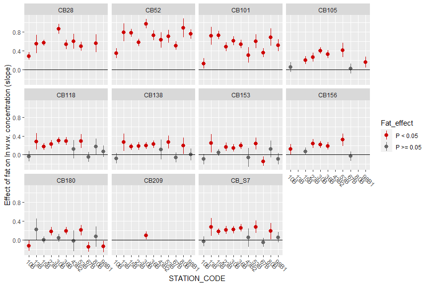
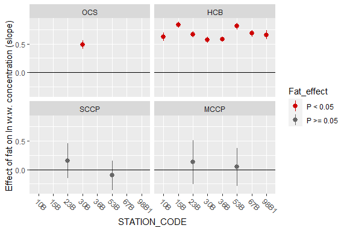
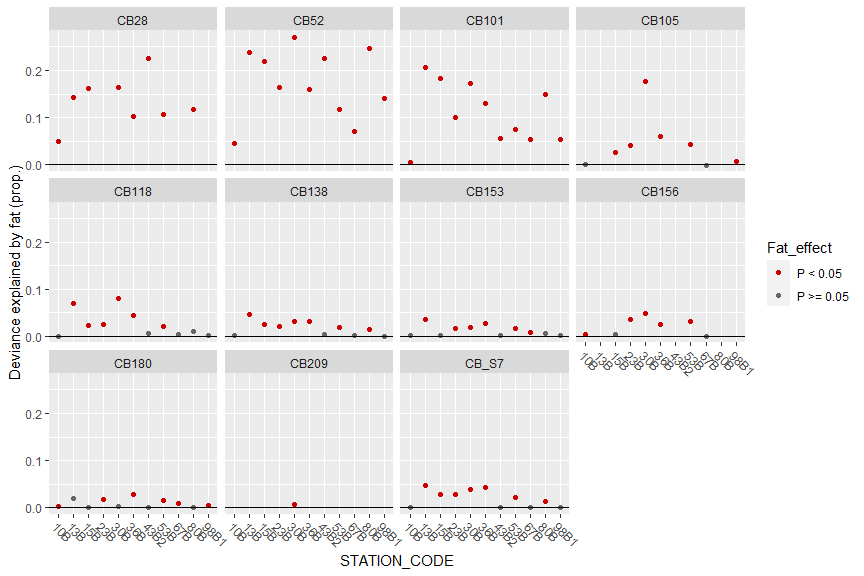

## Example: one substance (BDE49), one station (30B)    
  
Model: `ln(concentration) = a*ln(fat) + b*Length + spline(Year)`  

Thus:  

* The effect of ln(fat) assumed to be linear   
* Effect of year (non-linear effect) and length (linear) also taken into account   

```
## 
## Family: gaussian 
## Link function: identity 
## 
## Formula:
## log(VALUE_WW) ~ s(MYEAR) + log(FAT_PERC) + LNMEA
## 
## Parametric coefficients:
##                 Estimate Std. Error t value Pr(>|t|)    
## (Intercept)   -3.5859669  0.3950471  -9.077  < 2e-16 ***
## log(FAT_PERC)  1.1314555  0.1046854  10.808  < 2e-16 ***
## LNMEA          0.0015137  0.0005478   2.763  0.00626 ** 
## ---
## Signif. codes:  0 '***' 0.001 '**' 0.01 '*' 0.05 '.' 0.1 ' ' 1
## 
## Approximate significance of smooth terms:
##            edf Ref.df     F p-value   
## s(MYEAR) 2.153  2.579 5.405 0.00326 **
## ---
## Signif. codes:  0 '***' 0.001 '**' 0.01 '*' 0.05 '.' 0.1 ' ' 1
## 
## R-sq.(adj) =  0.447   Deviance explained = 45.8%
## GCV = 0.66053  Scale est. = 0.64401   n = 206
```

<!-- -->


### Several substances + stations          


## Effect of fat, slope {.tabset}  

Effect of ln(fat) on ln(concentration)   

* Analysis on station-by-station basis   
* The effect of ln(fat) assumed to be linear   
* Effect of year (non-linear effct) and length (linear) also taken into account   
* Analysis done for time series with at least 10 years and at least 70% data over LOQ    
  
### PCBs
<!-- -->


### BDEs
<!-- -->


### Organochorines, paraffins
<!-- -->


### PFAS and DDTs
<!-- -->

  
## Effect of fat, explained variance {.tabset}  
  
### PCBs
<!-- -->

### BDEss
<!-- -->


### Organochorines, paraffins
<!-- -->


### PFAS and DDTs
<!-- -->

## Some more examples  


### CB52 at station 36B      
<!-- -->


### CB118 at station 36B      
<!-- -->


### CB_S7 at station 36B      
<!-- -->


### BDE49 at station 30B      
<!-- -->


### BDE99 at station 30B      
<!-- -->


### BDE6S at station 30B      
<!-- -->


### OCS at station 30B      
<!-- -->


### HCB at station 23B      
<!-- -->


### SCCP at station 23B      
<!-- -->


### PFOS at station 30B      
<!-- -->


### DDEPP at station 30B      
<!-- -->

