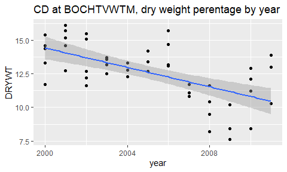
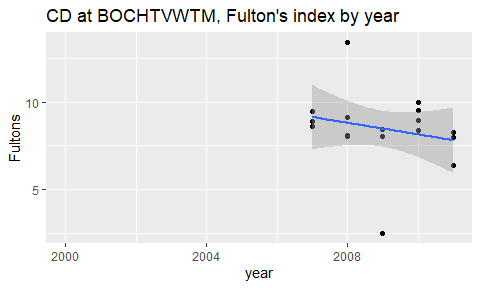
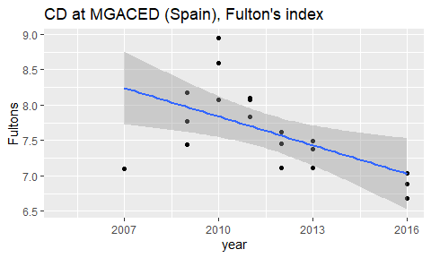
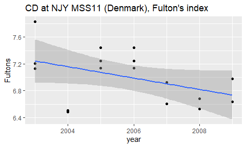
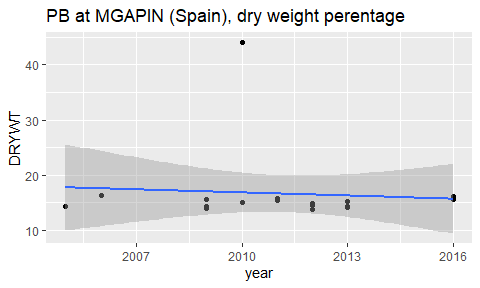

### Number of time series

```
##                  Parameter
## country           CD PB HG CB118 CB153 PA PYR
##   Denmark         71 71 71    71    71 71  71
##   Spain           42 42 42    42    42 42  42
##   The Netherlands  3  3  3     3     3  3   3
```


## Example  


  

### CD at station BOCHTVWTM  
<!-- --><!-- --><!-- -->


## Analyse trends        


### W.w. conc. trend vs. Fulton trend  
<!--html_preserve--><div id="htmlwidget-1edbe0348cc4bb679307" style="width:768px;height:576px;" class="plotly html-widget"></div>
<script type="application/json" data-for="htmlwidget-1edbe0348cc4bb679307">{"x":{"data":[{"x":[-0.117490559966398,-0.0687681826600431,0.181685718385892,0.0301141976087548,-0.0848712573078416,-0.160216267397006,-0.0838723905658325,-0.0667697174442116,-0.0862574779832013,-0.0980369608858483,-0.185071822819173,-0.0492604694256806,-0.124418343232385],"y":[-3.097353648757,-13.0818270270272,6.13114438502153,-10.079415132924,13.2654611211559,3.24859611231055,4.49255170008717,3.87557045643156,15.3447826086959,4.24303621169911,0.942528326181974,-0.339972144846456,-14.777947072975],"text":["fulton_slope: -0.1174905600<br />conc_ww_slope: -3.097354e+00<br />country: Denmark<br />ARH230988","fulton_slope: -0.0687681827<br />conc_ww_slope: -1.308183e+01<br />country: Denmark<br />ARH230989","fulton_slope:  0.1816857184<br />conc_ww_slope:  6.131144e+00<br />country: Denmark<br />LIM-3708-1","fulton_slope:  0.0301141976<br />conc_ww_slope: -1.007942e+01<br />country: Denmark<br />LIM-3718-2","fulton_slope: -0.0848712573<br />conc_ww_slope:  1.326546e+01<br />country: Denmark<br />NJY MSS11","fulton_slope: -0.1602162674<br />conc_ww_slope:  3.248596e+00<br />country: Denmark<br />NJY MSS3","fulton_slope: -0.0838723906<br />conc_ww_slope:  4.492552e+00<br />country: Denmark<br />RIB2161010","fulton_slope: -0.0667697174<br />conc_ww_slope:  3.875570e+00<br />country: Denmark<br />RIB2161022","fulton_slope: -0.0862574780<br />conc_ww_slope:  1.534478e+01<br />country: Denmark<br />RIB2162020","fulton_slope: -0.0980369609<br />conc_ww_slope:  4.243036e+00<br />country: Denmark<br />SJY JDMTM1","fulton_slope: -0.1850718228<br />conc_ww_slope:  9.425283e-01<br />country: Denmark<br />SJY JUVD5001","fulton_slope: -0.0492604694<br />conc_ww_slope: -3.399721e-01<br />country: Denmark<br />SJY LDMTM1","fulton_slope: -0.1244183432<br />conc_ww_slope: -1.477795e+01<br />country: Denmark<br />ÅRH 230987"],"type":"scatter","mode":"markers","marker":{"autocolorscale":false,"color":"rgba(248,118,109,1)","opacity":1,"size":3.77952755905512,"symbol":"circle","line":{"width":1.88976377952756,"color":"rgba(248,118,109,1)"}},"hoveron":"points","name":"Denmark","legendgroup":"Denmark","showlegend":true,"xaxis":"x","yaxis":"y","hoverinfo":"text","frame":null},{"x":[-0.117490559966398,-0.0687681826600431,0.181685718385892,0.0301141976087548,-0.0848712573078416,-0.0172788804955771,-0.0600857605172983,-0.0353740978329684,-0.0862574779832013,-0.0980369608858483,-0.185071822819173,-0.0492604694256806,-0.114008721328179],"y":[12.7845228548515,1.62675675675675,7.51965240641533,-4.30978527607337,20.5229656419516,-1.49045480067372,-5.22186046511627,-3.9178756844452,4.650434782609,15.1625348189416,-5.64467811158627,0.218384401114426,1.43750000000042],"text":["fulton_slope: -0.1174905600<br />conc_ww_slope:  1.278452e+01<br />country: Denmark<br />ARH230988","fulton_slope: -0.0687681827<br />conc_ww_slope:  1.626757e+00<br />country: Denmark<br />ARH230989","fulton_slope:  0.1816857184<br />conc_ww_slope:  7.519652e+00<br />country: Denmark<br />LIM-3708-1","fulton_slope:  0.0301141976<br />conc_ww_slope: -4.309785e+00<br />country: Denmark<br />LIM-3718-2","fulton_slope: -0.0848712573<br />conc_ww_slope:  2.052297e+01<br />country: Denmark<br />NJY MSS11","fulton_slope: -0.0172788805<br />conc_ww_slope: -1.490455e+00<br />country: Denmark<br />NJY MSS3","fulton_slope: -0.0600857605<br />conc_ww_slope: -5.221860e+00<br />country: Denmark<br />RIB2161010","fulton_slope: -0.0353740978<br />conc_ww_slope: -3.917876e+00<br />country: Denmark<br />RIB2161022","fulton_slope: -0.0862574780<br />conc_ww_slope:  4.650435e+00<br />country: Denmark<br />RIB2162020","fulton_slope: -0.0980369609<br />conc_ww_slope:  1.516253e+01<br />country: Denmark<br />SJY JDMTM1","fulton_slope: -0.1850718228<br />conc_ww_slope: -5.644678e+00<br />country: Denmark<br />SJY JUVD5001","fulton_slope: -0.0492604694<br />conc_ww_slope:  2.183844e-01<br />country: Denmark<br />SJY LDMTM1","fulton_slope: -0.1140087213<br />conc_ww_slope:  1.437500e+00<br />country: Denmark<br />ÅRH 230987"],"type":"scatter","mode":"markers","marker":{"autocolorscale":false,"color":"rgba(248,118,109,1)","opacity":1,"size":3.77952755905512,"symbol":"circle","line":{"width":1.88976377952756,"color":"rgba(248,118,109,1)"}},"hoveron":"points","name":"Denmark","legendgroup":"Denmark","showlegend":false,"xaxis":"x2","yaxis":"y2","hoverinfo":"text","frame":null},{"x":[-0.117490559966398,-0.0687681826600431,0.181685718385892,0.0301141976087548,-0.0848712573078416,-0.160216267397006,-0.0838723905658325,-0.0667697174442116,-0.0862574779832013,-0.0980369608858483,-0.185071822819173,-0.0492604694256806,-0.124418343232385],"y":[34.1510024057736,-0.200597297297299,0.853695721924809,0.552602453987736,0.320524412296572,-0.467386609071263,-0.861110985178696,0.117969029045648,2.15620000000001,2.51866295264623,0.475312875537204,-4.40905292479091,0.500882117080985],"text":["fulton_slope: -0.1174905600<br />conc_ww_slope:  3.415100e+01<br />country: Denmark<br />ARH230988","fulton_slope: -0.0687681827<br />conc_ww_slope: -2.005973e-01<br />country: Denmark<br />ARH230989","fulton_slope:  0.1816857184<br />conc_ww_slope:  8.536957e-01<br />country: Denmark<br />LIM-3708-1","fulton_slope:  0.0301141976<br />conc_ww_slope:  5.526025e-01<br />country: Denmark<br />LIM-3718-2","fulton_slope: -0.0848712573<br />conc_ww_slope:  3.205244e-01<br />country: Denmark<br />NJY MSS11","fulton_slope: -0.1602162674<br />conc_ww_slope: -4.673866e-01<br />country: Denmark<br />NJY MSS3","fulton_slope: -0.0838723906<br />conc_ww_slope: -8.611110e-01<br />country: Denmark<br />RIB2161010","fulton_slope: -0.0667697174<br />conc_ww_slope:  1.179690e-01<br />country: Denmark<br />RIB2161022","fulton_slope: -0.0862574780<br />conc_ww_slope:  2.156200e+00<br />country: Denmark<br />RIB2162020","fulton_slope: -0.0980369609<br />conc_ww_slope:  2.518663e+00<br />country: Denmark<br />SJY JDMTM1","fulton_slope: -0.1850718228<br />conc_ww_slope:  4.753129e-01<br />country: Denmark<br />SJY JUVD5001","fulton_slope: -0.0492604694<br />conc_ww_slope: -4.409053e+00<br />country: Denmark<br />SJY LDMTM1","fulton_slope: -0.1244183432<br />conc_ww_slope:  5.008821e-01<br />country: Denmark<br />ÅRH 230987"],"type":"scatter","mode":"markers","marker":{"autocolorscale":false,"color":"rgba(248,118,109,1)","opacity":1,"size":3.77952755905512,"symbol":"circle","line":{"width":1.88976377952756,"color":"rgba(248,118,109,1)"}},"hoveron":"points","name":"Denmark","legendgroup":"Denmark","showlegend":false,"xaxis":"x3","yaxis":"y3","hoverinfo":"text","frame":null},{"x":[-0.117490559966398,-0.0848712573078416,-0.0172788804955771,0.0281972665300823,-0.195070748745989,-0.0980369608858483,-0.0492604694256806,-0.124418343232385],"y":[-0.00385404971932634,-0.0189556962025302,-0.00447389107243144,0.00644457099468411,0.0263839285714156,-0.0125891364902507,-0.00951810584958212,0.00221571772253412],"text":["fulton_slope: -0.1174905600<br />conc_ww_slope: -3.854050e-03<br />country: Denmark<br />ARH230988","fulton_slope: -0.0848712573<br />conc_ww_slope: -1.895570e-02<br />country: Denmark<br />NJY MSS11","fulton_slope: -0.0172788805<br />conc_ww_slope: -4.473891e-03<br />country: Denmark<br />NJY MSS3","fulton_slope:  0.0281972665<br />conc_ww_slope:  6.444571e-03<br />country: Denmark<br />RIB2161010","fulton_slope: -0.1950707487<br />conc_ww_slope:  2.638393e-02<br />country: Denmark<br />RIB2161022","fulton_slope: -0.0980369609<br />conc_ww_slope: -1.258914e-02<br />country: Denmark<br />SJY JDMTM1","fulton_slope: -0.0492604694<br />conc_ww_slope: -9.518106e-03<br />country: Denmark<br />SJY LDMTM1","fulton_slope: -0.1244183432<br />conc_ww_slope:  2.215718e-03<br />country: Denmark<br />ÅRH 230987"],"type":"scatter","mode":"markers","marker":{"autocolorscale":false,"color":"rgba(248,118,109,1)","opacity":1,"size":3.77952755905512,"symbol":"circle","line":{"width":1.88976377952756,"color":"rgba(248,118,109,1)"}},"hoveron":"points","name":"Denmark","legendgroup":"Denmark","showlegend":false,"xaxis":"x","yaxis":"y4","hoverinfo":"text","frame":null},{"x":[-0.117490559966398,-0.0848712573078416,-0.0172788804955771,-0.00336151132953006,-0.138515005780658,-0.0980369608858483,-0.0492604694256806,-0.124418343232385],"y":[0.00269927826784262,-0.0318698010849874,-0.00405277933745247,-0.0924446952595951,0.167366071428532,-0.0619094707520891,-0.0320417827298053,0.0186463512429828],"text":["fulton_slope: -0.1174905600<br />conc_ww_slope:  2.699278e-03<br />country: Denmark<br />ARH230988","fulton_slope: -0.0848712573<br />conc_ww_slope: -3.186980e-02<br />country: Denmark<br />NJY MSS11","fulton_slope: -0.0172788805<br />conc_ww_slope: -4.052779e-03<br />country: Denmark<br />NJY MSS3","fulton_slope: -0.0033615113<br />conc_ww_slope: -9.244470e-02<br />country: Denmark<br />RIB2161010","fulton_slope: -0.1385150058<br />conc_ww_slope:  1.673661e-01<br />country: Denmark<br />RIB2161022","fulton_slope: -0.0980369609<br />conc_ww_slope: -6.190947e-02<br />country: Denmark<br />SJY JDMTM1","fulton_slope: -0.0492604694<br />conc_ww_slope: -3.204178e-02<br />country: Denmark<br />SJY LDMTM1","fulton_slope: -0.1244183432<br />conc_ww_slope:  1.864635e-02<br />country: Denmark<br />ÅRH 230987"],"type":"scatter","mode":"markers","marker":{"autocolorscale":false,"color":"rgba(248,118,109,1)","opacity":1,"size":3.77952755905512,"symbol":"circle","line":{"width":1.88976377952756,"color":"rgba(248,118,109,1)"}},"hoveron":"points","name":"Denmark","legendgroup":"Denmark","showlegend":false,"xaxis":"x2","yaxis":"y5","hoverinfo":"text","frame":null},{"x":[-0.107576593604404,-0.00243012580788698,0.302097074470862,0.0301141976087548,-0.0848712573078416,0.0343525480546908,-0.0592075074636612,-0.0134036205705827,-0.102703832463462,-0.185071822819173,-0.0533060579958741,-0.129954232283598],"y":[-0.207615230461014,-0.438283582089554,-0.0479577464788734,-0.107474437627807,-1.5461754068717,-0.681607142857141,-0.888241327862708,-0.911658016552113,0.0801567944250934,-0.590300429184562,0.133344947735186,-0.75773547094195],"text":["fulton_slope: -0.1075765936<br />conc_ww_slope: -2.076152e-01<br />country: Denmark<br />ARH230988","fulton_slope: -0.0024301258<br />conc_ww_slope: -4.382836e-01<br />country: Denmark<br />ARH230989","fulton_slope:  0.3020970745<br />conc_ww_slope: -4.795775e-02<br />country: Denmark<br />LIM-3708-1","fulton_slope:  0.0301141976<br />conc_ww_slope: -1.074744e-01<br />country: Denmark<br />LIM-3718-2","fulton_slope: -0.0848712573<br />conc_ww_slope: -1.546175e+00<br />country: Denmark<br />NJY MSS11","fulton_slope:  0.0343525481<br />conc_ww_slope: -6.816071e-01<br />country: Denmark<br />NJY MSS3","fulton_slope: -0.0592075075<br />conc_ww_slope: -8.882413e-01<br />country: Denmark<br />RIB2161010","fulton_slope: -0.0134036206<br />conc_ww_slope: -9.116580e-01<br />country: Denmark<br />RIB2161022","fulton_slope: -0.1027038325<br />conc_ww_slope:  8.015679e-02<br />country: Denmark<br />SJY JDMTM1","fulton_slope: -0.1850718228<br />conc_ww_slope: -5.903004e-01<br />country: Denmark<br />SJY JUVD5001","fulton_slope: -0.0533060580<br />conc_ww_slope:  1.333449e-01<br />country: Denmark<br />SJY LDMTM1","fulton_slope: -0.1299542323<br />conc_ww_slope: -7.577355e-01<br />country: Denmark<br />ÅRH 230987"],"type":"scatter","mode":"markers","marker":{"autocolorscale":false,"color":"rgba(248,118,109,1)","opacity":1,"size":3.77952755905512,"symbol":"circle","line":{"width":1.88976377952756,"color":"rgba(248,118,109,1)"}},"hoveron":"points","name":"Denmark","legendgroup":"Denmark","showlegend":false,"xaxis":"x3","yaxis":"y6","hoverinfo":"text","frame":null},{"x":[-0.107576593604404,-0.0687681826600431,0.250593541376096,0.0301141976087548,-0.0848712573078416,0.0343525480546908,-0.0631845828778041,-0.0134036205705827,-0.0904490593768955,-0.185071822819173,-0.043226472987997,-0.129954232283598],"y":[-0.0288977955912283,-0.413513513513517,0.0498128342245807,0.044621676891614,-1.0571428571428,-0.318839285714285,-0.568854417890782,-0.395962968158228,-0.0505000000000363,-0.204248927038653,-0.0790000000000226,-0.105440881763537],"text":["fulton_slope: -0.1075765936<br />conc_ww_slope: -2.889780e-02<br />country: Denmark<br />ARH230988","fulton_slope: -0.0687681827<br />conc_ww_slope: -4.135135e-01<br />country: Denmark<br />ARH230989","fulton_slope:  0.2505935414<br />conc_ww_slope:  4.981283e-02<br />country: Denmark<br />LIM-3708-1","fulton_slope:  0.0301141976<br />conc_ww_slope:  4.462168e-02<br />country: Denmark<br />LIM-3718-2","fulton_slope: -0.0848712573<br />conc_ww_slope: -1.057143e+00<br />country: Denmark<br />NJY MSS11","fulton_slope:  0.0343525481<br />conc_ww_slope: -3.188393e-01<br />country: Denmark<br />NJY MSS3","fulton_slope: -0.0631845829<br />conc_ww_slope: -5.688544e-01<br />country: Denmark<br />RIB2161010","fulton_slope: -0.0134036206<br />conc_ww_slope: -3.959630e-01<br />country: Denmark<br />RIB2161022","fulton_slope: -0.0904490594<br />conc_ww_slope: -5.050000e-02<br />country: Denmark<br />SJY JDMTM1","fulton_slope: -0.1850718228<br />conc_ww_slope: -2.042489e-01<br />country: Denmark<br />SJY JUVD5001","fulton_slope: -0.0432264730<br />conc_ww_slope: -7.900000e-02<br />country: Denmark<br />SJY LDMTM1","fulton_slope: -0.1299542323<br />conc_ww_slope: -1.054409e-01<br />country: Denmark<br />ÅRH 230987"],"type":"scatter","mode":"markers","marker":{"autocolorscale":false,"color":"rgba(248,118,109,1)","opacity":1,"size":3.77952755905512,"symbol":"circle","line":{"width":1.88976377952756,"color":"rgba(248,118,109,1)"}},"hoveron":"points","name":"Denmark","legendgroup":"Denmark","showlegend":false,"xaxis":"x","yaxis":"y7","hoverinfo":"text","frame":null},{"x":[0.00241117746633289,-0.0282294644955128,-0.193415342157946,-0.0140073395222622,-0.0246144590362408,-0.0373627454505813,-0.0573785516938491,-0.0526052912139947,0.00881178442861376,-0.134854848468368,-0.0336426140771328,0.100505495222271,0.0656060025045832,0.0720148324869106,-0.130720162406623,0.115646207442688,-0.205219308499392,-0.0268989087859564,0.0162653928464232,-0.00649508142786737,-0.0616455764881772,-0.0976988694521121,-0.0824054515599475],"y":[-7.44422492997226,-6.31857969283328,3.35621691394642,-1.3898353115721,4.64733823529451,-0.483307339449496,15.9074642857127,-0.405259871441595,-3.24553145087206,-5.05882699724563,3.47444124629122,5.66137584940344,5.80632184873966,-1.81926414414388,-0.556030810810595,13.3184490740746,-1.27580924369755,0.557386960514276,-3.53384031221269,1.74047086834754,-0.871499859943793,-2.70831148459392,1.25329182389933],"text":["fulton_slope:  0.0024111775<br />conc_ww_slope: -7.444225e+00<br />country: Spain<br />MASAVI","fulton_slope: -0.0282294645<br />conc_ww_slope: -6.318580e+00<br />country: Spain<br />MASGIJ","fulton_slope: -0.1934153422<br />conc_ww_slope:  3.356217e+00<br />country: Spain<br />MASLUA","fulton_slope: -0.0140073395<br />conc_ww_slope: -1.389835e+00<br />country: Spain<br />MASRIB","fulton_slope: -0.0246144590<br />conc_ww_slope:  4.647338e+00<br />country: Spain<br />MCASPA","fulton_slope: -0.0373627455<br />conc_ww_slope: -4.833073e-01<br />country: Spain<br />MCASPE","fulton_slope: -0.0573785517<br />conc_ww_slope:  1.590746e+01<br />country: Spain<br />MCASUA","fulton_slope: -0.0526052912<br />conc_ww_slope: -4.052599e-01<br />country: Spain<br />MCASVI","fulton_slope:  0.0088117844<br />conc_ww_slope: -3.245531e+00<br />country: Spain<br />MCAURD","fulton_slope: -0.1348548485<br />conc_ww_slope: -5.058827e+00<br />country: Spain<br />MGACED","fulton_slope: -0.0336426141<br />conc_ww_slope:  3.474441e+00<br />country: Spain<br />MGACHO","fulton_slope:  0.1005054952<br />conc_ww_slope:  5.661376e+00<br />country: Spain<br />MGACOR","fulton_slope:  0.0656060025<br />conc_ww_slope:  5.806322e+00<br />country: Spain<br />MGACTC","fulton_slope:  0.0720148325<br />conc_ww_slope: -1.819264e+00<br />country: Spain<br />MGAESP","fulton_slope: -0.1307201624<br />conc_ww_slope: -5.560308e-01<br />country: Spain<br />MGAFPA","fulton_slope:  0.1156462074<br />conc_ww_slope:  1.331845e+01<br />country: Spain<br />MGAPIN","fulton_slope: -0.2052193085<br />conc_ww_slope: -1.275809e+00<br />country: Spain<br />MGAPOR","fulton_slope: -0.0268989088<br />conc_ww_slope:  5.573870e-01<br />country: Spain<br />MGARIB","fulton_slope:  0.0162653928<br />conc_ww_slope: -3.533840e+00<br />country: Spain<br />MGASMO","fulton_slope: -0.0064950814<br />conc_ww_slope:  1.740471e+00<br />country: Spain<br />MGAVSA","fulton_slope: -0.0616455765<br />conc_ww_slope: -8.714999e-01<br />country: Spain<br />MGAARO","fulton_slope: -0.0976988695<br />conc_ww_slope: -2.708311e+00<br />country: Spain<br />MPVBIA","fulton_slope: -0.0824054516<br />conc_ww_slope:  1.253292e+00<br />country: Spain<br />MPVFUE"],"type":"scatter","mode":"markers","marker":{"autocolorscale":false,"color":"rgba(0,186,56,1)","opacity":1,"size":3.77952755905512,"symbol":"circle","line":{"width":1.88976377952756,"color":"rgba(0,186,56,1)"}},"hoveron":"points","name":"Spain","legendgroup":"Spain","showlegend":true,"xaxis":"x","yaxis":"y","hoverinfo":"text","frame":null},{"x":[0.00241117746633289,-0.0282294644955128,-0.193415342157946,-0.0140073395222622,-0.0246144590362408,-0.0373627454505813,-0.0573785516938491,-0.0526052912139947,0.00881178442861376,-0.134854848468368,-0.0336426140771328,0.100505495222271,0.0656060025045832,0.0720148324869106,-0.130720162406623,0.115646207442688,-0.205219308499392,-0.0268989087859564,0.0162653928464232,-0.00649508142786737,-0.0616455764881772,-0.0976988694521121,-0.0824054515599475],"y":[-0.17218427170869,-44.7396023890812,-7.02095351137788,-13.0838165182981,-7.16106162465072,-11.2783944954125,0.495813591269803,-5.94001147842004,-35.3367056932937,0.529272635445401,-7.57752700296593,-2.3326114784203,21.1830616246508,1.65215405405343,-3.05420720720759,-14.8570395502629,1.90922815126018,-0.227488292011186,-13.2233073461882,-17.3020896358555,0.636608543417505,-44.6139551820748,-22.8792138364751],"text":["fulton_slope:  0.0024111775<br />conc_ww_slope: -1.721843e-01<br />country: Spain<br />MASAVI","fulton_slope: -0.0282294645<br />conc_ww_slope: -4.473960e+01<br />country: Spain<br />MASGIJ","fulton_slope: -0.1934153422<br />conc_ww_slope: -7.020954e+00<br />country: Spain<br />MASLUA","fulton_slope: -0.0140073395<br />conc_ww_slope: -1.308382e+01<br />country: Spain<br />MASRIB","fulton_slope: -0.0246144590<br />conc_ww_slope: -7.161062e+00<br />country: Spain<br />MCASPA","fulton_slope: -0.0373627455<br />conc_ww_slope: -1.127839e+01<br />country: Spain<br />MCASPE","fulton_slope: -0.0573785517<br />conc_ww_slope:  4.958136e-01<br />country: Spain<br />MCASUA","fulton_slope: -0.0526052912<br />conc_ww_slope: -5.940011e+00<br />country: Spain<br />MCASVI","fulton_slope:  0.0088117844<br />conc_ww_slope: -3.533671e+01<br />country: Spain<br />MCAURD","fulton_slope: -0.1348548485<br />conc_ww_slope:  5.292726e-01<br />country: Spain<br />MGACED","fulton_slope: -0.0336426141<br />conc_ww_slope: -7.577527e+00<br />country: Spain<br />MGACHO","fulton_slope:  0.1005054952<br />conc_ww_slope: -2.332611e+00<br />country: Spain<br />MGACOR","fulton_slope:  0.0656060025<br />conc_ww_slope:  2.118306e+01<br />country: Spain<br />MGACTC","fulton_slope:  0.0720148325<br />conc_ww_slope:  1.652154e+00<br />country: Spain<br />MGAESP","fulton_slope: -0.1307201624<br />conc_ww_slope: -3.054207e+00<br />country: Spain<br />MGAFPA","fulton_slope:  0.1156462074<br />conc_ww_slope: -1.485704e+01<br />country: Spain<br />MGAPIN","fulton_slope: -0.2052193085<br />conc_ww_slope:  1.909228e+00<br />country: Spain<br />MGAPOR","fulton_slope: -0.0268989088<br />conc_ww_slope: -2.274883e-01<br />country: Spain<br />MGARIB","fulton_slope:  0.0162653928<br />conc_ww_slope: -1.322331e+01<br />country: Spain<br />MGASMO","fulton_slope: -0.0064950814<br />conc_ww_slope: -1.730209e+01<br />country: Spain<br />MGAVSA","fulton_slope: -0.0616455765<br />conc_ww_slope:  6.366085e-01<br />country: Spain<br />MGAARO","fulton_slope: -0.0976988695<br />conc_ww_slope: -4.461396e+01<br />country: Spain<br />MPVBIA","fulton_slope: -0.0824054516<br />conc_ww_slope: -2.287921e+01<br />country: Spain<br />MPVFUE"],"type":"scatter","mode":"markers","marker":{"autocolorscale":false,"color":"rgba(0,186,56,1)","opacity":1,"size":3.77952755905512,"symbol":"circle","line":{"width":1.88976377952756,"color":"rgba(0,186,56,1)"}},"hoveron":"points","name":"Spain","legendgroup":"Spain","showlegend":false,"xaxis":"x2","yaxis":"y2","hoverinfo":"text","frame":null},{"x":[0.00241117746633289,-0.0282294644955128,-0.193415342157946,-0.0140073395222622,-0.0246144590362408,-0.0373627454505813,-0.0573785516938491,-0.0526052912139947,0.00881178442861376,-0.134854848468368,-0.0336426140771328,0.100505495222271,0.0656060025045832,0.0720148324869106,-0.130720162406623,0.115646207442688,-0.205219308499392,-0.0268989087859564,0.0162653928464232,-0.00649508142786737,-0.0616455764881772,-0.0976988694521121,-0.0824054515599475],"y":[-2.28286050420166,-5.19765102389177,-0.521452621167174,-0.0551570722054716,0.0125883753501396,-0.0620035168195661,-1.16047175925845,-0.555141689623502,-1.56746207529829,5.79260505050476,-0.050491641938608,-0.31400022956839,-0.0937401960784342,-0.358490810810816,-0.877556756756741,-1.03504193121688,-1.88705350140059,0.184027410468311,-0.411721992653807,-0.623342717086862,-0.0758997198879497,-0.569499719887967,-0.201952830188626],"text":["fulton_slope:  0.0024111775<br />conc_ww_slope: -2.282861e+00<br />country: Spain<br />MASAVI","fulton_slope: -0.0282294645<br />conc_ww_slope: -5.197651e+00<br />country: Spain<br />MASGIJ","fulton_slope: -0.1934153422<br />conc_ww_slope: -5.214526e-01<br />country: Spain<br />MASLUA","fulton_slope: -0.0140073395<br />conc_ww_slope: -5.515707e-02<br />country: Spain<br />MASRIB","fulton_slope: -0.0246144590<br />conc_ww_slope:  1.258838e-02<br />country: Spain<br />MCASPA","fulton_slope: -0.0373627455<br />conc_ww_slope: -6.200352e-02<br />country: Spain<br />MCASPE","fulton_slope: -0.0573785517<br />conc_ww_slope: -1.160472e+00<br />country: Spain<br />MCASUA","fulton_slope: -0.0526052912<br />conc_ww_slope: -5.551417e-01<br />country: Spain<br />MCASVI","fulton_slope:  0.0088117844<br />conc_ww_slope: -1.567462e+00<br />country: Spain<br />MCAURD","fulton_slope: -0.1348548485<br />conc_ww_slope:  5.792605e+00<br />country: Spain<br />MGACED","fulton_slope: -0.0336426141<br />conc_ww_slope: -5.049164e-02<br />country: Spain<br />MGACHO","fulton_slope:  0.1005054952<br />conc_ww_slope: -3.140002e-01<br />country: Spain<br />MGACOR","fulton_slope:  0.0656060025<br />conc_ww_slope: -9.374020e-02<br />country: Spain<br />MGACTC","fulton_slope:  0.0720148325<br />conc_ww_slope: -3.584908e-01<br />country: Spain<br />MGAESP","fulton_slope: -0.1307201624<br />conc_ww_slope: -8.775568e-01<br />country: Spain<br />MGAFPA","fulton_slope:  0.1156462074<br />conc_ww_slope: -1.035042e+00<br />country: Spain<br />MGAPIN","fulton_slope: -0.2052193085<br />conc_ww_slope: -1.887054e+00<br />country: Spain<br />MGAPOR","fulton_slope: -0.0268989088<br />conc_ww_slope:  1.840274e-01<br />country: Spain<br />MGARIB","fulton_slope:  0.0162653928<br />conc_ww_slope: -4.117220e-01<br />country: Spain<br />MGASMO","fulton_slope: -0.0064950814<br />conc_ww_slope: -6.233427e-01<br />country: Spain<br />MGAVSA","fulton_slope: -0.0616455765<br />conc_ww_slope: -7.589972e-02<br />country: Spain<br />MGAARO","fulton_slope: -0.0976988695<br />conc_ww_slope: -5.694997e-01<br />country: Spain<br />MPVBIA","fulton_slope: -0.0824054516<br />conc_ww_slope: -2.019528e-01<br />country: Spain<br />MPVFUE"],"type":"scatter","mode":"markers","marker":{"autocolorscale":false,"color":"rgba(0,186,56,1)","opacity":1,"size":3.77952755905512,"symbol":"circle","line":{"width":1.88976377952756,"color":"rgba(0,186,56,1)"}},"hoveron":"points","name":"Spain","legendgroup":"Spain","showlegend":false,"xaxis":"x3","yaxis":"y3","hoverinfo":"text","frame":null},{"x":[0.00241117746633289,-0.161980665239094,-0.193415342157946,-0.0140073395222622,-0.0246144590362408,-0.0373627454505813,-0.0427104405742627,-0.0460422464739354,0.00881178442861376,-0.194891145795148,-0.0336426140771328,0.100505495222271,0.0656060025045832,0.0720148324869106,-0.130720162406623,0.107200125258467,-0.205219308499392,-0.0268989087859564,0.0162653928464232,-0.00649508142786737,-0.0616455764881772,-0.0976988694521121,-0.0824054515599475],"y":[-0.00624649859944043,0.0157608695652167,0.0162022749752716,0.011268545994065,-0.0101400560224097,-0.0108134556574919,0.0165952380952356,0.0397619047619084,-0.022027548209364,0.00553513513513444,0.000431750741841864,0.0214173553719014,0.225574229691884,0.0800990990990963,-0.0515945945945971,0.0160343915343937,0.001261904761905,0.000140036730945821,0.064906795224978,0.000742296918766228,0.0140070028011208,-0.0618697478991651,-0.101999999999991],"text":["fulton_slope:  0.0024111775<br />conc_ww_slope: -6.246499e-03<br />country: Spain<br />MASAVI","fulton_slope: -0.1619806652<br />conc_ww_slope:  1.576087e-02<br />country: Spain<br />MASGIJ","fulton_slope: -0.1934153422<br />conc_ww_slope:  1.620227e-02<br />country: Spain<br />MASLUA","fulton_slope: -0.0140073395<br />conc_ww_slope:  1.126855e-02<br />country: Spain<br />MASRIB","fulton_slope: -0.0246144590<br />conc_ww_slope: -1.014006e-02<br />country: Spain<br />MCASPA","fulton_slope: -0.0373627455<br />conc_ww_slope: -1.081346e-02<br />country: Spain<br />MCASPE","fulton_slope: -0.0427104406<br />conc_ww_slope:  1.659524e-02<br />country: Spain<br />MCASUA","fulton_slope: -0.0460422465<br />conc_ww_slope:  3.976190e-02<br />country: Spain<br />MCASVI","fulton_slope:  0.0088117844<br />conc_ww_slope: -2.202755e-02<br />country: Spain<br />MCAURD","fulton_slope: -0.1948911458<br />conc_ww_slope:  5.535135e-03<br />country: Spain<br />MGACED","fulton_slope: -0.0336426141<br />conc_ww_slope:  4.317507e-04<br />country: Spain<br />MGACHO","fulton_slope:  0.1005054952<br />conc_ww_slope:  2.141736e-02<br />country: Spain<br />MGACOR","fulton_slope:  0.0656060025<br />conc_ww_slope:  2.255742e-01<br />country: Spain<br />MGACTC","fulton_slope:  0.0720148325<br />conc_ww_slope:  8.009910e-02<br />country: Spain<br />MGAESP","fulton_slope: -0.1307201624<br />conc_ww_slope: -5.159459e-02<br />country: Spain<br />MGAFPA","fulton_slope:  0.1072001253<br />conc_ww_slope:  1.603439e-02<br />country: Spain<br />MGAPIN","fulton_slope: -0.2052193085<br />conc_ww_slope:  1.261905e-03<br />country: Spain<br />MGAPOR","fulton_slope: -0.0268989088<br />conc_ww_slope:  1.400367e-04<br />country: Spain<br />MGARIB","fulton_slope:  0.0162653928<br />conc_ww_slope:  6.490680e-02<br />country: Spain<br />MGASMO","fulton_slope: -0.0064950814<br />conc_ww_slope:  7.422969e-04<br />country: Spain<br />MGAVSA","fulton_slope: -0.0616455765<br />conc_ww_slope:  1.400700e-02<br />country: Spain<br />MGAARO","fulton_slope: -0.0976988695<br />conc_ww_slope: -6.186975e-02<br />country: Spain<br />MPVBIA","fulton_slope: -0.0824054516<br />conc_ww_slope: -1.020000e-01<br />country: Spain<br />MPVFUE"],"type":"scatter","mode":"markers","marker":{"autocolorscale":false,"color":"rgba(0,186,56,1)","opacity":1,"size":3.77952755905512,"symbol":"circle","line":{"width":1.88976377952756,"color":"rgba(0,186,56,1)"}},"hoveron":"points","name":"Spain","legendgroup":"Spain","showlegend":false,"xaxis":"x","yaxis":"y4","hoverinfo":"text","frame":null},{"x":[0.00241117746633289,-0.161980665239094,-0.193415342157946,-0.0140073395222622,-0.0246144590362408,-0.0373627454505813,-0.0427104405742627,-0.0460422464739354,0.00881178442861376,-0.134854848468368,-0.0336426140771328,0.100505495222271,0.0656060025045832,0.0720148324869106,-0.130720162406623,0.107200125258467,-0.205219308499392,-0.0268989087859564,0.0162653928464232,-0.00649508142786737,-0.0616455764881772,-0.0976988694521121,-0.0824054515599475],"y":[-0.177184873949578,-0.0921739130434811,-0.0168996043521247,-0.0288041543026657,-0.179229691876759,-0.101957186544339,0.0500793650793535,-0.0597321428571517,-0.24895775941229,0.0231175390266323,-0.0565855588526172,-0.0319779614325037,-0.366078431372578,-0.0303027027027083,-0.267603603603625,-0.0390191798941772,-0.0498879551820757,-0.0258902662993573,-0.0392713498622521,-0.31543417366948,0.00801680672268787,-1.2708823529413,-0.576666666666618],"text":["fulton_slope:  0.0024111775<br />conc_ww_slope: -1.771849e-01<br />country: Spain<br />MASAVI","fulton_slope: -0.1619806652<br />conc_ww_slope: -9.217391e-02<br />country: Spain<br />MASGIJ","fulton_slope: -0.1934153422<br />conc_ww_slope: -1.689960e-02<br />country: Spain<br />MASLUA","fulton_slope: -0.0140073395<br />conc_ww_slope: -2.880415e-02<br />country: Spain<br />MASRIB","fulton_slope: -0.0246144590<br />conc_ww_slope: -1.792297e-01<br />country: Spain<br />MCASPA","fulton_slope: -0.0373627455<br />conc_ww_slope: -1.019572e-01<br />country: Spain<br />MCASPE","fulton_slope: -0.0427104406<br />conc_ww_slope:  5.007937e-02<br />country: Spain<br />MCASUA","fulton_slope: -0.0460422465<br />conc_ww_slope: -5.973214e-02<br />country: Spain<br />MCASVI","fulton_slope:  0.0088117844<br />conc_ww_slope: -2.489578e-01<br />country: Spain<br />MCAURD","fulton_slope: -0.1348548485<br />conc_ww_slope:  2.311754e-02<br />country: Spain<br />MGACED","fulton_slope: -0.0336426141<br />conc_ww_slope: -5.658556e-02<br />country: Spain<br />MGACHO","fulton_slope:  0.1005054952<br />conc_ww_slope: -3.197796e-02<br />country: Spain<br />MGACOR","fulton_slope:  0.0656060025<br />conc_ww_slope: -3.660784e-01<br />country: Spain<br />MGACTC","fulton_slope:  0.0720148325<br />conc_ww_slope: -3.030270e-02<br />country: Spain<br />MGAESP","fulton_slope: -0.1307201624<br />conc_ww_slope: -2.676036e-01<br />country: Spain<br />MGAFPA","fulton_slope:  0.1072001253<br />conc_ww_slope: -3.901918e-02<br />country: Spain<br />MGAPIN","fulton_slope: -0.2052193085<br />conc_ww_slope: -4.988796e-02<br />country: Spain<br />MGAPOR","fulton_slope: -0.0268989088<br />conc_ww_slope: -2.589027e-02<br />country: Spain<br />MGARIB","fulton_slope:  0.0162653928<br />conc_ww_slope: -3.927135e-02<br />country: Spain<br />MGASMO","fulton_slope: -0.0064950814<br />conc_ww_slope: -3.154342e-01<br />country: Spain<br />MGAVSA","fulton_slope: -0.0616455765<br />conc_ww_slope:  8.016807e-03<br />country: Spain<br />MGAARO","fulton_slope: -0.0976988695<br />conc_ww_slope: -1.270882e+00<br />country: Spain<br />MPVBIA","fulton_slope: -0.0824054516<br />conc_ww_slope: -5.766667e-01<br />country: Spain<br />MPVFUE"],"type":"scatter","mode":"markers","marker":{"autocolorscale":false,"color":"rgba(0,186,56,1)","opacity":1,"size":3.77952755905512,"symbol":"circle","line":{"width":1.88976377952756,"color":"rgba(0,186,56,1)"}},"hoveron":"points","name":"Spain","legendgroup":"Spain","showlegend":false,"xaxis":"x2","yaxis":"y5","hoverinfo":"text","frame":null},{"x":[0.00525982784638331,-0.0282294644955128,-0.193415342157946,-0.0140073395222622,-0.0246144590362408,-0.0373627454505813,-0.0573785516938491,-0.0526052912139947,0.00881178442861376,-0.134854848468368,-0.0336426140771328,0.100505495222271,0.0656060025045832,0.0720148324869106,-0.130720162406623,0.115646207442688,-0.210042208575208,-0.0268989087859564,0.0162653928464232,-0.00649508142786737,-0.0589485006943487,-0.0976988694521121,-0.0824054515599475],"y":[-1.33409149417859,-0.738671774744085,-0.103596214638957,-0.308700195351106,-2.21265561624672,-0.243121636085624,-0.312282720238094,-0.269263989898968,-0.727103289256128,-0.29772986501376,-0.0114032848664614,-0.184451358126712,-0.257910663865581,-0.124506405405411,-0.54647389189191,-0.162748802248664,0.0403615298142982,-0.178859552800725,-0.0311187924701578,-0.0832987983193312,-0.101342690615807,-0.566749635854401,-0.244227028301882],"text":["fulton_slope:  0.0052598278<br />conc_ww_slope: -1.334091e+00<br />country: Spain<br />MASAVI","fulton_slope: -0.0282294645<br />conc_ww_slope: -7.386718e-01<br />country: Spain<br />MASGIJ","fulton_slope: -0.1934153422<br />conc_ww_slope: -1.035962e-01<br />country: Spain<br />MASLUA","fulton_slope: -0.0140073395<br />conc_ww_slope: -3.087002e-01<br />country: Spain<br />MASRIB","fulton_slope: -0.0246144590<br />conc_ww_slope: -2.212656e+00<br />country: Spain<br />MCASPA","fulton_slope: -0.0373627455<br />conc_ww_slope: -2.431216e-01<br />country: Spain<br />MCASPE","fulton_slope: -0.0573785517<br />conc_ww_slope: -3.122827e-01<br />country: Spain<br />MCASUA","fulton_slope: -0.0526052912<br />conc_ww_slope: -2.692640e-01<br />country: Spain<br />MCASVI","fulton_slope:  0.0088117844<br />conc_ww_slope: -7.271033e-01<br />country: Spain<br />MCAURD","fulton_slope: -0.1348548485<br />conc_ww_slope: -2.977299e-01<br />country: Spain<br />MGACED","fulton_slope: -0.0336426141<br />conc_ww_slope: -1.140328e-02<br />country: Spain<br />MGACHO","fulton_slope:  0.1005054952<br />conc_ww_slope: -1.844514e-01<br />country: Spain<br />MGACOR","fulton_slope:  0.0656060025<br />conc_ww_slope: -2.579107e-01<br />country: Spain<br />MGACTC","fulton_slope:  0.0720148325<br />conc_ww_slope: -1.245064e-01<br />country: Spain<br />MGAESP","fulton_slope: -0.1307201624<br />conc_ww_slope: -5.464739e-01<br />country: Spain<br />MGAFPA","fulton_slope:  0.1156462074<br />conc_ww_slope: -1.627488e-01<br />country: Spain<br />MGAPIN","fulton_slope: -0.2100422086<br />conc_ww_slope:  4.036153e-02<br />country: Spain<br />MGAPOR","fulton_slope: -0.0268989088<br />conc_ww_slope: -1.788596e-01<br />country: Spain<br />MGARIB","fulton_slope:  0.0162653928<br />conc_ww_slope: -3.111879e-02<br />country: Spain<br />MGASMO","fulton_slope: -0.0064950814<br />conc_ww_slope: -8.329880e-02<br />country: Spain<br />MGAVSA","fulton_slope: -0.0589485007<br />conc_ww_slope: -1.013427e-01<br />country: Spain<br />MGAARO","fulton_slope: -0.0976988695<br />conc_ww_slope: -5.667496e-01<br />country: Spain<br />MPVBIA","fulton_slope: -0.0824054516<br />conc_ww_slope: -2.442270e-01<br />country: Spain<br />MPVFUE"],"type":"scatter","mode":"markers","marker":{"autocolorscale":false,"color":"rgba(0,186,56,1)","opacity":1,"size":3.77952755905512,"symbol":"circle","line":{"width":1.88976377952756,"color":"rgba(0,186,56,1)"}},"hoveron":"points","name":"Spain","legendgroup":"Spain","showlegend":false,"xaxis":"x3","yaxis":"y6","hoverinfo":"text","frame":null},{"x":[0.00525982784638331,-0.0282294644955128,-0.193415342157946,-0.0140073395222622,-0.0246144590362408,-0.0373627454505813,-0.0573785516938491,-0.0526052912139947,0.00881178442861376,-0.134854848468368,-0.0336426140771328,0.100505495222271,0.0656060025045832,0.0720148324869106,-0.130720162406623,0.115646207442688,-0.210042208575208,-0.0268989087859564,0.0162653928464232,-0.00649508142786737,-0.0589485006943487,-0.0976988694521121,-0.0824054515599475],"y":[-3.1083373544633,-2.50079317406156,-0.0988233392680375,-0.453197553906982,-9.58778256302614,-0.476737874617733,-0.366492115740743,-0.11092654269972,-0.912908311294683,-0.268690624426057,-0.0881287551928589,-0.133318337006417,-0.415232282913242,-0.168098616216228,-1.5273883603604,-0.107764724867719,0.0715242155425516,-0.172191271808988,-0.0234933787878774,-0.239503815126066,-0.0268393621700354,-1.36662501400571,-0.270897358490573],"text":["fulton_slope:  0.0052598278<br />conc_ww_slope: -3.108337e+00<br />country: Spain<br />MASAVI","fulton_slope: -0.0282294645<br />conc_ww_slope: -2.500793e+00<br />country: Spain<br />MASGIJ","fulton_slope: -0.1934153422<br />conc_ww_slope: -9.882334e-02<br />country: Spain<br />MASLUA","fulton_slope: -0.0140073395<br />conc_ww_slope: -4.531976e-01<br />country: Spain<br />MASRIB","fulton_slope: -0.0246144590<br />conc_ww_slope: -9.587783e+00<br />country: Spain<br />MCASPA","fulton_slope: -0.0373627455<br />conc_ww_slope: -4.767379e-01<br />country: Spain<br />MCASPE","fulton_slope: -0.0573785517<br />conc_ww_slope: -3.664921e-01<br />country: Spain<br />MCASUA","fulton_slope: -0.0526052912<br />conc_ww_slope: -1.109265e-01<br />country: Spain<br />MCASVI","fulton_slope:  0.0088117844<br />conc_ww_slope: -9.129083e-01<br />country: Spain<br />MCAURD","fulton_slope: -0.1348548485<br />conc_ww_slope: -2.686906e-01<br />country: Spain<br />MGACED","fulton_slope: -0.0336426141<br />conc_ww_slope: -8.812876e-02<br />country: Spain<br />MGACHO","fulton_slope:  0.1005054952<br />conc_ww_slope: -1.333183e-01<br />country: Spain<br />MGACOR","fulton_slope:  0.0656060025<br />conc_ww_slope: -4.152323e-01<br />country: Spain<br />MGACTC","fulton_slope:  0.0720148325<br />conc_ww_slope: -1.680986e-01<br />country: Spain<br />MGAESP","fulton_slope: -0.1307201624<br />conc_ww_slope: -1.527388e+00<br />country: Spain<br />MGAFPA","fulton_slope:  0.1156462074<br />conc_ww_slope: -1.077647e-01<br />country: Spain<br />MGAPIN","fulton_slope: -0.2100422086<br />conc_ww_slope:  7.152422e-02<br />country: Spain<br />MGAPOR","fulton_slope: -0.0268989088<br />conc_ww_slope: -1.721913e-01<br />country: Spain<br />MGARIB","fulton_slope:  0.0162653928<br />conc_ww_slope: -2.349338e-02<br />country: Spain<br />MGASMO","fulton_slope: -0.0064950814<br />conc_ww_slope: -2.395038e-01<br />country: Spain<br />MGAVSA","fulton_slope: -0.0589485007<br />conc_ww_slope: -2.683936e-02<br />country: Spain<br />MGAARO","fulton_slope: -0.0976988695<br />conc_ww_slope: -1.366625e+00<br />country: Spain<br />MPVBIA","fulton_slope: -0.0824054516<br />conc_ww_slope: -2.708974e-01<br />country: Spain<br />MPVFUE"],"type":"scatter","mode":"markers","marker":{"autocolorscale":false,"color":"rgba(0,186,56,1)","opacity":1,"size":3.77952755905512,"symbol":"circle","line":{"width":1.88976377952756,"color":"rgba(0,186,56,1)"}},"hoveron":"points","name":"Spain","legendgroup":"Spain","showlegend":false,"xaxis":"x","yaxis":"y7","hoverinfo":"text","frame":null},{"x":[-0.330670950196872,0.000234761608202616],"y":[8.75000000000003,-5.23863636363504],"text":["fulton_slope: -0.3306709502<br />conc_ww_slope:  8.750000e+00<br />country: The Netherlands<br />BOCHTVWTM","fulton_slope:  0.0002347616<br />conc_ww_slope: -5.238636e+00<br />country: The Netherlands<br />KNUITHK"],"type":"scatter","mode":"markers","marker":{"autocolorscale":false,"color":"rgba(97,156,255,1)","opacity":1,"size":3.77952755905512,"symbol":"circle","line":{"width":1.88976377952756,"color":"rgba(97,156,255,1)"}},"hoveron":"points","name":"The Netherlands","legendgroup":"The Netherlands","showlegend":true,"xaxis":"x","yaxis":"y","hoverinfo":"text","frame":null},{"x":[-0.330670950196872,0.000234761608202616],"y":[-5.62499999999996,-30.3068181818173],"text":["fulton_slope: -0.3306709502<br />conc_ww_slope: -5.625000e+00<br />country: The Netherlands<br />BOCHTVWTM","fulton_slope:  0.0002347616<br />conc_ww_slope: -3.030682e+01<br />country: The Netherlands<br />KNUITHK"],"type":"scatter","mode":"markers","marker":{"autocolorscale":false,"color":"rgba(97,156,255,1)","opacity":1,"size":3.77952755905512,"symbol":"circle","line":{"width":1.88976377952756,"color":"rgba(97,156,255,1)"}},"hoveron":"points","name":"The Netherlands","legendgroup":"The Netherlands","showlegend":false,"xaxis":"x2","yaxis":"y2","hoverinfo":"text","frame":null},{"x":[-0.330670950196872,0.00675492238251111],"y":[-2.62499999999989,-0.409475186649073],"text":["fulton_slope: -0.3306709502<br />conc_ww_slope: -2.625000e+00<br />country: The Netherlands<br />BOCHTVWTM","fulton_slope:  0.0067549224<br />conc_ww_slope: -4.094752e-01<br />country: The Netherlands<br />KNUITHK"],"type":"scatter","mode":"markers","marker":{"autocolorscale":false,"color":"rgba(97,156,255,1)","opacity":1,"size":3.77952755905512,"symbol":"circle","line":{"width":1.88976377952756,"color":"rgba(97,156,255,1)"}},"hoveron":"points","name":"The Netherlands","legendgroup":"The Netherlands","showlegend":false,"xaxis":"x3","yaxis":"y3","hoverinfo":"text","frame":null},{"x":[-0.337898678330651,0.000234761608202616],"y":[-0.00606060606060763,-0.0204545454545499],"text":["fulton_slope: -0.3378986783<br />conc_ww_slope: -6.060606e-03<br />country: The Netherlands<br />BOCHTVWTM","fulton_slope:  0.0002347616<br />conc_ww_slope: -2.045455e-02<br />country: The Netherlands<br />KNUITHK"],"type":"scatter","mode":"markers","marker":{"autocolorscale":false,"color":"rgba(97,156,255,1)","opacity":1,"size":3.77952755905512,"symbol":"circle","line":{"width":1.88976377952756,"color":"rgba(97,156,255,1)"}},"hoveron":"points","name":"The Netherlands","legendgroup":"The Netherlands","showlegend":false,"xaxis":"x","yaxis":"y4","hoverinfo":"text","frame":null},{"x":[-0.337898678330651,0.000234761608202616],"y":[-0.026060606060613,-0.00477272727275618],"text":["fulton_slope: -0.3378986783<br />conc_ww_slope: -2.606061e-02<br />country: The Netherlands<br />BOCHTVWTM","fulton_slope:  0.0002347616<br />conc_ww_slope: -4.772727e-03<br />country: The Netherlands<br />KNUITHK"],"type":"scatter","mode":"markers","marker":{"autocolorscale":false,"color":"rgba(97,156,255,1)","opacity":1,"size":3.77952755905512,"symbol":"circle","line":{"width":1.88976377952756,"color":"rgba(97,156,255,1)"}},"hoveron":"points","name":"The Netherlands","legendgroup":"The Netherlands","showlegend":false,"xaxis":"x2","yaxis":"y5","hoverinfo":"text","frame":null},{"x":[-0.330670950196872,0.000234761608202616],"y":[0.515624999999982,0.394772727272725],"text":["fulton_slope: -0.3306709502<br />conc_ww_slope:  5.156250e-01<br />country: The Netherlands<br />BOCHTVWTM","fulton_slope:  0.0002347616<br />conc_ww_slope:  3.947727e-01<br />country: The Netherlands<br />KNUITHK"],"type":"scatter","mode":"markers","marker":{"autocolorscale":false,"color":"rgba(97,156,255,1)","opacity":1,"size":3.77952755905512,"symbol":"circle","line":{"width":1.88976377952756,"color":"rgba(97,156,255,1)"}},"hoveron":"points","name":"The Netherlands","legendgroup":"The Netherlands","showlegend":false,"xaxis":"x3","yaxis":"y6","hoverinfo":"text","frame":null},{"x":[-0.330670950196872,0.000234761608202616],"y":[0.490624999999975,2.42068181818172],"text":["fulton_slope: -0.3306709502<br />conc_ww_slope:  4.906250e-01<br />country: The Netherlands<br />BOCHTVWTM","fulton_slope:  0.0002347616<br />conc_ww_slope:  2.420682e+00<br />country: The Netherlands<br />KNUITHK"],"type":"scatter","mode":"markers","marker":{"autocolorscale":false,"color":"rgba(97,156,255,1)","opacity":1,"size":3.77952755905512,"symbol":"circle","line":{"width":1.88976377952756,"color":"rgba(97,156,255,1)"}},"hoveron":"points","name":"The Netherlands","legendgroup":"The Netherlands","showlegend":false,"xaxis":"x","yaxis":"y7","hoverinfo":"text","frame":null}],"layout":{"margin":{"t":37.4307458143075,"r":7.30593607305936,"b":39.6955859969559,"l":43.1050228310502},"plot_bgcolor":"rgba(235,235,235,1)","paper_bgcolor":"rgba(255,255,255,1)","font":{"color":"rgba(0,0,0,1)","family":"","size":14.6118721461187},"xaxis":{"domain":[0,0.297011207970112],"automargin":true,"type":"linear","autorange":false,"range":[-0.369898465970726,0.334096862110938],"tickmode":"array","ticktext":["-0.2","0.0","0.2"],"tickvals":[-0.2,0,0.2],"categoryorder":"array","categoryarray":["-0.2","0.0","0.2"],"nticks":null,"ticks":"outside","tickcolor":"rgba(51,51,51,1)","ticklen":3.65296803652968,"tickwidth":0.66417600664176,"showticklabels":true,"tickfont":{"color":"rgba(77,77,77,1)","family":"","size":11.689497716895},"tickangle":-0,"showline":false,"linecolor":null,"linewidth":0,"showgrid":true,"gridcolor":"rgba(255,255,255,1)","gridwidth":0.66417600664176,"zeroline":false,"anchor":"y7","title":"","hoverformat":".2f"},"annotations":[{"text":"fulton_slope","x":0.5,"y":-0.0294901065449011,"showarrow":false,"ax":0,"ay":0,"font":{"color":"rgba(0,0,0,1)","family":"","size":14.6118721461187},"xref":"paper","yref":"paper","textangle":-0,"xanchor":"center","yanchor":"top","annotationType":"axis"},{"text":"conc_ww_slope","x":-0.0278253424657534,"y":0.5,"showarrow":false,"ax":0,"ay":0,"font":{"color":"rgba(0,0,0,1)","family":"","size":14.6118721461187},"xref":"paper","yref":"paper","textangle":-90,"xanchor":"right","yanchor":"center","annotationType":"axis"},{"text":"CD","x":0.148505603985056,"y":1,"showarrow":false,"ax":0,"ay":0,"font":{"color":"rgba(26,26,26,1)","family":"","size":11.689497716895},"xref":"paper","yref":"paper","textangle":-0,"xanchor":"center","yanchor":"bottom"},{"text":"PB","x":0.5,"y":1,"showarrow":false,"ax":0,"ay":0,"font":{"color":"rgba(26,26,26,1)","family":"","size":11.689497716895},"xref":"paper","yref":"paper","textangle":-0,"xanchor":"center","yanchor":"bottom"},{"text":"HG","x":0.851494396014944,"y":1,"showarrow":false,"ax":0,"ay":0,"font":{"color":"rgba(26,26,26,1)","family":"","size":11.689497716895},"xref":"paper","yref":"paper","textangle":-0,"xanchor":"center","yanchor":"bottom"},{"text":"CB118","x":0.148505603985056,"y":0.64193302891933,"showarrow":false,"ax":0,"ay":0,"font":{"color":"rgba(26,26,26,1)","family":"","size":11.689497716895},"xref":"paper","yref":"paper","textangle":-0,"xanchor":"center","yanchor":"bottom"},{"text":"CB153","x":0.5,"y":0.64193302891933,"showarrow":false,"ax":0,"ay":0,"font":{"color":"rgba(26,26,26,1)","family":"","size":11.689497716895},"xref":"paper","yref":"paper","textangle":-0,"xanchor":"center","yanchor":"bottom"},{"text":"PA","x":0.851494396014944,"y":0.64193302891933,"showarrow":false,"ax":0,"ay":0,"font":{"color":"rgba(26,26,26,1)","family":"","size":11.689497716895},"xref":"paper","yref":"paper","textangle":-0,"xanchor":"center","yanchor":"bottom"},{"text":"PYR","x":0.148505603985056,"y":0.308599695585997,"showarrow":false,"ax":0,"ay":0,"font":{"color":"rgba(26,26,26,1)","family":"","size":11.689497716895},"xref":"paper","yref":"paper","textangle":-0,"xanchor":"center","yanchor":"bottom"},{"text":"country","x":1.02,"y":1,"showarrow":false,"ax":0,"ay":0,"font":{"color":"rgba(0,0,0,1)","family":"","size":14.6118721461187},"xref":"paper","yref":"paper","textangle":-0,"xanchor":"left","yanchor":"bottom","legendTitle":true}],"yaxis":{"domain":[0.691400304414003,1],"automargin":true,"type":"linear","autorange":false,"range":[-16.3122176409094,17.4417348536471],"tickmode":"array","ticktext":["-10","0","10"],"tickvals":[-10,0,10],"categoryorder":"array","categoryarray":["-10","0","10"],"nticks":null,"ticks":"outside","tickcolor":"rgba(51,51,51,1)","ticklen":3.65296803652968,"tickwidth":0.66417600664176,"showticklabels":true,"tickfont":{"color":"rgba(77,77,77,1)","family":"","size":11.689497716895},"tickangle":-0,"showline":false,"linecolor":null,"linewidth":0,"showgrid":true,"gridcolor":"rgba(255,255,255,1)","gridwidth":0.66417600664176,"zeroline":false,"anchor":"x","title":"","hoverformat":".2f"},"shapes":[{"type":"rect","fillcolor":null,"line":{"color":null,"width":0,"linetype":[]},"yref":"paper","xref":"paper","x0":0,"x1":0.297011207970112,"y0":0.691400304414003,"y1":1},{"type":"rect","fillcolor":"rgba(217,217,217,1)","line":{"color":"transparent","width":0.66417600664176,"linetype":"solid"},"yref":"paper","xref":"paper","x0":0,"x1":0.297011207970112,"y0":0,"y1":23.37899543379,"yanchor":1,"ysizemode":"pixel"},{"type":"rect","fillcolor":null,"line":{"color":null,"width":0,"linetype":[]},"yref":"paper","xref":"paper","x0":0.369655458696555,"x1":0.630344541303445,"y0":0.691400304414003,"y1":1},{"type":"rect","fillcolor":"rgba(217,217,217,1)","line":{"color":"transparent","width":0.66417600664176,"linetype":"solid"},"yref":"paper","xref":"paper","x0":0.369655458696555,"x1":0.630344541303445,"y0":0,"y1":23.37899543379,"yanchor":1,"ysizemode":"pixel"},{"type":"rect","fillcolor":null,"line":{"color":null,"width":0,"linetype":[]},"yref":"paper","xref":"paper","x0":0.702988792029888,"x1":1,"y0":0.691400304414003,"y1":1},{"type":"rect","fillcolor":"rgba(217,217,217,1)","line":{"color":"transparent","width":0.66417600664176,"linetype":"solid"},"yref":"paper","xref":"paper","x0":0.702988792029888,"x1":1,"y0":0,"y1":23.37899543379,"yanchor":1,"ysizemode":"pixel"},{"type":"rect","fillcolor":null,"line":{"color":null,"width":0,"linetype":[]},"yref":"paper","xref":"paper","x0":0,"x1":0.297011207970112,"y0":0.35806697108067,"y1":0.64193302891933},{"type":"rect","fillcolor":"rgba(217,217,217,1)","line":{"color":"transparent","width":0.66417600664176,"linetype":"solid"},"yref":"paper","xref":"paper","x0":0,"x1":0.297011207970112,"y0":0,"y1":23.37899543379,"yanchor":0.64193302891933,"ysizemode":"pixel"},{"type":"rect","fillcolor":null,"line":{"color":null,"width":0,"linetype":[]},"yref":"paper","xref":"paper","x0":0.369655458696555,"x1":0.630344541303445,"y0":0.35806697108067,"y1":0.64193302891933},{"type":"rect","fillcolor":"rgba(217,217,217,1)","line":{"color":"transparent","width":0.66417600664176,"linetype":"solid"},"yref":"paper","xref":"paper","x0":0.369655458696555,"x1":0.630344541303445,"y0":0,"y1":23.37899543379,"yanchor":0.64193302891933,"ysizemode":"pixel"},{"type":"rect","fillcolor":null,"line":{"color":null,"width":0,"linetype":[]},"yref":"paper","xref":"paper","x0":0.702988792029888,"x1":1,"y0":0.35806697108067,"y1":0.64193302891933},{"type":"rect","fillcolor":"rgba(217,217,217,1)","line":{"color":"transparent","width":0.66417600664176,"linetype":"solid"},"yref":"paper","xref":"paper","x0":0.702988792029888,"x1":1,"y0":0,"y1":23.37899543379,"yanchor":0.64193302891933,"ysizemode":"pixel"},{"type":"rect","fillcolor":null,"line":{"color":null,"width":0,"linetype":[]},"yref":"paper","xref":"paper","x0":0,"x1":0.297011207970112,"y0":0,"y1":0.308599695585997},{"type":"rect","fillcolor":"rgba(217,217,217,1)","line":{"color":"transparent","width":0.66417600664176,"linetype":"solid"},"yref":"paper","xref":"paper","x0":0,"x1":0.297011207970112,"y0":0,"y1":23.37899543379,"yanchor":0.308599695585997,"ysizemode":"pixel"}],"xaxis2":{"type":"linear","autorange":false,"range":[-0.369898465970726,0.334096862110938],"tickmode":"array","ticktext":["-0.2","0.0","0.2"],"tickvals":[-0.2,0,0.2],"categoryorder":"array","categoryarray":["-0.2","0.0","0.2"],"nticks":null,"ticks":"outside","tickcolor":"rgba(51,51,51,1)","ticklen":3.65296803652968,"tickwidth":0.66417600664176,"showticklabels":true,"tickfont":{"color":"rgba(77,77,77,1)","family":"","size":11.689497716895},"tickangle":-0,"showline":false,"linecolor":null,"linewidth":0,"showgrid":true,"domain":[0.369655458696555,0.630344541303445],"gridcolor":"rgba(255,255,255,1)","gridwidth":0.66417600664176,"zeroline":false,"anchor":"y5","title":"","hoverformat":".2f"},"yaxis2":{"type":"linear","autorange":false,"range":[-48.0357355897678,24.4791948253374],"tickmode":"array","ticktext":["-40","-20","0","20"],"tickvals":[-40,-20,0,20],"categoryorder":"array","categoryarray":["-40","-20","0","20"],"nticks":null,"ticks":"outside","tickcolor":"rgba(51,51,51,1)","ticklen":3.65296803652968,"tickwidth":0.66417600664176,"showticklabels":true,"tickfont":{"color":"rgba(77,77,77,1)","family":"","size":11.689497716895},"tickangle":-0,"showline":false,"linecolor":null,"linewidth":0,"showgrid":true,"domain":[0.691400304414003,1],"gridcolor":"rgba(255,255,255,1)","gridwidth":0.66417600664176,"zeroline":false,"anchor":"x2","title":"","hoverformat":".2f"},"xaxis3":{"type":"linear","autorange":false,"range":[-0.369898465970726,0.334096862110938],"tickmode":"array","ticktext":["-0.2","0.0","0.2"],"tickvals":[-0.2,0,0.2],"categoryorder":"array","categoryarray":["-0.2","0.0","0.2"],"nticks":null,"ticks":"outside","tickcolor":"rgba(51,51,51,1)","ticklen":3.65296803652968,"tickwidth":0.66417600664176,"showticklabels":true,"tickfont":{"color":"rgba(77,77,77,1)","family":"","size":11.689497716895},"tickangle":-0,"showline":false,"linecolor":null,"linewidth":0,"showgrid":true,"domain":[0.702988792029888,1],"gridcolor":"rgba(255,255,255,1)","gridwidth":0.66417600664176,"zeroline":false,"anchor":"y6","title":"","hoverformat":".2f"},"yaxis3":{"type":"linear","autorange":false,"range":[-7.16508369537504,36.1184350772568],"tickmode":"array","ticktext":["0","10","20","30"],"tickvals":[0,10,20,30],"categoryorder":"array","categoryarray":["0","10","20","30"],"nticks":null,"ticks":"outside","tickcolor":"rgba(51,51,51,1)","ticklen":3.65296803652968,"tickwidth":0.66417600664176,"showticklabels":true,"tickfont":{"color":"rgba(77,77,77,1)","family":"","size":11.689497716895},"tickangle":-0,"showline":false,"linecolor":null,"linewidth":0,"showgrid":true,"domain":[0.691400304414003,1],"gridcolor":"rgba(255,255,255,1)","gridwidth":0.66417600664176,"zeroline":false,"anchor":"x3","title":"","hoverformat":".2f"},"yaxis4":{"type":"linear","autorange":false,"range":[-0.118378711484585,0.241952941176478],"tickmode":"array","ticktext":["-0.1","0.0","0.1","0.2"],"tickvals":[-0.1,0,0.1,0.2],"categoryorder":"array","categoryarray":["-0.1","0.0","0.1","0.2"],"nticks":null,"ticks":"outside","tickcolor":"rgba(51,51,51,1)","ticklen":3.65296803652968,"tickwidth":0.66417600664176,"showticklabels":true,"tickfont":{"color":"rgba(77,77,77,1)","family":"","size":11.689497716895},"tickangle":-0,"showline":false,"linecolor":null,"linewidth":0,"showgrid":true,"domain":[0.35806697108067,0.64193302891933],"gridcolor":"rgba(255,255,255,1)","gridwidth":0.66417600664176,"zeroline":false,"anchor":"x","title":"","hoverformat":".2f"},"yaxis5":{"type":"linear","autorange":false,"range":[-1.34279477415979,0.239278492647023],"tickmode":"array","ticktext":["-1.0","-0.5","0.0"],"tickvals":[-1,-0.5,0],"categoryorder":"array","categoryarray":["-1.0","-0.5","0.0"],"nticks":null,"ticks":"outside","tickcolor":"rgba(51,51,51,1)","ticklen":3.65296803652968,"tickwidth":0.66417600664176,"showticklabels":true,"tickfont":{"color":"rgba(77,77,77,1)","family":"","size":11.689497716895},"tickangle":-0,"showline":false,"linecolor":null,"linewidth":0,"showgrid":true,"domain":[0.35806697108067,0.64193302891933],"gridcolor":"rgba(255,255,255,1)","gridwidth":0.66417600664176,"zeroline":false,"anchor":"x2","title":"","hoverformat":".2f"},"yaxis6":{"type":"linear","autorange":false,"range":[-2.34906964705906,0.652039030812317],"tickmode":"array","ticktext":["-2","-1","0"],"tickvals":[-2,-1,0],"categoryorder":"array","categoryarray":["-2","-1","0"],"nticks":null,"ticks":"outside","tickcolor":"rgba(51,51,51,1)","ticklen":3.65296803652968,"tickwidth":0.66417600664176,"showticklabels":true,"tickfont":{"color":"rgba(77,77,77,1)","family":"","size":11.689497716895},"tickangle":-0,"showline":false,"linecolor":null,"linewidth":0,"showgrid":true,"domain":[0.35806697108067,0.64193302891933],"gridcolor":"rgba(255,255,255,1)","gridwidth":0.66417600664176,"zeroline":false,"anchor":"x3","title":"","hoverformat":".2f"},"yaxis7":{"type":"linear","autorange":false,"range":[-10.1882057820865,3.02110503724212],"tickmode":"array","ticktext":["-10.0","-7.5","-5.0","-2.5","0.0","2.5"],"tickvals":[-10,-7.5,-5,-2.5,0,2.5],"categoryorder":"array","categoryarray":["-10.0","-7.5","-5.0","-2.5","0.0","2.5"],"nticks":null,"ticks":"outside","tickcolor":"rgba(51,51,51,1)","ticklen":3.65296803652968,"tickwidth":0.66417600664176,"showticklabels":true,"tickfont":{"color":"rgba(77,77,77,1)","family":"","size":11.689497716895},"tickangle":-0,"showline":false,"linecolor":null,"linewidth":0,"showgrid":true,"domain":[0,0.308599695585997],"gridcolor":"rgba(255,255,255,1)","gridwidth":0.66417600664176,"zeroline":false,"anchor":"x","title":"","hoverformat":".2f"},"showlegend":true,"legend":{"bgcolor":"rgba(255,255,255,1)","bordercolor":"transparent","borderwidth":1.88976377952756,"font":{"color":"rgba(0,0,0,1)","family":"","size":11.689497716895},"y":0.945866141732283},"hovermode":"closest","barmode":"relative"},"config":{"doubleClick":"reset","showSendToCloud":false},"source":"A","attrs":{"31043871711d":{"x":{},"y":{},"colour":{},"text":{},"type":"scatter"}},"cur_data":"31043871711d","visdat":{"31043871711d":["function (y) ","x"]},"highlight":{"on":"plotly_click","persistent":false,"dynamic":false,"selectize":false,"opacityDim":0.2,"selected":{"opacity":1},"debounce":0},"shinyEvents":["plotly_hover","plotly_click","plotly_selected","plotly_relayout","plotly_brushed","plotly_brushing","plotly_clickannotation","plotly_doubleclick","plotly_deselect","plotly_afterplot","plotly_sunburstclick"],"base_url":"https://plot.ly"},"evals":[],"jsHooks":[]}</script><!--/html_preserve-->

### Ww trend minus dw trend, vs. Fulton trend  
<!--html_preserve--><div id="htmlwidget-422636c92626cddcb09f" style="width:768px;height:576px;" class="plotly html-widget"></div>
<script type="application/json" data-for="htmlwidget-422636c92626cddcb09f">{"x":{"data":[{"x":[-0.117490559966398,-0.0687681826600431,0.181685718385892,0.0301141976087548,-0.0848712573078416,-0.160216267397006,-0.0838723905658325,-0.0667697174442116,-0.0862574779832013,-0.0980369608858483,-0.185071822819173,-0.0492604694256806,-0.124418343232385],"y":[52.1010837925527,55.1300225214205,6.39371501218543,66.23462351142,-40.8410642191705,-3.84230365542236,-14.1673024521337,-22.2231391222234,-92.8316578018144,-24.3425242147561,-3.93094731240488,-2.24912282532003,220.475958470534],"text":["fulton_slope: -0.1174905600<br />ww_minus_dw_slope:  5.210108e+01<br />country: Denmark<br />ARH230988","fulton_slope: -0.0687681827<br />ww_minus_dw_slope:  5.513002e+01<br />country: Denmark<br />ARH230989","fulton_slope:  0.1816857184<br />ww_minus_dw_slope:  6.393715e+00<br />country: Denmark<br />LIM-3708-1","fulton_slope:  0.0301141976<br />ww_minus_dw_slope:  6.623462e+01<br />country: Denmark<br />LIM-3718-2","fulton_slope: -0.0848712573<br />ww_minus_dw_slope: -4.084106e+01<br />country: Denmark<br />NJY MSS11","fulton_slope: -0.1602162674<br />ww_minus_dw_slope: -3.842304e+00<br />country: Denmark<br />NJY MSS3","fulton_slope: -0.0838723906<br />ww_minus_dw_slope: -1.416730e+01<br />country: Denmark<br />RIB2161010","fulton_slope: -0.0667697174<br />ww_minus_dw_slope: -2.222314e+01<br />country: Denmark<br />RIB2161022","fulton_slope: -0.0862574780<br />ww_minus_dw_slope: -9.283166e+01<br />country: Denmark<br />RIB2162020","fulton_slope: -0.0980369609<br />ww_minus_dw_slope: -2.434252e+01<br />country: Denmark<br />SJY JDMTM1","fulton_slope: -0.1850718228<br />ww_minus_dw_slope: -3.930947e+00<br />country: Denmark<br />SJY JUVD5001","fulton_slope: -0.0492604694<br />ww_minus_dw_slope: -2.249123e+00<br />country: Denmark<br />SJY LDMTM1","fulton_slope: -0.1244183432<br />ww_minus_dw_slope:  2.204760e+02<br />country: Denmark<br />ÅRH 230987"],"type":"scatter","mode":"markers","marker":{"autocolorscale":false,"color":"rgba(248,118,109,1)","opacity":1,"size":3.77952755905512,"symbol":"circle","line":{"width":1.88976377952756,"color":"rgba(248,118,109,1)"}},"hoveron":"points","name":"Denmark","legendgroup":"Denmark","showlegend":true,"xaxis":"x","yaxis":"y","hoverinfo":"text","frame":null},{"x":[-0.117490559966398,-0.0687681826600431,0.181685718385892,0.0301141976087548,-0.0848712573078416,-0.0172788804955771,-0.0600857605172983,-0.0353740978329684,-0.0862574779832013,-0.0980369608858483,-0.185071822819173,-0.0492604694256806,-0.114008721328179],"y":[-63.4644304249546,-12.4484690198154,-31.8968076451783,48.091676770224,-55.7858294050052,8.22427325972409,30.3358793137996,21.9262252109935,-50.9993843409371,-79.9630375842665,25.6758679170293,-2.54392239888187,-4.96154172112912],"text":["fulton_slope: -0.1174905600<br />ww_minus_dw_slope: -6.346443e+01<br />country: Denmark<br />ARH230988","fulton_slope: -0.0687681827<br />ww_minus_dw_slope: -1.244847e+01<br />country: Denmark<br />ARH230989","fulton_slope:  0.1816857184<br />ww_minus_dw_slope: -3.189681e+01<br />country: Denmark<br />LIM-3708-1","fulton_slope:  0.0301141976<br />ww_minus_dw_slope:  4.809168e+01<br />country: Denmark<br />LIM-3718-2","fulton_slope: -0.0848712573<br />ww_minus_dw_slope: -5.578583e+01<br />country: Denmark<br />NJY MSS11","fulton_slope: -0.0172788805<br />ww_minus_dw_slope:  8.224273e+00<br />country: Denmark<br />NJY MSS3","fulton_slope: -0.0600857605<br />ww_minus_dw_slope:  3.033588e+01<br />country: Denmark<br />RIB2161010","fulton_slope: -0.0353740978<br />ww_minus_dw_slope:  2.192623e+01<br />country: Denmark<br />RIB2161022","fulton_slope: -0.0862574780<br />ww_minus_dw_slope: -5.099938e+01<br />country: Denmark<br />RIB2162020","fulton_slope: -0.0980369609<br />ww_minus_dw_slope: -7.996304e+01<br />country: Denmark<br />SJY JDMTM1","fulton_slope: -0.1850718228<br />ww_minus_dw_slope:  2.567587e+01<br />country: Denmark<br />SJY JUVD5001","fulton_slope: -0.0492604694<br />ww_minus_dw_slope: -2.543922e+00<br />country: Denmark<br />SJY LDMTM1","fulton_slope: -0.1140087213<br />ww_minus_dw_slope: -4.961542e+00<br />country: Denmark<br />ÅRH 230987"],"type":"scatter","mode":"markers","marker":{"autocolorscale":false,"color":"rgba(248,118,109,1)","opacity":1,"size":3.77952755905512,"symbol":"circle","line":{"width":1.88976377952756,"color":"rgba(248,118,109,1)"}},"hoveron":"points","name":"Denmark","legendgroup":"Denmark","showlegend":false,"xaxis":"x2","yaxis":"y2","hoverinfo":"text","frame":null},{"x":[-0.117490559966398,-0.0687681826600431,0.181685718385892,0.0301141976087548,-0.0848712573078416,-0.160216267397006,-0.0838723905658325,-0.0667697174442116,-0.0862574779832013,-0.0980369608858483,-0.185071822819173,-0.0492604694256806,-0.124418343232385],"y":[-210.851407398687,0.0481638261272182,-2.70371592836964,-0.779745564702359,2.32280986595645,4.16843650999535,4.96318040713301,-1.37323899179403,-16.6601776514794,-14.1285277108437,-2.26233625191769,16.9266974152012,2.40529260924853],"text":["fulton_slope: -0.1174905600<br />ww_minus_dw_slope: -2.108514e+02<br />country: Denmark<br />ARH230988","fulton_slope: -0.0687681827<br />ww_minus_dw_slope:  4.816383e-02<br />country: Denmark<br />ARH230989","fulton_slope:  0.1816857184<br />ww_minus_dw_slope: -2.703716e+00<br />country: Denmark<br />LIM-3708-1","fulton_slope:  0.0301141976<br />ww_minus_dw_slope: -7.797456e-01<br />country: Denmark<br />LIM-3718-2","fulton_slope: -0.0848712573<br />ww_minus_dw_slope:  2.322810e+00<br />country: Denmark<br />NJY MSS11","fulton_slope: -0.1602162674<br />ww_minus_dw_slope:  4.168437e+00<br />country: Denmark<br />NJY MSS3","fulton_slope: -0.0838723906<br />ww_minus_dw_slope:  4.963180e+00<br />country: Denmark<br />RIB2161010","fulton_slope: -0.0667697174<br />ww_minus_dw_slope: -1.373239e+00<br />country: Denmark<br />RIB2161022","fulton_slope: -0.0862574780<br />ww_minus_dw_slope: -1.666018e+01<br />country: Denmark<br />RIB2162020","fulton_slope: -0.0980369609<br />ww_minus_dw_slope: -1.412853e+01<br />country: Denmark<br />SJY JDMTM1","fulton_slope: -0.1850718228<br />ww_minus_dw_slope: -2.262336e+00<br />country: Denmark<br />SJY JUVD5001","fulton_slope: -0.0492604694<br />ww_minus_dw_slope:  1.692670e+01<br />country: Denmark<br />SJY LDMTM1","fulton_slope: -0.1244183432<br />ww_minus_dw_slope:  2.405293e+00<br />country: Denmark<br />ÅRH 230987"],"type":"scatter","mode":"markers","marker":{"autocolorscale":false,"color":"rgba(248,118,109,1)","opacity":1,"size":3.77952755905512,"symbol":"circle","line":{"width":1.88976377952756,"color":"rgba(248,118,109,1)"}},"hoveron":"points","name":"Denmark","legendgroup":"Denmark","showlegend":false,"xaxis":"x3","yaxis":"y3","hoverinfo":"text","frame":null},{"x":[-0.117490559966398,-0.0848712573078416,-0.0172788804955771,0.0281972665300823,-0.195070748745989,-0.0980369608858483,-0.0492604694256806,-0.124418343232385],"y":[0.0445957952715463,0.135219206629619,0.0234293028333668,-0.017769384413255,-0.124102816594025,0.0645551285015073,0.0659709236514664,0.0470921104720526],"text":["fulton_slope: -0.1174905600<br />ww_minus_dw_slope:  4.459580e-02<br />country: Denmark<br />ARH230988","fulton_slope: -0.0848712573<br />ww_minus_dw_slope:  1.352192e-01<br />country: Denmark<br />NJY MSS11","fulton_slope: -0.0172788805<br />ww_minus_dw_slope:  2.342930e-02<br />country: Denmark<br />NJY MSS3","fulton_slope:  0.0281972665<br />ww_minus_dw_slope: -1.776938e-02<br />country: Denmark<br />RIB2161010","fulton_slope: -0.1950707487<br />ww_minus_dw_slope: -1.241028e-01<br />country: Denmark<br />RIB2161022","fulton_slope: -0.0980369609<br />ww_minus_dw_slope:  6.455513e-02<br />country: Denmark<br />SJY JDMTM1","fulton_slope: -0.0492604694<br />ww_minus_dw_slope:  6.597092e-02<br />country: Denmark<br />SJY LDMTM1","fulton_slope: -0.1244183432<br />ww_minus_dw_slope:  4.709211e-02<br />country: Denmark<br />ÅRH 230987"],"type":"scatter","mode":"markers","marker":{"autocolorscale":false,"color":"rgba(248,118,109,1)","opacity":1,"size":3.77952755905512,"symbol":"circle","line":{"width":1.88976377952756,"color":"rgba(248,118,109,1)"}},"hoveron":"points","name":"Denmark","legendgroup":"Denmark","showlegend":false,"xaxis":"x","yaxis":"y4","hoverinfo":"text","frame":null},{"x":[-0.117490559966398,-0.0848712573078416,-0.0172788804955771,-0.00336151132953006,-0.138515005780658,-0.0980369608858483,-0.0492604694256806,-0.124418343232385],"y":[0.0725422130476093,0.288847736906181,0.0312817583011097,0.468380510683996,-0.793641765306121,0.303148781428224,0.233500127891959,0.164570505477308],"text":["fulton_slope: -0.1174905600<br />ww_minus_dw_slope:  7.254221e-02<br />country: Denmark<br />ARH230988","fulton_slope: -0.0848712573<br />ww_minus_dw_slope:  2.888477e-01<br />country: Denmark<br />NJY MSS11","fulton_slope: -0.0172788805<br />ww_minus_dw_slope:  3.128176e-02<br />country: Denmark<br />NJY MSS3","fulton_slope: -0.0033615113<br />ww_minus_dw_slope:  4.683805e-01<br />country: Denmark<br />RIB2161010","fulton_slope: -0.1385150058<br />ww_minus_dw_slope: -7.936418e-01<br />country: Denmark<br />RIB2161022","fulton_slope: -0.0980369609<br />ww_minus_dw_slope:  3.031488e-01<br />country: Denmark<br />SJY JDMTM1","fulton_slope: -0.0492604694<br />ww_minus_dw_slope:  2.335001e-01<br />country: Denmark<br />SJY LDMTM1","fulton_slope: -0.1244183432<br />ww_minus_dw_slope:  1.645705e-01<br />country: Denmark<br />ÅRH 230987"],"type":"scatter","mode":"markers","marker":{"autocolorscale":false,"color":"rgba(248,118,109,1)","opacity":1,"size":3.77952755905512,"symbol":"circle","line":{"width":1.88976377952756,"color":"rgba(248,118,109,1)"}},"hoveron":"points","name":"Denmark","legendgroup":"Denmark","showlegend":false,"xaxis":"x2","yaxis":"y5","hoverinfo":"text","frame":null},{"x":[-0.107576593604404,-0.00243012580788698,0.302097074470862,0.0301141976087548,-0.0848712573078416,0.0343525480546908,-0.0592075074636612,-0.0134036205705827,-0.102703832463462,-0.185071822819173,-0.0533060579958741,-0.129954232283598],"y":[1.09304355896987,2.04931857973658,1.23605209757332,0.978842223494892,9.55430862407737,3.24432151607874,4.32952196381244,4.23919653378089,-0.299702853600708,2.64524070526102,-0.519219965225377,6.84326141491919],"text":["fulton_slope: -0.1075765936<br />ww_minus_dw_slope:  1.093044e+00<br />country: Denmark<br />ARH230988","fulton_slope: -0.0024301258<br />ww_minus_dw_slope:  2.049319e+00<br />country: Denmark<br />ARH230989","fulton_slope:  0.3020970745<br />ww_minus_dw_slope:  1.236052e+00<br />country: Denmark<br />LIM-3708-1","fulton_slope:  0.0301141976<br />ww_minus_dw_slope:  9.788422e-01<br />country: Denmark<br />LIM-3718-2","fulton_slope: -0.0848712573<br />ww_minus_dw_slope:  9.554309e+00<br />country: Denmark<br />NJY MSS11","fulton_slope:  0.0343525481<br />ww_minus_dw_slope:  3.244322e+00<br />country: Denmark<br />NJY MSS3","fulton_slope: -0.0592075075<br />ww_minus_dw_slope:  4.329522e+00<br />country: Denmark<br />RIB2161010","fulton_slope: -0.0134036206<br />ww_minus_dw_slope:  4.239197e+00<br />country: Denmark<br />RIB2161022","fulton_slope: -0.1027038325<br />ww_minus_dw_slope: -2.997029e-01<br />country: Denmark<br />SJY JDMTM1","fulton_slope: -0.1850718228<br />ww_minus_dw_slope:  2.645241e+00<br />country: Denmark<br />SJY JUVD5001","fulton_slope: -0.0533060580<br />ww_minus_dw_slope: -5.192200e-01<br />country: Denmark<br />SJY LDMTM1","fulton_slope: -0.1299542323<br />ww_minus_dw_slope:  6.843261e+00<br />country: Denmark<br />ÅRH 230987"],"type":"scatter","mode":"markers","marker":{"autocolorscale":false,"color":"rgba(248,118,109,1)","opacity":1,"size":3.77952755905512,"symbol":"circle","line":{"width":1.88976377952756,"color":"rgba(248,118,109,1)"}},"hoveron":"points","name":"Denmark","legendgroup":"Denmark","showlegend":false,"xaxis":"x3","yaxis":"y6","hoverinfo":"text","frame":null},{"x":[-0.107576593604404,-0.0687681826600431,0.250593541376096,0.0301141976087548,-0.0848712573078416,0.0343525480546908,-0.0631845828778041,-0.0134036205705827,-0.0904490593768955,-0.185071822819173,-0.043226472987997,-0.129954232283598],"y":[0.631322252976093,1.90090471327622,0.132402500455096,0.0191131601336103,6.1458291432124,1.56785859710781,2.82971417915558,1.90930379446767,0.062183463873564,0.904134647600672,0.246988974810707,2.35418849113611],"text":["fulton_slope: -0.1075765936<br />ww_minus_dw_slope:  6.313223e-01<br />country: Denmark<br />ARH230988","fulton_slope: -0.0687681827<br />ww_minus_dw_slope:  1.900905e+00<br />country: Denmark<br />ARH230989","fulton_slope:  0.2505935414<br />ww_minus_dw_slope:  1.324025e-01<br />country: Denmark<br />LIM-3708-1","fulton_slope:  0.0301141976<br />ww_minus_dw_slope:  1.911316e-02<br />country: Denmark<br />LIM-3718-2","fulton_slope: -0.0848712573<br />ww_minus_dw_slope:  6.145829e+00<br />country: Denmark<br />NJY MSS11","fulton_slope:  0.0343525481<br />ww_minus_dw_slope:  1.567859e+00<br />country: Denmark<br />NJY MSS3","fulton_slope: -0.0631845829<br />ww_minus_dw_slope:  2.829714e+00<br />country: Denmark<br />RIB2161010","fulton_slope: -0.0134036206<br />ww_minus_dw_slope:  1.909304e+00<br />country: Denmark<br />RIB2161022","fulton_slope: -0.0904490594<br />ww_minus_dw_slope:  6.218346e-02<br />country: Denmark<br />SJY JDMTM1","fulton_slope: -0.1850718228<br />ww_minus_dw_slope:  9.041346e-01<br />country: Denmark<br />SJY JUVD5001","fulton_slope: -0.0432264730<br />ww_minus_dw_slope:  2.469890e-01<br />country: Denmark<br />SJY LDMTM1","fulton_slope: -0.1299542323<br />ww_minus_dw_slope:  2.354188e+00<br />country: Denmark<br />ÅRH 230987"],"type":"scatter","mode":"markers","marker":{"autocolorscale":false,"color":"rgba(248,118,109,1)","opacity":1,"size":3.77952755905512,"symbol":"circle","line":{"width":1.88976377952756,"color":"rgba(248,118,109,1)"}},"hoveron":"points","name":"Denmark","legendgroup":"Denmark","showlegend":false,"xaxis":"x","yaxis":"y7","hoverinfo":"text","frame":null},{"x":[0.00241117746633289,-0.0282294644955128,-0.193415342157946,-0.0140073395222622,-0.0246144590362408,-0.0373627454505813,-0.0573785516938491,-0.0526052912139947,0.00881178442861376,-0.134854848468368,-0.0336426140771328,0.100505495222271,0.0656060025045832,0.0720148324869106,-0.130720162406623,0.115646207442688,-0.205219308499392,-0.0268989087859564,0.0162653928464232,-0.00649508142786737,-0.0616455764881772,-0.0976988694521121,-0.0824054515599475],"y":[30.7084361344552,33.7030419287909,-0.0275615232447435,-4.0688659742845,-22.6285721288534,9.25828287461757,-100.52857175033,-0.586159779614398,-0.621105371901429,14.7524677685969,-25.4973688427346,-36.0617646464651,-33.374350420169,19.5465016216195,-4.6263010810818,-136.897767142146,-4.83323221288545,-3.40771864095539,18.7627620752948,-17.709108963587,3.39740770308006,3.37432156862716,-13.5831861635208],"text":["fulton_slope:  0.0024111775<br />ww_minus_dw_slope:  3.070844e+01<br />country: Spain<br />MASAVI","fulton_slope: -0.0282294645<br />ww_minus_dw_slope:  3.370304e+01<br />country: Spain<br />MASGIJ","fulton_slope: -0.1934153422<br />ww_minus_dw_slope: -2.756152e-02<br />country: Spain<br />MASLUA","fulton_slope: -0.0140073395<br />ww_minus_dw_slope: -4.068866e+00<br />country: Spain<br />MASRIB","fulton_slope: -0.0246144590<br />ww_minus_dw_slope: -2.262857e+01<br />country: Spain<br />MCASPA","fulton_slope: -0.0373627455<br />ww_minus_dw_slope:  9.258283e+00<br />country: Spain<br />MCASPE","fulton_slope: -0.0573785517<br />ww_minus_dw_slope: -1.005286e+02<br />country: Spain<br />MCASUA","fulton_slope: -0.0526052912<br />ww_minus_dw_slope: -5.861598e-01<br />country: Spain<br />MCASVI","fulton_slope:  0.0088117844<br />ww_minus_dw_slope: -6.211054e-01<br />country: Spain<br />MCAURD","fulton_slope: -0.1348548485<br />ww_minus_dw_slope:  1.475247e+01<br />country: Spain<br />MGACED","fulton_slope: -0.0336426141<br />ww_minus_dw_slope: -2.549737e+01<br />country: Spain<br />MGACHO","fulton_slope:  0.1005054952<br />ww_minus_dw_slope: -3.606176e+01<br />country: Spain<br />MGACOR","fulton_slope:  0.0656060025<br />ww_minus_dw_slope: -3.337435e+01<br />country: Spain<br />MGACTC","fulton_slope:  0.0720148325<br />ww_minus_dw_slope:  1.954650e+01<br />country: Spain<br />MGAESP","fulton_slope: -0.1307201624<br />ww_minus_dw_slope: -4.626301e+00<br />country: Spain<br />MGAFPA","fulton_slope:  0.1156462074<br />ww_minus_dw_slope: -1.368978e+02<br />country: Spain<br />MGAPIN","fulton_slope: -0.2052193085<br />ww_minus_dw_slope: -4.833232e+00<br />country: Spain<br />MGAPOR","fulton_slope: -0.0268989088<br />ww_minus_dw_slope: -3.407719e+00<br />country: Spain<br />MGARIB","fulton_slope:  0.0162653928<br />ww_minus_dw_slope:  1.876276e+01<br />country: Spain<br />MGASMO","fulton_slope: -0.0064950814<br />ww_minus_dw_slope: -1.770911e+01<br />country: Spain<br />MGAVSA","fulton_slope: -0.0616455765<br />ww_minus_dw_slope:  3.397408e+00<br />country: Spain<br />MGAARO","fulton_slope: -0.0976988695<br />ww_minus_dw_slope:  3.374322e+00<br />country: Spain<br />MPVBIA","fulton_slope: -0.0824054516<br />ww_minus_dw_slope: -1.358319e+01<br />country: Spain<br />MPVFUE"],"type":"scatter","mode":"markers","marker":{"autocolorscale":false,"color":"rgba(0,186,56,1)","opacity":1,"size":3.77952755905512,"symbol":"circle","line":{"width":1.88976377952756,"color":"rgba(0,186,56,1)"}},"hoveron":"points","name":"Spain","legendgroup":"Spain","showlegend":true,"xaxis":"x","yaxis":"y","hoverinfo":"text","frame":null},{"x":[0.00241117746633289,-0.0282294644955128,-0.193415342157946,-0.0140073395222622,-0.0246144590362408,-0.0373627454505813,-0.0573785516938491,-0.0526052912139947,0.00881178442861376,-0.134854848468368,-0.0336426140771328,0.100505495222271,0.0656060025045832,0.0720148324869106,-0.130720162406623,0.115646207442688,-0.205219308499392,-0.0268989087859564,0.0162653928464232,-0.00649508142786737,-0.0616455764881772,-0.0976988694521121,-0.0824054515599475],"y":[917.754986596677,224.665803016334,96.8267220573832,37.1634634025764,54.5476218487462,96.1527981651362,-3609.9546368593,22.0214210284653,87.0324403122029,-10.3683398530762,30.2835016814931,5.81706712580289,-133.004613445384,-2.90280090089813,-10.1172702702677,42.5844018911819,-26.6313880952378,0.914844123048927,80.2509809917282,51.3393669467827,-5.78776120448286,192.444868347346,123.47298742137],"text":["fulton_slope:  0.0024111775<br />ww_minus_dw_slope:  9.177550e+02<br />country: Spain<br />MASAVI","fulton_slope: -0.0282294645<br />ww_minus_dw_slope:  2.246658e+02<br />country: Spain<br />MASGIJ","fulton_slope: -0.1934153422<br />ww_minus_dw_slope:  9.682672e+01<br />country: Spain<br />MASLUA","fulton_slope: -0.0140073395<br />ww_minus_dw_slope:  3.716346e+01<br />country: Spain<br />MASRIB","fulton_slope: -0.0246144590<br />ww_minus_dw_slope:  5.454762e+01<br />country: Spain<br />MCASPA","fulton_slope: -0.0373627455<br />ww_minus_dw_slope:  9.615280e+01<br />country: Spain<br />MCASPE","fulton_slope: -0.0573785517<br />ww_minus_dw_slope: -3.609955e+03<br />country: Spain<br />MCASUA","fulton_slope: -0.0526052912<br />ww_minus_dw_slope:  2.202142e+01<br />country: Spain<br />MCASVI","fulton_slope:  0.0088117844<br />ww_minus_dw_slope:  8.703244e+01<br />country: Spain<br />MCAURD","fulton_slope: -0.1348548485<br />ww_minus_dw_slope: -1.036834e+01<br />country: Spain<br />MGACED","fulton_slope: -0.0336426141<br />ww_minus_dw_slope:  3.028350e+01<br />country: Spain<br />MGACHO","fulton_slope:  0.1005054952<br />ww_minus_dw_slope:  5.817067e+00<br />country: Spain<br />MGACOR","fulton_slope:  0.0656060025<br />ww_minus_dw_slope: -1.330046e+02<br />country: Spain<br />MGACTC","fulton_slope:  0.0720148325<br />ww_minus_dw_slope: -2.902801e+00<br />country: Spain<br />MGAESP","fulton_slope: -0.1307201624<br />ww_minus_dw_slope: -1.011727e+01<br />country: Spain<br />MGAFPA","fulton_slope:  0.1156462074<br />ww_minus_dw_slope:  4.258440e+01<br />country: Spain<br />MGAPIN","fulton_slope: -0.2052193085<br />ww_minus_dw_slope: -2.663139e+01<br />country: Spain<br />MGAPOR","fulton_slope: -0.0268989088<br />ww_minus_dw_slope:  9.148441e-01<br />country: Spain<br />MGARIB","fulton_slope:  0.0162653928<br />ww_minus_dw_slope:  8.025098e+01<br />country: Spain<br />MGASMO","fulton_slope: -0.0064950814<br />ww_minus_dw_slope:  5.133937e+01<br />country: Spain<br />MGAVSA","fulton_slope: -0.0616455765<br />ww_minus_dw_slope: -5.787761e+00<br />country: Spain<br />MGAARO","fulton_slope: -0.0976988695<br />ww_minus_dw_slope:  1.924449e+02<br />country: Spain<br />MPVBIA","fulton_slope: -0.0824054516<br />ww_minus_dw_slope:  1.234730e+02<br />country: Spain<br />MPVFUE"],"type":"scatter","mode":"markers","marker":{"autocolorscale":false,"color":"rgba(0,186,56,1)","opacity":1,"size":3.77952755905512,"symbol":"circle","line":{"width":1.88976377952756,"color":"rgba(0,186,56,1)"}},"hoveron":"points","name":"Spain","legendgroup":"Spain","showlegend":false,"xaxis":"x2","yaxis":"y2","hoverinfo":"text","frame":null},{"x":[0.00241117746633289,-0.0282294644955128,-0.193415342157946,-0.0140073395222622,-0.0246144590362408,-0.0373627454505813,-0.0573785516938491,-0.0526052912139947,0.00881178442861376,-0.134854848468368,-0.0336426140771328,0.100505495222271,0.0656060025045832,0.0720148324869106,-0.130720162406623,0.115646207442688,-0.205219308499392,-0.0268989087859564,0.0162653928464232,-0.00649508142786737,-0.0616455764881772,-0.0976988694521121,-0.0824054515599475],"y":[9.21293781512597,28.0203669941305,6.71692522255178,-10.9671254203755,0.40334467787121,2.63065703363914,1.02871742993551,1.36496850321423,2.70480606060557,-27.4094151515138,0.104800148367419,1.03723943985304,-0.499902661064445,2.96583351351347,2.40892972972972,2.93432743815241,5.40426302521005,-0.989985445362731,2.5262945362716,1.5797385154062,0.323259943977532,-0.415438095238267,0.769745283018648],"text":["fulton_slope:  0.0024111775<br />ww_minus_dw_slope:  9.212938e+00<br />country: Spain<br />MASAVI","fulton_slope: -0.0282294645<br />ww_minus_dw_slope:  2.802037e+01<br />country: Spain<br />MASGIJ","fulton_slope: -0.1934153422<br />ww_minus_dw_slope:  6.716925e+00<br />country: Spain<br />MASLUA","fulton_slope: -0.0140073395<br />ww_minus_dw_slope: -1.096713e+01<br />country: Spain<br />MASRIB","fulton_slope: -0.0246144590<br />ww_minus_dw_slope:  4.033447e-01<br />country: Spain<br />MCASPA","fulton_slope: -0.0373627455<br />ww_minus_dw_slope:  2.630657e+00<br />country: Spain<br />MCASPE","fulton_slope: -0.0573785517<br />ww_minus_dw_slope:  1.028717e+00<br />country: Spain<br />MCASUA","fulton_slope: -0.0526052912<br />ww_minus_dw_slope:  1.364969e+00<br />country: Spain<br />MCASVI","fulton_slope:  0.0088117844<br />ww_minus_dw_slope:  2.704806e+00<br />country: Spain<br />MCAURD","fulton_slope: -0.1348548485<br />ww_minus_dw_slope: -2.740942e+01<br />country: Spain<br />MGACED","fulton_slope: -0.0336426141<br />ww_minus_dw_slope:  1.048001e-01<br />country: Spain<br />MGACHO","fulton_slope:  0.1005054952<br />ww_minus_dw_slope:  1.037239e+00<br />country: Spain<br />MGACOR","fulton_slope:  0.0656060025<br />ww_minus_dw_slope: -4.999027e-01<br />country: Spain<br />MGACTC","fulton_slope:  0.0720148325<br />ww_minus_dw_slope:  2.965834e+00<br />country: Spain<br />MGAESP","fulton_slope: -0.1307201624<br />ww_minus_dw_slope:  2.408930e+00<br />country: Spain<br />MGAFPA","fulton_slope:  0.1156462074<br />ww_minus_dw_slope:  2.934327e+00<br />country: Spain<br />MGAPIN","fulton_slope: -0.2052193085<br />ww_minus_dw_slope:  5.404263e+00<br />country: Spain<br />MGAPOR","fulton_slope: -0.0268989088<br />ww_minus_dw_slope: -9.899854e-01<br />country: Spain<br />MGARIB","fulton_slope:  0.0162653928<br />ww_minus_dw_slope:  2.526295e+00<br />country: Spain<br />MGASMO","fulton_slope: -0.0064950814<br />ww_minus_dw_slope:  1.579739e+00<br />country: Spain<br />MGAVSA","fulton_slope: -0.0616455765<br />ww_minus_dw_slope:  3.232599e-01<br />country: Spain<br />MGAARO","fulton_slope: -0.0976988695<br />ww_minus_dw_slope: -4.154381e-01<br />country: Spain<br />MPVBIA","fulton_slope: -0.0824054516<br />ww_minus_dw_slope:  7.697453e-01<br />country: Spain<br />MPVFUE"],"type":"scatter","mode":"markers","marker":{"autocolorscale":false,"color":"rgba(0,186,56,1)","opacity":1,"size":3.77952755905512,"symbol":"circle","line":{"width":1.88976377952756,"color":"rgba(0,186,56,1)"}},"hoveron":"points","name":"Spain","legendgroup":"Spain","showlegend":false,"xaxis":"x3","yaxis":"y3","hoverinfo":"text","frame":null},{"x":[0.00241117746633289,-0.161980665239094,-0.193415342157946,-0.0140073395222622,-0.0246144590362408,-0.0373627454505813,-0.0427104405742627,-0.0460422464739354,0.00881178442861376,-0.194891145795148,-0.0336426140771328,0.100505495222271,0.0656060025045832,0.0720148324869106,-0.130720162406623,0.107200125258467,-0.205219308499392,-0.0268989087859564,0.0162653928464232,-0.00649508142786737,-0.0616455764881772,-0.0976988694521121,-0.0824054515599475],"y":[0.0235649873474109,-0.0646229248976379,-0.0580687443232735,-0.0771450259739223,0.0594992127745723,0.0889075286062897,-0.125319658211577,-0.210943154159672,0.0567583498799751,-0.0373997361490352,0.00531904816455693,-0.111429254873739,-1.1026546199812,-0.439628379494889,0.132182508247725,-0.119516162626391,-0.0275890518254033,0.000215272169753415,-0.335965542372832,-0.0407727726747716,-0.0616994000616407,0.258601348473719,0.600019089137002],"text":["fulton_slope:  0.0024111775<br />ww_minus_dw_slope:  2.356499e-02<br />country: Spain<br />MASAVI","fulton_slope: -0.1619806652<br />ww_minus_dw_slope: -6.462292e-02<br />country: Spain<br />MASGIJ","fulton_slope: -0.1934153422<br />ww_minus_dw_slope: -5.806874e-02<br />country: Spain<br />MASLUA","fulton_slope: -0.0140073395<br />ww_minus_dw_slope: -7.714503e-02<br />country: Spain<br />MASRIB","fulton_slope: -0.0246144590<br />ww_minus_dw_slope:  5.949921e-02<br />country: Spain<br />MCASPA","fulton_slope: -0.0373627455<br />ww_minus_dw_slope:  8.890753e-02<br />country: Spain<br />MCASPE","fulton_slope: -0.0427104406<br />ww_minus_dw_slope: -1.253197e-01<br />country: Spain<br />MCASUA","fulton_slope: -0.0460422465<br />ww_minus_dw_slope: -2.109432e-01<br />country: Spain<br />MCASVI","fulton_slope:  0.0088117844<br />ww_minus_dw_slope:  5.675835e-02<br />country: Spain<br />MCAURD","fulton_slope: -0.1948911458<br />ww_minus_dw_slope: -3.739974e-02<br />country: Spain<br />MGACED","fulton_slope: -0.0336426141<br />ww_minus_dw_slope:  5.319048e-03<br />country: Spain<br />MGACHO","fulton_slope:  0.1005054952<br />ww_minus_dw_slope: -1.114293e-01<br />country: Spain<br />MGACOR","fulton_slope:  0.0656060025<br />ww_minus_dw_slope: -1.102655e+00<br />country: Spain<br />MGACTC","fulton_slope:  0.0720148325<br />ww_minus_dw_slope: -4.396284e-01<br />country: Spain<br />MGAESP","fulton_slope: -0.1307201624<br />ww_minus_dw_slope:  1.321825e-01<br />country: Spain<br />MGAFPA","fulton_slope:  0.1072001253<br />ww_minus_dw_slope: -1.195162e-01<br />country: Spain<br />MGAPIN","fulton_slope: -0.2052193085<br />ww_minus_dw_slope: -2.758905e-02<br />country: Spain<br />MGAPOR","fulton_slope: -0.0268989088<br />ww_minus_dw_slope:  2.152722e-04<br />country: Spain<br />MGARIB","fulton_slope:  0.0162653928<br />ww_minus_dw_slope: -3.359655e-01<br />country: Spain<br />MGASMO","fulton_slope: -0.0064950814<br />ww_minus_dw_slope: -4.077277e-02<br />country: Spain<br />MGAVSA","fulton_slope: -0.0616455765<br />ww_minus_dw_slope: -6.169940e-02<br />country: Spain<br />MGAARO","fulton_slope: -0.0976988695<br />ww_minus_dw_slope:  2.586013e-01<br />country: Spain<br />MPVBIA","fulton_slope: -0.0824054516<br />ww_minus_dw_slope:  6.000191e-01<br />country: Spain<br />MPVFUE"],"type":"scatter","mode":"markers","marker":{"autocolorscale":false,"color":"rgba(0,186,56,1)","opacity":1,"size":3.77952755905512,"symbol":"circle","line":{"width":1.88976377952756,"color":"rgba(0,186,56,1)"}},"hoveron":"points","name":"Spain","legendgroup":"Spain","showlegend":false,"xaxis":"x","yaxis":"y4","hoverinfo":"text","frame":null},{"x":[0.00241117746633289,-0.161980665239094,-0.193415342157946,-0.0140073395222622,-0.0246144590362408,-0.0373627454505813,-0.0427104405742627,-0.0460422464739354,0.00881178442861376,-0.134854848468368,-0.0336426140771328,0.100505495222271,0.0656060025045832,0.0720148324869106,-0.130720162406623,0.107200125258467,-0.205219308499392,-0.0268989087859564,0.0162653928464232,-0.00649508142786737,-0.0616455764881772,-0.0976988694521121,-0.0824054515599475],"y":[0.76364131345496,0.578942103384494,0.14933872063,0.120404225127429,1.00939637177212,0.7571479896297,-0.451343113199773,0.301991155141437,0.985570607723387,-0.182237874609546,0.296993153924359,0.136898162959813,1.42041045431144,0.192063927431507,0.450434932353089,0.197922574118175,0.131834183478168,0.123867221402995,0.250752111807953,1.20741299194604,-0.0474681384683524,6.20710427912411,3.36163833903482],"text":["fulton_slope:  0.0024111775<br />ww_minus_dw_slope:  7.636413e-01<br />country: Spain<br />MASAVI","fulton_slope: -0.1619806652<br />ww_minus_dw_slope:  5.789421e-01<br />country: Spain<br />MASGIJ","fulton_slope: -0.1934153422<br />ww_minus_dw_slope:  1.493387e-01<br />country: Spain<br />MASLUA","fulton_slope: -0.0140073395<br />ww_minus_dw_slope:  1.204042e-01<br />country: Spain<br />MASRIB","fulton_slope: -0.0246144590<br />ww_minus_dw_slope:  1.009396e+00<br />country: Spain<br />MCASPA","fulton_slope: -0.0373627455<br />ww_minus_dw_slope:  7.571480e-01<br />country: Spain<br />MCASPE","fulton_slope: -0.0427104406<br />ww_minus_dw_slope: -4.513431e-01<br />country: Spain<br />MCASUA","fulton_slope: -0.0460422465<br />ww_minus_dw_slope:  3.019912e-01<br />country: Spain<br />MCASVI","fulton_slope:  0.0088117844<br />ww_minus_dw_slope:  9.855706e-01<br />country: Spain<br />MCAURD","fulton_slope: -0.1348548485<br />ww_minus_dw_slope: -1.822379e-01<br />country: Spain<br />MGACED","fulton_slope: -0.0336426141<br />ww_minus_dw_slope:  2.969932e-01<br />country: Spain<br />MGACHO","fulton_slope:  0.1005054952<br />ww_minus_dw_slope:  1.368982e-01<br />country: Spain<br />MGACOR","fulton_slope:  0.0656060025<br />ww_minus_dw_slope:  1.420410e+00<br />country: Spain<br />MGACTC","fulton_slope:  0.0720148325<br />ww_minus_dw_slope:  1.920639e-01<br />country: Spain<br />MGAESP","fulton_slope: -0.1307201624<br />ww_minus_dw_slope:  4.504349e-01<br />country: Spain<br />MGAFPA","fulton_slope:  0.1072001253<br />ww_minus_dw_slope:  1.979226e-01<br />country: Spain<br />MGAPIN","fulton_slope: -0.2052193085<br />ww_minus_dw_slope:  1.318342e-01<br />country: Spain<br />MGAPOR","fulton_slope: -0.0268989088<br />ww_minus_dw_slope:  1.238672e-01<br />country: Spain<br />MGARIB","fulton_slope:  0.0162653928<br />ww_minus_dw_slope:  2.507521e-01<br />country: Spain<br />MGASMO","fulton_slope: -0.0064950814<br />ww_minus_dw_slope:  1.207413e+00<br />country: Spain<br />MGAVSA","fulton_slope: -0.0616455765<br />ww_minus_dw_slope: -4.746814e-02<br />country: Spain<br />MGAARO","fulton_slope: -0.0976988695<br />ww_minus_dw_slope:  6.207104e+00<br />country: Spain<br />MPVBIA","fulton_slope: -0.0824054516<br />ww_minus_dw_slope:  3.361638e+00<br />country: Spain<br />MPVFUE"],"type":"scatter","mode":"markers","marker":{"autocolorscale":false,"color":"rgba(0,186,56,1)","opacity":1,"size":3.77952755905512,"symbol":"circle","line":{"width":1.88976377952756,"color":"rgba(0,186,56,1)"}},"hoveron":"points","name":"Spain","legendgroup":"Spain","showlegend":false,"xaxis":"x2","yaxis":"y5","hoverinfo":"text","frame":null},{"x":[0.00525982784638331,-0.0282294644955128,-0.193415342157946,-0.0140073395222622,-0.0246144590362408,-0.0373627454505813,-0.0573785516938491,-0.0526052912139947,0.00881178442861376,-0.134854848468368,-0.0336426140771328,0.100505495222271,0.0656060025045832,0.0720148324869106,-0.130720162406623,0.115646207442688,-0.210042208575208,-0.0268989087859564,0.0162653928464232,-0.00649508142786737,-0.0589485006943487,-0.0976988694521121,-0.0824054515599475],"y":[7.0171051423029,5.36997687390499,0.81127025420366,1.58169050692371,12.8035908823542,1.59813218654433,1.3900956581403,1.36241185950403,3.05435217447169,1.12960255004585,0.0923158051433494,0.805231837465528,0.890254602241045,0.801349450450472,2.04812070270279,0.641107053607227,-0.640919017595384,0.874161567493059,0.275878452708898,0.225300641456587,0.432213516617677,2.6979562464989,1.50151825471696],"text":["fulton_slope:  0.0052598278<br />ww_minus_dw_slope:  7.017105e+00<br />country: Spain<br />MASAVI","fulton_slope: -0.0282294645<br />ww_minus_dw_slope:  5.369977e+00<br />country: Spain<br />MASGIJ","fulton_slope: -0.1934153422<br />ww_minus_dw_slope:  8.112703e-01<br />country: Spain<br />MASLUA","fulton_slope: -0.0140073395<br />ww_minus_dw_slope:  1.581691e+00<br />country: Spain<br />MASRIB","fulton_slope: -0.0246144590<br />ww_minus_dw_slope:  1.280359e+01<br />country: Spain<br />MCASPA","fulton_slope: -0.0373627455<br />ww_minus_dw_slope:  1.598132e+00<br />country: Spain<br />MCASPE","fulton_slope: -0.0573785517<br />ww_minus_dw_slope:  1.390096e+00<br />country: Spain<br />MCASUA","fulton_slope: -0.0526052912<br />ww_minus_dw_slope:  1.362412e+00<br />country: Spain<br />MCASVI","fulton_slope:  0.0088117844<br />ww_minus_dw_slope:  3.054352e+00<br />country: Spain<br />MCAURD","fulton_slope: -0.1348548485<br />ww_minus_dw_slope:  1.129603e+00<br />country: Spain<br />MGACED","fulton_slope: -0.0336426141<br />ww_minus_dw_slope:  9.231581e-02<br />country: Spain<br />MGACHO","fulton_slope:  0.1005054952<br />ww_minus_dw_slope:  8.052318e-01<br />country: Spain<br />MGACOR","fulton_slope:  0.0656060025<br />ww_minus_dw_slope:  8.902546e-01<br />country: Spain<br />MGACTC","fulton_slope:  0.0720148325<br />ww_minus_dw_slope:  8.013495e-01<br />country: Spain<br />MGAESP","fulton_slope: -0.1307201624<br />ww_minus_dw_slope:  2.048121e+00<br />country: Spain<br />MGAFPA","fulton_slope:  0.1156462074<br />ww_minus_dw_slope:  6.411071e-01<br />country: Spain<br />MGAPIN","fulton_slope: -0.2100422086<br />ww_minus_dw_slope: -6.409190e-01<br />country: Spain<br />MGAPOR","fulton_slope: -0.0268989088<br />ww_minus_dw_slope:  8.741616e-01<br />country: Spain<br />MGARIB","fulton_slope:  0.0162653928<br />ww_minus_dw_slope:  2.758785e-01<br />country: Spain<br />MGASMO","fulton_slope: -0.0064950814<br />ww_minus_dw_slope:  2.253006e-01<br />country: Spain<br />MGAVSA","fulton_slope: -0.0589485007<br />ww_minus_dw_slope:  4.322135e-01<br />country: Spain<br />MGAARO","fulton_slope: -0.0976988695<br />ww_minus_dw_slope:  2.697956e+00<br />country: Spain<br />MPVBIA","fulton_slope: -0.0824054516<br />ww_minus_dw_slope:  1.501518e+00<br />country: Spain<br />MPVFUE"],"type":"scatter","mode":"markers","marker":{"autocolorscale":false,"color":"rgba(0,186,56,1)","opacity":1,"size":3.77952755905512,"symbol":"circle","line":{"width":1.88976377952756,"color":"rgba(0,186,56,1)"}},"hoveron":"points","name":"Spain","legendgroup":"Spain","showlegend":false,"xaxis":"x3","yaxis":"y6","hoverinfo":"text","frame":null},{"x":[0.00525982784638331,-0.0282294644955128,-0.193415342157946,-0.0140073395222622,-0.0246144590362408,-0.0373627454505813,-0.0573785516938491,-0.0526052912139947,0.00881178442861376,-0.134854848468368,-0.0336426140771328,0.100505495222271,0.0656060025045832,0.0720148324869106,-0.130720162406623,0.115646207442688,-0.210042208575208,-0.0268989087859564,0.0162653928464232,-0.00649508142786737,-0.0589485006943487,-0.0976988694521121,-0.0824054515599475],"y":[15.9718696313072,14.0148825016147,0.714129182987049,2.43107544312544,54.4623574930025,3.05659545871558,1.73557995633135,0.514909086317717,3.89284467309422,0.980804325068772,0.50432426162203,0.56959259044991,1.23322710084067,1.01368516756762,5.99171073873897,0.489082121979144,-0.782776859726388,0.832253172635388,0.188187061983453,0.987555008403425,-0.0742069086023633,6.93967750700336,1.62784477987427],"text":["fulton_slope:  0.0052598278<br />ww_minus_dw_slope:  1.597187e+01<br />country: Spain<br />MASAVI","fulton_slope: -0.0282294645<br />ww_minus_dw_slope:  1.401488e+01<br />country: Spain<br />MASGIJ","fulton_slope: -0.1934153422<br />ww_minus_dw_slope:  7.141292e-01<br />country: Spain<br />MASLUA","fulton_slope: -0.0140073395<br />ww_minus_dw_slope:  2.431075e+00<br />country: Spain<br />MASRIB","fulton_slope: -0.0246144590<br />ww_minus_dw_slope:  5.446236e+01<br />country: Spain<br />MCASPA","fulton_slope: -0.0373627455<br />ww_minus_dw_slope:  3.056595e+00<br />country: Spain<br />MCASPE","fulton_slope: -0.0573785517<br />ww_minus_dw_slope:  1.735580e+00<br />country: Spain<br />MCASUA","fulton_slope: -0.0526052912<br />ww_minus_dw_slope:  5.149091e-01<br />country: Spain<br />MCASVI","fulton_slope:  0.0088117844<br />ww_minus_dw_slope:  3.892845e+00<br />country: Spain<br />MCAURD","fulton_slope: -0.1348548485<br />ww_minus_dw_slope:  9.808043e-01<br />country: Spain<br />MGACED","fulton_slope: -0.0336426141<br />ww_minus_dw_slope:  5.043243e-01<br />country: Spain<br />MGACHO","fulton_slope:  0.1005054952<br />ww_minus_dw_slope:  5.695926e-01<br />country: Spain<br />MGACOR","fulton_slope:  0.0656060025<br />ww_minus_dw_slope:  1.233227e+00<br />country: Spain<br />MGACTC","fulton_slope:  0.0720148325<br />ww_minus_dw_slope:  1.013685e+00<br />country: Spain<br />MGAESP","fulton_slope: -0.1307201624<br />ww_minus_dw_slope:  5.991711e+00<br />country: Spain<br />MGAFPA","fulton_slope:  0.1156462074<br />ww_minus_dw_slope:  4.890821e-01<br />country: Spain<br />MGAPIN","fulton_slope: -0.2100422086<br />ww_minus_dw_slope: -7.827769e-01<br />country: Spain<br />MGAPOR","fulton_slope: -0.0268989088<br />ww_minus_dw_slope:  8.322532e-01<br />country: Spain<br />MGARIB","fulton_slope:  0.0162653928<br />ww_minus_dw_slope:  1.881871e-01<br />country: Spain<br />MGASMO","fulton_slope: -0.0064950814<br />ww_minus_dw_slope:  9.875550e-01<br />country: Spain<br />MGAVSA","fulton_slope: -0.0589485007<br />ww_minus_dw_slope: -7.420691e-02<br />country: Spain<br />MGAARO","fulton_slope: -0.0976988695<br />ww_minus_dw_slope:  6.939678e+00<br />country: Spain<br />MPVBIA","fulton_slope: -0.0824054516<br />ww_minus_dw_slope:  1.627845e+00<br />country: Spain<br />MPVFUE"],"type":"scatter","mode":"markers","marker":{"autocolorscale":false,"color":"rgba(0,186,56,1)","opacity":1,"size":3.77952755905512,"symbol":"circle","line":{"width":1.88976377952756,"color":"rgba(0,186,56,1)"}},"hoveron":"points","name":"Spain","legendgroup":"Spain","showlegend":false,"xaxis":"x","yaxis":"y7","hoverinfo":"text","frame":null},{"x":[-0.330670950196872,0.000234761608202616],"y":[-1.31905484600027,292.29515077227],"text":["fulton_slope: -0.3306709502<br />ww_minus_dw_slope: -1.319055e+00<br />country: The Netherlands<br />BOCHTVWTM","fulton_slope:  0.0002347616<br />ww_minus_dw_slope:  2.922952e+02<br />country: The Netherlands<br />KNUITHK"],"type":"scatter","mode":"markers","marker":{"autocolorscale":false,"color":"rgba(97,156,255,1)","opacity":1,"size":3.77952755905512,"symbol":"circle","line":{"width":1.88976377952756,"color":"rgba(97,156,255,1)"}},"hoveron":"points","name":"The Netherlands","legendgroup":"The Netherlands","showlegend":true,"xaxis":"x","yaxis":"y","hoverinfo":"text","frame":null},{"x":[-0.330670950196872,0.000234761608202616],"y":[226.469653987742,312.807811810016],"text":["fulton_slope: -0.3306709502<br />ww_minus_dw_slope:  2.264697e+02<br />country: The Netherlands<br />BOCHTVWTM","fulton_slope:  0.0002347616<br />ww_minus_dw_slope:  3.128078e+02<br />country: The Netherlands<br />KNUITHK"],"type":"scatter","mode":"markers","marker":{"autocolorscale":false,"color":"rgba(97,156,255,1)","opacity":1,"size":3.77952755905512,"symbol":"circle","line":{"width":1.88976377952756,"color":"rgba(97,156,255,1)"}},"hoveron":"points","name":"The Netherlands","legendgroup":"The Netherlands","showlegend":false,"xaxis":"x2","yaxis":"y2","hoverinfo":"text","frame":null},{"x":[-0.330670950196872,0.00675492238251111],"y":[28.6670443898844,10.683246873194],"text":["fulton_slope: -0.3306709502<br />ww_minus_dw_slope:  2.866704e+01<br />country: The Netherlands<br />BOCHTVWTM","fulton_slope:  0.0067549224<br />ww_minus_dw_slope:  1.068325e+01<br />country: The Netherlands<br />KNUITHK"],"type":"scatter","mode":"markers","marker":{"autocolorscale":false,"color":"rgba(97,156,255,1)","opacity":1,"size":3.77952755905512,"symbol":"circle","line":{"width":1.88976377952756,"color":"rgba(97,156,255,1)"}},"hoveron":"points","name":"The Netherlands","legendgroup":"The Netherlands","showlegend":false,"xaxis":"x3","yaxis":"y3","hoverinfo":"text","frame":null},{"x":[-0.337898678330651,0.000234761608202616],"y":[0.237255550613532,1.05581911262538],"text":["fulton_slope: -0.3378986783<br />ww_minus_dw_slope:  2.372556e-01<br />country: The Netherlands<br />BOCHTVWTM","fulton_slope:  0.0002347616<br />ww_minus_dw_slope:  1.055819e+00<br />country: The Netherlands<br />KNUITHK"],"type":"scatter","mode":"markers","marker":{"autocolorscale":false,"color":"rgba(97,156,255,1)","opacity":1,"size":3.77952755905512,"symbol":"circle","line":{"width":1.88976377952756,"color":"rgba(97,156,255,1)"}},"hoveron":"points","name":"The Netherlands","legendgroup":"The Netherlands","showlegend":false,"xaxis":"x","yaxis":"y4","hoverinfo":"text","frame":null},{"x":[-0.337898678330651,0.000234761608202616],"y":[1.06370379737238,5.2486825139745],"text":["fulton_slope: -0.3378986783<br />ww_minus_dw_slope:  1.063704e+00<br />country: The Netherlands<br />BOCHTVWTM","fulton_slope:  0.0002347616<br />ww_minus_dw_slope:  5.248683e+00<br />country: The Netherlands<br />KNUITHK"],"type":"scatter","mode":"markers","marker":{"autocolorscale":false,"color":"rgba(97,156,255,1)","opacity":1,"size":3.77952755905512,"symbol":"circle","line":{"width":1.88976377952756,"color":"rgba(97,156,255,1)"}},"hoveron":"points","name":"The Netherlands","legendgroup":"The Netherlands","showlegend":false,"xaxis":"x2","yaxis":"y5","hoverinfo":"text","frame":null},{"x":[-0.330670950196872,0.000234761608202616],"y":[-3.0893248436064,-0.879026714198862],"text":["fulton_slope: -0.3306709502<br />ww_minus_dw_slope: -3.089325e+00<br />country: The Netherlands<br />BOCHTVWTM","fulton_slope:  0.0002347616<br />ww_minus_dw_slope: -8.790267e-01<br />country: The Netherlands<br />KNUITHK"],"type":"scatter","mode":"markers","marker":{"autocolorscale":false,"color":"rgba(97,156,255,1)","opacity":1,"size":3.77952755905512,"symbol":"circle","line":{"width":1.88976377952756,"color":"rgba(97,156,255,1)"}},"hoveron":"points","name":"The Netherlands","legendgroup":"The Netherlands","showlegend":false,"xaxis":"x3","yaxis":"y6","hoverinfo":"text","frame":null},{"x":[-0.330670950196872,0.000234761608202616],"y":[-2.28183570380124,-6.57015921524134],"text":["fulton_slope: -0.3306709502<br />ww_minus_dw_slope: -2.281836e+00<br />country: The Netherlands<br />BOCHTVWTM","fulton_slope:  0.0002347616<br />ww_minus_dw_slope: -6.570159e+00<br />country: The Netherlands<br />KNUITHK"],"type":"scatter","mode":"markers","marker":{"autocolorscale":false,"color":"rgba(97,156,255,1)","opacity":1,"size":3.77952755905512,"symbol":"circle","line":{"width":1.88976377952756,"color":"rgba(97,156,255,1)"}},"hoveron":"points","name":"The Netherlands","legendgroup":"The Netherlands","showlegend":false,"xaxis":"x","yaxis":"y7","hoverinfo":"text","frame":null}],"layout":{"margin":{"t":37.4307458143075,"r":7.30593607305936,"b":39.6955859969559,"l":48.9497716894977},"plot_bgcolor":"rgba(235,235,235,1)","paper_bgcolor":"rgba(255,255,255,1)","font":{"color":"rgba(0,0,0,1)","family":"","size":14.6118721461187},"xaxis":{"domain":[0,0.297011207970112],"automargin":true,"type":"linear","autorange":false,"range":[-0.369898465970726,0.334096862110938],"tickmode":"array","ticktext":["-0.2","0.0","0.2"],"tickvals":[-0.2,0,0.2],"categoryorder":"array","categoryarray":["-0.2","0.0","0.2"],"nticks":null,"ticks":"outside","tickcolor":"rgba(51,51,51,1)","ticklen":3.65296803652968,"tickwidth":0.66417600664176,"showticklabels":true,"tickfont":{"color":"rgba(77,77,77,1)","family":"","size":11.689497716895},"tickangle":-0,"showline":false,"linecolor":null,"linewidth":0,"showgrid":true,"gridcolor":"rgba(255,255,255,1)","gridwidth":0.66417600664176,"zeroline":false,"anchor":"y7","title":"","hoverformat":".2f"},"annotations":[{"text":"fulton_slope","x":0.5,"y":-0.0294901065449011,"showarrow":false,"ax":0,"ay":0,"font":{"color":"rgba(0,0,0,1)","family":"","size":14.6118721461187},"xref":"paper","yref":"paper","textangle":-0,"xanchor":"center","yanchor":"top","annotationType":"axis"},{"text":"ww_minus_dw_slope","x":-0.0335331050228311,"y":0.5,"showarrow":false,"ax":0,"ay":0,"font":{"color":"rgba(0,0,0,1)","family":"","size":14.6118721461187},"xref":"paper","yref":"paper","textangle":-90,"xanchor":"right","yanchor":"center","annotationType":"axis"},{"text":"CD","x":0.148505603985056,"y":1,"showarrow":false,"ax":0,"ay":0,"font":{"color":"rgba(26,26,26,1)","family":"","size":11.689497716895},"xref":"paper","yref":"paper","textangle":-0,"xanchor":"center","yanchor":"bottom"},{"text":"PB","x":0.5,"y":1,"showarrow":false,"ax":0,"ay":0,"font":{"color":"rgba(26,26,26,1)","family":"","size":11.689497716895},"xref":"paper","yref":"paper","textangle":-0,"xanchor":"center","yanchor":"bottom"},{"text":"HG","x":0.851494396014944,"y":1,"showarrow":false,"ax":0,"ay":0,"font":{"color":"rgba(26,26,26,1)","family":"","size":11.689497716895},"xref":"paper","yref":"paper","textangle":-0,"xanchor":"center","yanchor":"bottom"},{"text":"CB118","x":0.148505603985056,"y":0.64193302891933,"showarrow":false,"ax":0,"ay":0,"font":{"color":"rgba(26,26,26,1)","family":"","size":11.689497716895},"xref":"paper","yref":"paper","textangle":-0,"xanchor":"center","yanchor":"bottom"},{"text":"CB153","x":0.5,"y":0.64193302891933,"showarrow":false,"ax":0,"ay":0,"font":{"color":"rgba(26,26,26,1)","family":"","size":11.689497716895},"xref":"paper","yref":"paper","textangle":-0,"xanchor":"center","yanchor":"bottom"},{"text":"PA","x":0.851494396014944,"y":0.64193302891933,"showarrow":false,"ax":0,"ay":0,"font":{"color":"rgba(26,26,26,1)","family":"","size":11.689497716895},"xref":"paper","yref":"paper","textangle":-0,"xanchor":"center","yanchor":"bottom"},{"text":"PYR","x":0.148505603985056,"y":0.308599695585997,"showarrow":false,"ax":0,"ay":0,"font":{"color":"rgba(26,26,26,1)","family":"","size":11.689497716895},"xref":"paper","yref":"paper","textangle":-0,"xanchor":"center","yanchor":"bottom"},{"text":"country","x":1.02,"y":1,"showarrow":false,"ax":0,"ay":0,"font":{"color":"rgba(0,0,0,1)","family":"","size":14.6118721461187},"xref":"paper","yref":"paper","textangle":-0,"xanchor":"left","yanchor":"bottom","legendTitle":true}],"yaxis":{"domain":[0.691400304414003,1],"automargin":true,"type":"linear","autorange":false,"range":[-158.357413037867,313.75479666799],"tickmode":"array","ticktext":["-100","0","100","200","300"],"tickvals":[-100,0,100,200,300],"categoryorder":"array","categoryarray":["-100","0","100","200","300"],"nticks":null,"ticks":"outside","tickcolor":"rgba(51,51,51,1)","ticklen":3.65296803652968,"tickwidth":0.66417600664176,"showticklabels":true,"tickfont":{"color":"rgba(77,77,77,1)","family":"","size":11.689497716895},"tickangle":-0,"showline":false,"linecolor":null,"linewidth":0,"showgrid":true,"gridcolor":"rgba(255,255,255,1)","gridwidth":0.66417600664176,"zeroline":false,"anchor":"x","title":"","hoverformat":".2f"},"shapes":[{"type":"rect","fillcolor":null,"line":{"color":null,"width":0,"linetype":[]},"yref":"paper","xref":"paper","x0":0,"x1":0.297011207970112,"y0":0.691400304414003,"y1":1},{"type":"rect","fillcolor":"rgba(217,217,217,1)","line":{"color":"transparent","width":0.66417600664176,"linetype":"solid"},"yref":"paper","xref":"paper","x0":0,"x1":0.297011207970112,"y0":0,"y1":23.37899543379,"yanchor":1,"ysizemode":"pixel"},{"type":"rect","fillcolor":null,"line":{"color":null,"width":0,"linetype":[]},"yref":"paper","xref":"paper","x0":0.369655458696555,"x1":0.630344541303445,"y0":0.691400304414003,"y1":1},{"type":"rect","fillcolor":"rgba(217,217,217,1)","line":{"color":"transparent","width":0.66417600664176,"linetype":"solid"},"yref":"paper","xref":"paper","x0":0.369655458696555,"x1":0.630344541303445,"y0":0,"y1":23.37899543379,"yanchor":1,"ysizemode":"pixel"},{"type":"rect","fillcolor":null,"line":{"color":null,"width":0,"linetype":[]},"yref":"paper","xref":"paper","x0":0.702988792029888,"x1":1,"y0":0.691400304414003,"y1":1},{"type":"rect","fillcolor":"rgba(217,217,217,1)","line":{"color":"transparent","width":0.66417600664176,"linetype":"solid"},"yref":"paper","xref":"paper","x0":0.702988792029888,"x1":1,"y0":0,"y1":23.37899543379,"yanchor":1,"ysizemode":"pixel"},{"type":"rect","fillcolor":null,"line":{"color":null,"width":0,"linetype":[]},"yref":"paper","xref":"paper","x0":0,"x1":0.297011207970112,"y0":0.35806697108067,"y1":0.64193302891933},{"type":"rect","fillcolor":"rgba(217,217,217,1)","line":{"color":"transparent","width":0.66417600664176,"linetype":"solid"},"yref":"paper","xref":"paper","x0":0,"x1":0.297011207970112,"y0":0,"y1":23.37899543379,"yanchor":0.64193302891933,"ysizemode":"pixel"},{"type":"rect","fillcolor":null,"line":{"color":null,"width":0,"linetype":[]},"yref":"paper","xref":"paper","x0":0.369655458696555,"x1":0.630344541303445,"y0":0.35806697108067,"y1":0.64193302891933},{"type":"rect","fillcolor":"rgba(217,217,217,1)","line":{"color":"transparent","width":0.66417600664176,"linetype":"solid"},"yref":"paper","xref":"paper","x0":0.369655458696555,"x1":0.630344541303445,"y0":0,"y1":23.37899543379,"yanchor":0.64193302891933,"ysizemode":"pixel"},{"type":"rect","fillcolor":null,"line":{"color":null,"width":0,"linetype":[]},"yref":"paper","xref":"paper","x0":0.702988792029888,"x1":1,"y0":0.35806697108067,"y1":0.64193302891933},{"type":"rect","fillcolor":"rgba(217,217,217,1)","line":{"color":"transparent","width":0.66417600664176,"linetype":"solid"},"yref":"paper","xref":"paper","x0":0.702988792029888,"x1":1,"y0":0,"y1":23.37899543379,"yanchor":0.64193302891933,"ysizemode":"pixel"},{"type":"rect","fillcolor":null,"line":{"color":null,"width":0,"linetype":[]},"yref":"paper","xref":"paper","x0":0,"x1":0.297011207970112,"y0":0,"y1":0.308599695585997},{"type":"rect","fillcolor":"rgba(217,217,217,1)","line":{"color":"transparent","width":0.66417600664176,"linetype":"solid"},"yref":"paper","xref":"paper","x0":0,"x1":0.297011207970112,"y0":0,"y1":23.37899543379,"yanchor":0.308599695585997,"ysizemode":"pixel"}],"xaxis2":{"type":"linear","autorange":false,"range":[-0.369898465970726,0.334096862110938],"tickmode":"array","ticktext":["-0.2","0.0","0.2"],"tickvals":[-0.2,0,0.2],"categoryorder":"array","categoryarray":["-0.2","0.0","0.2"],"nticks":null,"ticks":"outside","tickcolor":"rgba(51,51,51,1)","ticklen":3.65296803652968,"tickwidth":0.66417600664176,"showticklabels":true,"tickfont":{"color":"rgba(77,77,77,1)","family":"","size":11.689497716895},"tickangle":-0,"showline":false,"linecolor":null,"linewidth":0,"showgrid":true,"domain":[0.369655458696555,0.630344541303445],"gridcolor":"rgba(255,255,255,1)","gridwidth":0.66417600664176,"zeroline":false,"anchor":"y5","title":"","hoverformat":".2f"},"yaxis2":{"type":"linear","autorange":false,"range":[-3836.3401180321,1144.14046776948],"tickmode":"array","ticktext":["-3000","-2000","-1000","0","1000"],"tickvals":[-3000,-2000,-1000,0,1000],"categoryorder":"array","categoryarray":["-3000","-2000","-1000","0","1000"],"nticks":null,"ticks":"outside","tickcolor":"rgba(51,51,51,1)","ticklen":3.65296803652968,"tickwidth":0.66417600664176,"showticklabels":true,"tickfont":{"color":"rgba(77,77,77,1)","family":"","size":11.689497716895},"tickangle":-0,"showline":false,"linecolor":null,"linewidth":0,"showgrid":true,"domain":[0.691400304414003,1],"gridcolor":"rgba(255,255,255,1)","gridwidth":0.66417600664176,"zeroline":false,"anchor":"x2","title":"","hoverformat":".2f"},"xaxis3":{"type":"linear","autorange":false,"range":[-0.369898465970726,0.334096862110938],"tickmode":"array","ticktext":["-0.2","0.0","0.2"],"tickvals":[-0.2,0,0.2],"categoryorder":"array","categoryarray":["-0.2","0.0","0.2"],"nticks":null,"ticks":"outside","tickcolor":"rgba(51,51,51,1)","ticklen":3.65296803652968,"tickwidth":0.66417600664176,"showticklabels":true,"tickfont":{"color":"rgba(77,77,77,1)","family":"","size":11.689497716895},"tickangle":-0,"showline":false,"linecolor":null,"linewidth":0,"showgrid":true,"domain":[0.702988792029888,1],"gridcolor":"rgba(255,255,255,1)","gridwidth":0.66417600664176,"zeroline":false,"anchor":"y6","title":"","hoverformat":".2f"},"yaxis3":{"type":"linear","autorange":false,"range":[-222.827329988115,40.6429669793129],"tickmode":"array","ticktext":["-200","-150","-100","-50","0"],"tickvals":[-200,-150,-100,-50,0],"categoryorder":"array","categoryarray":["-200","-150","-100","-50","0"],"nticks":null,"ticks":"outside","tickcolor":"rgba(51,51,51,1)","ticklen":3.65296803652968,"tickwidth":0.66417600664176,"showticklabels":true,"tickfont":{"color":"rgba(77,77,77,1)","family":"","size":11.689497716895},"tickangle":-0,"showline":false,"linecolor":null,"linewidth":0,"showgrid":true,"domain":[0.691400304414003,1],"gridcolor":"rgba(255,255,255,1)","gridwidth":0.66417600664176,"zeroline":false,"anchor":"x3","title":"","hoverformat":".2f"},"yaxis4":{"type":"linear","autorange":false,"range":[-1.21057830661153,1.16374279925571],"tickmode":"array","ticktext":["-1.0","-0.5","0.0","0.5","1.0"],"tickvals":[-1,-0.5,0,0.5,1],"categoryorder":"array","categoryarray":["-1.0","-0.5","0.0","0.5","1.0"],"nticks":null,"ticks":"outside","tickcolor":"rgba(51,51,51,1)","ticklen":3.65296803652968,"tickwidth":0.66417600664176,"showticklabels":true,"tickfont":{"color":"rgba(77,77,77,1)","family":"","size":11.689497716895},"tickangle":-0,"showline":false,"linecolor":null,"linewidth":0,"showgrid":true,"domain":[0.35806697108067,0.64193302891933],"gridcolor":"rgba(255,255,255,1)","gridwidth":0.66417600664176,"zeroline":false,"anchor":"x","title":"","hoverformat":".2f"},"yaxis5":{"type":"linear","autorange":false,"range":[-1.14367906752763,6.55714158134562],"tickmode":"array","ticktext":["0","2","4","6"],"tickvals":[0,2,4,6],"categoryorder":"array","categoryarray":["0","2","4","6"],"nticks":null,"ticks":"outside","tickcolor":"rgba(51,51,51,1)","ticklen":3.65296803652968,"tickwidth":0.66417600664176,"showticklabels":true,"tickfont":{"color":"rgba(77,77,77,1)","family":"","size":11.689497716895},"tickangle":-0,"showline":false,"linecolor":null,"linewidth":0,"showgrid":true,"domain":[0.35806697108067,0.64193302891933],"gridcolor":"rgba(255,255,255,1)","gridwidth":0.66417600664176,"zeroline":false,"anchor":"x2","title":"","hoverformat":".2f"},"yaxis6":{"type":"linear","autorange":false,"range":[-3.88397062990443,13.5982366686522],"tickmode":"array","ticktext":["0","5","10"],"tickvals":[0,5,10],"categoryorder":"array","categoryarray":["0","5","10"],"nticks":null,"ticks":"outside","tickcolor":"rgba(51,51,51,1)","ticklen":3.65296803652968,"tickwidth":0.66417600664176,"showticklabels":true,"tickfont":{"color":"rgba(77,77,77,1)","family":"","size":11.689497716895},"tickangle":-0,"showline":false,"linecolor":null,"linewidth":0,"showgrid":true,"domain":[0.35806697108067,0.64193302891933],"gridcolor":"rgba(255,255,255,1)","gridwidth":0.66417600664176,"zeroline":false,"anchor":"x3","title":"","hoverformat":".2f"},"yaxis7":{"type":"linear","autorange":false,"range":[-9.62178505065353,57.5139833284147],"tickmode":"array","ticktext":["0","20","40"],"tickvals":[0,20,40],"categoryorder":"array","categoryarray":["0","20","40"],"nticks":null,"ticks":"outside","tickcolor":"rgba(51,51,51,1)","ticklen":3.65296803652968,"tickwidth":0.66417600664176,"showticklabels":true,"tickfont":{"color":"rgba(77,77,77,1)","family":"","size":11.689497716895},"tickangle":-0,"showline":false,"linecolor":null,"linewidth":0,"showgrid":true,"domain":[0,0.308599695585997],"gridcolor":"rgba(255,255,255,1)","gridwidth":0.66417600664176,"zeroline":false,"anchor":"x","title":"","hoverformat":".2f"},"showlegend":true,"legend":{"bgcolor":"rgba(255,255,255,1)","bordercolor":"transparent","borderwidth":1.88976377952756,"font":{"color":"rgba(0,0,0,1)","family":"","size":11.689497716895},"y":0.945866141732283},"hovermode":"closest","barmode":"relative"},"config":{"doubleClick":"reset","showSendToCloud":false},"source":"A","attrs":{"31044f6f2064":{"x":{},"y":{},"colour":{},"text":{},"type":"scatter"}},"cur_data":"31044f6f2064","visdat":{"31044f6f2064":["function (y) ","x"]},"highlight":{"on":"plotly_click","persistent":false,"dynamic":false,"selectize":false,"opacityDim":0.2,"selected":{"opacity":1},"debounce":0},"shinyEvents":["plotly_hover","plotly_click","plotly_selected","plotly_relayout","plotly_brushed","plotly_brushing","plotly_clickannotation","plotly_doubleclick","plotly_deselect","plotly_afterplot","plotly_sunburstclick"],"base_url":"https://plot.ly"},"evals":[],"jsHooks":[]}</script><!--/html_preserve-->


### Ratio of Ww trend / dw trend, vs. Fulton trend  
<!--html_preserve--><div id="htmlwidget-5db924dce138ee84bc62" style="width:768px;height:576px;" class="plotly html-widget"></div>
<script type="application/json" data-for="htmlwidget-5db924dce138ee84bc62">{"x":{"data":[{"x":[-0.117490559966398,-0.0687681826600431,0.181685718385892,0.0301141976087548,-0.0848712573078416,-0.160216267397006,-0.0838723905658325,-0.0667697174442116,-0.0862574779832013,-0.0980369608858483,-0.185071822819173,-0.0492604694256806,-0.124418343232385],"y":[0.0561130675492453,0.191782323945575,-23.3504579367683,0.13207812496857,0.24517303666641,0.45813595153231,0.240760279444761,0.148496631404383,0.141849579727944,0.148432850306209,0.193399617866003,-0.17807507198024,0.0628170105777135],"text":["fulton_slope: -0.1174905600<br />ww_dw_slope_ratio:  5.611307e-02<br />country: Denmark<br />ARH230988","fulton_slope: -0.0687681827<br />ww_dw_slope_ratio:  1.917823e-01<br />country: Denmark<br />ARH230989","fulton_slope:  0.1816857184<br />ww_dw_slope_ratio: -2.335046e+01<br />country: Denmark<br />LIM-3708-1","fulton_slope:  0.0301141976<br />ww_dw_slope_ratio:  1.320781e-01<br />country: Denmark<br />LIM-3718-2","fulton_slope: -0.0848712573<br />ww_dw_slope_ratio:  2.451730e-01<br />country: Denmark<br />NJY MSS11","fulton_slope: -0.1602162674<br />ww_dw_slope_ratio:  4.581360e-01<br />country: Denmark<br />NJY MSS3","fulton_slope: -0.0838723906<br />ww_dw_slope_ratio:  2.407603e-01<br />country: Denmark<br />RIB2161010","fulton_slope: -0.0667697174<br />ww_dw_slope_ratio:  1.484966e-01<br />country: Denmark<br />RIB2161022","fulton_slope: -0.0862574780<br />ww_dw_slope_ratio:  1.418496e-01<br />country: Denmark<br />RIB2162020","fulton_slope: -0.0980369609<br />ww_dw_slope_ratio:  1.484329e-01<br />country: Denmark<br />SJY JDMTM1","fulton_slope: -0.1850718228<br />ww_dw_slope_ratio:  1.933996e-01<br />country: Denmark<br />SJY JUVD5001","fulton_slope: -0.0492604694<br />ww_dw_slope_ratio: -1.780751e-01<br />country: Denmark<br />SJY LDMTM1","fulton_slope: -0.1244183432<br />ww_dw_slope_ratio:  6.281701e-02<br />country: Denmark<br />ÅRH 230987"],"type":"scatter","mode":"markers","marker":{"autocolorscale":false,"color":"rgba(248,118,109,1)","opacity":1,"size":3.77952755905512,"symbol":"circle","line":{"width":1.88976377952756,"color":"rgba(248,118,109,1)"}},"hoveron":"points","name":"Denmark","legendgroup":"Denmark","showlegend":true,"xaxis":"x","yaxis":"y","hoverinfo":"text","frame":null},{"x":[-0.117490559966398,-0.0687681826600431,0.181685718385892,0.0301141976087548,-0.0848712573078416,-0.0172788804955771,-0.0600857605172983,-0.0353740978329684,-0.0862574779832013,-0.0980369608858483,-0.185071822819173,-0.0492604694256806,-0.114008721328179],"y":[0.167668175167427,0.115575890758672,0.190774422578095,0.0822455158267457,0.268946267980287,0.153422184481887,0.146855804041083,0.15159651714317,0.0835660358982432,0.159394939088221,0.180222851365014,0.0790587059752808,0.224643011039265],"text":["fulton_slope: -0.1174905600<br />ww_dw_slope_ratio:  1.676682e-01<br />country: Denmark<br />ARH230988","fulton_slope: -0.0687681827<br />ww_dw_slope_ratio:  1.155759e-01<br />country: Denmark<br />ARH230989","fulton_slope:  0.1816857184<br />ww_dw_slope_ratio:  1.907744e-01<br />country: Denmark<br />LIM-3708-1","fulton_slope:  0.0301141976<br />ww_dw_slope_ratio:  8.224552e-02<br />country: Denmark<br />LIM-3718-2","fulton_slope: -0.0848712573<br />ww_dw_slope_ratio:  2.689463e-01<br />country: Denmark<br />NJY MSS11","fulton_slope: -0.0172788805<br />ww_dw_slope_ratio:  1.534222e-01<br />country: Denmark<br />NJY MSS3","fulton_slope: -0.0600857605<br />ww_dw_slope_ratio:  1.468558e-01<br />country: Denmark<br />RIB2161010","fulton_slope: -0.0353740978<br />ww_dw_slope_ratio:  1.515965e-01<br />country: Denmark<br />RIB2161022","fulton_slope: -0.0862574780<br />ww_dw_slope_ratio:  8.356604e-02<br />country: Denmark<br />RIB2162020","fulton_slope: -0.0980369609<br />ww_dw_slope_ratio:  1.593949e-01<br />country: Denmark<br />SJY JDMTM1","fulton_slope: -0.1850718228<br />ww_dw_slope_ratio:  1.802229e-01<br />country: Denmark<br />SJY JUVD5001","fulton_slope: -0.0492604694<br />ww_dw_slope_ratio:  7.905871e-02<br />country: Denmark<br />SJY LDMTM1","fulton_slope: -0.1140087213<br />ww_dw_slope_ratio:  2.246430e-01<br />country: Denmark<br />ÅRH 230987"],"type":"scatter","mode":"markers","marker":{"autocolorscale":false,"color":"rgba(248,118,109,1)","opacity":1,"size":3.77952755905512,"symbol":"circle","line":{"width":1.88976377952756,"color":"rgba(248,118,109,1)"}},"hoveron":"points","name":"Denmark","legendgroup":"Denmark","showlegend":false,"xaxis":"x2","yaxis":"y2","hoverinfo":"text","frame":null},{"x":[-0.117490559966398,-0.0687681826600431,0.181685718385892,0.0301141976087548,-0.0848712573078416,-0.160216267397006,-0.0838723905658325,-0.0667697174442116,-0.0862574779832013,-0.0980369608858483,-0.185071822819173,-0.0492604694256806,-0.124418343232385],"y":[0.139390475518302,0.806385236309512,0.239976647587059,0.414758341090964,-0.160079279260957,0.100820630353422,0.147848197690692,0.0791097066251169,0.114591662642915,0.15129657631483,0.17362081603901,0.206650942879028,-0.263011634908027],"text":["fulton_slope: -0.1174905600<br />ww_dw_slope_ratio:  1.393905e-01<br />country: Denmark<br />ARH230988","fulton_slope: -0.0687681827<br />ww_dw_slope_ratio:  8.063852e-01<br />country: Denmark<br />ARH230989","fulton_slope:  0.1816857184<br />ww_dw_slope_ratio:  2.399766e-01<br />country: Denmark<br />LIM-3708-1","fulton_slope:  0.0301141976<br />ww_dw_slope_ratio:  4.147583e-01<br />country: Denmark<br />LIM-3718-2","fulton_slope: -0.0848712573<br />ww_dw_slope_ratio: -1.600793e-01<br />country: Denmark<br />NJY MSS11","fulton_slope: -0.1602162674<br />ww_dw_slope_ratio:  1.008206e-01<br />country: Denmark<br />NJY MSS3","fulton_slope: -0.0838723906<br />ww_dw_slope_ratio:  1.478482e-01<br />country: Denmark<br />RIB2161010","fulton_slope: -0.0667697174<br />ww_dw_slope_ratio:  7.910971e-02<br />country: Denmark<br />RIB2161022","fulton_slope: -0.0862574780<br />ww_dw_slope_ratio:  1.145917e-01<br />country: Denmark<br />RIB2162020","fulton_slope: -0.0980369609<br />ww_dw_slope_ratio:  1.512966e-01<br />country: Denmark<br />SJY JDMTM1","fulton_slope: -0.1850718228<br />ww_dw_slope_ratio:  1.736208e-01<br />country: Denmark<br />SJY JUVD5001","fulton_slope: -0.0492604694<br />ww_dw_slope_ratio:  2.066509e-01<br />country: Denmark<br />SJY LDMTM1","fulton_slope: -0.1244183432<br />ww_dw_slope_ratio: -2.630116e-01<br />country: Denmark<br />ÅRH 230987"],"type":"scatter","mode":"markers","marker":{"autocolorscale":false,"color":"rgba(248,118,109,1)","opacity":1,"size":3.77952755905512,"symbol":"circle","line":{"width":1.88976377952756,"color":"rgba(248,118,109,1)"}},"hoveron":"points","name":"Denmark","legendgroup":"Denmark","showlegend":false,"xaxis":"x3","yaxis":"y3","hoverinfo":"text","frame":null},{"x":[-0.117490559966398,-0.0848712573078416,-0.0172788804955771,0.0281972665300823,-0.195070748745989,-0.0980369608858483,-0.0492604694256806,-0.124418343232385],"y":[0.0795472043316628,0.122949298843842,0.16033616393648,0.266151105265978,0.175323936619201,0.163189531867284,0.126085948017783,-0.0493737929182798],"text":["fulton_slope: -0.1174905600<br />ww_dw_slope_ratio:  7.954720e-02<br />country: Denmark<br />ARH230988","fulton_slope: -0.0848712573<br />ww_dw_slope_ratio:  1.229493e-01<br />country: Denmark<br />NJY MSS11","fulton_slope: -0.0172788805<br />ww_dw_slope_ratio:  1.603362e-01<br />country: Denmark<br />NJY MSS3","fulton_slope:  0.0281972665<br />ww_dw_slope_ratio:  2.661511e-01<br />country: Denmark<br />RIB2161010","fulton_slope: -0.1950707487<br />ww_dw_slope_ratio:  1.753239e-01<br />country: Denmark<br />RIB2161022","fulton_slope: -0.0980369609<br />ww_dw_slope_ratio:  1.631895e-01<br />country: Denmark<br />SJY JDMTM1","fulton_slope: -0.0492604694<br />ww_dw_slope_ratio:  1.260859e-01<br />country: Denmark<br />SJY LDMTM1","fulton_slope: -0.1244183432<br />ww_dw_slope_ratio: -4.937379e-02<br />country: Denmark<br />ÅRH 230987"],"type":"scatter","mode":"markers","marker":{"autocolorscale":false,"color":"rgba(248,118,109,1)","opacity":1,"size":3.77952755905512,"symbol":"circle","line":{"width":1.88976377952756,"color":"rgba(248,118,109,1)"}},"hoveron":"points","name":"Denmark","legendgroup":"Denmark","showlegend":false,"xaxis":"x","yaxis":"y4","hoverinfo":"text","frame":null},{"x":[-0.117490559966398,-0.0848712573078416,-0.0172788804955771,-0.00336151132953006,-0.138515005780658,-0.0980369608858483,-0.0492604694256806,-0.124418343232385],"y":[-0.038647835695252,0.0993703097267634,0.114697392644795,0.164836912249792,0.174156822692741,0.169587922974852,0.120665632987199,-0.127781115750313],"text":["fulton_slope: -0.1174905600<br />ww_dw_slope_ratio: -3.864784e-02<br />country: Denmark<br />ARH230988","fulton_slope: -0.0848712573<br />ww_dw_slope_ratio:  9.937031e-02<br />country: Denmark<br />NJY MSS11","fulton_slope: -0.0172788805<br />ww_dw_slope_ratio:  1.146974e-01<br />country: Denmark<br />NJY MSS3","fulton_slope: -0.0033615113<br />ww_dw_slope_ratio:  1.648369e-01<br />country: Denmark<br />RIB2161010","fulton_slope: -0.1385150058<br />ww_dw_slope_ratio:  1.741568e-01<br />country: Denmark<br />RIB2161022","fulton_slope: -0.0980369609<br />ww_dw_slope_ratio:  1.695879e-01<br />country: Denmark<br />SJY JDMTM1","fulton_slope: -0.0492604694<br />ww_dw_slope_ratio:  1.206656e-01<br />country: Denmark<br />SJY LDMTM1","fulton_slope: -0.1244183432<br />ww_dw_slope_ratio: -1.277811e-01<br />country: Denmark<br />ÅRH 230987"],"type":"scatter","mode":"markers","marker":{"autocolorscale":false,"color":"rgba(248,118,109,1)","opacity":1,"size":3.77952755905512,"symbol":"circle","line":{"width":1.88976377952756,"color":"rgba(248,118,109,1)"}},"hoveron":"points","name":"Denmark","legendgroup":"Denmark","showlegend":false,"xaxis":"x2","yaxis":"y5","hoverinfo":"text","frame":null},{"x":[-0.107576593604404,-0.00243012580788698,0.302097074470862,0.0301141976087548,-0.0848712573078416,0.0343525480546908,-0.0592075074636612,-0.0134036205705827,-0.102703832463462,-0.185071822819173,-0.0533060579958741,-0.129954232283598],"y":[0.15962313263716,0.176187168838852,0.0373499834919675,0.0989347226956209,0.139289007809104,0.173616792884334,0.170234117227947,0.176991605498387,0.21101687120936,0.182442566685437,0.20433974473164,0.0996889595299582],"text":["fulton_slope: -0.1075765936<br />ww_dw_slope_ratio:  1.596231e-01<br />country: Denmark<br />ARH230988","fulton_slope: -0.0024301258<br />ww_dw_slope_ratio:  1.761872e-01<br />country: Denmark<br />ARH230989","fulton_slope:  0.3020970745<br />ww_dw_slope_ratio:  3.734998e-02<br />country: Denmark<br />LIM-3708-1","fulton_slope:  0.0301141976<br />ww_dw_slope_ratio:  9.893472e-02<br />country: Denmark<br />LIM-3718-2","fulton_slope: -0.0848712573<br />ww_dw_slope_ratio:  1.392890e-01<br />country: Denmark<br />NJY MSS11","fulton_slope:  0.0343525481<br />ww_dw_slope_ratio:  1.736168e-01<br />country: Denmark<br />NJY MSS3","fulton_slope: -0.0592075075<br />ww_dw_slope_ratio:  1.702341e-01<br />country: Denmark<br />RIB2161010","fulton_slope: -0.0134036206<br />ww_dw_slope_ratio:  1.769916e-01<br />country: Denmark<br />RIB2161022","fulton_slope: -0.1027038325<br />ww_dw_slope_ratio:  2.110169e-01<br />country: Denmark<br />SJY JDMTM1","fulton_slope: -0.1850718228<br />ww_dw_slope_ratio:  1.824426e-01<br />country: Denmark<br />SJY JUVD5001","fulton_slope: -0.0533060580<br />ww_dw_slope_ratio:  2.043397e-01<br />country: Denmark<br />SJY LDMTM1","fulton_slope: -0.1299542323<br />ww_dw_slope_ratio:  9.968896e-02<br />country: Denmark<br />ÅRH 230987"],"type":"scatter","mode":"markers","marker":{"autocolorscale":false,"color":"rgba(248,118,109,1)","opacity":1,"size":3.77952755905512,"symbol":"circle","line":{"width":1.88976377952756,"color":"rgba(248,118,109,1)"}},"hoveron":"points","name":"Denmark","legendgroup":"Denmark","showlegend":false,"xaxis":"x3","yaxis":"y6","hoverinfo":"text","frame":null},{"x":[-0.107576593604404,-0.0687681826600431,0.250593541376096,0.0301141976087548,-0.0848712573078416,0.0343525480546908,-0.0631845828778041,-0.0134036205705827,-0.0904490593768955,-0.185071822819173,-0.043226472987997,-0.129954232283598],"y":[0.0437699455718386,0.178668448393223,-0.603136403113054,1.74928543728883,0.146764815563724,0.168993291727963,0.167380590282969,0.171764489289383,0.448158037249222,0.184276392858958,0.242339484167802,0.0428686057034815],"text":["fulton_slope: -0.1075765936<br />ww_dw_slope_ratio:  4.376995e-02<br />country: Denmark<br />ARH230988","fulton_slope: -0.0687681827<br />ww_dw_slope_ratio:  1.786684e-01<br />country: Denmark<br />ARH230989","fulton_slope:  0.2505935414<br />ww_dw_slope_ratio: -6.031364e-01<br />country: Denmark<br />LIM-3708-1","fulton_slope:  0.0301141976<br />ww_dw_slope_ratio:  1.749285e+00<br />country: Denmark<br />LIM-3718-2","fulton_slope: -0.0848712573<br />ww_dw_slope_ratio:  1.467648e-01<br />country: Denmark<br />NJY MSS11","fulton_slope:  0.0343525481<br />ww_dw_slope_ratio:  1.689933e-01<br />country: Denmark<br />NJY MSS3","fulton_slope: -0.0631845829<br />ww_dw_slope_ratio:  1.673806e-01<br />country: Denmark<br />RIB2161010","fulton_slope: -0.0134036206<br />ww_dw_slope_ratio:  1.717645e-01<br />country: Denmark<br />RIB2161022","fulton_slope: -0.0904490594<br />ww_dw_slope_ratio:  4.481580e-01<br />country: Denmark<br />SJY JDMTM1","fulton_slope: -0.1850718228<br />ww_dw_slope_ratio:  1.842764e-01<br />country: Denmark<br />SJY JUVD5001","fulton_slope: -0.0432264730<br />ww_dw_slope_ratio:  2.423395e-01<br />country: Denmark<br />SJY LDMTM1","fulton_slope: -0.1299542323<br />ww_dw_slope_ratio:  4.286861e-02<br />country: Denmark<br />ÅRH 230987"],"type":"scatter","mode":"markers","marker":{"autocolorscale":false,"color":"rgba(248,118,109,1)","opacity":1,"size":3.77952755905512,"symbol":"circle","line":{"width":1.88976377952756,"color":"rgba(248,118,109,1)"}},"hoveron":"points","name":"Denmark","legendgroup":"Denmark","showlegend":false,"xaxis":"x","yaxis":"y7","hoverinfo":"text","frame":null},{"x":[0.00241117746633289,-0.0282294644955128,-0.193415342157946,-0.0140073395222622,-0.0246144590362408,-0.0373627454505813,-0.0573785516938491,-0.0526052912139947,0.00881178442861376,-0.134854848468368,-0.0336426140771328,0.100505495222271,0.0656060025045832,0.0720148324869106,-0.130720162406623,0.115646207442688,-0.205219308499392,-0.0268989087859564,0.0162653928464232,-0.00649508142786737,-0.0616455764881772,-0.0976988694521121,-0.0824054515599475],"y":[0.195116794537644,0.157879152238531,0.991854808535389,-0.518782905666689,0.170382516046214,0.0496127766441654,0.136619768477764,-2.24024365481973,1.23666331350626,0.255350650072996,0.119924893736871,0.135689111177142,0.148193522788204,0.0851485579355685,-0.136607835325281,0.0886618596151036,-0.35863299212598,0.140573043075494,0.158492323215695,0.0894862965363314,0.204150557742804,0.445253142988746,0.0844736752861425],"text":["fulton_slope:  0.0024111775<br />ww_dw_slope_ratio:  1.951168e-01<br />country: Spain<br />MASAVI","fulton_slope: -0.0282294645<br />ww_dw_slope_ratio:  1.578792e-01<br />country: Spain<br />MASGIJ","fulton_slope: -0.1934153422<br />ww_dw_slope_ratio:  9.918548e-01<br />country: Spain<br />MASLUA","fulton_slope: -0.0140073395<br />ww_dw_slope_ratio: -5.187829e-01<br />country: Spain<br />MASRIB","fulton_slope: -0.0246144590<br />ww_dw_slope_ratio:  1.703825e-01<br />country: Spain<br />MCASPA","fulton_slope: -0.0373627455<br />ww_dw_slope_ratio:  4.961278e-02<br />country: Spain<br />MCASPE","fulton_slope: -0.0573785517<br />ww_dw_slope_ratio:  1.366198e-01<br />country: Spain<br />MCASUA","fulton_slope: -0.0526052912<br />ww_dw_slope_ratio: -2.240244e+00<br />country: Spain<br />MCASVI","fulton_slope:  0.0088117844<br />ww_dw_slope_ratio:  1.236663e+00<br />country: Spain<br />MCAURD","fulton_slope: -0.1348548485<br />ww_dw_slope_ratio:  2.553507e-01<br />country: Spain<br />MGACED","fulton_slope: -0.0336426141<br />ww_dw_slope_ratio:  1.199249e-01<br />country: Spain<br />MGACHO","fulton_slope:  0.1005054952<br />ww_dw_slope_ratio:  1.356891e-01<br />country: Spain<br />MGACOR","fulton_slope:  0.0656060025<br />ww_dw_slope_ratio:  1.481935e-01<br />country: Spain<br />MGACTC","fulton_slope:  0.0720148325<br />ww_dw_slope_ratio:  8.514856e-02<br />country: Spain<br />MGAESP","fulton_slope: -0.1307201624<br />ww_dw_slope_ratio: -1.366078e-01<br />country: Spain<br />MGAFPA","fulton_slope:  0.1156462074<br />ww_dw_slope_ratio:  8.866186e-02<br />country: Spain<br />MGAPIN","fulton_slope: -0.2052193085<br />ww_dw_slope_ratio: -3.586330e-01<br />country: Spain<br />MGAPOR","fulton_slope: -0.0268989088<br />ww_dw_slope_ratio:  1.405730e-01<br />country: Spain<br />MGARIB","fulton_slope:  0.0162653928<br />ww_dw_slope_ratio:  1.584923e-01<br />country: Spain<br />MGASMO","fulton_slope: -0.0064950814<br />ww_dw_slope_ratio:  8.948630e-02<br />country: Spain<br />MGAVSA","fulton_slope: -0.0616455765<br />ww_dw_slope_ratio:  2.041506e-01<br />country: Spain<br />MGAARO","fulton_slope: -0.0976988695<br />ww_dw_slope_ratio:  4.452531e-01<br />country: Spain<br />MPVBIA","fulton_slope: -0.0824054516<br />ww_dw_slope_ratio:  8.447368e-02<br />country: Spain<br />MPVFUE"],"type":"scatter","mode":"markers","marker":{"autocolorscale":false,"color":"rgba(0,186,56,1)","opacity":1,"size":3.77952755905512,"symbol":"circle","line":{"width":1.88976377952756,"color":"rgba(0,186,56,1)"}},"hoveron":"points","name":"Spain","legendgroup":"Spain","showlegend":true,"xaxis":"x","yaxis":"y","hoverinfo":"text","frame":null},{"x":[0.00241117746633289,-0.0282294644955128,-0.193415342157946,-0.0140073395222622,-0.0246144590362408,-0.0373627454505813,-0.0573785516938491,-0.0526052912139947,0.00881178442861376,-0.134854848468368,-0.0336426140771328,0.100505495222271,0.0656060025045832,0.0720148324869106,-0.130720162406623,0.115646207442688,-0.205219308499392,-0.0268989087859564,0.0162653928464232,-0.00649508142786737,-0.0616455764881772,-0.0976988694521121,-0.0824054515599475],"y":[0.000187579447665547,0.166067946267651,0.0676081912563279,0.260388553149573,0.116046255106672,0.104982493595216,0.000137327349613101,0.212435878489321,0.288771368002408,0.0485677606909659,0.200140547318946,0.28622128450704,0.137384921427923,0.362715783227982,-0.432419642857378,0.258646704843019,0.0668951270978407,0.199143689710683,0.141464648528641,0.252064721485409,0.0990927621539161,0.188197825830085,0.156329823807475],"text":["fulton_slope:  0.0024111775<br />ww_dw_slope_ratio:  1.875794e-04<br />country: Spain<br />MASAVI","fulton_slope: -0.0282294645<br />ww_dw_slope_ratio:  1.660679e-01<br />country: Spain<br />MASGIJ","fulton_slope: -0.1934153422<br />ww_dw_slope_ratio:  6.760819e-02<br />country: Spain<br />MASLUA","fulton_slope: -0.0140073395<br />ww_dw_slope_ratio:  2.603886e-01<br />country: Spain<br />MASRIB","fulton_slope: -0.0246144590<br />ww_dw_slope_ratio:  1.160463e-01<br />country: Spain<br />MCASPA","fulton_slope: -0.0373627455<br />ww_dw_slope_ratio:  1.049825e-01<br />country: Spain<br />MCASPE","fulton_slope: -0.0573785517<br />ww_dw_slope_ratio:  1.373273e-04<br />country: Spain<br />MCASUA","fulton_slope: -0.0526052912<br />ww_dw_slope_ratio:  2.124359e-01<br />country: Spain<br />MCASVI","fulton_slope:  0.0088117844<br />ww_dw_slope_ratio:  2.887714e-01<br />country: Spain<br />MCAURD","fulton_slope: -0.1348548485<br />ww_dw_slope_ratio:  4.856776e-02<br />country: Spain<br />MGACED","fulton_slope: -0.0336426141<br />ww_dw_slope_ratio:  2.001405e-01<br />country: Spain<br />MGACHO","fulton_slope:  0.1005054952<br />ww_dw_slope_ratio:  2.862213e-01<br />country: Spain<br />MGACOR","fulton_slope:  0.0656060025<br />ww_dw_slope_ratio:  1.373849e-01<br />country: Spain<br />MGACTC","fulton_slope:  0.0720148325<br />ww_dw_slope_ratio:  3.627158e-01<br />country: Spain<br />MGAESP","fulton_slope: -0.1307201624<br />ww_dw_slope_ratio: -4.324196e-01<br />country: Spain<br />MGAFPA","fulton_slope:  0.1156462074<br />ww_dw_slope_ratio:  2.586467e-01<br />country: Spain<br />MGAPIN","fulton_slope: -0.2052193085<br />ww_dw_slope_ratio:  6.689513e-02<br />country: Spain<br />MGAPOR","fulton_slope: -0.0268989088<br />ww_dw_slope_ratio:  1.991437e-01<br />country: Spain<br />MGARIB","fulton_slope:  0.0162653928<br />ww_dw_slope_ratio:  1.414646e-01<br />country: Spain<br />MGASMO","fulton_slope: -0.0064950814<br />ww_dw_slope_ratio:  2.520647e-01<br />country: Spain<br />MGAVSA","fulton_slope: -0.0616455765<br />ww_dw_slope_ratio:  9.909276e-02<br />country: Spain<br />MGAARO","fulton_slope: -0.0976988695<br />ww_dw_slope_ratio:  1.881978e-01<br />country: Spain<br />MPVBIA","fulton_slope: -0.0824054516<br />ww_dw_slope_ratio:  1.563298e-01<br />country: Spain<br />MPVFUE"],"type":"scatter","mode":"markers","marker":{"autocolorscale":false,"color":"rgba(0,186,56,1)","opacity":1,"size":3.77952755905512,"symbol":"circle","line":{"width":1.88976377952756,"color":"rgba(0,186,56,1)"}},"hoveron":"points","name":"Spain","legendgroup":"Spain","showlegend":false,"xaxis":"x2","yaxis":"y2","hoverinfo":"text","frame":null},{"x":[0.00241117746633289,-0.0282294644955128,-0.193415342157946,-0.0140073395222622,-0.0246144590362408,-0.0373627454505813,-0.0573785516938491,-0.0526052912139947,0.00881178442861376,-0.134854848468368,-0.0336426140771328,0.100505495222271,0.0656060025045832,0.0720148324869106,-0.130720162406623,0.115646207442688,-0.205219308499392,-0.0268989087859564,0.0162653928464232,-0.00649508142786737,-0.0616455764881772,-0.0976988694521121,-0.0824054515599475],"y":[0.19858216374269,0.156470835227791,0.0720399836020802,-0.00505473168960591,-0.0322154121863737,0.0230268597387828,0.53009203817863,0.28911970349111,0.36689225147772,0.174465439610587,0.3251404458607,0.232379374787626,-0.230794827586205,0.107838699186995,0.267019736842102,0.26075727273054,0.258808336534772,0.156750762612428,0.140136036880771,0.282941322314054,0.190148771929841,3.69657090909483,0.207834951456314],"text":["fulton_slope:  0.0024111775<br />ww_dw_slope_ratio:  1.985822e-01<br />country: Spain<br />MASAVI","fulton_slope: -0.0282294645<br />ww_dw_slope_ratio:  1.564708e-01<br />country: Spain<br />MASGIJ","fulton_slope: -0.1934153422<br />ww_dw_slope_ratio:  7.203998e-02<br />country: Spain<br />MASLUA","fulton_slope: -0.0140073395<br />ww_dw_slope_ratio: -5.054732e-03<br />country: Spain<br />MASRIB","fulton_slope: -0.0246144590<br />ww_dw_slope_ratio: -3.221541e-02<br />country: Spain<br />MCASPA","fulton_slope: -0.0373627455<br />ww_dw_slope_ratio:  2.302686e-02<br />country: Spain<br />MCASPE","fulton_slope: -0.0573785517<br />ww_dw_slope_ratio:  5.300920e-01<br />country: Spain<br />MCASUA","fulton_slope: -0.0526052912<br />ww_dw_slope_ratio:  2.891197e-01<br />country: Spain<br />MCASVI","fulton_slope:  0.0088117844<br />ww_dw_slope_ratio:  3.668923e-01<br />country: Spain<br />MCAURD","fulton_slope: -0.1348548485<br />ww_dw_slope_ratio:  1.744654e-01<br />country: Spain<br />MGACED","fulton_slope: -0.0336426141<br />ww_dw_slope_ratio:  3.251404e-01<br />country: Spain<br />MGACHO","fulton_slope:  0.1005054952<br />ww_dw_slope_ratio:  2.323794e-01<br />country: Spain<br />MGACOR","fulton_slope:  0.0656060025<br />ww_dw_slope_ratio: -2.307948e-01<br />country: Spain<br />MGACTC","fulton_slope:  0.0720148325<br />ww_dw_slope_ratio:  1.078387e-01<br />country: Spain<br />MGAESP","fulton_slope: -0.1307201624<br />ww_dw_slope_ratio:  2.670197e-01<br />country: Spain<br />MGAFPA","fulton_slope:  0.1156462074<br />ww_dw_slope_ratio:  2.607573e-01<br />country: Spain<br />MGAPIN","fulton_slope: -0.2052193085<br />ww_dw_slope_ratio:  2.588083e-01<br />country: Spain<br />MGAPOR","fulton_slope: -0.0268989088<br />ww_dw_slope_ratio:  1.567508e-01<br />country: Spain<br />MGARIB","fulton_slope:  0.0162653928<br />ww_dw_slope_ratio:  1.401360e-01<br />country: Spain<br />MGASMO","fulton_slope: -0.0064950814<br />ww_dw_slope_ratio:  2.829413e-01<br />country: Spain<br />MGAVSA","fulton_slope: -0.0616455765<br />ww_dw_slope_ratio:  1.901488e-01<br />country: Spain<br />MGAARO","fulton_slope: -0.0976988695<br />ww_dw_slope_ratio:  3.696571e+00<br />country: Spain<br />MPVBIA","fulton_slope: -0.0824054516<br />ww_dw_slope_ratio:  2.078350e-01<br />country: Spain<br />MPVFUE"],"type":"scatter","mode":"markers","marker":{"autocolorscale":false,"color":"rgba(0,186,56,1)","opacity":1,"size":3.77952755905512,"symbol":"circle","line":{"width":1.88976377952756,"color":"rgba(0,186,56,1)"}},"hoveron":"points","name":"Spain","legendgroup":"Spain","showlegend":false,"xaxis":"x3","yaxis":"y3","hoverinfo":"text","frame":null},{"x":[0.00241117746633289,-0.161980665239094,-0.193415342157946,-0.0140073395222622,-0.0246144590362408,-0.0373627454505813,-0.0427104405742627,-0.0460422464739354,0.00881178442861376,-0.194891145795148,-0.0336426140771328,0.100505495222271,0.0656060025045832,0.0720148324869106,-0.130720162406623,0.107200125258467,-0.205219308499392,-0.0268989087859564,0.0162653928464232,-0.00649508142786737,-0.0616455764881772,-0.0976988694521121,-0.0824054515599475],"y":[0.209533285612694,0.196070236178012,0.218150701690841,0.127452672064251,0.145608306887466,0.108437113184605,0.116937957375225,0.158600328740657,0.279587448306877,0.12891933688352,-0.0883414092695039,0.161218681698386,0.169830846354079,0.154117498878042,0.28074549982902,0.118290859330419,0.0437387494617809,-1.86131340715577,0.161913879151467,0.0178801800414607,0.185017412946067,0.193058745700974,0.145295194359148],"text":["fulton_slope:  0.0024111775<br />ww_dw_slope_ratio:  2.095333e-01<br />country: Spain<br />MASAVI","fulton_slope: -0.1619806652<br />ww_dw_slope_ratio:  1.960702e-01<br />country: Spain<br />MASGIJ","fulton_slope: -0.1934153422<br />ww_dw_slope_ratio:  2.181507e-01<br />country: Spain<br />MASLUA","fulton_slope: -0.0140073395<br />ww_dw_slope_ratio:  1.274527e-01<br />country: Spain<br />MASRIB","fulton_slope: -0.0246144590<br />ww_dw_slope_ratio:  1.456083e-01<br />country: Spain<br />MCASPA","fulton_slope: -0.0373627455<br />ww_dw_slope_ratio:  1.084371e-01<br />country: Spain<br />MCASPE","fulton_slope: -0.0427104406<br />ww_dw_slope_ratio:  1.169380e-01<br />country: Spain<br />MCASUA","fulton_slope: -0.0460422465<br />ww_dw_slope_ratio:  1.586003e-01<br />country: Spain<br />MCASVI","fulton_slope:  0.0088117844<br />ww_dw_slope_ratio:  2.795874e-01<br />country: Spain<br />MCAURD","fulton_slope: -0.1948911458<br />ww_dw_slope_ratio:  1.289193e-01<br />country: Spain<br />MGACED","fulton_slope: -0.0336426141<br />ww_dw_slope_ratio: -8.834141e-02<br />country: Spain<br />MGACHO","fulton_slope:  0.1005054952<br />ww_dw_slope_ratio:  1.612187e-01<br />country: Spain<br />MGACOR","fulton_slope:  0.0656060025<br />ww_dw_slope_ratio:  1.698308e-01<br />country: Spain<br />MGACTC","fulton_slope:  0.0720148325<br />ww_dw_slope_ratio:  1.541175e-01<br />country: Spain<br />MGAESP","fulton_slope: -0.1307201624<br />ww_dw_slope_ratio:  2.807455e-01<br />country: Spain<br />MGAFPA","fulton_slope:  0.1072001253<br />ww_dw_slope_ratio:  1.182909e-01<br />country: Spain<br />MGAPIN","fulton_slope: -0.2052193085<br />ww_dw_slope_ratio:  4.373875e-02<br />country: Spain<br />MGAPOR","fulton_slope: -0.0268989088<br />ww_dw_slope_ratio: -1.861313e+00<br />country: Spain<br />MGARIB","fulton_slope:  0.0162653928<br />ww_dw_slope_ratio:  1.619139e-01<br />country: Spain<br />MGASMO","fulton_slope: -0.0064950814<br />ww_dw_slope_ratio:  1.788018e-02<br />country: Spain<br />MGAVSA","fulton_slope: -0.0616455765<br />ww_dw_slope_ratio:  1.850174e-01<br />country: Spain<br />MGAARO","fulton_slope: -0.0976988695<br />ww_dw_slope_ratio:  1.930587e-01<br />country: Spain<br />MPVBIA","fulton_slope: -0.0824054516<br />ww_dw_slope_ratio:  1.452952e-01<br />country: Spain<br />MPVFUE"],"type":"scatter","mode":"markers","marker":{"autocolorscale":false,"color":"rgba(0,186,56,1)","opacity":1,"size":3.77952755905512,"symbol":"circle","line":{"width":1.88976377952756,"color":"rgba(0,186,56,1)"}},"hoveron":"points","name":"Spain","legendgroup":"Spain","showlegend":false,"xaxis":"x","yaxis":"y4","hoverinfo":"text","frame":null},{"x":[0.00241117746633289,-0.161980665239094,-0.193415342157946,-0.0140073395222622,-0.0246144590362408,-0.0373627454505813,-0.0427104405742627,-0.0460422464739354,0.00881178442861376,-0.134854848468368,-0.0336426140771328,0.100505495222271,0.0656060025045832,0.0720148324869106,-0.130720162406623,0.107200125258467,-0.205219308499392,-0.0268989087859564,0.0162653928464232,-0.00649508142786737,-0.0616455764881772,-0.0976988694521121,-0.0824054515599475],"y":[0.188329020090713,0.137344230784534,0.10165889456563,0.193046492513919,0.15078728067476,0.118678352048113,0.0998745912852272,0.165132141577966,0.201662242877348,0.112573311885456,0.160036667389276,0.189357504191744,0.204915034348177,0.136273606720659,0.372686966232349,0.164678361805928,0.274528769856427,0.172881280906736,0.13540749302175,0.207134491754454,0.144486160977274,0.169949802730562,0.146425090446724],"text":["fulton_slope:  0.0024111775<br />ww_dw_slope_ratio:  1.883290e-01<br />country: Spain<br />MASAVI","fulton_slope: -0.1619806652<br />ww_dw_slope_ratio:  1.373442e-01<br />country: Spain<br />MASGIJ","fulton_slope: -0.1934153422<br />ww_dw_slope_ratio:  1.016589e-01<br />country: Spain<br />MASLUA","fulton_slope: -0.0140073395<br />ww_dw_slope_ratio:  1.930465e-01<br />country: Spain<br />MASRIB","fulton_slope: -0.0246144590<br />ww_dw_slope_ratio:  1.507873e-01<br />country: Spain<br />MCASPA","fulton_slope: -0.0373627455<br />ww_dw_slope_ratio:  1.186784e-01<br />country: Spain<br />MCASPE","fulton_slope: -0.0427104406<br />ww_dw_slope_ratio:  9.987459e-02<br />country: Spain<br />MCASUA","fulton_slope: -0.0460422465<br />ww_dw_slope_ratio:  1.651321e-01<br />country: Spain<br />MCASVI","fulton_slope:  0.0088117844<br />ww_dw_slope_ratio:  2.016622e-01<br />country: Spain<br />MCAURD","fulton_slope: -0.1348548485<br />ww_dw_slope_ratio:  1.125733e-01<br />country: Spain<br />MGACED","fulton_slope: -0.0336426141<br />ww_dw_slope_ratio:  1.600367e-01<br />country: Spain<br />MGACHO","fulton_slope:  0.1005054952<br />ww_dw_slope_ratio:  1.893575e-01<br />country: Spain<br />MGACOR","fulton_slope:  0.0656060025<br />ww_dw_slope_ratio:  2.049150e-01<br />country: Spain<br />MGACTC","fulton_slope:  0.0720148325<br />ww_dw_slope_ratio:  1.362736e-01<br />country: Spain<br />MGAESP","fulton_slope: -0.1307201624<br />ww_dw_slope_ratio:  3.726870e-01<br />country: Spain<br />MGAFPA","fulton_slope:  0.1072001253<br />ww_dw_slope_ratio:  1.646784e-01<br />country: Spain<br />MGAPIN","fulton_slope: -0.2052193085<br />ww_dw_slope_ratio:  2.745288e-01<br />country: Spain<br />MGAPOR","fulton_slope: -0.0268989088<br />ww_dw_slope_ratio:  1.728813e-01<br />country: Spain<br />MGARIB","fulton_slope:  0.0162653928<br />ww_dw_slope_ratio:  1.354075e-01<br />country: Spain<br />MGASMO","fulton_slope: -0.0064950814<br />ww_dw_slope_ratio:  2.071345e-01<br />country: Spain<br />MGAVSA","fulton_slope: -0.0616455765<br />ww_dw_slope_ratio:  1.444862e-01<br />country: Spain<br />MGAARO","fulton_slope: -0.0976988695<br />ww_dw_slope_ratio:  1.699498e-01<br />country: Spain<br />MPVBIA","fulton_slope: -0.0824054516<br />ww_dw_slope_ratio:  1.464251e-01<br />country: Spain<br />MPVFUE"],"type":"scatter","mode":"markers","marker":{"autocolorscale":false,"color":"rgba(0,186,56,1)","opacity":1,"size":3.77952755905512,"symbol":"circle","line":{"width":1.88976377952756,"color":"rgba(0,186,56,1)"}},"hoveron":"points","name":"Spain","legendgroup":"Spain","showlegend":false,"xaxis":"x2","yaxis":"y5","hoverinfo":"text","frame":null},{"x":[0.00525982784638331,-0.0282294644955128,-0.193415342157946,-0.0140073395222622,-0.0246144590362408,-0.0373627454505813,-0.0573785516938491,-0.0526052912139947,0.00881178442861376,-0.134854848468368,-0.0336426140771328,0.100505495222271,0.0656060025045832,0.0720148324869106,-0.130720162406623,0.115646207442688,-0.210042208575208,-0.0268989087859564,0.0162653928464232,-0.00649508142786737,-0.0589485006943487,-0.0976988694521121,-0.0824054515599475],"y":[0.159748542903508,0.120922288582998,0.1132364319462,0.163299679256584,0.147350778801671,0.132041347639057,0.183439078059461,0.165022967029565,0.192281330887166,0.208591819167314,0.109943934770184,0.186374143714074,0.224628519498891,0.134477094482828,0.210620145833331,0.202460181216668,0.0592436257981503,0.16985371836685,0.101365054438869,0.269925306344745,0.189938171914959,0.173598987558987,0.139898432307118],"text":["fulton_slope:  0.0052598278<br />ww_dw_slope_ratio:  1.597485e-01<br />country: Spain<br />MASAVI","fulton_slope: -0.0282294645<br />ww_dw_slope_ratio:  1.209223e-01<br />country: Spain<br />MASGIJ","fulton_slope: -0.1934153422<br />ww_dw_slope_ratio:  1.132364e-01<br />country: Spain<br />MASLUA","fulton_slope: -0.0140073395<br />ww_dw_slope_ratio:  1.632997e-01<br />country: Spain<br />MASRIB","fulton_slope: -0.0246144590<br />ww_dw_slope_ratio:  1.473508e-01<br />country: Spain<br />MCASPA","fulton_slope: -0.0373627455<br />ww_dw_slope_ratio:  1.320413e-01<br />country: Spain<br />MCASPE","fulton_slope: -0.0573785517<br />ww_dw_slope_ratio:  1.834391e-01<br />country: Spain<br />MCASUA","fulton_slope: -0.0526052912<br />ww_dw_slope_ratio:  1.650230e-01<br />country: Spain<br />MCASVI","fulton_slope:  0.0088117844<br />ww_dw_slope_ratio:  1.922813e-01<br />country: Spain<br />MCAURD","fulton_slope: -0.1348548485<br />ww_dw_slope_ratio:  2.085918e-01<br />country: Spain<br />MGACED","fulton_slope: -0.0336426141<br />ww_dw_slope_ratio:  1.099439e-01<br />country: Spain<br />MGACHO","fulton_slope:  0.1005054952<br />ww_dw_slope_ratio:  1.863741e-01<br />country: Spain<br />MGACOR","fulton_slope:  0.0656060025<br />ww_dw_slope_ratio:  2.246285e-01<br />country: Spain<br />MGACTC","fulton_slope:  0.0720148325<br />ww_dw_slope_ratio:  1.344771e-01<br />country: Spain<br />MGAESP","fulton_slope: -0.1307201624<br />ww_dw_slope_ratio:  2.106201e-01<br />country: Spain<br />MGAFPA","fulton_slope:  0.1156462074<br />ww_dw_slope_ratio:  2.024602e-01<br />country: Spain<br />MGAPIN","fulton_slope: -0.2100422086<br />ww_dw_slope_ratio:  5.924363e-02<br />country: Spain<br />MGAPOR","fulton_slope: -0.0268989088<br />ww_dw_slope_ratio:  1.698537e-01<br />country: Spain<br />MGARIB","fulton_slope:  0.0162653928<br />ww_dw_slope_ratio:  1.013651e-01<br />country: Spain<br />MGASMO","fulton_slope: -0.0064950814<br />ww_dw_slope_ratio:  2.699253e-01<br />country: Spain<br />MGAVSA","fulton_slope: -0.0589485007<br />ww_dw_slope_ratio:  1.899382e-01<br />country: Spain<br />MGAARO","fulton_slope: -0.0976988695<br />ww_dw_slope_ratio:  1.735990e-01<br />country: Spain<br />MPVBIA","fulton_slope: -0.0824054516<br />ww_dw_slope_ratio:  1.398984e-01<br />country: Spain<br />MPVFUE"],"type":"scatter","mode":"markers","marker":{"autocolorscale":false,"color":"rgba(0,186,56,1)","opacity":1,"size":3.77952755905512,"symbol":"circle","line":{"width":1.88976377952756,"color":"rgba(0,186,56,1)"}},"hoveron":"points","name":"Spain","legendgroup":"Spain","showlegend":false,"xaxis":"x3","yaxis":"y6","hoverinfo":"text","frame":null},{"x":[0.00525982784638331,-0.0282294644955128,-0.193415342157946,-0.0140073395222622,-0.0246144590362408,-0.0373627454505813,-0.0573785516938491,-0.0526052912139947,0.00881178442861376,-0.134854848468368,-0.0336426140771328,0.100505495222271,0.0656060025045832,0.0720148324869106,-0.130720162406623,0.115646207442688,-0.210042208575208,-0.0268989087859564,0.0162653928464232,-0.00649508142786737,-0.0589485006943487,-0.0976988694521121,-0.0824054515599475],"y":[0.162908995525122,0.151419368070096,0.12156102178502,0.157127135459531,0.149691828224561,0.134925813571057,0.174348025745605,0.177245489960159,0.18996155529845,0.215039384140519,0.148752310633258,0.189666047003801,0.251891121495311,0.142241430727716,0.203134489947519,0.180556746570815,0.083722492705555,0.171429363526659,0.110985118427906,0.195185275989591,-0.566619219097188,0.164528682954795,0.142672010599535],"text":["fulton_slope:  0.0052598278<br />ww_dw_slope_ratio:  1.629090e-01<br />country: Spain<br />MASAVI","fulton_slope: -0.0282294645<br />ww_dw_slope_ratio:  1.514194e-01<br />country: Spain<br />MASGIJ","fulton_slope: -0.1934153422<br />ww_dw_slope_ratio:  1.215610e-01<br />country: Spain<br />MASLUA","fulton_slope: -0.0140073395<br />ww_dw_slope_ratio:  1.571271e-01<br />country: Spain<br />MASRIB","fulton_slope: -0.0246144590<br />ww_dw_slope_ratio:  1.496918e-01<br />country: Spain<br />MCASPA","fulton_slope: -0.0373627455<br />ww_dw_slope_ratio:  1.349258e-01<br />country: Spain<br />MCASPE","fulton_slope: -0.0573785517<br />ww_dw_slope_ratio:  1.743480e-01<br />country: Spain<br />MCASUA","fulton_slope: -0.0526052912<br />ww_dw_slope_ratio:  1.772455e-01<br />country: Spain<br />MCASVI","fulton_slope:  0.0088117844<br />ww_dw_slope_ratio:  1.899616e-01<br />country: Spain<br />MCAURD","fulton_slope: -0.1348548485<br />ww_dw_slope_ratio:  2.150394e-01<br />country: Spain<br />MGACED","fulton_slope: -0.0336426141<br />ww_dw_slope_ratio:  1.487523e-01<br />country: Spain<br />MGACHO","fulton_slope:  0.1005054952<br />ww_dw_slope_ratio:  1.896660e-01<br />country: Spain<br />MGACOR","fulton_slope:  0.0656060025<br />ww_dw_slope_ratio:  2.518911e-01<br />country: Spain<br />MGACTC","fulton_slope:  0.0720148325<br />ww_dw_slope_ratio:  1.422414e-01<br />country: Spain<br />MGAESP","fulton_slope: -0.1307201624<br />ww_dw_slope_ratio:  2.031345e-01<br />country: Spain<br />MGAFPA","fulton_slope:  0.1156462074<br />ww_dw_slope_ratio:  1.805567e-01<br />country: Spain<br />MGAPIN","fulton_slope: -0.2100422086<br />ww_dw_slope_ratio:  8.372249e-02<br />country: Spain<br />MGAPOR","fulton_slope: -0.0268989088<br />ww_dw_slope_ratio:  1.714294e-01<br />country: Spain<br />MGARIB","fulton_slope:  0.0162653928<br />ww_dw_slope_ratio:  1.109851e-01<br />country: Spain<br />MGASMO","fulton_slope: -0.0064950814<br />ww_dw_slope_ratio:  1.951853e-01<br />country: Spain<br />MGAVSA","fulton_slope: -0.0589485007<br />ww_dw_slope_ratio: -5.666192e-01<br />country: Spain<br />MGAARO","fulton_slope: -0.0976988695<br />ww_dw_slope_ratio:  1.645287e-01<br />country: Spain<br />MPVBIA","fulton_slope: -0.0824054516<br />ww_dw_slope_ratio:  1.426720e-01<br />country: Spain<br />MPVFUE"],"type":"scatter","mode":"markers","marker":{"autocolorscale":false,"color":"rgba(0,186,56,1)","opacity":1,"size":3.77952755905512,"symbol":"circle","line":{"width":1.88976377952756,"color":"rgba(0,186,56,1)"}},"hoveron":"points","name":"Spain","legendgroup":"Spain","showlegend":false,"xaxis":"x","yaxis":"y7","hoverinfo":"text","frame":null},{"x":[-0.330670950196872,0.000234761608202616],"y":[0.868999139822519,0.0176068621115698],"text":["fulton_slope: -0.3306709502<br />ww_dw_slope_ratio:  8.689991e-01<br />country: The Netherlands<br />BOCHTVWTM","fulton_slope:  0.0002347616<br />ww_dw_slope_ratio:  1.760686e-02<br />country: The Netherlands<br />KNUITHK"],"type":"scatter","mode":"markers","marker":{"autocolorscale":false,"color":"rgba(97,156,255,1)","opacity":1,"size":3.77952755905512,"symbol":"circle","line":{"width":1.88976377952756,"color":"rgba(97,156,255,1)"}},"hoveron":"points","name":"The Netherlands","legendgroup":"The Netherlands","showlegend":true,"xaxis":"x","yaxis":"y","hoverinfo":"text","frame":null},{"x":[-0.330670950196872,0.000234761608202616],"y":[0.0242358016583055,0.0883285512557091],"text":["fulton_slope: -0.3306709502<br />ww_dw_slope_ratio:  2.423580e-02<br />country: The Netherlands<br />BOCHTVWTM","fulton_slope:  0.0002347616<br />ww_dw_slope_ratio:  8.832855e-02<br />country: The Netherlands<br />KNUITHK"],"type":"scatter","mode":"markers","marker":{"autocolorscale":false,"color":"rgba(97,156,255,1)","opacity":1,"size":3.77952755905512,"symbol":"circle","line":{"width":1.88976377952756,"color":"rgba(97,156,255,1)"}},"hoveron":"points","name":"The Netherlands","legendgroup":"The Netherlands","showlegend":false,"xaxis":"x2","yaxis":"y2","hoverinfo":"text","frame":null},{"x":[-0.330670950196872,0.00675492238251111],"y":[0.0838871365288128,0.0369138597758093],"text":["fulton_slope: -0.3306709502<br />ww_dw_slope_ratio:  8.388714e-02<br />country: The Netherlands<br />BOCHTVWTM","fulton_slope:  0.0067549224<br />ww_dw_slope_ratio:  3.691386e-02<br />country: The Netherlands<br />KNUITHK"],"type":"scatter","mode":"markers","marker":{"autocolorscale":false,"color":"rgba(97,156,255,1)","opacity":1,"size":3.77952755905512,"symbol":"circle","line":{"width":1.88976377952756,"color":"rgba(97,156,255,1)"}},"hoveron":"points","name":"The Netherlands","legendgroup":"The Netherlands","showlegend":false,"xaxis":"x3","yaxis":"y3","hoverinfo":"text","frame":null},{"x":[-0.337898678330651,0.000234761608202616],"y":[0.0249083585054497,0.019004967092701],"text":["fulton_slope: -0.3378986783<br />ww_dw_slope_ratio:  2.490836e-02<br />country: The Netherlands<br />BOCHTVWTM","fulton_slope:  0.0002347616<br />ww_dw_slope_ratio:  1.900497e-02<br />country: The Netherlands<br />KNUITHK"],"type":"scatter","mode":"markers","marker":{"autocolorscale":false,"color":"rgba(97,156,255,1)","opacity":1,"size":3.77952755905512,"symbol":"circle","line":{"width":1.88976377952756,"color":"rgba(97,156,255,1)"}},"hoveron":"points","name":"The Netherlands","legendgroup":"The Netherlands","showlegend":false,"xaxis":"x","yaxis":"y4","hoverinfo":"text","frame":null},{"x":[-0.337898678330651,0.000234761608202616],"y":[0.0239139817546952,0.000908492992437307],"text":["fulton_slope: -0.3378986783<br />ww_dw_slope_ratio:  2.391398e-02<br />country: The Netherlands<br />BOCHTVWTM","fulton_slope:  0.0002347616<br />ww_dw_slope_ratio:  9.084930e-04<br />country: The Netherlands<br />KNUITHK"],"type":"scatter","mode":"markers","marker":{"autocolorscale":false,"color":"rgba(97,156,255,1)","opacity":1,"size":3.77952755905512,"symbol":"circle","line":{"width":1.88976377952756,"color":"rgba(97,156,255,1)"}},"hoveron":"points","name":"The Netherlands","legendgroup":"The Netherlands","showlegend":false,"xaxis":"x2","yaxis":"y5","hoverinfo":"text","frame":null},{"x":[-0.330670950196872,0.000234761608202616],"y":[0.143032503188492,0.309917491262717],"text":["fulton_slope: -0.3306709502<br />ww_dw_slope_ratio:  1.430325e-01<br />country: The Netherlands<br />BOCHTVWTM","fulton_slope:  0.0002347616<br />ww_dw_slope_ratio:  3.099175e-01<br />country: The Netherlands<br />KNUITHK"],"type":"scatter","mode":"markers","marker":{"autocolorscale":false,"color":"rgba(97,156,255,1)","opacity":1,"size":3.77952755905512,"symbol":"circle","line":{"width":1.88976377952756,"color":"rgba(97,156,255,1)"}},"hoveron":"points","name":"The Netherlands","legendgroup":"The Netherlands","showlegend":false,"xaxis":"x3","yaxis":"y6","hoverinfo":"text","frame":null},{"x":[-0.330670950196872,0.000234761608202616],"y":[0.176963734536363,0.269238640654745],"text":["fulton_slope: -0.3306709502<br />ww_dw_slope_ratio:  1.769637e-01<br />country: The Netherlands<br />BOCHTVWTM","fulton_slope:  0.0002347616<br />ww_dw_slope_ratio:  2.692386e-01<br />country: The Netherlands<br />KNUITHK"],"type":"scatter","mode":"markers","marker":{"autocolorscale":false,"color":"rgba(97,156,255,1)","opacity":1,"size":3.77952755905512,"symbol":"circle","line":{"width":1.88976377952756,"color":"rgba(97,156,255,1)"}},"hoveron":"points","name":"The Netherlands","legendgroup":"The Netherlands","showlegend":false,"xaxis":"x","yaxis":"y7","hoverinfo":"text","frame":null}],"layout":{"margin":{"t":37.4307458143075,"r":7.30593607305936,"b":39.6955859969559,"l":43.1050228310502},"plot_bgcolor":"rgba(235,235,235,1)","paper_bgcolor":"rgba(255,255,255,1)","font":{"color":"rgba(0,0,0,1)","family":"","size":14.6118721461187},"xaxis":{"domain":[0,0.30271897052719],"automargin":true,"type":"linear","autorange":false,"range":[-0.369898465970726,0.334096862110938],"tickmode":"array","ticktext":["-0.2","0.0","0.2"],"tickvals":[-0.2,0,0.2],"categoryorder":"array","categoryarray":["-0.2","0.0","0.2"],"nticks":null,"ticks":"outside","tickcolor":"rgba(51,51,51,1)","ticklen":3.65296803652968,"tickwidth":0.66417600664176,"showticklabels":true,"tickfont":{"color":"rgba(77,77,77,1)","family":"","size":11.689497716895},"tickangle":-0,"showline":false,"linecolor":null,"linewidth":0,"showgrid":true,"gridcolor":"rgba(255,255,255,1)","gridwidth":0.66417600664176,"zeroline":false,"anchor":"y7","title":"","hoverformat":".2f"},"annotations":[{"text":"fulton_slope","x":0.5,"y":-0.0294901065449011,"showarrow":false,"ax":0,"ay":0,"font":{"color":"rgba(0,0,0,1)","family":"","size":14.6118721461187},"xref":"paper","yref":"paper","textangle":-0,"xanchor":"center","yanchor":"top","annotationType":"axis"},{"text":"ww_dw_slope_ratio","x":-0.0278253424657534,"y":0.5,"showarrow":false,"ax":0,"ay":0,"font":{"color":"rgba(0,0,0,1)","family":"","size":14.6118721461187},"xref":"paper","yref":"paper","textangle":-90,"xanchor":"right","yanchor":"center","annotationType":"axis"},{"text":"CD","x":0.151359485263595,"y":1,"showarrow":false,"ax":0,"ay":0,"font":{"color":"rgba(26,26,26,1)","family":"","size":11.689497716895},"xref":"paper","yref":"paper","textangle":-0,"xanchor":"center","yanchor":"bottom"},{"text":"PB","x":0.5,"y":1,"showarrow":false,"ax":0,"ay":0,"font":{"color":"rgba(26,26,26,1)","family":"","size":11.689497716895},"xref":"paper","yref":"paper","textangle":-0,"xanchor":"center","yanchor":"bottom"},{"text":"HG","x":0.848640514736405,"y":1,"showarrow":false,"ax":0,"ay":0,"font":{"color":"rgba(26,26,26,1)","family":"","size":11.689497716895},"xref":"paper","yref":"paper","textangle":-0,"xanchor":"center","yanchor":"bottom"},{"text":"CB118","x":0.151359485263595,"y":0.64193302891933,"showarrow":false,"ax":0,"ay":0,"font":{"color":"rgba(26,26,26,1)","family":"","size":11.689497716895},"xref":"paper","yref":"paper","textangle":-0,"xanchor":"center","yanchor":"bottom"},{"text":"CB153","x":0.5,"y":0.64193302891933,"showarrow":false,"ax":0,"ay":0,"font":{"color":"rgba(26,26,26,1)","family":"","size":11.689497716895},"xref":"paper","yref":"paper","textangle":-0,"xanchor":"center","yanchor":"bottom"},{"text":"PA","x":0.848640514736405,"y":0.64193302891933,"showarrow":false,"ax":0,"ay":0,"font":{"color":"rgba(26,26,26,1)","family":"","size":11.689497716895},"xref":"paper","yref":"paper","textangle":-0,"xanchor":"center","yanchor":"bottom"},{"text":"PYR","x":0.151359485263595,"y":0.308599695585997,"showarrow":false,"ax":0,"ay":0,"font":{"color":"rgba(26,26,26,1)","family":"","size":11.689497716895},"xref":"paper","yref":"paper","textangle":-0,"xanchor":"center","yanchor":"bottom"},{"text":"country","x":1.02,"y":1,"showarrow":false,"ax":0,"ay":0,"font":{"color":"rgba(0,0,0,1)","family":"","size":14.6118721461187},"xref":"paper","yref":"paper","textangle":-0,"xanchor":"left","yanchor":"bottom","legendTitle":true}],"yaxis":{"domain":[0.691400304414003,1],"automargin":true,"type":"linear","autorange":false,"range":[-24.579813999282,2.46601937601999],"tickmode":"array","ticktext":["-20","-15","-10","-5","0"],"tickvals":[-20,-15,-10,-5,0],"categoryorder":"array","categoryarray":["-20","-15","-10","-5","0"],"nticks":null,"ticks":"outside","tickcolor":"rgba(51,51,51,1)","ticklen":3.65296803652968,"tickwidth":0.66417600664176,"showticklabels":true,"tickfont":{"color":"rgba(77,77,77,1)","family":"","size":11.689497716895},"tickangle":-0,"showline":false,"linecolor":null,"linewidth":0,"showgrid":true,"gridcolor":"rgba(255,255,255,1)","gridwidth":0.66417600664176,"zeroline":false,"anchor":"x","title":"","hoverformat":".2f"},"shapes":[{"type":"rect","fillcolor":null,"line":{"color":null,"width":0,"linetype":[]},"yref":"paper","xref":"paper","x0":0,"x1":0.30271897052719,"y0":0.691400304414003,"y1":1},{"type":"rect","fillcolor":"rgba(217,217,217,1)","line":{"color":"transparent","width":0.66417600664176,"linetype":"solid"},"yref":"paper","xref":"paper","x0":0,"x1":0.30271897052719,"y0":0,"y1":23.37899543379,"yanchor":1,"ysizemode":"pixel"},{"type":"rect","fillcolor":null,"line":{"color":null,"width":0,"linetype":[]},"yref":"paper","xref":"paper","x0":0.363947696139477,"x1":0.636052303860523,"y0":0.691400304414003,"y1":1},{"type":"rect","fillcolor":"rgba(217,217,217,1)","line":{"color":"transparent","width":0.66417600664176,"linetype":"solid"},"yref":"paper","xref":"paper","x0":0.363947696139477,"x1":0.636052303860523,"y0":0,"y1":23.37899543379,"yanchor":1,"ysizemode":"pixel"},{"type":"rect","fillcolor":null,"line":{"color":null,"width":0,"linetype":[]},"yref":"paper","xref":"paper","x0":0.69728102947281,"x1":1,"y0":0.691400304414003,"y1":1},{"type":"rect","fillcolor":"rgba(217,217,217,1)","line":{"color":"transparent","width":0.66417600664176,"linetype":"solid"},"yref":"paper","xref":"paper","x0":0.69728102947281,"x1":1,"y0":0,"y1":23.37899543379,"yanchor":1,"ysizemode":"pixel"},{"type":"rect","fillcolor":null,"line":{"color":null,"width":0,"linetype":[]},"yref":"paper","xref":"paper","x0":0,"x1":0.30271897052719,"y0":0.35806697108067,"y1":0.64193302891933},{"type":"rect","fillcolor":"rgba(217,217,217,1)","line":{"color":"transparent","width":0.66417600664176,"linetype":"solid"},"yref":"paper","xref":"paper","x0":0,"x1":0.30271897052719,"y0":0,"y1":23.37899543379,"yanchor":0.64193302891933,"ysizemode":"pixel"},{"type":"rect","fillcolor":null,"line":{"color":null,"width":0,"linetype":[]},"yref":"paper","xref":"paper","x0":0.363947696139477,"x1":0.636052303860523,"y0":0.35806697108067,"y1":0.64193302891933},{"type":"rect","fillcolor":"rgba(217,217,217,1)","line":{"color":"transparent","width":0.66417600664176,"linetype":"solid"},"yref":"paper","xref":"paper","x0":0.363947696139477,"x1":0.636052303860523,"y0":0,"y1":23.37899543379,"yanchor":0.64193302891933,"ysizemode":"pixel"},{"type":"rect","fillcolor":null,"line":{"color":null,"width":0,"linetype":[]},"yref":"paper","xref":"paper","x0":0.69728102947281,"x1":1,"y0":0.35806697108067,"y1":0.64193302891933},{"type":"rect","fillcolor":"rgba(217,217,217,1)","line":{"color":"transparent","width":0.66417600664176,"linetype":"solid"},"yref":"paper","xref":"paper","x0":0.69728102947281,"x1":1,"y0":0,"y1":23.37899543379,"yanchor":0.64193302891933,"ysizemode":"pixel"},{"type":"rect","fillcolor":null,"line":{"color":null,"width":0,"linetype":[]},"yref":"paper","xref":"paper","x0":0,"x1":0.30271897052719,"y0":0,"y1":0.308599695585997},{"type":"rect","fillcolor":"rgba(217,217,217,1)","line":{"color":"transparent","width":0.66417600664176,"linetype":"solid"},"yref":"paper","xref":"paper","x0":0,"x1":0.30271897052719,"y0":0,"y1":23.37899543379,"yanchor":0.308599695585997,"ysizemode":"pixel"}],"xaxis2":{"type":"linear","autorange":false,"range":[-0.369898465970726,0.334096862110938],"tickmode":"array","ticktext":["-0.2","0.0","0.2"],"tickvals":[-0.2,0,0.2],"categoryorder":"array","categoryarray":["-0.2","0.0","0.2"],"nticks":null,"ticks":"outside","tickcolor":"rgba(51,51,51,1)","ticklen":3.65296803652968,"tickwidth":0.66417600664176,"showticklabels":true,"tickfont":{"color":"rgba(77,77,77,1)","family":"","size":11.689497716895},"tickangle":-0,"showline":false,"linecolor":null,"linewidth":0,"showgrid":true,"domain":[0.363947696139477,0.636052303860523],"gridcolor":"rgba(255,255,255,1)","gridwidth":0.66417600664176,"zeroline":false,"anchor":"y5","title":"","hoverformat":".2f"},"yaxis2":{"type":"linear","autorange":false,"range":[-0.472176414161646,0.40247255453225],"tickmode":"array","ticktext":["-0.4","-0.2","0.0","0.2","0.4"],"tickvals":[-0.4,-0.2,-5.55111512312578e-17,0.2,0.4],"categoryorder":"array","categoryarray":["-0.4","-0.2","0.0","0.2","0.4"],"nticks":null,"ticks":"outside","tickcolor":"rgba(51,51,51,1)","ticklen":3.65296803652968,"tickwidth":0.66417600664176,"showticklabels":true,"tickfont":{"color":"rgba(77,77,77,1)","family":"","size":11.689497716895},"tickangle":-0,"showline":false,"linecolor":null,"linewidth":0,"showgrid":true,"domain":[0.691400304414003,1],"gridcolor":"rgba(255,255,255,1)","gridwidth":0.66417600664176,"zeroline":false,"anchor":"x2","title":"","hoverformat":".2f"},"xaxis3":{"type":"linear","autorange":false,"range":[-0.369898465970726,0.334096862110938],"tickmode":"array","ticktext":["-0.2","0.0","0.2"],"tickvals":[-0.2,0,0.2],"categoryorder":"array","categoryarray":["-0.2","0.0","0.2"],"nticks":null,"ticks":"outside","tickcolor":"rgba(51,51,51,1)","ticklen":3.65296803652968,"tickwidth":0.66417600664176,"showticklabels":true,"tickfont":{"color":"rgba(77,77,77,1)","family":"","size":11.689497716895},"tickangle":-0,"showline":false,"linecolor":null,"linewidth":0,"showgrid":true,"domain":[0.69728102947281,1],"gridcolor":"rgba(255,255,255,1)","gridwidth":0.66417600664176,"zeroline":false,"anchor":"y6","title":"","hoverformat":".2f"},"yaxis3":{"type":"linear","autorange":false,"range":[-0.46099076210817,3.89455003629497],"tickmode":"array","ticktext":["0","1","2","3"],"tickvals":[0,1,2,3],"categoryorder":"array","categoryarray":["0","1","2","3"],"nticks":null,"ticks":"outside","tickcolor":"rgba(51,51,51,1)","ticklen":3.65296803652968,"tickwidth":0.66417600664176,"showticklabels":true,"tickfont":{"color":"rgba(77,77,77,1)","family":"","size":11.689497716895},"tickangle":-0,"showline":false,"linecolor":null,"linewidth":0,"showgrid":true,"domain":[0.691400304414003,1],"gridcolor":"rgba(255,255,255,1)","gridwidth":0.66417600664176,"zeroline":false,"anchor":"x3","title":"","hoverformat":".2f"},"yaxis4":{"type":"linear","autorange":false,"range":[-1.96841635250501,0.38784844517826],"tickmode":"array","ticktext":["-1.5","-1.0","-0.5","0.0"],"tickvals":[-1.5,-1,-0.5,2.22044604925031e-16],"categoryorder":"array","categoryarray":["-1.5","-1.0","-0.5","0.0"],"nticks":null,"ticks":"outside","tickcolor":"rgba(51,51,51,1)","ticklen":3.65296803652968,"tickwidth":0.66417600664176,"showticklabels":true,"tickfont":{"color":"rgba(77,77,77,1)","family":"","size":11.689497716895},"tickangle":-0,"showline":false,"linecolor":null,"linewidth":0,"showgrid":true,"domain":[0.35806697108067,0.64193302891933],"gridcolor":"rgba(255,255,255,1)","gridwidth":0.66417600664176,"zeroline":false,"anchor":"x","title":"","hoverformat":".2f"},"yaxis5":{"type":"linear","autorange":false,"range":[-0.152804519849446,0.397710370331482],"tickmode":"array","ticktext":["-0.1","0.0","0.1","0.2","0.3"],"tickvals":[-0.1,0,0.1,0.2,0.3],"categoryorder":"array","categoryarray":["-0.1","0.0","0.1","0.2","0.3"],"nticks":null,"ticks":"outside","tickcolor":"rgba(51,51,51,1)","ticklen":3.65296803652968,"tickwidth":0.66417600664176,"showticklabels":true,"tickfont":{"color":"rgba(77,77,77,1)","family":"","size":11.689497716895},"tickangle":-0,"showline":false,"linecolor":null,"linewidth":0,"showgrid":true,"domain":[0.35806697108067,0.64193302891933],"gridcolor":"rgba(255,255,255,1)","gridwidth":0.66417600664176,"zeroline":false,"anchor":"x2","title":"","hoverformat":".2f"},"yaxis6":{"type":"linear","autorange":false,"range":[0.02372160810343,0.323545866651255],"tickmode":"array","ticktext":["0.1","0.2","0.3"],"tickvals":[0.1,0.2,0.3],"categoryorder":"array","categoryarray":["0.1","0.2","0.3"],"nticks":null,"ticks":"outside","tickcolor":"rgba(51,51,51,1)","ticklen":3.65296803652968,"tickwidth":0.66417600664176,"showticklabels":true,"tickfont":{"color":"rgba(77,77,77,1)","family":"","size":11.689497716895},"tickangle":-0,"showline":false,"linecolor":null,"linewidth":0,"showgrid":true,"domain":[0.35806697108067,0.64193302891933],"gridcolor":"rgba(255,255,255,1)","gridwidth":0.66417600664176,"zeroline":false,"anchor":"x3","title":"","hoverformat":".2f"},"yaxis7":{"type":"linear","autorange":false,"range":[-0.720757495133148,1.86690652930892],"tickmode":"array","ticktext":["0","1"],"tickvals":[0,1],"categoryorder":"array","categoryarray":["0","1"],"nticks":null,"ticks":"outside","tickcolor":"rgba(51,51,51,1)","ticklen":3.65296803652968,"tickwidth":0.66417600664176,"showticklabels":true,"tickfont":{"color":"rgba(77,77,77,1)","family":"","size":11.689497716895},"tickangle":-0,"showline":false,"linecolor":null,"linewidth":0,"showgrid":true,"domain":[0,0.308599695585997],"gridcolor":"rgba(255,255,255,1)","gridwidth":0.66417600664176,"zeroline":false,"anchor":"x","title":"","hoverformat":".2f"},"showlegend":true,"legend":{"bgcolor":"rgba(255,255,255,1)","bordercolor":"transparent","borderwidth":1.88976377952756,"font":{"color":"rgba(0,0,0,1)","family":"","size":11.689497716895},"y":0.945866141732283},"hovermode":"closest","barmode":"relative"},"config":{"doubleClick":"reset","showSendToCloud":false},"source":"A","attrs":{"3104167514de":{"x":{},"y":{},"colour":{},"text":{},"type":"scatter"}},"cur_data":"3104167514de","visdat":{"3104167514de":["function (y) ","x"]},"highlight":{"on":"plotly_click","persistent":false,"dynamic":false,"selectize":false,"opacityDim":0.2,"selected":{"opacity":1},"debounce":0},"shinyEvents":["plotly_hover","plotly_click","plotly_selected","plotly_relayout","plotly_brushed","plotly_brushing","plotly_clickannotation","plotly_doubleclick","plotly_deselect","plotly_afterplot","plotly_sunburstclick"],"base_url":"https://plot.ly"},"evals":[],"jsHooks":[]}</script><!--/html_preserve-->


## More examples   

  

### Negative trend in both w.w. concentration and Fulton's index  


CD at station MGACED  

<!-- --><!-- --><!-- -->


### Negative trend in Fulton's index, no trend in w.w. concentration


PB at station BOCHTVWTM  

<!-- --><!-- --><!-- -->


### Negative trend in Fulton's index, positive trend in w.w. concentration


CD at station NJY MSS11  

<!-- --><!-- --><!-- -->

### Positive trend in Fulton's index, negative trend in w.w. concentration


PB at station MGAPIN  

<!-- --><!-- --><!-- -->

